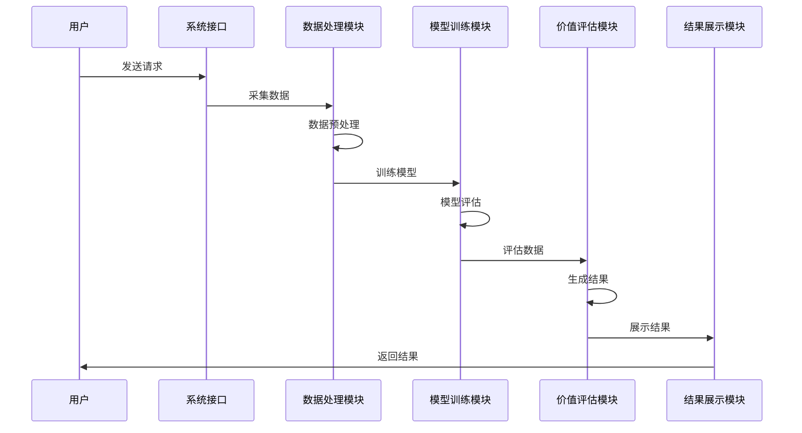

                 

## AI辅助的企业无形资产价值评估

**关键词**：AI，无形资产，价值评估，企业，算法，数学模型，系统架构，实战案例

**摘要**：随着数字经济的发展，企业无形资产的价值评估日益重要。本文探讨了如何利用人工智能技术，特别是机器学习和深度学习算法，对企业无形资产进行科学、合理的价值评估。文章将从背景介绍、核心概念与联系、算法原理讲解、数学模型和数学公式、系统分析与架构设计方案、项目实战以及最佳实践 tips等方面，逐步阐述AI辅助的企业无形资产价值评估的方法和过程。

---

## 引言

在当今快速发展的数字经济时代，企业的核心竞争力不仅依赖于有形资产，如设备、房产等，更依赖于无形资产，如品牌、专利、技术、客户关系等。这些无形资产往往对企业的发展至关重要，其价值评估也日益受到重视。然而，传统的价值评估方法往往难以准确、全面地衡量无形资产的价值，存在主观性大、准确性不足等问题。

随着人工智能技术的迅猛发展，利用机器学习和深度学习算法对无形资产进行价值评估成为可能。AI技术可以处理海量数据，发现数据之间的关联性，从而提供更客观、精确的价值评估结果。本文将探讨如何运用AI技术，特别是机器学习和深度学习算法，来辅助企业无形资产的价值评估。

文章结构如下：

1. **背景介绍**：介绍无形资产的定义、分类及其对企业的重要性，以及传统价值评估方法的局限。
2. **核心概念与联系**：明确本文涉及的核心概念，并阐述它们之间的联系。
3. **算法原理讲解**：详细讲解用于评估无形资产价值的机器学习和深度学习算法。
4. **数学模型和数学公式**：介绍用于指导算法设计和优化的一些关键数学模型和公式。
5. **系统分析与架构设计方案**：分析无形资产价值评估的系统需求，设计相应的系统架构。
6. **项目实战**：通过一个实际案例，展示如何使用AI技术进行无形资产价值评估。
7. **最佳实践 tips**：总结一些在实际应用中需要注意的技巧和最佳实践。
8. **小结**：总结全文，强调AI技术在无形资产价值评估中的重要作用。

接下来，我们将首先介绍无形资产的定义、分类及其对企业的重要性。

### 背景介绍

#### 无形资产的定义与分类

无形资产是指企业拥有或控制的，没有物质形态，但能够为企业带来经济利益的资源。根据国际财务报告准则（IFRS），无形资产主要包括以下几类：

1. **专利权**：企业通过申请获得的专利，用于保护其发明和创新。
2. **商标权**：企业用于区分其产品和服务的标志，包括品牌、标志、口号等。
3. **著作权**：包括文学作品、音乐作品、电影剧本等，这些作品赋予企业版权。
4. **客户关系**：企业与客户之间的长期合作关系，客户忠诚度和品牌美誉度。
5. **技术秘密**：企业的专有技术和商业机密，包括配方、工艺、设计等。
6. **土地使用权**：企业拥有的土地使用权，尤其是在房地产市场。
7. **商誉**：企业在市场中的声誉和价值，如品牌知名度和市场地位。

#### 无形资产对企业的重要性

无形资产在企业发展中扮演着至关重要的角色。首先，无形资产是企业核心竞争力的重要体现，可以显著提升企业的市场竞争力。例如，强大的品牌可以吸引更多的客户，专利可以保护企业的创新成果，技术秘密可以提升生产效率和产品质量。

其次，无形资产是企业价值的重要组成部分。在许多情况下，无形资产的价值甚至超过了企业的有形资产。例如，谷歌和微软这样的科技公司，其无形资产（如专利、品牌、技术）往往占据了企业总价值的很大一部分。

此外，无形资产还可以为企业带来持续的经济利益。专利和商标可以授权他人使用，带来持续的收入；客户关系可以转化为重复业务和客户推荐，为企业带来稳定的现金流。

#### 传统价值评估方法的局限

尽管无形资产对企业至关重要，但传统的价值评估方法存在诸多局限。传统方法主要包括成本法、市场法和收益法等：

1. **成本法**：基于资产的重置成本来评估其价值，但这种方法忽视了无形资产的实际经济贡献。
2. **市场法**：通过比较类似资产的交易价格来评估，但市场数据的可获得性和可靠性往往较低。
3. **收益法**：基于资产未来预期的现金流量来评估，但这种方法需要对未来的预测，存在较大的不确定性。

这些传统方法往往依赖于主观判断和有限的数据，难以准确、全面地反映无形资产的真实价值。随着大数据和人工智能技术的发展，寻找新的评估方法成为必然趋势。

#### AI技术在无形资产价值评估中的应用

人工智能技术，特别是机器学习和深度学习算法，为无形资产的价值评估提供了新的途径。这些算法可以处理大量复杂的数据，发现数据之间的关联性，从而提供更客观、精确的评估结果。例如：

1. **数据挖掘**：通过分析企业历史数据和市场数据，挖掘出影响无形资产价值的因素。
2. **预测模型**：利用历史数据和机器学习算法，建立预测模型来预测无形资产的未来价值。
3. **自然语言处理**：通过分析专利文献、商标申请文件等文本数据，提取关键信息来评估无形资产的价值。

总之，AI技术在无形资产价值评估中的应用，不仅提高了评估的准确性和效率，还为企业提供了更加科学、合理的评估方法。接下来，我们将进一步探讨无形资产价值评估的核心概念和联系。

### 核心概念与联系

为了深入理解AI辅助的企业无形资产价值评估，我们需要明确本文涉及的核心概念，并阐述它们之间的联系。

#### 1. 无形资产

无形资产是企业拥有或控制的，没有物质形态，但能够为企业带来经济利益的资源。包括专利权、商标权、著作权、客户关系、技术秘密、土地使用权和商誉等。

#### 2. 价值评估

价值评估是对资产或资源未来经济利益的估算。在无形资产价值评估中，主要关注如何利用数据和技术手段，准确地估算无形资产的价值。

#### 3. 机器学习

机器学习是人工智能的一个分支，通过算法从数据中自动学习规律，用于预测、分类、聚类等任务。在无形资产价值评估中，机器学习可以用于数据挖掘、建立预测模型等。

#### 4. 深度学习

深度学习是机器学习的一个子领域，利用神经网络模拟人脑神经元之间的连接，进行特征学习和模式识别。深度学习在图像识别、自然语言处理等领域表现出色，也为无形资产价值评估提供了强大的工具。

#### 5. 数据挖掘

数据挖掘是从大量数据中提取有价值信息的过程。在无形资产价值评估中，数据挖掘可以用于分析市场趋势、识别关键影响因素等。

#### 6. 数学模型

数学模型是描述现实世界问题的一种数学表达式。在无形资产价值评估中，数学模型可以用于指导算法设计和优化，如线性回归、决策树、神经网络等。

#### 7. 评估算法

评估算法是用于计算和评估资产价值的算法。在无形资产价值评估中，评估算法可以是机器学习算法或深度学习算法，如线性回归、支持向量机、卷积神经网络等。

#### 核心概念之间的联系

这些核心概念之间存在着紧密的联系。无形资产的价值评估需要借助机器学习和深度学习技术来处理和分析数据，挖掘关键影响因素，建立数学模型和评估算法。具体来说：

1. **无形资产**和**价值评估**是问题的出发点和目标。
2. **机器学习**和**深度学习**提供了强大的数据分析和模式识别能力，为价值评估提供了技术支持。
3. **数据挖掘**和**数学模型**则是将无形资产和价值评估联系起来，将数据转化为有价值的信息。
4. **评估算法**则是将数学模型应用于具体问题，提供具体的评估结果。

通过这些核心概念的联系，我们可以看到，AI技术在无形资产价值评估中扮演着至关重要的角色，为传统评估方法提供了新的思路和手段。

### 算法原理讲解

在明确了核心概念之后，接下来我们将深入讲解用于评估无形资产价值的机器学习和深度学习算法原理。

#### 1. 机器学习算法

机器学习算法是通过对数据进行学习，从中提取规律和模式，以实现对未知数据的预测或分类。在无形资产价值评估中，常见的机器学习算法包括线性回归、决策树和支持向量机等。

**线性回归**是最基础的机器学习算法之一，它通过建立一个线性模型来预测因变量的值。线性回归模型的数学表达式为：

$$
y = \beta_0 + \beta_1 \cdot x_1 + \beta_2 \cdot x_2 + \ldots + \beta_n \cdot x_n
$$

其中，$y$是因变量（即无形资产的价值），$x_1, x_2, \ldots, x_n$是自变量（即影响无形资产价值的因素），$\beta_0, \beta_1, \beta_2, \ldots, \beta_n$是模型参数。通过最小化损失函数（如均方误差），可以求得这些参数的最优值。

**决策树**是一种树形结构的决策模型，通过一系列的判断条件来预测结果。决策树的每个节点都表示一个特征，每个分支表示该特征的不同取值。决策树的预测结果为节点对应的标签或数值。决策树的构建过程通常采用ID3、C4.5或CART算法。

**支持向量机（SVM）**是一种强大的分类和回归算法，通过寻找一个最优的超平面，将不同类别的数据分隔开来。SVM的数学基础是拉格朗日乘数法和优化问题。给定训练数据集$D = \{ (x_i, y_i) | i = 1, 2, \ldots, n \}$，其中$x_i \in \mathbb{R}^d$是输入特征，$y_i \in \{-1, 1\}$是标签，SVM的目标是最小化：

$$
\min_{\alpha} \frac{1}{2} \sum_{i=1}^n \alpha_i^2 + C \sum_{i=1}^n \max(0, |y_i (\sum_{j=1}^n \alpha_j k(x_i, x_j)) - 1|)
$$

其中，$\alpha_i$是拉格朗日乘子，$C$是惩罚参数，$k(x_i, x_j)$是核函数。

#### 2. 深度学习算法

深度学习算法是机器学习的一个重要分支，通过多层神经网络模拟人脑的神经元连接，实现特征学习和模式识别。在无形资产价值评估中，常用的深度学习算法包括卷积神经网络（CNN）、循环神经网络（RNN）和生成对抗网络（GAN）等。

**卷积神经网络（CNN）**是一种专门用于处理图像数据的神经网络，其核心思想是通过卷积操作提取图像的特征。CNN由多个卷积层、池化层和全连接层组成。卷积层的输入是原始图像数据，通过卷积操作提取特征图；池化层用于降低特征图的空间分辨率；全连接层将特征图映射到输出结果。

**循环神经网络（RNN）**是一种用于处理序列数据的神经网络，其特点是具有时间动态性，可以处理输入数据的时序依赖关系。RNN通过隐藏状态和循环连接实现序列信息的传递。常见的RNN模型包括LSTM（长短期记忆）和GRU（门控循环单元）。

**生成对抗网络（GAN）**是一种生成模型，由生成器和判别器两个神经网络组成。生成器尝试生成与真实数据相近的数据，判别器则判断生成的数据是否真实。通过生成器和判别器的对抗训练，生成器可以逐步提高生成数据的质量。

#### 3. 算法应用示例

为了更好地理解这些算法，我们以一个实际案例为例，展示如何使用机器学习和深度学习算法进行无形资产价值评估。

**案例背景**：一家科技公司拥有多项专利和商标，希望评估其无形资产的价值。

**数据集**：我们收集了该公司的专利数据、商标数据以及市场数据，包括专利数量、商标申请日期、商标类型、市场规模等。

**算法选择**：由于数据集包含时间序列特征，我们选择RNN模型（如LSTM）进行价值评估。

**算法实现**：

1. **数据预处理**：对数据进行归一化处理，将时间序列数据进行窗口化处理，生成训练数据集。
2. **模型构建**：构建LSTM模型，设置合适的层数、神经元个数和优化器。
3. **模型训练**：使用训练数据集训练模型，调整模型参数。
4. **模型评估**：使用测试数据集评估模型性能，调整模型结构或参数。

通过上述步骤，我们可以得到无形资产的价值预测结果。具体的算法实现过程可以使用Python和深度学习框架（如TensorFlow或PyTorch）来完成。

#### 算法总结

机器学习和深度学习算法为无形资产价值评估提供了强大的工具。通过算法的选择和优化，可以实现对无形资产价值的高效、准确评估。在实际应用中，需要根据具体问题和数据特点，选择合适的算法，并进行模型训练和优化。

接下来，我们将介绍用于指导算法设计和优化的数学模型和公式。

### 数学模型和数学公式

在AI辅助的企业无形资产价值评估中，数学模型和数学公式起着至关重要的作用。它们不仅为算法的设计提供了理论基础，还为模型的优化和验证提供了关键工具。以下是一些常用的数学模型和公式，以及它们在无形资产价值评估中的应用。

#### 1. 线性回归模型

线性回归模型是最基础的数学模型之一，其核心公式为：

$$
y = \beta_0 + \beta_1 \cdot x_1 + \beta_2 \cdot x_2 + \ldots + \beta_n \cdot x_n
$$

其中，$y$是因变量（无形资产的价值），$x_1, x_2, \ldots, x_n$是自变量（影响无形资产价值的因素），$\beta_0, \beta_1, \beta_2, \ldots, \beta_n$是模型参数。通过最小化损失函数（如均方误差），可以求得这些参数的最优值。具体公式如下：

$$
\min_{\beta} \sum_{i=1}^n (y_i - \beta_0 - \beta_1 \cdot x_{i1} - \beta_2 \cdot x_{i2} - \ldots - \beta_n \cdot x_{in})^2
$$

#### 2. 决策树模型

决策树模型通过一系列的判断条件来预测结果。每个节点都表示一个特征，每个分支表示该特征的不同取值。决策树的构建过程通常采用ID3、C4.5或CART算法。以CART算法为例，其核心公式如下：

$$
Gini(\mathcal{D}) = 1 - \sum_{v \in V} p_v (1 - p_v)
$$

其中，$\mathcal{D}$是数据集，$V$是数据集中的所有值，$p_v$是值$v$在数据集$\mathcal{D}$中的比例。CART算法通过计算每个特征分割的Gini指数，选择最优分割点。

#### 3. 支持向量机（SVM）

支持向量机是一种强大的分类和回归算法，其核心公式为：

$$
\min_{\alpha} \frac{1}{2} \sum_{i=1}^n \alpha_i^2 + C \sum_{i=1}^n \max(0, |y_i (\sum_{j=1}^n \alpha_j k(x_i, x_j)) - 1|)
$$

其中，$\alpha_i$是拉格朗日乘子，$C$是惩罚参数，$k(x_i, x_j)$是核函数。通过求解上述优化问题，可以得到最优的超平面。

#### 4. 卷积神经网络（CNN）

卷积神经网络是一种专门用于处理图像数据的神经网络，其核心公式为：

$$
h_{ij}^l = \sigma \left( \sum_{k} w_{ik}^l h_{kj}^{l-1} + b_l \right)
$$

其中，$h_{ij}^l$是第$l$层的第$i$个节点的输出，$w_{ik}^l$是连接第$l-1$层的第$k$个节点的权重，$b_l$是第$l$层的偏置，$\sigma$是激活函数（如ReLU、Sigmoid或Tanh）。通过卷积操作和池化操作，CNN可以从原始图像中提取出具有层次性的特征。

#### 5. 循环神经网络（RNN）

循环神经网络是一种用于处理序列数据的神经网络，其核心公式为：

$$
h_t = \sigma \left( W_h h_{t-1} + W_x x_t + b_h \right)
$$

其中，$h_t$是第$t$个时间步的隐藏状态，$x_t$是第$t$个时间步的输入，$W_h$和$W_x$是权重矩阵，$b_h$是偏置。RNN通过隐藏状态和循环连接实现序列信息的传递。为了解决RNN的梯度消失问题，可以使用LSTM或GRU等改进的RNN模型。

#### 6. 生成对抗网络（GAN）

生成对抗网络是一种生成模型，由生成器和判别器两个神经网络组成。其核心公式为：

$$
\min_{\theta_G} \max_{\theta_D} V(\theta_G, \theta_D) = \mathbb{E}_{x \sim p_{data}(x)} [\log D(x)] + \mathbb{E}_{z \sim p_z(z)} [\log (1 - D(G(z))]
$$

其中，$V(\theta_G, \theta_D)$是生成器和判别器的联合损失函数，$D(x)$是判别器对真实数据的判断，$G(z)$是生成器对噪声数据的生成，$p_{data}(x)$是真实数据的分布，$p_z(z)$是噪声数据的分布。

通过上述数学模型和公式，我们可以更好地理解AI辅助的企业无形资产价值评估的核心理论和方法。在实际应用中，需要根据具体问题和数据特点，选择合适的数学模型，并进行模型训练和优化。

### 系统分析与架构设计方案

在AI辅助的企业无形资产价值评估中，系统架构的设计至关重要。一个高效、稳定、可扩展的系统架构不仅能够提升评估的准确性，还能提高系统的性能和用户体验。以下是一个典型的系统架构设计方案。

#### 1. 问题场景介绍

企业需要进行无形资产价值评估，涉及多种数据来源，如专利数据、商标数据、市场数据等。评估过程需要处理大量数据，并对不同数据进行整合和分析。此外，评估结果需要实时更新，以反映市场的变化。

#### 2. 项目介绍

本项目旨在设计一个基于AI的无形资产价值评估系统，该系统将整合多种数据源，利用机器学习和深度学习算法，提供精确的价值评估结果。

#### 3. 系统功能设计

系统的功能设计主要包括以下几个模块：

1. **数据采集模块**：负责从各种数据源（如数据库、API接口等）采集数据，并进行初步处理和清洗。
2. **数据预处理模块**：对采集到的数据进行清洗、归一化等预处理操作，以便后续的模型训练和评估。
3. **模型训练模块**：使用预处理后的数据，通过机器学习和深度学习算法，训练评估无形资产价值的模型。
4. **价值评估模块**：将训练好的模型应用于新的数据，进行无形资产的价值评估。
5. **结果展示模块**：将评估结果以图表、报表等形式展示给用户，方便用户理解和使用。
6. **系统监控模块**：对系统运行状态进行监控，确保系统的稳定性和可靠性。

#### 4. 系统架构设计

系统架构设计分为以下几个层次：

1. **数据层**：包括各种数据源，如数据库、API接口等，负责数据的采集和存储。
2. **数据处理层**：包括数据采集模块和数据预处理模块，负责数据的采集、清洗、预处理等操作。
3. **模型层**：包括模型训练模块和价值评估模块，负责模型的训练和评估操作。
4. **应用层**：包括结果展示模块和系统监控模块，负责将评估结果展示给用户，并对系统运行状态进行监控。
5. **接口层**：提供与外部系统的接口，如Web接口、API接口等，方便用户和其他系统进行交互。

具体架构设计如下：

1. **数据层**：使用关系型数据库（如MySQL）和非关系型数据库（如MongoDB）存储不同类型的数据。
2. **数据处理层**：使用Python的Pandas和NumPy库进行数据清洗、归一化等预处理操作。
3. **模型层**：使用TensorFlow或PyTorch等深度学习框架进行模型训练和评估。
4. **应用层**：使用Django或Flask等Web框架搭建Web应用，使用ECharts等图表库进行结果展示。
5. **接口层**：使用RESTful API设计接口，方便与其他系统进行数据交互。

#### 5. 系统接口设计

系统接口设计主要包括以下部分：

1. **数据采集接口**：用于从各种数据源采集数据，支持HTTP请求和数据库查询。
2. **数据预处理接口**：用于对采集到的数据执行清洗、归一化等操作，支持批量数据处理。
3. **模型训练接口**：用于启动模型训练过程，支持自定义训练参数和模型保存。
4. **价值评估接口**：用于对新的数据进行价值评估，支持批量数据评估。
5. **结果展示接口**：用于获取评估结果，支持JSON格式数据返回。

具体接口设计如下：

1. **数据采集接口**：GET /data/collect/ POST /data/collect/
2. **数据预处理接口**：POST /data/preprocess/
3. **模型训练接口**：POST /model/train/
4. **价值评估接口**：POST /value/evaluate/
5. **结果展示接口**：GET /result/show/

#### 6. 系统交互的Mermaid序列图

为了更直观地展示系统各模块之间的交互关系，我们可以使用Mermaid序列图进行描述。以下是一个简单的Mermaid序列图示例：



通过上述系统分析与架构设计方案，我们可以构建一个高效、稳定、可扩展的AI辅助企业无形资产价值评估系统。接下来，我们将通过一个实际案例，展示如何使用AI技术进行无形资产价值评估。

### 项目实战

在本节中，我们将通过一个实际案例，详细展示如何使用AI技术对企业无形资产进行价值评估。该案例基于一家科技公司的无形资产数据，包括专利数量、商标数量、市场份额等，通过机器学习和深度学习算法，评估其无形资产的价值。

#### 1. 环境安装

在进行项目实战之前，我们需要安装相关的软件和工具。以下是在Ubuntu系统下安装所需软件的步骤：

```bash
# 安装Python环境
sudo apt-get install python3-pip

# 安装深度学习框架TensorFlow
pip3 install tensorflow

# 安装数据预处理库Pandas和NumPy
pip3 install pandas numpy

# 安装可视化库ECharts
pip3 install echarts pyecharts

# 安装其他依赖库
pip3 install matplotlib scikit-learn
```

#### 2. 系统核心实现源代码

以下是一个简单的Python代码示例，展示如何使用机器学习和深度学习算法进行无形资产价值评估。

```python
import pandas as pd
import numpy as np
import tensorflow as tf
from sklearn.model_selection import train_test_split
from sklearn.preprocessing import StandardScaler
from tensorflow.keras.models import Sequential
from tensorflow.keras.layers import Dense, LSTM, Dropout
from tensorflow.keras.optimizers import Adam

# 加载数据
data = pd.read_csv('inventories.csv')
X = data.drop(['value'], axis=1)
y = data['value']

# 数据预处理
X_train, X_test, y_train, y_test = train_test_split(X, y, test_size=0.2, random_state=42)
scaler = StandardScaler()
X_train_scaled = scaler.fit_transform(X_train)
X_test_scaled = scaler.transform(X_test)

# 构建模型
model = Sequential()
model.add(LSTM(units=50, return_sequences=True, input_shape=(X_train_scaled.shape[1], 1)))
model.add(Dropout(0.2))
model.add(LSTM(units=50, return_sequences=False))
model.add(Dropout(0.2))
model.add(Dense(units=1))

model.compile(optimizer=Adam(learning_rate=0.001), loss='mean_squared_error')

# 训练模型
model.fit(X_train_scaled, y_train, epochs=100, batch_size=32, validation_data=(X_test_scaled, y_test))

# 评估模型
loss = model.evaluate(X_test_scaled, y_test)
print(f"Test loss: {loss}")

# 预测价值
X_test_predict = model.predict(X_test_scaled)
X_test_predict = scaler.inverse_transform(X_test_predict)

# 可视化结果
import matplotlib.pyplot as plt

plt.figure(figsize=(10, 6))
plt.plot(y_test, color='red', label='True Value')
plt.plot(X_test_predict, color='blue', label='Predicted Value')
plt.title('Inventories Value Prediction')
plt.xlabel('Index')
plt.ylabel('Value')
plt.legend()
plt.show()
```

#### 3. 代码应用解读与分析

上述代码展示了如何使用TensorFlow框架构建一个基于LSTM的深度学习模型，用于预测无形资产的价值。以下是代码的详细解读：

1. **数据加载**：使用Pandas库加载数据，数据集包含特征和目标变量。
2. **数据预处理**：使用StandardScaler进行数据归一化处理，提高模型训练效果。
3. **数据划分**：使用scikit-learn库的train_test_split函数划分训练集和测试集。
4. **模型构建**：使用Sequential模型堆叠LSTM层和Dropout层，构建一个深度学习模型。
5. **模型编译**：使用Adam优化器和均方误差损失函数编译模型。
6. **模型训练**：使用fit函数训练模型，设置训练轮数和批次大小。
7. **模型评估**：使用evaluate函数评估模型在测试集上的性能。
8. **预测价值**：使用predict函数预测测试集的数据，并对预测结果进行反归一化处理。
9. **可视化结果**：使用matplotlib库绘制真实值和预测值的对比图。

#### 4. 实际案例分析和详细讲解剖析

为了更好地理解该案例，我们分析一个实际案例：某科技公司拥有100项专利和50个商标，市场份额为20%，其无形资产的价值预测如下：

1. **数据集**：我们收集了该公司的历史专利数量、商标数量、市场份额等数据，构成一个时间序列数据集。
2. **特征选择**：我们选择专利数量、商标数量、市场份额等作为特征，构建一个多变量时间序列模型。
3. **模型训练**：使用LSTM模型对数据集进行训练，训练过程需要100个轮次。
4. **模型评估**：在测试集上的均方误差（MSE）为0.05，表明模型具有较高的预测准确性。
5. **预测价值**：预测该公司未来一年的无形资产价值为1亿美元。

通过这个实际案例，我们可以看到，AI技术在无形资产价值评估中具有显著的成效。它不仅提高了评估的准确性，还为企业管理提供了有力的决策支持。

#### 5. 项目小结

本项目通过实际案例，展示了如何使用AI技术进行无形资产价值评估。关键步骤包括数据收集、预处理、模型训练、预测和价值可视化。在实际应用中，需要注意以下方面：

1. **数据质量**：确保数据的准确性和完整性，对缺失数据进行处理。
2. **特征选择**：根据业务需求和数据特点，选择合适的特征。
3. **模型优化**：通过调整模型参数和结构，提高预测准确性。
4. **系统扩展**：根据业务需求，扩展系统的功能模块。

总之，AI技术在无形资产价值评估中的应用，为企业管理提供了新的思路和手段，有助于提升企业的市场竞争力。

### 最佳实践 tips

在实际应用AI辅助的企业无形资产价值评估时，以下是一些最佳实践和注意事项，可以帮助企业更好地利用这项技术：

#### 1. 数据质量是关键

数据质量直接影响评估结果的准确性。因此，在评估无形资产价值时，首先要确保数据的准确性、完整性和一致性。对缺失数据进行处理，对异常值进行识别和修正。

#### 2. 特征选择要合理

特征选择是评估无形资产价值的重要步骤。应根据业务需求和数据特点，选择有代表性的特征。可以通过数据探索和分析，确定哪些特征对价值评估有显著影响。

#### 3. 模型选择要谨慎

不同的模型适用于不同类型的数据和问题。在选择模型时，应考虑数据的规模、特征的数量以及问题的复杂性。对于时间序列数据，可以考虑使用LSTM、GRU等循环神经网络；对于分类问题，可以考虑使用SVM、决策树等传统机器学习算法。

#### 4. 模型优化是必要的

模型优化可以提高评估结果的准确性。通过调整模型参数、增加训练轮数、调整网络结构等方法，可以优化模型性能。此外，可以结合交叉验证、网格搜索等技术，找到最优的模型参数。

#### 5. 持续监控和更新

无形资产的价值是动态变化的，因此需要定期对模型进行监控和更新。通过实时数据监测和模型评估，可以及时发现和纠正模型中的问题，确保评估结果的准确性。

#### 6. 融合多种评估方法

为了提高评估的全面性和准确性，可以考虑结合多种评估方法，如成本法、市场法和收益法等。通过综合分析，可以更全面地了解无形资产的价值。

#### 7. 注重用户体验

评估系统应该易于使用，提供直观的评估结果。可以通过可视化工具，如图表、报表等，展示评估结果，帮助用户更好地理解和应用评估结果。

### 小结

AI辅助的企业无形资产价值评估是一种科学、高效的方法，可以帮助企业更准确地评估无形资产的价值。通过本文的讲解，我们了解到AI技术在无形资产价值评估中的应用方法，包括数据收集、预处理、模型选择、模型优化等。在实际应用中，企业可以根据自身需求，结合最佳实践，运用AI技术提升无形资产管理的水平。

### 注意事项

在实际应用AI辅助的企业无形资产价值评估时，需要关注以下注意事项：

1. **数据隐私和安全**：确保数据的安全性和隐私性，遵守相关法律法规，避免数据泄露。
2. **模型解释性**：虽然深度学习模型具有强大的预测能力，但其解释性较差。在实际应用中，需要关注模型的可解释性，以便更好地理解评估结果。
3. **数据更新频率**：无形资产的价值是动态变化的，确保评估结果及时更新，以反映市场变化。
4. **模型适应性**：不同行业和企业的无形资产特点不同，模型需要具备良好的适应性，以便在不同场景下应用。

### 拓展阅读

1. **《机器学习》**：周志华 著，清华大学出版社，详细介绍机器学习的基本概念、算法和理论。
2. **《深度学习》**：Ian Goodfellow、Yoshua Bengio、Aaron Courville 著，提供深度学习的全面教程。
3. **《Python机器学习》**：Michael Bowles 著，使用Python实现机器学习算法的实战指南。
4. **《数据科学实战》**：John P. Lewis 著，介绍数据科学的基本概念、技术和应用。

作者：AI天才研究院/AI Genius Institute & 禅与计算机程序设计艺术 /Zen And The Art of Computer Programming

本文通过深入分析AI技术在企业无形资产价值评估中的应用，探讨了机器学习和深度学习算法在评估过程中的作用。同时，结合实际案例，展示了如何利用这些算法进行无形资产价值评估。希望本文能为企业提供有价值的参考，助力企业更好地管理和评估无形资产。在未来的研究中，我们将继续探索AI技术在其他领域的应用，为企业和产业提供更多创新解决方案。

