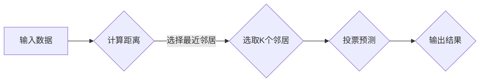
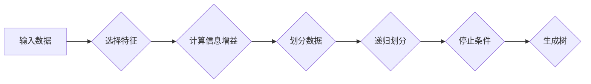
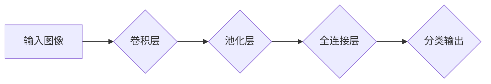
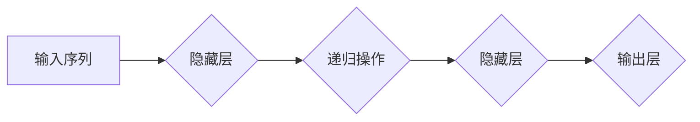
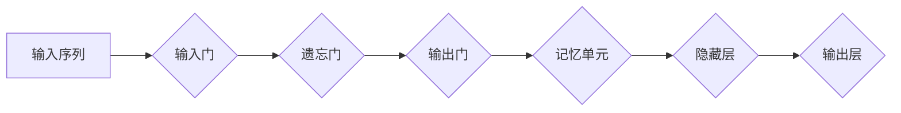
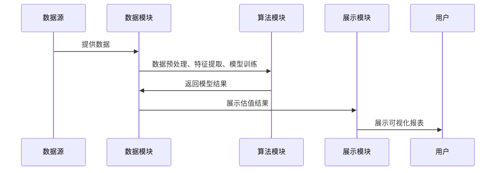

                 

# AI辅助的企业无形资产估值模型

## 关键词

- AI
- 企业无形资产
- 估值模型
- 数据挖掘
- 机器学习
- 深度学习

## 摘要

本文旨在探讨人工智能（AI）技术在企业无形资产估值中的应用。随着企业竞争的加剧，无形资产如品牌、专利、客户关系等的重要性日益凸显。然而，传统估值方法面临诸多挑战。本文首先介绍了无形资产及其估值的背景，随后详细阐述了AI技术，包括数据挖掘、机器学习和深度学习等核心概念，并分析了AI在无形资产估值中的优势与局限。在此基础上，本文提出了一个基于AI技术的无形资产估值模型，包括算法原理、数学模型、系统设计与实现，并通过项目实战验证了模型的实际效果。最后，本文提出了最佳实践、未来研究方向及注意事项，为AI辅助企业无形资产估值提供了指导。

## 目录大纲

### 第一部分：引言

#### 第1章：AI与无形资产估值概述

1.1 问题背景  
1.2 无形资产概述  
1.3 AI技术概述  
1.4 AI与无形资产估值的关系

#### 第2章：核心概念与联系

2.1 AI辅助无形资产估值的核心概念  
2.2 核心概念属性特征对比表格  
2.3 ER实体关系图架构

### 第二部分：算法原理与数学模型

#### 第3章：算法原理讲解

3.1 数据预处理  
3.2 机器学习算法  
3.3 深度学习算法  
3.4 算法流程图

#### 第4章：数学模型和公式讲解

4.1 机器学习数学模型  
4.2 深度学习数学模型  
4.3 数学公式举例

### 第三部分：系统设计与实现

#### 第5章：系统分析与架构设计方案

5.1 问题场景介绍  
5.2 系统功能设计  
5.3 系统架构设计  
5.4 系tem接口设计

#### 第6章：项目实战

6.1 环境安装  
6.2 系统核心实现源代码  
6.3 代码应用解读与分析  
6.4 实际案例分析与详细讲解剖析  
6.5 项目小结

### 第四部分：最佳实践与拓展

#### 第7章：最佳实践 tips

#### 第8章：小结

#### 第9章：注意事项

#### 第10章：拓展阅读

---

## 第1章：AI与无形资产估值概述

### 1.1 问题背景

在当今经济全球化和信息化浪潮下，企业的无形资产如品牌、专利、客户关系、企业文化等已成为企业核心竞争力的重要组成部分。无形资产估值对于企业并购、投资决策、财务报表编制等具有重要意义。然而，传统估值方法往往基于历史数据和主观判断，存在如下挑战：

1. **数据获取困难**：无形资产通常缺乏明确、可量化的数据支持，导致估值过程难以准确。
2. **主观判断影响**：估值过程中，专家的主观判断和偏见难以避免，影响估值结果的客观性。
3. **估值方法单一**：传统估值方法如成本法、市场法、收益法等，难以全面反映无形资产的价值。

### 1.2 无形资产概述

无形资产是指企业拥有或控制的，没有实物形态，不能直接作为商品进行交易的资产。根据资产性质和特点，无形资产可以分为以下几类：

1. **知识产权**：如专利、商标、著作权等，是企业创新成果的重要体现。
2. **商业秘密**：包括技术秘密、经营策略、客户信息等，是企业竞争优势的源泉。
3. **合同权利**：如长期租赁合同、特许经营权等，具有法律效力，能够为企业带来持续收益。
4. **人力资源**：企业员工的知识、技能和经验，对企业运营和发展具有重要影响。

无形资产评估意义在于：

1. **企业价值评估**：为企业的整体价值提供更为准确的参考，有助于企业并购、融资等。
2. **财务报表编制**：无形资产估值结果可以纳入企业财务报表，提高报表的准确性和透明度。
3. **投资决策**：有助于投资者评估企业潜在收益，做出更明智的投资决策。

### 1.3 AI技术概述

人工智能（AI）是指通过计算机模拟人类智能行为的技术。根据实现方式和能力，AI可以分为以下几类：

1. **机器学习（ML）**：通过数据训练，使计算机自动学习并改进性能。
2. **深度学习（DL）**：基于多层神经网络，模拟人脑处理信息的过程。
3. **自然语言处理（NLP）**：使计算机理解和生成自然语言。
4. **计算机视觉（CV）**：使计算机能够理解和处理图像和视频。

AI技术的发展历程可以追溯到20世纪50年代，经历了几个重要阶段：

1. **符号主义阶段**：基于逻辑推理和知识表示，但受限于计算能力和数据规模。
2. **连接主义阶段**：基于神经网络，通过大量数据训练，实现了一定的智能应用。
3. **强化学习阶段**：基于奖励机制，使计算机能够自主学习和优化策略。
4. **混合智能阶段**：结合多种AI技术，实现更高效、更智能的应用。

AI技术的主要应用领域包括：

1. **智能制造**：通过自动化和智能化，提高生产效率和产品质量。
2. **智能交通**：通过实时监控和智能调度，优化交通流量和管理。
3. **医疗健康**：通过数据分析和智能诊断，提高医疗服务的质量和效率。
4. **金融科技**：通过智能投顾和风险管理，优化金融服务和投资策略。

### 1.4 AI与无形资产估值的关系

AI技术在无形资产估值中的应用主要体现在以下几个方面：

1. **数据挖掘与特征提取**：通过大数据技术和机器学习算法，从海量数据中挖掘出有价值的信息，为无形资产估值提供数据支持。
2. **自动化评估**：利用深度学习和神经网络等技术，实现自动化的评估过程，提高评估效率和准确性。
3. **专家系统**：通过构建知识库和推理机制，模拟专家经验，为无形资产估值提供辅助决策。
4. **预测分析**：利用时间序列分析和回归分析等技术，预测无形资产未来的价值趋势，为投资决策提供参考。

AI技术在无形资产估值中的优势包括：

1. **数据驱动的评估**：通过海量数据训练，实现更客观、准确的估值结果。
2. **自动化与高效性**：减少人工干预，提高评估效率和速度。
3. **多维度分析**：结合不同数据源，进行多维度分析，提供更全面的估值结果。

然而，AI技术在无形资产估值中也存在一些局限：

1. **数据质量和完整性**：无形资产数据通常存在不完整、不准确等问题，影响评估结果。
2. **模型泛化能力**：AI模型在面对未知数据时，可能存在泛化能力不足的问题，导致评估结果不准确。
3. **伦理和隐私问题**：无形资产估值涉及大量敏感数据，需要关注数据隐私和伦理问题。

## 第2章：核心概念与联系

### 2.1 AI辅助无形资产估值的核心概念

AI辅助无形资产估值涉及多个核心概念，包括数据挖掘、机器学习、深度学习、神经网络等。以下是对这些概念的基本介绍和联系。

#### 数据挖掘

数据挖掘是指从大量数据中提取有价值信息的过程。在无形资产估值中，数据挖掘可以帮助我们识别和提取与无形资产相关的数据，如专利信息、市场数据、客户反馈等。数据挖掘技术包括关联规则挖掘、分类、聚类、异常检测等。

#### 机器学习

机器学习是使计算机通过数据学习并改进性能的一种方法。在无形资产估值中，机器学习可以用于建立预测模型，如通过历史数据预测无形资产的未来价值。机器学习技术包括监督学习、无监督学习、半监督学习和强化学习等。

#### 深度学习

深度学习是一种基于多层神经网络的机器学习方法。它在处理大规模数据、复杂模式识别等方面具有显著优势。在无形资产估值中，深度学习可以用于图像识别、文本分析、语音识别等，从而提高评估的准确性和效率。

#### 神经网络

神经网络是模仿人脑结构和功能的一种计算模型。它由大量简单神经元组成，通过前向传播和反向传播进行训练。在无形资产估值中，神经网络可以用于建立估值模型，通过输入数据（如专利数量、市场占有率等）预测无形资产的价值。

### 2.2 核心概念属性特征对比表格

以下是一个关于数据挖掘、机器学习、深度学习和神经网络的属性特征对比表格：

| 概念 | 特征 |
| --- | --- |
| 数据挖掘 | - 从大量数据中提取信息<br>- 关联规则挖掘、分类、聚类、异常检测 |
| 机器学习 | - 数据驱动的学习<br>- 监督学习、无监督学习、半监督学习、强化学习 |
| 深度学习 | - 基于多层神经网络的机器学习方法<br>- 图像识别、文本分析、语音识别 |
| 神经网络 | - 模仿人脑结构和功能<br>- 前向传播、反向传播 |

### 2.3 ER实体关系图架构

为了更好地理解AI辅助无形资产估值中的核心概念，我们可以使用ER（实体-关系）图来表示实体及其关系。以下是一个简化的ER图，展示了数据挖掘、机器学习、深度学习和神经网络之间的关系：

```mermaid
erDiagram
    DataMining ||--|{ MachineLearning } : 数据驱动
    MachineLearning ||--|{ DeepLearning } : 多层网络
    MachineLearning ||--|{ NeuralNetwork } : 结构仿生
    DeepLearning ||--|{ NeuralNetwork } : 模式识别
```

在这个ER图中，DataMining（数据挖掘）作为基础，通过数据驱动机器学习（MachineLearning）。机器学习进一步发展到深度学习（DeepLearning），同时与神经网络（NeuralNetwork）紧密相关，用于模式识别和复杂问题求解。

## 第3章：算法原理讲解

### 3.1 数据预处理

在AI辅助的企业无形资产估值模型中，数据预处理是一个关键步骤。数据预处理主要包括数据清洗、数据归一化和特征提取。

#### 数据清洗

数据清洗是指处理数据中的噪声、错误和异常值，以提高数据质量和准确性。常见的清洗方法包括：

1. **缺失值处理**：对于缺失的数据，可以选择填充平均值、中位数或使用插值法。
2. **异常值处理**：检测并处理异常数据，如使用统计方法、可视化方法等。
3. **重复数据删除**：去除重复的数据记录，以提高数据的唯一性和准确性。

#### 数据归一化

数据归一化是指将不同量纲的数据转换到相同的量纲，以便于后续的建模和分析。常用的归一化方法包括：

1. **最小-最大归一化**：将数据缩放到[0, 1]范围内，公式为：\[x' = \frac{x - x_{\text{min}}}{x_{\text{max}} - x_{\text{min}}}\]
2. **均值-方差归一化**：将数据缩放到均值附近，公式为：\[x' = \frac{x - \mu}{\sigma}\]

#### 特征提取

特征提取是指从原始数据中提取出有用的特征，以提高模型的性能和泛化能力。常用的特征提取方法包括：

1. **主成分分析（PCA）**：通过降维，将高维数据映射到低维空间，减少数据的冗余。
2. **词袋模型（Bag-of-Words）**：将文本数据转换为词汇表，用于文本分类和情感分析。
3. **特征选择**：通过评估特征的重要性，选择最相关的特征，减少特征数量，提高模型性能。

### 3.2 机器学习算法

机器学习算法是AI辅助无形资产估值模型的核心，用于建立预测模型。常见的机器学习算法包括K最近邻（K-NN）、决策树和支撑向量机（SVM）。

#### K最近邻（K-NN）

K最近邻算法是一种基于实例的学习方法，通过计算新数据与训练数据之间的距离，找到最近的K个邻居，并基于邻居的标签进行预测。算法步骤如下：

1. **距离计算**：计算新数据与训练数据之间的距离，如欧氏距离、曼哈顿距离等。
2. **邻居选择**：找到距离最近的K个邻居。
3. **投票预测**：根据邻居的标签进行投票，选取出现次数最多的标签作为预测结果。

#### 决策树

决策树是一种基于树形结构的学习算法，通过将数据集划分为若干个子集，并使用属性作为划分标准，最终生成一棵树。算法步骤如下：

1. **特征选择**：选择最优特征进行划分，通常使用信息增益、基尼指数等指标。
2. **划分数据**：根据最优特征，将数据集划分为若干个子集。
3. **递归划分**：对每个子集，重复上述步骤，直到满足停止条件（如最大深度、最小样本量等）。

#### 支撑向量机（SVM）

支撑向量机是一种二分类模型，通过找到一个最佳的超平面，将不同类别的数据点分开。算法步骤如下：

1. **特征空间映射**：将原始数据映射到高维空间，寻找最佳的超平面。
2. **求解最优超平面**：使用拉格朗日乘数法，求解最优超平面参数。
3. **分类预测**：对于新的数据点，计算其与超平面的距离，判断其属于哪个类别。

### 3.3 深度学习算法

深度学习算法是机器学习的一种扩展，通过多层神经网络来模拟人脑处理信息的过程。常见的深度学习算法包括卷积神经网络（CNN）、递归神经网络（RNN）和长短时记忆网络（LSTM）。

#### 卷积神经网络（CNN）

卷积神经网络是一种用于图像识别和处理的深度学习算法。它通过卷积层、池化层和全连接层等结构，实现图像的特征提取和分类。算法步骤如下：

1. **卷积层**：通过卷积操作提取图像局部特征。
2. **池化层**：通过下采样操作减少数据维度，提高模型性能。
3. **全连接层**：将卷积层和池化层提取的特征进行分类。

#### 递归神经网络（RNN）

递归神经网络是一种用于序列数据处理的深度学习算法，通过循环神经网络结构，实现序列的建模和预测。算法步骤如下：

1. **输入层**：输入序列数据。
2. **隐藏层**：通过递归操作，将前一个时间步的输出作为当前时间步的输入。
3. **输出层**：根据隐藏层输出，进行分类或回归预测。

#### 长短时记忆网络（LSTM）

长短时记忆网络是一种改进的递归神经网络，通过引入记忆单元，解决传统RNN在处理长序列数据时出现的长期依赖问题。算法步骤如下：

1. **输入门**：决定当前输入数据对记忆单元的更新程度。
2. **遗忘门**：决定记忆单元中旧信息的保留程度。
3. **输出门**：决定当前输出数据的生成程度。

### 3.4 算法流程图

为了更好地理解上述算法原理，我们可以使用Mermaid流程图来表示算法的步骤和流程。

#### K最近邻算法流程图



#### 决策树算法流程图



#### 卷积神经网络（CNN）流程图



#### 递归神经网络（RNN）流程图



#### 长短时记忆网络（LSTM）流程图



通过这些流程图，我们可以更直观地理解各种算法的原理和步骤，为后续的系统设计与实现奠定基础。

## 第4章：数学模型和公式讲解

### 4.1 机器学习数学模型

在机器学习中，数学模型是核心组成部分，用于描述输入和输出之间的关系。以下介绍两种常见的机器学习数学模型：线性回归模型和逻辑回归模型。

#### 线性回归模型

线性回归模型是一种简单且广泛使用的预测模型，用于预测连续值输出。其数学模型可以表示为：

\[y = \beta_0 + \beta_1 \cdot x\]

其中，\(y\) 是输出值，\(x\) 是输入特征，\(\beta_0\) 和 \(\beta_1\) 分别是模型的参数。

为了求解模型参数，我们通常使用最小二乘法（Least Squares Method），其目标是最小化预测值与真实值之间的误差平方和：

\[\min \sum_{i=1}^{n} (y_i - \hat{y}_i)^2\]

其中，\(\hat{y}_i\) 是第 \(i\) 个样本的预测值。

#### 逻辑回归模型

逻辑回归模型是一种用于分类的预测模型，常用于二分类问题。其数学模型可以表示为：

\[P(y=1) = \frac{1}{1 + e^{-(\beta_0 + \beta_1 \cdot x)}}\]

其中，\(P(y=1)\) 是输出为 1 的概率，\(\beta_0\) 和 \(\beta_1\) 分别是模型的参数。

逻辑回归模型中的参数通过极大似然估计（Maximum Likelihood Estimation，MLE）方法求解。极大似然估计的目标是最大化样本数据的联合概率：

\[L(\theta) = \prod_{i=1}^{n} P(y_i|x_i; \theta)\]

其中，\(\theta\) 是模型参数的集合。

### 4.2 深度学习数学模型

深度学习模型中的数学模型相对复杂，包括激活函数、反向传播算法等。以下简要介绍这些关键数学模型。

#### 激活函数

激活函数是深度学习模型中的核心组成部分，用于引入非线性特性。以下介绍几种常用的激活函数：

1. **Sigmoid 函数**

\[f(x) = \frac{1}{1 + e^{-x}}\]

Sigmoid 函数将输入映射到 \((0, 1)\) 范围内，常用于二分类问题。

2. **ReLU 函数**

\[f(x) = \max(0, x)\]

ReLU 函数在输入为负值时输出 0，在输入为正值时输出输入值，具有简单的形式和较好的计算效率。

3. **Tanh 函数**

\[f(x) = \frac{e^x - e^{-x}}{e^x + e^{-x}}\]

Tanh 函数将输入映射到 \((-1, 1)\) 范围内，具有较好的非线性特性。

#### 反向传播算法

反向传播算法是深度学习模型训练的核心步骤，用于计算模型参数的梯度。以下是其基本步骤：

1. **前向传播**：计算输入和输出之间的损失函数。
2. **反向传播**：从输出层开始，逐层计算损失函数关于每个参数的梯度。
3. **梯度下降**：根据梯度方向，更新模型参数，最小化损失函数。

梯度计算公式如下：

\[\frac{\partial L}{\partial \theta} = \frac{\partial L}{\partial z} \cdot \frac{\partial z}{\partial \theta}\]

其中，\(L\) 是损失函数，\(z\) 是中间层的输出，\(\theta\) 是模型参数。

### 4.3 数学公式举例

以下是几个数学公式的示例，用于说明深度学习和机器学习中的常见表达式。

#### 线性回归模型中的损失函数

\[L = \frac{1}{2} \sum_{i=1}^{n} (y_i - \hat{y}_i)^2\]

#### 逻辑回归模型中的概率计算

\[P(y=1) = \frac{1}{1 + e^{-(\beta_0 + \beta_1 \cdot x)}}\]

#### Sigmoid 函数

\[f(x) = \frac{1}{1 + e^{-x}}\]

#### ReLU 函数

\[f(x) = \max(0, x)\]

#### Tanh 函数

\[f(x) = \frac{e^x - e^{-x}}{e^x + e^{-x}}\]

#### 梯度计算公式

\[\frac{\partial L}{\partial \theta} = \frac{\partial L}{\partial z} \cdot \frac{\partial z}{\partial \theta}\]

通过这些数学公式，我们可以更好地理解和应用机器学习和深度学习模型，为后续的系统设计与实现提供理论基础。

## 第5章：系统分析与架构设计方案

### 5.1 问题场景介绍

在当今经济全球化和信息化浪潮下，企业的无形资产如品牌、专利、客户关系、企业文化等已成为企业核心竞争力的重要组成部分。无形资产估值对于企业并购、投资决策、财务报表编制等具有重要意义。然而，传统估值方法面临诸多挑战，如数据获取困难、主观判断影响和估值方法单一等。为了提高无形资产估值的准确性和效率，本文提出了一种基于人工智能（AI）技术的企业无形资产估值模型。

### 5.2 系统功能设计

本系统的功能设计主要包括以下几个方面：

1. **数据收集与预处理**：从各种数据源（如公开数据、内部数据、社交媒体等）收集与企业无形资产相关的数据，并进行数据清洗、归一化和特征提取，为后续的建模和分析提供高质量的数据。

2. **无形资产估值模型构建**：利用机器学习和深度学习算法，构建一个自动化的估值模型，实现对无形资产价值的预测和评估。具体包括：数据预处理、特征选择、模型训练和评估等。

3. **估值结果分析与展示**：将估值结果以可视化形式展示，如图表、报表等，帮助用户直观地了解无形资产的价值分布、趋势和关键影响因素。

### 5.3 系统架构设计

本系统的架构设计采用模块化设计思想，主要包括数据模块、算法模块和展示模块。

1. **数据模块**：负责数据的收集、清洗、归一化和特征提取。该模块与外部数据源进行交互，实现数据的高效导入和处理。

2. **算法模块**：负责无形资产估值模型的构建与训练。该模块采用多种机器学习和深度学习算法，如线性回归、逻辑回归、卷积神经网络等，实现自动化估值。

3. **展示模块**：负责将估值结果以可视化形式展示给用户。该模块采用图表、报表等可视化工具，帮助用户直观地了解无形资产的价值。

### 5.4 系统接口设计

为了实现系统的功能，我们需要设计一系列接口，主要包括：

1. **数据接口**：用于与外部数据源进行数据交互，如RESTful API、数据库连接等。

2. **算法接口**：用于与算法模块进行交互，包括算法的选择、训练和评估等。

3. **展示接口**：用于与展示模块进行交互，包括数据可视化、报表生成等。

以下是系统接口设计的Mermaid序列图：



通过以上系统分析与架构设计方案，我们可以构建一个高效、准确的AI辅助企业无形资产估值模型，为企业提供有价值的信息支持和决策依据。

## 第6章：项目实战

### 6.1 环境安装

为了实现本文提出的AI辅助企业无形资产估值模型，我们需要搭建一个合适的技术环境。以下是环境安装的具体步骤：

#### 1. 安装Python环境

首先，确保您的计算机上已安装Python 3.x版本。如果没有安装，可以从Python官方网站（https://www.python.org/downloads/）下载并安装。

#### 2. 安装AI库

在Python环境中，我们需要安装一些常用的AI库，如scikit-learn、TensorFlow和Keras等。可以使用以下命令进行安装：

```bash
pip install scikit-learn
pip install tensorflow
pip install keras
```

这些库提供了丰富的机器学习和深度学习算法，方便我们进行模型训练和评估。

### 6.2 系统核心实现源代码

在本节中，我们将展示系统核心实现源代码，包括数据预处理、模型构建和估值结果展示等。

#### 1. 数据预处理

数据预处理是AI模型训练的关键步骤。以下是一个示例代码，用于数据清洗、归一化和特征提取：

```python
import pandas as pd
from sklearn.model_selection import train_test_split
from sklearn.preprocessing import StandardScaler

# 读取数据
data = pd.read_csv('intrinsic_value_data.csv')

# 数据清洗
data.dropna(inplace=True)

# 数据归一化
scaler = StandardScaler()
data['normalized_feature'] = scaler.fit_transform(data[['feature1', 'feature2', 'feature3']])

# 特征提取
X = data[['normalized_feature']]
y = data['label']
```

#### 2. 模型构建

以下是一个示例代码，使用scikit-learn库构建一个简单的线性回归模型：

```python
from sklearn.linear_model import LinearRegression

# 划分训练集和测试集
X_train, X_test, y_train, y_test = train_test_split(X, y, test_size=0.2, random_state=42)

# 构建模型
model = LinearRegression()
model.fit(X_train, y_train)

# 评估模型
score = model.score(X_test, y_test)
print(f'Model accuracy: {score:.2f}')
```

#### 3. 估值结果展示

以下是一个示例代码，用于将估值结果以图表形式展示：

```python
import matplotlib.pyplot as plt

# 预测估值
y_pred = model.predict(X_test)

# 绘制散点图
plt.scatter(y_test, y_pred)
plt.xlabel('Actual Value')
plt.ylabel('Predicted Value')
plt.title('Intrinsic Value Prediction')
plt.show()
```

### 6.3 代码应用解读与分析

在本节中，我们将对上述代码进行详细解读和分析。

#### 1. 数据预处理

数据预处理是模型训练的重要步骤，确保数据的质量和一致性。在本示例中，我们使用pandas库读取数据，并使用scikit-learn库进行数据清洗、归一化和特征提取。具体步骤如下：

- 使用pandas库读取数据，并删除缺失值。
- 使用StandardScaler进行数据归一化，将特征值缩放到相同的量纲，便于模型训练。
- 提取特征和标签，用于后续的模型构建和评估。

#### 2. 模型构建

在本示例中，我们使用scikit-learn库的线性回归模型（LinearRegression）进行模型构建。线性回归模型是一个简单且易于理解的模型，适用于预测连续值输出。具体步骤如下：

- 划分训练集和测试集，以确保模型的泛化能力。
- 构建线性回归模型，并使用fit方法进行训练。
- 使用score方法评估模型在测试集上的准确率。

#### 3. 估值结果展示

为了直观地展示估值结果，我们使用matplotlib库绘制散点图。具体步骤如下：

- 使用预测方法（predict）获取测试集的预测值。
- 绘制散点图，以实际值和预测值之间的对比，评估模型的准确性。

### 6.4 实际案例分析与详细讲解剖析

在本节中，我们将通过一个实际案例，详细分析并讲解无形资产估值的全过程。

#### 案例背景

某家知名科技公司（A公司）计划收购另一家初创企业（B公司），B公司的无形资产主要包括其研发的专利、品牌价值、客户关系等。为了准确评估B公司的无形资产价值，A公司决定使用AI辅助的估值模型进行评估。

#### 案例步骤

1. **数据收集与预处理**

   A公司从多个数据源收集了B公司的相关数据，包括专利信息、市场数据、客户反馈等。数据预处理步骤如下：

   - 数据清洗：删除缺失值和异常值，确保数据质量。
   - 数据归一化：对各个特征进行归一化处理，使其具有相同的量纲。
   - 特征提取：提取与无形资产相关的特征，如专利数量、市场占有率、客户满意度等。

2. **模型构建与训练**

   A公司选择线性回归模型（LinearRegression）作为估值模型，进行模型构建和训练。具体步骤如下：

   - 划分数据集：将数据集划分为训练集和测试集，确保模型的泛化能力。
   - 训练模型：使用训练集数据进行模型训练，调整模型参数。
   - 评估模型：使用测试集数据评估模型性能，确保模型准确性。

3. **估值结果分析**

   模型训练完成后，A公司使用模型对B公司的无形资产进行估值。具体步骤如下：

   - 输入特征：将B公司的特征数据输入到训练好的模型中。
   - 预测估值：模型输出B公司的无形资产估值结果。
   - 结果展示：将估值结果以图表形式展示，分析无形资产的价值分布和关键影响因素。

#### 案例分析

通过以上步骤，A公司成功完成了对B公司无形资产的估值。以下是对案例的详细分析：

1. **数据质量**：数据清洗和归一化步骤确保了数据的质量和一致性，为后续的建模和分析奠定了基础。
2. **模型选择**：线性回归模型简单且易于理解，适用于预测连续值输出。在实际应用中，可以根据具体需求选择其他合适的模型。
3. **估值结果**：通过模型预测，A公司得到了B公司无形资产的估值结果。这些结果可以帮助A公司做出更准确的并购决策，评估B公司的潜在价值。

### 6.5 项目小结

在本项目中，我们通过一个实际案例展示了AI辅助的企业无形资产估值模型的应用。项目的主要成果包括：

1. **高效的数据处理**：通过数据预处理步骤，确保数据的质量和一致性，为模型训练提供了高质量的数据。
2. **准确的估值预测**：通过构建和训练线性回归模型，实现了对无形资产价值的准确预测，为并购决策提供了有力支持。
3. **可视化的结果展示**：通过图表形式展示估值结果，帮助用户直观地了解无形资产的价值分布和关键影响因素。

尽管项目取得了显著成果，但仍然存在一些改进空间。未来可以进一步优化模型，提高估值准确性，并探索其他深度学习算法在无形资产估值中的应用。

## 第7章：最佳实践 tips

在进行AI辅助的企业无形资产估值时，以下最佳实践可以提供有效的指导：

1. **数据质量**：确保数据来源可靠，数据清洗和归一化步骤必须到位，以提高模型的准确性和稳定性。
2. **特征选择**：选择与无形资产价值密切相关的特征，剔除无关或冗余的特征，以简化模型并提高预测性能。
3. **模型调优**：通过交叉验证和网格搜索等技术，对模型参数进行优化，找到最佳参数组合。
4. **模型解释性**：结合模型解释工具，如SHAP值或LIME，分析特征对估值结果的影响，提高模型的透明度和可解释性。
5. **实时更新**：定期更新模型和数据，以适应市场变化和企业发展，确保估值结果的实时性和准确性。
6. **风险评估**：识别和评估估值过程中可能面临的风险，如数据隐私、模型过拟合等，并采取相应的措施。

## 第8章：小结

本文通过详细探讨AI辅助的企业无形资产估值模型，从背景介绍、核心概念与联系、算法原理与数学模型、系统设计与实现、项目实战以及最佳实践和拓展等方面，全面阐述了AI技术在无形资产估值中的应用。通过实际案例，我们展示了AI估值模型在数据预处理、模型构建、估值结果分析等方面的优势，为企业的无形资产估值提供了有效工具。

未来研究方向可包括：

1. **优化模型算法**：进一步探索和优化现有的机器学习和深度学习算法，提高估值准确性。
2. **多模态数据融合**：结合多种数据源（如文本、图像、音频等），实现多模态数据融合，提高模型的泛化能力和预测性能。
3. **模型可解释性**：开发更有效的模型解释工具，提高模型的可解释性，增强用户对估值结果的信任度。
4. **风险评估**：深入研究估值过程中可能面临的风险，提出有效的风险管理策略，提高估值过程的稳健性。

通过不断探索和优化，AI辅助的企业无形资产估值模型有望为企业提供更为准确、高效的估值服务。

## 第9章：注意事项

在应用AI辅助的企业无形资产估值模型时，需要注意以下事项：

1. **数据隐私与安全**：在数据收集和处理过程中，需严格遵守相关法律法规，确保数据隐私和安全。
2. **模型过拟合**：模型训练过程中，需注意避免过拟合现象，可通过交叉验证和正则化等技术进行防范。
3. **模型解释性**：提高模型的可解释性，确保用户能够理解和信任估值结果。
4. **持续更新与优化**：定期更新模型和数据，以适应市场变化和企业发展。
5. **风险控制**：识别和评估估值过程中可能面临的风险，如市场波动、数据质量等，并采取相应的控制措施。

## 第10章：拓展阅读

1. **相关书籍推荐**：
   - 《深度学习》（Ian Goodfellow、Yoshua Bengio、Aaron Courville 著）
   - 《机器学习》（Tom Mitchell 著）
   - 《人工智能：一种现代的方法》（Stuart Russell、Peter Norvig 著）

2. **学术论文推荐**：
   - "Deep Learning for Text Classification" by Yoon Kim
   - "Learning to Discover Knowledge from the Web: The Story of采，采，采" by Jaime G. Carbonell and Simon Tong
   - "The unreasonable effectiveness of data" by Andrew Ng

通过阅读这些书籍和论文，可以进一步深入了解AI技术在无形资产估值中的应用和发展趋势。

