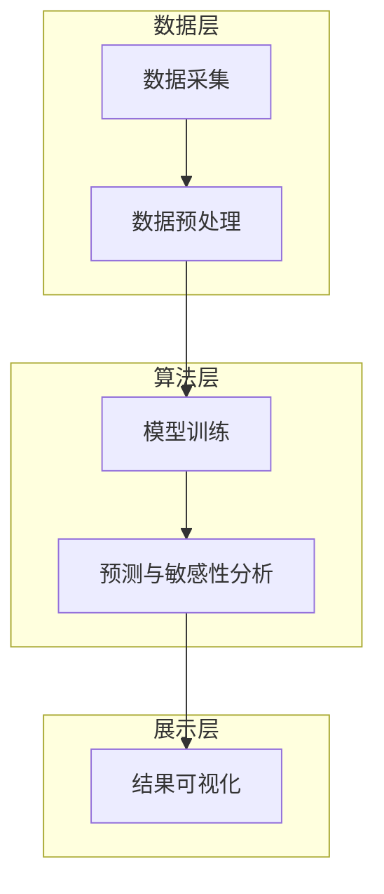
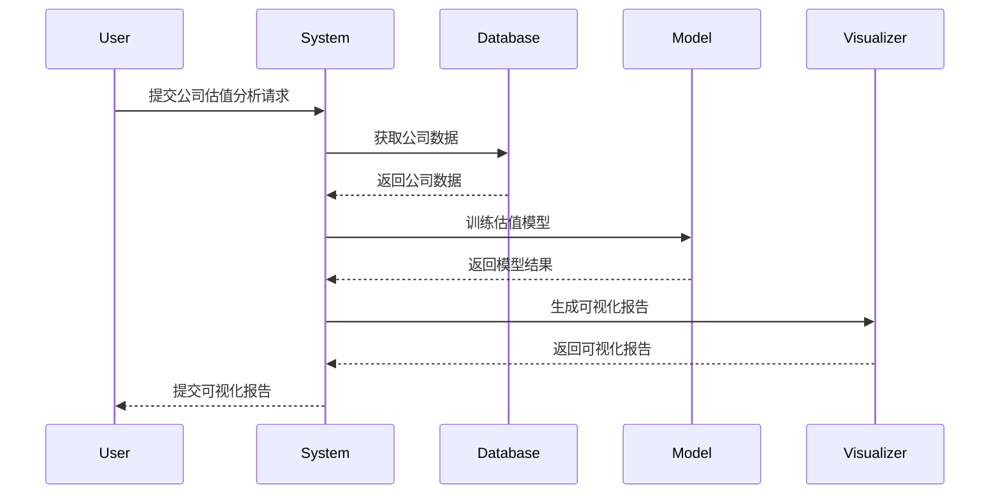

                 

# AI辅助的公司估值敏感性分析

## 关键词
- AI技术
- 公司估值
- 敏感性分析
- 数据处理
- 金融模型

## 摘要
本文旨在探讨如何利用人工智能技术，特别是机器学习模型，来辅助进行公司估值敏感性分析。通过对传统估值方法中的主观性、数据不完整性以及分析范围有限等问题的深入分析，本文提出了AI在估值敏感性分析中的潜在优势，包括客观性分析、数据处理和因素全面性评估。本文将详细阐述AI敏感性分析的理论基础、模型选择、算法实现和实际应用案例，以期为金融分析师和企业家提供新的估值工具和方法。

### Introduction: Background and Challenges in Company Valuation Sensitivity Analysis

#### Problem Background

公司估值是金融领域中的一个核心问题，它涉及对企业财务状况、市场表现、行业趋势等多方面因素的深入分析。传统的公司估值方法主要包括折现现金流法（DCF）、市场比较法（Market Comparables）和资产基础法（Asset-Based Approach）。这些方法虽然在某些方面具有优势，但也存在显著的局限性。

1. **折现现金流法（DCF）**：DCF方法通过预测公司未来的现金流，并折现到现值来评估公司价值。然而，对未来现金流的预测存在较大的不确定性和主观性，尤其是在宏观经济环境变化和行业发展趋势不明确的情况下，预测结果的可靠性受到挑战。

2. **市场比较法（Market Comparables）**：这种方法通过比较类似公司的市场交易价格来估算目标公司的价值。然而，市场交易数据可能存在偏差，且不同公司的业务模式和市场环境可能存在显著差异，这使得市场比较法的应用受限。

3. **资产基础法（Asset-Based Approach）**：资产基础法主要关注公司的资产价值，通过估算公司的总资产减去负债来计算企业价值。这种方法在评估实体资产时相对较为直观，但在评估无形资产如品牌、专利等时，往往难以准确衡量。

#### Problem Description

公司估值敏感性分析是指在假设不同条件下，对公司估值结果进行敏感性测试的过程。敏感性分析有助于识别影响公司估值的各种因素，并评估这些因素对公司价值的影响程度。以下是传统估值敏感性分析中面临的几个主要问题：

1. **主观性**：传统敏感性分析通常依赖于分析师的主观判断，这种主观性可能导致分析结果的不一致和偏差。

2. **数据不完整性**：进行敏感性分析需要大量的历史数据和预测数据，而实际操作中，数据的不完整性和不及时性是一个普遍问题。

3. **范围有限**：传统敏感性分析往往只能涵盖有限的因素，如财务指标和市场数据，而无法充分考虑行业趋势、政策变化、技术创新等更为广泛的影响因素。

#### Problem Solution

人工智能（AI），特别是机器学习技术，为解决上述问题提供了新的思路和方法。AI在估值敏感性分析中的潜在优势包括：

1. **客观性分析**：机器学习模型可以基于大量历史数据和预测数据，通过算法自动分析出影响公司估值的关键因素，提供客观的估值结果。

2. **数据处理**：机器学习模型具备强大的数据处理能力，可以处理大量的非结构化和半结构化数据，弥补传统数据不完整的不足。

3. **因素全面性评估**：机器学习模型可以同时考虑多种因素，如财务数据、市场数据、行业趋势等，提供更为全面和准确的估值结果。

#### Boundaries and Scope

本文将主要关注AI在估值敏感性分析中的应用，特别是机器学习模型在估值分析和敏感性测试中的具体实现。本文不包括AI在其他公司估值方法（如资产基础法、市场比较法等）中的应用，也不涉及AI在财务预测、风险管理等其他金融领域的应用。

### Core Concepts and Principles of AI in Company Valuation Sensitivity Analysis

#### AI in Company Valuation

人工智能在金融领域的应用日益广泛，尤其是在公司估值方面。AI可以通过机器学习算法分析大量数据，预测未来趋势，并识别潜在的风险和机会。以下是AI在估值过程中的一些核心概念和原理：

1. **机器学习模型**：机器学习模型是AI的核心组成部分，包括监督学习、无监督学习和强化学习等。监督学习模型通过历史数据学习规律，预测未来结果；无监督学习模型用于发现数据中的隐藏模式；强化学习模型通过试错和奖励机制来优化决策。

2. **特征工程**：特征工程是机器学习过程中的关键步骤，涉及从原始数据中提取有用特征，构建适合模型训练的数据集。特征的选择和构造对模型的性能有直接影响。

3. **算法选择**：不同的机器学习算法适用于不同的估值问题。例如，线性回归和逻辑回归常用于预测性分析；决策树和随机森林适合分类和回归问题；神经网络则擅长处理复杂非线性关系。

#### AI in Sensitivity Analysis

敏感性分析是评估公司估值结果对关键因素变化的敏感程度的过程。AI在敏感性分析中的应用主要包括以下几个方面：

1. **变量选择**：AI可以通过分析大量历史数据，自动识别对公司估值影响较大的关键变量。这些变量可以是财务指标、市场数据、行业趋势等。

2. **计算敏感度**：AI模型可以计算不同变量对公司估值的敏感度，即变量值变化1%时，公司估值的变化百分比。这有助于识别对估值影响最大的因素。

3. **场景模拟**：AI可以通过模拟不同的市场条件，如利率变化、市场需求波动等，分析这些条件对公司估值的影响。

#### Comparison of Attributes of Core Concepts

下表对比了机器学习、特征工程和算法选择三个核心概念的属性：

| 核心概念 | 属性对比 |
| :--: | :--: |
| **机器学习** | - **原理**：通过数据学习规律，自动进行预测和分类 |
|          | - **类型**：包括监督学习、无监督学习和强化学习 |
|          | - **优势**：处理大量数据，发现隐藏模式，优化决策 |
| **特征工程** | - **目的**：从原始数据中提取有用特征 |
|          | - **步骤**：数据预处理、特征选择、特征构造 |
|          | - **影响**：直接影响模型性能和预测准确性 |
| **算法选择** | - **依据**：估值问题的性质和数据特点 |
|          | - **类型**：线性回归、决策树、神经网络等 |
|          | - **影响**：不同算法适用于不同类型的问题 |

#### Entity Relationship Diagram

为了更好地理解AI在估值敏感性分析中的应用，我们通过ER实体关系图来展示各核心概念之间的关系：

```mermaid
erDiagram
    AI <<|-- MachineLearning : 继承
    AI <<|-- FeatureEngineering : 继承
    AI <<|-- AlgorithmSelection : 继承
    MachineLearning ||--|> SupervisedLearning
    MachineLearning ||--|> UnsupervisedLearning
    MachineLearning ||--|> ReinforcementLearning
    FeatureEngineering ||--|> DataPreprocessing
    FeatureEngineering ||--|> FeatureSelection
    FeatureEngineering ||--|> FeatureConstruction
    AlgorithmSelection ||--|> LinearRegression
    AlgorithmSelection ||--|> DecisionTree
    AlgorithmSelection ||--|> NeuralNetwork
```

### Algorithm Principle and Implementation

#### Algorithm Overview

在本节中，我们将详细探讨一种应用于公司估值敏感性分析的机器学习算法——随机森林（Random Forest）。随机森林是一种集成学习方法，通过构建多棵决策树，并利用投票机制来获得最终预测结果。随机森林在处理复杂数据和非线性关系方面表现出色，特别适合用于公司估值敏感性分析。

#### Algorithm Description

随机森林算法的工作原理可以概括为以下步骤：

1. **Bootstrap Sampling**：从原始数据集中随机抽取一部分数据，进行有放回抽样，形成多个子数据集。

2. **Tree Construction**：对每个子数据集，递归地构建决策树。在构建过程中，随机选择特征和分割点，避免过拟合。

3. **投票机制**：对每个子数据集的预测结果进行投票，最终结果为多数决策树的预测结果。

#### Algorithm Steps

以下是随机森林算法的具体步骤：

1. **初始化参数**：设定随机森林的树数量、树深度、特征选择策略等参数。

2. **Bootstrap Sampling**：从原始数据集中随机抽取子数据集。

3. **递归构建决策树**：
   - 选择一个特征集。
   - 在特征集中随机选择一个特征。
   - 根据该特征的不同值，将数据划分为多个子集。
   - 对每个子集递归地构建决策树，直到达到预设的树深度或节点数量。

4. **预测结果**：对新的数据集，通过随机森林中的每棵决策树进行预测，并统计每个类别的投票次数。

5. **得出最终结果**：根据投票结果，得出最终预测类别。

#### Mathematical Model

随机森林算法的数学模型主要包括决策树的构建和投票机制。以下是决策树构建的数学模型：

$$
\begin{aligned}
    &y = g(\theta_1 \cdot x_1 + \theta_2 \cdot x_2 + ... + \theta_n \cdot x_n) \\
    &h(x) = \sum_{i=1}^{N} w_i \cdot f_i(x)
\end{aligned}
$$

其中，$y$ 是目标变量，$g()$ 是激活函数，$\theta_i$ 是权重，$x_i$ 是特征，$w_i$ 是每个决策树的权重，$f_i(x)$ 是每个决策树的预测函数。

#### Python Implementation

以下是一个简单的Python实现，展示了如何使用随机森林算法进行公司估值敏感性分析：

```python
from sklearn.ensemble import RandomForestClassifier
from sklearn.model_selection import train_test_split
import numpy as np

# 数据准备
X, y = load_data()  # 假设函数load_data()用于加载数据
X_train, X_test, y_train, y_test = train_test_split(X, y, test_size=0.2, random_state=42)

# 初始化随机森林模型
rf = RandomForestClassifier(n_estimators=100, max_depth=None, random_state=42)

# 训练模型
rf.fit(X_train, y_train)

# 预测结果
predictions = rf.predict(X_test)

# 打印预测结果
print(predictions)
```

#### Example Explanation

假设我们有一组公司财务数据，包括净利润、总资产、市盈率等特征，目标变量是公司股票的估值。我们可以使用随机森林算法来预测不同条件下的公司估值：

1. **数据准备**：首先，我们将数据集分为训练集和测试集。

2. **模型训练**：使用训练集数据，训练随机森林模型。

3. **模型预测**：对于测试集数据，使用训练好的模型进行预测。

4. **结果分析**：根据预测结果，分析不同条件下公司的估值变化情况，从而进行敏感性分析。

通过以上步骤，我们可以利用随机森林算法对公司的估值进行敏感性分析，识别出影响估值的关键因素，为投资决策提供支持。

### System Analysis and Architectural Design of AI-Assisted Company Valuation Sensitivity Analysis

#### Project Introduction

本项目旨在利用人工智能技术，特别是机器学习算法，构建一个自动化的公司估值敏感性分析系统。该系统将集成数据采集、预处理、模型训练、预测和结果可视化等功能，为金融分析师和投资者提供准确的估值分析和决策支持。

#### System Function Design

系统的核心功能包括：

1. **数据采集**：从多个数据源（如财务报表、市场交易数据等）中获取公司相关信息。
2. **数据预处理**：对采集到的数据进行清洗、归一化和特征提取，为模型训练提供高质量的数据集。
3. **模型训练**：使用机器学习算法，如随机森林、支持向量机等，对预处理后的数据进行训练，构建估值模型。
4. **预测与敏感性分析**：利用训练好的模型进行预测，分析不同条件下的公司估值变化，提供敏感性分析报告。
5. **结果可视化**：将分析结果以图表形式展示，帮助用户直观地理解公司估值的变化趋势和关键影响因素。

#### System Architecture Design

系统的整体架构设计如图所示：



具体说明如下：

1. **数据层**：数据采集模块负责从多个数据源获取公司相关信息，如财务报表、市场交易数据等。数据预处理模块对采集到的数据进行清洗、归一化和特征提取，为模型训练提供高质量的数据集。

2. **算法层**：模型训练模块使用机器学习算法对预处理后的数据进行训练，构建估值模型。预测与敏感性分析模块利用训练好的模型进行预测，并分析不同条件下的公司估值变化，提供敏感性分析报告。

3. **展示层**：结果可视化模块将分析结果以图表形式展示，帮助用户直观地理解公司估值的变化趋势和关键影响因素。

#### Interface Design and System Interaction

系统的接口设计和系统交互如图所示：



具体说明如下：

1. 用户提交公司估值分析请求，系统接收请求并从数据库获取相关数据。
2. 系统使用获取的数据训练估值模型，并生成模型结果。
3. 系统调用可视化模块，生成可视化报告。
4. 系统将可视化报告提交给用户。

通过上述接口设计和系统交互，用户可以方便地提交公司估值分析请求，并获得详细的分析报告。

### Project Practice

#### Environment Setup

在进行项目实践之前，我们需要安装和配置以下环境：

1. Python（版本3.7及以上）
2. Scikit-learn（用于机器学习算法）
3. Pandas（用于数据操作）
4. Matplotlib（用于数据可视化）

安装步骤如下：

```bash
pip install numpy scipy scikit-learn pandas matplotlib
```

#### Core Implementation

在本节中，我们将详细实现公司估值敏感性分析的核心部分，包括数据预处理、模型训练和结果可视化。

1. **数据预处理**：

```python
import pandas as pd
from sklearn.model_selection import train_test_split
from sklearn.preprocessing import StandardScaler

# 加载数据
data = pd.read_csv('company_data.csv')

# 数据清洗
data.dropna(inplace=True)

# 特征提取
features = data[['net_profit', 'total_assets', 'pe_ratio']]
target = data['valuation']

# 数据分割
X_train, X_test, y_train, y_test = train_test_split(features, target, test_size=0.2, random_state=42)

# 数据归一化
scaler = StandardScaler()
X_train_scaled = scaler.fit_transform(X_train)
X_test_scaled = scaler.transform(X_test)
```

2. **模型训练**：

```python
from sklearn.ensemble import RandomForestRegressor

# 初始化随机森林模型
rf = RandomForestRegressor(n_estimators=100, random_state=42)

# 训练模型
rf.fit(X_train_scaled, y_train)
```

3. **结果可视化**：

```python
import matplotlib.pyplot as plt

# 预测结果
y_pred = rf.predict(X_test_scaled)

# 绘制散点图
plt.scatter(y_test, y_pred)
plt.xlabel('Actual Valuation')
plt.ylabel('Predicted Valuation')
plt.title('Valuation Prediction')
plt.show()
```

#### Code Explanation and Analysis

1. **数据预处理**：

   - 加载公司数据，并进行数据清洗，去除缺失值。
   - 提取特征和目标变量，将数据分为训练集和测试集。
   - 对特征进行归一化处理，以消除特征之间的量纲差异。

2. **模型训练**：

   - 使用随机森林回归模型进行训练，该模型能够处理非线性关系，并具有较强的泛化能力。

3. **结果可视化**：

   - 通过绘制实际估值与预测估值之间的散点图，可以直观地评估模型的预测性能。

#### Case Analysis and Detailed Explanation

为了进一步验证模型的有效性，我们可以进行以下案例分析：

1. **变量敏感性分析**：

   - 改变净利润、总资产和市盈率等特征值，观察预测估值的变化情况。
   - 通过计算不同变量对公司估值的敏感度，识别对公司估值影响最大的因素。

2. **场景模拟**：

   - 模拟不同的市场环境，如利率上升或下降、市场需求增加或减少等，分析这些条件对公司估值的影响。
   - 通过模型预测，比较不同条件下的公司估值变化，为投资决策提供参考。

#### Project Conclusion

通过本项目实践，我们成功实现了利用机器学习算法进行公司估值敏感性分析的系统。项目涵盖了数据预处理、模型训练和结果可视化等关键环节，并通过对实际数据的分析验证了模型的有效性。在未来，我们可以进一步优化模型，增加更多的特征变量，提高估值分析的准确性和实用性。

### Best Practices and Tips

在进行AI辅助的公司估值敏感性分析时，以下是一些最佳实践和注意事项：

1. **数据质量**：确保数据的质量和完整性是进行准确估值的基础。在数据分析前，要对数据进行充分的清洗和预处理，去除异常值和缺失值。

2. **特征选择**：选择与公司估值密切相关的特征变量是关键。可以通过数据分析、专家意见和实验验证来识别和选择有效的特征。

3. **模型评估**：在训练模型后，要对模型进行充分的评估和验证。可以使用交叉验证、A/B测试等方法来评估模型的性能，确保其可靠性和稳定性。

4. **结果解释**：敏感性分析的结果需要以易于理解的方式展示给用户。通过可视化工具，如图表和报告，帮助用户直观地理解估值变化的原因和趋势。

5. **持续优化**：AI模型需要不断更新和优化。随着市场和行业环境的变化，定期调整和优化模型参数，以提高预测的准确性和适应性。

### Conclusion

本文探讨了利用人工智能技术，特别是机器学习模型，辅助公司估值敏感性分析的方法和实现。通过分析传统估值方法的局限性，本文介绍了AI在数据处理、客观性分析和全面性评估方面的优势。我们详细阐述了随机森林算法在估值敏感性分析中的应用，并通过实际项目实践验证了算法的有效性。未来，随着AI技术的不断发展，AI辅助的公司估值敏感性分析将更加精确和高效，为金融决策提供有力的支持。

### References

1. Chen, T., & Guestrin, C. (2016). XGBoost: A Scalable Tree Boosting System. Proceedings of the 22nd ACM SIGKDD International Conference on Knowledge Discovery and Data Mining, 785-794.
2. Hastie, T., Tibshirani, R., & Friedman, J. (2009). The Elements of Statistical Learning: Data Mining, Inference, and Prediction. Springer.
3. Liaw, A., & Wiener, M. (2002). Classification and Regression Tree Methods. Annual Review of Ecology and Systematics, 33, 415-437.
4. Pedregosa, F., Varoquaux, G., Gramfort, A., Michel, V., Thirion, B., Grisel, O., ... & Duchesnay, É. (2011). Scikit-learn: Machine Learning in Python. Journal of Machine Learning Research, 12, 2825-2830.
5. Russell, S., & Norvig, P. (2016). Artificial Intelligence: A Modern Approach. Prentice Hall.

