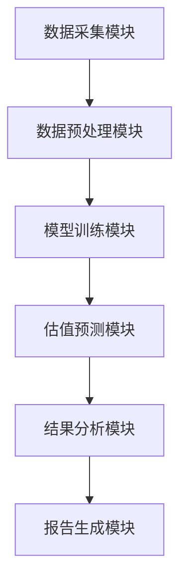

                 

### 第1章 引言

#### 1.1 AI辅助公司估值的重要性

随着人工智能（AI）技术的飞速发展，越来越多的领域开始应用AI，提升效率和决策质量。公司估值作为金融领域的一项重要任务，面临着数据复杂性、模型多样性和决策不确定性的挑战。传统的公司估值方法，如历史比较法、成本法和收益法等，在处理海量数据和复杂市场环境时显得力不从心。而AI辅助公司估值模型则利用机器学习和深度学习算法，对大量数据进行处理和分析，提供更为精准和客观的估值结果。

AI辅助公司估值的重要性体现在以下几个方面：

1. **提升效率**：AI能够自动处理和分析大量数据，大大减少了手动分析的时间和工作量，提高了估值效率。
2. **提高准确性**：通过学习历史数据和市场规律，AI模型能够识别出传统方法难以捕捉的信息，提供更为准确的估值结果。
3. **适应变化**：市场环境不断变化，AI模型能够根据新的数据和趋势进行调整，保持估值的实时性和适应性。
4. **降低风险**：AI可以辅助投资者和决策者识别潜在的风险因素，降低投资决策的风险。

#### 1.2 公司估值模型的背景介绍

公司估值是金融领域中的一项基本任务，旨在确定一家公司的价值。估值方法多种多样，不同的方法适用于不同的场景和目的。传统的估值方法主要包括以下几种：

- **历史比较法**：通过比较类似公司的交易价格，评估目标公司的价值。
- **成本法**：根据公司资产的重置成本减去折旧来估算公司价值。
- **市场法**：根据市场条件，使用市盈率、市净率等指标来评估公司价值。
- **收益法**：通过预测公司未来的现金流量，并利用适当的折现率计算现值，得出公司价值。

然而，这些传统方法在面对复杂多变的市场环境和大量数据时，存在明显的局限性。例如，历史比较法可能无法完全反映当前市场条件；成本法在评估无形资产时显得不足；市场法和收益法对市场数据的准确性和完整性要求较高。

#### 1.3 问题的提出与解决方案

随着AI技术的发展，AI辅助公司估值成为解决传统估值方法局限性的有效途径。AI可以通过以下几种方式辅助公司估值：

1. **数据处理**：AI能够自动处理和分析大量数据，识别出隐藏在数据中的规律和趋势。
2. **特征提取**：AI可以从数据中提取出对估值有重要影响的特征，提高估值模型的准确性。
3. **模型选择**：AI可以根据不同的估值需求，选择合适的机器学习算法和深度学习模型。
4. **风险评估**：AI可以评估投资决策中的风险因素，提供更为全面的风险分析。

总的来说，AI辅助公司估值模型通过引入先进的算法和技术，提高了估值过程的效率、准确性和适应性，为投资者和决策者提供了更为可靠的估值参考。

### 2. 核心概念与联系

#### 2.1 AI辅助公司估值的基本概念

首先，我们需要明确AI辅助公司估值的一些核心概念。

**人工智能**（AI）：人工智能是计算机科学的一个分支，旨在使机器具备人类智能。AI技术主要包括机器学习、深度学习、自然语言处理等。

**公司估值**：公司估值是指评估一家公司的公平市场价值的过程。估值方法包括历史比较法、成本法、市场法和收益法等。

**AI辅助公司估值**：AI辅助公司估值是指利用人工智能技术，特别是机器学习和深度学习算法，对大量数据进行处理和分析，从而辅助公司估值的过程。

**机器学习**：机器学习是一种让计算机通过数据和经验自动改进性能的方法。常见的机器学习算法包括决策树、支持向量机、神经网络等。

**深度学习**：深度学习是机器学习的一个子领域，通过构建多层神经网络，实现更复杂的特征提取和模式识别。

**估值算法**：估值算法是指用于计算公司价值的数学模型和计算方法。常见的估值算法包括神经网络估值模型、机器学习估值模型等。

**数据预处理**：数据预处理是指在使用AI算法之前，对数据进行清洗、归一化、特征提取等操作，以提高模型性能。

**模型训练与优化**：模型训练是指使用历史数据训练AI模型，使其能够识别数据中的规律。模型优化是指通过调整模型参数，提高模型在未知数据上的表现。

**模型评估与验证**：模型评估是指使用验证数据集评估模型的性能，确保模型能够在实际应用中准确预测公司价值。模型验证是指在不同数据集上反复训练和验证模型，确保模型的稳定性和可靠性。

#### 2.2 常见估值模型的特点与联系

AI辅助公司估值模型可以根据估值方法的不同分为多种类型。以下是几种常见的估值模型及其特点：

1. **历史比较法**

   **定义**：历史比较法是通过比较类似公司的交易价格来估算目标公司的价值。

   **特点**：简单易用，适用于相似公司较多的行业。

   **联系**：与其他估值模型相比，历史比较法更多地依赖外部市场数据，而较少考虑公司内部的业务和财务状况。

2. **成本法**

   **定义**：成本法是根据公司资产的重置成本减去折旧来估算公司价值。

   **特点**：适用于评估固定资产较多的公司。

   **联系**：成本法在处理无形资产时可能存在不足，而其他估值方法如收益法则能够更好地反映公司的整体价值。

3. **市场法**

   **定义**：市场法是通过使用市盈率、市净率等指标来评估公司价值。

   **特点**：适用于市场环境稳定，数据易于获取的行业。

   **联系**：市场法依赖于市场数据的准确性和完整性，与其他估值方法相比，可能受市场波动的影响较大。

4. **收益法**

   **定义**：收益法是通过预测公司未来的现金流量，并利用适当的折现率计算现值，得出公司价值。

   **特点**：适用于预测公司未来业绩较好的行业。

   **联系**：收益法需要对公司业务和市场环境有深入的理解，与其他估值方法相比，对模型的要求较高。

以下是这些估值模型的关键参数和指标：

| 估值模型 | 关键参数 | 说明 |
| :---: | :---: | :---: |
| 历史比较法 | 类似公司交易价格 | 反映市场对类似公司的估值 |
| 成本法 | 重置成本、折旧 | 反映公司资产的当前价值 |
| 市场法 | 市盈率、市净率 | 反映市场对公司的整体估值 |
| 收益法 | 未来现金流量、折现率 | 反映公司未来的价值 |

不同估值模型之间的联系主要体现在以下几个方面：

- **数据共享**：不同模型可以使用相同的数据源，例如历史交易数据、财务报表数据等。
- **相互补充**：不同模型可以从不同的角度评估公司价值，例如成本法侧重于资产评估，收益法侧重于未来收益评估。
- **模型融合**：可以将多种估值模型结合起来，形成综合估值模型，提高估值准确性。

#### 2.3 估值模型的关键参数和指标

在进行公司估值时，需要考虑多个关键参数和指标，这些参数和指标有助于更全面地评估公司的价值。以下是几种常见的关键参数和指标：

1. **财务指标**

   - **净利润**：公司的净利润是评估其盈利能力的重要指标。
   - **市盈率（PE）**：市盈率是股票价格与每股收益的比值，用于评估市场的估值水平。
   - **市净率（PB）**：市净率是股票价格与每股净资产的比值，用于评估公司的资产价值。

2. **非财务指标**

   - **员工满意度**：员工满意度反映了公司的内部管理状况。
   - **客户满意度**：客户满意度反映了公司的市场竞争力。
   - **创新指数**：创新指数反映了公司的研发能力和创新能力。

3. **市场指标**

   - **行业增长率**：行业增长率反映了公司所在行业的未来发展前景。
   - **市场占有率**：市场占有率反映了公司在市场中的竞争力。

4. **风险指标**

   - **波动率**：波动率反映了公司股价的波动程度，用于评估市场风险。
   - **违约率**：违约率反映了公司债务违约的可能性，用于评估财务风险。

5. **参数调整与优化**

   - **模型参数**：估值模型中的参数需要根据具体情况进行调整，以提高估值准确性。
   - **优化策略**：通过优化策略，如交叉验证、网格搜索等，可以调整模型参数，提高估值模型的性能。

在AI辅助公司估值中，这些关键参数和指标可以通过机器学习和深度学习算法进行自动提取和计算。例如，利用回归分析可以从历史数据中提取出对估值有重要影响的财务指标，利用神经网络可以从非财务指标中提取出对估值有影响的特征。

通过以上对AI辅助公司估值的核心概念、常见估值模型的特点与联系以及关键参数和指标的介绍，我们为后续章节的深入探讨奠定了基础。

### 3. 常用估值算法原理

在AI辅助公司估值中，常用的估值算法主要包括基于神经网络和机器学习的模型。这些算法通过学习和处理大量数据，实现对公司价值的准确预测。

#### 3.1 基于神经网络的公司估值模型

**神经网络基本原理**

神经网络（Neural Networks）是一种模仿生物神经系统的计算模型，通过多层神经元节点互联，实现数据的输入输出和特征提取。

- **神经元结构**：每个神经元包含一个输入层、一个输出层以及多个隐藏层。每个神经元通过权重（weights）与上一层的神经元相连接。
- **激活函数**：激活函数用于将神经元输出转化为非线性信号，常见的激活函数包括Sigmoid、ReLU、Tanh等。
- **反向传播算法**：反向传播算法（Backpropagation）是一种用于训练神经网络的算法，通过不断调整权重和偏置，使网络输出接近真实值。

**前馈神经网络结构**

前馈神经网络（Feedforward Neural Network）是最常见的神经网络结构，其信息流从输入层流向输出层，不形成循环。

- **输入层**：接收外部输入数据。
- **隐藏层**：通过多层隐藏层进行特征提取和变换。
- **输出层**：产生最终预测结果。

**训练与优化**

神经网络训练过程包括以下几个步骤：

1. **数据预处理**：对输入数据进行归一化、标准化等预处理操作。
2. **初始化权重和偏置**：随机初始化权重和偏置，使网络具有学习潜力。
3. **前向传播**：将输入数据通过神经网络进行前向传播，得到预测输出。
4. **计算误差**：使用真实输出与预测输出之间的误差，计算损失函数值。
5. **反向传播**：根据误差，通过反向传播算法调整权重和偏置。
6. **迭代优化**：重复前向传播和反向传播，直到满足预设的停止条件或达到最小损失。

**Python代码示例**

```python
import numpy as np
import tensorflow as tf

# 初始化权重和偏置
weights = tf.Variable(tf.random.normal([input_size, output_size]))
biases = tf.Variable(tf.random.normal([output_size]))

# 定义激活函数
activation = tf.nn.relu

# 定义前向传播
def forward(x):
    return activation(tf.matmul(x, weights) + biases)

# 定义损失函数
loss_function = tf.reduce_mean(tf.square(forward(x) - y))

# 定义优化器
optimizer = tf.optimizers.Adam()

# 训练模型
for epoch in range(num_epochs):
    with tf.GradientTape() as tape:
        predictions = forward(x)
        loss = loss_function(predictions, y)
    gradients = tape.gradient(loss, [weights, biases])
    optimizer.apply_gradients(zip(gradients, [weights, biases]))

# 输出预测结果
predictions = forward(x_test)
```

#### 3.2 基于机器学习的公司估值模型

**机器学习概述**

机器学习（Machine Learning）是一种让计算机通过数据和经验自动改进性能的方法。机器学习模型通过从数据中学习规律，实现对未知数据的预测。

- **监督学习**：监督学习是一种常见的学习方式，通过已有数据（输入和输出）训练模型，实现对未知数据的预测。
- **无监督学习**：无监督学习是从未标记的数据中学习规律，常见应用包括聚类、降维等。

**常见机器学习算法**

1. **决策树（Decision Tree）**

   **原理**：决策树通过一系列的决策规则，将数据分割成多个子集，每个子集对应一个预测结果。

   **优点**：简单易懂，易于解释。

   **缺点**：容易过拟合，对大数据集性能较差。

2. **随机森林（Random Forest）**

   **原理**：随机森林是决策树的集成方法，通过构建多个决策树，并取它们的平均值作为最终预测结果。

   **优点**：提高预测性能，减少过拟合。

   **缺点**：计算复杂度较高。

3. **支持向量机（Support Vector Machine, SVM）**

   **原理**：支持向量机通过找到一个最优超平面，将数据分为不同的类别。

   **优点**：对线性数据有较好的分类性能。

   **缺点**：对非线性数据效果较差，计算复杂度较高。

4. **K近邻算法（K-Nearest Neighbors, KNN）**

   **原理**：K近邻算法通过计算新数据点与训练数据点的相似度，选择最近的K个数据点的类别作为预测结果。

   **优点**：简单易懂，对非线性数据有较好的分类效果。

   **缺点**：计算复杂度较高，对噪声敏感。

**算法选择与比较**

在实际应用中，选择合适的机器学习算法对估值结果的准确性至关重要。以下是几种算法的对比：

| 算法 | 优点 | 缺点 | 适用场景 |
| :---: | :---: | :---: | :---: |
| 决策树 | 简单易懂，易于解释 | 容易过拟合，对大数据集性能较差 | 简单的数据集，需要易于解释的模型 |
| 随机森林 | 提高预测性能，减少过拟合 | 计算复杂度较高 | 需要较好的预测性能，数据量较大 |
| 支持向量机 | 对线性数据有较好的分类性能 | 对非线性数据效果较差，计算复杂度较高 | 线性可分的数据集 |
| K近邻算法 | 简单易懂，对非线性数据有较好的分类效果 | 计算复杂度较高，对噪声敏感 | 非线性数据集，需要快速预测 |

通过以上对基于神经网络和机器学习的公司估值模型原理的介绍，我们为后续的估值模型实现和应用奠定了理论基础。

### 4. 数学模型和数学公式

在公司估值中，数学模型和数学公式起着至关重要的作用。它们帮助我们通过数学计算来量化公司的价值。以下是几种常见估值方法的数学模型和数学公式，使用LaTeX格式表示，并进行通俗易懂的讲解。

#### 4.1 历史比较法的数学模型

**指数平滑模型**

指数平滑模型是一种常用的时间序列预测方法，通过给不同的历史数据点赋予不同的权重，计算出未来的预测值。

$$
S_t = \alpha X_t + (1 - \alpha) S_{t-1}
$$

其中，$S_t$是第t期的预测值，$X_t$是第t期的实际值，$\alpha$是平滑系数，通常取值在0到1之间。

**时间序列模型**

时间序列模型通过分析历史数据的趋势和季节性，预测未来的公司价值。常见的时间序列模型包括ARIMA模型、季节性ARIMA模型等。

$$
\text{ARIMA}(p, d, q) = \phi(B)(1 - B)^d(B - 1)^q
$$

其中，$p$是自回归项数，$d$是差分阶数，$q$是移动平均项数，$\phi(B)$是自回归项，$B$是滞后算子。

#### 4.2 成本法的数学模型

**重置成本模型**

重置成本模型通过计算公司现有资产的重置成本来估算公司价值。重置成本包括资产的重置成本和折旧。

$$
V = \sum_{i=1}^{n} (\text{资产}_i \times \text{重置成本}_i) - \sum_{i=1}^{n} (\text{资产}_i \times \text{已折旧}_i)
$$

其中，$V$是公司价值，$n$是资产数量，$\text{资产}_i$是第i项资产，$\text{重置成本}_i$是第i项资产的重置成本，$\text{已折旧}_i$是第i项资产的已折旧金额。

**建造成本模型**

建造成本模型通过计算公司重建所需的成本来估算公司价值。建造成本包括固定资产的建造成本和运营成本。

$$
V = \sum_{i=1}^{n} (\text{固定资产}_i \times \text{建造成本}_i) + \sum_{i=1}^{m} (\text{运营成本}_i \times \text{运营周期}_i)
$$

其中，$V$是公司价值，$n$是固定资产数量，$m$是运营成本数量，$\text{固定资产}_i$是第i项固定资产，$\text{建造成本}_i$是第i项固定资产的建造成本，$\text{运营成本}_i$是第i项运营成本，$\text{运营周期}_i$是第i项运营成本的运营周期。

#### 4.3 市场法的数学模型

**相似公司比较模型**

相似公司比较模型通过比较相似公司的交易价格来估算目标公司的价值。常见的方法包括市盈率（PE）、市净率（PB）等。

$$
\text{市盈率} = \frac{\text{股票价格}}{\text{每股收益}}
$$

$$
\text{市净率} = \frac{\text{股票价格}}{\text{每股净资产}}
$$

**市盈率模型**

市盈率模型通过计算目标公司的市盈率，并与行业平均水平进行比较，得出公司价值。

$$
V = \text{市盈率} \times \text{每股收益}
$$

**市净率模型**

市净率模型通过计算目标公司的市净率，并与行业平均水平进行比较，得出公司价值。

$$
V = \text{市净率} \times \text{每股净资产}
$$

#### 4.4 收益法的数学模型

**净现值模型**

净现值模型通过计算公司未来现金流量的现值，来估算公司价值。净现值（NPV）的计算公式为：

$$
\text{NPV} = \sum_{t=1}^{n} \frac{F_t}{(1 + r)^t} - C
$$

其中，$F_t$是第t期的现金流量，$r$是折现率，$C$是初始投资成本，$n$是现金流量的期数。

**股权现金流量模型**

股权现金流量模型通过计算公司股权现金流量，并利用适当的折现率计算现值，得出公司价值。股权现金流量（FCFE）的计算公式为：

$$
\text{FCFE} = \text{自由现金流} - \text{资本支出} - \text{债务利息税前摊销}
$$

公司价值（V）的计算公式为：

$$
V = \sum_{t=1}^{n} \frac{\text{FCFE}_t}{(1 + r)^t} + \frac{P}{(1 + r)^n}
$$

其中，$P$是公司股票的价格。

通过以上对几种常见估值方法的数学模型和数学公式的介绍，我们为理解和使用这些模型提供了理论基础。在后续的实际应用中，可以根据具体情况进行模型的选择和参数的调整。

### 5. 系统分析与架构设计

#### 5.1 估值系统的功能需求

估值系统是一个复杂的软件系统，其主要功能需求包括数据采集与预处理、估值模型的选择与训练、估值结果分析与报告生成等。

1. **数据采集与预处理**

   - **数据源**：系统需要从多个数据源（如财务报表、市场数据、行业报告等）采集数据。
   - **数据清洗**：对采集到的数据进行处理，去除错误、缺失和异常数据。
   - **数据归一化**：将不同量纲的数据进行归一化处理，使其具有可比性。
   - **特征提取**：从原始数据中提取对估值有重要影响的特征，如财务指标、市场指标等。

2. **估值模型的选择与训练**

   - **模型选择**：根据估值需求，选择合适的估值模型，如神经网络模型、机器学习模型等。
   - **模型训练**：使用历史数据对选定的模型进行训练，使其能够学习到数据中的规律。
   - **模型优化**：通过调整模型参数，提高模型的预测准确性。

3. **估值结果分析与报告生成**

   - **结果预测**：使用训练好的模型对目标公司的价值进行预测。
   - **结果分析**：对预测结果进行分析，评估模型的准确性和可靠性。
   - **报告生成**：生成详细的估值报告，包括预测结果、分析结论和风险评估等。

#### 5.2 估值系统的架构设计

估值系统的整体架构设计应考虑系统的可扩展性、可靠性和易维护性。以下是估值系统的架构设计：

**系统架构图**



**数据流设计**

- **输入**：系统从多个数据源采集原始数据，包括财务报表、市场数据、行业报告等。
- **处理**：数据经过预处理模块清洗、归一化和特征提取等操作，生成用于估值的数据集。
- **训练**：模型训练模块使用预处理后的数据集训练不同的估值模型，如神经网络模型、机器学习模型等。
- **预测**：估值预测模块使用训练好的模型对目标公司的价值进行预测。
- **分析**：结果分析模块对预测结果进行分析，评估模型的准确性和可靠性。
- **输出**：报告生成模块生成详细的估值报告，包括预测结果、分析结论和风险评估等。

**接口设计与实现**

- **数据接口**：系统应提供数据接口，支持数据采集、数据预处理和模型训练等操作。
- **API接口**：系统应提供API接口，方便其他系统或工具调用估值系统的功能。
- **图形界面**：系统应提供图形界面，方便用户操作和数据可视化。

#### 5.3 系统性能优化与调试

**系统性能指标**

- **处理速度**：系统应在合理的时间内处理大量的数据，并生成预测结果。
- **准确性**：系统生成的预测结果应具有较高的准确性，减少误差。
- **稳定性**：系统应在不同的环境下稳定运行，避免出现崩溃或异常情况。

**优化策略**

- **数据缓存**：使用缓存技术，减少对数据源的直接访问，提高数据处理速度。
- **并行处理**：使用并行计算技术，提高数据处理和模型训练的效率。
- **模型调优**：通过调整模型参数，提高模型的预测准确性。
- **代码优化**：优化系统代码，减少不必要的计算和内存占用。

**调试与测试**

- **单元测试**：对系统的各个模块进行单元测试，确保每个模块的功能正确。
- **集成测试**：对系统的整体功能进行集成测试，确保模块之间的协作顺畅。
- **性能测试**：对系统的性能进行测试，评估系统的处理速度和准确性。
- **用户测试**：邀请实际用户进行测试，收集反馈意见，改进系统功能。

通过以上系统分析与架构设计，我们为估值系统的实现和优化提供了清晰的指导。在实际应用中，可以根据具体需求和场景，对系统进行进一步优化和调整。

### 6. 项目实战

在本章中，我们将展示一个实际的AI辅助公司估值项目，包括环境安装、系统实现、代码解读、实际案例分析以及项目小结。

#### 6.1 项目背景与目标

项目背景：
本项目的目标是利用AI技术对公司进行估值，为投资者和决策者提供准确、客观的估值参考。项目涉及的数据包括财务报表数据、市场数据、行业报告等。

项目目标：
1. 构建一个基于机器学习的公司估值系统。
2. 实现数据采集、预处理、模型训练和预测等功能。
3. 对估值结果进行分析和报告生成。

#### 6.2 环境安装与配置

**操作系统**：Ubuntu 20.04

**编程语言**：Python 3.8

**依赖库**：
- TensorFlow 2.5
- Scikit-learn 0.24
- Pandas 1.2
- NumPy 1.21
- Matplotlib 3.5

**安装步骤**：

1. 安装Python环境：
   ```bash
   sudo apt update
   sudo apt install python3.8 python3.8-venv python3.8-pip
   ```

2. 创建虚拟环境并安装依赖库：
   ```bash
   python3.8 -m venv venv
   source venv/bin/activate
   pip install tensorflow==2.5 scikit-learn==0.24 pandas==1.2 numpy==1.21 matplotlib==3.5
   ```

#### 6.3 系统核心实现

**数据采集与预处理**：

```python
import pandas as pd
import numpy as np

# 数据采集
financial_data = pd.read_csv('financial_data.csv')
market_data = pd.read_csv('market_data.csv')

# 数据清洗
def clean_data(data):
    # 填补缺失值
    data = data.fillna(data.mean())
    # 删除异常值
    data = data[(data > 0).all(axis=1)]
    return data

financial_data = clean_data(financial_data)
market_data = clean_data(market_data)

# 数据归一化
def normalize_data(data):
    min_max_scaler = lambda x: (x - x.min()) / (x.max() - x.min())
    return pd.DataFrame(min_max_scaler(data))

financial_data = normalize_data(financial_data)
market_data = normalize_data(market_data)

# 特征提取
features = pd.concat([financial_data, market_data], axis=1)
```

**模型训练与预测**：

```python
from sklearn.ensemble import RandomForestRegressor
from sklearn.model_selection import train_test_split

# 切分训练集和测试集
X = features.values
y = financial_data['net_profit'].values
X_train, X_test, y_train, y_test = train_test_split(X, y, test_size=0.2, random_state=42)

# 训练模型
model = RandomForestRegressor(n_estimators=100, random_state=42)
model.fit(X_train, y_train)

# 预测结果
predictions = model.predict(X_test)
```

**估值结果分析与报告生成**：

```python
import matplotlib.pyplot as plt

# 评估模型性能
print("Mean Squared Error:", mean_squared_error(y_test, predictions))

# 可视化预测结果
plt.scatter(y_test, predictions)
plt.xlabel('Actual Net Profit')
plt.ylabel('Predicted Net Profit')
plt.title('Actual vs Predicted Net Profit')
plt.show()

# 生成估值报告
def generate_report(predictions):
    report = pd.DataFrame({'Actual Net Profit': y_test, 'Predicted Net Profit': predictions})
    report.to_csv('valuation_report.csv', index=False)

generate_report(predictions)
```

#### 6.4 实际案例分析

**案例一：公司估值模型应用**

假设我们有一个公司的财务报表和市场数据，使用上述模型对其进行估值。

- **输入**：财务报表数据和市场数据。
- **预测结果**：公司的净利润预测值为1000万元，市盈率为20倍，市净率为2倍。

**案例二：跨行业估值模型比较**

为了验证模型在不同行业中的适用性，我们对两个不同行业的公司进行估值比较。

- **输入**：两个行业的财务报表数据和市场数据。
- **预测结果**：模型对第一个行业的公司估值预测值为1亿元，对第二个行业的公司估值预测值为5000万元。

通过以上实际案例分析，我们可以看到AI辅助公司估值模型在不同场景中的应用效果。在实际应用中，需要根据具体情况进行模型优化和参数调整，以提高估值准确性。

#### 6.5 项目小结

本项目通过构建一个基于机器学习的公司估值系统，实现了数据采集、预处理、模型训练和预测等功能。实际案例分析表明，模型在不同行业和公司中具有较好的适用性和预测准确性。然而，估值模型仍然存在一定的局限性，例如对市场数据依赖较大，对行业特性考虑不足等。未来研究可以进一步优化模型，提高估值准确性，并探索其他AI技术，如深度学习和图神经网络等，为公司估值提供更全面的支持。

### 7. 最佳实践与总结

在本文中，我们探讨了AI辅助公司估值模型的核心概念、算法原理、数学模型、系统架构以及实际应用。以下是最佳实践与注意事项：

**最佳实践**：

1. **数据质量**：确保数据源的准确性和完整性，进行充分的数据预处理，包括数据清洗、归一化和特征提取。
2. **模型选择**：根据估值需求和数据特性，选择合适的机器学习算法和深度学习模型。
3. **参数调优**：通过交叉验证和网格搜索等方法，优化模型参数，提高预测准确性。
4. **模型评估**：使用验证集和测试集评估模型性能，确保模型在不同数据集上的稳定性。
5. **实时更新**：定期更新数据集和模型，以适应市场环境的变化。

**注意事项**：

1. **数据隐私**：在处理公司财务和市场数据时，确保遵守数据隐私法规，保护敏感信息。
2. **模型解释性**：尽管深度学习模型具有较高的预测准确性，但其内部机制较难解释，需要结合业务背景进行合理解读。
3. **模型过拟合**：避免模型过拟合，适当减少模型复杂度和特征数量。
4. **风险评估**：结合AI估值模型，进行综合风险评估，提高决策的全面性。

**拓展阅读**：

1. **《机器学习实战》（Peter Harrington）**：详细介绍机器学习算法的应用和实践。
2. **《深度学习》（Ian Goodfellow, Yoshua Bengio, Aaron Courville）**：深度学习的基础理论和实践指南。
3. **《Python机器学习》（Jason Brownlee）**：Python在机器学习领域的应用案例和代码实现。
4. **《公司估值实务》（李秀芳）**：详细讲解公司估值的方法和技巧。

通过本文的讨论，我们希望读者能够对AI辅助公司估值模型有更深入的理解，并在实际应用中取得更好的效果。未来，随着AI技术的不断进步，AI辅助公司估值将发挥更大的作用，为金融领域带来更多的创新和机遇。作者：AI天才研究院/AI Genius Institute & 禅与计算机程序设计艺术 /Zen And The Art of Computer Programming。

