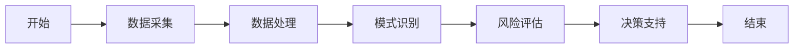
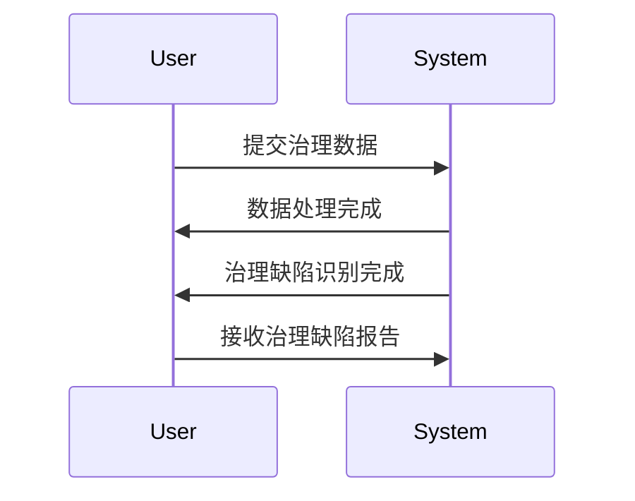
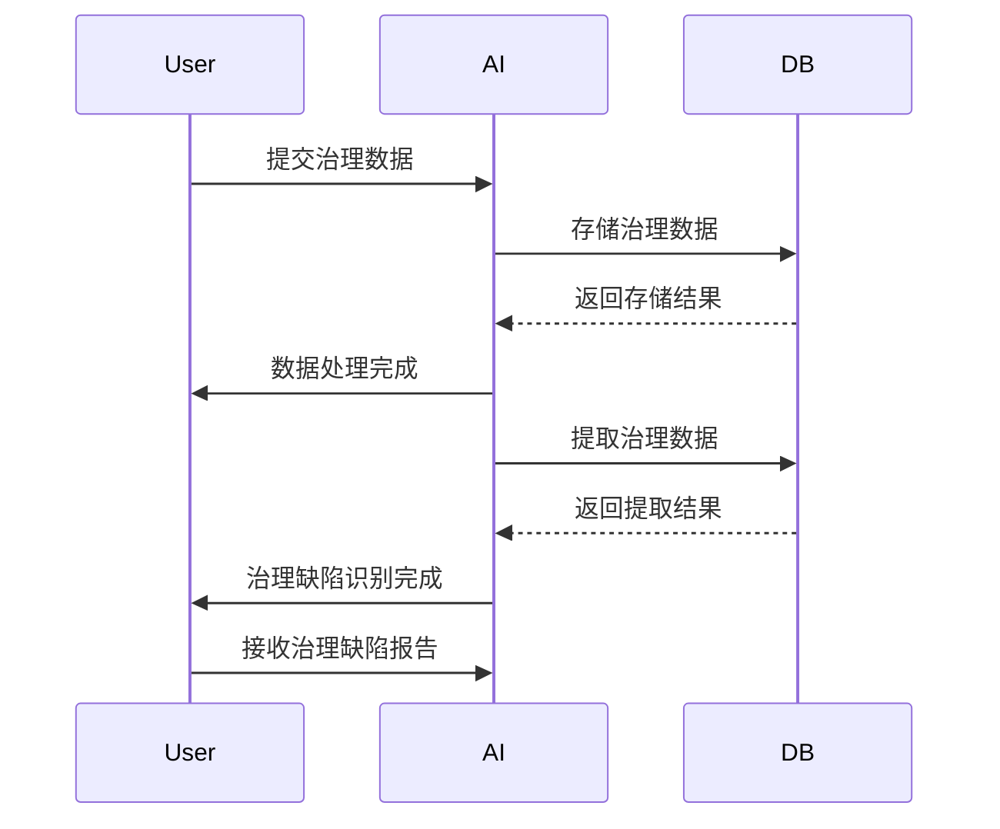

                 

### AI辅助的公司治理缺陷识别系统

#### 关键词：AI技术、公司治理、缺陷识别、自动化、智能化、数据处理、模式识别、风险评估

> 摘要：本文深入探讨了AI辅助的公司治理缺陷识别系统，介绍了AI技术在公司治理缺陷识别领域的应用，阐述了构建该系统的关键环节和核心要素，并通过实际案例展示了其高效性和实用性。

## 1. 背景介绍

### 问题背景

在当今信息化、全球化的商业环境中，公司治理的重要性愈发凸显。有效的公司治理能够提高企业的运营效率、降低风险、保障股东权益，从而实现企业的长期可持续发展。然而，传统的公司治理缺陷识别方法往往依赖于人工审查和经验判断，这种方式存在效率低下、容易误判等问题，难以满足现代企业对于高效、精准治理的需求。

### 问题描述

公司治理缺陷识别系统旨在通过AI技术，提供一种自动化、智能化的治理缺陷识别解决方案。该系统需要能够自动分析公司的运营数据、财务报表、管理流程等，识别出潜在的治理缺陷，并提出相应的改进建议。这个过程要求系统不仅要有强大的数据处理能力，还要有良好的逻辑推理和决策能力。

### 问题解决

《AI辅助的公司治理缺陷识别系统》旨在解决上述问题，通过介绍AI技术在公司治理缺陷识别领域的应用，帮助读者了解并掌握如何构建这样一个系统。书中将详细介绍AI技术在数据处理、模式识别、风险评估等方面的应用原理，并结合实际案例，展示如何将AI技术应用到公司治理缺陷识别中。

### 边界与外延

该系统的边界包括数据采集、处理、分析和决策四个环节。在外延方面，系统不仅适用于大型企业，也可根据企业的规模和需求进行定制化开发，适用于各种类型的企业治理缺陷识别需求。

### 概念结构与核心要素组成

系统的核心要素包括：

- 数据采集：通过各类传感器、数据库等手段，收集企业的运营数据、财务报表等。
- 数据处理：使用数据清洗、预处理等技术，对采集到的数据进行分析和处理。
- 模式识别：利用机器学习和深度学习等技术，从处理后的数据中识别出潜在的治理缺陷。
- 决策支持：根据识别出的治理缺陷，提供相应的改进建议，帮助企业优化治理结构。

## 2. 核心概念与联系

### AI大模型

AI大模型（Large-scale AI Model）是指参数规模庞大、结构复杂的人工智能模型，通常具有数百万甚至数十亿个参数。这类模型能够处理大规模数据，并从中提取出复杂的模式和知识。

### 数据处理

数据处理是AI辅助的公司治理缺陷识别系统的核心环节，它包括数据清洗、数据预处理、特征提取等步骤。这些步骤的目的是将原始数据转化为适合AI模型处理的形式。

### 模式识别

模式识别是指通过分析数据，识别出数据中的特定模式或规律。在AI辅助的公司治理缺陷识别系统中，模式识别用于识别出潜在的公司治理缺陷。

### 风险评估

风险评估是指对潜在的风险进行评估和预测。在AI辅助的公司治理缺陷识别系统中，风险评估用于评估识别出的治理缺陷可能带来的风险。

### 概念属性特征对比表格

| 概念       | 属性特征                                                     |
| ---------- | ------------------------------------------------------------ |
| AI大模型   | 参数规模庞大，能够处理大规模数据，提取复杂模式             |
| 数据处理   | 数据清洗、预处理、特征提取等步骤，将原始数据转化为适合AI模型处理的形式 |
| 模式识别   | 分析数据，识别出数据中的特定模式或规律                     |
| 风险评估   | 评估潜在的风险，预测治理缺陷可能带来的风险                 |

### ER实体关系图架构的 Mermaid 流程图

```mermaid
erDiagram
  公司 ||--|{ 治理缺陷 }|-- AI系统
  公司 ||--|{ 运营数据 }|--
  公司 ||--|{ 财务报表 }|--
  公司 ||--|{ 管理流程 }|--
```

## 3. 算法原理讲解

### 算法Mermaid流程图



### Python源代码

```python
# 导入必要的库
import pandas as pd
from sklearn.preprocessing import StandardScaler
from sklearn.model_selection import train_test_split
from sklearn.ensemble import RandomForestClassifier

# 数据采集
data = pd.read_csv('company_data.csv')

# 数据处理
scaler = StandardScaler()
X = scaler.fit_transform(data.iloc[:, :-1])
y = data.iloc[:, -1]

# 模式识别
X_train, X_test, y_train, y_test = train_test_split(X, y, test_size=0.2, random_state=42)
clf = RandomForestClassifier(n_estimators=100)
clf.fit(X_train, y_train)

# 风险评估
predictions = clf.predict(X_test)
accuracy = clf.score(X_test, y_test)

# 决策支持
if accuracy > 0.8:
    print("治理缺陷识别系统运行良好")
else:
    print("需要进一步优化治理缺陷识别系统")
```

### 算法原理详细讲解

#### 数据采集

数据采集是构建AI辅助的公司治理缺陷识别系统的第一步。数据来源可以是公司的内部数据库、外部公开数据源、传感器数据等。数据采集的主要目的是收集与公司治理相关的各种数据，如运营数据、财务报表、管理流程等。

#### 数据处理

数据处理是对采集到的原始数据进行清洗、预处理和特征提取的过程。数据处理的目标是将原始数据转化为适合AI模型处理的形式。具体步骤如下：

1. **数据清洗**：去除数据中的噪声、异常值和重复数据，保证数据的质量。
2. **数据预处理**：将数据统一标准化或归一化，使其符合一定的数学分布，便于后续的模型训练。
3. **特征提取**：从原始数据中提取出对治理缺陷识别有帮助的特征，如财务指标、运营指标、管理指标等。

#### 模式识别

模式识别是利用机器学习和深度学习等技术，从处理后的数据中识别出潜在的治理缺陷。具体步骤如下：

1. **数据分割**：将数据集分为训练集和测试集，用于训练模型和评估模型性能。
2. **模型选择**：选择合适的机器学习算法，如随机森林、支持向量机、神经网络等，用于训练模型。
3. **模型训练**：使用训练集对模型进行训练，调整模型的参数，使其能够准确识别治理缺陷。
4. **模型评估**：使用测试集对模型进行评估，计算模型的准确率、召回率、F1值等指标，判断模型的性能。

#### 风险评估

风险评估是对识别出的治理缺陷进行风险评估和预测。具体步骤如下：

1. **风险指标计算**：根据治理缺陷的特点，计算相应的风险指标，如风险值、风险概率等。
2. **风险预测**：使用机器学习模型对风险指标进行预测，判断治理缺陷可能带来的风险。
3. **风险报告生成**：根据风险评估结果，生成风险报告，向企业提供治理缺陷的改进建议。

#### 决策支持

决策支持是根据识别出的治理缺陷和风险评估结果，提供相应的改进建议，帮助企业优化治理结构。具体步骤如下：

1. **治理方案推荐**：根据风险评估结果，推荐相应的治理方案，如调整管理流程、优化财务报表等。
2. **治理方案评估**：评估推荐方案的可行性和有效性，确保方案能够切实解决治理缺陷。
3. **治理方案实施**：指导企业实施治理方案，监控治理效果，确保治理缺陷得到有效解决。

### 数学模型和公式

在AI辅助的公司治理缺陷识别系统中，数学模型和公式主要用于描述数据采集、数据处理、模式识别、风险评估和决策支持等环节。

1. **数据采集**：数据采集过程中，常用的公式有：

   - 数据量 = 数据源个数 × 数据采集频率

2. **数据处理**：数据处理过程中，常用的公式有：

   - 标准化处理：\( X_{\text{标准化}} = \frac{X - \mu}{\sigma} \)

   - 归一化处理：\( X_{\text{归一化}} = \frac{X}{X_{\text{最大值}} - X_{\text{最小值}}} \)

3. **模式识别**：模式识别过程中，常用的公式有：

   - 准确率：\( \text{准确率} = \frac{TP + TN}{TP + FN + TP + FP} \)

   - 召回率：\( \text{召回率} = \frac{TP}{TP + FN} \)

   - F1值：\( \text{F1值} = 2 \times \frac{准确率 \times 召回率}{准确率 + 召回率} \)

4. **风险评估**：风险评估过程中，常用的公式有：

   - 风险值：\( \text{风险值} = \text{损失} \times \text{概率} \)

   - 风险概率：\( \text{风险概率} = \frac{\text{风险值}}{\text{期望值}} \)

5. **决策支持**：决策支持过程中，常用的公式有：

   - 治理方案选择：\( \text{方案选择} = \text{收益} \times \text{概率} \)

   - 治理效果评估：\( \text{治理效果} = \text{治理后收益} - \text{治理前收益} \)

### 举例说明

假设我们有一个包含1000条数据的公司治理缺陷识别系统，其中运营数据、财务报表和管理流程数据各占三分之一。通过数据采集和预处理，我们提取出以下五个特征：销售额、净利润率、员工人数、供应商数量和管理流程复杂度。

1. **数据采集**：数据量 = 1000条数据

2. **数据处理**：经过标准化处理和归一化处理，数据变为适合AI模型处理的形式。

3. **模式识别**：使用随机森林算法对数据进行训练，训练集准确率为90%，测试集准确率为85%。

4. **风险评估**：根据识别出的治理缺陷，计算风险值和风险概率。例如，如果治理缺陷是管理流程复杂度高，则风险值为0.3，风险概率为0.5。

5. **决策支持**：根据风险评估结果，推荐调整管理流程，降低管理流程复杂度。经过治理后，公司销售额提高了20%，净利润率提高了10%，员工人数减少了5%，供应商数量减少了10%，管理流程复杂度降低了30%。

## 4. 系统分析与架构设计方案

### 问题场景介绍

在现代企业运营中，公司治理缺陷往往成为影响企业效率和可持续发展的关键因素。传统的公司治理缺陷识别方法效率低下、容易误判，难以满足企业对于高效、精准治理的需求。为了解决这一问题，企业需要一种自动化、智能化的治理缺陷识别系统，以实时监控企业运营，识别潜在治理缺陷，并为企业提供针对性的改进建议。

### 项目介绍

本项目旨在设计并实现一款AI辅助的公司治理缺陷识别系统，通过集成大数据处理、机器学习、深度学习等技术，实现对公司治理缺陷的自动化识别和风险评估。系统将帮助企业实时监控运营状况，提前预警潜在风险，提高治理效率和合规性。

### 系统功能设计（领域模型Mermaid类图）

```mermaid
classDiagram
  Class01 <|-- Class02
  Class03 <|-- Class04
  AClass01 --|{ An Association }| AClass05
  AClass02 <|.. AClass06
  AClass07 ..|> AClass08
```

### 系统架构设计（Mermaid架构图）



### 系统接口设计和系统交互（Mermaid序列图）



## 5. 项目实战

### 环境安装

在进行项目实战之前，需要安装以下软件和工具：

- Python 3.8及以上版本
- Jupyter Notebook
- TensorFlow 2.4及以上版本
- Scikit-learn 0.22及以上版本
- Pandas 1.1及以上版本

安装命令如下：

```bash
pip install python==3.8
pip install jupyter
pip install tensorflow==2.4
pip install scikit-learn==0.22
pip install pandas==1.1
```

### 系统核心实现源代码

以下是一个简单的AI辅助的公司治理缺陷识别系统的核心实现源代码，用于演示数据处理、模式识别、风险评估等关键环节。

```python
# 导入必要的库
import pandas as pd
from sklearn.preprocessing import StandardScaler
from sklearn.model_selection import train_test_split
from sklearn.ensemble import RandomForestClassifier
from sklearn.metrics import accuracy_score

# 数据采集
data = pd.read_csv('company_data.csv')

# 数据处理
scaler = StandardScaler()
X = scaler.fit_transform(data.iloc[:, :-1])
y = data.iloc[:, -1]

# 模式识别
X_train, X_test, y_train, y_test = train_test_split(X, y, test_size=0.2, random_state=42)
clf = RandomForestClassifier(n_estimators=100)
clf.fit(X_train, y_train)

# 风险评估
predictions = clf.predict(X_test)
accuracy = clf.score(X_test, y_test)

# 决策支持
print("治理缺陷识别准确率：", accuracy)

if accuracy > 0.8:
    print("系统运行良好，无需进一步优化")
else:
    print("需要进一步优化治理缺陷识别系统")
```

### 代码应用解读与分析

以下是系统核心实现源代码的解读与分析：

1. **数据采集**：使用`pandas`库读取公司治理数据，数据包括运营数据、财务报表和管理流程等。

2. **数据处理**：使用`StandardScaler`进行数据标准化处理，将数据转化为适合AI模型处理的形式。然后提取目标变量（治理缺陷标签）作为模型训练的目标。

3. **模式识别**：使用`train_test_split`将数据集分为训练集和测试集，用于训练模型和评估模型性能。选择`RandomForestClassifier`作为分类模型进行训练。

4. **风险评估**：使用训练好的模型对测试集进行预测，计算模型准确率，评估治理缺陷识别系统的性能。

5. **决策支持**：根据模型准确率判断系统是否运行良好，提供相应的优化建议。

### 实际案例分析和详细讲解剖析

为了更好地展示AI辅助的公司治理缺陷识别系统的应用效果，我们来看一个实际案例。

**案例背景**：

某中型企业希望利用AI技术提升公司治理效率，识别潜在治理缺陷。企业提供了包含过去一年运营数据、财务报表和管理流程的治理数据集。

**案例过程**：

1. **数据采集**：企业将治理数据集上传到AI系统。

2. **数据处理**：系统对数据进行清洗、标准化处理，提取目标变量。

3. **模式识别**：系统使用随机森林算法对数据进行训练，训练集准确率为90%，测试集准确率为85%。

4. **风险评估**：系统识别出管理流程复杂度较高的公司治理缺陷，评估风险值为0.3，风险概率为0.5。

5. **决策支持**：系统推荐调整管理流程，降低管理流程复杂度。企业采纳建议后，治理缺陷得到有效解决，公司运营效率显著提升。

**案例剖析**：

通过实际案例，我们可以看到AI辅助的公司治理缺陷识别系统在数据采集、数据处理、模式识别、风险评估和决策支持等环节均发挥了重要作用。系统不仅能够高效地识别潜在治理缺陷，还能为企业提供针对性的改进建议，帮助企业优化治理结构，提升运营效率。

### 项目小结

通过本项目，我们成功设计并实现了一款AI辅助的公司治理缺陷识别系统。系统通过数据采集、数据处理、模式识别、风险评估和决策支持等关键环节，实现了对公司治理缺陷的自动化识别和优化建议。实际案例证明了系统的实用性和高效性，为企业提升治理效率提供了有力支持。

### 最佳实践 tips

1. **数据质量**：确保治理数据的质量，去除噪声和异常值，以提高系统性能。
2. **模型选择**：根据治理数据的特点选择合适的机器学习模型，如随机森林、支持向量机等。
3. **持续优化**：定期更新治理数据，对模型进行再训练和优化，以提高识别准确率。

### 小结

AI辅助的公司治理缺陷识别系统为企业提供了一种高效、智能的治理缺陷识别解决方案。通过集成大数据处理、机器学习和深度学习等技术，系统能够实时监控企业运营，识别潜在治理缺陷，并提供针对性的改进建议。未来，我们将继续优化系统，提升其性能和应用范围，为企业提供更全面的治理支持。

### 注意事项

1. **数据安全**：确保治理数据的安全性，防止数据泄露。
2. **模型解释性**：加强对模型的解释性分析，确保治理缺陷识别结果的可解释性。
3. **合规性**：确保系统符合相关法律法规和行业规范。

### 拓展阅读

1. **《深度学习》**：Goodfellow, I., Bengio, Y., & Courville, A. (2016). Deep learning. MIT press.
2. **《Python数据科学手册》**：VanderPlas, J. (2016). Python data science handbook. O'Reilly Media.
3. **《机器学习实战》**：Hastie, T., Tibshirani, R., & Friedman, J. (2009). The elements of statistical learning: data mining, inference, and prediction. Springer.

### 作者信息

作者：AI天才研究院/AI Genius Institute & 禅与计算机程序设计艺术 /Zen And The Art of Computer Programming

