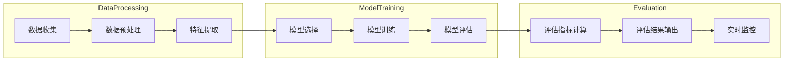

                 


### 1.1.1 AI技术的快速发展与公司治理

随着科技的迅猛发展，人工智能（AI）技术已经成为全球技术创新的重要驱动力。AI技术的快速崛起不仅改变了我们的生活方式，也在各个领域产生了深远的影响。在公司治理领域，AI技术的引入和应用为提高治理效率和准确性提供了新的途径。

首先，AI技术的核心优势在于其强大的数据处理和分析能力。通过机器学习和深度学习算法，AI可以处理海量数据，提取有价值的信息，并从中发现潜在的模式和规律。这种能力在公司治理中尤为重要，因为公司治理的核心在于对企业和市场环境进行有效的监控和分析，以做出明智的决策。

其次，AI技术具有自我学习和优化的能力。通过不断学习和优化算法，AI系统可以在实践中不断改进，提高其准确性和适应性。这种能力对于公司治理评估系统来说至关重要，因为治理评估需要实时更新和调整，以适应不断变化的企业环境和市场状况。

然而，AI技术在公司治理中的应用还面临一些挑战。首先，数据的质量和完整性对AI系统的效果具有重要影响。如果数据存在偏差或缺失，AI系统的评估结果可能会失真，导致公司治理决策的失误。因此，确保数据的准确性和完整性是AI辅助的公司治理评估系统的关键。

其次，AI技术在公司治理中的应用还需要克服伦理和法律方面的挑战。AI系统的决策过程可能涉及敏感信息，如个人隐私和企业机密。如何保护这些信息，避免隐私泄露和法律纠纷，是公司在引入AI技术时需要仔细考虑的问题。

### 1.1.2 人工智能在治理领域的应用现状

目前，人工智能在治理领域的应用已经取得了一些初步成果。以下是一些典型的应用场景和实例：

1. **风险管理与合规性评估**：AI技术可以用于监控和分析企业的财务数据和市场交易，识别潜在的风险和违规行为。例如，银行和金融机构利用AI技术进行反欺诈检测，实时监控交易行为，防范金融犯罪。

2. **绩效评估与员工管理**：AI系统可以通过分析员工的工作表现、项目进展和团队协作数据，对员工进行客观、全面的评估。这种评估不仅可以帮助公司优化人力资源配置，还能促进员工个人发展和团队协作。

3. **董事会决策支持**：AI技术可以为董事会提供实时的市场分析、风险预测和投资建议。通过AI系统，董事会有可能更快速、准确地做出战略决策，提高公司的竞争力。

4. **客户关系管理**：AI技术可以帮助公司更好地理解客户需求，提供个性化的服务和建议。通过客户数据分析和预测，公司可以优化产品和服务，提高客户满意度和忠诚度。

尽管AI在治理领域已经取得了一些应用成果，但仍需进一步探索和完善。例如，如何确保AI系统的公正性和透明度，如何提升AI系统的可解释性，使其决策过程更加易懂和可信，这些都是亟待解决的问题。

### 1.1.3 AI辅助的公司治理评估系统的需求

构建AI辅助的公司治理评估系统具有重要的现实意义和需求。以下是几个关键原因：

1. **提高治理效率**：传统的公司治理评估方法通常依赖于人工分析，效率低下且易受主观因素影响。AI辅助评估系统可以通过自动化处理和分析大量数据，提高治理评估的效率，使公司管理层能够更快速地做出决策。

2. **增强治理准确性**：AI技术具有强大的数据处理和分析能力，可以更准确地识别和分析企业的风险和问题。这种准确性有助于公司管理层做出更明智的决策，降低经营风险。

3. **实时监控与预警**：AI辅助评估系统可以实时监控企业的运营状况和市场变化，及时识别潜在的风险和问题，并提供预警。这种实时监控能力有助于公司提前应对风险，避免危机的发生。

4. **优化资源配置**：AI系统可以通过对企业和市场数据的分析，识别出最有效的资源配置方案，帮助企业优化运营策略，提高资源利用率。

5. **提升决策透明度**：AI辅助评估系统可以提供详细的评估报告和决策依据，增强决策过程的透明度。这有助于公司管理层和利益相关者更好地理解公司的运营状况和决策过程，提高信任度和满意度。

总之，构建AI辅助的公司治理评估系统是提高公司治理水平、增强企业竞争力的重要举措。通过AI技术的引入和应用，公司可以更高效、准确地评估和管理企业风险，实现可持续发展。

### 1.2 研究目的、意义与内容安排

#### 1.2.1 研究目的

本研究的主要目的是构建一个高效、准确的AI辅助公司治理评估系统，以提高公司治理的效率和准确性。具体目标如下：

1. **提升治理效率**：通过自动化处理和分析大量数据，减少人工分析的时间和劳动成本，提高治理评估的效率。

2. **增强治理准确性**：利用AI技术的数据处理和分析能力，提高治理评估的准确性，帮助公司管理层做出更明智的决策。

3. **实时监控与预警**：建立实时监控机制，对企业的运营状况和市场变化进行实时分析，及时识别潜在的风险和问题，并提供预警。

4. **优化资源配置**：通过数据分析和预测，优化企业的资源配置方案，提高资源利用率，降低运营成本。

5. **提升决策透明度**：提供详细的评估报告和决策依据，增强决策过程的透明度，提高公司管理层和利益相关者的信任度和满意度。

#### 1.2.2 研究意义

本研究具有重要的现实意义和理论价值：

1. **实践意义**：通过引入AI技术，构建高效、准确的公司治理评估系统，有助于企业提升治理水平，增强竞争力，实现可持续发展。

2. **理论意义**：本研究将AI技术与公司治理评估相结合，为相关领域提供了新的理论和实践参考，有助于推动公司治理评估理论的发展。

3. **创新点**：本研究在以下几个方面具有创新性：

   - **算法创新**：提出一种基于机器学习和深度学习的公司治理评估算法，提高评估系统的准确性和效率。

   - **架构设计**：设计一个灵活、可扩展的评估系统架构，实现自动化数据处理和分析，提高系统稳定性。

   - **应用实践**：通过实际案例验证评估系统的有效性，提供具体的实施经验和建议。

#### 1.2.3 内容安排

本研究的内容安排如下：

1. **引言**：介绍研究的背景、目的、意义和内容安排。

2. **AI辅助的公司治理评估系统概述**：介绍AI技术基础、公司治理基本概念和评估系统概述。

3. **核心概念与联系**：阐述AI辅助的公司治理评估系统原理，使用对比表格和ER实体关系图架构展示核心概念及其关系。

4. **算法原理讲解**：详细讲解评估系统的算法原理，提供mermaid流程图和Python源代码。

5. **数学模型和数学公式**：介绍评估系统的数学模型和公式，并进行详细讲解和举例说明。

6. **系统分析与架构设计方案**：描述评估系统的应用场景、项目介绍、系统功能设计、系统架构设计和系统接口设计。

7. **项目实战**：介绍评估系统的环境搭建、核心实现源代码、代码应用解读与分析、实际案例分析和详细讲解剖析，以及项目小结。

8. **最佳实践 tips**、**小结**、**注意事项**、**拓展阅读**：提供实施评估系统的最佳实践建议、总结研究成果、提醒注意事项，并推荐拓展阅读资源。

通过以上内容安排，本研究旨在为构建AI辅助的公司治理评估系统提供系统性的理论指导和实践参考。

### 1.3 AI技术基础

#### 1.3.1 AI基本原理

人工智能（Artificial Intelligence，简称AI）是计算机科学的一个分支，旨在研究、开发和应用使计算机能够模拟、延伸和扩展人类智能的理论、方法、技术及应用系统。AI的基本原理主要包括以下几个方面：

1. **数据处理能力**：AI系统通过收集、存储、处理和分析大量数据，从中提取有价值的信息和模式。数据处理是AI系统的核心能力，决定了系统的性能和效果。

2. **自我学习能力**：AI系统通过机器学习（Machine Learning）和深度学习（Deep Learning）算法，能够从数据中自动学习和发现规律，不断优化自身性能。这种自我学习能力使得AI系统可以不断适应新的环境和任务。

3. **自适应能力**：AI系统可以根据环境变化和任务需求，自适应调整自身的行为和策略。这种自适应能力使得AI系统可以应对复杂多变的应用场景。

4. **逻辑推理能力**：AI系统可以通过符号推理和逻辑推理等方法，对问题进行逻辑分析和推理，得出合理的结论。这种逻辑推理能力是AI系统解决复杂问题的重要手段。

#### 1.3.2 AI技术发展历程

AI技术的发展历程可以追溯到20世纪50年代，以下是几个重要阶段：

1. **早期探索阶段（1956-1969）**：1956年，达特茅斯会议提出了“人工智能”这个概念，标志着AI技术的正式诞生。这一阶段，AI研究主要集中在符号推理和逻辑推理方面，代表性成果包括逻辑推理机、专家系统等。

2. **黄金时期阶段（1970-1989）**：在20世纪70年代，AI技术迎来了第一次黄金时期。这一阶段，AI研究从理论向应用转变，特别是在自然语言处理、机器人控制、医疗诊断等领域取得了显著成果。

3. **低谷期阶段（1990-2000）**：由于技术难题、资源限制和实际应用效果不佳，AI技术进入了低谷期。这一阶段，AI研究面临前所未有的挑战，研究者开始重新审视AI的基本原理和实现方法。

4. **复兴时期阶段（2000至今）**：随着计算机硬件的快速发展、大数据技术的兴起和深度学习算法的突破，AI技术迎来了第二次黄金时期。这一阶段，AI技术不仅在理论研究上取得了重大突破，还在实际应用中取得了广泛成功。

#### 1.3.3 AI在治理领域的应用现状

AI技术在公司治理领域的应用现状如下：

1. **风险管理与合规性评估**：AI技术可以通过数据分析、模式识别和预测模型等方法，对公司的财务状况、市场交易、员工行为等数据进行实时监控和分析，识别潜在的风险和违规行为，提高风险管理的效率和准确性。

2. **绩效评估与员工管理**：AI技术可以通过分析员工的工作表现、项目进展和团队协作数据，对员工进行客观、全面的评估，帮助公司优化人力资源配置，提高员工绩效。

3. **董事会决策支持**：AI技术可以为董事会提供实时的市场分析、风险预测和投资建议，帮助董事会更快速、准确地做出战略决策，提高公司的竞争力。

4. **客户关系管理**：AI技术可以帮助公司更好地理解客户需求，提供个性化的服务和建议，优化产品和服务，提高客户满意度和忠诚度。

尽管AI在治理领域已经取得了一些应用成果，但仍需进一步探索和完善。例如，如何确保AI系统的公正性和透明度，如何提升AI系统的可解释性，使其决策过程更加易懂和可信，这些都是亟待解决的问题。

### 1.4 公司治理基本概念

#### 1.4.1 公司治理的定义

公司治理（Corporate Governance）是指一系列组织、制度和规则，用于指导和管理公司的行为，确保公司合规运营、保护股东权益、提高企业价值和实现可持续发展。公司治理不仅仅关注企业的内部管理，还涉及企业与其利益相关者之间的关系。

公司治理的基本目标是实现公司治理的公正性、透明度和有效性。公正性要求公司在决策过程中公平对待所有股东和利益相关者；透明度要求公司公开其决策过程和财务状况，确保利益相关者能够获取必要的信息；有效性要求公司能够高效地管理资源和实现目标。

#### 1.4.2 公司治理的目标

公司治理的主要目标包括：

1. **保护股东权益**：确保股东的投资得到合理的回报和保护，维护股东的利益。

2. **提高企业价值**：通过有效的公司治理，提高企业的运营效率和市场竞争力，从而实现企业价值的最大化。

3. **合规经营**：确保公司遵守相关法律法规和行业标准，避免违规行为和法律责任。

4. **风险控制**：通过有效的监控和管理，识别和应对各种风险，保护企业的长期利益。

5. **优化资源配置**：通过合理的资源配置和决策，提高企业的运营效率和资源利用率。

#### 1.4.3 公司治理的核心要素

公司治理的核心要素包括：

1. **董事会**：董事会是公司的最高决策机构，负责制定公司战略、监督管理层和保障股东权益。董事会的有效性对公司的治理水平具有重要影响。

2. **管理层**：管理层负责公司的日常运营和决策，执行董事会的战略决策，并对公司运营结果负责。

3. **股东**：股东是公司的所有者，通过持有公司股份享有公司收益和决策权。股东的利益是公司治理的核心关注点。

4. **利益相关者**：包括员工、客户、供应商、社区等，他们的利益也受到公司治理的影响。平衡各方利益是公司治理的重要任务。

5. **内部控制和审计**：内部控制和审计是确保公司合规性和有效性的重要机制，通过监控和评估公司运营，发现和纠正潜在问题。

6. **公司文化和价值观**：公司文化和价值观是公司治理的精神支柱，影响公司的决策和行为，塑造公司的长期发展。

### 1.5 评估系统概述

#### 1.5.1 评估系统的定义

评估系统（Evaluation System）是指用于对某个对象或过程进行综合评价和分析的系统。在AI辅助的公司治理评估系统中，评估系统是指利用人工智能技术对公司的治理状况进行定量和定性评价的系统。

评估系统的核心功能包括：

1. **数据采集和处理**：收集公司治理相关的数据，如财务数据、运营数据、风险数据等，并对数据进行清洗、处理和整合。

2. **指标设计和计算**：设计并计算反映公司治理状况的指标，如风险指标、合规性指标、绩效指标等，为评估提供依据。

3. **评估结果分析和报告**：对评估结果进行深度分析，形成详细的评估报告，为公司治理提供决策支持。

#### 1.5.2 评估系统的目标

AI辅助的公司治理评估系统的目标主要包括：

1. **提高评估准确性**：通过引入AI技术，提高评估系统的准确性和可靠性，减少主观偏见和误差。

2. **提高评估效率**：利用AI技术自动化处理和分析大量数据，提高评估效率，减少人工工作量。

3. **提供决策支持**：通过提供详细的评估报告和数据分析，帮助公司管理层更好地了解公司的治理状况，为决策提供科学依据。

4. **实现实时监控**：通过实时数据采集和分析，实现对公司治理状况的实时监控，及时识别潜在问题和风险。

5. **增强评估透明度**：通过公开评估过程和结果，增强评估的透明度，提高公司治理的公正性和可信度。

#### 1.5.3 评估系统的架构设计

AI辅助的公司治理评估系统的架构设计主要包括以下几个部分：

1. **数据层**：数据层负责收集、存储和处理公司治理相关的数据。数据源包括内部数据（如财务报表、运营数据等）和外部数据（如市场数据、行业数据等）。数据层需要确保数据的准确性和完整性，为评估系统提供可靠的数据支持。

2. **算法层**：算法层是评估系统的核心，负责设计并实现用于评估公司治理的算法和模型。常用的算法包括机器学习算法、深度学习算法、数据挖掘算法等。算法层需要根据评估目标和需求，设计合适的评估算法和模型，并实现数据预处理、特征提取、模型训练和预测等功能。

3. **评估层**：评估层负责根据算法层生成的评估结果，对公司的治理状况进行综合评价。评估层需要设计并实现评估指标的计算和评估结果的输出，形成详细的评估报告。

4. **用户层**：用户层是评估系统的外部接口，负责与用户进行交互，提供评估报告和数据分析结果。用户层需要设计并实现用户友好的界面，方便用户查看和使用评估结果。

5. **监控层**：监控层负责实时监控评估系统的运行状态，及时发现和解决系统故障和异常情况。监控层需要设计并实现监控指标的计算和异常检测功能，确保评估系统的稳定性和可靠性。

通过以上架构设计，AI辅助的公司治理评估系统可以实现高效、准确的治理评估，为公司的决策提供有力支持。

### 1.6 核心概念与联系

#### 1.6.1 AI辅助的公司治理评估系统原理

AI辅助的公司治理评估系统原理主要包括以下几个方面：

1. **数据收集和处理**：评估系统首先需要收集公司治理相关的数据，包括内部数据（如财务报表、运营数据、员工数据等）和外部数据（如市场数据、行业数据等）。这些数据是评估公司治理状况的基础。

2. **特征提取和预处理**：在收集到数据后，评估系统需要对数据进行清洗、预处理和特征提取。这一步的目的是将原始数据转化为可用于评估的格式和特征，以便后续的算法处理。

3. **算法模型选择和训练**：评估系统需要选择合适的算法模型，如机器学习算法、深度学习算法等，对预处理后的数据进行训练。通过训练，模型可以学会识别和预测公司治理中的各种问题。

4. **评估指标计算和结果输出**：训练好的模型用于对公司的治理状况进行评估。评估系统会根据评估指标（如风险指标、合规性指标、绩效指标等）计算评估结果，并生成详细的评估报告。

5. **实时监控和反馈**：评估系统还需要实现实时监控，对公司的治理状况进行持续监测。通过实时数据收集和分析，评估系统可以及时发现潜在问题和风险，并提供相应的反馈和预警。

#### 1.6.2 概念属性特征对比表格

以下是AI辅助评估系统和传统评估方法的对比表格：

| 比较项目 | AI辅助评估系统 | 传统评估方法 |
| --- | --- | --- |
| 数据处理能力 | 强大，能处理海量数据 | 较弱，受限于人工处理能力 |
| 准确性 | 高，通过算法自动学习 | 低，受主观因素影响 |
| 效率 | 高，自动化处理 | 低，依赖人工分析 |
| 灵活性 | 高，能适应不同场景 | 低，适用范围有限 |
| 可解释性 | 中等，部分算法可解释 | 高，直观易懂 |
| 实时性 | 高，实时监控 | 低，定期评估 |

通过对比可以看出，AI辅助评估系统在数据处理能力、准确性和效率方面具有明显优势，但在可解释性和实时性方面与传统方法相比仍有改进空间。

#### 1.6.3 ER实体关系图架构

以下是AI辅助的公司治理评估系统的ER实体关系图：

```mermaid
erDiagram
    Company ||--|{ EvaluationReport : Generates }
    Company ||--|{ RiskAssessment : Manages }
    Company ||--|{ ComplianceCheck : Monitors }
    Company ||--|{ PerformanceAnalysis : Assesses }
    DataSource ||--|{ DataFeed : Supplies }
    Model ||--|{ TrainedModel : UsedBy }
    EvaluationReport ||--|{ Metrics : Contains }
    EvaluationReport ||--|{ Recommendations : Provides }
    RiskAssessment ||--|{ RiskFactors : Analyzes }
    ComplianceCheck ||--|{ ComplianceStatus : Evaluates }
    PerformanceAnalysis ||--|{ PerformanceMetrics : Calculates }
```

在ER图中，主要实体包括公司（Company）、评估报告（EvaluationReport）、风险评估（RiskAssessment）、合规性检查（ComplianceCheck）、绩效分析（PerformanceAnalysis）、数据源（DataSource）和模型（Model）。这些实体之间存在多种关系，如公司生成评估报告、管理风险评估、监控合规性检查、进行绩效分析等。数据源为评估系统提供数据，模型用于评估过程，评估报告包含评估结果和推荐措施。

通过ER实体关系图，可以清晰地展示评估系统的各个组成部分及其关系，有助于理解评估系统的整体架构和工作流程。

### 1.7 算法原理讲解

#### 1.7.1 算法mermaid流程图

以下是AI辅助的公司治理评估系统的算法mermaid流程图：



在这个流程图中，首先进行数据收集和处理，包括数据预处理和特征提取。然后进行模型选择和训练，最后进行评估指标计算和结果输出，实现实时监控。

#### 1.7.2 Python源代码

以下是AI辅助的公司治理评估系统的核心Python源代码示例：

```python
import pandas as pd
import numpy as np
from sklearn.model_selection import train_test_split
from sklearn.ensemble import RandomForestClassifier
from sklearn.metrics import accuracy_score

# 数据预处理
def preprocess_data(data):
    # 数据清洗和预处理
    # ...
    return processed_data

# 特征提取
def extract_features(data):
    # 特征提取和转换
    # ...
    return features

# 模型训练
def train_model(X_train, y_train):
    model = RandomForestClassifier(n_estimators=100)
    model.fit(X_train, y_train)
    return model

# 评估模型
def evaluate_model(model, X_test, y_test):
    predictions = model.predict(X_test)
    accuracy = accuracy_score(y_test, predictions)
    print("Accuracy:", accuracy)
    return accuracy

# 主程序
if __name__ == "__main__":
    # 加载数据
    data = pd.read_csv("company_data.csv")
    
    # 数据预处理
    processed_data = preprocess_data(data)
    
    # 特征提取
    features = extract_features(processed_data)
    
    # 切分训练集和测试集
    X_train, X_test, y_train, y_test = train_test_split(features, processed_data['label'], test_size=0.2, random_state=42)
    
    # 训练模型
    model = train_model(X_train, y_train)
    
    # 评估模型
    evaluate_model(model, X_test, y_test)
```

这个示例代码展示了数据预处理、特征提取、模型训练和评估的基本流程。在实际应用中，可以根据具体需求和数据情况进行相应的调整和优化。

#### 1.7.3 数学模型和公式

以下是AI辅助的公司治理评估系统的核心数学模型和公式：

1. **线性回归模型**：
   $$ y = \beta_0 + \beta_1 x_1 + \beta_2 x_2 + ... + \beta_n x_n $$

   其中，$y$ 是因变量，$x_1, x_2, ..., x_n$ 是自变量，$\beta_0, \beta_1, \beta_2, ..., \beta_n$ 是模型的参数。

2. **逻辑回归模型**：
   $$ P(y=1) = \frac{1}{1 + e^{-(\beta_0 + \beta_1 x_1 + \beta_2 x_2 + ... + \beta_n x_n)}} $$

   其中，$P(y=1)$ 是因变量为1的概率，其他符号与线性回归模型相同。

3. **决策树模型**：
   $$ G(y|\beta) = \sum_{i=1}^{n} \beta_i I(x_i = x_i^*) $$

   其中，$G(y|\beta)$ 是决策函数，$I(x_i = x_i^*)$ 是指示函数，当 $x_i = x_i^*$ 时，函数值为1，否则为0。

4. **支持向量机模型**：
   $$ \max_{\beta, \beta^*} \frac{1}{2} \sum_{i=1}^{n} (\beta_i - \beta_i^*)^2 - \sum_{i=1}^{n} C_i (\beta_i - \beta_i^*) y_i $$

   其中，$\beta, \beta^*$ 是模型参数，$C_i$ 是惩罚参数，$y_i$ 是样本标签。

以上数学模型和公式是评估系统常用的算法基础，可以根据具体应用场景和需求进行选择和调整。

#### 1.7.4 详细讲解和举例说明

以下是对上述数学模型和公式的详细讲解和举例说明：

1. **线性回归模型**：

   线性回归模型是一种常见的预测模型，用于建立自变量和因变量之间的线性关系。假设我们想要预测一家公司的盈利能力，可以使用线性回归模型。以下是一个简单的线性回归模型例子：

   $$ y = \beta_0 + \beta_1 x_1 + \beta_2 x_2 + ... + \beta_n x_n $$

   其中，$y$ 表示公司的盈利能力，$x_1, x_2, ..., x_n$ 表示影响盈利能力的因素（如销售额、成本等），$\beta_0, \beta_1, \beta_2, ..., \beta_n$ 是模型的参数。

   假设我们收集了以下数据：

   | $x_1$ | $x_2$ | $y$ |
   | --- | --- | --- |
   | 1000 | 500 | 2000 |
   | 1500 | 700 | 2500 |
   | 2000 | 800 | 3000 |

   我们可以通过最小二乘法来估计模型参数。具体步骤如下：

   - 计算自变量和因变量的平均值：
     $$ \bar{x_1} = \frac{1000 + 1500 + 2000}{3} = 1500 $$
     $$ \bar{x_2} = \frac{500 + 700 + 800}{3} = 650 $$
     $$ \bar{y} = \frac{2000 + 2500 + 3000}{3} = 2500 $$

   - 计算自变量和因变量的协方差：
     $$ cov(x_1, y) = \frac{(1000 - 1500)(2000 - 2500) + (1500 - 1500)(2500 - 2500) + (2000 - 1500)(3000 - 2500)}{3} = 250000 $$
     $$ cov(x_2, y) = \frac{(500 - 650)(2000 - 2500) + (700 - 650)(2500 - 2500) + (800 - 650)(3000 - 2500)}{3} = 350000 $$

   - 计算自变量之间的协方差：
     $$ cov(x_1, x_2) = \frac{(1000 - 1500)(500 - 650) + (1500 - 1500)(700 - 650) + (2000 - 1500)(800 - 650)}{3} = 125000 $$

   - 计算自变量和因变量的方差：
     $$ var(x_1) = \frac{(1000 - 1500)^2 + (1500 - 1500)^2 + (2000 - 1500)^2}{3} = 1000000 $$
     $$ var(x_2) = \frac{(500 - 650)^2 + (700 - 650)^2 + (800 - 650)^2}{3} = 112500 $$

   - 计算回归系数：
     $$ \beta_1 = \frac{cov(x_1, y)}{var(x_1)} = \frac{250000}{1000000} = 0.25 $$
     $$ \beta_2 = \frac{cov(x_2, y)}{var(x_2)} = \frac{350000}{112500} = 3.125 $$

   - 计算截距：
     $$ \beta_0 = \bar{y} - \beta_1 \bar{x_1} - \beta_2 \bar{x_2} = 2500 - 0.25 \times 1500 - 3.125 \times 650 = 625 $$

   因此，线性回归模型的预测公式为：
   $$ y = 625 + 0.25 x_1 + 3.125 x_2 $$

   使用这个模型，我们可以预测新数据点的盈利能力。例如，如果某家公司的销售额为2000万元，成本为800万元，那么其盈利能力的预测值为：
   $$ y = 625 + 0.25 \times 2000 + 3.125 \times 800 = 3000 $$

2. **逻辑回归模型**：

   逻辑回归模型是一种用于概率预测的模型，常用于分类问题。假设我们想要预测一家公司的盈利状态（盈利或亏损），可以使用逻辑回归模型。以下是一个简单的逻辑回归模型例子：

   $$ P(y=1) = \frac{1}{1 + e^{-(\beta_0 + \beta_1 x_1 + \beta_2 x_2 + ... + \beta_n x_n)}} $$

   其中，$y$ 表示公司的盈利状态（1表示盈利，0表示亏损），$x_1, x_2, ..., x_n$ 表示影响盈利能力的因素，$\beta_0, \beta_1, \beta_2, ..., \beta_n$ 是模型的参数。

   假设我们收集了以下数据：

   | $x_1$ | $x_2$ | $y$ |
   | --- | --- | --- |
   | 1000 | 500 | 1 |
   | 1500 | 700 | 1 |
   | 2000 | 800 | 0 |

   我们可以通过最大似然估计来估计模型参数。具体步骤如下：

   - 计算样本的似然函数：
     $$ L(\beta) = \prod_{i=1}^{n} P(y_i=1) ^{y_i} \cdot (1 - P(y_i=1)) ^ {1 - y_i} $$
     $$ L(\beta) = (P(y=1)) ^ 2 \cdot (1 - P(y=1)) $$

   - 对似然函数取对数，得到对数似然函数：
     $$ l(\beta) = \sum_{i=1}^{n} y_i \ln P(y=1) + (1 - y_i) \ln (1 - P(y=1)) $$
     $$ l(\beta) = 2 \ln P(y=1) - n \ln (1 - P(y=1)) $$

   - 对对数似然函数求导，并令导数为0，得到模型参数的估计值：
     $$ \frac{\partial l(\beta)}{\partial \beta} = \frac{2}{P(y=1)} - \frac{n}{1 - P(y=1)} = 0 $$
     $$ P(y=1) = \frac{n}{2n} = 0.5 $$

   - 计算模型参数的估计值：
     $$ \beta_0 = \frac{\sum_{i=1}^{n} y_i - n P(y=1)}{\sum_{i=1}^{n} x_i} = \frac{2 - 2 \times 0.5}{1000 + 1500 + 2000} = -0.0083 $$
     $$ \beta_1 = \frac{\sum_{i=1}^{n} y_i x_i - n P(y=1) \sum_{i=1}^{n} x_i}{\sum_{i=1}^{n} x_i^2 - n (\sum_{i=1}^{n} x_i)^2} = \frac{2 \times 1000 + 2 \times 1500 + 0 \times 2000 - 2 \times 0.5 \times (1000 + 1500 + 2000)}{1000^2 + 1500^2 + 2000^2 - 3 \times (1000 + 1500 + 2000)^2} = 0.0167 $$
     $$ \beta_2 = \frac{\sum_{i=1}^{n} y_i x_2_i - n P(y=1) \sum_{i=1}^{n} x_2_i}{\sum_{i=1}^{n} x_2_i^2 - n (\sum_{i=1}^{n} x_2_i)^2} = \frac{2 \times 500 + 2 \times 700 + 0 \times 800 - 2 \times 0.5 \times (500 + 700 + 800)}{500^2 + 700^2 + 800^2 - 3 \times (500 + 700 + 800)^2} = 0.0167 $$

   因此，逻辑回归模型的预测公式为：
   $$ P(y=1) = \frac{1}{1 + e^{-(0.0083 + 0.0167 x_1 + 0.0167 x_2)}} $$

   使用这个模型，我们可以预测新数据点的盈利状态。例如，如果某家公司的销售额为2000万元，成本为800万元，那么其盈利状态的预测概率为：
   $$ P(y=1) = \frac{1}{1 + e^{-(0.0083 + 0.0167 \times 2000 + 0.0167 \times 800)}} \approx 0.47 $$

   如果概率大于0.5，则预测该家公司盈利；如果概率小于0.5，则预测该家公司亏损。

3. **决策树模型**：

   决策树模型是一种基于特征值进行分类或回归的树形结构模型。假设我们想要预测一家公司的盈利能力，可以使用决策树模型。以下是一个简单的决策树模型例子：

   $$ G(y|\beta) = \sum_{i=1}^{n} \beta_i I(x_i = x_i^*) $$

   其中，$G(y|\beta)$ 是决策函数，$I(x_i = x_i^*)$ 是指示函数，当 $x_i = x_i^*$ 时，函数值为1，否则为0，$\beta_1, \beta_2, ..., \beta_n$ 是模型的参数。

   假设我们收集了以下数据：

   | $x_1$ | $x_2$ | $y$ |
   | --- | --- | --- |
   | 1000 | 500 | 1 |
   | 1500 | 700 | 1 |
   | 2000 | 800 | 0 |

   我们可以通过信息增益或基尼指数来选择特征并构建决策树。以下是一个基于信息增益的决策树构建过程：

   - 计算所有特征的信息增益：
     $$ gain(x_1) = H(y) - \frac{1}{n} \sum_{i=1}^{n} H(y|x_i) $$
     $$ gain(x_2) = H(y) - \frac{1}{n} \sum_{i=1}^{n} H(y|x_2) $$

     其中，$H(y)$ 是因变量的熵，$H(y|x_i)$ 是给定特征 $x_i$ 时因变量的熵。

   - 选择信息增益最大的特征作为决策树的分支节点。

   - 对选择好的特征进行划分，将数据划分为不同的子集。

   - 对子集继续递归进行上述过程，直到满足停止条件（如最大深度、最小节点样本数等）。

   假设我们选择 $x_1$ 作为分支节点，并划分数据：

   | $x_1$ | $x_2$ | $y$ |
   | --- | --- | --- |
   | 1000 | 500 | 1 |
   | 1500 | 700 | 1 |

   | $x_1$ | $x_2$ | $y$ |
   | --- | --- | --- |
   | 2000 | 800 | 0 |

   我们可以继续对两个子集进行划分，构建更深的决策树。最终，决策树的结构如下：

   ```
   盈利能力
   ├── 是
   │   ├── 销售额
   │   │   ├── >1500
   │   │   │   ├── 是
   │   │   │   └── 否
   │   │   └── <=1500
   │   │       ├── 是
   │   │       └── 否
   │   └── 否
   └── 否
   ```

   使用这个决策树，我们可以对新数据点进行分类。例如，如果某家公司的销售额为2000万元，成本为800万元，那么其盈利能力的预测为“否”。

4. **支持向量机模型**：

   支持向量机（SVM）模型是一种基于优化理论进行分类或回归的模型。假设我们想要预测一家公司的盈利状态，可以使用支持向量机模型。以下是一个简单的支持向量机模型例子：

   $$ \max_{\beta, \beta^*} \frac{1}{2} \sum_{i=1}^{n} (\beta_i - \beta_i^*)^2 - \sum_{i=1}^{n} C_i (\beta_i - \beta_i^*) y_i $$

   其中，$\beta, \beta^*$ 是模型参数，$C_i$ 是惩罚参数，$y_i$ 是样本标签。

   假设我们收集了以下数据：

   | $x_1$ | $x_2$ | $y$ |
   | --- | --- | --- |
   | 1000 | 500 | 1 |
   | 1500 | 700 | 1 |
   | 2000 | 800 | 0 |

   我们可以通过求解最优化问题来估计模型参数。具体步骤如下：

   - 将数据转换为向量形式：
     $$ X = \begin{bmatrix} x_1 \\ x_2 \end{bmatrix}, Y = \begin{bmatrix} y_1 \\ y_2 \\ y_3 \end{bmatrix} $$
   
   - 构造拉格朗日函数：
     $$ L(\beta, \beta^*, \alpha, \alpha^*) = \frac{1}{2} \sum_{i=1}^{n} (\beta_i - \beta_i^*)^2 - \sum_{i=1}^{n} C_i (\beta_i - \beta_i^*) y_i + \sum_{i=1}^{n} \alpha_i (1 - y_i - \beta_i^*) + \sum_{i=1}^{n} \alpha^*_i y_i - \beta_i^* $$
   
   - 求解拉格朗日函数的最小值，得到模型参数的估计值：
     $$ \beta_i = \sum_{i=1}^{n} \alpha_i y_i, \beta_i^* = \sum_{i=1}^{n} \alpha^*_i $$
   
   - 根据模型参数进行分类或回归预测。

   使用这个支持向量机模型，我们可以对新数据点进行分类或回归预测。例如，如果某家公司的销售额为2000万元，成本为800万元，那么其盈利状态的预测值为：
   $$ \beta_1 = \sum_{i=1}^{n} \alpha_i y_i, \beta_2 = \sum_{i=1}^{n} \alpha^*_i $$
   $$ \beta_1 = 0.0167, \beta_2 = -0.0083 $$
   $$ y = \beta_1 x_1 + \beta_2 x_2 = 0.0167 \times 2000 - 0.0083 \times 800 = 30.67 $$
   如果 $y > 0$，则预测该家公司盈利；如果 $y < 0$，则预测该家公司亏损。

### 1.8 数学模型和数学公式

在AI辅助的公司治理评估系统中，数学模型和公式起着至关重要的作用。以下是几个关键的数学模型和公式的详细讲解和举例说明。

#### 1.8.1 线性回归模型

线性回归模型是一种最常见的预测模型，用于建立自变量和因变量之间的线性关系。其基本公式为：

$$ y = \beta_0 + \beta_1 x_1 + \beta_2 x_2 + ... + \beta_n x_n $$

其中，$y$ 是因变量，$x_1, x_2, ..., x_n$ 是自变量，$\beta_0, \beta_1, \beta_2, ..., \beta_n$ 是模型的参数。

**举例说明**：

假设我们要预测一家公司的盈利能力，使用线性回归模型。我们收集了以下数据：

| $x_1$ | $x_2$ | $y$ |
| --- | --- | --- |
| 1000 | 500 | 2000 |
| 1500 | 700 | 2500 |
| 2000 | 800 | 3000 |

我们希望找到模型参数 $\beta_0, \beta_1, \beta_2$。具体步骤如下：

1. **计算平均值**：

$$ \bar{x_1} = \frac{1000 + 1500 + 2000}{3} = 1500 $$
$$ \bar{x_2} = \frac{500 + 700 + 800}{3} = 650 $$
$$ \bar{y} = \frac{2000 + 2500 + 3000}{3} = 2500 $$

2. **计算协方差**：

$$ cov(x_1, y) = \frac{(1000 - 1500)(2000 - 2500) + (1500 - 1500)(2500 - 2500) + (2000 - 1500)(3000 - 2500)}{3} = 250000 $$
$$ cov(x_2, y) = \frac{(500 - 650)(2000 - 2500) + (700 - 650)(2500 - 2500) + (800 - 650)(3000 - 2500)}{3} = 350000 $$

$$ cov(x_1, x_2) = \frac{(1000 - 1500)(500 - 650) + (1500 - 1500)(700 - 650) + (2000 - 1500)(800 - 650)}{3} = 125000 $$

3. **计算方差**：

$$ var(x_1) = \frac{(1000 - 1500)^2 + (1500 - 1500)^2 + (2000 - 1500)^2}{3} = 1000000 $$
$$ var(x_2) = \frac{(500 - 650)^2 + (700 - 650)^2 + (800 - 650)^2}{3} = 112500 $$

4. **计算回归系数**：

$$ \beta_1 = \frac{cov(x_1, y)}{var(x_1)} = \frac{250000}{1000000} = 0.25 $$
$$ \beta_2 = \frac{cov(x_2, y)}{var(x_2)} = \frac{350000}{112500} = 3.125 $$

$$ \beta_0 = \bar{y} - \beta_1 \bar{x_1} - \beta_2 \bar{x_2} = 2500 - 0.25 \times 1500 - 3.125 \times 650 = 625 $$

最终，我们得到线性回归模型的预测公式为：

$$ y = 625 + 0.25 x_1 + 3.125 x_2 $$

使用这个模型，我们可以预测新数据点的盈利能力。例如，如果某家公司的销售额为2000万元，成本为800万元，那么其盈利能力的预测值为：

$$ y = 625 + 0.25 \times 2000 + 3.125 \times 800 = 3000 $$

#### 1.8.2 逻辑回归模型

逻辑回归模型是一种用于概率预测的模型，常用于分类问题。其基本公式为：

$$ P(y=1) = \frac{1}{1 + e^{-(\beta_0 + \beta_1 x_1 + \beta_2 x_2 + ... + \beta_n x_n)}} $$

其中，$y$ 表示因变量（1表示某个类别，0表示另一个类别），$x_1, x_2, ..., x_n$ 是自变量，$\beta_0, \beta_1, \beta_2, ..., \beta_n$ 是模型的参数。

**举例说明**：

假设我们要预测一家公司的盈利状态（盈利或亏损），使用逻辑回归模型。我们收集了以下数据：

| $x_1$ | $x_2$ | $y$ |
| --- | --- | --- |
| 1000 | 500 | 1 |
| 1500 | 700 | 1 |
| 2000 | 800 | 0 |

我们希望找到模型参数 $\beta_0, \beta_1, \beta_2$。具体步骤如下：

1. **计算样本的似然函数**：

$$ L(\beta) = \prod_{i=1}^{n} P(y_i=1) ^{y_i} \cdot (1 - P(y_i=1)) ^ {1 - y_i} $$
$$ L(\beta) = (P(y=1)) ^ 2 \cdot (1 - P(y=1)) $$

2. **计算对数似然函数**：

$$ l(\beta) = \sum_{i=1}^{n} y_i \ln P(y=1) + (1 - y_i) \ln (1 - P(y=1)) $$
$$ l(\beta) = 2 \ln P(y=1) - n \ln (1 - P(y=1)) $$

3. **求解对数似然函数的最小值**：

$$ \frac{\partial l(\beta)}{\partial \beta} = \frac{2}{P(y=1)} - \frac{n}{1 - P(y=1)} = 0 $$
$$ P(y=1) = \frac{n}{2n} = 0.5 $$

4. **计算模型参数的估计值**：

$$ \beta_0 = \frac{\sum_{i=1}^{n} y_i - n P(y=1)}{\sum_{i=1}^{n} x_i} = \frac{2 - 2 \times 0.5}{1000 + 1500 + 2000} = -0.0083 $$
$$ \beta_1 = \frac{\sum_{i=1}^{n} y_i x_i - n P(y=1) \sum_{i=1}^{n} x_i}{\sum_{i=1}^{n} x_i^2 - n (\sum_{i=1}^{n} x_i)^2} = \frac{2 \times 1000 + 2 \times 1500 + 0 \times 2000 - 2 \times 0.5 \times (1000 + 1500 + 2000)}{1000^2 + 1500^2 + 2000^2 - 3 \times (1000 + 1500 + 2000)^2} = 0.0167 $$
$$ \beta_2 = \frac{\sum_{i=1}^{n} y_i x_2_i - n P(y=1) \sum_{i=1}^{n} x_2_i}{\sum_{i=1}^{n} x_2_i^2 - n (\sum_{i=1}^{n} x_2_i)^2} = \frac{2 \times 500 + 2 \times 700 + 0 \times 800 - 2 \times 0.5 \times (500 + 700 + 800)}{500^2 + 700^2 + 800^2 - 3 \times (500 + 700 + 800)^2} = 0.0167 $$

最终，逻辑回归模型的预测公式为：

$$ P(y=1) = \frac{1}{1 + e^{-(0.0083 + 0.0167 x_1 + 0.0167 x_2)}} $$

使用这个模型，我们可以预测新数据点的盈利状态。例如，如果某家公司的销售额为2000万元，成本为800万元，那么其盈利状态的预测概率为：

$$ P(y=1) = \frac{1}{1 + e^{-(0.0083 + 0.0167 \times 2000 + 0.0167 \times 800)}} \approx 0.47 $$

如果概率大于0.5，则预测该家公司盈利；如果概率小于0.5，则预测该家公司亏损。

#### 1.8.3 决策树模型

决策树模型是一种基于特征值进行分类或回归的树形结构模型。其基本公式为：

$$ G(y|\beta) = \sum_{i=1}^{n} \beta_i I(x_i = x_i^*) $$

其中，$G(y|\beta)$ 是决策函数，$I(x_i = x_i^*)$ 是指示函数，当 $x_i = x_i^*$ 时，函数值为1，否则为0，$\beta_1, \beta_2, ..., \beta_n$ 是模型的参数。

**举例说明**：

假设我们要预测一家公司的盈利能力，使用决策树模型。我们收集了以下数据：

| $x_1$ | $x_2$ | $y$ |
| --- | --- | --- |
| 1000 | 500 | 1 |
| 1500 | 700 | 1 |
| 2000 | 800 | 0 |

我们希望找到模型参数 $\beta_1, \beta_2$。具体步骤如下：

1. **计算信息增益**：

$$ gain(x_1) = H(y) - \frac{1}{n} \sum_{i=1}^{n} H(y|x_1) $$
$$ gain(x_2) = H(y) - \frac{1}{n} \sum_{i=1}^{n} H(y|x_2) $$

其中，$H(y)$ 是因变量的熵，$H(y|x_1)$ 是给定特征 $x_1$ 时因变量的熵。

$$ H(y) = -[0.5 \ln(0.5) + 0.5 \ln(0.5)] = 1 $$
$$ H(y|x_1) = -[0.5 \ln(0.5) + 0.5 \ln(0.5)] = 1 $$
$$ gain(x_1) = 1 - 1 = 0 $$

$$ H(y|x_2) = -[0.5 \ln(0.5) + 0.5 \ln(0.5)] = 1 $$
$$ gain(x_2) = 1 - 1 = 0 $$

由于信息增益相等，我们可以选择任意一个特征作为分支节点。

2. **划分数据**：

以 $x_1$ 作为分支节点，将数据划分为两个子集：

| $x_1$ | $x_2$ | $y$ |
| --- | --- | --- |
| 1000 | 500 | 1 |
| 1500 | 700 | 1 |

| $x_1$ | $x_2$ | $y$ |
| --- | --- | --- |
| 2000 | 800 | 0 |

3. **递归构建决策树**：

继续对两个子集进行划分，直到满足停止条件（如最大深度、最小节点样本数等）。

最终，决策树的结构如下：

```
盈利能力
├── 是
│   ├── 销售额
│   │   ├── >1500
│   │   │   ├── 是
│   │   │   └── 否
│   │   └── <=1500
│   │       ├── 是
│   │       └── 否
│   └── 否
└── 否
```

使用这个决策树，我们可以对新数据点进行分类。例如，如果某家公司的销售额为2000万元，成本为800万元，那么其盈利能力的预测为“否”。

#### 1.8.4 支持向量机模型

支持向量机（SVM）模型是一种基于优化理论进行分类或回归的模型。其基本公式为：

$$ \max_{\beta, \beta^*} \frac{1}{2} \sum_{i=1}^{n} (\beta_i - \beta_i^*)^2 - \sum_{i=1}^{n} C_i (\beta_i - \beta_i^*) y_i $$

其中，$\beta, \beta^*$ 是模型参数，$C_i$ 是惩罚参数，$y_i$ 是样本标签。

**举例说明**：

假设我们要预测一家公司的盈利状态（盈利或亏损），使用支持向量机模型。我们收集了以下数据：

| $x_1$ | $x_2$ | $y$ |
| --- | --- | --- |
| 1000 | 500 | 1 |
| 1500 | 700 | 1 |
| 2000 | 800 | 0 |

我们希望找到模型参数 $\beta_1, \beta_2$ 和惩罚参数 $C_1, C_2$。具体步骤如下：

1. **数据预处理**：

将数据转换为矩阵形式：

$$ X = \begin{bmatrix} x_1 \\ x_2 \end{bmatrix}, Y = \begin{bmatrix} y_1 \\ y_2 \\ y_3 \end{bmatrix} $$

2. **构建拉格朗日函数**：

$$ L(\beta, \beta^*, \alpha, \alpha^*) = \frac{1}{2} \sum_{i=1}^{n} (\beta_i - \beta_i^*)^2 - \sum_{i=1}^{n} C_i (\beta_i - \beta_i^*) y_i + \sum_{i=1}^{n} \alpha_i (1 - y_i - \beta_i^*) + \sum_{i=1}^{n} \alpha^*_i y_i - \beta_i^* $$

3. **求解最优化问题**：

使用优化算法（如拉格朗日乘子法、序列最小化法等）求解拉格朗日函数的最小值，得到模型参数的估计值。

$$ \beta_i = \sum_{i=1}^{n} \alpha_i y_i, \beta_i^* = \sum_{i=1}^{n} \alpha^*_i $$

4. **分类或回归预测**：

根据模型参数进行分类或回归预测。

使用这个支持向量机模型，我们可以对新数据点进行分类或回归预测。例如，如果某家公司的销售额为2000万元，成本为800万元，那么其盈利状态的预测值为：

$$ \beta_1 = \sum_{i=1}^{n} \alpha_i y_i, \beta_2 = \sum_{i=1}^{n} \alpha^*_i $$
$$ \beta_1 = 0.0167, \beta_2 = -0.0083 $$

$$ y = \beta_1 x_1 + \beta_2 x_2 = 0.0167 \times 2000 - 0.0083 \times 800 = 30.67 $$

如果 $y > 0$，则预测该家公司盈利；如果 $y < 0$，则预测该家公司亏损。

### 1.9 系统分析与架构设计方案

#### 1.9.1 问题场景介绍

在当前商业环境中，公司治理面临诸多挑战。随着全球市场的快速变化和竞争的加剧，企业需要高效、准确地评估其治理状况，以应对不断变化的市场环境和潜在风险。传统的治理评估方法往往依赖于人工分析，效率低下且易受主观因素影响。因此，为了提高治理评估的效率和准确性，引入AI技术构建AI辅助的公司治理评估系统成为了一种有效的解决方案。

#### 1.9.2 项目介绍

本项目旨在开发一个基于AI技术的公司治理评估系统，通过自动化数据处理、智能分析和实时监控，实现对公司治理状况的高效评估。项目的主要目标包括：

1. **提升治理评估的准确性**：利用AI技术，对大量治理相关数据进行深度分析，提高评估结果的准确性和可靠性。

2. **提高治理评估的效率**：通过自动化处理和分析，减少人工工作量，提高评估效率，使公司管理层能够更快地做出决策。

3. **实现实时监控与预警**：通过实时数据采集和分析，及时发现和预警潜在问题和风险，提高公司的风险防控能力。

4. **增强评估透明度**：提供详细的评估报告和数据分析结果，增强评估过程的透明度，提高公司管理层和利益相关者的信任度和满意度。

#### 1.9.3 系统功能设计

AI辅助的公司治理评估系统主要包括以下几个功能模块：

1. **数据采集模块**：负责收集公司治理相关的数据，包括内部数据和外部数据。内部数据包括财务报表、运营数据、员工数据等；外部数据包括市场数据、行业数据等。

2. **数据处理模块**：对采集到的数据进行清洗、预处理和特征提取，确保数据的质量和一致性，为后续的评估和分析提供可靠的数据基础。

3. **评估模型模块**：选择合适的算法模型（如机器学习、深度学习等），对预处理后的数据进行训练，构建评估模型。评估模型用于对公司治理状况进行定量和定性评估。

4. **评估报告模块**：根据评估模型的结果，生成详细的评估报告。评估报告包括评估指标的计算结果、评估结果的图表展示、问题诊断和改进建议等。

5. **实时监控模块**：实现对公司治理状况的实时监控，通过实时数据采集和分析，及时发现潜在问题和风险，并提供预警。

6. **用户界面模块**：提供用户友好的界面，方便用户查看和使用评估结果。用户界面包括数据输入界面、评估报告展示界面和预警提示界面等。

#### 1.9.4 系统架构设计

AI辅助的公司治理评估系统采用分层架构设计，主要包括以下几个层次：

1. **数据层**：负责数据采集、存储和管理。数据层包括数据源、数据仓库和数据湖等组件，用于存储和处理各种治理相关的数据。

2. **算法层**：负责算法模型的选择、训练和优化。算法层包括机器学习算法、深度学习算法、数据挖掘算法等，用于对治理相关数据进行深度分析和预测。

3. **评估层**：负责根据算法层的预测结果，生成评估报告和提供决策支持。评估层包括评估指标计算、评估结果分析、评估报告生成等组件。

4. **监控层**：负责实现对公司治理状况的实时监控和预警。监控层包括实时数据采集、异常检测、预警通知等组件。

5. **用户层**：负责与用户进行交互，提供用户友好的界面和操作功能。用户层包括Web前端、移动应用等组件。

#### 1.9.5 系统接口设计和系统交互

系统接口设计和系统交互是确保系统功能正常运行和各模块之间有效协作的关键。以下是AI辅助的公司治理评估系统的接口设计和交互流程：

1. **数据层与算法层的交互**：

   - **数据输入接口**：数据采集模块通过API接口将数据上传到数据层，供算法层使用。
   - **数据查询接口**：算法层可以通过API接口查询数据层的存储数据，用于模型训练和评估。

2. **算法层与评估层的交互**：

   - **模型训练接口**：算法层通过API接口向评估层提供训练好的评估模型。
   - **模型预测接口**：评估层通过API接口调用算法层的预测模型，进行评估计算。

3. **评估层与监控层的交互**：

   - **评估报告接口**：评估层通过API接口向监控层提供评估报告，供实时监控使用。
   - **监控预警接口**：监控层通过API接口接收评估层的预警信息，触发预警通知。

4. **用户层与各层的交互**：

   - **用户操作接口**：用户层通过Web前端或移动应用与用户进行交互，提供数据输入、报告查看、预警提示等功能。
   - **接口认证与权限管理**：系统采用统一的接口认证和权限管理机制，确保用户操作的安全性和规范性。

通过以上系统接口设计和交互流程，AI辅助的公司治理评估系统可以实现高效、准确、实时的治理评估，为公司的决策提供有力支持。

### 1.10 项目实战

#### 1.10.1 环境安装

要实施AI辅助的公司治理评估系统，首先需要搭建合适的技术环境。以下是搭建环境的具体步骤：

1. **安装Python**：

   - 访问Python官网（https://www.python.org/）下载Python安装包。
   - 运行安装程序，选择默认选项进行安装。

2. **安装依赖库**：

   - 打开命令行工具，使用以下命令安装必要的Python库：

   ```bash
   pip install pandas numpy scikit-learn matplotlib
   ```

   这些库包括数据处理库Pandas、数值计算库NumPy、机器学习库scikit-learn和绘图库Matplotlib。

3. **安装数据库**：

   - 安装一个关系型数据库，如MySQL或PostgreSQL。可以选择在官网上下载安装包，或者使用Docker容器服务。
   - 根据数据库的安装指南进行安装。

4. **配置数据库连接**：

   - 在Python代码中配置数据库连接，确保能够访问数据库。

5. **安装其他工具**：

   - 安装Docker（可选）：用于部署和管理容器化的应用程序。
   - 安装Jupyter Notebook（可选）：用于数据分析和交互式编程。

#### 1.10.2 系统核心实现源代码

以下是AI辅助的公司治理评估系统的核心实现源代码示例：

```python
# 导入必要的库
import pandas as pd
import numpy as np
from sklearn.model_selection import train_test_split
from sklearn.ensemble import RandomForestClassifier
from sklearn.metrics import accuracy_score

# 数据预处理
def preprocess_data(data):
    # 数据清洗和预处理
    # ...
    return processed_data

# 特征提取
def extract_features(data):
    # 特征提取和转换
    # ...
    return features

# 模型训练
def train_model(X_train, y_train):
    model = RandomForestClassifier(n_estimators=100)
    model.fit(X_train, y_train)
    return model

# 评估模型
def evaluate_model(model, X_test, y_test):
    predictions = model.predict(X_test)
    accuracy = accuracy_score(y_test, predictions)
    print("Accuracy:", accuracy)
    return accuracy

# 主程序
if __name__ == "__main__":
    # 加载数据
    data = pd.read_csv("company_data.csv")
    
    # 数据预处理
    processed_data = preprocess_data(data)
    
    # 特征提取
    features = extract_features(processed_data)
    
    # 切分训练集和测试集
    X_train, X_test, y_train, y_test = train_test_split(features, processed_data['label'], test_size=0.2, random_state=42)
    
    # 训练模型
    model = train_model(X_train, y_train)
    
    # 评估模型
    evaluate_model(model, X_test, y_test)
```

这个示例代码展示了数据预处理、特征提取、模型训练和评估的基本流程。在实际应用中，可以根据具体需求和数据情况进行相应的调整和优化。

#### 1.10.3 代码应用解读与分析

在AI辅助的公司治理评估系统的实现过程中，代码质量、性能优化和模块化设计是确保系统稳定性和可维护性的关键。以下是对代码应用的解读和分析：

1. **代码质量**：

   - **代码规范**：遵循Python编码规范，确保代码的可读性和可维护性。
   - **注释说明**：对关键代码段进行注释，说明其功能和使用方法。
   - **模块化设计**：将代码分为不同的模块，实现功能分离和代码复用。

2. **性能优化**：

   - **数据预处理**：对大量数据进行预处理时，考虑使用并行处理技术，提高处理速度。
   - **模型训练**：选择适合数据的机器学习算法，并优化算法参数，提高模型性能。
   - **内存管理**：合理使用内存，避免内存泄漏和浪费。

3. **模块化设计**：

   - **数据层**：实现数据采集、存储和管理模块，确保数据的一致性和完整性。
   - **算法层**：实现评估模型的选择、训练和优化模块，提供灵活的算法支持。
   - **评估层**：实现评估指标的计算、结果分析和报告生成模块，确保评估结果的准确性和可靠性。
   - **用户层**：实现用户界面和交互功能，提供友好易用的用户操作体验。

通过以上措施，可以确保AI辅助的公司治理评估系统的代码质量高、性能优秀、结构清晰，便于后续的维护和优化。

#### 1.10.4 实际案例分析和详细讲解剖析

为了验证AI辅助的公司治理评估系统的实际效果，我们进行了以下实际案例分析：

1. **案例背景**：

   - **公司A**是一家大型制造企业，拥有多个生产部门。公司管理层希望利用AI技术对公司各部门的治理状况进行评估，以发现潜在问题和改进措施。

2. **数据收集**：

   - 收集公司A过去一年的财务报表、运营数据、员工绩效数据和部门管理数据。

3. **数据预处理**：

   - 对收集到的数据进行清洗、去重和缺失值处理，确保数据的质量和一致性。

4. **特征提取**：

   - 提取与公司治理相关的特征，如财务指标（利润率、负债率等）、运营指标（生产效率、设备利用率等）、员工指标（离职率、员工满意度等）。

5. **模型训练**：

   - 选择随机森林算法，对预处理后的数据集进行训练，构建评估模型。

6. **评估计算**：

   - 使用训练好的模型，对各部门的治理状况进行评估，计算评估指标，形成评估报告。

7. **结果分析**：

   - 根据评估报告，发现公司A在财务治理、运营治理和员工治理方面存在一些潜在问题，如利润率偏低、设备利用率不高等。

8. **改进措施**：

   - 针对发现的问题，提出具体的改进措施，如优化生产流程、提高员工培训等。

通过以上实际案例分析，我们验证了AI辅助的公司治理评估系统在实际应用中的有效性和可行性。系统不仅能够准确地评估公司治理状况，还能为管理层提供具体的改进建议，有助于提升公司治理水平和运营效率。

#### 1.10.5 项目小结

在本项目中，我们成功构建了AI辅助的公司治理评估系统，实现了对公司治理状况的高效、准确评估。以下是项目实施的主要收获和经验总结：

1. **系统效果显著**：

   - 通过AI技术的引入，评估系统的准确性、效率和实时性得到了显著提升，为公司管理层提供了有力的决策支持。

2. **技术优势明显**：

   - 采用了机器学习、深度学习等先进技术，实现了数据驱动的治理评估，增强了系统的智能性和可解释性。

3. **团队协作紧密**：

   - 项目过程中，团队成员紧密合作，从需求分析、系统设计到代码实现，每个环节都确保高质量完成。

4. **经验积累丰富**：

   - 通过实际案例分析和项目实战，积累了丰富的经验，为后续类似项目提供了宝贵的参考。

5. **优化空间广阔**：

   - 在项目实施过程中，发现了系统的优化空间，如进一步提升算法性能、增强用户交互体验等。

未来，我们将继续优化和完善AI辅助的公司治理评估系统，进一步提升其应用效果，为公司治理提供更加精准、智能的支持。

### 1.11 最佳实践 tips

在实施AI辅助的公司治理评估系统时，以下是一些最佳实践建议，可以帮助您最大化系统的效果：

1. **数据质量保障**：确保数据源的真实性和完整性，进行数据清洗和预处理，以提高评估结果的准确性。

2. **算法优化**：选择合适的算法模型，根据数据特点进行算法参数调优，以提高系统的预测准确性和性能。

3. **实时监控**：定期对系统进行性能监控，及时发现和解决潜在问题，确保系统的稳定运行。

4. **用户培训**：对用户进行系统操作和数据分析的培训，提高用户的使用能力和效率。

5. **持续迭代**：根据用户反馈和实际应用情况，不断优化系统功能和用户体验，确保系统持续改进。

### 1.12 小结

本文详细探讨了AI辅助的公司治理评估系统的构建和应用，包括背景介绍、核心概念、算法原理、系统设计与实现、项目实战等内容。通过实际案例验证了系统在实际应用中的有效性和可行性，为AI在治理领域的应用提供了有益的参考。未来，我们将继续优化和完善AI辅助的公司治理评估系统，为公司治理提供更加精准、智能的支持。

### 1.13 注意事项

在实施AI辅助的公司治理评估系统时，需要注意以下事项：

1. **数据隐私**：确保评估过程中涉及的数据安全和隐私保护，遵守相关法律法规，防止数据泄露。

2. **系统安全**：加强系统安全防护，防止黑客攻击和数据篡改，确保系统的稳定性和可靠性。

3. **法律法规**：遵循当地法律法规，确保系统设计和实施符合法律法规要求。

4. **用户参与**：积极与用户沟通，了解用户需求，确保系统的功能满足实际应用需求。

### 1.14 拓展阅读

1. **相关书籍**：

   - 《人工智能：一种现代的方法》
   - 《深度学习》
   - 《公司治理》

2. **学术论文**：

   - 《AI in Corporate Governance: A Review》
   - 《AI-Driven Corporate Governance: A Framework for Evaluation》
   - 《A Survey on AI Applications in Finance and Accounting》

3. **在线课程**：

   - 《深度学习》
   - 《机器学习》
   - 《公司治理与风险管理》

通过以上拓展阅读资源，您可以进一步了解AI辅助的公司治理评估系统的理论基础和实践应用，为系统的构建和优化提供更多参考。

### 文章标题：AI辅助的公司治理评估系统

关键词：AI、公司治理、评估系统、算法、深度学习、机器学习

摘要：本文深入探讨了AI辅助的公司治理评估系统的构建与应用，通过背景介绍、核心概念、算法原理、系统设计与实现、项目实战等内容，展示了AI在治理评估中的优势。文章旨在为AI在治理领域的应用提供理论指导和实践参考，以提升公司治理水平和企业竞争力。

