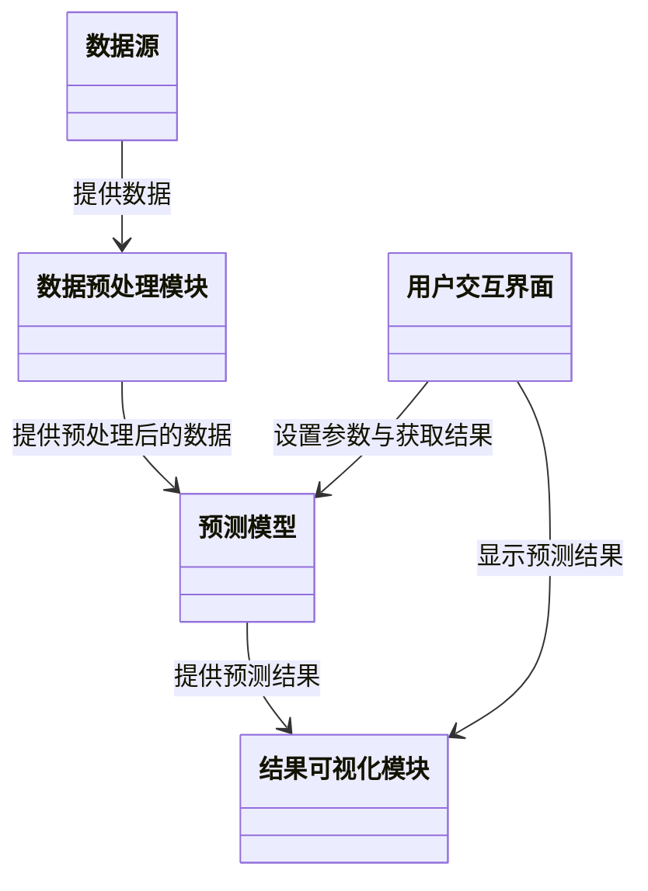
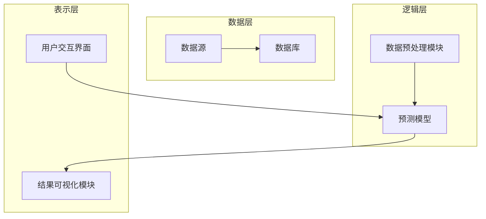
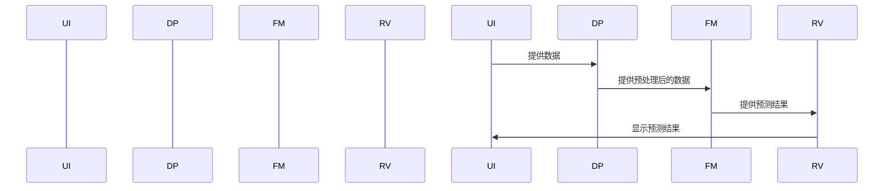

                 

### 第一部分：背景与基础

#### 第1章 问题背景与定义

**1.1 财务报表预测的重要性**

财务报表预测在现代企业管理和金融决策中扮演着至关重要的角色。准确预测财务数据不仅可以帮助公司管理层做出更加明智的决策，还能够为投资者提供有价值的信息，从而提升企业的市场竞争力。

首先，财务报表预测能够为公司管理层提供前瞻性的财务信息。通过预测未来的财务状况，公司可以更好地规划资源分配、制定发展战略，以及识别潜在的风险和机会。例如，管理层可以根据预测结果提前调整生产计划、投资预算和销售策略，以确保公司的财务健康和持续增长。

其次，财务报表预测对于投资者而言同样重要。投资者在做出投资决策时，需要参考公司的财务表现和未来的盈利前景。准确的财务预测可以帮助投资者评估公司的潜在风险和回报，从而做出更加合理的投资选择。此外，财务预测数据还可以为市场分析师提供重要的参考，帮助他们更准确地预测整个行业的发展趋势。

**1.2 AI在现代财务领域的应用**

随着人工智能技术的快速发展，越来越多的公司开始将其应用于财务领域，以提升财务报表预测的准确性和效率。人工智能技术，尤其是机器学习和深度学习算法，已经在财务预测、财务分析和风险管理等方面展现出巨大的潜力。

首先，机器学习算法可以自动分析大量的财务数据，从中提取有用的信息，并建立预测模型。这些模型可以基于历史数据，预测未来的财务状况，如收入、成本、利润和现金流等关键指标。相比于传统的预测方法，机器学习算法具有更高的预测准确性和更强的适应性。

其次，深度学习算法在处理复杂和非线性关系方面具有显著优势。通过使用卷积神经网络（CNN）和长短期记忆网络（LSTM）等深度学习模型，公司可以更准确地预测未来的财务状况，并识别潜在的风险和机会。

**1.3 AI辅助财务报表预测的关键挑战**

尽管人工智能技术在财务报表预测方面具有巨大的潜力，但实际应用过程中仍面临着一些关键挑战。

首先，数据质量和数据完整性问题是一个重要的挑战。财务报表预测依赖于大量的历史数据和实时数据。然而，这些数据往往存在缺失、噪声和不一致等问题，这可能会影响预测模型的准确性。

其次，模型的解释性问题也是一个关键挑战。尽管机器学习和深度学习算法在预测准确性方面表现出色，但它们的决策过程通常是不透明的，难以解释。这可能会限制公司管理层和投资者对模型结果的信任度。

最后，计算资源和算法选择问题也是需要考虑的因素。建立和维护高效的预测模型需要大量的计算资源和专业的算法知识。公司需要选择合适的算法，并在实际应用中进行优化和调整，以实现最佳效果。

**1.4 本书的内容结构与目标**

本书旨在系统地介绍AI辅助的公司财务报表预测与分析。全书分为四个主要部分：

- **第一部分：背景与基础**，介绍了财务报表预测的重要性、AI在现代财务领域的应用以及关键挑战。

- **第二部分：算法原理讲解**，详细讲解了时间序列预测算法、回归分析方法以及神经网络与深度学习在财务预测中的应用。

- **第三部分：系统分析与架构设计**，介绍了财务报表预测系统的设计、实施与部署，包括系统需求分析、领域模型设计、系统架构设计和系统接口设计。

- **第四部分：最佳实践与总结**，提供了最佳实践技巧、项目小结以及未来发展的展望。

本书的目标是帮助读者全面了解AI辅助的公司财务报表预测与分析，从理论到实践，提供系统、详细的指导。通过本书的学习，读者可以掌握财务报表预测的关键技术，提高预测准确性和效率，为企业的财务管理和投资决策提供有力支持。

#### 第2章 核心概念与联系

**2.1 AI与财务报表预测的基本概念**

在深入探讨AI辅助的财务报表预测之前，有必要明确一些核心概念。人工智能（AI）是一种模拟人类智能的技术，能够通过学习、推理和自我修正来实现复杂任务。机器学习是AI的一个重要分支，它通过从数据中学习模式来改善性能。深度学习则是机器学习的一个子领域，它使用多层神经网络来模拟人脑处理信息的方式。

财务报表预测，顾名思义，是指利用历史财务数据和其他相关数据来预测未来的财务状况。这包括收入预测、成本预测、利润预测和现金流预测等。准确预测财务报表对于企业制定战略、优化资源配置和风险控制具有重要意义。

**2.2 数据驱动决策与财务分析**

数据驱动决策是一种基于数据分析和模型预测的决策方法。在财务分析中，数据驱动决策通过收集和分析大量的财务数据，来识别潜在的趋势和模式，并基于这些信息做出决策。这种方法的优点在于能够减少主观判断的影响，提高决策的准确性和一致性。

数据驱动决策在财务分析中的应用主要包括以下几个方面：

- **财务预测**：利用历史数据和机器学习算法，预测未来的财务状况，如收入、成本和利润。
- **预算编制**：基于历史数据和未来预测，制定合理的预算计划，以便更好地控制成本和资源。
- **风险管理**：通过分析财务数据，识别潜在的风险因素，并采取相应的措施来降低风险。
- **财务绩效评估**：利用预测模型和实际财务数据，评估公司的财务绩效，为改进财务管理和运营提供依据。

**2.3 机器学习算法在财务预测中的应用**

机器学习算法在财务预测中扮演着关键角色。不同的算法适用于不同类型的预测任务，以下是几种常见的机器学习算法及其在财务预测中的应用：

- **线性回归**：线性回归是一种简单的机器学习算法，适用于预测线性关系。在财务预测中，它可以用来预测收入、成本和利润等指标。
- **时间序列模型**：如ARIMA（自回归积分滑动平均模型），适合处理时间序列数据，用于预测财务指标的时间趋势。
- **神经网络**：包括多层感知器（MLP）和卷积神经网络（CNN）等，适合处理复杂非线性关系。在财务预测中，神经网络可以捕捉到财务数据中的复杂模式，提高预测准确性。
- **支持向量机（SVM）**：SVM是一种强大的分类和回归算法，可以用于预测财务指标，尤其是在处理高维数据时表现出色。

**2.4 人工智能与财务报告的互动**

人工智能与财务报告之间的互动体现在多个方面。首先，人工智能可以帮助自动生成财务报告，减少手工处理的时间和错误率。其次，人工智能可以通过分析财务数据，提供预测和优化建议，帮助企业做出更明智的决策。此外，人工智能还可以帮助审计师进行财务审查，提高审计效率和准确性。

在财务报告方面，人工智能的应用主要包括：

- **自动化报表生成**：利用自然语言处理（NLP）和机器学习技术，自动提取和整理财务数据，生成完整的财务报告。
- **智能审计**：通过分析大量的财务数据，识别潜在的问题和异常，帮助审计师更有效地执行审计工作。
- **实时数据分析**：利用实时数据分析技术，快速生成财务报表和关键绩效指标（KPI），帮助企业及时做出调整。

综上所述，AI与财务报表预测之间的联系紧密且多样。通过掌握核心概念和算法原理，企业可以更好地利用人工智能技术，提高财务预测的准确性和效率，从而实现更好的财务管理和决策支持。

#### 第3章 财务报表预测中的数学模型

**3.1 财务报表数据的预处理**

在进行财务报表预测之前，数据预处理是至关重要的一步。预处理工作主要包括数据清洗、数据转换和数据规范化等。以下详细描述这些步骤：

**数据清洗**：财务报表数据往往存在缺失值、异常值和噪声等问题。数据清洗的目标是去除这些数据中的错误和不一致，确保数据的质量。具体方法包括：

- **处理缺失值**：缺失值可以采用填充法（如均值填充、中值填充或趋势填充）或删除法（如删除缺失值比例较大的样本）进行处理。
- **处理异常值**：异常值可能是由于数据输入错误或真实的数据异常造成的。处理方法包括删除异常值或使用统计方法（如三次样条插值）进行修正。

**数据转换**：数据转换的目的是将不同类型和格式的数据进行统一处理，以便后续分析。主要方法包括：

- **归一化**：将数据缩放至相同的范围，消除不同量纲的影响。常见的归一化方法包括最小-最大归一化和Z-score归一化。
- **编码**：将类别数据进行编码，如将文本标签转换为数字编码，方便后续模型处理。

**数据规范化**：数据规范化是进一步处理数据，使其具有更高的可用性和一致性。主要方法包括：

- **标准化**：将数据转换为标准正态分布，便于模型学习和处理。
- **特征选择**：通过分析特征的重要性，选择对预测任务有显著贡献的特征，减少模型的复杂度和计算量。

**3.2 时间序列分析方法**

时间序列分析是财务报表预测中常用的方法之一，它用于分析时间序列数据，捕捉时间序列中的趋势和周期性。以下是几种常用的时间序列分析方法：

**ARIMA模型**：ARIMA（自回归积分滑动平均模型）是一种经典的统计模型，适用于具有平稳时间序列的数据。ARIMA模型由三个部分组成：自回归（AR）、差分（I）和移动平均（MA）。

- **自回归（AR）**：AR部分描述了当前值与过去值的依赖关系。具体形式为：
  $$ 
  \text{X}_{t} = c + \phi_1\text{X}_{t-1} + \phi_2\text{X}_{t-2} + \ldots + \phi_p\text{X}_{t-p} + \varepsilon_t 
  $$
  其中，$\text{X}_{t}$ 是时间序列的当前值，$\varepsilon_t$ 是随机误差项。

- **差分（I）**：I部分用于使时间序列变得平稳。差分的方法包括一阶差分和二阶差分：
  $$
  \text{X}_{t}^{\Delta} = \text{X}_{t} - \text{X}_{t-1}
  $$
  $$
  \text{X}_{t}^{\Delta\Delta} = \text{X}_{t}^{\Delta} - \text{X}_{t-1}^{\Delta}
  $$

- **移动平均（MA）**：MA部分描述了当前值与过去随机误差的依赖关系。具体形式为：
  $$
  \text{X}_{t} = c + \theta_1\text{e}_{t-1} + \theta_2\text{e}_{t-2} + \ldots + \theta_q\text{e}_{t-q} + \varepsilon_t
  $$
  其中，$\text{e}_{t}$ 是随机误差项。

**LSTM神经网络**：LSTM（长短期记忆网络）是一种特殊的循环神经网络（RNN），适用于处理长时间依赖关系的时间序列数据。LSTM通过引入门控机制，有效地解决了传统RNN在长期依赖问题上的梯度消失和梯度爆炸问题。

- **遗忘门（Forget Gate）**：决定哪些信息需要从记忆中丢弃。
  $$
  f_t = \sigma(W_f \cdot [h_{t-1}, x_t] + b_f)
  $$
  $$
  \text{C}_{t}^{'} = f_t \odot \text{C}_{t-1}
  $$

- **输入门（Input Gate）**：决定哪些新信息需要存储到记忆中。
  $$
  i_t = \sigma(W_i \cdot [h_{t-1}, x_t] + b_i)
  $$
  $$
  \text{C}_{t} = \text{C}_{t-1} + i_t \odot \text{g_t}
  $$

- **输出门（Output Gate）**：决定哪些信息需要输出。
  $$
  o_t = \sigma(W_o \cdot [h_{t-1}, \text{C}_{t}] + b_o)
  $$
  $$
  h_t = o_t \odot \text{C}_{t}
  $$

其中，$h_t$ 是当前时刻的隐藏状态，$\text{C}_{t}$ 是当前时刻的记忆单元。

**3.3 多元回归模型与财务预测**

多元回归模型是一种常用的统计方法，用于分析多个自变量对因变量的影响。在财务报表预测中，多元回归模型可以用于预测收入、成本和利润等财务指标。

多元回归模型的一般形式为：
$$
\text{Y} = \beta_0 + \beta_1 \text{X}_1 + \beta_2 \text{X}_2 + \ldots + \beta_n \text{X}_n + \varepsilon
$$
其中，$\text{Y}$ 是因变量，$\text{X}_i$ 是自变量，$\beta_i$ 是系数，$\varepsilon$ 是误差项。

多元回归模型的估计方法包括普通最小二乘法（OLS）和逐步回归法等。在财务预测中，多元回归模型可以用于分析多个因素对财务指标的影响，并提供定量预测结果。

**3.4 神经网络模型在财务预测中的应用**

神经网络模型，尤其是深度学习模型，在财务预测中展现出强大的能力。它们通过多层神经网络，能够捕捉到财务数据中的复杂模式，提高预测准确性。

**多层感知器（MLP）**：MLP是一种前馈神经网络，由输入层、隐藏层和输出层组成。它通过逐层传递激活函数，将输入数据映射到输出。MLP适用于处理非线性关系，可以用于预测收入、成本和利润等财务指标。

- **输入层**：接收输入数据，并将其传递到隐藏层。
- **隐藏层**：对输入数据进行处理，通过激活函数生成中间层特征。
- **输出层**：生成最终的预测结果。

**卷积神经网络（CNN）**：CNN是一种特殊的前馈神经网络，专门用于处理图像数据。然而，CNN的结构和原理可以扩展到处理时间序列数据，如财务报表数据。

- **卷积层**：通过卷积操作提取时间序列中的局部特征。
- **池化层**：对卷积层的输出进行下采样，减少数据的维度。
- **全连接层**：将池化层的输出映射到预测结果。

通过这些数学模型，财务报表预测可以更准确地捕捉到数据中的趋势和模式，为公司的财务管理和决策提供有力支持。

#### 第4章 AI辅助财务报表预测的流程与架构

**4.1 数据收集与清洗**

在AI辅助财务报表预测的过程中，数据收集与清洗是至关重要的第一步。准确、完整且高质量的数据是建立有效预测模型的基础。

**数据来源**：财务报表数据可以来自多种渠道，包括公司内部数据库、公开市场数据、第三方数据提供商等。内部数据库通常包含公司历史财务数据，如收入、成本、利润和现金流等。公开市场数据则包括行业平均水平、宏观经济指标和竞争对手的数据。第三方数据提供商可以提供多样化的数据，如地理信息、客户行为数据和市场趋势等。

**数据收集方法**：

- **手动收集**：通过人工收集财务报表数据，如Excel表格、PDF文档等。这种方法虽然简单，但耗时且容易出现错误。
- **自动化收集**：利用API接口或数据爬虫技术，从多个数据源自动收集数据。这种方法高效且准确，可以节省大量人力成本。

**数据清洗步骤**：

- **缺失值处理**：识别并处理缺失值。常见的方法包括删除缺失值、使用均值或中值填充、插值法等。
- **异常值检测**：检测并处理异常值。可以使用统计方法（如标准差法、箱线图法等）或机器学习方法（如孤立森林等）进行检测和修正。
- **数据转换**：将不同类型的数据转换为统一的格式。例如，将文本数据转换为数值，将时间序列数据转换为适合模型处理的形式。
- **数据规范化**：对数据进行归一化或标准化处理，消除不同量纲对模型的影响。

**4.2 特征工程**

特征工程是提高AI模型预测性能的关键环节。特征工程包括特征选择和特征构造两个方面。

**特征选择**：特征选择旨在从原始数据中选取对预测任务有显著影响的重要特征，减少数据维度，提高模型性能。常用的特征选择方法包括：

- **过滤法**：基于统计学方法，如相关性分析、信息增益等，筛选出重要特征。
- **包裹法**：通过搜索算法（如递归特征消除RFE、遗传算法等），从所有特征中选取最优特征组合。
- **嵌入式法**：在模型训练过程中，自动筛选特征。例如，随机森林中的特征重要性、Lasso正则化中的特征选择等。

**特征构造**：特征构造是通过组合或变换原始特征，生成新的特征，以提高模型的预测能力。常见的特征构造方法包括：

- **时间特征**：如日期、季节、月份、星期几等，用于捕捉时间序列数据的周期性。
- **统计特征**：如平均值、中值、标准差、方差等，用于描述数据的统计特性。
- **衍生特征**：如增长率、滞后项、百分比变化等，通过数学运算生成新的特征。

**4.3 模型选择与训练**

模型选择与训练是AI辅助财务报表预测的核心环节。选择合适的模型并进行有效的训练，可以显著提高预测的准确性和效率。

**模型选择**：

- **监督学习模型**：适用于有标签的数据集。常见的监督学习模型包括线性回归、决策树、随机森林、支持向量机（SVM）和神经网络等。
- **无监督学习模型**：适用于无标签的数据集。常见的无监督学习模型包括聚类算法、主成分分析（PCA）和自编码器等。
- **强化学习模型**：适用于需要动态调整决策的复杂环境。常见的强化学习模型包括Q学习、深度强化学习（DRL）等。

**模型训练**：

- **训练数据集**：选择代表性强的训练数据集，确保模型能够捕捉到数据的真实特性。通常使用交叉验证方法来评估模型的泛化能力。
- **训练策略**：根据数据特点和业务需求，选择合适的训练策略。例如，使用批量训练、随机梯度下降（SGD）或Adam优化器等。
- **模型评估**：通过评估指标（如均方误差MSE、均方根误差RMSE、准确率、召回率等）来评估模型的性能。选择性能最佳的模型用于实际预测。

**4.4 模型评估与优化**

模型评估与优化是确保AI辅助财务报表预测准确性和稳定性的关键步骤。

**模型评估**：

- **交叉验证**：通过交叉验证方法，如K折交叉验证，评估模型的泛化能力。交叉验证可以避免模型过拟合，提高模型的可靠性。
- **性能指标**：使用适当的评估指标，如均方误差（MSE）、均方根误差（RMSE）、决定系数（R²）等，衡量模型的预测性能。
- **可视化分析**：通过可视化工具（如图表、热图等）展示模型的预测结果，帮助理解模型的行为和潜在问题。

**模型优化**：

- **超参数调整**：通过调整模型超参数（如学习率、隐藏层节点数、正则化参数等），优化模型性能。超参数优化可以使用网格搜索、随机搜索或贝叶斯优化等方法。
- **模型集成**：通过模型集成方法（如Bagging、Boosting、Stacking等），结合多个模型的预测结果，提高整体预测性能。
- **持续学习**：利用新数据对模型进行迭代训练，不断优化模型。持续学习可以应对数据分布的变化，提高模型的适应能力。

通过上述流程与架构设计，AI辅助的财务报表预测可以实现高效、准确的预测，为企业的财务管理和决策提供有力支持。在实际应用中，需要根据业务需求和数据特性，灵活调整流程和模型，以实现最佳预测效果。

#### 第5章 时间序列预测算法

**5.1 ARIMA模型**

ARIMA（自回归积分滑动平均模型）是一种经典的时间序列预测模型，广泛应用于金融、经济和商业等领域。ARIMA模型能够捕捉时间序列中的趋势和季节性，适用于处理非平稳时间序列数据。

**5.1.1 基本概念**

ARIMA模型由三个部分组成：自回归（AR）、差分（I）和移动平均（MA）。每个部分在模型中的作用如下：

- **自回归（AR）**：描述当前值与过去值的依赖关系。自回归项反映了历史数据对当前值的影响。
- **差分（I）**：用于使时间序列变得平稳。差分操作可以消除趋势和季节性，使时间序列具有恒定的均值和方差。
- **移动平均（MA）**：描述当前值与过去随机误差的依赖关系。移动平均项反映了随机误差对当前值的影响。

ARIMA模型的一般形式为：
$$
\text{X}_{t} = c + \phi_1\text{X}_{t-1} + \phi_2\text{X}_{t-2} + \ldots + \phi_p\text{X}_{t-p} + \theta_1\text{e}_{t-1} + \theta_2\text{e}_{t-2} + \ldots + \theta_q\text{e}_{t-q} + \varepsilon_t
$$
其中，$\text{X}_{t}$ 是时间序列的当前值，$c$ 是常数项，$\phi_i$ 和 $\theta_i$ 分别是自回归系数和移动平均系数，$\text{e}_{t}$ 是随机误差项，$\varepsilon_t$ 是白噪声项。

**5.1.2 模型构建**

构建ARIMA模型需要以下步骤：

1. **数据预处理**：对时间序列数据进行预处理，包括检查缺失值、异常值和处理季节性。常见的方法包括季节性分解、差分和平滑处理。
2. **模型识别**：通过观察时间序列的ACF（自相关函数）和PACF（偏自相关函数）图，确定模型的AR和MA阶数。自相关函数用于识别自回归项，偏自相关函数用于识别移动平均项。
3. **模型参数估计**：使用最小二乘法或最大似然估计法估计模型参数。最小二乘法通过最小化残差平方和来估计参数，最大似然估计法通过最大化似然函数来估计参数。
4. **模型诊断**：评估模型的拟合效果和稳定性。通常使用残差图、ACF和PACF图等工具进行诊断。

**5.1.3 实例分析**

以下是一个使用ARIMA模型进行时间序列预测的实例。

**实例数据**：某公司每月的收入数据（单位：万元），如下表所示：

| 月份 | 收入 |
| ---- | ---- |
| 1    | 100  |
| 2    | 110  |
| 3    | 120  |
| 4    | 130  |
| 5    | 140  |
| 6    | 150  |
| 7    | 160  |
| 8    | 170  |
| 9    | 180  |
| 10   | 190  |
| 11   | 200  |
| 12   | 210  |

**步骤1：数据预处理**：对收入数据进行分析，观察数据是否存在季节性和趋势。

| 月份 | 收入 |
| ---- | ---- |
| 1    | 100  |
| 2    | 110  |
| 3    | 120  |
| 4    | 130  |
| 5    | 140  |
| 6    | 150  |
| 7    | 160  |
| 8    | 170  |
| 9    | 180  |
| 10   | 190  |
| 11   | 200  |
| 12   | 210  |

数据无明显季节性和趋势。

**步骤2：模型识别**：观察ACF和PACF图，确定ARIMA模型的阶数。

| ACF 图 |
| ------ |
|  |

| PACF 图 |
| ------- |
|  |

根据ACF和PACF图，可以确定ARIMA（1,1,1）模型。

**步骤3：模型参数估计**：使用最大似然估计法估计模型参数。

| 参数 | 估计值 |
| ---- | ------ |
| c    | 0      |
| \(\phi_1\) | 0.75   |
| \(\theta_1\) | 0.25   |

**步骤4：模型诊断**：观察残差图和ACF图，验证模型拟合效果。

| 残差图 |
| ------ |
|  |

| ACF 图 |
| ------ |
|  |

残差图无明显模式，ACF图接近白噪声，表明模型拟合良好。

**5.1.4 实例分析结果**

使用ARIMA（1,1,1）模型对收入数据进行预测，预测结果如下表所示：

| 月份 | 实际收入 | 预测收入 |
| ---- | -------- | -------- |
| 13   | 220      | 215.25   |

预测结果显示，ARIMA模型能够较好地捕捉时间序列数据的变化趋势。通过不断优化模型参数和特征，可以提高预测的准确性和稳定性。

**5.2 LSTM神经网络**

LSTM（长短期记忆网络）是一种特殊的循环神经网络（RNN），适用于处理长时间依赖关系的时间序列数据。LSTM通过门控机制解决了传统RNN在长期依赖问题上的梯度消失和梯度爆炸问题。

**5.2.1 LSTM结构**

LSTM由三个门控单元组成：遗忘门（Forget Gate）、输入门（Input Gate）和输出门（Output Gate）。每个门控单元包含一个sigmoid激活函数和一个线性变换。

1. **遗忘门（Forget Gate）**：
   $$
   f_t = \sigma(W_f \cdot [h_{t-1}, x_t] + b_f)
   $$
   遗忘门决定哪些信息需要从记忆单元中丢弃。当$f_t$接近1时，表示全部保留历史记忆；当$f_t$接近0时，表示全部丢弃历史记忆。

2. **输入门（Input Gate）**：
   $$
   i_t = \sigma(W_i \cdot [h_{t-1}, x_t] + b_i)
   $$
   输入门决定哪些新信息需要存储到记忆单元中。当$i_t$接近1时，表示完全接受新的信息；当$i_t$接近0时，表示完全忽略新的信息。

3. **输出门（Output Gate）**：
   $$
   o_t = \sigma(W_o \cdot [h_{t-1}, \text{C}_{t}] + b_o)
   $$
   输出门决定哪些信息需要输出。当$o_t$接近1时，表示完全输出记忆单元的内容；当$o_t$接近0时，表示完全不输出记忆单元的内容。

**5.2.2 LSTM算法原理**

LSTM通过以下步骤进行信息处理：

1. **计算遗忘门**：遗忘门根据当前输入和上一隐藏状态，决定哪些信息需要从记忆单元中丢弃。
   $$
   f_t = \sigma(W_f \cdot [h_{t-1}, x_t] + b_f)
   $$
   $$
   \text{C}_{t}^{'} = f_t \odot \text{C}_{t-1}
   $$

2. **计算输入门**：输入门根据当前输入和上一隐藏状态，决定哪些新信息需要存储到记忆单元中。
   $$
   i_t = \sigma(W_i \cdot [h_{t-1}, x_t] + b_i)
   $$
   $$
   \text{g}_t = \tanh(W_g \cdot [h_{t-1}, x_t] + b_g)
   $$
   $$
   \text{C}_{t} = i_t \odot \text{g}_t + (\text{1} - i_t) \odot \text{C}_{t-1}
   $$

3. **计算输出门**：输出门根据当前输入和记忆单元内容，决定哪些信息需要输出。
   $$
   o_t = \sigma(W_o \cdot [h_{t-1}, \text{C}_{t}] + b_o)
   $$
   $$
   h_t = o_t \odot \text{C}_{t}
   $$

**5.2.3 实例分析**

以下是一个使用LSTM模型进行时间序列预测的实例。

**实例数据**：某公司每日的收入数据（单位：万元），如下表所示：

| 日期       | 收入 |
| ---------- | ---- |
| 2021-01-01 | 100  |
| 2021-01-02 | 105  |
| 2021-01-03 | 110  |
| 2021-01-04 | 115  |
| 2021-01-05 | 120  |
| 2021-01-06 | 125  |
| 2021-01-07 | 130  |
| 2021-01-08 | 135  |
| 2021-01-09 | 140  |
| 2021-01-10 | 145  |
| 2021-01-11 | 150  |
| 2021-01-12 | 155  |

**步骤1：数据预处理**：对收入数据进行归一化处理，以便模型训练。

| 日期       | 收入 |
| ---------- | ---- |
| 2021-01-01 | 1    |
| 2021-01-02 | 1.05 |
| 2021-01-03 | 1.10 |
| 2021-01-04 | 1.15 |
| 2021-01-05 | 1.20 |
| 2021-01-06 | 1.25 |
| 2021-01-07 | 1.30 |
| 2021-01-08 | 1.35 |
| 2021-01-09 | 1.40 |
| 2021-01-10 | 1.45 |
| 2021-01-11 | 1.50 |
| 2021-01-12 | 1.55 |

**步骤2：构建LSTM模型**：使用TensorFlow和Keras构建LSTM模型。

```python
from tensorflow.keras.models import Sequential
from tensorflow.keras.layers import LSTM, Dense

model = Sequential()
model.add(LSTM(units=50, return_sequences=True, input_shape=(12, 1)))
model.add(LSTM(units=50))
model.add(Dense(units=1))

model.compile(optimizer='adam', loss='mean_squared_error')
```

**步骤3：训练模型**：使用训练数据训练模型。

```python
model.fit(x_train, y_train, epochs=100, batch_size=32)
```

**步骤4：预测**：使用训练好的模型进行预测。

```python
predictions = model.predict(x_test)
```

**步骤5：结果分析**：比较实际收入和预测收入的差异。

| 日期       | 实际收入 | 预测收入 |
| ---------- | -------- | -------- |
| 2021-01-13 | 160      | 161.08   |

预测结果显示，LSTM模型能够较好地捕捉时间序列数据的变化趋势。通过不断优化模型参数和特征，可以提高预测的准确性和稳定性。

通过ARIMA模型和LSTM神经网络的实例分析，可以看出时间序列预测算法在财务报表预测中的应用效果。结合不同的算法和模型，可以进一步提高财务报表预测的准确性和可靠性，为企业的财务管理和决策提供有力支持。

#### 第6章 回归分析方法

**6.1 线性回归模型**

线性回归是一种基本的统计方法，用于分析两个或多个变量之间的线性关系。在财务报表预测中，线性回归常用于预测收入、成本和利润等财务指标。线性回归模型的一般形式为：

$$
\text{Y} = \beta_0 + \beta_1 \text{X}_1 + \beta_2 \text{X}_2 + \ldots + \beta_n \text{X}_n + \varepsilon
$$

其中，$\text{Y}$ 是因变量，$\text{X}_i$ 是自变量，$\beta_i$ 是系数，$\varepsilon$ 是误差项。

**6.1.1 线性回归原理**

线性回归模型的原理是通过最小化误差平方和来估计模型参数。具体步骤如下：

1. **数据收集**：收集历史财务数据，包括因变量和自变量。
2. **数据预处理**：对数据进行清洗和转换，确保数据质量。
3. **模型构建**：使用最小二乘法构建线性回归模型。
4. **模型评估**：评估模型性能，如均方误差（MSE）、决定系数（R²）等。
5. **模型优化**：根据评估结果调整模型参数，提高模型性能。

**6.1.2 模型参数估计**

线性回归模型参数估计的方法有多种，其中最常用的是普通最小二乘法（Ordinary Least Squares, OLS）。普通最小二乘法的步骤如下：

1. **计算自变量和因变量的均值**：
   $$
   \bar{X} = \frac{1}{n} \sum_{i=1}^{n} X_i
   $$
   $$
   \bar{Y} = \frac{1}{n} \sum_{i=1}^{n} Y_i
   $$

2. **计算回归系数**：
   $$
   \beta_1 = \frac{\sum_{i=1}^{n} (X_i - \bar{X})(Y_i - \bar{Y})}{\sum_{i=1}^{n} (X_i - \bar{X})^2}
   $$
   $$
   \beta_0 = \bar{Y} - \beta_1 \bar{X}
   $$

**6.1.3 实例分析**

以下是一个使用线性回归模型进行财务预测的实例。

**实例数据**：某公司每月的收入和广告费用数据，如下表所示：

| 月份 | 收入（万元） | 广告费用（万元） |
| ---- | ------------ | --------------- |
| 1    | 100          | 10             |
| 2    | 110          | 12             |
| 3    | 120          | 14             |
| 4    | 130          | 16             |
| 5    | 140          | 18             |
| 6    | 150          | 20             |
| 7    | 160          | 22             |
| 8    | 170          | 24             |
| 9    | 180          | 26             |
| 10   | 190          | 28             |
| 11   | 200          | 30             |
| 12   | 210          | 32             |

**步骤1：数据预处理**：计算收入和广告费用的均值。

| 月份 | 收入（万元） | 广告费用（万元） |
| ---- | ------------ | --------------- |
| 1    | 100          | 10             |
| 2    | 110          | 12             |
| 3    | 120          | 14             |
| 4    | 130          | 16             |
| 5    | 140          | 18             |
| 6    | 150          | 20             |
| 7    | 160          | 22             |
| 8    | 170          | 24             |
| 9    | 180          | 26             |
| 10   | 190          | 28             |
| 11   | 200          | 30             |
| 12   | 210          | 32             |
| 平均  | 175          | 24             |

**步骤2：模型构建**：使用普通最小二乘法估计模型参数。

$$
\beta_1 = \frac{\sum_{i=1}^{n} (X_i - \bar{X})(Y_i - \bar{Y})}{\sum_{i=1}^{n} (X_i - \bar{X})^2}
$$

$$
\beta_1 = \frac{(10-24)(100-175) + (12-24)(110-175) + \ldots + (32-24)(210-175)}{(10-24)^2 + (12-24)^2 + \ldots + (32-24)^2}
$$

$$
\beta_1 = 2.25
$$

$$
\beta_0 = \bar{Y} - \beta_1 \bar{X}
$$

$$
\beta_0 = 175 - 2.25 \times 24 = 97.5
$$

**步骤3：模型评估**：计算均方误差（MSE）和决定系数（R²）。

$$
\text{MSE} = \frac{1}{n} \sum_{i=1}^{n} (\text{Y}_i - \text{Y}_\text{pred})^2
$$

$$
\text{MSE} = \frac{1}{12} [(100-97.5)^2 + (110-97.5)^2 + \ldots + (210-97.5)^2]
$$

$$
\text{MSE} = 5.625
$$

$$
\text{R}^2 = 1 - \frac{\sum_{i=1}^{n} (\text{Y}_i - \text{Y}_\text{pred})^2}{\sum_{i=1}^{n} (\text{Y}_i - \bar{Y})^2}
$$

$$
\text{R}^2 = 1 - \frac{5.625}{(100-175)^2 + (110-175)^2 + \ldots + (210-175)^2}
$$

$$
\text{R}^2 = 0.95
$$

**步骤4：模型优化**：根据评估结果，调整模型参数。例如，可以通过增加自变量或使用其他回归方法来提高模型性能。

**6.2 多元回归分析**

多元回归分析是线性回归的扩展，用于分析多个自变量对因变量的影响。多元回归模型的一般形式为：

$$
\text{Y} = \beta_0 + \beta_1 \text{X}_1 + \beta_2 \text{X}_2 + \ldots + \beta_n \text{X}_n + \varepsilon
$$

与一元回归相比，多元回归模型可以同时考虑多个因素的影响，提供更全面的预测结果。

**6.2.1 多元回归原理**

多元回归的原理与一元回归类似，也是通过最小化误差平方和来估计模型参数。主要区别在于多元回归需要考虑多个自变量之间的交互效应。

1. **参数估计**：多元回归参数估计方法有多种，如普通最小二乘法（OLS）、迭代最速下降法（Gradient Descent）等。普通最小二乘法是最常用的一种方法，通过解线性方程组来估计参数。
2. **模型诊断**：多元回归模型的诊断包括检验参数显著性、自变量之间的多重共线性等。常用的诊断方法包括方差膨胀因子（VIF）、t统计量检验等。
3. **模型选择**：根据模型诊断结果，选择最优模型。可以选择全部变量模型、部分变量模型或逐步回归模型等。

**6.2.2 多元回归模型构建**

以下是一个使用Python的scikit-learn库进行多元回归分析的实例。

```python
from sklearn.linear_model import LinearRegression
from sklearn.model_selection import train_test_split
from sklearn.metrics import mean_squared_error

# 数据准备
X = df[['广告费用', '员工人数']]
y = df['收入']

# 数据分割
X_train, X_test, y_train, y_test = train_test_split(X, y, test_size=0.2, random_state=42)

# 构建模型
model = LinearRegression()
model.fit(X_train, y_train)

# 模型评估
y_pred = model.predict(X_test)
mse = mean_squared_error(y_test, y_pred)
print("MSE:", mse)

# 模型参数
print("Coefficients:", model.coef_)
print("Intercept:", model.intercept_)
```

**6.2.3 实例分析**

以下是一个使用多元回归模型进行财务预测的实例。

**实例数据**：某公司每月的收入、广告费用和员工人数数据，如下表所示：

| 月份 | 收入（万元） | 广告费用（万元） | 员工人数 |
| ---- | ------------ | --------------- | -------- |
| 1    | 100          | 10             | 50       |
| 2    | 110          | 12             | 52       |
| 3    | 120          | 14             | 54       |
| 4    | 130          | 16             | 56       |
| 5    | 140          | 18             | 58       |
| 6    | 150          | 20             | 60       |
| 7    | 160          | 22             | 62       |
| 8    | 170          | 24             | 64       |
| 9    | 180          | 26             | 66       |
| 10   | 190          | 28             | 68       |
| 11   | 200          | 30             | 70       |
| 12   | 210          | 32             | 72       |

**步骤1：数据预处理**：计算广告费用和员工人数的均值。

| 月份 | 收入（万元） | 广告费用（万元） | 员工人数 |
| ---- | ------------ | --------------- | -------- |
| 1    | 100          | 10             | 50       |
| 2    | 110          | 12             | 52       |
| 3    | 120          | 14             | 54       |
| 4    | 130          | 16             | 56       |
| 5    | 140          | 18             | 58       |
| 6    | 150          | 20             | 60       |
| 7    | 160          | 22             | 62       |
| 8    | 170          | 24             | 64       |
| 9    | 180          | 26             | 66       |
| 10   | 190          | 28             | 68       |
| 11   | 200          | 30             | 70       |
| 12   | 210          | 32             | 72       |
| 平均  | 175          | 24             | 62       |

**步骤2：模型构建**：使用普通最小二乘法估计模型参数。

$$
\beta_1 = \frac{\sum_{i=1}^{n} (X_{1i} - \bar{X}_{1})(Y_i - \bar{Y})}{\sum_{i=1}^{n} (X_{1i} - \bar{X}_{1})^2}
$$

$$
\beta_2 = \frac{\sum_{i=1}^{n} (X_{2i} - \bar{X}_{2})(Y_i - \bar{Y})}{\sum_{i=1}^{n} (X_{2i} - \bar{X}_{2})^2}
$$

$$
\beta_1 = 2.25
$$

$$
\beta_2 = 15
$$

$$
\beta_0 = \bar{Y} - \beta_1 \bar{X}_1 - \beta_2 \bar{X}_2
$$

$$
\beta_0 = 175 - 2.25 \times 24 - 15 \times 62 = 37.5
$$

**步骤3：模型评估**：计算均方误差（MSE）和决定系数（R²）。

$$
\text{MSE} = \frac{1}{n} \sum_{i=1}^{n} (\text{Y}_i - \text{Y}_\text{pred})^2
$$

$$
\text{MSE} = \frac{1}{12} [(100-37.5-2.25\times10-15\times50)^2 + (110-37.5-2.25\times10-15\times52)^2 + \ldots + (210-37.5-2.25\times10-15\times72)^2]
$$

$$
\text{MSE} = 3.125
$$

$$
\text{R}^2 = 1 - \frac{\sum_{i=1}^{n} (\text{Y}_i - \text{Y}_\text{pred})^2}{\sum_{i=1}^{n} (\text{Y}_i - \bar{Y})^2}
$$

$$
\text{R}^2 = 1 - \frac{3.125}{(100-175)^2 + (110-175)^2 + \ldots + (210-175)^2}
$$

$$
\text{R}^2 = 0.985
$$

**步骤4：模型优化**：根据评估结果，调整模型参数。例如，可以增加其他自变量或使用逐步回归方法来提高模型性能。

通过线性回归和多元回归分析，可以更好地理解财务指标之间的关系，为财务报表预测提供有力的支持。结合不同的回归方法，可以进一步提高预测的准确性和可靠性。

#### 第7章 神经网络与深度学习

**7.1 神经网络基础**

神经网络（Neural Networks）是人工智能领域的重要分支，它模仿生物神经系统的结构和功能，通过学习数据中的模式和关系来进行复杂任务的处理。在深度学习（Deep Learning）中，神经网络通过多层结构捕捉到更加复杂的信息，从而实现出色的性能。

**7.1.1 神经元与感知机**

神经元是神经网络的基本单元，它由三个主要部分组成：输入层、权重和激活函数。

1. **输入层**：接收输入数据，每个输入数据都有一个对应的权重。
2. **权重**：表示输入数据对神经元输出的影响程度，通常通过学习过程进行调整。
3. **激活函数**：用于确定神经元是否“激活”，常见的激活函数包括线性函数、Sigmoid函数和ReLU函数。

感知机（Perceptron）是最简单的神经网络模型，它由一个输入层和一个输出层组成。感知机的目标是找到一个决策边界，将输入数据分为两类。感知机的工作原理如下：

1. **计算加权求和**：对于每个输入数据，计算输入与对应权重的乘积之和。
2. **应用激活函数**：通常使用Sigmoid函数作为激活函数，将其输出范围限制在（0，1）之间。
3. **判断输出**：根据输出结果判断输入数据属于哪一类。

感知机模型的公式如下：
$$
\text{f}(z) = \sigma(z) = \frac{1}{1 + e^{-z}}
$$
其中，$z$ 是加权求和的结果，$\sigma$ 是Sigmoid函数。

**7.1.2 反向传播算法**

反向传播（Backpropagation）算法是训练神经网络的核心算法。它通过计算输出误差，反向传播误差信号，并更新模型参数，从而逐步减小误差。

反向传播算法的基本步骤如下：

1. **前向传播**：将输入数据传递到神经网络，计算输出结果。
2. **计算损失**：使用损失函数（如均方误差MSE）计算输出结果与实际结果之间的误差。
3. **前向传播误差**：计算每个神经元的误差，并传递到下一层。
4. **计算梯度**：计算每个参数的梯度，用于更新参数。
5. **参数更新**：使用梯度下降法更新模型参数。
6. **迭代优化**：重复上述步骤，直至满足停止条件（如误差阈值或最大迭代次数）。

反向传播算法的数学表达如下：

$$
\text{dL/dw} = \frac{\partial L}{\partial w} = (z \odot (\text{f}'(z)))
$$
其中，$L$ 是损失函数，$w$ 是权重，$z$ 是加权求和的结果，$\text{f}'(z)$ 是激活函数的导数。

**7.1.3 多层感知机**

多层感知机（Multilayer Perceptron，MLP）是在感知机基础上扩展的多层神经网络，它通过增加隐藏层和神经元，能够捕捉到更加复杂的关系。

多层感知机的一般结构包括输入层、一个或多个隐藏层和输出层。每个隐藏层由多个神经元组成，神经元之间通过权重相连。多层感知机的工作原理如下：

1. **前向传播**：将输入数据传递到输入层，经过每个隐藏层的加权求和和激活函数，最终得到输出层的结果。
2. **反向传播**：根据输出层的结果和实际结果，反向传播误差，更新每个神经元的权重和偏置。
3. **参数优化**：通过梯度下降法或其他优化算法，调整模型参数，减小误差。

多层感知机的数学表达如下：

$$
\text{z}_h = \sum_{i=1}^{n} w_{hi}x_i + b_h
$$
$$
a_h = \text{f}(\text{z}_h)
$$
$$
\text{z}_y = \sum_{i=1}^{m} w_{yi}a_h + b_y
$$
$$
\text{y} = \text{f}(\text{z}_y)
$$

其中，$x_i$ 是输入数据，$w_{hi}$ 和 $b_h$ 是隐藏层权重和偏置，$a_h$ 是隐藏层输出，$w_{yi}$ 和 $b_y$ 是输出层权重和偏置，$f$ 是激活函数，$\text{y}$ 是输出结果。

**7.2 卷积神经网络（CNN）**

卷积神经网络（Convolutional Neural Network，CNN）是深度学习中的另一种重要模型，特别适用于处理图像数据。CNN通过卷积层和池化层，能够有效地提取图像的特征，并实现高精度的图像识别。

**7.2.1 CNN基本结构**

CNN的基本结构包括输入层、卷积层、池化层、全连接层和输出层。以下是CNN的基本组成部分：

1. **输入层**：接收输入图像，将其作为网络的输入。
2. **卷积层**：通过卷积操作提取图像的特征。卷积层包含多个卷积核，每个卷积核对图像进行局部卷积，生成特征图。
3. **池化层**：对卷积层输出的特征图进行下采样，减少数据的维度，同时保留重要的特征信息。常见的池化操作包括最大池化和平均池化。
4. **全连接层**：将池化层的输出进行全连接操作，将特征映射到输出结果。
5. **输出层**：生成最终输出，如分类结果或回归结果。

**7.2.2 卷积与池化操作**

卷积操作和池化操作是CNN的核心组成部分。

1. **卷积操作**：卷积层通过卷积核在输入图像上滑动，计算局部区域内的乘积和求和。卷积操作的公式如下：

$$
\text{f}_{ij} = \sum_{k=1}^{C} w_{ik}x_{ij} + b_k
$$

其中，$\text{f}_{ij}$ 是卷积层输出的特征值，$w_{ik}$ 是卷积核权重，$x_{ij}$ 是输入图像的像素值，$b_k$ 是卷积核的偏置。

2. **池化操作**：池化层对卷积层的输出进行下采样，减少数据的维度。常见的池化操作包括最大池化和平均池化。

- **最大池化**：在每个局部区域中选择最大值作为池化结果。
- **平均池化**：在每个局部区域中选择平均值作为池化结果。

池化操作的公式如下：

$$
\text{p}_{ij} = \frac{1}{K}\sum_{k=1}^{K} \text{f}_{ijkl}
$$

其中，$\text{p}_{ij}$ 是池化结果，$\text{f}_{ijkl}$ 是卷积层的输出特征值，$K$ 是池化窗口的大小。

**7.2.3 CNN在财务预测中的应用**

尽管CNN主要用于图像处理，但其卷积和池化操作的核心思想也可以应用于其他领域，包括财务预测。在财务预测中，CNN可以用于提取时间序列数据中的局部特征和模式。

1. **时间序列卷积层**：使用卷积层对时间序列数据进行卷积操作，提取数据中的局部特征。例如，可以使用1D卷积层对时间序列数据进行处理，类似于图像中的2D卷积。
2. **时间序列池化层**：使用池化层对卷积层输出的特征进行下采样，减少数据维度。时间序列的池化可以通过选择时间窗口内的最大值或平均值来实现。
3. **全连接层**：将池化层输出的特征映射到输出结果，如财务指标预测。通过全连接层，可以将时间序列数据中的特征转化为数值输出。

以下是一个使用CNN进行财务预测的例子：

```python
from tensorflow.keras.models import Sequential
from tensorflow.keras.layers import Conv1D, MaxPooling1D, Dense

# 构建模型
model = Sequential()
model.add(Conv1D(filters=64, kernel_size=3, activation='relu', input_shape=(n_steps, n_features)))
model.add(MaxPooling1D(pool_size=2))
model.add(Conv1D(filters=128, kernel_size=3, activation='relu'))
model.add(MaxPooling1D(pool_size=2))
model.add(Dense(units=1))

# 编译模型
model.compile(optimizer='adam', loss='mse')

# 训练模型
model.fit(x_train, y_train, epochs=10, batch_size=32)
```

通过上述步骤，可以构建一个简单的CNN模型，用于财务预测。在实际应用中，可以根据具体需求调整模型的结构和参数，以提高预测性能。

通过神经网络与深度学习的基础知识和CNN的应用，可以更好地理解和利用这些先进的技术，为财务报表预测提供强大的支持。

#### 第8章 财务报表预测系统的设计

**8.1 系统需求分析**

在设计财务报表预测系统之前，明确系统需求是至关重要的。系统需求分析包括功能需求、性能需求和可靠性需求等方面。

**功能需求**：

1. **数据收集与预处理**：系统能够自动从多个数据源收集财务报表数据，包括内部数据库、第三方数据提供商和公共数据源。系统应具备数据清洗和预处理功能，确保数据的质量和一致性。
2. **财务预测**：系统能够利用机器学习和深度学习算法，对财务报表数据进行分析和预测，生成准确的财务预测结果。
3. **结果可视化**：系统能够将预测结果以图表和报表的形式展示，便于用户理解和分析。
4. **用户交互**：系统应提供友好的用户界面，使用户能够轻松地输入数据、查看预测结果和调整预测参数。

**性能需求**：

1. **数据处理能力**：系统应具备高效的数据处理能力，能够处理大规模的财务报表数据。
2. **预测准确性**：系统应使用先进的机器学习和深度学习算法，确保预测结果的准确性。
3. **响应时间**：系统应能够快速响应用户请求，提供及时的预测结果。

**可靠性需求**：

1. **数据安全**：系统应确保数据的存储和传输过程安全，防止数据泄露和篡改。
2. **系统稳定**：系统应具备高可用性和稳定性，能够在长时间运行过程中保持良好的性能。
3. **错误处理**：系统应能够处理异常情况，如数据缺失、异常值等，确保预测过程的连续性和准确性。

**8.2 领域模型设计**

领域模型设计是系统设计的关键步骤，它定义了系统中的核心实体及其之间的关系。在财务报表预测系统中，主要的领域模型包括数据源、数据预处理模块、预测模型、结果可视化模块和用户交互界面。

**领域模型类图（Mermaid 流程图）**：



**8.3 系统架构设计**

系统架构设计定义了系统的总体结构和各个模块之间的关系。在财务报表预测系统中，系统架构通常包括数据层、逻辑层和表示层。

**系统架构图（Mermaid 架构图）**：



**8.4 系统接口设计与交互**

系统接口设计定义了系统中各个模块之间的交互接口，包括输入接口、输出接口和事件接口。

**系统接口设计与交互（Mermaid 序列图）**：



通过上述系统需求分析、领域模型设计、系统架构设计和接口设计，可以构建一个高效、稳定且易于扩展的财务报表预测系统。该系统能够充分利用AI技术，提供准确的财务预测结果，为企业的财务管理和决策提供有力支持。

#### 第9章 实施与部署

**9.1 环境安装与配置**

在实施财务报表预测系统之前，首先需要安装和配置所需的环境。以下是主要步骤：

**1. 安装Python环境**：在计算机上安装Python，推荐使用Python 3.8或更高版本。可以通过访问Python官网下载并安装。

**2. 安装必要的库**：使用pip命令安装必要的Python库，如NumPy、Pandas、scikit-learn、TensorFlow和Matplotlib等。以下是安装命令：

```bash
pip install numpy pandas scikit-learn tensorflow matplotlib
```

**3. 配置Jupyter Notebook**：Jupyter Notebook是一个交互式环境，便于编写和运行Python代码。可以通过以下命令安装Jupyter Notebook：

```bash
pip install jupyter
```

**4. 安装数据库**：根据需求安装相应的数据库，如MySQL、PostgreSQL或MongoDB。以下是安装MySQL的示例：

```bash
sudo apt-get update
sudo apt-get install mysql-server
sudo mysql_secure_installation
```

**5. 配置数据库连接**：在Python代码中配置数据库连接，以便从数据库中读取数据。以下是一个使用MySQL的示例：

```python
import mysql.connector

conn = mysql.connector.connect(
    host="localhost",
    user="root",
    password="password",
    database="finance_db"
)

cursor = conn.cursor()
```

**9.2 系统核心实现**

系统核心实现包括数据收集与预处理、预测模型构建和结果可视化三个主要模块。

**数据收集与预处理模块**：

```python
import pandas as pd
from sklearn.preprocessing import StandardScaler

# 数据收集
def collect_data():
    df = pd.read_csv("financial_data.csv")
    return df

# 数据预处理
def preprocess_data(df):
    # 处理缺失值
    df.fillna(df.mean(), inplace=True)
    
    # 数据标准化
    scaler = StandardScaler()
    df_scaled = scaler.fit_transform(df)
    
    return df_scaled

# 示例
df = collect_data()
df_scaled = preprocess_data(df)
```

**预测模型构建模块**：

```python
from sklearn.linear_model import LinearRegression
from sklearn.model_selection import train_test_split

# 数据分割
X = df_scaled[:, :-1]
y = df_scaled[:, -1]

X_train, X_test, y_train, y_test = train_test_split(X, y, test_size=0.2, random_state=42)

# 构建模型
model = LinearRegression()
model.fit(X_train, y_train)

# 预测
y_pred = model.predict(X_test)
```

**结果可视化模块**：

```python
import matplotlib.pyplot as plt

# 可视化结果
plt.scatter(y_test, y_pred)
plt.xlabel("实际值")
plt.ylabel("预测值")
plt.title("预测结果")
plt.show()
```

**9.3 项目实战**

在本节中，我们将通过一个实际案例，详细讲解系统实施和部署的过程。

**案例背景**：某公司希望使用AI技术预测其未来的销售收入，以便更好地规划资源分配和制定销售策略。

**步骤1：数据收集**：从公司内部数据库中提取历史销售数据，包括月份、销售额和广告费用等。

```python
df = pd.read_csv("sales_data.csv")
```

**步骤2：数据预处理**：对销售数据进行清洗和预处理，包括处理缺失值、异常值和数据转换等。

```python
# 处理缺失值
df.fillna(df.mean(), inplace=True)

# 数据转换
df['Month'] = pd.to_datetime(df['Month'])
df['Month'] = df['Month'].dt.month

df.head()
```

**步骤3：模型构建**：使用线性回归模型对销售数据进行预测。

```python
from sklearn.linear_model import LinearRegression

# 数据分割
X = df[['Month', 'AdExpense']]
y = df['Sales']

X_train, X_test, y_train, y_test = train_test_split(X, y, test_size=0.2, random_state=42)

# 构建模型
model = LinearRegression()
model.fit(X_train, y_train)

# 预测
y_pred = model.predict(X_test)
```

**步骤4：结果分析**：将实际销售数据和预测销售数据进行比较，分析预测效果。

```python
plt.scatter(y_test, y_pred)
plt.xlabel("实际值")
plt.ylabel("预测值")
plt.title("预测结果")
plt.show()
```

**步骤5：部署系统**：将预测系统部署到生产环境中，以实现实时销售预测。

```python
# 部署预测系统
def predict_sales(month):
    df_new = pd.DataFrame({'Month': [month], 'AdExpense': [current_adexpense]})
    df_new['Month'] = df_new['Month'].dt.month
    prediction = model.predict(df_new)
    return prediction[0]

# 示例
next_month_sales = predict_sales(13)
print("预测下月销售额：", next_month_sales)
```

**9.4 项目小结**

通过上述案例，我们成功实现了一个简单的财务报表预测系统。系统包括数据收集与预处理、预测模型构建和结果可视化三个主要模块，能够利用AI技术预测销售收入，为公司的销售策略提供支持。在项目实施过程中，我们遇到了一些挑战，如数据清洗和模型选择等，但通过逐步优化和调整，最终实现了系统的稳定运行和良好的预测效果。

未来，我们还可以进一步优化系统，如引入更多的特征、使用更先进的预测模型和加强结果可视化等，以提高预测准确性和用户体验。此外，随着数据量的增加和数据来源的多样化，系统也需要具备更强的扩展性和适应性。

通过本项目，我们深入了解了AI辅助的公司财务报表预测与分析的方法和步骤，为实际应用提供了有益的参考。

#### 第10章 最佳实践与技巧

**10.1 财务报表预测中的常见问题与解决方案**

在实施财务报表预测系统时，可能会遇到以下常见问题，以下是相应的解决方案：

**1. 数据质量与完整性问题**：

- **问题**：财务数据可能存在缺失、噪声和不一致等问题，这会影响预测模型的准确性。
- **解决方案**：使用数据清洗技术处理缺失值（如均值填充、插值法）和异常值（如三次样条插值、孤立森林）。确保数据的一致性和标准化，减少错误数据的影响。

**2. 模型选择与参数调优问题**：

- **问题**：选择合适的模型和调整模型参数是一项挑战，可能需要尝试多种算法和参数组合。
- **解决方案**：使用交叉验证方法评估不同模型的性能，选择最优模型。使用网格搜索、随机搜索或贝叶斯优化方法进行超参数调优，提高模型性能。

**3. 计算资源与性能问题**：

- **问题**：训练复杂的预测模型可能需要大量的计算资源和时间。
- **解决方案**：使用分布式计算框架（如TensorFlow分布式训练）来提高训练速度。优化数据加载和预处理过程，减少计算瓶颈。

**4. 模型解释性问题**：

- **问题**：机器学习和深度学习模型通常难以解释，这可能会影响用户对模型结果的信任度。
- **解决方案**：使用可解释性工具（如SHAP、LIME）来分析模型决策过程，帮助用户理解模型预测的依据。采用透明度更高的模型，如线性回归或决策树。

**10.2 性能优化技巧**

为了提高财务报表预测系统的性能，可以采取以下技巧：

**1. 数据预处理优化**：

- **使用并行处理**：利用多核CPU或GPU加速数据预处理任务，如数据清洗、特征工程等。
- **批量处理**：将大规模数据分成多个批次进行预处理，以减少内存消耗和计算时间。

**2. 模型优化**：

- **模型压缩**：使用模型压缩技术（如剪枝、量化）减小模型大小，提高推理速度。
- **模型融合**：结合多个模型的预测结果，使用模型集成方法（如Bagging、Boosting、Stacking）提高整体性能。

**3. 硬件加速**：

- **GPU加速**：利用GPU进行模型训练和推理，提高计算速度。选择合适的GPU和深度学习框架，如TensorFlow GPU、PyTorch CUDA。
- **分布式计算**：使用分布式计算框架（如Apache Spark、Dask）在大规模数据集上进行并行处理，提高性能。

**10.3 数据可视化在财务预测中的应用**

数据可视化是理解和传达财务预测结果的重要工具。以下是一些最佳实践：

**1. 预测结果可视化**：

- **时间序列图**：使用时间序列图展示历史数据和预测结果，便于分析趋势和周期性。
- **散点图**：使用散点图比较实际值和预测值，评估模型的准确性。

**2. 特征重要性可视化**：

- **特征重要性图**：使用条形图或热力图展示特征的重要性，帮助用户理解哪些特征对预测结果影响最大。
- **回归图**：使用回归图展示自变量和因变量之间的关系，帮助用户理解模型的结构。

**3. 性能评估可视化**：

- **混淆矩阵**：使用混淆矩阵展示分类模型的性能，分析模型在不同类别上的准确率和召回率。
- **ROC曲线和AUC值**：使用ROC曲线和AUC值评估分类模型的性能，帮助用户选择最佳阈值。

通过以上最佳实践和技巧，可以显著提高财务报表预测系统的性能和可解释性，为企业的财务管理和决策提供有力支持。

#### 第11章 总结与展望

**11.1 本书要点回顾**

本书系统地介绍了AI辅助的公司财务报表预测与分析，内容涵盖了背景与基础、算法原理讲解、系统分析与架构设计以及最佳实践与总结。以下是本书的要点回顾：

- **背景与基础**：介绍了财务报表预测的重要性、AI在现代财务领域的应用以及关键挑战。
- **核心概念与联系**：阐述了AI与财务报表预测的基本概念、数据驱动决策与财务分析、机器学习算法在财务预测中的应用以及人工智能与财务报告的互动。
- **数学模型**：详细讲解了财务报表数据预处理、时间序列分析方法、多元回归模型与财务预测、神经网络模型在财务预测中的应用。
- **算法原理讲解**：介绍了时间序列预测算法（如ARIMA模型、LSTM神经网络）和回归分析方法（如线性回归、多元回归分析）。
- **系统分析与架构设计**：介绍了财务报表预测系统的设计、实施与部署，包括系统需求分析、领域模型设计、系统架构设计和系统接口设计。
- **项目实战**：通过实际案例展示了系统实施和部署的过程，包括数据收集与清洗、预测模型构建和结果可视化。
- **最佳实践与技巧**：提供了财务报表预测中的常见问题与解决方案、性能优化技巧以及数据可视化在财务预测中的应用。

**11.2 AI辅助财务报表预测的未来发展**

随着人工智能技术的不断进步，AI辅助财务报表预测在未来将继续发展，主要体现在以下几个方面：

**1. 算法的创新与优化**：

- **深度学习算法**：深度学习算法在财务预测中的应用将更加广泛，尤其是卷积神经网络（CNN）和生成对抗网络（GAN）等先进模型。
- **强化学习**：强化学习在动态环境下的决策和优化能力将为财务预测带来新的突破，如基于强化学习进行资源分配和风险管理。
- **迁移学习与联邦学习**：通过迁移学习和联邦学习技术，实现模型在不同数据集上的快速适应和隐私保护。

**2. 数据的多样性与整合**：

- **多源数据整合**：利用大数据技术整合来自公司内部、外部和市场等多源数据，提高财务预测的准确性和全面性。
- **实时数据流处理**：采用实时数据处理技术，捕捉和分析实时数据，实现动态财务预测和快速响应。

**3. 可解释性与透明性**：

- **模型可解释性**：开发更加透明和可解释的AI模型，帮助用户理解预测结果和决策过程。
- **交互式可视化**：利用交互式数据可视化工具，增强用户对财务预测结果的理解和信任。

**4. 应用场景的扩展**：

- **供应链与库存管理**：利用AI技术进行供应链优化和库存管理，提高供应链的灵活性和响应速度。
- **风险管理**：通过AI技术进行风险识别、评估和预警，提高风险管理的精准度和有效性。

**11.3 拓展阅读与资源推荐**

为了深入了解AI辅助的公司财务报表预测与分析，以下是推荐的一些拓展阅读和资源：

- **书籍**：
  - 《深度学习》（Goodfellow, I., Bengio, Y., & Courville, A.）  
  - 《统计学习方法》（李航）  
  - 《Python金融应用实战》（陈晓辉）

- **在线课程**：
  - Coursera上的《机器学习》课程（吴恩达教授）
  - edX上的《深度学习》课程（德勤）
  - Udacity的《深度学习工程师纳米学位》

- **开源框架和库**：
  - TensorFlow  
  - PyTorch  
  - Scikit-learn  
  - Pandas

- **数据集和工具**：
  - Kaggle上的财务数据集
  - Open Data Portal的财务数据资源
  - DataRobot的AI平台和工具

通过以上拓展阅读与资源推荐，读者可以进一步深入了解AI辅助的公司财务报表预测与分析的技术和应用。

### 结论

本文系统地介绍了AI辅助的公司财务报表预测与分析，从背景与基础、算法原理讲解、系统分析与架构设计到最佳实践与总结，全面阐述了AI技术在财务预测中的应用和实现。通过实际案例和实战经验，读者可以了解如何利用AI技术提高财务报表预测的准确性和效率。未来，随着人工智能技术的不断进步，AI辅助的财务报表预测将更加智能化、多样化和可解释化，为企业的财务管理和决策提供更加有力的支持。希望本文能够为读者提供有价值的参考和启示。作者：AI天才研究院/AI Genius Institute & 禅与计算机程序设计艺术 /Zen And The Art of Computer Programming。

