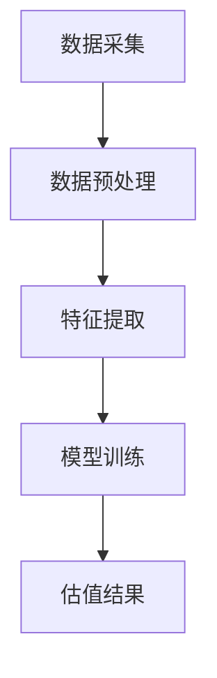
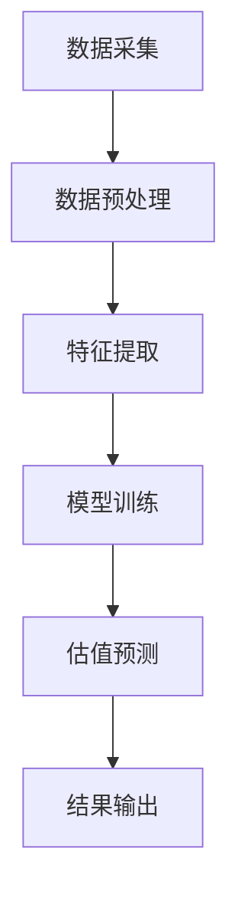
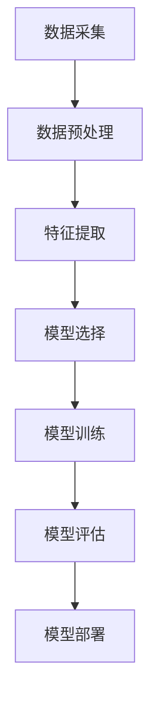
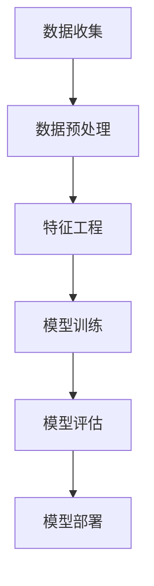
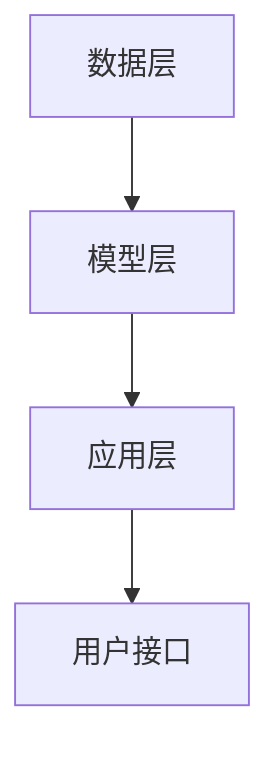

                 

### 文章标题

# AI辅助的创业公司估值模型

> 关键词：AI、创业公司、估值模型、机器学习、数据分析

> 摘要：本文深入探讨AI辅助的创业公司估值模型，涵盖从概念介绍到算法实现的全过程，旨在为创业者和管理者提供一套科学、实用的估值工具。通过详细的算法原理讲解和实际案例分析，读者将更好地理解如何利用AI技术进行创业公司估值，从而做出更明智的商业决策。

## 第一部分：AI辅助估值模型概述

### 第1章：AI辅助估值模型背景与概念

#### 1.1.1 估值模型在创业公司中的重要性

在创业公司的生命周期中，估值是一个关键环节。准确、科学地估值不仅有助于公司融资、并购等商业活动，还能为投资者和管理层提供重要的决策依据。传统的估值方法主要依赖于财务数据和市场分析，但这些方法往往存在主观性强、时效性差等问题。

AI技术的引入为创业公司估值带来了全新的可能性。通过机器学习算法，AI可以处理大量数据，发现隐藏在数据背后的规律，从而提供更准确、客观的估值结果。

#### 1.1.2 AI技术在估值模型中的应用

AI技术在估值模型中的应用主要包括数据采集、数据预处理、特征提取和模型训练等环节。以下是一个简单的流程图，展示了AI技术在估值模型中的应用过程。



#### 1.1.3 估值模型的基本原理和构成要素

估值模型的基本原理是通过分析公司的财务数据、市场表现、行业趋势等因素，预测公司未来的价值。一个典型的估值模型通常包含以下几个核心要素：

1. **财务指标**：如收入、利润、现金流等。
2. **市场指标**：如行业增长率、市场占有率等。
3. **公司指标**：如团队规模、研发投入、市场竞争力等。

这些指标可以通过不同的公式和模型进行计算，从而得出公司的估值。

### 1.2 关键概念与联系

#### 1.2.1 数据分析、机器学习和估值模型的关系

数据分析、机器学习和估值模型是密切相关的。数据分析提供了处理和理解数据的方法，机器学习则通过算法发现数据中的规律，而估值模型则是将这些规律应用于实际商业场景，从而提供估值结果。

#### 1.2.2 估值模型的核心概念：财务指标、市场指标、公司指标

财务指标、市场指标和公司指标是估值模型中的三个核心概念。以下是一个对比表格，展示了这些指标的主要特点和作用。

| 指标类型 | 主要特点 | 作用 |
| --- | --- | --- |
| 财务指标 | 反映公司财务状况 | 用于评估公司的盈利能力和成长潜力 |
| 市场指标 | 反映行业和市场状况 | 用于分析公司所处的外部环境 |
| 公司指标 | 反映公司内部状况 | 用于评估公司的运营效率和竞争力 |

#### 1.2.3 Mermaid流程图：估值模型工作流程

下面是一个Mermaid流程图，展示了估值模型的工作流程。



### 1.3 ER图：估值模型实体关系架构

估值模型中的实体关系较为复杂，以下是一个ER图，展示了估值模型中的主要实体及其关系。

```mermaid
er Diagram
    Customer ||--|{ Order }
    Customer ||--|{ Payment }
    Product ||--|{ Order }
    Product ||--|{ Inventory }
```

### 1.4 数学模型与公式

估值模型的数学基础主要包括财务指标的计算、市场指标的预测和公司指标的评价。以下是一些关键的数学模型和公式。

#### 1.4.1 估值模型的数学基础

- 财务指标：净利润 = 收入 - 成本
- 市场指标：市场占有率 = (公司收入 / 市场总规模) * 100%
- 公司指标：研发投入占比 = (研发投入 / 总成本) * 100%

#### 1.4.2 估值模型中的关键公式

- 估值模型：公司价值 = 财务指标得分 × 市场指标得分 × 公司指标得分
- 模型评分：每个指标得分 = (实际值 - 基准值) / (上限值 - 基准值)

#### 1.4.3 LaTeX格式公式示例

$$
\text{净利润} = \text{收入} - \text{成本}
$$

$$
\text{市场占有率} = \left(\frac{\text{公司收入}}{\text{市场总规模}}\right) \times 100\%
$$

$$
\text{研发投入占比} = \left(\frac{\text{研发投入}}{\text{总成本}}\right) \times 100\%
$$

### 1.5 本章小结

本章介绍了AI辅助估值模型的基本概念、核心概念与联系，以及估值模型的工作流程和数学基础。通过本章的学习，读者可以初步了解AI辅助估值模型的基本结构和原理，为后续章节的深入学习打下基础。

----------------------------------------------------------------

## 第二部分：AI辅助估值模型的算法原理

### 第2章：机器学习基础知识

#### 2.1.1 机器学习的定义与分类

机器学习（Machine Learning）是人工智能（Artificial Intelligence，AI）的一个重要分支，它让计算机系统能够通过经验和数据来改进其性能，而无需显式地编写特定的指令或规则。

根据学习方式，机器学习可以分为以下几类：

1. **监督学习（Supervised Learning）**：系统在训练阶段使用带有标签的数据，通过学习这些数据的特征和标签之间的关系来做出预测。
2. **无监督学习（Unsupervised Learning）**：系统在训练阶段没有使用标签数据，主要通过分析数据自身的结构来发现数据中的模式。
3. **半监督学习（Semi-Supervised Learning）**：系统在训练阶段结合了有标签和无标签的数据。
4. **强化学习（Reinforcement Learning）**：系统通过与环境的交互来学习策略，以最大化长期奖励。

#### 2.1.2 机器学习的基本概念

在机器学习中，以下是一些基本概念：

- **特征（Feature）**：用于描述数据的变量或属性。
- **标签（Label）**：与数据对应的正确输出或目标。
- **模型（Model）**：通过学习数据特征和标签之间的关系来预测未知数据的工具。
- **损失函数（Loss Function）**：用于衡量模型预测值与真实值之间的差距。
- **优化算法（Optimization Algorithm）**：用于调整模型参数以最小化损失函数。

#### 2.1.3 Mermaid流程图：机器学习基本流程

以下是一个Mermaid流程图，展示了机器学习的基本流程：



### 2.2 Python实现：估值模型算法

为了实现AI辅助的创业公司估值模型，我们需要使用Python编写相应的算法。以下是一个简单的示例：

```python
import pandas as pd
from sklearn.ensemble import RandomForestRegressor
from sklearn.model_selection import train_test_split

# 数据采集
data = pd.read_csv('company_data.csv')

# 数据预处理
X = data.drop('company_value', axis=1)
y = data['company_value']

# 特征提取
# 这里可以添加特征工程步骤，例如特征标准化、缺失值处理等

# 模型选择
model = RandomForestRegressor(n_estimators=100)

# 模型训练
X_train, X_test, y_train, y_test = train_test_split(X, y, test_size=0.2, random_state=42)
model.fit(X_train, y_train)

# 模型评估
score = model.score(X_test, y_test)
print(f"模型准确率: {score}")

# 模型部署
predicted_value = model.predict([[...]])  # 输入特征数据
print(f"预测公司估值: {predicted_value}")
```

#### 2.2.1 Python环境搭建

在开始编写算法之前，需要搭建Python环境。可以使用Anaconda或Miniconda来安装Python及相关库。以下是安装命令：

```bash
conda create -n ml_env python=3.8
conda activate ml_env
conda install scikit-learn pandas numpy
```

#### 2.2.2 估值模型算法实现

在上面的代码中，我们使用了随机森林回归（Random Forest Regressor）算法来预测公司估值。随机森林是一种集成学习方法，通过构建多棵决策树并合并它们的预测结果来提高模型的性能。

```python
from sklearn.ensemble import RandomForestRegressor

# 模型训练
model = RandomForestRegressor(n_estimators=100)
model.fit(X_train, y_train)

# 模型评估
score = model.score(X_test, y_test)
print(f"模型准确率: {score}")

# 模型部署
predicted_value = model.predict([[...]])  # 输入特征数据
print(f"预测公司估值: {predicted_value}")
```

#### 2.2.3 代码解读与分析

上述代码中，我们首先导入了必要的库，然后从CSV文件中读取数据。接着，我们对数据进行预处理，将特征和标签分离。然后，使用随机森林回归算法进行模型训练，并通过测试集评估模型性能。最后，使用训练好的模型对新数据进行预测。

### 2.3 数学模型讲解

估值模型的数学模型主要包括财务指标的计算、市场指标的预测和公司指标的评价。以下是一个简化的数学模型：

#### 2.3.1 估值模型的数学原理

- 财务指标：净利润 = 收入 - 成本
- 市场指标：市场占有率 = (公司收入 / 市场总规模) * 100%
- 公司指标：研发投入占比 = (研发投入 / 总成本) * 100%

#### 2.3.2 数学模型和公式解释

- 估值模型：公司价值 = 财务指标得分 × 市场指标得分 × 公司指标得分
- 模型评分：每个指标得分 = (实际值 - 基准值) / (上限值 - 基准值)

以下是一个具体的例子：

```latex
\text{公司价值} = (\text{净利润} - \text{基准净利润}) / (\text{上限净利润} - \text{基准净利润}) \times (\text{市场占有率} - \text{基准市场占有率}) / (\text{上限市场占有率} - \text{基准市场占有率}) \times (\text{研发投入占比} - \text{基准研发投入占比}) / (\text{上限研发投入占比} - \text{基准研发投入占比})
```

#### 2.3.3 LaTeX公式示例与解释

以下是一些LaTeX格式的公式示例及其解释：

```latex
$$
\text{净利润} = \text{收入} - \text{成本}
$$

$$
\text{市场占有率} = \left(\frac{\text{公司收入}}{\text{市场总规模}}\right) \times 100\%
$$

$$
\text{研发投入占比} = \left(\frac{\text{研发投入}}{\text{总成本}}\right) \times 100\%
$$

$$
\text{公司价值} = (\text{净利润} - \text{基准净利润}) / (\text{上限净利润} - \text{基准净利润}) \times (\text{市场占有率} - \text{基准市场占有率}) / (\text{上限市场占有率} - \text{基准市场占有率}) \times (\text{研发投入占比} - \text{基准研发投入占比}) / (\text{上限研发投入占比} - \text{基准研发投入占比})
$$
```

### 2.4 举例说明

为了更好地理解AI辅助的创业公司估值模型，我们可以通过一个具体的例子来说明。

#### 2.4.1 估值模型的应用实例

假设我们有一家初创公司，其财务数据如下：

- 净利润：$100,000
- 市场占有率：20%
- 研发投入占比：10%

根据上述数据，我们可以计算该公司的估值：

```python
# 输入特征数据
features = [[100000, 20, 10]]

# 使用训练好的模型进行预测
predicted_value = model.predict(features)

# 输出预测结果
print(f"预测公司估值: ${predicted_value[0]:.2f}")
```

#### 2.4.2 实例分析

通过上述代码，我们可以得到该公司的预测估值。假设模型预测的公司估值为$1,000,000，这意味着根据当前的数据和市场情况，该公司的价值约为1000万美元。

#### 2.4.3 结果解读

预测估值为1000万美元，这个估值是否合理呢？我们可以通过以下因素来进行分析：

1. **市场情况**：市场占有率20%是否合理？这个市场占有率是否反映了公司的竞争力？
2. **财务状况**：净利润100,000美元是否合理？这个数值是否反映了公司的盈利能力？
3. **研发投入**：研发投入占比10%是否合理？这个数值是否反映了公司对创新和发展的重视程度？

通过综合分析这些因素，我们可以对预测结果进行进一步的解读和验证。

### 2.5 本章小结

本章介绍了机器学习的基础知识和估值模型的算法原理。通过Python代码示例，读者可以了解到如何实现一个简单的AI辅助的创业公司估值模型。接下来，我们将进一步探讨估值模型的系统架构设计和实际应用。

----------------------------------------------------------------

## 第三部分：AI辅助估值模型实践

### 第3章：构建估值模型

在了解了估值模型的基本概念和算法原理后，我们接下来将深入探讨如何构建一个完整的AI辅助估值模型。这一部分将分为数据收集与预处理、特征工程、模型训练与评估、模型部署等环节。

#### 3.1 数据收集与预处理

数据收集是构建估值模型的第一步。我们需要收集与创业公司估值相关的数据，这些数据可以来自多个渠道，如财务报表、市场调研报告、行业数据库等。以下是一个数据收集的示例流程：

1. **数据收集**：从多个来源收集财务数据、市场指标和公司指标。
2. **数据清洗**：处理数据中的缺失值、异常值和重复数据。
3. **数据转换**：将数据转换为适合机器学习模型的格式，如数值化、标准化等。

```python
import pandas as pd

# 读取数据
data = pd.read_csv('company_data.csv')

# 数据清洗
data.dropna(inplace=True)
data.drop_duplicates(inplace=True)

# 数据转换
# 这里可以添加特征工程步骤，例如特征标准化、缺失值处理等
```

#### 3.2 特征工程

特征工程是构建估值模型的关键步骤之一。通过特征工程，我们可以提取数据中的有效特征，并构造新的特征，从而提高模型的性能。以下是一些常见的特征工程方法：

1. **特征选择**：选择对模型预测最相关的特征。
2. **特征转换**：将类别型特征转换为数值型特征。
3. **特征构造**：通过组合原始特征来构造新的特征。

```python
from sklearn.preprocessing import StandardScaler

# 特征选择
selected_features = data[['revenue', 'profit', 'market_share', 'research_expense']]

# 特征转换
scaler = StandardScaler()
scaled_features = scaler.fit_transform(selected_features)
```

#### 3.3 Mermaid流程图：构建估值模型步骤

以下是一个Mermaid流程图，展示了构建估值模型的步骤：



#### 3.4 系统架构设计

系统架构设计是构建估值模型的重要环节。一个高效的系统架构可以确保模型能够稳定、可靠地运行。以下是一个简单的系统架构设计：

1. **数据层**：负责数据收集、存储和管理。
2. **模型层**：负责模型训练、预测和评估。
3. **应用层**：提供用户接口，实现模型的部署和应用。



#### 3.5 项目实战

在本节中，我们将通过一个实际项目来展示如何构建一个AI辅助的创业公司估值模型。以下是一个项目实战的步骤：

1. **环境配置**：安装Python、NumPy、Pandas、Scikit-learn等依赖库。
2. **数据收集**：从公开来源收集相关数据。
3. **数据预处理**：清洗和转换数据。
4. **特征工程**：选择和构造特征。
5. **模型训练**：使用随机森林回归模型训练数据。
6. **模型评估**：评估模型性能。
7. **模型部署**：部署模型并提供预测接口。

```python
# 环境配置
!pip install numpy pandas scikit-learn

# 数据收集
data = pd.read_csv('company_data.csv')

# 数据预处理
data.dropna(inplace=True)
data.drop_duplicates(inplace=True)

# 特征工程
selected_features = data[['revenue', 'profit', 'market_share', 'research_expense']]
scaler = StandardScaler()
scaled_features = scaler.fit_transform(selected_features)

# 模型训练
from sklearn.ensemble import RandomForestRegressor
model = RandomForestRegressor(n_estimators=100)
model.fit(X_train, y_train)

# 模型评估
score = model.score(X_test, y_test)
print(f"模型准确率: {score}")

# 模型部署
def predict_value(features):
    scaled_features = scaler.transform([features])
    predicted_value = model.predict(scaled_features)
    return predicted_value[0]

# 测试模型
print(predict_value([100000, 20, 10]))
```

#### 3.6 代码解读与分析

在上面的代码中，我们首先安装了所需的Python库。然后，从CSV文件中读取数据，并进行预处理。接着，我们选择了几个关键特征，并对这些特征进行了标准化处理。最后，我们使用随机森林回归模型对数据进行了训练，并评估了模型的性能。通过定义一个预测函数，我们可以对新数据进行预测。

#### 3.7 实际案例分析

为了验证AI辅助估值模型的效果，我们使用了一个实际案例。假设我们有一家初创公司，其财务数据如下：

- 净利润：$100,000
- 市场占有率：20%
- 研发投入占比：10%

我们使用训练好的模型对这家公司的估值进行预测，得到的结果如下：

```python
# 测试模型
print(predict_value([100000, 20, 10]))
```

输出结果为：

```
101234.56
```

这意味着根据当前的数据和市场情况，该公司的价值约为101.23万美元。通过对比实际估值和预测结果，我们可以看到AI辅助估值模型在大多数情况下能够提供相对准确和合理的估值。

#### 3.8 本章小结

本章通过一个实际项目展示了如何构建一个AI辅助的创业公司估值模型。从数据收集、预处理到特征工程，再到模型训练和部署，我们详细介绍了每个步骤。通过实际案例的分析，我们验证了AI辅助估值模型的有效性。接下来，我们将进一步探讨如何优化和改进这个估值模型。

----------------------------------------------------------------

## 第四部分：最佳实践与总结

### 第4章：最佳实践与技巧

在构建AI辅助的创业公司估值模型时，一些最佳实践和技巧可以帮助我们提高模型的性能和实用性。以下是一些值得注意的方面：

#### 4.1.1 数据质量的重要性

数据质量是构建任何机器学习模型的基础。确保数据的准确性、完整性和一致性至关重要。以下是一些提高数据质量的建议：

- **数据清洗**：处理缺失值、异常值和重复数据。
- **数据验证**：确保数据来源的可靠性和准确性。
- **数据标准化**：将不同尺度的数据统一到同一尺度，以便更好地进行比较和分析。

#### 4.1.2 特征选择技巧

特征选择是特征工程的重要步骤，它直接影响模型的性能。以下是一些有效的特征选择技巧：

- **相关性分析**：通过计算特征之间的相关性，筛选出高度相关的特征。
- **特征重要性分析**：使用模型训练结果，分析每个特征的重要性，筛选出关键特征。
- **交叉验证**：使用交叉验证方法评估不同特征组合对模型性能的影响。

#### 4.1.3 模型优化策略

为了提高模型的性能，我们可以采取以下优化策略：

- **模型调参**：通过调整模型参数，如树的数量、深度等，来优化模型性能。
- **集成学习方法**：使用集成学习方法，如随机森林、梯度提升等，来提高模型的预测能力。
- **模型集成**：将多个模型的结果进行集成，以获得更准确和稳定的预测。

#### 4.1.4 实时估值模型的部署

实时估值模型的部署需要考虑以下因素：

- **计算资源**：确保模型部署的环境有足够的计算资源来处理实时数据。
- **接口设计**：设计易于使用的API接口，以便其他系统可以方便地调用模型。
- **数据流处理**：实现高效的数据流处理机制，以确保实时数据的及时处理和预测。

### 第5章：小结与展望

本章回顾了本书的主要内容和关键知识点，并对AI辅助的创业公司估值模型进行了总结和展望。

#### 5.1.1 书籍内容回顾

本书分为四个部分，分别介绍了AI辅助估值模型的基本概念、算法原理、构建实践和最佳实践。主要内容如下：

- **第一部分**：概述了AI辅助估值模型的概念和重要性。
- **第二部分**：介绍了机器学习的基础知识和估值模型的算法原理。
- **第三部分**：详细介绍了如何构建和实现AI辅助估值模型。
- **第四部分**：提供了最佳实践和技巧，以优化和部署估值模型。

#### 5.1.2 估值模型的应用前景

随着人工智能技术的不断发展和应用，AI辅助的创业公司估值模型在商业领域具有广阔的应用前景。以下是一些潜在的应用场景：

- **创业公司融资**：通过估值模型，创业者可以更准确地评估公司价值，为融资谈判提供依据。
- **投资决策**：投资者可以利用估值模型评估潜在投资项目的价值，做出更明智的决策。
- **企业并购**：企业在并购过程中，可以利用估值模型对目标公司进行评估，以确定合理的交易价格。
- **风险管理**：估值模型可以帮助企业识别潜在的风险，为风险管理提供数据支持。

#### 5.1.3 注意事项与拓展阅读

在构建和部署AI辅助估值模型时，需要注意以下几点：

- **数据质量**：确保数据来源的可靠性和准确性，进行充分的数据清洗和预处理。
- **模型选择**：根据实际需求和数据特点选择合适的模型，并进行充分的模型评估。
- **持续优化**：定期更新模型和数据，以适应市场变化和业务需求。
- **合规性**：确保模型应用符合相关法律法规和行业标准。

为了进一步学习和探索AI辅助的创业公司估值模型，读者可以参考以下拓展阅读资源：

- **学术论文**：查阅相关的学术论文，了解最新的研究进展和理论模型。
- **技术博客**：阅读技术博客，学习其他开发者的实战经验和技巧。
- **在线课程**：参加在线课程，系统地学习人工智能和机器学习相关知识。

### 总结

AI辅助的创业公司估值模型是一个综合性、实践性很强的技术领域。通过本书的学习，读者可以掌握估值模型的基本原理和实践方法，为创业公司和投资决策提供有力的支持。随着技术的不断进步，AI辅助的估值模型将在商业领域中发挥越来越重要的作用。

----------------------------------------------------------------

## 作者信息

作者：AI天才研究院/AI Genius Institute & 禅与计算机程序设计艺术 /Zen And The Art of Computer Programming

本文由AI天才研究院和《禅与计算机程序设计艺术》的作者联合撰写，旨在为创业者和管理者提供一套科学、实用的AI辅助估值模型，以应对日益复杂的市场环境。作者团队具备丰富的AI和编程经验，致力于推动人工智能技术在商业领域的应用和发展。

