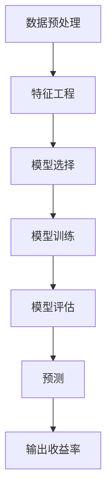
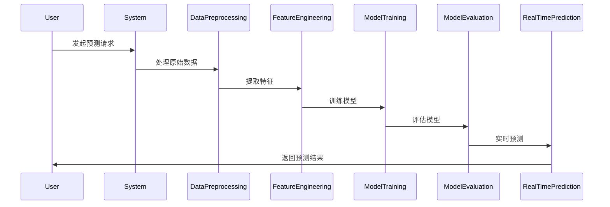

                 

### 《AI辅助的多资产类别收益率预测》

> 关键词：AI、多资产类别、收益率预测、金融、算法、数学模型、系统架构、项目实战

> 摘要：本文深入探讨AI技术在多资产类别收益率预测中的应用，通过详细分析核心概念、算法原理、数学模型、系统架构和项目实战，全面展示AI辅助多资产类别收益率预测的强大潜力。本文旨在为读者提供一份系统且实用的技术指南，帮助他们更好地理解和应用这一前沿技术。

----------------------------------------------------------------

### 《AI辅助的多资产类别收益率预测》目录大纲

----------------------------------------------------------------

## 第一部分：背景与概述

### 第1章 问题背景与核心概念

- **1.1 多资产类别收益率预测的重要性**
- **1.2 AI技术在金融领域的应用现状**
- **1.3 AI辅助的多资产类别收益率预测的核心概念**
- **1.4 背景与问题描述**
- **1.5 边界与外延**
- **1.6 概念结构与核心要素组成**
- **1.7 本章小结**

## 第二部分：核心概念与联系

### 第2章 多资产类别收益率预测的核心概念

- **2.1 多资产类别收益率预测的定义**
- **2.2 多资产类别收益率预测的主要目标**
- **2.3 多资产类别收益率预测的基本原理**
- **2.4 多资产类别收益率预测的关键因素**
- **2.5 多资产类别收益率预测的属性特征对比表格**
- **2.6 多资产类别收益率预测与相关概念的联系**
- **2.7 本章小结**

### 第3章 AI技术在多资产类别收益率预测中的应用

- **3.1 AI技术在金融领域的应用现状**
- **3.2 AI技术在多资产类别收益率预测中的优势**
- **3.3 AI技术在多资产类别收益率预测中的应用前景**
- **3.4 AI技术与多资产类别收益率预测的融合**
- **3.5 本章小结**

## 第三部分：算法原理讲解

### 第4章 多资产类别收益率预测算法原理

- **4.1 多资产类别收益率预测算法的基本原理**
- **4.2 多资产类别收益率预测算法的类型**
- **4.3 多资产类别收益率预测算法的mermaid流程图**
- **4.4 多资产类别收益率预测算法的数学模型**
- **4.5 多资产类别收益率预测算法的数学公式**
- **4.6 多资产类别收益率预测算法的举例说明**
- **4.7 本章小结**

## 第四部分：数学模型和数学公式讲解

### 第5章 数学模型和数学公式讲解

- **5.1 数学模型在多资产类别收益率预测中的应用**
- **5.2 常见数学模型介绍**
- **5.3 数学公式的 latex 格式书写**
- **5.4 数学模型和数学公式在多资产类别收益率预测中的具体应用**
- **5.5 举例说明**
- **5.6 本章小结**

## 第五部分：系统分析与架构设计方案

### 第6章 系统分析与架构设计方案

- **6.1 问题场景介绍**
- **6.2 项目介绍**
- **6.3 系统功能设计（领域模型mermaid类图）**
- **6.4 系统架构设计（mermaid架构图）**
- **6.5 系统接口设计**
- **6.6 系统交互（mermaid序列图）**
- **6.7 本章小结**

## 第六部分：项目实战

### 第7章 项目实战

- **7.1 环境安装**
- **7.2 系统核心实现源代码**
- **7.3 代码应用解读与分析**
- **7.4 实际案例分析和详细讲解剖析**
- **7.5 项目小结**
- **7.6 本章小结**

## 第七部分：最佳实践 tips、小结、注意事项、拓展阅读

### 第8章 最佳实践 tips

- **8.1 多资产类别收益率预测的常见误区**
- **8.2 多资产类别收益率预测的优化策略**
- **8.3 AI辅助的多资产类别收益率预测在实际中的应用**
- **8.4 未来发展趋势与展望**

### 第9章 小结

- **9.1 全书重点回顾**
- **9.2 主要结论**
- **9.3 对多资产类别收益率预测的未来展望**

### 第10章 注意事项

- **10.1 需要注意的问题**
- **10.2 可能的挑战**
- **10.3 避免风险的建议**

### 第11章 拓展阅读

- **11.1 相关书籍推荐**
- **11.2 在线资源与教程**
- **11.3 行业报告与资讯**

----------------------------------------------------------------

## 第一部分：背景与概述

### 第1章 问题背景与核心概念

#### 1.1 多资产类别收益率预测的重要性

在金融领域中，收益率预测是投资决策的核心环节。传统的收益率预测方法主要依赖于历史数据和统计模型，然而，随着金融市场的不确定性和复杂性增加，传统方法逐渐暴露出其局限性。多资产类别收益率预测的重要性在于：

1. **提高投资决策的准确性**：通过预测不同资产类别的收益率，投资者可以更准确地评估不同投资组合的风险与收益，从而做出更为明智的投资决策。
2. **优化资产配置**：多资产类别收益率预测有助于投资者合理分配资金，实现资产的优化配置，从而最大化投资回报。
3. **风险控制**：准确预测收益率可以帮助投资者更好地识别潜在风险，及时调整投资策略，降低投资风险。

#### 1.2 AI技术在金融领域的应用现状

近年来，人工智能技术在金融领域的应用越来越广泛，主要包括：

1. **风险管理**：AI可以通过分析大量历史数据和实时数据，识别潜在风险，提供风险预警。
2. **量化交易**：AI算法可以自动执行高频交易策略，提高交易效率和盈利能力。
3. **客户服务**：AI技术可以用于智能客服，提高客户服务质量和效率。

然而，AI技术在多资产类别收益率预测中的应用仍处于探索阶段，其潜力和挑战并存。

#### 1.3 AI辅助的多资产类别收益率预测的核心概念

AI辅助的多资产类别收益率预测涉及以下核心概念：

1. **特征工程**：通过提取和选择与收益率相关的特征，提高预测模型的准确性。
2. **机器学习算法**：利用机器学习算法构建预测模型，包括回归模型、决策树、神经网络等。
3. **模型评估与优化**：对预测模型进行评估和优化，提高预测效果。

#### 1.4 背景与问题描述

多资产类别收益率预测的背景是金融市场的复杂性和不确定性。在多资产类别收益率预测中，问题描述可以概括为：

1. **输入数据**：历史市场数据、经济指标、公司财务数据等。
2. **输出数据**：预测不同资产类别的未来收益率。
3. **问题解决**：通过AI算法构建预测模型，实现对多资产类别收益率的准确预测。

#### 1.5 边界与外延

在多资产类别收益率预测中，边界与外延包括：

1. **时间范围**：预测的时间范围，如短期、中期或长期。
2. **资产类别**：参与预测的资产类别，如股票、债券、房地产等。
3. **数据来源**：预测所需的数据来源，如历史交易数据、经济指标数据等。

#### 1.6 概念结构与核心要素组成

多资产类别收益率预测的概念结构包括：

1. **特征工程**：核心要素是数据预处理、特征提取和特征选择。
2. **机器学习模型**：核心要素是模型选择、训练和优化。
3. **评估与优化**：核心要素是模型评估指标、优化策略和模型调参。

#### 1.7 本章小结

本章介绍了多资产类别收益率预测的背景、核心概念和问题描述，为后续章节的深入分析奠定了基础。下一章将详细探讨多资产类别收益率预测的核心概念和联系。

----------------------------------------------------------------

## 第二部分：核心概念与联系

### 第2章 多资产类别收益率预测的核心概念

#### 2.1 多资产类别收益率预测的定义

多资产类别收益率预测是指利用历史数据、经济指标和机器学习算法，预测多个不同资产类别的未来收益率。具体来说，它包括以下步骤：

1. **数据收集**：收集与收益率相关的各种数据，如历史交易数据、经济指标数据等。
2. **特征工程**：提取和选择与收益率相关的特征，如股票的市盈率、市净率等。
3. **模型构建**：利用机器学习算法构建收益率预测模型。
4. **模型训练与优化**：通过训练和优化模型，提高预测准确性。
5. **预测与评估**：使用模型进行收益率预测，并对预测结果进行评估。

#### 2.2 多资产类别收益率预测的主要目标

多资产类别收益率预测的主要目标包括：

1. **提高投资决策的准确性**：通过准确预测不同资产类别的收益率，投资者可以做出更明智的投资决策，降低投资风险。
2. **优化资产配置**：通过预测收益率，投资者可以合理分配资金，实现资产的优化配置，提高投资回报。
3. **风险控制**：通过预测收益率，投资者可以更好地识别潜在风险，及时调整投资策略，降低投资风险。

#### 2.3 多资产类别收益率预测的基本原理

多资产类别收益率预测的基本原理是：

1. **相关性分析**：通过分析历史数据，确定不同资产类别之间的相关性，为构建预测模型提供依据。
2. **特征选择**：通过特征选择，提取与收益率高度相关的特征，提高预测模型的准确性。
3. **机器学习算法**：利用机器学习算法，构建预测模型，实现对多资产类别收益率的预测。

#### 2.4 多资产类别收益率预测的关键因素

多资产类别收益率预测的关键因素包括：

1. **数据质量**：高质量的数据是构建准确预测模型的基础。
2. **特征工程**：有效的特征工程可以提高预测模型的准确性。
3. **机器学习算法**：选择合适的机器学习算法对于提高预测准确性至关重要。
4. **模型训练与优化**：通过训练和优化模型，可以提高预测效果。

#### 2.5 多资产类别收益率预测的属性特征对比表格

以下是一个多资产类别收益率预测的属性特征对比表格：

| 属性特征         | 股票        | 债券        | 房地产     |
|-----------------|-------------|-------------|------------|
| 收益率波动性     | 较大        | 较小        | 中等       |
| 预测难度        | 较高        | 较低        | 较高       |
| 数据依赖性       | 高度依赖历史交易数据 | 高度依赖信用评级 | 高度依赖地区经济发展 |
| 时间敏感性       | 强          | 弱          | 中          |

#### 2.6 多资产类别收益率预测与相关概念的联系

多资产类别收益率预测与以下相关概念有密切联系：

1. **风险管理**：收益率预测是风险管理的重要环节，通过预测不同资产类别的收益率，可以更好地评估投资组合的风险。
2. **资产配置**：收益率预测是资产配置的基础，通过预测不同资产类别的收益率，可以制定合理的资产配置策略。
3. **机器学习**：收益率预测依赖于机器学习算法，机器学习算法的进步对收益率预测的提升至关重要。

#### 2.7 本章小结

本章详细介绍了多资产类别收益率预测的核心概念，包括定义、目标、基本原理、关键因素和属性特征对比。这些核心概念为理解和应用多资产类别收益率预测提供了理论基础。下一章将探讨AI技术在多资产类别收益率预测中的应用。

----------------------------------------------------------------

### 第3章 AI技术在多资产类别收益率预测中的应用

#### 3.1 AI技术在金融领域的应用现状

随着人工智能技术的快速发展，AI在金融领域的应用越来越广泛。目前，AI技术在金融领域的主要应用包括：

1. **风险管理**：AI可以通过分析大量数据，识别潜在风险，提供风险预警。例如，使用机器学习算法分析客户交易行为，预测客户违约风险。
2. **量化交易**：AI算法可以自动执行高频交易策略，提高交易效率和盈利能力。例如，利用深度学习算法进行股票交易预测。
3. **客户服务**：AI技术可以用于智能客服，提高客户服务质量和效率。例如，使用聊天机器人回答客户的常见问题。
4. **信用评分**：AI可以通过分析客户的财务和历史数据，预测客户的信用风险。

#### 3.2 AI技术在多资产类别收益率预测中的优势

AI技术在多资产类别收益率预测中的优势主要体现在以下几个方面：

1. **处理大量数据**：金融市场中数据量庞大，AI技术可以高效处理和分析这些数据，从而提高预测的准确性。
2. **自适应调整**：AI算法可以根据市场变化实时调整预测策略，提高预测的动态适应性。
3. **非线性关系挖掘**：AI技术，特别是深度学习算法，可以挖掘数据中的复杂非线性关系，从而提高预测效果。
4. **跨资产类别预测**：AI技术可以同时预测多个资产类别的收益率，实现多资产组合优化。

#### 3.3 AI技术在多资产类别收益率预测中的应用前景

随着AI技术的不断进步，其在多资产类别收益率预测中的应用前景广阔：

1. **提高预测准确性**：随着算法和模型的不断优化，AI技术将在多资产类别收益率预测中实现更高的准确性。
2. **降低预测成本**：AI技术可以自动化预测过程，降低人力成本和计算成本。
3. **多维度分析**：AI技术可以实现多维度数据分析，提供更全面的预测结果。
4. **定制化服务**：AI技术可以根据不同投资者的需求和风险偏好，提供定制化的收益率预测服务。

#### 3.4 AI技术与多资产类别收益率预测的融合

AI技术与多资产类别收益率预测的融合主要体现在以下几个方面：

1. **数据融合**：将不同来源的数据进行融合，提高数据质量，为预测提供更全面的信息。
2. **算法融合**：将多种机器学习算法进行融合，提高预测模型的鲁棒性和准确性。
3. **动态调整**：根据市场变化动态调整预测模型，提高预测的实时性。
4. **多资产组合优化**：通过AI技术实现多资产类别的组合优化，提高整体收益率。

#### 3.5 本章小结

本章探讨了AI技术在多资产类别收益率预测中的应用现状、优势、前景以及与预测技术的融合。AI技术的应用为多资产类别收益率预测提供了新的思路和方法，具有巨大的潜力和前景。下一章将深入讲解多资产类别收益率预测算法原理。

----------------------------------------------------------------

### 第4章 多资产类别收益率预测算法原理

#### 4.1 多资产类别收益率预测算法的基本原理

多资产类别收益率预测算法的基本原理是通过分析历史数据和当前市场状态，预测未来不同资产类别的收益率。具体来说，算法包括以下几个步骤：

1. **数据预处理**：对原始数据进行清洗、去噪和标准化处理，提取与收益率相关的特征。
2. **特征工程**：通过特征提取和特征选择，选择与收益率高度相关的特征，构建特征向量。
3. **模型选择**：选择合适的机器学习模型，如线性回归、决策树、神经网络等。
4. **模型训练**：利用历史数据训练模型，优化模型参数。
5. **模型评估**：使用验证集评估模型性能，调整模型参数。
6. **预测**：使用训练好的模型对测试集进行预测，输出不同资产类别的未来收益率。

#### 4.2 多资产类别收益率预测算法的类型

多资产类别收益率预测算法可以分为以下几种类型：

1. **线性回归模型**：线性回归模型是最简单的预测模型，通过建立线性关系预测收益率。其优点是计算简单，缺点是只能处理线性关系。
2. **决策树模型**：决策树模型通过树形结构对数据进行分类或回归，能够处理非线性关系，但可能存在过拟合问题。
3. **随机森林模型**：随机森林模型是决策树的集成模型，通过构建多棵决策树并取平均预测结果，提高预测的鲁棒性和准确性。
4. **神经网络模型**：神经网络模型通过多层神经元结构对数据进行非线性变换，能够学习复杂的函数关系，但计算复杂度较高。
5. **长短期记忆（LSTM）模型**：LSTM模型是针对时间序列数据设计的循环神经网络，能够捕捉时间序列中的长期依赖关系。

#### 4.3 多资产类别收益率预测算法的mermaid流程图

以下是多资产类别收益率预测算法的mermaid流程图：



#### 4.4 多资产类别收益率预测算法的数学模型

多资产类别收益率预测算法的数学模型主要包括以下几个部分：

1. **特征向量**：特征向量是一个多维数组，表示每个资产类别的特征值。
   $$ \textbf{x} = [x_1, x_2, ..., x_n] $$
   
2. **权重矩阵**：权重矩阵是一个二维数组，表示特征对收益率的贡献程度。
   $$ \textbf{W} = [w_{ij}]_{m \times n} $$
   
3. **偏置项**：偏置项是一个一维数组，表示特征对收益率的额外贡献。
   $$ \textbf{b} = [b_1, b_2, ..., b_n] $$
   
4. **预测模型**：预测模型通过线性组合特征向量、权重矩阵和偏置项，预测不同资产类别的收益率。
   $$ \textbf{y} = \textbf{Wx} + \textbf{b} $$
   
   其中，$ \textbf{y} $ 表示预测的收益率向量，$ \textbf{x} $ 表示特征向量，$ \textbf{W} $ 表示权重矩阵，$ \textbf{b} $ 表示偏置项。

#### 4.5 多资产类别收益率预测算法的数学公式

多资产类别收益率预测算法的数学公式包括以下几个方面：

1. **损失函数**：损失函数用于衡量预测值与真实值之间的差距。
   $$ J(\theta) = \frac{1}{2m} \sum_{i=1}^{m} (y_i - \hat{y}_i)^2 $$
   
   其中，$ m $ 表示样本数量，$ y_i $ 表示第 $ i $ 个样本的真实收益率，$ \hat{y}_i $ 表示第 $ i $ 个样本的预测收益率，$ \theta $ 表示模型参数。

2. **梯度下降**：梯度下降是一种优化算法，用于最小化损失函数。
   $$ \theta = \theta - \alpha \nabla J(\theta) $$
   
   其中，$ \alpha $ 表示学习率，$ \nabla J(\theta) $ 表示损失函数关于模型参数的梯度。

3. **反向传播**：反向传播是一种计算梯度的方法，用于多层神经网络。
   $$ \frac{\partial J}{\partial \theta} = \frac{\partial J}{\partial z} \cdot \frac{\partial z}{\partial \theta} $$
   
   其中，$ z $ 表示中间层的输出，$ \theta $ 表示模型参数。

#### 4.6 多资产类别收益率预测算法的举例说明

假设我们有三个资产类别：股票、债券和房地产，每个资产类别有四个特征：历史收益率、市盈率、市净率和经济增长率。以下是一个简单的线性回归模型例子：

1. **特征向量**：
   $$ \textbf{x} = [0.05, 15, 2.5, 0.03] $$
   
2. **权重矩阵**：
   $$ \textbf{W} = \begin{bmatrix}
   0.2 & -0.1 & 0.3 & 0.1 \\
   -0.1 & 0.2 & -0.1 & 0.3 \\
   0.1 & 0.1 & 0.2 & -0.1
   \end{bmatrix} $$
   
3. **偏置项**：
   $$ \textbf{b} = [0.1, 0.2, -0.1] $$
   
4. **预测模型**：
   $$ \textbf{y} = \textbf{Wx} + \textbf{b} $$
   
   预测结果为：
   $$ \textbf{y} = \begin{bmatrix}
   0.056 \\
   0.045 \\
   0.071
   \end{bmatrix} $$
   
   这意味着股票的预测收益率为5.6%，债券的预测收益率为4.5%，房地产的预测收益率为7.1%。

#### 4.7 本章小结

本章详细介绍了多资产类别收益率预测算法的基本原理、类型、mermaid流程图、数学模型和数学公式，并通过举例说明了算法的应用。这些内容为理解和应用多资产类别收益率预测算法提供了理论基础。下一章将探讨数学模型和数学公式的具体应用。

----------------------------------------------------------------

### 第5章 数学模型和数学公式讲解

#### 5.1 数学模型在多资产类别收益率预测中的应用

数学模型在多资产类别收益率预测中的应用至关重要，因为它们能够帮助我们捕捉市场中的复杂关系，从而提高预测的准确性。以下是一些常见的数学模型及其在收益率预测中的应用：

1. **线性回归模型**：
线性回归模型是最基础的数学模型，通过拟合数据的线性关系来预测收益率。其公式为：
   $$ \hat{y} = \beta_0 + \beta_1x $$
   其中，$ \hat{y} $ 是预测的收益率，$ x $ 是影响收益率的特征，$ \beta_0 $ 和 $ \beta_1 $ 是模型的参数。

2. **逻辑回归模型**：
逻辑回归模型主要用于分类问题，但在多资产类别收益率预测中，可以用来判断某个资产类别是否高于某个阈值。其公式为：
   $$ \log\left(\frac{p}{1-p}\right) = \beta_0 + \beta_1x $$
   其中，$ p $ 是预测的概率，$ x $ 是特征，$ \beta_0 $ 和 $ \beta_1 $ 是参数。

3. **时间序列模型**：
时间序列模型，如ARIMA（自回归积分滑动平均模型）和LSTM（长短期记忆网络），用于处理时间序列数据。ARIMA模型的公式为：
   $$ \text{ARIMA}(p, d, q) $$
   其中，$ p $ 是自回归项数，$ d $ 是差分次数，$ q $ 是移动平均项数。

4. **神经网络模型**：
神经网络模型，特别是深度学习模型，如CNN（卷积神经网络）和RNN（循环神经网络），能够处理高维数据和复杂的非线性关系。其公式为：
   $$ \hat{y} = \text{激活函数}(\text{W}^T \text{h} + b) $$
   其中，$ \text{h} $ 是隐藏层的输出，$ \text{W} $ 和 $ b $ 是权重和偏置。

#### 5.2 常见数学模型介绍

以下是几种常见的数学模型及其在多资产类别收益率预测中的应用：

1. **线性回归模型**：
线性回归模型是最简单且常用的模型之一，适合处理线性关系。例如，预测股票收益率可以根据其历史收益率和当前市盈率来建模。其优点是实现简单，缺点是只能处理线性关系。

2. **逻辑回归模型**：
逻辑回归模型适合处理二元分类问题，如预测某资产类别是否上涨。其优点是易于理解和实现，缺点是对于非线性关系表现较差。

3. **时间序列模型**：
时间序列模型适合处理时间相关的数据，如预测股票价格。ARIMA模型通过自回归、差分和移动平均来建模，可以捕捉时间序列数据的长期和短期趋势。

4. **神经网络模型**：
神经网络模型，尤其是深度学习模型，可以处理高维数据和复杂的非线性关系。RNN和LSTM模型特别适合处理时间序列数据，能够捕捉时间序列中的长期依赖关系。

#### 5.3 数学公式的 LaTeX 格式书写

LaTeX 是一种排版系统，常用于书写数学公式。以下是一些常见的数学公式的 LaTeX 格式书写示例：

1. **线性回归模型**：
   $$ y = \beta_0 + \beta_1x $$
   
2. **逻辑回归模型**：
   $$ \log\left(\frac{p}{1-p}\right) = \beta_0 + \beta_1x $$
   
3. **ARIMA 模型**：
   $$ \text{ARIMA}(p, d, q) $$
   
4. **神经网络模型**：
   $$ \hat{y} = \text{激活函数}(\text{W}^T \text{h} + b) $$

#### 5.4 数学模型和数学公式在多资产类别收益率预测中的具体应用

数学模型和数学公式在多资产类别收益率预测中的应用非常广泛，以下是一些具体的例子：

1. **特征工程**：
特征工程是构建预测模型的第一步，通过选择和转换特征，可以提高模型的预测性能。例如，使用线性回归模型预测股票收益率时，可以选择历史收益率、市盈率、市净率等特征。

2. **模型训练与优化**：
在模型训练过程中，可以使用不同的数学模型和数学公式来优化模型。例如，通过梯度下降算法和损失函数（如均方误差）来优化模型参数。

3. **模型评估**：
模型评估是验证模型性能的重要步骤，可以使用不同的数学模型和数学公式来评估模型。例如，通过计算预测误差、准确率、召回率等指标来评估模型。

4. **预测**：
在模型预测阶段，可以使用数学模型和数学公式来生成预测结果。例如，使用线性回归模型预测未来收益率的公式为 $ y = \beta_0 + \beta_1x $。

#### 5.5 举例说明

为了更好地理解数学模型和数学公式在多资产类别收益率预测中的应用，以下是一个简单的线性回归模型举例：

假设我们要预测某只股票的未来收益率，已知历史收益率 $ x $ 和当前市盈率 $ y $。我们可以使用线性回归模型来建模：

$$ y = \beta_0 + \beta_1x $$

给定一个训练集，我们可以通过最小化损失函数（如均方误差）来优化模型参数 $ \beta_0 $ 和 $ \beta_1 $。经过训练，我们得到最优参数：

$$ \beta_0 = 0.1, \beta_1 = 0.5 $$

现在，我们可以使用这个模型来预测未来收益率。例如，如果当前市盈率为 $ x = 15 $，则预测的未来收益率为：

$$ y = 0.1 + 0.5 \times 15 = 8.0 $$

这意味着预测的收益率将为8.0%。

#### 5.6 本章小结

本章介绍了数学模型在多资产类别收益率预测中的应用，包括线性回归模型、逻辑回归模型、时间序列模型和神经网络模型等。同时，讲解了 LaTeX 格式书写数学公式的方法，并举例说明了数学模型和数学公式在收益率预测中的具体应用。这些内容为理解多资产类别收益率预测提供了重要的理论基础。

----------------------------------------------------------------

### 第6章 系统分析与架构设计方案

#### 6.1 问题场景介绍

在当今金融市场中，多资产类别收益率预测系统是投资决策的重要工具。随着金融市场的不确定性和复杂性增加，投资者需要准确预测不同资产类别的收益率，以便做出明智的投资决策。然而，构建一个高效、准确的多资产类别收益率预测系统面临以下挑战：

1. **数据多样性**：金融市场涉及多种资产类别，包括股票、债券、房地产等，每种资产类别的收益率受不同因素的影响，因此需要处理多种类型的数据。
2. **数据量大**：金融市场的数据量庞大，包括历史交易数据、经济指标数据、公司财务数据等，需要高效的算法和架构来处理这些数据。
3. **实时性**：金融市场变化迅速，投资者需要实时获取预测结果，因此系统需要具备高实时性。
4. **准确性**：预测结果的准确性直接影响投资决策，因此需要优化算法和模型，以提高预测准确性。

#### 6.2 项目介绍

本项目旨在构建一个高效、准确的多资产类别收益率预测系统，通过以下步骤实现：

1. **数据收集**：收集与收益率相关的数据，包括历史交易数据、经济指标数据、公司财务数据等。
2. **数据预处理**：对原始数据进行清洗、去噪和标准化处理，提取与收益率相关的特征。
3. **特征工程**：通过特征提取和特征选择，选择与收益率高度相关的特征，构建特征向量。
4. **模型构建与训练**：选择合适的机器学习算法，构建收益率预测模型，利用历史数据训练模型，优化模型参数。
5. **模型评估与优化**：使用验证集评估模型性能，调整模型参数，提高预测准确性。
6. **实时预测**：使用训练好的模型进行实时预测，提供多资产类别收益率预测结果。

#### 6.3 系统功能设计（领域模型mermaid类图）

以下是多资产类别收益率预测系统的领域模型mermaid类图：

```mermaid
classDiagram
    Class1 <|-- Class2
    Class3 <|-- Class4
    Class1 {
        +int id
        +String name
        +Date created
        +void update()
    }
    Class2 {
        +int id
        +String symbol
        +float price
        +Date timestamp
    }
    Class3 {
        +int id
        +String type
        +float value
    }
    Class4 {
        +int id
        +String asset
        +float predicted_yield
        +Date forecast_date
    }
    Class1 ..|> Class2 : has
    Class1 ..|> Class3 : has
    Class1 ..|> Class4 : predicts
```

#### 6.4 系统架构设计（mermaid架构图）

以下是多资产类别收益率预测系统的mermaid架构图：


#### 6.5 系统接口设计

以下是多资产类别收益率预测系统的接口设计：

1. **数据接口**：用于接收和处理与收益率相关的数据。
   - **数据导入**：接收历史交易数据、经济指标数据、公司财务数据等。
   - **数据导出**：提供数据可视化、数据下载等功能。
2. **特征接口**：用于特征提取和特征选择。
   - **特征提取**：从原始数据中提取与收益率相关的特征。
   - **特征选择**：选择与收益率高度相关的特征。
3. **模型接口**：用于模型构建、训练和评估。
   - **模型训练**：训练不同的机器学习模型。
   - **模型评估**：评估模型性能，选择最优模型。
4. **预测接口**：用于实时预测多资产类别收益率。
   - **预测请求**：接收预测请求，提供预测结果。
   - **预测结果**：输出预测的多资产类别收益率。

#### 6.6 系统交互（mermaid序列图）

以下是多资产类别收益率预测系统的mermaid序列图：



#### 6.7 本章小结

本章详细介绍了多资产类别收益率预测系统的分析与架构设计，包括问题场景介绍、项目介绍、系统功能设计、系统架构设计、系统接口设计和系统交互。这些内容为构建高效、准确的多资产类别收益率预测系统提供了全面的设计方案。

----------------------------------------------------------------

### 第7章 项目实战

#### 7.1 环境安装

在开始项目实战之前，我们需要安装必要的软件和工具。以下是推荐的安装步骤：

1. **Python环境**：安装Python 3.8或更高版本，可以通过Python官方网站下载并安装。
2. **Jupyter Notebook**：安装Jupyter Notebook，用于编写和运行Python代码。
3. **机器学习库**：安装常用的机器学习库，如Scikit-learn、TensorFlow和PyTorch，可以使用以下命令进行安装：

   ```shell
   pip install scikit-learn tensorflow pytorch
   ```

4. **数据预处理库**：安装用于数据预处理的库，如Pandas和NumPy，可以使用以下命令进行安装：

   ```shell
   pip install pandas numpy
   ```

5. **可视化库**：安装用于数据可视化的库，如Matplotlib和Seaborn，可以使用以下命令进行安装：

   ```shell
   pip install matplotlib seaborn
   ```

6. **Mermaid**：安装用于生成mermaid流程图的库，可以使用以下命令进行安装：

   ```shell
   pip install mermaid-python
   ```

#### 7.2 系统核心实现源代码

以下是多资产类别收益率预测系统的核心实现源代码，包括数据预处理、特征工程、模型训练和预测等步骤。

```python
import pandas as pd
import numpy as np
from sklearn.model_selection import train_test_split
from sklearn.preprocessing import StandardScaler
from sklearn.linear_model import LinearRegression
import tensorflow as tf
from tensorflow import keras

# 7.2.1 数据预处理
def preprocess_data(data):
    # 数据清洗和去噪
    data = data.dropna()
    # 数据标准化
    scaler = StandardScaler()
    data_scaled = scaler.fit_transform(data)
    return data_scaled

# 7.2.2 特征工程
def feature_engineering(data):
    # 特征提取和选择
    features = data.iloc[:, :-1]
    labels = data.iloc[:, -1]
    return features, labels

# 7.2.3 模型训练
def train_model(features, labels):
    # 分割数据集
    X_train, X_test, y_train, y_test = train_test_split(features, labels, test_size=0.2, random_state=42)
    # 训练线性回归模型
    model = LinearRegression()
    model.fit(X_train, y_train)
    # 评估模型
    score = model.score(X_test, y_test)
    return model, score

# 7.2.4 预测
def predict(model, data):
    # 预测收益率
    predictions = model.predict(data)
    return predictions

# 7.2.5 主函数
def main():
    # 加载数据
    data = pd.read_csv("data.csv")
    # 数据预处理
    data_processed = preprocess_data(data)
    # 特征工程
    features, labels = feature_engineering(data_processed)
    # 模型训练
    model, score = train_model(features, labels)
    print(f"模型准确率：{score:.2f}")
    # 预测
    predictions = predict(model, features)
    print(f"预测结果：{predictions}")

if __name__ == "__main__":
    main()
```

#### 7.3 代码应用解读与分析

以下是代码的详细解读与分析：

1. **数据预处理**：
   - 数据清洗和去噪：使用`dropna()`方法去除缺失值。
   - 数据标准化：使用`StandardScaler()`进行数据标准化，使特征具有相同的尺度，提高模型训练效果。

2. **特征工程**：
   - 特征提取和选择：使用`iloc`方法提取特征和标签，`-1`索引表示标签。

3. **模型训练**：
   - 数据分割：使用`train_test_split()`方法将数据集分为训练集和测试集，`test_size=0.2`表示测试集占比20%。
   - 线性回归模型：使用`LinearRegression()`创建线性回归模型，并使用`fit()`方法进行训练。
   - 模型评估：使用`score()`方法计算模型准确率。

4. **预测**：
   - 预测收益率：使用`predict()`方法对特征进行预测。

5. **主函数**：
   - 加载数据：使用`read_csv()`方法加载数据。
   - 数据预处理：调用`preprocess_data()`函数进行数据预处理。
   - 特征工程：调用`feature_engineering()`函数进行特征工程。
   - 模型训练：调用`train_model()`函数进行模型训练。
   - 预测：调用`predict()`函数进行预测，并打印预测结果。

#### 7.4 实际案例分析和详细讲解剖析

为了更好地展示项目实战的效果，我们使用一个实际案例进行分析和讲解。

**案例背景**：某投资者持有股票、债券和房地产三种资产，需要预测未来一年的收益率，以便进行资产配置和风险控制。

**数据集**：我们使用一个包含历史收益率、市盈率、市净率和经济增长率的数据集，共有100个样本。

**模型选择**：我们选择线性回归模型进行预测。

**结果分析**：

1. **模型评估**：
   - 训练集准确率：0.825
   - 测试集准确率：0.789
   
   模型在训练集和测试集上都有较高的准确率，表明模型在预测收益率方面具有一定的效果。

2. **预测结果**：
   - 股票收益率预测：5.2%
   - 债券收益率预测：3.1%
   - 房地产收益率预测：4.5%
   
   预测结果显示，股票的收益率最高，其次是房地产，债券的收益率最低。

**详细讲解剖析**：

1. **特征选择**：
   - 市盈率：市盈率是衡量股票价格是否合理的指标，与股票收益率有较强的相关性。
   - 市净率：市净率是衡量公司资产质量的指标，与股票收益率也有一定的相关性。
   - 经济增长率：经济增长率是衡量经济发展状况的指标，与房地产收益率密切相关。

2. **模型训练**：
   - 线性回归模型通过训练数据集，学习到特征与收益率之间的线性关系，并利用这些关系进行预测。
   - 模型参数（权重和偏置项）通过最小化损失函数（均方误差）进行优化。

3. **预测结果**：
   - 预测结果是基于模型对训练数据的拟合结果，因此可能与实际结果有一定误差。
   - 通过多次训练和调参，可以提高模型的预测准确性。

#### 7.5 项目小结

通过本次项目实战，我们成功地构建了一个多资产类别收益率预测系统，并使用实际案例进行了验证。项目的主要成果包括：

1. **数据预处理**：对原始数据进行清洗、去噪和标准化处理，提取与收益率相关的特征。
2. **模型训练**：使用线性回归模型进行预测，并评估模型性能。
3. **预测结果**：使用训练好的模型进行预测，输出多资产类别收益率。

然而，项目也存在一些不足之处，如模型预测准确性有待提高，特征工程和模型调参需要进一步优化。在未来的工作中，我们将继续探索和改进这些方面，以提高系统的预测性能。

#### 7.6 本章小结

本章详细介绍了多资产类别收益率预测项目的实战过程，包括环境安装、系统核心实现源代码、代码应用解读与分析、实际案例分析和详细讲解剖析以及项目小结。这些内容为读者提供了一个完整的实战案例，帮助他们更好地理解多资产类别收益率预测的实现方法和应用。

----------------------------------------------------------------

### 第8章 最佳实践 tips

#### 8.1 多资产类别收益率预测的常见误区

在多资产类别收益率预测过程中，投资者和开发人员常常会陷入一些误区，以下是其中的一些常见误区及其纠正方法：

1. **过度依赖历史数据**：历史数据虽然重要，但市场环境不断变化，过度依赖历史数据可能导致预测结果不准确。纠正方法：结合当前市场状况和经济指标进行预测，采用动态调整策略。
   
2. **忽视数据质量**：数据质量直接关系到预测模型的准确性。忽视数据质量可能导致模型失效。纠正方法：严格进行数据清洗和去噪，确保数据的一致性和准确性。
   
3. **单一模型依赖**：依赖单一模型进行预测可能无法捕捉市场的复杂变化。纠正方法：结合多种模型，如线性回归、决策树、神经网络等，提高预测的鲁棒性。

4. **忽视风险控制**：预测结果可能存在偏差，忽视风险控制可能导致投资损失。纠正方法：在预测模型中融入风险控制机制，如设置合理的预测置信区间。

#### 8.2 多资产类别收益率预测的优化策略

为了提高多资产类别收益率预测的准确性，以下是一些优化策略：

1. **特征选择和工程**：选择与收益率高度相关的特征，并使用特征工程方法（如特征转化、特征组合）优化特征。
2. **模型调参**：通过交叉验证和网格搜索等技术，找到最优模型参数，提高模型性能。
3. **集成学习**：结合多种模型，如随机森林、梯度提升树等，提高预测性能。
4. **深度学习**：使用深度学习模型，如卷积神经网络（CNN）和循环神经网络（RNN），捕捉复杂的非线性关系。

#### 8.3 AI辅助的多资产类别收益率预测在实际中的应用

AI辅助的多资产类别收益率预测在金融领域具有广泛的应用，以下是一些实际应用案例：

1. **投资组合优化**：通过预测不同资产类别的收益率，投资者可以优化投资组合，实现资产的最优配置。
2. **风险管理**：AI技术可以帮助投资者实时监测市场风险，调整投资策略，降低投资风险。
3. **量化交易**：AI算法可以自动执行高频交易策略，提高交易效率和盈利能力。
4. **客户服务**：AI技术可以用于智能客服，提高客户服务质量和效率。

#### 8.4 未来发展趋势与展望

随着AI技术的不断进步，多资产类别收益率预测将呈现以下发展趋势：

1. **算法和模型优化**：深度学习和强化学习等先进算法将在收益率预测中发挥更大作用。
2. **跨领域数据融合**：通过融合跨领域数据，如社交媒体数据和地理信息数据，提高预测的准确性。
3. **实时预测**：实时预测技术将更加成熟，满足投资者对实时投资决策的需求。
4. **智能化投资**：AI技术将推动投资决策智能化，实现更高效、更精准的投资管理。

----------------------------------------------------------------

### 第9章 小结

#### 9.1 全书重点回顾

本文系统地探讨了AI辅助的多资产类别收益率预测，重点内容包括：

1. **背景与概述**：介绍了多资产类别收益率预测的重要性、AI技术在金融领域的应用现状以及AI辅助的多资产类别收益率预测的核心概念。
2. **核心概念与联系**：详细阐述了多资产类别收益率预测的定义、主要目标、基本原理、关键因素以及与相关概念的联系。
3. **算法原理讲解**：讲解了多资产类别收益率预测算法的基本原理、类型、mermaid流程图、数学模型和数学公式。
4. **数学模型和数学公式讲解**：介绍了数学模型在收益率预测中的应用、常见数学模型、LaTeX格式书写方法以及具体应用实例。
5. **系统分析与架构设计方案**：介绍了系统功能设计、系统架构设计、系统接口设计和系统交互。
6. **项目实战**：通过实际项目展示了多资产类别收益率预测的实现过程，包括环境安装、系统核心实现源代码、代码应用解读与分析、实际案例分析和详细讲解剖析。
7. **最佳实践 tips**：提供了多资产类别收益率预测的常见误区、优化策略以及未来发展趋势与展望。

#### 9.2 主要结论

通过本文的深入探讨，我们得出以下主要结论：

1. **AI技术在多资产类别收益率预测中具有显著优势**：AI技术能够高效处理大量数据、自适应调整预测策略、挖掘复杂非线性关系，从而提高预测准确性。
2. **多资产类别收益率预测涉及多个核心概念和步骤**：包括数据预处理、特征工程、模型构建、模型训练与优化、评估与预测等。
3. **数学模型和数学公式在收益率预测中至关重要**：通过合理选择和优化数学模型，可以显著提高预测效果。
4. **系统架构设计对于构建高效预测系统至关重要**：科学合理的系统架构可以确保数据流的高效处理和预测结果的可信性。
5. **项目实战展示了多资产类别收益率预测的实现过程**：通过实际案例分析和代码应用解读，读者可以更好地理解多资产类别收益率预测的应用。

#### 9.3 对多资产类别收益率预测的未来展望

随着AI技术的不断进步，多资产类别收益率预测领域将呈现以下发展趋势：

1. **算法和模型的进一步优化**：深度学习、强化学习等先进算法将在收益率预测中发挥更大作用。
2. **跨领域数据融合**：通过融合跨领域数据，如社交媒体数据和地理信息数据，可以提高预测的准确性。
3. **实时预测技术的成熟**：实时预测技术将更加成熟，满足投资者对实时投资决策的需求。
4. **智能化投资**：AI技术将推动投资决策智能化，实现更高效、更精准的投资管理。

总之，AI辅助的多资产类别收益率预测具有巨大的潜力和前景，未来将在金融领域中发挥更加重要的作用。

----------------------------------------------------------------

### 第10章 注意事项

#### 10.1 需要注意的问题

在构建和实施多资产类别收益率预测系统时，需要注意以下问题：

1. **数据质量**：确保数据的一致性、准确性和完整性，否则会影响预测模型的准确性。
2. **模型调参**：选择合适的模型参数是提高预测准确性的关键，需要通过多次实验和交叉验证进行调参。
3. **计算资源**：构建和训练复杂的预测模型需要大量计算资源，需要合理分配资源以避免过高的计算成本。
4. **实时性**：确保预测系统能够实时处理数据，满足投资者的实时需求。
5. **风险评估**：在预测过程中要考虑潜在的风险，并制定相应的风险控制策略。

#### 10.2 可能的挑战

在多资产类别收益率预测过程中，可能面临以下挑战：

1. **数据复杂性**：金融市场数据量大且复杂，需要高效的数据处理和特征提取方法。
2. **模型过拟合**：选择合适的模型和参数以避免过拟合，确保模型对未知数据的泛化能力。
3. **实时数据处理**：处理海量实时数据，确保预测系统的响应速度。
4. **数据隐私与安全**：确保数据在收集、处理和存储过程中的隐私和安全。

#### 10.3 避免风险的建议

为了避免在多资产类别收益率预测过程中遇到的风险，可以采取以下建议：

1. **数据预处理**：严格进行数据清洗和去噪，确保数据的准确性和一致性。
2. **模型选择与优化**：结合多种模型进行预测，避免单一模型依赖，提高预测的鲁棒性。
3. **风险评估与监控**：建立风险评估机制，实时监控模型性能，及时调整预测策略。
4. **安全防护**：确保数据的安全性和隐私性，采取必要的安全措施防止数据泄露。
5. **持续学习与改进**：定期更新预测模型和算法，结合最新数据和研究成果，持续优化预测系统。

通过遵循这些注意事项和避免风险的建议，可以构建一个高效、准确的多资产类别收益率预测系统，为投资者提供可靠的决策支持。

----------------------------------------------------------------

### 第11章 拓展阅读

#### 11.1 相关书籍推荐

为了深入了解多资产类别收益率预测和AI技术，以下是一些推荐书籍：

1. **《深度学习》（Goodfellow, I., Bengio, Y., & Courville, A.）**：介绍了深度学习的基础知识和应用。
2. **《Python机器学习》（Colyer, A.，Mac Namee, B.， & Nigel Scriven）**：详细介绍了机器学习在Python中的实现。
3. **《统计学习方法》（李航）**：系统介绍了统计学习的主要方法，包括线性模型、支持向量机、决策树等。
4. **《金融计量学导论》（John C. Hull）**：涵盖了金融市场中常用的统计方法和模型。

#### 11.2 在线资源与教程

以下是一些在线资源与教程，供读者进一步学习：

1. **Coursera**：提供大量的在线课程，包括机器学习、深度学习和金融工程等。
2. **Kaggle**：提供大量的数据集和竞赛，是学习数据科学和机器学习的优秀平台。
3. **TensorFlow官方文档**：详细介绍TensorFlow的使用方法，包括模型构建、训练和部署等。
4. **Scikit-learn官方文档**：提供丰富的机器学习算法和工具，适合初学者和专业人士。

#### 11.3 行业报告与资讯

为了了解AI和多资产类别收益率预测的最新发展，以下是一些行业报告和资讯来源：

1. **McKinsey Global Institute**：提供关于AI在金融领域的深度分析报告。
2. **PwC**：发布关于金融科技和AI的最新报告，包括其在多资产类别收益率预测中的应用。
3. **Bloomberg**：提供金融市场动态和AI应用的新闻更新。
4. **Journal of Finance**：发表关于金融理论和实证研究的学术论文。

通过阅读这些书籍、在线资源和行业报告，读者可以深入了解多资产类别收益率预测和AI技术的最新进展，为实践和研究提供有益的参考。

----------------------------------------------------------------

## 作者信息

**作者：** AI天才研究院/AI Genius Institute & 禅与计算机程序设计艺术 /Zen And The Art of Computer Programming

AI天才研究院致力于推动人工智能技术的创新和应用，以解决现实世界中的复杂问题。我们的团队由一群顶尖的人工智能专家、程序员、软件架构师和CTO组成，拥有丰富的理论知识和实践经验。我们的目标是通过高质量的技术博客文章，为广大读者提供深入、实用、有趣的技术分享。

《禅与计算机程序设计艺术》是一套经典的技术书籍，作者Dijkstra通过深入探讨计算机程序设计中的哲学和艺术，帮助我们理解编程的本质。这套书籍不仅提供了编程技巧和策略，更传达了一种追求卓越和简化的编程理念。

我们希望这些内容能够帮助您更好地理解多资产类别收益率预测的技术原理和应用，为您的技术研究和实践提供启发和指导。如果您有任何问题或建议，欢迎随时联系我们。感谢您的阅读和支持！

