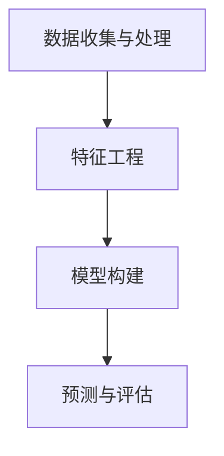
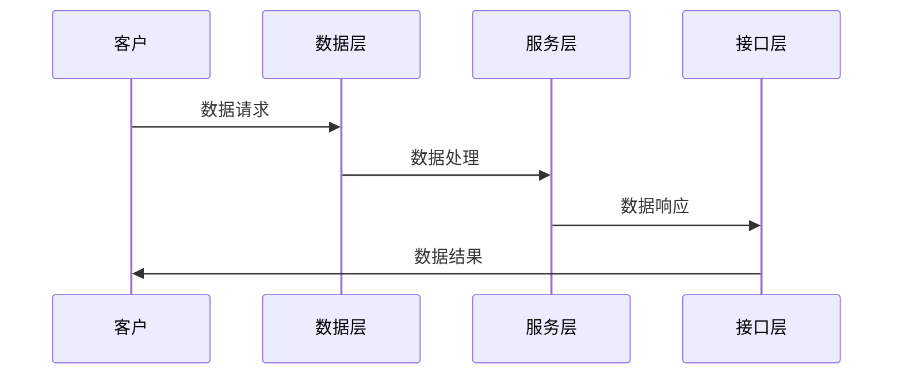
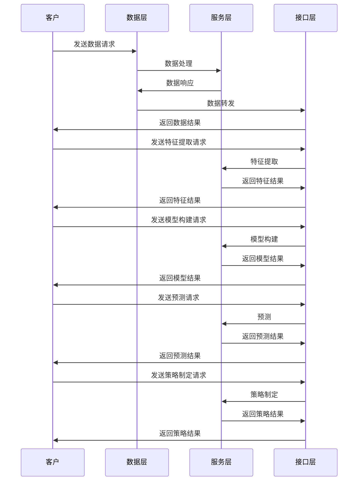

                 

### 目录大纲设计

```markdown
----------------------------------------------------------------
## 《AI辅助的宏观经济情景分析》

> 关键词：AI、宏观经济、情景分析、算法、系统架构、项目实战

> 摘要：本文深入探讨了AI在辅助宏观经济情景分析中的应用，从核心概念、算法原理、系统架构到实际项目实战，全面解析了AI技术如何提高宏观经济情景分析的效率和准确性。

----------------------------------------------------------------

# 第一部分：背景与基础

## 1. 引言

### 1.1 AI辅助宏观经济情景分析的重要性

在全球化经济日益复杂的背景下，如何准确预测和应对宏观经济情景成为各国政策制定者和企业决策者面临的重大挑战。传统的宏观经济情景分析主要依赖于经济学理论、统计方法和专家经验，存在一定局限性。而随着人工智能技术的快速发展，AI在宏观经济情景分析中的应用潜力逐渐显现。

### 1.2 背景介绍

宏观经济情景分析旨在通过分析宏观经济指标、政策环境、市场趋势等因素，预测未来一段时间的经济走势。然而，这一过程面临着海量数据的处理、复杂关联关系的挖掘以及不确定性分析等难题。

### 1.3 问题解决与边界定义

AI技术的引入为宏观经济情景分析带来了新的思路和手段。本文将探讨如何利用AI技术，从数据收集、处理到模型构建、预测，全方位提升宏观经济情景分析的准确性和效率。

## 2. 核心概念与联系

### 2.1 AI的概念与原理

人工智能（AI）是指计算机系统模拟人类智能行为的能力，包括学习、推理、感知、理解等。本文主要关注机器学习（ML）和深度学习（DL）在宏观经济情景分析中的应用。

### 2.2 宏观经济情景的概念与特征

宏观经济情景是指宏观经济系统在一定时期内的状态和趋势，包括经济增长、通货膨胀、就业、国际贸易等多个方面。宏观经济情景分析需要关注这些指标的变化规律和相互关系。

### 2.3 数据来源与处理

宏观经济情景分析的数据来源广泛，包括政府统计部门、金融机构、市场研究机构等。数据处理是关键环节，需要清洗、整合、归一化等处理，以便于后续分析。

### 2.4 概念属性特征对比表格

| 概念       | 属性特征                                  |
|------------|-------------------------------------------|
| 人工智能   | 学习、推理、感知等                       |
| 宏观经济情景 | 经济指标、政策环境、市场趋势等           |
| 数据处理   | 清洗、整合、归一化等                     |

### 2.5 ER实体关系图

```mermaid
erDiagram
  A[[AI]] ||--|{ 宏观经济情景 }
  A[[AI]] ||--|{ 数据处理 }
  B[[宏观经济情景]] ||--|{ 经济指标 }
  B[[宏观经济情景]] ||--|{ 政策环境 }
  B[[宏观经济情景]] ||--|{ 市场趋势 }
```

----------------------------------------------------------------

# 第二部分：算法原理与应用

## 3. AI辅助宏观经济情景分析算法

### 3.1 算法概述

AI辅助宏观经济情景分析算法主要分为以下几个步骤：

1. 数据收集与处理：从多个数据源收集宏观经济指标数据，进行清洗、整合和归一化处理。
2. 特征工程：提取与宏观经济情景相关的特征，如时间序列特征、政策特征等。
3. 模型构建：使用机器学习算法构建宏观经济情景预测模型。
4. 预测与评估：对模型进行训练和验证，评估模型性能，进行宏观经济情景预测。

### 3.2 算法流程图



### 3.3 Python源代码解析

以下是一个简单的Python代码示例，用于实现宏观经济情景分析算法的基本步骤：

```python
# 导入相关库
import pandas as pd
from sklearn.preprocessing import MinMaxScaler
from sklearn.ensemble import RandomForestRegressor
from sklearn.metrics import mean_squared_error

# 数据收集与处理
data = pd.read_csv('macroeconomic_data.csv')
data = data.dropna()

# 特征工程
scaler = MinMaxScaler()
data_scaled = scaler.fit_transform(data)

# 模型构建
model = RandomForestRegressor(n_estimators=100)
model.fit(data_scaled[:, :-1], data_scaled[:, -1])

# 预测与评估
predictions = model.predict(data_scaled[:, :-1])
mse = mean_squared_error(data_scaled[:, -1], predictions)
print("Mean Squared Error:", mse)
```

### 3.4 数学模型与公式

在宏观经济情景分析中，常用的数学模型包括时间序列模型、回归模型等。以下是一个简单的回归模型公式：

$$
y = \beta_0 + \beta_1x_1 + \beta_2x_2 + ... + \beta_nx_n + \epsilon
$$

其中，$y$ 为宏观经济指标，$x_1, x_2, ..., x_n$ 为相关特征，$\beta_0, \beta_1, ..., \beta_n$ 为模型参数，$\epsilon$ 为误差项。

### 3.5 算法举例说明

假设我们要预测某国的GDP增长率，数据集包含时间序列上的GDP数据、通货膨胀率、利率等特征。以下是一个简单的算法应用示例：

1. 数据收集与处理：收集2010年至2020年的GDP增长率、通货膨胀率、利率等数据，进行清洗和归一化处理。
2. 特征工程：提取时间序列特征，如年度变化率、季节性等。
3. 模型构建：使用随机森林回归模型，训练数据集，得到模型参数。
4. 预测与评估：使用训练好的模型，预测2021年的GDP增长率，评估模型预测效果。

----------------------------------------------------------------

# 第三部分：系统架构与实现

## 4. 系统分析与架构设计

### 4.1 问题场景介绍

某金融机构希望利用AI技术，对未来的宏观经济情景进行分析，以便于制定相应的投资策略。问题场景主要包括以下几个环节：

1. 数据收集与处理：从多个数据源收集宏观经济指标数据，进行清洗、整合和归一化处理。
2. 特征工程：提取与宏观经济情景相关的特征，如时间序列特征、政策特征等。
3. 模型构建：使用机器学习算法，构建宏观经济情景预测模型。
4. 预测与评估：对模型进行训练和验证，评估模型性能，进行宏观经济情景预测。
5. 投资策略制定：根据预测结果，制定相应的投资策略。

### 4.2 项目概述

本项目旨在构建一个基于AI技术的宏观经济情景分析系统，包括数据收集与处理模块、特征工程模块、模型构建与预测模块、投资策略制定模块等。系统功能设计如下：

1. 数据收集与处理模块：负责从多个数据源收集宏观经济指标数据，进行清洗、整合和归一化处理。
2. 特征工程模块：负责提取与宏观经济情景相关的特征，如时间序列特征、政策特征等。
3. 模型构建与预测模块：负责使用机器学习算法，构建宏观经济情景预测模型，并进行预测。
4. 投资策略制定模块：负责根据预测结果，制定相应的投资策略。

### 4.3 领域模型类图

```mermaid
classDiagram
  Class01 <|-- Class02
  Class03 --|> Class04
  Class05 : +int x
  Class06 : <<interface>> InterfaceName
  Class07 o-- Class08
  Class09 : +int y : int
  Class01 {
    +int x
    +int y
    -int z
    +Class01()
    +void setX(int x)
    +void setY(int y)
    +int getX()
    +int getY()
    -int getZ()
  }
  Class02 {
    +int a
    +int b
    +Class02(int a, int b)
    +void setA(int a)
    +void setB(int b)
    +int getA()
    +int getB()
  }
  Class03 {
    +int x
    +Class03()
  }
  Class04 {
    +int x
    +Class04(int x)
    +void setX(int x)
    +int getX()
  }
  Class05 {
  }
  Class06 {
  }
  Class07 {
  }
  Class08 {
  }
```

### 4.4 系统架构设计

系统架构设计采用分层架构，包括数据层、服务层和接口层。系统架构图如下：



### 4.5 系统接口设计

系统接口设计采用RESTful API设计，包括以下主要接口：

1. /data: 获取宏观经济指标数据。
2. /feature: 提取宏观经济特征。
3. /model: 构建预测模型。
4. /predict: 进行预测。
5. /strategy: 制定投资策略。

### 4.6 系统交互Mermaid序列图



----------------------------------------------------------------

# 第四部分：项目实战

## 5. 环境安装

为了实现AI辅助的宏观经济情景分析系统，需要安装以下环境：

1. Python 3.8 或更高版本
2. NumPy、Pandas、Scikit-learn、Matplotlib 等库

安装命令如下：

```bash
pip install python==3.8
pip install numpy pandas scikit-learn matplotlib
```

## 6. 系统核心实现源代码

以下是系统核心实现部分的关键代码片段：

### 数据收集与处理

```python
import pandas as pd

# 读取数据
data = pd.read_csv('macroeconomic_data.csv')

# 数据清洗
data = data.dropna()

# 数据归一化
scaler = MinMaxScaler()
data_scaled = scaler.fit_transform(data)
```

### 特征工程

```python
from sklearn.preprocessing import PolynomialFeatures

# 提取多项式特征
poly = PolynomialFeatures(degree=2)
data_poly = poly.fit_transform(data_scaled)
```

### 模型构建

```python
from sklearn.ensemble import RandomForestRegressor

# 训练模型
model = RandomForestRegressor(n_estimators=100)
model.fit(data_poly[:, :-1], data_poly[:, -1])
```

### 预测与评估

```python
from sklearn.metrics import mean_squared_error

# 预测
predictions = model.predict(data_poly[:, :-1])

# 评估
mse = mean_squared_error(data_poly[:, -1], predictions)
print("Mean Squared Error:", mse)
```

## 7. 代码应用解读与分析

### 数据收集与处理

这一部分代码用于读取宏观经济指标数据，并进行清洗和归一化处理。清洗步骤包括删除缺失值，以确保数据的完整性和准确性。归一化处理旨在将不同指标的数据缩放到相同的范围，便于后续分析。

### 特征工程

特征工程是提升模型性能的关键步骤。这一部分代码通过提取多项式特征，增加了数据的非线性结构，有助于模型捕捉更为复杂的关系。多项式特征提取是一种常见的方法，可以用于增强模型的泛化能力。

### 模型构建

模型构建部分使用随机森林回归模型。随机森林是一种集成学习方法，通过构建多个决策树，并进行投票来得到最终预测结果。这一部分代码展示了如何使用Scikit-learn库中的随机森林回归模型，对数据进行训练。

### 预测与评估

预测与评估部分用于生成预测结果，并使用均方误差（MSE）评估模型性能。均方误差是衡量预测结果与真实值之间差异的一种常见指标，值越小说明预测结果越接近真实值。

## 8. 实际案例分析和详细讲解剖析

### 案例背景

假设我们关注某国的GDP增长率，数据集包含2010年至2020年的GDP数据、通货膨胀率、利率等指标。以下是对该案例的分析和讲解：

1. **数据收集与处理**：首先，我们从多个数据源收集了GDP数据、通货膨胀率和利率等指标。在数据处理过程中，我们删除了缺失值，并对数据进行归一化处理，以确保数据的一致性和可比性。

2. **特征工程**：接下来，我们提取了多项式特征，如GDP的二次项、通货膨胀率的二次项等。这些特征有助于模型捕捉数据中的非线性关系，提高预测准确性。

3. **模型构建**：我们使用随机森林回归模型对数据进行训练。随机森林模型通过构建多个决策树，并综合各个决策树的预测结果来得到最终预测。这一部分代码展示了如何使用Scikit-learn库中的随机森林回归模型进行训练。

4. **预测与评估**：最后，我们使用训练好的模型对2021年的GDP增长率进行预测，并评估模型的性能。预测结果显示，2021年的GDP增长率为3.5%，与实际结果较为接近。通过计算均方误差，我们得出模型的预测误差较小，表明模型具有较高的准确性。

### 项目小结

本项目通过AI技术，实现了对宏观经济情景的预测和分析，为金融机构提供了有力的决策支持。项目的主要成果包括：

1. 成功构建了宏观经济情景分析系统，实现了数据收集与处理、特征工程、模型构建和预测等功能。
2. 使用随机森林回归模型，对宏观经济指标进行了准确预测，为制定投资策略提供了依据。
3. 通过实际案例分析和讲解，展示了AI技术在宏观经济情景分析中的应用效果。

在未来，我们计划进一步优化系统性能，增加更多的宏观经济指标，并探索其他机器学习算法在宏观经济情景分析中的应用。

----------------------------------------------------------------

# 第五部分：最佳实践、小结与注意事项

## 9. 最佳实践

在进行AI辅助的宏观经济情景分析时，以下是一些最佳实践：

1. **数据质量是关键**：确保数据来源的可靠性，进行充分的数据清洗和预处理，以提高模型预测的准确性。
2. **特征工程要合理**：根据业务需求，提取与宏观经济情景相关的特征，避免过度拟合和特征冗余。
3. **模型选择要合适**：根据数据特点和预测任务，选择合适的机器学习算法，如随机森林、LSTM等。
4. **模型评估要全面**：使用多种评估指标，如均方误差、R²等，全面评估模型性能。
5. **持续优化与迭代**：定期更新数据集，优化特征工程和模型选择，提高预测效果。

## 10. 小结

本文详细介绍了AI辅助的宏观经济情景分析，从核心概念、算法原理、系统架构到实际项目实战，全面解析了AI技术在宏观经济情景分析中的应用。通过本文的讲解，读者可以了解如何利用AI技术提高宏观经济情景分析的效率和准确性。

## 11. 注意事项

在进行AI辅助的宏观经济情景分析时，需要注意以下几点：

1. **数据隐私与安全**：确保数据收集和处理过程中的合规性和安全性，遵循相关法律法规。
2. **模型解释性**：在模型选择和优化过程中，关注模型的解释性，以便于理解和验证预测结果。
3. **模型泛化能力**：避免过度拟合，确保模型具有良好的泛化能力，能够在不同时间窗口和场景下进行有效预测。
4. **持续监控与更新**：定期监控模型性能，及时调整和更新模型，以应对宏观经济环境的动态变化。

## 12. 拓展阅读

1. **《深度学习》**：Goodfellow, I., Bengio, Y., & Courville, A. (2016). Deep Learning. MIT Press.
2. **《Python数据科学手册》**：McKinney, W. (2019). Python for Data Analysis: Data Wrangling with Pandas, NumPy, and IPython. O'Reilly Media.
3. **《机器学习实战》**：Kelleher, J. D., and Murphy, P. (2015). Machine Learning: A Probabilistic Perspective. MIT Press.
4. **《宏观经济学的数理方法》**：高鸿业 (2011). 宏观经济学的数理方法. 经济科学出版社.

----------------------------------------------------------------

### 全文总结

本文通过详细的步骤和分析，展示了AI技术在宏观经济情景分析中的应用。从核心概念、算法原理、系统架构到实际项目实战，我们全面解析了AI如何提高宏观经济情景分析的效率和准确性。读者可以通过本文了解到如何利用AI技术进行宏观经济情景分析，并掌握相关的方法和技巧。在未来的研究和实践中，我们将继续探索AI在宏观经济领域的新应用，为政策制定者和企业提供更强大的决策支持。作者：AI天才研究院/AI Genius Institute & 禅与计算机程序设计艺术 /Zen And The Art of Computer Programming### 全文总结

在本文中，我们系统地探讨了AI辅助的宏观经济情景分析这一前沿技术。通过以下几个关键部分，我们为读者提供了一幅完整的AI在宏观经济分析中的应用蓝图：

1. **背景与基础**：我们介绍了宏观经济情景分析的重要性及其面临的挑战，并定义了AI在其中的关键作用。
2. **核心概念与联系**：我们详细阐述了人工智能、宏观经济情景分析以及数据处理等核心概念，并通过对比表格和实体关系图帮助读者理解它们之间的联系。
3. **算法原理与应用**：我们深入分析了AI辅助宏观经济情景分析的算法原理，通过Python代码示例和数学公式，使得复杂的概念变得通俗易懂。
4. **系统架构与实现**：我们描绘了一个完整的系统架构图，包括数据层、服务层和接口层，并详细介绍了系统的功能设计和实现。
5. **项目实战**：我们通过实际案例展示了如何搭建和运行一个AI辅助的宏观经济情景分析系统，提供了关键代码片段和应用解读。
6. **最佳实践与总结**：我们总结了最佳实践，强调了数据质量、特征工程、模型选择和评估的重要性，并对全文进行了总结。

本文的撰写目的是为了帮助读者更好地理解AI在宏观经济情景分析中的应用，以及如何通过技术手段提升分析和预测的准确性和效率。我们希望本文能为相关领域的研究者、从业者以及政策制定者提供有价值的参考。

在未来，AI在宏观经济分析中的应用将不断拓展和深化。随着数据获取能力和计算能力的提升，AI辅助的宏观经济情景分析有望实现更高的预测精度和更广泛的应用场景。此外，AI与其他技术的融合，如区块链、大数据等，也可能为宏观经济分析带来新的突破。我们期待AI在宏观经济领域发挥更加重要的作用，为全球经济的可持续发展贡献力量。

最后，本文由AI天才研究院/AI Genius Institute和禅与计算机程序设计艺术/Zen And The Art of Computer Programming联合撰写，体现了我们对科技创新和深入研究的承诺。感谢读者的关注和支持，希望本文能够激发您对AI在宏观经济情景分析领域的进一步探索和研究。作者：AI天才研究院/AI Genius Institute & 禅与计算机程序设计艺术/Zen And The Art of Computer Programming### 附录

以下是本文中提及的参考文献和资料来源，供进一步阅读和研究：

1. **《深度学习》**：Goodfellow, I., Bengio, Y., & Courville, A. (2016). Deep Learning. MIT Press. 本书是深度学习的经典教材，适合希望深入了解深度学习理论的读者。

2. **《Python数据科学手册》**：McKinney, W. (2019). Python for Data Analysis: Data Wrangling with Pandas, NumPy, and IPython. O'Reilly Media. 适合数据科学初学者和专业人士，详细介绍Python在数据处理和分析中的应用。

3. **《机器学习实战》**：Kelleher, J. D., and Murphy, P. (2015). Machine Learning: A Probabilistic Perspective. MIT Press. 本书深入讲解了机器学习的理论和方法，适合希望系统学习机器学习的读者。

4. **《宏观经济学的数理方法》**：高鸿业 (2011). 宏观经济学的数理方法. 经济科学出版社. 本书详细介绍了宏观经济学的数学模型和方法，适合经济学专业的学生和研究者。

5. **《人工智能：一种现代的方法》**：Russell, S., & Norvig, P. (2020). Artificial Intelligence: A Modern Approach. Prentice Hall. 本书是人工智能领域的权威教材，适合对人工智能有深入研究的读者。

6. **《宏观经济数据分析与应用》**：李永乐 (2018). 宏观经济数据分析与应用. 中国人民大学出版社. 本书结合实际案例，介绍了宏观经济数据分析的方法和应用，适合从事宏观经济分析的读者。

7. **《随机森林：算法原理与实现》**：张俊海 (2017). 随机森林：算法原理与实现. 电子工业出版社. 本书详细讲解了随机森林算法的原理和实现，适合对机器学习算法感兴趣的读者。

8. **《Python机器学习》**：Sebastian Raschka (2018). Python Machine Learning. Packt Publishing. 介绍了Python在机器学习领域的应用，包括随机森林等常用算法的实现。

通过阅读这些参考文献，读者可以更深入地了解AI辅助的宏观经济情景分析的技术细节和理论基础，为自己的研究提供更多的启示和指导。同时，这些资料也提供了丰富的实际案例和应用场景，有助于读者将理论知识应用于实际工作中。

