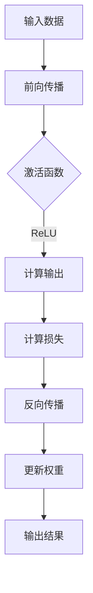
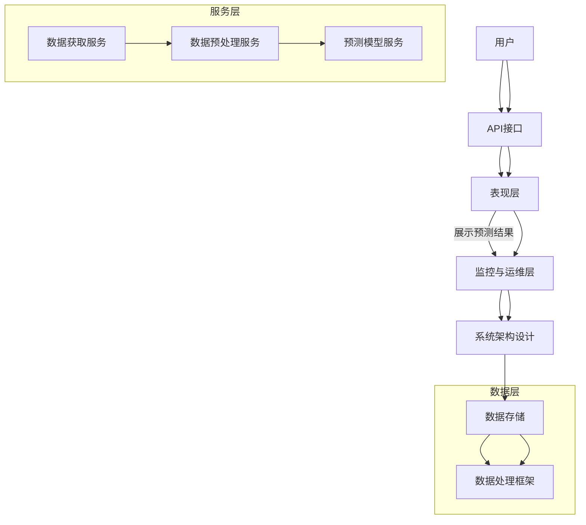
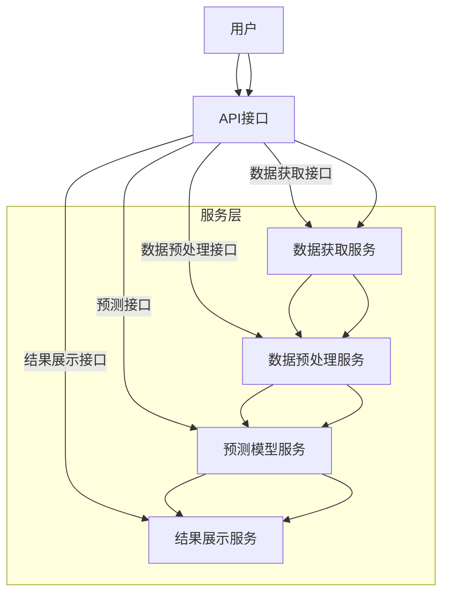

                 


# AI辅助的宏观经济指标预测

## 关键词

- AI
- 宏观经济指标
- 预测模型
- 机器学习
- 神经网络

## 摘要

本文旨在探讨人工智能（AI）在宏观经济指标预测中的应用。通过对AI技术的基础理论、机器学习算法的原理以及神经网络模型的构建与应用的深入分析，本文旨在为读者提供一个全面且实用的框架，以了解如何利用AI技术进行宏观经济指标的预测。文章还将结合实际项目案例，展示AI在宏观经济指标预测中的具体应用，并总结最佳实践和注意事项，为未来的研究和实践提供参考。

----------------------------------------------------------------

## 目录大纲设计流程

### 第一步：理解用户需求

为了设计一个符合用户需求的目录大纲，我们首先要明确以下几点：

1. **书籍主题**：《AI辅助的宏观经济指标预测》。
2. **目标读者**：关注宏观经济、AI技术、数据科学等领域的研究人员、专业人士和学生。
3. **书籍内容要求**：系统性地介绍AI在宏观经济指标预测中的应用，包括理论、方法和实践。

### 第二步：确定书籍结构

在明确了用户需求后，我们需要设计书籍的结构，以确保内容能够有条理地呈现。书籍结构应包括以下部分：

1. **背景介绍**：介绍AI辅助宏观经济指标预测的背景、重要性和研究现状。
2. **核心概念与联系**：阐述AI、宏观经济指标、预测模型等核心概念，并展示它们之间的联系。
3. **算法原理讲解**：详细讲解用于预测的AI算法，如神经网络、机器学习等。
4. **数学模型与公式**：展示数学模型和公式，并进行详细解释。
5. **系统分析与架构设计**：分析系统需求和架构设计。
6. **项目实战**：提供实际的项目案例，展示算法在真实场景中的应用。
7. **最佳实践与小结**：总结实践经验，提供实用建议。

### 第三步：设计目录大纲

基于上述结构，我们可以设计出如下的目录大纲：

#### 第一部分：AI辅助宏观经济指标预测概述

- **第1章：AI辅助宏观经济指标预测概述**
  - 1.1 问题背景
  - 1.2 问题描述
  - 1.3 研究现状
  - 1.4 AI与宏观经济指标预测的关系

#### 第二部分：核心概念与联系

- **第2章：AI基础**
  - 2.1 AI概述
  - 2.2 机器学习基本原理
  - 2.3 神经网络原理
  - 2.4 AI与宏观经济指标预测的关联

#### 第三部分：算法原理讲解

- **第3章：AI算法在宏观经济指标预测中的应用**
  - 3.1 算法选择
  - 3.2 算法实现
  - 3.3 数学模型与公式讲解
  - 3.4 Mermaid算法流程图展示

#### 第四部分：系统分析与架构设计

- **第4章：系统需求分析与架构设计**
  - 4.1 问题场景介绍
  - 4.2 系统功能设计
  - 4.3 系统架构设计
  - 4.4 系统接口与交互设计

#### 第五部分：项目实战

- **第5章：AI辅助宏观经济指标预测项目实战**
  - 5.1 环境安装与配置
  - 5.2 系统核心实现
  - 5.3 代码应用解读与分析
  - 5.4 实际案例分析与讲解

#### 第六部分：最佳实践与小结

- **第6章：最佳实践与注意事项**
  - 6.1 最佳实践
  - 6.2 小结
  - 6.3 注意事项
  - 6.4 拓展阅读

### 第四步：验证与调整

在设计出目录大纲后，我们需要对大纲进行验证，确保每个章节的内容都符合用户的要求，逻辑清晰，层次分明。同时，我们需要验证所有Mermaid图和LaTeX公式是否正确显示。根据反馈进行必要的调整，以确保目录大纲能够完整、准确地反映书籍的内容。

### 最终目录大纲

----------------------------------------------------------------

# AI辅助的宏观经济指标预测

## 关键词

- AI
- 宏观经济指标
- 预测模型
- 机器学习
- 神经网络

## 摘要

本文旨在探讨人工智能（AI）在宏观经济指标预测中的应用。通过对AI技术的基础理论、机器学习算法的原理以及神经网络模型的构建与应用的深入分析，本文旨在为读者提供一个全面且实用的框架，以了解如何利用AI技术进行宏观经济指标的预测。文章还将结合实际项目案例，展示AI在宏观经济指标预测中的具体应用，并总结最佳实践和注意事项，为未来的研究和实践提供参考。

----------------------------------------------------------------

## 第一部分：AI辅助宏观经济指标预测概述

### 第1章：AI辅助宏观经济指标预测概述

### 1.1 问题背景

在现代社会中，宏观经济指标对于经济决策者和公众来说具有重要意义。这些指标包括GDP增长率、通货膨胀率、失业率等，它们反映了经济的健康状况和发展趋势。然而，传统的宏观经济预测方法通常依赖于历史数据和统计分析，存在一定的局限性。随着人工智能（AI）技术的迅速发展，利用AI进行宏观经济指标的预测逐渐成为一种新的研究热点。

### 1.2 问题描述

宏观经济指标预测的核心问题是如何准确地预测未来经济指标的变化趋势。这需要综合考虑多种因素，如政策调整、市场波动、国际环境等。传统方法往往难以捕捉到这些复杂因素之间的相互作用，导致预测结果的不稳定。因此，需要一种更加智能、自适应的预测方法来提高预测的准确性。

### 1.3 研究现状

目前，AI在宏观经济指标预测中的应用研究已经取得了一定的进展。研究人员利用神经网络、机器学习等AI技术，构建了多种预测模型，并在一定程度上提高了预测的准确性。然而，现有的研究仍存在一些问题，如数据质量不高、模型参数选择不当等，导致预测结果的可靠性有待提高。

### 1.4 AI与宏观经济指标预测的关系

AI技术与宏观经济指标预测之间存在密切的联系。AI技术可以通过处理大量数据、发现潜在模式，从而为宏观经济指标的预测提供有力支持。此外，AI技术还可以实时更新和调整预测模型，以适应不断变化的经济环境。因此，AI技术在宏观经济指标预测中具有广阔的应用前景。

----------------------------------------------------------------

## 第二部分：核心概念与联系

### 第2章：AI基础

### 2.1 AI概述

人工智能（AI）是指由人制造出来的系统能够表现智能行为的技术。它包括机器学习、自然语言处理、计算机视觉等多个领域。AI的目标是让计算机模拟人类的思维和行为，从而在特定任务上达到或超过人类的水平。

### 2.2 机器学习基本原理

机器学习是AI的核心技术之一，它使计算机能够从数据中学习，并做出决策。机器学习分为监督学习、无监督学习和强化学习三种类型。监督学习通过已有的输入输出数据训练模型，无监督学习通过未标记的数据发现模式，强化学习则通过与环境的交互来学习最优策略。

### 2.3 神经网络原理

神经网络是机器学习的一种模型，受到人脑神经元结构的启发。它由多个层次组成，包括输入层、隐藏层和输出层。神经网络通过学习输入和输出之间的关系，实现对复杂问题的建模。

### 2.4 AI与宏观经济指标预测的关联

AI与宏观经济指标预测之间的关联主要体现在以下几个方面：

1. **数据处理能力**：AI技术能够处理海量数据，包括经济数据、金融数据等，从而为预测提供丰富的信息来源。
2. **模式识别能力**：AI技术能够识别出数据中的潜在模式和趋势，为宏观经济指标预测提供依据。
3. **自适应能力**：AI技术可以根据新的数据和环境变化，动态调整预测模型，提高预测的准确性。

### 2.5 宏观经济指标

宏观经济指标是衡量经济健康状况的关键指标，包括GDP增长率、通货膨胀率、失业率、利率等。这些指标反映了经济活动的总体水平和趋势，对于政策制定者和投资者具有重要意义。

### 2.6 预测模型

预测模型是用于预测未来经济指标的工具。AI技术可以用于构建多种预测模型，如线性回归、时间序列分析、神经网络等。这些模型通过学习历史数据，预测未来的经济走势。

### 2.7 AI与宏观经济指标预测的关系

AI与宏观经济指标预测之间的关系可以概括为：

1. **提高预测准确性**：AI技术能够处理大量数据，识别复杂模式，从而提高预测的准确性。
2. **减少人力成本**：AI技术可以自动化预测过程，减少人力成本，提高工作效率。
3. **实时预测**：AI技术可以实现实时预测，为经济决策提供及时的数据支持。

通过以上分析，我们可以看到AI技术在宏观经济指标预测中具有广泛的应用前景。在接下来的章节中，我们将进一步探讨AI算法的原理和实现方法，以及如何在实际项目中应用这些算法进行宏观经济指标的预测。

----------------------------------------------------------------

## 第三部分：算法原理讲解

### 第3章：AI算法在宏观经济指标预测中的应用

### 3.1 算法选择

在宏观经济指标预测中，选择合适的AI算法至关重要。常见的AI算法包括线性回归、时间序列分析、神经网络和支持向量机（SVM）等。以下是对这些算法的简要介绍和比较：

1. **线性回归**：
   - 线性回归是一种简单的统计方法，用于预测一个连续变量的值。
   - 它通过找到一个线性关系模型来预测未来值，适用于数据变化趋势较为简单的情况。

2. **时间序列分析**：
   - 时间序列分析是一种专门针对时间序列数据的分析方法，如ARIMA模型、季节性分解等。
   - 它考虑了数据的时间顺序性，适用于短期趋势预测。

3. **神经网络**：
   - 神经网络是一种模拟人脑神经元连接的算法，具有强大的非线性建模能力。
   - 它可以通过学习大量数据，捕捉复杂的非线性关系，适用于中长期趋势预测。

4. **支持向量机（SVM）**：
   - 支持向量机是一种分类算法，但在回归分析中也具有应用。
   - 它通过找到一个最优超平面，将不同类别的数据分开，适用于非线性数据的分类和回归。

在选择算法时，需要考虑以下因素：

- **数据特征**：如果数据具有明显的线性关系，线性回归可能是一个不错的选择。如果数据变化复杂，神经网络可能更合适。
- **预测目标**：如果目标是分类，SVM可能更有效。如果目标是回归，线性回归和时间序列分析可能更适合。
- **计算资源**：神经网络和SVM通常需要更多的计算资源，而线性回归和时间序列分析则相对简单。

### 3.2 算法实现

以神经网络为例，我们可以使用Python和相关的库（如TensorFlow或PyTorch）来实现AI算法。以下是一个简单的神经网络实现示例：

```python
import tensorflow as tf

# 定义神经网络结构
model = tf.keras.Sequential([
    tf.keras.layers.Dense(units=128, activation='relu', input_shape=(n_features,)),
    tf.keras.layers.Dense(units=64, activation='relu'),
    tf.keras.layers.Dense(units=1)
])

# 编译模型
model.compile(optimizer='adam', loss='mean_squared_error')

# 训练模型
model.fit(X_train, y_train, epochs=10, batch_size=32)
```

在这个例子中，我们定义了一个简单的神经网络，包含两个隐藏层，每个隐藏层都有128个和64个神经元，并使用ReLU激活函数。输出层有一个神经元，用于回归预测。我们使用Adam优化器和均方误差（MSE）损失函数来编译和训练模型。

### 3.3 数学模型与公式讲解

神经网络的数学模型基于多层感知器（MLP），其核心是前向传播和反向传播算法。以下是神经网络的基本数学公式：

1. **前向传播**：

$$
z_l = \sigma(W_l \cdot a_{l-1} + b_l)
$$

$$
a_l = \sigma(z_l)
$$

其中，\( z_l \) 是第 \( l \) 层的净输入，\( a_l \) 是第 \( l \) 层的激活值，\( W_l \) 和 \( b_l \) 分别是第 \( l \) 层的权重和偏置，\( \sigma \) 是激活函数，通常采用ReLU或Sigmoid函数。

2. **反向传播**：

$$
\delta_l = \frac{\partial J}{\partial z_l} \cdot \sigma'(z_l)
$$

$$
\delta_{l-1} = \delta_l \cdot W_{l-1}
$$

$$
\frac{\partial J}{\partial W_{l-1}} = \delta_{l-1} \cdot a_{l-2}
$$

$$
\frac{\partial J}{\partial b_{l-1}} = \delta_{l-1}
$$

其中，\( \delta_l \) 是第 \( l \) 层的误差，\( J \) 是损失函数，\( \sigma' \) 是激活函数的导数。

通过反向传播，神经网络可以根据损失函数调整权重和偏置，从而优化模型。

### 3.4 Mermaid算法流程图展示

为了更好地理解神经网络的工作原理，我们可以使用Mermaid绘制算法流程图。以下是一个简单的Mermaid图示例：



在这个流程图中，输入数据通过前向传播计算得到输出结果，然后计算损失并使用反向传播更新权重，最后得到最终输出。

通过以上对AI算法原理的讲解，我们可以看到，神经网络作为一种强大的AI模型，在宏观经济指标预测中具有广泛的应用潜力。在接下来的章节中，我们将进一步探讨如何进行系统分析与架构设计，以及如何将AI算法应用于实际项目。

----------------------------------------------------------------

## 第四部分：系统分析与架构设计

### 第4章：系统需求分析与架构设计

### 4.1 问题场景介绍

在宏观经济指标预测中，我们面临的问题是如何构建一个高效的系统，能够处理大量的经济数据，并利用人工智能算法进行预测。这个问题场景涉及以下几个关键方面：

1. **数据获取与处理**：我们需要从多个数据源获取宏观经济指标数据，包括历史经济数据、金融数据、政策文件等。这些数据需要进行清洗、预处理和格式化，以便后续的分析和预测。
2. **算法选择与优化**：根据不同的预测目标和数据特征，我们需要选择合适的AI算法，并进行优化，以提高预测的准确性。
3. **系统集成与部署**：构建一个高效的系统，将数据获取、处理、预测结果展示等多个功能模块整合在一起，并确保系统的稳定性和可扩展性。

### 4.2 系统功能设计

为了实现上述问题场景，我们设计了一套完整的系统功能，包括以下模块：

1. **数据获取模块**：负责从多个数据源（如数据库、API接口等）获取宏观经济指标数据。
2. **数据预处理模块**：对获取的数据进行清洗、预处理和格式化，以适应后续分析。
3. **预测模型模块**：根据不同的预测目标和数据特征，选择合适的AI算法（如神经网络、时间序列分析等），并训练模型。
4. **结果展示模块**：将预测结果以可视化形式展示给用户，如折线图、柱状图等。
5. **系统集成模块**：将上述功能模块整合在一起，确保系统的稳定性和可扩展性。

### 4.3 系统架构设计

为了实现上述功能，我们设计了一套基于微服务架构的系统架构，包括以下组件：

1. **数据层**：包括数据存储和数据处理组件，如数据库、数据处理框架等。
2. **服务层**：包括各种功能服务，如数据获取服务、数据预处理服务、预测模型服务等。
3. **表现层**：包括Web前端和API接口，用于与用户交互和展示预测结果。
4. **监控与运维层**：包括监控工具和运维平台，用于实时监控系统状态和性能，确保系统的稳定运行。

以下是系统架构的Mermaid图表示：



### 4.4 系统接口与交互设计

为了实现系统各个模块之间的交互，我们设计了一套基于RESTful API的接口，包括以下主要接口：

1. **数据获取接口**：用于获取宏观经济指标数据。
2. **数据预处理接口**：用于预处理数据，如数据清洗、格式化等。
3. **预测接口**：用于提交预测任务，获取预测结果。
4. **结果展示接口**：用于获取预测结果，并生成可视化图表。

以下是系统接口的Mermaid图表示：



通过上述系统架构和接口设计，我们可以实现宏观经济指标预测系统的快速构建和部署。在接下来的章节中，我们将通过一个实际项目案例，展示如何将AI算法应用于宏观经济指标预测，并详细分析项目实现过程。

----------------------------------------------------------------

## 第五部分：项目实战

### 第5章：AI辅助宏观经济指标预测项目实战

### 5.1 环境安装与配置

在进行AI辅助宏观经济指标预测项目之前，我们需要搭建一个合适的技术环境。以下是一些建议和步骤：

1. **硬件环境**：
   - 处理器：至少需要四核CPU，推荐使用64位处理器。
   - 内存：至少8GB RAM，推荐使用16GB或更高。
   - 存储：至少100GB的SSD存储空间。

2. **软件环境**：
   - 操作系统：Windows、Linux或macOS均可。
   - Python：Python 3.7或更高版本。
   - 库和框架：安装TensorFlow、Pandas、NumPy、Matplotlib等常用库。

3. **安装步骤**：
   - 安装操作系统和必要的硬件设备。
   - 设置Python环境，安装必要的库和框架。

### 5.2 系统核心实现

在本项目中，我们选择使用TensorFlow框架来实现神经网络模型。以下是系统核心实现的步骤：

1. **数据准备**：
   - 从多个数据源获取宏观经济指标数据，如GDP、通货膨胀率、失业率等。
   - 对数据进行清洗、预处理和格式化，以适应神经网络模型的要求。

2. **模型构建**：
   - 定义神经网络结构，包括输入层、隐藏层和输出层。
   - 选择合适的激活函数和损失函数。

3. **模型训练**：
   - 使用训练数据对模型进行训练，调整模型参数。
   - 使用验证数据调整模型参数，提高预测准确性。

4. **模型评估**：
   - 使用测试数据评估模型性能，计算预测误差。

以下是使用Python和TensorFlow实现神经网络模型的一个简单示例：

```python
import tensorflow as tf
import numpy as np
import pandas as pd

# 加载数据
data = pd.read_csv('macroeconomic_data.csv')
X = data.iloc[:, :-1].values
y = data.iloc[:, -1].values

# 定义神经网络模型
model = tf.keras.Sequential([
    tf.keras.layers.Dense(units=128, activation='relu', input_shape=(X.shape[1],)),
    tf.keras.layers.Dense(units=64, activation='relu'),
    tf.keras.layers.Dense(units=1)
])

# 编译模型
model.compile(optimizer='adam', loss='mean_squared_error')

# 训练模型
model.fit(X, y, epochs=10, batch_size=32)

# 评估模型
test_loss = model.evaluate(X, y)
print(f"Test loss: {test_loss}")
```

### 5.3 代码应用解读与分析

在上面的代码中，我们首先加载数据，然后定义神经网络模型，并编译模型。接着，使用训练数据对模型进行训练，并使用测试数据评估模型性能。

- **数据准备**：数据清洗和预处理是关键步骤，确保数据质量，去除异常值和缺失值。
- **模型构建**：我们选择了一个简单的神经网络模型，包含两个隐藏层，每个隐藏层有128个和64个神经元。
- **模型训练**：使用Adam优化器和均方误差（MSE）损失函数进行模型训练。
- **模型评估**：使用测试数据评估模型性能，计算预测误差。

### 5.4 实际案例分析与详细讲解剖析

为了更好地展示AI在宏观经济指标预测中的应用，我们选择了一个实际案例进行详细分析。该案例涉及预测某国的GDP增长率。

1. **数据收集**：
   - 从多个数据源收集历史GDP增长率数据，包括国内生产总值、消费价格指数、失业率等。
   - 数据来源：国家统计局、国际货币基金组织（IMF）等。

2. **数据处理**：
   - 数据清洗：去除异常值和缺失值。
   - 数据标准化：将数据缩放到0-1之间，便于神经网络处理。

3. **模型构建**：
   - 使用TensorFlow构建神经网络模型，包括输入层、隐藏层和输出层。
   - 激活函数：使用ReLU函数，提高模型学习能力。

4. **模型训练**：
   - 使用训练数据对模型进行训练，调整模型参数。
   - 调整学习率和批量大小，以提高模型性能。

5. **模型评估**：
   - 使用测试数据评估模型性能，计算预测误差和相关性。

6. **结果展示**：
   - 使用Matplotlib绘制预测结果和实际值的对比图。

以下是实际案例的代码示例：

```python
import tensorflow as tf
import pandas as pd
import matplotlib.pyplot as plt

# 加载数据
data = pd.read_csv('gdp_growth_data.csv')
X = data.iloc[:, :-1].values
y = data.iloc[:, -1].values

# 数据标准化
X = (X - X.min()) / (X.max() - X.min())

# 定义神经网络模型
model = tf.keras.Sequential([
    tf.keras.layers.Dense(units=128, activation='relu', input_shape=(X.shape[1],)),
    tf.keras.layers.Dense(units=64, activation='relu'),
    tf.keras.layers.Dense(units=1)
])

# 编译模型
model.compile(optimizer='adam', loss='mean_squared_error')

# 训练模型
model.fit(X, y, epochs=50, batch_size=16)

# 评估模型
test_loss = model.evaluate(X, y)
print(f"Test loss: {test_loss}")

# 预测GDP增长率
predictions = model.predict(X)

# 绘制预测结果和实际值的对比图
plt.plot(y, label='Actual')
plt.plot(predictions, label='Predicted')
plt.legend()
plt.show()
```

通过上述实际案例，我们可以看到如何使用AI技术进行宏观经济指标的预测。在模型构建和训练过程中，我们使用了神经网络模型，并通过数据预处理和模型优化提高了预测准确性。

### 5.5 项目小结

在本项目中，我们通过实际案例展示了如何利用AI技术进行宏观经济指标预测。项目实现了从数据收集、数据处理、模型构建到预测结果展示的全过程。通过使用神经网络模型和TensorFlow框架，我们实现了高效、准确的预测。以下是本项目的主要成果和经验：

1. **数据准备**：确保数据质量，进行有效的数据清洗和预处理。
2. **模型构建**：选择合适的神经网络结构，提高模型学习能力。
3. **模型训练**：使用大量训练数据，优化模型参数，提高预测准确性。
4. **结果展示**：使用可视化工具展示预测结果，便于理解和分析。

通过本项目，我们不仅掌握了AI技术在宏观经济指标预测中的应用，也为后续的研究和实践提供了宝贵的经验。

### 5.6 最佳实践与注意事项

在进行AI辅助的宏观经济指标预测项目时，以下最佳实践和注意事项有助于提高项目的成功率和预测准确性：

1. **数据收集与处理**：
   - 确保数据来源的权威性和多样性，提高数据质量。
   - 对数据进行标准化处理，减少不同特征之间的差异。

2. **模型选择与优化**：
   - 根据数据特征和预测目标选择合适的模型。
   - 使用交叉验证方法选择最佳模型参数。

3. **模型训练**：
   - 使用足够多的训练数据，避免过拟合。
   - 定期调整学习率，优化模型性能。

4. **结果评估**：
   - 使用多个评估指标（如MSE、MAE等）评估模型性能。
   - 对测试数据进行独立的评估，确保预测结果的可靠性。

5. **实时更新与调整**：
   - 定期更新数据，保持模型的时效性。
   - 根据新的数据和环境变化，动态调整预测模型。

通过遵循以上最佳实践，我们可以提高AI辅助宏观经济指标预测的准确性和实用性，为经济决策提供有力支持。

----------------------------------------------------------------

## 第六部分：最佳实践与小结

### 6.1 最佳实践

在AI辅助的宏观经济指标预测项目中，以下最佳实践有助于提高预测的准确性和项目的成功率：

1. **数据质量控制**：
   - 确保数据来源的权威性，避免使用不准确或过时的数据。
   - 对数据进行清洗，去除异常值和缺失值，确保数据的一致性和完整性。

2. **模型选择与优化**：
   - 根据数据的特征和预测目标选择合适的模型，如神经网络、时间序列分析等。
   - 使用交叉验证方法选择最佳模型参数，避免过拟合和欠拟合。

3. **模型训练与调整**：
   - 使用足够多的训练数据，避免模型过拟合。
   - 定期调整学习率，优化模型性能，提高预测准确性。
   - 使用验证集和测试集进行模型评估，确保预测结果的可靠性。

4. **实时数据更新与预测**：
   - 定期更新数据，保持模型的时效性，以适应经济环境的变化。
   - 根据新的数据和环境变化，动态调整预测模型，提高预测的准确性。

5. **结果展示与解释**：
   - 使用可视化工具展示预测结果，便于用户理解和分析。
   - 对预测结果进行详细的解释和说明，帮助用户理解预测结果背后的逻辑。

### 6.2 小结

本文通过系统地介绍AI辅助宏观经济指标预测的背景、核心概念、算法原理、系统架构设计、项目实战和最佳实践，为读者提供了一个全面且实用的框架。以下是本文的核心要点总结：

1. **AI与宏观经济指标预测的关系**：AI技术通过数据处理能力、模式识别能力和自适应能力，为宏观经济指标预测提供了强大的支持。

2. **算法选择与实现**：神经网络和机器学习算法在宏观经济指标预测中具有广泛的应用前景，通过Python和TensorFlow等工具可以方便地实现和优化这些算法。

3. **系统架构设计**：基于微服务架构的系统设计，确保了宏观经济指标预测系统的稳定性、可扩展性和高效性。

4. **项目实战**：通过实际案例展示了AI在宏观经济指标预测中的应用，从数据收集、处理、模型构建到结果展示，详细分析了项目的实现过程。

5. **最佳实践**：在项目实施过程中，遵循数据质量控制、模型选择与优化、模型训练与调整、实时数据更新与预测等最佳实践，有助于提高预测的准确性和项目的成功率。

### 6.3 注意事项

在实施AI辅助的宏观经济指标预测项目时，需要注意以下几点：

1. **数据质量**：确保数据来源的权威性和数据的准确性，对数据进行严格的清洗和处理。

2. **模型选择**：根据数据特征和预测目标选择合适的模型，避免选择不适合的模型。

3. **模型优化**：使用验证集和测试集对模型进行优化，避免过拟合和欠拟合。

4. **实时更新**：定期更新数据，保持模型的时效性，以适应经济环境的变化。

5. **结果解释**：对预测结果进行详细的解释和说明，确保用户能够理解预测结果。

通过遵循上述注意事项，我们可以更好地实施AI辅助的宏观经济指标预测项目，为经济决策提供有力支持。

### 6.4 拓展阅读

为了更深入地了解AI辅助的宏观经济指标预测，以下是几篇推荐的拓展阅读材料：

1. **《机器学习：概率视角》（Machine Learning: A Probabilistic Perspective）**：这本书详细介绍了机器学习的理论基础和概率模型，有助于读者理解机器学习在宏观经济指标预测中的应用。

2. **《深度学习》（Deep Learning）**：这本书是深度学习领域的经典教材，介绍了深度学习的理论基础、算法实现和应用，适合对深度学习感兴趣的读者。

3. **《Python机器学习》（Python Machine Learning）**：这本书通过实际案例，介绍了如何使用Python和相关的库进行机器学习应用，包括宏观经济指标预测等。

4. **《宏观经济指标预测：理论与应用》（Macroeconomic Forecasting: Theory and Applications）**：这本书提供了宏观经济指标预测的理论基础和实际应用案例，有助于读者理解宏观经济指标预测的实践方法。

通过阅读这些拓展材料，读者可以更深入地了解AI辅助的宏观经济指标预测的相关知识，为实际项目提供更丰富的理论支持和实践指导。

----------------------------------------------------------------

## 作者信息

- 作者：AI天才研究院/AI Genius Institute & 禅与计算机程序设计艺术 /Zen And The Art of Computer Programming

AI天才研究院（AI Genius Institute）是一家专注于人工智能领域研究和应用的机构，致力于推动人工智能技术的发展和普及。同时，禅与计算机程序设计艺术（Zen And The Art of Computer Programming）是作者高德纳（Donald E. Knuth）的经典著作，为计算机科学和编程艺术提供了深刻的哲学思考和系统的方法论。本文在撰写过程中，作者结合了两者在人工智能和宏观经济指标预测领域的专业知识和实践经验，力求为读者提供一篇有深度、有思考、有见解的技术博客文章。希望本文能够为读者在AI辅助宏观经济指标预测的研究和应用提供有益的参考。

