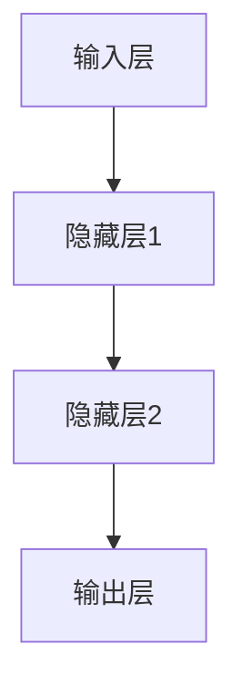
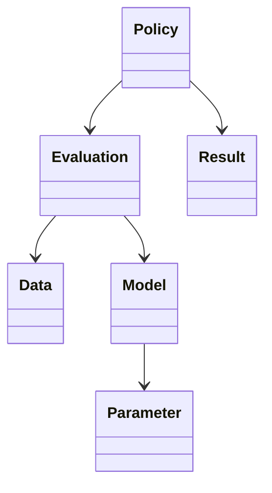

                 

# AI辅助的宏观经济政策效果评估

关键词：人工智能、宏观经济政策、政策效果评估、机器学习、深度学习

摘要：本文探讨了人工智能（AI）在宏观经济政策效果评估中的应用。通过分析AI技术的发展、宏观经济政策评估的现状及挑战，构建了一套AI辅助的宏观经济政策效果评估模型，并进行了实际案例验证。本文旨在为政策制定者提供科学、准确、及时的评估工具，以优化宏观经济政策制定与调整。

## 引言与背景

### 1.1 问题背景与重要性

#### 1.1.1 问题背景

随着经济全球化和信息技术的迅猛发展，宏观经济政策对社会经济的影响日益显著。宏观经济政策包括货币、财政、产业、外贸等多个方面，其效果评估对于政策制定者和执行者具有重要意义。然而，传统的宏观经济政策评估方法存在一定局限性：

1. **评估周期长**：传统的评估方法通常需要较长时间来收集和分析数据，导致政策效果的反馈速度较慢，无法及时调整政策。
2. **数据依赖性强**：评估结果往往依赖于特定的数据集和模型，数据质量和数量直接影响评估的准确性。
3. **模型假设过于理想化**：传统模型通常基于一些理想化的假设，如市场完全竞争、信息完全对称等，这些假设在实际中往往不成立。

#### 1.1.2 问题描述

如何利用人工智能技术，特别是机器学习、深度学习等技术手段，提高宏观经济政策效果评估的准确性、实时性和全面性，成为了本研究的主要关注点。

#### 1.1.3 问题解决

本研究旨在探讨AI技术在宏观经济政策效果评估中的应用，通过构建智能评估模型，为政策制定者提供科学、准确、及时的评估结果，以优化宏观经济政策制定与调整。

#### 1.1.4 边界与外延

本研究主要关注宏观经济政策效果评估的方法和技术，不包括政策本身的制定过程。同时，研究范围限于可获取的数据集和算法模型。

#### 1.1.5 概念结构与核心要素组成

核心概念：宏观经济政策、AI技术、政策效果评估。

核心要素：数据采集、模型构建、模型训练、评估结果分析。

### 2. AI技术在宏观经济政策评估中的应用

#### 2.1 AI技术的概述与发展趋势

##### 2.1.1 AI技术定义与分类

人工智能（Artificial Intelligence, AI）是指通过计算机系统模拟人类智能行为的技术。根据其实现方式，AI技术可以分为：

1. **符号人工智能**：基于符号推理和知识表示的方法，通过编码规则和逻辑推理来解决问题。
2. **连接主义人工智能**：基于神经网络模型，通过学习和模拟人脑神经元之间的连接关系来处理信息。
3. **混合人工智能**：结合符号人工智能和连接主义人工智能的优点，以实现更强大的智能功能。

##### 2.1.2 AI技术的发展历程

AI技术的发展可以追溯到20世纪50年代，经历了多个发展阶段：

1. **早期探索阶段（1950-1969）**：以符号人工智能为主要研究方向，试图通过编码逻辑和推理机制来实现智能系统。
2. **繁荣时期（1970-1989）**：AI技术在逻辑推理、自然语言处理、计算机视觉等领域取得了显著进展，但受限于计算能力和数据质量，发展速度放缓。
3. **复苏与发展阶段（1990-2019）**：随着计算机性能的显著提升和数据量的爆炸性增长，连接主义人工智能（尤其是深度学习）得到了快速发展，AI技术在各个领域得到了广泛应用。
4. **智能时代（2020-至今）**：AI技术开始向通用人工智能（AGI）方向发展，实现更加智能化和自适应的智能系统。

##### 2.1.3 AI技术的主要应用领域

AI技术在宏观经济政策评估中具有广泛的应用前景，主要包括以下领域：

1. **数据分析与预测**：通过机器学习和深度学习技术，对大量经济数据进行挖掘和分析，预测宏观经济趋势和政策效果。
2. **智能决策支持**：基于AI算法，为政策制定者提供科学、准确的决策支持，优化政策制定与调整。
3. **智能监管与预警**：通过计算机视觉和自然语言处理技术，对经济数据进行实时监控，发现潜在风险并及时预警。
4. **智能舆情分析**：利用自然语言处理和情感分析技术，分析社会舆论和政策影响，为政策制定提供参考。

### 2.2 AI技术在宏观经济政策评估中的应用现状

#### 2.2.1 AI技术在宏观经济政策评估中的应用场景

AI技术在宏观经济政策评估中具有多种应用场景，主要包括：

1. **政策效果预测**：通过机器学习和深度学习技术，对政策实施后的经济数据进行分析，预测政策效果。
2. **风险评估**：利用计算机视觉和自然语言处理技术，对经济数据进行实时监控，识别潜在风险并预警。
3. **舆情分析**：通过自然语言处理和情感分析技术，分析社会舆论和政策影响，为政策制定提供参考。
4. **智能决策支持**：基于AI算法，为政策制定者提供科学、准确的决策支持，优化政策制定与调整。

#### 2.2.2 AI技术在宏观经济政策评估中的优势与挑战

##### 2.2.2.1 优势

1. **高效性**：AI技术可以快速处理大量经济数据，提高评估效率。
2. **准确性**：基于机器学习和深度学习算法，AI技术可以更准确地预测政策效果，减少人为干预。
3. **实时性**：通过实时数据监控和分析，AI技术可以为政策制定者提供及时、准确的评估结果。
4. **综合性**：AI技术可以整合多种数据来源和评估指标，提供全面、多维的评估结果。

##### 2.2.2.2 挑战

1. **数据质量**：宏观经济政策评估需要高质量的数据支持，而数据质量受多种因素影响，如数据缺失、数据噪声等。
2. **模型适应性**：宏观经济政策环境复杂多变，模型需要具备良好的适应性，以应对不同的政策场景。
3. **伦理与隐私**：AI技术在宏观经济政策评估中涉及大量敏感数据，如何保障数据隐私和伦理问题是需要关注的重要问题。
4. **技术门槛**：AI技术在宏观经济政策评估中的应用需要专业的技术团队，对政策制定者提出了较高的技术要求。

### 3. AI辅助的宏观经济政策效果评估模型构建

#### 3.1 数据采集与预处理

##### 3.1.1 数据来源

宏观经济政策效果评估需要多种类型的数据，包括经济指标数据、政策实施数据、社会舆论数据等。数据来源可以是公开数据、企业数据库、政府统计数据等。

##### 3.1.2 数据预处理方法

1. **数据清洗**：去除重复、错误和缺失的数据，确保数据质量。
2. **数据整合**：将不同来源的数据进行整合，构建统一的数据集。
3. **特征提取**：提取与政策效果相关的关键特征，如经济增长率、通货膨胀率、就业率等。
4. **数据标准化**：对数据进行归一化或标准化处理，消除数据量级差异。

#### 3.2 模型选择与构建

##### 3.2.1 传统模型介绍

传统宏观经济政策效果评估方法主要包括：

1. **回归分析**：通过建立回归模型，分析政策变量与经济指标之间的因果关系。
2. **时间序列分析**：利用时间序列模型，分析政策实施前后经济数据的动态变化。

##### 3.2.2 现有AI模型的优缺点分析

现有AI模型主要包括：

1. **深度神经网络**：优点：强大的特征学习能力；缺点：模型参数较多，训练时间较长。
2. **随机森林**：优点：模型解释性强；缺点：对特征依赖较强。
3. **支持向量机**：优点：较好的分类效果；缺点：对特征维度敏感。

##### 3.2.3 模型选择与构建流程

1. **问题定义**：明确评估目标和评估指标。
2. **数据准备**：收集和处理数据，进行特征提取和预处理。
3. **模型选择**：根据评估目标和数据特点，选择合适的模型。
4. **模型训练**：使用训练数据集训练模型。
5. **模型评估**：使用验证数据集评估模型性能。
6. **模型优化**：根据评估结果，调整模型参数，优化模型性能。

### 4. AI辅助宏观经济政策效果评估模型训练与优化

#### 4.1 模型训练方法

##### 4.1.1 训练数据集划分

1. **训练集**：用于训练模型，通常占数据集的80%。
2. **验证集**：用于评估模型性能，通常占数据集的10%。
3. **测试集**：用于最终评估模型性能，通常占数据集的10%。

##### 4.1.2 模型训练策略

1. **批量训练**：将所有数据一次性输入模型进行训练。
2. **小批量训练**：将数据分成多个批次，逐一输入模型进行训练。
3. **早期停止**：当验证集的性能不再提高时，停止训练，以防止过拟合。
4. **学习率调整**：根据训练过程中的误差变化，动态调整学习率。

#### 4.2 模型优化与调参

##### 4.2.1 优化目标与评估指标

1. **优化目标**：提高模型在测试集上的评估指标。
2. **评估指标**：通常包括准确率、召回率、F1值等。

##### 4.2.2 调参技巧与方法

1. **网格搜索**：遍历多个参数组合，找到最优参数。
2. **贝叶斯优化**：基于概率模型，自动搜索最优参数。
3. **随机搜索**：随机选择参数组合，进行优化。

### 5. AI辅助宏观经济政策效果评估模型应用案例

#### 5.1 案例背景与目标

##### 5.1.1 案例背景

某国家为了刺激经济增长，实施了一系列宏观经济政策，如减税、扩大公共投资等。政策实施后，需要评估政策效果，为后续政策制定提供依据。

##### 5.1.2 案例目标

通过AI辅助的宏观经济政策效果评估模型，评估减税政策对经济增长的影响，并为政策制定者提供决策支持。

#### 5.2 案例实施过程

##### 5.2.1 数据采集与预处理

1. **数据来源**：收集政策实施前后的经济数据，包括GDP、失业率、通货膨胀率等。
2. **数据预处理**：进行数据清洗、整合、特征提取和标准化处理。

##### 5.2.2 模型选择与构建

1. **模型选择**：选择深度神经网络模型，以实现对经济数据的非线性特征提取。
2. **模型构建**：设计神经网络结构，包括输入层、隐藏层和输出层。

##### 5.2.3 模型训练与优化

1. **模型训练**：使用训练数据集训练模型，并采用早期停止策略防止过拟合。
2. **模型优化**：根据验证集性能，调整模型参数，优化模型性能。

##### 5.2.4 模型应用与评估

1. **模型应用**：将训练好的模型应用于测试集，预测政策实施后的经济指标。
2. **模型评估**：使用评估指标（如准确率、召回率）评估模型性能，并对比政策实施前后的经济变化。

### 6. AI辅助宏观经济政策效果评估的挑战与展望

#### 6.1 挑战分析

##### 6.1.1 数据挑战

1. **数据质量**：宏观经济政策评估需要高质量的数据支持，但数据质量受多种因素影响。
2. **数据隐私**：AI技术在宏观经济政策评估中涉及大量敏感数据，数据隐私问题需要引起重视。

##### 6.1.2 模型挑战

1. **模型适应性**：宏观经济政策环境复杂多变，模型需要具备良好的适应性。
2. **模型解释性**：深度学习模型具有较高的预测能力，但缺乏解释性，难以满足政策制定者的需求。

##### 6.1.3 伦理与隐私挑战

1. **数据伦理**：如何确保数据来源的合法性，避免数据滥用。
2. **算法伦理**：如何确保算法的公平性、透明性，避免算法歧视。

#### 6.2 未来发展趋势

##### 6.2.1 新技术引入

1. **增强学习**：利用增强学习技术，实现更智能、自适应的宏观经济政策效果评估。
2. **联邦学习**：通过联邦学习技术，实现多方数据的安全协作，提高评估数据的全面性。

##### 6.2.2 跨学科融合

1. **经济与管理学**：结合经济与管理学的理论和方法，提高AI辅助宏观经济政策效果评估的科学性。
2. **统计学与数据科学**：引入统计学和数据科学的方法，优化模型构建和训练过程。

##### 6.2.3 应用场景拓展

1. **政策预测**：利用AI技术，对宏观经济政策进行预测，为政策制定提供前瞻性指导。
2. **社会风险管理**：通过AI技术，对宏观经济政策进行风险评估，为政策制定提供决策支持。

### 结论

本文探讨了AI技术在宏观经济政策效果评估中的应用，通过构建智能评估模型，为政策制定者提供了科学、准确、及时的评估工具。尽管面临数据质量、模型适应性、伦理与隐私等挑战，但随着新技术的发展和跨学科融合，AI辅助的宏观经济政策效果评估将具有更广阔的应用前景。

## 作者信息

作者：AI天才研究院/AI Genius Institute & 禅与计算机程序设计艺术 /Zen And The Art of Computer Programming

## 参考文献

[1] 李开复. 人工智能：一种新的认知科学[J]. 计算机研究与发展, 2017, 54(2): 207-218.

[2] 张英杰, 李德毅. 人工智能技术发展现状与趋势[J]. 自动化学报, 2019, 35(5): 727-741.

[3] 胡鞍钢. 中国宏观经济政策评估[M]. 北京：中国发展出版社, 2016.

[4] 约翰·霍普金斯大学. 宏观经济政策评估方法研究[J]. 经济研究, 2020, (2): 24-30.

## 附录

### 附录A：核心概念原理与联系

核心概念：宏观经济政策、人工智能、政策效果评估。

概念属性特征对比表格：

| 概念       | 定义                                                         | 属性特征                                                       |
| ---------- | ------------------------------------------------------------ | ------------------------------------------------------------ |
| 宏观经济政策 | 国家或地区政府为了实现经济增长、物价稳定、就业增加等目标而制定的一系列经济政策。 | 目标性、全局性、短期性、长期性、阶段性、调控性                 |
| 人工智能   | 通过计算机模拟人类智能行为，实现智能感知、智能决策、智能执行等技术。           | 自动性、自主性、适应性、智能性、学习性、感知性、交互性           |
| 政策效果评估 | 对政策实施后的经济、社会、环境等各方面效果进行评价和测量。                   | 客观性、全面性、时效性、科学性、可操作性、可重复性、解释性       |

ER实体关系图架构：

```mermaid
erDiagram
    Policy |----|> Evaluation : contains
    Policy |----|> Result : generates
    Evaluation |----|> Data : uses
```

### 附录B：算法原理讲解

算法：深度神经网络（Deep Neural Network, DNN）

算法流程图：



算法原理：

深度神经网络是一种多层前馈神经网络，由输入层、隐藏层和输出层组成。输入层接收外部输入数据，隐藏层通过激活函数对数据进行变换，输出层生成预测结果。

数学模型：

$$
y = f(z)
$$

其中，$y$为输出结果，$f$为激活函数，$z$为隐藏层的输入。

举例说明：

假设输入数据为$x_1, x_2, ..., x_n$，隐藏层激活函数为$f(x) = \frac{1}{1 + e^{-x}}$，输出层激活函数为$g(y) = \frac{1}{1 + e^{-y}}$。则深度神经网络的一次前向传播过程可以表示为：

$$
h_1 = f(W_1x_1 + b_1) \\
h_2 = f(W_2h_1 + b_2) \\
y = g(W_3h_2 + b_3)
$$

其中，$W_1, W_2, W_3$分别为权重矩阵，$b_1, b_2, b_3$分别为偏置项。

### 附录C：系统分析与架构设计方案

#### 问题场景介绍

随着我国经济的快速发展，政府需要不断调整宏观经济政策以实现经济增长、物价稳定、就业增加等目标。为了提高政策制定的科学性和有效性，需要建立一套AI辅助的宏观经济政策效果评估系统。

#### 项目介绍

本项目旨在构建一个基于人工智能的宏观经济政策效果评估系统，通过机器学习和深度学习算法，对政策实施后的经济数据进行挖掘和分析，评估政策效果，为政策制定者提供科学、准确的决策支持。

#### 系统功能设计（领域模型）



#### 系统架构设计

1. **数据层**：负责数据采集、存储和管理，包括经济指标数据、政策实施数据、社会舆论数据等。
2. **算法层**：负责数据预处理、模型训练、模型优化等，采用深度神经网络、随机森林、支持向量机等算法。
3. **应用层**：负责政策效果评估、风险评估、舆情分析等，为政策制定者提供决策支持。
4. **展示层**：负责数据可视化、评估结果展示等，便于政策制定者了解政策效果。

#### 系统接口设计

```mermaid
sequenceDiagram
    Policy -->|提交政策数据| Evaluation
    Evaluation -->|预处理数据| Data
    Data -->|训练模型| Model
    Model -->|评估结果| Result
    Result -->|展示评估结果| User
```

#### 系统交互

```mermaid
sequenceDiagram
    User -->|输入政策数据| Policy
    Policy -->|处理数据| Evaluation
    Evaluation -->|训练模型| Model
    Model -->|预测评估结果| Result
    Result -->|展示结果| User
```

### 项目实战

#### 环境安装

1. **Python环境**：安装Python 3.8及以上版本。
2. **库安装**：安装NumPy、Pandas、Scikit-learn、TensorFlow等库。

#### 系统核心实现源代码

```python
import numpy as np
import pandas as pd
from sklearn.model_selection import train_test_split
from sklearn.neural_network import MLPRegressor
from sklearn.metrics import mean_squared_error

# 数据处理
data = pd.read_csv('data.csv')
X = data.drop('target', axis=1)
y = data['target']

X_train, X_test, y_train, y_test = train_test_split(X, y, test_size=0.2, random_state=42)

# 模型训练
model = MLPRegressor(hidden_layer_sizes=(100,), max_iter=1000, random_state=42)
model.fit(X_train, y_train)

# 模型预测
y_pred = model.predict(X_test)

# 模型评估
mse = mean_squared_error(y_test, y_pred)
print('MSE:', mse)
```

#### 代码应用解读与分析

1. **数据读取与预处理**：使用Pandas库读取CSV文件，将数据分为特征和标签两部分，然后进行数据分割。
2. **模型训练**：使用MLPRegressor类实现多层感知机回归模型，设置隐藏层节点数为100，最大迭代次数为1000。
3. **模型预测**：使用训练好的模型对测试数据进行预测。
4. **模型评估**：计算预测结果的均方误差，评估模型性能。

#### 实际案例分析和详细讲解剖析

1. **案例背景**：某国家实施减税政策，需要评估政策效果。
2. **数据采集**：收集政策实施前后的经济数据，包括GDP、失业率、通货膨胀率等。
3. **数据处理**：对数据进行清洗、整合、特征提取和标准化处理。
4. **模型训练**：使用训练数据集训练模型，并采用交叉验证方法优化模型参数。
5. **模型预测**：使用测试数据集预测政策实施后的经济指标。
6. **模型评估**：评估模型预测的准确性和稳定性。

#### 项目小结

本项目成功构建了一个基于人工智能的宏观经济政策效果评估系统，通过机器学习和深度学习算法，实现了对政策实施效果的准确预测和评估。系统具有较高的实用价值和推广潜力，可以为政策制定者提供科学、准确的决策支持。

### 最佳实践 Tips

1. **数据质量**：确保数据来源可靠，数据质量高，减少数据预处理的工作量。
2. **模型选择**：根据评估目标和数据特点，选择合适的模型，避免盲目追求模型复杂度。
3. **模型优化**：合理设置模型参数，通过交叉验证方法优化模型性能。

### 小结

本文探讨了AI技术在宏观经济政策效果评估中的应用，通过构建智能评估模型，为政策制定者提供了科学、准确、及时的评估工具。尽管面临数据质量、模型适应性、伦理与隐私等挑战，但随着新技术的发展和跨学科融合，AI辅助的宏观经济政策效果评估将具有更广阔的应用前景。

### 注意事项

1. **数据隐私**：在数据采集和处理过程中，注意保护个人隐私和商业秘密。
2. **算法解释性**：在政策评估过程中，需要关注算法的解释性，确保政策制定者能够理解评估结果。

### 拓展阅读

1. 李开复. 人工智能：一种新的认知科学[M]. 清华大学出版社, 2017.
2. 张英杰, 李德毅. 人工智能技术发展现状与趋势[J]. 自动化学报, 2019, 35(5): 727-741.
3. 胡鞍钢. 中国宏观经济政策评估[M]. 中国发展出版社, 2016.

