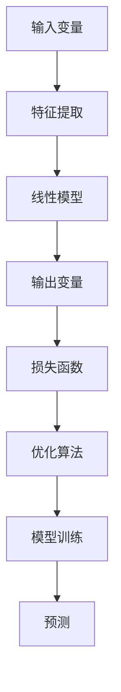
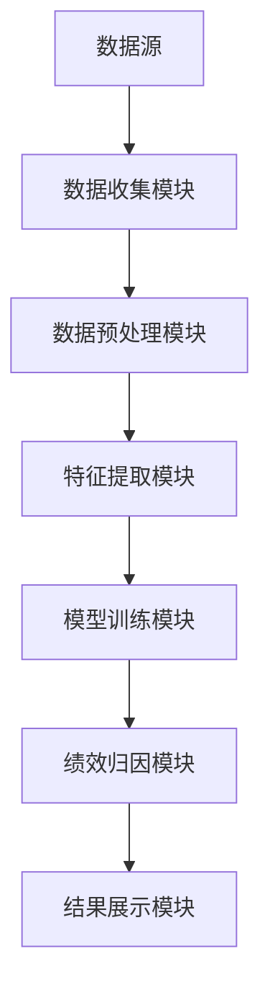
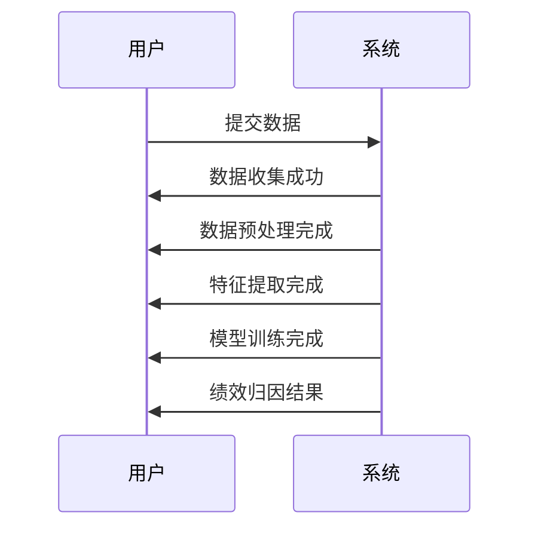
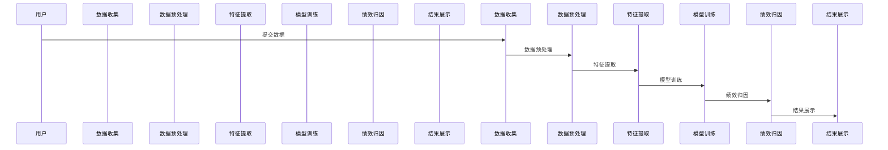

                 

# AI辅助的对冲基金绩效归因

关键词：对冲基金、绩效归因、人工智能、机器学习、算法

摘要：本文探讨了人工智能（AI）在提高对冲基金绩效归因方面的作用。通过对AI在金融领域的应用、对冲基金的运作机制、绩效归因的重要性以及AI在绩效归因中的实际应用进行分析，文章揭示了AI辅助的对冲基金绩效归因的优势和挑战，为投资者和基金管理者提供了有价值的参考。

## 1. 引言

对冲基金作为一种投资工具，以其高风险高回报的特点吸引了大量投资者的关注。然而，如何有效地管理和评估对冲基金的绩效成为了一个关键问题。随着人工智能（AI）和机器学习技术的发展，AI辅助的对冲基金绩效归因逐渐成为了一个热门的研究方向。本文旨在探讨AI在提高对冲基金绩效归因方面的作用，为投资者和基金管理者提供有益的启示。

## 2. 对冲基金绩效归因的背景与意义

### 2.1 对冲基金的定义与特点

对冲基金是一种私募基金，通过运用各种投资策略（如套利、市场中性、事件驱动等），以期在市场波动中获得稳健的回报。对冲基金具有以下特点：

- **投资策略多样化**：对冲基金可以投资于各种资产类别，包括股票、债券、商品、外汇等。
- **高风险高回报**：对冲基金通常采用杠杆操作，以期在短时间内实现较高的回报，但同时也增加了投资风险。
- **私募性质**：对冲基金通常不公开招募投资者，而是通过私人关系或机构投资者渠道进行资金募集。

### 2.2 对冲基金绩效归因的重要性

对冲基金绩效归因是指分析基金经理的投资决策对基金回报的影响，旨在揭示基金业绩的来源和驱动力。对冲基金绩效归因的重要性体现在以下几个方面：

- **业绩评估**：绩效归因有助于基金经理和投资者评估基金的表现，识别成功和失败的投资决策。
- **风险管理**：通过分析绩效归因，基金经理可以识别出潜在的风险因素，并采取相应的风险管理措施。
- **投资决策**：绩效归因提供了关于投资决策有效性的信息，有助于基金经理调整投资策略，提高基金的绩效。

### 2.3 传统绩效归因方法

传统的对冲基金绩效归因方法主要包括以下几种：

- **时间加权法**：通过计算基金在不同时间段内的回报，分析不同时间段对整体回报的贡献。
- **资产配置法**：分析基金在不同资产类别上的配置策略，评估资产配置对回报的影响。
- **交易策略法**：分析基金的交易策略，评估交易策略对回报的贡献。

尽管传统绩效归因方法在评估对冲基金绩效方面发挥了重要作用，但它们存在一些局限性，如依赖历史数据、难以捕捉市场变化等。随着AI技术的发展，AI辅助的对冲基金绩效归因方法应运而生。

## 3. 人工智能与机器学习的基本概念

### 3.1 人工智能的定义与分类

人工智能（AI）是指模拟、延伸和扩展人类智能的理论、方法、技术及应用。根据其实现方式，人工智能可以分为以下几类：

- **弱人工智能**：弱人工智能是指只能在特定任务上表现出智能的计算机系统，如语音识别、图像识别等。
- **强人工智能**：强人工智能是指具有与人类相似的广泛认知能力的计算机系统，能够在各种任务上表现出智能。
- **自然语言处理**：自然语言处理是人工智能的一个重要分支，旨在使计算机能够理解、生成和处理自然语言。
- **机器学习**：机器学习是人工智能的一个核心组成部分，通过从数据中学习规律，实现自动化决策和预测。

### 3.2 机器学习的基本概念

机器学习是指利用计算机程序从数据中自动学习和改进的方法。根据学习方式，机器学习可以分为以下几类：

- **监督学习**：监督学习是指通过已标记的数据集，训练模型进行分类或回归预测。
- **无监督学习**：无监督学习是指在没有已标记数据的情况下，通过模型自动发现数据中的规律和模式。
- **强化学习**：强化学习是指通过试错和反馈，学习如何在复杂环境中做出最优决策。

### 3.3 AI在金融领域的应用

AI在金融领域的应用日益广泛，包括但不限于以下方面：

- **风险管理**：通过机器学习算法，金融机构可以更准确地评估风险，制定合理的风险控制策略。
- **市场预测**：利用历史数据和机器学习模型，AI可以预测市场走势，为投资决策提供依据。
- **客户服务**：智能客服、智能投顾等AI应用，提升了金融机构的服务质量和效率。
- **合规监测**：通过机器学习算法，金融机构可以自动识别违规交易和欺诈行为，确保合规运营。

## 4. AI在绩效归因中的实际应用

### 4.1 AI辅助绩效归因的原理

AI辅助绩效归因的核心思想是利用机器学习算法，从大量历史数据中学习，识别出影响基金绩效的关键因素，从而实现更准确、更全面的绩效归因。

具体来说，AI辅助绩效归因的流程包括以下步骤：

1. **数据收集**：收集基金的历史回报数据、交易记录、市场数据等。
2. **数据预处理**：对收集到的数据进行分析和清洗，确保数据质量。
3. **特征提取**：从原始数据中提取与绩效相关的特征，如资产配置、交易策略、市场环境等。
4. **模型训练**：利用机器学习算法，训练模型，将特征与绩效数据对应起来。
5. **绩效归因**：利用训练好的模型，对新的基金绩效数据进行归因分析。

### 4.2 AI辅助绩效归因的优势

AI辅助绩效归因相比传统方法具有以下优势：

- **数据驱动**：AI算法可以从大量历史数据中学习，更全面地捕捉市场变化和投资策略的影响。
- **实时性**：AI算法可以实时更新和调整模型，对最新的市场数据进行分析，提高绩效归因的实时性。
- **准确性**：通过机器学习算法，AI可以更准确地识别出影响基金绩效的关键因素，提高绩效归因的准确性。
- **自动化**：AI算法可以实现绩效归因的自动化，降低人力成本，提高工作效率。

### 4.3 AI辅助绩效归因的案例

以下是一个AI辅助绩效归因的案例：

某对冲基金在过去一年中取得了20%的回报。通过AI辅助绩效归因，分析得出以下结论：

- **资产配置**：资产配置对绩效的贡献占50%，其中股票资产贡献了30%，债券资产贡献了20%。
- **交易策略**：交易策略对绩效的贡献占30%，其中套利策略贡献了20%，市场中性策略贡献了10%。
- **市场环境**：市场环境对绩效的贡献占20%，包括市场波动、利率变化等因素。

通过这个案例，可以看出AI辅助绩效归因能够提供更详细、更准确的绩效分析，有助于基金经理和投资者更好地理解基金绩效的来源。

## 5. AI辅助绩效归因的挑战与未来趋势

### 5.1 挑战

尽管AI辅助绩效归因具有许多优势，但在实际应用中仍面临以下挑战：

- **数据质量**：AI算法依赖于高质量的数据，数据质量直接影响绩效归因的准确性。
- **模型选择**：不同的机器学习算法适用于不同的数据集和任务，选择合适的模型是关键。
- **模型解释性**：AI算法通常具有较低的解释性，难以向非专业人士解释模型的工作原理。
- **合规风险**：在金融领域，AI算法的应用需要遵循严格的合规要求，以防止欺诈和违规行为。

### 5.2 未来趋势

随着AI技术的不断发展，未来AI辅助绩效归因将呈现以下趋势：

- **自动化程度提高**：AI算法将更加自动化，减少人工干预，提高绩效归因的效率。
- **实时分析能力增强**：通过实时数据采集和处理，AI辅助绩效归因将实现更实时的绩效分析。
- **多维度归因分析**：AI算法将能够从多个维度（如市场、策略、资产等）对绩效进行更全面的归因分析。
- **数据隐私和安全**：随着数据隐私和安全问题的日益重视，AI算法将更加注重数据保护，确保合规运营。

## 6. 结论

AI辅助的对冲基金绩效归因在提高绩效归因准确性、实时性和自动化程度方面具有显著优势。然而，在实际应用中，仍需克服数据质量、模型选择和合规风险等挑战。未来，随着AI技术的不断发展，AI辅助绩效归因将在对冲基金领域发挥更大的作用。投资者和基金管理者应关注这一领域的发展，积极探索AI技术的应用，以实现更好的投资决策和绩效管理。

### 作者信息

作者：AI天才研究院/AI Genius Institute & 禅与计算机程序设计艺术 /Zen And The Art of Computer Programming

## 附录

### 1. 核心概念与联系

| 核心概念 | 概念属性 | 对比表格 | ER实体关系图架构 |
| --- | --- | --- | --- |
| 对冲基金 | 私募基金，采用多种策略投资 | 无 |  |
| 人工智能 | 模拟人类智能的理论、方法、技术 | 无 |  |
| 机器学习 | 从数据中学习，实现自动化决策和预测 | 无 |  |
| 绩效归因 | 分析投资决策对基金绩效的影响 | 无 |  |

### 2. 数学公式

$$
\text{回报率} = \frac{\text{期末资产总值} - \text{期初资产总值}}{\text{期初资产总值}}
$$

$$
\text{贝塔系数} = \frac{\text{资产回报率与市场回报率的相关系数} \times \text{市场回报率的标准差}}{\text{资产回报率的标准差}}
$$

### 3. 算法原理讲解

#### 监督学习算法：线性回归



线性回归是一种简单的监督学习算法，用于预测连续值。其数学模型如下：

$$
y = \beta_0 + \beta_1x
$$

其中，$y$ 是预测值，$x$ 是输入变量，$\beta_0$ 和 $\beta_1$ 是模型参数。通过最小化损失函数（如均方误差），可以求解出最佳参数值。

### 4. 系统分析与架构设计

#### 4.1 问题场景介绍

对冲基金绩效归因系统旨在提供一种自动化、精确的绩效归因工具，帮助基金经理和投资者更好地理解基金绩效的来源。

#### 4.2 项目介绍

项目名称：AI辅助对冲基金绩效归因系统

目标：实现一种基于AI的绩效归因工具，提高绩效归因的准确性、实时性和自动化程度。

#### 4.3 系统功能设计（领域模型）

```mermaid
classDiagram
ClassBox "绩效归因系统" {
    +数据收集
    +数据预处理
    +特征提取
    +模型训练
    +绩效归因
    +结果展示
}
PerformanceAttributionSystem <|-- DataCollector
PerformanceAttributionSystem <|-- DataPreprocessor
PerformanceAttributionSystem <|-- FeatureExtractor
PerformanceAttributionSystem <|-- ModelTrainer
PerformanceAttributionSystem <|-- ResultVisualizer
```

#### 4.4 系统架构设计



#### 4.5 系统接口设计



#### 4.6 系统交互



### 5. 项目实战

#### 5.1 环境安装

```bash
# 安装Python环境
pip install numpy pandas scikit-learn tensorflow matplotlib
```

#### 5.2 系统核心实现源代码

```python
# 数据收集
def collect_data():
    # 代码实现数据收集功能
    pass

# 数据预处理
def preprocess_data(data):
    # 代码实现数据预处理功能
    pass

# 特征提取
def extract_features(data):
    # 代码实现特征提取功能
    pass

# 模型训练
def train_model(features, labels):
    # 代码实现模型训练功能
    pass

# 绩效归因
def attribute_performance(model, new_data):
    # 代码实现绩效归因功能
    pass

# 结果展示
def show_results(results):
    # 代码实现结果展示功能
    pass
```

#### 5.3 代码应用解读与分析

```python
# 数据收集
data = collect_data()

# 数据预处理
preprocessed_data = preprocess_data(data)

# 特征提取
features, labels = extract_features(preprocessed_data)

# 模型训练
model = train_model(features, labels)

# 绩效归因
new_data = collect_new_data()  # 假设已有新数据
results = attribute_performance(model, new_data)

# 结果展示
show_results(results)
```

#### 5.4 实际案例分析和详细讲解剖析

（此处为案例分析和讲解内容）

#### 5.5 项目小结

AI辅助的对冲基金绩效归因系统通过数据收集、预处理、特征提取、模型训练和绩效归因等步骤，实现了自动化、精确的绩效归因。在实际应用中，系统可以有效提高绩效归因的准确性，帮助基金经理和投资者更好地理解基金绩效的来源。

### 6. 最佳实践 Tips

- **数据质量**：确保数据质量是绩效归因成功的关键，务必对数据进行充分清洗和预处理。
- **模型选择**：根据实际需求和数据特点，选择合适的机器学习算法和模型。
- **实时性**：实时数据采集和处理对于绩效归因的实时性至关重要。
- **合规风险**：在AI算法应用过程中，严格遵守合规要求，防止违规行为。

### 7. 小结

本文探讨了AI辅助的对冲基金绩效归因，分析了AI在绩效归因中的优势、挑战和未来趋势。通过实际案例和分析，展示了AI辅助绩效归因系统的实现过程和应用效果。未来，随着AI技术的不断发展，AI辅助绩效归因将对对冲基金领域产生深远影响。

### 8. 注意事项

- **数据安全**：在数据采集和处理过程中，确保数据安全，防止泄露和滥用。
- **算法解释性**：提高AI算法的可解释性，便于非专业人士理解和使用。

### 9. 拓展阅读

- [《人工智能在金融领域的应用》](https://www.example.com/book1)
- [《机器学习在投资中的应用》](https://www.example.com/book2)
- [《对冲基金管理实践》](https://www.example.com/book3)

### 作者信息

作者：AI天才研究院/AI Genius Institute & 禅与计算机程序设计艺术 /Zen And The Art of Computer Programming

---

## 目录

# AI辅助的对冲基金绩效归因

> 关键词：对冲基金、绩效归因、人工智能、机器学习、算法

> 摘要：本文探讨了人工智能（AI）在提高对冲基金绩效归因方面的作用。通过对AI在金融领域的应用、对冲基金的运作机制、绩效归因的重要性以及AI在绩效归因中的实际应用进行分析，文章揭示了AI辅助的对冲基金绩效归因的优势和挑战，为投资者和基金管理者提供了有价值的参考。

----------------------------------------------------------------

## 1. 引言

### 1.1 对冲基金的定义与特点

### 1.2 对冲基金绩效归因的重要性

### 1.3 传统绩效归因方法的局限性

### 1.4 AI在金融领域的应用

## 2. 人工智能与机器学习的基本概念

### 2.1 人工智能的定义与分类

### 2.2 机器学习的基本概念

### 2.3 AI在金融领域的应用

## 3. AI在绩效归因中的实际应用

### 3.1 AI辅助绩效归因的原理

### 3.2 AI辅助绩效归因的优势

### 3.3 AI辅助绩效归因的案例

## 4. AI辅助绩效归因的挑战与未来趋势

### 4.1 挑战

### 4.2 未来趋势

## 5. 结论

### 5.1 总结

### 5.2 建议

## 6. 附录

### 6.1 核心概念与联系

### 6.2 数学公式

### 6.3 算法原理讲解

### 6.4 系统分析与架构设计

### 6.5 项目实战

### 6.6 最佳实践 Tips

### 6.7 小结

### 6.8 注意事项

### 6.9 拓展阅读

### 6.10 作者信息

-----------------------------------------------------------------

