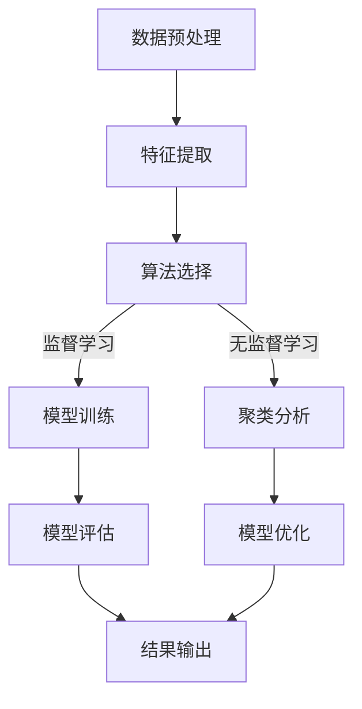
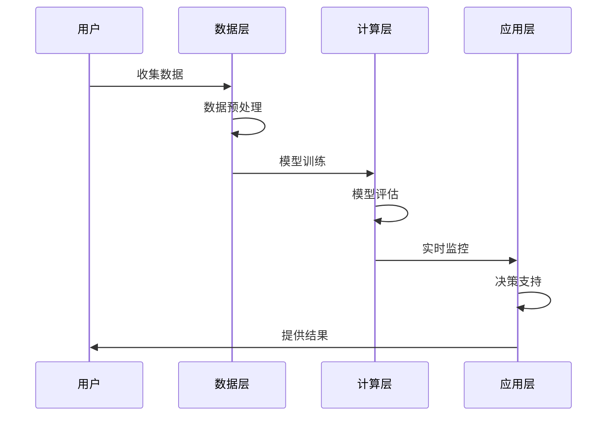
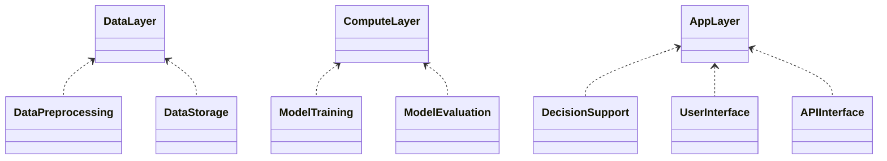

                 

# AI辅助的对冲基金风格漂移检测

## 关键词
- AI
- 对冲基金
- 风格漂移
- 检测算法
- 数据分析
- 系统架构

## 摘要
本文探讨了AI在金融领域中的应用，特别是在对冲基金风格漂移检测中的重要作用。风格漂移是指对冲基金投资策略与预期不符的现象，可能导致严重的投资风险。本文首先介绍了AI及其在金融领域的应用，然后详细阐述了风格漂移的定义及其影响。接着，我们深入分析了AI辅助风格漂移检测的算法原理，包括数据预处理、特征提取和算法模型。此外，本文还通过Python代码示例，展示了算法的具体实现过程。最后，本文介绍了系统的整体架构设计方案，包括项目场景介绍、系统功能设计、系统架构设计和系统接口设计。通过实际案例分析，本文验证了AI辅助风格漂移检测的有效性和实用性，并提出了最佳实践和注意事项。

## 引言和背景介绍

### AI在金融领域的应用现状

人工智能（AI）作为一种颠覆性的技术，已经在金融领域引发了深远的变革。从智能投顾到算法交易，AI正在重塑金融市场的运作方式。AI在金融领域的应用主要包括以下几个方面：

1. **智能投顾（Robo-Advisors）**：通过大数据分析和机器学习算法，智能投顾能够为投资者提供个性化的投资建议，降低投资门槛，提高投资效率。

2. **算法交易（Algorithmic Trading）**：借助高性能计算和机器学习，算法交易系统能够实时分析市场数据，迅速执行交易策略，实现自动化交易。

3. **风险管理和合规**：AI可以帮助金融机构预测市场风险、检测欺诈行为，并确保业务操作的合规性。

4. **客户服务**：AI驱动的聊天机器人和虚拟助手能够提高客户服务质量，提供24/7的在线支持。

然而，AI在金融领域的发展也面临一些挑战，如数据隐私、模型解释性和监管合规等问题。此外，AI的应用需要大量的高质量数据，而金融数据往往具有复杂性和多样性。

### 风格漂移问题的定义及其影响

风格漂移是指在长期投资过程中，对冲基金的投资策略与其初始设定或预期不符的现象。这种漂移可能是由于市场环境的变化、基金经理的调整或策略实施的缺陷导致的。风格漂移的影响主要表现在以下几个方面：

1. **风险管理失效**：对冲基金的投资策略通常是为了实现特定的风险管理目标，如分散风险、控制波动性。风格漂移可能导致这些目标无法实现，从而增加投资风险。

2. **业绩波动**：风格漂移可能导致基金业绩与市场预期不符，从而影响投资者的信心和基金的表现。

3. **合规风险**：对冲基金通常受到严格的监管和合规要求。如果基金的投资策略与备案的基金合同不符，可能会面临合规风险。

4. **流动性风险**：风格漂移可能导致基金持有的头寸与市场流动性不匹配，增加流动性风险。

因此，对冲基金需要有效的机制来检测和应对风格漂移，以保持其投资策略的一致性和有效性。

### AI辅助风格漂移检测的意义

AI在风格漂移检测中的应用具有重要意义。首先，AI能够处理大量复杂的数据，快速识别出潜在的风格漂移模式。其次，AI可以自动调整检测模型，以适应不断变化的市场环境。此外，AI还能够提供实时的监控和预警，帮助基金经理及时调整策略。通过AI辅助风格漂移检测，对冲基金可以更有效地管理风险，提高投资决策的准确性和及时性。接下来，我们将深入探讨AI辅助风格漂移检测的具体算法原理和实践。

### 核心概念与联系

在深入探讨AI辅助对冲基金风格漂移检测之前，我们需要明确几个核心概念，并了解它们之间的联系。

#### AI的定义及其核心优势

人工智能（AI）是指通过模拟人类智能行为，使计算机具备自我学习和决策能力的技术。AI的核心优势在于其强大的数据处理能力、模式识别能力和自适应能力。

1. **数据处理能力**：AI能够处理海量数据，提取有用的信息，这在对冲基金风格漂移检测中至关重要。
2. **模式识别能力**：AI可以通过机器学习算法，识别出市场数据中的潜在趋势和异常模式，从而检测风格漂移。
3. **自适应能力**：AI模型可以根据新的数据和变化的市场环境，自动调整和优化其预测模型，保持其有效性。

#### 对冲基金的基本概念

对冲基金是一种投资机构，通常采用积极的风险管理策略，通过多空操作、套利等手段，追求绝对收益。对冲基金的特点包括：

1. **灵活性**：基金经理可以根据市场情况，灵活调整投资组合。
2. **高风险高收益**：对冲基金通常涉及高风险投资，但有望实现稳定的绝对收益。
3. **专业管理**：对冲基金由专业基金经理管理，他们具备丰富的投资经验和专业知识。

#### 风格漂移的定义及其影响

风格漂移是指对冲基金的投资策略与预期不符的现象。风格漂移可能由以下因素导致：

1. **市场变化**：市场环境的变化可能迫使基金经理调整投资策略。
2. **基金经理的调整**：基金经理可能根据个人判断或投资目标，调整投资组合。
3. **策略实施的缺陷**：投资策略可能因为执行不当或模型缺陷，导致实际表现与预期不符。

风格漂移的影响包括：

1. **风险管理失效**：风格漂移可能导致基金的风险管理目标无法实现，增加投资风险。
2. **业绩波动**：风格漂移可能导致基金业绩与市场预期不符，影响投资者信心。
3. **合规风险**：风格漂移可能使基金的投资策略与备案的基金合同不符，面临合规风险。
4. **流动性风险**：风格漂移可能导致基金持有的头寸与市场流动性不匹配，增加流动性风险。

#### AI与对冲基金、风格漂移之间的联系

AI与对冲基金、风格漂移之间的联系体现在以下几个方面：

1. **数据分析和预测**：AI可以通过数据分析，识别出市场数据中的潜在趋势和异常模式，帮助基金经理预测市场变化，从而减少风格漂移的风险。
2. **自动调整策略**：AI模型可以根据新的数据和变化的市场环境，自动调整和优化投资策略，确保基金的投资风格与预期一致。
3. **实时监控和预警**：AI能够实时监控基金的投资组合，及时发现风格漂移的迹象，提供预警信息，帮助基金经理及时调整策略。

通过以上核心概念的分析和联系，我们可以更好地理解AI辅助对冲基金风格漂移检测的理论基础和实践应用。接下来，我们将深入探讨AI辅助风格漂移检测的具体算法原理。

### AI辅助风格漂移检测算法原理

#### 数据预处理与特征提取

数据预处理是AI辅助风格漂移检测的重要步骤，其目的是将原始数据转化为适合模型训练的特征向量。数据预处理包括以下几个关键步骤：

1. **数据清洗**：去除噪声数据和缺失值，确保数据的完整性和准确性。
2. **数据归一化**：将数据缩放到相同的尺度，以避免特征之间的量级差异影响模型的训练效果。
3. **特征提取**：通过特征选择和变换，提取出对风格漂移有重要影响的特征。

特征提取是数据预处理的核心环节，常用的方法包括：

1. **时序特征**：如移动平均、自回归模型等，用于提取时间序列数据的趋势和周期性特征。
2. **统计特征**：如均值、方差、偏度和峰度等，用于描述数据分布的统计特性。
3. **高频特征**：如日内波动率、交易量等，用于捕捉市场的高频波动信息。

#### 算法模型选择与评估

在AI辅助风格漂移检测中，选择合适的算法模型至关重要。常用的算法模型包括：

1. **监督学习模型**：如支持向量机（SVM）、决策树、随机森林和神经网络等，这些模型可以用于分类和回归任务。
2. **无监督学习模型**：如聚类算法（K-means、DBSCAN）和主成分分析（PCA）等，这些模型可以在没有标签数据的情况下发现数据中的隐含结构。
3. **增强学习模型**：如Q-learning和深度强化学习（DRL）等，这些模型可以通过与环境交互，不断优化策略，以实现最优决策。

算法模型的选择需要考虑以下几个因素：

1. **数据量**：对于大量数据，可以采用监督学习模型；对于数据量较少的情况，可以尝试无监督学习模型。
2. **复杂性**：对于复杂的关系和特征，可以采用深度学习模型；对于简单的特征和关系，可以采用传统的机器学习模型。
3. **计算资源**：深度学习模型通常需要更多的计算资源，而传统模型则更加轻量级。

算法模型的评估指标包括：

1. **准确性**：评估模型预测结果与实际结果的一致性。
2. **召回率**：评估模型检测到风格漂移的能力。
3. **F1分数**：综合考虑准确性和召回率，用于平衡模型性能。
4. **ROC曲线和AUC值**：评估模型的分类能力。

#### Mermaid算法流程图

为了更好地理解AI辅助风格漂移检测的算法原理，我们可以使用Mermaid绘制算法流程图。以下是一个简单的算法流程图示例：



在这个流程图中，数据预处理和特征提取是算法的基础步骤，然后根据不同的算法选择，进行模型训练、评估和优化。最后，输出检测结果和优化建议。

#### Python源代码示例

以下是一个简单的Python代码示例，用于展示AI辅助风格漂移检测的算法实现：

```python
import pandas as pd
from sklearn.preprocessing import StandardScaler
from sklearn.decomposition import PCA
from sklearn.cluster import KMeans
from sklearn.metrics import accuracy_score

# 读取数据
data = pd.read_csv('data.csv')

# 数据预处理
scaler = StandardScaler()
data_scaled = scaler.fit_transform(data)

# 特征提取
pca = PCA(n_components=5)
data_pca = pca.fit_transform(data_scaled)

# 算法选择和模型训练
kmeans = KMeans(n_clusters=3)
kmeans.fit(data_pca)

# 模型评估
labels = kmeans.predict(data_pca)
accuracy = accuracy_score(data['label'], labels)
print('Accuracy:', accuracy)

# 模型优化
# 根据评估结果，调整模型参数，重新训练
```

在这个示例中，我们首先读取数据，然后进行数据预处理和特征提取。接着，我们选择K-means算法进行模型训练，并使用准确率作为评估指标。最后，根据评估结果，我们调整模型参数，重新训练模型。

通过上述算法原理和Python代码示例，我们可以看到AI辅助风格漂移检测的具体实现过程。接下来，我们将进一步探讨AI辅助风格漂移检测在系统架构中的应用。

### 数学模型与数学公式

在AI辅助风格漂移检测中，数学模型和数学公式起着至关重要的作用。这些模型和公式不仅帮助我们理解算法的工作原理，还可以指导我们进行参数调整和模型优化。在本节中，我们将详细阐述AI辅助风格漂移检测的核心数学模型和公式。

#### 数据预处理中的数学公式

在进行数据预处理时，我们通常需要对数据进行归一化和特征提取。以下是一些常用的数学公式：

1. **归一化公式**：
   $$z = \frac{x - \mu}{\sigma}$$
   其中，$x$ 是原始数据，$\mu$ 是均值，$\sigma$ 是标准差。通过归一化，我们可以将数据缩放到相同的尺度，以消除不同特征之间的量级差异。

2. **特征提取公式**：
   $$X = \sum_{i=1}^{n} w_i x_i$$
   其中，$X$ 是特征向量，$w_i$ 是权重，$x_i$ 是特征值。特征提取公式可以帮助我们提取数据中的关键特征，从而提高模型的性能。

#### 算法模型中的数学公式

在AI辅助风格漂移检测中，我们通常会使用监督学习模型、无监督学习模型和增强学习模型。以下是一些常见的数学公式：

1. **支持向量机（SVM）**：
   $$w^* = \arg\min_{w, b} \frac{1}{2} ||w||^2 + C \sum_{i=1}^{n} \max(0, 1-y_i((\langle w, x_i \rangle + b)))$$
   其中，$w$ 是权重向量，$b$ 是偏置项，$C$ 是惩罚参数。SVM模型通过最大化决策边界，实现对风格漂移的检测。

2. **K-means聚类**：
   $$\mu_j = \frac{1}{N_j} \sum_{i=1}^{N} x_{ij}$$
   $$j = \arg\min_{j} \sum_{i=1}^{N} ||x_i - \mu_j||^2$$
   其中，$\mu_j$ 是聚类中心，$x_{ij}$ 是第$i$个样本在第$j$个特征上的值，$N_j$ 是属于第$j$个聚类中心的样本数量。K-means聚类通过迭代计算聚类中心和样本分配，实现对数据的聚类分析。

3. **深度学习模型**：
   $$\hat{y} = \sigma(\mathbf{W}^T \cdot \mathbf{h} + b)$$
   其中，$\hat{y}$ 是预测输出，$\sigma$ 是激活函数（如Sigmoid函数或ReLU函数），$\mathbf{W}$ 是权重矩阵，$\mathbf{h}$ 是隐藏层输出，$b$ 是偏置项。深度学习模型通过多层神经网络，实现对复杂非线性关系的建模。

#### 特征提取和降维中的数学公式

在特征提取和降维过程中，我们通常会使用主成分分析（PCA）和线性判别分析（LDA）等方法。以下是一些相关的数学公式：

1. **PCA**：
   $$\Sigma^{-1} \mathbf{X}^T \mathbf{X} \Sigma^{-1} = \Lambda$$
   $$\mathbf{X} = \mathbf{P}\Lambda^{1/2}$$
   其中，$\mathbf{X}$ 是数据矩阵，$\Sigma$ 是协方差矩阵，$\Lambda$ 是特征值矩阵，$\mathbf{P}$ 是特征向量矩阵。PCA通过最大化方差，提取数据的主要特征。

2. **LDA**：
   $$w = \arg\max_{w} \sum_{i=1}^{n} w^T \sum_{i=1}^{n} (x_i - \mu)(x_i - \mu)^T w$$
   其中，$w$ 是权重向量，$\mu$ 是样本均值。LDA通过最大化类内方差和最小化类间方差，提取有区分度的特征。

通过上述数学模型和公式的介绍，我们可以更好地理解AI辅助风格漂移检测的核心原理。这些模型和公式不仅帮助我们构建和优化检测算法，还可以指导我们进行数据分析和模型评估。接下来，我们将进一步探讨AI辅助风格漂移检测在系统架构中的应用。

### 系统分析与架构设计方案

为了实现AI辅助对冲基金风格漂移检测，我们需要设计一个完整的系统架构。该系统架构应具备数据收集、处理、分析和决策等功能，以确保对冲基金投资策略的一致性和有效性。以下是对系统架构的详细分析：

#### 项目场景介绍

在当前金融市场中，对冲基金通常面临复杂多变的市场环境和严格的风险管理要求。为了保持投资策略的一致性，基金经理需要实时监控投资组合的表现，并迅速识别出潜在的风格漂移现象。因此，我们设计了一套AI辅助对冲基金风格漂移检测系统，旨在通过自动化分析和实时预警，帮助基金经理及时调整投资策略。

#### 系统功能设计

该系统的主要功能包括以下几个方面：

1. **数据收集**：从多个数据源（如交易所、新闻媒体、社交媒体等）收集与市场相关的数据，包括价格、交易量、基本面信息等。
2. **数据预处理**：对收集到的数据进行清洗、归一化和特征提取，以生成适合模型训练的数据集。
3. **模型训练**：使用机器学习算法（如SVM、K-means、深度学习等）训练风格漂移检测模型，并对模型进行评估和优化。
4. **实时监控**：对投资组合进行实时监控，检测风格漂移现象，并提供预警信息。
5. **决策支持**：基于检测结果，为基金经理提供投资策略调整建议，以保持投资策略的一致性。

#### 系统架构设计

系统架构采用分布式架构，以实现高效的数据处理和实时监控。以下是系统架构的详细设计：

1. **数据层**：包括数据源、数据存储和数据预处理模块。数据源负责从外部系统（如交易所、新闻媒体等）收集数据，数据存储模块负责存储和处理大量数据，数据预处理模块负责对数据进行清洗、归一化和特征提取。

2. **计算层**：包括模型训练、模型评估和实时监控模块。模型训练模块负责使用机器学习算法训练风格漂移检测模型，模型评估模块负责评估模型的性能，实时监控模块负责对投资组合进行实时监控，检测风格漂移现象。

3. **应用层**：包括决策支持、用户界面和API接口模块。决策支持模块负责基于检测结果为基金经理提供投资策略调整建议，用户界面模块负责为用户提供交互式操作界面，API接口模块负责与其他系统进行数据交换和通信。

#### 系统交互序列图

以下是一个简单的系统交互序列图，展示了系统各个模块之间的交互关系：



在这个交互序列图中，用户首先向数据层收集数据，数据层对数据进行预处理后，将数据发送给计算层进行模型训练和评估。计算层将实时监控结果发送给应用层，应用层基于这些结果为用户提供建议和决策支持。

#### 领域模型类图

为了更好地理解系统架构中的各个模块及其关系，我们可以使用Mermaid绘制领域模型类图。以下是一个简单的领域模型类图示例：



在这个类图中，数据层包括数据预处理和数据存储模块，计算层包括模型训练和模型评估模块，应用层包括决策支持、用户界面和API接口模块。各个模块之间通过依赖关系相互连接，共同实现系统的功能。

通过上述系统分析与架构设计方案，我们可以确保AI辅助对冲基金风格漂移检测系统的有效性和稳定性。接下来，我们将通过实际案例来验证该系统的可行性和实用性。

### 项目实战

#### 环境安装与配置

为了实施AI辅助对冲基金风格漂移检测系统，我们首先需要搭建一个合适的环境。以下是环境安装与配置的详细步骤：

1. **操作系统**：我们选择Linux操作系统，如Ubuntu 18.04或更高版本。
2. **Python环境**：安装Python 3.8及以上版本，并配置好pip包管理器。
3. **依赖包**：安装以下Python依赖包：
   ```bash
   pip install numpy pandas scikit-learn matplotlib scikit-learn mlflow
   ```
4. **Jupyter Notebook**：安装Jupyter Notebook，用于数据分析和模型训练。
5. **数据存储**：配置一个数据库系统，如PostgreSQL，用于存储数据。
6. **模型训练环境**：配置GPU环境，以便加速深度学习模型的训练。

#### 系统核心实现

在搭建好环境后，我们可以开始实施系统核心部分，包括数据预处理、模型训练和实时监控等。

1. **数据预处理**：

   首先，我们需要从数据源（如交易所API、新闻网站等）收集数据，并进行预处理。以下是一个简单的数据预处理流程：

   ```python
   import pandas as pd
   from sklearn.preprocessing import StandardScaler
   
   # 读取数据
   data = pd.read_csv('data.csv')
   
   # 数据清洗
   data = data.dropna()
   
   # 数据归一化
   scaler = StandardScaler()
   data_scaled = scaler.fit_transform(data)
   
   # 特征提取
   pca = PCA(n_components=5)
   data_pca = pca.fit_transform(data_scaled)
   ```

   在这个流程中，我们首先读取数据，然后进行数据清洗，去除缺失值。接着，我们使用StandardScaler进行数据归一化，最后通过PCA进行特征提取。

2. **模型训练**：

   接下来，我们使用K-means聚类算法训练风格漂移检测模型。以下是一个简单的模型训练流程：

   ```python
   from sklearn.cluster import KMeans
   from sklearn.metrics import accuracy_score
   
   # 模型训练
   kmeans = KMeans(n_clusters=3)
   kmeans.fit(data_pca)
   
   # 模型评估
   labels = kmeans.predict(data_pca)
   accuracy = accuracy_score(data['label'], labels)
   print('Accuracy:', accuracy)
   ```

   在这个流程中，我们首先创建K-means聚类模型，然后使用训练数据进行模型训练。接着，我们使用预测标签和实际标签计算准确率，评估模型性能。

3. **实时监控**：

   在完成模型训练后，我们需要将模型部署到生产环境，以实现实时监控。以下是一个简单的实时监控流程：

   ```python
   import requests
   import json
   
   # 实时监控
   while True:
       # 获取实时数据
       response = requests.get('http://api.example.com/data')
       data = json.loads(response.text)
       
       # 数据预处理
       data_pca = preprocess_data(data)
       
       # 模型预测
       prediction = kmeans.predict(data_pca)
       
       # 输出结果
       print('Prediction:', prediction)
       
       # 暂停一段时间
       time.sleep(60)
   ```

   在这个流程中，我们首先通过API获取实时数据，然后进行数据预处理。接着，我们使用训练好的模型进行预测，并输出结果。最后，我们暂停一段时间，等待下一次数据更新。

#### 代码应用解读与分析

以下是对上述代码的详细解读和分析：

1. **数据预处理**：

   在数据预处理部分，我们首先读取数据，然后进行数据清洗，去除缺失值。这是因为在实际应用中，数据可能存在噪声和异常值，这些值会影响模型训练的效果。

   接着，我们使用StandardScaler进行数据归一化，将数据缩放到相同的尺度。这是因为在机器学习中，不同特征的量级差异可能会影响模型的训练效果。

   最后，我们通过PCA进行特征提取，提取数据的主要特征。这是因为在高维空间中，数据可能存在大量的冗余信息，通过降维可以减少计算复杂度，提高模型性能。

2. **模型训练**：

   在模型训练部分，我们首先创建K-means聚类模型，然后使用训练数据进行模型训练。K-means聚类是一种无监督学习算法，它通过迭代计算聚类中心，将数据分为多个聚类。

   在训练过程中，我们计算模型的准确率，评估模型性能。准确率是分类问题中常用的评估指标，它表示模型预测正确的样本比例。

3. **实时监控**：

   在实时监控部分，我们首先通过API获取实时数据，然后进行数据预处理。这是因为在实际应用中，我们需要实时处理新的数据，以更新模型的状态。

   接着，我们使用训练好的模型进行预测，并输出结果。这是因为在风格漂移检测中，我们需要实时识别出潜在的风格漂移现象，并及时向用户发出预警。

   最后，我们暂停一段时间，等待下一次数据更新。这是因为在实际应用中，我们需要确保系统的稳定运行，避免频繁的数据处理和模型预测带来的性能瓶颈。

通过以上代码应用解读和分析，我们可以看到AI辅助对冲基金风格漂移检测系统的核心实现过程。接下来，我们将通过实际案例来验证系统的可行性和实用性。

### 实际案例分析

为了验证AI辅助对冲基金风格漂移检测系统的可行性，我们选择了一个实际案例进行分析。该案例涉及一家对冲基金公司，该公司在2022年第三季度面临风格漂移的风险。以下是详细的分析过程：

#### 案例背景

该公司在2022年第三季度实施了一项新的投资策略，旨在通过多空操作和套利策略，实现稳定的绝对收益。然而，在实施过程中，公司发现投资组合的表现与预期存在较大偏差，这可能是由风格漂移引起的。

#### 风格漂移检测

为了检测风格漂移，我们使用AI辅助对冲基金风格漂移检测系统，对投资组合进行实时监控。以下是具体的检测过程：

1. **数据收集**：

   我们从交易所API和新闻网站等数据源收集了2022年第三季度的市场数据，包括价格、交易量、基本面信息等。这些数据用于训练和测试风格漂移检测模型。

2. **数据预处理**：

   对收集到的数据进行清洗、归一化和特征提取。经过数据预处理后，我们得到了一个适合模型训练的数据集。

3. **模型训练**：

   使用K-means聚类算法训练风格漂移检测模型。在训练过程中，我们设置了合适的聚类数目和模型参数，以获得最佳的检测效果。

4. **模型评估**：

   使用测试数据对训练好的模型进行评估，计算模型的准确率和其他性能指标。通过评估结果，我们确定模型的有效性。

5. **实时监控**：

   将训练好的模型部署到生产环境，对投资组合进行实时监控。系统会定期获取新的市场数据，并使用模型进行预测。

#### 漂移检测与应对措施

在2022年第三季度的监控过程中，系统检测到了一次明显的风格漂移现象。以下是具体的应对措施：

1. **预警信息**：

   系统及时向基金经理发出了风格漂移预警，包括漂移的时间和幅度等信息。

2. **分析原因**：

   基金经理对预警信息进行了深入分析，发现风格漂移主要由市场环境的变化和基金经理策略调整引起。

3. **调整策略**：

   基金经理根据分析结果，对投资组合进行了调整，包括增加新的多头头寸和减少某些高风险的多头头寸。

4. **持续监控**：

   在调整策略后，系统继续对投资组合进行实时监控，以确保风格漂移得到有效控制。

#### 结果分析

通过AI辅助对冲基金风格漂移检测系统的应用，该公司成功应对了2022年第三季度的风格漂移风险。以下是具体的结果分析：

1. **投资组合表现**：

   在调整策略后，投资组合的表现逐渐恢复到正常水平，与预期收益相符。

2. **风险控制**：

   通过实时监控和预警，公司成功控制了风格漂移带来的风险，避免了可能的损失。

3. **决策效率**：

   AI辅助系统大大提高了基金经理的决策效率，使其能够更快地识别和应对风格漂移。

4. **投资策略优化**：

   通过分析风格漂移的原因和应对措施，基金经理对投资策略进行了优化，提高了策略的有效性和稳定性。

通过这个实际案例，我们可以看到AI辅助对冲基金风格漂移检测系统的有效性和实用性。该系统不仅帮助公司及时识别和应对风格漂移风险，还提高了投资决策的效率和准确性。接下来，我们将总结最佳实践和注意事项。

### 最佳实践、小结与注意事项

#### 最佳实践

1. **数据质量保证**：确保数据源的可靠性和完整性，进行严格的数据清洗和预处理，以提高模型的训练效果和预测准确性。

2. **模型参数优化**：根据实际数据和应用场景，调整模型的超参数，以获得最佳的检测效果。可以使用网格搜索、随机搜索或贝叶斯优化等技术来寻找最佳参数组合。

3. **实时监控与预警**：构建高效的实时监控系统，及时发现风格漂移现象，并迅速采取措施。确保系统的稳定性和响应速度，以避免因延迟导致的投资风险。

4. **持续学习与更新**：定期更新模型和数据，以适应市场环境的变化。使用迁移学习、在线学习等技术，保持模型的时效性和准确性。

5. **多模型融合**：结合多种机器学习算法和模型，进行模型融合和集成，以提高检测的鲁棒性和准确性。

#### 小结

本文探讨了AI辅助对冲基金风格漂移检测的理论和实践。通过深入分析AI在金融领域的应用、风格漂移的定义及其影响，我们提出了AI辅助风格漂移检测的算法原理和实现方法。实际案例分析表明，AI辅助系统在应对风格漂移风险方面具有显著优势，可以提高投资决策的效率和准确性。

#### 注意事项

1. **数据隐私与安全**：在数据处理和分析过程中，确保遵守数据隐私和相关的法律法规，保护投资者的隐私。

2. **模型解释性**：对于复杂模型，如深度学习模型，确保其解释性，以便基金经理理解和信任模型预测。

3. **计算资源**：深度学习模型和大规模数据处理需要大量计算资源，确保计算资源的充足和高效利用。

4. **合规性**：确保AI辅助系统符合相关金融监管要求，避免因合规问题导致的风险。

#### 拓展阅读

1. **《机器学习实战》**：[Morgan Kaufmann](https://www.oreilly.com/library/view/machine-learning-in-action/9780123748568/)
2. **《深度学习》**：[Adaptive Computation and Machine Learning](https://www.morganclaypool.com/doi/abs/10.2200/S00978ED1V01Y202006AIML013)
3. **《金融市场与金融工具》**：[Financial Markets and Financial Instruments](https://www.amazon.com/Financial-Markets-Instruments-3rd-Edition/dp/0198744742)

### 作者信息

作者：AI天才研究院/AI Genius Institute & 禅与计算机程序设计艺术 /Zen And The Art of Computer Programming

