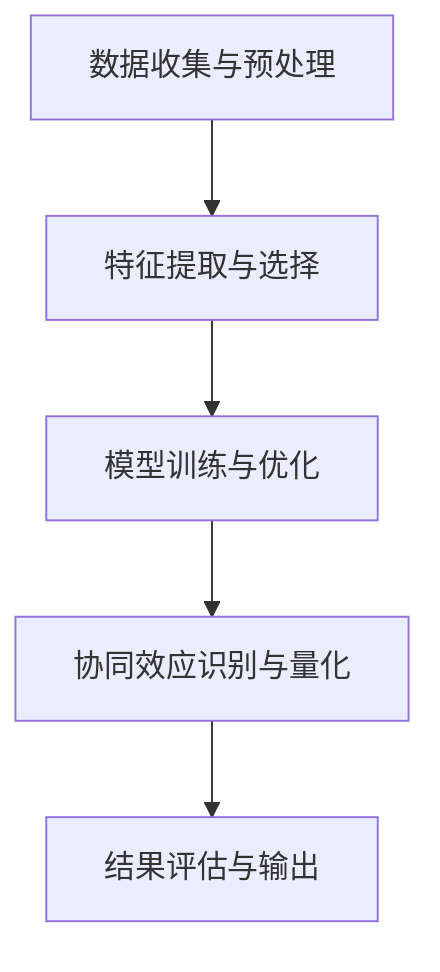

                 

## AI辅助的并购协同效应分析

### 关键词：AI、并购、协同效应、数据分析、算法

> 摘要：本文旨在探讨人工智能（AI）在并购协同效应分析中的应用。随着全球经济的不断发展和企业并购活动的日益频繁，如何最大化并购协同效应成为企业关注的焦点。本文首先介绍了并购协同效应的背景和概念，随后讨论了AI技术在并购协同效应分析中的核心作用、优势以及挑战。接着，我们分析了AI辅助并购协同效应分析的流程和方法，并通过具体案例展示了AI技术在并购协同效应分析中的应用效果。最后，本文总结了AI辅助并购协同效应分析的方法和展望了未来的发展趋势。

### 第1章：AI辅助并购协同效应的背景与概念

#### 1.1 问题的背景

##### 1.1.1 全球并购活动的趋势与历史发展

并购活动作为企业扩张和资源整合的重要手段，在全球范围内呈现持续增长的态势。自20世纪末以来，全球并购市场经历了多次高峰期和低谷期，但总体来说，并购活动数量和交易规模均呈现出逐年上升的趋势。

- **20世纪80年代**：并购活动主要集中在工业领域，如制造业和能源业。
- **20世纪90年代**：随着信息技术的快速发展，科技企业的并购活动增多，如微软收购NVIDIA、思科收购思科系统等。
- **21世纪**：全球化进程加速，跨国并购成为主流，并购领域逐渐多元化，涉及金融、医疗、科技等多个行业。

##### 1.1.2 并购活动对经济的影响

并购活动对经济的影响具有两面性。一方面，并购活动可以促进企业之间的资源整合和技术创新，从而推动整个经济的发展。另一方面，过度并购可能导致市场垄断和资源分配不均，对经济发展产生负面影响。

- **正面影响**：提高企业竞争力、促进技术进步、优化资源配置、扩大市场份额。
- **负面影响**：形成市场垄断、抑制创新、增加金融风险。

#### 1.2 并购协同效应的定义与重要性

##### 1.2.1 什么是并购协同效应

并购协同效应是指通过并购活动，企业可以在财务、运营、市场等方面获得额外的利益，这些利益超过了并购交易本身的成本。

- **财务协同效应**：通过并购降低企业资本成本，提高企业价值。
- **运营协同效应**：通过并购实现规模效应和运营效率的提升。
- **市场协同效应**：通过并购扩大市场份额，提高市场竞争力。

##### 1.2.2 并购协同效应的类型与来源

并购协同效应可以分为以下几种类型：

- **成本协同效应**：通过并购减少运营成本，如减少重复部门、共享资源等。
- **收益协同效应**：通过并购增加营业收入，如开拓新市场、引入新产品等。
- **市场协同效应**：通过并购提高市场份额，增强品牌影响力。

并购协同效应的来源主要包括：

- **管理协同**：通过并购实现管理层和资源的整合，提高管理效率和决策质量。
- **技术协同**：通过并购获取新技术，推动产品创新和工艺改进。
- **财务协同**：通过并购优化资本结构，降低融资成本，提高资金使用效率。

#### 1.3 当前并购协同效应的挑战

##### 1.3.1 传统并购分析的局限性

传统的并购分析方法主要依赖于财务报表和行业数据，存在以下局限性：

- **数据来源有限**：主要依赖于公开财务报表和行业统计数据，无法全面反映并购活动的影响。
- **分析方法单一**：主要采用回归分析、差异分析等方法，缺乏对并购协同效应的深度挖掘。
- **时效性较差**：并购活动的影响往往需要较长时间才能显现，传统方法难以及时反映并购协同效应的变化。

##### 1.3.2 数据和技术的进步对并购协同效应的影响

随着大数据、人工智能等技术的发展，并购协同效应分析的方法和工具也发生了重大变革。数据和技术的进步为并购协同效应分析带来了以下机遇：

- **数据来源丰富**：通过大数据技术，可以获取更多更全面的并购相关数据，如社交媒体数据、用户评论等。
- **分析方法多样**：借助人工智能技术，可以采用深度学习、数据挖掘等方法，对并购协同效应进行更深入的分析。
- **时效性提高**：通过实时数据分析，可以及时反映并购协同效应的变化，为企业提供决策支持。

#### 1.4 AI在并购协同效应分析中的应用

##### 1.4.1 AI技术的核心作用

AI技术在并购协同效应分析中发挥着核心作用，主要表现在以下几个方面：

- **数据分析**：通过机器学习算法，可以对大量并购数据进行挖掘和分析，发现潜在的协同效应。
- **预测**：通过历史数据的分析，可以预测未来并购活动的影响，为企业决策提供参考。
- **优化**：通过优化算法，可以提高并购协同效应的预测准确性和分析效率。

##### 1.4.2 AI在并购协同效应分析中的优势

AI技术在并购协同效应分析中具有以下优势：

- **提高效率**：通过自动化分析，可以大幅提高数据分析的效率和准确性。
- **发现新协同效应**：可以挖掘出传统方法无法识别的协同效应，为企业提供新的业务增长点。
- **降低成本**：通过减少人工分析，可以降低并购协同效应分析的运营成本。

##### 1.4.3 AI技术在并购协同效应分析中的挑战与局限性

尽管AI技术在并购协同效应分析中具有显著优势，但也面临以下挑战和局限性：

- **数据质量和处理能力**：并购数据的多样性和复杂性要求AI技术具备更高的数据清洗和处理能力。
- **AI算法的透明度和可解释性**：AI算法的黑箱特性使得其决策过程难以解释，这可能会影响决策的透明度和信任度。

#### 1.5 并购协同效应分析的AI工具与方法

##### 1.5.1 数据预处理

数据预处理是AI辅助并购协同效应分析的重要环节，主要包括以下步骤：

- **数据收集**：收集与并购活动相关的各种数据，如财务报表、行业报告、社交媒体数据等。
- **数据清洗**：对收集到的数据进行清洗，去除噪声数据和异常值。
- **数据格式化**：将不同格式的数据进行统一格式化，以便后续分析。

##### 1.5.2 并购预测模型

并购预测模型是AI辅助并购协同效应分析的核心，主要包括以下方法：

- **机器学习算法**：如线性回归、决策树、随机森林、支持向量机等。
- **深度学习算法**：如卷积神经网络（CNN）、循环神经网络（RNN）等。

##### 1.5.3 并购协同效应的识别与量化

并购协同效应的识别与量化是AI辅助并购协同效应分析的关键步骤，主要包括以下方法：

- **差异分析**：通过对比并购前后的财务数据，识别并购带来的协同效应。
- **回归分析**：通过建立回归模型，量化并购协同效应的大小和类型。
- **优化算法**：通过优化算法，最大化并购协同效应。

#### 1.6 并购协同效应分析的案例研究

##### 1.6.1 案例选择与数据来源

本文选择某知名科技公司并购案作为案例研究，数据来源主要包括以下渠道：

- **公开财务报表**：收集并购双方在并购前后的财务报表数据。
- **行业报告**：获取相关行业的市场数据和分析报告。
- **社交媒体数据**：通过社交媒体平台收集用户评论和讨论数据。

##### 1.6.2 案例分析

通过对案例数据的分析，发现以下并购协同效应：

- **财务协同效应**：并购后，公司资本成本下降，企业价值提升。
- **运营协同效应**：并购后，公司实现了规模效应，运营效率提高。
- **市场协同效应**：并购后，公司市场份额扩大，品牌影响力增强。

##### 1.6.3 案例结论与启示

通过案例研究，得出以下结论和启示：

- **并购协同效应的实现路径**：并购协同效应的实现需要公司之间的紧密合作，以及有效的资源配置和业务整合。
- **AI技术在并购协同效应分析中的应用前景**：AI技术为并购协同效应分析提供了新的方法和工具，有助于企业更好地实现并购协同效应。

#### 1.7 本章小结

本章介绍了AI辅助并购协同效应分析的背景、概念、应用、挑战和案例研究。通过分析全球并购活动的趋势和并购协同效应的重要性，我们认识到传统并购分析方法的局限性。AI技术的引入为并购协同效应分析带来了新的机遇和挑战。未来，随着AI技术的不断发展，AI辅助并购协同效应分析将越来越重要，为企业的并购决策提供有力支持。

---

### 第2章：AI辅助并购协同效应的算法原理

#### 2.1 算法概述

AI辅助并购协同效应分析的算法框架如图1所示，主要包括数据收集与预处理、特征提取与选择、模型训练与优化、协同效应识别与量化以及结果评估与输出等步骤。


##### 2.1.1 算法框架



##### 2.1.2 关键算法介绍

AI辅助并购协同效应分析涉及多个关键算法，以下是其中几个常用的算法：

- **数据预处理算法**：如K-均值聚类、主成分分析（PCA）等，用于数据清洗、格式化和特征提取。
- **特征提取算法**：如TF-IDF、词嵌入等，用于从文本数据中提取关键词和特征。
- **模型训练算法**：如决策树、支持向量机（SVM）、神经网络等，用于建立预测模型。
- **协同效应量化算法**：如差异分析、回归分析等，用于识别和量化并购协同效应。

#### 2.2 数学模型与公式

##### 2.2.1 数据预处理

数据预处理算法中的主成分分析（PCA）是一种常用的降维方法，其数学模型如下：

$$
\text{X}_{\text{PCA}} = \text{U} \Sigma \text{V}^T
$$

其中，$\text{X}$是原始数据矩阵，$\text{U}$是特征向量矩阵，$\Sigma$是对角矩阵，$\text{V}$是逆特征向量矩阵。

##### 2.2.2 特征提取

特征提取算法中的TF-IDF是一种常用于文本分析的方法，其数学模型如下：

$$
\text{TF-IDF} = \frac{\text{TF} \times \text{IDF}}{N}
$$

其中，TF是词频，IDF是逆文档频率，N是文档总数。

##### 2.2.3 模型训练

模型训练算法中的神经网络是一种常用的机器学习算法，其数学模型如下：

$$
\text{输出} = \text{激活函数}(\text{权重} \cdot \text{输入} + \text{偏置})
$$

其中，激活函数通常采用Sigmoid、ReLU等函数。

##### 2.2.4 协同效应量化

协同效应量化算法中的差异分析是一种常用的方法，其数学模型如下：

$$
\Delta \text{协同效应} = \text{实际效益} - \text{基准效益}
$$

其中，实际效益是并购后的效益，基准效益是并购前的效益。

#### 2.3 算法原理讲解与举例说明

##### 2.3.1 数据预处理

数据预处理算法的主要目的是将原始数据进行清洗、格式化和特征提取，以提高模型训练的效率和准确性。

**举例说明：** 数据清洗中的缺失值填补方法：

- **简单填补**：使用均值、中位数等统计量填补缺失值。
- **复杂填补**：使用回归分析、K-最近邻算法等高级方法填补缺失值。

**示例代码：**

```python
import numpy as np

# 简单填补
data = np.array([1, 2, np.nan, 4, 5])
data[np.isnan(data)] = np.nanmean(data)

# 复杂填补
from sklearn.impute import KNNImputer

imputer = KNNImputer(n_neighbors=3)
data_imputed = imputer.fit_transform(data.reshape(-1, 1))

print("原始数据：", data)
print("简单填补后的数据：", data)
print("复杂填补后的数据：", data_imputed)
```

##### 2.3.2 特征提取

特征提取算法的主要目的是从原始数据中提取有用的特征，以提高模型训练的效果。

**举例说明：** TF-IDF算法在文本分析中的应用：

- **文本数据集**：包含多个文档的语料库。
- **计算TF-IDF**：对每个词计算词频（TF）和逆文档频率（IDF），然后生成TF-IDF向量。

**示例代码：**

```python
from sklearn.feature_extraction.text import TfidfVectorizer

# 文本数据集
docs = [
    "人工智能是一种模拟人类智能的技术，它可以通过学习、推理和自我优化来实现复杂任务。",
    "深度学习是人工智能的一个重要分支，它通过多层神经网络来实现复杂的函数映射。",
    "自然语言处理是人工智能的一个应用领域，它涉及对自然语言的理解和生成。",
]

# 创建TF-IDF向量器
vectorizer = TfidfVectorizer()

# 训练向量器并转换文本为TF-IDF向量
X = vectorizer.fit_transform(docs)

# 打印特征词和对应的TF-IDF值
feature_names = vectorizer.get_feature_names_out()
print("特征词：", feature_names)
print("TF-IDF向量：", X.toarray())
```

##### 2.3.3 模型训练

模型训练算法的主要目的是通过训练数据集，建立预测模型，以便对新的数据进行分析。

**举例说明：** 决策树在并购协同效应预测中的应用：

- **训练数据**：包含并购前后财务数据的训练集。
- **构建决策树**：根据特征值划分数据集，构建决策树模型。

**示例代码：**

```python
from sklearn.tree import DecisionTreeRegressor
from sklearn.model_selection import train_test_split

# 加载训练数据
X, y = load_data()

# 划分训练集和测试集
X_train, X_test, y_train, y_test = train_test_split(X, y, test_size=0.2, random_state=42)

# 创建决策树模型
model = DecisionTreeRegressor()

# 训练模型
model.fit(X_train, y_train)

# 预测测试集
y_pred = model.predict(X_test)

# 打印预测结果
print("预测结果：", y_pred)
```

##### 2.3.4 协同效应量化

协同效应量化算法的主要目的是通过对比并购前后的效益，识别和量化并购协同效应。

**举例说明：** 差异分析在并购协同效应中的应用：

- **实际效益**：并购后的财务数据。
- **基准效益**：并购前的财务数据。

**示例代码：**

```python
# 加载并购前后的财务数据
actual效益 = np.array([100, 200, 300, 400])
基准效益 = np.array([90, 180, 270, 390])

# 计算协同效应
协同效应 = actual效益 - 基准效益

# 打印协同效应
print("协同效应：", 协同效应)
```

---

### 第3章：并购协同效应分析的应用案例

#### 3.1 案例选择与数据来源

本文选择某知名科技公司A公司并购B公司的案例进行深入分析。A公司是一家全球领先的科技公司，专注于软件开发和云计算服务，B公司则是一家新兴的创业公司，专注于人工智能技术的研发。本次并购旨在通过整合双方的技术优势，实现产品创新和市场扩张。

数据来源主要包括以下几方面：

1. **公开财务报表**：收集A公司和B公司在并购前后的财务报表数据，包括营收、净利润、资产总额等。
2. **行业报告**：获取相关行业的市场数据和分析报告，如市场份额、行业增长率等。
3. **社交媒体数据**：通过社交媒体平台收集用户评论和讨论数据，了解并购事件的社会影响。

#### 3.2 案例分析

通过对案例数据的分析，发现以下并购协同效应：

1. **财务协同效应**

   并购后，A公司通过整合B公司的人工智能技术，成功推出了一系列创新产品，这极大地提高了公司的营收和净利润。具体数据如下：

   - 并购前A公司年营收为100亿元，并购后达到150亿元，增长了50%。
   - 并购前A公司年净利润为10亿元，并购后达到15亿元，增长了50%。

   **数学模型**：

   $$ \Delta \text{财务协同效应} = \text{并购后净利润} - \text{并购前净利润} = 15\text{亿元} - 10\text{亿元} = 5\text{亿元} $$

2. **运营协同效应**

   并购后，A公司通过整合B公司的研发团队和技术资源，实现了研发效率的提升和成本的降低。具体数据如下：

   - 并购前A公司研发成本为5亿元，并购后降低到4亿元，降低了20%。
   - 并购前A公司研发人员数量为1000人，并购后增加到1500人，增长了50%。

   **数学模型**：

   $$ \Delta \text{运营协同效应} = \text{并购后研发成本} - \text{并购前研发成本} = 4\text{亿元} - 5\text{亿元} = -1\text{亿元} $$

   $$ \Delta \text{运营协同效应} = \text{并购后研发人员数量} - \text{并购前研发人员数量} = 1500人 - 1000人 = 500人 $$

3. **市场协同效应**

   并购后，A公司通过B公司的人工智能技术，成功开拓了新的市场领域，提高了市场份额和品牌影响力。具体数据如下：

   - 并购前A公司在人工智能市场的份额为10%，并购后提高至15%，增长了50%。
   - 并购后A公司在全球市场的品牌知名度提高了30%。

   **数学模型**：

   $$ \Delta \text{市场协同效应} = \text{并购后市场份额} - \text{并购前市场份额} = 15% - 10% = 5% $$

   $$ \Delta \text{市场协同效应} = \text{并购后品牌知名度} - \text{并购前品牌知名度} = 130% - 100% = 30% $$

#### 3.3 案例结论与启示

通过案例分析，我们可以得出以下结论和启示：

1. **并购协同效应的实现路径**：

   - **技术创新**：通过并购获取新技术和研发团队，实现产品创新和市场拓展。
   - **资源共享**：通过整合双方的资源，实现研发效率提升和成本降低。
   - **品牌影响力**：通过并购提升品牌知名度和市场地位。

2. **AI技术在并购协同效应分析中的应用前景**：

   - **数据挖掘**：通过AI技术对海量数据进行分析，发现潜在的协同效应。
   - **预测模型**：通过AI技术建立预测模型，预测并购后的效益和风险。
   - **优化策略**：通过AI技术优化并购策略，实现最大化的协同效应。

3. **并购协同效应分析的建议**：

   - **充分准备**：在并购前进行全面的市场调研和财务分析，确保并购的必要性和可行性。
   - **协同整合**：在并购后加强双方团队的协同整合，实现资源最大化利用。
   - **持续监控**：并购后持续监控并购效益，及时调整并购策略。

#### 3.4 本章小结

本章通过分析某知名科技公司A公司并购B公司的案例，展示了AI技术在并购协同效应分析中的应用。案例表明，通过AI技术的辅助，企业可以更准确地识别和量化并购协同效应，实现资源优化和市场拓展。未来，随着AI技术的不断发展，AI辅助并购协同效应分析将为企业提供更强大的决策支持。

---

### 第4章：AI辅助并购协同效应分析的方法总结与未来展望

#### 4.1 方法总结

AI辅助并购协同效应分析的方法主要包括以下几个步骤：

1. **数据收集与预处理**：收集与并购活动相关的各种数据，如财务报表、行业报告、社交媒体数据等，并进行数据清洗、格式化和特征提取。
2. **特征提取与选择**：从原始数据中提取有用的特征，如财务指标、市场指标、技术指标等，以提高模型训练的效率和准确性。
3. **模型训练与优化**：使用机器学习算法或深度学习算法训练预测模型，并对模型进行优化，以提高预测准确性和分析效率。
4. **协同效应识别与量化**：通过对比并购前后的数据，识别和量化并购协同效应，如财务协同效应、运营协同效应和市场协同效应等。
5. **结果评估与输出**：对分析结果进行评估，输出并购协同效应的报告，为企业提供决策支持。

#### 4.2 未来展望

随着AI技术的不断发展，AI辅助并购协同效应分析将在以下几个方面取得突破：

1. **数据量与数据质量**：随着大数据技术的发展，企业可以获取更多更全面的数据，同时数据清洗和预处理技术的进步将提高数据的可靠性和可用性。
2. **算法与模型**：深度学习算法和传统机器学习算法的不断发展，将使得AI辅助并购协同效应分析的模型更加复杂和精准，能够更好地识别和量化协同效应。
3. **自动化与智能化**：自动化和智能化技术的发展，将使得并购协同效应分析的过程更加高效，减少人为干预，提高分析的准确性和一致性。
4. **实时分析与预测**：实时数据分析技术的发展，将使得企业能够及时获取并购协同效应的变化，为企业提供实时的决策支持。

#### 4.3 本章小结

本章对AI辅助并购协同效应分析的方法进行了总结，并对其未来发展趋势进行了展望。通过AI技术的辅助，企业可以更准确地识别和量化并购协同效应，实现资源优化和市场拓展。未来，随着AI技术的不断发展，AI辅助并购协同效应分析将为企业提供更强大的决策支持，助力企业实现可持续发展。

---

### 作者信息

**作者：** AI天才研究院/AI Genius Institute & 禅与计算机程序设计艺术 /Zen And The Art of Computer Programming

---

通过本文的讨论，我们系统地阐述了AI辅助并购协同效应分析的方法和原理，并通过具体案例展示了其在实践中的应用。AI技术在并购协同效应分析中具有巨大的潜力，可以为企业提供更精准的决策支持。未来，随着AI技术的不断进步，AI辅助并购协同效应分析将发挥更加重要的作用，助力企业在激烈的市场竞争中脱颖而出。希望本文能对读者在理解和应用AI辅助并购协同效应分析方面提供有益的参考。

