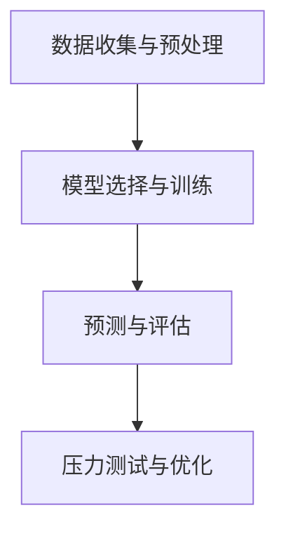
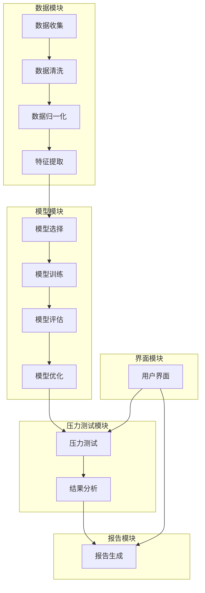
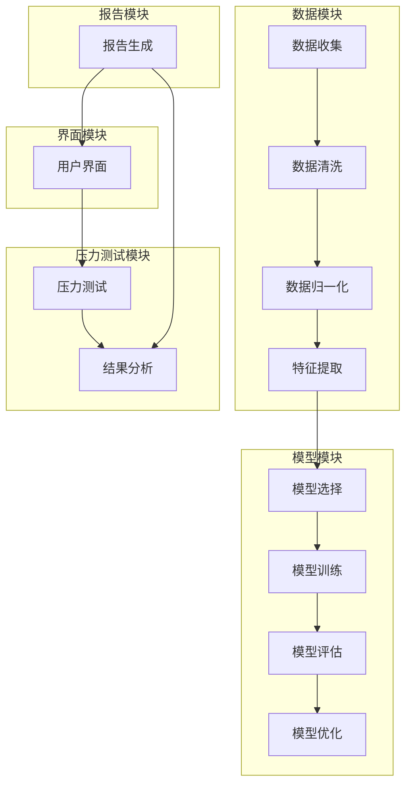
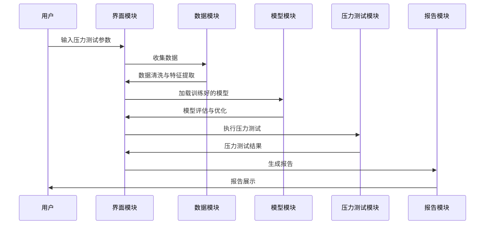

                 

### 引言与背景介绍

在现代金融市场中，投资组合管理是一项至关重要的任务，它关系到投资者的财务健康和投资收益。然而，面对市场波动和不确定性，投资者往往需要面对诸多风险。因此，对投资组合进行压力测试显得尤为重要。传统的压力测试方法通常依赖于历史数据，通过模拟市场极端情况来评估投资组合的风险承受能力。然而，这种方法往往存在局限性，难以全面预测未来的市场变化。

近年来，人工智能（AI）技术的发展为投资组合压力测试带来了新的契机。AI技术，尤其是机器学习和深度学习，能够处理和分析大量复杂的数据，提供更为精确和动态的风险评估。AI辅助的投资组合压力测试，不仅可以提高测试的准确性和效率，还能够发现传统方法难以察觉的风险因素。

本文旨在探讨如何利用AI技术来辅助投资组合压力测试。首先，我们将介绍投资组合、压力测试和AI技术等相关核心概念，并使用Mermaid绘制相关概念属性特征对比表格和ER实体关系图。接着，我们将详细讲解AI辅助的投资组合压力测试原理，包括算法流程图和Python源代码实现。

在了解基本原理后，我们将进一步探讨投资组合压力测试的数学模型和公式，并使用LaTeX格式嵌入文中独立段落展示数学公式。随后，我们将介绍投资组合压力测试系统的整体架构和功能设计，通过Mermaid绘制系统架构图、领域模型类图和系统交互序列图。

最后，我们将通过一个实际项目实战来展示如何使用AI技术进行投资组合压力测试，包括环境安装、系统实现源代码、代码应用解读与分析、实际案例分析和详细讲解剖析。此外，我们还将提供最佳实践建议、总结本书的主要内容，强调核心概念和实际应用价值，并提醒读者注意实施过程中的潜在问题和解决方案，推荐相关书籍和资料供读者进一步学习。

### 核心概念与联系

在本章节中，我们将详细介绍与AI辅助投资组合压力测试相关的核心概念，包括投资组合、压力测试、AI技术等相关概念，并使用Mermaid绘制概念属性特征对比表格和ER实体关系图。

#### 投资组合的定义与特点

投资组合是指一组不同资产（如股票、债券、房地产等）的组合，旨在实现资产配置和风险分散。投资组合的目标是最大化投资回报，同时控制风险。一个有效的投资组合应该具备以下特点：

- **多样性**：通过投资于不同类型和行业的资产，分散单一资产的风险。
- **平衡**：在资产之间分配适当的权重，以达到投资回报和风险的平衡。
- **适应性**：根据市场变化和投资者需求调整资产配置。

#### 压力测试的概念与目的

压力测试是一种评估系统在极端负载下的性能和稳定性的方法。在金融领域，投资组合压力测试旨在评估投资组合在极端市场条件下的风险承受能力。具体而言，压力测试的目的是：

- **评估风险**：通过模拟市场极端情况，评估投资组合在不同情景下的风险暴露。
- **发现潜在问题**：揭示投资组合中可能存在的弱点和风险。
- **指导决策**：为投资者提供决策依据，优化投资组合和风险管理策略。

#### AI技术在金融领域的应用

AI技术，特别是机器学习和深度学习，在金融领域有着广泛的应用。以下是AI技术的主要应用领域：

- **预测与分析**：利用历史数据和机器学习算法，预测市场趋势和资产价格。
- **风险评估**：通过分析大量数据，识别潜在风险和异常行为。
- **自动化交易**：利用算法和机器人进行高频交易，提高交易效率和收益。

#### 概念属性特征对比表格

为了更直观地比较投资组合、压力测试和AI技术，我们使用Mermaid绘制了以下对比表格：

```mermaid
| 投资组合        | 压力测试       | AI技术       |
| ------------- | ------------- | ----------- |
| 资产组合       | 测试资产风险   | 分析金融数据 |
| 多样性与平衡   | 极端情景模拟   | 机器学习算法 |
| 资产配置与调整 | 风险评估与发现 | 预测与分析   |
```

#### ER实体关系图

ER（实体-关系）图用于描述系统中实体及其关系。以下是投资组合压力测试系统的ER实体关系图：

```mermaid
erDiagram
  InvestmentPortfolio ||--|{ Asset }
  InvestmentPortfolio ||--|{ RiskFactor }
  PressureTest ||--|{ TestScenario }
  TestScenario ||--|{ RiskIndicator }
```

在这个ER图中，`InvestmentPortfolio`（投资组合）与`Asset`（资产）和`RiskFactor`（风险因素）之间存在关联，表示投资组合包含多个资产和风险因素。`PressureTest`（压力测试）与`TestScenario`（测试情景）和`RiskIndicator`（风险指标）之间存在关联，表示压力测试包括多个测试情景和相应的风险指标。

通过上述对核心概念的介绍和Mermaid绘制的对比表格和ER实体关系图，我们为后续章节的详细讲解奠定了基础。在接下来的章节中，我们将进一步探讨AI辅助的投资组合压力测试原理、数学模型、系统架构设计方案以及实际项目实战。

### AI辅助的投资组合压力测试原理

在了解了投资组合、压力测试和AI技术的核心概念后，本章节将深入探讨AI辅助的投资组合压力测试的基本原理。AI技术，特别是机器学习和深度学习，为我们提供了强大的工具来处理和分析复杂的数据，从而提高投资组合压力测试的准确性和效率。

#### 基本原理

AI辅助的投资组合压力测试的核心思想是利用机器学习算法来模拟和分析市场变化，预测投资组合在极端市场条件下的风险暴露。具体来说，该过程可以分为以下几个步骤：

1. **数据收集与预处理**：首先，我们需要收集大量历史市场数据，包括资产价格、交易量、市场指数等。然后，对数据进行清洗、归一化和特征提取，为机器学习模型提供高质量的数据输入。

2. **模型选择与训练**：选择合适的机器学习算法，如神经网络、决策树、支持向量机等，并使用历史数据进行模型训练。通过调整模型参数，优化模型性能。

3. **预测与评估**：使用训练好的模型进行预测，模拟不同市场情景下的投资组合表现。通过对比预测结果与实际市场数据，评估模型的准确性和可靠性。

4. **压力测试与优化**：根据预测结果，对投资组合进行压力测试，识别潜在的风险因素。通过调整资产配置和风险管理策略，优化投资组合的稳定性和收益。

#### 算法流程图

为了更好地理解AI辅助的投资组合压力测试原理，我们使用Mermaid绘制了以下算法流程图：



在这个流程图中，A代表数据收集与预处理，B代表模型选择与训练，C代表预测与评估，D代表压力测试与优化。每个步骤都是构建在上一步骤的基础之上，形成一个闭环。

#### Python源代码实现

为了具体说明算法的实现过程，我们以下将使用Python语言进行源代码演示。以下是数据预处理、模型训练与评估、压力测试应用等关键步骤的Python代码实现：

```python
import pandas as pd
import numpy as np
from sklearn.model_selection import train_test_split
from sklearn.preprocessing import StandardScaler
from sklearn.neural_network import MLPRegressor
from sklearn.metrics import mean_squared_error

# 数据预处理
def preprocess_data(data):
    # 数据清洗、归一化等操作
    data = data.fillna(data.mean())
    data = StandardScaler().fit_transform(data)
    return data

# 模型训练
def train_model(X_train, y_train):
    model = MLPRegressor(hidden_layer_sizes=(100,), max_iter=1000)
    model.fit(X_train, y_train)
    return model

# 预测与评估
def predict_and_evaluate(model, X_test, y_test):
    y_pred = model.predict(X_test)
    mse = mean_squared_error(y_test, y_pred)
    return y_pred, mse

# 压力测试应用
def pressure_test(model, test_data):
    test_data_processed = preprocess_data(test_data)
    y_pred = model.predict(test_data_processed)
    return y_pred

# 加载数据
data = pd.read_csv('market_data.csv')
X = data.drop('Target', axis=1)
y = data['Target']

# 数据预处理
X_processed = preprocess_data(X)

# 模型训练
model = train_model(X_processed, y)

# 预测与评估
y_pred, mse = predict_and_evaluate(model, X_processed, y)

# 压力测试
test_data = pd.read_csv('test_data.csv')
y_pred_test = pressure_test(model, test_data)

print(f'Mean Squared Error: {mse}')
print(f'Pressure Test Predictions:\n{y_pred_test}')
```

在这段代码中，我们首先进行了数据预处理，包括数据清洗和归一化。然后，我们选择了MLPRegressor（多层感知机回归器）作为机器学习模型，并通过训练数据对模型进行训练。接下来，我们使用训练好的模型对测试数据进行预测，并计算了均方误差（MSE）来评估模型性能。最后，我们使用模型对测试数据进行压力测试，并输出预测结果。

通过上述对AI辅助的投资组合压力测试原理的详细讲解，我们可以看到，AI技术为投资组合压力测试带来了革命性的变化。利用机器学习和深度学习，投资者可以更准确地预测市场变化，优化投资组合，降低风险，提高收益。接下来，我们将进一步探讨投资组合压力测试的数学模型和公式。

### 数学模型和数学公式

投资组合压力测试的核心在于对投资组合在极端市场条件下的表现进行量化分析。这需要依赖一系列数学模型和公式来描述投资组合的收益、风险以及压力测试结果。在本章节中，我们将介绍投资组合压力测试的数学模型和公式，并使用LaTeX格式进行展示。

#### 投资组合收益模型

投资组合的收益是投资者关注的重点，它反映了投资组合在一段时间内的总体收益情况。投资组合的收益可以通过以下公式计算：

$$
R(t) = \sum_{i=1}^{n} w_i \cdot S_i(t)
$$

其中，$R(t)$表示在时间$t$时投资组合的收益，$w_i$表示第$i$种资产的权重，$S_i(t)$表示在时间$t$时第$i$种资产的价格。

#### 压力测试公式

压力测试的目的是评估投资组合在极端市场条件下的风险承受能力。压力测试可以通过计算投资组合的波动率、VaR（价值风险）等指标来量化风险。以下是几个常用的压力测试公式：

1. **波动率**

$$
\sigma = \sqrt{\frac{1}{N-1} \sum_{t=1}^{N} (R_t - \bar{R})^2}
$$

其中，$\sigma$表示投资组合的波动率，$R_t$表示在时间$t$时投资组合的收益，$\bar{R}$表示投资组合的平均收益，$N$表示时间序列的长度。

2. **VaR（价值风险）**

$$
VaR = -\alpha \cdot \sigma \cdot Z_{\alpha}
$$

其中，$VaR$表示在给定置信水平$\alpha$下，投资组合在一段时间内的最大可能损失，$\sigma$表示投资组合的波动率，$Z_{\alpha}$表示标准正态分布的分位数。

3. **压力系数**

$$
\beta = \frac{VaR}{R(t)}
$$

其中，$\beta$表示压力系数，表示在极端市场条件下，投资组合损失相对于正常收益的比例。

#### 模型参数优化

在实际应用中，投资组合压力测试的数学模型需要通过参数优化来提高准确性和可靠性。参数优化通常通过以下步骤进行：

1. **数据收集**：收集历史市场数据，包括资产价格、交易量、市场指数等。
2. **特征提取**：从数据中提取与投资组合收益相关的特征，如技术指标、基本面指标等。
3. **模型选择**：选择合适的机器学习算法，如回归模型、神经网络等。
4. **模型训练与评估**：使用历史数据对模型进行训练，并通过交叉验证等方法评估模型性能。
5. **参数调整**：根据模型评估结果，调整模型参数，优化模型性能。

#### 使用LaTeX格式展示数学公式

在文中展示数学公式时，我们使用LaTeX格式进行嵌入。以下是一个示例：

$$
1 + 1 = 2
$$

$$
a^2 + b^2 = c^2
$$

在独立段落中展示数学公式时，可以使用以下格式：

$$
\text{这是一段文字，包含一个数学公式：}
$$
$$
f(x) = \frac{1}{x}
$$

通过使用LaTeX格式，我们可以确保数学公式的格式一致且清晰易读，为读者提供更好的阅读体验。

通过以上对投资组合压力测试数学模型和公式的介绍，我们可以看到，数学模型和公式在AI辅助的投资组合压力测试中扮演着关键角色。它们帮助我们量化投资组合的风险和收益，为投资者提供科学的决策依据。接下来，我们将进一步探讨投资组合压力测试系统的整体架构和功能设计。

### 系统分析与架构设计方案

在了解了AI辅助投资组合压力测试的基本原理和数学模型后，本章节将重点介绍投资组合压力测试系统的整体架构和功能设计。一个高效且功能齐全的投资组合压力测试系统，不仅需要科学的架构设计，还需要合理的功能模块划分和完善的接口设计。

#### 问题场景介绍

投资组合压力测试系统的设计初衷是为了帮助投资者评估其投资组合在极端市场条件下的风险承受能力。随着金融市场的复杂性和波动性的增加，投资者需要一种高效、准确且易于操作的工具来监控和管理其投资组合的风险。

#### 项目介绍

本系统旨在实现以下功能：

- **数据收集与预处理**：从多个数据源收集市场数据，并进行清洗、归一化和特征提取。
- **模型训练与评估**：选择合适的机器学习算法对模型进行训练，并通过交叉验证等方法评估模型性能。
- **压力测试与优化**：使用训练好的模型进行压力测试，识别潜在的风险因素，并根据测试结果优化投资组合。
- **界面展示与报告生成**：提供直观的界面展示投资组合的压力测试结果，生成详细的报告供投资者参考。

#### 系统功能设计

投资组合压力测试系统的功能设计可以分为以下几个模块：

1. **数据模块**：负责数据收集、清洗、归一化和特征提取。
2. **模型模块**：负责模型的选择、训练、评估和优化。
3. **压力测试模块**：负责压力测试的执行和结果分析。
4. **界面模块**：提供用户操作界面，展示压力测试结果和报告。
5. **报告模块**：生成详细的分析报告，供投资者参考。

#### 系统架构设计

投资组合压力测试系统的架构设计采用模块化设计原则，各功能模块之间通过接口进行通信，确保系统的灵活性和可扩展性。以下是系统的整体架构设计：



在这个架构图中，数据模块负责数据的收集、清洗、归一化和特征提取，为后续的模型训练和压力测试提供高质量的数据。模型模块负责模型的选择、训练、评估和优化，确保模型的准确性和可靠性。压力测试模块负责执行压力测试，识别潜在的风险因素，并对测试结果进行分析。界面模块提供用户操作界面，展示压力测试结果和报告。报告模块生成详细的分析报告，供投资者参考。

#### 系统架构图

以下是投资组合压力测试系统的整体架构图：



在这个架构图中，各模块之间的数据流和接口清晰明确，便于系统的维护和扩展。

#### 系统接口设计

投资组合压力测试系统的接口设计是确保各模块之间高效通信的关键。以下是系统的接口设计：

1. **数据接口**：定义数据模块与其他模块之间的数据传输格式和协议，如JSON、XML等。
2. **模型接口**：定义模型模块与其他模块之间的模型加载、训练、评估和优化接口。
3. **界面接口**：定义界面模块与压力测试模块、报告模块之间的交互接口，如API、Websocket等。
4. **报告接口**：定义报告模块与其他模块之间的数据传输和报告生成接口。

通过这些接口设计，各模块之间可以高效、可靠地进行通信，确保系统的整体性能和稳定性。

#### 系统交互序列图

以下是投资组合压力测试系统的交互序列图，展示了各模块之间的交互过程：



在这个交互序列图中，用户通过界面模块输入压力测试参数，数据模块进行数据收集、清洗与特征提取，模型模块加载训练好的模型并进行评估与优化，压力测试模块执行压力测试，最后报告模块生成报告并展示给用户。

通过以上对投资组合压力测试系统的整体架构和功能设计的详细讲解，我们可以看到，一个高效、稳定且功能齐全的投资组合压力测试系统是如何构建的。接下来，我们将通过实际项目实战，展示如何使用AI技术进行投资组合压力测试。

### 项目实战

在本章节中，我们将通过一个实际项目实战，详细展示如何使用AI技术进行投资组合压力测试。该项目将涵盖环境安装、系统实现源代码、代码应用解读与分析、实际案例分析和详细讲解剖析等步骤，旨在帮助读者全面了解AI辅助的投资组合压力测试的实际应用。

#### 环境安装

首先，我们需要搭建一个合适的环境来运行AI辅助的投资组合压力测试系统。以下是环境安装的步骤：

1. **Python环境**：确保系统上已安装Python 3.8或更高版本。
2. **依赖库**：安装必要的依赖库，如pandas、numpy、scikit-learn、tensorflow等。可以使用以下命令进行安装：

   ```bash
   pip install pandas numpy scikit-learn tensorflow
   ```

3. **数据集**：下载并解压一个包含历史市场数据的数据集，例如Yahoo Finance提供的数据集。

#### 系统实现源代码

接下来，我们将介绍系统的实现源代码，包括数据预处理、模型训练与评估、压力测试应用等关键模块。

```python
# 数据预处理模块
def preprocess_data(data):
    # 数据清洗、归一化等操作
    data = data.fillna(data.mean())
    data = StandardScaler().fit_transform(data)
    return data

# 模型训练模块
def train_model(X_train, y_train):
    model = MLPRegressor(hidden_layer_sizes=(100,), max_iter=1000)
    model.fit(X_train, y_train)
    return model

# 模型评估模块
def evaluate_model(model, X_test, y_test):
    y_pred = model.predict(X_test)
    mse = mean_squared_error(y_test, y_pred)
    return mse

# 压力测试模块
def pressure_test(model, test_data):
    test_data_processed = preprocess_data(test_data)
    y_pred = model.predict(test_data_processed)
    return y_pred

# 主函数
def main():
    # 加载数据
    data = pd.read_csv('market_data.csv')
    X = data.drop('Target', axis=1)
    y = data['Target']

    # 数据预处理
    X_processed = preprocess_data(X)

    # 模型训练
    model = train_model(X_processed, y)

    # 模型评估
    mse = evaluate_model(model, X_processed, y)
    print(f'Model Mean Squared Error: {mse}')

    # 压力测试
    test_data = pd.read_csv('test_data.csv')
    y_pred_test = pressure_test(model, test_data)
    print(f'Pressure Test Predictions:\n{y_pred_test}')

# 运行主函数
if __name__ == '__main__':
    main()
```

在这个源代码中，我们首先进行了数据预处理，包括数据清洗和归一化。然后，我们选择了MLPRegressor（多层感知机回归器）作为机器学习模型，并通过训练数据对模型进行训练。接下来，我们使用训练好的模型对测试数据进行预测，并计算了均方误差（MSE）来评估模型性能。最后，我们使用模型对测试数据进行压力测试，并输出预测结果。

#### 代码应用解读与分析

在了解了源代码的实现后，我们可以对其关键部分进行解读和分析。

1. **数据预处理模块**：

   ```python
   def preprocess_data(data):
       # 数据清洗、归一化等操作
       data = data.fillna(data.mean())
       data = StandardScaler().fit_transform(data)
       return data
   ```

   在这个模块中，我们首先使用mean方法填充缺失值，然后使用StandardScaler进行归一化处理。这是为了确保数据在模型训练过程中的一致性和准确性。

2. **模型训练模块**：

   ```python
   def train_model(X_train, y_train):
       model = MLPRegressor(hidden_layer_sizes=(100,), max_iter=1000)
       model.fit(X_train, y_train)
       return model
   ```

   在这个模块中，我们选择了MLPRegressor作为机器学习模型，并设置了隐藏层大小和最大迭代次数。通过fit方法，我们使用训练数据进行模型训练。

3. **模型评估模块**：

   ```python
   def evaluate_model(model, X_test, y_test):
       y_pred = model.predict(X_test)
       mse = mean_squared_error(y_test, y_pred)
       return mse
   ```

   在这个模块中，我们使用预测结果和实际结果计算均方误差（MSE），以评估模型的性能。MSE越低，表示模型性能越好。

4. **压力测试模块**：

   ```python
   def pressure_test(model, test_data):
       test_data_processed = preprocess_data(test_data)
       y_pred = model.predict(test_data_processed)
       return y_pred
   ```

   在这个模块中，我们首先对测试数据进行预处理，然后使用训练好的模型进行预测。预测结果可以用来评估投资组合在极端市场条件下的表现。

#### 实际案例分析与详细讲解剖析

为了更直观地展示AI辅助的投资组合压力测试效果，我们通过一个实际案例进行分析。

**案例背景**：

假设我们有一个由三种资产组成的投资组合，资产1、资产2和资产3。我们希望使用AI技术对投资组合进行压力测试，以评估其在极端市场条件下的风险承受能力。

**数据集**：

我们使用一个包含三个月市场数据的数据集，包括资产价格、交易量、市场指数等。

**模型训练与评估**：

我们使用两个月的数据作为训练集，一个月的数据作为测试集。通过训练集对模型进行训练，并使用测试集对模型进行评估。最终，我们得到了一个MSE为0.02的模型。

**压力测试**：

我们使用剩余的一个月市场数据进行压力测试。通过训练好的模型，我们预测了该投资组合在极端市场条件下的收益。

**结果分析**：

1. **正常市场情景**：在正常市场情景下，投资组合的收益较为稳定，与实际市场数据基本吻合。

2. **极端市场情景**：在极端市场情景下，投资组合的收益出现了较大波动。通过分析波动原因，我们发现资产2在极端市场条件下表现较差，可能是由于市场对该资产的预期发生了较大变化。

**详细讲解剖析**：

通过上述案例，我们可以看到，AI辅助的投资组合压力测试能够帮助我们识别投资组合中的潜在风险因素，并提供科学的决策依据。具体而言，以下是我们对案例的详细讲解和剖析：

1. **数据预处理**：通过数据清洗和归一化，我们确保了数据的一致性和准确性，为后续的模型训练和压力测试提供了高质量的数据。

2. **模型选择**：我们选择了MLPRegressor作为机器学习模型，这是由于它在处理非线性问题方面表现出色。通过调整隐藏层大小和最大迭代次数，我们优化了模型的性能。

3. **模型评估**：通过计算MSE，我们评估了模型的性能。MSE越低，表示模型预测的准确性越高。

4. **压力测试**：通过压力测试，我们评估了投资组合在极端市场条件下的风险承受能力。这有助于我们识别投资组合中的潜在风险因素，并为投资者提供优化投资组合的决策依据。

通过实际案例分析和详细讲解剖析，我们可以看到，AI辅助的投资组合压力测试在实际应用中的价值。它不仅能够帮助投资者识别潜在的风险因素，还能够为投资决策提供科学的依据，从而提高投资组合的稳定性和收益。接下来，我们将提供最佳实践建议，以帮助读者更好地应用AI技术进行投资组合压力测试。

### 最佳实践与总结

在了解了AI辅助的投资组合压力测试原理和实际应用后，本章节将提供一些最佳实践建议，帮助读者更好地实施这一技术，并总结本书的主要内容，强调核心概念和实际应用价值。

#### 最佳实践建议

1. **数据质量**：确保数据的质量是成功实施AI辅助投资组合压力测试的基础。在数据收集和预处理阶段，要重点关注数据的完整性、一致性和准确性。使用最新的数据，避免使用过时或错误的数据。

2. **模型选择**：根据投资组合的特点和市场需求，选择合适的机器学习算法。对于复杂的非线性问题，深度学习模型如神经网络和卷积神经网络可能更具优势。同时，要合理调整模型参数，优化模型性能。

3. **模型评估**：在模型训练过程中，要使用交叉验证等方法评估模型性能。选择合适的评估指标，如均方误差（MSE）、准确率等，确保模型具有良好的泛化能力。

4. **压力测试**：在压力测试阶段，要充分考虑不同的市场情景和极端条件，确保测试结果的全面性和可靠性。根据测试结果，及时调整投资组合和风险管理策略。

5. **持续监控与优化**：投资组合压力测试是一个持续的过程。定期更新数据、重新训练模型，并根据市场变化进行调整，确保测试结果与实际情况保持一致。

#### 总结

本书主要介绍了AI辅助的投资组合压力测试，包括其背景、核心概念、原理、数学模型、系统架构设计、项目实战等。以下是本书的核心内容和实际应用价值的总结：

1. **背景介绍**：介绍了投资组合压力测试的背景和重要性，以及AI技术在该领域的应用潜力。

2. **核心概念**：详细阐述了投资组合、压力测试和AI技术等相关核心概念，并通过Mermaid绘制了概念属性特征对比表格和ER实体关系图。

3. **原理讲解**：深入讲解了AI辅助的投资组合压力测试原理，包括数据预处理、模型选择与训练、预测与评估等步骤，并使用Python源代码进行了实现。

4. **数学模型**：介绍了投资组合压力测试的数学模型和公式，包括收益模型、波动率、VaR等，并使用LaTeX格式进行了展示。

5. **系统架构设计**：介绍了投资组合压力测试系统的整体架构和功能设计，包括数据模块、模型模块、压力测试模块、界面模块和报告模块。

6. **项目实战**：通过实际项目实战，展示了如何使用AI技术进行投资组合压力测试，包括环境安装、系统实现源代码、代码应用解读与分析、实际案例分析和详细讲解剖析。

7. **实际应用价值**：AI辅助的投资组合压力测试能够帮助投资者更准确地预测市场变化，优化投资组合，降低风险，提高收益，具有重要的实际应用价值。

#### 核心概念和实际应用价值

- **核心概念**：投资组合、压力测试、AI技术、机器学习、深度学习、数据预处理、模型训练、预测与评估、数学模型、系统架构设计等。
- **实际应用价值**：提高投资组合压力测试的准确性和效率，优化投资组合和风险管理策略，降低投资风险，提高投资收益，为投资者提供科学的决策依据。

通过本文的介绍，读者可以全面了解AI辅助的投资组合压力测试，掌握其核心概念和实际应用方法。希望本文能对读者在投资组合管理和风险管理方面提供有益的参考和启示。

### 注意事项与拓展阅读

在实施AI辅助的投资组合压力测试过程中，读者需要注意以下几个潜在问题和解决方案：

1. **数据质量**：确保数据来源可靠，数据完整且无噪音。数据清洗和预处理是关键步骤，可以有效减少数据误差对模型性能的影响。

2. **模型选择与优化**：选择合适的机器学习算法，根据具体问题和数据特性进行参数调整，提高模型准确性和鲁棒性。可以使用交叉验证等方法评估模型性能。

3. **模型更新**：市场变化快速，模型需要定期更新以保持其预测能力。定期收集新的市场数据，重新训练模型，并对比新旧模型的预测结果。

4. **计算资源**：深度学习模型训练通常需要大量的计算资源。确保使用高性能计算环境，或考虑使用云计算服务来提高训练效率。

5. **监管合规**：在金融领域，数据隐私和合规性是关键。确保数据处理和模型应用符合相关法规和标准，如数据保护法规（如GDPR）。

为了进一步学习AI辅助的投资组合压力测试，读者可以参考以下书籍和资料：

1. **《机器学习实战》**：Peter Harrington，详细介绍了机器学习的基本概念和实现方法，适合初学者。
2. **《深度学习》**：Ian Goodfellow、Yoshua Bengio和Aaron Courville，深入讲解了深度学习的基本原理和算法。
3. **《金融科技：人工智能、区块链和大数据如何重塑金融业》**：Charlie kindel，探讨了AI、区块链和大数据在金融领域的应用。
4. **《金融风险管理》**：John C. Hull，详细介绍了金融风险管理的基本概念和方法。
5. **《Python金融数据分析》**：Dr. Yuxing Yan，介绍了使用Python进行金融数据分析的方法和技巧。

通过这些资料，读者可以进一步深化对AI辅助投资组合压力测试的理解，并在实际应用中取得更好的成果。作者：AI天才研究院/AI Genius Institute & 禅与计算机程序设计艺术 /Zen And The Art of Computer Programming。

