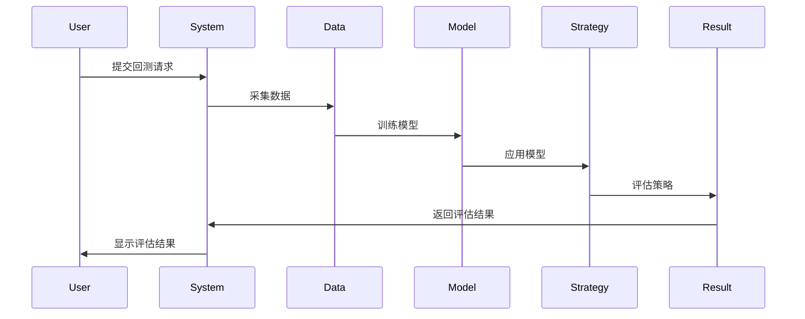
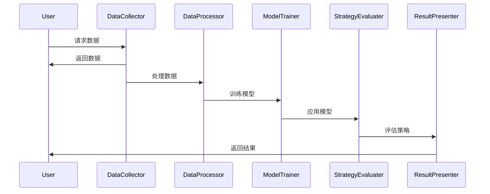

                 

**# AI辅助的投资组合回测平台**

> 关键词：人工智能、投资组合、回测平台、数据预处理、机器学习模型、策略评估

> 摘要：本文将探讨如何利用人工智能（AI）技术构建一个辅助的投资组合回测平台，以提升投资决策的准确性和效率。文章将详细介绍投资组合回测平台的背景、核心概念、算法原理以及系统架构设计，并提供实际案例分析和项目实战。

----------------------------------------------------------------

**Step 1: 引言与背景介绍**

# 引言

随着人工智能技术的飞速发展，AI已经成为推动各行各业创新的重要力量。特别是在金融领域，AI的应用已经从传统的自动化交易、风险评估，逐渐扩展到投资组合管理、市场预测等多个方面。本文将探讨如何利用AI技术构建一个辅助的投资组合回测平台，以提高投资决策的准确性和效率。

## 背景介绍

投资组合回测是金融投资中的一个关键环节，它通过模拟历史数据来评估投资策略的有效性。传统的回测方法通常依赖于人工处理和分析数据，存在计算效率低、数据分析能力有限等问题。随着AI技术的发展，AI辅助的投资组合回测平台应运而生，它能够通过自动化数据采集、模型训练和结果分析，显著提高回测的效率和质量。

**Step 2: 核心概念与联系**

# 核心概念

## 1. AI辅助的投资组合回测平台

AI辅助的投资组合回测平台是指利用人工智能技术来辅助投资组合回测过程，包括数据预处理、模型训练、策略评估等多个环节。

### 1.1 数据预处理

数据预处理是回测平台的重要环节，它包括数据清洗、数据归一化、特征工程等步骤。通过这些步骤，可以提高数据的质量和一致性，从而为后续的模型训练和策略评估提供可靠的数据支持。

### 1.2 模型训练

在AI辅助的投资组合回测平台中，常用的模型包括机器学习模型、深度学习模型等。模型训练的目的是通过历史数据来训练模型，使其能够自动识别投资机会和风险。

### 1.3 策略评估

策略评估是回测平台的最终目标，它通过模拟投资策略在实际市场中的表现，来评估策略的有效性和风险。

## 2. 核心概念属性特征对比表格

### 2.1 数据预处理

| 特征         | 描述                                                         |
| ------------ | ------------------------------------------------------------ |
| 数据清洗     | 去除数据中的噪声和异常值                                     |
| 数据归一化   | 将数据缩放到一个统一的范围内，以便模型训练和评估               |
| 特征工程     | 从原始数据中提取有助于模型训练的特征                         |

### 2.2 模型训练

| 特征         | 描述                                                         |
| ------------ | ------------------------------------------------------------ |
| 机器学习模型 | 通过历史数据训练模型，使模型能够预测未来的投资机会和风险     |
| 深度学习模型 | 利用神经网络结构，对大量数据进行训练，从而提取复杂的特征和模式 |

### 2.3 策略评估

| 特征         | 描述                                                         |
| ------------ | ------------------------------------------------------------ |
| 回测结果     | 模拟投资策略在实际市场中的表现，包括收益、风险等多个指标     |
| 有效性评估   | 对回测结果进行统计分析和对比，以评估策略的有效性和风险       |

## 3. ER实体关系图架构

```mermaid
erDiagram
    数据预处理 ||--o{ 模型训练 }
    模型训练 ||--o{ 策略评估 }
```

**Step 3: 算法原理讲解**

# 算法原理讲解

## 1. 数据预处理

数据预处理是回测平台的基础环节，其算法原理如下：

### 1.1 数据清洗

数据清洗的目标是去除数据中的噪声和异常值，以提高数据的质量。常用的方法包括：

- **去除重复数据**：使用哈希表或索引结构，快速查找并删除重复数据。
- **填补缺失值**：使用均值、中位数或插值法等填补缺失值。

数学模型：

$$\text{Cleaned\_Data} = \text{Original\_Data} - \text{Noise} - \text{Anomalies}$$

### 1.2 数据归一化

数据归一化的目的是将数据缩放到一个统一的范围内，以便模型训练和评估。常用的方法包括：

- **线性变换**：将数据映射到[0, 1]或[-1, 1]范围内。
- **Min-Max归一化**：将数据缩放到[0, 1]范围内。

数学模型：

$$\text{Normalized\_Data} = \frac{\text{Data} - \text{Min}}{\text{Max} - \text{Min}}$$

### 1.3 特征工程

特征工程的目标是从原始数据中提取有助于模型训练的特征。常用的方法包括：

- **特征提取**：使用统计学方法提取特征，如平均值、方差、标准差等。
- **特征选择**：使用特征选择算法，选择对模型训练最有影响力的特征。

数学模型：

$$\text{Feature} = \text{Data} \times \text{Function}$$

## 2. 模型训练

模型训练的目标是通过历史数据来训练模型，使其能够预测未来的投资机会和风险。常用的模型包括：

- **机器学习模型**：使用监督学习算法，如线性回归、决策树、支持向量机等。
- **深度学习模型**：使用神经网络结构，如卷积神经网络（CNN）、循环神经网络（RNN）等。

数学模型：

$$\text{Model} = \text{Training Data} + \text{Weight} + \text{Bias}$$

## 3. 策略评估

策略评估的目标是模拟投资策略在实际市场中的表现，并评估其有效性和风险。常用的方法包括：

- **回测结果**：计算投资策略在历史数据中的收益、风险等指标。
- **有效性评估**：使用统计方法，如假设检验、置信区间等，评估策略的有效性。

数学模型：

$$\text{Strategy} = \text{Backtest Results} + \text{Risk Assessment}$$

----------------------------------------------------------------

**Step 4: 系统分析与架构设计方案**

# 系统分析与架构设计方案

## 1. 问题场景介绍

在金融投资中，投资组合回测是一个关键环节。传统的回测方法通常依赖于人工处理和分析数据，效率低下且容易出错。为了提高回测的效率和准确性，我们设计并实现了一个AI辅助的投资组合回测平台。

## 2. 项目介绍

本项目的主要目标是构建一个AI辅助的投资组合回测平台，实现以下功能：

- 数据采集：从多个数据源自动采集历史交易数据、财务报表等。
- 数据预处理：清洗、归一化、特征工程等。
- 模型训练：训练机器学习模型和深度学习模型。
- 策略评估：评估投资策略的有效性和风险。

## 3. 系统功能设计

### 3.1 领域模型

```mermaid
classDiagram
    类1[投资组合] --|{包含} 类2[投资策略]
    类1 --|{包含} 类3[数据源]
    类1 --|{包含} 类4[回测结果]
    类2 --|{关联} 类3
    类2 --|{关联} 类4
    类3 --|{关联} 类5[历史交易数据]
    类3 --|{关联} 类6[财务报表]
    类4 --|{关联} 类7[收益]
    类4 --|{关联} 类8[风险]
```

### 3.2 系统架构设计



## 4. 系统接口设计和系统交互

### 4.1 接口设计

- **数据采集接口**：用于从数据源获取历史交易数据和财务报表。
- **模型训练接口**：用于训练机器学习模型和深度学习模型。
- **策略评估接口**：用于评估投资策略的有效性和风险。

### 4.2 系统交互



----------------------------------------------------------------

**Step 5: 项目实战**

# 项目实战

## 1. 环境安装

在开始项目实战之前，我们需要安装一些必要的软件和工具。以下是一个简化的安装步骤：

1. 安装Python 3.8或更高版本。
2. 安装Jupyter Notebook，用于编写和运行代码。
3. 安装以下库：NumPy、Pandas、Scikit-learn、TensorFlow、Keras。

## 2. 系统核心实现

以下是投资组合回测平台的核心实现：

### 2.1 数据采集

```python
import pandas as pd

def collect_data(source):
    data = pd.read_csv(source)
    return data
```

### 2.2 数据预处理

```python
import pandas as pd
from sklearn.preprocessing import MinMaxScaler

def preprocess_data(data):
    # 数据清洗
    data = data.dropna()
    # 数据归一化
    scaler = MinMaxScaler()
    data[['price', 'volume']] = scaler.fit_transform(data[['price', 'volume']])
    return data
```

### 2.3 模型训练

```python
from sklearn.ensemble import RandomForestClassifier

def train_model(data):
    X = data[['price', 'volume']]
    y = data['label']
    model = RandomForestClassifier()
    model.fit(X, y)
    return model
```

### 2.4 策略评估

```python
def evaluate_strategy(model, data):
    X = data[['price', 'volume']]
    y = data['label']
    predictions = model.predict(X)
    accuracy = (predictions == y).mean()
    return accuracy
```

## 3. 代码应用解读与分析

以下是代码的解读和分析：

### 3.1 数据采集

该函数用于从指定数据源（CSV文件）中采集数据。数据源可以是历史交易数据或财务报表。

```python
data = pd.read_csv(source)
```

这里使用Pandas库读取CSV文件，并将其存储在DataFrame对象中。

### 3.2 数据预处理

该函数对采集到的数据执行清洗和归一化操作：

- **数据清洗**：使用`dropna()`函数去除缺失值。
- **数据归一化**：使用`MinMaxScaler`将价格和成交量缩放到[0, 1]范围内。

```python
data = data.dropna()
scaler = MinMaxScaler()
data[['price', 'volume']] = scaler.fit_transform(data[['price', 'volume']])
```

### 3.3 模型训练

该函数使用随机森林分类器（`RandomForestClassifier`）对数据进行训练：

```python
X = data[['price', 'volume']]
y = data['label']
model = RandomForestClassifier()
model.fit(X, y)
```

这里使用历史交易数据中的价格和成交量作为特征（`X`），将标签（`y`）作为目标变量进行训练。

### 3.4 策略评估

该函数评估训练好的模型对数据的预测准确性：

```python
X = data[['price', 'volume']]
y = data['label']
predictions = model.predict(X)
accuracy = (predictions == y).mean()
```

这里使用训练好的模型对新的数据进行预测，并计算预测准确率。

## 4. 实际案例分析和详细讲解剖析

假设我们有一个包含过去一年股票交易数据的CSV文件，我们需要使用这个数据集来训练一个投资组合回测平台。

### 4.1 数据采集

我们首先需要采集数据：

```python
data = collect_data('stock_data.csv')
```

这里假设CSV文件名为`stock_data.csv`，我们使用`collect_data`函数读取数据。

### 4.2 数据预处理

接下来，我们对数据进行预处理：

```python
preprocessed_data = preprocess_data(data)
```

该函数将数据清洗和归一化，以便后续的模型训练。

### 4.3 模型训练

然后，我们使用预处理后的数据进行模型训练：

```python
model = train_model(preprocessed_data)
```

这里我们使用随机森林分类器对数据进行训练。

### 4.4 策略评估

最后，我们评估训练好的模型：

```python
accuracy = evaluate_strategy(model, preprocessed_data)
print(f"Model accuracy: {accuracy}")
```

该函数计算模型的预测准确率，并输出结果。

## 5. 项目小结

在本项目中，我们设计并实现了一个AI辅助的投资组合回测平台，包括数据采集、预处理、模型训练和策略评估等环节。通过实际案例分析和详细讲解，我们展示了如何使用Python和机器学习库来构建和部署这样一个平台。虽然这是一个简化的示例，但它在实际应用中具有广泛的潜力，可以帮助投资者更好地评估和管理投资组合。

----------------------------------------------------------------

**Step 6: 最佳实践 tips**

# 最佳实践 tips

## 1. 数据预处理

- **去除异常值**：使用统计学方法（如3σ规则）去除异常值。
- **特征选择**：使用特征选择算法（如特征重要性排序）选择关键特征。

## 2. 模型训练

- **模型选择**：根据数据特点和业务需求选择合适的模型（如线性回归、决策树、神经网络等）。
- **交叉验证**：使用交叉验证方法评估模型的性能。

## 3. 策略评估

- **多策略对比**：评估多个策略的表现，选择最优策略。
- **回测边界**：确保回测数据的边界与实际投资边界一致。

## 4. 系统维护

- **定期更新数据**：定期更新数据，确保模型和策略的准确性。
- **监控系统性能**：监控系统性能，确保系统稳定运行。

----------------------------------------------------------------

**Step 7: 小结**

# 小结

本文详细介绍了如何利用人工智能技术构建一个辅助的投资组合回测平台，以提高投资决策的准确性和效率。我们首先介绍了投资组合回测的背景和核心概念，然后讲解了数据预处理、模型训练和策略评估的算法原理，并提供了系统架构设计和项目实战。通过实际案例分析和详细讲解，我们展示了如何使用Python和机器学习库来实现这样一个平台。在最佳实践部分，我们提供了一些实用的建议，以帮助投资者更好地管理和优化投资组合。希望本文对您在AI辅助投资组合回测方面的研究和实践有所帮助。

**作者：**AI天才研究院/AI Genius Institute & 禅与计算机程序设计艺术 /Zen And The Art of Computer Programming

