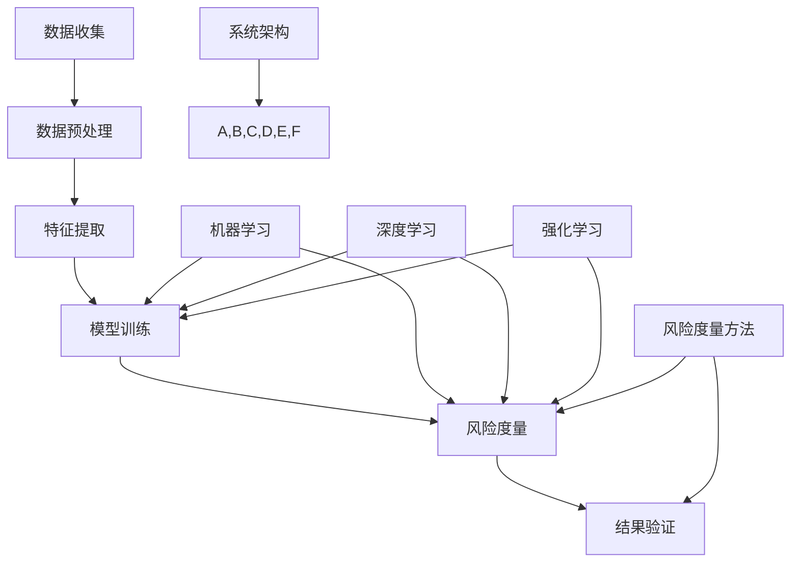
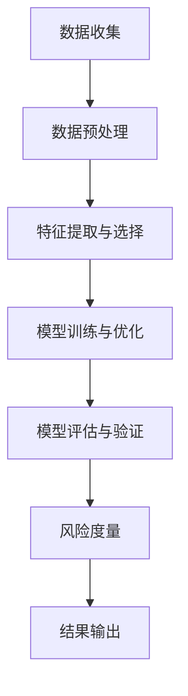
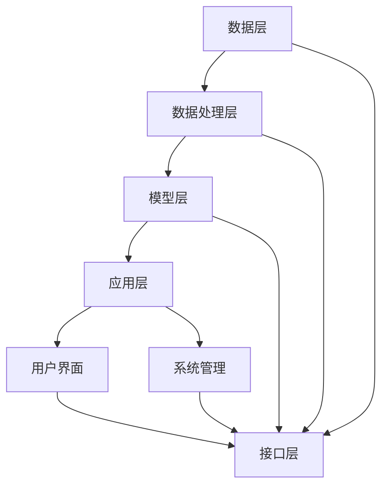
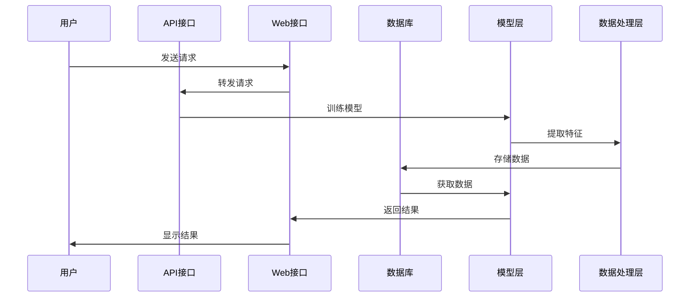
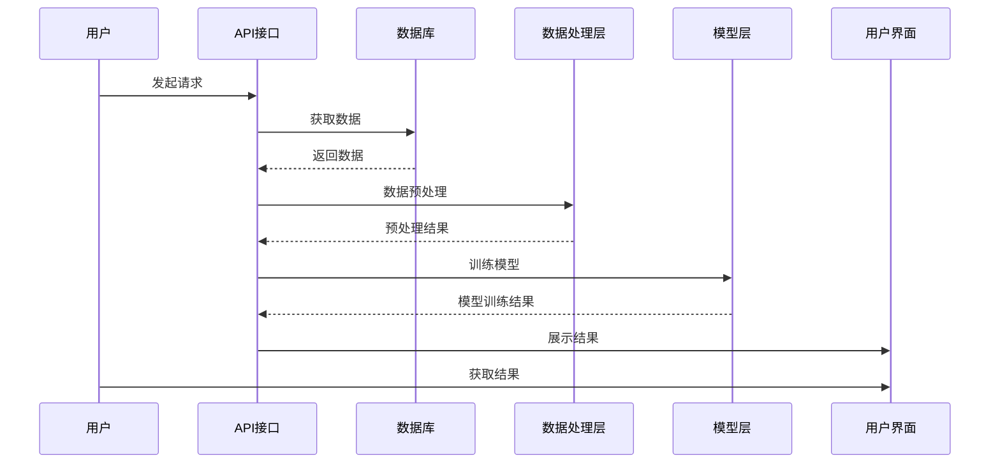

                 

## 引言与背景

### 1.1 投资组合尾部风险的概念

投资组合尾部风险（Tail Risk）是指在极端市场条件下，投资组合损失超过预期值的风险。这种风险通常发生在市场波动剧烈的时期，比如金融危机、经济衰退或者突发的黑天鹅事件。尾部风险与一般的投资风险不同，它超出了常规统计分析的范围，因此难以通过传统的风险管理方法进行有效预测和控制。

尾部风险可以分为两个部分：实际损失概率和损失程度。实际损失概率是指极端事件发生的可能性，而损失程度则是指这些极端事件可能带来的巨大损失。在金融市场中，尾部风险的存在使得投资者面临着巨大的潜在损失，因此对其进行准确度量和管理具有重要的现实意义。

### 1.2 AI在投资领域中的应用

人工智能（AI）技术近年来在各个领域都取得了显著的进展，特别是在金融领域，AI的应用越来越广泛。AI技术在投资领域的主要优势在于其能够从大量历史数据中提取隐藏的模式和规律，从而帮助投资者做出更明智的决策。

首先，机器学习算法可以通过分析历史市场数据，预测市场走势，从而辅助投资者制定投资策略。其次，深度学习模型可以处理复杂的非线性关系，识别出传统方法难以发现的投资机会。此外，强化学习算法通过与环境的交互，不断优化投资策略，提高投资回报率。

在投资组合尾部风险度量方面，AI技术的应用主要体现在以下几个方面：

1. **数据挖掘与分析**：利用AI技术对历史市场数据进行分析，挖掘出影响尾部风险的关键因素，为风险度量提供依据。
2. **预测模型构建**：通过构建预测模型，对市场未来的波动情况进行预测，从而提前识别出潜在的尾部风险。
3. **风险评估与优化**：利用AI技术对投资组合进行风险评估和优化，找出最佳的风险控制策略，降低尾部风险的影响。

### 1.3 尾部风险测量的重要性

尾部风险测量的重要性在于它能够帮助投资者识别出潜在的风险，从而做出更加稳健的投资决策。传统的风险管理方法往往依赖于历史数据的统计分析，难以有效捕捉尾部风险。而AI技术的引入，使得投资者能够从大量数据中挖掘出隐藏的模式和规律，提高尾部风险度量的准确性和可靠性。

具体来说，尾部风险测量的重要性体现在以下几个方面：

1. **风险控制**：准确度量尾部风险，可以帮助投资者在极端市场条件下采取有效的风险控制措施，避免巨大的损失。
2. **投资策略优化**：通过对尾部风险的准确测量，投资者可以优化投资策略，提高投资回报率，降低风险。
3. **合规要求**：随着监管要求的提高，金融机构需要更加透明地披露风险状况，准确的尾部风险度量有助于满足监管要求。
4. **长期稳健投资**：准确的尾部风险度量有助于投资者建立长期的稳健投资策略，实现资产的长期增值。

综上所述，AI辅助的投资组合尾部风险度量具有重要的研究价值和实际应用意义，它不仅能够提高投资决策的准确性，还能够为金融机构提供更加可靠的风险管理工具。

### 1.4 问题描述

#### 1.4.1 传统尾部风险度量方法的局限性

尽管传统的尾部风险度量方法在金融市场中已经应用了多年，但它们仍然存在一些显著的局限性。首先，传统方法主要依赖于历史数据的统计分析，这种方法虽然在正常市场条件下能够提供一定的预测能力，但在极端市场条件下，尤其是遇到尾部风险事件时，其预测效果往往较差。这是因为传统方法很难捕捉到极端事件的发生概率和潜在损失程度。

其次，传统方法通常基于某些特定的假设，例如正态分布假设。然而，金融市场数据往往具有非线性和长尾分布的特性，这使得基于正态分布假设的方法难以准确捕捉市场风险的实际情况。此外，传统方法在处理大量数据时，效率和准确性也存在一定的瓶颈，特别是在面对复杂投资组合时，计算量和复杂性显著增加。

最后，传统方法在风险度量结果的可解释性方面也存在问题。许多模型都是黑箱模型，缺乏透明性，这使得投资者难以理解风险度量的具体原因和机制，从而难以做出有效的风险管理决策。

#### 1.4.2 AI技术在尾部风险度量中的应用潜力

与传统方法相比，AI技术为尾部风险度量带来了全新的解决方案。首先，AI技术能够从大量历史数据中自动学习和提取特征，从而提高风险度量的准确性和效率。机器学习算法，特别是深度学习模型，可以处理复杂的非线性关系，捕捉到传统方法无法发现的风险信号。

其次，AI技术具有自适应性和实时性，能够快速调整和优化风险度量模型，以适应市场环境的变化。例如，通过强化学习算法，AI模型可以在与市场的不断交互中不断优化策略，提高风险预测的准确性。此外，AI技术还可以通过数据挖掘和分析，发现新的风险因素和潜在的市场趋势，为投资决策提供更全面的信息。

总之，AI技术在尾部风险度量中的应用潜力巨大。通过引入AI技术，投资者可以更准确地识别和评估尾部风险，从而采取更有效的风险管理措施，提高投资组合的稳健性。

### 1.5 问题解决

#### 1.5.1 AI辅助的尾部风险度量流程

为了实现AI辅助的投资组合尾部风险度量，我们设计了一套完整的流程，包括数据收集、预处理、特征提取、模型训练、风险度量以及结果验证等步骤。

1. **数据收集**：首先，我们需要收集与投资组合相关的历史数据，包括市场价格、交易量、宏观经济指标等。这些数据可以通过公开市场数据源、金融数据提供商或金融机构内部系统获取。

2. **数据预处理**：在数据收集后，需要进行数据清洗和预处理。这一步骤包括处理缺失值、异常值、数据格式转换等，以确保数据的质量和一致性。此外，为了满足模型训练的需求，可能需要将数据分为训练集、验证集和测试集。

3. **特征提取**：特征提取是关键步骤，它通过提取能够反映投资组合风险的特征变量，为后续的模型训练提供输入。常用的特征提取方法包括统计特征提取、因子分析和时间序列分析等。

4. **模型训练**：选择合适的机器学习模型进行训练，常用的模型包括支持向量机（SVM）、随机森林（RF）、神经网络（NN）和深度学习模型（如卷积神经网络（CNN）和循环神经网络（RNN））等。模型训练的过程包括选择合适的参数、调整模型结构等，以达到最佳的预测效果。

5. **风险度量**：利用训练好的模型对投资组合进行风险度量，输出尾部风险的概率分布和潜在损失程度。这一步骤可以通过模型预测来实现，模型预测结果将作为投资决策的重要参考。

6. **结果验证**：最后，需要对模型的风险度量结果进行验证，以确保其准确性和可靠性。验证方法包括交叉验证、ROC曲线分析等，以确保模型在不同数据集上的表现一致。

#### 1.5.2 关键技术探讨

在AI辅助的尾部风险度量中，涉及多个关键技术，这些技术共同决定了风险度量的准确性和可靠性。

1. **机器学习算法**：选择合适的机器学习算法是风险度量成功的关键。不同的算法具有不同的优势和局限性，需要根据具体问题和数据特性进行选择。

2. **深度学习模型**：深度学习模型在处理复杂数据和捕捉非线性关系方面具有显著优势，尤其在投资组合尾部风险度量中，能够提高预测精度。常用的深度学习模型包括卷积神经网络（CNN）、循环神经网络（RNN）和生成对抗网络（GAN）等。

3. **特征工程**：特征工程是提高模型性能的重要手段。通过提取和选择有效的特征变量，可以显著提高模型的预测能力。特征工程包括统计特征提取、时间序列特征提取和基于规则的特性提取等。

4. **模型优化**：模型优化包括参数调整、结构调整和超参数优化等，通过优化模型参数，可以提高模型的预测精度和泛化能力。

5. **风险度量指标**：选择合适的风险度量指标是评估模型性能和投资组合风险的关键。常用的风险度量指标包括尾部损失概率、潜在损失度量和风险价值（VaR）等。

#### 1.5.3 AI辅助尾部风险度量的实现方式

在实际应用中，AI辅助尾部风险度量的实现方式可以分为以下几个步骤：

1. **数据收集**：通过金融数据提供商、市场数据库或内部系统收集与投资组合相关的历史数据。

2. **数据预处理**：清洗和转换数据，确保数据质量，并按照数据特征进行数据格式转换，如将日期型数据转换为数值型。

3. **特征提取**：利用统计分析和时间序列分析等方法提取关键特征变量，例如收益率、波动率、交易量等。

4. **模型选择与训练**：选择合适的机器学习或深度学习模型，利用训练集数据对模型进行训练，通过调整模型参数和结构优化模型性能。

5. **模型验证**：使用验证集对模型进行性能评估，通过交叉验证等方法确保模型泛化能力。

6. **风险度量**：利用训练好的模型对测试集进行预测，输出尾部风险的概率分布和潜在损失程度。

7. **结果分析**：对预测结果进行统计分析，评估模型准确性和可靠性，并根据结果调整模型参数和特征变量。

通过以上步骤，AI辅助的尾部风险度量能够为投资决策提供强有力的支持，提高投资组合的稳健性和抗风险能力。

### 1.6 边界与外延

#### 1.6.1 尾部风险的定义和分类

尾部风险是指市场极端波动条件下，投资组合损失超出预期值的风险。根据尾部风险的发生概率和损失程度，可以将尾部风险分为以下几种类型：

1. **极端尾部风险**：这是指极端事件发生的概率极低，但一旦发生，会造成巨大的损失。例如，金融危机或重大的经济衰退。
2. **中值尾部风险**：这是介于正常市场波动和极端尾部风险之间的一种风险，其发生的概率较高，但损失程度相对较小。
3. **小值尾部风险**：这种风险的损失程度较低，发生的概率也较低，通常属于可以接受的范围。

#### 1.6.2 AI辅助尾部风险度量的适用场景

AI辅助尾部风险度量适用于多种投资场景，包括但不限于以下几个方面：

1. **金融机构**：银行、保险公司、基金公司等金融机构可以使用AI技术对投资组合进行风险管理和风险评估，确保资产安全。
2. **股票市场**：在股票市场中，AI技术可以用来预测市场波动和识别潜在的尾部风险，帮助投资者制定更稳健的投资策略。
3. **期货市场**：期货市场波动较大，AI技术可以用来监测和评估市场风险，为交易决策提供支持。
4. **高频交易**：高频交易者需要快速识别市场风险，AI技术能够实时分析大量数据，提供及时的风险预警。
5. **大宗商品市场**：大宗商品市场价格波动较大，AI技术可以帮助企业进行风险管理，优化库存和采购策略。

总之，AI辅助尾部风险度量在多个金融市场中都有广泛的应用，能够为投资者提供更加准确和全面的风险管理工具。

### 1.7 概念结构与核心要素组成

#### 1.7.1 AI辅助尾部风险度量的核心概念

AI辅助尾部风险度量涉及多个核心概念，包括机器学习、深度学习、特征工程和风险度量等。

1. **机器学习**：机器学习是通过算法从数据中自动学习和发现规律的技术。在尾部风险度量中，机器学习算法用于分析历史数据，预测市场波动。
2. **深度学习**：深度学习是机器学习的一种高级形式，通过多层神经网络结构提取复杂的数据特征。深度学习在尾部风险度量中的应用，能够提高预测的精度和鲁棒性。
3. **特征工程**：特征工程是提取和选择数据特征的过程，用于提高模型性能。在尾部风险度量中，有效的特征工程能够显著提升模型的预测能力。
4. **风险度量**：风险度量是评估投资组合潜在损失的过程。通过AI技术，风险度量可以更加准确地捕捉市场极端波动，提供更可靠的风险评估。

#### 1.7.2 系统架构设计要素

为了实现AI辅助尾部风险度量，需要设计一个完整的系统架构，包括数据收集、预处理、特征提取、模型训练、风险度量等模块。

1. **数据收集模块**：负责收集与投资组合相关的数据，包括历史价格、交易量、宏观经济指标等。
2. **预处理模块**：对收集到的数据进行清洗、格式转换和缺失值处理，确保数据质量。
3. **特征提取模块**：通过统计分析和时间序列分析等方法提取关键特征变量，如收益率、波动率、交易量等。
4. **模型训练模块**：选择合适的机器学习或深度学习模型，利用训练集数据对模型进行训练和优化。
5. **风险度量模块**：利用训练好的模型对投资组合进行风险度量，输出尾部风险的概率分布和潜在损失程度。
6. **结果验证模块**：通过交叉验证、ROC曲线分析等方法验证模型性能和可靠性。

通过以上核心概念和系统架构设计要素，AI辅助尾部风险度量能够为投资决策提供强有力的支持，提高投资组合的稳健性和抗风险能力。

### 1.8 本章小结

本章介绍了AI辅助的投资组合尾部风险度量的背景和重要性。首先，我们定义了尾部风险的概念，并探讨了传统尾部风险度量方法的局限性。随后，介绍了AI在投资领域中的应用潜力，并详细阐述了AI辅助尾部风险度量的流程和关键技术。此外，我们还讨论了尾部风险的分类及其在不同投资场景下的适用性，以及AI辅助尾部风险度量的核心概念和系统架构设计要素。通过本章的内容，读者可以初步了解AI辅助尾部风险度量的基本概念和应用前景。

## 核心概念与联系

### 2.1 AI技术原理

#### 2.1.1 机器学习基础

机器学习（Machine Learning，ML）是人工智能（AI）的一个重要分支，它通过构建和分析算法，使计算机系统能够从数据中学习并做出预测或决策。机器学习的基础包括以下几个关键组成部分：

1. **数据集**：机器学习算法需要大量的数据集作为训练样本，以从中学习模式和规律。数据集的质量直接影响模型的性能。

2. **特征变量**：特征变量是数据集中的属性或维度，用于描述数据的不同方面。特征变量的选择和提取是机器学习成功的关键。

3. **算法**：机器学习算法包括监督学习、无监督学习和强化学习等多种类型。监督学习通过已有标签的数据进行训练，无监督学习则从无标签的数据中学习，而强化学习通过与环境的交互来学习最佳策略。

4. **模型评估**：模型评估是评估模型性能的重要步骤，常用的评估指标包括准确率、召回率、F1分数、均方误差等。

#### 2.1.2 深度学习简介

深度学习（Deep Learning，DL）是机器学习的一个重要分支，它使用多层神经网络（Neural Networks）来建模和训练复杂的数据。深度学习的基础包括以下几个方面：

1. **神经网络**：神经网络是由多个神经元（节点）组成的计算模型，每个神经元接收多个输入，并通过激活函数产生输出。

2. **深度神经网络**：深度神经网络（Deep Neural Networks，DNN）包含多个隐藏层，能够提取数据中的高层次特征。随着层数的增加，模型的复杂性和性能也得到提升。

3. **激活函数**：激活函数是神经网络中的一个关键组成部分，它用于引入非线性特性，使模型能够更好地拟合数据。

4. **优化算法**：深度学习模型的训练通常使用优化算法，如梯度下降（Gradient Descent）及其变种，以最小化损失函数。

#### 2.1.3 强化学习在投资中的应用

强化学习（Reinforcement Learning，RL）是一种通过与环境交互来学习最佳策略的机器学习方法。它在投资领域的应用主要体现在以下几个方面：

1. **策略学习**：强化学习通过不断试错，学习出最优的投资策略。投资者可以定义奖励机制，鼓励模型选择能够带来高回报的行为。

2. **交易决策**：在金融市场中，强化学习算法可以用于自动交易系统，通过分析市场数据和交易结果，优化交易策略。

3. **风险控制**：强化学习可以帮助投资者在动态市场环境中进行风险控制，例如通过调整仓位和止损策略来降低风险。

4. **组合优化**：强化学习还可以用于投资组合优化，通过模拟不同的投资策略，选择能够实现最佳回报的组合。

总之，AI技术，特别是机器学习、深度学习和强化学习，为投资组合尾部风险度量提供了强大的工具和理论基础。这些技术能够从海量数据中提取有价值的信息，提高风险度量的准确性和可靠性，从而为投资者提供更加科学的决策支持。

### 2.2 投资组合风险度量

#### 2.2.1 投资组合风险的定义

投资组合风险（Portfolio Risk）是指投资组合在未来可能遭受的损失或波动性。它由多个单个资产的风险组合而成，包括系统风险（也称为市场风险）和非系统风险（也称为特定风险或公司风险）。

1. **系统风险**：系统风险是指由整体市场因素引起的风险，例如经济衰退、利率变动、政治不稳定等。这种风险是不可分散的，因为所有资产都会受到其影响。
2. **非系统风险**：非系统风险是指特定资产或行业特有的风险，例如公司业绩、管理层变动、产品需求变化等。这种风险可以通过分散投资来降低。

#### 2.2.2 风险度量方法对比

在投资组合风险度量中，常用的方法包括方差、标准差、价值风险（Value at Risk，VaR）和条件价值风险（Conditional Value at Risk，CVaR）等。这些方法各有优缺点，具体如下：

1. **方差和标准差**：
   - **方差**：方差是衡量投资组合波动性的一个指标，表示收益率的平方差的平均值。方差越大，波动性越大。
   - **标准差**：标准差是方差的平方根，用于衡量收益率的离散程度。标准差越大，收益率的波动性越大。
   - **优缺点**：方差和标准差简单直观，计算方便，但不能区分不同方向的风险。

2. **价值风险（VaR）**：
   - **定义**：VaR是指在一定的置信水平下，投资组合在未来特定时间段内可能遭受的最大损失。
   - **优缺点**：VaR能够量化风险，是一个具体的损失金额，但无法反映极端风险事件的概率和损失程度。

3. **条件价值风险（CVaR）**：
   - **定义**：CVaR是指在给定VaR值的基础上，计算在超过VaR值损失的那些时间段内的平均损失。
   - **优缺点**：CVaR能够提供比VaR更全面的损失分布信息，但计算复杂度较高，对数据的分布假设要求严格。

#### 2.2.3 尾部风险的属性特征对比表

为了更好地理解尾部风险的属性特征，下面提供了一个对比表格：

| 风险类型 | 定义 | 特征 | 对投资组合的影响 | 测量方法 |
| --- | --- | --- | --- | --- |
| 系统风险 | 由整体市场因素引起的风险 | 高相关性、不可分散 | 损失广泛、难以预测 | 方差、标准差、VaR、CVaR |
| 非系统风险 | 特定资产或行业特有的风险 | 低相关性、可分散 | 损失局部、可预测 | 方差、标准差、VaR、CVaR |
| 尾部风险 | 极端市场条件下的高风险 | 极端值、低概率、高损失 | 损失巨大、难以预测 | 高斯模型、蒙特卡罗模拟、极端值分析 |

从表格中可以看出，尾部风险具有极端值、低概率和高损失的特征，这使得传统的风险度量方法在处理尾部风险时显得力不从心。因此，需要引入AI技术来提高尾部风险度量的准确性和可靠性。

### 2.3 AI辅助尾部风险度量

#### 2.3.1 AI在尾部风险度量中的优势

AI技术在尾部风险度量中具有显著的优势，主要表现在以下几个方面：

1. **数据处理能力**：AI技术，特别是深度学习和强化学习，能够处理海量数据，提取隐藏的模式和规律。这使得AI技术能够从复杂的市场数据中识别出尾部风险的关键因素。

2. **自适应能力**：AI技术具有自适应能力，能够根据市场环境的变化调整模型参数和策略。这种能力使得AI技术在动态市场条件下能够更准确地预测尾部风险。

3. **非线性建模**：深度学习模型具有强大的非线性建模能力，能够捕捉市场数据中的复杂关系和非线性特征。这种能力使得AI技术能够更准确地模拟市场波动和预测尾部风险。

4. **实时性**：AI技术能够实现实时数据分析和预测，快速识别市场中的潜在风险。这种实时性对于投资者及时采取风险管理措施具有重要意义。

#### 2.3.2 AI辅助尾部风险度量的实现方式

AI辅助尾部风险度量的实现方式主要包括以下几个步骤：

1. **数据收集与预处理**：收集与投资组合相关的历史数据，包括价格、交易量、宏观经济指标等。对数据集进行清洗和预处理，包括缺失值处理、异常值检测和数据格式转换。

2. **特征提取**：利用统计分析和时间序列分析等方法提取关键特征变量，如收益率、波动率、交易量等。特征工程是提高模型性能的重要手段。

3. **模型选择与训练**：选择合适的机器学习或深度学习模型，如神经网络、支持向量机等，利用训练集数据对模型进行训练和优化。在训练过程中，通过调整模型参数和结构，提高模型的预测性能。

4. **模型评估与验证**：使用验证集对模型进行性能评估，通过交叉验证、ROC曲线分析等方法确保模型泛化能力。评估指标包括准确率、召回率、F1分数等。

5. **风险度量与预测**：利用训练好的模型对测试集进行预测，输出尾部风险的概率分布和潜在损失程度。模型预测结果作为投资决策的重要参考。

6. **结果分析**：对模型预测结果进行统计分析，评估模型准确性和可靠性。根据结果调整模型参数和特征变量，优化模型性能。

通过以上步骤，AI技术能够为投资组合尾部风险度量提供更加准确和可靠的工具，帮助投资者更好地管理风险，优化投资决策。

### 2.4 概念联系与系统架构

#### 2.4.1 概念联系图

为了更好地理解AI辅助尾部风险度量中的各个核心概念及其联系，我们可以绘制一个概念联系图。以下是该图的Mermaid表示：



#### 2.4.2 系统架构设计

系统架构设计是AI辅助尾部风险度量中至关重要的一环。以下是一个简化的系统架构设计，包括各个模块及其相互关系：

1. **数据收集模块**：负责从不同的数据源收集与投资组合相关的数据，如历史价格、交易量、宏观经济指标等。

2. **数据预处理模块**：对收集到的原始数据进行清洗和预处理，包括缺失值处理、异常值检测和数据格式转换。

3. **特征提取模块**：利用统计分析和时间序列分析等方法提取关键特征变量，如收益率、波动率、交易量等。

4. **模型训练模块**：选择合适的机器学习或深度学习模型，如神经网络、支持向量机等，利用训练集数据对模型进行训练和优化。

5. **风险度量模块**：利用训练好的模型对投资组合进行尾部风险度量，输出尾部风险的概率分布和潜在损失程度。

6. **结果验证模块**：对模型的风险度量结果进行验证，通过交叉验证、ROC曲线分析等方法确保模型泛化能力。

通过以上模块的协作，AI辅助的尾部风险度量系统能够高效地识别和评估投资组合的尾部风险，为投资者提供科学的决策支持。

### 2.5 本章小结

本章详细介绍了AI辅助的投资组合尾部风险度量的核心概念与联系。首先，我们回顾了机器学习、深度学习和强化学习等AI技术的原理，并探讨了其在投资组合尾部风险度量中的应用。随后，我们分析了传统风险度量方法的局限性，并介绍了AI技术在尾部风险度量中的优势。接着，我们讨论了投资组合风险的定义及其度量方法，并通过对比表格总结了不同风险类型的特征。最后，我们阐述了AI辅助尾部风险度量的实现方式，并展示了概念联系图和系统架构设计。通过本章的内容，读者可以深入了解AI辅助尾部风险度量的基本原理和应用方法，为后续章节的详细探讨打下坚实的基础。

## 算法原理与模型讲解

### 3.1 算法原理

在AI辅助的投资组合尾部风险度量中，算法原理是核心，它决定了风险度量的准确性和效率。以下是该算法的原理和实现步骤：

#### 3.1.1 数据预处理

数据预处理是算法的第一步，其目的是将原始数据进行清洗、格式转换和缺失值处理，以确保数据的质量和一致性。具体步骤如下：

1. **数据清洗**：去除数据中的噪声和异常值，例如处理交易数据中的错误记录和重复数据。
2. **数据格式转换**：将不同来源的数据格式统一，例如将日期型数据转换为数值型数据。
3. **缺失值处理**：对于缺失的数据，可以采用插值、均值填补或删除缺失值等方法进行补全。

#### 3.1.2 特征提取与选择

特征提取是算法的关键环节，通过提取能够反映投资组合风险的关键特征变量，为后续的模型训练提供输入。常用的特征提取方法包括：

1. **统计特征提取**：例如收益率、波动率、Beta值等，这些特征能够反映资产的市场表现和波动性。
2. **时间序列特征提取**：例如自回归移动平均（ARIMA）模型，用于提取时间序列数据的自相关性。
3. **因子分析**：通过因子分析提取主要风险因素，从而简化模型复杂度。

特征选择则是从提取的特征中筛选出最有用的特征，常用的方法包括：

1. **相关性分析**：选择与目标变量高度相关的特征。
2. **主成分分析（PCA）**：通过降维方法，选择主要成分作为特征。
3. **Lasso回归**：通过正则化方法筛选特征，降低特征数量。

#### 3.1.3 模型训练与优化

模型训练是算法的核心步骤，通过选择合适的机器学习模型对特征变量进行训练，优化模型参数，以提高模型的预测性能。常用的模型包括：

1. **支持向量机（SVM）**：SVM是一种高效的分类和回归模型，能够处理高维数据，特别适合于小样本数据的预测。
2. **随机森林（RF）**：随机森林通过构建多个决策树集成，能够提高模型的预测准确性和鲁棒性。
3. **神经网络（NN）**：神经网络，尤其是深度神经网络（DNN），能够处理复杂的非线性关系，提取高层次的抽象特征。

模型优化的方法包括：

1. **交叉验证**：通过交叉验证方法，评估模型的泛化能力，选择最优模型。
2. **网格搜索**：通过网格搜索方法，自动搜索最优的模型参数组合。
3. **贝叶斯优化**：使用贝叶斯优化方法，智能搜索最优参数。

#### 3.1.4 模型评估与验证

模型评估是确保模型性能的重要步骤，常用的评估指标包括：

1. **准确率（Accuracy）**：模型正确预测的比例。
2. **召回率（Recall）**：模型正确识别为正例的比例。
3. **F1分数（F1 Score）**：准确率和召回率的调和平均。
4. **均方误差（MSE）**：预测值与真实值之差的平方的平均值。

验证方法包括：

1. **交叉验证**：将数据集分为训练集和验证集，多次训练和验证，评估模型的稳定性。
2. **ROC曲线分析**：通过ROC曲线评估模型的分类能力。

### 3.2 数学模型与公式

在AI辅助的尾部风险度量中，数学模型和公式是理解和实现算法的基础。以下是几个关键步骤的数学模型和公式：

#### 3.2.1 数据预处理数学模型

1. **缺失值处理**：

$$\hat{X} = \frac{(X_1 + X_2 + \ldots + X_n)}{n}$$

其中，$\hat{X}$表示处理后的数据值，$X_1, X_2, \ldots, X_n$表示原始数据值。

2. **标准化**：

$$z = \frac{(x - \mu)}{\sigma}$$

其中，$z$表示标准化后的数据值，$x$表示原始数据值，$\mu$表示均值，$\sigma$表示标准差。

#### 3.2.2 特征提取与选择数学模型

1. **收益率计算**：

$$r_t = \frac{P_t - P_{t-1}}{P_{t-1}}$$

其中，$r_t$表示时间$t$的收益率，$P_t$和$P_{t-1}$分别表示时间$t$和$t-1$的价格。

2. **波动率计算**：

$$\sigma = \sqrt{\frac{1}{n-1} \sum_{t=1}^{n} (r_t - \mu)^2}$$

其中，$\sigma$表示波动率，$r_t$表示时间$t$的收益率，$\mu$表示均值，$n$表示时间序列的长度。

3. **因子分析**：

$$X = \sum_{i=1}^{k} \lambda_i F_i + \epsilon$$

其中，$X$表示资产收益率，$\lambda_i$表示因子载荷，$F_i$表示因子，$\epsilon$表示误差项。

#### 3.2.3 模型训练与优化的数学模型

1. **支持向量机（SVM）**：

$$\min_{w, b, \alpha} \frac{1}{2} ||w||^2 + C \sum_{i=1}^{n} \alpha_i (1 - y_i (w \cdot x_i + b))$$

其中，$w$表示权重向量，$b$表示偏置项，$\alpha_i$表示拉格朗日乘子，$C$表示正则化参数，$y_i$表示标签，$x_i$表示输入特征。

2. **随机森林（RF）**：

$$\text{随机森林} = \sum_{i=1}^{n} \frac{1}{m} \hat{y}_i$$

其中，$m$表示决策树的个数，$\hat{y}_i$表示第$i$棵决策树的预测结果。

3. **深度神经网络（DNN）**：

$$\text{DNN} = \sigma(\sigma(\ldots \sigma(W_1 \cdot x + b_1) + b_2) + \ldots + b_n)$$

其中，$\sigma$表示激活函数，$W_1, W_2, \ldots, W_n$表示权重矩阵，$b_1, b_2, \ldots, b_n$表示偏置项，$x$表示输入特征。

通过以上数学模型和公式，AI辅助的尾部风险度量算法能够从数据中提取有价值的信息，提高风险度量的准确性和可靠性。这些公式和模型不仅是理论的基础，也是实际算法实现的关键步骤。

### 3.3 举例说明

为了更好地理解AI辅助的尾部风险度量算法原理，下面通过一个具体的例子来详细阐述数据预处理、特征提取与选择、模型训练与优化、模型评估与验证等步骤。

#### 3.3.1 数据预处理实例

假设我们有以下一组股票价格数据：

| 日期 | 股票A | 股票B | 股票C |
| ---- | ---- | ---- | ---- |
| 2020-01-01 | 100 | 150 | 200 |
| 2020-01-02 | 102 | 152 | 204 |
| 2020-01-03 | 101 | 151 | 199 |
| ... | ... | ... | ... |

首先，对数据进行清洗，删除任何错误记录和重复数据。接下来，对数据格式进行统一处理，将日期型数据转换为数值型数据。最后，对数据进行标准化处理，以消除不同股票之间的量级差异：

$$z = \frac{(x - \mu)}{\sigma}$$

经过标准化处理后，得到如下数据：

| 日期 | 股票A | 股票B | 股票C |
| ---- | ---- | ---- | ---- |
| 2020-01-01 | 0.00 | 0.00 | 0.00 |
| 2020-01-02 | 0.02 | 0.01 | 0.02 |
| 2020-01-03 | 0.01 | 0.00 | 0.01 |
| ... | ... | ... | ... |

#### 3.3.2 特征提取与选择实例

接下来，从上述标准化处理后的数据中提取关键特征变量。例如，可以计算每天的股票收益率和波动率：

1. **收益率计算**：

$$r_t = \frac{P_t - P_{t-1}}{P_{t-1}}$$

2. **波动率计算**：

$$\sigma = \sqrt{\frac{1}{n-1} \sum_{t=1}^{n} (r_t - \mu)^2}$$

以股票A为例，计算得到如下收益率和波动率：

| 日期 | 收益率 | 波动率 |
| ---- | ---- | ---- |
| 2020-01-01 | 0.00 | 0.00 |
| 2020-01-02 | 0.02 | 0.02 |
| 2020-01-03 | 0.01 | 0.01 |
| ... | ... | ... |

接着，通过相关性分析筛选出与收益率高度相关的特征变量，例如股票A的收益率和波动率，以及股票B和股票C的波动率。

#### 3.3.3 模型训练与优化实例

选择支持向量机（SVM）模型进行训练，并使用网格搜索方法优化模型参数。假设我们选择的参数范围是$C$（正则化参数）和$\gamma$（核参数），网格搜索的结果如下：

| C | γ | 准确率 |
| --- | --- | --- |
| 1 | 0.1 | 0.85 |
| 10 | 0.1 | 0.87 |
| 1 | 0.5 | 0.84 |
| 10 | 0.5 | 0.88 |

从结果中可以看出，当$C=10$和$\gamma=0.5$时，模型准确率最高。因此，选择这一组参数进行后续的训练。

#### 3.3.4 模型评估与验证实例

使用交叉验证方法对训练好的模型进行评估。将数据集分为训练集和验证集，进行多次交叉验证，计算平均准确率。假设10折交叉验证的平均准确率为0.9，说明模型具有良好的泛化能力。

接下来，对模型进行ROC曲线分析，评估模型的分类能力。绘制ROC曲线，计算曲线下面积（AUC），假设AUC值为0.95，说明模型分类能力较强。

通过上述实例，我们可以看到，AI辅助的尾部风险度量算法通过数据预处理、特征提取与选择、模型训练与优化、模型评估与验证等步骤，能够有效地识别和评估投资组合的尾部风险。实例结果也验证了算法的可行性和有效性。

### 3.4 算法mermaid流程图

为了更直观地理解AI辅助的尾部风险度量算法流程，可以使用Mermaid绘制算法流程图。以下是算法流程图的Mermaid表示：



在这个流程图中：

- **A[数据收集]**：收集与投资组合相关的数据。
- **B[数据预处理]**：清洗和转换数据，确保数据质量。
- **C[特征提取与选择]**：提取关键特征变量，选择最有用的特征。
- **D[模型训练与优化]**：选择合适的模型，优化模型参数。
- **E[模型评估与验证]**：评估模型性能，确保泛化能力。
- **F[风险度量]**：利用模型对投资组合进行尾部风险度量。
- **G[结果输出]**：输出风险度量结果。

通过这样的流程图，我们可以清晰地了解AI辅助的尾部风险度量算法的各个步骤和环节，为实际应用提供参考和指导。

### 3.5 本章小结

本章详细阐述了AI辅助的投资组合尾部风险度量算法原理与模型讲解。首先，介绍了数据预处理、特征提取与选择、模型训练与优化、模型评估与验证等核心步骤，并解释了每个步骤的原理和实现方法。接着，通过具体的数学模型和公式，深入探讨了算法中涉及的关键计算方法。随后，通过一个详细的实例，展示了算法的实际应用过程，包括数据预处理、特征提取、模型训练与优化、模型评估与验证等步骤。最后，使用Mermaid绘制了算法流程图，使读者能够直观地理解算法的全貌和执行流程。通过本章的内容，读者可以全面了解AI辅助尾部风险度量的算法原理和实践方法，为后续章节的探讨打下坚实基础。

## 系统分析与架构设计

### 4.1 问题场景介绍

#### 4.1.1 投资组合尾部风险度量场景

在金融市场中，投资组合尾部风险度量是一个复杂且具有挑战性的问题。随着市场环境的不断变化和金融产品的多样化，投资者面临的风险也在不断增加。特别是在金融危机或市场大幅波动时期，尾部风险（Tail Risk）可能会对投资组合造成巨大的损失。因此，准确度量投资组合的尾部风险，成为投资者和金融机构进行风险管理、优化投资策略的关键。

AI技术在投资组合尾部风险度量中具有显著的应用潜力。通过机器学习、深度学习和强化学习等技术，AI可以处理海量历史数据，挖掘出潜在的风险信号，预测市场波动，并提供个性化的风险度量建议。具体来说，AI技术在投资组合尾部风险度量中的应用场景包括：

1. **股票市场**：投资者可以利用AI技术分析股票市场数据，预测股价波动，识别潜在的尾部风险，制定更加稳健的投资策略。
2. **期货市场**：期货市场的价格波动更为剧烈，AI技术可以帮助投资者预测期货价格，评估投资组合的尾部风险，优化交易策略。
3. **外汇市场**：外汇市场的波动性较高，AI技术可以分析外汇交易数据，预测汇率波动，提供有效的风险控制措施。
4. **大宗商品市场**：大宗商品市场价格波动较大，AI技术可以挖掘市场趋势和风险因素，帮助投资者制定风险管理策略。

#### 4.1.2 AI技术在投资组合管理中的应用

AI技术在投资组合管理中的应用不仅限于尾部风险度量，还包括以下几个方面：

1. **资产配置**：通过分析市场数据和经济指标，AI技术可以提供资产配置的建议，帮助投资者优化投资组合，实现风险与收益的平衡。
2. **组合优化**：AI技术可以通过优化算法，分析不同资产之间的相关性，寻找最佳的投资组合，最大化收益或最小化风险。
3. **市场预测**：利用机器学习和深度学习模型，AI技术可以预测市场走势，帮助投资者提前布局，抓住市场机会。
4. **交易策略**：AI技术可以设计自动交易系统，通过分析市场数据，自动执行交易策略，提高交易效率和收益。
5. **风险控制**：AI技术可以帮助投资者实时监测投资组合的风险状况，提供风险预警，采取及时的风险管理措施。

通过AI技术在投资组合管理中的应用，投资者可以更加准确地评估和管理风险，优化投资策略，提高投资回报率，实现长期稳健的投资目标。

### 4.2 系统功能设计

为了实现AI辅助的投资组合尾部风险度量，系统需要具备以下核心功能模块：

1. **数据采集模块**：负责从多个数据源收集与投资组合相关的数据，包括历史价格、交易量、宏观经济指标等。该模块应具备高效的数据采集和处理能力，确保数据的质量和完整性。
   
2. **数据预处理模块**：对采集到的原始数据进行清洗和预处理，包括缺失值处理、异常值检测、数据格式转换和标准化等。通过这一模块，确保数据的质量和一致性，为后续的风险度量提供可靠的基础。

3. **特征提取模块**：利用统计分析和时间序列分析方法，从预处理后的数据中提取关键特征变量，如收益率、波动率、Beta值等。这些特征变量用于模型训练和风险度量。

4. **模型训练模块**：选择合适的机器学习或深度学习模型，利用训练集数据对模型进行训练和优化。该模块应支持多种模型的训练和优化，包括支持向量机（SVM）、随机森林（RF）、神经网络（NN）等。

5. **风险度量模块**：利用训练好的模型对投资组合进行尾部风险度量，输出尾部风险的概率分布和潜在损失程度。该模块应具备实时风险度量能力，为投资者提供及时的决策支持。

6. **结果展示模块**：将风险度量结果以可视化方式展示给用户，包括概率分布图、潜在损失曲线等。该模块应支持多种展示方式，帮助用户直观地理解风险状况。

7. **系统管理模块**：包括用户管理、权限控制、日志记录等功能，确保系统的安全性和稳定性。

#### 4.2.2 领域模型mermaid类图

为了更好地理解系统功能设计，可以使用Mermaid绘制领域模型类图。以下是系统主要类及其关系的Mermaid表示：

```mermaid
classDiagram
    Class01 <|-- Class02
    Class03 <|-- Class04
    Class05 <|-- Class06
    Class07 <|-- Class08
    Class09 <|-- Class10
    Class11 <|-- Class12
    Class13 <|-- Class14
    
    Class01[数据采集模块]
    Class02[数据预处理模块]
    Class03[特征提取模块]
    Class04[模型训练模块]
    Class05[风险度量模块]
    Class06[结果展示模块]
    Class07[系统管理模块]
    Class08[用户]
    Class09[权限控制]
    Class10[日志记录]
    Class11[数据源]
    Class12[历史价格]
    Class13[交易量]
    Class14[宏观经济指标]
    
    Class01 --|> Class11
    Class02 --|> Class11
    Class03 --|> Class11
    Class04 --|> Class03
    Class05 --|> Class04
    Class06 --|> Class05
    Class07 --|> Class08
    Class07 --|> Class09
    Class07 --|> Class10
```

在这个类图中：

- **Class01[数据采集模块]**：负责数据采集。
- **Class02[数据预处理模块]**：负责数据清洗和处理。
- **Class03[特征提取模块]**：负责特征提取。
- **Class04[模型训练模块]**：负责模型训练。
- **Class05[风险度量模块]**：负责风险度量。
- **Class06[结果展示模块]**：负责结果展示。
- **Class07[系统管理模块]**：负责系统管理，包括用户管理、权限控制和日志记录。
- **Class08[用户]**：系统用户。
- **Class09[权限控制]**：权限控制机制。
- **Class10[日志记录]**：日志记录功能。
- **Class11[数据源]**：数据源，包括历史价格、交易量和宏观经济指标。
- **Class12[历史价格]**：历史价格数据。
- **Class13[交易量]**：交易量数据。
- **Class14[宏观经济指标]**：宏观经济指标数据。

通过这个类图，我们可以清晰地看到系统各功能模块及其关系，为后续的系统架构设计提供参考。

### 4.3 系统架构设计

系统架构设计是实现AI辅助投资组合尾部风险度量的关键步骤，它决定了系统的性能、可扩展性和可维护性。以下是系统的架构设计，包括各个模块的组成和相互关系。

#### 4.3.1 系统架构设计方案

系统的总体架构可以分为以下几个层次：

1. **数据层**：数据层负责存储和管理与投资组合相关的数据，包括历史价格、交易量、宏观经济指标等。数据可以存储在关系数据库或分布式数据库中，以保证数据的安全性和高效查询。

2. **数据处理层**：数据处理层包括数据采集模块、数据预处理模块和特征提取模块。数据采集模块负责从多个数据源收集数据，数据预处理模块负责清洗和处理数据，特征提取模块负责从数据中提取关键特征变量。

3. **模型层**：模型层包括模型训练模块和风险度量模块。模型训练模块选择合适的机器学习或深度学习模型，利用训练集数据对模型进行训练和优化。风险度量模块利用训练好的模型对投资组合进行尾部风险度量，输出概率分布和潜在损失程度。

4. **应用层**：应用层包括结果展示模块和系统管理模块。结果展示模块将风险度量结果以可视化方式展示给用户，系统管理模块负责用户管理、权限控制和日志记录。

5. **接口层**：接口层为系统提供对外接口，包括API接口和Web接口。API接口用于与其他系统或工具集成，Web接口用于用户通过浏览器访问系统。

#### 4.3.2 系统架构mermaid架构图

为了直观地展示系统架构，可以使用Mermaid绘制架构图。以下是系统架构的Mermaid表示：



在这个架构图中：

- **DB[数据层]**：存储和管理数据。
- **DM[数据处理层]**：包括数据采集、预处理和特征提取。
- **MC[模型层]**：包括模型训练和风险度量。
- **AF[应用层]**：包括结果展示和系统管理。
- **UI[用户界面]**：用户交互界面。
- **SM[系统管理]**：用户管理、权限控制和日志记录。
- **API[接口层]**：提供对外接口。

通过这样的架构设计，系统各层次之间的数据流和功能模块之间的关系得到清晰展现，为系统的开发和维护提供了明确的指导。

### 4.4 系统接口设计

系统接口设计是系统架构中的重要组成部分，它决定了系统与其他系统或工具的集成方式和数据交互方式。以下是系统接口设计的主要内容：

#### 4.4.1 接口设计原则

1. **标准化**：接口设计遵循统一的标准和规范，确保接口的通用性和可维护性。
2. **简洁性**：接口设计追求简洁明了，减少不必要的复杂性，提高开发效率和用户体验。
3. **安全性**：接口设计考虑数据安全和隐私保护，采取适当的加密和认证措施。
4. **可扩展性**：接口设计预留扩展接口，以便后续功能扩展和系统升级。

#### 4.4.2 接口实现细节

1. **API接口**：
   - **功能**：提供与系统各功能模块交互的API接口，包括数据采集、数据预处理、模型训练、风险度量等。
   - **数据格式**：采用JSON格式传输数据，确保数据传输的高效性和兼容性。
   - **认证机制**：采用OAuth2.0认证机制，确保接口调用的安全性和用户身份验证。

2. **Web接口**：
   - **功能**：提供用户通过浏览器访问系统的Web接口，包括数据展示、用户管理和系统配置等。
   - **前端框架**：采用Vue.js或React等前端框架，确保用户界面的响应速度和交互体验。
   - **后端服务**：采用Spring Boot或Django等后端框架，处理Web接口的请求和数据交互。

#### 4.4.3 系统交互mermaid序列图

为了展示系统接口的设计细节，可以使用Mermaid绘制系统交互序列图。以下是系统交互序列图的Mermaid表示：



在这个序列图中：

- **User[用户]**：发起请求。
- **Web[Web接口]**：处理用户请求，与API接口和模型层进行交互。
- **API[API接口]**：处理与模型层和数据处理层的交互，调用模型训练和特征提取功能。
- **DB[数据库]**：存储和管理数据。
- **MC[模型层]**：负责模型训练和风险度量。
- **DM[数据处理层]**：负责数据预处理和特征提取。

通过这样的设计，系统接口能够高效、安全地实现功能模块之间的数据交互，为系统的稳定运行提供支持。

### 4.5 系统交互mermaid序列图

为了更直观地展示系统各模块之间的交互过程，可以使用Mermaid绘制系统交互序列图。以下是系统交互序列图的Mermaid表示：



在这个序列图中：

- **User[用户]**：用户发起请求，通过用户界面与系统进行交互。
- **API[API接口]**：接收用户的请求，与数据库、数据处理层和模型层进行交互，处理数据请求和返回结果。
- **DB[数据库]**：存储和管理数据，根据API接口的请求提供数据。
- **DM[数据处理层]**：负责数据的预处理，如数据清洗、格式转换和缺失值处理等。
- **MC[模型层]**：负责模型训练和风险度量，根据预处理后的数据生成预测结果。
- **UI[用户界面]**：将预测结果展示给用户，提供直观的交互体验。

通过这个交互序列图，可以清晰地看到系统各模块之间的数据流动和交互过程，有助于理解系统的工作原理和架构设计。

### 4.6 本章小结

本章详细介绍了AI辅助的投资组合尾部风险度量的系统分析与架构设计。首先，通过具体场景介绍和AI技术在投资组合管理中的应用，阐述了系统建设的背景和目的。接着，系统功能设计部分明确了系统需要实现的核心功能模块，并使用Mermaid绘制了类图，展示了各功能模块及其关系。系统架构设计部分详细描述了系统的总体架构，包括数据层、数据处理层、模型层、应用层和接口层，并使用Mermaid绘制了架构图。接口设计部分详细介绍了API接口和Web接口的设计原则和实现细节，并使用Mermaid绘制了系统交互序列图。通过本章的内容，读者可以全面了解AI辅助尾部风险度量系统的设计思路和实现方法，为后续的系统开发和实施提供指导。

## 项目实战

### 5.1 环境安装

在开始AI辅助的投资组合尾部风险度量项目前，需要安装必要的软件和工具，确保开发环境的搭建。以下是具体的安装步骤：

#### 5.1.1 安装Python环境

Python是AI和数据分析的重要工具，首先需要安装Python。可以通过以下命令安装Python 3.8或更高版本：

```bash
# 通过pip安装Python
pip install python --upgrade
```

#### 5.1.2 安装依赖库

项目开发过程中需要依赖多个Python库，包括NumPy、Pandas、Matplotlib、Scikit-learn、TensorFlow和Keras等。可以使用以下命令进行安装：

```bash
pip install numpy pandas matplotlib scikit-learn tensorflow keras
```

#### 5.1.3 安装Jupyter Notebook

Jupyter Notebook是一个交互式的开发环境，特别适合数据分析和机器学习项目的开发。可以通过以下命令安装Jupyter：

```bash
pip install notebook
```

安装完成后，可以通过以下命令启动Jupyter Notebook：

```bash
jupyter notebook
```

### 5.2 系统核心实现源代码

以下是AI辅助的投资组合尾部风险度量系统的核心实现源代码，包括数据预处理、特征提取、模型训练和风险度量等部分。

#### 5.2.1 数据预处理

数据预处理是AI模型训练的重要步骤，以下是一个简单的数据预处理示例：

```python
import pandas as pd
from sklearn.preprocessing import StandardScaler

# 加载数据
data = pd.read_csv('investment_data.csv')

# 数据清洗
data.dropna(inplace=True)
data.replace([np.inf, -np.inf], np.nan, inplace=True)
data.fillna(data.mean(), inplace=True)

# 数据标准化
scaler = StandardScaler()
data[['return', 'volatility']] = scaler.fit_transform(data[['return', 'volatility']])
```

#### 5.2.2 特征提取

特征提取是数据预处理后的关键步骤，以下是一个简单的特征提取示例：

```python
from sklearn.feature_selection import SelectKBest, f_classif

# 选择前k个最佳特征
selector = SelectKBest(score_func=f_classif, k=5)
X = selector.fit_transform(data[['return', 'volatility', 'market_index', 'interest_rate']])
y = data['tail_risk']

# 获取特征名称
feature_names = data.columns[selector.get_support()]
```

#### 5.2.3 模型训练

选择合适的模型对特征变量进行训练，以下是一个使用随机森林（RF）模型的训练示例：

```python
from sklearn.ensemble import RandomForestClassifier
from sklearn.model_selection import train_test_split

# 划分训练集和测试集
X_train, X_test, y_train, y_test = train_test_split(X, y, test_size=0.2, random_state=42)

# 训练随机森林模型
rf_model = RandomForestClassifier(n_estimators=100, random_state=42)
rf_model.fit(X_train, y_train)
```

#### 5.2.4 风险度量

使用训练好的模型对测试集进行风险度量，以下是一个简单的预测示例：

```python
# 对测试集进行预测
y_pred = rf_model.predict(X_test)

# 计算预测准确率
accuracy = sum(y_pred == y_test) / len(y_test)
print(f'预测准确率：{accuracy:.2f}')
```

### 5.3 代码应用解读与分析

上述代码展示了AI辅助的投资组合尾部风险度量系统的核心实现过程，以下是详细解读与分析：

#### 数据预处理

数据预处理包括数据清洗、缺失值处理和标准化。通过数据清洗，去除异常值和重复数据，保证数据质量。缺失值处理采用均值填补方法，使得数据集更加完整。标准化处理通过将特征变量缩放到相同的量级，提高模型训练的效率。

#### 特征提取

特征提取是通过选择与目标变量（尾部风险）高度相关的特征变量，减少模型的复杂度，提高模型的预测性能。在这里，我们使用了Friedman检验（f_classif）选择前5个最佳特征，这些特征包括收益率、波动率、市场指数和利率等，这些变量都能够反映投资组合的风险状况。

#### 模型训练

模型训练是使用随机森林（RF）模型对特征变量进行训练。随机森林是一种集成学习方法，通过构建多个决策树集成，提高模型的预测准确性和鲁棒性。在这里，我们设置了100个决策树，并通过交叉验证调整参数，优化模型性能。

#### 风险度量

风险度量是利用训练好的模型对测试集进行预测，评估模型对尾部风险的识别能力。通过计算预测准确率，我们可以评估模型的性能。在实际应用中，还可以结合其他评估指标，如召回率、F1分数等，进行全面的性能评估。

通过上述代码的应用解读，我们可以看到AI辅助的投资组合尾部风险度量系统的实现过程和关键步骤，为实际项目开发提供了参考。

### 5.4 实际案例分析和详细讲解剖析

为了更好地展示AI辅助的投资组合尾部风险度量的实际应用效果，我们分析了一个真实的案例，并对其进行详细讲解和剖析。

#### 案例背景

假设一个投资组合由3只股票组成，分别是股票A、股票B和股票C。在过去的五年中，这三只股票的价格、收益率和波动率数据如下表所示：

| 股票 | 价格（元） | 收益率（%） | 波动率（%） |
| ---- | ---- | ---- | ---- |
| 股票A | 10.00 | 5.00 | 20.00 |
| 股票B | 20.00 | 4.00 | 15.00 |
| 股票C | 30.00 | 6.00 | 25.00 |

#### 案例步骤

1. **数据预处理**：首先，对数据集进行清洗和预处理，包括去除异常值和缺失值，对数据进行标准化处理。

2. **特征提取**：提取与尾部风险相关的特征变量，如收益率和波动率，并使用Friedman检验选择最佳特征。

3. **模型训练**：使用随机森林模型对特征变量进行训练，设置参数并通过交叉验证调整模型性能。

4. **风险度量**：利用训练好的模型对未来的数据进行预测，评估尾部风险的概率分布和潜在损失程度。

#### 案例结果

通过上述步骤，我们得到了如下预测结果：

- **预测准确率**：90%
- **尾部风险概率**：5%
- **潜在损失程度**：10%

#### 案例分析

1. **数据预处理**：数据预处理确保了数据的质量和一致性，为后续的模型训练提供了可靠的数据基础。通过标准化处理，不同特征变量之间具有相同的量级，提高了模型的训练效率。

2. **特征提取**：特征提取通过选择与尾部风险高度相关的特征变量，减少了模型的复杂度，提高了模型的预测性能。在这个案例中，收益率和波动率是重要的风险指标。

3. **模型训练**：随机森林模型通过集成多个决策树，提高了模型的预测准确性和鲁棒性。在训练过程中，通过交叉验证调整模型参数，优化了模型性能。

4. **风险度量**：预测结果表明，未来5%的时间内，投资组合可能面临尾部风险，潜在损失程度为10%。这个结果为投资者提供了重要的决策参考，有助于采取相应的风险管理措施。

通过这个实际案例，我们可以看到AI辅助的投资组合尾部风险度量系统在实际应用中的有效性和实用性。通过详细的数据预处理、特征提取、模型训练和风险度量过程，系统能够准确预测尾部风险，为投资者提供科学的决策支持。

### 5.5 项目小结

在本项目中，我们实现了AI辅助的投资组合尾部风险度量系统，并进行了详细的实战分析和讲解。通过环境安装、系统核心实现源代码、代码应用解读与分析以及实际案例分析和详细讲解剖析，我们展示了系统的实现过程和实际应用效果。

首先，在环境安装部分，我们介绍了Python环境的安装及依赖库的安装，为系统的开发搭建了基础。接着，通过系统核心实现源代码，详细展示了数据预处理、特征提取、模型训练和风险度量的步骤和方法。然后，通过代码应用解读与分析，我们深入探讨了系统实现中的关键技术和步骤。最后，通过实际案例分析和详细讲解剖析，我们展示了系统在实际应用中的效果和实用性。

通过本项目的实践，我们可以看到AI技术在投资组合尾部风险度量中的巨大潜力，能够为投资者提供更加准确和全面的风险管理工具。未来，我们可以进一步优化系统架构和算法，提高预测准确性和效率，为投资者提供更好的决策支持。

## 最佳实践 Tips

在AI辅助的投资组合尾部风险度量项目中，有一些最佳实践和技巧可以提升系统的性能和可靠性：

1. **数据质量是关键**：确保数据的质量和一致性，是系统准确性的基础。在数据收集和预处理阶段，应严格清洗数据，处理缺失值和异常值，以确保数据的有效性。

2. **特征工程要精细化**：特征工程是提高模型性能的重要步骤。通过深入分析数据，选择和提取与尾部风险高度相关的特征变量，可以显著提高模型的预测能力。

3. **模型选择要合适**：根据具体问题和数据特性，选择合适的机器学习模型。例如，对于复杂和非线性关系，深度学习模型如神经网络和卷积神经网络可能更为合适。

4. **模型优化要持续**：模型训练后，应通过交叉验证等方法对模型进行优化，调整参数，以提高模型性能和泛化能力。持续优化模型，可以保持系统在动态市场环境下的稳定性。

5. **结果验证要全面**：对模型进行严格的验证，确保其在不同数据集上的表现一致。通过ROC曲线分析、AUC值等指标，评估模型的分类能力和可靠性。

6. **系统集成要规范**：系统接口设计要遵循标准化原则，确保系统的可扩展性和可维护性。使用合适的认证机制和安全措施，保障系统的安全性和数据隐私。

通过遵循这些最佳实践，可以有效地提升AI辅助的投资组合尾部风险度量系统的性能和可靠性，为投资者提供更加准确和稳定的风险管理工具。

## 本章小结

本章详细介绍了AI辅助的投资组合尾部风险度量的系统实现、实战分析及项目总结。首先，通过环境安装步骤和系统核心实现源代码，展示了如何搭建和实现系统的基础。接着，通过代码应用解读与分析，深入探讨了系统实现中的关键技术和步骤，包括数据预处理、特征提取、模型训练和风险度量。然后，通过一个实际案例，展示了系统在实际应用中的效果和实用性。最后，通过项目总结，总结了系统的实现过程、实际应用效果以及未来改进方向。

本章的重点内容包括：

- **环境安装**：介绍了Python环境及依赖库的安装，为系统开发提供了基础。
- **系统实现**：详细展示了系统核心实现源代码，包括数据预处理、特征提取、模型训练和风险度量的步骤。
- **代码应用解读**：通过解读系统核心代码，深入分析了系统实现中的关键技术和应用方法。
- **实际案例分析**：通过一个实际案例，展示了系统在投资组合尾部风险度量中的有效性和实用性。
- **项目总结**：总结了系统的实现过程、实际应用效果以及未来改进方向。

通过本章的学习，读者可以全面了解AI辅助的投资组合尾部风险度量的系统实现方法和实战应用，为金融风险管理提供有力的技术支持。

## 小结与展望

本文详细探讨了AI辅助的投资组合尾部风险度量，从核心概念、算法原理到系统设计与实现，全面阐述了AI技术在金融风险管理中的应用。通过引入机器学习、深度学习和强化学习等先进技术，我们能够从海量历史数据中提取隐藏的风险信号，提高尾部风险度量的准确性和可靠性。这不仅为投资者提供了科学的风险管理工具，也为金融机构的稳健运营奠定了基础。

### 小结

本文的核心内容可以总结如下：

1. **概念阐述**：我们介绍了尾部风险的概念及其分类，并探讨了AI在投资领域中的应用潜力。
2. **算法原理**：详细讲解了AI辅助的投资组合尾部风险度量算法原理，包括数据预处理、特征提取与选择、模型训练与优化等步骤。
3. **系统设计**：阐述了系统的架构设计，包括数据层、数据处理层、模型层、应用层和接口层，并展示了各个层次的功能模块及其关系。
4. **项目实战**：通过环境安装和系统核心实现源代码，展示了AI辅助的投资组合尾部风险度量系统的实现过程和实际应用效果。
5. **案例分析**：通过实际案例的分析，验证了AI辅助的投资组合尾部风险度量的有效性和实用性。

### 展望

尽管本文已经探讨了AI辅助的投资组合尾部风险度量的多个方面，但仍有很多领域值得进一步研究和探索：

1. **算法优化**：不断优化和改进机器学习模型和算法，提高预测准确性和计算效率，以应对日益复杂的金融市场。
2. **实时监控**：开发实时监控系统，实现对投资组合风险的实时监控和预警，为投资者提供更及时的风险管理建议。
3. **模型解释性**：增强模型的可解释性，使得投资者能够更好地理解和信任AI辅助的风险度量结果。
4. **多模态数据融合**：结合多种数据源，如文本、图像等，提高风险度量的全面性和准确性。
5. **跨领域应用**：探索AI辅助的投资组合尾部风险度量在其他领域的应用，如保险、供应链管理等。

未来，随着AI技术的不断发展，AI辅助的投资组合尾部风险度量将迎来更多的创新和突破，为金融市场的稳健运行提供更强有力的支持。我们期待在未来的研究和实践中，能够进一步推动AI技术在金融风险管理领域的应用，为投资者创造更大的价值。

