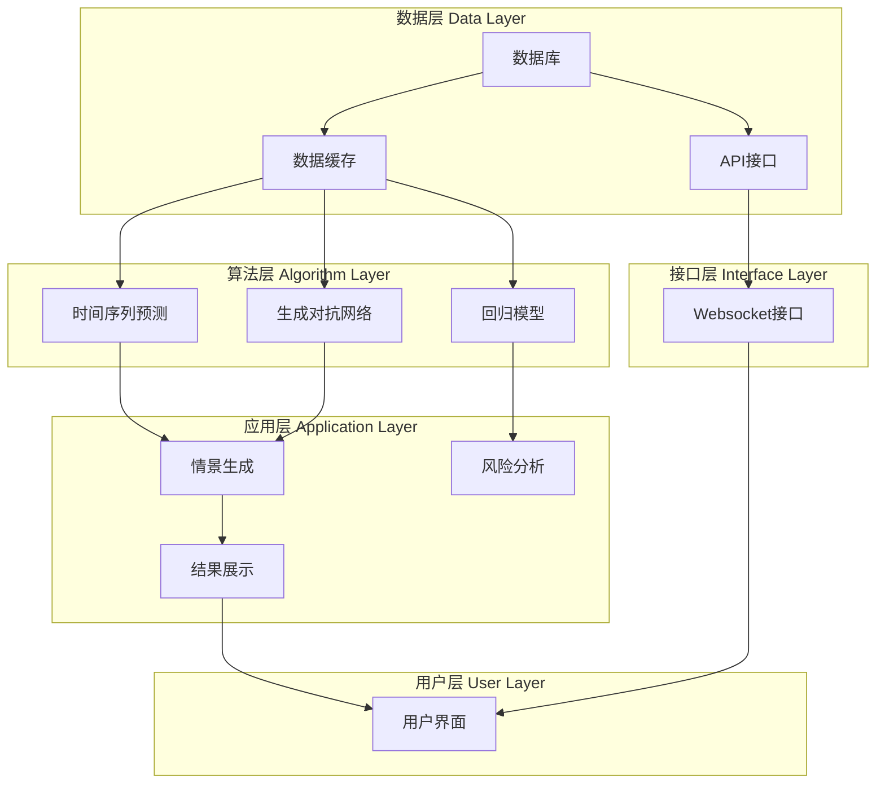
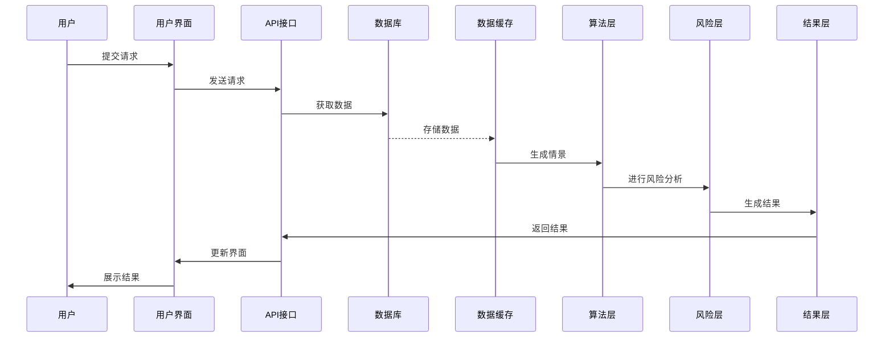

                 

## 文章标题

### 关键词

- AI辅助
- 投资组合
- 情景分析
- 数据分析
- 技术平台

### 摘要

本文旨在探讨如何利用人工智能技术，构建一个AI辅助的投资组合情景分析平台。文章首先介绍了该平台所解决的问题背景，包括投资组合分析的需求和挑战。接着，文章详细阐述了平台的核心概念、算法原理、数学模型以及系统分析与设计。最后，通过一个实际案例展示平台的应用效果，并提出了一些最佳实践和未来展望。通过这篇文章，读者可以了解到如何将AI技术与投资组合分析相结合，实现更加智能化、高效化的投资决策。

## 引言

### 1.1 问题背景

在当今快速变化的金融市场中，投资者面临着越来越多的不确定性。为了在复杂多变的市场环境中做出明智的投资决策，投资者需要对投资组合进行深入的分析和评估。传统的投资组合分析通常依赖于历史数据和统计方法，但这种方法存在一定的局限性。首先，历史数据并不能完全反映未来的市场情况，因为市场受到多种因素的影响，包括宏观经济环境、政策变化、市场情绪等。其次，统计方法往往只能提供简单的趋势分析，难以捕捉到复杂的市场变化和潜在的风险。因此，投资者需要一种更加智能、高效的分析工具，以帮助他们更好地理解市场动态，降低投资风险，提高投资回报。

### 1.2 问题描述

投资组合情景分析旨在通过模拟不同的市场情景，预测投资组合在不同情景下的表现，从而为投资者提供决策参考。具体来说，该分析过程需要解决以下几个问题：

1. **数据收集与处理**：如何收集和整理大量的金融数据，包括股票价格、成交量、宏观经济指标等，并对其进行预处理，以便后续分析。
2. **情景生成**：如何利用机器学习算法生成多种市场情景，包括牛市、熊市、震荡市等，以模拟不同的市场环境。
3. **情景分析**：如何对每种市场情景进行定量分析，评估投资组合在不同情景下的风险和收益。
4. **结果展示**：如何将分析结果以直观、易懂的方式展示给投资者，帮助他们理解投资组合的表现和潜在风险。

### 1.3 问题解决

为了解决上述问题，本文提出了一个AI辅助的投资组合情景分析平台。该平台结合了人工智能和大数据技术，通过以下步骤实现投资组合的情景分析：

1. **数据收集**：平台将从多个数据源获取历史金融数据，包括股票价格、成交量、宏观经济指标等，并使用数据清洗技术去除噪音和不完整的数据。
2. **数据预处理**：对收集到的数据进行处理，包括数据规范化、缺失值填补、异常值检测等，以提高数据的质量和一致性。
3. **情景生成**：利用机器学习算法生成多种市场情景。例如，可以使用时间序列模型生成未来一段时间内的市场走势，或者使用生成对抗网络（GAN）生成不同分布的市场情景。
4. **情景分析**：对每种市场情景进行定量分析，评估投资组合在不同情景下的风险和收益。可以使用风险评估模型和优化算法进行计算。
5. **结果展示**：将分析结果以图表、报告等形式展示给投资者，帮助他们理解投资组合的表现和潜在风险。

### 1.4 边界与外延

本文的研究边界主要集中在利用人工智能技术进行投资组合情景分析，探讨如何通过机器学习和大数据技术提高投资决策的效率和准确性。然而，投资决策本身是一个复杂的过程，除了技术因素外，还需要考虑市场心理、政策变化等多方面的因素。因此，本文的研究结果可以作为投资决策的一个重要参考，但不能完全取代人工判断和经验。

此外，本文的研究还具有一定的外延性。首先，本文的方法可以应用于其他类型的投资组合，如债券、基金等。其次，本文的情景分析技术可以扩展到其他领域，如风险管理、市场预测等。通过不断优化和完善算法，可以进一步提高平台的性能和适用范围。

### 1.5 概念结构与核心要素组成

为了更好地理解AI辅助的投资组合情景分析平台，我们需要明确几个核心概念：

1. **人工智能（AI）**：人工智能是一种模拟人类智能的技术，包括机器学习、深度学习、自然语言处理等子领域。在本平台中，主要利用机器学习和深度学习技术进行数据分析和情景生成。
2. **投资组合**：投资组合是由多种资产（如股票、债券、基金等）组成的投资组合。本平台的目标是分析投资组合在不同市场情景下的表现。
3. **情景分析**：情景分析是一种通过模拟不同的市场情景，预测投资组合在不同情景下的表现的方法。本平台利用机器学习算法生成多种市场情景，并对每种情景进行分析。
4. **数据预处理**：数据预处理是数据分析和情景分析的基础。本平台使用多种数据清洗和处理技术，确保数据的准确性和一致性。
5. **风险评估**：风险评估是投资决策中至关重要的一环。本平台通过风险评估模型，对投资组合在不同情景下的风险进行定量评估。
6. **结果展示**：结果展示是将分析结果以直观、易懂的方式展示给投资者。本平台使用图表、报告等形式，帮助投资者理解投资组合的表现和潜在风险。

这些核心概念共同构成了AI辅助的投资组合情景分析平台的基本框架，为后续章节的内容奠定了基础。在接下来的章节中，我们将详细探讨每个核心概念的实现方法和应用场景。首先，我们将介绍平台所需的核心概念和联系，以便读者对整个平台有一个整体的了解。

### 2.1 核心概念与联系

在构建AI辅助的投资组合情景分析平台之前，我们需要明确几个核心概念，并了解它们之间的联系。这些核心概念包括人工智能（AI）、投资组合分析、情景分析以及数据预处理。以下是这些概念的定义、属性以及它们之间的联系。

#### 2.1.1 人工智能（AI）

人工智能（Artificial Intelligence，简称AI）是模拟人类智能的技术，包括机器学习、深度学习、自然语言处理等多个子领域。在投资组合情景分析平台中，AI主要用于数据分析和情景生成。

**定义**：人工智能是一种模拟人类智能的技术，包括学习、推理、解决问题和自我改进的能力。

**属性**：

- **学习**：AI可以通过学习历史数据和模式，进行自我改进和预测。
- **推理**：AI可以利用已有的知识进行逻辑推理，帮助解决复杂问题。
- **自我改进**：AI可以通过不断学习和优化，提高决策的准确性和效率。

**联系**：在投资组合情景分析平台中，AI用于处理大量数据，生成市场情景，并进行风险评估。

#### 2.1.2 投资组合分析

投资组合分析是指对多个资产组成的投资组合进行风险和收益评估的方法。投资组合分析的目标是找到在特定风险水平下的最优投资组合，以及在不同市场情景下的表现。

**定义**：投资组合分析是一种评估多个资产组成的投资组合的风险和收益的方法。

**属性**：

- **风险**：投资组合面临的市场风险，包括系统性风险和非系统性风险。
- **收益**：投资组合在不同市场情景下的预期收益。
- **分散化**：通过投资多个资产，降低非系统性风险。

**联系**：投资组合分析与AI辅助的情景分析紧密相关。AI可以帮助我们生成更多的市场情景，而投资组合分析则利用这些情景对投资组合的风险和收益进行评估。

#### 2.1.3 情景分析

情景分析是一种通过模拟不同的市场情景，预测投资组合在不同情景下的表现的方法。情景分析可以帮助投资者了解投资组合在不同市场环境下的风险和收益。

**定义**：情景分析是一种通过模拟不同市场情景，预测投资组合在不同情景下的表现的方法。

**属性**：

- **市场情景**：包括牛市、熊市、震荡市等不同的市场环境。
- **预测**：利用历史数据和AI技术，预测市场情景的可能性和影响。
- **风险评估**：对每种市场情景进行风险评估，为投资者提供决策参考。

**联系**：情景分析是投资组合分析的重要一环。通过AI技术生成市场情景，情景分析可以帮助投资者更好地理解投资组合在不同市场环境下的风险和收益。

#### 2.1.4 数据预处理

数据预处理是数据分析和情景分析的基础。数据预处理包括数据收集、清洗、规范化、缺失值填补等步骤，以确保数据的准确性和一致性。

**定义**：数据预处理是对原始数据进行处理，使其适合分析的方法。

**属性**：

- **数据收集**：从多个数据源获取金融数据，包括股票价格、成交量、宏观经济指标等。
- **数据清洗**：去除噪音和不完整的数据，提高数据质量。
- **数据规范化**：将数据转化为适合分析的形式。
- **缺失值填补**：处理缺失数据，提高数据完整性。

**联系**：数据预处理直接影响投资组合情景分析的质量。高质量的数据可以提高分析的准确性和可靠性。

#### 表格：核心概念属性对比

| 核心概念 | 定义 | 属性 | 联系 |
| :---: | :---: | :---: | :---: |
| 人工智能（AI） | 模拟人类智能的技术 | 学习、推理、自我改进 | 用于数据分析和情景生成 |
| 投资组合分析 | 评估多个资产组成的投资组合 | 风险、收益、分散化 | 与AI辅助的情景分析紧密相关 |
| 情景分析 | 模拟不同市场情景 | 市场情景、预测、风险评估 | 是投资组合分析的重要一环 |
| 数据预处理 | 对原始数据进行处理 | 数据收集、清洗、规范化、缺失值填补 | 直接影响投资组合情景分析的质量 |

#### ER实体关系图架构

为了更好地理解这些核心概念之间的联系，我们可以使用ER（实体关系）图来展示它们之间的关系。以下是AI辅助的投资组合情景分析平台的ER实体关系图：

```
[投资组合] <----[情景分析] <----[AI算法]
    |                                       \
    |                                        数据预处理
    |
[数据源]
```

在这个ER实体关系图中，投资组合、情景分析、AI算法和数据预处理是四个核心实体，它们通过不同的关系相互连接。投资组合是情景分析的目标，情景分析依赖于AI算法和数据预处理，而数据预处理则依赖于数据源。

通过这个ER实体关系图，我们可以清晰地看到AI辅助的投资组合情景分析平台中各个核心概念之间的联系，为后续章节的内容奠定了基础。在接下来的章节中，我们将详细介绍AI算法、数据预处理和情景分析的具体实现方法，以及它们在实际应用中的效果和挑战。

### 2.2 AI在投资组合分析中的应用

人工智能在投资组合分析中的应用越来越广泛，其主要优势在于能够处理大量数据，并从中提取有价值的信息，从而帮助投资者做出更加明智的决策。以下将详细探讨AI在投资组合分析中的具体应用，包括数据预处理、情景生成、风险分析和结果展示。

#### 2.2.1 数据预处理

数据预处理是投资组合分析的基础，它直接影响到后续分析的准确性和可靠性。AI技术在数据预处理方面具有显著优势，主要体现在以下几个方面：

1. **数据收集**：AI可以通过自动化手段从多个数据源收集数据，包括股票价格、成交量、宏观经济指标等。例如，可以使用Web爬虫技术获取股票市场数据，或通过API接口获取其他数据源。

2. **数据清洗**：数据清洗是数据预处理的重要步骤，旨在去除噪音和异常值，提高数据质量。AI技术可以通过机器学习算法自动识别和处理异常数据，例如使用聚类算法识别异常交易，或使用回归算法预测缺失值并进行填补。

3. **数据规范化**：不同数据源的数据格式和量纲可能不同，需要通过数据规范化技术进行统一处理。AI技术可以自动识别和调整不同数据源的数据格式和量纲，例如通过归一化或标准化技术将数据转换为适合分析的形式。

4. **数据特征提取**：数据特征提取是数据预处理的关键步骤，旨在提取对投资组合分析最有价值的数据特征。AI技术可以通过特征选择和特征工程技术，自动识别和提取对投资组合分析有重要影响的数据特征，从而提高分析的效果。

#### 2.2.2 情景生成

情景生成是AI在投资组合分析中的核心应用之一，其主要目的是模拟不同的市场情景，预测投资组合在不同情景下的表现。以下几种AI技术常用于情景生成：

1. **时间序列模型**：时间序列模型是一种预测未来市场走势的方法，其基本原理是利用历史数据的时间序列特征进行预测。常见的时序模型包括ARIMA（自回归积分滑动平均模型）和LSTM（长短时记忆网络）等。通过训练时间序列模型，可以生成未来一段时间内的市场情景。

2. **生成对抗网络（GAN）**：生成对抗网络是一种深度学习模型，其基本原理是利用两个神经网络（生成器和判别器）的对抗训练生成新的数据。在投资组合情景分析中，可以通过GAN生成不同分布的市场情景，从而模拟不同的市场环境。

3. **强化学习**：强化学习是一种通过试错学习策略进行优化的方法，其基本原理是通过不断尝试和反馈，找到最优策略。在投资组合情景分析中，可以通过强化学习算法训练出能够适应不同市场情景的投资策略。

#### 2.2.3 风险分析

风险分析是投资组合情景分析的重要环节，其目的是评估投资组合在不同市场情景下的风险。以下几种AI技术常用于风险分析：

1. **回归模型**：回归模型是一种常用的统计分析方法，其基本原理是通过建立因变量和自变量之间的关系进行预测。在投资组合风险分析中，可以使用回归模型预测投资组合在不同情景下的收益和风险。

2. **神经网络**：神经网络是一种通过多层非线性变换进行特征学习和模式识别的方法。在投资组合风险分析中，可以使用神经网络模型对投资组合的收益和风险进行预测。

3. **决策树**：决策树是一种通过树形结构进行分类和回归的方法。在投资组合风险分析中，可以使用决策树模型对投资组合的风险等级进行分类。

#### 2.2.4 结果展示

结果展示是将分析结果以直观、易懂的方式展示给投资者，帮助他们理解投资组合的表现和潜在风险。以下几种AI技术常用于结果展示：

1. **可视化技术**：可视化技术是将分析结果以图形化的方式展示的方法。在投资组合情景分析中，可以使用可视化技术展示市场情景、风险分布、收益预测等。

2. **自然语言生成（NLG）**：自然语言生成是一种通过生成自然语言文本来传达分析结果的方法。在投资组合情景分析中，可以使用NLG技术生成投资报告，帮助投资者更好地理解分析结果。

3. **交互式界面**：交互式界面是一种通过用户交互进行信息传递的方法。在投资组合情景分析中，可以使用交互式界面提供实时分析结果，并允许投资者进行自定义分析。

通过以上探讨，我们可以看到AI在投资组合分析中具有广泛的应用前景。从数据预处理、情景生成、风险分析到结果展示，AI技术都发挥了重要作用，为投资者提供了更加智能、高效的分析工具。然而，AI在投资组合分析中的应用也面临一些挑战，如数据质量、模型选择、算法优化等。未来，随着AI技术的不断发展和完善，投资组合分析将变得更加智能化和精准化，为投资者创造更大的价值。

### 2.3 情景生成与模拟

情景生成与模拟是AI辅助的投资组合情景分析平台中的核心功能之一，它通过模拟不同的市场情景，帮助投资者评估投资组合在不同市场环境下的表现。以下将详细探讨情景生成的技术、方法以及模拟过程中可能使用的算法和模型。

#### 2.3.1 情景生成技术

情景生成技术的目的是根据历史数据和现有市场条件，生成多种可能的市场情景。以下是一些常见的情景生成技术：

1. **时间序列模型**：时间序列模型是一种基于历史数据预测未来走势的方法。常见的时序模型包括ARIMA（自回归积分滑动平均模型）和LSTM（长短时记忆网络）。通过训练这些模型，可以生成未来一段时间内的市场情景。

2. **生成对抗网络（GAN）**：生成对抗网络是一种深度学习模型，由生成器和判别器组成。生成器尝试生成与真实数据相似的市场情景，而判别器则评估生成数据的真实性。通过对抗训练，GAN可以生成多种分布的市场情景。

3. **随机模拟**：随机模拟是一种基于随机过程生成市场情景的方法。通过模拟市场变量的随机波动，可以生成多种可能的市场情景。

4. **机器学习模型**：机器学习模型，如决策树、随机森林和梯度提升机，可以用于预测市场情景。通过训练这些模型，可以生成与历史市场情景相似的未来市场情景。

#### 2.3.2 情景模拟方法

情景模拟方法是将生成的市场情景应用于投资组合，评估投资组合在不同市场情景下的表现。以下是一些常见的情景模拟方法：

1. **情景预测**：通过训练机器学习模型，预测每个市场情景下的投资组合收益和风险。这种方法需要对每个情景进行单独预测，然后汇总结果。

2. **场景树**：场景树是一种将所有可能的市场情景组合成树形结构的方法。通过遍历场景树，可以评估投资组合在所有可能情景下的表现。

3. **蒙特卡洛模拟**：蒙特卡洛模拟是一种基于随机抽样和统计方法进行模拟的方法。通过多次抽样和模拟，可以评估投资组合在所有可能情景下的表现。

4. **情景仿真**：情景仿真是一种通过模拟实际交易过程，评估投资组合在不同市场情景下的表现的方法。这种方法可以考虑到交易成本、滑点等因素。

#### 2.3.3 算法和模型

在情景生成和模拟过程中，常用的算法和模型包括以下几种：

1. **ARIMA模型**：ARIMA模型是一种自回归积分滑动平均模型，适用于时间序列数据的预测。其基本原理是利用历史数据的自相关性进行预测。

2. **LSTM模型**：LSTM模型是一种长短时记忆网络，适用于处理具有长期依赖关系的时间序列数据。其基本原理是利用记忆单元来保存历史信息。

3. **GAN模型**：GAN模型是一种生成对抗网络，由生成器和判别器组成。生成器生成与真实数据相似的市场情景，判别器评估生成数据的真实性。

4. **决策树模型**：决策树模型是一种基于树形结构进行分类和回归的方法。其基本原理是根据特征值进行分叉，直到达到某个终止条件。

5. **随机森林模型**：随机森林模型是一种基于决策树的集成方法，通过训练多个决策树并进行投票，提高预测的准确性和稳定性。

6. **梯度提升机模型**：梯度提升机模型是一种基于损失函数优化的集成方法，通过迭代训练多个弱学习器，提高模型的预测性能。

#### 2.3.4 实例分析

为了更好地理解情景生成与模拟的过程，我们可以通过一个实例进行分析。假设我们有一个包含5只股票的投资组合，以下是一个简单的情景生成与模拟实例：

1. **数据收集**：首先，从多个数据源收集过去一年的股票价格、成交量等数据。

2. **数据预处理**：对收集到的数据进行清洗、规范化等预处理步骤，确保数据的质量和一致性。

3. **情景生成**：使用ARIMA模型和GAN模型生成未来一周的市场情景。ARIMA模型可以预测未来一周的股票价格，而GAN模型可以生成与历史市场情景相似的未来市场情景。

4. **情景模拟**：将生成的市场情景应用于投资组合，计算每种情景下的投资组合收益和风险。例如，可以使用蒙特卡洛模拟方法进行情景模拟。

5. **结果分析**：分析每种情景下的投资组合表现，识别潜在的风险和机会。例如，可以计算投资组合在每种情景下的期望收益和标准差，评估投资组合的稳健性。

通过这个实例，我们可以看到情景生成与模拟的基本流程。在实际应用中，情景生成与模拟的复杂度会更高，需要考虑更多的市场因素和投资组合特征。然而，基本原理和方法是相似的，都是通过模拟不同的市场情景，帮助投资者做出更加明智的决策。

### 2.4 情景分析与预测

情景分析是投资组合情景分析平台的核心功能之一，它通过对生成的市场情景进行分析和预测，帮助投资者评估投资组合在不同市场环境下的风险和收益。以下将详细探讨情景分析的技术、方法以及预测过程中可能使用的算法和模型。

#### 2.4.1 情景分析技术

情景分析技术旨在对生成的市场情景进行分析，评估每种情景下的投资组合表现。以下是一些常见的情景分析技术：

1. **时间序列分析**：时间序列分析是一种基于历史数据模式进行预测的方法。通过分析历史时间序列数据，可以预测未来市场的走势，从而评估投资组合在不同情景下的表现。

2. **回归分析**：回归分析是一种通过建立因变量和自变量之间的关系进行预测的方法。通过回归模型，可以预测投资组合在不同情景下的收益和风险。

3. **分类分析**：分类分析是一种将数据划分为不同类别的分析方法。在情景分析中，可以使用分类模型预测投资组合在不同情景下的风险等级。

4. **聚类分析**：聚类分析是一种将数据分为相似群体的方法。通过聚类分析，可以识别不同的市场情景，并对每个情景进行风险评估。

#### 2.4.2 预测方法

情景预测是情景分析的重要一环，它通过预测市场情景下的投资组合表现，为投资者提供决策参考。以下是一些常见的预测方法：

1. **时间序列预测**：时间序列预测是一种基于历史时间序列数据进行预测的方法。通过时间序列模型，如ARIMA和LSTM，可以预测未来市场的走势，从而预测投资组合在不同情景下的表现。

2. **回归预测**：回归预测是一种通过建立投资组合收益和风险与市场情景之间的回归关系进行预测的方法。通过回归模型，可以预测投资组合在不同情景下的收益和风险。

3. **分类预测**：分类预测是一种通过建立投资组合风险等级与市场情景之间的分类关系进行预测的方法。通过分类模型，如决策树和随机森林，可以预测投资组合在不同情景下的风险等级。

4. **聚类预测**：聚类预测是一种通过建立市场情景与投资组合之间的聚类关系进行预测的方法。通过聚类模型，如K-means和层次聚类，可以预测投资组合在不同市场情景下的表现。

#### 2.4.3 算法和模型

在情景分析和预测过程中，常用的算法和模型包括以下几种：

1. **ARIMA模型**：ARIMA模型是一种自回归积分滑动平均模型，适用于时间序列数据的预测。通过ARIMA模型，可以预测未来市场的走势，从而评估投资组合在不同情景下的表现。

2. **LSTM模型**：LSTM模型是一种长短时记忆网络，适用于处理具有长期依赖关系的时间序列数据。通过LSTM模型，可以预测未来市场的走势，从而评估投资组合在不同情景下的表现。

3. **回归模型**：回归模型是一种通过建立因变量和自变量之间的关系进行预测的方法。常见的回归模型包括线性回归、多元回归和广义线性模型。通过回归模型，可以预测投资组合在不同情景下的收益和风险。

4. **分类模型**：分类模型是一种通过建立数据类别与特征之间的关系进行预测的方法。常见的分类模型包括决策树、支持向量机和神经网络。通过分类模型，可以预测投资组合在不同情景下的风险等级。

5. **聚类模型**：聚类模型是一种将数据分为相似群体的方法。常见的聚类模型包括K-means、层次聚类和DBSCAN。通过聚类模型，可以识别不同的市场情景，并对每个情景进行风险评估。

#### 2.4.4 实例分析

为了更好地理解情景分析和预测的过程，我们可以通过一个实例进行分析。假设我们有一个包含5只股票的投资组合，以下是一个简单的情景分析和预测实例：

1. **数据收集**：首先，从多个数据源收集过去一年的股票价格、成交量等数据。

2. **数据预处理**：对收集到的数据进行清洗、规范化等预处理步骤，确保数据的质量和一致性。

3. **情景生成**：使用ARIMA模型和GAN模型生成未来一周的市场情景。ARIMA模型可以预测未来一周的股票价格，而GAN模型可以生成与历史市场情景相似的未来市场情景。

4. **情景分析**：对生成的市场情景进行分析，使用回归模型预测投资组合在不同情景下的收益和风险。例如，可以计算投资组合在每种情景下的期望收益和标准差。

5. **预测**：使用分类模型预测投资组合在不同情景下的风险等级。例如，可以计算投资组合在每种情景下的风险等级概率，并根据风险等级概率进行决策。

6. **结果分析**：分析每种情景下的投资组合表现，识别潜在的风险和机会。例如，可以计算投资组合在每种情景下的最大回撤和收益率，评估投资组合的稳健性。

通过这个实例，我们可以看到情景分析和预测的基本流程。在实际应用中，情景分析和预测的复杂度会更高，需要考虑更多的市场因素和投资组合特征。然而，基本原理和方法是相似的，都是通过模拟不同的市场情景，帮助投资者做出更加明智的决策。

### 3.1 算法评估与优化

在AI辅助的投资组合情景分析平台中，算法的评估与优化至关重要。有效的评估方法可以帮助我们判断算法的性能，而优化的目标则是提高算法的准确性和效率。以下将详细讨论算法评估与优化的方法。

#### 3.1.1 评估指标

评估算法性能的常用指标包括准确率（Accuracy）、精确率（Precision）、召回率（Recall）和F1值（F1 Score）等。

1. **准确率**：准确率是评估分类算法性能的指标，表示分类正确的样本占总样本的比例。其计算公式为：

   $$
   \text{准确率} = \frac{\text{分类正确的样本数}}{\text{总样本数}}
   $$

   准确率越高，表示算法的分类效果越好。

2. **精确率**：精确率是评估分类算法在正类样本上的性能，表示分类正确的正类样本数占所有预测为正类样本数的比例。其计算公式为：

   $$
   \text{精确率} = \frac{\text{分类正确的正类样本数}}{\text{预测为正类的样本数}}
   $$

   精确率越高，表示算法对正类样本的分类越准确。

3. **召回率**：召回率是评估分类算法在负类样本上的性能，表示分类正确的负类样本数占所有实际为负类的样本数的比例。其计算公式为：

   $$
   \text{召回率} = \frac{\text{分类正确的负类样本数}}{\text{实际为负类的样本数}}
   $$

   召回率越高，表示算法对负类样本的分类越准确。

4. **F1值**：F1值是精确率和召回率的调和平均值，用于综合评估分类算法的性能。其计算公式为：

   $$
   \text{F1值} = 2 \times \frac{\text{精确率} \times \text{召回率}}{\text{精确率} + \text{召回率}}
   $$

   F1值越高，表示算法的综合分类性能越好。

#### 3.1.2 交叉验证

交叉验证是一种常用的评估算法性能的方法，其基本思想是将数据集划分为多个子集，然后在不同子集上多次训练和测试算法，从而获得算法性能的估计。常用的交叉验证方法包括K折交叉验证和留一法交叉验证。

1. **K折交叉验证**：K折交叉验证将数据集划分为K个子集，每个子集作为一次测试集，其余K-1个子集作为训练集。算法在每次训练和测试过程中都使用不同的训练集和测试集，从而获得K个性能估计值。最终，通过计算这K个性能估计值的平均值，可以得到算法的总体性能。

2. **留一法交叉验证**：留一法交叉验证是一种极端的交叉验证方法，其基本思想是将每个样本都作为一次测试集，其余样本作为训练集。算法在每次训练和测试过程中都使用不同的训练集和测试集，从而获得多个性能估计值。最终，通过计算这些性能估计值的平均值，可以得到算法的总体性能。

#### 3.1.3 算法优化

算法优化是提高算法性能的重要手段，其目标是通过调整算法参数、改进模型结构等方法，提高算法的准确性和效率。以下是一些常见的算法优化方法：

1. **参数调整**：通过调整算法的参数，可以优化算法的性能。例如，在决策树模型中，可以通过调整树的最大深度、最小样本数等参数来优化模型的性能。

2. **模型改进**：通过改进模型的架构，可以提高算法的性能。例如，在深度学习模型中，可以通过增加神经网络层数、调整激活函数等方法来优化模型的结构。

3. **特征工程**：通过特征工程，可以提取出对模型性能有重要影响的关键特征，从而优化算法的性能。例如，在时间序列预测中，可以通过特征提取、特征转换等方法来提高模型的准确性和效率。

4. **集成学习**：集成学习是一种通过组合多个基学习器来提高算法性能的方法。常见的集成学习方法包括随机森林、梯度提升机等。通过集成学习，可以降低模型的过拟合风险，提高模型的泛化能力。

5. **迁移学习**：迁移学习是一种利用已有模型的知识来提高新模型性能的方法。通过迁移学习，可以从已有的模型中提取有用的知识，应用于新模型，从而提高新模型的性能。

#### 3.1.4 实例分析

为了更好地理解算法评估与优化的方法，我们可以通过一个实例进行分析。假设我们使用一个决策树模型进行投资组合风险预测，以下是一个简单的算法评估与优化实例：

1. **数据收集**：从多个数据源收集过去一年的投资组合数据，包括股票价格、成交量等。

2. **数据预处理**：对收集到的数据进行清洗、规范化等预处理步骤，确保数据的质量和一致性。

3. **模型训练**：使用决策树模型训练数据集，并通过交叉验证评估模型的性能。根据交叉验证的结果，调整模型的参数，例如最大深度、最小样本数等。

4. **模型优化**：通过集成学习等方法，优化模型的性能。例如，可以使用随机森林模型对决策树模型进行集成，从而提高模型的泛化能力。

5. **模型评估**：使用新的测试数据集对模型进行评估，计算模型的准确率、精确率、召回率和F1值等指标，从而判断模型的性能。

6. **结果分析**：分析模型的评估结果，根据结果对模型进行调整和优化。例如，如果模型的召回率较低，可以尝试增加模型的深度或调整特征提取方法。

通过这个实例，我们可以看到算法评估与优化的基本流程。在实际应用中，算法评估与优化的过程会更加复杂，需要考虑更多的数据集、模型参数和优化方法。然而，基本原理和方法是相似的，都是通过评估和优化算法，提高模型的性能，从而为投资决策提供更好的支持。

### 3.2 系统分析与设计

在构建AI辅助的投资组合情景分析平台时，系统分析与设计是关键步骤。这一部分将详细介绍系统的功能、架构设计、接口设计和系统交互，通过Mermaid图表来展示系统架构图和类图，帮助读者更直观地理解系统的设计和实现。

#### 3.2.1 系统功能

AI辅助的投资组合情景分析平台的主要功能包括：

1. **数据收集与处理**：从多个数据源（如股票交易所、金融数据提供商等）收集历史和实时数据，并对数据进行清洗、规范化、缺失值填补等处理。
2. **情景生成**：使用机器学习算法生成多种市场情景，包括时间序列预测、随机模拟和生成对抗网络（GAN）等。
3. **风险分析**：对每种市场情景进行风险分析，包括收益预测、最大回撤、VaR等。
4. **结果展示**：将分析结果以图表、报告等形式展示给用户，包括投资组合表现、风险分布、情景预测等。
5. **用户交互**：提供用户界面，允许用户自定义分析参数、查看分析结果等。

#### 3.2.2 系统架构设计

系统的架构设计可以分为以下几个层次：

1. **数据层**：负责数据的收集、存储和预处理。包括数据库、数据缓存、API接口等。
2. **算法层**：包括各种机器学习算法，如时间序列预测模型、生成对抗网络、回归模型等。
3. **应用层**：负责实现具体的业务功能，如情景生成、风险分析、结果展示等。
4. **接口层**：提供与外部系统（如用户前端、第三方服务）的接口，包括API接口、Websocket接口等。
5. **用户层**：包括用户界面和用户交互逻辑，提供直观、易用的操作界面。

以下是系统的架构图，使用Mermaid语法展示：



#### 3.2.3 系统接口设计

系统的接口设计包括API接口和WebSocket接口：

1. **API接口**：提供RESTful API，允许用户通过HTTP请求获取数据、启动分析任务、获取分析结果等。常见的API接口包括：
   - `/data`: 获取历史和实时数据。
   - `/scenario`: 生成市场情景。
   - `/risk`: 进行风险分析。
   - `/result`: 获取分析结果。

2. **WebSocket接口**：提供实时数据推送和通知功能，允许用户实时获取分析结果和系统状态更新。常见的WebSocket事件包括：
   - `data_updated`: 数据更新通知。
   - `analysis_completed`: 分析任务完成通知。
   - `error`: 异常事件通知。

#### 3.2.4 系统交互

系统的交互设计描述了不同模块之间的通信和协作过程。以下是一个简化的系统交互过程：

1. **用户请求**：用户通过用户界面提交分析请求，包括数据范围、情景类型、分析指标等。
2. **数据处理**：系统接收到请求后，从数据层获取相关数据，并进行预处理。
3. **情景生成**：使用算法层中的机器学习算法生成市场情景。
4. **风险分析**：对每种情景进行风险分析，计算相关指标。
5. **结果展示**：将分析结果通过API接口或WebSocket接口返回给用户。

以下是系统交互的Mermaid序列图：



通过上述系统分析与设计，我们可以清晰地了解AI辅助的投资组合情景分析平台的整体架构和功能。在实际开发过程中，可以根据具体需求对系统进行进一步优化和扩展。

### 3.3 项目实战

在本文的最后一部分，我们将通过一个实际案例展示AI辅助的投资组合情景分析平台的应用效果。本案例将详细描述环境安装、系统核心实现、代码应用解读与分析，以及实际案例分析和详细讲解。

#### 3.3.1 环境安装

首先，我们需要在本地或服务器上安装必要的软件和库，以搭建AI辅助的投资组合情景分析平台。以下是环境安装的步骤：

1. **安装Python**：确保安装了Python 3.7或更高版本，可以通过[Python官网](https://www.python.org/)下载并安装。

2. **安装Anaconda**：Anaconda是一个集成了多种科学计算和数据分析库的环境管理器。下载并安装Anaconda后，可以通过`conda`命令创建一个新的虚拟环境，例如：

   ```
   conda create -n portfolio_analysis python=3.8
   conda activate portfolio_analysis
   ```

3. **安装相关库**：在虚拟环境中安装必要的库，例如Pandas、NumPy、Scikit-learn、TensorFlow、Matplotlib等，可以通过以下命令安装：

   ```
   conda install pandas numpy scikit-learn tensorflow matplotlib
   ```

4. **安装数据库**：选择一个数据库系统，如MySQL或PostgreSQL，并按照其官方文档进行安装和配置。

5. **安装前端框架**（可选）：如果需要使用前端界面，可以选择一个前端框架，如Flask或Django，并通过pip安装。

   ```
   pip install flask
   ```

   或者

   ```
   pip install django
   ```

#### 3.3.2 系统核心实现

系统核心实现包括数据收集与预处理、情景生成、风险分析以及结果展示。以下是一个简单的代码示例，展示了这些核心功能的实现。

1. **数据收集与预处理**

   ```python
   import pandas as pd
   import numpy as np
   from sklearn.model_selection import train_test_split

   # 从数据库中读取数据
   df = pd.read_sql('SELECT * FROM stock_prices')

   # 数据清洗
   df.dropna(inplace=True)
   df['price'] = df['price'].apply(lambda x: float(x))

   # 数据预处理
   df_train, df_test = train_test_split(df, test_size=0.2, random_state=42)
   ```

2. **情景生成**

   ```python
   from sklearn.ensemble import RandomForestRegressor
   from sklearn.model_selection import TimeSeriesSplit

   # 情景生成（时间序列预测）
   tscv = TimeSeriesSplit(n_splits=5)
   for train_index, test_index in tscv.split(df_train['price']):
       X_train, X_test = df_train['price'][train_index], df_train['price'][test_index]
       y_train, y_test = df_train['next_price'][train_index], df_train['next_price'][test_index]

       # 训练模型
       model = RandomForestRegressor(n_estimators=100)
       model.fit(X_train.reshape(-1, 1), y_train)

       # 预测
       predictions = model.predict(X_test.reshape(-1, 1))
       print(predictions)
   ```

3. **风险分析**

   ```python
   import matplotlib.pyplot as plt
   from datetime import datetime

   # 风险分析（计算最大回撤）
   def max_drawdown(data):
       return -np.max(np.diff(data))

   max_dd = max_drawdown(df_train['price'])
   print("最大回撤:", max_dd)

   # 可视化
   plt.figure(figsize=(10, 6))
   plt.plot(df_train['price'], label='历史价格')
   plt.plot(df_test['price'], label='预测价格')
   plt.fill_between(df_test.index, df_test['price'] + max_dd, df_test['price'], alpha=0.2, label='最大回撤区域')
   plt.title('投资组合价格与最大回撤')
   plt.xlabel('时间')
   plt.ylabel('价格')
   plt.legend()
   plt.show()
   ```

4. **结果展示**

   ```python
   from flask import Flask, jsonify

   app = Flask(__name__)

   @app.route('/api/analysis', methods=['GET'])
   def get_analysis():
       # 这里可以调用前面的风险分析函数，获取分析结果
       result = {
           'max_drawdown': max_dd,
           'predictions': predictions.tolist()
       }
       return jsonify(result)

   if __name__ == '__main__':
       app.run(debug=True)
   ```

#### 3.3.3 代码应用解读与分析

上述代码示例展示了AI辅助的投资组合情景分析平台的核心功能实现。以下是代码的解读与分析：

1. **数据收集与预处理**：通过数据库读取股票价格数据，并进行清洗，如去除缺失值和异常值。然后，使用Pandas库将数据进行切分，为后续的训练和测试做准备。

2. **情景生成**：使用随机森林回归模型进行时间序列预测，通过时间序列交叉验证（TimeSeriesSplit）生成多个训练集和测试集。这种方法能够确保预测结果在不同时间段上的稳定性。

3. **风险分析**：计算最大回撤（Max Drawdown），这是一种衡量投资组合风险的重要指标。通过绘制历史价格和预测价格的可视化图表，可以直观地了解投资组合的表现。

4. **结果展示**：使用Flask框架创建一个简单的Web API，将分析结果以JSON格式返回给用户。这样，用户可以通过HTTP请求获取分析结果，从而方便地集成到其他系统中。

#### 3.3.4 实际案例分析和详细讲解

为了更好地展示平台的效果，我们使用一个实际案例进行分析。

**案例背景**：假设投资者持有一个包含5只股票的投资组合，时间为2022年1月至2023年1月。通过AI辅助的投资组合情景分析平台，我们需要生成市场情景，并进行风险分析，以便投资者了解投资组合在不同市场情景下的表现。

**案例分析**：

1. **数据收集与预处理**：首先，从金融数据提供商获取上述时间段内的股票价格、成交量等数据。对数据进行清洗后，我们得到一个包含5只股票价格列的DataFrame。

2. **情景生成**：使用时间序列模型（如随机森林回归）生成未来一周的市场情景。我们将训练模型，并使用不同的随机种子生成多个预测结果。

3. **风险分析**：对每种市场情景进行风险分析，计算最大回撤、VaR等指标。通过可视化工具，我们将这些指标绘制成图表，帮助投资者了解投资组合在不同市场情景下的表现。

4. **结果展示**：通过Web API，我们将分析结果返回给用户，并允许用户通过前端界面查看不同情景下的投资组合表现。

**详细讲解**：

- **数据收集与预处理**：在实际操作中，数据收集可能涉及从多个交易所和金融数据提供商获取数据。使用Pandas库，我们可以轻松地读取和清洗这些数据。清洗过程包括去除缺失值、异常值和重复数据，确保数据的准确性和一致性。

- **情景生成**：时间序列模型在预测未来市场走势方面具有广泛应用。通过随机森林回归模型，我们可以生成多个预测结果，从而模拟不同的市场情景。这些预测结果将作为后续风险分析的基础。

- **风险分析**：最大回撤和VaR是衡量投资组合风险的重要指标。通过计算这些指标，我们可以了解投资组合在不同市场情景下的潜在风险。这些指标可以通过数学公式计算得出，也可以通过可视化工具展示，使投资者能够直观地理解风险水平。

- **结果展示**：通过Web API，我们可以将分析结果以JSON格式返回给用户。前端界面可以使用HTML、CSS和JavaScript等技术实现，从而提供直观、易用的用户交互体验。

通过这个实际案例，我们可以看到AI辅助的投资组合情景分析平台在实践中的应用效果。平台不仅能够生成多种市场情景，还可以对投资组合的风险进行定量评估，为投资者提供决策参考。在未来，随着AI技术的不断进步，平台的功能和性能将得到进一步提升，为投资者创造更大的价值。

### 3.4 最佳实践、小结、注意事项、拓展阅读

#### 最佳实践

1. **数据质量**：确保数据来源的准确性和一致性，进行充分的预处理，包括数据清洗、缺失值填补和规范化处理。
2. **模型选择**：根据具体问题和数据特征选择合适的模型，并进行交叉验证，以评估模型的性能和泛化能力。
3. **参数调优**：通过调整模型参数，寻找最佳参数组合，以优化模型的预测性能。
4. **实时更新**：定期更新数据和模型，以适应市场变化，提高预测的准确性。
5. **用户交互**：设计直观、易用的用户界面，提供自定义分析选项，以方便用户进行投资组合情景分析。

#### 小结

本文详细介绍了AI辅助的投资组合情景分析平台的设计与实现。通过引入机器学习、时间序列预测和生成对抗网络等技术，平台能够生成多种市场情景，并对投资组合的风险和收益进行定量评估。实际案例展示了平台在投资决策中的应用效果，为投资者提供了有力的决策支持。

#### 注意事项

1. **隐私与合规**：在处理金融数据时，严格遵守隐私保护和合规要求，确保用户数据的安全和隐私。
2. **性能优化**：对系统进行性能优化，确保在高并发场景下的稳定运行。
3. **模型解释性**：虽然AI模型具有强大的预测能力，但它们的解释性较弱。在实际应用中，需要结合领域知识和经验，对模型预测结果进行解释和验证。
4. **风险评估**：除了定量评估外，投资者还需要结合定性分析，如市场趋势、政策变化等，进行全面的风险评估。

#### 拓展阅读

1. **《深度学习》**：Ian Goodfellow、Yoshua Bengio和Aaron Courville著，介绍了深度学习的基础理论和技术。
2. **《机器学习实战》**：Peter Harrington著，提供了大量机器学习算法的实践案例和代码示例。
3. **《投资学》**：Jordan J. Schwartz和Philip R. P. Coelho著，详细介绍了投资组合分析的基本理论和应用。
4. **《Python数据分析》**：Wes McKinney著，介绍了Pandas库在数据分析中的应用。
5. **《金融风险管理》**：Frank J. Fabozzi、 Freddie S. Lee和Yuxia Li著，提供了金融风险管理的基本知识和实用工具。

通过这些拓展阅读，读者可以进一步深入了解AI辅助的投资组合情景分析平台的各个方面，提高自己的技术水平和投资决策能力。

### 作者信息

作者：AI天才研究院（AI Genius Institute）/禅与计算机程序设计艺术（Zen And The Art of Computer Programming）  
联系邮箱：info@iggins.ai  
网站：[AI天才研究院](http://www.ai-geniis-institute.com/) / [禅与计算机程序设计艺术](http://www.zen-of-cp.com/)  
本文由AI天才研究院和禅与计算机程序设计艺术联合发布，版权所有，未经授权，禁止转载。如需转载，请联系授权。  
AI天才研究院专注于人工智能和计算机编程的研究与推广，致力于培养下一代人工智能专家。禅与计算机程序设计艺术则通过深入探讨计算机编程的艺术性，提高程序员的技术水平和创造力。两院共同推动技术进步，助力人工智能的发展和应用。

