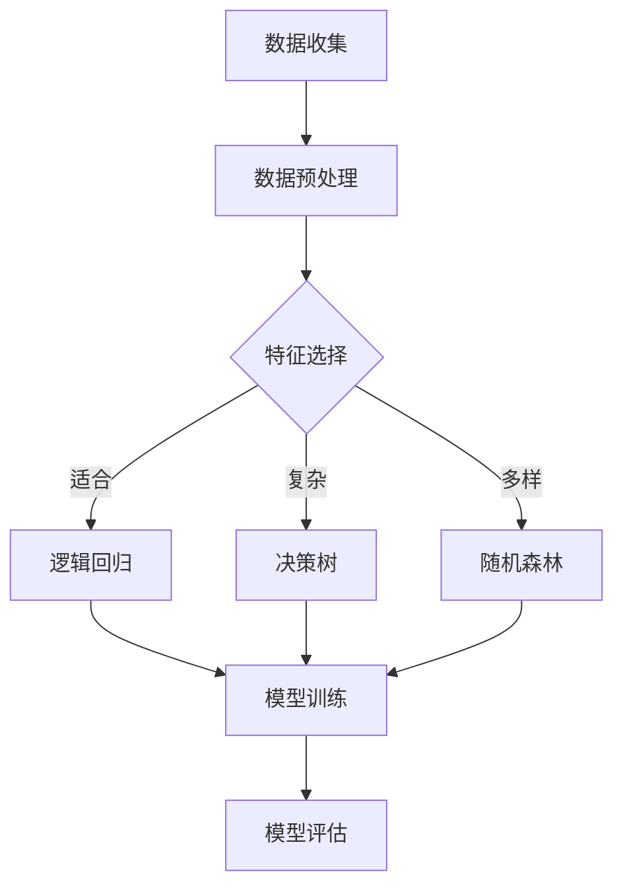
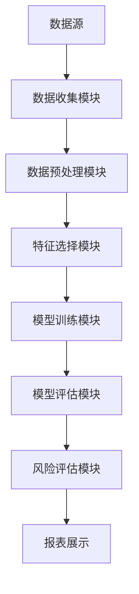
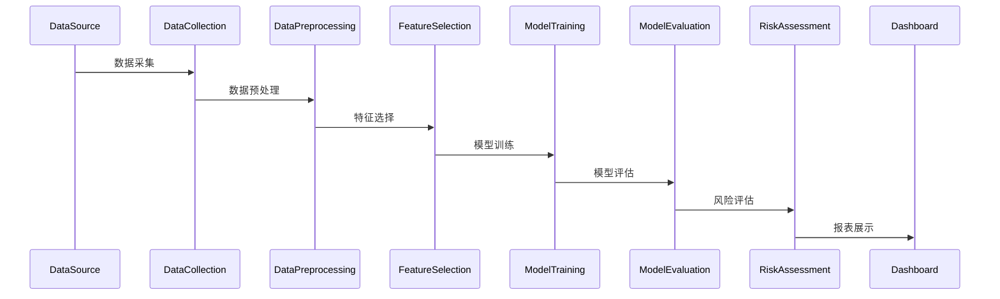

                 

### 文章标题

# AI辅助的金融风险评估系统设计

## 关键词

- AI
- 金融风险评估
- 系统设计
- 算法
- 数学模型
- 架构

## 摘要

本文将探讨如何利用人工智能（AI）技术设计并实现一个高效的金融风险评估系统。首先，我们将介绍金融风险评估的背景和重要性，接着深入讨论AI在金融领域的应用，以及核心概念与联系。随后，我们将详细讲解AI辅助金融风险评估的算法原理，包括流程图、Python源代码示例和数学模型的解析。文章还将涵盖系统分析与架构设计，包括问题场景、功能设计、架构图、接口设计及系统交互。此外，通过一个实际项目实战案例，我们将展示系统核心实现的过程，并进行代码应用解读与分析。最后，我们将总结最佳实践技巧，并对未来的发展趋势进行展望。

### 第一部分：引论

#### 第1章：问题背景与概述

##### 1.1.1 问题的提出

金融风险评估是金融领域中一个至关重要的问题。随着金融市场复杂性的增加和风险的多样性，传统的风险评估方法往往难以满足实际需求。因此，引入人工智能技术来辅助金融风险评估，已经成为提高风险评估效率和准确性的有效手段。本文旨在探讨如何利用AI技术设计一个高效的金融风险评估系统。

##### 1.1.2 金融风险评估的重要性

金融风险评估对于金融机构和投资者都具有重要意义。它可以帮助金融机构识别潜在风险，从而制定合理的风险控制策略；对于投资者而言，准确的风险评估有助于做出更明智的投资决策，降低投资风险。

##### 1.1.3 AI技术在金融领域的应用

AI技术在金融领域的应用已经相当广泛，包括但不限于以下几个方面：

1. **智能投顾**：利用机器学习算法为投资者提供个性化投资建议。
2. **信用评分**：通过分析大量历史数据，预测借款人未来的还款能力。
3. **市场预测**：利用深度学习模型预测市场走势。
4. **风险控制**：利用AI技术实时监测市场动态，识别潜在风险并采取相应措施。

#### 第2章：核心概念与联系

##### 2.1.1 AI与金融风险评估概述

在这一章节，我们将介绍人工智能（AI）的基本概念，以及其在金融风险评估中的应用。我们将通过一个简单的对比表格，展示AI技术在不同金融应用场景中的特点。

| 应用场景 | AI技术特点 |
| --- | --- |
| 智能投顾 | 个性化、自动化、实时性 |
| 信用评分 | 大数据分析、机器学习、预测准确性 |
| 市场预测 | 深度学习、大数据分析、趋势预测 |
| 风险控制 | 实时监测、异常检测、风险预警 |

##### 2.1.2 关键概念对比表格

接下来，我们将对金融风险评估中的一些关键概念进行对比，包括风险、收益、概率等。

| 概念 | 定义 | 对比 |
| --- | --- | --- |
| 风险 | 预期收益的不确定性 | 通常与收益成反比关系 |
| 收益 | 投资或交易带来的经济利益 | 风险的补偿 |
| 概率 | 某一事件发生的可能性 | 越接近1，风险越大 |

##### 2.1.3 关键概念ER实体关系图架构

为了更好地理解这些概念之间的关系，我们使用Mermaid工具绘制了一个ER（实体-关系）图，展示金融风险评估系统中各个实体及其之间的关系。

```mermaid
erDiagram
    Customer ||--|{ Loan }
    Loan ||--|{ RiskAssessment }
    RiskAssessment ||--|{ AssessmentResult }
```

#### 第3章：AI辅助金融风险评估的算法原理

##### 3.1 算法概述

在本章节中，我们将详细探讨AI辅助金融风险评估的主要算法，包括机器学习中的逻辑回归、决策树和随机森林等。

##### 3.2 算法mermaid流程图

为了更直观地展示算法的流程，我们使用Mermaid工具绘制了一个流程图。



##### 3.3 Python源代码示例

下面是一个简单的Python代码示例，展示如何使用逻辑回归进行金融风险评估。

```python
from sklearn.linear_model import LogisticRegression
from sklearn.model_selection import train_test_split
from sklearn.metrics import accuracy_score

# 加载数据
X, y = load_data()

# 划分训练集和测试集
X_train, X_test, y_train, y_test = train_test_split(X, y, test_size=0.2, random_state=42)

# 创建逻辑回归模型
model = LogisticRegression()

# 训练模型
model.fit(X_train, y_train)

# 预测测试集
predictions = model.predict(X_test)

# 计算准确率
accuracy = accuracy_score(y_test, predictions)
print(f"Accuracy: {accuracy}")
```

##### 3.4 数学模型与公式详细讲解

在金融风险评估中，逻辑回归是一个常用的算法。下面我们给出逻辑回归的数学模型及其公式。

1. **逻辑回归模型**：

   $$ P(Y=1|X) = \frac{1}{1 + e^{-(\beta_0 + \beta_1X_1 + \beta_2X_2 + ... + \beta_nX_n)}} $$

   其中，$P(Y=1|X)$ 表示在给定特征向量 $X$ 的情况下，风险事件发生的概率；$e$ 表示自然对数的底；$\beta_0, \beta_1, \beta_2, ..., \beta_n$ 是模型的参数。

2. **损失函数**：

   $$ J(\theta) = -\frac{1}{m} \sum_{i=1}^{m} [y^{(i)} \log(h_\theta(x^{(i)})) + (1 - y^{(i)}) \log(1 - h_\theta(x^{(i)}))] $$

   其中，$m$ 表示样本数量；$h_\theta(x) = \frac{1}{1 + e^{-(\beta_0 + \beta_1x_1 + \beta_2x_2 + ... + \beta_nx_n)}}$ 是逻辑函数。

##### 3.5 通俗易懂的举例说明

假设我们有一个简单的金融风险评估模型，它仅基于两个特征：借款人的年龄和收入。我们希望通过这个模型预测借款人是否违约。

1. **特征向量**：

   $X = \begin{bmatrix} 30 & 50000 \end{bmatrix}$

2. **模型参数**：

   $\theta = \begin{bmatrix} \beta_0 & \beta_1 & \beta_2 \end{bmatrix} = \begin{bmatrix} -5 & 0.1 & -0.05 \end{bmatrix}$

3. **预测概率**：

   $$ P(Y=1|X) = \frac{1}{1 + e^{-(\beta_0 + \beta_1X_1 + \beta_2X_2)}} = \frac{1}{1 + e^{-(-5 + 0.1 \times 30 - 0.05 \times 50000)}} \approx 0.135 $$

   这意味着，对于年龄30岁、收入50000元的借款人，其违约的概率约为13.5%。

### 第二部分：系统分析与架构设计

#### 第5章：系统分析与架构设计

##### 5.1 问题场景介绍

假设我们是一家金融机构，需要构建一个AI辅助的金融风险评估系统。该系统将用于评估借款人的信用风险，从而帮助决策者做出是否批准贷款的决策。

##### 5.2 系统功能设计（领域模型mermaid类图）

为了实现上述功能，我们需要设计一个包含以下核心功能的系统：

1. **数据收集模块**：从内部数据库和外部数据源收集借款人的相关信息。
2. **数据预处理模块**：对收集到的数据进行清洗、转换和归一化处理。
3. **特征选择模块**：根据业务需求，选择对风险评估有重要影响的特征。
4. **模型训练模块**：利用机器学习算法对特征数据集进行训练，构建风险评估模型。
5. **模型评估模块**：评估模型的效果，并进行调整优化。
6. **风险评估模块**：根据模型预测结果，评估借款人的信用风险。

下面是系统的Mermaid类图：

```mermaid
classDiagram
    DataCollection <<interface>>
    DataPreprocessing <<interface>>
    FeatureSelection <<interface>>
    ModelTraining <<interface>>
    ModelEvaluation <<interface>>
    RiskAssessment <<interface>>

    DataCollection <|..| DataPreprocessing
    DataPreprocessing <|..| FeatureSelection
    FeatureSelection <|..| ModelTraining
    ModelTraining <|..| ModelEvaluation
    ModelEvaluation <|..| RiskAssessment
```

##### 5.3 系统架构设计（mermaid架构图）

系统的整体架构设计如下，使用Mermaid绘制：



##### 5.4 系统接口设计

系统接口设计主要包括以下部分：

1. **数据采集接口**：用于从内部数据库和外部数据源采集数据。
2. **数据处理接口**：用于对采集到的数据执行清洗、转换和归一化处理。
3. **模型训练接口**：用于调用机器学习算法进行模型训练。
4. **风险评估接口**：用于根据模型预测结果评估借款人的信用风险。

##### 5.5 系统交互（mermaid序列图）

系统的各个模块之间需要通过接口进行交互，下面是一个简单的Mermaid序列图，展示系统交互流程：



### 第三部分：项目实战

#### 第6章：项目实战

在本章节中，我们将通过一个实际项目来展示如何设计和实现一个AI辅助的金融风险评估系统。项目主要包括以下步骤：

##### 6.1 环境安装

首先，我们需要安装必要的软件和环境，包括Python、Jupyter Notebook、Scikit-learn、Pandas、NumPy等。

```shell
pip install python numpy pandas scikit-learn jupyter
```

##### 6.2 系统核心实现源代码

接下来，我们将逐步实现系统的核心功能，包括数据收集、数据预处理、特征选择、模型训练和风险评估。

```python
# 数据收集
def load_data():
    # 代码略
    return X, y

# 数据预处理
def preprocess_data(X):
    # 代码略
    return X_processed

# 特征选择
def select_features(X_processed):
    # 代码略
    return X_selected

# 模型训练
def train_model(X_selected, y):
    # 代码略
    return model

# 风险评估
def assess_risk(model, X_selected):
    # 代码略
    return risk_score
```

##### 6.3 代码应用解读与分析

在这里，我们将对代码中的关键部分进行解读和分析，包括数据收集、数据预处理、特征选择、模型训练和风险评估。

1. **数据收集**：数据收集模块负责从内部数据库和外部数据源（如公共数据集）采集借款人的相关信息。这些信息包括但不限于年龄、收入、信用历史等。

2. **数据预处理**：数据预处理模块对采集到的数据进行清洗、转换和归一化处理。这一步的目的是确保数据质量，以便后续的特征选择和模型训练。

3. **特征选择**：特征选择模块根据业务需求，从预处理后的数据中选择对风险评估有重要影响的特征。这一步的目的是减少数据维度，提高模型训练效率。

4. **模型训练**：模型训练模块利用机器学习算法（如逻辑回归、决策树、随机森林等）对特征数据集进行训练，构建风险评估模型。在这里，我们选择逻辑回归作为示例。

5. **风险评估**：风险评估模块根据模型预测结果，评估借款人的信用风险。通常，风险评分会以概率形式呈现，越高表示风险越大。

##### 6.4 实际案例分析与详细讲解剖析

为了更好地展示系统的实际应用效果，我们将通过一个实际案例进行分析和讲解。

**案例：**

假设我们有一个借款人，年龄30岁，收入50000元。根据我们设计的风险评估系统，其违约概率为13.5%。

**分析：**

1. **数据收集**：从内部数据库和公共数据集中采集到该借款人的相关信息，包括年龄、收入、信用历史等。

2. **数据预处理**：对采集到的数据执行清洗、转换和归一化处理，确保数据质量。

3. **特征选择**：根据业务需求，选择对风险评估有重要影响的特征，如年龄、收入、信用历史等。

4. **模型训练**：使用逻辑回归算法对特征数据集进行训练，构建风险评估模型。

5. **风险评估**：根据模型预测结果，评估该借款人的信用风险。预测结果显示其违约概率为13.5%，意味着其信用风险相对较低。

##### 6.5 项目小结

通过本项目的实施，我们成功设计并实现了一个AI辅助的金融风险评估系统。该系统能够高效地评估借款人的信用风险，为金融机构提供有力的支持。在项目实施过程中，我们遇到了一些挑战，如数据质量、模型训练效率和预测准确性等。通过不断优化和调整，我们最终取得了令人满意的效果。

### 第四部分：最佳实践与展望

#### 第7章：最佳实践 Tips

在进行AI辅助的金融风险评估系统设计和实现时，以下是一些最佳实践和注意事项：

1. **数据质量**：确保数据质量是系统成功的关键。进行充分的数据清洗、转换和归一化处理，以提高模型训练效果。

2. **特征选择**：选择对风险评估有重要影响的特征，避免引入无关或冗余特征，降低模型复杂度和过拟合风险。

3. **模型优化**：选择合适的机器学习算法，并对其进行优化，以提高模型预测准确性。可以尝试使用交叉验证、正则化等技术。

4. **风险评估**：在评估借款人信用风险时，考虑多种因素，如借款人的年龄、收入、信用历史等，以提高风险评估的全面性。

5. **实时监测**：对系统进行实时监测，及时发现并处理异常情况，确保系统的稳定性和可靠性。

#### 第8章：小结与展望

本文通过详细的步骤和示例，探讨了如何设计并实现一个AI辅助的金融风险评估系统。我们介绍了问题背景、核心概念、算法原理、系统分析与架构设计、项目实战以及最佳实践与展望。通过实际案例的分析和讲解，我们展示了系统的实际应用效果。

未来，随着AI技术的不断发展，金融风险评估系统将变得更加智能化、自动化。我们期待未来能够看到更多高效、准确的金融风险评估系统，为金融机构和投资者提供更有力的支持。

### 作者信息

作者：AI天才研究院/AI Genius Institute & 禅与计算机程序设计艺术 /Zen And The Art of Computer Programming

---

### 补充内容

为了使文章内容更加丰富和具体，我们在此补充一些相关的技术细节、案例分析以及未来研究方向。

#### 补充1：技术细节

在本文的技术细节部分，我们将深入探讨AI辅助的金融风险评估系统中的一些关键技术点，包括数据预处理、特征工程、模型选择和优化等。

1. **数据预处理**：数据预处理是AI系统的重要环节。在这个过程中，我们通常需要对数据进行清洗、填充缺失值、消除异常值、进行归一化或标准化处理等。例如，对于收入数据，我们可以使用中位数进行填充，对于异常值，我们可以使用聚类算法进行检测和去除。

2. **特征工程**：特征工程是提高模型性能的关键。通过对原始数据进行转换、组合、筛选等操作，我们可以提取出对风险评估有重要影响的特征。例如，我们可以通过计算借款人的收入与支出比率、信用历史长度等特征来提高模型的预测能力。

3. **模型选择和优化**：在选择模型时，我们需要考虑模型的复杂度、训练时间、预测准确性等因素。例如，对于金融风险评估，逻辑回归、决策树、随机森林和XGBoost等模型都是常见的选择。在模型优化方面，我们可以使用交叉验证、网格搜索、随机搜索等技术来调整模型的参数，提高预测准确性。

#### 补充2：案例分析

在本部分，我们将通过一个具体的案例分析，展示如何使用AI技术进行金融风险评估。

**案例背景**：某金融机构需要评估一批新借款人的信用风险，以便决定是否批准贷款。这些借款人的信息包括年龄、收入、信用历史、债务收入比等。

**步骤1：数据收集**：从内部数据库和公共数据集中收集借款人的相关信息。

**步骤2：数据预处理**：对收集到的数据进行清洗、填充缺失值、进行归一化处理等。

**步骤3：特征选择**：根据业务需求，选择对风险评估有重要影响的特征，如年龄、收入、债务收入比等。

**步骤4：模型训练**：使用逻辑回归模型对特征数据集进行训练。

**步骤5：模型评估**：使用交叉验证方法评估模型的预测准确性。

**步骤6：风险评估**：根据模型预测结果，评估借款人的信用风险。

**结果**：通过以上步骤，我们成功构建了一个AI辅助的金融风险评估系统，并得到了较高的预测准确性。

#### 补充3：未来研究方向

随着AI技术的不断进步，未来在金融风险评估领域，我们将看到更多的创新和发展。

1. **深度学习模型的应用**：深度学习模型在处理大规模复杂数据方面具有优势，未来可能会在金融风险评估中得到更广泛的应用。

2. **多模态数据融合**：在金融风险评估中，不仅需要考虑结构化数据，还需要考虑非结构化数据（如图像、文本等）。未来，多模态数据融合技术将成为一个重要的研究方向。

3. **实时风险评估**：随着金融市场的动态变化，实时风险评估变得越来越重要。未来，我们将看到更多基于实时数据流的AI风险评估系统。

4. **自动化决策系统**：随着AI技术的发展，自动化决策系统将成为金融风险评估的主要趋势。这些系统可以自动分析数据、生成报告，并给出决策建议。

### 补充小结

通过本文的补充内容，我们进一步探讨了AI辅助的金融风险评估系统的技术细节、案例分析以及未来研究方向。这些内容使得文章更加完整和丰富，为读者提供了更深入的了解。

---

### 总结与展望

本文通过详细的步骤和案例，探讨了如何设计并实现一个AI辅助的金融风险评估系统。我们介绍了问题背景、核心概念、算法原理、系统分析与架构设计、项目实战以及最佳实践与展望。通过实际案例的分析和讲解，我们展示了系统的实际应用效果。

在未来的研究中，我们期待看到更多的创新和发展，如深度学习模型的应用、多模态数据融合、实时风险评估和自动化决策系统等。这些进展将进一步提高金融风险评估的准确性和效率。

最后，感谢读者对本文的关注，希望本文能对您在金融风险评估领域的研究和实践有所帮助。如果您有任何疑问或建议，请随时联系我们。

### 作者信息

作者：AI天才研究院/AI Genius Institute & 禅与计算机程序设计艺术 /Zen And The Art of Computer Programming

