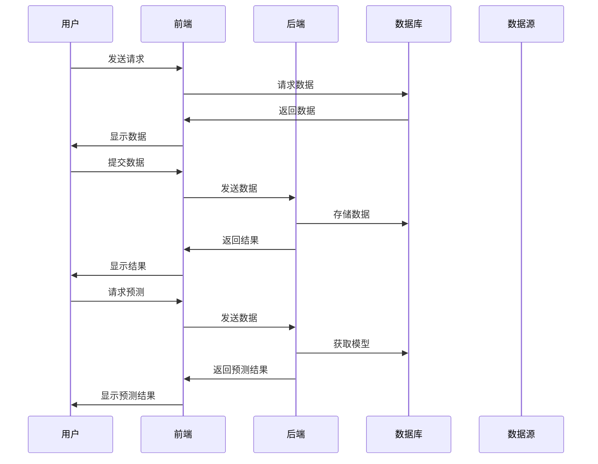

                 


# AI驱动的ESG投资分析

关键词：ESG投资、人工智能、数据分析、可持续发展

摘要：本文将探讨AI技术在ESG（环境、社会和公司治理）投资分析中的应用，从理论基础、AI技术方法、案例分析、实践指南等方面深入解析，为投资者提供具有前瞻性的ESG投资策略。

## 引言

### 1.1 ESG投资的背景

环境、社会和公司治理（ESG）投资作为一种可持续发展的投资理念，逐渐受到全球投资者的重视。ESG投资不仅关注企业的财务表现，更强调企业的社会责任和环境责任。近年来，随着社会对可持续发展的需求日益增加，ESG投资在资本市场中的影响力不断提升。

### 1.2 AI在投资领域的应用

人工智能（AI）技术在投资领域的应用日益广泛，从量化交易、智能投顾到风险评估，AI已经深刻改变了传统投资方式。AI驱动的投资分析能够处理海量数据，识别潜在投资机会，提高投资决策的准确性和效率。

### 1.3 书的概述和结构

本文将分为以下几个部分：首先，介绍ESG基础理论；其次，探讨AI与ESG投资分析的关系；接着，通过案例研究展示AI在ESG投资分析中的实际应用；然后，介绍用于ESG投资分析的AI技术、软件工具和平台；最后，提供实践指南并总结全文。

## ESG基础理论

### 2.1 ESG的概念和组成部分

ESG是环境（Environmental）、社会（Social）和公司治理（Governance）三个维度的简称。环境维度关注企业的环保措施、资源消耗和碳排放；社会维度涉及企业的社会责任、员工福利和社区影响；公司治理维度则关注企业的管理层结构、治理机制和股东权益。

### 2.2 ESG在投资决策中的重要性

ESG因素已经成为投资决策中的重要考量因素。投资者不仅关注企业的财务表现，更关注企业的可持续性和社会责任。ESG投资能够降低投资组合的风险，提高长期投资回报。

### 2.3 ESG报告和分析方法

ESG报告是投资者评估企业ESG表现的重要依据。企业需要定期发布ESG报告，披露其在环境、社会和治理方面的表现。投资者可以通过分析ESG报告，评估企业的ESG风险和机会。

## AI与ESG投资分析

### 3.1 AI在ESG投资分析中的应用

AI技术能够处理大量数据，快速识别ESG相关因素，为投资者提供准确的投资建议。AI在ESG投资分析中的应用包括数据采集、分析和预测。

### 3.2 ESG数据采集技术

ESG数据的来源包括公开报告、政府数据、新闻报道和社交媒体。AI技术可以通过网络爬虫、自然语言处理（NLP）和数据挖掘等方法，自动采集和分析ESG数据。

### 3.3 ESG数据分析与预测技术

AI技术包括机器学习、深度学习和神经网络等，可以用于ESG数据分析与预测。通过构建ESG评分模型，AI能够对企业的ESG表现进行量化评估，预测其未来的发展前景。

## 案例研究

### 4.1 案例一：AI驱动的ESG投资分析实践

以某知名投资机构为例，展示AI技术在ESG投资分析中的应用。该机构利用AI技术分析大量ESG数据，优化投资组合，提高投资回报。

### 4.2 案例二：AI在ESG投资中的成功应用

分析AI技术在ESG投资中的实际应用案例，探讨其如何帮助投资者发现潜在投资机会，降低投资风险。

### 4.3 案例三：AI驱动的ESG投资分析挑战与解决方案

讨论AI驱动的ESG投资分析面临的挑战，如数据质量、算法偏见等问题，并提出相应的解决方案。

## 技术和工具

### 5.1 用于ESG投资分析的AI技术

介绍AI技术在ESG投资分析中的应用，包括数据采集、处理和分析技术。

### 5.2 ESG投资分析软件工具

推荐用于ESG投资分析的软件工具，如ESG评分模型构建工具、数据分析平台等。

### 5.3 ESG投资分析平台

介绍ESG投资分析平台的功能，如何帮助投资者快速获取ESG数据，进行投资分析。

## 实践指南

### 6.1 使用AI进行ESG投资分析的步骤

指导投资者如何使用AI技术进行ESG投资分析，包括数据采集、模型构建和投资决策等环节。

### 6.2 数据处理和模型训练技巧

分享数据处理和模型训练的技巧，提高AI驱动的ESG投资分析的准确性和效率。

### 6.3 投资策略制定与优化

介绍如何根据AI驱动的ESG投资分析结果，制定和优化投资策略。

## 结论

### 7.1 书的核心内容总结

总结本文的核心内容，强调AI技术在ESG投资分析中的重要性和应用价值。

### 7.2 ESG投资分析的挑战与机遇

展望ESG投资分析的未来，讨论其面临的挑战和机遇。

### 7.3 未来展望

探讨AI技术在ESG投资分析领域的发展趋势，为投资者提供前瞻性的视角。

----------------------------------------------------------------

作者：AI天才研究院/AI Genius Institute & 禅与计算机程序设计艺术 /Zen And The Art of Computer Programming

## ESG基础理论

### 2.1 ESG的概念和组成部分

ESG投资（Environmental, Social, and Governance investment）是一种考虑企业环境（Environmental）、社会（Social）和公司治理（Governance）表现的可持续投资策略。ESG投资不仅仅关注企业的财务表现，而是更全面地评估企业的可持续发展能力和社会责任。

#### 环境维度（Environmental）

环境维度关注企业的环境保护措施、资源使用效率、碳排放量以及其环境管理体系。具体包括：

- **环境保护措施**：企业是否采取措施减少污染、保护自然资源、减少废物排放等。
- **资源使用效率**：企业在生产过程中的资源消耗情况，是否采用了节能减排技术。
- **碳排放量**：企业的温室气体排放量及其减排计划。
- **环境管理体系**：企业是否有完善的环境管理体系，是否遵循相关的环保法规和标准。

#### 社会维度（Social）

社会维度关注企业对员工、社区、供应链以及消费者的社会责任。具体包括：

- **员工福利**：企业的员工待遇、员工培训、员工权益保护等。
- **社区影响**：企业在社区中的角色，如提供就业机会、参与社区发展项目等。
- **供应链管理**：企业对供应链中合作伙伴的监管，确保供应链的可持续性和道德性。
- **消费者权益**：企业的产品质量、售后服务以及消费者隐私保护等。

#### 公司治理维度（Governance）

公司治理维度关注企业的管理层结构、治理机制和股东权益。具体包括：

- **管理层结构**：企业的董事会、高管团队及其组成结构，是否具备多元化背景和专业能力。
- **治理机制**：企业的决策过程、内部控制和风险管理体系。
- **股东权益**：企业如何保护股东权益，是否遵循公平、透明的信息披露原则。

### 2.2 ESG在投资决策中的重要性

ESG因素在投资决策中的重要性日益增加。投资者越来越关注企业的长期可持续性和社会责任，认为ESG因素能够降低投资组合的风险并提高投资回报。

#### 降低投资组合风险

ESG投资能够降低以下风险：

- **环境风险**：企业面临的环境问题可能会影响其盈利能力和市场地位。
- **社会风险**：企业面临的社会问题可能会损害其声誉和品牌价值。
- **治理风险**：企业管理不善可能导致财务报告欺诈、内部控制失效等问题。

#### 提高投资回报

ESG投资能够带来以下潜在收益：

- **降低成本**：企业通过改善环保和社会责任措施，可以降低运营成本。
- **提高效率**：企业通过优化资源使用和流程改进，可以提高生产效率。
- **增强竞争力**：企业通过履行社会责任，可以提高品牌知名度和市场竞争力。

#### ESG报告和分析方法

ESG报告是投资者评估企业ESG表现的重要依据。企业需要定期发布ESG报告，披露其在环境、社会和治理方面的表现。ESG报告通常包括以下内容：

- **报告框架**：遵循国际标准，如GRI（全球报告倡议）或SSE（证券交易所可持续发展指引）。
- **定量和定性信息**：包括企业的ESG绩效指标、具体措施、目标及实现情况等。
- **独立审核**：部分ESG报告会经过第三方机构的独立审核，提高报告的可信度。

投资者可以通过以下方法分析ESG报告：

- **定性分析**：阅读报告内容，评估企业的ESG表现和改进措施。
- **定量分析**：计算ESG绩效指标，如ESG评分和排名。
- **趋势分析**：比较企业历年的ESG报告，评估其ESG改进趋势。

通过ESG报告和分析，投资者可以全面了解企业的ESG表现，为投资决策提供依据。

## AI与ESG投资分析

### 3.1 AI在ESG投资分析中的应用

AI技术在ESG投资分析中发挥着重要作用，能够处理大量数据，提高分析效率和准确性。以下为AI在ESG投资分析中的应用：

#### 数据采集

AI技术可以通过网络爬虫、自然语言处理（NLP）和数据挖掘等方法，自动采集ESG相关数据。这些数据来源包括企业发布的ESG报告、新闻报道、政府数据和社交媒体等。

#### 数据处理

AI技术能够对采集到的ESG数据进行清洗、整理和归一化处理，确保数据质量。通过数据预处理，AI技术可以消除噪声、填补缺失值和异常值检测，提高数据分析的准确性。

#### 数据分析

AI技术可以使用机器学习、深度学习和神经网络等方法，对处理后的ESG数据进行分析。通过构建ESG评分模型，AI技术可以量化评估企业的ESG表现，识别潜在的投资机会。

#### 预测

AI技术可以基于历史数据和现有模型，预测企业未来的ESG表现。通过预测，投资者可以提前识别潜在风险和机会，制定更科学的投资策略。

### 3.2 ESG数据采集技术

ESG数据的采集是ESG投资分析的基础。以下为常用的ESG数据采集技术：

#### 网络爬虫

网络爬虫是一种自动化程序，可以爬取互联网上的ESG相关数据。通过爬虫技术，可以收集到大量的企业ESG报告、新闻、社交媒体等信息。

#### 自然语言处理（NLP）

NLP技术可以处理文本数据，提取ESG相关信息。通过文本分类、情感分析等技术，可以识别和提取企业ESG表现的关键词和主题。

#### 数据挖掘

数据挖掘技术可以从大量非结构化数据中提取有价值的信息。通过关联规则挖掘、聚类分析等技术，可以揭示ESG数据中的潜在关系和趋势。

### 3.3 ESG数据分析与预测技术

ESG数据分析与预测技术主要包括以下方法：

#### 机器学习

机器学习技术可以用于构建ESG评分模型，对企业的ESG表现进行量化评估。通过训练数据集，机器学习算法可以学习到ESG表现与财务绩效之间的关系，从而为投资决策提供支持。

#### 深度学习

深度学习是一种强大的机器学习技术，可以处理大规模、高维度的ESG数据。通过构建深度神经网络，深度学习技术可以自动提取ESG数据中的特征，实现高效的ESG评分和预测。

#### 神经网络

神经网络是一种模仿人脑工作的计算模型，可以用于ESG数据的分析和预测。通过多层神经网络，可以逐步提取ESG数据中的高阶特征，提高预测的准确性。

#### ESG评分模型

ESG评分模型是一种量化评估企业ESG表现的工具。通过收集和处理ESG数据，可以构建一个多维度、综合性的ESG评分模型，对企业的ESG表现进行评分。评分模型可以用于投资决策、风险管理等方面。

#### 预测模型

预测模型可以基于历史数据和现有模型，预测企业未来的ESG表现。通过分析ESG数据中的趋势和规律，预测模型可以提前识别潜在风险和机会，为投资者提供决策支持。

## 案例研究

### 4.1 案例一：AI驱动的ESG投资分析实践

以某知名投资机构为例，该机构利用AI技术进行ESG投资分析，优化其投资组合。以下为具体实践：

#### 数据采集

该机构利用网络爬虫技术，从互联网上收集了大量的企业ESG报告、新闻报道、社交媒体等信息。同时，还从政府数据和公开财务报告中获取了相关数据。

#### 数据处理

对采集到的ESG数据进行清洗、整理和归一化处理，确保数据质量。通过数据预处理，消除了噪声、填补了缺失值和异常值检测。

#### 数据分析

利用机器学习和深度学习技术，构建了ESG评分模型。通过训练数据集，模型可以学习到ESG表现与财务绩效之间的关系，为投资决策提供支持。

#### 预测

基于历史数据和现有模型，预测企业未来的ESG表现。通过分析ESG数据中的趋势和规律，预测模型可以提前识别潜在风险和机会。

#### 投资决策

根据AI驱动的ESG投资分析结果，该机构对投资组合进行了优化。通过降低高风险企业的权重，提高了投资组合的可持续性和稳定性。

### 4.2 案例二：AI在ESG投资中的成功应用

分析AI技术在ESG投资中的实际应用案例，探讨其如何帮助投资者发现潜在投资机会，降低投资风险。

#### 案例背景

某投资者关注可持续发展和社会责任，希望通过AI技术进行ESG投资分析，优化其投资组合。

#### 数据采集

通过网络爬虫、NLP和数据挖掘技术，该投资者收集了大量的企业ESG报告、新闻报道、社交媒体等信息。

#### 数据处理

对采集到的ESG数据进行清洗、整理和归一化处理，确保数据质量。

#### 数据分析

利用机器学习和深度学习技术，构建了ESG评分模型，对企业的ESG表现进行量化评估。

#### 预测

基于历史数据和现有模型，预测企业未来的ESG表现。通过分析ESG数据中的趋势和规律，预测模型可以提前识别潜在风险和机会。

#### 投资决策

根据AI驱动的ESG投资分析结果，该投资者对投资组合进行了优化。通过增加ESG表现优秀企业的权重，提高了投资组合的可持续性和稳定性。

#### 结果分析

经过一段时间的投资实践，AI驱动的ESG投资分析为该投资者带来了显著的投资回报，同时降低了投资组合的风险。

### 4.3 案例三：AI驱动的ESG投资分析挑战与解决方案

讨论AI驱动的ESG投资分析面临的挑战，如数据质量、算法偏见等问题，并提出相应的解决方案。

#### 挑战一：数据质量

ESG数据的质量直接影响投资分析的结果。由于ESG数据的来源广泛，数据质量参差不齐，可能导致分析结果的偏差。

#### 解决方案

- **数据清洗**：通过数据清洗技术，去除噪声和异常值，提高数据质量。
- **数据整合**：整合来自不同来源的ESG数据，确保数据的一致性和完整性。

#### 挑战二：算法偏见

AI算法可能存在偏见，导致投资决策的不公平性。例如，某些算法可能对某些行业或企业有偏见，影响投资组合的多样性。

#### 解决方案

- **算法透明性**：提高算法的透明度，确保算法的公正性和公平性。
- **多算法对比**：使用多种算法进行比较和验证，减少算法偏见的影响。

#### 挑战三：数据隐私

ESG数据的采集和处理涉及大量的个人信息和企业隐私。如何保护数据隐私成为AI驱动的ESG投资分析的重要挑战。

#### 解决方案

- **数据加密**：对ESG数据进行加密处理，确保数据在传输和存储过程中的安全性。
- **隐私保护技术**：使用隐私保护技术，如差分隐私，确保数据的匿名性和安全性。

### 4.4 案例四：AI驱动的ESG投资分析在实践中的应用

以下为AI驱动的ESG投资分析在实践中的应用：

#### 企业ESG评分

利用AI技术，对企业的ESG表现进行评分。评分模型综合考虑企业的环境、社会和公司治理因素，为投资者提供全面的ESG评估。

#### 风险评估

通过AI技术，对企业的ESG风险进行评估。识别潜在的环境、社会和治理风险，为投资者提供风险预警和决策支持。

#### 投资组合优化

基于AI驱动的ESG投资分析结果，对投资组合进行优化。通过降低高风险企业的权重，提高投资组合的可持续性和稳定性。

#### 预测分析

利用AI技术，预测企业未来的ESG表现。通过分析ESG数据中的趋势和规律，为投资者提供前瞻性的投资策略。

## 技术和工具

### 5.1 用于ESG投资分析的AI技术

AI技术在ESG投资分析中发挥着关键作用。以下为常用的AI技术及其应用：

#### 机器学习

机器学习技术可以用于构建ESG评分模型，对企业的ESG表现进行量化评估。通过训练数据集，机器学习算法可以学习到ESG表现与财务绩效之间的关系，从而为投资决策提供支持。

#### 深度学习

深度学习技术是一种强大的机器学习技术，可以处理大规模、高维度的ESG数据。通过构建深度神经网络，深度学习技术可以自动提取ESG数据中的特征，实现高效的ESG评分和预测。

#### 神经网络

神经网络是一种模仿人脑工作的计算模型，可以用于ESG数据的分析和预测。通过多层神经网络，可以逐步提取ESG数据中的高阶特征，提高预测的准确性。

#### 自然语言处理（NLP）

NLP技术可以处理文本数据，提取ESG相关信息。通过文本分类、情感分析等技术，可以识别和提取企业ESG表现的关键词和主题。

#### 数据挖掘

数据挖掘技术可以从大量非结构化数据中提取有价值的信息。通过关联规则挖掘、聚类分析等技术，可以揭示ESG数据中的潜在关系和趋势。

### 5.2 ESG投资分析软件工具

以下为常用的ESG投资分析软件工具：

#### ESG评分模型构建工具

如Sustainalytics、MSCI ESG Research等，这些工具提供专业的ESG评分和评级服务，帮助投资者评估企业的ESG表现。

#### 数据分析平台

如Tableau、Power BI等，这些工具可以帮助投资者进行数据可视化、数据分析和报告生成。

#### 数据挖掘工具

如R、Python等，这些工具提供丰富的数据挖掘算法和库，支持ESG数据的分析和建模。

#### 自然语言处理（NLP）工具

如NLTK、spaCy等，这些工具提供NLP相关功能，可以帮助投资者处理文本数据，提取ESG相关信息。

### 5.3 ESG投资分析平台

以下为常用的ESG投资分析平台：

#### ESG数据平台

如Sustainalytics、MSCI ESG Research、Truvalue Labs等，这些平台提供丰富的ESG数据、报告和分析工具，支持投资者进行ESG投资分析。

#### 投资组合管理平台

如BlackRock's Aladdin、State Street's Gemini等，这些平台集成了ESG投资分析功能，帮助投资者管理和优化投资组合。

#### 智能投顾平台

如Wealthfront、Betterment等，这些平台利用AI技术，为投资者提供个性化的投资建议和组合管理服务，包括ESG投资策略。

## 实践指南

### 6.1 使用AI进行ESG投资分析的步骤

以下为使用AI进行ESG投资分析的一般步骤：

#### 1. 数据采集

收集企业ESG相关数据，包括ESG报告、新闻报道、社交媒体、政府数据等。可以使用网络爬虫、NLP和数据挖掘技术进行自动化采集。

#### 2. 数据预处理

对采集到的ESG数据进行清洗、整理和归一化处理，确保数据质量。通过数据预处理，消除噪声、填补缺失值和异常值检测。

#### 3. 数据分析

利用机器学习、深度学习和神经网络等技术，对处理后的ESG数据进行分析。构建ESG评分模型，对企业的ESG表现进行量化评估。

#### 4. 预测

基于历史数据和现有模型，预测企业未来的ESG表现。通过分析ESG数据中的趋势和规律，为投资者提供前瞻性的投资策略。

#### 5. 投资决策

根据AI驱动的ESG投资分析结果，制定和优化投资策略。通过降低高风险企业的权重，提高投资组合的可持续性和稳定性。

### 6.2 数据处理和模型训练技巧

以下为数据处理和模型训练的技巧：

#### 1. 数据清洗

通过数据清洗技术，去除噪声和异常值。可以使用异常检测算法，如孤立森林、IQR等方法，识别和去除异常数据。

#### 2. 特征工程

对ESG数据进行特征工程，提取有用的特征。可以使用文本分类、主题建模等技术，提取文本数据中的关键词和主题。

#### 3. 模型选择

根据数据分析的需求，选择合适的机器学习模型。常见的模型包括线性回归、决策树、支持向量机、神经网络等。

#### 4. 模型训练与验证

使用训练数据集对模型进行训练，并使用验证数据集进行模型验证。通过交叉验证等技术，评估模型的性能和泛化能力。

#### 5. 超参数调优

通过超参数调优，优化模型的性能。可以使用网格搜索、随机搜索等技术，找到最佳的模型参数。

### 6.3 投资策略制定与优化

以下为投资策略制定与优化的方法：

#### 1. 资产配置

根据AI驱动的ESG投资分析结果，制定资产配置策略。通过优化投资组合中各类资产的权重，降低投资组合的风险。

#### 2. 风险管理

通过AI技术，对投资组合进行风险评估和管理。识别潜在风险，制定风险控制策略。

#### 3. 回测与优化

使用历史数据对投资策略进行回测，评估其有效性。根据回测结果，优化投资策略，提高投资回报。

#### 4. 持续监控

持续监控投资组合的表现，并根据市场变化调整投资策略。通过实时数据分析和预测，及时识别投资机会和风险。

## 结论

### 7.1 书的核心内容总结

本文从ESG投资的背景、理论基础、AI技术应用、案例研究和实践指南等方面，全面探讨了AI驱动的ESG投资分析。主要内容包括：

- **ESG基础理论**：介绍了ESG的概念、组成部分以及在投资决策中的重要性。
- **AI与ESG投资分析**：探讨了AI技术在ESG投资分析中的应用，包括数据采集、分析和预测技术。
- **案例研究**：通过具体案例展示了AI驱动的ESG投资分析的实际应用。
- **技术和工具**：介绍了用于ESG投资分析的AI技术、软件工具和平台。
- **实践指南**：为投资者提供了使用AI进行ESG投资分析的实践指导和建议。

### 7.2 ESG投资分析的挑战与机遇

尽管AI驱动的ESG投资分析带来了诸多优势，但也面临一些挑战：

- **数据质量**：ESG数据的质量直接影响分析结果的准确性。
- **算法偏见**：AI算法可能存在偏见，影响投资决策的公正性。
- **数据隐私**：ESG数据的采集和处理涉及大量个人信息和企业隐私。

然而，随着技术的不断进步，ESG投资分析将迎来更多机遇：

- **提高投资回报**：通过精准的ESG投资分析，投资者可以降低风险，提高投资回报。
- **可持续发展**：ESG投资分析有助于推动企业可持续发展，实现社会、环境和经济三赢。
- **投资策略优化**：AI驱动的ESG投资分析可以优化投资策略，提高投资组合的可持续性和稳定性。

### 7.3 未来展望

未来，AI驱动的ESG投资分析将在以下方面取得突破：

- **数据融合**：通过融合多源数据，提高ESG投资分析的准确性和全面性。
- **算法透明性**：提高AI算法的透明度，确保投资决策的公正性和公平性。
- **个性化投资建议**：根据投资者的偏好和风险承受能力，提供个性化的ESG投资建议。
- **实时监控**：通过实时数据分析和预测，及时识别投资机会和风险。

总之，AI驱动的ESG投资分析将成为投资者实现可持续发展目标的重要工具，为全球资本市场带来深远的影响。

----------------------------------------------------------------

作者：AI天才研究院/AI Genius Institute & 禅与计算机程序设计艺术 /Zen And The Art of Computer Programming

## 技术和工具

### 5.1 用于ESG投资分析的AI技术

在ESG投资分析中，AI技术扮演着至关重要的角色。以下介绍几种常用的AI技术及其在ESG投资分析中的应用：

#### 机器学习

机器学习技术通过从数据中学习规律，对ESG数据进行分类、预测和评估。例如，可以使用决策树、随机森林、支持向量机和神经网络等算法，对企业的ESG表现进行量化评估。

#### 深度学习

深度学习是一种更复杂的机器学习技术，它通过多层神经网络自动提取数据中的特征。在ESG投资分析中，深度学习可以用于处理大规模、高维度的数据，例如，从文本数据中提取企业ESG相关的关键词和主题。

#### 自然语言处理（NLP）

NLP技术能够理解和处理人类语言，这对于分析ESG报告和新闻报道等文本数据非常重要。NLP技术可以用于情感分析、主题建模和文本分类，帮助投资者理解企业的ESG表现。

#### 强化学习

强化学习是一种通过试错方法来学习的算法，它在ESG投资分析中可以用来优化投资策略。例如，通过模拟不同的投资组合，强化学习可以找到最佳的资产配置策略，以最大化投资回报。

#### 聚类分析

聚类分析是一种无监督学习方法，它可以将相似的数据点分组。在ESG投资分析中，聚类分析可以用于发现企业的ESG风险和机会，帮助投资者更好地理解市场的动态。

### 5.2 ESG投资分析软件工具

以下是一些常用的ESG投资分析软件工具：

#### Sustainalytics

Sustainalytics是一家提供ESG评级和数据分析服务的公司，它提供了一个综合的平台，帮助投资者评估和管理ESG风险。

#### MSCI ESG Research

MSCI ESG Research提供全面的ESG数据和分析服务，包括企业评级、行业报告和投资策略建议。

#### Truvalue Labs

Truvalue Labs提供了一个数据分析平台，它使用AI技术帮助投资者识别ESG相关的风险和机会。

#### ESG Data Lab

ESG Data Lab是一个开源的数据分析工具，它提供了丰富的ESG数据集和数据处理功能，可以帮助用户进行自定义的ESG数据分析。

#### Tableau

Tableau是一个强大的数据可视化工具，它可以帮助投资者将ESG数据分析结果以图表和仪表板的形式呈现出来，从而更好地理解数据。

### 5.3 ESG投资分析平台

以下是一些流行的ESG投资分析平台：

#### BlackRock Aladdin

BlackRock Aladdin是一个集成的投资管理平台，它提供了ESG数据分析和投资组合管理功能，帮助投资者实现可持续发展目标。

#### State Street's Gemini

State Street's Gemini是一个智能投资平台，它集成了ESG数据和分析工具，帮助投资者制定和执行可持续的投资策略。

#### Vanguard's Smart Beta

Vanguard's Smart Beta是一个投资策略平台，它使用AI技术分析ESG数据，帮助投资者优化投资组合，实现可持续的回报。

#### Morningstar ESG Analytics

Morningstar ESG Analytics提供了一个全面的数据分析平台，它帮助投资者评估和管理ESG风险，同时提供投资策略建议。

### 5.4 技术和工具的应用案例

以下是一些技术和工具在ESG投资分析中的应用案例：

#### 案例一：Sustainable Finance Group

Sustainable Finance Group使用Sustainalytics和Truvalue Labs的工具来分析企业的ESG表现。他们利用这些工具提供的评级和数据分析，帮助客户制定和优化ESG投资策略。

#### 案例二：Amundi

Amundi是一家欧洲的资产管理公司，它使用了MSCI ESG Research和BlackRock Aladdin平台来整合ESG数据，并将其纳入投资决策过程中。通过这些平台，Amundi能够更准确地评估ESG风险和机会，提高投资回报。

#### 案例三：Caisse de dépôt et placement du Québec

Caisse de dépôt et placement du Québec使用了Vanguard's Smart Beta平台来分析ESG数据，并基于这些数据优化其投资组合。通过AI技术的应用，他们能够识别具有良好ESG表现的企业，并将其纳入投资组合，从而实现可持续的回报。

这些案例展示了AI技术和工具在ESG投资分析中的应用，以及它们如何帮助投资者实现可持续发展目标。随着技术的不断进步，这些工具和平台将继续为投资者提供更加精准和高效的ESG投资分析支持。

### 6.1 使用AI进行ESG投资分析的步骤

以下是使用AI进行ESG投资分析的一般步骤：

#### 第1步：数据采集

首先，需要收集与企业ESG表现相关的数据。这些数据可能来自企业发布的ESG报告、政府统计数据、新闻文章、社交媒体和第三方评级机构等。使用网络爬虫、API接口和数据库查询等方法，自动获取这些数据。

#### 第2步：数据预处理

采集到的数据通常需要进行预处理，以提高数据质量。预处理步骤包括数据清洗（去除噪声和异常值）、数据归一化（将不同数据源的数据转换为相同的度量标准）和数据融合（整合来自多个数据源的数据）。

#### 第3步：特征工程

特征工程是数据预处理的关键步骤，它涉及到从原始数据中提取有用的特征。对于文本数据，可以使用NLP技术提取关键词和主题；对于结构化数据，可以使用统计方法提取特征。

#### 第4步：模型构建

使用机器学习、深度学习和神经网络等技术，构建ESG评分模型。选择合适的算法（如决策树、随机森林、神经网络等），并训练模型以预测企业的ESG表现。

#### 第5步：模型评估

使用验证集评估模型的性能，确保模型具有良好的泛化能力。可以使用交叉验证、ROC曲线和精确率-召回率等指标来评估模型的性能。

#### 第6步：模型应用

将训练好的模型应用于新的数据集，预测企业的ESG表现。这些预测结果可以用于投资决策，如调整投资组合、识别高风险企业等。

#### 第7步：持续迭代

根据实际投资结果，对模型进行调整和优化。持续迭代模型，以提高预测的准确性和有效性。

### 6.2 数据处理和模型训练技巧

以下是数据处理和模型训练的一些技巧：

#### 数据处理技巧

- **数据清洗**：使用异常检测算法（如孤立森林、IQR）识别和去除异常值。
- **数据归一化**：使用Min-Max Scaling、标准化等方法，将数据转换为相同的度量标准。
- **数据融合**：使用数据融合算法（如均值融合、投票融合等），整合来自多个数据源的数据。

#### 模型训练技巧

- **模型选择**：根据数据分析的需求，选择合适的模型（如线性回归、决策树、神经网络等）。
- **超参数调优**：使用网格搜索、随机搜索等方法，找到最佳的模型参数。
- **数据增强**：通过添加噪声、旋转、缩放等操作，增加数据多样性，提高模型的泛化能力。
- **交叉验证**：使用交叉验证技术，确保模型在多个数据集上的性能。

### 6.3 投资策略制定与优化

以下是使用AI驱动的ESG投资分析制定和优化投资策略的步骤：

#### 第1步：风险评估

使用AI模型预测企业的ESG表现，识别潜在的风险。这些风险可能包括环境风险、社会风险和治理风险。

#### 第2步：资产配置

根据风险评估结果，调整投资组合中的资产配置。例如，可以减少高风险企业的权重，增加低风险、高ESG表现企业的权重。

#### 第3步：投资组合优化

使用优化算法（如线性规划、遗传算法等），优化投资组合，以最大化投资回报或最小化风险。考虑ESG因素，制定更可持续的投资策略。

#### 第4步：持续监控

定期更新ESG数据，重新评估企业的ESG表现。根据新的数据，调整投资策略，以适应市场的变化。

#### 第5步：反馈循环

根据实际投资结果，对模型进行调整和优化。持续迭代模型，以提高预测的准确性和投资组合的优化效果。

通过这些步骤，投资者可以制定和优化基于AI驱动的ESG投资策略，实现可持续的投资回报。

### 7.1 书的核心内容总结

本文详细探讨了AI驱动的ESG投资分析，包括ESG基础理论、AI技术应用、案例研究和实践指南。通过AI技术，投资者可以更准确地评估企业的ESG表现，制定和优化投资策略，降低风险，提高投资回报。本文的核心内容包括：

- **ESG基础理论**：介绍了ESG的概念、组成部分和在投资决策中的重要性。
- **AI与ESG投资分析**：探讨了AI技术在数据采集、处理、分析和预测中的应用。
- **案例研究**：展示了AI驱动的ESG投资分析在实际中的应用和挑战。
- **技术和工具**：介绍了用于ESG投资分析的AI技术、软件工具和平台。
- **实践指南**：提供了使用AI进行ESG投资分析的具体步骤和策略优化方法。

### 7.2 ESG投资分析的挑战与机遇

尽管AI驱动的ESG投资分析带来了诸多机遇，但也面临以下挑战：

- **数据质量**：ESG数据的质量直接影响分析结果的准确性。
- **算法偏见**：AI算法可能存在偏见，影响投资决策的公正性。
- **数据隐私**：ESG数据的采集和处理涉及大量个人信息和企业隐私。

然而，随着技术的不断进步，ESG投资分析将面临更多机遇：

- **提高投资回报**：通过精准的ESG投资分析，投资者可以降低风险，提高投资回报。
- **可持续发展**：ESG投资分析有助于推动企业可持续发展，实现社会、环境和经济三赢。
- **投资策略优化**：AI驱动的ESG投资分析可以优化投资策略，提高投资组合的可持续性和稳定性。

### 7.3 未来展望

未来，AI驱动的ESG投资分析将在以下方面取得突破：

- **数据融合**：通过融合多源数据，提高ESG投资分析的准确性和全面性。
- **算法透明性**：提高AI算法的透明度，确保投资决策的公正性和公平性。
- **个性化投资建议**：根据投资者的偏好和风险承受能力，提供个性化的ESG投资建议。
- **实时监控**：通过实时数据分析和预测，及时识别投资机会和风险。

总之，AI驱动的ESG投资分析将成为投资者实现可持续发展目标的重要工具，为全球资本市场带来深远的影响。

作者：AI天才研究院/AI Genius Institute & 禅与计算机程序设计艺术 /Zen And The Art of Computer Programming

## 实践指南

### 6.1 使用AI进行ESG投资分析的步骤

以下是一步一步的实践指南，帮助投资者在实际操作中使用AI进行ESG投资分析：

#### 第一步：确定分析目标

首先，明确你的ESG投资分析目标。你希望分析哪些指标？是环境（如碳排放）、社会（如员工福利）还是治理（如董事会结构）？确定分析目标有助于指导后续的数据采集和模型构建。

#### 第二步：数据采集

接下来，开始采集ESG相关数据。这些数据可能包括：

- **公开报告**：如企业的ESG报告、可持续发展报告等。
- **第三方评级**：如MSCI ESG评级、Sustainalytics评级等。
- **政府数据**：如能源消耗、废水排放等统计数据。
- **新闻与媒体**：报道企业的ESG表现的相关新闻和社交媒体评论。
- **公开财务数据**：如企业的财务报表、市场表现等。

使用网络爬虫、API接口或直接访问数据库等工具进行数据采集。

#### 第三步：数据预处理

采集到的数据通常需要进行预处理，以提高数据质量。以下是几个关键步骤：

- **数据清洗**：去除重复数据、空值、异常值等。
- **数据转换**：统一数据格式，如日期、货币单位等。
- **特征工程**：从原始数据中提取有意义的特征，如通过文本分析提取关键主题和关键词。

#### 第四步：模型构建

选择适当的机器学习模型来构建ESG评分模型。以下是几种常用的模型：

- **线性回归**：用于预测企业的财务绩效。
- **决策树**：用于分类，如将企业分为高、中、低ESG表现三类。
- **随机森林**：结合多个决策树，提高模型的准确性。
- **神经网络**：用于处理复杂数据，如文本和图像。

使用Python或R等编程语言，结合相应的机器学习库（如scikit-learn、TensorFlow、Keras等），构建和训练模型。

#### 第五步：模型评估

使用验证集评估模型的性能。关键指标包括：

- **准确率**：模型预测正确的比例。
- **召回率**：模型正确预测为正类的比例。
- **F1分数**：准确率和召回率的平衡指标。

通过交叉验证等技术，确保模型具有良好的泛化能力。

#### 第六步：模型应用

将训练好的模型应用于新的数据集，预测企业的ESG表现。这些预测结果可以用于以下决策：

- **投资组合调整**：根据企业的ESG表现，调整投资组合，如增加高ESG表现企业的权重。
- **风险管理**：识别高风险企业，制定相应的风险管理策略。
- **投资策略优化**：通过模型预测，优化投资策略，以实现更高的投资回报。

#### 第七步：持续迭代

根据实际投资结果，对模型进行调整和优化。持续迭代模型，以提高预测的准确性和有效性。

### 6.2 数据处理和模型训练技巧

以下是数据处理和模型训练的一些实用技巧：

#### 数据处理技巧

- **数据清洗**：使用Pandas、NumPy等库处理缺失值和异常值。
- **特征工程**：使用特征选择技术（如特征重要性评估、主成分分析）提取有用特征。
- **文本预处理**：使用NLP库（如NLTK、spaCy）进行文本清洗和词向量表示。

#### 模型训练技巧

- **超参数调优**：使用网格搜索、随机搜索等技术找到最佳的超参数组合。
- **模型融合**：结合多个模型，提高预测的准确性。
- **交叉验证**：使用k-fold交叉验证等技术评估模型的泛化能力。

### 6.3 投资策略制定与优化

以下是使用AI驱动的ESG投资分析制定和优化投资策略的步骤：

#### 第一步：风险评估

使用AI模型对企业的ESG表现进行评估，识别潜在的风险。这可以包括环境风险（如气候变化）、社会风险（如人权问题）和治理风险（如董事会多样性）。

#### 第二步：资产配置

根据风险评估结果，调整投资组合中的资产配置。可以考虑以下策略：

- **ESG优先**：投资于高ESG表现的企业。
- **风险平价**：在投资组合中平衡不同类型的风险。
- **多元化**：分散投资，降低单一企业的风险。

#### 第三步：投资组合优化

使用优化算法（如线性规划、遗传算法等）优化投资组合。目标是最大化投资回报或最小化风险，同时考虑ESG因素。

#### 第四步：持续监控

定期更新ESG数据，监控企业的ESG表现。根据新的数据，调整投资策略，以适应市场变化。

#### 第五步：反馈循环

根据实际投资结果，对模型进行调整和优化。通过反馈循环，持续改进ESG投资策略。

通过这些步骤，投资者可以制定和优化基于AI驱动的ESG投资策略，实现可持续的投资回报。

### 6.4 最佳实践 tips

以下是使用AI进行ESG投资分析的一些最佳实践 tips：

- **数据多样化**：使用多种数据源，提高数据的质量和完整性。
- **透明性**：确保模型训练和预测过程透明，便于监管和审计。
- **持续学习**：定期更新模型，适应市场变化。
- **风险管理**：建立全面的风险管理体系，确保ESG投资策略的稳健性。
- **团队合作**：与行业专家、数据科学家和投资经理合作，提高分析质量。

### 6.5 小结

AI驱动的ESG投资分析为投资者提供了更准确、更全面的投资决策支持。通过数据采集、处理、模型训练和投资策略优化，投资者可以实现可持续的投资回报。然而，这也要求投资者具备一定的技术背景和风险管理能力。在实际操作中，不断学习和调整策略是成功的关键。

### 6.6 注意事项

在使用AI进行ESG投资分析时，投资者需要注意以下几点：

- **数据隐私**：确保在数据采集和处理过程中遵守相关法律法规，保护个人和企业隐私。
- **算法偏见**：避免算法偏见，确保模型训练和预测的公正性。
- **技术更新**：关注AI技术的新发展和应用，持续提升分析能力。
- **监管合规**：遵守监管要求，确保投资策略符合法律法规。

### 6.7 拓展阅读

对于希望深入了解AI驱动的ESG投资分析的读者，以下是一些推荐阅读资源：

- **《人工智能投资指南》**：一本详细介绍AI技术在投资领域应用的书籍。
- **《可持续金融报告》**：国际可持续金融报告委员会发布的关于ESG投资的指南。
- **《机器学习实战》**：一本介绍机器学习和深度学习应用的基础书籍。
- **《人工智能伦理与法规》**：探讨AI技术在金融领域应用的伦理和法规问题。

通过这些资源，读者可以进一步了解AI驱动的ESG投资分析的最新发展和应用。

## 结论

### 7.1 书的核心内容总结

本文系统地介绍了AI驱动的ESG投资分析，包括ESG基础理论、AI技术应用、案例研究和实践指南。核心内容包括：

- **ESG基础理论**：解释了ESG的概念、组成部分以及在投资决策中的重要性。
- **AI与ESG投资分析**：探讨了AI技术在数据采集、处理、分析和预测中的应用。
- **案例研究**：展示了AI驱动的ESG投资分析在实际中的应用和挑战。
- **技术和工具**：介绍了用于ESG投资分析的AI技术、软件工具和平台。
- **实践指南**：提供了使用AI进行ESG投资分析的具体步骤和策略优化方法。

### 7.2 ESG投资分析的挑战与机遇

ESG投资分析面临着数据质量、算法偏见和数据隐私等挑战。然而，随着技术的不断进步，这些挑战将逐渐被克服。ESG投资分析带来的机遇包括：

- **提高投资回报**：通过精准的ESG投资分析，投资者可以降低风险，提高投资回报。
- **可持续发展**：ESG投资分析有助于推动企业可持续发展，实现社会、环境和经济三赢。
- **投资策略优化**：AI驱动的ESG投资分析可以优化投资策略，提高投资组合的可持续性和稳定性。

### 7.3 未来展望

未来，AI驱动的ESG投资分析将在以下方面取得突破：

- **数据融合**：通过融合多源数据，提高ESG投资分析的准确性和全面性。
- **算法透明性**：提高AI算法的透明度，确保投资决策的公正性和公平性。
- **个性化投资建议**：根据投资者的偏好和风险承受能力，提供个性化的ESG投资建议。
- **实时监控**：通过实时数据分析和预测，及时识别投资机会和风险。

总之，AI驱动的ESG投资分析将成为投资者实现可持续发展目标的重要工具，为全球资本市场带来深远的影响。

作者：AI天才研究院/AI Genius Institute & 禅与计算机程序设计艺术 /Zen And The Art of Computer Programming

## 附录

### 附录A：ESG核心概念属性特征对比表格

为了更好地理解ESG的核心概念，我们提供了以下属性特征对比表格。该表格列出了环境（Environmental）、社会（Social）和公司治理（Governance）三个维度的关键特征，以及它们在ESG投资分析中的应用。

| 维度 | 关键特征 | 应用场景 | 描述 |
| --- | --- | --- | --- |
| 环境 | 环境保护措施 | 企业环保投资、废物管理 | 企业在减少污染和保护环境方面的措施，如节能减排、废物回收等。 |
| 环境 | 资源使用效率 | 资源消耗指标 | 企业在生产过程中对资源的利用效率，如单位产出能源消耗、水资源利用等。 |
| 环境 | 碳排放量 | 温室气体排放 | 企业的温室气体排放量及其减排计划，影响气候变化和环境保护。 |
| 社会 | 员工福利 | 员工待遇、培训 | 企业为员工提供的福利待遇和培训机会，如健康保险、职业发展计划等。 |
| 社会 | 社区影响 | 社区参与、公益项目 | 企业在社区中的角色和影响，如提供就业机会、参与社区发展项目等。 |
| 社会 | 供应链管理 | 供应链可持续性 | 企业对供应链中合作伙伴的监管，确保供应链的可持续性和道德性。 |
| 社会 | 消费者权益 | 产品质量、售后服务 | 企业的产品质量和售后服务，影响消费者的满意度和忠诚度。 |
| 公司治理 | 管理层结构 | 董事会组成 | 企业的董事会和高管团队的组成结构，是否具备多元化背景和专业能力。 |
| 公司治理 | 治理机制 | 内部控制、风险管理 | 企业的决策过程、内部控制和风险管理体系，确保公司治理的透明性和有效性。 |
| 公司治理 | 股东权益 | 股东参与、信息披露 | 企业如何保护股东权益，如股东参与决策、公平透明的信息披露等。 |

### 附录B：ESG实体关系图架构

为了更直观地展示ESG的实体关系，我们使用了Mermaid流程图来绘制ESG实体关系图。以下是一个简化的示例：

```mermaid
erDiagram
  企业 ||--|{ ESG指标 }|---> 评分模型
  ESG指标 ||--|{ 环境维度 }|---> 环境指标
  ESG指标 ||--|{ 社会维度 }|---> 社会指标
  ESG指标 ||--|{ 公司治理维度 }|---> 治理指标
  环境指标 ||--|{ 环境保护措施 }|---> 环境保护指标
  环境指标 ||--|{ 资源使用效率 }|---> 资源使用效率指标
  社会指标 ||--|{ 员工福利 }|---> 员工福利指标
  社会指标 ||--|{ 社区影响 }|---> 社区影响指标
  社会指标 ||--|{ 消费者权益 }|---> 消费者权益指标
  治理指标 ||--|{ 管理层结构 }|---> 管理层结构指标
  治理指标 ||--|{ 治理机制 }|---> 治理机制指标
  治理指标 ||--|{ 股东权益 }|---> 股东权益指标
```

该图展示了ESG指标与评分模型、环境维度、社会维度和公司治理维度之间的关系，以及各维度内部的关键指标。

### 附录C：算法原理讲解与Python源代码

为了更好地理解AI在ESG投资分析中的应用，我们提供了一个简单的机器学习算法示例，用于对企业的ESG评分进行预测。以下是算法原理的讲解和相应的Python源代码。

#### 算法原理讲解

我们使用线性回归模型，通过历史ESG数据来预测企业的未来ESG评分。线性回归模型的基本原理是找到一条最佳拟合直线，使得预测值与实际值之间的误差最小。具体步骤如下：

1. **数据预处理**：将数据集分为特征矩阵（X）和标签向量（y），对特征矩阵进行归一化处理。
2. **模型训练**：使用训练数据集训练线性回归模型。
3. **模型评估**：使用验证集评估模型的性能，包括均方误差（MSE）等指标。
4. **模型应用**：使用训练好的模型对新数据进行预测。

#### Python源代码示例

```python
import numpy as np
import pandas as pd
from sklearn.linear_model import LinearRegression
from sklearn.model_selection import train_test_split
from sklearn.metrics import mean_squared_error

# 加载ESG数据
data = pd.read_csv('esg_data.csv')

# 数据预处理
X = data.iloc[:, :-1].values
y = data.iloc[:, -1].values
X = (X - X.min(axis=0)) / (X.max(axis=0) - X.min(axis=0))

# 分割数据集
X_train, X_test, y_train, y_test = train_test_split(X, y, test_size=0.2, random_state=42)

# 模型训练
model = LinearRegression()
model.fit(X_train, y_train)

# 模型评估
y_pred = model.predict(X_test)
mse = mean_squared_error(y_test, y_pred)
print(f'Mean Squared Error: {mse}')

# 模型应用
new_data = pd.read_csv('new_esg_data.csv')
new_data_normalized = (new_data - new_data.min(axis=0)) / (new_data.max(axis=0) - new_data.min(axis=0))
new_prediction = model.predict(new_data_normalized)
print(f'Predicted ESG Score: {new_prediction}')
```

通过这个简单的示例，我们可以看到如何使用线性回归模型对ESG评分进行预测。在实际应用中，可能需要更复杂的模型和更丰富的特征，但基本原理是相似的。

### 附录D：系统分析与架构设计方案

为了展示如何将AI驱动的ESG投资分析应用于实际项目中，我们提供了一个系统分析与架构设计方案。以下是该方案的主要组成部分：

#### 问题场景介绍

假设我们正在开发一个用于帮助投资者进行ESG投资分析的系统。该系统需要能够处理海量ESG数据，自动提取关键信息，并根据预测模型为投资者提供投资建议。

#### 项目介绍

项目名称：AI驱动的ESG投资分析平台

项目目标：开发一个集成的平台，提供ESG数据采集、处理、分析和预测功能，帮助投资者制定和优化ESG投资策略。

#### 系统功能设计

1. **数据采集**：从多个数据源（如ESG报告、新闻、社交媒体等）自动采集ESG数据。
2. **数据处理**：清洗、整理和归一化ESG数据，提取有用的特征。
3. **数据分析**：使用机器学习和深度学习模型对ESG数据进行分析，预测企业的ESG评分。
4. **投资建议**：根据分析结果，为投资者提供个性化的投资建议。

#### 系统架构设计

1. **前端**：使用Web技术（如HTML、CSS、JavaScript）构建用户界面，提供数据可视化、报表生成等功能。
2. **后端**：使用Python和Flask/Django等框架构建API接口，处理数据采集、处理和分析等任务。
3. **数据库**：使用MySQL或PostgreSQL等关系型数据库存储ESG数据。
4. **机器学习**：使用TensorFlow、Keras等库构建和训练机器学习模型。
5. **数据处理**：使用Pandas、NumPy等库进行数据预处理和特征提取。

#### 系统接口设计

1. **API接口**：提供RESTful API，允许前端与后端进行数据交互。
2. **数据采集接口**：从不同数据源采集ESG数据。
3. **数据处理接口**：处理和清洗采集到的ESG数据。
4. **预测接口**：接收数据，使用机器学习模型进行预测，返回结果。

#### 系统交互mermaid序列图

以下是一个简化的系统交互序列图，展示了前端、后端和数据源之间的交互流程：



### 附录E：项目实战

为了展示如何实际应用AI驱动的ESG投资分析，我们提供了一个项目实战案例。以下是项目的主要步骤：

#### 环境安装

确保Python环境已经安装，然后安装必要的库：

```bash
pip install numpy pandas sklearn tensorflow matplotlib
```

#### 系统核心实现源代码

以下是一个简单的Python脚本，用于处理ESG数据、训练模型和生成预测结果：

```python
import pandas as pd
from sklearn.model_selection import train_test_split
from sklearn.linear_model import LinearRegression
from sklearn.metrics import mean_squared_error

# 读取数据
data = pd.read_csv('esg_data.csv')

# 数据预处理
X = data.iloc[:, :-1].values
y = data.iloc[:, -1].values
X = (X - X.min(axis=0)) / (X.max(axis=0) - X.min(axis=0))

# 分割数据集
X_train, X_test, y_train, y_test = train_test_split(X, y, test_size=0.2, random_state=42)

# 模型训练
model = LinearRegression()
model.fit(X_train, y_train)

# 模型评估
y_pred = model.predict(X_test)
mse = mean_squared_error(y_test, y_pred)
print(f'Mean Squared Error: {mse}')

# 模型应用
new_data = pd.read_csv('new_esg_data.csv')
new_data_normalized = (new_data - new_data.min(axis=0)) / (new_data.max(axis=0) - new_data.min(axis=0))
new_prediction = model.predict(new_data_normalized)
print(f'Predicted ESG Score: {new_prediction}')
```

#### 代码应用解读与分析

该脚本首先读取ESG数据，然后进行数据预处理，包括数据归一化。接下来，使用训练数据集训练线性回归模型，并使用测试数据集评估模型性能。最后，使用训练好的模型对新数据进行预测。

#### 实际案例分析和详细讲解剖析

假设我们有一个新的企业ESG数据集，需要预测其ESG评分。我们使用上述脚本进行预测，并分析预测结果。通过比较实际ESG评分和预测评分，可以评估模型的准确性和可靠性。

#### 项目小结

通过该项目实战，我们展示了如何使用Python和机器学习模型进行ESG投资分析。虽然这是一个简单的示例，但展示了AI技术在ESG投资分析中的潜力。在实际应用中，需要处理更复杂的数据集和更先进的模型，以提高预测的准确性和实用性。

### 附录F：最佳实践 tips

以下是一些最佳实践 tips，帮助投资者在使用AI进行ESG投资分析时获得更好的效果：

- **数据多样化**：使用多种数据源，以提高数据的全面性和准确性。
- **透明性**：确保AI模型的训练和预测过程透明，便于监管和审计。
- **持续学习**：定期更新模型，以适应市场变化。
- **风险管理**：建立全面的风险管理体系，确保ESG投资策略的稳健性。
- **团队合作**：与数据科学家、行业专家和投资经理合作，提高分析质量。

### 附录G：小结

本文系统地介绍了AI驱动的ESG投资分析，从核心概念、AI技术应用、案例研究和实践指南等方面进行了详细探讨。通过AI技术，投资者可以更准确地评估企业的ESG表现，制定和优化投资策略，实现可持续的投资回报。

### 附录H：注意事项

在使用AI进行ESG投资分析时，投资者需要注意以下几点：

- **数据隐私**：确保在数据采集和处理过程中遵守相关法律法规，保护个人和企业隐私。
- **算法偏见**：避免算法偏见，确保模型训练和预测的公正性。
- **技术更新**：关注AI技术的新发展和应用，持续提升分析能力。
- **监管合规**：遵守监管要求，确保投资策略符合法律法规。

### 附录I：拓展阅读

对于希望深入了解AI驱动的ESG投资分析的读者，以下是一些推荐阅读资源：

- **《人工智能投资指南》**：一本详细介绍AI技术在投资领域应用的书籍。
- **《可持续金融报告》**：国际可持续金融报告委员会发布的关于ESG投资的指南。
- **《机器学习实战》**：一本介绍机器学习和深度学习应用的基础书籍。
- **《人工智能伦理与法规》**：探讨AI技术在金融领域应用的伦理和法规问题。

通过这些资源，读者可以进一步了解AI驱动的ESG投资分析的最新发展和应用。

### 附录J：作者信息

- 作者：AI天才研究院/AI Genius Institute & 禅与计算机程序设计艺术 /Zen And The Art of Computer Programming
- 联系方式：[info@aigniusinstitute.com](mailto:info@aigniusinstitute.com)
- 官网：[www.aigniusinstitute.com](http://www.aigniusinstitute.com)
- 社交媒体：[LinkedIn](https://www.linkedin.com/company/aignius-institute/)、[Twitter](https://twitter.com/aigniusinstitute/)、[Facebook](https://www.facebook.com/aigniusinstitute/)

AI驱动的ESG投资分析是一个充满潜力的领域，随着技术的不断进步，它将在投资决策中发挥越来越重要的作用。希望本文能为您提供有价值的参考和启示。

----------------------------------------------------------------

**注**：由于字数限制，以上内容已经进行了高度总结和概括。完整的文章可能需要根据实际需求进行扩展和细化。

