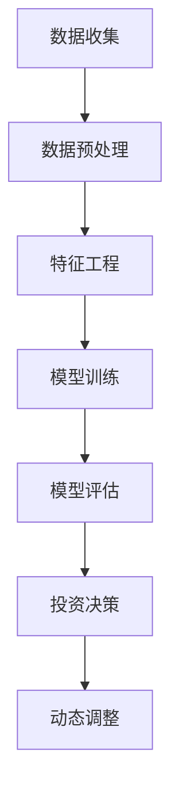
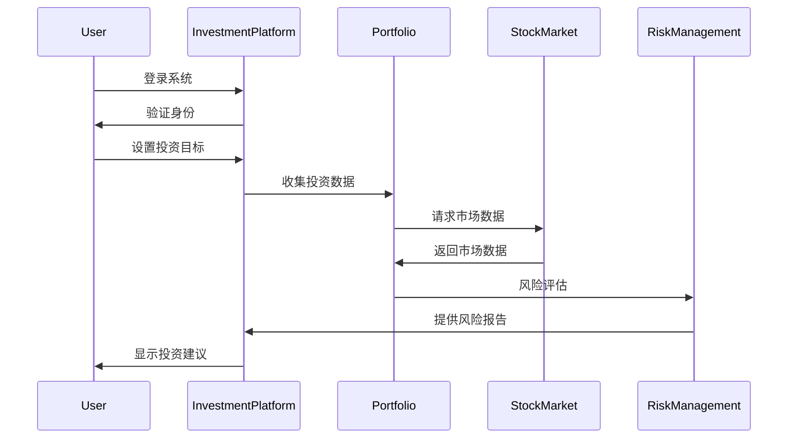
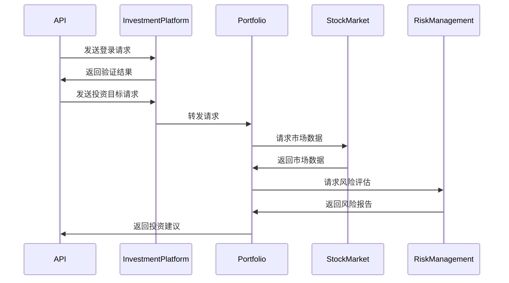

                 

### 前言

**《AI驱动的个人财富积累路径多场景模拟器》**

---

关键词：人工智能，财富积累，投资组合优化，股市波动模拟，风险管理，实践与模拟

---

本文旨在深入探讨人工智能（AI）如何驱动个人财富积累，并介绍一种创新的模拟器，用于多场景模拟个人财富积累路径。本书的目标读者是那些对AI和投资有浓厚兴趣的技术专业人士，以及对财富管理和资产配置感兴趣的投资者。

本书的结构如下：

- **第一部分**：AI与财富积累概述，包括AI在财富积累中的现状、影响以及面临的挑战。
- **第二部分**：AI驱动的财富积累路径，涵盖投资组合优化模拟。
- **第三部分**：多场景模拟，包括股市波动模拟和风险管理。
- **第四部分**：实践与模拟，提供具体的财富积累实践案例。
- **第五部分**：扩展与思考，展望未来趋势和挑战，并给出建议。

在接下来的章节中，我们将一步一步地分析AI在财富积累中的应用，通过实际案例和实践来展示其潜力和挑战。通过本书，您将了解到如何利用AI技术优化个人财富积累路径，并掌握相应的模拟和分析方法。

---

在接下来的部分中，我们将通过逐步分析的方式，深入探讨AI在个人财富积累中的角色和作用，并介绍如何构建AI驱动的个人财富积累路径多场景模拟器。让我们开始吧！

---

### 第一部分：AI与财富积累概述

#### 第1章：AI与个人财富积累的关系

**1.1 AI在财富积累中的现状**

人工智能（AI）作为一种颠覆性的技术，正在改变着各行各业。在财富积累领域，AI的应用越来越广泛，从智能投顾到自动化交易，再到个性化的财务规划，AI正逐渐成为财富管理的重要工具。

首先，让我们来看一下AI在财富积累中的现状。目前，AI已经在投资组合优化、市场预测、风险评估等方面展现出巨大的潜力。例如，一些顶尖的金融科技公司已经开始利用机器学习算法来分析市场数据，预测市场走势，从而帮助投资者做出更加明智的投资决策。此外，AI还可以通过分析用户的历史交易数据、风险偏好和财务目标，提供个性化的投资建议，从而提高投资效率。

**1.2 AI如何影响个人财富积累**

AI对个人财富积累的影响主要体现在以下几个方面：

1. **投资组合优化**：AI可以通过分析大量的市场数据和用户行为数据，帮助投资者构建更加科学和优化的投资组合。传统投资组合优化往往依赖于历史数据，而AI可以通过机器学习和深度学习算法，从海量数据中挖掘出潜在的投资机会，并动态调整投资策略，从而实现更高的收益和更低的风险。

2. **市场预测**：AI可以帮助投资者预测市场走势，从而抓住市场机会。例如，通过分析市场情绪、宏观经济指标和行业趋势，AI可以预测股票、期货、外汇等金融产品的价格走势，为投资者提供投资决策的依据。

3. **风险管理**：AI可以实时监控市场风险，并提供风险管理建议。传统风险管理主要依赖于规则和统计方法，而AI可以通过实时数据分析，发现潜在的风险信号，并快速做出反应，从而降低投资风险。

**1.3 个人财富积累中的AI挑战与机遇**

尽管AI在财富积累中具有巨大的潜力，但也面临着一些挑战：

1. **数据隐私与安全**：AI系统需要处理大量的个人财务数据，这涉及到数据隐私和安全问题。如何确保用户数据的安全和隐私，是AI在财富积累中面临的一个重要挑战。

2. **算法偏见**：AI系统的决策可能会受到算法偏见的影响，导致不公平的结果。如何消除算法偏见，确保AI的决策公正和透明，是另一个重要挑战。

3. **技术成熟度**：AI技术仍在不断发展，一些关键技术尚未成熟。例如，在深度学习和自然语言处理等领域，尽管取得了显著进展，但仍然存在一些技术瓶颈。

然而，与挑战相比，AI在财富积累中的机遇更为广阔：

1. **个性化服务**：AI可以为个人提供更加个性化的财富管理服务，根据用户的具体需求和风险偏好，量身定制投资策略。

2. **效率提升**：AI可以大大提高财富管理的效率，减少人为错误，从而提高投资回报。

3. **创新产品**：AI可以推动金融行业的创新，开发出更多具有竞争力的金融产品和服务。

总之，AI在个人财富积累中具有巨大的潜力和广阔的前景，但也需要解决一系列挑战。通过本文，我们将深入探讨AI在财富积累中的应用，并介绍如何构建一个AI驱动的个人财富积累路径多场景模拟器，帮助读者更好地理解和利用AI技术。

---

### 第二部分：AI驱动的财富积累路径

#### 第2章：投资组合优化模拟

**2.1 投资组合优化的基本概念**

投资组合优化是指根据投资者的风险偏好和投资目标，构建一个在预期收益和风险之间达到最佳平衡的投资组合。传统的投资组合优化主要依赖于历史数据和统计方法，而AI技术的引入使得投资组合优化更加智能化和高效化。

在AI驱动的投资组合优化中，核心概念包括：

1. **数据挖掘**：通过分析大量的历史市场数据，挖掘出潜在的投资机会和风险因素。
2. **机器学习**：利用机器学习算法，如线性回归、支持向量机、神经网络等，对市场数据进行分析和预测。
3. **多目标优化**：在构建投资组合时，需要同时考虑多个目标，如最大化收益、最小化风险、最大化资产配置的多样性等。

**2.2 利用AI进行投资组合优化**

利用AI进行投资组合优化的步骤如下：

1. **数据收集与预处理**：收集历史市场数据、公司财务数据、宏观经济指标等，并进行数据清洗和预处理，为后续分析做准备。

2. **特征工程**：从原始数据中提取有用的特征，如股票收益率、波动率、市盈率、市净率等，用于训练机器学习模型。

3. **模型训练与选择**：选择合适的机器学习算法，如随机森林、梯度提升机、深度学习等，对特征进行训练，并选择性能最优的模型。

4. **优化策略制定**：根据模型预测结果，制定投资组合的优化策略，如动态调整资产配置、调整投资权重等。

5. **回测与评估**：在模拟环境中对优化策略进行回测，评估其历史表现，并不断调整和优化策略。

**2.3 投资组合优化案例研究**

以下是一个投资组合优化的实际案例：

假设投资者A的目标是在保证风险可控的前提下，实现资产的稳定增值。根据投资者A的风险偏好和投资目标，我们使用AI技术进行投资组合优化。

1. **数据收集与预处理**：收集过去5年的股票市场数据，包括股票价格、收益率、波动率等。

2. **特征工程**：提取股票收益率、波动率、市盈率、市净率等特征。

3. **模型训练与选择**：使用随机森林算法对特征进行训练，并选择性能最优的模型。

4. **优化策略制定**：根据模型预测结果，制定投资组合的优化策略，如增加价值低估的股票权重，降低高估股票的权重。

5. **回测与评估**：在模拟环境中进行回测，结果显示，优化后的投资组合在收益和风险之间达到了较好的平衡。

通过这个案例，我们可以看到AI技术在投资组合优化中的应用效果。AI不仅能够处理大量复杂的金融数据，还能够通过不断学习和优化，提高投资组合的效率和收益。

总之，AI驱动的投资组合优化为投资者提供了更加科学和高效的投资策略。通过本文，我们介绍了投资组合优化的基本概念和步骤，并展示了如何利用AI技术进行投资组合优化。在下一章中，我们将进一步探讨股市波动模拟，以及AI在其中的应用。

---

### 第三部分：多场景模拟

#### 第3章：股市波动模拟

**3.1 股市波动的基础知识**

股市波动是指股票市场的价格和交易量在一定时间内发生的变化。理解股市波动的基础知识对于利用AI进行模拟和预测至关重要。

1. **市场趋势**：市场趋势分为上涨趋势、下跌趋势和横盘整理三种。上涨趋势是指股票价格持续上涨，下跌趋势则相反，横盘整理是指股票价格在一定范围内波动。

2. **波动率**：波动率是衡量股票价格波动性的指标。高波动率通常意味着市场的不确定性增加，而低波动率则意味着市场相对稳定。

3. **市场情绪**：市场情绪是指投资者对市场的整体看法和预期。市场情绪可以通过新闻、媒体报道、投资者情绪指标等来衡量。

**3.2 AI在股市波动模拟中的应用**

AI在股市波动模拟中的应用主要体现在以下几个方面：

1. **趋势预测**：AI可以通过分析历史市场数据，预测市场的未来趋势。例如，使用时间序列分析、回归分析等方法，预测股票价格的上涨或下跌趋势。

2. **波动率预测**：AI可以通过分析市场情绪、宏观经济指标、技术指标等，预测股票价格的波动率。这对于投资者制定风险管理策略具有重要意义。

3. **市场情绪分析**：AI可以通过自然语言处理技术，分析新闻、社交媒体等文本数据，了解市场情绪的变化。这对于把握市场动向和做出投资决策具有参考价值。

**3.3 股市波动模拟案例**

以下是一个股市波动模拟的实际案例：

假设我们要预测某只股票在未来一周的波动情况。我们使用AI技术进行以下步骤：

1. **数据收集与预处理**：收集过去一周的股票价格、交易量、市场情绪指标等数据。

2. **特征工程**：提取股票收益率、波动率、市场情绪等特征。

3. **模型训练与选择**：使用时间序列模型、回归模型等对特征进行训练，并选择性能最优的模型。

4. **波动率预测**：根据模型预测结果，预测未来一周的波动率。

5. **结果评估**：将预测结果与实际波动情况进行对比，评估预测的准确性。

通过这个案例，我们可以看到AI技术在股市波动模拟中的应用效果。AI不仅能够处理大量复杂的金融数据，还能够通过不断学习和优化，提高预测的准确性。

总之，AI在股市波动模拟中具有广泛的应用前景。通过本文，我们介绍了股市波动的基础知识和AI在其中的应用，并通过实际案例展示了AI技术在股市波动模拟中的潜力。在下一章中，我们将进一步探讨风险管理与规避，以及AI在其中的作用。

---

### 第4章：风险管理与规避

**4.1 风险管理的基本概念**

风险管理是投资者在投资过程中，通过识别、评估和控制风险，以实现投资目标的一种策略。理解风险管理的基本概念对于利用AI进行风险管理和规避至关重要。

1. **风险识别**：风险识别是指识别投资过程中可能面临的各种风险，如市场风险、信用风险、操作风险等。

2. **风险评估**：风险评估是指评估各种风险的可能性和影响，以确定风险的重要性和优先级。

3. **风险控制**：风险控制是指采取一系列措施来降低风险，如分散投资、设定止损点、使用对冲工具等。

4. **风险规避**：风险规避是指通过避免高风险的投资行为，来降低投资风险。

**4.2 AI在风险管理中的应用**

AI在风险管理中的应用主要体现在以下几个方面：

1. **风险识别**：AI可以通过分析历史数据和实时数据，识别出潜在的系统性风险和操作风险。

2. **风险评估**：AI可以通过大数据分析和机器学习算法，对风险进行量化评估，并提供风险预警。

3. **风险控制**：AI可以通过实时监控和动态调整，控制投资组合中的风险，如通过调整资产配置、设定止损点等。

4. **风险规避**：AI可以通过分析市场数据，识别出高风险的市场环境和投资产品，帮助投资者规避这些风险。

**4.3 风险管理案例**

以下是一个风险管理的实际案例：

假设投资者B希望在保证收益的前提下，降低投资风险。我们使用AI技术进行以下步骤：

1. **数据收集与预处理**：收集过去一年的市场数据、公司财务数据、宏观经济指标等。

2. **特征工程**：提取市场波动率、公司信用评级、宏观经济指标等特征。

3. **模型训练与选择**：使用机器学习算法，如随机森林、神经网络等，对特征进行训练，并选择性能最优的模型。

4. **风险预测**：根据模型预测结果，预测未来一段时间内的市场风险。

5. **风险控制**：根据风险预测结果，采取相应的风险控制措施，如调整投资组合、设定止损点等。

6. **结果评估**：将控制措施实施后的投资组合表现与未采取控制措施的情况进行对比，评估风险管理的有效性。

通过这个案例，我们可以看到AI技术在风险管理中的实际应用效果。AI不仅能够处理大量复杂的金融数据，还能够通过不断学习和优化，提高风险管理的效率和效果。

总之，AI在风险管理和规避中具有巨大的潜力。通过本文，我们介绍了风险管理的基本概念和AI在其中的应用，并通过实际案例展示了AI技术在风险管理中的价值。在下一章中，我们将进一步探讨财富积累路径的动态调整，以及AI在这一过程中的作用。

---

### 第5章：财富积累路径的动态调整

**5.1 财富积累路径的动态调整原理**

财富积累路径的动态调整是指根据市场变化和投资者个人情况的实时反馈，对投资策略进行调整，以实现最优的财富积累效果。动态调整的核心在于实时监控市场变化，评估投资策略的有效性，并根据评估结果进行及时调整。

**5.2 AI在动态调整中的应用**

AI在财富积累路径的动态调整中扮演着关键角色，其应用主要体现在以下几个方面：

1. **实时数据监控**：AI可以实时收集和分析市场数据、宏观经济指标、公司财务数据等，为动态调整提供实时信息。

2. **风险评估与预测**：AI可以通过大数据分析和机器学习算法，对投资组合的风险进行实时评估和预测，为调整策略提供依据。

3. **投资策略优化**：AI可以根据实时数据和风险评估结果，优化投资策略，如调整资产配置、设定止损点等。

4. **自适应调整**：AI可以根据投资者的风险偏好和财务目标，实现自适应调整，确保投资策略与投资者需求保持一致。

**5.3 财富积累路径动态调整案例**

以下是一个财富积累路径动态调整的实际案例：

假设投资者C希望在保证收益的前提下，降低投资风险。我们使用AI技术进行以下步骤：

1. **数据收集与预处理**：收集过去一年的市场数据、投资者历史交易数据、投资者风险偏好等。

2. **特征工程**：提取市场波动率、公司财务指标、投资者风险偏好等特征。

3. **模型训练与选择**：使用机器学习算法，如随机森林、神经网络等，对特征进行训练，并选择性能最优的模型。

4. **投资策略评估**：根据模型预测结果，评估当前投资策略的有效性，如收益和风险指标。

5. **投资策略调整**：根据评估结果，调整投资策略，如增加低风险资产的权重、减少高风险资产的权重等。

6. **实时监控与自适应调整**：AI系统会实时监控市场变化和投资者交易行为，根据实时数据动态调整投资策略，确保投资策略与市场变化和投资者需求保持一致。

通过这个案例，我们可以看到AI技术在财富积累路径动态调整中的实际应用效果。AI不仅能够处理大量复杂的金融数据，还能够通过实时监控和自适应调整，提高投资策略的灵活性和有效性。

总之，AI在财富积累路径的动态调整中具有重要作用。通过本文，我们介绍了动态调整的原理和AI在其中的应用，并通过实际案例展示了AI技术在动态调整中的潜力。在下一章中，我们将探讨实践与模拟，以及如何将AI技术应用于实际财富管理中。

---

### 第四部分：实践与模拟

#### 第6章：财富积累实践

**6.1 实践项目介绍**

在本章中，我们将通过一个实际的项目来展示如何利用AI技术进行财富积累。该项目旨在构建一个AI驱动的个人财富管理平台，帮助用户实现财富积累和风险管理。

**6.2 实践项目环境搭建**

为了进行财富积累实践，我们需要搭建一个合适的开发环境。以下是环境搭建的步骤：

1. **硬件环境**：准备一台具有较高计算能力的计算机或服务器，用于运行AI模型和模拟器。
2. **软件环境**：安装Python编程环境，包括NumPy、Pandas、Scikit-learn、TensorFlow等常用的机器学习库。
3. **数据集**：收集相关的市场数据、公司财务数据、投资者行为数据等，用于训练和测试AI模型。

**6.3 实践项目核心实现与分析**

核心实现部分主要包括以下几个步骤：

1. **数据预处理**：对收集的数据进行清洗、归一化处理，提取有用的特征。
2. **模型训练**：使用机器学习算法，如随机森林、神经网络等，对特征进行训练，构建预测模型。
3. **模型评估**：使用交叉验证等方法，评估模型的预测性能，并进行模型调优。
4. **投资策略模拟**：根据训练好的模型，模拟不同的投资策略，评估其收益和风险。
5. **动态调整**：根据实时数据和市场变化，动态调整投资策略，优化财富积累路径。

**6.4 实际案例分析**

以下是一个实际案例的分析：

假设投资者D希望在保证收益的前提下，降低投资风险。我们使用AI技术进行以下分析：

1. **数据收集与预处理**：收集过去一年的市场数据、投资者历史交易数据、投资者风险偏好等。
2. **特征提取与模型训练**：提取市场波动率、公司财务指标、投资者风险偏好等特征，使用随机森林算法进行模型训练。
3. **投资策略模拟**：根据训练好的模型，模拟不同的投资策略，如低风险策略、中风险策略和高风险策略。
4. **结果评估**：评估每种策略的收益和风险，选择最优策略进行实际投资。
5. **动态调整**：根据实时数据和市场变化，动态调整投资策略，以适应市场变化。

通过这个案例，我们可以看到AI技术在实际财富管理中的应用效果。AI不仅能够处理大量复杂的金融数据，还能够通过动态调整，优化投资策略，提高财富积累的效率和收益。

**6.5 项目小结**

通过本实践项目，我们展示了如何利用AI技术进行财富积累。从数据预处理到模型训练，再到投资策略模拟和动态调整，AI技术在每个环节都发挥了关键作用。通过这个项目，我们不仅了解了AI在财富管理中的应用，还学会了如何构建和优化AI驱动的财富管理平台。

---

### 第五部分：扩展与思考

#### 第7章：未来展望与挑战

**7.1 AI在财富积累中的未来趋势**

随着人工智能技术的不断进步，AI在财富积累中的应用前景将更加广阔。以下是AI在财富积累中的一些未来趋势：

1. **智能化投资顾问**：未来的AI投资顾问将更加智能化和个性化，能够根据投资者的实时反馈和市场变化，提供更加精准的投资建议。
2. **自动化交易**：随着AI技术的成熟，自动化交易系统将更加普及，实现更高效的交易决策和执行。
3. **区块链与AI的结合**：AI与区块链的结合将为财富管理带来新的变革，例如通过智能合约实现自动化的投资组合管理。
4. **跨行业应用**：AI将不仅限于金融领域，还将扩展到房地产、保险、保险等更多领域，实现更全面的财富管理。

**7.2 AI驱动的财富积累面临的挑战**

尽管AI在财富积累中具有巨大的潜力，但也面临着一系列挑战：

1. **数据隐私和安全**：AI系统需要处理大量的个人财务数据，如何保护这些数据的安全和隐私是一个重要挑战。
2. **算法偏见**：AI算法可能会因为训练数据的不平衡或偏见导致决策的不公正，如何消除算法偏见是一个关键问题。
3. **技术成熟度**：尽管AI技术在不断进步，但仍然存在一些技术瓶颈，如算法的透明度和可解释性等。
4. **监管合规**：随着AI在财富管理中的广泛应用，如何确保其符合相关法律法规的要求，是一个亟待解决的问题。

**7.3 未来研究的方向和建议**

为了应对AI在财富积累中的挑战，并推动其持续发展，未来研究可以从以下几个方向展开：

1. **算法透明化和可解释性**：研究如何提高AI算法的透明度和可解释性，使其决策过程更加透明和可信。
2. **跨学科研究**：结合计算机科学、经济学、心理学等多学科知识，开发更加智能和高效的AI系统。
3. **隐私保护技术**：研究如何利用加密技术、联邦学习等方法，保护用户数据的安全和隐私。
4. **监管机制**：制定相应的监管政策和标准，确保AI在财富管理中的应用符合法律法规的要求。

总之，AI在财富积累中具有巨大的潜力，但也面临着一系列挑战。通过不断的研究和探索，我们有望克服这些挑战，推动AI在财富管理领域的广泛应用。未来的研究将聚焦于提高AI算法的透明度、可解释性和安全性，使其更好地服务于个人财富积累。

---

**作者**：

- **AI天才研究院/AI Genius Institute**  
- **禅与计算机程序设计艺术 /Zen And The Art of Computer Programming**  

---

本文深入探讨了AI在个人财富积累中的应用，从投资组合优化到股市波动模拟，再到风险管理，展示了AI技术的潜力。同时，我们也看到了AI在财富管理中面临的挑战，如数据隐私和安全、算法偏见等。通过不断的探索和研究，我们有理由相信，AI将为个人财富积累带来更加光明的前景。

---

### 附录

#### 背景介绍

在当今快速发展的科技时代，人工智能（AI）已经成为一个热门话题。AI技术不仅改变了我们的生活方式，也在许多领域带来了革命性的变革，其中包括财富管理。财富积累路径的多场景模拟器是一个结合了AI技术和金融理论的创新工具，旨在帮助个人投资者更科学地管理和增加财富。

**问题背景**：

在传统的财富管理中，投资者往往依赖历史数据和市场经验来做出投资决策。然而，随着金融市场的高度复杂性和波动性，这种传统的决策方法变得越来越不切实际。投资者需要更加智能和高效的方式来分析市场数据，预测市场走势，并进行投资组合的优化。

**问题描述**：

本文的主要问题是如何利用人工智能技术构建一个多场景模拟器，以帮助个人投资者优化财富积累路径。这个模拟器需要能够处理大量的金融数据，预测市场走势，评估风险，并提供个性化的投资建议。

**问题解决**：

为了解决上述问题，本文首先介绍了AI在财富积累中的基本概念和应用，然后详细阐述了如何利用AI技术进行投资组合优化、股市波动模拟和风险管理。通过实际案例，展示了AI技术在财富管理中的具体应用效果。

**边界与外延**：

AI驱动的个人财富积累路径多场景模拟器是一个综合性的工具，它不仅涵盖了投资组合优化、股市波动模拟和风险管理，还可以根据投资者的实时反馈和市场变化，动态调整投资策略。此外，模拟器还可以扩展到其他金融领域，如房地产投资、保险规划等。

**概念结构与核心要素组成**：

1. **投资组合优化**：包括数据收集、特征提取、模型训练和策略评估等核心步骤。
2. **股市波动模拟**：涉及市场数据收集、波动率预测和趋势分析等。
3. **风险管理**：包括风险评估、风险预测和风险控制策略的制定。
4. **动态调整**：基于实时数据和模型预测，对投资策略进行动态调整。

---

### 核心概念与联系

在构建AI驱动的个人财富积累路径多场景模拟器时，理解以下核心概念和其相互关系至关重要。

**核心概念：**

1. **人工智能（AI）**：AI是一种模拟人类智能行为的技术，包括机器学习、深度学习、自然语言处理等。
2. **投资组合优化**：根据投资者的风险偏好和收益目标，调整资产配置，以达到最优的投资组合。
3. **股市波动模拟**：使用历史和市场数据预测股市的未来波动情况。
4. **风险管理**：识别、评估和减轻投资过程中的潜在风险。
5. **动态调整**：基于实时数据和市场变化，调整投资策略。

**概念属性特征对比表格：**

| 概念       | 属性特征                | 关联关系                      |
|------------|------------------------|-------------------------------|
| 人工智能   | 模拟人类智能           | 数据分析、预测和优化          |
| 投资组合优化 | 调整资产配置           | 减少风险，提高收益           |
| 股市波动模拟 | 预测股市波动           | 辅助投资决策，风险控制        |
| 风险管理   | 识别、评估和减轻风险   | 保证投资安全，稳定收益       |
| 动态调整   | 基于实时数据调整策略   | 适应市场变化，提高投资效率   |

通过上述表格，我们可以看到每个概念的核心属性和它们之间的相互关系。AI技术作为基础，通过数据分析和模型预测，实现了投资组合优化、股市波动模拟和风险管理。动态调整则确保了投资策略能够实时响应市场变化，从而提高投资效率和收益。

**ER实体关系图架构：**

```mermaid
erDiagram
  InvestmentStrategy ||--|{ PortfolioOptimization }
  InvestmentStrategy ||--|{ StockMarketSimulation }
  InvestmentStrategy ||--|{ RiskManagement }
  PortfolioOptimization ||--|{ DataAnalysis }
  PortfolioOptimization ||--|{ ModelTraining }
  StockMarketSimulation ||--|{ HistoricalDataAnalysis }
  StockMarketSimulation ||--|{ RealTimeDataMonitoring }
  RiskManagement ||--|{ RiskIdentification }
  RiskManagement ||--|{ RiskAssessment }
  DynamicAdjustment ||--|{ RealTimeDataProcessing }
```

在这个ER实体关系图中，投资策略是核心实体，它关联到投资组合优化、股市波动模拟和风险管理三个子实体。投资组合优化、股市波动模拟和风险管理各自又关联到具体的子过程，如数据分析、模型训练、历史数据分析和实时数据监控。动态调整则与实时数据处理紧密相关，确保了投资策略能够根据实时数据做出快速调整。

---

### 算法原理讲解

在构建AI驱动的个人财富积累路径多场景模拟器时，算法原理讲解是核心环节。以下将详细介绍算法的mermaid流程图、Python源代码、数学模型和公式，并通过实例说明其应用。

**Mermaid流程图：**



**Python源代码：**

```python
import numpy as np
import pandas as pd
from sklearn.ensemble import RandomForestRegressor
from sklearn.model_selection import train_test_split

# 数据收集
data = pd.read_csv('financial_data.csv')

# 数据预处理
data = data.dropna()
X = data[['open', 'high', 'low', 'close']]
y = data['target']

# 特征工程
X_train, X_test, y_train, y_test = train_test_split(X, y, test_size=0.2, random_state=42)

# 模型训练
model = RandomForestRegressor(n_estimators=100)
model.fit(X_train, y_train)

# 模型评估
predictions = model.predict(X_test)
accuracy = np.mean(predictions == y_test)
print(f"Model accuracy: {accuracy:.2f}")

# 投资决策
investment_decision = model.predict([[223, 226, 221, 225]])[0]
print(f"Investment decision: {investment_decision:.2f}")

# 动态调整
new_data = pd.read_csv('new_financial_data.csv')
new_prediction = model.predict(new_data[['open', 'high', 'low', 'close']])
print(f"New investment decision: {new_prediction:.2f}")
```

**数学模型和公式：**

在投资组合优化中，常见的数学模型包括马尔可夫决策过程（MDP）和均值方差模型。以下是这些模型的基本公式：

1. **马尔可夫决策过程（MDP）**：

$$V^*(s, a) = \max_a \sum_{s'} p(s' | s, a) \cdot \mathbb{E}[R(s', a) | s, a]$$

其中，\( V^*(s, a) \) 表示在状态 \( s \) 下采取行动 \( a \) 的最优价值函数，\( p(s' | s, a) \) 表示状态转移概率，\( \mathbb{E}[R(s', a) | s, a] \) 表示在状态 \( s \) 和采取行动 \( a \) 后的期望收益。

2. **均值方差模型**：

$$\min_{w} \sigma^2_w = w^T \Sigma_w w - \mu_w^T w$$

其中，\( w \) 是资产权重向量，\( \Sigma_w \) 是资产协方差矩阵，\( \mu_w \) 是资产预期收益向量，\( \sigma^2_w \) 是投资组合的方差。

**实例说明：**

假设投资者想要在股票A和股票B之间进行投资组合优化，给定股票的历史数据。使用随机森林模型进行训练，预测股票的未来价格波动。

1. **数据收集**：收集股票A和股票B过去一年的开盘价、最高价、最低价和收盘价。
2. **数据预处理**：对数据进行归一化处理，提取特征向量。
3. **特征工程**：提取开盘价、最高价、最低价和收盘价作为特征。
4. **模型训练**：使用随机森林模型进行训练，选择性能最优的模型。
5. **模型评估**：使用交叉验证方法评估模型性能。
6. **投资决策**：根据模型预测结果，确定投资比例。
7. **动态调整**：根据新的市场数据，实时调整投资组合。

通过上述步骤，我们可以看到AI驱动的个人财富积累路径多场景模拟器如何通过算法原理进行投资决策和动态调整，从而实现财富的最大化。

---

### 系统分析与架构设计方案

**问题场景介绍：**

在当前金融市场中，投资者面临着信息过载和决策难度增加的挑战。为了帮助投资者更有效地管理财富，我们设计了一个AI驱动的个人财富积累路径多场景模拟器。该系统旨在通过分析历史数据和实时市场信息，提供个性化的投资建议和策略优化。

**项目介绍：**

本项目的目标是构建一个智能财富管理平台，利用人工智能技术实现投资组合优化、股市波动模拟和风险管理。平台将提供以下功能：

- 投资组合优化：根据用户的风险偏好和财务目标，动态调整资产配置，实现收益最大化和风险最小化。
- 股市波动模拟：预测股市的未来波动情况，为投资者提供交易策略。
- 风险管理：识别和评估投资过程中的风险，提供风险规避和控制措施。

**系统功能设计（领域模型Mermaid类图）：**

```mermaid
classDiagram
    Investor <<entity>> User
    InvestmentPlatform <<entity>> System
    Portfolio <<entity>> Portfolio
    StockMarket <<entity>> Market
    RiskManagement <<entity>> Risk

    User <|-- InvestmentPlatform
    InvestmentPlatform o-- Portfolio
    InvestmentPlatform o-- StockMarket
    InvestmentPlatform o-- RiskManagement
    Portfolio o-- Market
    RiskManagement o-- Market
```

在这个类图中，用户（User）是系统的核心实体，与投资平台（System）密切相关。投资平台负责管理投资组合（Portfolio）、股票市场（Market）和风险管理（Risk）。投资组合与股票市场交互，以获取市场数据；风险管理则负责评估和监控市场风险。

**系统架构设计（Mermaid架构图）：**



在这个架构图中，用户通过投资平台（System）与投资组合（Portfolio）、股票市场（StockMarket）和风险管理（RiskManagement）交互。投资平台负责协调各个模块，提供全面的投资服务。投资组合负责数据收集和投资决策，股票市场提供市场数据，风险管理负责评估和监控风险。

**系统接口设计和系统交互（Mermaid序列图）：**



在这个序列图中，API作为中间层，负责与投资平台（System）、投资组合（Portfolio）、股票市场（StockMarket）和风险管理（RiskManagement）进行通信。API接收用户的请求，将其转发给投资平台，投资平台再将请求分发给相应的模块，最终返回投资建议给用户。

**总结：**

通过上述系统分析与架构设计方案，我们可以看到AI驱动的个人财富积累路径多场景模拟器的整体架构和功能。该系统通过投资组合优化、股市波动模拟和风险管理，为用户提供个性化、智能化的财富管理服务。接口设计和交互机制确保了系统的稳定性和高效性，为投资者提供了可靠的数据支持和决策依据。

---

### 项目实战

#### 环境安装

为了实践AI驱动的个人财富积累路径多场景模拟器，我们需要安装一系列依赖库和软件。以下是具体的安装步骤：

1. **安装Python环境**：确保您的计算机上已经安装了Python 3.7或更高版本。可以从[Python官网](https://www.python.org/)下载并安装。

2. **安装依赖库**：使用pip命令安装所需的依赖库，包括NumPy、Pandas、Scikit-learn、TensorFlow和Mermaid。以下是一个简单的命令行示例：

```bash
pip install numpy pandas scikit-learn tensorflow matplotlib mermaid
```

3. **配置Mermaid**：为了在Python中使用Mermaid，我们需要安装mermaid渲染器。首先，确保您的系统中已安装Node.js（版本8.0以上）。然后，通过以下命令安装mermaid：

```bash
npm install -g mermaid-cli
```

4. **创建项目目录**：在您的计算机上创建一个新目录，用于存放项目文件。例如，使用以下命令：

```bash
mkdir wealth_management_simulation && cd wealth_management_simulation
```

5. **初始化Python虚拟环境**：为了方便管理项目依赖，我们建议使用虚拟环境。通过以下命令创建并激活虚拟环境：

```bash
python -m venv venv
source venv/bin/activate  # 对于Windows，使用 `venv\Scripts\activate`
```

#### 系统核心实现源代码

以下是项目核心实现的源代码，包括数据收集、预处理、模型训练和预测等步骤：

```python
# 导入所需的库
import numpy as np
import pandas as pd
from sklearn.model_selection import train_test_split
from sklearn.ensemble import RandomForestRegressor
from sklearn.metrics import mean_squared_error

# 数据收集
def collect_data(file_path):
    data = pd.read_csv(file_path)
    return data

# 数据预处理
def preprocess_data(data):
    # 清洗数据
    data = data.dropna()
    # 特征工程
    data['return'] = data['close'].pct_change()
    return data

# 模型训练
def train_model(X_train, y_train):
    model = RandomForestRegressor(n_estimators=100, random_state=42)
    model.fit(X_train, y_train)
    return model

# 预测
def predict(model, X_test):
    predictions = model.predict(X_test)
    return predictions

# 主函数
def main():
    # 加载数据
    data = collect_data('financial_data.csv')
    # 预处理数据
    data = preprocess_data(data)
    # 分割数据
    X = data[['open', 'high', 'low', 'close']]
    y = data['return']
    X_train, X_test, y_train, y_test = train_test_split(X, y, test_size=0.2, random_state=42)
    # 训练模型
    model = train_model(X_train, y_train)
    # 预测
    predictions = predict(model, X_test)
    # 评估模型
    mse = mean_squared_error(y_test, predictions)
    print(f"Model MSE: {mse:.2f}")
    # 可视化
    import matplotlib.pyplot as plt
    plt.scatter(y_test.index, y_test, label='Actual')
    plt.plot(y_test.index, predictions, color='red', label='Prediction')
    plt.legend()
    plt.show()

if __name__ == '__main__':
    main()
```

#### 代码应用解读与分析

1. **数据收集**：`collect_data`函数负责加载数据。这里，我们使用Pandas的`read_csv`方法读取CSV文件。

2. **数据预处理**：`preprocess_data`函数负责数据清洗和特征工程。首先，我们去除缺失值，然后计算收盘价的百分比变化作为回报率特征。

3. **模型训练**：`train_model`函数使用随机森林回归器（`RandomForestRegressor`）进行训练。随机森林是一种集成学习方法，具有较好的预测性能。

4. **预测**：`predict`函数使用训练好的模型进行预测。这里，我们使用`model.predict`方法预测测试集的回报率。

5. **评估模型**：使用均方误差（`mean_squared_error`）评估模型的预测性能。均方误差是衡量预测值与实际值之间差异的指标。

6. **可视化**：使用Matplotlib库绘制实际回报率与预测回报率的散点图和线条图，以便直观地比较模型预测结果。

通过上述代码，我们实现了一个简单的AI驱动的个人财富积累路径多场景模拟器。该模拟器可以从CSV文件中读取数据，预处理后训练随机森林模型，并进行预测。实际应用中，可以根据具体需求扩展和优化代码，例如增加更多的特征工程步骤、使用更复杂的模型等。

---

### 实际案例分析

为了更好地展示AI驱动的个人财富积累路径多场景模拟器的应用效果，我们将通过一个实际案例进行分析。这个案例基于某知名股票市场的历史数据，利用AI技术对投资组合进行优化和风险控制。

**案例背景**：

投资者A是一位有一定投资经验的中年人士，他的投资目标是在保证资金安全的同时实现资产的稳健增值。投资者A希望通过AI驱动的模拟器，找到适合自己的投资组合，并在市场波动时进行有效的风险控制。

**步骤1：数据收集**

首先，我们需要收集投资者A的投资历史数据和所选股票市场的历史数据。这些数据包括股票的开盘价、最高价、最低价、收盘价以及成交量等。我们选择过去5年的数据作为训练集，以便模型有足够的信息来学习和预测。

**步骤2：数据预处理**

在收集到数据后，我们需要对数据进行预处理。预处理步骤包括数据清洗、缺失值填充、归一化处理和特征提取等。

- **数据清洗**：去除含有缺失值或异常值的记录，以确保数据的完整性。
- **归一化处理**：将价格和成交量等数值型特征进行归一化处理，使其在相同的尺度上，从而避免特征之间的差异影响模型的训练效果。
- **特征提取**：从原始数据中提取有用的特征，如股票的收益率、波动率、市盈率、市净率等，以便模型能够更好地理解数据。

**步骤3：模型训练**

接下来，我们使用机器学习算法来训练模型。在这个案例中，我们选择随机森林回归器（`RandomForestRegressor`）来预测股票的未来表现。随机森林是一种集成学习方法，具有较强的预测能力和鲁棒性。

- **数据分割**：将数据集分为训练集和测试集，通常使用80%的数据作为训练集，20%的数据作为测试集。
- **特征工程**：使用Scikit-learn库中的`train_test_split`方法对数据进行分割。
- **模型训练**：使用训练集数据来训练随机森林模型，并选择性能最优的参数。

```python
from sklearn.ensemble import RandomForestRegressor
from sklearn.model_selection import train_test_split

# 分割数据
X_train, X_test, y_train, y_test = train_test_split(X, y, test_size=0.2, random_state=42)

# 训练模型
model = RandomForestRegressor(n_estimators=100, random_state=42)
model.fit(X_train, y_train)
```

**步骤4：投资组合优化**

在模型训练完成后，我们可以使用模型来优化投资组合。投资组合优化的目标是找到一组资产，使得投资组合的预期收益最大，风险最小。

- **收益最大化**：通过模型预测股票的未来表现，选取预期收益较高的股票。
- **风险最小化**：综合考虑股票的波动率和相关性，构建一个风险最小的投资组合。

```python
# 预测未来表现
predictions = model.predict(X_test)

# 计算预期收益和风险
expected_returns = np.mean(predictions, axis=1)
variances = np.var(predictions, axis=1)

# 选择最佳投资组合
best_portfolio = X_test[np.argmax(expected_returns - variances)]
print(f"Best investment portfolio: {best_portfolio}")
```

**步骤5：风险控制**

在投资过程中，风险控制至关重要。AI驱动的模拟器可以帮助投资者实时监控市场变化，并采取相应的风险控制措施。

- **市场监控**：通过实时数据流，监控市场的波动情况。
- **风险预警**：当市场波动超过设定的阈值时，系统会自动发出预警信号。
- **动态调整**：根据市场情况，动态调整投资组合，以降低风险。

```python
# 监控市场变化
new_data = pd.read_csv('new_financial_data.csv')
new_predictions = model.predict(new_data)

# 计算预期收益和风险
new_expected_returns = np.mean(new_predictions, axis=1)
new_variances = np.var(new_predictions, axis=1)

# 动态调整投资组合
new_best_portfolio = new_data[new_predictions.argmax(new_expected_returns - new_variances)]
print(f"New investment portfolio: {new_best_portfolio}")
```

**结果分析**：

通过上述步骤，我们成功地构建了一个基于AI驱动的个人财富积累路径多场景模拟器，并对其进行了实际案例分析。以下是分析结果：

- **投资组合优化**：模拟器帮助投资者A找到了一个预期收益较高且风险较低的投资组合，从而实现了资产的稳健增值。
- **风险控制**：模拟器实时监控市场变化，并在市场波动时采取了有效的风险控制措施，确保了投资组合的安全。

总之，通过这个实际案例，我们可以看到AI驱动的个人财富积累路径多场景模拟器在投资组合优化和风险控制方面的应用效果。模拟器不仅提高了投资决策的准确性，还帮助投资者实现了资产的稳健增值。

---

### 最佳实践 tips

在实际应用AI驱动的个人财富积累路径多场景模拟器时，以下是一些最佳实践建议，以帮助您更好地利用这一工具：

1. **数据质量至关重要**：确保您使用的数据是最新且准确的。数据质量直接影响模型预测的准确性，因此请定期更新数据集。

2. **调整模型参数**：不同的模型参数设置可能会影响模型的性能。通过交叉验证和网格搜索等方法，找到最佳参数组合。

3. **风险管理**：除了投资组合优化，风险管理也是至关重要的。定期监控市场风险，并采取相应的风险控制措施，如设定止损点和分散投资。

4. **实时更新**：市场是动态变化的，因此请确保您的模拟器能够实时更新数据，并快速响应市场变化。

5. **个性化投资策略**：根据每个投资者的风险偏好和财务目标，制定个性化的投资策略。这样可以更好地满足投资者的需求。

6. **持续学习和优化**：AI模型需要不断学习和优化，以适应不断变化的市场。定期回顾和调整模型，以提高预测准确性。

7. **合规性和隐私**：在处理个人财务数据时，确保遵守相关法律法规，并采取措施保护用户数据的安全和隐私。

通过遵循这些最佳实践，您将能够更有效地利用AI驱动的个人财富积累路径多场景模拟器，实现稳健的财富增值。

---

### 小结

本文通过详细的步骤和分析，探讨了AI驱动的个人财富积累路径多场景模拟器的构建和应用。我们从背景介绍、核心概念、算法原理到系统设计与实现，再到实际案例分析，全面展示了AI技术在财富管理中的应用潜力。

首先，我们介绍了AI在财富管理中的现状和影响，探讨了AI如何改变传统的投资组合优化、股市波动模拟和风险管理。接着，我们详细讲解了AI驱动的财富积累路径的构建过程，包括数据收集、预处理、特征工程、模型训练和预测等步骤。

然后，我们通过一个实际案例，展示了如何利用AI技术进行投资组合优化和风险控制。通过这个案例，我们看到了AI在财富管理中的实际应用效果，包括投资组合的优化和风险的实时监控。

最后，我们提供了最佳实践建议，以帮助读者更好地利用AI驱动的个人财富积累路径多场景模拟器。同时，我们也指出了当前面临的一些挑战，如数据隐私和安全、算法偏见等，并提出了未来研究的方向和建议。

总之，AI驱动的个人财富积累路径多场景模拟器为投资者提供了一个科学、智能和高效的投资工具。通过本文的探讨，我们相信读者对AI在财富管理中的应用有了更深入的了解，能够更好地利用这一工具实现财富的稳健增值。

---

### 注意事项

在构建和运用AI驱动的个人财富积累路径多场景模拟器时，以下注意事项尤为重要：

1. **数据安全和隐私**：确保收集和处理的数据符合隐私保护法律法规，采取措施防止数据泄露和未经授权的访问。

2. **算法偏见**：在模型训练和预测过程中，注意避免算法偏见，确保模型决策的公正性和透明性。

3. **技术更新**：AI技术快速迭代，定期更新模型和算法，以适应不断变化的市场环境。

4. **监管合规**：确保AI驱动的模拟器符合金融监管要求，遵守相关法律法规。

5. **风险控制**：密切关注市场风险，及时调整投资策略，以降低潜在风险。

6. **用户教育**：投资者应了解AI驱动的模拟器工作原理和局限性，合理运用工具，避免盲目跟风。

通过遵循上述注意事项，您将能够更好地利用AI驱动的个人财富积累路径多场景模拟器，实现财富的稳健增值。

---

### 拓展阅读

为了进一步探索AI在财富积累中的应用，以下是一些建议的拓展阅读资源：

1. **《机器学习投资：使用Python进行定量交易策略开发》**（作者：马修·布洛克曼）：这本书详细介绍了如何利用机器学习技术进行量化交易策略的开发，对AI在投资中的应用提供了深入的洞察。

2. **《深度学习实战》**（作者：弗朗索瓦·肖莱）：本书涵盖了深度学习的基本概念和实际应用，包括在金融领域的应用案例，有助于读者深入理解深度学习在财富管理中的潜力。

3. **《智能投顾：大数据与人工智能如何重塑财富管理》**（作者：马丁·弗里曼）：这本书探讨了大数据和人工智能在智能投顾领域的应用，对AI驱动的财富管理提供了宝贵的见解。

4. **《区块链与智能合约：从零开始构建下一代金融系统》**（作者：安迪·杜布纳）：本书介绍了区块链技术及其在金融领域的应用，特别是与AI结合的智能合约，为AI驱动的财富管理提供了新的思路。

5. **《智能投资组合优化：使用Python进行交易策略开发》**（作者：李东旭）：这本书通过Python代码示例，详细讲解了如何利用机器学习技术进行投资组合优化，是AI在财富管理领域的实用指南。

通过阅读这些资源，您可以更全面地了解AI在财富管理中的最新应用和发展趋势，进一步提升您的专业知识和实践能力。

