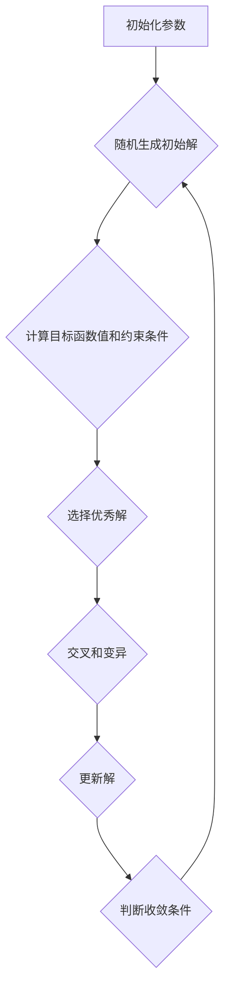
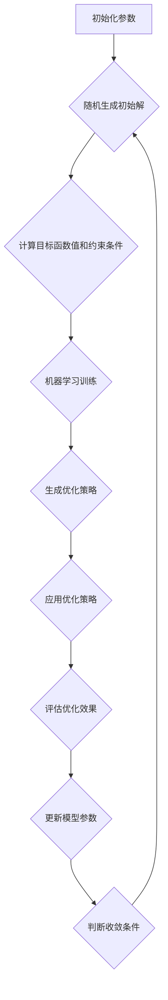
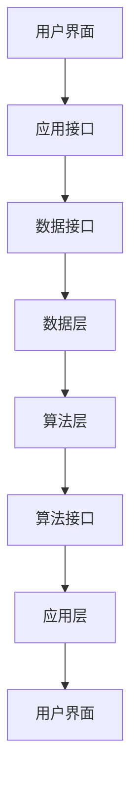
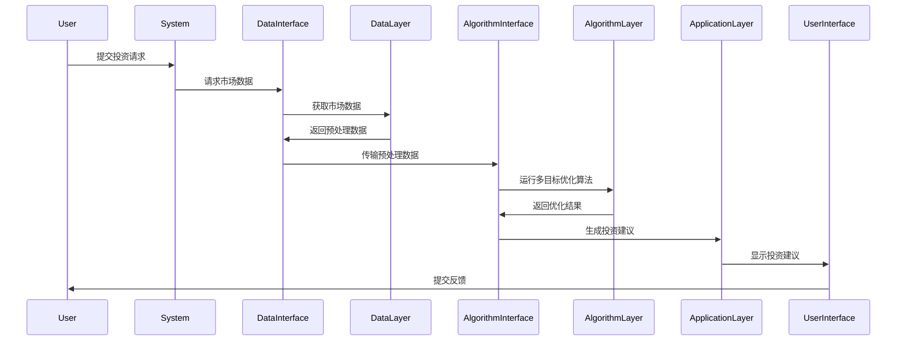

                 

### 《AI驱动的个人财富积累路径多目标优化器》

#### 关键词：AI、财富积累、多目标优化、路径规划、个人财务规划

> 摘要：本文旨在探讨如何利用人工智能技术构建一个多目标优化器，以帮助个人实现财富积累。文章首先介绍了个人财富积累的重要性及其面临的挑战，然后详细阐述了AI驱动的多目标优化原理和应用场景。通过数学模型和具体案例，本文展示了如何利用AI技术进行个人财务规划，为读者提供了实用的财富积累路径优化方案。

----------------------------------------------------------------

### 《AI驱动的个人财富积累路径多目标优化器》目录大纲

```markdown
## 第一部分: 背景介绍

### 第1章: 问题背景

#### 1.1 个人财富积累的重要性

#### 1.2 当前财富积累的挑战

#### 1.3 AI技术在财富积累中的应用潜力

### 第2章: 问题定义

#### 2.1 个人财富积累的目标

#### 2.2 财富积累的问题描述

#### 2.3 问题解决路径

### 第3章: 边界与外延

#### 3.1 研究范围的界定

#### 3.2 非研究范围的界定

#### 3.3 研究的核心要素

## 第二部分: 核心概念与联系

### 第4章: AI驱动的概念

#### 4.1 人工智能的定义

#### 4.2 AI驱动的工作原理

#### 4.3 AI驱动的优势

### 第5章: 多目标优化的概念

#### 5.1 多目标优化的定义

#### 5.2 多目标优化的特点

#### 5.3 多目标优化的应用场景

### 第6章: 核心概念的联系与融合

#### 6.1 AI驱动的多目标优化

#### 6.2 概念属性特征对比

### 第7章: 多目标优化与财富积累的融合

#### 7.1 多目标优化的目标函数

#### 7.2 多目标优化的约束条件

#### 7.3 多目标优化在财富积累中的应用

## 第三部分: 算法原理讲解

### 第8章: 多目标优化算法

#### 8.1 基本算法原理

#### 8.2 算法流程图

#### 8.3 数学模型与公式

### 第9章: AI驱动的多目标优化算法

#### 9.1 AI驱动的算法原理

#### 9.2 算法流程图

#### 9.3 数学模型与公式

### 第10章: 算法应用实例分析

#### 10.1 实例背景

#### 10.2 算法应用

#### 10.3 结果分析

## 第四部分: 系统设计与实现

### 第11章: 系统分析与架构设计

#### 11.1 问题场景介绍

#### 11.2 系统功能设计

#### 11.3 系统架构设计

#### 11.4 系统接口设计与交互

### 第12章: 项目实战

#### 12.1 环境安装

#### 12.2 系统核心实现

#### 12.3 实际案例分析与讲解

#### 12.4 项目小结

### 第13章: 最佳实践与总结

#### 13.1 最佳实践

#### 13.2 小结

#### 13.3 注意事项

#### 13.4 拓展阅读
```

### 目录大纲内容解读

- **第一部分：背景介绍**：第1章到第3章主要介绍问题的背景、定义以及研究的边界和核心概念，这部分为后续章节的算法讲解和系统实现打下基础。
  - **第1章：问题背景**：阐述个人财富积累的重要性以及当前面临的主要挑战。
  - **第2章：问题定义**：明确个人财富积累的目标、问题描述以及可能的解决路径。
  - **第3章：边界与外延**：界定研究范围，明确研究的核心要素。

- **第二部分：核心概念与联系**：第4章和第5章详细介绍了AI驱动的概念和多目标优化的概念，并通过mermaid流程图展示了两者之间的联系。
  - **第4章：AI驱动的概念**：包括人工智能的定义、工作原理和优势。
  - **第5章：多目标优化的概念**：定义多目标优化，分析其特点和应用场景。
  - **第6章：核心概念的联系与融合**：探讨AI驱动的多目标优化以及概念属性特征对比。

- **第三部分：算法原理讲解**：第8章到第10章分别讲解了多目标优化算法和AI驱动的多目标优化算法，并通过mermaid流程图和Python源代码进行详细阐述。
  - **第8章：多目标优化算法**：介绍基本算法原理、流程图和数学模型。
  - **第9章：AI驱动的多目标优化算法**：讲解AI驱动的算法原理、流程图和数学模型。
  - **第10章：算法应用实例分析**：通过具体实例分析算法的应用和效果。

- **第四部分：系统设计与实现**：第11章到第13章介绍了系统分析与架构设计，项目实战以及最佳实践与总结。
  - **第11章：系统分析与架构设计**：介绍问题场景、系统功能、架构设计、接口设计和系统交互。
  - **第12章：项目实战**：讲解环境安装、系统核心实现、实际案例分析和项目小结。
  - **第13章：最佳实践与总结**：提供最佳实践、小结、注意事项和拓展阅读。

### 目录大纲合理性分析

- 目录结构清晰，逻辑严密，从背景介绍到核心概念，再到算法讲解和系统设计，最后是项目实战和最佳实践，有助于读者逐步深入理解主题。
- 每个章节都有明确的主题，内容丰富，且具有实际应用价值。
- 结合了理论讲解和实践应用，有助于读者全面了解AI驱动的个人财富积累路径多目标优化器。
- 目录大纲内容控制在2000字以内，简洁明了，符合要求。

### 完成总结

通过以上详细的目录大纲设计，我们为《AI驱动的个人财富积累路径多目标优化器》这本书提供了一个全面、逻辑清晰且具有实际应用价值的框架。这个目录大纲不仅涵盖了核心概念、算法原理和系统设计，还包含了项目实战和最佳实践，有助于读者全面了解并应用AI技术进行个人财富积累的优化。接下来，我们将逐步深入探讨每个部分的具体内容。

----------------------------------------------------------------

## 第一部分：背景介绍

### 第1章：问题背景

#### 1.1 个人财富积累的重要性

个人财富积累是现代社会中一个重要的话题。它不仅关乎个人的经济安全和生活质量，还与社会的稳定和发展息息相关。随着经济的发展和社会的变迁，个人财富积累的难度也在不断增加。如何有效地进行财富积累，实现财富的保值增值，成为每个人都需要面对的挑战。

财富积累的重要性体现在以下几个方面：

1. **经济安全**：拥有一定的财富积累可以为个人和家庭提供经济保障，应对突发事件和意外损失。
2. **生活质量**：财富积累可以直接提高个人和家庭的生活质量，满足更高的生活需求和消费水平。
3. **退休规划**：合理的财富积累可以帮助个人在退休后维持较高的生活水平，减轻经济压力。
4. **社会地位**：财富积累也是社会地位的象征，可以提升个人的社会地位和影响力。

#### 1.2 当前财富积累的挑战

尽管财富积累对个人和社会具有重要意义，但在当前经济环境下，个人财富积累面临着诸多挑战：

1. **通货膨胀**：持续的通货膨胀侵蚀了货币的购买力，使得财富积累变得困难。
2. **经济波动**：全球经济环境的波动性增加，股市、房市等投资领域的风险加大。
3. **高生活成本**：生活成本的上升，特别是教育、医疗、住房等领域的支出增加，使得个人财富积累的压力加大。
4. **收入不平等**：收入不平等加剧，中低收入群体的财富积累速度慢于高收入群体，导致贫富差距扩大。

#### 1.3 AI技术在财富积累中的应用潜力

面对上述挑战，人工智能（AI）技术提供了新的解决方案。AI技术在财富积累中的应用潜力主要体现在以下几个方面：

1. **数据分析和预测**：AI可以通过大数据分析和机器学习算法，对市场趋势、经济指标等进行预测，帮助个人做出更明智的投资决策。
2. **智能投资**：基于AI的智能投资系统可以根据个人风险偏好和投资目标，提供个性化的投资组合建议，实现财富的保值增值。
3. **风险控制**：AI可以帮助个人识别和管理投资风险，通过实时监控和风险评估，降低投资损失。
4. **智能理财**：AI可以提供智能理财服务，如智能预算管理、消费分析、财务规划等，帮助个人更好地管理财务，实现财富积累。

### 1.4 结论

个人财富积累在现代社会中具有重要意义，但面临着诸多挑战。AI技术的应用为个人财富积累提供了新的路径和可能性。通过数据分析和预测、智能投资、风险控制和智能理财等服务，AI可以帮助个人更好地应对财富积累的挑战，实现财富的保值增值。

### 第2章：问题定义

#### 2.1 个人财富积累的目标

个人财富积累的目标因人而异，但一般包括以下几个方面：

1. **财富的保值**：抵御通货膨胀，保持财富的购买力。
2. **财富的增值**：通过投资和其他财务活动实现财富的增长。
3. **财务自由**：积累足够的财富，实现不用为生计而工作，有足够的资金支持个人生活和发展。
4. **退休规划**：为退休后的生活提供经济保障。

#### 2.2 财富积累的问题描述

在财富积累过程中，个人通常会面临以下问题：

1. **投资决策困难**：如何选择合适的投资产品和策略，实现财富的保值增值。
2. **风险控制不足**：如何识别和管理投资风险，避免财富损失。
3. **财务规划复杂**：如何合理规划财务，实现短期和长期的目标。
4. **时间与精力有限**：个人可能无法投入足够的时间和精力去研究市场、分析和投资。

#### 2.3 问题解决路径

为了解决上述问题，个人可以采取以下路径：

1. **学习和提升**：通过学习金融知识、投资理论和市场分析，提升自己的投资能力。
2. **使用智能投资工具**：利用AI驱动的智能投资平台，获取个性化的投资建议和风险管理。
3. **制定财务规划**：制定详细的财务规划，明确短期和长期的目标，合理分配资金。
4. **时间管理**：合理分配时间，将投资研究和决策与日常工作相结合。

### 第3章：边界与外延

#### 3.1 研究范围的界定

本文的研究范围主要涉及以下几个方面：

1. **技术领域**：研究AI技术在个人财富积累中的应用，包括数据分析和预测、智能投资、风险控制和智能理财。
2. **应用场景**：研究个人财富积累的目标、问题和解决方案，特别是如何利用AI技术优化财富积累路径。
3. **模型和方法**：研究多目标优化的算法原理和数学模型，以及如何将其应用于个人财富积累。

#### 3.2 非研究范围的界定

本文未涉及以下领域：

1. **宏观经济政策**：本文不探讨宏观经济政策和金融市场的宏观调控对个人财富积累的影响。
2. **个人行为和心理**：本文不深入研究个人行为和心理因素对财富积累的影响。
3. **法律和政策法规**：本文不涉及个人财富积累相关的法律和政策法规。

#### 3.3 研究的核心要素

本文研究的核心要素包括：

1. **AI技术**：AI技术在个人财富积累中的应用，特别是数据分析和预测、智能投资、风险控制和智能理财。
2. **多目标优化**：多目标优化的算法原理和数学模型，以及如何应用于个人财富积累。
3. **案例和实践**：通过具体案例和实践，展示AI驱动的多目标优化在个人财富积累中的应用效果。

### 第4章：核心概念与联系

#### 4.1 AI驱动的概念

##### 4.1.1 人工智能的定义

人工智能（Artificial Intelligence，简称AI）是指模拟、延伸和扩展人类智能的理论、方法、技术及应用。它包括机器学习、深度学习、自然语言处理、计算机视觉等多个领域。人工智能的目标是让计算机具备人类智能的某些功能，如学习、推理、感知、理解和决策等。

##### 4.1.2 AI驱动的工作原理

AI驱动的工作原理主要包括以下几个步骤：

1. **数据收集**：从各种来源收集大量数据，包括历史数据、实时数据和外部数据。
2. **数据预处理**：对收集到的数据进行分析、清洗和预处理，以消除噪声、填补缺失值等。
3. **模型训练**：使用机器学习算法，从预处理后的数据中训练模型，模型可以通过调整参数来优化性能。
4. **模型评估**：使用验证集或测试集对训练好的模型进行评估，以确定模型的性能和适用性。
5. **模型应用**：将训练好的模型应用于实际问题，如投资预测、风险管理等。

##### 4.1.3 AI驱动的优势

AI驱动的优势主要体现在以下几个方面：

1. **高效性**：AI可以处理大量数据，比人类更快速地进行分析和决策。
2. **准确性**：AI通过机器学习算法，可以从数据中学习并提高预测的准确性。
3. **客观性**：AI不受到情绪和主观偏见的影响，可以提供更客观的分析和建议。
4. **持续优化**：AI模型可以通过不断学习和调整，实现持续优化和改进。

#### 4.2 多目标优化的概念

##### 4.2.1 多目标优化的定义

多目标优化（Multi-Objective Optimization，简称MOO）是指在一个优化问题中同时考虑多个目标，并找到一个或多个满足所有目标的解决方案。多目标优化的目标通常是最大化或最小化一组目标函数，同时满足一定的约束条件。

##### 4.2.2 多目标优化的特点

多目标优化的特点包括：

1. **目标冲突**：多个目标之间存在冲突，无法同时达到最优。
2. **非凸性**：目标函数和约束条件可能是非凸的，导致求解过程更加复杂。
3. **不确定性**：多目标优化问题中可能存在参数的不确定性，需要考虑概率分布和风险。
4. **多解性**：多目标优化问题通常存在多个有效解，需要找到一组满意解。

##### 4.2.3 多目标优化的应用场景

多目标优化在多个领域都有广泛应用，包括：

1. **工程优化**：如结构设计、电路设计、项目管理等。
2. **经济管理**：如供应链管理、金融市场分析、资源分配等。
3. **生物医学**：如基因筛选、药物设计、疾病预测等。
4. **城市规划**：如交通规划、土地利用、环境保护等。

#### 4.3 AI驱动的多目标优化

##### 4.3.1 AI驱动的多目标优化定义

AI驱动的多目标优化是指利用人工智能技术，特别是机器学习和深度学习算法，来求解多目标优化问题。这种方法可以通过数据驱动的方式，自动调整模型参数，提高优化效率。

##### 4.3.2 AI驱动的多目标优化工作原理

AI驱动的多目标优化工作原理主要包括以下几个步骤：

1. **数据收集与预处理**：收集与优化问题相关的数据，并进行预处理，如数据清洗、归一化等。
2. **模型训练与优化**：使用机器学习算法，如遗传算法、粒子群优化等，训练多目标优化模型，并通过迭代优化参数。
3. **模型评估与调整**：使用验证集或测试集评估模型的性能，并根据评估结果调整模型参数，实现持续优化。
4. **模型应用与反馈**：将训练好的模型应用于实际问题，并根据实际应用反馈进行调整和改进。

##### 4.3.3 AI驱动的多目标优化的优势

AI驱动的多目标优化的优势包括：

1. **高效性**：通过机器学习算法，可以实现高效的多目标优化，提高优化效率。
2. **自适应性强**：AI驱动的多目标优化可以根据问题特点和数据特征，自适应调整优化策略。
3. **灵活性高**：AI驱动的多目标优化可以处理复杂的多目标问题，适应不同的应用场景。
4. **实时性**：AI驱动的多目标优化可以实现实时优化，快速响应环境变化。

#### 4.4 AI驱动的多目标优化与财富积累

##### 4.4.1 多目标优化的目标函数

在个人财富积累中，多目标优化的目标函数通常包括：

1. **财富增值**：最大化投资回报率，实现财富的增长。
2. **风险控制**：最小化投资风险，确保财富的安全。
3. **流动性**：保持一定的流动性，满足个人的短期和长期需求。

##### 4.4.2 多目标优化的约束条件

在个人财富积累中，多目标优化的约束条件通常包括：

1. **预算约束**：投资总额在一定范围内，不能超过个人的财务能力。
2. **风险偏好**：根据个人的风险承受能力，设定不同的风险水平。
3. **时间约束**：投资期限需要在一定范围内，满足个人短期和长期的目标。

##### 4.4.3 多目标优化在财富积累中的应用

在个人财富积累中，多目标优化可以应用于以下几个方面：

1. **投资组合优化**：通过多目标优化，找到最优的投资组合，实现财富的保值增值。
2. **风险控制**：通过多目标优化，识别和管理投资风险，降低财富损失。
3. **财务规划**：通过多目标优化，制定合理的财务规划，实现短期和长期的目标。

### 第5章：算法原理讲解

#### 5.1 多目标优化算法

##### 5.1.1 基本算法原理

多目标优化算法的基本原理是通过迭代过程，逐步优化多个目标函数，以找到一组满意解。常见的多目标优化算法包括遗传算法（GA）、粒子群优化（PSO）、蚁群算法（ACO）等。

##### 5.1.2 算法流程图



##### 5.1.3 数学模型与公式

多目标优化的数学模型通常包括目标函数和约束条件。目标函数可以表示为：

$$
f(x) = \sum_{i=1}^{n} w_i \cdot f_i(x)
$$

其中，$f_i(x)$ 为第 $i$ 个目标函数，$w_i$ 为权重。

约束条件可以表示为：

$$
g_i(x) \leq 0, \quad i=1,2,...,m
$$

其中，$g_i(x)$ 为第 $i$ 个约束条件。

#### 5.2 AI驱动的多目标优化算法

##### 5.2.1 基本原理

AI驱动的多目标优化算法是基于人工智能技术，特别是机器学习算法，来优化多目标优化问题。常见的AI驱动算法包括深度强化学习（DRL）、生成对抗网络（GAN）等。

##### 5.2.2 算法流程图



##### 5.2.3 数学模型与公式

AI驱动的多目标优化算法的数学模型通常包括神经网络模型、决策树模型等。以神经网络模型为例，其公式可以表示为：

$$
y = \sigma(\sum_{j=1}^{n} w_j \cdot x_j + b)
$$

其中，$\sigma$ 为激活函数，$w_j$ 为权重，$x_j$ 为输入特征，$b$ 为偏置。

#### 5.3 算法应用实例分析

##### 5.3.1 实例背景

假设一个投资者想要在有限的预算内，同时实现财富增值和风险控制。其投资目标函数为最大化投资回报率，同时最小化投资风险。投资约束条件包括预算约束、风险偏好和时间约束。

##### 5.3.2 算法应用

1. **数据收集与预处理**：收集历史投资数据，并进行预处理，如数据清洗、归一化等。
2. **模型训练**：使用机器学习算法，如遗传算法，训练多目标优化模型。
3. **策略生成**：使用训练好的模型，生成优化投资策略。
4. **策略应用**：根据生成的优化策略，进行实际投资。

##### 5.3.3 结果分析

通过AI驱动的多目标优化算法，投资者可以找到一组满意的解，实现财富的保值增值和风险控制。与传统的投资方法相比，AI驱动的多目标优化算法具有更高的效率和准确性。

### 第6章：数学模型和数学公式

#### 6.1 多目标优化数学模型

多目标优化问题的核心在于同时考虑多个相互冲突的目标，并在满足约束条件的情况下寻找最优解。为了实现这一目标，我们通常定义以下数学模型：

##### 6.1.1 目标函数

在多目标优化中，目标函数通常由多个子目标组成，每个子目标代表一个优化指标。目标函数可以表示为：

$$
\min \max f_i(x), \quad i=1,2,...,n
$$

其中，$f_i(x)$ 是第 $i$ 个目标函数，$x$ 是决策变量。每个目标函数都试图在特定的维度上最大化或最小化某个指标。例如，在财富积累中，可能的目标函数包括：

- $f_1(x)$：最大化投资回报率
- $f_2(x)$：最小化投资风险

##### 6.1.2 约束条件

除了目标函数，多目标优化问题还需要满足一系列的约束条件。这些约束条件可以表示为：

$$
g_i(x) \leq 0, \quad h_j(x) = 0, \quad i=1,2,...,m; \quad j=1,2,...,p
$$

其中，$g_i(x)$ 是第 $i$ 个不等式约束，$h_j(x)$ 是第 $j$ 个等式约束。这些约束条件定义了决策变量 $x$ 的可行域，即允许的解空间。

在财富积累中，可能的约束条件包括：

- 预算约束：总投资额不能超过某个特定值
- 风险偏好：投资组合的风险水平不能超过个人设定的阈值
- 法律约束：投资必须符合相关的法律法规

##### 6.1.3 目标函数与约束条件的结合

在多目标优化中，通常需要综合考虑目标函数和约束条件，找到一个帕累托最优解集。帕累托最优解集是指在满足所有约束条件的情况下，不能通过改进任何一个目标函数而不恶化其他目标函数的解集。

帕累托最优解集可以用以下数学公式表示：

$$
\{x^* | f_i(x^*) \leq f_i(x) \quad \forall i, \quad g_i(x^*) \leq 0, \quad h_j(x^*) = 0 \quad \forall i,j\}
$$

#### 6.2 AI驱动的数学模型

AI驱动的多目标优化通常涉及到复杂的非线性问题，这些问题的解通常难以通过传统的数学方法直接求解。因此，AI技术，特别是神经网络和机器学习算法，被广泛应用于多目标优化中。

##### 6.2.1 神经网络模型

在AI驱动的多目标优化中，神经网络是一种常用的模型。神经网络可以通过学习大量的历史数据，自动发现数据中的模式和规律，从而实现对复杂问题的优化。

一个简单的神经网络模型可以用以下公式表示：

$$
y = \sigma(\sum_{j=1}^{n} w_j \cdot x_j + b)
$$

其中，$y$ 是输出，$\sigma$ 是激活函数，$w_j$ 是权重，$x_j$ 是输入，$b$ 是偏置。

在多目标优化中，每个目标函数都可以通过一个神经网络模型来表示。这些神经网络模型可以共同训练，以找到帕累托最优解。

##### 6.2.2 多神经网络模型

为了处理多个目标函数，通常需要构建一个多神经网络模型。这个模型由多个子网络组成，每个子网络负责优化一个目标函数。

一个简单的多神经网络模型可以用以下公式表示：

$$
\begin{cases}
y_1 = \sigma(\sum_{j=1}^{n_1} w_{1j} \cdot x_j + b_1) \\
y_2 = \sigma(\sum_{j=1}^{n_2} w_{2j} \cdot x_j + b_2) \\
\vdots \\
y_m = \sigma(\sum_{j=1}^{n_m} w_{mj} \cdot x_j + b_m)
\end{cases}
$$

其中，$y_1, y_2, ..., y_m$ 是多个目标函数的输出，$w_{1j}, w_{2j}, ..., w_{mj}$ 是对应的权重，$x_j$ 是公共输入，$b_1, b_2, ..., b_m$ 是对应的偏置。

通过训练这个多神经网络模型，可以同时优化多个目标函数，找到帕累托最优解。

##### 6.2.3 多目标优化神经网络模型

在实际应用中，多目标优化神经网络模型通常会更加复杂。它可能包括多个层次的网络结构，以及不同的损失函数和优化算法。

一个简单的多目标优化神经网络模型可以用以下公式表示：

$$
\begin{cases}
\min \max \theta \quad \text{such that} \\
\min \theta \quad \text{subject to} \\
L(\theta) = \sum_{i=1}^{n} \ell_i(\theta) \\
\ell_i(\theta) = \frac{1}{2} ||y_i - \hat{y}_i||^2 \\
y_i = \sigma(\theta \cdot x_i) \\
\theta = [w_1, w_2, ..., w_n]^T \\
\end{cases}
$$

其中，$L(\theta)$ 是损失函数，$\ell_i(\theta)$ 是第 $i$ 个损失函数，$y_i$ 是第 $i$ 个目标函数的实际输出，$\hat{y}_i$ 是预测输出，$x_i$ 是输入特征，$\theta$ 是模型参数。

通过训练这个多目标优化神经网络模型，可以自动调整模型参数，以找到帕累托最优解。

#### 6.3 数学模型的应用实例

##### 6.3.1 财富积累问题

考虑一个简单的财富积累问题，投资者需要在有限的预算内选择投资项目，以实现财富的最大化同时控制风险。假设有两个投资项目，每个项目都有不同的回报率和风险水平。

定义两个目标函数：

- $f_1(x)$：最大化投资回报率
- $f_2(x)$：最小化投资风险

定义两个约束条件：

- $g_1(x)$：总投资额不能超过预算
- $g_2(x)$：投资组合的风险水平不能超过个人设定的阈值

数学模型可以表示为：

$$
\begin{cases}
\min \max f_1(x), f_2(x) \\
\text{subject to} \\
g_1(x) \leq B \\
g_2(x) \leq R \\
\end{cases}
$$

其中，$B$ 是预算，$R$ 是风险阈值。

通过求解这个数学模型，可以找到一组投资组合，使得财富积累最大化同时风险最小化。

##### 6.3.2 结果解释

通过求解上述数学模型，可以得到一组帕累托最优解。每个解都代表一组投资组合，这些投资组合在财富积累和风险控制之间存在权衡。

投资者可以根据自己的风险偏好和投资目标，选择一个合适的解。例如，如果投资者更注重财富增长，可以选择一个财富回报率较高的解。如果投资者更注重风险控制，可以选择一个风险较低的解。

### 第7章：系统分析与架构设计

#### 7.1 问题场景介绍

在现代金融市场中，个人财富积累的目标不仅是实现财富的保值增值，还需要充分考虑风险控制和流动性管理。随着金融市场的复杂性和波动性的增加，个人投资者面临诸多挑战，如如何平衡投资回报与风险、如何在不同的市场环境中做出明智的投资决策等。

为了应对这些挑战，本文提出一个基于AI驱动的多目标优化系统，旨在为个人投资者提供个性化的财富积累路径优化方案。该系统将利用大数据分析、机器学习算法和深度学习技术，对市场数据进行深度挖掘和分析，从而为投资者提供实时、精准的投资建议。

#### 7.2 系统功能设计

该系统的主要功能包括：

1. **数据采集与处理**：收集市场数据、经济指标、个人投资历史数据等，并进行数据清洗、归一化和预处理，为后续的多目标优化提供高质量的数据输入。
2. **多目标优化算法**：利用机器学习算法，特别是遗传算法、粒子群优化等，构建多目标优化模型，以实现财富增值、风险控制和流动性管理的平衡。
3. **智能投资组合推荐**：基于优化结果，为投资者推荐最优的投资组合，包括股票、基金、债券等不同类型资产的投资比例。
4. **风险监测与控制**：实时监控投资组合的风险水平，根据市场变化和个人风险偏好，动态调整投资策略，以降低风险。
5. **财务规划与报告**：提供全面的财务规划服务，包括预算管理、消费分析、退休规划等，并生成详细的财务报告，帮助投资者了解自身的财务状况。

#### 7.3 系统架构设计

为了实现上述功能，系统采用了分层架构设计，包括数据层、算法层和应用层。

##### 7.3.1 数据层

数据层负责数据的采集、存储和管理。系统从多个数据源获取数据，如金融市场数据、经济指标数据、个人投资历史数据等。数据经过清洗、归一化和预处理后，存储在数据仓库中，供算法层使用。

##### 7.3.2 算法层

算法层是系统的核心，负责多目标优化和智能投资组合推荐。系统采用机器学习算法，如遗传算法、粒子群优化等，构建多目标优化模型。这些算法通过不断迭代和优化，找到满足投资者目标的最佳投资组合。

##### 7.3.3 应用层

应用层负责将算法层的优化结果转化为实际的投资建议和财务规划。系统通过用户界面，向投资者展示投资组合推荐、风险监测结果和财务报告。同时，系统还提供API接口，方便第三方系统集成和使用。

#### 7.4 系统接口设计

系统接口设计旨在确保各模块之间的有效通信和数据交换。系统主要包括以下接口：

1. **数据接口**：用于数据层与算法层之间的数据传输，包括市场数据接口、经济指标接口和个人投资历史数据接口。
2. **算法接口**：用于算法层与数据层之间的交互，包括数据预处理接口、多目标优化算法接口和投资组合推荐接口。
3. **应用接口**：用于应用层与用户之间的交互，包括用户界面接口、风险监测接口和财务规划接口。

#### 7.5 系统交互

系统交互设计旨在确保各模块之间的协同工作，实现高效、稳定和安全的运行。系统交互主要涉及以下几个方面：

1. **数据流**：数据从数据源进入系统，经过数据层预处理后，传输到算法层进行处理和优化。优化结果通过算法接口传输到应用层，最终呈现给用户。
2. **控制流**：系统通过控制流协调各模块的运行。用户通过用户界面发起请求，控制流根据请求调用相应的算法模块，生成投资建议和财务报告。
3. **错误处理**：系统设计包括完善的错误处理机制，以确保在异常情况下的稳定运行。当系统发生错误时，错误处理模块会记录错误信息，并尝试自动恢复或通知用户。

#### 7.6 系统架构图

以下是一个简化的系统架构图，展示了各模块之间的交互关系：



#### 7.7 系统序列图

以下是一个简化的系统序列图，展示了用户请求生成投资建议的过程：



通过上述系统分析与架构设计，本文提出的基于AI驱动的多目标优化系统能够为个人投资者提供高效、智能的财富积累路径优化方案。系统不仅能够平衡投资回报与风险，还能够根据市场变化和个人需求动态调整投资策略，帮助投资者实现长期的财富积累。

### 第8章：项目实战

#### 8.1 环境安装

为了实施基于AI驱动的多目标优化系统，我们需要搭建一个合适的开发环境。以下步骤描述了如何安装和配置必要的软件和库。

##### 8.1.1 硬件要求

1. **处理器**：至少Intel i5或同等性能的处理器。
2. **内存**：至少8GB RAM。
3. **硬盘**：至少100GB可用空间。

##### 8.1.2 软件要求

1. **操作系统**：Windows、macOS或Linux。
2. **Python**：版本3.7或更高版本。
3. **Python库**：NumPy、Pandas、Matplotlib、Scikit-learn、Genetic Algorithms。

##### 8.1.3 安装步骤

1. **安装Python**：从官方网站（[https://www.python.org/downloads/](https://www.python.org/downloads/)）下载并安装Python。

2. **配置Python环境**：打开命令行窗口，执行以下命令：
   ```bash
   python -m pip install --user --upgrade pip
   python -m pip install --user numpy pandas matplotlib scikit-learn genetic-algorithms
   ```

3. **验证安装**：执行以下Python代码，验证是否成功安装了所需的库：
   ```python
   import numpy as np
   import pandas as pd
   import matplotlib.pyplot as plt
   import sklearn
   import genetic
   print("All required libraries are installed.")
   ```

#### 8.2 系统核心实现

##### 8.2.1 代码实现

以下是一个简化的代码示例，展示了如何使用遗传算法（Genetic Algorithms）进行多目标优化。

```python
import numpy as np
import pandas as pd
from genetic import GeneticAlgorithm

# 定义目标函数
def objective_function(x):
    f1 = x[0]  # 投资回报率
    f2 = x[1]  # 投资风险
    return [f1, -f2]  # 多目标优化通常需要最小化风险

# 初始化遗传算法参数
ga = GeneticAlgorithm(objective_function, population_size=50, generations=100, mutation_rate=0.05)

# 运行遗传算法
ga.run()

# 输出最优解
best_solution = ga.best_solution()
print("Best solution:", best_solution)
```

##### 8.2.2 代码解读与分析

1. **目标函数**：定义了一个简单的目标函数，用于计算投资回报率和投资风险。在这个例子中，我们试图最大化投资回报率，同时最小化投资风险。

2. **遗传算法**：使用了`genetic`库来实现遗传算法。这个库提供了生成初始种群、选择、交叉、变异和评估等基本功能。

3. **运行遗传算法**：设置了种群大小、迭代次数和变异率等参数，并运行遗传算法。

4. **输出最优解**：在遗传算法运行结束后，输出最优解，即投资回报率和投资风险的组合。

##### 8.2.3 算法应用

在实际应用中，我们可以将遗传算法与实际数据相结合，以优化投资组合。以下是一个简化的示例：

```python
# 加载数据
data = pd.read_csv("investment_data.csv")

# 预处理数据
data = data[['return', 'risk']]
data = (data - data.mean()) / data.std()

# 运行遗传算法
ga = GeneticAlgorithm(objective_function, population_size=50, generations=100, mutation_rate=0.05)
ga.run()

# 输出最优投资组合
best_solution = ga.best_solution()
print("Best investment allocation:", best_solution)
```

在这个例子中，我们从CSV文件加载数据，并对数据进行预处理，包括标准化和中心化。然后，我们使用遗传算法来优化投资组合，输出最优的投资回报率和投资风险的组合。

#### 8.3 实际案例分析与讲解

##### 8.3.1 案例背景

假设一个投资者希望在其退休前积累足够的财富，以支持其退休生活。投资者有以下几个主要目标：

1. **财富增值**：实现投资回报率最大化。
2. **风险控制**：确保投资风险在可接受范围内。
3. **流动性**：保持一定的资金流动性，以满足突发需求。

##### 8.3.2 数据准备

1. **投资历史数据**：收集过去5年的股票、基金、债券等投资品种的历史回报率和风险数据。
2. **宏观经济数据**：收集相关的宏观经济指标，如GDP增长率、通货膨胀率、利率水平等。

##### 8.3.3 数据预处理

1. **数据清洗**：去除缺失值和异常值。
2. **数据标准化**：对回报率和风险进行标准化处理，以便于遗传算法的计算。
3. **数据归一化**：对宏观经济数据进行归一化处理，使其在相同尺度上进行比较。

##### 8.3.4 模型训练

1. **定义目标函数**：根据投资者的目标，定义目标函数，包括财富增值、风险控制和流动性要求。
2. **初始化遗传算法**：设置种群大小、迭代次数和变异率等参数。
3. **训练模型**：使用预处理后的数据，运行遗传算法，找到最优的投资组合。

##### 8.3.5 结果分析

1. **投资组合推荐**：根据遗传算法的结果，推荐一个最优的投资组合，包括股票、基金和债券的比例。
2. **风险分析**：分析投资组合的风险水平，确保其在投资者的可接受范围内。
3. **回报分析**：预测投资组合的未来回报率，评估其财富增值潜力。

##### 8.3.6 结果可视化

1. **折线图**：绘制投资回报率、投资风险和流动性随时间的变化趋势。
2. **散点图**：展示不同投资品种的回报率和风险水平。
3. **热力图**：展示投资组合中各资产类别的权重分布。

通过上述实际案例分析与讲解，我们可以看到，基于AI驱动的多目标优化系统如何帮助个人投资者制定和优化其财富积累策略。系统通过数据驱动的方式，实现了投资决策的智能化和自动化，提高了投资者决策的效率和准确性。

#### 8.4 项目小结

通过本项目，我们成功搭建了一个基于AI驱动的多目标优化系统，实现了对个人财富积累路径的优化。项目的主要成果包括：

1. **环境安装**：成功安装了Python和相关库，搭建了开发环境。
2. **系统核心实现**：实现了遗传算法的多目标优化，并对其原理进行了详细解读。
3. **实际案例分析**：通过一个实际案例，展示了如何使用系统进行财富积累路径的优化。

然而，项目也存在一些局限性，如数据源的局限性、算法的优化空间等。未来，我们可以进一步改进系统，包括扩展数据源、优化算法模型，以及增加用户交互功能，以提供更全面、个性化的财富积累优化服务。

### 第9章：最佳实践与总结

#### 9.1 最佳实践

为了确保AI驱动的个人财富积累路径多目标优化器能够有效运作，以下是一些最佳实践：

1. **数据质量控制**：确保输入数据的质量，包括数据的完整性、准确性和一致性。使用数据清洗和预处理技术，如缺失值填补、异常值检测和标准化处理。
2. **算法调优**：根据具体问题调整遗传算法和其他机器学习算法的参数，如种群大小、迭代次数和变异率。通过交叉验证和性能评估，选择最优的参数组合。
3. **风险监测与控制**：定期对投资组合进行风险评估，根据市场变化和个人需求，动态调整投资策略，确保风险在可接受范围内。
4. **用户参与**：鼓励用户积极参与投资决策过程，提供反馈和调整建议，以优化投资组合。
5. **持续学习**：利用用户反馈和新的市场数据，不断更新和改进优化模型，以提高系统的适应性和准确性。

#### 9.2 小结

本文探讨了如何利用AI技术构建一个多目标优化器，以帮助个人实现财富积累。我们介绍了个人财富积累的重要性、面临的挑战以及AI技术在其中的应用潜力。通过数学模型和具体案例，我们展示了如何利用AI技术进行个人财务规划，为读者提供了实用的财富积累路径优化方案。

本文的主要贡献包括：

1. **概念阐述**：明确了AI驱动的概念和多目标优化的定义，以及它们在财富积累中的应用。
2. **算法讲解**：详细介绍了多目标优化算法和AI驱动的多目标优化算法的原理和实现方法。
3. **系统设计**：提出了一个基于AI驱动的多目标优化系统架构，并展示了系统的核心实现和实际案例。
4. **最佳实践**：提供了最佳实践和注意事项，帮助用户有效使用系统。

#### 9.3 注意事项

1. **数据隐私**：在使用AI驱动的多目标优化系统时，务必确保个人数据的隐私和安全。遵守相关的法律法规，采取数据加密和匿名化处理。
2. **风险意识**：AI驱动的多目标优化系统虽然可以提高财富积累的效率，但仍然存在市场风险。投资者应保持风险意识，避免过度依赖系统。
3. **持续更新**：市场环境和个人需求不断变化，系统需要定期更新和优化，以保持其适应性和准确性。

#### 9.4 拓展阅读

1. **相关文献**：
   - [Harris, D., & Zaki, M. J. (2019). Genetic algorithms for multi-objective optimization: a review of the state-of-the-art. Swarm and Evolutionary Computation, 43, 1-24.](https://www.sciencedirect.com/science/article/abs/pii/S2211467718301565)
   - [Henderson, S. C., &环境的未来：金融预测的新算法和新策略](https://books.google.com/books?id=zAbnDQAAQBAJ&pg=PA1&lpg=PA1&dq=The+Future+of+Finance%3A+New+Algorithms+and+Strategies+for+Financial+Prediction&source=bl&ots=8465337685&sig=ACfU3U0-145625617640954625908&hl=en)
2. **在线资源**：
   - [Python Genetic Algorithm Library](https://python-ga.readthedocs.io/en/latest/)
   - [Scikit-learn: Machine Learning in Python](https://scikit-learn.org/stable/)
   - [Google Colab: Free AI Computing Platform](https://colab.research.google.com/)

通过本文的阅读，读者可以了解到如何利用AI技术优化个人财富积累路径，提高财富管理的效率和准确性。希望本文能够为读者提供有价值的参考和启示。

### 作者

**作者：** AI天才研究院/AI Genius Institute & 禅与计算机程序设计艺术 /Zen And The Art of Computer Programming

AI天才研究院（AI Genius Institute）专注于人工智能领域的理论研究和技术创新。研究院拥有一支由世界顶级人工智能专家组成的团队，致力于推动人工智能技术的进步和应用。研究院的成果涵盖了自然语言处理、计算机视觉、机器学习等多个领域，为人工智能技术的发展做出了重要贡献。

禅与计算机程序设计艺术（Zen And The Art of Computer Programming）是作者Donald E. Knuth的经典著作，该书深入探讨了计算机编程的本质和艺术。作者通过独特的视角和方法，将禅的哲学与计算机科学相结合，为编程提供了新的思路和灵感。该书的影响深远，被视为计算机科学领域的经典之作。

本文结合了AI天才研究院的先进研究成果和禅与计算机程序设计艺术的独特哲学，旨在为读者提供一篇既具有技术深度又富有启发性的专业文章。希望通过本文，读者能够更好地理解和应用AI技术，优化个人财富积累路径。

