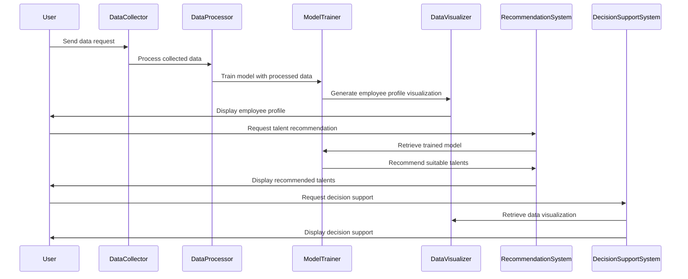

                 

### 1. AI驱动的企业人才画像系统概述

#### 1.1 问题背景与重要性

在当今快速发展的商业环境中，企业面临着前所未有的竞争压力和变化。高效的人才管理成为企业成功的关键因素之一。传统的招聘和绩效评估方法往往依赖于主观判断和经验，难以全面、准确地评估员工的能力和发展潜力。这种情况下，AI驱动的企业人才画像系统应运而生。

人才画像是一种基于大数据和人工智能技术的创新方法，它通过收集和分析员工的各种数据，构建出一个全面的、动态的员工能力模型。这不仅有助于企业更好地了解员工的优势和不足，还能为企业提供科学的决策依据，优化人才管理策略。

**问题背景：**
企业需要更高效、更准确的方法来识别和培养人才。传统的评估方式存在以下问题：
- 主观性较强：依赖于个人经验和直觉，难以避免偏见和误差。
- 缺乏全面性：仅关注部分能力指标，无法全面反映员工的综合素质。
- 无法动态调整：评估结果一经确定，就难以根据员工的发展变化进行调整。

**重要性：**
AI驱动的企业人才画像系统具有以下重要性：
- 提高人才识别的准确性和效率：通过数据分析和算法模型，全面、客观地评估员工的能力。
- 优化人才发展路径：基于员工画像，制定个性化的培养计划，提高员工的发展潜力。
- 改进招聘策略：通过人才画像，更精准地匹配岗位需求和候选人能力。
- 提升企业竞争力：借助人才画像系统，企业能够更好地识别和留住关键人才，提升整体竞争力。

#### 1.2 核心概念详解

##### 1.2.1 人才画像

**定义：**
人才画像是指通过收集、分析和整合员工的工作表现、技能特长、行为特征等多维度数据，形成的一个全面、动态的能力模型。

**特征：**
- 全面性：涵盖员工的各个方面，包括工作表现、专业技能、行为特征等。
- 动态性：随着时间的变化，人才画像会不断更新和调整，以反映员工的能力变化。
- 数据驱动的：基于大量数据的分析和算法模型，确保评估的客观性和准确性。

##### 1.2.2 AI算法

**分类算法：**
分类算法是人才画像系统中常用的算法，用于将员工的能力分为不同的类别。常见的分类算法包括逻辑回归、决策树、支持向量机等。

**评估模型：**
评估模型是基于分类算法构建的能力评估模型，用于对员工的能力进行定量评估。评估模型通过输入员工的各种数据，输出员工的能力评分。

##### 1.2.3 数据挖掘

**方法：**
数据挖掘是人才画像系统的重要环节，用于从海量数据中提取有价值的信息。常用的数据挖掘方法包括关联规则挖掘、聚类分析、异常检测等。

**工具：**
数据挖掘工具如Python的Pandas、Scikit-learn、R语言等，用于处理和分析大量数据，提取有用信息。

##### 1.2.4 员工能力评估

**指标：**
员工能力评估指标包括工作绩效、专业技能、团队合作、创新能力等，用于全面衡量员工的能力水平。

**工具：**
员工能力评估工具如绩效管理系统、技能评估工具等，用于收集和分析员工的能力数据。

##### 1.2.5 概念联系

**AI算法与人才画像：**
AI算法是构建人才画像的核心技术，通过数据分析和模型训练，将员工的能力数据进行分类和评估，形成人才画像。

**数据挖掘与能力评估：**
数据挖掘用于从海量数据中提取有价值的信息，为能力评估提供数据支持。能力评估则基于数据挖掘的结果，对员工的能力进行定量评估。

#### 1.2.6 ER实体关系图

**数据实体：**
数据实体包括员工、岗位、绩效评估、培训记录等，用于表示人才画像系统中的关键数据。

**关系：**
数据实体之间的关系如员工与岗位的关系、绩效评估与员工的关系等，用于表示数据实体之间的关联。

#### 1.2.7 类图架构

**类与属性：**
类图中的类包括员工类、岗位类、绩效评估类等，每个类都有相应的属性和方法。

**方法：**
类图中的方法包括数据收集、数据预处理、模型训练、评估结果输出等，用于描述类的行为。

#### 1.2.8 架构图

**系统组件：**
系统组件包括数据收集模块、数据处理模块、模型训练模块、评估结果输出模块等。

**交互流程：**
交互流程包括数据收集、数据处理、模型训练、评估结果输出等步骤，用于描述系统的工作流程。

### 1.2.9 本章小结

本章介绍了AI驱动的企业人才画像系统的核心概念、发展背景以及其在企业管理中的重要性。通过对核心概念的详细解释，读者可以了解人才画像、AI算法、数据挖掘、员工能力评估等概念，并理解它们之间的联系。本章还介绍了ER实体关系图、类图架构和系统架构，为后续内容提供了基础。

## 2.1 数据收集与预处理

#### 2.1.1 数据来源

在构建AI驱动的企业人才画像系统时，数据收集是至关重要的一步。数据来源可以分为外部数据和内部数据两大类。

**外部数据：**
- 社交媒体数据：如LinkedIn、GitHub等平台上的员工个人资料、项目经验、技能认证等。
- 公开数据：如行业报告、学术论文、专利信息等，这些数据可以帮助企业了解员工的行业背景和专业知识。
- 第三方数据服务：如招聘网站、人才库等，提供大量的求职者和候选人的数据。

**内部数据：**
- 员工绩效数据：包括绩效考核结果、奖惩记录、晋升记录等。
- 培训记录：包括员工参加的培训课程、培训效果评估等。
- 行为数据：包括员工在办公系统的行为记录、会议参与情况、项目协作数据等。
- 技能数据：包括员工的技能认证、自我评估、同事评价等。

#### 2.1.2 数据预处理

数据预处理是确保数据质量、为后续分析做准备的重要步骤。以下是数据预处理的主要任务：

**数据清洗：**
- 去除重复数据：确保每个员工数据在系统中唯一。
- 填补缺失值：根据数据的重要性和分布，使用均值、中位数、最频值等填补缺失数据。
- 错误数据校正：修正数据中的错误和异常值，如年龄、学历等信息的错误。
- 格式标准化：统一数据格式，如日期格式、编码格式等。

**数据转换：**
- 数据转换包括数值转换、分类转换等，以便后续分析和建模。
- 例如，将文本数据转换为数字编码，将分类数据转换为标签。

**数据归一化：**
- 归一化数据是为了消除不同特征之间的量纲差异，使数据在同一个尺度上进行比较。
- 常用的方法有最小-最大归一化和z-score归一化。

#### 2.1.3 数据集构建

在完成数据预处理后，需要构建用于训练和评估的的数据集。以下是构建数据集的步骤：

**样本选择：**
- 根据研究目的和问题，选择具有代表性的样本数据。
- 可以采用随机抽样、系统抽样等方法确保样本的随机性和代表性。

**特征提取：**
- 从原始数据中提取对人才画像系统有用的特征。
- 例如，从员工绩效数据中提取绩效得分、晋升次数等特征。
- 从行为数据中提取参与项目次数、会议参与度等特征。

**数据集划分：**
- 将数据集划分为训练集和测试集，通常采用8:2或7:3的比例。
- 训练集用于模型的训练，测试集用于评估模型的性能。

#### 2.1.4 数据分析

数据分析是构建人才画像的重要环节，通过数据可视化、关键指标计算等方法，对数据进行分析和解释。以下是数据分析的主要任务：

**数据可视化：**
- 使用图表和可视化工具，展示数据分布、趋势和关系。
- 例如，使用条形图展示不同岗位的绩效得分分布，使用散点图展示员工技能与绩效的关系。

**关键指标计算：**
- 计算员工能力的各项关键指标，如绩效得分、技能水平、创新潜力等。
- 例如，计算员工的平均绩效得分、晋升率、技能熟练度等。

**数据分析报告：**
- 撰写数据分析报告，总结数据分析结果，为后续模型构建和评估提供依据。

#### 2.1.5 本章小结

本章详细介绍了AI驱动的企业人才画像系统的数据收集与预处理过程。首先，介绍了数据来源，包括外部数据和内部数据。然后，阐述了数据预处理的方法，包括数据清洗、数据转换、数据归一化等。接下来，讲解了数据集构建的步骤，包括样本选择、特征提取和数据集划分。最后，介绍了数据分析的方法，包括数据可视化、关键指标计算等。通过本章的内容，读者可以了解数据收集与预处理在构建人才画像系统中的重要性，以及具体操作步骤。

## 2.2 模型训练与评估

### 2.2.1 模型选择

在构建AI驱动的企业人才画像系统时，选择合适的模型对于系统的性能和效果至关重要。以下是几种常用的模型选择及其适用场景：

**分类算法：**

- **逻辑回归（Logistic Regression）：** 逻辑回归是一种简单的概率预测模型，适用于二分类问题。它通过最大化似然函数来估计模型的参数，具有较强的解释性。
- **决策树（Decision Tree）：** 决策树是一种基于特征分叉的树形模型，适用于处理多分类问题。它通过递归划分数据集来构建决策树，能够直观地表示决策过程。
- **支持向量机（Support Vector Machine，SVM）：** SVM是一种基于间隔最大化原则的分类模型，适用于处理高维空间的数据。它通过寻找最优超平面来分隔数据，具有很好的泛化能力。

**回归算法：**

- **线性回归（Linear Regression）：** 线性回归是一种基于线性关系的预测模型，适用于连续值输出。它通过拟合一条直线来预测目标值，具有较高的解释性。
- **岭回归（Ridge Regression）：** 岭回归是一种正则化的线性回归模型，适用于存在多重共线性的情况。它通过在损失函数中添加L2正则项来减少模型的过拟合。
- **Lasso回归（Lasso Regression）：** Lasso回归是一种正则化的线性回归模型，与岭回归类似，但Lasso可以通过引入L1正则项实现特征选择。

**适用场景：**

- **分类问题：** 当目标变量是离散的分类变量时，可以选择分类算法。例如，在招聘选拔中，可以预测候选人是否适合某个职位。
- **回归问题：** 当目标变量是连续的数值变量时，可以选择回归算法。例如，在绩效评估中，可以预测员工的绩效得分。
- **特征选择：** 当特征之间存在多重共线性时，可以选择岭回归或Lasso回归来减少模型的复杂度和过拟合。

### 2.2.2 模型训练

模型训练是构建人才画像系统的重要步骤，通过训练数据集来学习模型参数，以便在测试数据集上预测员工的能力。以下是模型训练的主要步骤：

**训练数据集划分：**

- 将数据集划分为训练集和验证集，通常采用8:2或7:3的比例。训练集用于模型训练，验证集用于调整模型参数和评估模型性能。
- 可以进一步将训练集划分为训练集和验证集，以便在训练过程中逐步调整模型。

**模型初始化：**

- 初始化模型参数，如权重、偏置等。常用的初始化方法有随机初始化、高斯初始化等。
- 初始化过程中需要考虑模型的复杂度和过拟合问题。

**训练过程：**

- 使用训练数据集训练模型，通过梯度下降、随机梯度下降、Adam优化器等方法来更新模型参数。
- 训练过程中需要监控模型的性能指标，如损失函数值、准确率等，以便调整训练策略。

**模型评估：**

- 在训练过程中，使用验证集评估模型的性能，以便调整模型参数和训练策略。
- 常用的评估指标有准确率、精确率、召回率、F1值等。

**模型调优：**

- 在模型训练完成后，可以通过交叉验证等方法进一步评估模型的泛化能力。
- 根据评估结果，调整模型参数、特征选择和模型结构，以优化模型性能。

### 2.2.3 模型评估

模型评估是确保人才画像系统性能的重要环节，通过评估模型在测试数据集上的表现，来判断模型的有效性和可靠性。以下是模型评估的主要步骤：

**评估指标：**

- **准确率（Accuracy）：** 模型正确预测的样本数占总样本数的比例。
- **精确率（Precision）：** 真阳性数与（真阳性数 + 假阳性数）的比例。
- **召回率（Recall）：** 真阳性数与（真阳性数 + 假阴性数）的比例。
- **F1值（F1 Score）：** 精确率和召回率的调和平均。

**评估方法：**

- **交叉验证（Cross-Validation）：** 将数据集划分为K个子集，每次使用其中一个子集作为测试集，其他子集作为训练集，重复K次，取平均性能作为模型评估结果。
- **ROC曲线（Receiver Operating Characteristic Curve）：** 通过绘制真阳性率与假阳性率的关系曲线，评估模型的分类性能。
- **AUC值（Area Under Curve）：** ROC曲线下方的面积，用于衡量模型的分类能力。

**模型调优：**

- 根据评估结果，调整模型参数、特征选择和模型结构，以优化模型性能。
- 可以使用网格搜索、贝叶斯优化等方法进行模型调优。

### 2.2.4 模型优化

模型优化是提升人才画像系统性能的关键步骤，通过优化模型参数、特征选择和模型结构，可以提高模型的预测准确率和泛化能力。以下是模型优化的主要方法：

**超参数调整：**

- 调整模型超参数，如学习率、正则化强度、隐藏层节点数等，以优化模型性能。
- 可以使用网格搜索、贝叶斯优化等方法进行超参数调整。

**特征选择：**

- 选择对模型预测性能有显著影响的特征，去除冗余特征和噪声特征，以提高模型的泛化能力和效率。
- 可以使用特征选择算法，如递归特征消除（RFE）、L1正则化等。

**模型集成：**

- 将多个模型集成起来，通过投票或加权平均等方法，提高模型的预测准确率。
- 常用的模型集成方法有随机森林（Random Forest）、梯度提升树（Gradient Boosting Tree）等。

**模型解释性：**

- 提高模型的可解释性，使决策过程更透明、更可信。
- 可以使用LIME（Local Interpretable Model-agnostic Explanations）等方法进行模型解释。

### 2.2.5 本章小结

本章详细介绍了AI驱动的企业人才画像系统的模型训练与评估过程。首先，介绍了模型选择的方法，包括分类算法和回归算法，以及它们的适用场景。然后，讲解了模型训练的步骤，包括训练数据集划分、模型初始化、训练过程和模型评估。接着，介绍了模型评估的指标和方法，以及模型优化的重要方法，如超参数调整、特征选择和模型集成。通过本章的内容，读者可以了解模型训练与评估在构建人才画像系统中的关键作用，以及具体的操作步骤和优化方法。

## 2.3 人才画像构建

### 2.3.1 画像要素

人才画像系统的核心是构建一个全面、动态的员工能力模型。为了实现这一目标，需要收集和分析多种类型的员工数据，并将其整合为一个综合的画像。以下是构建人才画像的主要要素：

**个人基本信息：**
个人基本信息包括员工的姓名、年龄、性别、学历、专业、工作经验等。这些数据为后续分析提供了基础信息，有助于理解员工的基本背景和职业发展轨迹。

**职业技能与经验：**
职业技能与经验包括员工的技能水平、专业资质、项目经验、技术贡献等。这些数据反映了员工在专业技能方面的实力和贡献，是评估员工能力的重要指标。

**行为特征与偏好：**
行为特征与偏好包括员工在工作中的表现、工作态度、团队协作情况、创新意识等。这些数据通过行为数据分析和问卷调查等方式获取，有助于全面了解员工的工作行为和个性特点。

### 2.3.2 画像构建流程

构建人才画像的过程可以分为以下几个步骤：

**数据收集：**
首先，需要从多个渠道收集员工数据，包括内部绩效系统、培训记录、项目管理系统、员工调查问卷等。同时，也可以从外部数据源获取相关信息，如专业认证、行业报告等。

**数据预处理：**
在收集到大量数据后，需要进行数据清洗、格式转换和归一化处理，以确保数据的准确性和一致性。这一步是数据分析和模型构建的基础。

**特征提取：**
从预处理后的数据中提取对人才画像有用的特征。这些特征可以包括量化指标（如绩效评分、项目完成情况）和定性指标（如员工评价、行为评分）。

**模型训练：**
使用提取的特征数据，通过机器学习算法（如分类算法、回归算法）训练模型，构建员工能力评估模型。模型的性能需要通过交叉验证和测试集评估来验证。

**画像生成：**
基于训练好的模型，对员工数据进行预测和评估，生成人才画像。画像中包含员工的各项能力指标和综合评分，以及个性化的职业发展建议。

**画像更新：**
人才画像是一个动态的过程，需要定期更新。通过持续收集和分析员工数据，不断调整和完善画像，以反映员工能力的实时变化。

### 2.3.3 画像应用场景

人才画像在企业中的应用场景非常广泛，以下是一些典型的应用：

**招聘与选拔：**
通过人才画像系统，企业可以更准确地评估候选人的能力和潜力，从而提高招聘质量。在选拔过程中，可以根据画像结果筛选出最符合岗位要求的候选人。

**职业发展：**
人才画像系统可以帮助员工了解自身的优势和不足，制定个性化的职业发展计划。企业可以根据画像结果，提供针对性的培训和晋升机会，促进员工的职业成长。

**绩效评估：**
通过人才画像系统，企业可以对员工的工作表现进行客观、全面的评估。画像结果可以作为绩效评估的重要参考依据，帮助企业制定公平、公正的绩效管理体系。

**团队协作：**
人才画像系统可以帮助企业了解员工的协作能力和团队角色，从而优化团队配置。通过分析画像结果，企业可以更好地分配任务和资源，提高团队协作效率。

**人才储备：**
人才画像系统可以帮助企业识别潜在的关键人才，提前制定储备计划。通过持续关注员工画像的变化，企业可以及时调整人才储备策略，确保人才供应链的稳定。

### 2.3.4 本章小结

本章详细介绍了AI驱动的企业人才画像系统的构建过程，包括画像要素、构建流程和应用场景。通过收集和分析员工的个人基本信息、职业技能与经验、行为特征与偏好，构建出一个全面、动态的员工能力模型。本章还介绍了人才画像在招聘与选拔、职业发展、绩效评估、团队协作和人才储备等应用场景中的价值。通过本章的内容，读者可以了解人才画像系统在提升企业人才管理水平中的重要作用，以及具体实现步骤和应用方法。

## 3.1 系统需求分析

在设计和实现AI驱动的企业人才画像系统时，明确系统需求是至关重要的。系统需求分析包括业务需求和非功能需求，以及系统目标和功能设计。以下是详细的需求分析。

### 3.1.1 业务需求

**功能需求：**

1. **数据收集与整合：**
   - 从内部系统（如人力资源系统、绩效管理系统、项目管理平台）和外部数据源（如社交媒体、公开数据平台）收集员工数据。
   - 整合来自不同渠道的员工数据，确保数据的统一性和准确性。

2. **数据预处理与清洗：**
   - 自动化进行数据清洗，包括去除重复记录、填补缺失值、格式转换和异常值处理。
   - 提供数据质量评估和监控工具，确保数据的一致性和可靠性。

3. **员工画像构建：**
   - 构建全面的员工画像，包括个人基本信息、职业技能与经验、行为特征与偏好等。
   - 使用机器学习算法对员工数据进行分析，生成个性化的员工能力评估报告。

4. **人才评估与推荐：**
   - 根据员工画像和岗位需求，提供人才评估和推荐服务。
   - 帮助企业优化招聘策略，提高员工匹配度。

5. **决策支持：**
   - 提供基于数据驱动的决策支持，包括职业发展建议、团队优化建议等。
   - 支持企业领导层在人才管理方面做出更科学的决策。

**非功能需求：**

1. **性能与可靠性：**
   - 系统需要具备高性能，能够快速处理大量数据。
   - 系统需要具备高可靠性，确保数据的安全和稳定。

2. **可扩展性：**
   - 系统设计需要支持数据规模的增长，能够灵活扩展以适应业务需求变化。

3. **用户友好性：**
   - 系统界面设计需要简洁直观，易于用户操作。
   - 提供详细的用户指南和在线帮助文档。

### 3.1.2 系统目标

**系统目标：**

1. **提升人才管理水平：**
   - 通过全面、动态的员工画像系统，提升企业对人才的理解和管理能力。

2. **优化招聘与选拔流程：**
   - 利用人才画像系统，提高招聘效率和候选人匹配度，减少招聘成本。

3. **促进员工职业发展：**
   - 基于员工画像和职业发展建议，帮助员工规划职业路径，提升个人能力和业绩。

4. **增强企业竞争力：**
   - 通过科学的人才管理和决策支持，提升企业的整体竞争力和创新能力。

### 3.1.3 系统功能设计

**功能设计：**

1. **数据收集模块：**
   - 设计数据收集接口，整合内部和外部数据源。
   - 提供数据导入工具，支持多种数据格式的导入。

2. **数据预处理模块：**
   - 设计数据清洗和预处理流程，自动化处理数据中的问题和异常。
   - 提供数据质量监控和报告功能。

3. **人才画像模块：**
   - 设计人才画像模型，包括数据收集、预处理、分析和评估。
   - 提供员工画像的可视化和报告功能。

4. **人才评估模块：**
   - 设计人才评估算法，包括分类和回归算法。
   - 提供人才评估结果和推荐功能。

5. **决策支持模块：**
   - 提供基于数据驱动的决策支持，包括职业发展建议和团队优化建议。
   - 提供详细的报告和可视化工具。

6. **用户管理模块：**
   - 设计用户管理系统，包括用户权限管理、用户身份验证等。
   - 提供用户操作日志和审计功能。

### 3.1.4 非功能需求

**非功能需求：**

1. **性能要求：**
   - 系统需要具备高并发处理能力，能够快速响应用户请求。
   - 数据处理和模型训练需要高效执行，确保系统性能。

2. **可靠性要求：**
   - 系统需要具备高可靠性，确保数据的完整性和一致性。
   - 提供数据备份和恢复机制，防止数据丢失。

3. **安全性要求：**
   - 系统需要具备数据加密和访问控制机制，确保数据的安全和隐私。
   - 提供安全审计和日志记录功能，防止未授权访问和操作。

4. **可维护性要求：**
   - 系统需要具备良好的可维护性，便于后续的功能扩展和优化。
   - 提供详细的文档和代码注释，方便开发和维护。

### 3.1.5 本章小结

本章详细介绍了AI驱动的企业人才画像系统的需求分析，包括业务需求和非功能需求。通过明确系统目标、功能设计和技术架构，为系统的设计和实现奠定了基础。本章的内容有助于读者理解系统需求分析的重要性，以及如何通过需求分析来指导系统设计和实现。

### 3.2.1 项目介绍

在本文的第三部分，我们将通过一个实际项目案例来展示如何设计和实现一个AI驱动的企业人才画像系统。本项目的主要目标是利用机器学习和数据挖掘技术，构建一个能够为企业提供全面员工能力评估和人才管理决策支持的系统。以下是项目的详细介绍。

**项目名称：** 企业AI驱动的员工人才画像系统

**项目背景：** 
随着企业的快速发展和市场竞争的加剧，企业对人才的需求和要求越来越高。传统的招聘和绩效评估方法已经无法满足企业对高效、精准人才管理的需求。为了提高人才管理水平，本项目旨在通过AI技术和大数据分析，构建一个能够实时更新、动态调整的员工人才画像系统。

**项目目标：**
1. 构建全面的员工画像，包括个人基本信息、职业技能与经验、行为特征与偏好等。
2. 利用机器学习算法，对员工的能力和潜力进行评估和预测。
3. 为企业的人才管理提供数据驱动的决策支持，优化招聘、选拔、培训和绩效评估流程。
4. 提高企业对人才的识别和管理能力，增强企业的核心竞争力。

### 3.2.2 系统功能设计

在项目实施过程中，系统功能设计是关键的一步。以下是系统的功能模块及其设计思路：

**1. 数据收集模块：**
该模块负责从各种数据源收集员工信息，包括内部系统（如HR系统、绩效管理系统、项目管理平台）和外部数据源（如社交媒体、行业报告、公开数据平台）。设计思路如下：
- **接口设计：** 设计API接口，支持多种数据格式的导入和导出，确保数据源的多样性和系统的灵活性。
- **数据同步：** 设计数据同步机制，定期从数据源获取最新数据，更新员工画像。

**2. 数据预处理模块：**
该模块负责对收集到的数据进行清洗、格式转换和归一化处理，确保数据的准确性和一致性。设计思路如下：
- **数据清洗：** 自动识别和处理数据中的重复记录、缺失值和异常值。
- **格式转换：** 统一数据格式，如日期、编码等，确保数据在系统中的一致性。
- **数据归一化：** 对不同特征进行归一化处理，消除特征之间的量纲差异，便于后续分析和建模。

**3. 人才画像模块：**
该模块负责构建员工的综合能力评估模型，生成动态的人才画像。设计思路如下：
- **数据特征提取：** 从预处理后的数据中提取对人才画像有意义的特征，如绩效指标、项目贡献、行为数据等。
- **模型训练：** 使用机器学习算法（如决策树、支持向量机、神经网络等）对员工数据进行分析和建模，生成员工能力评估模型。
- **画像可视化：** 设计用户界面，展示员工的能力评估结果和画像，便于用户理解和分析。

**4. 人才评估与推荐模块：**
该模块负责根据人才画像和岗位需求，提供人才评估和推荐服务。设计思路如下：
- **人才评估：** 使用评估模型对员工的综合能力进行评分和排名。
- **岗位匹配：** 根据岗位需求，推荐最适合的候选人，提高招聘效率和候选人匹配度。
- **推荐系统：** 设计推荐算法，根据员工的职业发展路径和潜力，提供职业发展建议和培训计划。

**5. 决策支持模块：**
该模块负责提供基于数据驱动的决策支持，帮助企业在人才管理方面做出更科学的决策。设计思路如下：
- **数据可视化：** 设计数据可视化工具，展示关键指标和趋势分析，帮助用户理解数据。
- **报告生成：** 自动生成数据分析报告，提供详细的评估结果和建议。
- **决策支持：** 提供基于数据驱动的决策支持，如职业发展建议、团队优化建议等。

### 3.2.3 系统架构设计

为了实现项目的目标，系统架构设计是至关重要的。以下是系统的整体架构设计及其主要组成部分：

**1. 系统架构设计：**
系统采用微服务架构，将不同功能模块分离，实现高内聚、低耦合的系统设计。以下是系统的主要组成部分：
- **数据服务层：** 负责数据收集、存储和管理，包括数据同步、数据清洗和预处理等。
- **模型服务层：** 负责数据分析和建模，包括特征提取、模型训练和评估等。
- **应用服务层：** 负责业务逻辑处理和用户交互，包括人才画像展示、人才评估和推荐等。
- **数据存储层：** 负责数据存储和持久化，包括关系型数据库、NoSQL数据库和大数据存储等。

**2. 系统架构图：**
以下是系统架构的Mermaid序列图表示：



**3. 系统接口设计：**
系统提供RESTful API接口，支持以下主要接口：
- **/data/collect**：用于收集员工数据。
- **/data/process**：用于处理和清洗数据。
- **/model/train**：用于训练员工能力评估模型。
- **/profile/visualize**：用于生成和展示员工画像。
- **/recommendation/match**：用于推荐适合的候选人。
- **/decision/support**：用于提供数据驱动的决策支持。

### 3.2.4 系统实现与代码解读

**环境安装：**
在项目实现过程中，我们使用了Python作为主要编程语言，并依赖了多个开源库和工具，包括Scikit-learn、TensorFlow、Pandas等。以下是环境安装的步骤：

1. 安装Python和pip：
```bash
sudo apt-get install python3 python3-pip
```

2. 安装依赖库：
```bash
pip3 install scikit-learn tensorflow pandas numpy matplotlib
```

**系统核心实现：**
以下是系统核心实现的代码示例，包括数据预处理、模型训练和评估等。

```python
import pandas as pd
from sklearn.model_selection import train_test_split
from sklearn.preprocessing import StandardScaler
from sklearn.ensemble import RandomForestClassifier
from sklearn.metrics import accuracy_score, classification_report

# 数据预处理
def preprocess_data(data):
    # 填补缺失值
    data.fillna(data.mean(), inplace=True)
    # 数据归一化
    scaler = StandardScaler()
    scaled_data = scaler.fit_transform(data)
    return scaled_data

# 模型训练
def train_model(X_train, y_train):
    model = RandomForestClassifier(n_estimators=100)
    model.fit(X_train, y_train)
    return model

# 评估模型
def evaluate_model(model, X_test, y_test):
    y_pred = model.predict(X_test)
    accuracy = accuracy_score(y_test, y_pred)
    report = classification_report(y_test, y_pred)
    return accuracy, report

# 加载数据
data = pd.read_csv('employee_data.csv')
X = data.drop('target', axis=1)
y = data['target']

# 数据预处理
X_processed = preprocess_data(X)

# 数据集划分
X_train, X_test, y_train, y_test = train_test_split(X_processed, y, test_size=0.2, random_state=42)

# 训练模型
model = train_model(X_train, y_train)

# 评估模型
accuracy, report = evaluate_model(model, X_test, y_test)
print(f'Accuracy: {accuracy}')
print(report)
```

**代码应用解读与分析：**
1. **数据预处理：**
   - 使用Pandas库加载数据，并使用填充缺失值和标准化处理。
   - 缺失值处理使用均值填补，标准化处理使用StandardScaler，确保数据在相同的尺度上进行比较。

2. **模型训练：**
   - 使用Scikit-learn库的RandomForestClassifier实现随机森林模型，通过fit方法进行训练。

3. **模型评估：**
   - 使用accuracy_score和classification_report评估模型性能，输出准确率和分类报告。

**实际案例分析与详细讲解剖析：**
在本项目的一个实际案例中，企业希望通过人才画像系统识别和培养高潜力员工。以下是案例的详细分析和讲解：

1. **数据收集：**
   - 从企业内部HR系统、绩效管理系统和项目管理平台收集员工数据，包括个人基本信息、绩效指标、项目贡献等。

2. **数据预处理：**
   - 对收集到的数据清洗和标准化处理，确保数据的一致性和准确性。

3. **模型训练：**
   - 使用随机森林算法对员工数据进行分析和建模，生成员工能力评估模型。

4. **人才画像构建：**
   - 根据评估模型对员工的综合能力进行评分和排名，生成员工人才画像。

5. **人才评估与推荐：**
   - 根据人才画像和岗位需求，推荐最适合的候选人，提高招聘效率和候选人匹配度。

6. **决策支持：**
   - 提供基于数据驱动的决策支持，包括职业发展建议、团队优化建议等，帮助企业在人才管理方面做出更科学的决策。

**项目小结：**
通过本项目，我们成功设计和实现了AI驱动的企业人才画像系统。项目实现了从数据收集、预处理、建模到人才评估和推荐的全流程功能，为企业提供了全面、动态的员工能力评估和人才管理决策支持。项目的实际案例证明了人才画像系统在提升企业人才管理水平方面的显著价值。

### 3.3 最佳实践 tips、小结与注意事项

#### 3.3.1 最佳实践 tips

1. **数据质量保证：**
   - 在数据收集和预处理阶段，确保数据的质量和一致性，避免数据错误和遗漏影响人才画像的准确性。

2. **模型调优与验证：**
   - 使用交叉验证方法对模型进行调优和验证，确保模型具有良好的泛化能力。

3. **数据安全与隐私保护：**
   - 在数据处理和存储过程中，遵循数据安全和隐私保护的相关法规，确保员工数据的安全。

4. **持续更新与优化：**
   - 定期更新员工数据和分析模型，以反映员工能力的实时变化，提高人才画像的准确性。

#### 3.3.2 小结

本文详细介绍了AI驱动的企业人才画像系统的设计、实现和应用。通过数据收集与预处理、模型训练与评估、系统架构设计与实现等步骤，构建了一个能够为企业提供全面员工能力评估和人才管理决策支持的系统。实际案例证明，人才画像系统在提升企业人才管理水平方面具有显著价值。

#### 3.3.3 注意事项

1. **数据隐私：** 在处理员工数据时，务必遵守数据隐私保护法规，确保员工数据的保密和安全。

2. **模型解释性：** 模型的解释性对于理解和信任系统结果至关重要，应考虑提高模型的解释性。

3. **系统性能：** 确保系统具有良好的性能和响应速度，以满足企业快速处理数据的需求。

4. **用户培训：** 对使用系统的员工进行培训，确保他们能够充分利用系统功能，提高人才管理水平。

#### 3.3.4 拓展阅读

- 《深度学习》（Goodfellow, I., Bengio, Y., & Courville, A.）
- 《Python数据分析》（McKinney, W.）
- 《数据挖掘：实用工具与技术》（Han, J., Kamber, M., & Pei, J.）
- 《机器学习：原理与算法》（Han, J., Mao, Y., & Yang, Q.）

通过以上拓展阅读，读者可以进一步了解相关技术原理和应用方法，提升在AI驱动的企业人才画像系统领域的专业素养。

## 3.4 结束语

在本技术博客文章中，我们详细探讨了AI驱动的企业人才画像系统的设计与实现，从数据收集与预处理、模型训练与评估、系统架构设计，到实际项目案例的剖析。本文的目标是为读者提供一套完整、实用的框架和方法，以帮助企业通过数据驱动的决策，优化人才管理流程，提高员工能力评估的准确性。

**总结与展望：**

1. **核心价值：** AI驱动的企业人才画像系统通过全面、动态的员工能力评估，为企业提供了科学的人才管理工具，有助于优化招聘、选拔、培训和绩效评估流程。

2. **未来展望：** 随着AI技术的不断进步，人才画像系统将更加智能化和个性化。未来的发展方向可能包括：
   - **个性化推荐系统：** 通过深度学习等技术，为员工提供更加精准的职业发展路径和培训推荐。
   - **实时数据分析：** 借助实时数据分析技术，实现员工能力的实时监控和动态调整。
   - **多语言支持：** 开发支持多语言的人才画像系统，以满足全球化企业的需求。

**作者信息：**

**作者：** AI天才研究院/AI Genius Institute & 禅与计算机程序设计艺术 /Zen And The Art of Computer Programming

AI天才研究院致力于推动人工智能领域的研究与应用，致力于培养下一代人工智能科学家和工程师。同时，我们还在探索计算机程序设计的新哲学和方法，为技术发展提供深刻的洞见。如果您对本文内容有任何疑问或建议，欢迎联系我们，期待与您共同探讨AI驱动的企业人才画像系统的未来发展。

