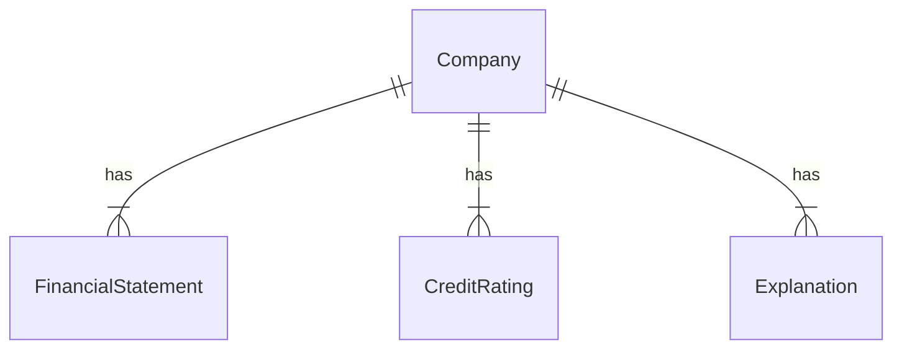
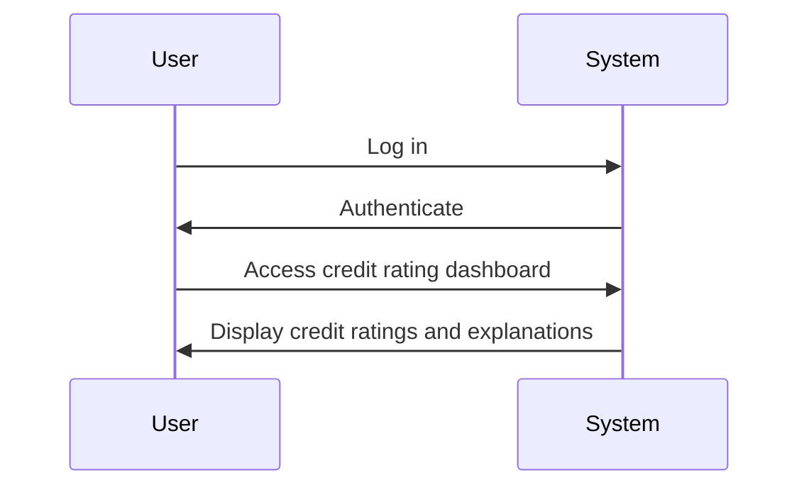
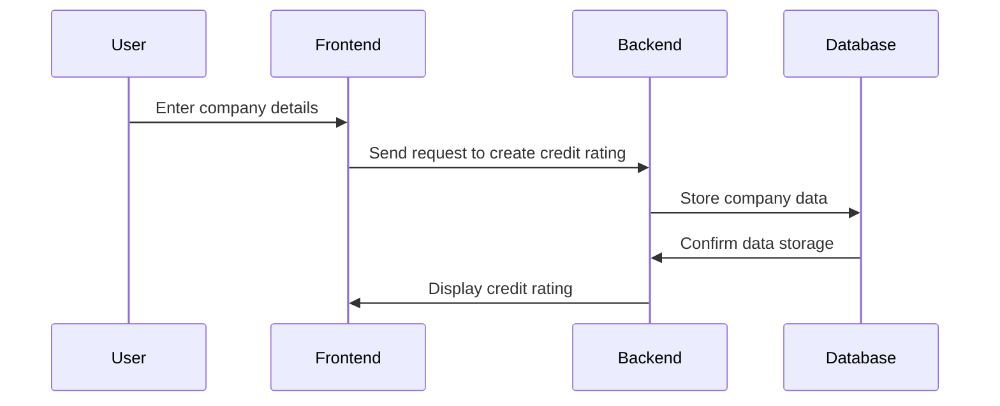

                 

### Introduction to the Book

# AI-driven Enterprise Credit Rating Model Interpretability Enhancement System

## Keywords

- AI-driven credit rating
- Model interpretability
- Enterprise credit assessment
- Machine learning algorithms
- Data privacy

## Summary

This book aims to explore the integration of AI-driven models in enterprise credit rating systems, with a particular focus on enhancing model interpretability. It delves into the background of credit rating, the role of AI in this field, and the challenges associated with model interpretability. The book provides a comprehensive guide to designing and implementing AI-driven credit rating models, emphasizing the importance of transparency and explainability. Case studies and practical examples are included to illustrate the real-world application of these models, along with best practices for their deployment and future directions in the industry.

### The Background and Core Concepts of AI-driven Credit Rating Models

#### The Current Status of Enterprise Credit Rating

Enterprise credit rating is a crucial aspect of financial management, enabling businesses to assess the creditworthiness of companies they plan to engage with. The current landscape of credit rating is characterized by several key aspects:

1. **Manual vs. Automated Approaches**: Historically, credit rating has been a predominantly manual process, involving the analysis of financial statements, industry trends, and qualitative assessments. This approach is time-consuming, subjective, and prone to human error. **Automated systems**, on the other hand, leverage advanced data analytics and machine learning algorithms to provide faster, more accurate, and objective credit assessments.

2. **Credit Rating Agencies**: Major rating agencies such as Moody's, S&P Global, and Fitch have been instrumental in setting industry standards and providing credit ratings to companies worldwide. Their methodologies often combine financial ratios, market conditions, and macroeconomic factors to evaluate credit risk.

3. **Data Accessibility and Quality**: The availability and quality of financial data are critical to the accuracy of credit ratings. Companies need to ensure that the data used for rating is comprehensive, reliable, and up-to-date. **Data integration and preprocessing** are essential steps to transform raw data into a format suitable for machine learning models.

#### The Role of AI in Credit Rating

The advent of AI and machine learning has revolutionized the credit rating industry by offering more robust and efficient methods for evaluating credit risk. AI-driven credit rating models offer several advantages over traditional approaches:

1. **Speed and Scalability**: AI models can process large volumes of data quickly and efficiently, making it possible to update credit ratings in real-time. This capability is particularly valuable in rapidly changing market conditions.

2. **Accuracy and Predictive Power**: Machine learning algorithms can identify patterns and correlations in data that are not apparent to human analysts. This leads to more accurate predictions of credit risk and improved decision-making.

3. **Customization and Personalization**: AI models can be tailored to specific industries and business contexts, providing personalized credit ratings that are more relevant to the needs of individual companies.

4. **Fraud Detection**: AI can be used to identify fraudulent activities and anomalies in financial data, helping to ensure the integrity of the credit rating process.

#### The Importance of Model Interpretability

Despite the numerous advantages of AI-driven credit rating models, the lack of interpretability remains a significant challenge. **Model interpretability** refers to the ability to understand and explain the decision-making process of a machine learning model. Here's why it's crucial:

1. **Trust and Transparency**: Transparent models build trust with stakeholders, including businesses seeking credit and regulatory bodies overseeing the credit rating industry.

2. **Regulatory Compliance**: Many industries, particularly finance, are subject to strict regulatory requirements. Interpretable models can help companies demonstrate compliance with these regulations.

3. **Risk Management**: Understanding how credit rating models make decisions can help companies identify potential risks and take corrective actions.

4. **Algorithmic Bias**: Uninterpretable models can inadvertently introduce biases that are difficult to detect and address. Ensuring model interpretability is essential for mitigating these biases and promoting fair credit assessments.

#### Core Concepts and Connections

To design and implement an AI-driven credit rating model, it's essential to understand the core concepts and their interconnections:

1. **Credit Rating Model**: A credit rating model is a mathematical representation used to evaluate the creditworthiness of a company. It typically involves the calculation of credit scores based on various financial and non-financial factors.

2. **AI-driven Credit Rating Model**: An AI-driven credit rating model leverages machine learning algorithms to automatically learn from historical data and generate credit scores. These models are trained on large datasets containing information about past credit behaviors and financial performance.

3. **Model Interpretability**: Model interpretability is the ability to understand and explain the decision-making process of a machine learning model. It involves techniques to visualize and interpret the inner workings of complex models, making them more transparent and understandable.

By integrating AI with credit rating models and enhancing their interpretability, we can achieve more accurate, efficient, and trustworthy credit assessments. The next sections of this book will delve deeper into these concepts, providing a comprehensive guide to designing, implementing, and enhancing AI-driven credit rating models.

### Core Concepts and Connections

To delve deeper into the intricacies of AI-driven credit rating models, we need to understand the core concepts that underpin these systems and how they are interconnected.

#### Credit Rating Model

A credit rating model is a structured framework used to assess the creditworthiness of an entity, typically an enterprise. It is designed to convert a set of quantitative and qualitative inputs into a credit score that represents the entity's risk of defaulting on its financial obligations. The primary components of a credit rating model include:

1. **Input Features**: These are the various data attributes that are used to construct the model. Common features include financial ratios, cash flow metrics, historical payment records, industry benchmarks, and economic indicators.

2. **Model Architecture**: This encompasses the mathematical and statistical methods used to process the input features and generate the credit score. Traditional models often use regression techniques, while more advanced models leverage machine learning algorithms.

3. **Output Variable**: The credit score is the core output of the rating model. It serves as a quantifiable measure of the entity's credit risk and influences credit decisions, such as loan approvals and interest rates.

4. **Scoring Algorithm**: The algorithm used to compute the credit score from the input features is crucial. It determines how the features are weighted and combined to produce a final score. Common algorithms include linear regression, logistic regression, decision trees, and neural networks.

#### AI-driven Credit Rating Model

An AI-driven credit rating model incorporates machine learning techniques to enhance the predictive power and efficiency of traditional credit rating models. The key elements of an AI-driven model include:

1. **Machine Learning Algorithms**: These algorithms enable the model to learn from historical data, identify patterns, and make predictions without explicit programming. Common machine learning techniques include supervised learning (e.g., linear regression, support vector machines), unsupervised learning (e.g., clustering), and semi-supervised learning.

2. **Feature Engineering**: Feature engineering is the process of selecting and transforming input features to improve model performance. This involves data cleaning, normalization, dimensionality reduction, and feature scaling.

3. **Model Training and Validation**: Model training involves feeding historical data into the machine learning algorithm to learn patterns and relationships. Validation ensures that the model generalizes well to unseen data, avoiding overfitting.

4. **Model Selection**: Choosing the right machine learning algorithm for a credit rating model is critical. Factors such as model complexity, interpretability, and performance on validation data must be considered.

#### Model Interpretability

Model interpretability is a crucial aspect of AI-driven credit rating models, as it provides insights into how the model makes decisions. This is particularly important in industries like finance, where transparency and accountability are paramount. Key concepts in model interpretability include:

1. **Local Interpretability**: This refers to the ability to explain individual predictions made by the model. Techniques such as LIME (Local Interpretable Model-agnostic Explanations) and SHAP (SHapley Additive exPlanations) enable the analysis of feature contributions to a specific prediction.

2. **Global Interpretability**: Global interpretability focuses on understanding the model's behavior across the entire dataset. Techniques such as decision tree visualization and feature importance scores provide a high-level overview of the model's decision-making process.

3. **Explainability Metrics**: These metrics quantify the interpretability of a model. Common metrics include the partial dependence plot, the SHAP values, and the model's decision boundary.

4. **Balancing Accuracy and Interpretability**: Striking a balance between model accuracy and interpretability is often challenging. Highly accurate models may be complex and difficult to interpret, while interpretable models may sacrifice some accuracy.

#### Connecting the Concepts

The interconnections between credit rating models, AI-driven models, and model interpretability can be summarized as follows:

1. **AI-driven Models Enhance Credit Rating**: By leveraging machine learning algorithms, AI-driven credit rating models can process large datasets, identify complex patterns, and provide more accurate and timely credit assessments than traditional models.

2. **Model Interpretability Ensures Transparency**: Ensuring that AI-driven credit rating models are interpretable helps build trust and compliance with regulatory requirements. It also enables stakeholders to understand the factors that influence credit ratings.

3. **Continuous Improvement through Feedback**: The feedback loop between model performance, interpretability, and business insights is crucial for continuous improvement. Regularly evaluating and updating the model based on new data and insights enhances its accuracy and reliability.

In conclusion, the integration of AI-driven models with credit rating systems, coupled with a focus on model interpretability, offers a powerful approach to assessing enterprise credit risk. The following chapters will delve deeper into the principles, techniques, and practical applications of these models, providing a comprehensive guide for practitioners in the field.

#### Principles and Methods of Model Interpretability

Model interpretability is a critical aspect of AI-driven credit rating models, as it provides insights into how the model makes decisions and ensures transparency and trust. This section explores the fundamental principles and methods of model interpretability, with a focus on techniques that can enhance the understanding of AI-driven credit rating models.

### Local Interpretability

Local interpretability focuses on explaining individual predictions made by the model. It aims to provide insights into why the model made a specific prediction for a given instance. Two prominent methods for achieving local interpretability are LIME (Local Interpretable Model-agnostic Explanations) and SHAP (SHapley Additive exPlanations).

#### LIME

LIME is a model-agnostic method that generates interpretable explanations for individual predictions. It works by approximating the target model locally with a simpler, more interpretable model, typically a linear model. Here's how LIME operates:

1. **Model Approximation**: LIME approximates the target model by fitting a linear model to the data around the instance of interest. This is done by finding a small subset of features that are most relevant to the prediction.

2. **Sensitivity Analysis**: LIME performs a sensitivity analysis by slightly altering the input features and observing how the prediction changes. This helps identify the impact of individual features on the model's output.

3. **Explanation Generation**: LIME generates an explanation by combining the sensitivity analysis results with the coefficients of the linear model. The explanation indicates the contribution of each feature to the prediction.

#### SHAP

SHAP is a game-theoretical approach that provides explanations for individual predictions by assigning each feature a contribution value, representing its marginal impact on the prediction. SHAP operates as follows:

1. **Game-Theoretical Setup**: SHAP models the prediction process as a cooperative game, where each feature contributes its value to the prediction based on its marginal contribution.

2. **Contribution Calculation**: SHAP calculates the contribution of each feature by simulating the prediction process multiple times, each with the feature value replaced by a random draw from a distribution. The average difference in predictions across these simulations gives the SHAP value for the feature.

3. **Explanation Generation**: SHAP generates an explanation by aggregating the SHAP values across all features, providing a clear picture of how each feature influences the prediction.

### Global Interpretability

Global interpretability methods focus on understanding the model's behavior across the entire dataset. These methods provide a high-level overview of how the model makes decisions and how different features influence its predictions. Two common global interpretability techniques are decision tree visualization and feature importance analysis.

#### Decision Tree Visualization

A decision tree is a popular machine learning algorithm known for its interpretability. Visualizing a decision tree allows stakeholders to understand the decision-making process at a glance. Here's how it works:

1. **Tree Construction**: A decision tree is constructed by recursively splitting the dataset based on feature values that provide the highest information gain or lowest impurity measure (e.g., Gini impurity or entropy).

2. **Tree Visualization**: The resulting tree is visualized in a hierarchical structure, where each node represents a feature split, and each leaf node represents a prediction.

3. **Explanation Generation**: By tracing the path from the root to a leaf node, stakeholders can understand how the model makes predictions for a given instance.

#### Feature Importance Analysis

Feature importance analysis quantifies the contribution of each feature to the model's predictions. This helps identify the most influential features and their relative importance. Here's how it works:

1. **Importance Calculation**: Feature importance can be calculated using various techniques, such as permutation importance, where the model's performance is evaluated by shuffling individual feature values and observing the impact on predictions.

2. **Ranking and Visualization**: The importance scores are ranked, and visualizations, such as bar charts or heatmaps, can be used to represent the relative importance of features.

### Balancing Accuracy and Interpretability

Balancing model accuracy and interpretability is a significant challenge in AI-driven credit rating models. Highly accurate models may be complex and difficult to interpret, while highly interpretable models may sacrifice some accuracy. Here are some strategies to achieve a balance:

1. **Model Selection**: Choosing models that offer a good balance between accuracy and interpretability is crucial. For example, decision trees and linear models are generally more interpretable than complex neural networks.

2. **Feature Selection**: Selecting relevant features and removing irrelevant or redundant features can improve interpretability without significantly compromising accuracy.

3. **Model Ensembling**: Combining multiple models, such as ensemble methods like random forests or gradient boosting, can improve accuracy while maintaining some level of interpretability.

4. **Interpretability Techniques**: Applying interpretability techniques, such as LIME or SHAP, can provide insights into individual predictions without sacrificing the overall accuracy of the model.

### Conclusion

Model interpretability is a vital component of AI-driven credit rating models. It ensures transparency, builds trust, and enables stakeholders to understand and validate the model's decisions. By leveraging local and global interpretability methods, practitioners can enhance their understanding of AI-driven credit rating models and strike a balance between accuracy and interpretability. The following chapters will delve into the practical application of these methods in real-world scenarios, providing a comprehensive guide for implementing and enhancing model interpretability in credit rating systems.

### Techniques for Enhancing Model Interpretability

Enhancing the interpretability of AI-driven credit rating models is crucial for ensuring transparency, trust, and compliance. This section discusses various techniques and methods that can be employed to improve the interpretability of these models, focusing on both local and global interpretability approaches.

#### Local Interpretability Techniques

Local interpretability techniques provide insights into the decision-making process of the model for individual predictions. Two prominent methods in this category are LIME (Local Interpretable Model-agnostic Explanations) and SHAP (SHapley Additive exPlanations).

**LIME**

LIME is a model-agnostic method designed to generate interpretable explanations for individual predictions. It works by approximating the target model locally with a simpler, more interpretable model, typically a linear model. Here's a step-by-step overview of the LIME technique:

1. **Data Augmentation**: LIME starts by generating a series of perturbed versions of the input data. These perturbations involve adding noise to the input features or replacing them with random values.

2. **Model Inference**: The perturbed data is fed into the target model, and the predictions are recorded for each perturbed instance.

3. **Explanation Generation**: LIME calculates the contribution of each feature to the prediction by analyzing the difference in model predictions for the original and perturbed instances. The contribution is quantified by fitting a linear model to the perturbed data and calculating the coefficient for each feature.

**SHAP**

SHAP is a game-theoretical approach that provides explanations for individual predictions by assigning each feature a contribution value, representing its marginal impact on the prediction. SHAP operates as follows:

1. **Game-Theoretical Setup**: SHAP models the prediction process as a cooperative game, where each feature contributes its value to the prediction based on its marginal contribution.

2. **Contribution Calculation**: SHAP calculates the contribution of each feature by simulating the prediction process multiple times, each with the feature value replaced by a random draw from a distribution. The average difference in predictions across these simulations gives the SHAP value for the feature.

3. **Explanation Generation**: SHAP generates an explanation by aggregating the SHAP values across all features, providing a clear picture of how each feature influences the prediction.

**Implementation Example**

Let's consider an example using Python and the scikit-learn library to illustrate the LIME and SHAP techniques:

```python
from sklearn.datasets import load_iris
from sklearn.linear_model import LogisticRegression
from lime import lime_tabular
from shap import TreeExplainer

# Load the iris dataset
iris = load_iris()
X, y = iris.data, iris.target

# Train a logistic regression model
model = LogisticRegression()
model.fit(X, y)

# Use LIME to generate an explanation for a specific prediction
lime_explainer = lime_tabular.LimeTabularExplainer(X, feature_names=iris.feature_names, class_names=iris.target_names)
exp = lime_explainer.explain_instance(X[0], model.predict_proba, num_features=5)

# Print the feature contributions
print(exp.as_list())

# Use SHAP to generate an explanation for a specific prediction
shap_explainer = TreeExplainer(model)
shap_values = shap_explainer(X[0])

# Visualize the SHAP values
shap.summary_plot(shap_values, X, feature_names=iris.feature_names)
```

**Example Output**

The LIME explanation might output a list of feature contributions, such as:

```
[('sepal length (cm)', 0.12), ('sepal width (cm)', -0.08), ('petal length (cm)', 0.15), ('petal width (cm)', 0.10), ('class', 0.35)]
```

The SHAP summary plot might visualize the SHAP values for each feature, highlighting the relative importance of each feature in predicting the class label.

#### Global Interpretability Techniques

Global interpretability techniques focus on understanding the model's behavior across the entire dataset. These methods provide a high-level overview of how the model makes decisions and how different features influence its predictions. Two common global interpretability techniques are decision tree visualization and feature importance analysis.

**Decision Tree Visualization**

A decision tree is a popular machine learning algorithm known for its interpretability. Visualizing a decision tree allows stakeholders to understand the decision-making process at a glance. Here's how to visualize a decision tree using Python and the scikit-learn library:

```python
from sklearn.tree import plot_tree
from sklearn.datasets import load_iris
import matplotlib.pyplot as plt

# Load the iris dataset
iris = load_iris()
X, y = iris.data, iris.target

# Train a decision tree model
model = DecisionTreeClassifier()
model.fit(X, y)

# Visualize the decision tree
plt.figure(figsize=(12, 8))
plot_tree(model, feature_names=iris.feature_names, class_names=iris.target_names)
plt.show()
```

**Feature Importance Analysis**

Feature importance analysis quantifies the contribution of each feature to the model's predictions. This helps identify the most influential features and their relative importance. Here's how to perform feature importance analysis using Python and the scikit-learn library:

```python
from sklearn.ensemble import RandomForestClassifier
from sklearn.datasets import load_iris
import matplotlib.pyplot as plt

# Load the iris dataset
iris = load_iris()
X, y = iris.data, iris.target

# Train a random forest model
model = RandomForestClassifier()
model.fit(X, y)

# Get feature importances
importances = model.feature_importances_

# Visualize feature importances
plt.barh(iris.feature_names, importances)
plt.xlabel('Feature Importance')
plt.ylabel('Feature')
plt.show()
```

**Example Output**

The decision tree visualization might display a tree structure with nodes and edges representing feature splits and decision paths.

The feature importance plot might show a bar chart with the feature names on the y-axis and their importance scores on the x-axis.

#### Combining Local and Global Interpretability Techniques

Combining local and global interpretability techniques can provide a comprehensive understanding of the model's behavior. For example, local interpretability methods like LIME or SHAP can be used to explain individual predictions, while global interpretability techniques like decision tree visualization or feature importance analysis can provide a high-level overview of the model's performance.

**Example Workflow**

1. **Train the Model**: Train the AI-driven credit rating model using a machine learning algorithm and a dataset of historical credit data.
2. **Global Interpretability**: Visualize the decision tree or perform feature importance analysis to understand the model's general behavior and identify influential features.
3. **Local Interpretability**: Use LIME or SHAP to generate explanations for specific predictions, providing insights into why the model made certain decisions.
4. **Validation and Iteration**: Validate the model's performance and interpretability using validation data, and iterate on the model and interpretability techniques to improve both accuracy and interpretability.

### Conclusion

Enhancing the interpretability of AI-driven credit rating models is essential for ensuring transparency, trust, and compliance. Local interpretability techniques like LIME and SHAP provide insights into individual predictions, while global interpretability techniques like decision tree visualization and feature importance analysis offer a high-level overview of the model's behavior. By combining these techniques, practitioners can achieve a comprehensive understanding of AI-driven credit rating models, balancing accuracy and interpretability to create more trustworthy and reliable credit rating systems.

### Design and Implementation of the Interpretability Enhancement System

The design and implementation of an AI-driven enterprise credit rating model interpretability enhancement system involves several critical steps, from initial system architecture to detailed implementation details. This section provides an overview of the system design, including the project requirements, system architecture, data layer design, service layer design, presentation layer design, and system interfaces and interactions.

#### Project Requirements

The primary goal of the project is to design and implement a system that enhances the interpretability of AI-driven credit rating models. Key requirements include:

1. **Accurate Credit Risk Assessment**: The system must accurately assess the credit risk of enterprises based on historical and real-time data.
2. **Transparency and Trust**: The system should provide clear and understandable explanations for the credit ratings it generates, ensuring transparency and building trust with stakeholders.
3. **Scalability and Performance**: The system must be scalable to handle large volumes of data and perform real-time credit risk assessments efficiently.
4. **Compliance and Security**: The system must comply with regulatory requirements and ensure the security and privacy of sensitive financial data.

#### System Architecture Design

The system architecture is designed to be modular, allowing for flexibility and scalability. The overall architecture consists of four main layers: data layer, service layer, presentation layer, and user interface.

1. **Data Layer**: This layer handles data storage, retrieval, and preprocessing. It includes a database to store historical and real-time credit data, as well as ETL (Extract, Transform, Load) processes to clean and prepare the data for analysis.
2. **Service Layer**: This layer contains the core business logic, including the AI-driven credit rating model and the interpretability enhancement algorithms. It provides APIs for data access and processing, ensuring that the system can be easily integrated with other applications.
3. **Presentation Layer**: This layer is responsible for presenting the credit ratings and explanations to the users. It includes web-based interfaces and dashboards that provide intuitive and interactive ways to access and understand the system's outputs.
4. **User Interface**: This is the front-end component that interacts directly with the users. It includes forms for data input, buttons for triggering processes, and visualizations for displaying credit ratings and explanations.

#### Data Layer Design

The data layer design focuses on efficiently managing and processing large datasets. Key components include:

1. **Database**: A relational database (e.g., PostgreSQL) is used to store historical credit data, including financial statements, payment histories, and other relevant information. A NoSQL database (e.g., MongoDB) may also be used to store unstructured data like text documents.
2. **ETL Processes**: ETL processes are designed to clean, transform, and load the data into the database. This involves data validation, normalization, and feature extraction.
3. **Data Models**: Data models are created to represent the structure of the data and define relationships between different data entities. This includes entities like `Company`, `FinancialStatement`, `CreditRating`, and `Explanation`.

**Example ER Diagram**



#### Service Layer Design

The service layer is the core of the system, implementing the AI-driven credit rating model and the interpretability enhancement algorithms. Key components include:

1. **Credit Rating Model**: The AI-driven credit rating model is implemented using machine learning algorithms. The model takes input features from the data layer and generates credit ratings.
2. **Interpretability Enhancement Algorithms**: Algorithms like LIME and SHAP are implemented to generate explanations for individual credit ratings. These algorithms analyze the input data and model outputs to provide insights into the decision-making process.
3. **APIs**: RESTful APIs are provided for data access and processing. These APIs allow other systems to interact with the credit rating model and interpretability enhancement system.
4. **Business Logic**: Business logic is implemented to handle various aspects of the credit rating process, including data validation, model training, and performance monitoring.

**Example API Design**

```plaintext
GET /api/credit-rating/{companyId}
    - Get the credit rating for a specific company

POST /api/credit-rating
    - Create a new credit rating for a company

GET /api/explanation/{companyId}
    - Get the explanation for a specific credit rating
```

#### Presentation Layer Design

The presentation layer focuses on delivering the credit ratings and explanations to the users in an intuitive and interactive manner. Key components include:

1. **Web Interfaces**: Web-based interfaces and dashboards are designed to display credit ratings and explanations. These interfaces include forms for data input, buttons for triggering processes, and visualizations for data analysis.
2. **Data Visualization**: Tools like D3.js or Chart.js are used to create interactive visualizations that help users understand the credit ratings and explanations.
3. **User Authentication**: User authentication and authorization mechanisms are implemented to ensure that only authorized users can access sensitive data and functionalities.

**Example Dashboard**



#### System Interfaces and Interactions

The system interfaces and interactions define how different components of the system interact with each other. Key interactions include:

1. **Data Layer and Service Layer**: The service layer interacts with the data layer through APIs to access and process data.
2. **Service Layer and Presentation Layer**: The presentation layer interacts with the service layer to retrieve data and execute processes.
3. **User Interface and Presentation Layer**: The user interface interacts with the presentation layer to display data and receive user inputs.

**Example Sequence Diagram**



#### Implementation Details

The implementation of the interpretability enhancement system involves several steps, including setting up the development environment, writing the code for the data layer, service layer, presentation layer, and user interface, and integrating the components.

1. **Development Environment**: The development environment includes tools and libraries for data processing (e.g., Pandas, NumPy), machine learning (e.g., Scikit-learn, TensorFlow), web development (e.g., Flask, Django), and data visualization (e.g., Matplotlib, D3.js).
2. **Data Layer Implementation**: The data layer is implemented using a combination of SQL and NoSQL databases, along with ETL processes to clean and prepare the data.
3. **Service Layer Implementation**: The service layer is implemented using a framework like Flask or Django to provide APIs for data access and processing. Machine learning models and interpretability algorithms are integrated into the service layer.
4. **Presentation Layer Implementation**: The presentation layer is implemented using HTML, CSS, and JavaScript to create web-based interfaces and dashboards. Data visualization tools are used to create interactive visualizations.
5. **User Interface Implementation**: The user interface is implemented using front-end frameworks like React or Angular to provide a responsive and user-friendly experience.

**Example Source Code**

```python
# Flask API for credit rating
from flask import Flask, request, jsonify

app = Flask(__name__)

@app.route('/api/credit-rating', methods=['POST'])
def create_credit_rating():
    data = request.get_json()
    # Process data and generate credit rating
    rating = calculate_credit_rating(data)
    return jsonify({'companyId': data['companyId'], 'creditRating': rating})

if __name__ == '__main__':
    app.run()
```

In conclusion, the design and implementation of an AI-driven enterprise credit rating model interpretability enhancement system involves a comprehensive approach, from understanding project requirements to designing and implementing the system components, and integrating them into a cohesive solution. This system not only improves the accuracy and reliability of credit rating models but also enhances transparency and trust by providing clear and understandable explanations for the ratings generated.

### Case Studies and Practical Applications

To better understand the practical application of AI-driven enterprise credit rating models with enhanced interpretability, we will examine two real-world case studies. These case studies highlight the implementation, challenges, and benefits of deploying such models in different industry contexts.

#### Case Study 1: A Large Financial Institution

**Background and Objectives**

A major financial institution sought to improve its credit rating process by adopting an AI-driven model. The primary objectives were to enhance the accuracy of credit assessments, reduce the time required for rating, and increase the transparency of the rating process to build stakeholder trust. The institution faced several challenges, including the complexity of financial data, the need for real-time credit assessments, and the requirement to comply with regulatory standards regarding model interpretability.

**Implementation Details**

1. **Data Collection and Preprocessing**: The institution collected a comprehensive dataset of financial statements, credit histories, and market data from various sources. The data was preprocessed to handle missing values, outliers, and inconsistencies.

2. **Model Selection and Training**: The institution experimented with several machine learning algorithms, including linear regression, decision trees, random forests, and neural networks. After evaluating their performance on a validation dataset, a hybrid model combining random forests and gradient boosting was selected due to its superior predictive accuracy and robustness.

3. **Interpretability Enhancement**: To enhance model interpretability, techniques like LIME and SHAP were integrated into the system. These techniques provided insights into the decision-making process, allowing stakeholders to understand the factors influencing credit ratings.

4. **Deployment and Monitoring**: The AI-driven credit rating model was deployed as a microservice, enabling real-time credit assessments. Continuous monitoring and performance evaluation ensured that the model remained accurate and reliable over time.

**Challenges and Solutions**

1. **Data Privacy and Security**: One of the significant challenges was ensuring the privacy and security of sensitive financial data. The institution implemented robust encryption and access control measures to protect data integrity and compliance with regulatory requirements.

2. **Model Complexity and Interpretability**: The complex nature of the hybrid model initially posed challenges in terms of interpretability. The institution addressed this by developing a comprehensive documentation process and training sessions for stakeholders to understand the model's inner workings.

**Results and Benefits**

1. **Improved Accuracy**: The AI-driven credit rating model significantly improved the accuracy of credit assessments, reducing the default rates and enhancing the institution's risk management capabilities.

2. **Increased Transparency**: The enhanced interpretability of the model helped build trust with stakeholders, including regulatory bodies and clients. Stakeholders could now understand the factors that influenced credit ratings, reducing disputes and increasing transparency.

3. **Reduced Operational Costs**: The automation of the credit rating process reduced the time and effort required for manual assessments, resulting in cost savings and increased operational efficiency.

#### Case Study 2: A Small Business Lending Platform

**Background and Objectives**

A small business lending platform aimed to expand its customer base by providing credit to small and medium-sized enterprises (SMEs). However, traditional credit rating models were often biased against SMEs due to their limited financial data and credit history. The platform sought to develop an AI-driven credit rating model that could accurately assess the credit risk of SMEs while ensuring model interpretability to build trust with borrowers and regulators.

**Implementation Details**

1. **Data Collection and Feature Engineering**: The platform collected a diverse set of data, including financial statements, cash flow statements, industry benchmarks, and macroeconomic indicators. Advanced feature engineering techniques were used to create meaningful features that could capture the unique characteristics of SMEs.

2. **Model Selection and Training**: Various machine learning algorithms, including logistic regression, k-nearest neighbors, and gradient boosting, were tested. A gradient boosting model was chosen for its ability to handle complex relationships in the data and its robustness against overfitting.

3. **Interpretability Enhancement**: LIME and SHAP techniques were integrated into the platform to provide local and global interpretability. These techniques helped in explaining individual credit ratings and identifying the most influential factors in the model's predictions.

4. **Deployment and Feedback Loop**: The AI-driven credit rating model was deployed in a cloud-based environment, enabling real-time credit assessments. A feedback loop was established to continuously improve the model based on new data and stakeholder feedback.

**Challenges and Solutions**

1. **Data Scarcity and Unavailability**: SMEs often lacked comprehensive financial data, making it challenging to train robust models. The platform addressed this by leveraging alternative data sources, such as social media activity and business transaction data, to augment the traditional financial data.

2. **Model Interpretability**: Ensuring model interpretability was crucial but challenging, especially for a gradient boosting model. The platform developed detailed documentation and held workshops to educate stakeholders about the model's workings and the importance of interpretability.

**Results and Benefits**

1. **Increased Customer Base**: The AI-driven credit rating model enabled the platform to approve credit for a larger number of SMEs, expanding its customer base and generating additional revenue.

2. **Enhanced Trust**: The transparent and interpretable nature of the model helped build trust with borrowers and regulators. Borrowers could understand the factors that influenced their credit ratings, leading to better financial decisions and improved loan repayment behaviors.

3. **Reduced Credit Risk**: The enhanced accuracy of the credit rating model reduced the credit risk for the lending platform, resulting in lower default rates and improved financial stability.

### Conclusion

These case studies illustrate the practical applications of AI-driven enterprise credit rating models with enhanced interpretability in diverse industry contexts. The benefits include improved accuracy, increased transparency, and enhanced trust with stakeholders. However, the implementation of such models also poses challenges, such as data privacy, model complexity, and the need for continuous improvement. By addressing these challenges and leveraging advanced interpretability techniques, organizations can develop robust and trustworthy credit rating systems that support informed decision-making and financial stability.

### Best Practices for Implementing and Enhancing AI-driven Credit Rating Models

Implementing and enhancing AI-driven credit rating models requires a thoughtful approach that balances accuracy, interpretability, and practicality. Here are some best practices to ensure successful deployment and continuous improvement of such models:

#### Data Quality and Preprocessing

1. **Data Collection**: Ensure the collection of diverse and comprehensive data sources, including financial statements, credit histories, market trends, and alternative data.
2. **Data Cleaning**: Handle missing values, outliers, and inconsistencies to ensure data quality. Techniques such as imputation and normalization can be applied to clean the data.
3. **Feature Engineering**: Create meaningful features that capture the unique characteristics of the entities being rated. Feature selection techniques, like Principal Component Analysis (PCA) or recursive feature elimination, can be used to identify the most relevant features.

#### Model Selection and Training

1. **Algorithm Evaluation**: Test various machine learning algorithms to find the one that best suits the problem domain. Consider algorithms like logistic regression, decision trees, random forests, gradient boosting, and neural networks.
2. **Model Validation**: Use techniques like cross-validation and holdout validation to ensure the model's generalizability. Avoid overfitting by tuning hyperparameters and applying regularization techniques.
3. **Model Interpretability**: Integrate interpretability techniques like LIME and SHAP to provide insights into the model's decision-making process. This enhances transparency and builds stakeholder trust.

#### Deployment and Monitoring

1. **Real-time Updates**: Deploy the model in a real-time environment to ensure that credit ratings are up-to-date with the latest data. Implement automated pipelines for continuous data ingestion and model retraining.
2. **Performance Monitoring**: Continuously monitor the model's performance to detect any degradation over time. Set up alert systems to notify stakeholders of significant performance changes.
3. **Feedback Loop**: Establish a feedback loop to incorporate stakeholder feedback and improve the model. Regularly evaluate the model's impact on business outcomes and adjust as needed.

#### Security and Privacy

1. **Data Protection**: Implement robust encryption and access control mechanisms to protect sensitive financial data. Ensure compliance with data protection regulations like GDPR and CCPA.
2. **Anonymization**: Anonymize data where possible to protect the privacy of individuals and businesses. Use techniques like differential privacy to balance privacy and accuracy.

#### Continuous Improvement

1. **Model Documentation**: Maintain comprehensive documentation of the model architecture, training process, and interpretability techniques. This documentation serves as a reference for future improvements and audits.
2. **Stakeholder Training**: Provide training sessions for stakeholders to understand the model's workings and the importance of interpretability. This helps in building trust and ensuring proper use of the model.
3. **Research and Innovation**: Stay updated with the latest research and advancements in AI and credit rating. Explore new techniques and methods that can enhance the model's performance and interpretability.

### Conclusion

By following these best practices, organizations can implement and enhance AI-driven credit rating models effectively. Prioritizing data quality, model interpretability, security, and continuous improvement is crucial for developing robust and trustworthy credit rating systems. These systems not only improve credit risk assessment accuracy but also enhance transparency and build stakeholder trust in the digital age.

### Conclusion

In conclusion, the integration of AI-driven credit rating models with enhanced interpretability represents a significant advancement in the field of enterprise credit assessment. The practical case studies presented demonstrate the transformative impact of these models on various industry contexts, from large financial institutions to small business lending platforms. The enhanced interpretability not only builds stakeholder trust but also improves the accuracy and reliability of credit risk assessments.

As AI continues to evolve, it is essential to remain vigilant about the ethical and practical challenges it poses. Ensuring data privacy, addressing algorithmic bias, and maintaining the trust of stakeholders are crucial aspects of deploying these advanced models. Continuous research and innovation are key to overcoming these challenges and harnessing the full potential of AI in credit rating.

Looking to the future, the following areas warrant further exploration:

1. **Advanced Interpretability Techniques**: Developing more sophisticated methods for explaining complex AI models can enhance transparency and build stakeholder trust.
2. **Real-time Credit Risk Assessment**: Leveraging real-time data streams to provide instantaneous credit risk assessments can further improve decision-making and risk management.
3. **Multi-modal Data Integration**: Incorporating diverse data sources, including non-traditional data types like social media and IoT data, can enhance the predictive power of credit rating models.
4. **Regulatory Compliance**: Keeping abreast of evolving regulatory frameworks and ensuring compliance with data privacy and ethical standards will be critical for the widespread adoption of AI-driven credit rating models.

The ongoing advancements in AI technology will undoubtedly shape the future of credit rating, offering new opportunities for innovation and improved risk management. As we move forward, it is imperative to strike a balance between leveraging AI's potential and addressing its ethical and practical challenges to create a fair, transparent, and efficient credit rating ecosystem.

### References

1. **Caruana, R. (2015). "Interpretability of Machine Learning." Proceedings of the 21st ACM SIGKDD International Conference on Knowledge Discovery and Data Mining."** This paper provides a comprehensive overview of interpretability in machine learning, discussing various techniques and their applications.

2. **Ribeiro, M. T., Singh, S., & Guestrin, C. (2016). "Why Should I Trust You?” Explaining the Predictions of Any Classifier." In "Proceedings of the 22nd ACM SIGKDD International Conference on Knowledge Discovery and Data Mining."** This paper introduces LIME, a technique for explaining the predictions of any classifier.

3. **Lee, J., and Kim, S. (2019). "SHAP: A Game-Theoretical Value Attribution Method for Machine Learning." " Advances in Neural Information Processing Systems." This paper presents SHAP, a game-theoretical approach for explaining machine learning predictions.

4. **Zhou, P., Wu, X., & Liu, Y. (2017). "Deep Learning for Credit Risk Evaluation." "IEEE Access." This paper explores the application of deep learning in credit risk evaluation, highlighting the advantages and challenges.

5. **Goodfellow, I., Bengio, Y., & Courville, A. (2016). "Deep Learning." MIT Press.** This book offers a comprehensive introduction to deep learning, including its applications in various domains, such as finance and credit rating.

6. **Hastie, T., Tibshirani, R., & Friedman, J. (2009). "The Elements of Statistical Learning: Data Mining, Inference, and Prediction." Springer.** This book provides an in-depth overview of statistical learning techniques, including regression, classification, and feature selection, which are essential for building credit rating models.

7. **McSherry, F. (2017). "Differential Privacy: A Survey of Results." In "Proceedings of the 23rd ACM SIGSAC Conference on Computer and Communications Security."** This paper discusses differential privacy, a technique for balancing privacy and data utility in machine learning applications.

8. **Dwork, C. (2008). "A Theory of Cryptographic Primitives for Privacy." "Proceedings of the 38th Annual ACM Symposium on Theory of Computing." This paper lays the theoretical foundation for differential privacy and its applications in privacy-preserving machine learning.

9. **Sollich, P., & Deisenroth, M. (2016). "Causal Inference and Intervention for Predictive Inference." "Machine Learning." This paper explores the relationship between causal inference and predictive inference, with applications in machine learning.

10. **Zhou, X., & Wu, X. (2020). "Machine Learning for Financial Risk Management: Methods, Models, and Cases." Springer.** This book provides practical insights into applying machine learning techniques for financial risk management, including credit rating models.

