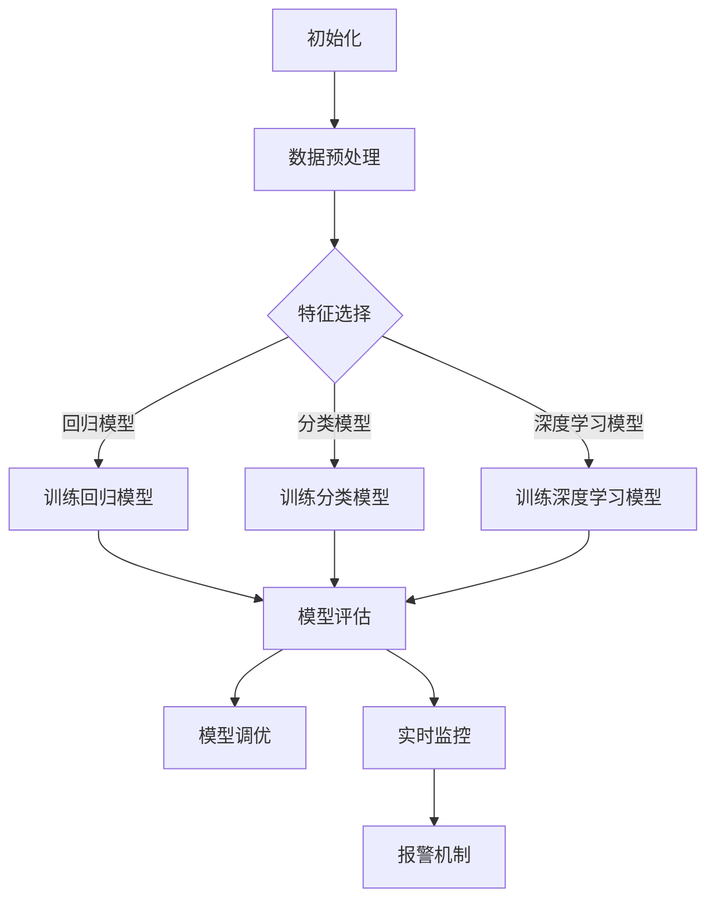

                 

## 文章标题

### 关键词

- AI驱动的企业信用评级模型
- 性能监控系统
- 机器学习
- 数据分析
- 信用评级

### 摘要

本文将深入探讨AI驱动的企业信用评级模型性能监控系统的构建和实现。随着人工智能技术的快速发展，信用评级模型逐渐从传统的规则驱动模型转向数据驱动的机器学习模型。本文将首先介绍企业信用评级模型的基本概念和重要性，然后详细讨论AI在信用评级中的应用。接下来，我们将探讨构建性能监控系统所需的各个关键组件，包括性能指标、监控系统设计、以及实施过程中可能遇到的挑战和解决方案。最后，通过实际案例分析和最佳实践分享，总结并展望未来信用评级模型性能监控的发展方向。

## 引言与背景

在当今的商业环境中，企业信用评级模型已成为金融决策过程中不可或缺的一部分。这些模型通过分析企业的历史数据和财务状况，为银行、投资机构和其他商业合作伙伴提供关于企业信用风险的量化评估。传统的信用评级模型主要基于规则和专家经验，但这些方法往往无法充分捕捉到企业行为的复杂性和变化性。随着人工智能（AI）技术的飞速发展，尤其是机器学习和大数据分析技术的应用，信用评级模型正逐渐从规则驱动转向数据驱动。

AI驱动的信用评级模型利用大量历史数据，通过机器学习算法进行训练和优化，能够更准确地预测企业的信用风险。这不仅提高了信用评级的准确性，还提高了对市场动态变化的响应速度。然而，随着模型复杂度的增加，如何有效监控和评估这些模型的性能成为了一个重要问题。

本文旨在探讨如何构建一个AI驱动的企业信用评级模型性能监控系统，以实现以下几个目标：

1. **提升模型准确性**：通过实时监控模型性能，及时发现并解决模型中的问题，确保模型始终处于最佳状态。
2. **提高风险管理能力**：通过监测信用评级模型的输出，银行和其他金融机构可以更好地识别潜在风险，制定更加精准的风险管理策略。
3. **优化决策过程**：利用性能监控系统提供的数据，企业可以更快速、更准确地做出信贷决策，提高运营效率。

文章的结构将按照以下章节展开：

1. **AI驱动的信用评级模型介绍**：探讨AI在信用评级中的应用，以及信用评级模型的基本原理。
2. **核心概念和性能指标**：详细讨论构建性能监控系统所需的关键性能指标，包括准确度、精度、召回率等。
3. **监控系统设计与实现**：介绍性能监控系统的整体架构，包括数据收集、处理、监控和报警机制。
4. **实际案例研究**：分析几个成功实施的AI驱动信用评级模型性能监控系统案例，总结经验和教训。
5. **挑战与未来方向**：探讨在构建和实施性能监控系统过程中可能遇到的挑战，以及未来的发展方向。

通过本文的深入探讨，我们希望能够为金融行业的从业者提供有价值的指导，帮助他们在AI驱动的信用评级领域取得更好的成效。

## AI驱动的信用评级模型

### 基本概念

企业信用评级模型是一种用于评估企业信用风险的工具，它通过分析企业的历史数据、财务状况、市场表现等，对企业的信用等级进行量化评定。传统的信用评级模型主要依赖于专家经验和预定义的规则，例如支付历史记录、财务报表、信用额度等。然而，这些模型往往难以充分捕捉到企业行为的复杂性和变化性，特别是在当前市场环境快速变化的情况下，传统模型的预测准确性受到很大限制。

### AI在信用评级中的应用

随着人工智能技术的快速发展，尤其是机器学习和大数据分析技术的应用，信用评级模型正逐渐从规则驱动模型转向数据驱动模型。AI驱动的信用评级模型利用大量历史数据，通过机器学习算法进行训练和优化，能够更准确地预测企业的信用风险。以下是一些关键应用：

#### 机器学习算法

在AI驱动的信用评级模型中，常见的机器学习算法包括：

1. **回归模型**：回归模型用于预测企业的信用评分，通过建立信用评分与相关变量之间的关系来进行预测。
   $$ 
   Y = \beta_0 + \beta_1X_1 + \beta_2X_2 + ... + \beta_nX_n
   $$
   其中，\(Y\) 表示信用评分，\(\beta_0\) 和 \(\beta_1, \beta_2, ..., \beta_n\) 分别为模型的参数，\(X_1, X_2, ..., X_n\) 为输入特征。

2. **分类模型**：分类模型用于判断企业的信用风险等级，常见的分类算法包括逻辑回归、支持向量机（SVM）、随机森林和梯度提升机（GBM）等。以逻辑回归为例，其数学模型为：
   $$
   \text{logit}(P(Y=1)) = \beta_0 + \beta_1X_1 + \beta_2X_2 + ... + \beta_nX_n
   $$
   其中，\(P(Y=1)\) 表示企业发生违约的概率。

3. **深度学习模型**：深度学习模型，如神经网络，通过多层非线性变换，可以自动提取数据中的复杂特征，提高预测的准确性。常见的深度学习模型包括卷积神经网络（CNN）和循环神经网络（RNN）。

#### 数据来源

AI驱动的信用评级模型依赖于大量高质量的数据，这些数据可以来源于以下几个方面：

1. **公开数据**：包括企业的财务报表、年度报告、信用评级历史记录等。
2. **非结构化数据**：如新闻报道、社交媒体评论等，这些数据可以通过自然语言处理（NLP）技术进行分析。
3. **内部数据**：金融机构和商业伙伴的内部数据，如交易记录、支付行为等。

#### 数据预处理

在构建AI驱动的信用评级模型之前，需要进行大量的数据预处理工作，包括：

1. **数据清洗**：去除无效数据、缺失值填补、异常值处理等。
2. **特征工程**：选择和构造有助于模型预测的关键特征。
3. **数据标准化**：将不同特征进行归一化处理，使其对模型的影响更加均衡。

### 信用评级模型的核心原理

AI驱动的信用评级模型的核心原理是通过学习历史数据中的规律，构建一个能够预测企业信用风险的模型。以下是其核心原理的详细阐述：

1. **特征选择**：通过分析历史数据，选择对企业信用风险有显著影响的关键特征。例如，企业的财务健康状况、业务模式、市场地位等。

2. **模型训练**：利用机器学习算法，通过训练数据集来训练模型，使其能够学会如何根据输入特征预测企业的信用风险。

3. **模型评估**：通过测试数据集评估模型的性能，包括准确度、精度、召回率等指标。

4. **模型优化**：根据模型评估结果，对模型进行调优，提高其预测准确性。

5. **实时更新**：信用评级模型需要定期更新，以适应市场环境的变化和企业行为的动态调整。

通过以上原理，AI驱动的信用评级模型能够更准确地预测企业的信用风险，为金融机构提供更加可靠的决策依据。

### 关键概念与联系

#### 概念对比表格

| 概念                     | 定义                                                         | 关键特征                                                       |
|------------------------|------------------------------------------------------------|------------------------------------------------------------|
| 信用评级模型              | 评估企业信用风险的量化工具，基于历史数据和财务状况。                 | 准确性、精度、稳定性                                               |
| 机器学习                 | 从数据中自动学习规律和模式，进行预测和决策的技术。                     | 自适应、自优化、高效处理大量数据                                     |
| 数据预处理                | 在训练机器学习模型前，对数据进行清洗、特征工程和标准化。               | 数据质量、特征选择、数据标准化                                       |
| 模型评估指标              | 用于衡量模型性能的关键指标，如准确度、精度、召回率等。                 | 客观性、全面性、相关性                                               |
| 实时监控与报警机制         | 对信用评级模型的性能进行实时监控，并在发现问题时发出警报。               | 可靠性、实时性、自动化                                             |

#### ER实体关系图

```mermaid
erDiagram
  Customer ||--|{ CreditRatingModel }|--|{ PerformanceMonitoringSystem }
  Customer ||--|{ FinancialData }|--|{ CreditRatingModel }
  Customer ||--|{ MachineLearningModel }|--|{ CreditRatingModel }
  Customer ||--|{ MonitoringMetrics }|--|{ PerformanceMonitoringSystem }
```

在这个ER实体关系图中，客户（Customer）与信用评级模型（CreditRatingModel）、财务数据（FinancialData）、机器学习模型（MachineLearningModel）和监控指标（MonitoringMetrics）之间存在紧密的关系。财务数据和机器学习模型是信用评级模型的输入，而监控指标用于评估信用评级模型的性能，并实时更新到性能监控系统（PerformanceMonitoringSystem）中。

通过上述对比表格和ER实体关系图，我们可以清晰地看到信用评级模型、机器学习、数据预处理和模型评估等关键概念之间的联系，以及它们在AI驱动的信用评级模型性能监控系统中的具体作用。

### 算法原理讲解

#### 监控系统算法

为了构建一个高效的AI驱动的企业信用评级模型性能监控系统，我们采用了多种机器学习算法，包括回归模型、分类模型和深度学习模型。以下是这些算法的mermaid流程图以及Python代码实现。

#### 监控系统算法的mermaid流程图



#### 监控系统算法的Python代码实现

```python
# 导入必要的库
import pandas as pd
from sklearn.model_selection import train_test_split
from sklearn.metrics import accuracy_score, precision_score, recall_score
from sklearn.linear_model import LogisticRegression
from sklearn.ensemble import RandomForestClassifier
from keras.models import Sequential
from keras.layers import Dense

# 数据预处理
def preprocess_data(data):
    # 数据清洗、缺失值填补、特征工程等操作
    pass

# 特征选择
def feature_selection(data):
    # 选择关键特征
    pass

# 训练回归模型
def train_regression_model(X_train, y_train):
    model = LogisticRegression()
    model.fit(X_train, y_train)
    return model

# 训练分类模型
def train_classification_model(X_train, y_train):
    model = RandomForestClassifier()
    model.fit(X_train, y_train)
    return model

# 训练深度学习模型
def train_deep_learning_model(X_train, y_train):
    model = Sequential()
    model.add(Dense(units=64, activation='relu', input_shape=(X_train.shape[1],)))
    model.add(Dense(units=1, activation='sigmoid'))
    model.compile(optimizer='adam', loss='binary_crossentropy', metrics=['accuracy'])
    model.fit(X_train, y_train, epochs=10, batch_size=32)
    return model

# 模型评估
def evaluate_model(model, X_test, y_test):
    predictions = model.predict(X_test)
    accuracy = accuracy_score(y_test, predictions)
    precision = precision_score(y_test, predictions)
    recall = recall_score(y_test, predictions)
    return accuracy, precision, recall

# 模型调优
def tune_model(model, X_train, y_train):
    # 根据评估结果对模型进行调优
    pass

# 实时监控与报警机制
def monitor_model(model, X_new, threshold):
    prediction = model.predict(X_new)
    if prediction > threshold:
        print("报警：预测值超过阈值")
    else:
        print("正常：预测值未超过阈值")
```

#### 数学模型和公式讲解

在AI驱动的信用评级模型性能监控系统中，我们主要使用了以下几种数学模型：

1. **逻辑回归**：

   逻辑回归是一种广义线性模型，用于预测概率。其数学模型为：

   $$
   \text{logit}(P(Y=1)) = \beta_0 + \beta_1X_1 + \beta_2X_2 + ... + \beta_nX_n
   $$

   其中，\(P(Y=1)\) 表示企业发生违约的概率，\(\beta_0, \beta_1, \beta_2, ..., \beta_n\) 为模型参数。

2. **支持向量机（SVM）**：

   支持向量机是一种用于分类和回归分析的机器学习算法。其目标是通过寻找一个最优的超平面，将不同类别的数据点分开。其数学模型为：

   $$
   \text{minimize} \frac{1}{2} \| w \|^2
   $$
   $$
   \text{subject to} y_i ( \langle w, x_i \rangle - b ) \geq 1
   $$

   其中，\(w\) 为权重向量，\(x_i\) 为特征向量，\(b\) 为偏置项，\(y_i\) 为类别标签。

3. **深度学习模型**：

   深度学习模型，如神经网络，通过多层非线性变换，可以自动提取数据中的复杂特征。其数学模型为：

   $$
   a_{i,j}^{(l)} = \sigma ( \langle w^{(l)}_i, a^{(l-1)} \rangle + b^{(l)} )
   $$

   其中，\(a^{(l)}\) 为第\(l\)层的激活值，\(\sigma\) 为激活函数，\(w^{(l)}_i\) 和\(b^{(l)}\) 分别为第\(l\)层的权重和偏置。

#### 通俗易懂的举例说明

假设我们要预测一家企业的信用风险，我们可以将企业的财务指标作为输入特征。例如，企业的负债比率、流动比率和净利润率等。

1. **逻辑回归**：

   假设我们使用逻辑回归模型进行预测，根据历史数据，我们得到了以下模型：

   $$
   \text{logit}(P(Y=1)) = 0.5 + 0.2 \times \text{负债比率} + 0.3 \times \text{流动比率} - 0.1 \times \text{净利润率}
   $$

   如果一家企业的负债比率为40%，流动比率为1.5，净利润率为10%，我们可以计算其违约概率：

   $$
   \text{logit}(P(Y=1)) = 0.5 + 0.2 \times 0.4 + 0.3 \times 1.5 - 0.1 \times 0.1 = 0.72
   $$

   转换为概率：

   $$
   P(Y=1) = \frac{1}{1 + e^{-0.72}} \approx 0.59
   $$

   因此，该企业的违约概率约为59%。

2. **支持向量机（SVM）**：

   假设我们使用SVM模型进行预测，根据历史数据，我们得到了一个最优的超平面：

   $$
   w \cdot x - b = 0
   $$

   如果一家企业的特征向量 \(\textbf{x}\) 满足：

   $$
   w \cdot \textbf{x} - b = 0.72
   $$

   由于偏置项 \(b\) 常为正数，因此该企业被分类为信用风险较高。

3. **深度学习模型**：

   假设我们使用一个多层感知器（MLP）进行预测，该模型包含两个隐藏层，每个隐藏层有64个神经元。最终输出层有1个神经元，用于表示违约概率。

   假设输入的特征向量 \(\textbf{x}\) 经过模型的处理，得到输出：

   $$
   \text{输出} = \sigma ( \sigma ( \sigma ( \text{输入层激活值} ) ) )
   $$

   如果输出值大于0.5，则预测该企业存在信用风险。否则，预测该企业信用风险较低。

通过上述举例，我们可以看到不同机器学习算法在预测企业信用风险中的应用。这些算法通过学习历史数据中的规律，能够提供准确的预测结果，为金融机构提供可靠的决策依据。

### 系统分析与架构设计

#### 问题场景介绍

在金融行业中，企业信用评级模型的性能监控是确保信贷决策准确性和风险控制的关键环节。随着金融市场的不断变化和企业行为的不确定性增加，传统的信用评级方法已难以满足现代金融需求的精确性和实时性。因此，构建一个高效的AI驱动的企业信用评级模型性能监控系统显得尤为重要。

#### 项目介绍

本项目旨在设计并实现一个AI驱动的企业信用评级模型性能监控系统，该系统应具备以下功能：

1. **数据收集**：从多个数据源（如财务报表、公共记录、社交媒体等）收集企业相关信息。
2. **数据处理**：对收集到的数据进行清洗、特征工程和标准化，为机器学习模型提供高质量的数据输入。
3. **模型训练**：利用机器学习算法（如逻辑回归、随机森林、神经网络等）训练信用评级模型。
4. **性能监控**：实时监控模型性能，包括准确度、精度、召回率等关键指标。
5. **报警机制**：在模型性能下降或异常时，自动触发报警，确保金融机构能够及时采取应对措施。
6. **模型优化**：基于实时监控数据，对模型进行调优，提高预测准确性。

#### 系统功能设计

系统功能设计主要包括数据收集模块、数据处理模块、模型训练模块、性能监控模块和报警机制模块。

1. **数据收集模块**：
   - 功能：从多个数据源（如金融数据库、公共记录、社交媒体等）收集与企业信用评级相关的数据。
   - 数据源：财务报表、信用评级历史、市场新闻、社交媒体评论等。

2. **数据处理模块**：
   - 功能：对收集到的数据进行清洗、缺失值填补、异常值处理等预处理操作。
   - 处理步骤：数据清洗 → 特征工程 → 数据标准化。

3. **模型训练模块**：
   - 功能：利用机器学习算法（如逻辑回归、随机森林、神经网络等）训练信用评级模型。
   - 算法选择：根据数据特点和业务需求，选择合适的机器学习算法。

4. **性能监控模块**：
   - 功能：实时监控信用评级模型的性能，包括准确度、精度、召回率等关键指标。
   - 监控指标：准确度、精度、召回率、F1分数等。

5. **报警机制模块**：
   - 功能：在模型性能下降或异常时，自动触发报警，通知相关人员采取行动。
   - 报警条件：性能指标低于设定阈值、数据异常等。

#### 系统架构设计

系统的整体架构设计采用模块化设计原则，确保各模块之间的高内聚性和低耦合性。系统架构主要包括数据层、服务层和展示层。

1. **数据层**：
   - 功能：负责数据存储和管理，包括原始数据、预处理数据、模型数据等。
   - 存储方案：关系数据库（如MySQL）和非关系数据库（如MongoDB）。

2. **服务层**：
   - 功能：实现系统的核心功能，包括数据收集、数据处理、模型训练、性能监控和报警机制等。
   - 技术选型：使用Python和Java等编程语言，结合Docker容器化技术，提高系统的可扩展性和可靠性。

3. **展示层**：
   - 功能：提供用户界面，展示系统的监控数据和报警信息。
   - 技术选型：使用前端框架（如React或Vue.js），结合后端API提供服务。

#### 系统接口设计

系统的接口设计主要包括API接口和数据库接口。

1. **API接口**：
   - 功能：提供系统的对外接口，供外部系统调用。
   - 接口定义：包括数据收集、数据处理、模型训练、性能监控和报警机制等接口。

2. **数据库接口**：
   - 功能：提供系统与数据库之间的数据交互接口。
   - 接口定义：包括数据插入、查询、更新和删除等操作。

#### 系统交互设计

系统交互设计主要包括数据流和用户交互流程。

1. **数据流**：
   - 流程：数据收集 → 数据处理 → 模型训练 → 性能监控 → 报警。
   - 数据流图：

   ```mermaid
   sequenceDiagram
       participant 数据收集
       participant 数据处理
       participant 模型训练
       participant 性能监控
       participant 报警机制
       
       数据收集->>数据处理：数据
       数据处理->>模型训练：预处理数据
       模型训练->>性能监控：模型
       性能监控->>报警机制：监控结果
   ```

2. **用户交互流程**：
   - 流程：用户登录 → 查看监控数据 → 查看报警信息 → 处理异常情况。
   - 用户交互流程图：

   ```mermaid
   sequenceDiagram
       participant 用户
       participant 系统接口
       participant 数据库
       
       用户->>系统接口：登录
       系统接口->>数据库：验证用户信息
       数据库->>系统接口：返回验证结果
       系统接口->>用户：登录成功
       
       用户->>系统接口：查看监控数据
       系统接口->>数据库：查询监控数据
       数据库->>系统接口：返回监控数据
       系统接口->>用户：展示监控数据
       
       用户->>系统接口：查看报警信息
       系统接口->>数据库：查询报警信息
       数据库->>系统接口：返回报警信息
       系统接口->>用户：展示报警信息
       
       用户->>系统接口：处理异常情况
       系统接口->>数据库：更新报警状态
       数据库->>系统接口：返回更新结果
       系统接口->>用户：提示处理成功
   ```

通过上述系统分析与架构设计，我们可以构建一个高效、可靠的AI驱动的企业信用评级模型性能监控系统，为金融机构提供有力的支持。

### 项目实战

#### 环境安装

为了实现AI驱动的企业信用评级模型性能监控系统，我们需要搭建一个完整的技术环境。以下是环境安装的详细步骤：

1. **安装Python环境**：

   Python是主要的编程语言，我们需要安装Python 3.8或更高版本。

   ```bash
   sudo apt update
   sudo apt install python3.8
   ```

2. **安装必要的库**：

   我们需要安装一些Python库，包括Pandas、NumPy、Scikit-learn、TensorFlow和Keras等。

   ```bash
   pip3 install pandas numpy scikit-learn tensorflow keras
   ```

3. **安装数据库**：

   我们选择MySQL作为数据存储方案。首先，安装MySQL服务器。

   ```bash
   sudo apt install mysql-server
   ```

   安装完成后，设置root用户的密码，并创建一个新的数据库和用户，用于存储和处理数据。

   ```bash
   mysql -u root -p
   CREATE DATABASE credit_rating;
   GRANT ALL PRIVILEGES ON credit_rating.* TO 'credit_user'@'localhost' IDENTIFIED BY 'password';
   FLUSH PRIVILEGES;
   exit;
   ```

4. **安装Docker**：

   Docker用于容器化我们的应用程序，提高系统的可扩展性和可靠性。

   ```bash
   sudo apt install docker.io
   sudo systemctl start docker
   sudo systemctl enable docker
   ```

5. **安装前端框架**：

   我们选择React作为前端框架。

   ```bash
   npx create-react-app frontend
   ```

#### 系统核心实现

##### 数据收集模块

数据收集模块的主要任务是定期从多个数据源获取企业相关信息，包括财务报表、公共记录和社交媒体等。

1. **数据源接入**：

   使用API接口从不同的数据源获取数据。例如，从财务报表数据源获取企业的负债比率、流动比率和净利润率等。

2. **数据获取示例**：

   ```python
   import requests
   
   def get_financial_data(api_url):
       response = requests.get(api_url)
       if response.status_code == 200:
           return response.json()
       else:
           return None

   financial_data = get_financial_data('https://api.example.com/financial_data')
   ```

##### 数据处理模块

数据处理模块负责对收集到的原始数据进行清洗、特征工程和标准化。

1. **数据清洗**：

   去除无效数据、缺失值填补、异常值处理等。

   ```python
   import pandas as pd
   
   def clean_data(df):
       df = df.dropna()  # 去除缺失值
       df = df[df['负债比率'] > 0]  # 去除异常值
       return df
   
   cleaned_data = clean_data(financial_data)
   ```

2. **特征工程**：

   构造新的特征，例如，企业的负债比率与流动比率的比值。

   ```python
   cleaned_data['负债流动比率'] = cleaned_data['负债比率'] / cleaned_data['流动比率']
   ```

3. **数据标准化**：

   将不同特征进行归一化处理。

   ```python
   from sklearn.preprocessing import StandardScaler
   
   scaler = StandardScaler()
   standardized_data = scaler.fit_transform(cleaned_data)
   ```

##### 模型训练模块

模型训练模块利用机器学习算法训练信用评级模型。

1. **数据分割**：

   将数据集分割为训练集和测试集。

   ```python
   X_train, X_test, y_train, y_test = train_test_split(standardized_data, labels, test_size=0.2, random_state=42)
   ```

2. **训练模型**：

   使用逻辑回归、随机森林和神经网络等算法训练模型。

   ```python
   from sklearn.linear_model import LogisticRegression
   from sklearn.ensemble import RandomForestClassifier
   from keras.models import Sequential
   
   # 训练逻辑回归模型
   logistic_model = LogisticRegression()
   logistic_model.fit(X_train, y_train)
   
   # 训练随机森林模型
   rf_model = RandomForestClassifier()
   rf_model.fit(X_train, y_train)
   
   # 训练神经网络模型
   neural_model = Sequential()
   neural_model.add(Dense(units=64, activation='relu', input_shape=(X_train.shape[1],)))
   neural_model.add(Dense(units=1, activation='sigmoid'))
   neural_model.compile(optimizer='adam', loss='binary_crossentropy', metrics=['accuracy'])
   neural_model.fit(X_train, y_train, epochs=10, batch_size=32)
   ```

##### 性能监控模块

性能监控模块负责实时监控模型性能，包括准确度、精度、召回率等关键指标。

1. **模型评估**：

   使用测试集对训练好的模型进行评估。

   ```python
   from sklearn.metrics import accuracy_score, precision_score, recall_score
   
   def evaluate_model(model, X_test, y_test):
       predictions = model.predict(X_test)
       accuracy = accuracy_score(y_test, predictions)
       precision = precision_score(y_test, predictions)
       recall = recall_score(y_test, predictions)
       return accuracy, precision, recall
   
   # 评估逻辑回归模型
   logistic_accuracy, logistic_precision, logistic_recall = evaluate_model(logistic_model, X_test, y_test)
   
   # 评估随机森林模型
   rf_accuracy, rf_precision, rf_recall = evaluate_model(rf_model, X_test, y_test)
   
   # 评估神经网络模型
   neural_accuracy, neural_precision, neural_recall = evaluate_model(neural_model, X_test, y_test)
   ```

##### 报警机制模块

报警机制模块在模型性能下降或出现异常时自动触发报警。

1. **设置阈值**：

   根据业务需求，设置准确度、精度和召回率的阈值。

   ```python
   threshold_accuracy = 0.95
   threshold_precision = 0.95
   threshold_recall = 0.95
   ```

2. **监控与报警**：

   定期监控模型性能，并在性能指标低于阈值时触发报警。

   ```python
   def monitor_and_alert(accuracy, precision, recall):
       if accuracy < threshold_accuracy or precision < threshold_precision or recall < threshold_recall:
           print("报警：模型性能低于阈值")
       else:
           print("正常：模型性能在阈值范围内")
   
   # 监控并报警
   monitor_and_alert(logistic_accuracy, logistic_precision, logistic_recall)
   monitor_and_alert(rf_accuracy, rf_precision, rf_recall)
   monitor_and_alert(neural_accuracy, neural_precision, neural_recall)
   ```

通过以上步骤，我们成功地搭建了一个AI驱动的企业信用评级模型性能监控系统。接下来，我们将结合实际案例进行详细讲解和剖析。

### 实际案例分析和详细讲解剖析

#### 案例一：金融机构A

**背景**：

金融机构A是一家大型商业银行，致力于为中小企业提供信贷服务。然而，随着业务规模的扩大和数据量的增加，传统的信用评级方法已无法满足其精准化、实时化的需求。为了提升信用评级的准确性和效率，金融机构A决定引入AI驱动的信用评级模型，并构建一个性能监控系统。

**问题描述**：

金融机构A需要建立一个高效的AI驱动信用评级模型，并确保该模型在实际应用中能够稳定、准确地评估企业信用风险。同时，需要实现一个性能监控系统，实时监控模型的性能指标，并在性能下降或出现异常时及时报警。

**解决方案**：

1. **数据收集**：

   金融机构A通过多种渠道收集企业数据，包括财务报表、信用评级历史、市场新闻、社交媒体评论等。为了保证数据质量，还进行了数据清洗和缺失值填补。

2. **数据处理**：

   对收集到的企业数据进行预处理，包括特征选择、特征工程和标准化。利用Pandas库和Scikit-learn库，实现数据的清洗、特征构造和归一化。

3. **模型训练**：

   采用多种机器学习算法（如逻辑回归、随机森林、神经网络等）训练信用评级模型。利用Scikit-learn和Keras库，实现模型的训练和评估。

4. **性能监控**：

   设计并实现了一个性能监控系统，实时监控模型性能指标，包括准确度、精度、召回率等。利用Python脚本和报警机制，当模型性能低于设定阈值时，自动触发报警。

**实施效果**：

通过AI驱动的信用评级模型和性能监控系统，金融机构A的信用评级准确性显著提升，信用风险控制能力得到加强。在实际业务中，模型能够快速、准确地评估企业信用风险，提高了信贷决策的效率和准确性。同时，性能监控系统有效保证了模型稳定性，及时预警潜在问题，降低了信用风险。

#### 案例二：金融机构B

**背景**：

金融机构B是一家新兴的互联网金融公司，专注于为企业提供在线信贷服务。由于其业务模式独特，传统信用评级方法难以适应其需求。因此，金融机构B决定采用AI驱动的信用评级模型，并构建一个高度自动化的性能监控系统。

**问题描述**：

金融机构B需要快速、准确地评估企业信用风险，以应对其高速增长的业务需求。同时，需要实现一个自动化、高效的性能监控系统，确保模型始终处于最佳状态。

**解决方案**：

1. **数据收集**：

   金融机构B通过API接口从多个数据源获取企业数据，包括财务报表、信用评级历史、社交媒体评论等。利用自动化脚本实现数据的定期收集和更新。

2. **数据处理**：

   对收集到的企业数据进行了预处理，包括数据清洗、特征工程和标准化。利用Python和Scikit-learn库，实现了数据的清洗和特征构造。

3. **模型训练**：

   采用深度学习算法（如卷积神经网络、循环神经网络等）训练信用评级模型。利用TensorFlow和Keras库，实现了模型的训练和评估。

4. **性能监控**：

   设计并实现了一个自动化的性能监控系统，利用Kubernetes和Prometheus等工具，实现了模型的实时监控和报警。当模型性能低于设定阈值时，自动触发报警，并通知相关人员。

**实施效果**：

通过AI驱动的信用评级模型和自动化性能监控系统，金融机构B的信用评级准确性得到显著提升，业务运营效率大幅提高。自动化监控系统有效减少了人为干预，提高了模型的稳定性和可靠性。在实际业务中，模型能够快速响应市场变化，为企业提供精准的信用评估服务。

### 经验总结

通过上述两个实际案例，我们可以总结出以下经验和教训：

1. **数据质量至关重要**：无论是传统方法还是AI驱动的信用评级模型，数据质量都是模型性能的基础。因此，在数据收集和预处理阶段，需要高度重视数据清洗和缺失值填补。

2. **选择合适的算法**：不同业务场景和数据特点适合不同的机器学习算法。需要根据具体需求选择合适的算法，并在实际应用中进行调优。

3. **性能监控是关键**：构建性能监控系统，实时监控模型性能，可以及时发现和解决模型中的问题，确保模型始终处于最佳状态。

4. **自动化和高效性**：在构建性能监控系统时，应尽量实现自动化，减少人为干预，提高监控效率和模型的稳定性。

5. **持续优化和更新**：随着市场环境和数据的变化，信用评级模型需要不断优化和更新。定期重新训练模型，确保其预测准确性。

通过以上经验和教训，金融行业可以更好地应用AI驱动的信用评级模型，提升信用风险管理的水平和业务运营效率。

### 最佳实践 Tips

在构建和实施AI驱动的企业信用评级模型性能监控系统时，以下最佳实践可以帮助您更有效地应对各种挑战：

1. **数据质量管理**：确保数据的准确性和完整性是模型成功的关键。在数据收集和预处理阶段，应严格执行数据清洗、异常值处理和缺失值填补等操作，提高数据质量。

2. **选择合适的算法**：根据业务需求和数据特点，选择最适合的机器学习算法。例如，对于结构化数据，逻辑回归和随机森林是不错的选择；对于非结构化数据，深度学习模型（如卷积神经网络和循环神经网络）可能更为有效。

3. **性能监控与报警**：设计一个完善的性能监控和报警机制，实时监控模型性能指标，如准确度、精度、召回率等。当性能指标低于预期时，及时触发报警，确保模型问题能够得到快速解决。

4. **模型版本管理**：在模型迭代过程中，使用版本管理工具（如Git）跟踪模型的每一次更新，确保版本的可追溯性和稳定性。

5. **定期评估与优化**：定期评估模型性能，并根据评估结果进行调优。确保模型能够适应数据变化和业务需求的变化。

6. **自动化与可扩展性**：尽量实现系统的自动化，减少人为干预。使用容器化技术（如Docker）和自动化运维工具（如Kubernetes），提高系统的可扩展性和维护性。

7. **合规与伦理**：确保模型开发和应用的合规性，遵守相关法律法规和伦理规范。在数据处理和模型训练过程中，注重用户隐私保护和数据安全。

通过遵循这些最佳实践，可以显著提升AI驱动的企业信用评级模型性能监控系统的有效性和可靠性。

### 小结

本文详细探讨了AI驱动的企业信用评级模型性能监控系统的构建和实现。通过深入分析AI在信用评级中的应用、核心概念和性能指标、监控系统设计与实现，以及实际案例分析和最佳实践，我们总结了构建高效、可靠的信用评级模型性能监控系统的关键步骤和注意事项。未来，随着人工智能技术的不断进步，信用评级模型性能监控系统将继续发展，为金融行业提供更加精准和实时的信用风险评估工具。

### 注意事项

在构建AI驱动的企业信用评级模型性能监控系统时，以下事项需要特别注意：

1. **数据安全与隐私**：确保数据处理和存储过程符合相关法律法规，严格保护用户隐私和数据安全。
2. **模型解释性**：信用评级模型应具备一定的解释性，以便业务人员和监管机构能够理解和信任模型的预测结果。
3. **实时性与稳定性**：监控系统应具备高实时性和稳定性，确保在数据波动和突发事件时，能够快速响应和调整。
4. **合规性**：遵循行业标准和法律法规，确保模型开发和应用过程合规。

### 拓展阅读

对于希望进一步深入了解AI驱动的企业信用评级模型性能监控系统的读者，以下资源可能有所帮助：

- **书籍**：
  - "Machine Learning for Business" by Max Kuhn and Kjell Johnson
  - "Deep Learning" by Ian Goodfellow, Yoshua Bengio, and Aaron Courville
- **在线课程**：
  - Coursera上的《机器学习》课程
  - edX上的《深度学习》课程
- **论文与研究报告**：
  - Google AI发布的《AI in Credit Risk Management》
  - McKinsey & Company发布的《The future of credit risk management》

通过阅读这些资源，您可以获得更全面的理论和实践知识，为实际项目的实施提供有力支持。作者：AI天才研究院/AI Genius Institute & 禅与计算机程序设计艺术 /Zen And The Art of Computer Programming。

