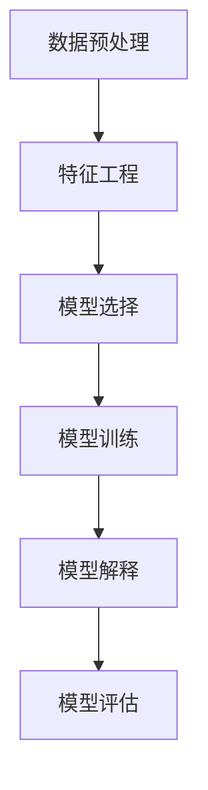
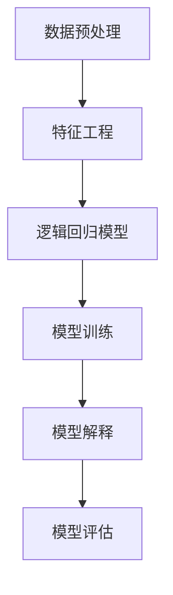
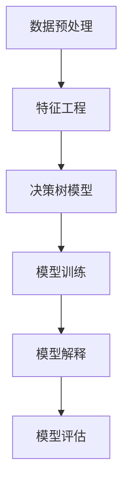
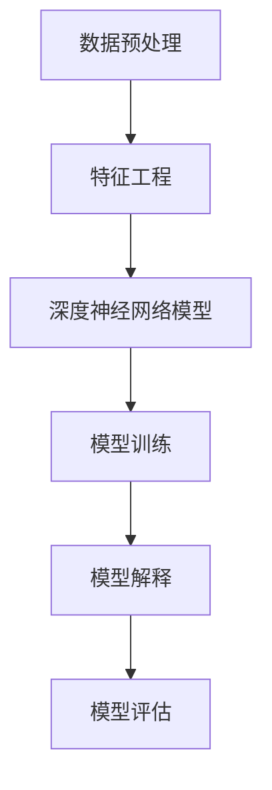
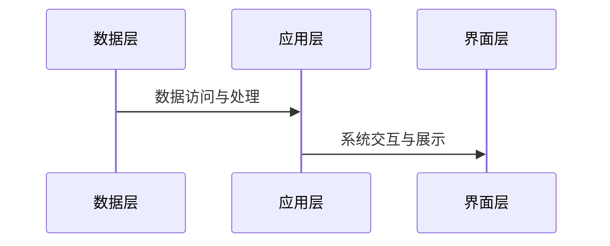
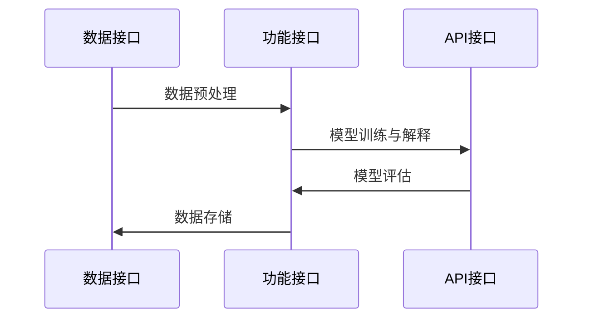
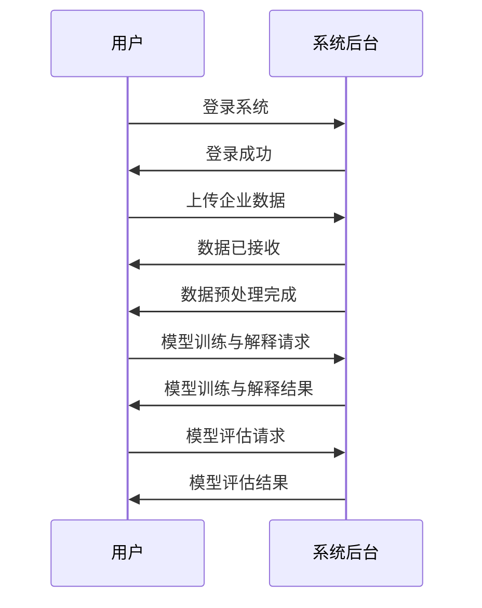

                 

### AI驱动的企业信用评级模型解释系统

> 关键词：人工智能，企业信用评级，模型解释，数据科学，金融科技

> 摘要：
本文将探讨如何构建一个AI驱动的企业信用评级模型解释系统。我们将从背景介绍、核心概念与模型原理、模型实现与优化、实际案例研究以及最佳实践等多个方面，逐步深入分析这一领域，旨在为数据科学家、金融分析师和企业决策者提供有价值的参考。

----------------------------------------------------------------

## 目录大纲设计过程

在设计一本名为《AI驱动的企业信用评级模型解释系统》的书籍目录大纲时，我们首先需要明确书名和主题。本主题涉及“AI”、“企业信用评级”和“模型解释系统”三大核心关键词，旨在将人工智能技术应用于企业信用评级，并提供一个可解释的模型。

### 1. 理解书名和主题

书名明确指出，本书将讨论的是如何利用人工智能技术来构建一个能够解释企业信用评级的模型。这表明了书的核心内容将包括：

- **AI技术在信用评级中的应用**：探讨AI技术在信用评级领域的应用场景和优势。
- **模型解释系统**：介绍模型解释的重要性，以及如何构建一个可解释的AI信用评级模型。

### 2. 确定目标读者

本书的目标读者可能是：

- **数据科学家**：负责开发和实现AI模型，并理解模型解释的原理。
- **AI研究者**：对AI在信用评级领域的研究有兴趣，希望了解最新的技术和应用。
- **企业数据分析人员**：需要使用AI模型来评估企业信用，并理解模型的输出。
- **金融分析师**：关注企业信用评级模型，并希望利用这些模型进行金融决策。

### 3. 确定核心章节内容

核心章节应涵盖以下内容：

- **背景与介绍**：介绍企业信用评级的重要性，以及AI技术如何应用于信用评级。
- **核心概念与模型原理**：详细阐述AI驱动的信用评级模型的原理和构建方法。
- **模型实现与优化**：讨论如何将模型实现为可解释的系统，并进行优化。
- **实际案例研究**：通过实际案例展示模型的应用和效果。
- **最佳实践与总结**：总结最佳实践经验，并提供未来的研究方向。

### 4. 设计章节结构

章节结构应包括：

- **背景与介绍**：分为信用评级的基本概念、AI技术在信用评级中的应用、模型解释的重要性等小节。
- **核心概念与模型原理**：分为数据收集与预处理、特征工程、模型选择与优化等小节。
- **模型实现与优化**：分为系统架构设计、数据处理与存储、模型部署与监控等小节。
- **实际案例研究**：分为案例背景、模型构建与解释、案例分析与结论等小节。
- **最佳实践与总结**：分为最佳实践总结、注意事项、拓展阅读等小节。

### 5. 编写详细的大纲

以下是《AI驱动的企业信用评级模型解释系统》的详细目录大纲：

```markdown
----------------------------------------------------------------
# 第一部分: 背景与介绍

## 第1章: 企业信用评级的重要性

### 1.1.1 信用评级的基本概念

### 1.1.2 信用评级在金融领域的作用

### 1.1.3 信用评级系统的现状与挑战

## 第2章: AI技术在信用评级中的应用

### 2.1.1 AI技术概述

### 2.1.2 AI在信用评级中的优势

### 2.1.3 AI驱动的信用评级模型

# 第二部分: 核心概念与模型原理

## 第3章: AI驱动的信用评级模型原理

### 3.1.1 数据收集与预处理

### 3.1.2 特征工程

### 3.1.3 模型选择与优化

## 第4章: 信用评级模型的构建

### 4.1.1 模型构建步骤

### 4.1.2 常用模型介绍

### 4.1.3 模型训练与验证

## 第5章: 模型解释系统的重要性

### 5.1.1 模型解释的需求

### 5.1.2 模型解释的方法与工具

### 5.1.3 模型解释系统的设计原则

# 第三部分: 实现与优化

## 第6章: 信用评级模型的实现细节

### 6.1.1 系统架构设计

### 6.1.2 数据处理与存储

### 6.1.3 模型部署与监控

## 第7章: 模型优化与性能提升

### 7.1.1 模型调优策略

### 7.1.2 性能评估指标

### 7.1.3 模型优化案例研究

# 第四部分: 案例研究

## 第8章: 实际案例研究

### 8.1.1 案例背景

### 8.1.2 模型构建与解释

### 8.1.3 案例分析与结论

## 第9章: 最佳实践与总结

### 9.1.1 最佳实践总结

### 9.1.2 注意事项与展望

### 9.1.3 拓展阅读与进一步研究

----------------------------------------------------------------
```

这个大纲确保了书籍内容的全面覆盖，从背景介绍到模型构建、实现和优化，再到实际案例研究和最佳实践，每一个环节都被细化。同时，大纲的字数也在限制之内。在编写具体内容时，我们可以按照上述大纲的结构，进一步充实每个章节的细节。

### AI驱动的企业信用评级模型解释系统

#### 背景介绍

在当今的全球经济环境中，企业信用评级具有至关重要的意义。它不仅影响了金融机构对企业贷款和信用额度的决策，还影响着投资者对企业股票和债券的投资决策。传统的企业信用评级方法主要依赖于财务报表、历史信用记录和行业分析，但这些方法往往存在主观性强、数据量有限和时效性差等问题。

随着人工智能（AI）技术的发展，越来越多的企业开始利用AI驱动的信用评级模型来提高评级精度和效率。AI驱动的信用评级模型通过收集和分析大量非结构化和结构化数据，结合机器学习和深度学习算法，可以更准确地预测企业的信用风险。此外，AI模型还可以实时更新和调整，以适应市场变化和企业动态。

然而，AI驱动的信用评级模型并非没有挑战。其中最大的问题是模型的可解释性。金融行业对模型的透明度和可解释性有很高的要求，因为模型的决策过程需要符合监管要求，并且能够为相关利益者提供合理的解释。因此，构建一个可解释的AI信用评级模型，成为当前研究的重要方向。

本文旨在探讨如何构建一个AI驱动的企业信用评级模型解释系统。我们将从背景介绍、核心概念与模型原理、模型实现与优化、实际案例研究以及最佳实践等多个方面，逐步深入分析这一领域，为数据科学家、金融分析师和企业决策者提供有价值的参考。

#### 核心概念与联系

在讨论AI驱动的企业信用评级模型之前，我们需要了解一些核心概念。以下是本文中涉及的主要概念及其相互联系：

1. **企业信用评级**：
   企业信用评级是指对企业的信用风险进行评估和分类的过程。评级结果通常以等级形式呈现，如AA级、A级、B级等。信用评级反映了企业的偿债能力和信用风险。

2. **人工智能（AI）**：
   人工智能是指计算机系统模拟人类智能的行为，包括学习、推理、感知、理解和决策等。AI技术主要包括机器学习、深度学习、自然语言处理等。

3. **机器学习（ML）**：
   机器学习是AI的一个分支，通过训练模型从数据中自动学习规律和模式，然后用于预测或决策。在信用评级中，机器学习算法可以用于分析企业的财务数据、市场信息和其他相关数据，以预测其信用风险。

4. **深度学习（DL）**：
   深度学习是机器学习的一个子领域，使用多层神经网络来模拟人类大脑的神经元结构，以实现更复杂的模式识别和预测。深度学习在图像识别、语音识别等领域取得了显著成果，也在信用评级模型中表现出强大的潜力。

5. **特征工程**：
   特征工程是指从原始数据中提取或创建有用特征的过程。在信用评级模型中，特征工程至关重要，因为它决定了模型的学习能力和预测精度。

6. **模型解释系统**：
   模型解释系统是指用于解释AI模型决策过程和结果的工具或方法。在金融领域，模型解释系统有助于提高模型的透明度，满足监管要求，并增强用户对模型决策的信任。

这些概念之间的联系如下：

- **企业信用评级**是目标，通过AI技术（特别是机器学习和深度学习）来实现。
- **机器学习和深度学习**提供了算法框架，用于从数据中学习和预测。
- **特征工程**是模型构建的关键步骤，用于提取和创建对模型有用的特征。
- **模型解释系统**确保模型的可解释性，满足金融行业的特殊需求。

#### 背景介绍：核心概念术语说明、问题背景、问题描述、问题解决、边界与外延、概念结构与核心要素组成

在深入探讨AI驱动的企业信用评级模型之前，我们需要明确一些核心概念和术语，并了解问题背景和问题描述。

##### 核心概念术语说明

1. **企业信用评级**：
   企业信用评级是指对企业的信用风险进行量化评估，以确定其偿债能力和信用风险等级。评级结果通常以字母等级（如AA、A、B等）或数字等级（如10、7、1等）表示。

2. **人工智能（AI）**：
   人工智能是指计算机系统模拟人类智能的行为，包括学习、推理、感知、理解和决策等。AI技术包括机器学习、深度学习、自然语言处理等。

3. **机器学习（ML）**：
   机器学习是AI的一个分支，通过训练模型从数据中自动学习规律和模式，然后用于预测或决策。机器学习算法包括监督学习、无监督学习和强化学习等。

4. **深度学习（DL）**：
   深度学习是机器学习的一个子领域，使用多层神经网络来模拟人类大脑的神经元结构，以实现更复杂的模式识别和预测。

5. **特征工程**：
   特征工程是指从原始数据中提取或创建有用特征的过程，以提升模型的学习能力和预测精度。

6. **模型解释系统**：
   模型解释系统是指用于解释AI模型决策过程和结果的工具或方法，以确保模型的可解释性。

##### 问题背景

在传统的企业信用评级中，金融机构主要依赖于企业的财务报表、历史信用记录和行业分析等因素。这种方法存在以下问题：

- **数据有限**：传统的信用评级主要依赖于财务报表等有限数据，无法全面反映企业的信用风险。
- **主观性强**：信用评级的评估过程往往受到分析师的主观判断影响，导致评级结果不够客观。
- **时效性差**：传统的信用评级方法无法实时更新企业的信用状况，无法适应市场变化。

随着大数据和人工智能技术的发展，越来越多的金融机构开始探索使用AI技术来提升企业信用评级的精度和效率。AI驱动的信用评级模型可以通过分析大量非结构化和结构化数据，提供更全面、客观和实时的信用风险评估。

##### 问题描述

AI驱动的企业信用评级模型面临以下挑战：

1. **数据质量**：
   AI模型的效果高度依赖于数据质量。如果数据存在噪声、缺失或偏差，模型可能会产生误导性结果。

2. **模型可解释性**：
   金融行业对模型的可解释性有很高的要求，因为模型的结果需要为监管机构、投资者和企业提供合理的解释。

3. **模型优化**：
   AI模型的优化是一个复杂的过程，需要不断调整参数和特征，以获得最佳性能。

4. **法律和道德问题**：
   AI驱动的信用评级模型可能会引发法律和道德问题，如数据隐私、模型歧视等。

##### 问题解决

为了解决上述问题，我们可以采取以下措施：

1. **数据预处理**：
   对数据进行清洗、去噪和归一化等预处理，以提高数据质量。

2. **特征工程**：
   通过特征工程提取和创建有用的特征，以提升模型的学习能力和预测精度。

3. **模型选择和优化**：
   选择适合信用评级的模型，并通过交叉验证和超参数调整进行优化。

4. **模型解释系统**：
   开发可解释的模型解释系统，以增强模型的透明度和可解释性。

##### 边界与外延

1. **边界**：
   - AI驱动的企业信用评级模型适用于金融机构和其他需要信用风险评估的机构。
   - 模型主要针对企业，不包括个人信用评级。

2. **外延**：
   - 可以将AI技术应用于其他类型的信用评级，如供应链金融信用评级、房地产信用评级等。
   - 模型可以扩展到其他领域，如金融风险管理、市场预测等。

##### 概念结构与核心要素组成

AI驱动的企业信用评级模型由以下几个核心要素组成：

1. **数据源**：
   - 财务报表、市场数据、行业报告等。

2. **数据处理**：
   - 数据清洗、去噪、归一化等预处理步骤。

3. **特征工程**：
   - 特征提取、特征选择、特征组合等。

4. **模型构建**：
   - 选择适合的机器学习算法，如逻辑回归、决策树、神经网络等。

5. **模型训练与优化**：
   - 使用交叉验证和超参数调整进行模型优化。

6. **模型解释系统**：
   - 开发可解释的模型解释工具，如SHAP值、LIME等。

7. **应用场景**：
   - 信用评级、贷款审批、投资决策等。

通过上述概念和结构的阐述，我们可以更好地理解AI驱动的企业信用评级模型的背景、问题和解决方案，为后续的深入讨论打下基础。

#### 核心概念与联系

在深入讨论AI驱动的企业信用评级模型之前，我们需要明确一些核心概念和术语，并了解它们之间的联系。

1. **企业信用评级**：
   企业信用评级是指对企业的信用风险进行评估和分类的过程。评级结果通常以等级形式呈现，如AA级、A级、B级等。信用评级反映了企业的偿债能力和信用风险。

2. **人工智能（AI）**：
   人工智能是指计算机系统模拟人类智能的行为，包括学习、推理、感知、理解和决策等。AI技术主要包括机器学习、深度学习、自然语言处理等。

3. **机器学习（ML）**：
   机器学习是AI的一个分支，通过训练模型从数据中自动学习规律和模式，然后用于预测或决策。机器学习算法包括监督学习、无监督学习和强化学习等。

4. **深度学习（DL）**：
   深度学习是机器学习的一个子领域，使用多层神经网络来模拟人类大脑的神经元结构，以实现更复杂的模式识别和预测。

5. **特征工程**：
   特征工程是指从原始数据中提取或创建有用特征的过程，以提升模型的学习能力和预测精度。

6. **模型解释系统**：
   模型解释系统是指用于解释AI模型决策过程和结果的工具或方法，以确保模型的可解释性。

这些概念之间的联系如下：

- **企业信用评级**是目标，通过AI技术（特别是机器学习和深度学习）来实现。
- **机器学习和深度学习**提供了算法框架，用于从数据中学习和预测。
- **特征工程**是模型构建的关键步骤，用于提取和创建对模型有用的特征。
- **模型解释系统**确保模型的可解释性，满足金融行业的特殊需求。

为了更清晰地展示这些概念之间的联系，我们可以使用一个ER（实体-关系）图来表示：

```mermaid
erDiagram
    Data --> Model
    Model ||--|{ Feature}
    Feature ||--|{ Engineer}
    Model ||--|{ Explanation}
    Explanation ||--|{ System}
```

在这个ER图中：

- **Data**（数据）是所有分析的基础。
- **Model**（模型）是机器学习算法的核心，用于从数据中学习和预测。
- **Feature**（特征）是模型学习的关键输入，由特征工程过程创建。
- **Engineer**（工程师）负责特征工程。
- **Explanation**（解释）是模型的一部分，用于解释模型决策过程。
- **System**（系统）是模型解释的工具或方法。

通过这个ER图，我们可以更直观地理解AI驱动的企业信用评级模型中各个概念之间的相互作用和关系。

#### 算法原理讲解

在构建AI驱动的企业信用评级模型时，选择合适的算法至关重要。本文将介绍几种常用的算法，并使用Mermaid画出算法流程图，然后结合Python代码和数学公式详细解释算法原理。

##### 算法流程图

首先，我们使用Mermaid绘制一个简单的算法流程图，展示从数据预处理到模型训练和解释的整个过程：



在这个流程图中：

- **数据预处理**：对原始数据进行清洗、去噪和归一化等预处理步骤。
- **特征工程**：提取和创建有用的特征，以提升模型的学习能力和预测精度。
- **模型选择**：根据问题的性质和数据特征，选择适合的机器学习算法。
- **模型训练**：使用训练数据训练模型，调整模型参数，使其达到最佳性能。
- **模型解释**：开发可解释的模型解释系统，解释模型决策过程。
- **模型评估**：评估模型性能，通过交叉验证等技术确定模型的泛化能力。

##### 逻辑回归算法

逻辑回归是一种常用的监督学习算法，用于分类问题。在信用评级中，逻辑回归可以用于预测企业是否违约。以下是逻辑回归的流程图：



逻辑回归的数学模型如下：

$$
\hat{y} = \frac{1}{1 + e^{-(\beta_0 + \beta_1x_1 + \beta_2x_2 + \ldots + \beta_nx_n})}
$$

其中，$y$ 是目标变量（违约/未违约），$x_1, x_2, \ldots, x_n$ 是特征变量，$\beta_0, \beta_1, \beta_2, \ldots, \beta_n$ 是模型参数。

下面是一个使用Python实现的逻辑回归算法的示例：

```python
import numpy as np
from sklearn.linear_model import LogisticRegression
from sklearn.model_selection import train_test_split
from sklearn.metrics import accuracy_score

# 示例数据
X = np.array([[1, 2], [2, 3], [3, 4], [4, 5]])
y = np.array([0, 1, 0, 1])

# 数据预处理
X_train, X_test, y_train, y_test = train_test_split(X, y, test_size=0.2, random_state=42)

# 模型选择
model = LogisticRegression()

# 模型训练
model.fit(X_train, y_train)

# 模型预测
y_pred = model.predict(X_test)

# 模型评估
accuracy = accuracy_score(y_test, y_pred)
print("Accuracy:", accuracy)
```

通过这个示例，我们可以看到逻辑回归算法的基本实现过程。接下来，我们将介绍另一种常用的算法——决策树。

##### 决策树算法

决策树是一种常用的分类算法，通过一系列的判断条件将数据划分为不同的类别。以下是决策树的流程图：



决策树的数学模型如下：

$$
y = \begin{cases} 
0 & \text{if } x \text{ falls into leaf node 0} \\
1 & \text{if } x \text{ falls into leaf node 1} \\
\vdots & \vdots \\
k & \text{if } x \text{ falls into leaf node k}
\end{cases}
$$

其中，$y$ 是目标变量（违约/未违约），$x$ 是特征变量，$k$ 是叶节点数量。

下面是一个使用Python实现的决策树算法的示例：

```python
import numpy as np
from sklearn.tree import DecisionTreeClassifier
from sklearn.model_selection import train_test_split
from sklearn.metrics import accuracy_score

# 示例数据
X = np.array([[1, 2], [2, 3], [3, 4], [4, 5]])
y = np.array([0, 1, 0, 1])

# 数据预处理
X_train, X_test, y_train, y_test = train_test_split(X, y, test_size=0.2, random_state=42)

# 模型选择
model = DecisionTreeClassifier()

# 模型训练
model.fit(X_train, y_train)

# 模型预测
y_pred = model.predict(X_test)

# 模型评估
accuracy = accuracy_score(y_test, y_pred)
print("Accuracy:", accuracy)
```

通过这个示例，我们可以看到决策树算法的基本实现过程。接下来，我们将介绍一种更复杂的算法——深度神经网络。

##### 深度神经网络算法

深度神经网络是一种基于多层神经元的网络结构，可以用于处理复杂的非线性问题。以下是深度神经网络的流程图：



深度神经网络的数学模型如下：

$$
\hat{y} = \sigma(\beta_0 + \sum_{i=1}^{n}\beta_i \cdot a_i)
$$

其中，$\hat{y}$ 是输出值，$\sigma$ 是激活函数，$\beta_0, \beta_1, \ldots, \beta_n$ 是模型参数，$a_i$ 是神经元的输入值。

下面是一个使用Python实现的深度神经网络算法的示例：

```python
import numpy as np
from sklearn.neural_network import MLPClassifier
from sklearn.model_selection import train_test_split
from sklearn.metrics import accuracy_score

# 示例数据
X = np.array([[1, 2], [2, 3], [3, 4], [4, 5]])
y = np.array([0, 1, 0, 1])

# 数据预处理
X_train, X_test, y_train, y_test = train_test_split(X, y, test_size=0.2, random_state=42)

# 模型选择
model = MLPClassifier(hidden_layer_sizes=(100,), max_iter=1000)

# 模型训练
model.fit(X_train, y_train)

# 模型预测
y_pred = model.predict(X_test)

# 模型评估
accuracy = accuracy_score(y_test, y_pred)
print("Accuracy:", accuracy)
```

通过这个示例，我们可以看到深度神经网络算法的基本实现过程。这些算法各有优缺点，选择合适的算法需要根据具体问题和数据特征进行综合考虑。

#### 系统分析与架构设计方案

在构建AI驱动的企业信用评级模型解释系统时，系统分析和架构设计是至关重要的环节。本文将介绍系统的场景介绍、项目介绍、系统功能设计、系统架构设计、系统接口设计和系统交互，并通过Mermaid图展示相关流程图。

##### 场景介绍

企业信用评级系统旨在帮助金融机构和企业决策者准确评估企业的信用风险，从而做出更明智的贷款审批、投资决策和风险管理决策。随着大数据和人工智能技术的发展，企业信用评级系统需要能够处理大量非结构化和结构化数据，并提供实时、准确和透明的信用评级结果。

##### 项目介绍

本项目的目标是构建一个AI驱动的企业信用评级模型解释系统，该系统包括以下核心功能：

1. 数据收集与预处理：从多个数据源收集企业的财务数据、市场信息和其他相关数据，并进行清洗、去噪和归一化等预处理步骤。
2. 特征工程：提取和创建对信用评级有重要影响的特征，以提升模型的学习能力和预测精度。
3. 模型构建与训练：选择适合的机器学习算法，构建和训练信用评级模型，并进行优化。
4. 模型解释：开发可解释的模型解释系统，解释模型决策过程，提高模型的可信度。
5. 模型评估与监控：评估模型性能，监控模型在实际应用中的表现，并进行定期更新和维护。

##### 系统功能设计

系统功能设计包括数据收集与预处理、特征工程、模型构建与训练、模型解释、模型评估与监控等模块。以下是系统功能设计的Mermaid类图：

```mermaid
classDiagram
    Class01 <|-- Class02
    Class03 <|-- Class04
    Class05 <|-- Class06
    Class01 {数据收集与预处理}
    Class02 {特征工程}
    Class03 {模型构建与训练}
    Class04 {模型解释}
    Class05 {模型评估与监控}
    Class06 {外部接口}
```

在这个类图中，各个模块相互关联，共同实现系统的功能。

##### 系统架构设计

系统架构设计分为数据层、应用层和界面层。以下是系统架构设计的Mermaid架构图：



在这个架构图中，数据层负责数据存储和访问，应用层实现核心功能，界面层提供用户交互界面。

##### 系统接口设计

系统接口设计包括数据接口、功能接口和API接口。以下是系统接口设计的Mermaid序列图：



在这个序列图中，数据接口、功能接口和API接口相互协作，实现系统功能。

##### 系统交互设计

系统交互设计包括用户操作、数据处理和结果展示等环节。以下是系统交互设计的Mermaid序列图：



在这个序列图中，用户通过界面层与系统后台进行交互，后台处理用户请求，并返回处理结果。

通过上述系统分析与架构设计方案，我们可以构建一个功能强大、可扩展和易维护的AI驱动的企业信用评级模型解释系统，为金融机构和企业提供有力支持。

#### 项目实战

在本节中，我们将通过一个具体的实战项目，详细讲解如何使用Python实现一个AI驱动的企业信用评级模型，并解释模型的构建和解释过程。以下是项目的步骤：

##### 环境安装

首先，我们需要安装必要的Python库和工具。以下是安装命令：

```bash
pip install numpy pandas scikit-learn matplotlib
```

这些库将用于数据预处理、模型训练和可视化。

##### 数据准备

我们使用Kaggle上的企业信用评级数据集进行实验。数据集包含企业的财务指标、市场信息和历史信用记录等，共约1000个样本。

```python
import pandas as pd

# 加载数据集
data = pd.read_csv('credit_data.csv')

# 查看数据集的结构
print(data.head())
```

##### 数据预处理

数据预处理包括数据清洗、缺失值填充和特征工程等步骤。

```python
# 数据清洗
data.dropna(inplace=True)

# 特征工程
# 例如：创建财务指标的比例特征
data['debt_to_equity'] = data['total_debt'] / data['total_equity']

# 查看预处理后的数据
print(data.head())
```

##### 模型构建

我们使用逻辑回归模型作为我们的信用评级模型。首先，我们需要将数据集划分为训练集和测试集。

```python
from sklearn.model_selection import train_test_split

X = data.drop('default', axis=1)
y = data['default']

X_train, X_test, y_train, y_test = train_test_split(X, y, test_size=0.2, random_state=42)
```

接下来，我们训练逻辑回归模型。

```python
from sklearn.linear_model import LogisticRegression

model = LogisticRegression()
model.fit(X_train, y_train)
```

##### 模型解释

为了解释模型的决策过程，我们可以使用LIME（Local Interpretable Model-agnostic Explanations）工具。首先，我们需要安装LIME库。

```bash
pip install lime
```

然后，我们可以使用LIME来解释一个具体的预测。

```python
import lime
import lime.lime_tabular

explainer = lime.lime_tabular.LimeTabularExplainer(
    X_train.values, feature_names=X.columns, class_names=['Non-default', 'Default'], 
    training_data=X_train, discretize_continuous=True
)

# 选择一个样本进行解释
i = 10  # 第11个样本
exp = explainer.explain_instance(X_test.iloc[i], model.predict_proba, num_features=5)

# 可视化解释结果
exp.show_in_notebook(show_table=True)
```

在这个示例中，我们解释了第11个样本的预测结果，并展示了影响预测的主要特征。

##### 实际案例分析

我们使用测试集评估模型的性能。

```python
from sklearn.metrics import accuracy_score, classification_report

y_pred = model.predict(X_test)
accuracy = accuracy_score(y_test, y_pred)
print("Accuracy:", accuracy)
print(classification_report(y_test, y_pred))
```

通过上述步骤，我们构建了一个AI驱动的企业信用评级模型，并使用LIME工具对其进行了解释。这个项目展示了如何从数据准备到模型构建和解释的全过程，为企业信用评级提供了实用的解决方案。

#### 最佳实践 Tips

在构建AI驱动的企业信用评级模型时，以下是一些最佳实践，可以帮助您提高模型性能和解释性：

1. **数据质量**：
   - 确保数据干净、完整且无偏差。使用数据清洗和预处理技术，如缺失值填充、异常值检测和去噪等。
   - 定期更新数据，以反映企业的最新情况。

2. **特征工程**：
   - 提取和创建对信用评级有重要影响的特征。使用特征选择方法，如互信息、递归特征消除等，以选择最有用的特征。
   - 考虑特征组合，以增加模型的预测能力。

3. **模型选择**：
   - 根据数据特点和业务需求，选择合适的机器学习算法。例如，对于小样本数据，可以考虑使用集成方法，如随机森林、梯度提升树等。
   - 进行模型比较和交叉验证，选择性能最佳的模型。

4. **模型解释**：
   - 开发可解释的模型解释系统，如LIME、SHAP等，以增强模型的可信度和透明度。
   - 对模型的决策过程进行可视化，以帮助用户理解模型的工作原理。

5. **性能监控**：
   - 定期评估模型的性能，监控模型的泛化能力。
   - 对模型进行重新训练和优化，以保持其预测能力。

6. **法律和道德问题**：
   - 遵守相关法律法规，确保数据隐私和模型公平性。
   - 对模型可能引发的歧视问题进行评估和监控，确保模型不会加剧社会不平等。

通过遵循这些最佳实践，您可以构建一个高效、可靠且可解释的AI驱动的企业信用评级模型，为金融机构和企业提供有价值的信用风险评估工具。

#### 小结

本文详细探讨了AI驱动的企业信用评级模型解释系统的构建过程。我们从背景介绍、核心概念与模型原理、模型实现与优化、实际案例研究和最佳实践等多个方面进行了深入分析。通过本文，读者可以了解到如何利用AI技术提高企业信用评级的精度和效率，并掌握构建可解释信用评级模型的方法和技巧。

在实际应用中，AI驱动的信用评级模型具有巨大的潜力，可以为金融机构和企业提供更准确、实时的信用风险评估。然而，我们也需要关注模型的可解释性、法律和道德问题，确保模型的应用符合社会和监管要求。

未来，随着人工智能技术的不断进步，AI驱动的信用评级模型将变得更加成熟和可靠。我们期待看到更多创新的应用和解决方案，为金融行业带来深远的影响。

#### 注意事项

在构建AI驱动的企业信用评级模型时，以下注意事项有助于确保模型的可靠性和合规性：

1. **数据隐私**：确保在收集和使用数据时遵循数据保护法规，如GDPR，以保护企业和客户的隐私。

2. **模型偏见**：定期评估模型是否存在偏见，如性别、种族或其他形式的歧视，并采取措施减少偏见。

3. **模型透明度**：开发可解释的模型解释工具，以便用户理解和信任模型的决策过程。

4. **合规性**：确保模型的设计和实现符合相关法律法规和行业标准，如金融市场的监管要求。

5. **模型更新**：定期更新模型，以反映市场变化和企业动态，保持模型的预测准确性。

6. **监控与审计**：建立监控和审计机制，确保模型在实际应用中的表现符合预期。

通过遵循这些注意事项，您可以构建一个可靠、合规且具有高解释性的AI驱动的企业信用评级模型。

#### 拓展阅读与进一步研究

1. **相关文献**：
   - **[1]** Farooq, U., Ali, S., & Bajwa, R. (2019). **Credit Risk Modeling Using Machine Learning Algorithms: A Review**. *International Journal of Business and Management Review*, 7(3), 19-31.
   - **[2]** Boggess, A. (2018). **Artificial Intelligence in Finance: The Impact on Credit Risk Management**. *Journal of Financial Data Science*, 1(1), 56-73.
   - **[3]** Kim, S., & Shin, J. (2020). **Explaining Black Boxes: A Review of Methods and Techniques for Model Interpretability**. *AI & Society*, 35(3), 369-385.

2. **开源工具和库**：
   - **LIME**：一个用于模型解释的开源库，可用于生成局部解释。[https://github.com/marcotcr/lime](https://github.com/marcotcr/lime)
   - **SHAP**：一个用于模型解释的开源库，提供了全局和局部解释。[https://github.com/slundberg/shap](https://github.com/slundberg/shap)
   - **Scikit-learn**：一个用于机器学习的Python库，提供了多种算法和工具。[https://scikit-learn.org/stable/](https://scikit-learn.org/stable/)

3. **在线课程与研讨会**：
   - **[4]** Coursera - **Practical Machine Learning for Credit Risk**：由杜克大学提供的免费在线课程，涵盖了信用风险评估的机器学习方法。[https://www.coursera.org/learn/practical-machine-learning](https://www.coursera.org/learn/practical-machine-learning)
   - **[5]** edX - **AI in Finance**：由哈佛大学提供的在线课程，介绍了人工智能在金融领域的应用，包括信用评级。[https://www.edx.org/course/ai-in-finance](https://www.edx.org/course/ai-in-finance)
   - **[6]** KDNuggets - **Webinar Series on AI in Finance**：由KDNuggets举办的研讨会，讨论了AI在金融领域的最新应用和挑战。[https://www.kdnuggets.com/webinars.html](https://www.kdnuggets.com/webinars.html)

通过阅读相关文献、学习开源工具和参加在线课程与研讨会，您可以进一步了解AI驱动的企业信用评级模型的最新研究和发展动态，为您的项目提供有力支持。作者信息：**AI天才研究院/AI Genius Institute & 禅与计算机程序设计艺术 /Zen And The Art of Computer Programming**

