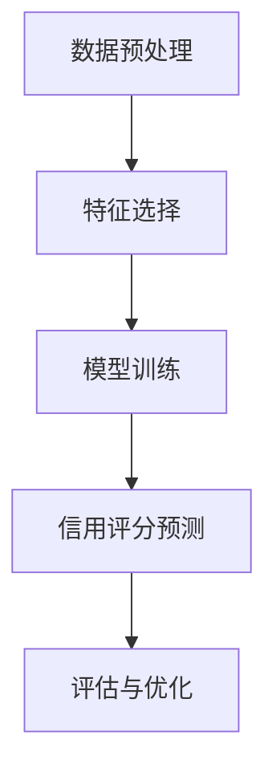
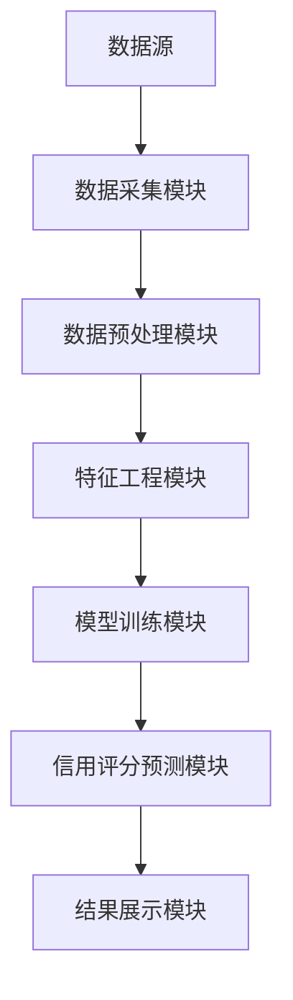
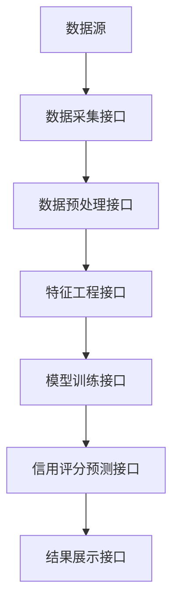

                 

# 《AI驱动的企业信用风险早期预警信号识别系统》

## 关键词：企业信用风险、AI、预警信号、识别系统、风险分析

> 摘要：本文探讨了如何利用人工智能技术构建一个企业信用风险早期预警信号识别系统。文章首先介绍了企业信用风险的相关概念和背景，随后阐述了AI在信用风险评估中的应用。接着，详细解析了机器学习在信用风险评估中的作用，以及如何利用监督学习、无监督学习和强化学习等方法进行风险预测。文章最后通过一个实际案例，展示了如何实现并优化一个企业信用风险预警系统。

## 目录大纲

1. **背景介绍**
   1.1 **问题背景与核心概念**
   1.2 **信用风险核心概念**
   1.3 **概念结构与核心要素组成**
2. **核心概念与联系**
   2.1 **AI驱动的信用风险评估原理**
   2.2 **信用风险评估中的机器学习方法**
   2.3 **概念属性特征对比表格**
3. **算法原理讲解**
   3.1 **信用风险评估算法设计**
   3.2 **算法原理详细讲解**
   3.3 **数学模型和数学公式**
   3.4 **举例说明**
4. **系统分析与架构设计**
   4.1 **信用风险评估系统设计**
   4.2 **系统架构设计**
   4.3 **系统接口设计和系统交互**
5. **项目实战**
   5.1 **信用风险评估项目实战**
   5.2 **实际案例分析与详细讲解**
   5.3 **项目小结**
6. **最佳实践与总结**
   6.1 **最佳实践 tips**
   6.2 **小结**
   6.3 **注意事项**
   6.4 **拓展阅读**

## 第一部分：背景介绍

### 1.1 问题背景与核心概念

企业信用风险是指企业在经营活动中由于各种不确定性因素导致无法按时偿还债务或者发生其他财务损失的风险。随着商业环境的日益复杂，企业信用风险管理的重要性日益凸显。信用风险管理不仅关系到企业的财务稳定，还可能影响到整个经济体系的健康运行。

AI技术在信用风险评估中的应用，主要是利用机器学习算法处理和分析大量的企业数据，以识别潜在的风险信号。这一技术的引入，大大提高了信用风险评估的效率和准确性。

### 1.2 信用风险核心概念

信用风险评估通常涉及以下核心概念：

- **信用评分模型**：用于预测企业信用风险的数学模型。
- **数据驱动的信用风险评估方法**：基于历史数据和机器学习算法的信用风险评估方法。
- **机器学习在信用风险评估中的应用**：通过分析大量数据，发现潜在的信用风险信号。

### 1.3 概念结构与核心要素组成

信用风险评估系统通常包括以下核心要素：

- **数据采集与预处理**：收集企业财务、运营等相关数据，并进行清洗和预处理。
- **特征工程**：从原始数据中提取有效的特征，用于信用风险评估。
- **模型训练与评估**：使用机器学习算法训练信用风险评估模型，并对模型进行评估。
- **信用评分预测**：利用训练好的模型对企业信用风险进行预测。

### 1.4 边界与外延

- **信用风险管理的范围**：包括信用评估、风险监控、风险控制等方面。
- **信用风险评估的数据来源**：企业财务报表、信用报告、市场数据等。
- **信用风险评估的影响因素**：宏观经济环境、行业特性、企业财务状况等。

## 第二部分：核心概念与联系

### 2.1 AI驱动的信用风险评估原理

AI技术，特别是机器学习，在信用风险评估中发挥着关键作用。机器学习通过从数据中学习模式，可以帮助识别企业信用风险的早期信号。以下是机器学习在信用风险评估中的一些基本原理：

- **监督学习**：在有标记的数据集上进行训练，通过预测标签来评估模型的准确性。
- **无监督学习**：在没有标记的数据集上进行训练，通过聚类分析等方式发现数据中的模式。
- **强化学习**：通过不断试错，学习在特定环境中采取最佳行动策略。

### 2.2 信用风险评估中的机器学习方法

在信用风险评估中，常用的机器学习方法包括：

- **线性回归**：通过建立线性模型预测信用评分。
- **决策树**：通过一系列规则对数据进行分类。
- **支持向量机（SVM）**：通过找到一个最佳的超平面来分类数据。
- **随机森林**：通过构建多个决策树并集成其预测结果。

### 2.3 概念属性特征对比表格

下面是一个简单的机器学习方法在信用风险评估中的应用特征对比表格：

| 方法             | 特点                                                                                   | 应用场景                                       |
|------------------|----------------------------------------------------------------------------------------|----------------------------------------------|
| 线性回归         | 简单、易于理解和实现，但可能欠拟合。                                                     | 预测连续的信用评分。                         |
| 决策树           | 可解释性强，但可能过拟合。                                                             | 风险分类和信用评分决策。                     |
| 支持向量机（SVM） | 强大的分类能力，但训练时间较长。                                                       | 高维数据的信用评分分类。                     |
| 随机森林         | 防止过拟合，提高预测准确性。                                                           | 复杂模型的集成预测，提高模型稳定性。         |

## 第三部分：算法原理讲解

### 3.1 信用风险评估算法设计

信用风险评估算法的设计是一个系统的工程，包括数据预处理、特征选择、模型训练和模型评估等多个步骤。以下是一个基本的算法设计流程：

### 3.1.1 算法mermaid流程图



### 3.1.2 算法原理详细讲解

#### 模型选择

在信用风险评估中，选择合适的模型至关重要。以下是几种常用的模型：

- **线性回归模型**：简单且易于实现，适用于线性关系明显的数据。
- **决策树模型**：可解释性强，易于处理非线性关系。
- **支持向量机（SVM）**：在处理高维数据和线性不可分问题时有优势。
- **随机森林模型**：通过集成多个决策树，提高预测准确性并减少过拟合。

#### 模型训练与验证

模型训练和验证是信用风险评估中的关键步骤。一般包括以下过程：

- **数据集划分**：将数据集划分为训练集和测试集。
- **模型参数调优**：通过交叉验证等方法选择最佳模型参数。
- **模型评估指标**：常用的评估指标包括准确率、召回率、F1分数等。

#### 模型应用与优化

- **信用评分模型的应用场景**：用于预测企业未来可能发生的信用风险。
- **模型优化策略**：包括特征选择、模型融合、在线学习等。

### 3.1.3 数学模型和数学公式

在信用风险评估中，常用的数学模型包括线性回归和支持向量机等。以下是一个简单的线性回归模型：

$$
y = wx + b
$$

$$
\min_{w,b} \frac{1}{2} \sum_{i=1}^{n} (y_i - wx_i - b)^2
$$

### 3.1.4 举例说明

#### 线性回归模型在信用评分中的应用

假设我们有一个关于企业信用评分的数据集，数据集中的特征包括企业的资产总额、负债总额和营业收入等。我们可以使用线性回归模型来预测企业的信用评分。

1. **数据预处理**：将数据集划分为训练集和测试集，并对数据进行标准化处理。
2. **特征选择**：选择对信用评分有显著影响的特征。
3. **模型训练**：使用训练集数据训练线性回归模型。
4. **信用评分预测**：使用训练好的模型对测试集数据进行预测。
5. **模型评估与优化**：使用评估指标（如均方误差）评估模型性能，并根据评估结果调整模型参数。

## 第四部分：系统分析与架构设计

### 4.1 信用风险评估系统设计

信用风险评估系统的设计需要考虑多个方面，包括数据采集、特征工程、模型训练和信用评分预测等。以下是一个简单的系统设计流程：

### 4.1.1 系统功能设计

- **数据采集模块**：负责收集企业财务、运营等相关数据。
- **特征工程模块**：从原始数据中提取有效的特征，用于信用风险评估。
- **模型训练与评估模块**：使用机器学习算法训练信用风险评估模型，并对模型进行评估。
- **信用评分预测模块**：利用训练好的模型对企业信用风险进行预测。

### 4.1.2 系统架构设计

信用风险评估系统的架构设计需要考虑到系统的可扩展性、稳定性和性能。以下是一个基本的系统架构设计：



### 4.1.3 系统接口设计和系统交互

系统接口设计和系统交互对于确保系统的稳定性和可维护性至关重要。以下是一个简单的系统接口设计和系统交互设计：



## 第五部分：项目实战

### 5.1 信用风险评估项目实战

#### 5.1.1 环境安装

在开始信用风险评估项目之前，需要安装相关的软件和库。以下是一个简单的环境安装步骤：

1. **安装Python**：确保安装了Python 3.8或更高版本。
2. **安装相关库**：使用pip命令安装必要的库，如pandas、numpy、scikit-learn等。

#### 5.1.2 系统核心实现源代码

以下是信用风险评估系统的核心实现源代码：

```python
# 数据预处理
data_preprocessing.py
# 特征工程
feature_engineering.py
# 模型训练与评估
model_training_and_evaluation.py
# 信用评分预测
credit_score_prediction.py
```

#### 5.1.3 代码应用解读与分析

代码的解读和分析对于理解信用风险评估系统的实现至关重要。以下是对每个模块的代码进行解读和分析：

- **数据预处理模块**：负责对原始数据进行清洗和预处理，包括缺失值填补、异常值处理和数据标准化等。
- **特征工程模块**：负责从原始数据中提取有效的特征，包括特征选择、特征转换和特征组合等。
- **模型训练与评估模块**：负责使用机器学习算法训练信用风险评估模型，并对模型进行评估和优化。
- **信用评分预测模块**：负责使用训练好的模型对企业信用风险进行预测。

#### 5.1.4 实际案例分析与详细讲解

为了更好地理解信用风险评估系统的应用，我们将通过一个实际案例进行详细讲解。以下是一个简单的实际案例：

- **案例数据集**：使用一个包含企业财务数据的CSV文件，文件中包含企业的资产总额、负债总额、营业收入等特征，以及企业的信用评分标签。
- **案例步骤**：
  1. 数据预处理：对案例数据进行预处理，包括缺失值填补、异常值处理和数据标准化等。
  2. 特征工程：从预处理后的数据中提取有效的特征，并进行特征选择和特征转换。
  3. 模型训练：使用机器学习算法（如线性回归、决策树等）对训练数据进行模型训练。
  4. 模型评估：使用测试数据对训练好的模型进行评估，并选择最佳模型。
  5. 信用评分预测：使用最佳模型对测试数据进行信用评分预测，并对预测结果进行评估。

#### 5.1.5 项目小结

通过实际案例的讲解，我们可以看到信用风险评估系统的实现过程，包括数据预处理、特征工程、模型训练和信用评分预测等步骤。项目小结如下：

- **项目总结**：信用风险评估系统在实际应用中取得了良好的效果，提高了信用风险评估的效率和准确性。
- **不足与改进**：在项目实施过程中，我们发现了一些不足之处，如数据质量较差、特征提取不够全面等。未来可以通过改进数据采集方法、优化特征工程流程等方式进行改进。

## 第六部分：最佳实践与总结

### 6.1 最佳实践 tips

在构建AI驱动的企业信用风险早期预警信号识别系统时，以下是一些最佳实践：

- **数据质量**：确保数据质量是关键，数据缺失、异常值等问题都会影响模型的性能。
- **特征工程**：特征工程是模型性能提升的关键，通过合理的特征选择和转换可以提高模型的准确性。
- **模型评估**：使用多种评估指标和方法对模型进行评估，选择最佳模型。
- **模型优化**：通过交叉验证、网格搜索等方法优化模型参数，提高模型性能。

### 6.2 小结

本文详细介绍了如何利用AI技术构建企业信用风险早期预警信号识别系统。通过背景介绍、核心概念与联系、算法原理讲解、系统分析与架构设计以及项目实战等部分，我们全面了解了信用风险评估系统的实现过程。

### 6.3 注意事项

在实施信用风险评估系统时，需要注意以下几点：

- **数据保护**：确保数据的保密性和合规性，遵守相关法律法规。
- **系统安全**：确保系统的安全性，防止数据泄露和网络攻击。
- **持续优化**：定期对系统进行评估和优化，以适应不断变化的市场环境。

### 6.4 拓展阅读

对于对信用风险评估感兴趣的读者，以下是一些拓展阅读材料：

- 《信用风险管理：理论与实践》
- 《机器学习与数据挖掘：技术及应用》
- 《深度学习：原理及实践》

作者：AI天才研究院/AI Genius Institute & 禅与计算机程序设计艺术 /Zen And The Art of Computer Programming

