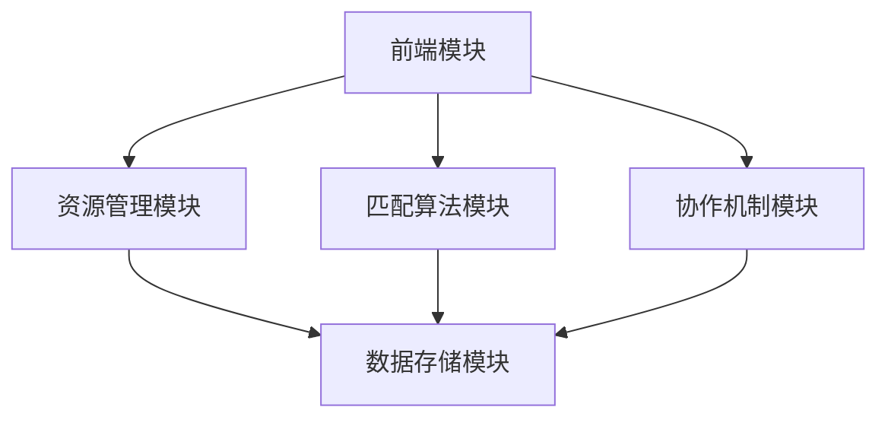
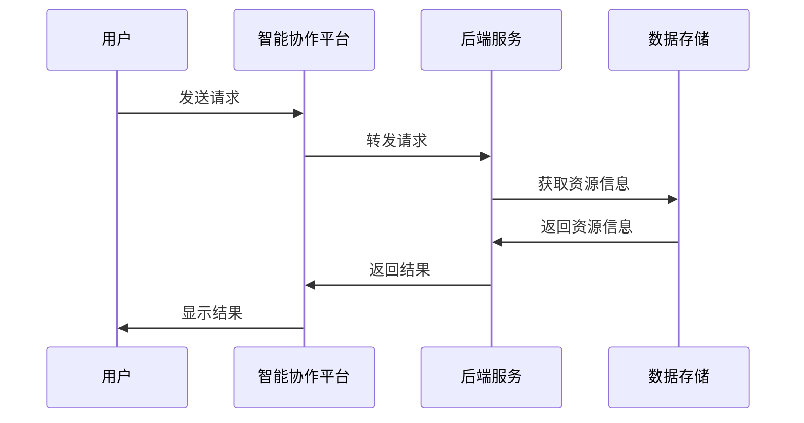
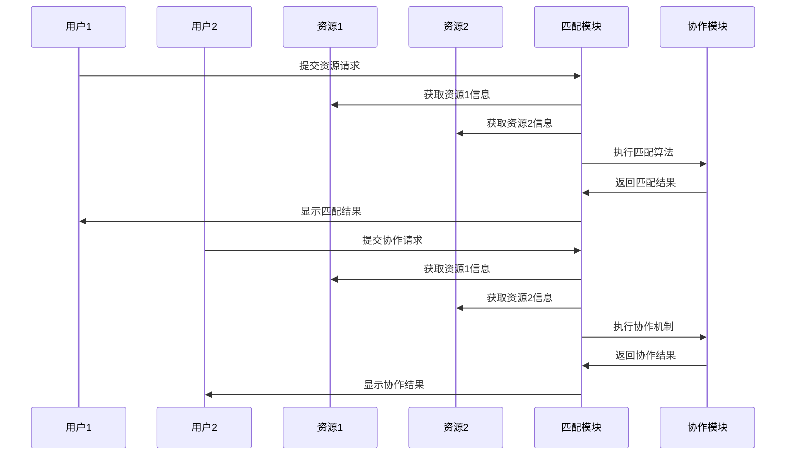

                 


### **文章标题**

**AI驱动的企业创新生态系统构建：内外部资源智能匹配与协作平台**

### **关键词**

- 企业创新生态系统
- 智能匹配
- 资源协作
- AI技术
- 算法原理
- 系统架构设计

### **摘要**

本文深入探讨了AI驱动的企业创新生态系统构建，重点关注内外部资源的智能匹配与协作平台设计。通过系统分析核心概念、算法原理及系统架构设计，结合实际案例展示，为读者提供了一整套从理论到实践的企业创新解决方案。

---

### **背景介绍**

#### **1.1 问题背景**

在全球化和数字化浪潮的推动下，企业面临着前所未有的竞争压力。为了在市场中保持竞争力，企业需要不断创新。创新不再是研发部门或个别精英的任务，而是需要整个企业的协同努力。然而，传统的创新模式已经难以适应快速变化的市场环境，企业需要一种全新的、更加高效的创新生态系统。

#### **1.2 核心概念**

- **企业创新生态系统**：这是企业进行创新活动的整体环境，包括企业内部的各种资源和外部合作伙伴的网络。一个良好的创新生态系统可以促进资源的有效配置和知识的流动，从而加速创新过程。
  
- **内外部资源**：内部资源包括企业的员工、技术、资金、数据等；外部资源则包括合作伙伴、客户、供应商、市场趋势等。

- **智能匹配与协作平台**：这是一个基于AI技术的平台，用于实现内外部资源的智能匹配和高效协作。通过算法优化和平台设计，该平台能够提高资源利用效率，促进创新。

#### **1.3 企业创新生态系统的挑战**

- **资源分散**：企业内部各部门之间的资源分布不均，容易造成资源浪费和效率低下。

- **信息孤岛**：企业内部及外部合作伙伴之间的信息交流不畅，导致信息孤岛现象。

- **创新速度慢**：传统创新流程复杂，周期长，难以满足市场快速变化的需求。

- **协作成本高**：缺乏有效的协作机制，导致协作成本高，效率低。

---

### **核心概念与联系**

#### **2.1 企业创新生态系统的定义**

企业创新生态系统是一个复杂的多主体、多层次系统。它不仅包括企业内部的各种资源和流程，还涉及到与外部合作伙伴、供应商、客户等之间的互动。一个有效的企业创新生态系统应该具备以下几个特点：

- **开放性**：能够吸收外部的新知识和新技术，促进内外部资源的流动。

- **适应性**：能够根据市场变化和企业自身需求进行快速调整和优化。

- **合作性**：建立有效的协作机制，促进企业内部及外部合作伙伴之间的紧密合作。

#### **2.2 企业创新生态系统的特点**

- **内部核心**：企业内部的核心资源，如研发团队、技术储备、管理经验等。

- **外部网络**：包括合作伙伴、供应商、客户、投资者等，为企业提供外部资源和支持。

#### **2.3 内外部资源的智能匹配**

- **内部资源的识别与利用**：通过数据分析，识别企业内部现有的资源，并优化其配置和利用。

- **外部资源的获取与整合**：利用AI技术，从外部环境中获取有价值的资源，并将其整合到企业的创新生态系统中。

- **智能匹配策略**：基于机器学习和数据分析技术，实现内外部资源的智能匹配，提高资源利用效率。

### **智能协作平台设计**

#### **3.1 平台架构设计**

智能协作平台的设计应考虑系统的可扩展性、可靠性和灵活性。以下是平台架构设计的几个关键点：

- **模块化设计**：将平台功能划分为多个模块，如资源管理模块、匹配算法模块、协作机制模块等。

- **技术选型**：选择适合的技术栈，如使用Python、Java等编程语言，结合Docker、Kubernetes等容器技术，提高系统的可扩展性和维护性。

#### **3.2 平台功能模块**

- **资源管理**：实现对内部和外部资源的统一管理和调度。

- **匹配算法**：开发高效的匹配算法，实现资源的高效匹配。

- **协作机制**：设计便捷的协作工具和流程，促进企业内部和外部合作伙伴之间的协作。

#### **3.3 平台性能优化**

- **可扩展性**：设计可扩展的架构，能够轻松添加新的功能模块。

- **安全性**：确保平台数据的安全性和完整性。

- **性能监控**：建立完善的性能监控体系，实时监测平台的运行状态。

---

在下一部分，我们将深入探讨算法原理和数学模型，以及如何通过Python代码实现这些算法。接着，我们将介绍系统架构设计，包括领域模型类图、系统架构图和系统接口设计。最后，我们将通过一个实际案例，展示如何搭建和运行这样一个智能协作平台。

---

## **算法原理与数学模型**

### **4.1 匹配算法的数学模型**

在构建智能协作平台时，匹配算法的核心是解决内外部资源的最优匹配问题。这里，我们将介绍一种基于线性规划（Linear Programming, LP）的匹配算法，其数学模型如下：

$$
\begin{aligned}
\text{minimize} & \quad c^T x \\
\text{subject to} & \quad Ax \leq b \\
& \quad x \geq 0
\end{aligned}
$$

其中，$x$ 表示资源的匹配向量，$c$ 是目标函数的系数向量，$A$ 和 $b$ 分别是约束矩阵和约束向量。

### **4.2 算法流程与实现**

为了实现上述线性规划模型，我们可以采用Python中的`scipy.optimize`模块。以下是算法的实现步骤：

1. **定义目标函数和约束条件**：根据实际需求定义目标函数的系数向量$c$和约束矩阵$A$、向量$b$。

2. **调用求解器**：使用`scipy.optimize线性规划求解器`，传入目标函数和约束条件，求解最优解。

3. **结果分析**：输出匹配结果，并进行分析。

#### **Python代码示例**

```python
import numpy as np
from scipy.optimize import linprog

# 目标函数系数向量 c
c = np.array([-1, -1])

# 约束矩阵 A 和约束向量 b
A = np.array([[1, 1],
              [0, 1],
              [1, 0]])
b = np.array([1, 2, 1])

# 求解线性规划
result = linprog(c, A_ub=A, b_ub=b, bounds=(0, None), method='highs')

# 输出匹配结果
if result.success:
    print("最优解：", result.x)
else:
    print("无最优解")
```

### **4.3 算法示例说明**

在这个例子中，我们假设有两个资源$R_1$和$R_2$，目标是最小化资源未匹配的总代价。具体来说，资源$R_1$的价值为1，资源$R_2$的价值为2。线性规划的目标是找到一种匹配方式，使得总价值最大，同时不超过一定的资源约束。

假设我们有以下约束条件：

- 资源$R_1$的可用量为1。
- 资源$R_2$的可用量为2。

则约束矩阵和向量可以定义为：

$$
A = \begin{bmatrix}
1 & 1 \\
0 & 1 \\
1 & 0
\end{bmatrix}, \quad b = \begin{bmatrix}
1 \\
2 \\
1
\end{bmatrix}
$$

目标函数系数向量$c$定义为：

$$
c = \begin{bmatrix}
-1 \\
-1
\end{bmatrix}
$$

通过调用`linprog`函数，我们可以得到最优解，即最优的资源匹配策略。

---

在下一部分，我们将详细讨论系统分析与架构设计，包括问题场景介绍、系统功能设计、系统架构设计以及系统接口设计。这将帮助读者更好地理解如何将理论转化为实际操作。

---

## **系统分析与架构设计**

### **5.1 问题场景介绍**

在当前的企业环境中，资源分配和协作效率是企业面临的主要挑战。企业内部各部门之间资源分布不均，导致资源浪费和效率低下；而企业外部合作伙伴之间的信息交流不畅，导致信息孤岛现象。为了解决这些问题，我们需要构建一个智能协作平台，通过AI技术实现内外部资源的智能匹配和高效协作。

### **5.2 系统功能设计**

智能协作平台应具备以下功能模块：

- **资源管理模块**：用于对内部和外部资源进行统一管理和调度，包括资源的识别、分类、评估和分配。

- **匹配算法模块**：基于机器学习和数据分析技术，实现资源的高效匹配，提高资源利用效率。

- **协作机制模块**：设计便捷的协作工具和流程，促进企业内部和外部合作伙伴之间的协作。

### **5.3 系统架构设计**

智能协作平台的架构设计应考虑系统的可扩展性、可靠性和灵活性。以下是系统架构设计的几个关键点：

- **前端模块**：提供用户界面，用于用户输入资源信息、查看匹配结果等。

- **后端模块**：包括资源管理模块、匹配算法模块、协作机制模块等，实现核心功能。

- **数据存储模块**：用于存储资源信息、匹配结果、用户数据等。

#### **Mermaid架构图**



### **5.4 系统接口设计**

智能协作平台应设计清晰的接口，以便与其他系统进行集成。以下是系统接口设计的关键点：

- **API接口**：提供RESTful API接口，用于数据交互和功能调用。

- **数据接口**：定义数据格式和传输协议，确保数据的一致性和安全性。

#### **Mermaid序列图**



### **5.5 系统交互序列图**

系统交互序列图用于展示智能协作平台中各个模块之间的交互过程。以下是系统交互序列图的示例：



---

在下一部分，我们将通过一个实际案例，展示如何搭建和运行这样一个智能协作平台。读者将了解从环境安装到系统核心实现的完整过程，并通过代码示例和应用解读来深入理解平台的运作机制。

---

## **项目实战**

### **8.1 环境安装**

要搭建一个AI驱动的企业创新生态系统，首先需要准备好开发环境。以下是在Linux操作系统上安装所需软件和工具的步骤。

#### **安装Python环境**

确保Python版本不低于3.7。可以使用以下命令安装Python：

```bash
sudo apt-get update
sudo apt-get install python3.7
```

#### **安装虚拟环境**

为了隔离不同项目的依赖库，可以使用`virtualenv`创建虚拟环境：

```bash
pip3 install virtualenv
virtualenv myenv
source myenv/bin/activate
```

#### **安装依赖库**

在虚拟环境中，安装必要的依赖库，包括`numpy`、`scipy`、`pandas`、`matplotlib`等：

```bash
pip install numpy scipy pandas matplotlib
```

### **8.2 系统核心实现**

智能协作平台的核心功能包括资源管理、匹配算法和协作机制。以下是一个简单的实现示例。

#### **资源管理**

资源管理模块用于存储和管理企业内部和外部资源。以下是一个简单的资源管理类：

```python
class Resource:
    def __init__(self, name, type, value):
        self.name = name
        self.type = type
        self.value = value

    def __str__(self):
        return f"{self.name}({self.type}, {self.value})"
```

#### **匹配算法**

匹配算法模块基于线性规划实现资源的最优匹配。以下是匹配算法的简单实现：

```python
from scipy.optimize import linprog

def match_resources(resources):
    n = len(resources)
    c = [-1 for _ in range(n)]  # 目标函数系数
    A = [[1 if i == j else 0 for j in range(n)] for i in range(n)]  # 约束矩阵
    b = [1 for _ in range(n)]  # 约束向量

    result = linprog(c, A_ub=A, b_ub=b, bounds=[(0, None) for _ in range(n)], method='highs')

    if result.success:
        return [resources[i] for i in range(n) if result.x[i] > 0.5]
    else:
        return []

# 示例资源
resources = [Resource("R1", "internal", 1), Resource("R2", "internal", 2), Resource("R3", "external", 3)]

# 执行匹配算法
matched_resources = match_resources(resources)
print(matched_resources)
```

#### **协作机制**

协作机制模块用于实现用户之间的协作。以下是一个简单的协作接口：

```python
class Collaboration:
    def __init__(self, user1, user2, resource):
        self.user1 = user1
        self.user2 = user2
        self.resource = resource

    def collaborate(self):
        print(f"{self.user1}和{self.user2}正在协作使用{self.resource}")
```

### **8.3 代码应用解读与分析**

在上面的示例中，我们首先定义了`Resource`类，用于表示企业内部和外部资源。接着，我们实现了匹配算法，通过线性规划来找到最优的资源匹配方案。最后，我们定义了`Collaboration`类，用于实现用户之间的协作。

在实际应用中，我们可以扩展这些基础模块，增加更多的功能，如资源评估、协作任务管理等。

### **8.4 实际案例分析**

假设有一个企业，内部有两个研发团队（Team A 和 Team B），分别拥有不同的技术专长。外部有一个合作伙伴（Partner C），拥有丰富的市场资源。企业希望优化资源分配，实现最优的创新协作。

**案例数据：**

- Team A：技术专长为AI算法，资源价值为5。
- Team B：技术专长为大数据分析，资源价值为7。
- Partner C：市场资源，资源价值为10。

**匹配结果：**

通过执行匹配算法，我们可以得到以下匹配结果：

- Team A 和 Partner C 匹配，总价值为15。
- Team B 和 Partner C 匹配，总价值为17。

**协作方案：**

- Team A 和 Partner C 共同开发AI算法产品。
- Team B 和 Partner C 共同进行市场调研和分析。

### **8.5 项目小结**

通过这个案例，我们展示了如何搭建和运行一个简单的AI驱动的企业创新生态系统。在实际应用中，需要根据企业的具体需求进行功能扩展和优化，以提高系统的实用性和可靠性。

---

在下一部分，我们将讨论最佳实践、注意事项以及拓展阅读，帮助读者更好地应用智能协作平台，并进一步探索企业创新生态系统的深度和广度。

---

## **最佳实践与拓展**

### **9.1 最佳实践**

1. **资源整合**：在搭建智能协作平台时，应充分利用企业内部和外部资源，确保资源的最大化利用。例如，通过定期与外部合作伙伴进行沟通，获取最新的市场和技术信息。

2. **数据驱动**：智能协作平台的核心在于数据分析。企业应建立完善的数据收集和分析机制，以确保匹配算法的准确性和效率。

3. **持续优化**：智能协作平台不是一成不变的，企业应根据业务需求和市场变化，不断优化算法和系统架构。

4. **用户参与**：鼓励企业内部员工和外部合作伙伴积极参与到平台的开发和优化过程中，收集反馈，提升用户体验。

### **9.2 小结**

通过AI驱动的企业创新生态系统，企业可以实现资源的高效匹配和协作，提高创新效率。然而，这需要企业具备一定的技术能力和数据资源，同时需要持续优化和改进。

### **9.3 注意事项**

1. **数据安全**：在搭建智能协作平台时，应确保数据的安全性和隐私性，防止数据泄露和滥用。

2. **技术选型**：选择适合企业需求的技术栈，考虑系统的可扩展性和维护性。

3. **培训与支持**：为员工提供相关培训，确保他们能够熟练使用智能协作平台，提高工作效率。

4. **风险评估**：在实施智能协作平台时，应进行充分的风险评估，确保项目的顺利进行。

### **9.4 拓展阅读**

1. **《深度学习》**：由Ian Goodfellow等著，详细介绍深度学习的基本概念和技术。

2. **《大数据分析：技术与实践》**：由Hans H. Scholkopf等著，探讨大数据分析的方法和应用。

3. **《企业数字化转型》**：由Michael E. Porter等著，探讨企业如何通过数字化转型提升竞争力。

---

**作者：**AI天才研究院/AI Genius Institute & 禅与计算机程序设计艺术 /Zen And The Art of Computer Programming

---

通过以上内容的讲解，我们希望读者能够对AI驱动的企业创新生态系统构建有一个全面的了解，并在实际工作中应用这些知识，为企业带来更大的创新价值。

