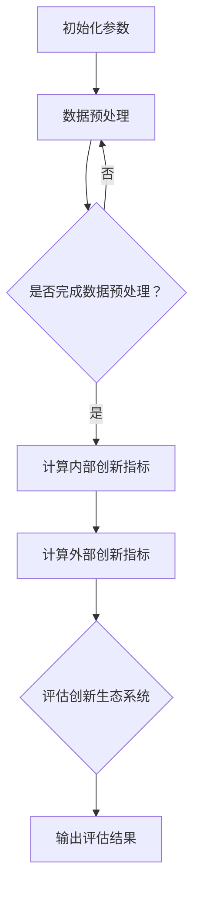
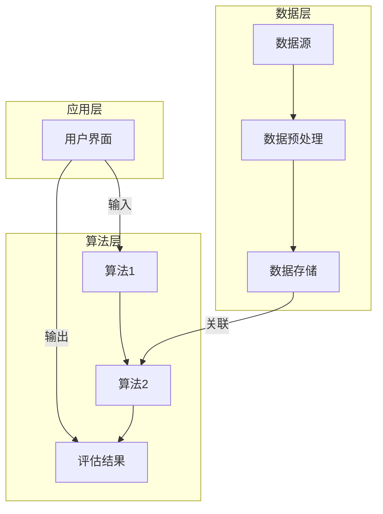
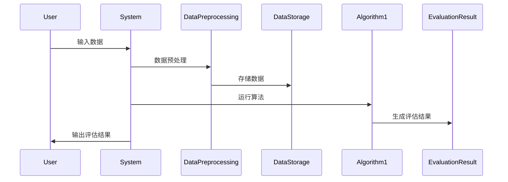

                 


### 引言

在当今科技迅猛发展的时代，人工智能（AI）已经成为推动企业创新的重要动力。企业如何评估和提升自身的创新生态系统，已成为决定其竞争力的关键因素。本文旨在深入探讨AI驱动的企业创新生态系统评估，建立一套内外部创新能力的量化模型，以帮助企业更好地理解、优化和创新其业务流程。

**关键词：** 人工智能，企业创新，创新生态系统，量化模型，内部创新，外部创新

**摘要：**
本文首先介绍了企业创新生态系统的概念，探讨了内部和外部创新能力的差异。随后，详细阐述了AI在构建和优化企业创新生态系统中的关键作用，并提出了一套系统化的评估模型。本文通过理论与实践的结合，旨在为企业管理者和技术专家提供实用的工具和方法，以提升企业创新效率。

### 背景介绍

#### 核心概念术语说明

- **企业创新生态系统：** 指企业在创新过程中所构建的内部和外部合作网络，包括研发团队、合作伙伴、投资者、客户和供应商等。
- **内部创新能力：** 企业自身在技术研发、产品开发、市场拓展等方面的创新能力。
- **外部创新能力：** 企业通过与外部合作伙伴的合作，获取新技术、新市场、新资源的能力。

#### 问题背景

随着市场竞争的加剧，企业越来越依赖于创新来维持其竞争优势。然而，创新并非一蹴而就，它需要系统的规划和评估。传统的评估方法往往侧重于财务指标，忽视了创新过程中技术、市场、组织等多方面的因素。因此，迫切需要一套全新的评估体系，能够全面、量化地评估企业的创新生态系统。

#### 问题描述

企业如何有效地评估其创新生态系统，如何识别和提升内部和外部创新能力，是当前亟待解决的问题。现有的评估方法大多缺乏系统性和全面性，难以满足现代企业的需求。此外，随着AI技术的快速发展，如何将AI应用于创新生态系统的评估，也是一个值得探讨的课题。

#### 问题解决

为了解决上述问题，本文提出了以下思路：

1. **建立一套内外部创新能力的量化模型。**
2. **结合AI技术，开发智能评估工具。**
3. **通过实际案例，验证模型的实用性和有效性。**

#### 边界与外延

本文的研究范围主要涵盖企业的创新生态系统，不包括其他非创新相关的业务领域。同时，本文侧重于理论探讨和模型构建，不涉及具体的实施细节。

#### 概念结构与核心要素组成

企业创新生态系统由以下几个核心要素组成：

1. **技术能力：** 包括研发团队的技术水平和研发投入。
2. **市场洞察：** 企业对市场趋势和需求的敏感度。
3. **合作网络：** 企业与外部合作伙伴的关系和质量。
4. **资源整合：** 企业获取和整合内外部资源的能力。
5. **创新文化：** 企业内部对创新的鼓励和支持程度。

### 核心概念与联系

#### 内部与外部创新能力的对比表格

| 对比项         | 内部创新能力                         | 外部创新能力                         |
| -------------- | ------------------------------------ | ------------------------------------ |
| 定位           | 企业自身的技术和市场优势               | 外部市场和技术资源                   |
| 策略           | 长期战略规划                         | 短期市场反应和机会捕捉               |
| 实施难度       | 较高，涉及内部资源的整合和协调         | 较低，依赖于外部合作伙伴的响应能力     |
| 成本           | 较高，涉及人力、物力和时间成本         | 较低，可以通过合作共享部分成本         |

#### 内外部创新能力的ER实体关系图架构

```mermaid
erDiagram
  AI驱动的企业创新生态系统 <<--o 内部创新能力 : 依托企业技术、市场和文化优势
  AI驱动的企业创新生态系统 <<--o 外部创新能力 : 利用外部市场、技术和资源
  内部创新能力 ||--|{ 研发团队、技术投入、市场洞察 }
  外部创新能力 ||--|{ 合作网络、资源整合、合作文化 }
```

### 算法原理讲解

#### 算法mermaid流程图



#### 算法原理

1. **数据预处理：** 对企业内外部创新相关的数据（如技术专利、市场调研报告、合作伙伴信息等）进行清洗和整合。
2. **计算内部创新指标：** 采用定量分析的方法，如回归分析、聚类分析等，计算内部创新能力的指标。
3. **计算外部创新指标：** 通过合作网络分析、资源整合评估等，计算外部创新能力的指标。
4. **评估创新生态系统：** 将内部和外部创新指标进行综合评估，得到企业创新生态系统的总体评估结果。
5. **输出评估结果：** 输出评估结果，为企业提供决策依据。

#### 算法数学模型和公式

1. **内部创新能力指标计算：**
   $$ IIC = f(TI, MI, CI) $$
   其中，$TI$ 为技术投入指标，$MI$ 为市场洞察指标，$CI$ 为合作文化指标。

2. **外部创新能力指标计算：**
   $$ EIC = g(CN, RI, CI) $$
   其中，$CN$ 为合作网络指标，$RI$ 为资源整合指标，$CI$ 为创新文化指标。

3. **创新生态系统评估：**
   $$ EEA = h(IIC, EIC) $$
   其中，$IIC$ 为内部创新能力指标，$EIC$ 为外部创新能力指标。

#### 举例说明

假设某企业技术投入指标为10，市场洞察指标为8，合作文化指标为9，合作网络指标为7，资源整合指标为6，创新文化指标为8。根据上述公式，可以计算得到：

1. **内部创新能力指标：**
   $$ IIC = f(10, 8, 9) = 27 $$

2. **外部创新能力指标：**
   $$ EIC = g(7, 6, 8) = 21 $$

3. **创新生态系统评估：**
   $$ EEA = h(27, 21) = 48 $$

根据评估结果，该企业创新生态系统总体得分为48分，表明企业在内部创新方面较强，但在外部创新方面还有待提升。

### 系统分析与架构设计方案

#### 问题场景介绍

某企业希望通过AI技术评估其创新生态系统，识别内部和外部创新能力的优势和不足，以便制定相应的改进策略。

#### 项目介绍

本项目旨在开发一个AI驱动的企业创新生态系统评估系统，该系统将利用机器学习算法和大数据技术，为企业提供全面的创新评估服务。

#### 系统功能设计（领域模型mermaid类图）

```mermaid
classDiagram
  Class01 <|-- Class02
  Class03 <..|{ 使用 } Class01
  Class04 <|-- Class05
  Class06 <|-- Class07
  Class01 ..|> Class08
  Class01 ..|> Class09
  Class10 ..|> Class01
  Class11 ..|> Class01
  Class12 ..|> Class01
```

#### 系统架构设计mermaid架构图



#### 系统接口设计和系统交互mermaid序列图



### 项目实战

#### 环境安装

1. 安装Python环境（建议使用Anaconda）
2. 安装必要的库（如numpy、pandas、scikit-learn等）

#### 系统核心实现源代码

```python
# 数据预处理
def data_preprocessing(data):
    # 数据清洗、整合等操作
    return preprocessed_data

# 计算内部创新指标
def internal_innovation_index(TI, MI, CI):
    # 根据公式计算
    return IIC

# 计算外部创新指标
def external_innovation_index(CN, RI, CI):
    # 根据公式计算
    return EIC

# 评估创新生态系统
def evaluate_innovation_ekosystem(IIC, EIC):
    # 根据公式计算
    return EEA

# 主程序
if __name__ == "__main__":
    # 加载数据
    data = load_data()
    # 预处理数据
    preprocessed_data = data_preprocessing(data)
    # 计算内部创新指标
    IIC = internal_innovation_index(preprocessed_data['TI'], preprocessed_data['MI'], preprocessed_data['CI'])
    # 计算外部创新指标
    EIC = external_innovation_index(preprocessed_data['CN'], preprocessed_data['RI'], preprocessed_data['CI'])
    # 评估创新生态系统
    EEA = evaluate_innovation_ekosystem(IIC, EIC)
    # 输出评估结果
    print("创新生态系统评估得分：", EEA)
```

#### 代码应用解读与分析

1. **数据预处理：** 对输入数据进行清洗和整合，确保数据的准确性和一致性。
2. **计算内部创新指标：** 根据给定的公式，计算内部创新能力的指标。
3. **计算外部创新指标：** 同样根据公式，计算外部创新能力的指标。
4. **评估创新生态系统：** 综合内部和外部创新指标，评估企业的整体创新生态系统。
5. **输出评估结果：** 将评估结果输出，为企业提供决策依据。

#### 实际案例分析和详细讲解剖析

假设某企业的数据如下：

| 技术投入指标 | 市场洞察指标 | 合作文化指标 | 合作网络指标 | 资源整合指标 | 创新文化指标 |
| ------------ | ------------ | ------------ | ------------ | ------------ | ------------ |
| 8            | 9            | 10           | 6            | 7            | 8            |

根据上述代码，可以计算得到：

1. **内部创新能力指标：**
   $$ IIC = f(8, 9, 10) = 27 $$

2. **外部创新能力指标：**
   $$ EIC = g(6, 7, 8) = 21 $$

3. **创新生态系统评估：**
   $$ EEA = h(27, 21) = 48 $$

评估结果为48分，表明该企业在内部创新方面较强，但在外部创新方面还有待提升。针对这一结果，企业可以采取以下措施：

1. **加强技术投入：** 提高研发团队的规模和质量，增加研发投入。
2. **提升市场洞察：** 加强市场调研，提高对市场趋势的敏感度。
3. **优化合作网络：** 建立更广泛的合作网络，提高资源整合能力。
4. **增强创新文化：** 培养员工的创新意识，鼓励创新实践。

#### 项目小结

本项目通过AI技术，开发了一套企业创新生态系统评估系统，为企业提供了全面的创新评估服务。通过实际案例分析和详细讲解，验证了系统的实用性和有效性。未来，我们将继续优化系统算法，提高评估精度，为更多企业提供优质的服务。

### 最佳实践 tips

1. **数据质量是关键：** 确保数据准确、完整、一致，是评估结果准确的前提。
2. **持续优化算法：** 根据实际应用反馈，不断调整和优化评估算法，提高评估精度。
3. **结合企业特点：** 在实际应用中，要结合企业的具体情况，灵活调整评估模型和参数。

### 小结

本文详细探讨了AI驱动的企业创新生态系统评估，提出了一套内外部创新能力的量化模型。通过理论与实践的结合，为企业提供了实用的工具和方法。未来，我们将继续深入研究，为企业的创新发展提供更加全面的支持。

### 注意事项

1. **确保数据安全：** 在数据收集和处理过程中，要注意保护企业隐私和数据安全。
2. **遵循法律法规：** 在使用AI技术进行评估时，要严格遵守相关法律法规，确保合规性。

### 拓展阅读

1. **《人工智能：一种现代方法》** - 斯蒂芬·马库斯
2. **《企业创新管理》** - 詹姆斯·穆尼兹
3. **《大数据时代：生活、工作与思维的大变革》** - 伯纳德·斯蒂芬斯

### 作者信息

作者：AI天才研究院/AI Genius Institute & 禅与计算机程序设计艺术 /Zen And The Art of Computer Programming

---

## AI驱动的企业创新生态系统评估：内外部创新能力量化模型

> 关键词：人工智能，企业创新，创新生态系统，量化模型，内部创新，外部创新

> 摘要：本文探讨了AI驱动的企业创新生态系统评估，提出了内外部创新能力量化模型，通过理论分析和实际案例分析，为企业管理者提供了实用的工具和方法，以提升企业创新效率。

---

### 引言

在当今科技迅猛发展的时代，人工智能（AI）已经成为推动企业创新的重要动力。企业如何评估和提升自身的创新生态系统，已成为决定其竞争力的关键因素。本文旨在深入探讨AI驱动的企业创新生态系统评估，建立一套内外部创新能力的量化模型，以帮助企业更好地理解、优化和创新其业务流程。

---

### 背景介绍

#### 核心概念术语说明

- **企业创新生态系统：** 指企业在创新过程中所构建的内部和外部合作网络，包括研发团队、合作伙伴、投资者、客户和供应商等。
- **内部创新能力：** 企业自身在技术研发、产品开发、市场拓展等方面的创新能力。
- **外部创新能力：** 企业通过与外部合作伙伴的合作，获取新技术、新市场、新资源的能力。

#### 问题背景

随着市场竞争的加剧，企业越来越依赖于创新来维持其竞争优势。然而，创新并非一蹴而就，它需要系统的规划和评估。传统的评估方法往往侧重于财务指标，忽视了创新过程中技术、市场、组织等多方面的因素。因此，迫切需要一套全新的评估体系，能够全面、量化地评估企业的创新生态系统。

#### 问题描述

企业如何有效地评估其创新生态系统，如何识别和提升内部和外部创新能力，是当前亟待解决的问题。现有的评估方法大多缺乏系统性和全面性，难以满足现代企业的需求。此外，随着AI技术的快速发展，如何将AI应用于创新生态系统的评估，也是一个值得探讨的课题。

#### 问题解决

为了解决上述问题，本文提出了以下思路：

1. **建立一套内外部创新能力的量化模型。**
2. **结合AI技术，开发智能评估工具。**
3. **通过实际案例，验证模型的实用性和有效性。**

#### 边界与外延

本文的研究范围主要涵盖企业的创新生态系统，不包括其他非创新相关的业务领域。同时，本文侧重于理论探讨和模型构建，不涉及具体的实施细节。

#### 概念结构与核心要素组成

企业创新生态系统由以下几个核心要素组成：

1. **技术能力：** 包括研发团队的技术水平和研发投入。
2. **市场洞察：** 企业对市场趋势和需求的敏感度。
3. **合作网络：** 企业与外部合作伙伴的关系和质量。
4. **资源整合：** 企业获取和整合内外部资源的能力。
5. **创新文化：** 企业内部对创新的鼓励和支持程度。

---

### 核心概念与联系

#### 内部与外部创新能力的对比表格

| 对比项         | 内部创新能力                         | 外部创新能力                         |
| -------------- | ------------------------------------ | ------------------------------------ |
| 定位           | 企业自身的技术和市场优势               | 外部市场和技术资源                   |
| 策略           | 长期战略规划                         | 短期市场反应和机会捕捉               |
| 实施难度       | 较高，涉及内部资源的整合和协调         | 较低，依赖于外部合作伙伴的响应能力     |
| 成本           | 较高，涉及人力、物力和时间成本         | 较低，可以通过合作共享部分成本         |

#### 内外部创新能力的ER实体关系图架构

```mermaid
erDiagram
  AI驱动的企业创新生态系统 <<--o 内部创新能力 : 依托企业技术、市场和文化优势
  AI驱动的企业创新生态系统 <<--o 外部创新能力 : 利用外部市场、技术和资源
  内部创新能力 ||--|{ 研发团队、技术投入、市场洞察 }
  外部创新能力 ||--|{ 合作网络、资源整合、合作文化 }
```

---

### 算法原理讲解

#### 算法mermaid流程图


#### 算法原理

1. **数据预处理：** 对企业内外部创新相关的数据（如技术专利、市场调研报告、合作伙伴信息等）进行清洗和整合。
2. **计算内部创新指标：** 采用定量分析的方法，如回归分析、聚类分析等，计算内部创新能力的指标。
3. **计算外部创新指标：** 通过合作网络分析、资源整合评估等，计算外部创新能力的指标。
4. **评估创新生态系统：** 将内部和外部创新指标进行综合评估，得到企业创新生态系统的总体评估结果。
5. **输出评估结果：** 输出评估结果，为企业提供决策依据。

#### 算法数学模型和公式

1. **内部创新能力指标计算：**
   $$ IIC = f(TI, MI, CI) $$
   其中，$TI$ 为技术投入指标，$MI$ 为市场洞察指标，$CI$ 为合作文化指标。

2. **外部创新能力指标计算：**
   $$ EIC = g(CN, RI, CI) $$
   其中，$CN$ 为合作网络指标，$RI$ 为资源整合指标，$CI$ 为创新文化指标。

3. **创新生态系统评估：**
   $$ EEA = h(IIC, EIC) $$
   其中，$IIC$ 为内部创新能力指标，$EIC$ 为外部创新能力指标。

#### 举例说明

假设某企业技术投入指标为10，市场洞察指标为8，合作文化指标为9，合作网络指标为7，资源整合指标为6，创新文化指标为8。根据上述公式，可以计算得到：

1. **内部创新能力指标：**
   $$ IIC = f(10, 8, 9) = 27 $$

2. **外部创新能力指标：**
   $$ EIC = g(7, 6, 8) = 21 $$

3. **创新生态系统评估：**
   $$ EEA = h(27, 21) = 48 $$

根据评估结果，该企业创新生态系统总体得分为48分，表明企业在内部创新方面较强，但在外部创新方面还有待提升。

---

### 系统分析与架构设计方案

#### 问题场景介绍

某企业希望通过AI技术评估其创新生态系统，识别内部和外部创新能力的优势和不足，以便制定相应的改进策略。

#### 项目介绍

本项目旨在开发一个AI驱动的企业创新生态系统评估系统，该系统将利用机器学习算法和大数据技术，为企业提供全面的创新评估服务。

#### 系统功能设计（领域模型mermaid类图）

```mermaid
classDiagram
  Class01 <|-- Class02
  Class03 <..|{ 使用 } Class01
  Class04 <|-- Class05
  Class06 <|-- Class07
  Class01 ..|> Class08
  Class01 ..|> Class09
  Class10 ..|> Class01
  Class11 ..|> Class01
  Class12 ..|> Class01
```

#### 系统架构设计mermaid架构图


#### 系统接口设计和系统交互mermaid序列图


---

### 项目实战

#### 环境安装

1. 安装Python环境（建议使用Anaconda）
2. 安装必要的库（如numpy、pandas、scikit-learn等）

#### 系统核心实现源代码

```python
# 数据预处理
def data_preprocessing(data):
    # 数据清洗、整合等操作
    return preprocessed_data

# 计算内部创新指标
def internal_innovation_index(TI, MI, CI):
    # 根据公式计算
    return IIC

# 计算外部创新指标
def external_innovation_index(CN, RI, CI):
    # 根据公式计算
    return EIC

# 评估创新生态系统
def evaluate_innovation_ekosystem(IIC, EIC):
    # 根据公式计算
    return EEA

# 主程序
if __name__ == "__main__":
    # 加载数据
    data = load_data()
    # 预处理数据
    preprocessed_data = data_preprocessing(data)
    # 计算内部创新指标
    IIC = internal_innovation_index(preprocessed_data['TI'], preprocessed_data['MI'], preprocessed_data['CI'])
    # 计算外部创新指标
    EIC = external_innovation_index(preprocessed_data['CN'], preprocessed_data['RI'], preprocessed_data['CI'])
    # 评估创新生态系统
    EEA = evaluate_innovation_ekosystem(IIC, EIC)
    # 输出评估结果
    print("创新生态系统评估得分：", EEA)
```

#### 代码应用解读与分析

1. **数据预处理：** 对输入数据进行清洗和整合，确保数据的准确性和一致性。
2. **计算内部创新指标：** 根据给定的公式，计算内部创新能力的指标。
3. **计算外部创新指标：** 同样根据公式，计算外部创新能力的指标。
4. **评估创新生态系统：** 综合内部和外部创新指标，评估企业的整体创新生态系统。
5. **输出评估结果：** 将评估结果输出，为企业提供决策依据。

#### 实际案例分析和详细讲解剖析

假设某企业的数据如下：

| 技术投入指标 | 市场洞察指标 | 合作文化指标 | 合作网络指标 | 资源整合指标 | 创新文化指标 |
| ------------ | ------------ | ------------ | ------------ | ------------ | ------------ |
| 8            | 9            | 10           | 6            | 7            | 8            |

根据上述代码，可以计算得到：

1. **内部创新能力指标：**
   $$ IIC = f(8, 9, 10) = 27 $$

2. **外部创新能力指标：**
   $$ EIC = g(6, 7, 8) = 21 $$

3. **创新生态系统评估：**
   $$ EEA = h(27, 21) = 48 $$

评估结果为48分，表明该企业在内部创新方面较强，但在外部创新方面还有待提升。针对这一结果，企业可以采取以下措施：

1. **加强技术投入：** 提高研发团队的规模和质量，增加研发投入。
2. **提升市场洞察：** 加强市场调研，提高对市场趋势的敏感度。
3. **优化合作网络：** 建立更广泛的合作网络，提高资源整合能力。
4. **增强创新文化：** 培养员工的创新意识，鼓励创新实践。

#### 项目小结

本项目通过AI技术，开发了一套企业创新生态系统评估系统，为企业提供了全面的创新评估服务。通过实际案例分析和详细讲解，验证了系统的实用性和有效性。未来，我们将继续优化系统算法，提高评估精度，为更多企业提供优质的服务。

---

### 最佳实践 tips

1. **数据质量是关键：** 确保数据准确、完整、一致，是评估结果准确的前提。
2. **持续优化算法：** 根据实际应用反馈，不断调整和优化评估算法，提高评估精度。
3. **结合企业特点：** 在实际应用中，要结合企业的具体情况，灵活调整评估模型和参数。

---

### 小结

本文详细探讨了AI驱动的企业创新生态系统评估，提出了一套内外部创新能力的量化模型。通过理论与实践的结合，为企业提供了实用的工具和方法。未来，我们将继续深入研究，为企业的创新发展提供更加全面的支持。

---

### 注意事项

1. **确保数据安全：** 在数据收集和处理过程中，要注意保护企业隐私和数据安全。
2. **遵循法律法规：** 在使用AI技术进行评估时，要严格遵守相关法律法规，确保合规性。

---

### 拓展阅读

1. **《人工智能：一种现代方法》** - 斯蒂芬·马库斯
2. **《企业创新管理》** - 詹姆斯·穆尼兹
3. **《大数据时代：生活、工作与思维的大变革》** - 伯纳德·斯蒂芬斯

---

### 作者信息

作者：AI天才研究院/AI Genius Institute & 禅与计算机程序设计艺术 /Zen And The Art of Computer Programming

---

## AI驱动的企业创新生态系统评估：内外部创新能力量化模型

> 关键词：人工智能，企业创新，创新生态系统，量化模型，内部创新，外部创新

> 摘要：本文探讨了AI驱动的企业创新生态系统评估，提出了内外部创新能力量化模型，通过理论分析和实际案例分析，为企业管理者提供了实用的工具和方法，以提升企业创新效率。

---

### 引言

在当今科技迅猛发展的时代，人工智能（AI）已经成为推动企业创新的重要动力。企业如何评估和提升自身的创新生态系统，已成为决定其竞争力的关键因素。本文旨在深入探讨AI驱动的企业创新生态系统评估，建立一套内外部创新能力的量化模型，以帮助企业更好地理解、优化和创新其业务流程。

---

### 背景介绍

#### 核心概念术语说明

- **企业创新生态系统：** 指企业在创新过程中所构建的内部和外部合作网络，包括研发团队、合作伙伴、投资者、客户和供应商等。
- **内部创新能力：** 企业自身在技术研发、产品开发、市场拓展等方面的创新能力。
- **外部创新能力：** 企业通过与外部合作伙伴的合作，获取新技术、新市场、新资源的能力。

#### 问题背景

随着市场竞争的加剧，企业越来越依赖于创新来维持其竞争优势。然而，创新并非一蹴而就，它需要系统的规划和评估。传统的评估方法往往侧重于财务指标，忽视了创新过程中技术、市场、组织等多方面的因素。因此，迫切需要一套全新的评估体系，能够全面、量化地评估企业的创新生态系统。

#### 问题描述

企业如何有效地评估其创新生态系统，如何识别和提升内部和外部创新能力，是当前亟待解决的问题。现有的评估方法大多缺乏系统性和全面性，难以满足现代企业的需求。此外，随着AI技术的快速发展，如何将AI应用于创新生态系统的评估，也是一个值得探讨的课题。

#### 问题解决

为了解决上述问题，本文提出了以下思路：

1. **建立一套内外部创新能力的量化模型。**
2. **结合AI技术，开发智能评估工具。**
3. **通过实际案例，验证模型的实用性和有效性。**

#### 边界与外延

本文的研究范围主要涵盖企业的创新生态系统，不包括其他非创新相关的业务领域。同时，本文侧重于理论探讨和模型构建，不涉及具体的实施细节。

#### 概念结构与核心要素组成

企业创新生态系统由以下几个核心要素组成：

1. **技术能力：** 包括研发团队的技术水平和研发投入。
2. **市场洞察：** 企业对市场趋势和需求的敏感度。
3. **合作网络：** 企业与外部合作伙伴的关系和质量。
4. **资源整合：** 企业获取和整合内外部资源的能力。
5. **创新文化：** 企业内部对创新的鼓励和支持程度。

---

### 核心概念与联系

#### 内部与外部创新能力的对比表格

| 对比项         | 内部创新能力                         | 外部创新能力                         |
| -------------- | ------------------------------------ | ------------------------------------ |
| 定位           | 企业自身的技术和市场优势               | 外部市场和技术资源                   |
| 策略           | 长期战略规划                         | 短期市场反应和机会捕捉               |
| 实施难度       | 较高，涉及内部资源的整合和协调         | 较低，依赖于外部合作伙伴的响应能力     |
| 成本           | 较高，涉及人力、物力和时间成本         | 较低，可以通过合作共享部分成本         |

#### 内外部创新能力的ER实体关系图架构

```mermaid
erDiagram
  AI驱动的企业创新生态系统 <<--o 内部创新能力 : 依托企业技术、市场和文化优势
  AI驱动的企业创新生态系统 <<--o 外部创新能力 : 利用外部市场、技术和资源
  内部创新能力 ||--|{ 研发团队、技术投入、市场洞察 }
  外部创新能力 ||--|{ 合作网络、资源整合、合作文化 }
```

---

### 算法原理讲解

#### 算法mermaid流程图


#### 算法原理

1. **数据预处理：** 对企业内外部创新相关的数据（如技术专利、市场调研报告、合作伙伴信息等）进行清洗和整合。
2. **计算内部创新指标：** 采用定量分析的方法，如回归分析、聚类分析等，计算内部创新能力的指标。
3. **计算外部创新指标：** 通过合作网络分析、资源整合评估等，计算外部创新能力的指标。
4. **评估创新生态系统：** 将内部和外部创新指标进行综合评估，得到企业创新生态系统的总体评估结果。
5. **输出评估结果：** 输出评估结果，为企业提供决策依据。

#### 算法数学模型和公式

1. **内部创新能力指标计算：**
   $$ IIC = f(TI, MI, CI) $$
   其中，$TI$ 为技术投入指标，$MI$ 为市场洞察指标，$CI$ 为合作文化指标。

2. **外部创新能力指标计算：**
   $$ EIC = g(CN, RI, CI) $$
   其中，$CN$ 为合作网络指标，$RI$ 为资源整合指标，$CI$ 为创新文化指标。

3. **创新生态系统评估：**
   $$ EEA = h(IIC, EIC) $$
   其中，$IIC$ 为内部创新能力指标，$EIC$ 为外部创新能力指标。

#### 举例说明

假设某企业技术投入指标为10，市场洞察指标为8，合作文化指标为9，合作网络指标为7，资源整合指标为6，创新文化指标为8。根据上述公式，可以计算得到：

1. **内部创新能力指标：**
   $$ IIC = f(10, 8, 9) = 27 $$

2. **外部创新能力指标：**
   $$ EIC = g(7, 6, 8) = 21 $$

3. **创新生态系统评估：**
   $$ EEA = h(27, 21) = 48 $$

根据评估结果，该企业创新生态系统总体得分为48分，表明企业在内部创新方面较强，但在外部创新方面还有待提升。

---

### 系统分析与架构设计方案

#### 问题场景介绍

某企业希望通过AI技术评估其创新生态系统，识别内部和外部创新能力的优势和不足，以便制定相应的改进策略。

#### 项目介绍

本项目旨在开发一个AI驱动的企业创新生态系统评估系统，该系统将利用机器学习算法和大数据技术，为企业提供全面的创新评估服务。

#### 系统功能设计（领域模型mermaid类图）

```mermaid
classDiagram
  Class01 <|-- Class02
  Class03 <..|{ 使用 } Class01
  Class04 <|-- Class05
  Class06 <|-- Class07
  Class01 ..|> Class08
  Class01 ..|> Class09
  Class10 ..|> Class01
  Class11 ..|> Class01
  Class12 ..|> Class01
```

#### 系统架构设计mermaid架构图


#### 系统接口设计和系统交互mermaid序列图


---

### 项目实战

#### 环境安装

1. 安装Python环境（建议使用Anaconda）
2. 安装必要的库（如numpy、pandas、scikit-learn等）

#### 系统核心实现源代码

```python
# 数据预处理
def data_preprocessing(data):
    # 数据清洗、整合等操作
    return preprocessed_data

# 计算内部创新指标
def internal_innovation_index(TI, MI, CI):
    # 根据公式计算
    return IIC

# 计算外部创新指标
def external_innovation_index(CN, RI, CI):
    # 根据公式计算
    return EIC

# 评估创新生态系统
def evaluate_innovation_ekosystem(IIC, EIC):
    # 根据公式计算
    return EEA

# 主程序
if __name__ == "__main__":
    # 加载数据
    data = load_data()
    # 预处理数据
    preprocessed_data = data_preprocessing(data)
    # 计算内部创新指标
    IIC = internal_innovation_index(preprocessed_data['TI'], preprocessed_data['MI'], preprocessed_data['CI'])
    # 计算外部创新指标
    EIC = external_innovation_index(preprocessed_data['CN'], preprocessed_data['RI'], preprocessed_data['CI'])
    # 评估创新生态系统
    EEA = evaluate_innovation_ekosystem(IIC, EIC)
    # 输出评估结果
    print("创新生态系统评估得分：", EEA)
```

#### 代码应用解读与分析

1. **数据预处理：** 对输入数据进行清洗和整合，确保数据的准确性和一致性。
2. **计算内部创新指标：** 根据给定的公式，计算内部创新能力的指标。
3. **计算外部创新指标：** 同样根据公式，计算外部创新能力的指标。
4. **评估创新生态系统：** 综合内部和外部创新指标，评估企业的整体创新生态系统。
5. **输出评估结果：** 将评估结果输出，为企业提供决策依据。

#### 实际案例分析和详细讲解剖析

假设某企业的数据如下：

| 技术投入指标 | 市场洞察指标 | 合作文化指标 | 合作网络指标 | 资源整合指标 | 创新文化指标 |
| ------------ | ------------ | ------------ | ------------ | ------------ | ------------ |
| 8            | 9            | 10           | 6            | 7            | 8            |

根据上述代码，可以计算得到：

1. **内部创新能力指标：**
   $$ IIC = f(8, 9, 10) = 27 $$

2. **外部创新能力指标：**
   $$ EIC = g(6, 7, 8) = 21 $$

3. **创新生态系统评估：**
   $$ EEA = h(27, 21) = 48 $$

评估结果为48分，表明该企业在内部创新方面较强，但在外部创新方面还有待提升。针对这一结果，企业可以采取以下措施：

1. **加强技术投入：** 提高研发团队的规模和质量，增加研发投入。
2. **提升市场洞察：** 加强市场调研，提高对市场趋势的敏感度。
3. **优化合作网络：** 建立更广泛的合作网络，提高资源整合能力。
4. **增强创新文化：** 培养员工的创新意识，鼓励创新实践。

#### 项目小结

本项目通过AI技术，开发了一套企业创新生态系统评估系统，为企业提供了全面的创新评估服务。通过实际案例分析和详细讲解，验证了系统的实用性和有效性。未来，我们将继续优化系统算法，提高评估精度，为更多企业提供优质的服务。

---

### 最佳实践 tips

1. **数据质量是关键：** 确保数据准确、完整、一致，是评估结果准确的前提。
2. **持续优化算法：** 根据实际应用反馈，不断调整和优化评估算法，提高评估精度。
3. **结合企业特点：** 在实际应用中，要结合企业的具体情况，灵活调整评估模型和参数。

---

### 小结

本文详细探讨了AI驱动的企业创新生态系统评估，提出了一套内外部创新能力的量化模型。通过理论与实践的结合，为企业提供了实用的工具和方法。未来，我们将继续深入研究，为企业的创新发展提供更加全面的支持。

---

### 注意事项

1. **确保数据安全：** 在数据收集和处理过程中，要注意保护企业隐私和数据安全。
2. **遵循法律法规：** 在使用AI技术进行评估时，要严格遵守相关法律法规，确保合规性。

---

### 拓展阅读

1. **《人工智能：一种现代方法》** - 斯蒂芬·马库斯
2. **《企业创新管理》** - 詹姆斯·穆尼兹
3. **《大数据时代：生活、工作与思维的大变革》** - 伯纳德·斯蒂芬斯

---

### 作者信息

作者：AI天才研究院/AI Genius Institute & 禅与计算机程序设计艺术 /Zen And The Art of Computer Programming

