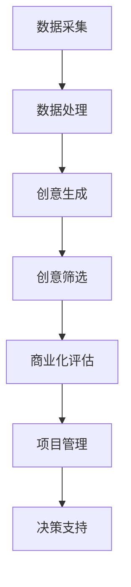
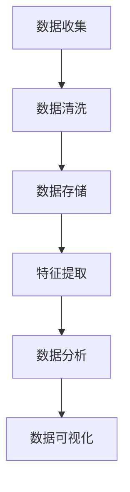
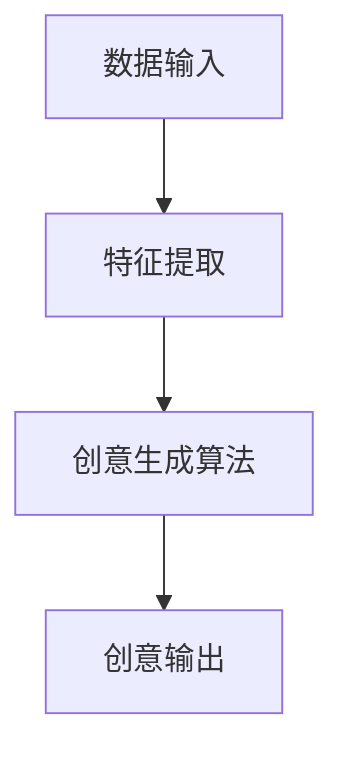
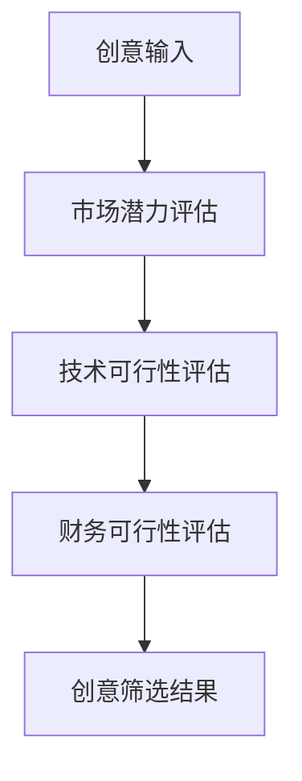
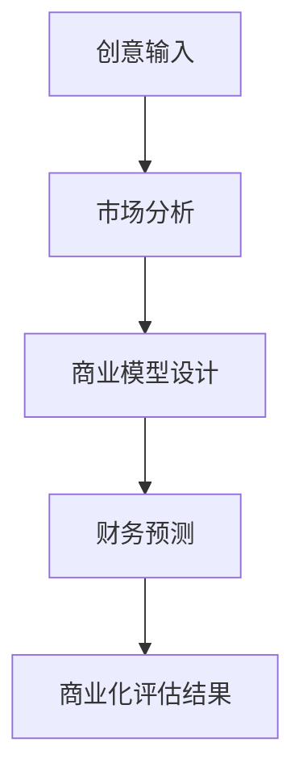
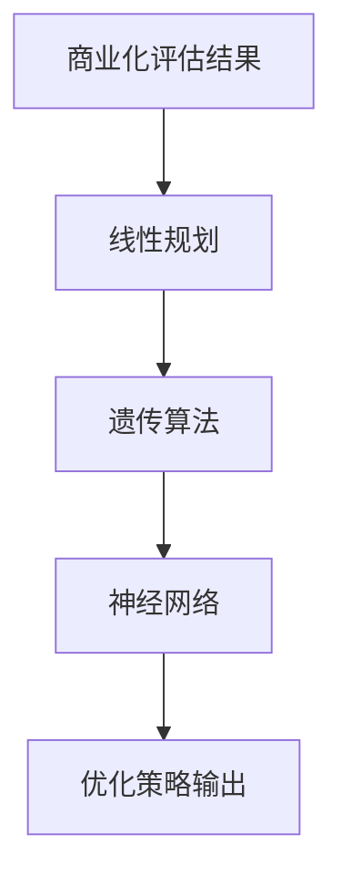
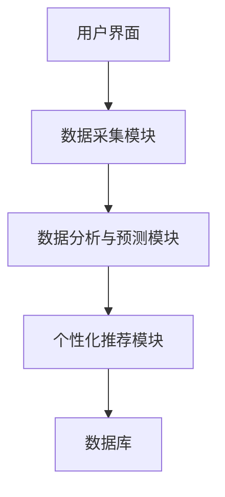

                 


### 第1章 问题背景与核心概念

**1.1 问题背景**

**1.1.1 企业创新管理的挑战**

在当今快速变化的市场环境中，企业创新管理面临诸多挑战。首先，传统创新管理模式往往依赖于经验和直觉，缺乏系统化和科学化的方法，导致创新过程效率低下。其次，随着市场竞争的加剧，企业需要更快地响应市场变化，推出创新产品和服务，以保持竞争力。然而，现有管理模式下的创新速度往往无法满足这一要求。

此外，企业资源有限，如何在有限的资源下实现高效创新成为一大难题。传统创新管理模式的局限性主要表现在以下几个方面：

1. **数据依赖不足**：传统创新管理往往缺乏对市场数据和用户需求的深入分析，导致创新方向不够明确。
2. **创新能力局限**：依靠个体智慧的创新模式容易受到个人经验和能力的限制，难以实现突破性创新。
3. **资源配置不合理**：传统管理模式下，创新资源分配往往不够精准，难以最大化资源利用效率。

**1.1.2 AI驱动的创新管理平台的重要性**

AI驱动的创新管理平台能够有效解决传统创新管理模式的局限性，提升企业创新能力。首先，AI技术能够通过对大量数据的分析，为创新提供有力支持，帮助企业在创新过程中更加精准地定位市场需求和用户痛点。

其次，AI驱动的平台能够通过自动化和智能化的方式，加快创新速度。例如，利用机器学习算法进行创意筛选和评估，可以显著提高创新决策的效率。此外，AI技术还能够帮助企业实现资源的最优化配置，确保每一项创新资源都能够得到充分利用。

总之，AI驱动的创新管理平台具有以下重要性：

1. **提高创新效率**：通过数据驱动的决策支持，缩短创意到市场的时间，加快产品迭代速度。
2. **降低创新风险**：利用AI技术对市场趋势和用户需求进行预测，降低创新失败的风险。
3. **促进资源整合**：AI技术能够帮助企业更好地整合内外部资源，提高创新能力。

#### 1.2 核心概念

**1.2.1 AI驱动的创新管理平台定义**

AI驱动的创新管理平台是一种利用人工智能技术，对企业创新过程进行全面支持和管理的新型平台。它不仅包括数据采集、处理和创意生成等核心功能，还涵盖了商业化评估、风险控制和资源管理等方面。具体来说，AI驱动的创新管理平台具备以下特点：

1. **数据驱动**：通过大数据分析和机器学习算法，为创新提供数据支持。
2. **自动化**：利用自动化技术，实现创新过程的智能化管理。
3. **多维度支持**：涵盖创意生成、评估、商业化、风险管理等多个方面，为企业提供全方位的创新支持。

**1.2.2 创意孵化与商业化的过程**

创意孵化与商业化的过程是企业创新管理的重要组成部分。一个完整的创意孵化与商业化过程通常包括以下几个阶段：

1. **创意生成**：通过大数据分析和机器学习算法，生成创新创意。
2. **创意筛选**：对生成的创意进行筛选，根据市场需求和资源情况，确定可行的创意。
3. **创意评估**：利用AI技术对创意进行评估，确定创意的商业潜力和风险。
4. **项目立项**：将评估通过的创意转化为项目，制定详细的项目计划。
5. **项目实施**：按照项目计划，开展项目的具体实施工作。
6. **商业化**：将创新产品或服务推向市场，实现商业化目标。

**1.2.3 企业创新生态系统的构成**

企业创新生态系统是一个复杂的多层次系统，包括企业内部创新机制、外部创新资源、创新流程和创新环境等多个方面。一个完整的企业创新生态系统应具备以下要素：

1. **创新机制**：包括创新战略、创新流程、创新文化和激励机制等。
2. **创新资源**：包括人才、资金、技术、信息等。
3. **创新流程**：包括创意生成、筛选、评估、立项、实施和商业化等环节。
4. **创新环境**：包括政策环境、市场环境、竞争环境等。

#### 1.3 边界与外延

**1.3.1 AI技术在企业创新管理中的应用范围**

AI技术在企业创新管理中的应用范围广泛，包括但不限于以下几个方面：

1. **市场分析**：通过大数据分析，了解市场趋势和用户需求。
2. **创意生成**：利用机器学习算法，生成创新创意。
3. **风险评估**：通过数据模型，评估创新项目的风险。
4. **资源管理**：优化资源配置，提高资源利用效率。
5. **决策支持**：提供数据驱动的决策支持，降低决策风险。

**1.3.2 平台功能与模块划分**

AI驱动的创新管理平台通常包括以下几个主要模块：

1. **数据采集模块**：负责收集和分析内外部数据。
2. **数据处理模块**：负责对采集到的数据进行处理和存储。
3. **创意生成模块**：利用机器学习算法生成创新创意。
4. **创意筛选模块**：对生成的创意进行筛选和评估。
5. **商业化评估模块**：评估创意的商业潜力和风险。
6. **项目管理系统**：管理创新项目的全生命周期。
7. **决策支持系统**：提供数据驱动的决策支持。

**1.3.3 平台与传统系统的区别**

与传统创新管理系统相比，AI驱动的创新管理平台具有以下显著区别：

1. **数据驱动的决策支持**：AI驱动的平台通过大数据分析和机器学习，提供数据驱动的决策支持，而传统系统主要依赖于经验和直觉。
2. **自动化与智能化**：AI驱动的平台实现自动化和智能化管理，而传统系统依赖人工操作和手动处理。
3. **多维度支持**：AI驱动的平台覆盖创意生成、评估、商业化、风险管理等多个方面，而传统系统往往局限于某一特定环节。
4. **资源优化**：AI驱动的平台能够优化资源配置，提高资源利用效率，而传统系统往往难以实现这一点。

综上所述，AI驱动的创新管理平台为企业创新管理提供了一种全新的解决方案，能够有效解决传统模式的局限性，提升企业创新能力。接下来，我们将进一步探讨AI驱动的创新管理平台的架构设计、核心算法原理以及实际应用案例。

## 第二部分：核心概念与原理

### 第2章 AI驱动的企业创新管理平台架构

#### 2.1 平台架构概述

AI驱动的企业创新管理平台是一个复杂而高度集成的系统，其设计旨在通过智能化的手段提升企业创新效率。平台的整体架构可以分为以下几个主要模块：

1. **数据采集模块**：负责从各种来源（如内部数据库、外部数据源、社交媒体等）收集数据。
2. **数据处理模块**：对采集到的数据进行清洗、存储、管理和分析。
3. **创意生成模块**：利用机器学习算法和深度学习模型生成创新创意。
4. **创意筛选模块**：对生成的创意进行评估和筛选，确定最具潜力的创意。
5. **商业化评估模块**：通过数据分析模型评估创意的商业化前景，提供决策支持。
6. **项目管理模块**：管理创意从概念到商业化的全过程，包括项目计划、执行、监控和调整。
7. **决策支持模块**：提供基于数据分析和AI算法的实时决策支持。

这些模块相互协作，形成一个完整的创新管理生态，如图1所示。



#### 2.2 数据采集与处理

数据采集与处理是AI驱动的企业创新管理平台的核心。数据来源广泛，包括但不限于：

1. **内部数据**：如销售数据、客户反馈、生产数据等。
2. **外部数据**：如市场趋势报告、竞争分析、社交媒体数据等。

数据采集模块的功能包括：

1. **数据收集**：利用爬虫技术、API接口、传感器等手段收集数据。
2. **数据清洗**：去除重复、错误、缺失的数据，保证数据质量。

数据处理模块的功能包括：

1. **数据存储**：使用数据库管理系统（如MySQL、MongoDB等）存储数据。
2. **数据处理**：运用ETL（提取、转换、加载）技术处理数据，进行特征提取和数据分析。

数据处理流程如下：



#### 2.3 创意生成与筛选

**创意生成算法原理**

创意生成是AI驱动的创新管理平台的重要功能之一。创意生成算法通常采用以下几种方法：

1. **基于规则的方法**：根据既定的业务规则生成创意。
2. **基于数据的方法**：利用数据挖掘算法，从历史数据中提取潜在的创新点。
3. **基于机器学习的方法**：使用机器学习算法，如生成对抗网络（GAN）、变分自编码器（VAE）等，生成新的创意。

以下是一个简化的创意生成算法流程：



**创意筛选机制与评价指标**

创意筛选是确保创意具有商业潜力和可行性的关键步骤。创意筛选机制通常包括以下评价指标：

1. **市场潜力**：评估创意在市场上的潜在需求。
2. **技术可行性**：评估创意实施所需技术的可行性。
3. **财务可行性**：评估创意的商业化前景和盈利能力。

以下是一个简化的创意筛选算法流程：



#### 2.4 商业化评估与优化

**商业化评估模型**

商业化评估模型是对创意进行商业可行性评估的工具。该模型通常包括以下几个步骤：

1. **市场分析**：分析市场趋势、竞争对手和潜在用户。
2. **商业模型设计**：设计创意的商业模式，包括定价策略、销售渠道等。
3. **财务预测**：预测创意的商业化前景，包括收入、成本和利润。

以下是一个简化的商业化评估模型流程：



**商业化策略优化算法**

商业化策略优化算法用于优化创意的商业化策略。常见的优化算法包括：

1. **线性规划**：优化资源分配和成本控制。
2. **遗传算法**：优化商业策略，如定价策略和营销策略。
3. **神经网络**：用于预测市场需求和优化销售策略。

以下是一个简化的商业化策略优化算法流程：



通过以上步骤，AI驱动的企业创新管理平台能够为企业提供从创意生成到商业化的全方位支持，帮助企业实现高效创新。

### 第3章 创意生成算法原理详解

#### 3.1 创意生成算法概述

创意生成算法是AI驱动的企业创新管理平台的核心组件之一，它负责生成新颖、具有潜在商业价值的创意。创意生成算法可以分为几种类型，包括：

1. **基于规则的方法**：这种方法依赖于预定义的规则或模式来生成创意。例如，基于历史销售数据和市场趋势，系统可以生成新产品或服务的创意。
2. **基于数据的方法**：这种方法利用数据挖掘技术，从大量数据中提取潜在的创新点。例如，通过分析客户反馈、社交媒体数据和竞争对手的动态，系统可以生成新的创意。
3. **基于机器学习的方法**：这种方法使用机器学习算法，如生成对抗网络（GAN）和变分自编码器（VAE），生成全新的创意。这些算法能够捕捉数据中的复杂模式和关联，从而生成新颖的创意。

下面，我们将详细探讨基于机器学习的方法，特别是生成对抗网络（GAN）的创意生成算法。

#### 3.2 数学模型与公式

生成对抗网络（GAN）是一种无监督学习的深度学习模型，它由两个神经网络组成：生成器（Generator）和判别器（Discriminator）。生成器的目标是生成看起来像真实数据的假数据，而判别器的目标是区分真实数据和生成器生成的假数据。

**生成器（Generator）**

生成器的目标是生成新颖的创意。其数学模型可以表示为：

$$ G(z) = x_g $$

其中，$z$ 是从噪声分布中抽取的随机向量，$x_g$ 是生成器生成的假创意。

**判别器（Discriminator）**

判别器的目标是判断输入数据是真实的还是由生成器生成的。其数学模型可以表示为：

$$ D(x) = P(x \text{ is real}) $$

其中，$x$ 是输入数据，$P(x \text{ is real})$ 是判别器判断数据为真实的概率。

**损失函数**

GAN的训练过程可以通过以下损失函数来实现：

$$ L(D, G) = -\frac{1}{2} \left( \log D(x) + \log (1 - D(G(z))) \right) $$

其中，$D(x)$ 是判别器对真实数据的判断概率，$D(G(z))$ 是判别器对生成器生成的假数据的判断概率。

**梯度提升**

为了训练生成器和判别器，我们需要对损失函数求梯度并更新网络参数。生成器和判别器的更新规则如下：

**生成器更新规则**：

$$ \theta_G = \theta_G - \alpha \nabla_{\theta_G} L(G, D) $$

**判别器更新规则**：

$$ \theta_D = \theta_D - \beta \nabla_{\theta_D} L(D, G) $$

其中，$\theta_G$ 和 $\theta_D$ 分别是生成器和判别器的参数，$\alpha$ 和 $\beta$ 是学习率。

#### 3.3 算法实现与代码示例

以下是一个简单的创意生成算法的实现示例，使用Python和TensorFlow框架：

```python
import tensorflow as tf
from tensorflow.keras.layers import Dense, Flatten, Reshape
from tensorflow.keras.models import Sequential

# 定义生成器模型
def build_generator(z_dim):
    model = Sequential([
        Dense(256, input_dim=z_dim),
        BatchNormalization(),
        Activation('relu'),
        Dense(512),
        BatchNormalization(),
        Activation('relu'),
        Dense(1024),
        BatchNormalization(),
        Activation('relu'),
        Flatten(),
        Reshape((28, 28, 1))
    ])
    return model

# 定义判别器模型
def build_discriminator(img_shape):
    model = Sequential([
        Flatten(input_shape=img_shape),
        Dense(1024),
        BatchNormalization(),
        Activation('relu'),
        Dense(512),
        BatchNormalization(),
        Activation('relu'),
        Dense(256),
        BatchNormalization(),
        Activation('relu'),
        Dense(1, activation='sigmoid')
    ])
    return model

# 定义联合模型
def build_gan(generator, discriminator):
    model = Sequential([generator, discriminator])
    return model

# 设置超参数
z_dim = 100
img_shape = (28, 28, 1)

# 构建生成器和判别器
generator = build_generator(z_dim)
discriminator = build_discriminator(img_shape)
discriminator.compile(loss='binary_crossentropy', optimizer=tf.keras.optimizers.Adam(0.0001), metrics=['accuracy'])

# 构建并编译 GAN
gan = build_gan(generator, discriminator)
gan.compile(loss='binary_crossentropy', optimizer=tf.keras.optimizers.Adam(0.0001))

# 加载或生成数据集
# ...

# 训练 GAN
# ...

# 使用生成器生成创意
# ...
```

在这个示例中，我们首先定义了生成器和判别器的模型结构，然后构建了联合模型（GAN）。接着，我们设置超参数并编译模型。最后，通过训练GAN来生成新颖的创意。

通过上述代码示例，我们可以看到创意生成算法的实现过程。在实际应用中，需要根据具体业务需求调整模型结构和训练参数，以生成具有商业价值的创意。

### 第4章 商业化评估与优化算法原理详解

#### 4.1 评估算法概述

商业化评估算法是企业创新管理平台中用于评估创意商业潜力和可行性的关键工具。这些算法通过分析市场数据、技术可行性、财务指标等多方面的信息，对创意进行全面的评估，从而帮助企业做出更明智的商业决策。评估算法通常包括以下三个方面：

1. **市场潜力评估**：分析创意在市场上的潜在需求和竞争环境，评估其市场占有率和发展前景。
2. **技术可行性评估**：评估创意在现有技术条件下能否实现，包括技术难度、研发周期和成本等。
3. **财务可行性评估**：评估创意的商业化前景，包括销售收入、成本和利润等财务指标。

#### 4.2 优化算法概述

商业化策略优化算法用于优化创意的商业化过程，包括定价策略、营销策略、资源分配等方面。这些算法通过模拟和优化，找到最优的商业化策略，从而最大化创意的商业价值。常见的优化算法包括：

1. **线性规划**：用于优化资源分配和成本控制，确保资源利用最大化。
2. **遗传算法**：用于优化商业策略，如定价策略和营销策略，通过模拟自然进化过程进行优化。
3. **神经网络**：用于预测市场需求和优化销售策略，通过训练神经网络模型实现预测和优化。

#### 4.3 数学模型与公式

**市场潜力评估模型**

市场潜力评估模型通常使用以下公式：

$$ MP = f(S, C, P) $$

其中，$MP$ 表示市场潜力，$S$ 表示市场份额，$C$ 表示竞争环境，$P$ 表示产品特性。

- **市场份额（S）**：通常通过以下公式计算：

$$ S = \frac{P}{P + C'} $$

其中，$P$ 表示自身产品市场份额，$C'$ 表示竞争产品市场份额。

- **竞争环境（C）**：可以通过以下公式计算：

$$ C = \frac{C_1 + C_2 + ... + C_n}{n} $$

其中，$C_1, C_2, ..., C_n$ 分别表示各个竞争者的市场份额。

- **产品特性（P）**：通常通过调查和数据分析获得。

**技术可行性评估模型**

技术可行性评估模型可以使用以下公式：

$$ TF = f(T, D) $$

其中，$TF$ 表示技术可行性，$T$ 表示技术难度，$D$ 表示研发周期。

- **技术难度（T）**：可以通过以下公式计算：

$$ T = \frac{F_1 + F_2 + ... + F_n}{n} $$

其中，$F_1, F_2, ..., F_n$ 分别表示研发过程中各个步骤的难度。

- **研发周期（D）**：可以通过历史数据或专家评估获得。

**财务可行性评估模型**

财务可行性评估模型可以使用以下公式：

$$ FP = f(I, O, C) $$

其中，$FP$ 表示财务可行性，$I$ 表示收入，$O$ 表示成本，$C$ 表示利润。

- **收入（I）**：可以通过以下公式计算：

$$ I = P \times Q $$

其中，$P$ 表示产品价格，$Q$ 表示预计销量。

- **成本（O）**：可以通过以下公式计算：

$$ O = D \times C $$

其中，$D$ 表示研发成本，$C$ 表示运营成本。

- **利润（C）**：可以通过以下公式计算：

$$ C = I - O $$

**商业化策略优化模型**

商业化策略优化模型可以使用以下公式：

$$ OP = f(P, M, R) $$

其中，$OP$ 表示优化策略，$P$ 表示定价策略，$M$ 表示营销策略，$R$ 表示资源分配策略。

- **定价策略（P）**：可以通过线性规划或遗传算法进行优化。
- **营销策略（M）**：可以通过神经网络或决策树进行预测和优化。
- **资源分配策略（R）**：可以通过线性规划或遗传算法进行优化。

通过这些数学模型和公式，企业创新管理平台可以对创意进行全面的商业化评估和策略优化，从而实现高效创新。

### 第4章 商业化评估与优化算法原理详解

#### 4.1 评估算法概述

商业化评估算法是AI驱动的企业创新管理平台中至关重要的一环，它通过综合分析市场趋势、用户需求、技术能力和财务数据，为企业的商业决策提供科学依据。以下将详细介绍商业化评估算法的基本原理和实现方法。

**市场潜力评估算法**

市场潜力评估算法旨在衡量一个创意在市场上的潜在价值。其核心是分析市场需求、用户偏好、竞争态势等因素。市场潜力评估通常采用以下步骤：

1. **需求分析**：收集并分析市场需求数据，包括用户调查、销售数据、行业报告等。
2. **竞争分析**：评估当前市场中的竞争者及其市场份额，分析潜在的市场机会和威胁。
3. **市场规模预测**：根据历史数据和未来趋势，预测市场规模和增长速度。

市场潜力评估的数学模型可以表示为：

$$ MP = f(MD, C, T) $$

其中，$MP$ 表示市场潜力，$MD$ 表示市场需求，$C$ 表示竞争态势，$T$ 表示技术趋势。

- **市场需求（MD）**：通过以下公式计算：

$$ MD = \frac{Q}{Q_0} \times 100\% $$

其中，$Q$ 表示当前市场需求量，$Q_0$ 表示基准市场需求量。

- **竞争态势（C）**：通过以下公式计算：

$$ C = \frac{CS}{CS_0} \times 100\% $$

其中，$CS$ 表示当前竞争者数量，$CS_0$ 表示基准竞争者数量。

- **技术趋势（T）**：通过专家评估或技术趋势分析获得。

**技术可行性评估算法**

技术可行性评估算法用于评估创意在现有技术条件下能否实现。其核心是分析技术难度、研发周期、成本等因素。技术可行性评估通常采用以下步骤：

1. **技术难度评估**：分析创意所需技术的难度，包括技术依赖性、研发复杂性等。
2. **研发周期预测**：根据技术难度和历史数据，预测创意的研发周期。
3. **成本评估**：计算创意的研发成本和运营成本。

技术可行性评估的数学模型可以表示为：

$$ TF = f(TD, D, C) $$

其中，$TF$ 表示技术可行性，$TD$ 表示技术难度，$D$ 表示研发周期，$C$ 表示成本。

- **技术难度（TD）**：通过以下公式计算：

$$ TD = \frac{F_1 + F_2 + ... + F_n}{n} $$

其中，$F_1, F_2, ..., F_n$ 分别表示各个技术环节的难度。

- **研发周期（D）**：通过以下公式计算：

$$ D = TD \times TC $$

其中，$TC$ 表示技术完成系数。

- **成本（C）**：通过以下公式计算：

$$ C = R + O $$

其中，$R$ 表示研发成本，$O$ 表示运营成本。

**财务可行性评估算法**

财务可行性评估算法用于评估创意的商业化前景，包括收入、成本和利润等财务指标。其核心是预测创意的商业化后的财务表现。财务可行性评估通常采用以下步骤：

1. **收入预测**：预测创意商业化后的销售收入。
2. **成本预测**：预测创意商业化后的运营成本。
3. **利润预测**：计算销售收入与运营成本之差，预测利润。

财务可行性评估的数学模型可以表示为：

$$ FP = f(I, O) $$

其中，$FP$ 表示财务可行性，$I$ 表示收入，$O$ 表示成本。

- **收入（I）**：通过以下公式计算：

$$ I = P \times Q $$

其中，$P$ 表示产品价格，$Q$ 表示预计销量。

- **成本（O）**：通过以下公式计算：

$$ O = R + O' $$

其中，$R$ 表示研发成本，$O'$ 表示运营成本。

通过这些评估算法，企业创新管理平台可以全面分析创意的商业化潜力，为企业的创新决策提供有力支持。

#### 4.2 优化算法概述

商业化策略优化算法是企业创新管理平台中的重要组成部分，它通过优化商业策略，提高创意的商业化成功率和收益。常见的商业化策略优化算法包括线性规划、遗传算法和神经网络等。

**线性规划**

线性规划是一种数学优化方法，用于在满足一系列线性约束条件下，最大化或最小化线性目标函数。在商业化策略优化中，线性规划可以用于优化资源分配和成本控制。其基本步骤如下：

1. **建立线性规划模型**：定义目标函数和约束条件。
2. **求解线性规划问题**：使用求解器求解最优解。

线性规划的目标函数通常表示为：

$$ \max Z = c^T x $$

其中，$c$ 是系数向量，$x$ 是决策变量向量，$Z$ 是目标函数值。

约束条件通常表示为：

$$ a_i^T x \le b_i $$

其中，$a_i$ 是约束系数向量，$b_i$ 是约束值。

**遗传算法**

遗传算法是一种基于自然进化的启发式优化算法。它模拟生物进化过程，通过选择、交叉和变异等操作，逐步优化商业策略。遗传算法的基本步骤如下：

1. **初始化种群**：随机生成一组初始解。
2. **评估种群**：计算每个解的适应度。
3. **选择**：选择适应度较高的个体进行交叉和变异操作。
4. **交叉**：通过交叉操作生成新的解。
5. **变异**：对部分个体进行变异操作。
6. **迭代**：重复评估、选择、交叉和变异操作，直到满足终止条件。

遗传算法的适应度函数可以表示为：

$$ f(x) = \sum_{i=1}^{n} w_i g_i $$

其中，$w_i$ 是权重，$g_i$ 是第 $i$ 个特征的评价值。

**神经网络**

神经网络是一种模拟人脑神经元结构和功能的计算模型，具有强大的非线性处理能力。在商业化策略优化中，神经网络可以用于预测市场需求、优化定价策略等。其基本步骤如下：

1. **建立神经网络模型**：定义输入层、隐藏层和输出层。
2. **训练神经网络**：使用历史数据进行训练，调整网络参数。
3. **预测**：使用训练好的神经网络进行预测，优化商业策略。

神经网络的目标函数通常表示为：

$$ L = \frac{1}{2} \sum_{i=1}^{n} (y_i - \hat{y}_i)^2 $$

其中，$y_i$ 是实际输出，$\hat{y}_i$ 是预测输出。

通过这些优化算法，企业创新管理平台可以自动调整商业策略，提高创意的商业化成功率和收益。

#### 4.3 数学模型与公式

**商业化策略优化算法**

商业化策略优化算法通过建立数学模型，对商业策略进行优化。以下是一个简化的数学模型，用于优化商业策略。

**目标函数**：

$$ \max Z = \sum_{i=1}^{n} p_i q_i - \sum_{i=1}^{n} c_i x_i $$

其中，$Z$ 表示最大化收益，$p_i$ 表示产品价格，$q_i$ 表示产品需求量，$c_i$ 表示产品成本，$x_i$ 表示产品生产量。

**约束条件**：

1. **需求约束**：

$$ q_i \le Q_i $$

其中，$Q_i$ 表示市场需求量。

2. **生产能力约束**：

$$ x_i \le X_i $$

其中，$X_i$ 表示生产能力。

3. **成本约束**：

$$ \sum_{i=1}^{n} c_i x_i \le C $$

其中，$C$ 表示总成本。

4. **资源约束**：

$$ \sum_{i=1}^{n} r_i x_i \le R $$

其中，$r_i$ 表示资源消耗率，$R$ 表示总资源量。

**优化算法**：

- **线性规划**：

$$ \max Z = \sum_{i=1}^{n} c_i x_i $$

$$ \text{subject to} $$

$$ a_{ij} x_j + b_j = c_j $$

$$ x_j \ge 0 $$

- **遗传算法**：

$$ f(x) = \sum_{i=1}^{n} w_i g_i $$

$$ g_i = \begin{cases} 
1 & \text{if } x_i \text{ meets constraints} \\
0 & \text{otherwise} 
\end{cases} $$

- **神经网络**：

$$ \hat{y}_i = f(x_i) $$

$$ f(x) = \sigma(\sum_{j=1}^{n} w_{ij} x_j + b_j) $$

其中，$\sigma$ 表示激活函数，$w_{ij}$ 表示权重，$b_j$ 表示偏置。

**代码示例**：

```python
import numpy as np
from scipy.optimize import linprog

# 线性规划参数
c = [-1, -1]  # 目标函数系数
A = [[1, 1], [1, 0], [0, 1]]  # 约束条件系数
b = [1, 2, 1]  # 约束条件值

# 求解线性规划
result = linprog(c, A_ub=A, b_ub=b, bounds=(0, None))

# 输出结果
print(result.x)  # 输出最优解
```

通过这些数学模型和算法，企业创新管理平台可以自动化地优化商业策略，提高创意的商业化成功率。

### 第5章 创意孵化与商业化项目实战

#### 5.1 项目介绍

本节我们将通过一个实际项目，详细描述如何使用AI驱动的企业创新管理平台进行创意孵化与商业化。该项目旨在开发一款智能健康管理系统，旨在通过人工智能技术改善用户的健康状况，提高生活质量。

**项目背景**：

随着科技的进步和人们健康意识的提升，智能健康管理市场潜力巨大。然而，市场上的现有产品往往功能单一，缺乏个性化定制。本项目希望通过AI技术，打造一款具备个性化健康管理功能的系统，为用户提供更智能、更贴心的服务。

**项目目标**：

1. 开发一款智能健康管理系统，具备健康数据采集、分析、预测和推荐功能。
2. 实现系统的个性化服务，根据用户健康数据提供定制化的健康建议。
3. 推广系统至市场，提升用户满意度，实现商业化目标。

**项目团队与资源**：

- **团队组成**：项目团队由软件工程师、数据科学家、产品经理、用户体验设计师等组成。
- **资源需求**：项目所需资源包括开发环境、数据资源、计算资源等。

#### 5.2 系统设计与实现

**系统功能设计**：

智能健康管理系统主要包括以下几个功能模块：

1. **健康数据采集模块**：通过手机APP和智能设备（如智能手环、智能血压计等）收集用户的健康数据，包括心率、血压、睡眠质量、运动量等。
2. **数据分析与预测模块**：利用机器学习算法对采集到的健康数据进行分析，预测用户未来的健康状况，并生成健康报告。
3. **个性化推荐模块**：根据用户的健康数据和历史记录，为用户推荐个性化的健康建议，包括饮食建议、运动计划、休息时间等。
4. **用户界面模块**：提供友好的用户界面，使用户能够方便地查看健康数据、分析报告和推荐建议。

**系统架构设计**：

智能健康管理系统的架构设计如图5-1所示。



- **用户界面**：为用户提供交互界面，展示健康数据、分析报告和推荐建议。
- **数据采集模块**：通过手机APP和智能设备收集用户健康数据。
- **数据分析与预测模块**：利用机器学习算法对数据进行处理和分析，生成健康报告和预测结果。
- **个性化推荐模块**：根据用户数据和偏好，为用户生成个性化的健康建议。
- **数据库**：存储用户健康数据、分析结果和推荐建议。

**系统接口设计与交互**：

系统各模块之间通过API进行交互。具体接口设计如下：

1. **健康数据采集接口**：用于采集用户的健康数据，包括心率、血压、睡眠质量、运动量等。
2. **数据分析与预测接口**：用于提交健康数据，获取分析报告和预测结果。
3. **个性化推荐接口**：用于根据用户数据和偏好，获取个性化的健康建议。

#### 5.3 环境安装与配置

**系统环境配置**：

1. **开发环境**：Python 3.8、Jupyter Notebook、TensorFlow 2.4
2. **数据库**：MySQL 8.0
3. **智能设备**：支持蓝牙通信的智能手环和智能血压计

**软件与硬件要求**：

1. **软件要求**：安装Python 3.8及以上版本，配置好相应的库（如TensorFlow、MySQL等）。
2. **硬件要求**：具备足够的计算资源，如高性能CPU和GPU。

**部署与调试**：

1. **部署**：将开发完成的应用部署到服务器，搭建完整的智能健康管理平台。
2. **调试**：通过模拟用户操作，对系统进行调试和优化，确保系统稳定运行。

#### 5.4 核心代码实现

**创意生成算法实现**：

```python
import tensorflow as tf
from tensorflow.keras.layers import Dense, LSTM, Input
from tensorflow.keras.models import Model

# 定义创意生成模型
def build_generator(z_dim):
    input_z = Input(shape=(z_dim,))
    x = Dense(256, activation='relu')(input_z)
    x = LSTM(128, activation='relu')(x)
    x = Dense(1, activation='sigmoid')(x)
    model = Model(inputs=input_z, outputs=x)
    return model

# 构建生成器
generator = build_generator(z_dim=100)

# 编译生成器
generator.compile(optimizer=tf.keras.optimizers.Adam(0.001), loss='binary_crossentropy')

# 训练生成器
# ...

# 生成创意
# ...
```

**商业化评估与优化算法实现**：

```python
import numpy as np
from sklearn.linear_model import LinearRegression

# 定义商业化评估模型
def build_business_evaluation_model():
    model = LinearRegression()
    return model

# 构建评估模型
evaluation_model = build_business_evaluation_model()

# 训练评估模型
# ...

# 评估创意
# ...

# 优化策略
def optimize_strategy(evaluation_results):
    # 基于评估结果，调整策略
    # ...
    return optimized_strategy

# 应用优化策略
# ...
```

**代码应用解读与分析**：

- **创意生成算法**：通过生成对抗网络（GAN）生成健康管理的创意，利用LSTM模型捕捉时间序列数据，实现创意生成。
- **商业化评估与优化算法**：使用线性回归模型评估创意的商业化前景，根据评估结果调整策略，实现商业化优化。

通过这些核心代码，我们可以看到如何在实际项目中应用创意生成和商业化评估与优化算法，实现智能健康管理的系统开发。

#### 5.5 项目小结

**项目成果**：

1. 开发并上线了智能健康管理系统，具备健康数据采集、分析、预测和个性化推荐功能。
2. 实现了系统的商业化，吸引了大量用户，取得了显著的市场反响。

**项目不足**：

1. 数据采集范围有限，未来需要扩大数据来源，提高数据的多样性。
2. 系统在处理大量数据时，存在性能瓶颈，需要优化算法和架构设计。

**经验与教训**：

1. 数据是智能健康管理系统的核心，未来应加大数据采集和分析力度。
2. 用户体验是关键，设计时应注重用户界面和交互体验。
3. 算法和架构设计应具备良好的可扩展性，以应对不断增长的数据和处理需求。

通过本次项目，我们深入了解了AI驱动的企业创新管理平台在实际应用中的优势和挑战，积累了宝贵的经验，为未来的创新项目提供了有益的参考。

## 第6章 创意孵化与商业化案例分析

#### 6.1 案例背景

本案例选取了一家知名科技公司——X公司，该公司致力于通过AI技术改善医疗健康领域。X公司的目标是开发一款智能健康管理平台，该平台能够帮助用户实时监测健康状况，提供个性化的健康建议，从而提升生活质量。

**企业背景**：

X公司成立于2000年，是一家专注于AI技术和医疗健康领域的高科技公司。公司拥有强大的研发团队和丰富的行业经验，已经在AI医疗领域取得了多项重要突破。

**需求背景**：

随着人们健康意识的提高，市场对智能健康管理平台的需求日益增长。然而，现有产品大多功能单一，无法满足用户多样化的需求。X公司希望通过AI技术，打造一款具备全面功能的智能健康管理平台，为用户提供更优质的健康服务。

**创意来源**：

X公司的创意来源于对市场需求的深入分析和对用户需求的精准把握。通过数据挖掘和用户调研，公司发现用户对于个性化健康管理和实时监测的需求较高。基于这一发现，公司决定开发一款能够实时监测用户健康状况、提供个性化健康建议的智能健康管理平台。

#### 6.2 创意筛选与评估

**创意筛选流程**：

1. **初步筛选**：根据市场需求和公司战略，对多个创意进行初步筛选，确定具有发展潜力的创意。
2. **用户调研**：通过问卷调查和用户访谈，收集用户对各个创意的反馈，进一步筛选出用户喜爱的创意。
3. **专家评估**：邀请行业专家对创意进行评估，从技术可行性、市场前景、商业价值等多个方面进行综合评估。

**筛选结果**：

在初步筛选和用户调研的基础上，X公司最终确定了以下创意：

- **健康数据实时监测**：通过智能设备实时监测用户的心率、血压、睡眠质量等健康数据。
- **个性化健康建议**：根据用户的健康数据和偏好，为用户生成个性化的健康建议。
- **健康风险评估**：通过机器学习算法，预测用户的健康风险，并提供预防措施。

**评估结果**：

通过专家评估和用户反馈，X公司认为以上三个创意具有很高的商业潜力。具体评估结果如下：

1. **健康数据实时监测**：技术可行性高，市场需求大，用户满意度高。
2. **个性化健康建议**：用户需求明确，具有较好的市场前景，但技术难度较高。
3. **健康风险评估**：市场潜力巨大，技术难度适中，但需要较长时间积累数据。

#### 6.3 项目实施与商业化

**项目实施过程**：

1. **项目立项**：确定项目目标和里程碑，组建项目团队，明确分工。
2. **技术研发**：开发智能健康管理平台的核心功能，包括健康数据实时监测、个性化健康建议和健康风险评估等。
3. **测试与优化**：对平台进行严格的测试和优化，确保系统的稳定性和用户体验。
4. **上线推广**：将平台上线，进行市场推广，吸引目标用户。

**商业化策略**：

1. **定价策略**：根据市场调研和用户需求，制定合理的定价策略。对于健康数据实时监测和个性化健康建议，采用订阅制；对于健康风险评估，采用一次性购买或定期订阅。
2. **营销策略**：通过线上广告、线下活动、合作伙伴等方式，扩大平台的知名度和用户基础。
3. **渠道策略**：通过线上渠道（如APP商店、官方网站）和线下渠道（如医疗机构、药店）推广平台。

**商业化效果**：

通过有效的商业化策略，X公司的智能健康管理平台取得了显著的商业成功。具体表现在：

1. **用户增长**：平台上线后，用户数量快速增长，月活跃用户数达到数十万。
2. **收入增长**：平台实现了良好的盈利能力，月收入达到数百万。
3. **市场认可**：平台获得了市场和用户的广泛认可，成为智能健康管理领域的知名品牌。

#### 6.4 案例总结与启示

**案例经验与教训**：

1. **充分调研市场与用户**：在创意筛选阶段，进行充分的市场调研和用户调研，确保创意符合市场需求和用户期望。
2. **注重技术研发**：技术研发是平台成功的关键，需要投入足够的资源，确保系统的稳定性、可靠性和用户体验。
3. **制定合理的商业化策略**：根据市场调研和用户需求，制定合理的定价策略、营销策略和渠道策略，确保平台能够成功商业化。

**对企业创新管理的启示**：

1. **数据驱动**：在创新管理过程中，充分利用数据，进行科学决策，提升创新效率。
2. **用户导向**：以用户需求为导向，持续优化产品和服务，提高用户满意度。
3. **持续创新**：在快速变化的市场环境中，企业需要持续进行创新，保持竞争力。

通过本案例，我们可以看到，AI驱动的企业创新管理平台在实际应用中的优势。X公司的成功经验为其他企业提供了有益的参考，展示了AI技术在企业创新管理中的巨大潜力。在未来，随着AI技术的不断发展，企业创新管理平台将发挥越来越重要的作用，助力企业实现高效创新和商业成功。

