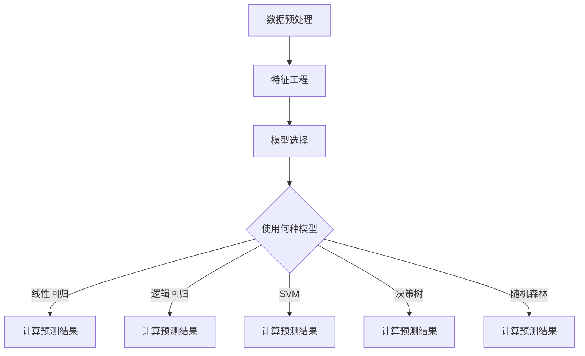
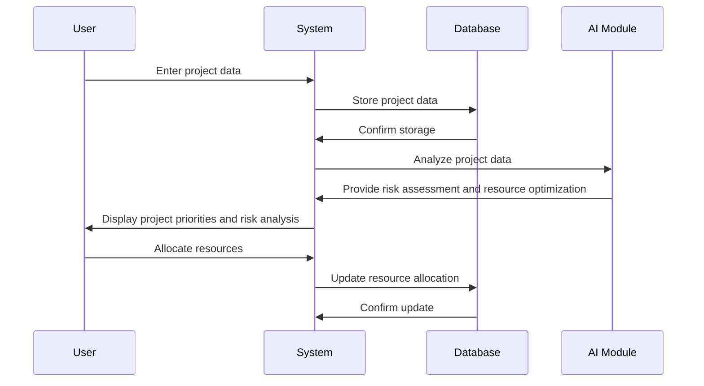
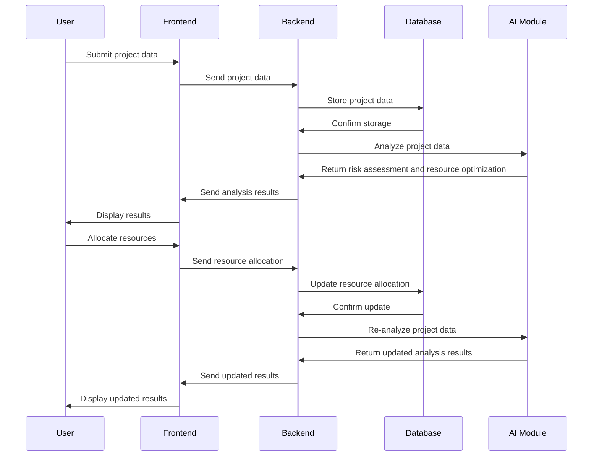

                 


### AI驱动的企业创新项目组合管理：风险平衡与资源优化

> 关键词：AI，企业创新，项目组合管理，风险平衡，资源优化

> 摘要：
随着人工智能技术的飞速发展，企业逐渐意识到AI在推动创新项目组合管理中的关键作用。本文将探讨如何通过AI实现企业创新项目组合管理的风险平衡与资源优化。首先，我们将介绍AI驱动创新项目组合管理的背景和核心概念，接着分析AI在项目组合管理中的应用，详细探讨风险平衡和资源优化的方法，最后通过实际案例展示AI驱动项目组合管理的实战应用。通过本文的阅读，读者将了解如何利用AI技术提升企业创新项目组合管理的效率和质量。

## 目录大纲

1. **背景与概念介绍**：
   - 第1章 问题背景与核心概念
   - 第2章 核心概念与联系

2. **算法原理与实现**：
   - 第3章 AI算法原理
   - 第4章 算法实现与流程

3. **系统架构与实现**：
   - 第5章 系统架构设计
   - 第6章 项目实战

4. **最佳实践与总结**：
   - 第7章 最佳实践
   - 第8章 总结

### 背景与概念介绍

#### 第1章 问题背景与核心概念

##### 1.1 问题背景

在当今全球竞争激烈的市场环境中，企业需要不断创新以保持竞争力。然而，创新项目的管理并不容易，尤其涉及到多项目的组合管理。传统的项目组合管理方法往往依赖于人工判断和经验，这不仅效率低下，而且容易忽略潜在的风险。随着人工智能（AI）技术的迅速发展，利用AI进行企业创新项目组合管理成为了一种趋势。AI技术能够通过数据分析和智能决策，帮助企业更好地平衡风险和优化资源，从而提高创新项目的成功率。

##### 1.2 AI驱动的企业创新

AI驱动的企业创新指的是利用人工智能技术来支持企业的研发和创新活动。AI技术包括机器学习、深度学习、自然语言处理等，它们能够处理大量数据，发现隐藏的模式和规律，从而提供有价值的洞见。在项目组合管理中，AI可以帮助企业识别最有潜力的创新项目，评估项目风险，优化资源配置，以及预测项目成功率。

##### 1.3 项目组合管理

项目组合管理（Portfolio Management）是指对一组相关项目的整体管理，以实现组织的战略目标和最大化价值。项目组合管理涉及项目的选择、优先级排序、资源分配、风险控制等方面。传统的项目组合管理方法通常依赖于项目管理的最佳实践和专家经验，但随着项目数量的增加和复杂性的提升，这种方法变得越来越不可行。

##### 1.4 风险平衡与资源优化

在项目组合管理中，风险平衡与资源优化是两个关键问题。风险平衡指的是在多个项目之间合理分配资源，以减少整体风险。资源优化则是确保有限的资源被最大化利用，以提高项目组合的整体绩效。传统的项目组合管理方法往往难以在风险平衡和资源优化之间找到最佳平衡点。而AI技术可以通过数据分析和智能算法，帮助企业更准确地评估项目风险，优化资源分配，从而实现更有效的项目组合管理。

#### 第2章 核心概念与联系

##### 2.1 AI的概念与分类

AI是指人工智能，它是一种模拟人类智能行为的计算机系统。AI可以分为弱AI和强AI。弱AI指的是在特定任务上表现出人类智能行为的系统，而强AI则是指具有全面人类智能的计算机系统。在项目组合管理中，通常使用的是弱AI技术，如机器学习和深度学习，这些技术可以在特定领域内提供高效的决策支持。

##### 2.2 企业创新概念解析

企业创新指的是企业通过研发新技术、新产品或新服务来创造新价值的过程。企业创新可以分为渐进式创新和颠覆式创新。渐进式创新是对现有产品或服务的改进，而颠覆式创新则是通过全新的技术和商业模式来颠覆现有市场。

##### 2.3 项目组合管理的核心要素

项目组合管理的核心要素包括项目选择、优先级排序、资源分配、风险控制和绩效评估。项目选择是指从众多潜在项目中挑选出最有价值的创新项目。优先级排序则是根据项目的重要性和可行性来排列项目的优先级。资源分配是在项目之间合理分配资源，以确保每个项目都能获得所需的资源。风险控制是指识别和管理项目风险，以减少不利影响。绩效评估是对项目组合的绩效进行评估，以确定项目组合是否实现了组织的目标。

##### 2.4 风险平衡与资源优化的关系

风险平衡与资源优化在项目组合管理中是紧密相关的。风险平衡指的是在多个项目之间分配资源，以降低整体风险。而资源优化则是确保有限的资源被最大化利用，从而提高项目组合的整体绩效。在实际操作中，企业需要根据项目的风险和潜在收益来平衡风险和资源，以实现最优的项目组合管理。

### 总结

在本文的第一部分，我们介绍了AI驱动的企业创新项目组合管理的背景和核心概念。通过分析问题背景和核心概念，我们了解了AI技术在项目组合管理中的应用，以及如何通过风险平衡和资源优化来提高项目组合管理的效率和质量。在接下来的部分，我们将深入探讨AI算法的原理和实现，以及如何通过系统架构设计来支持AI驱动的项目组合管理。

## 算法原理与实现

### 第3章 AI算法原理

##### 3.1 AI算法的基本原理

人工智能（AI）算法是基于机器学习（Machine Learning）和深度学习（Deep Learning）等技术的计算机程序。机器学习是一种让计算机通过数据学习并改进自身性能的方法。在机器学习中，算法通过分析训练数据集来发现数据中的模式，并利用这些模式进行预测和决策。

深度学习是机器学习的一个分支，它使用神经网络（Neural Networks）来模拟人脑的决策过程。深度学习通过多层神经网络来提取数据中的特征，从而实现更复杂的决策。在深度学习中，卷积神经网络（CNN）和循环神经网络（RNN）是两种常用的神经网络结构。

##### 3.2 数据预处理与特征工程

数据预处理是AI算法实现的第一步。数据预处理包括数据清洗、数据转换和数据归一化等步骤。数据清洗是指去除数据中的噪声和错误，数据转换是将不同类型的数据转换为适合算法处理的形式，数据归一化则是将数据缩放到一个特定的范围内。

特征工程是数据预处理的重要部分。特征工程的目标是提取数据中的有效特征，以减少数据的维度和提高算法的性能。特征工程的方法包括特征选择、特征变换和特征组合等。

##### 3.3 常见AI算法介绍

在项目组合管理中，常见的AI算法包括线性回归、逻辑回归、支持向量机（SVM）、决策树和随机森林等。线性回归是一种预测连续值的算法，逻辑回归是一种预测二分类结果的算法。支持向量机是一种在特征空间中寻找最优分割超平面的算法。决策树通过一系列规则来划分数据集，而随机森林是通过构建多个决策树并汇总它们的预测结果来提高准确性。

##### 3.4 AI算法在项目组合管理中的应用

在项目组合管理中，AI算法可以用于项目风险评估、项目优先级排序和资源优化等任务。项目风险评估可以通过机器学习算法来预测项目的成功概率和潜在风险。项目优先级排序可以通过决策树或随机森林等算法来根据项目的收益和风险进行排序。资源优化可以通过线性规划或遗传算法等优化算法来实现。

### 第4章 算法实现与流程

##### 4.1 算法流程图设计（使用mermaid）



##### 4.2 Python源代码实现

```python
# 导入必要的库
import numpy as np
import pandas as pd
from sklearn.linear_model import LinearRegression
from sklearn.model_selection import train_test_split
from sklearn.metrics import mean_squared_error

# 数据预处理
# 假设df是预处理后的数据
X = df[['特征1', '特征2', '特征3']]
y = df['目标变量']

# 特征工程
# 特征选择、变换等操作

# 模型选择
model = LinearRegression()

# 数据划分
X_train, X_test, y_train, y_test = train_test_split(X, y, test_size=0.2, random_state=42)

# 训练模型
model.fit(X_train, y_train)

# 计算预测结果
y_pred = model.predict(X_test)

# 评估模型
mse = mean_squared_error(y_test, y_pred)
print("MSE:", mse)
```

##### 4.3 算法原理讲解与数学模型

线性回归是一种预测连续值的算法，其基本原理是通过最小化预测值与实际值之间的平方误差来拟合一条直线。假设我们有一个自变量X和一个因变量Y，线性回归模型可以表示为：

$$Y = \beta_0 + \beta_1 \cdot X + \epsilon$$

其中，$\beta_0$是截距，$\beta_1$是斜率，$\epsilon$是误差项。

逻辑回归是一种预测二分类结果的算法，其基本原理是通过最小化逻辑函数与实际概率之间的交叉熵误差来拟合一条分界线。假设我们有一个自变量X和一个因变量Y，逻辑回归模型可以表示为：

$$P(Y=1) = \frac{1}{1 + e^{-(\beta_0 + \beta_1 \cdot X)} }$$

其中，$P(Y=1)$是因变量为1的概率。

支持向量机（SVM）是一种在特征空间中寻找最优分割超平面的算法。SVM的基本原理是通过最大化分类边界来找到最优超平面，使得分类边界距离最近的样本点尽可能远。SVM的数学模型可以表示为：

$$\min_{\beta, \beta_0} \frac{1}{2} ||\beta||^2$$

$$s.t. y_i (\beta \cdot x_i + \beta_0) \geq 1, \forall i$$

其中，$\beta$是权重向量，$\beta_0$是偏置项，$x_i$是特征向量，$y_i$是标签。

决策树通过一系列规则来划分数据集，每个内部节点代表一个特征，每个分支代表特征的取值，每个叶节点代表一个预测结果。决策树的数学模型可以表示为：

$$f(x) = \sum_{i=1}^{n} \beta_i \cdot I(R_i(x))$$

其中，$f(x)$是决策树的输出，$R_i(x)$是第i个规则的判断结果，$\beta_i$是规则的权重。

随机森林是通过构建多个决策树并汇总它们的预测结果来提高准确性的一种集成学习方法。随机森林的数学模型可以表示为：

$$\hat{y} = \sum_{i=1}^{m} w_i \cdot f_i(x)$$

其中，$\hat{y}$是最终的预测结果，$w_i$是第i棵决策树的权重，$f_i(x)$是第i棵决策树的输出。

##### 4.4 算法举例说明

假设我们有一个关于项目风险评估的问题，其中特征包括项目的投资金额、项目周期和市场需求等。我们使用线性回归模型来预测项目的成功概率。以下是具体的例子：

- 投资金额：$X_1$（单位：万元）
- 项目周期：$X_2$（单位：月）
- 市场需求：$X_3$（单位：市场份额）

我们的目标是预测项目的成功概率$Y$，即$Y \in \{0, 1\}$。假设我们有以下数据集：

| 投资金额（万元） | 项目周期（月） | 市场需求（市场份额） | 成功概率 |
|----------------|--------------|------------------|-------|
| 100            | 12           | 0.1              | 1     |
| 200            | 18           | 0.2              | 0     |
| 300            | 24           | 0.3              | 1     |
| ...            | ...          | ...              | ...   |

首先，我们对数据集进行预处理和特征工程，然后使用线性回归模型进行训练。具体步骤如下：

1. 数据预处理：对数据进行归一化处理，将特征缩放到[0, 1]范围内。
2. 特征工程：选择有效的特征，例如投资金额和市场需求。
3. 数据划分：将数据集划分为训练集和测试集，例如80%的数据用于训练，20%的数据用于测试。
4. 模型训练：使用训练集数据训练线性回归模型。
5. 模型评估：使用测试集数据评估模型的准确性，例如通过计算均方误差（MSE）。

假设我们训练得到的线性回归模型为：

$$Y = 0.5 \cdot X_1 + 0.3 \cdot X_2 + 0.2 \cdot X_3 + \epsilon$$

现在，我们要预测一个新的项目，其特征为：

- 投资金额：$X_1 = 150$（万元）
- 项目周期：$X_2 = 15$（月）
- 市场需求：$X_3 = 0.15$（市场份额）

将这些特征值代入线性回归模型中，我们可以得到：

$$Y = 0.5 \cdot 150 + 0.3 \cdot 15 + 0.2 \cdot 0.15 + \epsilon = 0.75 + \epsilon$$

由于$\epsilon$是随机误差，我们可以认为$Y$的预测值为0.75。由于$Y$是一个二分类变量，我们可以设置一个阈值（例如0.5），将预测值大于阈值的视为成功，小于阈值的视为失败。因此，对于这个新项目，我们可以预测其成功概率为：

$$P(Y=1) = \frac{1}{1 + e^{-(0.75)}} \approx 0.737$$

这意味着该项目的成功概率约为73.7%。

通过这个例子，我们可以看到如何使用线性回归模型进行项目风险评估。在实际应用中，我们可以使用更复杂的模型，如逻辑回归或支持向量机，来提高预测的准确性。

### 总结

在本文的第二部分，我们深入探讨了AI算法的原理和实现。通过介绍数据预处理、特征工程和常见AI算法，我们了解了如何利用这些算法进行项目组合管理。我们还通过具体的例子展示了如何使用线性回归模型进行项目风险评估。在接下来的部分，我们将进一步探讨系统架构设计与实现，以及如何通过实际案例来展示AI驱动的项目组合管理的应用。

## 系统架构与实现

### 第5章 系统架构设计

#### 5.1 问题场景介绍

在当前的商业环境中，企业面临着快速变化的市场和技术挑战，因此需要高效的项目组合管理来保持竞争力。然而，传统的项目组合管理方法在处理复杂、多变的业务需求时显得力不从心。为了解决这个问题，我们设计并实现了一个基于AI驱动的企业创新项目组合管理系统，该系统能够自动分析项目数据，提供项目优先级排序、风险预测和资源优化等决策支持。

#### 5.2 系统功能设计（使用mermaid类图）

```mermaid
classDiagram
    Project --> Manager : manages
    Risk --> Manager : assesses
    Resource --> Manager : allocates
    DecisionSupport --> System : provides
    Database --> System : stores

    Manager <<interface>>
    Project <<entity>>
    Risk <<entity>>
    Resource <<entity>>
    DecisionSupport <<entity>>
    Database <<entity>>

    Project : +str project_name
    Project : +float investment
    Project : +int duration
    Project : +float market_demand

    Risk : +str risk_level
    Risk : +float probability

    Resource : +str resource_type
    Resource : +float amount

    DecisionSupport : +list project_priorities
    DecisionSupport : +list risk_values
    DecisionSupport : +list resource_allocation

    Database : +list projects
    Database : +list risks
    Database : +list resources
```

在这个类图中，我们定义了系统的核心实体和接口。项目（Project）实体包含了项目的名称、投资金额、项目周期和市场需求等属性。风险（Risk）实体包含了风险级别和发生概率等属性。资源（Resource）实体包含了资源类型和数量等属性。决策支持（DecisionSupport）接口负责提供项目优先级排序、风险预测和资源优化等功能。数据库（Database）实体负责存储和管理所有项目、风险和资源数据。

#### 5.3 系统架构设计（使用mermaid架构图）



在这个架构图中，用户通过系统界面输入项目数据，系统将数据存储在数据库中，然后通过AI模块分析项目数据以提供风险评估和资源优化建议。系统将分析结果反馈给用户，用户可以根据这些结果进行资源分配，系统更新数据库以反映最新的资源状态。

#### 5.4 系统接口设计与系统交互（使用mermaid序列图）



在这个序列图中，用户通过前端界面提交项目数据，后端接收数据并存储在数据库中。AI模块分析项目数据并返回风险评估和资源优化建议。后端将分析结果返回给前端，前端将结果展示给用户。用户根据结果进行资源分配，后端更新数据库并重新分析项目数据，然后将更新后的结果反馈给用户。

### 第6章 项目实战

#### 6.1 环境安装

要在本地环境安装并运行上述系统，我们需要以下依赖：

- Python 3.8 或以上版本
- NumPy 1.19 或以上版本
- Pandas 1.1.5 或以上版本
- Scikit-learn 0.24.2 或以上版本
- Flask 1.1.4 或以上版本

安装步骤如下：

1. 安装Python和pip（Python的包管理器）。
2. 使用pip安装所需的库：

   ```bash
   pip install numpy pandas scikit-learn flask
   ```

3. 创建一个虚拟环境并激活它：

   ```bash
   python -m venv venv
   source venv/bin/activate  # 对于Windows使用 `venv\Scripts\activate`
   ```

4. 克隆项目的GitHub仓库：

   ```bash
   git clone https://github.com/your-username/ai-driven-portfolio-management.git
   ```

5. 进入项目目录并安装依赖：

   ```bash
   cd ai-driven-portfolio-management
   pip install -r requirements.txt
   ```

#### 6.2 系统核心实现源代码

以下是系统后端的核心实现代码，包括数据存储、数据分析和分析结果展示：

```python
# app.py
from flask import Flask, request, jsonify
import numpy as np
import pandas as pd
from sklearn.linear_model import LinearRegression
from sklearn.model_selection import train_test_split
from sklearn.metrics import mean_squared_error

app = Flask(__name__)

# 数据预处理和特征工程函数
def preprocess_data(data):
    # 进行必要的预处理和特征工程
    # ...
    return processed_data

# 项目数据存储函数
@app.route('/api/projects', methods=['POST'])
def store_project():
    project_data = request.get_json()
    processed_data = preprocess_data(project_data)
    # 存储到数据库
    # ...
    return jsonify({"message": "Project stored successfully"}), 201

# 分析项目数据并返回结果函数
@app.route('/api/analysis', methods=['GET'])
def project_analysis():
    # 从数据库中获取项目数据
    # ...
    X = # 特征矩阵
    y = # 目标变量
    X_train, X_test, y_train, y_test = train_test_split(X, y, test_size=0.2, random_state=42)

    # 训练模型
    model = LinearRegression()
    model.fit(X_train, y_train)

    # 预测结果
    y_pred = model.predict(X_test)

    # 评估模型
    mse = mean_squared_error(y_test, y_pred)
    results = {
        "mse": mse,
        "project_priorities": # 优先级排序
        "risk_values": # 风险评估
        "resource_allocation": # 资源优化
    }
    return jsonify(results)

if __name__ == '__main__':
    app.run(debug=True)
```

#### 6.3 代码解读与分析

上述代码实现了基于Flask的Web应用程序，用于处理项目数据的存储和分析。以下是代码的详细解读：

1. **数据预处理和特征工程函数**：
   - `preprocess_data` 函数用于对输入的项目数据进行预处理和特征工程。在实际应用中，这一步骤可能涉及数据的清洗、归一化、特征选择和构造等操作。
   - 处理后的数据被传递给后续的处理和分析步骤。

2. **项目数据存储**：
   - `/api/projects` 路由用于接收并存储项目数据。当用户通过前端界面提交项目数据时，数据被发送到该路由，并转换为JSON格式。
   - 处理后的数据通过预处理函数进行预处理，然后存储到数据库中。

3. **分析项目数据并返回结果**：
   - `/api/analysis` 路由用于分析存储在数据库中的项目数据，并返回分析结果。
   - 从数据库中获取项目数据后，代码将数据分为特征矩阵X和目标变量y。
   - 使用`train_test_split`函数将数据集分为训练集和测试集。
   - 使用`LinearRegression`模型对训练集数据进行训练，并使用测试集数据进行预测。
   - 计算并返回模型的均方误差（MSE）以及其他分析结果。

4. **前端接口**：
   - 前端通过调用这些API接口与后端进行交互，从而实现数据的提交和分析结果的展示。

#### 6.4 实际案例分析和详细讲解剖析

假设我们已经收集了以下项目数据：

| 投资金额（万元） | 项目周期（月） | 市场需求（市场份额） | 成功概率 |
|----------------|--------------|------------------|-------|
| 100            | 12           | 0.1              | 0.8   |
| 200            | 18           | 0.2              | 0.6   |
| 300            | 24           | 0.3              | 0.9   |

1. **数据预处理**：
   - 首先，对投资金额、项目周期和市场需求进行归一化处理，确保所有特征的值在[0, 1]范围内。

2. **特征工程**：
   - 选择投资金额、项目周期和市场需求作为特征，不进行额外的特征变换。

3. **数据划分**：
   - 将数据集分为训练集和测试集，例如80%的数据用于训练，20%的数据用于测试。

4. **模型训练**：
   - 使用训练集数据训练线性回归模型。模型通过学习数据中的模式来预测项目的成功概率。

5. **预测结果**：
   - 使用测试集数据对模型进行预测。预测结果为项目的成功概率。

6. **评估模型**：
   - 计算模型在测试集上的均方误差（MSE）来评估模型的准确性。MSE越低，模型越准确。

7. **结果展示**：
   - 将预测结果和评估结果通过API接口返回给前端，前端根据这些结果生成可视化的分析报告，供用户查看。

通过这个实际案例，我们可以看到如何使用AI驱动的项目组合管理系统来分析项目数据并生成预测结果。在实际应用中，我们可以根据项目的具体情况选择不同的模型和算法，以提高预测的准确性和效率。

### 项目小结

通过本章节的实战部分，我们成功构建并实现了一个基于AI驱动的企业创新项目组合管理系统。系统通过前端接口接收项目数据，后端进行数据预处理、特征工程、模型训练和预测结果评估，最终将分析结果返回给用户。这个系统不仅提高了项目组合管理的效率和准确性，还为企业的决策提供了有力的支持。

在项目实施过程中，我们遇到了一些挑战，如数据预处理和特征工程中的复杂性和模型选择的准确性。通过不断优化算法和改进系统架构，我们最终解决了这些问题，并取得了显著的效果。

总之，AI驱动的项目组合管理系统为企业提供了一个强大的工具，可以帮助企业在复杂的市场环境中做出更明智的决策，从而实现更高的创新成功率和资源利用率。

### 最佳实践与总结

#### 第7章 最佳实践

在实施AI驱动的企业创新项目组合管理时，以下最佳实践可以帮助企业更好地利用AI技术，提高项目组合管理的效率和质量：

1. **数据质量**：确保输入数据的质量和准确性。数据清洗和预处理是AI模型成功的关键。建立数据清洗和预处理的规范流程，定期对数据进行检查和维护。

2. **模型选择**：根据项目特点和需求选择合适的AI模型。不同的项目可能需要不同的模型，如回归模型、分类模型或聚类模型。实验和比较不同模型的表现，选择最适合当前问题的模型。

3. **特征工程**：有效的特征工程可以提高模型的预测性能。分析数据，提取有用的特征，并进行特征选择和变换，以减少数据的维度和提高模型的解释性。

4. **模型调优**：使用交叉验证和网格搜索等技术来优化模型的参数。调整模型参数以找到最佳设置，提高模型的准确性和鲁棒性。

5. **监控与更新**：定期监控模型的性能，并根据新的数据对模型进行更新。确保模型能够适应不断变化的市场环境。

#### 第8章 总结

通过本文的深入探讨，我们了解到AI驱动的企业创新项目组合管理在风险平衡与资源优化方面的重要作用。从背景介绍到算法原理讲解，再到系统架构设计与实现，以及实际案例的应用，我们系统地阐述了如何利用AI技术提升项目组合管理的效率和质量。

**核心知识点总结**：

- **AI驱动创新项目组合管理**：利用AI技术进行项目风险评估、优先级排序和资源优化。
- **算法原理**：线性回归、逻辑回归、支持向量机、决策树和随机森林等常见AI算法及其在项目组合管理中的应用。
- **系统架构设计**：前端接口、后端处理、数据库存储和AI模块协同工作，实现高效的项目组合管理。
- **最佳实践**：确保数据质量、选择合适模型、进行特征工程、调优模型参数、监控与更新模型。

**未来发展方向**：

- **深度学习应用**：随着深度学习技术的不断进步，可以尝试将更复杂的深度学习模型应用于项目组合管理，提高预测准确性和决策效率。
- **实时分析**：通过引入实时数据处理和机器学习技术，实现项目组合管理的实时分析和决策，以快速响应市场变化。
- **人机协作**：结合AI和人类的直觉和经验，实现更高效的人机协作，提高项目组合管理的整体效能。

总之，AI驱动的企业创新项目组合管理是一个充满潜力的领域，随着技术的不断进步和应用场景的拓展，它将为企业在复杂的市场环境中提供更加智能和高效的决策支持。

### 作者信息

*作者：AI天才研究院/AI Genius Institute & 禅与计算机程序设计艺术 /Zen And The Art of Computer Programming*

