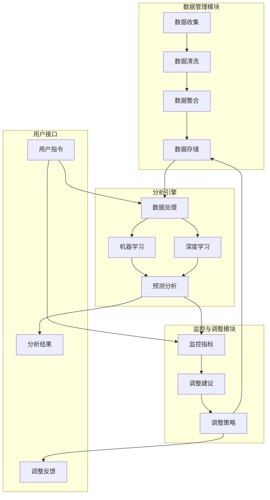

                 

### 文章标题

# AI驱动的企业战略执行监控与调整系统

> 关键词：AI驱动、企业战略、执行监控、调整系统、决策支持

> 摘要：本文详细探讨了AI在企业管理中的应用，特别是AI驱动的企业战略执行监控与调整系统。文章首先介绍了AI和企业战略的基本概念，随后阐述了AI在商业应用中的重要性。接着，文章深入分析了AI驱动的企业战略系统架构，包括数据管理、监控机制和调整策略。通过实际案例，本文展示了AI驱动系统在营销和供应链优化中的应用效果，最后提出了最佳实践和注意事项，为企业实现高效战略执行提供了有力支持。

### 引言

在当今数字化转型的浪潮中，人工智能（AI）正逐渐成为企业竞争的重要工具。AI不仅在数据处理和优化方面展现出强大的能力，还能够在企业战略执行过程中提供决策支持和实时调整。企业战略执行监控与调整系统作为一个关键环节，对于企业的长期发展具有重要意义。

本文旨在探讨AI驱动的企业战略执行监控与调整系统，帮助读者了解这一系统的核心概念、架构设计及应用实践。通过系统的讲解和案例分析，本文将揭示AI如何助力企业实现战略目标，提高运营效率，并在竞争激烈的市场环境中占据优势。

### 背景和核心概念

#### AI和企业战略概述

人工智能（Artificial Intelligence，简称AI）是一种模拟人类智能的技术，旨在使计算机系统具备感知、理解、学习和决策的能力。在商业环境中，AI的应用范围广泛，包括自然语言处理、图像识别、推荐系统、预测分析等。随着AI技术的不断进步，越来越多的企业开始将AI集成到其战略规划和运营管理中。

企业战略（Enterprise Strategy）是指企业在竞争激烈的市场环境中，为实现长期目标而制定的一系列计划和决策。企业战略的制定和执行是企业成功的关键，而AI技术的引入则为战略执行提供了新的可能性。AI在企业战略中的作用主要体现在以下几个方面：

1. **数据驱动决策**：AI能够处理海量数据，并通过机器学习和数据分析技术提取有价值的信息，为企业提供数据驱动的决策支持。
2. **优化业务流程**：AI可以帮助企业自动化繁琐的流程，提高工作效率，减少人为错误，从而优化业务流程。
3. **个性化客户体验**：通过AI技术，企业可以更好地了解客户需求，提供个性化的产品和服务，提升客户满意度。
4. **预测市场趋势**：AI的预测能力可以帮助企业提前识别市场变化，制定相应的战略调整。

#### 当前状态

当前，AI在企业战略中的应用已经取得了一定的进展。许多企业已经开始利用AI技术进行市场分析、客户关系管理、供应链优化等。例如，通过使用AI分析客户数据，企业可以更准确地了解客户需求，从而优化产品设计和营销策略。此外，AI还可以帮助企业预测市场需求，优化库存管理，降低成本。

然而，尽管AI在企业战略中具有巨大潜力，但其应用仍面临一些挑战。首先，AI技术的复杂性使得企业在实施过程中需要投入大量资源和时间。其次，AI系统的可靠性和安全性问题也值得关注。此外，企业在应用AI时需要平衡创新与风险管理，确保不会因过度依赖AI而导致战略失误。

#### 挑战和机会

AI驱动企业战略面临的挑战主要包括以下几个方面：

1. **技术挑战**：AI技术的发展速度很快，企业需要不断更新技术栈，以跟上技术发展的步伐。
2. **数据挑战**：有效的AI应用需要大量的高质量数据，但许多企业在数据收集和管理方面存在困难。
3. **人才挑战**：AI技术的应用需要具备专业知识和技能的人才，而目前企业在这方面的人才储备相对不足。

然而，挑战的同时也伴随着巨大的机会。通过有效地利用AI技术，企业可以在以下方面取得突破：

1. **提高决策效率**：AI可以帮助企业快速分析大量数据，提供实时决策支持，提高决策效率。
2. **优化运营流程**：AI可以自动化业务流程，提高工作效率，降低运营成本。
3. **创新商业模式**：AI技术可以为企业提供新的商业模式和业务机会，推动企业的创新发展。

#### 核心概念和理论框架

为了更好地理解AI在企业战略中的作用，我们需要了解一些核心概念和理论框架。

1. **机器学习**：机器学习是AI的核心技术之一，它通过训练模型来从数据中学习规律，并在未知数据上做出预测。常见的机器学习算法包括线性回归、决策树、支持向量机、神经网络等。

2. **深度学习**：深度学习是机器学习的一个分支，它通过多层神经网络来处理复杂数据。深度学习在图像识别、自然语言处理等领域取得了显著成果。

3. **神经网络**：神经网络是模拟人脑结构的计算模型，它通过神经元之间的连接和激活函数来实现数据的处理和预测。

4. **企业战略框架**：企业战略框架包括SWOT分析、PEST分析、平衡计分卡等工具，用于帮助企业制定和实施战略。

5. **AI驱动的企业战略框架**：AI驱动的企业战略框架将AI技术与传统企业战略工具相结合，通过数据驱动和智能化决策，实现企业战略的动态调整和优化。

通过上述核心概念和理论框架的介绍，我们可以更好地理解AI在企业战略中的应用场景和潜在价值。接下来，我们将进一步探讨AI驱动的企业战略系统架构和设计。

#### AI驱动的企业战略系统架构

在了解了AI和企业战略的基本概念后，接下来我们将探讨AI驱动的企业战略系统架构，包括其组成部分及其相互关系。

##### 系统架构概述

AI驱动的企业战略系统是一个复杂的体系，它由多个关键组件构成，这些组件相互协作，共同实现企业战略的制定、执行和调整。系统架构的核心组件包括数据管理模块、分析引擎、监控与调整模块和用户接口。

1. **数据管理模块**：数据管理模块负责数据的收集、存储、清洗和整合。它是系统的数据基础，确保系统具备高质量的数据输入，为后续的分析和决策提供支持。

2. **分析引擎**：分析引擎是系统的核心组件，它利用机器学习和深度学习算法对数据进行处理和分析，提取有价值的信息，并生成预测和推荐。

3. **监控与调整模块**：监控与调整模块负责实时监控企业战略的执行情况，并通过分析结果提出调整建议，确保企业战略的动态优化。

4. **用户接口**：用户接口是系统与用户之间的交互界面，它提供直观的操作体验，使用户能够方便地查看分析结果、调整策略和执行任务。

##### 组件之间的关系

各个组件之间通过数据流和指令流进行紧密协作，形成一个高效、动态的AI驱动的企业战略执行系统。

1. **数据流**：数据管理模块从企业内部和外部的数据源收集数据，经过清洗和整合后，传输给分析引擎。分析引擎对数据进行处理和分析，生成分析结果，这些结果再次传输给监控与调整模块。监控与调整模块根据分析结果提出调整建议，这些建议通过数据流返回到数据管理模块，以供后续的数据分析和处理。

2. **指令流**：用户通过用户接口提交战略目标和任务指令，这些指令传输到分析引擎和监控与调整模块。分析引擎根据指令生成分析模型和预测结果，监控与调整模块根据分析结果提出调整建议。调整建议通过用户接口反馈给用户，用户根据反馈进行调整。

##### 系统架构图

为了更直观地展示系统架构，我们使用Mermaid绘制了以下系统架构图：



通过这个架构图，我们可以清晰地看到各个组件之间的关系和数据流、指令流的传递过程。接下来，我们将进一步探讨数据管理模块、分析引擎、监控与调整模块和用户接口的详细设计和功能。

#### 数据管理模块

数据管理模块是AI驱动的企业战略系统的基础，其核心任务是从各种数据源收集数据，对数据进行清洗和整合，以便为后续的分析和处理提供高质量的数据输入。以下是数据管理模块的详细设计：

##### 数据收集

数据收集是数据管理模块的首要任务，数据来源包括企业内部的数据源（如ERP系统、CRM系统、财务系统等）和企业外部的数据源（如社交媒体、市场调研数据、行业报告等）。为了确保数据的全面性和准确性，系统需要设计一个灵活的数据采集框架，能够自动从各种数据源提取数据。

- **数据源接入**：通过API接口、数据抽取工具（如ETL工具）或网络爬虫等技术，系统可以自动从不同的数据源获取数据。
- **数据格式转换**：由于不同数据源的数据格式可能不同，系统需要设计一个数据格式转换模块，将不同格式的数据转换为统一的格式，以便进行后续处理。

##### 数据清洗

数据清洗是数据管理模块的重要环节，其主要任务是识别和纠正数据中的错误、缺失和不一致。清洗后的数据需要达到以下质量要求：

- **完整性**：确保数据完整，没有缺失值。
- **一致性**：确保数据格式和编码一致，避免因格式不一致导致的错误。
- **准确性**：确保数据的准确性，去除错误的记录。

数据清洗通常包括以下步骤：

- **缺失值处理**：对于缺失值，可以采用填充方法（如平均值填充、中值填充、前向填充、后向填充等）或删除方法（如删除含有缺失值的记录）。
- **异常值处理**：识别和处理异常值，避免异常值对分析结果的影响。
- **数据标准化**：对数据进行标准化处理，确保数据具有相同的尺度和范围。

##### 数据整合

数据整合是将来自不同数据源的数据进行合并和整合，以便进行统一的分析和处理。数据整合通常包括以下步骤：

- **数据匹配**：通过匹配字段（如客户ID、订单ID等），将来自不同数据源的数据进行匹配，确保数据的一致性。
- **数据融合**：将匹配后的数据进行融合，生成一个完整的数据集。
- **数据建模**：建立数据模型，以适应不同的分析需求。

##### 数据存储

数据存储是将清洗和整合后的数据存储在数据库中，以便后续的数据分析和处理。数据存储需要考虑以下因素：

- **存储容量**：根据企业的数据量规模，选择合适的数据库存储方案，确保数据的存储容量。
- **数据访问速度**：选择高效的数据库存储方案，确保数据访问速度。
- **数据安全**：确保数据的安全性，采取加密和备份等措施，防止数据泄露和丢失。

##### 功能设计与架构

数据管理模块的功能设计与架构如下：

- **数据采集**：设计一个自动化的数据采集系统，包括数据源接入和格式转换功能。
- **数据清洗**：设计一个数据清洗引擎，包括缺失值处理、异常值处理和数据标准化功能。
- **数据整合**：设计一个数据整合模块，包括数据匹配和数据融合功能。
- **数据存储**：设计一个高效的数据库存储系统，包括数据存储和数据访问功能。

使用Mermaid绘制的数据管理模块架构图如下：

```mermaid
graph TB

subgraph 数据采集
    D1[数据源接入]
    D2[格式转换]

    D1 --> D2
end

subgraph 数据清洗
    D3[缺失值处理]
    D4[异常值处理]
    D5[数据标准化]

    D3 --> D4
    D4 --> D5
end

subgraph 数据整合
    D6[数据匹配]
    D7[数据融合]

    D6 --> D7
end

subgraph 数据存储
    D8[数据存储]

    D7 --> D8
end

D2 --> D3
D5 --> D6
D8 --> [数据分析引擎]
```

通过上述设计，数据管理模块能够高效地完成数据的收集、清洗、整合和存储，为系统的后续分析提供可靠的数据支持。

#### 分析引擎

分析引擎是AI驱动的企业战略系统的核心组件，其主要任务是利用机器学习和深度学习算法对数据进行分析和预测，为企业战略提供决策支持。以下是分析引擎的详细设计和功能。

##### 数据处理

数据处理是分析引擎的第一步，其任务是准备数据以便进行模型训练和分析。数据处理主要包括以下步骤：

1. **数据预处理**：对数据进行清洗、归一化、编码等预处理操作，使其符合模型训练的要求。数据预处理有助于提高模型的训练效果和预测准确性。

2. **特征工程**：从原始数据中提取有用的特征，构造特征向量。特征工程是模型训练的重要环节，合理的特征工程可以显著提高模型的表现。

3. **数据分割**：将数据集分割为训练集、验证集和测试集，用于模型的训练、验证和测试。

##### 机器学习算法

机器学习算法是分析引擎的重要组成部分，用于从数据中学习模式和规律。常见的机器学习算法包括线性回归、逻辑回归、决策树、随机森林、支持向量机等。以下是这些算法的基本原理和应用场景：

1. **线性回归**：用于预测连续值输出，如销售额、股价等。线性回归通过建立自变量和因变量之间的线性关系模型，实现预测。
   - 数学模型：$y = \beta_0 + \beta_1x_1 + \beta_2x_2 + ... + \beta_nx_n$
   - 公式解释：$y$为预测值，$x_1, x_2, ..., x_n$为特征值，$\beta_0, \beta_1, ..., \beta_n$为模型参数。

2. **逻辑回归**：用于预测概率性二分类输出，如客户流失、信用评分等。逻辑回归通过逻辑函数将线性模型的输出转换为概率值。
   - 数学模型：$P(y=1) = \frac{1}{1 + e^{-(\beta_0 + \beta_1x_1 + \beta_2x_2 + ... + \beta_nx_n)}$
   - 公式解释：$P(y=1)$为因变量为1的概率，$x_1, x_2, ..., x_n$为特征值，$\beta_0, \beta_1, ..., \beta_n$为模型参数。

3. **决策树**：用于分类和回归任务，通过构建树状模型来预测输出。决策树通过一系列条件分支来分类或回归，具有良好的解释性和可操作性。
   - 算法原理：决策树通过递归划分特征空间，在每个节点选择最优特征进行划分，直到满足停止条件。

4. **随机森林**：基于决策树的集成学习方法，通过构建多个决策树模型并求平均值来提高预测准确性。随机森林通过随机选择特征和随机分割数据来减少过拟合。
   - 算法原理：随机森林通过随机森林算法训练多个决策树，并合并这些决策树的预测结果，实现更准确的预测。

5. **支持向量机**：用于分类和回归任务，通过最大化分类间隔来找到最佳决策边界。支持向量机通过求解最优化问题来找到最佳模型。
   - 数学模型：$max W = \frac{1}{2}||W||^2 - C\sum_{i=1}^{n} \xi_i$
   - 公式解释：$W$为模型参数，$C$为惩罚参数，$\xi_i$为松弛变量。

##### 深度学习算法

深度学习算法是分析引擎的另一个重要组成部分，用于处理复杂数据和构建深层次的模型。常见的深度学习算法包括卷积神经网络（CNN）、循环神经网络（RNN）和生成对抗网络（GAN）等。

1. **卷积神经网络（CNN）**：用于图像识别和分类任务，通过卷积层、池化层和全连接层来提取图像特征并进行分类。
   - 算法原理：CNN通过卷积操作提取图像的局部特征，通过池化操作降低特征维度，并通过全连接层进行分类。

2. **循环神经网络（RNN）**：用于序列数据建模，通过记忆机制来处理长序列数据。
   - 算法原理：RNN通过循环结构将当前时刻的输入与上一时刻的输出相连接，实现对序列数据的建模。

3. **生成对抗网络（GAN）**：用于生成复杂数据，通过生成器和判别器的对抗训练来实现数据的生成。
   - 算法原理：GAN通过生成器和判别器的对抗训练，生成器生成数据，判别器判断生成数据的真实程度，通过优化生成器和判别器的参数来提高生成质量。

##### 预测分析

预测分析是分析引擎的核心任务，通过训练模型对未来的数据进行分析和预测，为企业战略提供决策支持。预测分析主要包括以下步骤：

1. **模型训练**：利用训练数据集对模型进行训练，优化模型参数，使其达到最佳预测效果。

2. **模型评估**：利用验证集和测试集对模型进行评估，评估模型的预测准确性和可靠性。

3. **预测输出**：利用训练好的模型对未来的数据进行预测，生成预测结果，为企业战略提供数据支持。

##### 功能设计与架构

分析引擎的功能设计与架构如下：

- **数据处理模块**：负责数据预处理、特征工程和数据分割。
- **机器学习算法模块**：包括线性回归、逻辑回归、决策树、随机森林和支持向量机等算法。
- **深度学习算法模块**：包括卷积神经网络、循环神经网络和生成对抗网络等算法。
- **预测分析模块**：负责模型训练、模型评估和预测输出。

使用Mermaid绘制的分析引擎架构图如下：

```mermaid
graph TB

subgraph 数据处理模块
    D1[数据预处理]
    D2[特征工程]
    D3[数据分割]

    D1 --> D2
    D2 --> D3
end

subgraph 机器学习算法模块
    M1[线性回归]
    M2[逻辑回归]
    M3[决策树]
    M4[随机森林]
    M5[支持向量机]

    M1 --> M2
    M2 --> M3
    M3 --> M4
    M4 --> M5
end

subgraph 深度学习算法模块
    D1[CNN]
    D2[RNN]
    D3[GAN]

    D1 --> D2
    D2 --> D3
end

subgraph 预测分析模块
    P1[模型训练]
    P2[模型评估]
    P3[预测输出]

    P1 --> P2
    P2 --> P3
end

D3 --> P1
M5 --> P1
D2 --> P2
P3 --> [用户接口]
```

通过上述设计，分析引擎能够高效地处理数据、训练模型和进行预测分析，为企业战略提供数据驱动的决策支持。

#### 监控与调整模块

监控与调整模块是AI驱动的企业战略系统的关键组件，其主要任务是对企业战略执行过程进行实时监控，并根据监控结果提出调整建议，以实现企业战略的动态优化。以下是监控与调整模块的详细设计和功能。

##### 监控指标

监控指标是监控与调整模块的核心内容，用于衡量企业战略执行的效果。这些指标可以分为以下几类：

1. **业务指标**：反映企业业务运作的效果，如销售额、客户满意度、订单量等。
2. **运营指标**：反映企业运营效率，如生产周期、库存周转率、员工工作效率等。
3. **财务指标**：反映企业财务状况，如净利润、毛利率、资产负债率等。
4. **市场指标**：反映企业在市场中的表现，如市场份额、品牌认知度、竞争对手分析等。

监控指标的设计需要综合考虑企业的战略目标、业务特点和市场环境，确保指标能够全面、准确地反映企业战略执行的效果。

##### 调整策略

调整策略是监控与调整模块的另一个核心任务，其目的是根据监控结果提出相应的调整建议，以优化企业战略执行。调整策略可以分为以下几类：

1. **目标调整**：根据监控结果对企业的战略目标进行修正，使其更符合实际情况和市场变化。
2. **计划调整**：根据监控结果对企业的战略计划进行修订，包括资源分配、时间表和执行步骤等。
3. **行动调整**：根据监控结果对企业的实际行动进行微调，确保战略执行更加有效。
4. **风险调整**：根据监控结果识别潜在风险，并提出相应的风险控制措施。

调整策略的设计需要结合企业的实际情况，综合考虑监控指标的变化和外部环境的影响，以确保调整建议的可行性和有效性。

##### 功能设计与架构

监控与调整模块的功能设计与架构如下：

- **监控指标管理**：负责监控指标的定义、采集和更新。
- **调整策略生成**：负责根据监控结果生成调整建议。
- **调整执行跟踪**：负责跟踪调整建议的执行情况，确保调整措施得到有效落实。
- **反馈机制**：负责收集调整效果的反馈，用于不断优化监控与调整模块。

使用Mermaid绘制的监控与调整模块架构图如下：

```mermaid
graph TB

subgraph 监控指标管理
    M1[指标定义]
    M2[指标采集]
    M3[指标更新]

    M1 --> M2
    M2 --> M3
end

subgraph 调整策略生成
    A1[目标调整]
    A2[计划调整]
    A3[行动调整]
    A4[风险调整]

    A1 --> A2
    A2 --> A3
    A3 --> A4
end

subgraph 调整执行跟踪
    T1[调整建议执行]
    T2[调整效果反馈]

    T1 --> T2
end

subgraph 反馈机制
    F1[反馈收集]
    F2[反馈分析]
    F3[反馈优化]

    F1 --> F2
    F2 --> F3
end

M3 --> A1
A4 --> T1
T2 --> M1
F3 --> [用户接口]
```

通过上述设计，监控与调整模块能够实时监控企业战略执行情况，并根据监控结果提出调整建议，确保企业战略的动态优化和有效执行。

#### 用户接口

用户接口是AI驱动的企业战略系统的关键部分，它负责提供用户与系统之间的交互界面，使用户能够方便地查看系统分析结果、调整策略并执行相关任务。以下是用户接口的详细设计和功能。

##### 功能设计与架构

用户接口的功能设计与架构如下：

- **数据可视化**：提供丰富的数据可视化工具，使用户能够直观地查看数据和分析结果。
- **操作界面**：设计简洁直观的操作界面，使用户能够方便地进行数据上传、指标设置、策略调整等操作。
- **通知提醒**：提供实时通知功能，及时向用户推送重要信息和调整建议。
- **用户权限管理**：设计用户权限管理系统，确保用户只能访问和操作与其权限相关的功能。

使用Mermaid绘制的用户接口架构图如下：

```mermaid
graph TB

subgraph 数据可视化
    V1[数据图表]
    V2[交互报表]

    V1 --> V2
end

subgraph 操作界面
    O1[数据上传]
    O2[指标设置]
    O3[策略调整]

    O1 --> O2
    O2 --> O3
end

subgraph 通知提醒
    N1[实时通知]
    N2[消息推送]

    N1 --> N2
end

subgraph 用户权限管理
    U1[用户登录]
    U2[权限设置]
    U3[权限验证]

    U1 --> U2
    U2 --> U3
end

V2 --> O1
O3 --> [监控与调整模块]
N2 --> [用户]
U3 --> [用户]
```

通过上述设计，用户接口能够为用户提供高效、便捷的交互体验，确保用户能够方便地使用AI驱动的企业战略系统，实现战略的实时监控和动态调整。

#### 实际案例1：AI驱动的营销战略

在AI驱动的企业战略系统中，营销战略是一个重要的应用领域。通过AI技术的应用，企业可以更加精准地了解客户需求，优化营销策略，提高市场竞争力。以下是一个实际案例，展示了AI驱动的营销战略在提高客户满意度、提升销售额方面的成功经验。

##### 案例背景

某大型消费品公司（以下简称“公司”）面临着激烈的市场竞争。为了在市场中脱颖而出，公司决定引入AI技术，构建AI驱动的营销战略系统，以提高营销效果。公司的主要目标是通过AI技术实现以下目标：

1. **精准定位目标客户**：通过分析客户数据，了解客户需求和偏好，精准定位目标客户群体。
2. **优化营销策略**：根据客户数据和市场趋势，动态调整营销策略，提高营销活动的有效性。
3. **提升客户满意度**：通过个性化的营销服务，提高客户满意度，增加客户忠诚度。

##### AI驱动营销战略系统设计

为了实现上述目标，公司设计了一套AI驱动的营销战略系统，主要包括以下组成部分：

1. **数据管理模块**：从企业内部（如CRM系统、ERP系统）和外部（如社交媒体、市场调研数据）收集客户数据，包括客户基本信息、购买行为、兴趣爱好等。系统使用ETL工具将数据导入数据仓库，进行数据清洗、整合和存储。

2. **分析引擎模块**：利用机器学习和深度学习算法，对客户数据进行处理和分析。具体包括：
   - **客户细分**：通过聚类算法（如K-means、层次聚类）将客户划分为不同的群体，以便进行精准营销。
   - **需求预测**：使用时间序列分析（如ARIMA模型、LSTM神经网络）预测客户的未来需求，为库存管理和销售预测提供支持。
   - **行为分析**：利用自然语言处理（NLP）技术分析客户在社交媒体上的评论和反馈，了解客户对产品或服务的看法和态度。

3. **监控与调整模块**：实时监控营销活动的执行情况，通过分析结果提出调整建议。具体包括：
   - **效果评估**：根据营销活动的投放效果（如点击率、转化率等），评估营销活动的效果，并提出优化建议。
   - **预算调整**：根据营销活动的投入产出比，动态调整营销预算，确保资源的合理配置。

4. **用户接口模块**：为用户提供友好的操作界面，提供数据可视化工具和操作功能。用户可以通过界面查看分析结果、调整营销策略、执行营销活动。

##### 案例实施与效果

1. **数据收集与清洗**：公司通过API接口和爬虫技术，从多个数据源收集客户数据，包括客户基本信息、购买记录、社交媒体反馈等。然后使用数据清洗工具对数据进行分析、去重、填补缺失值，确保数据的质量。

2. **模型训练与预测**：公司使用机器学习和深度学习算法对清洗后的数据进行处理和分析。首先使用K-means算法将客户划分为不同的群体，然后使用LSTM神经网络进行需求预测，并利用NLP技术分析社交媒体反馈。通过这些分析，公司可以更好地了解客户的需求和偏好，为后续的营销活动提供数据支持。

3. **营销策略优化**：根据分析结果，公司动态调整营销策略。例如，针对不同客户群体，设计个性化的营销活动；根据需求预测结果，优化库存管理和销售预测；根据社交媒体反馈，调整产品设计和营销宣传。

4. **效果评估与反馈**：公司定期评估营销活动的效果，通过点击率、转化率等指标进行评估。根据评估结果，提出优化建议，并动态调整营销策略。同时，公司收集客户的反馈信息，通过NLP技术分析客户的意见和态度，进一步优化营销策略。

实施AI驱动的营销战略后，公司取得了显著的效果：

- **客户满意度提高**：通过个性化的营销服务，客户满意度得到显著提升，客户投诉率下降。
- **销售额增长**：通过精准的市场定位和有效的营销策略，公司的销售额稳步增长，市场份额提高。
- **营销效率提升**：通过自动化和智能化的营销活动管理，营销团队的工作效率得到显著提升。

##### 案例总结

通过实际案例的实施，公司验证了AI驱动的营销战略在提高客户满意度、提升销售额方面的有效性。以下是一些关键的经验和教训：

1. **数据质量至关重要**：高质量的客户数据是AI驱动营销战略的基础，数据清洗和整合是关键环节。
2. **灵活调整策略**：市场环境变化快速，营销策略需要灵活调整，以适应市场变化。
3. **用户反馈是优化的重要来源**：收集和分析用户的反馈信息，是优化营销策略的重要途径。
4. **持续迭代与优化**：AI驱动的营销战略是一个持续迭代和优化的过程，需要不断调整和改进。

通过上述案例，我们可以看到AI驱动的营销战略在提高企业竞争力方面的巨大潜力。未来，随着AI技术的进一步发展，企业有望在营销战略中实现更高的效率和创新。

#### 实际案例2：AI驱动的供应链优化

在AI驱动的企业战略系统中，供应链优化是一个重要的应用领域。通过AI技术的应用，企业可以更加精确地预测需求、优化库存管理、降低成本，从而提高供应链的效率和灵活性。以下是一个实际案例，展示了AI驱动的供应链优化在降低库存成本、提高供应链响应速度方面的成功经验。

##### 案例背景

某大型电子产品制造企业（以下简称“企业”）面临着市场需求波动大、库存成本高的挑战。为了提高供应链的效率和灵活性，企业决定引入AI技术，构建AI驱动的供应链优化系统，实现以下目标：

1. **需求预测**：通过AI技术，准确预测市场需求，减少库存过剩和缺货情况。
2. **库存管理**：优化库存配置，降低库存成本，提高库存周转率。
3. **供应链响应速度**：提高供应链的响应速度，缩短交货周期，提高客户满意度。

##### AI驱动的供应链优化系统设计

为了实现上述目标，企业设计了一套AI驱动的供应链优化系统，主要包括以下组成部分：

1. **数据管理模块**：从企业内部（如ERP系统、物流系统）和外部（如市场预测数据、供应商信息）收集相关数据，包括市场需求、库存水平、物流状态等。系统使用ETL工具将数据导入数据仓库，进行数据清洗、整合和存储。

2. **分析引擎模块**：利用机器学习和深度学习算法，对供应链数据进行处理和分析。具体包括：
   - **需求预测**：使用时间序列分析（如ARIMA模型、LSTM神经网络）预测市场需求，为企业决策提供数据支持。
   - **库存优化**：使用线性规划、混合整数规划等优化算法，根据需求预测和库存水平，优化库存配置，降低库存成本。
   - **物流优化**：使用优化算法（如遗传算法、蚁群算法）优化物流路径和运输计划，提高物流效率。

3. **监控与调整模块**：实时监控供应链的执行情况，通过分析结果提出调整建议。具体包括：
   - **库存监控**：根据库存水平和需求预测，实时监控库存情况，提出库存调整建议。
   - **需求调整**：根据市场反馈和实际需求，动态调整需求预测模型，提高预测准确性。
   - **物流调整**：根据物流状态和市场需求，实时调整物流计划，提高物流响应速度。

4. **用户接口模块**：为用户提供友好的操作界面，提供数据可视化工具和操作功能。用户可以通过界面查看分析结果、调整库存配置、优化物流计划。

##### 案例实施与效果

1. **数据收集与清洗**：企业通过API接口和爬虫技术，从多个数据源收集供应链数据，包括市场需求、库存水平、物流状态等。然后使用数据清洗工具对数据进行分析、去重、填补缺失值，确保数据的质量。

2. **模型训练与预测**：企业使用机器学习和深度学习算法对清洗后的数据进行处理和分析。首先使用LSTM神经网络进行需求预测，然后使用线性规划和遗传算法进行库存优化和物流优化。通过这些分析，企业可以更好地预测市场需求、优化库存配置和物流计划。

3. **供应链优化实施**：根据分析结果，企业动态调整供应链策略。例如，根据需求预测结果，优化生产计划和库存配置；根据物流优化结果，调整物流路径和运输计划；根据库存监控结果，提出库存调整建议。

4. **效果评估与反馈**：企业定期评估供应链优化效果，通过库存周转率、物流响应时间等指标进行评估。根据评估结果，提出优化建议，并动态调整供应链策略。同时，企业收集供应商和客户的反馈信息，通过NLP技术分析客户和供应商的意见和态度，进一步优化供应链管理。

实施AI驱动的供应链优化系统后，企业取得了显著的效果：

- **库存成本降低**：通过精准的需求预测和库存优化，企业的库存成本显著降低，库存周转率提高。
- **供应链响应速度提高**：通过优化物流路径和运输计划，企业的供应链响应速度显著提高，交货周期缩短。
- **客户满意度提升**：通过高效的供应链管理，企业的客户满意度得到显著提升，订单履行率提高。

##### 案例总结

通过实际案例的实施，企业验证了AI驱动的供应链优化在降低库存成本、提高供应链响应速度方面的有效性。以下是一些关键的经验和教训：

1. **数据驱动决策**：高质量的数据是AI驱动供应链优化系统的基石，数据收集、清洗和整合是关键环节。
2. **模型优化与调整**：市场需求和供应链环境不断变化，模型需要不断优化和调整，以适应市场变化。
3. **跨部门协作**：供应链优化涉及多个部门，需要跨部门协作，确保供应链策略的一致性和有效性。
4. **持续改进**：供应链优化是一个持续改进的过程，需要定期评估和优化，不断提高供应链效率和客户满意度。

通过上述案例，我们可以看到AI驱动的供应链优化在提高企业竞争力方面的巨大潜力。未来，随着AI技术的进一步发展，企业有望在供应链管理中实现更高的效率和灵活性。

#### 最佳实践

在实施AI驱动的企业战略执行监控与调整系统时，以下最佳实践可以帮助企业更好地利用AI技术，实现战略目标：

1. **数据质量保证**：确保数据的高质量和完整性，是AI驱动系统成功的关键。建立完善的数据管理体系，进行定期数据质量检查和清洗，提高数据的准确性和可靠性。

2. **灵活的调整策略**：市场环境变化快速，企业需要制定灵活的调整策略，以应对市场变化。建立动态的调整机制，实时监控市场数据和关键指标，及时调整战略目标和计划。

3. **用户参与与反馈**：用户的参与和反馈对于系统的优化至关重要。鼓励用户提供反馈，通过用户行为数据和反馈信息，不断改进系统功能和服务质量。

4. **持续迭代与优化**：AI驱动的系统是一个持续迭代和优化的过程。定期评估系统效果，收集用户反馈，不断改进系统模型和策略，提高系统的适应性和准确性。

5. **人才培养与引进**：AI驱动的系统需要具备专业技能的人才。企业应重视人才培养，通过培训、引进等方式，提升员工的技术能力和专业知识，确保系统能够有效运行。

6. **风险管理**：AI技术的应用伴随着一定的风险，企业需要建立完善的风险管理机制，确保AI系统的安全和合规。进行定期风险评估，制定相应的风险控制措施，降低系统运行风险。

#### 小结

AI驱动的企业战略执行监控与调整系统是企业实现战略目标的重要工具。通过AI技术的应用，企业可以实现对数据的深度挖掘和分析，提高决策效率和准确性，优化业务流程，提高运营效率。本文介绍了AI驱动的企业战略系统的核心概念、系统架构、实际案例和最佳实践，为企业实现高效战略执行提供了有力支持。随着AI技术的不断发展，我们有理由相信，AI驱动的企业战略执行系统将在未来发挥更加重要的作用。

#### 注意事项

1. **数据隐私和安全**：在实施AI驱动的企业战略执行监控与调整系统时，必须确保数据的安全和隐私。遵循相关数据保护法规，采取加密和访问控制措施，防止数据泄露和滥用。

2. **技术更新与维护**：AI技术发展迅速，企业需要定期更新和维护系统，以适应新的技术变化和市场需求。关注行业动态，引进新技术，确保系统的先进性和稳定性。

3. **人才培训与发展**：AI驱动的系统对人才的要求较高，企业应重视员工培训，提升员工的技术能力和专业知识。同时，建立人才激励机制，吸引和留住优秀人才。

4. **系统兼容性**：确保AI驱动的企业战略执行监控与调整系统能够与现有的业务系统和技术平台兼容，避免因系统不兼容导致的运营中断。

#### 拓展阅读

1. **《AI驱动的企业战略管理》**：介绍了AI技术在企业战略管理中的应用，包括数据驱动的决策支持、业务流程优化和智能供应链管理等。

2. **《人工智能：一种现代的方法》**：详细介绍了机器学习和深度学习的基本原理和应用，适合对AI技术有兴趣的读者阅读。

3. **《数据科学基础》**：讲解了数据科学的基本概念和技术，包括数据分析、数据可视化、数据挖掘等，有助于理解AI驱动系统的数据处理过程。

4. **《企业战略管理：理论与实践》**：提供了企业战略管理的全面理论框架和实践方法，帮助企业制定和实施有效的战略。

### 作者信息

**作者：AI天才研究院/AI Genius Institute & 禅与计算机程序设计艺术 /Zen And The Art of Computer Programming**

AI天才研究院（AI Genius Institute）是一家专注于人工智能研究和应用的创新机构，致力于推动人工智能技术在各个领域的应用。同时，作者还著有《禅与计算机程序设计艺术》（Zen And The Art of Computer Programming），该书深入探讨了计算机编程的哲学和艺术，对编程领域的专业人士具有深远的影响。通过本文，我们希望能为广大读者提供关于AI驱动的企业战略执行监控与调整系统的深入理解和实践指导。

