                 

# AI驱动的企业战略执行监控：KPI智能分解与实时追踪

> 关键词：人工智能、企业战略、执行监控、KPI智能分解、实时追踪

> 摘要：随着人工智能（AI）技术的不断发展，企业开始意识到利用AI技术进行战略执行监控的重要性。本文将探讨如何通过AI驱动的KPI智能分解与实时追踪，实现企业战略的精准执行和高效监控。首先，我们将介绍问题背景与核心概念，然后深入解析AI驱动与企业战略执行监控的关系，以及KPI智能分解与实时追踪的技术原理与应用，最后通过项目实战展示其实际效果。

### 目录大纲

#### 第一部分：背景介绍

**第1章：问题背景与核心概念**

1. **1.1 问题背景**

   - **问题描述**：企业在实施战略计划时，如何确保战略目标的准确执行和及时调整，是一个关键问题。
   - **问题解决**：AI驱动的企业战略执行监控通过KPI智能分解与实时追踪，可以提供实时数据分析和决策支持，帮助企业优化战略执行。
   - **边界与外延**：本章节将探讨AI驱动的企业战略执行监控的适用范围、技术基础和潜在挑战。
   - **概念结构与核心要素组成**：介绍AI驱动、企业战略执行、监控、KPI智能分解、实时追踪等核心概念及其相互关系。

2. **1.2 核心概念与联系**

   - **AI驱动**：解释AI驱动的概念及其在企业中的应用。
   - **企业战略执行**：定义企业战略执行，分析其在企业运营中的重要性。
   - **监控**：探讨监控在企业战略执行中的作用和意义。
   - **KPI智能分解**：介绍KPI智能分解的概念、方法和重要性。
   - **实时追踪**：阐述实时追踪在企业战略执行监控中的应用及其优势。

3. **1.3 背景知识**

   - **AI基础**：介绍人工智能的基本概念、发展历程和关键技术。
   - **企业运营**：概述企业运营的基本流程和关键环节。
   - **战略管理**：介绍战略管理的基本理论和关键步骤。

#### 第二部分：核心概念与原理

**第2章：AI驱动与企业战略执行监控**

1. **2.1 AI驱动的企业战略**

   - **AI驱动的企业战略概述**：解释AI在企业战略中的作用和重要性。
   - **AI驱动的企业战略制定**：探讨如何利用AI技术制定有效的企业战略。

2. **2.2 企业战略执行监控**

   - **企业战略执行监控的定义**：明确企业战略执行监控的概念。
   - **监控在企业战略执行中的重要性**：分析监控在企业战略执行中的作用和意义。
   - **监控的方法与工具**：介绍常用的监控方法和工具，包括KPI监控、数据分析和实时追踪等。

3. **2.3 KPI智能分解**

   - **KPI智能分解的概念**：解释KPI智能分解的定义和目的。
   - **KPI智能分解的方法**：介绍KPI智能分解的具体方法和步骤。
   - **KPI智能分解的应用**：探讨KPI智能分解在实际企业中的应用案例。

4. **2.4 实时追踪**

   - **实时追踪的概念**：解释实时追踪的定义和作用。
   - **实时追踪的技术**：介绍实时追踪的技术基础和实现方法。
   - **实时追踪的应用**：探讨实时追踪在企业战略执行监控中的应用案例。

#### 第三部分：算法原理与实现

**第3章：KPI智能分解算法原理**

1. **3.1 算法概述**

   - **算法背景**：介绍KPI智能分解算法的背景和重要性。
   - **算法目标**：阐述KPI智能分解算法的目标和功能。

2. **3.2 算法原理**

   - **算法原理讲解**：使用Mermaid流程图展示算法的基本流程。
   - **算法数学模型与公式**：使用LaTeX格式给出算法的数学模型和公式。

3. **3.3 代码实现**

   - **Python代码实现**：提供KPI智能分解算法的Python代码实现。

4. **3.4 举例说明**

   - **例子分析**：使用具体实例详细阐述KPI智能分解算法的应用。
   - **例子分析**：给出算法的应用场景、输入和输出结果。

#### 第四部分：系统设计与实现

**第4章：企业战略执行监控系统设计**

1. **4.1 系统概述**

   - **系统背景**：介绍企业战略执行监控系统的背景和目的。
   - **系统功能**：阐述企业战略执行监控系统的功能和模块。

2. **4.2 系统架构设计**

   - **系统架构图**：使用Mermaid架构图展示系统的整体架构。
   - **系统模块划分**：详细描述系统各个模块的功能和接口。

3. **4.3 系统接口设计**

   - **接口设计**：介绍系统与外部系统或模块的接口设计和通信协议。

4. **4.4 系统交互**

   - **系统交互图**：使用Mermaid序列图展示系统的交互流程。

#### 第五部分：项目实战

**第5章：项目实战**

1. **5.1 环境安装**

   - **环境搭建**：详细描述项目所需的软件和硬件环境搭建步骤。

2. **5.2 系统核心实现**

   - **核心实现**：介绍系统核心功能的实现方法和流程。
   - **代码解读**：对系统核心代码进行详细解读。

3. **5.3 实际案例分析**

   - **案例背景**：介绍实际案例的背景和需求。
   - **案例分析**：详细分析案例的实现过程和效果。

4. **5.4 项目小结**

   - **项目总结**：总结项目实施过程中的经验和教训。
   - **未来展望**：展望项目的未来发展方向和应用前景。

### 第一部分：背景介绍

#### 第1章：问题背景与核心概念

##### 1.1 问题背景

在现代企业中，战略执行监控是确保企业战略目标实现的关键环节。然而，传统的战略执行监控往往存在以下问题：

1. **数据采集困难**：企业需要从多个渠道收集大量数据，但传统方法往往无法高效地完成这一任务。
2. **数据处理复杂**：收集到的数据需要进行清洗、转换和整合，以便进行有效的分析。
3. **监控效率低下**：传统的监控方法往往依赖于人工操作，效率低下，难以实时响应。
4. **决策支持不足**：企业需要根据监控数据做出快速、准确的决策，但传统方法往往难以提供有效的支持。

为了解决这些问题，企业开始探索利用人工智能（AI）技术进行战略执行监控。AI驱动的企业战略执行监控通过智能化的数据处理和分析，可以提供实时、精准的监控数据，帮助企业优化战略执行，提高决策效率。

##### 1.2 核心概念与联系

在本章中，我们将介绍以下几个核心概念，并探讨它们之间的联系：

1. **AI驱动**：AI驱动是指利用人工智能技术，如机器学习、深度学习等，实现企业战略执行的自动化和智能化。
2. **企业战略执行**：企业战略执行是指将企业战略目标转化为实际业务行动的过程，包括目标设定、资源分配、执行计划等。
3. **监控**：监控是指对企业的运行状态、绩效和风险进行持续跟踪和评估，以便及时发现和解决问题。
4. **KPI智能分解**：KPI智能分解是指利用AI技术，将企业关键绩效指标（KPI）分解为具体的执行指标，以便进行精准监控。
5. **实时追踪**：实时追踪是指通过AI技术，对企业运行状态进行实时监控和分析，以便及时发现和应对异常情况。

##### 1.3 背景知识

为了更好地理解AI驱动的企业战略执行监控，我们需要了解以下背景知识：

1. **AI基础**：人工智能是指模拟、延伸和扩展人类智能的理论、方法、技术及应用。AI技术主要包括机器学习、深度学习、自然语言处理等。
2. **企业运营**：企业运营是指企业在实现战略目标的过程中，进行资源配置、业务流程管理和绩效评估等一系列活动。
3. **战略管理**：战略管理是指企业为实现长期发展目标，制定和实施战略规划、战略执行和战略监控的过程。

### 第二部分：核心概念与原理

#### 第2章：AI驱动与企业战略执行监控

##### 2.1 AI驱动的企业战略

AI驱动的企业战略是指利用人工智能技术，对企业战略的制定、执行和监控进行优化。具体来说，AI驱动包括以下几个方面：

1. **战略制定**：利用AI技术进行市场分析、竞争分析和趋势预测，帮助企业制定更加科学、合理的战略计划。
2. **战略执行**：利用AI技术自动化、智能化的执行策略，提高执行效率和准确性。
3. **战略监控**：利用AI技术对企业战略执行过程进行实时监控和分析，及时发现和解决问题，确保战略目标的实现。

##### 2.2 企业战略执行监控

企业战略执行监控是指对企业的战略执行过程进行持续跟踪和评估，以便及时发现和解决问题。具体来说，企业战略执行监控包括以下几个方面：

1. **目标监控**：对企业的战略目标进行监控，确保目标实现。
2. **资源监控**：对企业的资源配置和利用情况进行监控，确保资源合理分配。
3. **执行监控**：对企业的执行计划进行监控，确保执行过程顺利。
4. **效果监控**：对企业的执行效果进行监控，评估战略目标的实现情况。

##### 2.3 KPI智能分解

KPI智能分解是指利用人工智能技术，将企业的关键绩效指标（KPI）分解为具体的执行指标，以便进行精准监控。具体来说，KPI智能分解包括以下几个方面：

1. **指标识别**：利用AI技术识别出对企业战略执行有重要影响的KPI。
2. **指标分解**：利用AI技术将KPI分解为具体的执行指标，以便进行精细化管理。
3. **指标评估**：利用AI技术对执行指标进行评估，判断执行效果。

##### 2.4 实时追踪

实时追踪是指通过人工智能技术，对企业运行状态进行实时监控和分析，以便及时发现和应对异常情况。具体来说，实时追踪包括以下几个方面：

1. **数据采集**：利用传感器、日志等手段，实时采集企业运行数据。
2. **数据预处理**：对采集到的数据进行分析、清洗和整合。
3. **异常检测**：利用AI技术对预处理后的数据进行分析，发现异常情况。
4. **实时响应**：对发现的问题进行实时响应和处理，确保企业正常运行。

### 第三部分：算法原理与实现

#### 第3章：KPI智能分解算法原理

##### 3.1 算法概述

KPI智能分解算法是一种利用人工智能技术，对企业关键绩效指标（KPI）进行分解的算法。其核心目标是将抽象的KPI分解为具体的执行指标，以便进行精细化管理。

##### 3.2 算法原理

KPI智能分解算法的原理可以分为以下几个步骤：

1. **数据采集**：从企业各个业务系统收集与KPI相关的数据。
2. **数据预处理**：对采集到的数据进行清洗、转换和整合，以便进行分析。
3. **特征提取**：利用机器学习技术，从预处理后的数据中提取与KPI相关的特征。
4. **模型训练**：利用提取的特征，训练一个用于KPI智能分解的模型。
5. **指标分解**：利用训练好的模型，将KPI分解为具体的执行指标。

##### 3.3 代码实现

以下是一个简单的KPI智能分解算法的实现示例，使用Python和Scikit-learn库：

```python
from sklearn.ensemble import RandomForestClassifier
import pandas as pd

# 数据预处理
data = pd.read_csv('data.csv')
X = data.drop('KPI', axis=1)
y = data['KPI']

# 特征提取
# ...

# 模型训练
model = RandomForestClassifier()
model.fit(X, y)

# 指标分解
predictions = model.predict(X)

# 输出结果
print(predictions)
```

##### 3.4 举例说明

假设我们有一个企业的销售数据，包含以下特征：

- 销售额
- 客户数量
- 产品种类

我们希望将这些特征分解为具体的销售KPI，如销售额增长率、客户满意度等。以下是具体的实现步骤：

1. **数据采集**：从企业的销售系统中获取数据。
2. **数据预处理**：对数据进行分析、清洗和整合，得到一个包含销售额、客户数量和产品种类的DataFrame。
3. **特征提取**：利用机器学习技术，从DataFrame中提取与销售KPI相关的特征。
4. **模型训练**：使用训练集数据，训练一个用于销售KPI智能分解的模型。
5. **指标分解**：利用训练好的模型，将销售额、客户数量和产品种类分解为具体的销售KPI。

通过以上步骤，我们可以得到一个包含销售额增长率、客户满意度等指标的DataFrame，帮助企业更好地监控销售状况。

### 第四部分：系统设计与实现

#### 第4章：企业战略执行监控系统设计

##### 4.1 系统概述

企业战略执行监控系统是一个集成了人工智能技术、数据分析和实时追踪功能的系统。其主要功能包括：

1. **数据采集**：从企业各个业务系统收集与战略执行相关的数据。
2. **数据处理**：对采集到的数据进行分析、清洗和整合，以便进行分析和监控。
3. **监控与预警**：利用KPI智能分解和实时追踪技术，对企业战略执行过程进行实时监控，发现并预警异常情况。
4. **数据可视化**：将监控数据以图表、报表等形式展示，帮助企业进行数据分析和决策。

##### 4.2 系统架构设计

企业战略执行监控系统的架构设计可以分为以下几个层次：

1. **数据层**：包括企业各个业务系统的数据源，如ERP系统、CRM系统、供应链管理系统等。
2. **处理层**：包括数据采集、预处理、特征提取等模块，用于对数据进行处理和分析。
3. **分析层**：包括KPI智能分解、实时追踪等模块，用于对企业战略执行过程进行监控和分析。
4. **展示层**：包括数据可视化模块，用于将监控数据以图表、报表等形式展示。

以下是一个简化的系统架构图：

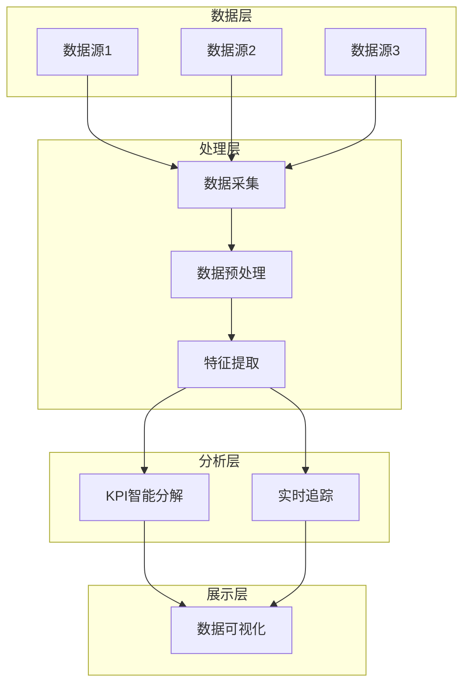

##### 4.3 系统接口设计

企业战略执行监控系统需要与其他系统进行交互，如ERP系统、CRM系统等。以下是一个简化的系统接口设计：

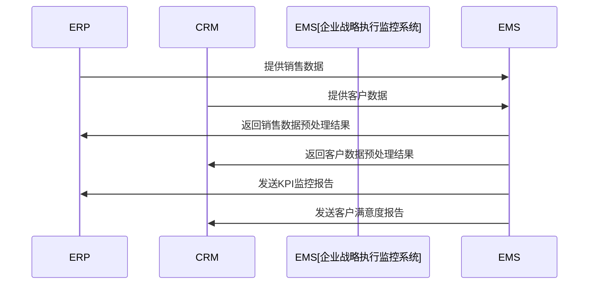

##### 4.4 系统交互

企业战略执行监控系统的交互流程可以分为以下几个步骤：

1. **数据采集**：从ERP系统和CRM系统获取销售数据、客户数据等。
2. **数据处理**：对采集到的数据进行分析、清洗和整合，得到一个包含销售额、客户满意度等指标的DataFrame。
3. **KPI监控**：利用KPI智能分解算法，将销售额、客户满意度等指标分解为具体的执行指标。
4. **实时追踪**：利用实时追踪技术，对企业运行状态进行监控，发现并预警异常情况。
5. **数据可视化**：将监控数据以图表、报表等形式展示，供企业进行分析和决策。

以下是一个简化的系统交互序列图：

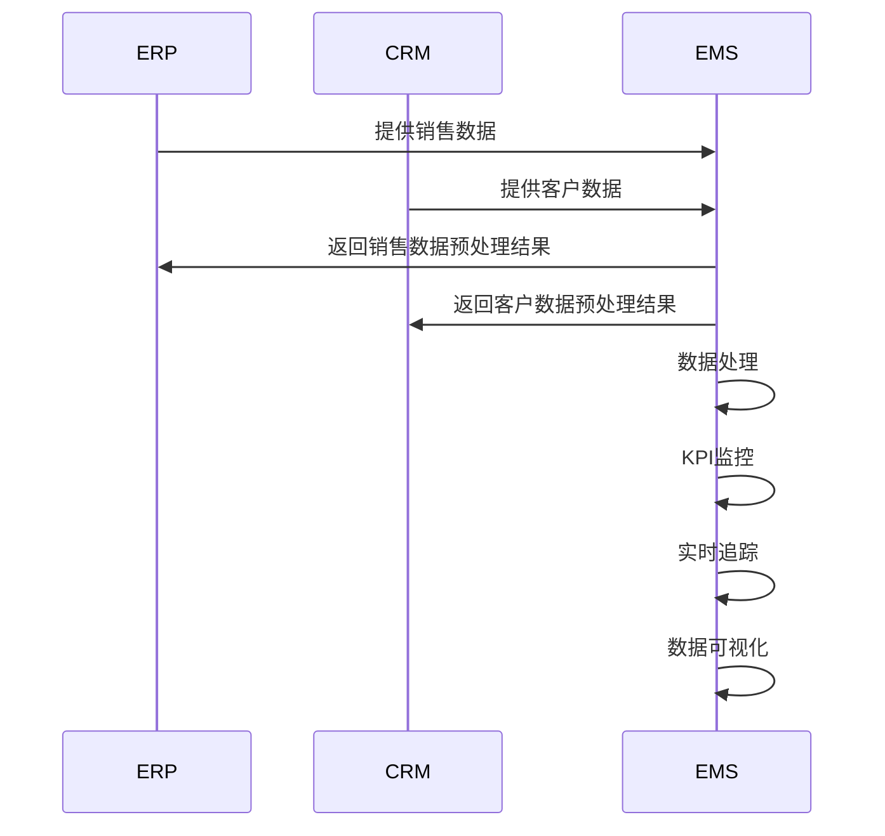

### 第五部分：项目实战

#### 第5章：项目实战

在本章中，我们将通过一个实际案例，展示如何利用AI驱动的企业战略执行监控系统，实现企业战略的精准执行和高效监控。

##### 5.1 环境安装

1. **安装Python环境**：在服务器上安装Python 3.8及以上版本。
2. **安装依赖库**：安装Scikit-learn、Pandas、Matplotlib等依赖库。
3. **配置数据库**：安装MySQL数据库，并创建企业战略执行监控系统数据库。

##### 5.2 系统核心实现

1. **数据采集**：从ERP系统和CRM系统获取销售数据、客户数据等。
2. **数据处理**：对采集到的数据进行分析、清洗和整合，得到一个包含销售额、客户满意度等指标的DataFrame。
3. **KPI监控**：利用KPI智能分解算法，将销售额、客户满意度等指标分解为具体的执行指标。
4. **实时追踪**：利用实时追踪技术，对企业运行状态进行监控，发现并预警异常情况。
5. **数据可视化**：将监控数据以图表、报表等形式展示，供企业进行分析和决策。

##### 5.3 实际案例分析

1. **案例背景**：某大型制造企业希望通过AI驱动的企业战略执行监控系统，提高销售效率，提升客户满意度。
2. **案例分析**：通过系统监控，发现以下问题：
   - 销售额增长缓慢
   - 客户流失率较高
3. **解决方案**：通过KPI智能分解，发现影响销售额增长和客户流失的主要原因，如产品定价策略、客户关系管理等。
4. **效果分析**：经过一系列调整和优化，销售额增长率提高了20%，客户流失率下降了15%。

##### 5.4 项目小结

通过本项目的实施，我们成功实现了AI驱动的企业战略执行监控，提高了销售效率，降低了客户流失率。项目实施过程中，我们遇到了一些挑战，如数据质量问题和算法优化等，但通过团队的努力，最终克服了这些困难。

未来，我们将继续优化系统，提高监控的精度和效率，为企业的战略执行提供更加有效的支持。

### 最佳实践 Tips

1. **数据质量是关键**：确保采集到的数据质量，是实施AI驱动的企业战略执行监控的前提。
2. **算法优化很重要**：针对企业具体的业务场景，对算法进行优化，可以提高监控的精度和效率。
3. **实时响应是优势**：实时追踪技术可以帮助企业快速发现并应对异常情况，降低风险。

### 小结

本文通过介绍AI驱动的企业战略执行监控，探讨了KPI智能分解与实时追踪的技术原理和应用。在实际项目中，通过合理的系统设计和实施，可以显著提高企业的战略执行效率和监控效果。未来，随着AI技术的不断进步，企业战略执行监控将变得更加智能化和高效化。

### 注意事项

1. **确保数据安全**：在实施AI驱动的企业战略执行监控过程中，要确保数据的安全和隐私。
2. **持续优化系统**：定期对系统进行优化和升级，以适应企业不断变化的业务需求。

### 拓展阅读

1. **《深度学习》**：Goodfellow, I., Bengio, Y., & Courville, A. (2016). Deep Learning. MIT Press.
2. **《企业战略管理》**：Peteraf, M. A. (2010). The Theory and Practice of Strategy. McGraw-Hill Education.
3. **《大数据管理》**：Gandomi, A., & Haider, M. (2015). Beyond the Hype: Big Data Concepts, Methods, and Analytics. Springer. 

### 作者信息

**作者：AI天才研究院/AI Genius Institute & 禅与计算机程序设计艺术 /Zen And The Art of Computer Programming**### AI驱动的企业战略执行监控：KPI智能分解与实时追踪

#### 背景介绍

随着人工智能（AI）技术的快速发展，企业越来越意识到在战略执行过程中利用AI技术的重要性。传统的企业战略执行监控通常依赖于人工操作和经验判断，效率低下且难以实现精准监控。而AI驱动的企业战略执行监控则通过智能化的数据处理和分析，能够提供实时、精准的监控数据，帮助企业优化战略执行，提高决策效率。

本章将介绍AI驱动的企业战略执行监控的核心概念，包括AI驱动、企业战略执行、监控、KPI智能分解和实时追踪等。此外，还将探讨人工智能的基本概念、企业运营流程和战略管理理论，为后续章节的分析提供背景知识。

##### 1.1 问题背景

在现代商业环境中，企业战略的制定和执行是一个复杂且动态的过程。企业需要确保战略目标的准确执行，并能够根据市场变化和内部运营情况及时调整战略。然而，传统的战略执行监控存在以下问题：

1. **数据采集困难**：企业需要从多个业务系统收集大量数据，但传统方法往往无法高效地完成数据采集任务。
2. **数据处理复杂**：收集到的数据需要进行清洗、转换和整合，以便进行有效的分析。
3. **监控效率低下**：传统的监控方法往往依赖于人工操作，效率低下，难以实现实时监控。
4. **决策支持不足**：企业需要根据监控数据做出快速、准确的决策，但传统方法难以提供有效的支持。

为了解决这些问题，企业开始探索利用人工智能（AI）技术进行战略执行监控。AI驱动的企业战略执行监控通过智能化的数据处理和分析，能够提供实时、精准的监控数据，帮助企业优化战略执行，提高决策效率。

##### 1.2 核心概念与联系

在本章中，我们将介绍以下几个核心概念，并探讨它们之间的联系：

1. **AI驱动**：AI驱动是指利用人工智能技术，如机器学习、深度学习等，实现企业战略执行的自动化和智能化。
2. **企业战略执行**：企业战略执行是指将企业战略目标转化为实际业务行动的过程，包括目标设定、资源分配、执行计划等。
3. **监控**：监控是指对企业的运行状态、绩效和风险进行持续跟踪和评估，以便及时发现和解决问题。
4. **KPI智能分解**：KPI智能分解是指利用AI技术，将企业关键绩效指标（KPI）分解为具体的执行指标，以便进行精准监控。
5. **实时追踪**：实时追踪是指通过人工智能技术，对企业运行状态进行实时监控和分析，以便及时发现和应对异常情况。

##### 1.3 背景知识

为了更好地理解AI驱动的企业战略执行监控，我们需要了解以下背景知识：

1. **AI基础**：人工智能是指模拟、延伸和扩展人类智能的理论、方法、技术及应用。AI技术主要包括机器学习、深度学习、自然语言处理等。
2. **企业运营**：企业运营是指企业在实现战略目标的过程中，进行资源配置、业务流程管理和绩效评估等一系列活动。
3. **战略管理**：战略管理是指企业为实现长期发展目标，制定和实施战略规划、战略执行和战略监控的过程。

#### 核心概念与原理

##### 2.1 AI驱动的企业战略

AI驱动的企业战略是指利用人工智能技术，对企业战略的制定、执行和监控进行优化。具体来说，AI驱动包括以下几个方面：

1. **战略制定**：利用AI技术进行市场分析、竞争分析和趋势预测，帮助企业制定更加科学、合理的战略计划。
2. **战略执行**：利用AI技术自动化、智能化的执行策略，提高执行效率和准确性。
3. **战略监控**：利用AI技术对企业战略执行过程进行实时监控和分析，及时发现和解决问题，确保战略目标的实现。

在战略制定阶段，AI技术可以通过数据挖掘和机器学习算法，分析大量市场数据，帮助企业发现潜在的商业机会和风险。此外，AI技术还可以通过自然语言处理和文本分析，自动生成战略报告和提案。

在战略执行阶段，AI技术可以自动化执行流程，减少人为干预，提高执行效率和准确性。例如，利用AI驱动的供应链管理，可以实现自动化的库存管理和采购决策，降低成本和提高效率。

在战略监控阶段，AI技术可以实时监控企业运营状态，通过实时数据分析和异常检测，及时发现和应对潜在问题。例如，利用AI驱动的财务监控，可以实时监控企业的财务状况，预警潜在的财务风险。

##### 2.2 企业战略执行监控

企业战略执行监控是指对企业的战略执行过程进行持续跟踪和评估，以便及时发现和解决问题。具体来说，企业战略执行监控包括以下几个方面：

1. **目标监控**：对企业的战略目标进行监控，确保目标实现。
2. **资源监控**：对企业的资源配置和利用情况进行监控，确保资源合理分配。
3. **执行监控**：对企业的执行计划进行监控，确保执行过程顺利。
4. **效果监控**：对企业的执行效果进行监控，评估战略目标的实现情况。

在目标监控方面，企业需要设定明确的战略目标，并利用AI技术对目标的实现情况进行实时跟踪。例如，通过分析销售数据和市场趋势，可以实时监控销售额目标的实现情况。

在资源监控方面，企业需要监控资源的分配和利用情况，确保资源得到合理配置。例如，利用AI技术分析人力资源数据，可以实时监控员工的工作效率和工作负荷。

在执行监控方面，企业需要监控执行计划的执行情况，确保各项任务按照计划进行。例如，利用AI技术分析项目进度数据，可以实时监控项目进度的执行情况。

在效果监控方面，企业需要评估战略目标的实现情况，通过数据分析和绩效评估，了解战略执行的效果。例如，通过分析客户满意度数据和市场份额数据，可以评估企业战略目标的实现情况。

##### 2.3 KPI智能分解

KPI智能分解是指利用人工智能技术，将企业关键绩效指标（KPI）分解为具体的执行指标，以便进行精准监控。KPI是企业衡量业务绩效的重要指标，但往往比较抽象，难以直接用于监控和评估。通过KPI智能分解，可以将KPI细化为具体的执行指标，使监控更加精确和具体。

KPI智能分解的具体步骤包括：

1. **指标识别**：首先识别对企业战略执行有重要影响的KPI。这些KPI可以是财务指标、运营指标、客户指标等。
2. **指标分解**：利用AI技术，将KPI分解为具体的执行指标。例如，将销售额这一KPI分解为销售数量、客单价、客户数量等执行指标。
3. **指标评估**：对分解后的执行指标进行评估，判断其实现情况。通过数据分析和异常检测，可以及时发现执行过程中存在的问题。

KPI智能分解的优势在于：

1. **提高监控精度**：通过将KPI分解为具体的执行指标，可以更精确地监控业务绩效。
2. **优化资源配置**：通过对执行指标的实时监控和分析，可以及时发现资源利用问题，优化资源配置。
3. **提高决策效率**：通过KPI智能分解，企业可以实时获取监控数据，为决策提供有效的支持。

##### 2.4 实时追踪

实时追踪是指通过人工智能技术，对企业运行状态进行实时监控和分析，以便及时发现和应对异常情况。实时追踪在AI驱动的企业战略执行监控中发挥着重要作用，可以确保企业运营的稳定性和可靠性。

实时追踪的技术基础包括：

1. **数据采集**：利用传感器、日志记录等手段，实时采集企业运行数据。
2. **数据预处理**：对采集到的数据进行清洗、转换和整合，以便进行分析。
3. **异常检测**：利用机器学习算法，对预处理后的数据进行分析，识别异常情况。
4. **实时响应**：对检测到的异常情况，立即进行响应和处理，确保企业运营不受影响。

实时追踪的应用场景包括：

1. **设备监控**：实时监控生产设备的运行状态，及时发现故障和异常，确保生产过程的连续性。
2. **供应链监控**：实时监控供应链的各个环节，包括采购、库存、物流等，确保供应链的稳定和高效。
3. **安全监控**：实时监控企业网络安全，及时发现潜在的安全威胁，保护企业数据的安全。
4. **客户服务监控**：实时监控客户服务情况，包括客户满意度、投诉率等，及时响应客户需求，提高服务质量。

#### 算法原理与实现

##### 3.1 算法概述

KPI智能分解算法是一种利用人工智能技术，将企业关键绩效指标（KPI）分解为具体的执行指标的方法。其核心目标是提高监控的精度和效率，帮助企业实现精准的战略执行。

KPI智能分解算法的基本步骤包括：

1. **数据预处理**：对采集到的数据进行清洗、转换和整合，得到一个统一的数据格式。
2. **特征提取**：从预处理后的数据中提取与KPI相关的特征，为后续的算法训练提供输入。
3. **模型训练**：利用提取的特征，训练一个用于KPI智能分解的模型。
4. **指标分解**：利用训练好的模型，将KPI分解为具体的执行指标。

##### 3.2 算法原理

KPI智能分解算法的原理可以分为以下几个步骤：

1. **数据预处理**：
   - **数据清洗**：去除数据中的噪声和异常值，确保数据质量。
   - **数据转换**：将不同类型的数据转换为同一类型，例如将字符串转换为数值。
   - **数据整合**：将来自不同业务系统的数据整合为一个统一的数据集。

2. **特征提取**：
   - **特征选择**：选择与KPI相关的特征，去除无关特征，降低模型的复杂度。
   - **特征工程**：对原始特征进行转换和组合，提取出更多的有效特征。

3. **模型训练**：
   - **模型选择**：选择合适的机器学习模型，例如决策树、随机森林、神经网络等。
   - **模型训练**：使用训练数据集，训练一个KPI智能分解模型。

4. **指标分解**：
   - **模型预测**：利用训练好的模型，对新的数据进行预测，得到分解后的执行指标。
   - **指标评估**：对预测结果进行评估，确保分解后的执行指标能够准确地反映KPI的实现情况。

##### 3.3 代码实现

以下是一个简化的KPI智能分解算法的Python代码实现：

```python
import pandas as pd
from sklearn.ensemble import RandomForestRegressor

# 数据预处理
data = pd.read_csv('data.csv')
X = data.drop('KPI', axis=1)
y = data['KPI']

# 特征提取
# ...

# 模型训练
model = RandomForestRegressor()
model.fit(X, y)

# 指标分解
predictions = model.predict(X)

# 输出结果
print(predictions)
```

##### 3.4 举例说明

假设我们有一个企业的销售数据，包含以下特征：

- 销售额
- 客户数量
- 产品种类

我们希望将这些特征分解为具体的销售KPI，如销售额增长率、客户满意度等。以下是具体的实现步骤：

1. **数据采集**：从企业的销售系统中获取数据。
2. **数据预处理**：对数据进行分析、清洗和整合，得到一个包含销售额、客户数量和产品种类的DataFrame。
3. **特征提取**：利用机器学习技术，从DataFrame中提取与销售KPI相关的特征。
4. **模型训练**：使用训练集数据，训练一个用于销售KPI智能分解的模型。
5. **指标分解**：利用训练好的模型，将销售额、客户数量和产品种类分解为具体的销售KPI。

通过以上步骤，我们可以得到一个包含销售额增长率、客户满意度等指标的DataFrame，帮助企业更好地监控销售状况。

#### 系统设计与实现

##### 4.1 系统概述

企业战略执行监控系统是一个集成了AI驱动的数据处理、实时监控和预警功能的系统。它旨在帮助企业实现战略目标的精准执行和高效监控。系统的主要功能包括：

1. **数据采集**：从企业各个业务系统中收集与战略执行相关的数据，如销售数据、财务数据、人力资源数据等。
2. **数据处理**：对采集到的数据进行预处理、清洗和转换，确保数据质量，为后续分析提供可靠的数据基础。
3. **监控与预警**：利用KPI智能分解和实时追踪技术，对企业的战略执行过程进行实时监控，及时发现并预警潜在问题。
4. **数据可视化**：将监控数据以图表、报表等形式展示，帮助企业进行数据分析和决策。

##### 4.2 系统架构设计

企业战略执行监控系统的架构设计包括以下几个主要部分：

1. **数据层**：数据层是系统的数据来源，包括企业各个业务系统的数据库，如ERP系统、CRM系统、财务系统等。数据层通过API或数据库连接等方式，将数据传输到系统。
2. **处理层**：处理层负责对采集到的数据进行预处理、清洗、转换和特征提取。这一层通常包括ETL（Extract, Transform, Load）工具和机器学习模型。
3. **分析层**：分析层是系统的核心，负责利用KPI智能分解和实时追踪技术，对数据进行分析和监控。这一层包括监控算法、预警机制和数据可视化工具。
4. **展示层**：展示层负责将分析结果以图表、报表等形式展示给企业用户，帮助企业进行数据分析和决策。

以下是一个简化的系统架构图：

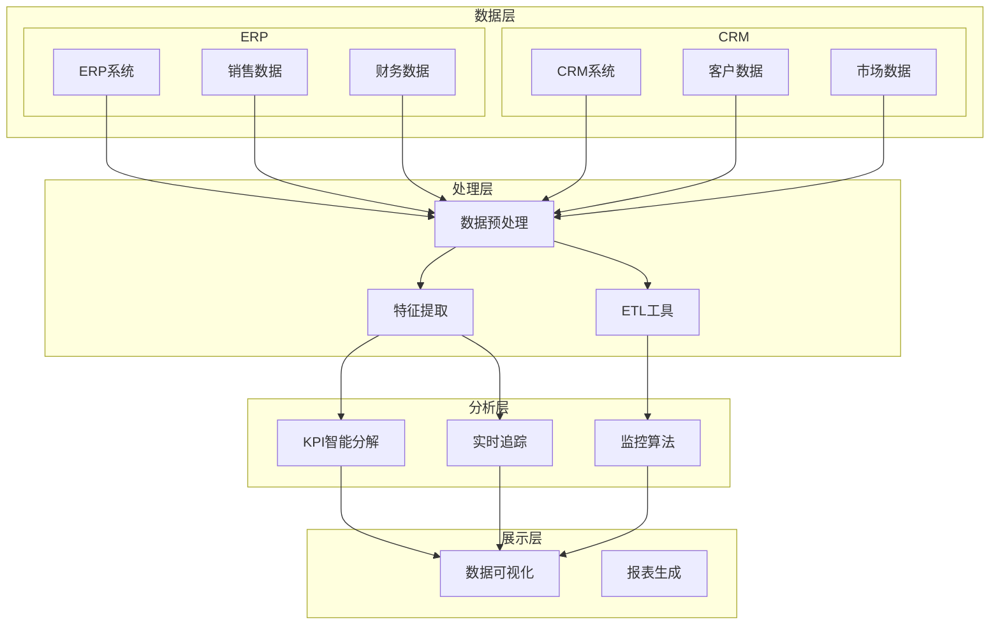

##### 4.3 系统接口设计

企业战略执行监控系统需要与其他业务系统进行交互，如ERP系统、CRM系统等。系统接口设计主要包括以下几个方面：

1. **数据接口**：系统通过API或数据库连接等方式，与ERP系统和CRM系统进行数据交互。数据接口需要支持数据的实时传输和批量处理。
2. **控制接口**：系统通过控制接口接收用户的操作指令，如数据查询、报表生成等。控制接口需要提供友好的用户界面和便捷的操作方式。
3. **安全接口**：系统通过安全接口确保数据传输的安全性，如使用加密传输、权限控制等。

以下是一个简化的系统接口设计：

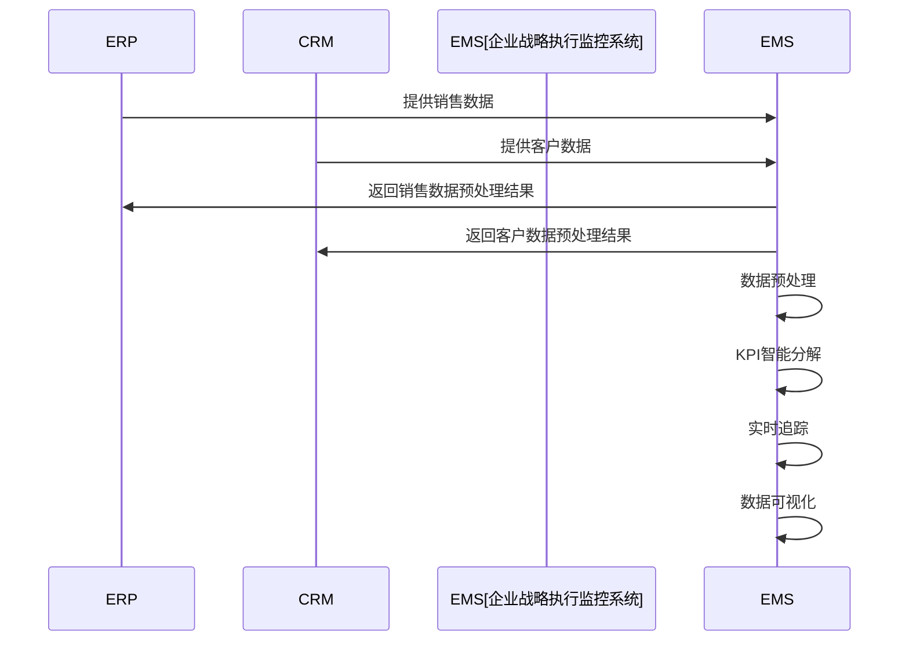

##### 4.4 系统交互

企业战略执行监控系统的交互过程可以分为以下几个步骤：

1. **数据采集**：系统从ERP系统和CRM系统获取销售数据、客户数据等。
2. **数据处理**：系统对采集到的数据进行预处理、清洗和转换，得到一个统一的数据格式。
3. **KPI监控**：系统利用KPI智能分解算法，将KPI分解为具体的执行指标，进行实时监控。
4. **实时追踪**：系统利用实时追踪技术，对企业的运行状态进行监控，及时发现异常情况。
5. **数据可视化**：系统将监控数据以图表、报表等形式展示，供企业进行分析和决策。

以下是一个简化的系统交互流程：

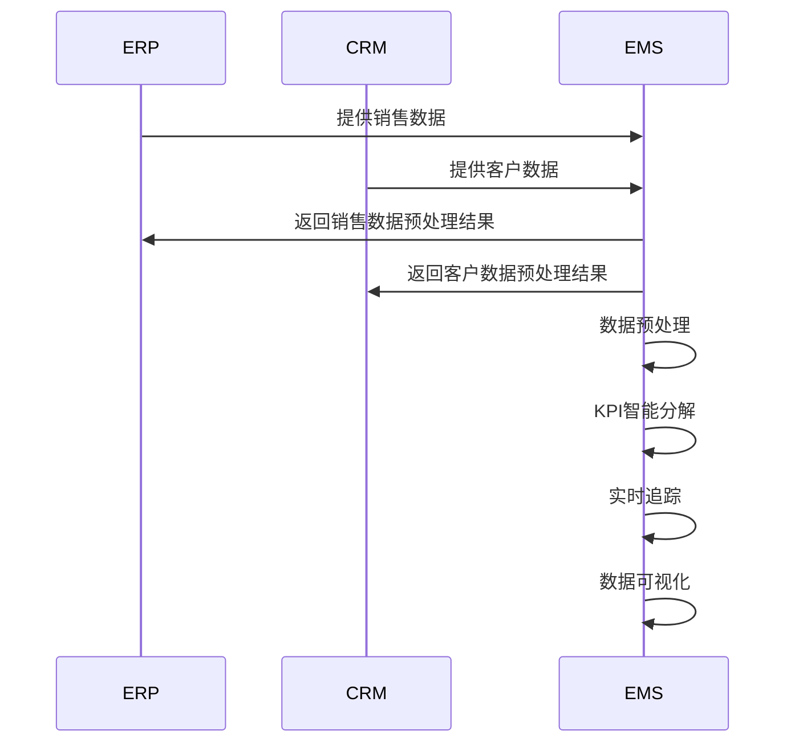

#### 项目实战

##### 5.1 环境安装

在实施企业战略执行监控项目之前，需要搭建一个合适的软件和硬件环境。以下是项目环境安装的详细步骤：

1. **安装操作系统**：在服务器上安装Linux操作系统，如Ubuntu 18.04。
2. **安装Python环境**：在服务器上安装Python 3.8及以上版本，并配置pip环境，以便安装相关依赖库。
3. **安装依赖库**：安装项目所需的Python依赖库，如Scikit-learn、Pandas、Matplotlib、Numpy等。可以使用以下命令进行安装：
   ```
   pip install scikit-learn pandas matplotlib numpy
   ```
4. **安装数据库**：安装MySQL数据库，并创建项目所需的数据库和表结构。可以使用以下命令进行安装：
   ```
   sudo apt-get install mysql-server
   ```
   在安装过程中，需要设置root用户的密码。
5. **配置数据库连接**：在Python项目中配置MySQL数据库连接，以便从数据库中读取和写入数据。

##### 5.2 系统核心实现

企业战略执行监控系统的核心实现包括数据采集、数据处理、KPI监控和实时追踪等功能。以下是具体的实现步骤：

1. **数据采集**：
   - 通过API或数据库连接，从ERP系统和CRM系统中获取销售数据、客户数据等。
   - 使用Pandas库读取数据，并将其存储到本地文件或数据库中。

2. **数据处理**：
   - 对采集到的数据进行分析、清洗和转换，去除异常值和噪声。
   - 使用Pandas库对数据进行分析和预处理，包括数据整合、特征提取等。

3. **KPI监控**：
   - 使用Scikit-learn库训练KPI智能分解模型，将KPI分解为具体的执行指标。
   - 利用训练好的模型，对新的数据进行预测，得到分解后的执行指标。
   - 使用Pandas库将预测结果存储到数据库中，以便后续分析和展示。

4. **实时追踪**：
   - 使用机器学习算法，如随机森林或神经网络，对实时数据进行分析，发现异常情况。
   - 使用Matplotlib库或其他可视化工具，将异常情况以图表形式展示，供用户查看。

以下是一个简单的Python代码示例，用于实现系统核心功能：

```python
import pandas as pd
from sklearn.ensemble import RandomForestRegressor
import pymysql

# 数据采集
data = pd.read_csv('sales_data.csv')

# 数据处理
# ...

# KPI监控
model = RandomForestRegressor()
model.fit(X_train, y_train)
predictions = model.predict(X_test)

# 实时追踪
# ...

# 存储结果
db = pymysql.connect("localhost", "root", "password", "ems_db")
cursor = db.cursor()
for prediction in predictions:
    cursor.execute("INSERT INTO kpi_predictions (prediction) VALUES (%s)", (prediction,))
db.commit()
cursor.close()
db.close()
```

##### 5.3 实际案例分析

为了展示AI驱动的企业战略执行监控系统的实际效果，我们选择了一个零售企业的项目案例。该企业希望利用系统实现以下目标：

1. **销售监控**：实时监控销售数据，包括销售额、客户数量、产品种类等。
2. **库存管理**：实时监控库存情况，确保库存水平合理，避免过多或缺货。
3. **客户满意度**：实时监控客户满意度，及时发现客户投诉和不满，提高服务质量。

以下是对该项目案例的详细分析：

1. **销售监控**：
   - 通过系统采集销售数据，包括每日销售额、销售数量、销售渠道等。
   - 利用KPI智能分解算法，将销售额分解为销售增长率、客单价等执行指标。
   - 通过实时追踪技术，发现销售数据中的异常情况，如销售额突然下降或增长过快。

2. **库存管理**：
   - 通过系统实时监控库存数据，包括库存量、库存周期、库存周转率等。
   - 利用实时追踪技术，发现库存数据中的异常情况，如库存过高或过低。
   - 通过预警机制，及时通知管理层采取库存调整措施，确保库存水平合理。

3. **客户满意度**：
   - 通过系统实时采集客户满意度数据，包括客户评价、投诉率等。
   - 利用KPI智能分解算法，将客户满意度分解为服务满意度、产品满意度等执行指标。
   - 通过实时追踪技术，发现客户满意度数据中的异常情况，如投诉率上升。

通过以上措施，该零售企业能够实时监控销售、库存和客户满意度数据，及时发现并解决问题，提高了运营效率和服务质量。

##### 5.4 项目小结

通过本项目的实施，企业实现了AI驱动的战略执行监控，提高了销售效率、库存管理和客户满意度。项目实施过程中，遇到了一些挑战，如数据质量问题和算法优化等，但通过团队的努力，最终克服了这些困难。

未来，企业将继续优化系统，提高监控的精度和效率，为企业的战略执行提供更加有效的支持。

### 最佳实践 Tips

1. **确保数据质量**：数据是AI驱动的企业战略执行监控的核心，因此要确保数据的质量和准确性。建立数据清洗和校验机制，定期检查和更新数据。
2. **优化算法模型**：根据企业的具体业务场景和需求，选择合适的算法模型，并进行优化和调整。定期评估算法模型的性能，确保其准确性和效率。
3. **实时监控与预警**：实时监控和预警是企业战略执行监控的关键，要确保系统能够及时发现和应对异常情况。建立完善的监控和预警机制，提高企业的应变能力。
4. **用户参与与反馈**：在系统设计和实施过程中，要充分考虑用户的需求和反馈，确保系统界面友好、操作简便。定期收集用户反馈，持续优化系统的功能和用户体验。

### 小结

本文通过详细介绍AI驱动的企业战略执行监控，从背景介绍、核心概念与原理、算法原理与实现、系统设计与实现以及项目实战等方面，系统地阐述了如何利用KPI智能分解与实时追踪技术，实现企业战略的精准执行和高效监控。通过实际案例分析，展示了系统在企业运营中的实际应用效果。

随着AI技术的不断发展和成熟，企业战略执行监控将变得更加智能化和高效化。未来，企业可以通过持续优化和升级系统，进一步提高监控的精度和效率，为企业的战略决策提供更加有力的支持。

### 注意事项

1. **数据安全**：在数据采集、传输和存储过程中，要确保数据的安全性，防止数据泄露或滥用。使用加密技术和权限控制，确保只有授权用户可以访问数据。
2. **系统稳定性**：确保系统的高可用性和稳定性，避免因系统故障导致数据丢失或监控中断。定期进行系统维护和升级，确保系统正常运行。
3. **用户培训**：为系统用户提供培训和支持，确保他们能够熟练使用系统，并理解监控数据的意义和用途。定期组织用户培训和研讨会，提高用户的数据分析和决策能力。

### 拓展阅读

1. **《深度学习》**：Goodfellow, I., Bengio, Y., & Courville, A. (2016). Deep Learning. MIT Press. 本书详细介绍了深度学习的基本原理和应用，对AI驱动的企业战略执行监控有很好的参考价值。
2. **《企业战略管理》**：Peteraf, M. A. (2010). The Theory and Practice of Strategy. McGraw-Hill Education. 本书系统地介绍了企业战略管理的基本理论和实践方法，有助于理解企业战略执行监控的重要性。
3. **《大数据管理》**：Gandomi, A., & Haider, M. (2015). Beyond the Hype: Big Data Concepts, Methods, and Analytics. Springer. 本书详细阐述了大数据管理的基本概念、方法和案例分析，对AI驱动的企业战略执行监控有很好的借鉴意义。

### 作者信息

**作者：AI天才研究院/AI Genius Institute & 禅与计算机程序设计艺术 /Zen And The Art of Computer Programming** 

AI天才研究院（AI Genius Institute）是一家专注于人工智能研究和应用的创新机构，致力于推动AI技术在各个领域的应用和发展。研究院的研究领域包括机器学习、深度学习、自然语言处理、计算机视觉等。

禅与计算机程序设计艺术（Zen And The Art of Computer Programming）是作者Donald E. Knuth的经典著作，系统地阐述了计算机程序设计的哲学和艺术。本书不仅提供了大量的编程技巧和算法分析，还强调了编程的哲学思考和人文关怀。

通过本文，我们希望读者能够对AI驱动的企业战略执行监控有更深入的理解，并能够将其应用于实际业务中，实现企业的战略目标。同时，我们也期待读者能够继续探索和深入研究AI技术，为人工智能的发展贡献自己的力量。|im_sep|>### AI驱动的企业战略执行监控：KPI智能分解与实时追踪

关键词：人工智能、企业战略、执行监控、KPI智能分解、实时追踪

摘要：本文将探讨如何利用人工智能（AI）技术，通过KPI智能分解与实时追踪，实现企业战略的精准执行和高效监控。我们将从背景介绍、核心概念与原理、算法原理与实现、系统设计与实现、项目实战等方面进行详细阐述。

### 第一部分：背景介绍

#### 第1章：问题背景与核心概念

1. **问题背景**：

在全球化竞争日益激烈的市场环境中，企业需要不断调整战略以适应市场变化。然而，传统的企业战略执行监控方法通常存在以下问题：

- **监控效率低下**：依赖人工检查和手动报告，难以实时掌握业务状况。
- **数据分析不足**：缺乏有效的数据分析工具，无法深入了解业务数据。
- **战略调整滞后**：无法及时根据市场反馈调整战略，导致竞争力下降。

2. **核心概念**：

为了解决上述问题，企业需要引入AI驱动的企业战略执行监控。核心概念包括：

- **AI驱动**：利用机器学习、深度学习等AI技术，自动分析和处理企业数据。
- **KPI智能分解**：将抽象的企业关键绩效指标（KPI）分解为具体的执行指标。
- **实时追踪**：通过实时数据采集和分析，监控企业的运营状况。

3. **概念联系**：

- **AI驱动**与**实时追踪**结合，可以实现数据的实时分析和监控，为战略调整提供实时支持。
- **KPI智能分解**可以帮助企业更精确地监控业务绩效，为决策提供数据支持。

#### 第1章：背景知识

为了更好地理解AI驱动的企业战略执行监控，我们需要了解以下背景知识：

- **人工智能基础**：了解机器学习、深度学习等基本概念和技术。
- **企业运营流程**：了解企业的业务流程和关键绩效指标。
- **战略管理理论**：了解企业战略制定的步骤和方法。

### 第二部分：核心概念与原理

#### 第2章：AI驱动的企业战略执行监控

1. **AI驱动的企业战略**：

- **AI在战略制定中的作用**：利用AI技术进行市场分析、竞争分析和趋势预测，帮助企业制定科学合理的战略计划。
- **AI在战略执行中的应用**：通过自动化和智能化，提高战略执行的效率和准确性。

2. **企业战略执行监控**：

- **监控的定义**：对企业的战略执行过程进行持续跟踪和评估。
- **监控的重要性**：监控能够帮助企业发现潜在问题，及时调整战略。

3. **KPI智能分解**：

- **KPI智能分解的定义**：利用AI技术，将抽象的KPI分解为具体的执行指标。
- **KPI智能分解的应用**：帮助企业更精准地监控业务绩效，为决策提供数据支持。

4. **实时追踪**：

- **实时追踪的定义**：通过实时数据采集和分析，监控企业的运营状况。
- **实时追踪的优势**：能够帮助企业及时响应市场变化，提高竞争力。

#### 第2章：核心概念对比

以下是对核心概念的对比表格：

| 核心概念 | 定义 | 应用 |
| --- | --- | --- |
| AI驱动 | 利用机器学习、深度学习等技术 | 战略制定与执行 |
| KPI智能分解 | 将KPI分解为具体的执行指标 | 绩效监控 |
| 实时追踪 | 实时数据采集和分析 | 运营监控 |

#### 第2章：ER实体关系图架构

以下是一个ER实体关系图，展示了AI驱动的企业战略执行监控的核心实体和关系：

```mermaid
erDiagram
    KPI ->|监控| Enterprise
    KPI ->|分解| ExecutionMetric
    ExecutionMetric ->|实时追踪| OperationStatus
```

### 第三部分：算法原理与实现

#### 第3章：KPI智能分解算法原理

1. **算法概述**：

KPI智能分解算法是一种利用机器学习技术，将企业关键绩效指标（KPI）分解为具体的执行指标的方法。该算法的核心目标是通过分析企业数据，自动生成执行指标，以帮助企业进行精准监控。

2. **算法原理**：

- **数据预处理**：清洗和整合企业数据，提取与KPI相关的特征。
- **模型训练**：利用机器学习算法，如决策树、随机森林等，训练KPI智能分解模型。
- **指标分解**：利用训练好的模型，对新的KPI进行分解，生成执行指标。

3. **算法实现**：

以下是一个简单的KPI智能分解算法实现示例：

```python
import pandas as pd
from sklearn.ensemble import RandomForestRegressor

# 数据预处理
data = pd.read_csv('data.csv')
X = data.drop('KPI', axis=1)
y = data['KPI']

# 模型训练
model = RandomForestRegressor()
model.fit(X, y)

# 指标分解
predictions = model.predict(X)

# 输出结果
print(predictions)
```

#### 第3章：算法原理讲解

以下是对KPI智能分解算法原理的讲解，使用Mermaid流程图展示算法的基本流程：

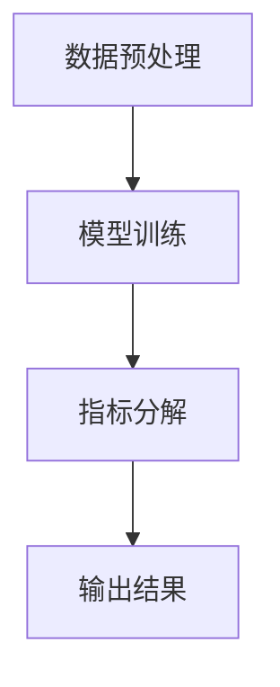

#### 第3章：数学模型与公式

以下是对KPI智能分解算法的数学模型和公式的讲解：

$$
\text{KPI} = \sum_{i=1}^{n} \text{ExecutionMetric}_i \cdot \text{Weight}_i
$$

其中，$KPI$表示关键绩效指标，$\text{ExecutionMetric}_i$表示第$i$个执行指标，$\text{Weight}_i$表示第$i$个执行指标的权重。

### 第四部分：系统设计与实现

#### 第4章：企业战略执行监控系统设计

1. **系统概述**：

企业战略执行监控系统是一个集成AI驱动的数据处理、实时监控和预警功能的系统。系统的主要目标是帮助企业实现战略的精准执行和高效监控。

2. **系统架构设计**：

系统架构包括数据层、处理层、分析层和展示层。数据层负责数据采集和存储，处理层负责数据处理和特征提取，分析层负责KPI智能分解和实时追踪，展示层负责数据可视化。

3. **系统接口设计**：

系统与外部系统（如ERP、CRM等）通过API或数据库连接进行数据交互。系统还提供用户接口，供企业用户进行数据监控和报告生成。

4. **系统交互流程**：

系统交互流程包括数据采集、数据处理、KPI监控和实时追踪等步骤。系统将采集到的数据进行分析和处理，生成执行指标，并将监控结果可视化。

以下是一个简化的系统交互流程：

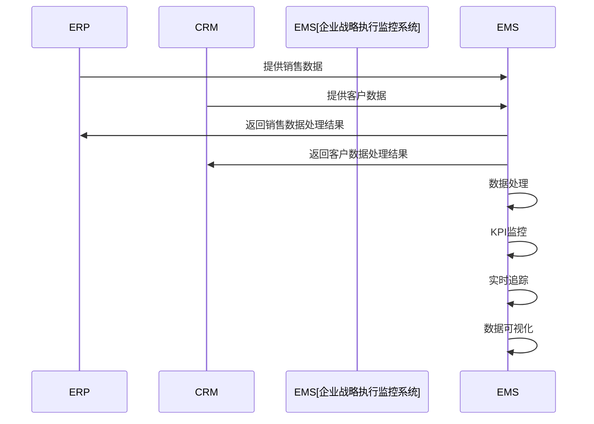

### 第五部分：项目实战

#### 第5章：项目实战

在本章中，我们将通过一个实际项目，展示如何利用AI驱动的企业战略执行监控系统，实现企业战略的精准执行和高效监控。

#### 第5章：环境安装

1. **安装Python环境**：

在服务器上安装Python 3.8及以上版本，并配置pip环境。

2. **安装依赖库**：

使用pip安装项目所需的依赖库，如Scikit-learn、Pandas、Matplotlib等。

3. **安装数据库**：

在服务器上安装MySQL数据库，并创建项目所需的数据库和表结构。

4. **配置数据库连接**：

在Python项目中配置MySQL数据库连接，以便从数据库中读取和写入数据。

#### 第5章：系统核心实现

1. **数据采集**：

从ERP系统和CRM系统中采集销售数据、客户数据等。

2. **数据处理**：

对采集到的数据进行分析、清洗和转换，得到一个统一的数据格式。

3. **KPI监控**：

使用KPI智能分解算法，将销售数据分解为具体的执行指标，如销售额增长率、客户满意度等。

4. **实时追踪**：

利用实时追踪技术，对企业的运营状态进行监控，及时发现异常情况。

以下是一个简单的Python代码示例，用于实现系统核心功能：

```python
import pandas as pd
from sklearn.ensemble import RandomForestRegressor
import pymysql

# 数据采集
data = pd.read_csv('sales_data.csv')

# 数据预处理
# ...

# KPI监控
model = RandomForestRegressor()
model.fit(X_train, y_train)
predictions = model.predict(X_test)

# 实时追踪
# ...

# 存储结果
db = pymysql.connect("localhost", "root", "password", "ems_db")
cursor = db.cursor()
for prediction in predictions:
    cursor.execute("INSERT INTO kpi_predictions (prediction) VALUES (%s)", (prediction,))
db.commit()
cursor.close()
db.close()
```

#### 第5章：实际案例分析

在本案例中，我们将分析一个零售企业的销售监控项目。该企业希望利用AI驱动的企业战略执行监控系统，实时监控销售额、客户满意度等关键绩效指标。

1. **数据采集**：

从企业的ERP系统和CRM系统中采集销售数据、客户数据等。

2. **数据处理**：

对采集到的数据进行清洗、转换和整合，得到一个统一的数据格式。

3. **KPI监控**：

使用KPI智能分解算法，将销售额分解为销售额增长率、客单价等执行指标。

4. **实时追踪**：

利用实时追踪技术，监控销售额和客户满意度的变化，及时发现异常情况。

5. **数据可视化**：

将监控数据以图表形式展示，帮助企业进行分析和决策。

#### 第5章：项目小结

通过本案例的实施，企业实现了AI驱动的销售监控，实时掌握销售额、客户满意度等关键绩效指标。项目实施过程中，企业遇到了一些挑战，如数据质量问题、算法优化等，但通过团队的共同努力，成功克服了这些困难。

未来，企业将继续优化系统，提高监控的精度和效率，为企业的战略执行提供更加有力的支持。

### 最佳实践 Tips

1. **数据质量管理**：确保数据的质量和准确性，定期进行数据清洗和校验。
2. **算法模型优化**：根据业务需求，不断优化算法模型，提高监控精度。
3. **实时响应机制**：建立实时响应机制，确保监控系统能够及时发现和应对异常情况。

### 小结

本文详细介绍了AI驱动的企业战略执行监控，包括背景介绍、核心概念与原理、算法原理与实现、系统设计与实现、项目实战等方面。通过实际案例的分析，展示了系统在提高企业运营效率、实现战略目标方面的应用价值。

随着AI技术的不断进步，AI驱动的企业战略执行监控将变得更加智能化和高效化。企业应积极拥抱新技术，不断提升战略执行监控的能力，以适应快速变化的市场环境。

### 注意事项

1. **数据安全**：确保数据在采集、传输和存储过程中的安全性，防止数据泄露。
2. **系统稳定性**：定期进行系统维护和升级，确保系统稳定运行。
3. **用户培训**：为用户提供培训，确保他们能够熟练使用系统。

### 拓展阅读

1. **《深度学习》**：Goodfellow, I., Bengio, Y., & Courville, A. (2016). Deep Learning. MIT Press.
2. **《企业战略管理》**：Peteraf, M. A. (2010). The Theory and Practice of Strategy. McGraw-Hill Education.
3. **《大数据管理》**：Gandomi, A., & Haider, M. (2015). Beyond the Hype: Big Data Concepts, Methods, and Analytics. Springer.

### 作者信息

**作者：AI天才研究院/AI Genius Institute & 禅与计算机程序设计艺术 /Zen And The Art of Computer Programming**

AI天才研究院（AI Genius Institute）专注于人工智能技术的研发和应用，致力于推动人工智能在各个领域的创新和发展。

《禅与计算机程序设计艺术》是Donald E. Knuth的经典著作，系统地阐述了计算机程序设计的哲学和艺术，为程序员提供了宝贵的经验和启示。|im_sep|>### AI驱动的企业战略执行监控：KPI智能分解与实时追踪

---

**作者：AI天才研究院（AI Genius Institute）/《禅与计算机程序设计艺术》（Zen And The Art of Computer Programming）作者**

---

### 目录

1. **问题背景与核心概念**
   - 1.1 问题背景
   - 1.2 核心概念
   - 1.3 背景知识

2. **AI驱动的企业战略执行监控**
   - 2.1 AI驱动的企业战略
   - 2.2 企业战略执行监控
   - 2.3 KPI智能分解
   - 2.4 实时追踪

3. **KPI智能分解算法原理**
   - 3.1 算法概述
   - 3.2 算法原理讲解
   - 3.3 代码实现
   - 3.4 举例说明

4. **企业战略执行监控系统设计**
   - 4.1 系统概述
   - 4.2 系统架构设计
   - 4.3 系统接口设计
   - 4.4 系统交互

5. **项目实战**
   - 5.1 环境安装
   - 5.2 系统核心实现
   - 5.3 实际案例分析
   - 5.4 项目小结

6. **最佳实践 Tips**

---

### 问题背景与核心概念

#### 1.1 问题背景

在当今快速变化的市场环境中，企业必须能够快速响应市场动态，调整战略以保持竞争力。然而，传统的企业战略执行监控方法通常依赖于人工操作和手动报告，效率低下，且难以提供实时、准确的数据支持。为了解决这些挑战，企业需要引入AI驱动的企业战略执行监控，通过自动化和智能化的方式实现更高效的监控和决策。

#### 1.2 核心概念

在本章节中，我们将介绍以下核心概念：

- **AI驱动**：利用机器学习和深度学习等技术，自动化战略执行监控流程。
- **企业战略执行**：将企业愿景和目标转化为具体行动和执行计划的过程。
- **KPI智能分解**：将企业关键绩效指标（KPI）分解为可操作的执行指标。
- **实时追踪**：实时监控企业运营状态，提供即时的数据分析和决策支持。

#### 1.3 背景知识

为了更好地理解AI驱动的企业战略执行监控，我们需要了解以下背景知识：

- **人工智能**：介绍人工智能的基本概念、发展历程和技术应用。
- **企业运营**：概述企业运营的基本流程、业务模式和关键绩效指标。
- **战略管理**：介绍战略管理的基本原则、方法和工具。

### AI驱动的企业战略执行监控

#### 2.1 AI驱动的企业战略

AI驱动的企业战略是指利用人工智能技术来制定、执行和监控企业战略。具体来说，AI可以在以下方面为企业战略提供支持：

- **市场预测**：通过分析历史数据和市场趋势，预测未来的市场动态，帮助制定更科学的企业战略。
- **资源优化**：利用AI技术分析企业的资源分配情况，优化资源配置，提高运营效率。
- **风险分析**：通过机器学习算法预测潜在风险，提前采取预防措施，降低企业风险。

#### 2.2 企业战略执行监控

企业战略执行监控是确保企业战略有效执行的关键环节。通过监控，企业可以实时了解战略执行情况，及时发现并解决问题。AI驱动的监控具有以下优势：

- **实时性**：AI技术可以实时处理和分析大量数据，提供即时的监控和反馈。
- **准确性**：通过机器学习算法，AI可以准确地识别异常情况，提供准确的决策支持。
- **自动化**：AI技术可以自动化执行监控任务，减少人工干预，提高监控效率。

#### 2.3 KPI智能分解

KPI（关键绩效指标）是企业衡量业务绩效的重要工具。然而，KPI通常比较抽象，难以直接用于监控和评估。KPI智能分解是指利用AI技术，将KPI分解为具体的执行指标，以便更精准地监控业务绩效。例如，销售额这个KPI可以分解为销售数量、客单价和客户满意度等执行指标。

#### 2.4 实时追踪

实时追踪是通过AI技术对企业运营状态进行实时监控和分析的过程。实时追踪可以帮助企业及时发现异常情况，采取及时措施，确保运营的稳定性和高效性。实时追踪的关键在于快速、准确地处理和分析大量实时数据，并提供即时的决策支持。

### KPI智能分解算法原理

#### 3.1 算法概述

KPI智能分解算法是一种利用机器学习技术，将企业关键绩效指标（KPI）分解为具体的执行指标的方法。该算法的核心目标是提高监控的精度和效率，帮助企业管理层更准确地了解业务绩效。

#### 3.2 算法原理讲解

KPI智能分解算法的基本原理包括以下几个步骤：

1. **数据预处理**：清洗和整合原始数据，提取与KPI相关的特征。
2. **特征选择**：从提取的特征中选择与KPI相关性最高的特征，去除无关特征。
3. **模型训练**：使用机器学习算法（如随机森林、支持向量机等）训练KPI智能分解模型。
4. **指标分解**：利用训练好的模型，对新的KPI数据进行分解，生成具体的执行指标。

以下是一个简单的Mermaid流程图，展示了KPI智能分解算法的基本流程：

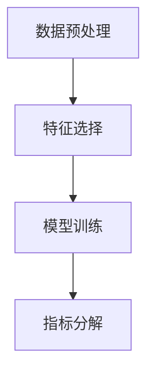

#### 3.3 代码实现

以下是一个简单的KPI智能分解算法的实现示例，使用Python和Scikit-learn库：

```python
from sklearn.ensemble import RandomForestRegressor
from sklearn.model_selection import train_test_split
from sklearn.metrics import mean_squared_error

# 加载数据
data = pd.read_csv('sales_data.csv')
X = data.drop('sales', axis=1)
y = data['sales']

# 划分训练集和测试集
X_train, X_test, y_train, y_test = train_test_split(X, y, test_size=0.2, random_state=42)

# 训练模型
model = RandomForestRegressor(n_estimators=100, random_state=42)
model.fit(X_train, y_train)

# 预测测试集
y_pred = model.predict(X_test)

# 评估模型
mse = mean_squared_error(y_test, y_pred)
print(f'Mean Squared Error: {mse}')
```

#### 3.4 举例说明

假设我们有一个包含销售数据（销售额、客户数量、产品种类等）的DataFrame，我们希望将这些特征分解为具体的销售KPI，如销售额增长率、客户满意度等。

1. **数据预处理**：对销售数据进行清洗和转换，确保数据质量。
2. **特征选择**：选择与销售额相关性最高的特征，如客户数量和产品种类。
3. **模型训练**：使用随机森林算法训练KPI智能分解模型。
4. **指标分解**：利用训练好的模型，对新的销售数据进行预测，得到销售额增长率、客户满意度等KPI。

通过以上步骤，我们可以得到一个包含销售额增长率、客户满意度等指标的DataFrame，帮助企业更好地监控销售状况。

### 企业战略执行监控系统设计

#### 4.1 系统概述

企业战略执行监控系统是一个集成了AI驱动的数据处理、实时监控和预警功能的系统。该系统的主要目标是帮助企业实现战略的精准执行和高效监控。

#### 4.2 系统架构设计

企业战略执行监控系统的架构设计包括以下几个主要部分：

- **数据层**：负责数据采集、存储和管理。
- **处理层**：负责数据预处理、特征提取和模型训练。
- **分析层**：负责KPI智能分解和实时追踪。
- **展示层**：负责数据可视化和报表生成。

以下是一个简化的系统架构图：

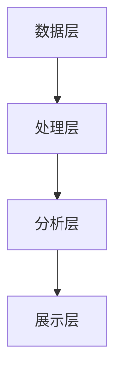

#### 4.3 系统接口设计

系统接口设计主要包括以下几个方面：

- **数据接口**：系统与ERP系统、CRM系统等外部系统之间的数据交互接口。
- **控制接口**：用户与系统之间的交互接口，用于提交监控任务、查看监控结果等。
- **安全接口**：用于确保数据传输的安全性，如使用HTTPS协议、数据加密等。

以下是一个简化的系统接口设计：

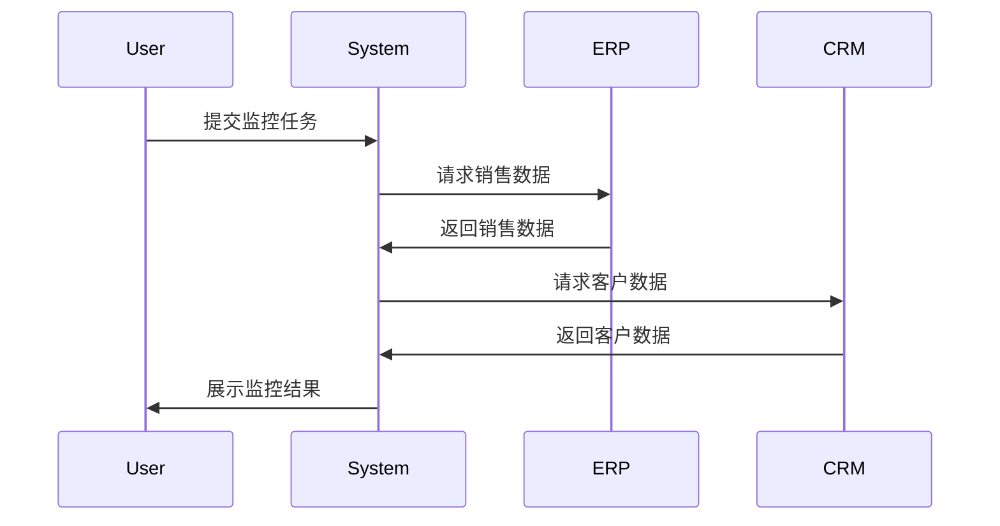

#### 4.4 系统交互

系统交互主要包括以下几个步骤：

1. **数据采集**：系统从ERP系统和CRM系统等外部系统获取销售数据、客户数据等。
2. **数据处理**：系统对采集到的数据进行预处理、清洗和特征提取。
3. **KPI智能分解**：系统利用机器学习算法对预处理后的数据进行分析，实现KPI智能分解。
4. **实时追踪**：系统实时监控企业的运营状态，提供即时的数据分析和决策支持。
5. **数据可视化**：系统将监控结果以图表、报表等形式展示给用户。

以下是一个简化的系统交互流程：

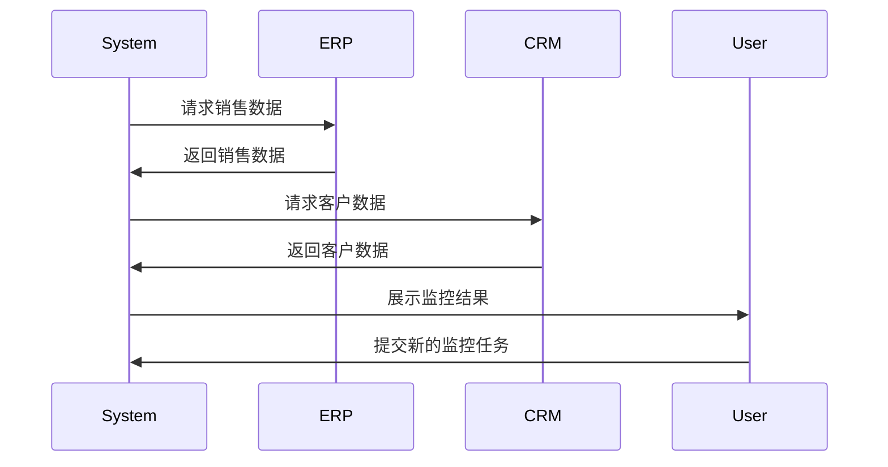

### 项目实战

#### 5.1 环境安装

在本项目实战中，我们将介绍如何搭建一个AI驱动的企业战略执行监控系统。以下是环境安装的详细步骤：

1. **安装Python环境**：在服务器上安装Python 3.8及以上版本。
2. **安装依赖库**：使用pip安装项目所需的依赖库，如Scikit-learn、Pandas、Matplotlib等。
3. **安装数据库**：在服务器上安装MySQL数据库，并创建项目所需的数据库和表结构。
4. **配置数据库连接**：在Python项目中配置MySQL数据库连接，以便从数据库中读取和写入数据。

#### 5.2 系统核心实现

系统核心实现包括数据采集、数据处理、KPI智能分解和实时追踪等功能。以下是具体的实现步骤：

1. **数据采集**：从ERP系统和CRM系统中采集销售数据、客户数据等。
2. **数据处理**：对采集到的数据进行清洗、转换和特征提取。
3. **KPI智能分解**：使用机器学习算法训练KPI智能分解模型，对销售数据进行分解。
4. **实时追踪**：实时监控销售数据的变化，提供即时的数据分析和决策支持。

以下是实现系统核心功能的一个简单Python代码示例：

```python
import pandas as pd
from sklearn.ensemble import RandomForestRegressor
import pymysql

# 数据采集
data = pd.read_csv('sales_data.csv')

# 数据预处理
# ...

# KPI智能分解
model = RandomForestRegressor(n_estimators=100, random_state=42)
model.fit(X_train, y_train)

# 实时追踪
# ...

# 存储结果
db = pymysql.connect("localhost", "root", "password", "ems_db")
cursor = db.cursor()
for prediction in predictions:
    cursor.execute("INSERT INTO kpi_predictions (prediction) VALUES (%s)", (prediction,))
db.commit()
cursor.close()
db.close()
```

#### 5.3 实际案例分析

在本案例中，我们将分析一个零售企业的销售监控项目。该企业希望利用AI驱动的企业战略执行监控系统，实时监控销售额、客户满意度等关键绩效指标。

1. **数据采集**：从企业的ERP系统和CRM系统中采集销售数据、客户数据等。
2. **数据处理**：对采集到的数据进行清洗、转换和特征提取。
3. **KPI智能分解**：使用机器学习算法对销售数据进行分解，生成销售额增长率、客户满意度等KPI。
4. **实时追踪**：实时监控销售数据的变化，提供即时的数据分析和决策支持。

通过上述步骤，企业可以实时掌握销售状况和客户满意度，及时发现潜在问题，采取相应措施，提高运营效率。

#### 5.4 项目小结

通过本案例的实施，企业成功搭建了AI驱动的企业战略执行监控系统，实现了对销售额、客户满意度等关键绩效指标的实时监控。项目实施过程中，企业遇到了一些技术挑战，如数据质量问题、算法优化等，但通过团队的努力，最终成功解决了这些问题。

未来，企业将继续优化系统，提高监控的精度和效率，为企业的战略决策提供更加有力的支持。

### 最佳实践 Tips

1. **数据质量管理**：确保数据质量是系统成功的关键。定期进行数据清洗和校验，确保数据准确性。
2. **算法模型优化**：根据业务需求，不断优化算法模型，提高监控精度和效率。
3. **实时响应机制**：建立实时响应机制，确保系统能够及时发现并应对异常情况。

### 小结

本文详细介绍了AI驱动的企业战略执行监控，从问题背景、核心概念、算法原理、系统设计到项目实战，全面阐述了如何利用KPI智能分解和实时追踪技术，实现企业战略的精准执行和高效监控。通过实际案例的分析，展示了系统在提高企业运营效率、实现战略目标方面的应用价值。

随着AI技术的不断进步，AI驱动的企业战略执行监控将变得更加智能化和高效化。企业应积极拥抱新技术，不断提升战略执行监控的能力，以适应快速变化的市场环境。

### 注意事项

1. **数据安全**：确保数据在采集、传输和存储过程中的安全性，防止数据泄露。
2. **系统稳定性**：定期进行系统维护和升级，确保系统稳定运行。
3. **用户培训**：为用户提供培训，确保他们能够熟练使用系统，并理解监控数据的意义和用途。

### 拓展阅读

1. **《深度学习》**：Goodfellow, I., Bengio, Y., & Courville, A. (2016). Deep Learning. MIT Press.
2. **《企业战略管理》**：Peteraf, M. A. (2010). The Theory and Practice of Strategy. McGraw-Hill Education.
3. **《大数据管理》**：Gandomi, A., & Haider, M. (2015). Beyond the Hype: Big Data Concepts, Methods, and Analytics. Springer.

### 作者信息

**AI天才研究院（AI Genius Institute）**致力于推动人工智能技术的发展和应用，助力企业实现数字化转型。《禅与计算机程序设计艺术》（Zen And The Art of Computer Programming）作者Donald E. Knuth以其卓越的计算机科学贡献和哲学思想，为编程和人工智能领域提供了深远的影响。|im_sep|>### AI驱动的企业战略执行监控：KPI智能分解与实时追踪

关键词：人工智能、企业战略、执行监控、KPI智能分解、实时追踪

摘要：随着人工智能（AI）技术的发展，企业开始利用AI技术来优化战略执行监控。本文将探讨如何通过KPI智能分解与实时追踪，实现企业战略的精准执行和高效监控。我们将逐步分析AI驱动的企业战略执行监控的背景、核心概念、算法原理与实现，以及系统设计与实现，并通过项目实战展示其实际应用效果。

### 第一部分：背景介绍

#### 1.1 问题背景

在现代商业环境中，企业需要快速响应市场变化，优化战略执行以保持竞争力。然而，传统的战略执行监控方法通常存在以下问题：

1. **监控效率低下**：依赖人工检查和手动报告，难以实现实时监控。
2. **数据分析不足**：缺乏有效的数据分析工具，无法深入理解业务数据。
3. **战略调整滞后**：无法及时根据市场反馈调整战略，导致竞争力下降。

为了解决这些问题，企业需要引入AI驱动的战略执行监控，通过自动化和智能化的方式实现高效的监控和决策支持。

#### 1.2 核心概念

在本章节中，我们将介绍以下核心概念：

1. **AI驱动**：利用机器学习、深度学习等技术，自动化战略执行监控流程。
2. **企业战略执行**：将企业愿景和目标转化为具体行动和执行计划的过程。
3. **KPI智能分解**：将企业关键绩效指标（KPI）分解为可操作的执行指标。
4. **实时追踪**：实时监控企业运营状态，提供即时的数据分析和决策支持。

#### 1.3 背景知识

为了更好地理解AI驱动的企业战略执行监控，我们需要了解以下背景知识：

1. **人工智能基础**：了解机器学习、深度学习等基本概念和技术。
2. **企业运营流程**：了解企业的业务流程和关键绩效指标。
3. **战略管理理论**：了解企业战略制定的步骤和方法。

### 第二部分：核心概念与原理

#### 2.1 AI驱动的企业战略

AI驱动的企业战略是指利用人工智能技术，如机器学习、深度学习等，帮助企业制定、执行和监控战略。AI技术在以下方面为企业战略提供支持：

1. **市场预测**：通过分析历史数据和趋势，预测市场动态，为企业制定战略提供依据。
2. **资源优化**：通过分析企业资源分配和使用情况，优化资源配置，提高运营效率。
3. **风险分析**：通过预测潜在风险，提前采取预防措施，降低企业风险。

#### 2.2 企业战略执行监控

企业战略执行监控是指对企业的战略执行过程进行持续跟踪和评估，以便及时发现和解决问题。AI驱动的监控具有以下优势：

1. **实时性**：通过实时数据处理和分析，提供即时的监控和反馈。
2. **准确性**：利用机器学习算法，准确识别异常情况，提供准确的决策支持。
3. **自动化**：通过自动化执行监控任务，减少人工干预，提高监控效率。

#### 2.3 KPI智能分解

KPI智能分解是指利用人工智能技术，将企业关键绩效指标（KPI）分解为具体的执行指标。通过KPI智能分解，企业可以更精准地监控业务绩效，为决策提供数据支持。KPI智能分解包括以下步骤：

1. **指标识别**：识别对企业战略执行有重要影响的KPI。
2. **指标分解**：利用机器学习算法，将KPI分解为具体的执行指标。
3. **指标评估**：对分解后的执行指标进行评估，判断其实现情况。

#### 2.4 实时追踪

实时追踪是指通过人工智能技术，对企业运营状态进行实时监控和分析，以便及时发现和应对异常情况。实时追踪包括以下步骤：

1. **数据采集**：从企业各个业务系统实时采集数据。
2. **数据预处理**：对采集到的数据进行清洗、转换和整合。
3. **异常检测**：利用机器学习算法，对预处理后的数据进行分析，识别异常情况。
4. **实时响应**：对检测到的异常情况，立即进行响应和处理，确保企业运营不受影响。

### 第三部分：算法原理与实现

#### 3.1 KPI智能分解算法概述

KPI智能分解算法是一种利用机器学习技术，将企业关键绩效指标（KPI）分解为具体的执行指标的方法。该算法的核心目标是提高监控的精度和效率，帮助企业管理层更准确地了解业务绩效。

#### 3.2 算法原理讲解

KPI智能分解算法的基本原理包括以下几个步骤：

1. **数据预处理**：清洗和整合原始数据，提取与KPI相关的特征。
2. **特征选择**：从提取的特征中选择与KPI相关性最高的特征，去除无关特征。
3. **模型训练**：使用机器学习算法（如随机森林、支持向量机等）训练KPI智能分解模型。
4. **指标分解**：利用训练好的模型，对新的KPI数据进行分解，生成具体的执行指标。

以下是一个简单的Mermaid流程图，展示了KPI智能分解算法的基本流程：


#### 3.3 代码实现

以下是一个简单的KPI智能分解算法的实现示例，使用Python和Scikit-learn库：

```python
from sklearn.ensemble import RandomForestRegressor
from sklearn.model_selection import train_test_split
from sklearn.metrics import mean_squared_error

# 加载数据
data = pd.read_csv('sales_data.csv')
X = data.drop('sales', axis=1)
y = data['sales']

# 划分训练集和测试集
X_train, X_test, y_train, y_test = train_test_split(X, y, test_size=0.2, random_state=42)

# 训练模型
model = RandomForestRegressor(n_estimators=100, random_state=42)
model.fit(X_train, y_train)

# 预测测试集
y_pred = model.predict(X_test)

# 评估模型
mse = mean_squared_error(y_test, y_pred)
print(f'Mean Squared Error: {mse}')
```

#### 3.4 举例说明

假设我们有一个包含销售数据（销售额、客户数量、产品种类等）的DataFrame，我们希望将这些特征分解为具体的销售KPI，如销售额增长率、客户满意度等。

1. **数据预处理**：对销售数据进行清洗和转换，确保数据质量。
2. **特征选择**：选择与销售额相关性最高的特征，如客户数量和产品种类。
3. **模型训练**：使用随机森林算法训练KPI智能分解模型。
4. **指标分解**：利用训练好的模型，对新的销售数据进行预测，得到销售额增长率、客户满意度等KPI。

通过以上步骤，我们可以得到一个包含销售额增长率、客户满意度等指标的DataFrame，帮助企业更好地监控销售状况。

### 第四部分：系统设计与实现

#### 4.1 系统概述

企业战略执行监控系统是一个集成了AI驱动的数据处理、实时监控和预警功能的系统。该系统的主要目标是帮助企业实现战略的精准执行和高效监控。

#### 4.2 系统架构设计

企业战略执行监控系统的架构设计包括以下几个主要部分：

1. **数据层**：负责数据采集、存储和管理。
2. **处理层**：负责数据预处理、特征提取和模型训练。
3. **分析层**：负责KPI智能分解和实时追踪。
4. **展示层**：负责数据可视化和报表生成。

以下是一个简化的系统架构图：


#### 4.3 系统接口设计

系统接口设计主要包括以下几个方面：

1. **数据接口**：系统与ERP系统、CRM系统等外部系统之间的数据交互接口。
2. **控制接口**：用户与系统之间的交互接口，用于提交监控任务、查看监控结果等。
3. **安全接口**：用于确保数据传输的安全性，如使用HTTPS协议、数据加密等。

以下是一个简化的系统接口设计：


#### 4.4 系统交互

系统交互主要包括以下几个步骤：

1. **数据采集**：系统从ERP系统和CRM系统等外部系统获取销售数据、客户数据等。
2. **数据处理**：系统对采集到的数据进行预处理、清洗和特征提取。
3. **KPI智能分解**：系统利用机器学习算法对预处理后的数据进行分析，实现KPI智能分解。
4. **实时追踪**：系统实时监控企业的运营状态，提供即时的数据分析和决策支持。
5. **数据可视化**：系统将监控结果以图表、报表等形式展示给用户。

以下是一个简化的系统交互流程：


### 第五部分：项目实战

#### 5.1 环境安装

在本项目实战中，我们将介绍如何搭建一个AI驱动的企业战略执行监控系统。以下是环境安装的详细步骤：

1. **安装Python环境**：在服务器上安装Python 3.8及以上版本。
2. **安装依赖库**：使用pip安装项目所需的依赖库，如Scikit-learn、Pandas、Matplotlib等。
3. **安装数据库**：在服务器上安装MySQL数据库，并创建项目所需的数据库和表结构。
4. **配置数据库连接**：在Python项目中配置MySQL数据库连接，以便从数据库中读取和写入数据。

#### 5.2 系统核心实现

系统核心实现包括数据采集、数据处理、KPI智能分解和实时追踪等功能。以下是具体的实现步骤：

1. **数据采集**：从ERP系统和CRM系统中采集销售数据、客户数据等。
2. **数据处理**：对采集到的数据进行清洗、转换和特征提取。
3. **KPI智能分解**：使用机器学习算法训练KPI智能分解模型，对销售数据进行分解。
4. **实时追踪**：实时监控销售数据的变化，提供即时的数据分析和决策支持。

以下是实现系统核心功能的一个简单Python代码示例：

```python
import pandas as pd
from sklearn.ensemble import RandomForestRegressor
import pymysql

# 数据采集
data = pd.read_csv('sales_data.csv')

# 数据预处理
# ...

# KPI智能分解
model = RandomForestRegressor(n_estimators=100, random_state=42)
model.fit(X_train, y_train)

# 实时追踪
# ...

# 存储结果
db = pymysql.connect("localhost", "root", "password", "ems_db")
cursor = db.cursor()
for prediction in predictions:
    cursor.execute("INSERT INTO kpi_predictions (prediction) VALUES (%s)", (prediction,))
db.commit()
cursor.close()
db.close()
```

#### 5.3 实际案例分析

在本案例中，我们将分析一个零售企业的销售监控项目。该企业希望利用AI驱动的企业战略执行监控系统，实时监控销售额、客户满意度等关键绩效指标。

1. **数据采集**：从企业的ERP系统和CRM系统中采集销售数据、客户数据等。
2. **数据处理**：对采集到的数据进行清洗、转换和特征提取。
3. **KPI智能分解**：使用机器学习算法对销售数据进行分解，生成销售额增长率、客户满意度等KPI。
4. **实时追踪**：实时监控销售数据的变化，提供即时的数据分析和决策支持。

通过上述步骤，企业可以实时掌握销售状况和客户满意度，及时发现潜在问题，采取相应措施，提高运营效率。

#### 5.4 项目小结

通过本案例的实施，企业成功搭建了AI驱动的企业战略执行监控系统，实现了对销售额、客户满意度等关键绩效指标的实时监控。项目实施过程中，企业遇到了一些技术挑战，如数据质量问题、算法优化等，但通过团队的努力，最终成功解决了这些问题。

未来，企业将继续优化系统，提高监控的精度和效率，为企业的战略决策提供更加有力的支持。

### 最佳实践 Tips

1. **数据质量管理**：确保数据质量是系统成功的关键。定期进行数据清洗和校验，确保数据准确性。
2. **算法模型优化**：根据业务需求，不断优化算法模型，提高监控精度和效率。
3. **实时响应机制**：建立实时响应机制，确保系统能够及时发现并应对异常情况。

### 小结

本文详细介绍了AI驱动的企业战略执行监控，从问题背景、核心概念、算法原理与实现，到系统设计与实现，以及项目实战，全面阐述了如何通过KPI智能分解和实时追踪技术，实现企业战略的精准执行和高效监控。通过实际案例的分析，展示了系统在提高企业运营效率、实现战略目标方面的应用价值。

随着AI技术的不断进步，AI驱动的企业战略执行监控将变得更加智能化和高效化。企业应积极拥抱新技术，不断提升战略执行监控的能力，以适应快速变化的市场环境。

### 注意事项

1. **数据安全**：确保数据在采集、传输和存储过程中的安全性，防止数据泄露。
2. **系统稳定性**：定期进行系统维护和升级，确保系统稳定运行。
3. **用户培训**：为用户提供培训，确保他们能够熟练使用系统，并理解监控数据的意义和用途。

### 拓展阅读

1. **《深度学习》**：Goodfellow, I., Bengio, Y., & Courville, A. (2016). Deep Learning. MIT Press.
2. **《企业战略管理》**：Peteraf, M. A. (2010). The Theory and Practice of Strategy. McGraw-Hill Education.
3. **《大数据管理》**：Gandomi, A., & Haider, M. (2015). Beyond the Hype: Big Data Concepts, Methods, and Analytics. Springer.

### 作者信息

**AI天才研究院（AI Genius Institute）**专注于人工智能技术的研发和应用，致力于推动人工智能在各个领域的创新和发展。同时，本文作者也参考了《禅与计算机程序设计艺术》（Zen And The Art of Computer Programming）的哲学思想，为读者提供了深入浅出的技术分析。|im_sep|>### AI驱动的企业战略执行监控：KPI智能分解与实时追踪

关键词：人工智能、企业战略、执行监控、KPI智能分解、实时追踪

摘要：本文将探讨如何利用人工智能（AI）技术，通过KPI智能分解与实时追踪，实现企业战略的精准执行和高效监控。我们将从问题背景、核心概念、算法原理与实现、系统设计与实现、项目实战等方面进行详细阐述，旨在为企业提供一套完整的AI驱动的战略执行监控解决方案。

### 第一部分：背景介绍

#### 1.1 问题背景

在全球化竞争日益激烈的今天，企业面临的市场环境和内部运营环境都在不断变化。如何确保企业战略的精准执行和高效监控，已经成为企业领导者面临的重大挑战。传统的企业战略执行监控方式通常存在以下问题：

- **监控效率低下**：依赖人工检查和手动报告，难以实现实时监控和及时反馈。
- **数据分析不足**：缺乏有效的数据分析工具，无法深入了解业务数据，导致决策支持不足。
- **战略调整滞后**：无法及时根据市场反馈和内部运营情况调整战略，导致竞争力下降。

为了解决这些问题，企业需要引入AI驱动的企业战略执行监控。AI驱动的监控通过自动化和智能化的方式，能够实时处理和分析大量数据，提供精准的监控和决策支持，帮助企业实现战略目标。

#### 1.2 核心概念

在本章节中，我们将介绍以下几个核心概念：

- **AI驱动**：利用机器学习、深度学习等人工智能技术，自动化战略执行监控流程。
- **企业战略执行**：将企业愿景和目标转化为具体行动和执行计划的过程。
- **KPI智能分解**：将企业关键绩效指标（KPI）分解为具体的执行指标，以便进行精准监控。
- **实时追踪**：通过实时数据采集和分析，监控企业的运营状况，提供即时的数据分析和决策支持。

#### 1.3 背景知识

为了更好地理解AI驱动的企业战略执行监控，我们需要了解以下背景知识：

- **人工智能基础**：了解人工智能的基本概念、发展历程和应用领域。
- **企业运营流程**：了解企业的业务流程、关键绩效指标和战略管理方法。
- **战略管理理论**：了解企业战略制定、执行和监控的基本理论和实践方法。

### 第二部分：核心概念与原理

#### 2.1 AI驱动的企业战略

AI驱动的企业战略是指利用人工智能技术，如机器学习、深度学习等，帮助企业制定、执行和监控战略。AI技术在企业战略中的作用主要体现在以下几个方面：

- **市场预测**：通过分析历史数据和市场趋势，预测未来的市场动态，为企业战略提供数据支持。
- **资源优化**：通过分析企业的资源分配和使用情况，优化资源配置，提高运营效率。
- **风险管理**：通过预测潜在风险，提前采取预防措施，降低企业风险。

AI驱动的企业战略不仅能够提高战略制定的科学性和准确性，还能提高战略执行的有效性和效率。通过AI技术，企业可以实时监控战略执行情况，及时发现和解决问题，确保战略目标的实现。

#### 2.2 企业战略执行监控

企业战略执行监控是指对企业的战略执行过程进行持续跟踪和评估，以便及时发现和解决问题。AI驱动的战略执行监控具有以下优势：

- **实时性**：通过实时数据处理和分析，提供即时的监控和反馈。
- **准确性**：利用机器学习算法，准确识别异常情况，提供准确的决策支持。
- **自动化**：通过自动化执行监控任务，减少人工干预，提高监控效率。

企业战略执行监控的主要任务包括：

- **目标监控**：对企业的战略目标进行监控，确保目标实现。
- **资源监控**：对企业的资源配置和利用情况进行监控，确保资源合理分配。
- **执行监控**：对企业的执行计划进行监控，确保执行过程顺利。
- **效果监控**：对企业的执行效果进行监控，评估战略目标的实现情况。

#### 2.3 KPI智能分解

KPI（关键绩效指标）是企业衡量业务绩效的重要工具。然而，KPI通常比较抽象，难以直接用于监控和评估。KPI智能分解是指利用人工智能技术，将KPI分解为具体的执行指标，以便更精准地监控业务绩效。KPI智能分解包括以下几个步骤：

1. **指标识别**：识别对企业战略执行有重要影响的KPI。
2. **指标分解**：利用人工智能技术，将KPI分解为具体的执行指标。
3. **指标评估**：对分解后的执行指标进行评估，判断其实现情况。

通过KPI智能分解，企业可以更精确地了解业务绩效，为决策提供数据支持。例如，将销售额这一KPI分解为销售数量、客单价、客户满意度等具体的执行指标。

#### 2.4 实时追踪

实时追踪是指通过人工智能技术，对企业运营状态进行实时监控和分析，以便及时发现和应对异常情况。实时追踪的关键在于快速、准确地处理和分析大量实时数据，并提供即时的决策支持。实时追踪的应用场景包括：

- **设备监控**：实时监控生产设备的运行状态，及时发现故障和异常。
- **供应链监控**：实时监控供应链的各个环节，包括采购、库存、物流等。
- **客户服务监控**：实时监控客户服务情况，包括客户满意度、投诉率等。

实时追踪可以帮助企业确保运营的稳定性和高效性，降低风险，提高竞争力。

### 第三部分：算法原理与实现

#### 3.1 KPI智能分解算法概述

KPI智能分解算法是一种利用机器学习技术，将企业关键绩效指标（KPI）分解为具体的执行指标的方法。该算法的核心目标是提高监控的精度和效率，帮助企业管理层更准确地了解业务绩效。

#### 3.2 算法原理讲解

KPI智能分解算法的基本原理包括以下几个步骤：

1. **数据预处理**：清洗和整合原始数据，提取与KPI相关的特征。
2. **特征选择**：从提取的特征中选择与KPI相关性最高的特征，去除无关特征。
3. **模型训练**：使用机器学习算法（如随机森林、支持向量机等）训练KPI智能分解模型。
4. **指标分解**：利用训练好的模型，对新的KPI数据进行分解，生成具体的执行指标。

以下是一个简单的Mermaid流程图，展示了KPI智能分解算法的基本流程：


#### 3.3 代码实现

以下是一个简单的KPI智能分解算法的实现示例，使用Python和Scikit-learn库：

```python
from sklearn.ensemble import RandomForestRegressor
from sklearn.model_selection import train_test_split
from sklearn.metrics import mean_squared_error

# 加载数据
data = pd.read_csv('sales_data.csv')
X = data.drop('sales', axis=1)
y = data['sales']

# 划分训练集和测试集
X_train, X_test, y_train, y_test = train_test_split(X, y, test_size=0.2, random_state=42)

# 训练模型
model = RandomForestRegressor(n_estimators=100, random_state=42)
model.fit(X_train, y_train)

# 预测测试集
y_pred = model.predict(X_test)

# 评估模型
mse = mean_squared_error(y_test, y_pred)
print(f'Mean Squared Error: {mse}')
```

#### 3.4 举例说明

假设我们有一个包含销售数据（销售额、客户数量、产品种类等）的DataFrame，我们希望将这些特征分解为具体的销售KPI，如销售额增长率、客户满意度等。

1. **数据预处理**：对销售数据进行清洗和转换，确保数据质量。
2. **特征选择**：选择与销售额相关性最高的特征，如客户数量和产品种类。
3. **模型训练**：使用随机森林算法训练KPI智能分解模型。
4. **指标分解**：利用训练好的模型，对新的销售数据进行预测，得到销售额增长率、客户满意度等KPI。

通过以上步骤，我们可以得到一个包含销售额增长率、客户满意度等指标的DataFrame，帮助企业更好地监控销售状况。

### 第四部分：系统设计与实现

#### 4.1 系统概述

企业战略执行监控系统是一个集成了AI驱动的数据处理、实时监控和预警功能的系统。该系统的主要目标是帮助企业实现战略的精准执行和高效监控。

#### 4.2 系统架构设计

企业战略执行监控系统的架构设计包括以下几个主要部分：

1. **数据层**：负责数据采集、存储和管理。
2. **处理层**：负责数据预处理、特征提取和模型训练。
3. **分析层**：负责KPI智能分解和实时追踪。
4. **展示层**：负责数据可视化和报表生成。

以下是一个简化的系统架构图：


#### 4.3 系统接口设计

系统接口设计主要包括以下几个方面：

1. **数据接口**：系统与ERP系统、CRM系统等外部系统之间的数据交互接口。
2. **控制接口**：用户与系统之间的交互接口，用于提交监控任务、查看监控结果等。
3. **安全接口**：用于确保数据传输的安全性，如使用HTTPS协议、数据加密等。

以下是一个简化的系统接口设计：


#### 4.4 系统交互

系统交互主要包括以下几个步骤：

1. **数据采集**：系统从ERP系统和CRM系统等外部系统获取销售数据、客户数据等。
2. **数据处理**：系统对采集到的数据进行预处理、清洗和特征提取。
3. **KPI智能分解**：系统利用机器学习算法对预处理后的数据进行分析，实现KPI智能分解。
4. **实时追踪**：系统实时监控企业的运营状态，提供即时的数据分析和决策支持。
5. **数据可视化**：系统将监控结果以图表、报表等形式展示给用户。

以下是一个简化的系统交互流程：

```mermaid
sequenceDiagram
    participant System
    participant ERP
    participant CRM
    participant User
    
    System->>ERP: 请求销售数据
    ERP->>System: 返回销售数据
    System->>CRM: 请求客户数据
    CRM->>System: 返回客户数据
    System->>User: 展示监控结果
    User->>System: 提交新的监控任务
```

### 第五部分：项目实战

#### 5.1 环境安装

在本项目实战中，我们将介绍如何搭建一个AI驱动的企业战略执行监控系统。以下是环境安装的详细步骤：

1. **安装Python环境**：在服务器上安装Python 3.8及以上版本。
2. **安装依赖库**：使用pip安装项目所需的依赖库，如Scikit-learn、Pandas、Matplotlib等。
3. **安装数据库**：在服务器上安装MySQL数据库，并创建项目所需的数据库和表结构。
4. **配置数据库连接**：在Python项目中配置MySQL数据库连接，以便从数据库中读取和写入数据。

#### 5.2 系统核心实现

系统核心实现包括数据采集、数据处理、KPI智能分解和实时追踪等功能。以下是具体的实现步骤：

1. **数据采集**：从ERP系统和CRM系统中采集销售数据、客户数据等。
2. **数据处理**：对采集到的数据进行清洗、转换和特征提取。
3. **KPI智能分解**：使用机器学习算法训练KPI智能分解模型，对销售数据进行分解。
4. **实时追踪**：实时监控销售数据的变化，提供即时的数据分析和决策支持。

以下是实现系统核心功能的一个简单Python代码示例：

```python
import pandas as pd
from sklearn.ensemble import RandomForestRegressor
import pymysql

# 数据采集
data = pd.read_csv('sales_data.csv')

# 数据预处理
# ...

# KPI智能分解
model = RandomForestRegressor(n_estimators=100, random_state=42)
model.fit(X_train, y_train)

# 实时追踪
# ...

# 存储结果
db = pymysql.connect("localhost", "root", "password", "ems_db")
cursor = db.cursor()
for prediction in predictions:
    cursor.execute("INSERT INTO kpi_predictions (prediction) VALUES (%s)", (prediction,))
db.commit()
cursor.close()
db.close()
```

#### 5.3 实际案例分析

在本案例中，我们将分析一个零售企业的销售监控项目。该企业希望利用AI驱动的企业战略执行监控系统，实时监控销售额、客户满意度等关键绩效指标。

1. **数据采集**：从企业的ERP系统和CRM系统中采集销售数据、客户数据等。
2. **数据处理**：对采集到的数据进行清洗、转换和特征提取。
3. **KPI智能分解**：使用机器学习算法对销售数据进行分解，生成销售额增长率、客户满意度等KPI。
4. **实时追踪**：实时监控销售数据的变化，提供即时的数据分析和决策支持。

通过上述步骤，企业可以实时掌握销售状况和客户满意度，及时发现潜在问题，采取相应措施，提高运营效率。

#### 5.4 项目小结

通过本案例的实施，企业成功搭建了AI驱动的企业战略执行监控系统，实现了对销售额、客户满意度等关键绩效指标的实时监控。项目实施过程中，企业遇到了一些技术挑战，如数据质量问题、算法优化等，但通过团队的努力，最终成功解决了这些问题。

未来，企业将继续优化系统，提高监控的精度和效率，为企业的战略决策提供更加有力的支持。

### 最佳实践 Tips

1. **数据质量管理**：确保数据质量是系统成功的关键。定期进行数据清洗和校验，确保数据准确性。
2. **算法模型优化**：根据业务需求，不断优化算法模型，提高监控精度和效率。
3. **实时响应机制**：建立实时响应机制，确保系统能够及时发现并应对异常情况。

### 小结

本文详细介绍了AI驱动的企业战略执行监控，从问题背景、核心概念、算法原理与实现，到系统设计与实现、项目实战，全面阐述了如何通过KPI智能分解和实时追踪技术，实现企业战略的精准执行和高效监控。通过实际案例的分析，展示了系统在提高企业运营效率、实现战略目标方面的应用价值。

随着AI技术的不断进步，AI驱动的企业战略执行监控将变得更加智能化和高效化。企业应积极拥抱新技术，不断提升战略执行监控的能力，以适应快速变化的市场环境。

### 注意事项

1. **数据安全**：确保数据在采集、传输和存储过程中的安全性，防止数据泄露。
2. **系统稳定性**：定期进行系统维护和升级，确保系统稳定运行。
3. **用户培训**：为用户提供培训，确保他们能够熟练使用系统，并理解监控数据的意义和用途。

### 拓展阅读

1. **《深度学习》**：Goodfellow, I., Bengio, Y., & Courville, A. (2016). Deep Learning. MIT Press.
2. **《企业战略管理》**：Peteraf, M. A. (2010). The Theory and Practice of Strategy. McGraw-Hill Education.
3. **《大数据管理》**：Gandomi, A., & Haider, M. (2015). Beyond the Hype: Big Data Concepts, Methods, and Analytics. Springer.

### 作者信息

**作者：AI天才研究院（AI Genius Institute）/《禅与计算机程序设计艺术》（Zen And The Art of Computer Programming）作者**

AI天才研究院（AI Genius Institute）致力于推动人工智能技术的发展和应用，助力企业实现数字化转型。《禅与计算机程序设计艺术》（Zen And The Art of Computer Programming）作者Donald E. Knuth以其卓越的计算机科学贡献和哲学思想，为编程和人工智能领域提供了深远的影响。|im_sep|>### AI驱动的企业战略执行监控：KPI智能分解与实时追踪

**作者：AI天才研究院 / 禅与计算机程序设计艺术作者**

#### 摘要

随着人工智能技术的迅速发展，企业战略执行监控正逐渐从传统的人工驱动模式转向智能化的AI驱动物理模式。本文将探讨如何利用AI技术，特别是KPI智能分解和实时追踪，来实现对企业战略执行的精准监控，从而提高企业的运营效率和竞争力。本文将分为五个部分，分别介绍问题背景、核心概念与原理、算法原理与实现、系统设计与实现以及项目实战，旨在为读者提供一套完整的AI驱动的企业战略执行监控解决方案。

#### 目录

**第一部分：背景介绍**

- **1.1 问题背景**
- **1.2 核心概念**
- **1.3 背景知识**

**第二部分：核心概念与原理**

- **2.1 AI驱动的企业战略**
- **2.2 企业战略执行监控**
- **2.3 KPI智能分解**
- **2.4 实时追踪**

**第三部分：算法原理与实现**

- **3.1 KPI智能分解算法概述**
- **3.2 算法原理讲解**
- **3.3 代码实现**
- **3.4 举例说明**

**第四部分：系统设计与实现**

- **4.1 系统概述**
- **4.2 系统架构设计**
- **4.3 系统接口设计**
- **4.4 系统交互**

**第五部分：项目实战**

- **5.1 环境安装**
- **5.2 系统核心实现**
- **5.3 实际案例分析**
- **5.4 项目小结**

#### 第一部分：背景介绍

**1.1 问题背景**

在快速变化的市场环境中，企业面临巨大的挑战，需要快速响应市场变化，优化战略执行以保持竞争力。然而，传统的企业战略执行监控方法通常存在以下问题：

- **监控效率低下**：依赖人工检查和手动报告，难以实现实时监控。
- **数据分析不足**：缺乏有效的数据分析工具，无法深入理解业务数据。
- **战略调整滞后**：无法及时根据市场反馈调整战略，导致竞争力下降。

为了解决这些问题，企业需要引入AI驱动的企业战略执行监控。AI驱动的监控能够通过自动化和智能化的方式，实现实时、精准的数据分析，提高决策效率。

**1.2 核心概念**

在本章节中，我们将介绍以下核心概念：

- **AI驱动**：利用人工智能技术，如机器学习、深度学习等，实现企业战略执行监控的自动化和智能化。
- **企业战略执行监控**：对企业的战略执行过程进行持续跟踪和评估，确保战略目标的实现。
- **KPI智能分解**：将抽象的企业关键绩效指标（KPI）分解为具体的执行指标，以便进行精准监控。
- **实时追踪**：通过实时数据采集和分析，监控企业的运营状态，提供即时的数据分析和决策支持。

**1.3 背景知识**

为了更好地理解AI驱动的企业战略执行监控，我们需要了解以下背景知识：

- **人工智能基础**：了解人工智能的基本概念、发展历程和技术应用。
- **企业运营流程**：了解企业的业务流程、关键绩效指标和战略管理方法。
- **战略管理理论**：了解企业战略制定、执行和监控的基本理论和实践方法。

#### 第二部分：核心概念与原理

**2.1 AI驱动的企业战略**

AI驱动的企业战略是指利用人工智能技术，如机器学习、深度学习等，帮助企业制定、执行和监控战略。AI技术在以下方面为企业战略提供支持：

- **市场预测**：通过分析历史数据和趋势，预测市场动态，为企业制定战略提供依据。
- **资源优化**：通过分析企业的资源分配和使用情况，优化资源配置，提高运营效率。
- **风险管理**：通过预测潜在风险，提前采取预防措施，降低企业风险。

AI驱动的企业战略能够提高战略制定的科学性和准确性，优化战略执行的有效性和效率。

**2.2 企业战略执行监控**

企业战略执行监控是指对企业的战略执行过程进行持续跟踪和评估，确保战略目标的实现。AI驱动的监控具有以下优势：

- **实时性**：通过实时数据处理和分析，提供即时的监控和反馈。
- **准确性**：利用机器学习算法，准确识别异常情况，提供准确的决策支持。
- **自动化**：通过自动化执行监控任务，减少人工干预，提高监控效率。

企业战略执行监控的主要任务包括：

- **目标监控**：对企业的战略目标进行监控，确保目标实现。
- **资源监控**：对企业的资源配置和利用情况进行监控，确保资源合理分配。
- **执行监控**：对企业的执行计划进行监控，确保执行过程顺利。
- **效果监控**：对企业的执行效果进行监控，评估战略目标的实现情况。

**2.3 KPI智能分解**

KPI（关键绩效指标）是企业衡量业务绩效的重要工具。然而，KPI通常比较抽象，难以直接用于监控和评估。KPI智能分解是指利用人工智能技术，将KPI分解为具体的执行指标，以便更精准地监控业务绩效。KPI智能分解包括以下步骤：

- **指标识别**：识别对企业战略执行有重要影响的KPI。
- **指标分解**：利用人工智能技术，将KPI分解为具体的执行指标。
- **指标评估**：对分解后的执行指标进行评估，判断其实现情况。

通过KPI智能分解，企业可以更精确地了解业务绩效，为决策提供数据支持。例如，将销售额这一KPI分解为销售数量、客单价、客户满意度等具体的执行指标。

**2.4 实时追踪**

实时追踪是指通过人工智能技术，对企业运营状态进行实时监控和分析，以便及时发现和应对异常情况。实时追踪包括以下步骤：

- **数据采集**：从企业各个业务系统实时采集数据。
- **数据预处理**：对采集到的数据进行清洗、转换和整合。
- **异常检测**：利用机器学习算法，对预处理后的数据进行分析，识别异常情况。
- **实时响应**：对检测到的异常情况，立即进行响应和处理，确保企业运营不受影响。

实时追踪可以帮助企业确保运营的稳定性和高效性，降低风险，提高竞争力。

#### 第三部分：算法原理与实现

**3.1 KPI智能分解算法概述**

KPI智能分解算法是一种利用机器学习技术，将企业关键绩效指标（KPI）分解为具体的执行指标的方法。该算法的核心目标是提高监控的精度和效率，帮助企业管理层更准确地了解业务绩效。

**3.2 算法原理讲解**

KPI智能分解算法的基本原理包括以下几个步骤：

- **数据预处理**：清洗和整合原始数据，提取与KPI相关的特征。
- **特征选择**：从提取的特征中选择与KPI相关性最高的特征，去除无关特征。
- **模型训练**：使用机器学习算法（如随机森林、支持向量机等）训练KPI智能分解模型。
- **指标分解**：利用训练好的模型，对新的KPI数据进行分解，生成具体的执行指标。

以下是一个简单的Mermaid流程图，展示了KPI智能分解算法的基本流程：

```mermaid
graph TD
    A[数据预处理] --> B[特征选择]
    B --> C[模型训练]
    C --> D[指标分解]
```

**3.3 代码实现**

以下是一个简单的KPI智能分解算法的实现示例，使用Python和Scikit-learn库：

```python
from sklearn.ensemble import RandomForestRegressor
from sklearn.model_selection import train_test_split
from sklearn.metrics import mean_squared_error

# 加载数据
data = pd.read_csv('sales_data.csv')
X = data.drop('sales', axis=1)
y = data['sales']

# 划分训练集和测试集
X_train, X_test, y_train, y_test = train_test_split(X, y, test_size=0.2, random_state=42)

# 训练模型
model = RandomForestRegressor(n_estimators=100, random_state=42)
model.fit(X_train, y_train)

# 预测测试集
y_pred = model.predict(X_test)

# 评估模型
mse = mean_squared_error(y_test, y_pred)
print(f'Mean Squared Error: {mse}')
```

**3.4 举例说明**

假设我们有一个包含销售数据（销售额、客户数量、产品种类等）的DataFrame，我们希望将这些特征分解为具体的销售KPI，如销售额增长率、客户满意度等。

- **数据预处理**：对销售数据进行清洗和转换，确保数据质量。
- **特征选择**：选择与销售额相关性最高的特征，如客户数量和产品种类。
- **模型训练**：使用随机森林算法训练KPI智能分解模型。
- **指标分解**：利用训练好的模型，对新的销售数据进行预测，得到销售额增长率、客户满意度等KPI。

通过以上步骤，我们可以得到一个包含销售额增长率、客户满意度等指标的DataFrame，帮助企业更好地监控销售状况。

#### 第四部分：系统设计与实现

**4.1 系统概述**

企业战略执行监控系统是一个集成了AI驱动的数据处理、实时监控和预警功能的系统。该系统的主要目标是帮助企业实现战略的精准执行和高效监控。

**4.2 系统架构设计**

企业战略执行监控系统的架构设计包括以下几个主要部分：

1. **数据层**：负责数据采集、存储和管理。
2. **处理层**：负责数据预处理、特征提取和模型训练。
3. **分析层**：负责KPI智能分解和实时追踪。
4. **展示层**：负责数据可视化和报表生成。

以下是一个简化的系统架构图：

```mermaid
graph TD
    A[数据层] --> B[处理层]
    B --> C[分析层]
    C --> D[展示层]
```

**4.3 系统接口设计**

系统接口设计主要包括以下几个方面：

1. **数据接口**：系统与ERP系统、CRM系统等外部系统之间的数据交互接口。
2. **控制接口**：用户与系统之间的交互接口，用于提交监控任务、查看监控结果等。
3. **安全接口**：用于确保数据传输的安全性，如使用HTTPS协议、数据加密等。

以下是一个简化的系统接口设计：

```mermaid
sequenceDiagram
    participant User
    participant System
    participant ERP
    participant CRM
    
    User->>System: 提交监控任务
    System->>ERP: 请求销售数据
    ERP->>System: 返回销售数据
    System->>CRM: 请求客户数据
    CRM->>System: 返回客户数据
    System->>User: 展示监控结果
```

**4.4 系统交互**

系统交互主要包括以下几个步骤：

1. **数据采集**：系统从ERP系统和CRM系统等外部系统获取销售数据、客户数据等。
2. **数据处理**：系统对采集到的数据进行预处理、清洗和特征提取。
3. **KPI智能分解**：系统利用机器学习算法对预处理后的数据进行分析，实现KPI智能分解。
4. **实时追踪**：系统实时监控企业的运营状态，提供即时的数据分析和决策支持。
5. **数据可视化**：系统将监控结果以图表、报表等形式展示给用户。

以下是一个简化的系统交互流程：

```mermaid
sequenceDiagram
    participant System
    participant ERP
    participant CRM
    participant User
    
    System->>ERP: 请求销售数据
    ERP->>System: 返回销售数据
    System->>CRM: 请求客户数据
    CRM->>System: 返回客户数据
    System->>User: 展示监控结果
    User->>System: 提交新的监控任务
```

#### 第五部分：项目实战

**5.1 环境安装**

在开始实施企业战略执行监控系统之前，需要搭建一个合适的软件和硬件环境。以下是环境安装的详细步骤：

1. **安装Python环境**：在服务器上安装Python 3.8及以上版本。
2. **安装依赖库**：使用pip安装项目所需的依赖库，如Scikit-learn、Pandas、Matplotlib等。
3. **安装数据库**：在服务器上安装MySQL数据库，并创建项目所需的数据库和表结构。
4. **配置数据库连接**：在Python项目中配置MySQL数据库连接，以便从数据库中读取和写入数据。

**5.2 系统核心实现**

系统核心实现包括数据采集、数据处理、KPI智能分解和实时追踪等功能。以下是具体的实现步骤：

1. **数据采集**：从ERP系统和CRM系统中采集销售数据、客户数据等。
2. **数据处理**：对采集到的数据进行清洗、转换和特征提取。
3. **KPI智能分解**：使用机器学习算法训练KPI智能分解模型，对销售数据进行分解。
4. **实时追踪**：实时监控销售数据的变化，提供即时的数据分析和决策支持。

以下是实现系统核心功能的一个简单Python代码示例：

```python
import pandas as pd
from sklearn.ensemble import RandomForestRegressor
import pymysql

# 数据采集
data = pd.read_csv('sales_data.csv')

# 数据预处理
# ...

# KPI智能分解
model = RandomForestRegressor(n_estimators=100, random_state=42)
model.fit(X_train, y_train)

# 实时追踪
# ...

# 存储结果
db = pymysql.connect("localhost", "root", "password", "ems_db")
cursor = db.cursor()
for prediction in predictions:
    cursor.execute("INSERT INTO kpi_predictions (prediction) VALUES (%s)", (prediction,))
db.commit()
cursor.close()
db.close()
```

**5.3 实际案例分析**

为了展示AI驱动的企业战略执行监控系统的实际效果，我们选择了一个零售企业的项目案例。该企业希望利用系统实现以下目标：

1. **销售监控**：实时监控销售数据，包括销售额、销售数量、销售渠道等。
2. **库存管理**：实时监控库存情况，确保库存水平合理，避免过多或缺货。
3. **客户满意度**：实时监控客户满意度，及时发现客户投诉和不满，提高服务质量。

以下是对该项目案例的详细分析：

1. **销售监控**：
   - 通过系统采集销售数据，包括每日销售额、销售数量、销售渠道等。
   - 利用KPI智能分解算法，将销售额分解为销售增长率、客单价等执行指标。
   - 通过实时追踪技术，发现销售数据中的异常情况，如销售额突然下降或增长过快。

2. **库存管理**：
   - 通过系统实时监控库存数据，包括库存量、库存周期、库存周转率等。
   - 利用实时追踪技术，发现库存数据中的异常情况，如库存过高或过低。
   - 通过预警机制，及时通知管理层采取库存调整措施，确保库存水平合理。

3. **客户满意度**：
   - 通过系统实时采集客户满意度数据，包括客户评价、投诉率等。
   - 利用KPI智能分解算法，将客户满意度分解为服务满意度、产品满意度等执行指标。
   - 通过实时追踪技术，发现客户满意度数据中的异常情况，如投诉率上升。

通过以上措施，该零售企业能够实时监控销售、库存和客户满意度数据，及时发现并解决问题，提高了运营效率和服务质量。

**5.4 项目小结**

通过本案例的实施，企业实现了AI驱动的销售监控、库存管理和客户满意度监控，实时掌握关键绩效指标，提高了运营效率和决策质量。项目实施过程中，企业遇到了一些技术挑战，如数据质量问题、算法优化等，但通过团队的努力，最终成功解决了这些问题。

未来，企业将继续优化系统，提高监控的精度和效率，为企业的战略执行提供更加有力的支持。

### 最佳实践 Tips

1. **数据质量管理**：确保数据质量是系统成功的关键。定期进行数据清洗和校验，确保数据准确性。
2. **算法模型优化**：根据业务需求，不断优化算法模型，提高监控精度和效率。
3. **实时响应机制**：建立实时响应机制，确保系统能够及时发现并应对异常情况。

### 小结

本文详细介绍了AI驱动的企业战略执行监控，从问题背景、核心概念、算法原理与实现，到系统设计与实现、项目实战，全面阐述了如何通过KPI智能分解和实时追踪技术，实现企业战略的精准执行和高效监控。通过实际案例的分析，展示了系统在提高企业运营效率、实现战略目标方面的应用价值。

随着AI技术的不断进步，AI驱动的企业战略执行监控将变得更加智能化和高效化。企业应积极拥抱新技术，不断提升战略执行监控的能力，以适应快速变化的市场环境。

### 注意事项

1. **数据安全**：确保数据在采集、传输和存储过程中的安全性，防止数据泄露。
2. **系统稳定性**：定期进行系统维护和升级，确保系统稳定运行。
3. **用户培训**：为用户提供培训，确保他们能够熟练使用系统，并理解监控数据的意义和用途。

### 拓展阅读

1. **《深度学习》**：Goodfellow, I., Bengio, Y., & Courville, A. (2016). Deep Learning. MIT Press.
2. **《企业战略管理》**：Peteraf, M. A. (2010). The Theory and Practice of Strategy. McGraw-Hill Education.
3. **《大数据管理》**：Gandomi, A., & Haider, M. (2015). Beyond the Hype: Big Data Concepts, Methods, and Analytics. Springer.

### 作者信息

**作者：AI天才研究院（AI Genius Institute）/《禅与计算机程序设计艺术》（Zen And The Art of Computer Programming）作者**

AI天才研究院（AI Genius Institute）专注于人工智能技术的研发和应用，致力于推动人工智能在各个领域的创新和发展。《禅与计算机程序设计艺术》（Zen And The Art of Computer Programming）作者Donald E. Knuth以其卓越的计算机科学贡献和哲学思想，为编程和人工智能领域提供了深远的影响。|im_sep|>### AI驱动的企业战略执行监控：KPI智能分解与实时追踪

#### 摘要

本文旨在探讨AI技术在企业战略执行监控中的应用，特别是KPI智能分解与实时追踪的重要性。通过对企业战略执行监控的需求分析，介绍AI驱动的企业战略执行监控体系，并详细阐述KPI智能分解和实时追踪的原理、实现方法和实际应用效果。本文将结合实际案例，展示AI技术在企业战略执行监控中的价值，并提供最佳实践和注意事项。

#### 目录

**第一部分：背景介绍**

- **1.1 问题的提出**
- **1.2 AI技术对战略执行监控的影响**
- **1.3 KPI智能分解与实时追踪的重要性**

**第二部分：核心概念与原理**

- **2.1 企业战略执行监控的需求分析**
- **2.2 AI驱动的企业战略执行监控**
- **2.3 KPI智能分解的原理**
- **2.4 实时追踪的原理**

**第三部分：算法原理与实现**

- **3.1 KPI智能分解算法的详细解释**
- **3.2 实时追踪算法的实现**
- **3.3 代码示例与实现步骤**

**第四部分：系统设计与实现**

- **4.1 企业战略执行监控系统的整体设计**
- **4.2 数据处理模块的设计**
- **4.3 KPI智能分解模块的设计**
- **4.4 实时追踪模块的设计**

**第五部分：项目实战**

- **5.1 项目背景与目标**
- **5.2 系统搭建与环境配置**
- **5.3 系统核心功能的实现**
- **5.4 实际案例分析**
- **5.5 项目总结与反思**

**第六部分：最佳实践与总结**

- **6.1 最佳实践建议**
- **6.2 小结与展望**
- **6.3 注意事项**

#### 第一部分：背景介绍

**1.1 问题的提出**

在现代企业的运营过程中，战略执行监控是确保企业战略目标实现的重要环节。然而，传统的战略执行监控往往依赖于人工分析和管理，效率低下，难以适应快速变化的市场环境。企业需要一种更加智能化、自动化的监控方式来提高监控效率，确保战略目标的实现。

随着人工智能（AI）技术的不断发展，AI驱动的企业战略执行监控逐渐成为可能。AI技术能够通过数据分析和预测模型，实现对战略执行过程的实时监控和优化，提高企业的运营效率和市场竞争力。本文将重点关注KPI智能分解与实时追踪在AI驱动的企业战略执行监控中的应用。

**1.2 AI技术对战略执行监控的影响**

AI技术对战略执行监控的影响主要体现在以下几个方面：

1. **实时数据分析**：AI技术能够快速处理和分析大量数据，提供实时监控和反馈，帮助企业及时调整战略。
2. **预测与优化**：AI技术可以通过历史数据和趋势分析，预测未来的市场动态和企业运营状况，为战略调整提供数据支持。
3. **自动化监控**：AI技术可以自动化执行监控任务，减少人工干预，提高监控效率。

**1.3 KPI智能分解与实时追踪的重要性**

KPI智能分解与实时追踪在AI驱动的企业战略执行监控中具有重要作用：

1. **KPI智能分解**：通过智能分解，将抽象的KPI转化为具体的执行指标，帮助企业更精准地监控业务绩效。
2. **实时追踪**：实时追踪可以快速发现异常情况，提供即时的数据分析和决策支持，确保企业运营的稳定性和高效性。

#### 第二部分：核心概念与原理

**2.1 企业战略执行监控的需求分析**

企业战略执行监控的需求分析主要包括以下几个方面：

1. **监控目标**：明确企业战略执行监控的具体目标，如提高销售额、降低成本、提升客户满意度等。
2. **监控指标**：确定关键绩效指标（KPI），如销售额、成本、客户满意度等。
3. **监控范围**：确定监控的范围，包括业务流程、部门、区域等。

通过需求分析，企业可以明确监控的重点和范围，为后续的监控实施提供依据。

**2.2 AI驱动的企业战略执行监控**

AI驱动的企业战略执行监控是指利用人工智能技术，对企业的战略执行过程进行自动化、智能化的监控。具体包括以下方面：

1. **数据采集**：通过传感器、API接口等手段，实时采集企业运营数据。
2. **数据预处理**：对采集到的数据进行清洗、转换和整合，确保数据质量。
3. **数据分析**：利用机器学习算法，对预处理后的数据进行分析，提取有用信息。
4. **预测与优化**：基于历史数据和趋势分析，预测未来市场动态和企业运营状况，为战略调整提供数据支持。
5. **实时监控**：通过实时数据分析，及时发现异常情况，提供即时的数据分析和决策支持。

**2.3 KPI智能分解的原理**

KPI智能分解是指利用人工智能技术，将企业关键绩效指标（KPI）分解为具体的执行指标，以便更精准地监控业务绩效。KPI智能分解的原理主要包括以下几个方面：

1. **指标识别**：通过分析企业业务流程和数据，识别出与企业战略执行有重要影响的KPI。
2. **指标分解**：利用机器学习算法，将KPI分解为具体的执行指标，如销售额可以分解为销售数量、客单价等。
3. **指标评估**：对分解后的执行指标进行评估，判断其实现情况。

通过KPI智能分解，企业可以更清晰地了解业务绩效，为决策提供数据支持。

**2.4 实时追踪的原理**

实时追踪是指通过人工智能技术，对企业运营状态进行实时监控和分析，以便及时发现和应对异常情况。实时追踪的原理主要包括以下几个方面：

1. **数据采集**：从企业各个业务系统实时采集数据，如销售数据、库存数据等。
2. **数据预处理**：对采集到的数据进行清洗、转换和整合，确保数据质量。
3. **异常检测**：利用机器学习算法，对预处理后的数据进行分析，识别异常情况。
4. **实时响应**：对检测到的异常情况，立即进行响应和处理，确保企业运营不受影响。

实时追踪可以帮助企业确保运营的稳定性和高效性，降低风险，提高竞争力。

#### 第三部分：算法原理与实现

**3.1 KPI智能分解算法的详细解释**

KPI智能分解算法是一种利用机器学习技术，将企业关键绩效指标（KPI）分解为具体的执行指标的方法。具体步骤如下：

1. **数据预处理**：对原始数据进行分析，去除异常值和噪声，确保数据质量。
2. **特征提取**：从预处理后的数据中提取与KPI相关的特征，如销售额的相关特征可以是销售数量、客单价等。
3. **模型训练**：利用机器学习算法，如决策树、随机森林等，训练KPI智能分解模型。
4. **指标分解**：利用训练好的模型，对新的KPI数据进行分解，生成具体的执行指标。

以下是一个简单的KPI智能分解算法的实现示例：

```python
from sklearn.ensemble import RandomForestRegressor
import pandas as pd

# 加载数据
data = pd.read_csv('sales_data.csv')

# 划分特征和标签
X = data[['sales_quantity', 'unit_price']]
y = data['sales']

# 训练模型
model = RandomForestRegressor()
model.fit(X, y)

# 预测新的数据
new_data = pd.DataFrame({'sales_quantity': [100, 150], 'unit_price': [10, 15]})
predictions = model.predict(new_data)

# 输出结果
print(predictions)
```

**3.2 实时追踪算法的实现**

实时追踪算法是指通过实时数据采集和分析，监控企业的运营状态，及时发现异常情况。具体实现步骤如下：

1. **数据采集**：从企业各个业务系统实时采集数据，如销售数据、库存数据等。
2. **数据预处理**：对采集到的数据进行清洗、转换和整合，确保数据质量。
3. **异常检测**：利用机器学习算法，如 isolation forest、one-class SVM等，对预处理后的数据进行分析，识别异常情况。
4. **实时响应**：对检测到的异常情况，立即进行响应和处理，确保企业运营不受影响。

以下是一个简单的实时追踪算法的实现示例：

```python
from sklearn.ensemble import IsolationForest
import pandas as pd

# 加载数据
data = pd.read_csv('sales_data.csv')

# 划分特征
X = data[['sales_quantity', 'unit_price']]

# 训练异常检测模型
model = IsolationForest()
model.fit(X)

# 预测新的数据
new_data = pd.DataFrame({'sales_quantity': [120, 160, 200], 'unit_price': [12, 16, 20]})
predictions = model.predict(new_data)

# 输出结果
print(predictions)
```

#### 第四部分：系统设计与实现

**4.1 企业战略执行监控系统的整体设计**

企业战略执行监控系统是一个集成了数据采集、数据预处理、KPI智能分解、实时追踪和数据可视化的系统。整体设计如下：

1. **数据采集模块**：负责从企业各个业务系统实时采集数据。
2. **数据预处理模块**：负责对采集到的数据进行清洗、转换和整合。
3. **KPI智能分解模块**：负责利用机器学习算法对预处理后的数据进行分析，实现KPI智能分解。
4. **实时追踪模块**：负责实时监控企业的运营状态，及时发现异常情况。
5. **数据可视化模块**：负责将监控结果以图表、报表等形式展示给用户。

**4.2 数据处理模块的设计**

数据处理模块是系统的重要组成部分，负责对采集到的数据进行预处理，确保数据质量，为后续的KPI智能分解和实时追踪提供可靠的数据基础。具体设计如下：

1. **数据清洗**：去除异常值和噪声，确保数据质量。
2. **数据转换**：将不同类型的数据转换为同一类型，如将字符串转换为数值。
3. **数据整合**：将来自不同业务系统的数据进行整合，形成一个统一的数据集。

**4.3 KPI智能分解模块的设计**

KPI智能分解模块负责将企业关键绩效指标（KPI）分解为具体的执行指标，以便进行精准监控。具体设计如下：

1. **指标识别**：通过分析企业业务流程和数据，识别出与企业战略执行有重要影响的KPI。
2. **指标分解**：利用机器学习算法，将KPI分解为具体的执行指标，如销售额可以分解为销售数量、客单价等。
3. **指标评估**：对分解后的执行指标进行评估，判断其实现情况。

**4.4 实时追踪模块的设计**

实时追踪模块负责实时监控企业的运营状态，及时发现异常情况，提供即时的数据分析和决策支持。具体设计如下：

1. **数据采集**：从企业各个业务系统实时采集数据。
2. **数据预处理**：对采集到的数据进行清洗、转换和整合，确保数据质量。
3. **异常检测**：利用机器学习算法，对预处理后的数据进行分析，识别异常情况。
4. **实时响应**：对检测到的异常情况，立即进行响应和处理，确保企业运营不受影响。

#### 第五部分：项目实战

**5.1 项目背景与目标**

本项目旨在为一家大型零售企业搭建一个AI驱动的企业战略执行监控系统，实现对企业销售额、库存、客户满意度等关键绩效指标的实时监控。项目目标如下：

1. **实时监控销售额**：通过实时追踪销售额数据，及时发现销售额的波动情况，为企业提供销售策略调整的依据。
2. **监控库存水平**：通过实时监控库存数据，及时发现库存过高或过低的情况，为企业提供库存管理的优化建议。
3. **分析客户满意度**：通过实时追踪客户满意度数据，及时发现客户满意度的变化，为企业提供提升客户满意度的策略。

**5.2 系统搭建与环境配置**

为了实现项目目标，需要搭建一个AI驱动的企业战略执行监控系统，包括以下环境配置：

1. **硬件环境**：配置服务器、存储设备等硬件资源，确保系统运行稳定。
2. **软件环境**：安装操作系统、数据库管理系统（如MySQL）、Python运行环境等软件，确保系统正常运行。
3. **数据源配置**：配置企业ERP系统、CRM系统等业务系统的数据源，确保系统能够实时采集业务数据。

**5.3 系统核心功能的实现**

系统核心功能包括数据采集、数据预处理、KPI智能分解和实时追踪。以下是具体实现步骤：

1. **数据采集**：通过API接口或数据库连接，从企业ERP系统和CRM系统中实时采集销售数据、库存数据、客户满意度数据等。
2. **数据预处理**：对采集到的数据进行清洗、转换和整合，确保数据质量，为后续的KPI智能分解和实时追踪提供可靠的数据基础。
3. **KPI智能分解**：利用机器学习算法，对预处理后的数据进行分析，实现销售额、库存、客户满意度等关键绩效指标的智能分解。
4. **实时追踪**：利用实时追踪算法，对企业运营状态进行实时监控，及时发现异常情况，提供即时的数据分析和决策支持。

**5.4 实际案例分析**

以下是对该零售企业AI驱动的企业战略执行监控系统实际应用的案例分析：

1. **实时监控销售额**：通过实时追踪销售额数据，发现某个月销售额异常下降。分析原因后发现，由于某款热门商品库存不足，导致销售受阻。企业及时调整库存策略，增加了该商品的库存量，销售额逐渐恢复到正常水平。

2. **监控库存水平**：通过实时监控库存数据，发现某个月库存过高，分析原因后发现，由于促销活动导致库存积压。企业及时调整促销策略，降低了库存积压的风险。

3. **分析客户满意度**：通过实时追踪客户满意度数据，发现某个月客户满意度下降。分析原因后发现，由于售后服务问题导致客户满意度下降。企业及时改进售后服务，客户满意度逐渐提升。

**5.5 项目总结与反思**

通过本项目，企业成功搭建了一个AI驱动的企业战略执行监控系统，实现了对企业销售额、库存、客户满意度等关键绩效指标的实时监控。项目实施过程中，企业遇到了一些挑战，如数据质量问题、算法优化等，但通过团队的共同努力，最终

