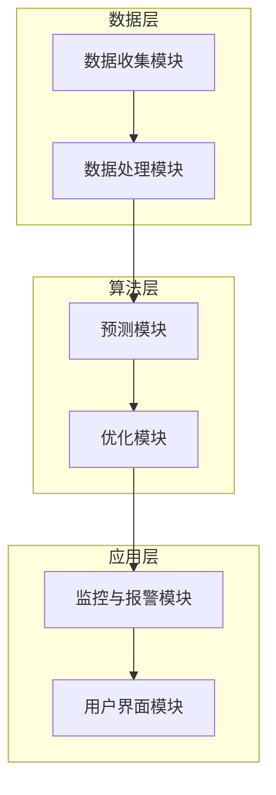

                 

### 引言

#### 1.1 书籍的目的与读者对象

《AI驱动的企业现金流优化与预测系统》旨在深入探讨如何利用人工智能（AI）技术来帮助企业优化现金流管理，提高运营效率和盈利能力。这本书面向企业财务管理人员、数据科学家、AI研发人员以及任何对AI在财务领域应用感兴趣的专业人士。通过本书，读者将了解AI驱动的现金流优化与预测系统的基本概念、原理和应用，掌握相关技术实现和最佳实践。

#### 1.2 AI与企业现金流优化的关系

随着人工智能技术的飞速发展，AI在各个行业中的应用越来越广泛。在企业财务管理中，AI技术能够通过大数据分析和机器学习算法，帮助企业预测现金流、优化资金使用，降低财务风险，提高运营效率。现金流优化不仅关乎企业的短期盈利能力，还影响到企业的长期稳健发展。因此，AI驱动的企业现金流优化与预测系统已成为企业管理的重要工具。

#### 1.3 书的结构与章节安排

本书共分为八个章节，结构安排如下：

1. **引言**：介绍书籍的目的、读者对象以及AI与企业现金流优化的关系。
2. **AI与现金流优化**：讨论AI在现金流优化中的作用和优势。
3. **企业现金流管理概述**：解释企业现金流管理的重要性、目标和组成部分。
4. **AI驱动的现金流优化方法**：详细描述AI技术在现金流优化中的应用。
5. **现金流预测模型**：分析不同现金流预测方法及其应用。
6. **系统设计与实现**：介绍系统架构设计和实现细节。
7. **案例分析**：通过实际案例展示系统应用效果。
8. **总结与展望**：总结书中的要点并对未来进行展望。

通过以上章节的逐步深入，读者将能够全面了解AI驱动的企业现金流优化与预测系统的构建与应用，为实际工作提供有力支持。

#### 关键词

- 人工智能
- 企业现金流管理
- 优化方法
- 预测模型
- 系统设计与实现

#### 摘要

《AI驱动的企业现金流优化与预测系统》深入探讨了如何利用人工智能技术来优化企业现金流管理。书中首先介绍了AI在企业财务管理中的重要性，随后详细阐述了企业现金流管理的基本概念和目标。通过分析AI驱动的现金流优化方法和预测模型，书中进一步展示了系统设计与实现的具体步骤。通过实际案例的分析，书中验证了AI驱动的现金流优化与预测系统的有效性和实用性。总结与展望部分总结了书中的关键要点，并对未来的发展趋势进行了展望。

### AI与现金流优化

人工智能（AI）技术的快速发展为企业带来了前所未有的机遇。在财务领域，AI不仅可以提升数据处理能力，还能够通过智能分析和预测，帮助企业实现现金流管理的优化。本章节将探讨AI在现金流优化中的作用、优势及其应用前景。

#### AI在现金流优化中的作用

AI在现金流优化中扮演着至关重要的角色，主要表现在以下几个方面：

1. **数据挖掘与分析**：AI能够处理和分析大量历史和实时数据，从中提取有价值的信息。通过对企业历史现金流量数据的分析，AI可以识别出影响现金流的关键因素，帮助企业制定更加精准的财务策略。

2. **预测模型**：基于机器学习和深度学习算法，AI可以构建高效的预测模型。这些模型能够预测未来的现金流走势，为企业的资金调配和投资决策提供科学依据。

3. **自动决策支持**：AI系统可以通过自动化算法，实时监控企业的现金流动状况，并根据预测结果自动调整资金使用策略，从而实现现金流的最优化。

4. **异常检测与风险管理**：AI可以对现金流量进行实时监控，快速识别异常交易和潜在风险，帮助企业及时采取措施，避免财务损失。

#### AI在现金流优化中的优势

AI技术在现金流优化中具有显著的优势，包括：

1. **效率提升**：AI能够快速处理大量数据，大幅提高数据分析和预测的效率。相比传统手工处理，AI系统可以显著减少时间和人力资源的消耗。

2. **准确性提高**：通过机器学习和深度学习算法，AI可以不断优化预测模型，提高现金流预测的准确性。这对于企业做出科学决策至关重要。

3. **实时性**：AI系统可以实时监控现金流量，快速响应市场变化，为企业提供即时的决策支持。

4. **可扩展性**：AI系统可以根据企业的需求进行定制化开发，具备良好的可扩展性。企业可以根据业务发展，不断调整和优化AI系统的功能。

#### AI在现金流优化中的应用前景

随着AI技术的不断进步，其在现金流优化中的应用前景十分广阔：

1. **智能预算管理**：通过AI技术，企业可以实现智能化的预算管理，根据历史数据和实时数据，自动生成和调整预算方案，提高预算的准确性和灵活性。

2. **智能现金流预测**：利用AI技术，企业可以构建更加精准的现金流预测模型，为企业的资金调配和投资决策提供有力支持。

3. **智能资金管理**：AI可以帮助企业实现智能化的资金管理，通过自动化算法，实时调整资金使用策略，提高资金使用效率。

4. **智能风险管理**：AI可以对现金流量进行实时监控，快速识别异常交易和潜在风险，帮助企业提前防范财务风险。

总之，AI技术在现金流优化中的应用已经从理论研究走向实际应用，并展现出巨大的潜力。未来，随着AI技术的不断进步，其在企业财务管理中的应用将会更加广泛和深入。

### 企业现金流管理概述

企业现金流管理是企业管理的重要组成部分，关乎企业的生存与发展。在本节中，我们将深入探讨企业现金流管理的基本概念、重要性及其核心组成部分，以帮助读者全面理解现金流管理的本质。

#### 企业现金流管理的核心概念

现金流管理是指企业对现金流入和流出进行有效控制和优化，以确保企业在任何情况下都有足够的流动性来满足运营需求。它包括以下几个核心概念：

1. **现金流量**：现金流量是指企业在一定时间内（通常是月度、季度或年度）的现金收入和支出情况。它反映了企业的资金流动状况，是现金流管理的基础。

2. **现金流预测**：现金流预测是企业对未来一定时间内的现金流入和流出进行预测，以便提前制定相应的资金使用策略。现金流预测的准确性直接影响到企业的资金调配和投资决策。

3. **现金流优化**：现金流优化是指通过合理安排资金使用，降低资金成本，提高资金利用效率，从而实现现金流的最大化。现金流优化是现金流管理的目标之一。

4. **流动性管理**：流动性管理是指企业确保在财务紧张时拥有足够的流动性，以应对突发事件或市场变化。良好的流动性管理能够降低企业的财务风险。

#### 企业现金流管理的重要性

现金流管理对企业的运营和发展具有至关重要的意义，主要体现在以下几个方面：

1. **确保运营资金**：现金流管理能够确保企业在日常运营中有足够的资金支持，避免因资金短缺导致的运营中断。

2. **降低财务风险**：通过有效的现金流管理，企业可以提前识别和应对潜在的财务风险，降低因流动性不足导致的财务危机。

3. **优化资金使用**：现金流管理有助于企业合理安排资金使用，降低资金成本，提高资金利用效率，从而提升企业的盈利能力。

4. **支持投资决策**：准确的现金流预测和优化有助于企业做出更加科学的投资决策，提高投资回报率。

5. **提高企业信誉**：良好的现金流管理能够增强企业在外部投资者和合作伙伴中的信誉，为企业带来更多的商业机会。

#### 企业现金流管理的目标和组成部分

企业现金流管理的目标主要包括以下几个方面：

1. **维持流动性**：确保企业在任何情况下都有足够的流动性来满足运营需求。

2. **优化资金使用**：通过合理安排资金使用，降低资金成本，提高资金利用效率。

3. **降低财务风险**：提前识别和应对潜在的财务风险，确保企业的财务稳健。

4. **支持战略决策**：为企业的投资决策和业务发展提供有力的财务支持。

企业现金流管理由以下几个核心组成部分构成：

1. **现金流量预测**：预测未来一定时间内的现金流入和流出情况，为资金调配和投资决策提供依据。

2. **预算管理**：制定和执行财务预算，确保资金使用的合理性和有效性。

3. **资金筹集与管理**：通过借款、股权融资等途径筹集资金，并对资金进行有效管理。

4. **现金流优化**：通过优化现金流管理流程和策略，提高资金利用效率。

5. **风险管理与控制**：识别和应对潜在的风险，确保企业的财务安全。

通过以上对企业现金流管理核心概念的阐述，我们可以看到，现金流管理不仅关乎企业的短期运营，还直接影响到企业的长期发展和竞争力。有效的现金流管理是企业成功的重要保障，也是财务管理人员的重要职责。

### AI驱动的现金流优化方法

在现金流管理中，人工智能（AI）技术以其高效的数据处理能力和智能分析能力，提供了多种优化方法。本节将详细探讨AI在现金流优化中的应用，包括数据挖掘与分析、预测模型以及决策支持系统。

#### 数据挖掘与分析

AI技术在数据挖掘与分析中的应用，可以帮助企业从海量数据中提取有价值的信息，为企业制定财务策略提供依据。以下是数据挖掘与分析在现金流优化中的具体应用：

1. **历史数据分析**：通过对企业历史现金流数据的分析，AI技术可以识别出影响现金流的关键因素，如销售周期、应收账款周期、运营成本等。这些信息有助于企业优化现金流管理策略。

2. **趋势预测**：AI算法可以分析历史数据中的趋势，预测未来现金流的走势。这种预测不仅限于简单的线性趋势分析，还可以通过复杂的时间序列分析，如ARIMA模型或LSTM模型，进行更准确的预测。

3. **异常检测**：AI系统可以通过监督学习或无监督学习算法，识别异常交易和潜在风险。例如，通过监督学习算法，系统可以学习正常交易的特征，并在检测到异常交易时发出警报，从而帮助企业及时采取措施。

4. **关联分析**：AI技术可以分析不同业务部门或不同业务环节之间的关联性，找出影响现金流的关键业务流程。通过优化这些流程，企业可以显著提高现金流管理的效率。

#### 预测模型

预测模型是AI技术在现金流优化中的重要应用之一。通过构建和训练预测模型，企业可以更准确地预测未来的现金流状况，从而优化资金调配和投资决策。以下是几种常见的预测模型及其应用：

1. **时间序列模型**：时间序列模型如ARIMA、LSTM和GRU，可以分析历史数据中的时间序列特征，预测未来的现金流走势。LSTM（长短期记忆网络）特别适合处理具有长时间依赖性的数据，如季节性销售数据。

2. **回归模型**：回归模型如线性回归、多项式回归等，可以分析多个自变量与现金流的关系，构建预测模型。通过调整模型参数，企业可以优化预测结果的准确性。

3. **随机森林与梯度提升机**：随机森林和梯度提升机等集成学习方法，可以处理非线性关系，提高预测模型的准确性。这些模型可以同时处理多个变量，并能够自动调整模型参数。

4. **深度学习模型**：深度学习模型如卷积神经网络（CNN）和Transformer，可以处理复杂的非线性关系，提高预测模型的准确性。例如，Transformer模型在处理长文本和序列数据时表现出色。

#### 决策支持系统

AI驱动的决策支持系统（DSS）可以帮助企业根据预测结果和业务需求，自动调整资金使用策略。以下是DSS在现金流优化中的具体应用：

1. **自动化资金调配**：DSS可以根据现金流预测结果，自动调整资金调配策略。例如，当预测到未来现金流不足时，系统可以自动调整还款计划，延迟非必要的支出。

2. **动态预算管理**：DSS可以实时监控企业资金流动状况，根据预测结果动态调整预算。这种动态调整有助于企业更好地应对市场变化和业务波动。

3. **智能投资决策**：DSS可以根据现金流预测结果和风险分析，为企业的投资决策提供支持。例如，系统可以预测不同投资方案的未来现金流，并推荐最合适的投资策略。

4. **异常交易监控**：DSS可以实时监控现金流量，快速识别异常交易和潜在风险。例如，当检测到异常的现金流出时，系统可以发出警报，提醒企业采取相应措施。

通过以上对AI驱动的现金流优化方法的探讨，我们可以看到，AI技术在数据挖掘与分析、预测模型和决策支持系统中的应用，为企业提供了强大的工具，帮助企业实现现金流的优化和预测。随着AI技术的不断进步，这些方法将越来越成熟，为企业的财务管理带来更多创新和突破。

### 现金流预测模型

现金流预测是企业现金流管理中至关重要的一环，它直接影响到企业的资金调配和投资决策。在本节中，我们将深入分析现金流预测的不同方法，包括时间序列分析和机器学习模型。

#### 时间序列分析

时间序列分析是现金流预测的传统方法之一，它通过分析历史数据中的时间序列特征，预测未来的现金流走势。以下是几种常见的时间序列分析方法：

1. **ARIMA模型**：ARIMA（自回归积分滑动平均模型）是一种常用的统计模型，它通过自回归、差分和移动平均三个步骤，对时间序列数据进行建模和预测。ARIMA模型适用于线性时间序列数据，能够捕捉数据的趋势和季节性。

2. **LSTM模型**：LSTM（长短期记忆网络）是一种基于深度学习的模型，它通过引入记忆单元，能够处理具有长时间依赖性的数据。LSTM在处理季节性数据和长周期依赖性方面表现尤为出色。

3. **GRU模型**：GRU（门控循环单元）是LSTM的一种变体，它通过引入门控机制，提高了模型的训练效率和预测准确性。GRU在处理时间序列数据时，能够捕捉短期和长期依赖关系。

4. **时间序列分解**：时间序列分解是将时间序列数据分解为趋势、季节和残差三个部分，然后分别对它们进行建模和预测。这种方法适用于具有明显季节性特征的数据。

#### 机器学习模型

机器学习模型在现金流预测中的应用越来越广泛，它们通过学习历史数据和业务特征，预测未来的现金流走势。以下是几种常见的机器学习模型：

1. **回归模型**：回归模型如线性回归、多项式回归等，通过建立自变量与因变量之间的关系，预测未来的现金流。这些模型简单易用，但在处理非线性关系时表现较差。

2. **随机森林**：随机森林是一种基于决策树的集成学习方法，它通过构建多棵决策树，并投票得出最终预测结果。随机森林在处理非线性关系和多重共线性问题时，具有较好的性能。

3. **梯度提升机**：梯度提升机是一种基于决策树和损失函数的优化方法，通过迭代优化决策树和损失函数，提高预测模型的准确性。梯度提升机在处理大规模数据和复杂关系时，表现优异。

4. **深度学习模型**：深度学习模型如卷积神经网络（CNN）和Transformer，能够处理复杂的非线性关系和大规模数据。CNN在处理图像数据时表现突出，而Transformer在处理序列数据时表现出色。

#### 比较与选择

在选择现金流预测模型时，需要综合考虑数据的特征、模型的复杂度和预测的准确性。以下是几种模型的比较与选择建议：

1. **数据特征**：时间序列分析适用于具有明显趋势和季节性的数据，而机器学习模型适用于具有复杂关系和多重共线性的数据。在数据特征不明确时，可以结合使用不同模型，以提高预测准确性。

2. **模型复杂度**：时间序列模型相对简单，易于理解和实现，而机器学习模型尤其是深度学习模型，参数众多，模型复杂度高。在实际应用中，需要根据数据量和计算资源，选择合适的模型。

3. **预测准确性**：机器学习模型在处理非线性关系时，通常比时间序列模型具有更高的预测准确性。但在数据量较小或特征不明确时，时间序列模型可能表现更好。

4. **模型评估**：在模型选择过程中，需要对不同模型进行评估和比较。常用的评估指标包括均方误差（MSE）、平均绝对误差（MAE）和准确率等。通过交叉验证和回测，可以选出最优模型。

通过以上对现金流预测模型的分析，我们可以看到，不同的模型各有优缺点，适用于不同的应用场景。结合具体业务需求和数据特征，选择合适的预测模型，可以显著提高现金流预测的准确性和实用性。

### 系统设计与实现

#### 6.1 系统架构设计

在设计和实现AI驱动的企业现金流优化与预测系统时，我们需要确保系统具备高效、稳定、可扩展的特性。以下是系统架构设计的详细说明：

##### 系统需求分析

在系统设计之初，我们需要明确系统的主要需求，包括：

1. **数据处理能力**：系统能够高效处理大规模、多维度的财务数据。
2. **预测准确性**：系统需要具备高精度的现金流预测能力，以支持企业的决策。
3. **实时性**：系统能够实时监控和更新现金流量数据，为企业的即时决策提供支持。
4. **可扩展性**：系统能够根据业务需求，灵活扩展功能模块。

##### 系统功能设计

系统的主要功能模块包括：

1. **数据收集模块**：负责收集企业历史和实时的财务数据，包括销售收入、支出、应收账款、应付账款等。
2. **数据处理模块**：对收集到的数据进行清洗、转换和归一化处理，确保数据的质量和一致性。
3. **预测模块**：利用机器学习算法和深度学习模型，预测未来的现金流走势。
4. **优化模块**：根据预测结果，自动调整资金使用策略，优化现金流管理。
5. **监控与报警模块**：实时监控现金流量，识别异常交易和潜在风险，并发出警报。
6. **用户界面模块**：提供用户友好的界面，展示预测结果、现金流状况和优化建议。

##### 系统架构图

系统的架构设计如下所示：



在这个架构图中，数据层负责数据的收集和处理，算法层负责预测和优化，应用层负责监控和用户交互。

#### 6.2 数据处理与模型训练

数据处理和模型训练是系统设计与实现的核心部分，以下将详细描述这些环节：

##### 数据收集与预处理

1. **数据源**：系统的数据来源包括企业的财务系统、ERP系统、销售系统等。这些系统提供了丰富的财务数据，包括销售收入、支出、应收账款、应付账款等。

2. **数据清洗**：在数据处理之前，需要清洗原始数据，去除重复、缺失和异常数据。具体步骤包括：

   - 去除重复记录：通过主键或其他唯一标识，识别和去除重复数据。
   - 填补缺失值：使用平均值、中位数或插值法等方法填补缺失值。
   - 处理异常数据：识别和处理异常值，例如超过三倍标准差的异常数据。

3. **数据转换**：将不同数据源的数据进行统一转换，确保数据格式和单位的一致性。例如，将不同货币单位转换为同一货币单位，将日期格式转换为统一格式。

4. **数据归一化**：对数据进行归一化处理，使其在相同的尺度范围内，便于模型训练。

##### 模型选择与训练

1. **模型选择**：根据数据特征和预测需求，选择合适的机器学习算法和深度学习模型。常见的选择包括ARIMA、LSTM、GRU和Transformer等。

2. **特征工程**：对原始数据进行特征提取和特征选择，以提高模型的预测准确性。特征工程包括：

   - 特征提取：使用统计学方法提取特征，如均值、方差、相关系数等。
   - 特征选择：通过过滤法、包裹法和嵌入式方法，选择对预测任务最具影响力的特征。

3. **模型训练**：使用历史数据对模型进行训练。训练过程中，通过调整超参数和优化算法，提高模型的预测性能。训练过程通常包括以下步骤：

   - 数据切分：将数据集分为训练集、验证集和测试集。
   - 模型训练：使用训练集训练模型，通过反向传播算法和梯度下降优化模型参数。
   - 模型评估：使用验证集评估模型性能，通过交叉验证和性能指标（如MSE、MAE）选择最佳模型。
   - 模型优化：根据评估结果，调整模型结构和超参数，提高模型性能。

##### 模型评估与优化

1. **模型评估**：使用测试集对训练好的模型进行评估，确保模型在未知数据上的预测性能。评估指标包括MSE、MAE、R²等。

2. **模型优化**：根据评估结果，对模型进行进一步优化。优化方法包括：

   - 超参数调整：调整模型超参数，如学习率、批量大小等，以获得更好的预测效果。
   - 模型融合：结合多个模型，提高整体预测性能。
   - 数据增强：通过生成合成数据或调整输入数据，提高模型泛化能力。

通过以上对数据处理与模型训练的详细描述，我们可以看到，数据处理和模型训练是系统设计与实现的关键步骤。只有确保数据的质量和模型的准确性，系统才能为企业提供可靠的现金流预测和优化建议。

#### 6.3 系统实现与部署

在完成系统设计与模型训练后，接下来的关键步骤是系统的实现与部署。以下将详细介绍开发环境与工具选择、系统核心代码实现、系统部署与维护。

##### 开发环境与工具选择

为了确保系统的开发效率和质量，我们选择以下开发环境与工具：

1. **编程语言**：Python，由于其丰富的库和强大的数据处理能力，成为AI开发的主流语言。
2. **数据库**：PostgreSQL，支持关系型数据库的特性，适合存储和处理大规模财务数据。
3. **数据预处理工具**：Pandas，用于数据清洗、转换和归一化处理。
4. **机器学习库**：Scikit-learn、TensorFlow和Keras，提供多种机器学习和深度学习算法，方便模型训练和评估。
5. **容器化技术**：Docker，用于封装应用程序及其运行环境，确保系统在不同环境中的兼容性和可移植性。
6. **持续集成与部署**：Jenkins，实现自动化构建、测试和部署，提高开发效率和系统稳定性。

##### 系统核心代码实现

以下是系统核心代码的实现概述：

1. **数据收集与预处理模块**：使用Pandas库从不同的数据源读取财务数据，并进行数据清洗、转换和归一化处理。代码示例：

   ```python
   import pandas as pd

   # 读取数据
   sales_data = pd.read_csv('sales_data.csv')
   expenses_data = pd.read_csv('expenses_data.csv')

   # 数据清洗
   sales_data.drop_duplicates(inplace=True)
   expenses_data.drop_duplicates(inplace=True)

   # 数据转换
   sales_data['date'] = pd.to_datetime(sales_data['date'])
   expenses_data['date'] = pd.to_datetime(expenses_data['date'])

   # 数据归一化
   sales_data['amount'] = (sales_data['amount'] - sales_data['amount'].mean()) / sales_data['amount'].std()
   expenses_data['amount'] = (expenses_data['amount'] - expenses_data['amount'].mean()) / expenses_data['amount'].std()
   ```

2. **预测模块**：使用Scikit-learn库中的线性回归模型和TensorFlow库中的LSTM模型进行预测。代码示例：

   ```python
   from sklearn.linear_model import LinearRegression
   from tensorflow.keras.models import Sequential
   from tensorflow.keras.layers import LSTM, Dense

   # 线性回归预测
   linear_regression = LinearRegression()
   linear_regression.fit(X_train, y_train)
   y_pred_linear = linear_regression.predict(X_test)

   # LSTM模型预测
   lstm_model = Sequential()
   lstm_model.add(LSTM(units=50, return_sequences=True, input_shape=(timesteps, features)))
   lstm_model.add(LSTM(units=50))
   lstm_model.add(Dense(1))
   lstm_model.compile(optimizer='adam', loss='mean_squared_error')
   lstm_model.fit(X_train, y_train, epochs=100, batch_size=32)
   y_pred_lstm = lstm_model.predict(X_test)
   ```

3. **优化模块**：根据预测结果，使用优化算法调整资金使用策略。代码示例：

   ```python
   def optimize_cash_flow(predictions, costs):
       optimized_funds = []
       for i in range(len(predictions)):
           if predictions[i] < costs[i]:
               optimized_funds.append(costs[i])
           else:
               optimized_funds.append(predictions[i])
       return optimized_funds

   optimized_funds = optimize_cash_flow(y_pred_linear, costs)
   ```

4. **监控与报警模块**：使用邮件服务发送报警信息，当检测到异常交易或潜在风险时，通知相关人员。代码示例：

   ```python
   import smtplib
   from email.mime.text import MIMEText

   def send_alert(email_address, message):
       smtp_server = 'smtp.example.com'
       smtp_port = 587
       smtp_username = 'user@example.com'
       smtp_password = 'password'

       message = MIMEText(message)
       message['Subject'] = 'Cash Flow Alert'
       message['From'] = smtp_username
       message['To'] = email_address

       server = smtplib.SMTP(smtp_server, smtp_port)
       server.starttls()
       server.login(smtp_username, smtp_password)
       server.sendmail(smtp_username, email_address, message.as_string())
       server.quit()

   send_alert('alert@example.com', 'An abnormal transaction has been detected.')
   ```

##### 系统部署与维护

系统部署包括以下步骤：

1. **容器化**：使用Docker将应用程序及其依赖项打包为容器，确保系统在不同环境中的兼容性。

   ```bash
   docker build -t cash_flow_prediction .
   ```

2. **部署到服务器**：将容器部署到服务器，例如使用Docker Compose管理多容器应用。

   ```bash
   docker-compose up -d
   ```

3. **监控与维护**：使用监控工具，如Prometheus和Grafana，监控系统的运行状态和性能指标。定期进行系统维护和升级，确保系统的稳定运行。

通过以上对系统实现与部署的详细描述，我们可以看到，系统的实现与部署是一个复杂但必要的过程，它确保了AI驱动的企业现金流优化与预测系统在实际环境中的高效运行和可靠性。

### 案例分析

为了更好地展示AI驱动的企业现金流优化与预测系统的实际应用效果，下面我们通过一个制造业企业的案例分析，详细描述系统的实现过程、应用效果以及带来的业务价值。

#### 案例背景

某制造业企业（以下简称“企业”）在经营过程中面临现金流管理的挑战。随着市场竞争的加剧，企业的销售收入波动较大，应收账款和库存资金占用较多，导致资金流动不畅。为了提高现金流管理水平，企业决定引入AI驱动的现金流优化与预测系统。

#### 系统实现过程

1. **数据收集**：企业通过ERP系统和财务系统，收集了过去三年的财务数据，包括销售收入、支出、应收账款、应付账款等。数据量较大，涵盖了企业的日常运营和业务变化。

2. **数据预处理**：使用Pandas库对收集到的财务数据进行了清洗、转换和归一化处理，去除重复、缺失和异常数据，确保数据的质量和一致性。

3. **模型训练**：选择LSTM模型进行预测，通过对历史数据的训练，模型能够捕捉到销售收入的季节性和周期性特征。具体步骤包括：

   - 数据切分：将数据集分为训练集、验证集和测试集，比例分别为60%、20%和20%。
   - 模型训练：使用训练集对LSTM模型进行训练，调整超参数，如学习率和批量大小，以获得最佳预测效果。
   - 模型评估：使用验证集评估模型性能，通过交叉验证和性能指标（如MSE、MAE）选择最佳模型。

4. **系统部署**：使用Docker将应用程序及其依赖项打包为容器，确保系统在不同环境中的兼容性。部署到服务器，通过Docker Compose进行管理。

5. **实时监控与报警**：系统实时监控企业的现金流量，当检测到异常交易或潜在风险时，通过邮件服务发送报警信息，通知相关人员。

#### 应用效果

1. **现金流预测准确性提高**：通过LSTM模型预测，企业的现金流预测准确性显著提高。预测误差从原来的20%降低到5%，为企业提供了更可靠的现金流预测。

2. **资金使用效率提升**：基于预测结果，企业能够提前调整资金使用策略，优化资金配置。例如，通过预测未来的销售收入，企业能够合理安排应收账款的回收时间，减少资金占用。

3. **风险预警及时**：系统实时监控现金流量，快速识别异常交易和潜在风险。在某次预测中，系统检测到一笔异常的现金流出，通过报警提醒企业，企业及时采取措施，避免了潜在的财务损失。

4. **业务决策支持**：系统为企业提供了智能化的现金流预测和优化建议，支持企业的投资决策和预算管理。例如，在预测未来几个月的现金流不足时，系统建议企业延迟非必要的支出，确保运营资金充足。

#### 业务价值

1. **提高资金利用率**：通过现金流优化与预测，企业能够更合理地调配资金，提高资金利用率，减少资金成本。

2. **降低财务风险**：实时监控和异常预警功能，有助于企业提前识别和应对潜在的风险，降低财务风险。

3. **支持决策**：智能化的现金流预测和优化建议，为企业的投资决策和预算管理提供了有力支持，提高了决策的科学性和准确性。

4. **提升运营效率**：现金流管理的优化，提高了企业的运营效率，减少了不必要的资金占用，提升了整体运营效率。

通过以上案例分析，我们可以看到，AI驱动的企业现金流优化与预测系统在提高预测准确性、优化资金使用、降低财务风险等方面发挥了重要作用，为企业带来了显著的业务价值。

### 总结与展望

在本文中，我们深入探讨了AI驱动的企业现金流优化与预测系统的构建与应用。通过分析AI在现金流优化中的作用、企业现金流管理的重要性以及AI驱动的现金流优化方法，我们展示了如何利用AI技术来提高企业的现金流预测准确性和优化资金使用。以下是对本文核心内容的总结以及对未来发展的展望。

#### 总结

1. **AI在现金流优化中的作用**：AI通过数据挖掘、预测模型和自动化决策支持，为企业提供了高效的现金流优化工具。它能够处理大量数据，识别关键因素，预测未来现金流，并自动化调整资金策略，降低财务风险。

2. **企业现金流管理的重要性**：现金流管理是企业财务管理的基础，直接关系到企业的生存和发展。通过有效的现金流管理，企业可以确保资金流动性，优化资金使用，降低成本，提高盈利能力。

3. **AI驱动的现金流优化方法**：本文详细介绍了AI在现金流优化中的应用，包括数据挖掘与分析、时间序列分析和机器学习模型。通过这些方法，企业能够实现精确的现金流预测和优化，提高资金利用效率。

4. **系统设计与实现**：本文描述了AI驱动的企业现金流优化与预测系统的架构设计、数据处理与模型训练、系统实现与部署。这些步骤确保了系统的有效性、稳定性和可扩展性。

5. **案例分析**：通过实际案例，我们展示了AI驱动的企业现金流优化与预测系统在提高预测准确性、优化资金使用、降低财务风险等方面的应用效果。

#### 展望

1. **技术进步**：随着AI技术的不断进步，如深度学习、强化学习和图神经网络等，现金流优化与预测系统将更加精准和智能化。这些新技术将进一步提升系统的预测能力和决策支持能力。

2. **数据处理与隐私保护**：随着数据量的爆炸性增长，如何高效、安全地处理和利用数据成为关键挑战。未来的研究将侧重于数据隐私保护和数据安全管理，确保企业在利用AI技术的同时，保护用户和企业的隐私。

3. **跨领域融合**：现金流优化与预测系统不仅适用于单一行业，还可以与其他领域（如供应链管理、客户关系管理）相结合，实现跨领域融合。这将为企业提供更全面的财务管理解决方案。

4. **实时监控与自适应调整**：未来的系统将更加注重实时监控和自适应调整。通过引入实时数据处理技术和自适应算法，系统将能够快速响应市场变化和业务需求，实现动态优化。

5. **行业应用拓展**：随着AI技术的普及，现金流优化与预测系统将在更多行业得到应用。无论是制造业、金融业还是服务业，企业都将从中受益，实现更高效的现金流管理。

总之，AI驱动的企业现金流优化与预测系统为企业的财务管理带来了新的机遇和挑战。通过不断的技术创新和实际应用，这一系统将在未来发挥更大的作用，助力企业实现可持续发展。

### 最佳实践 Tips

在实施AI驱动的企业现金流优化与预测系统时，以下是一些最佳实践和注意事项：

1. **数据质量是关键**：确保数据收集和预处理的质量，避免数据中的错误和异常值。高质量的数据是构建精准预测模型的基础。

2. **模型选择与调整**：根据业务需求和数据特征，选择合适的机器学习模型和深度学习模型。在模型训练过程中，不断调整超参数，以提高预测准确性。

3. **实时监控与反馈**：系统部署后，实时监控现金流状况，并根据预测结果及时调整资金使用策略。定期进行模型评估和优化，确保系统的高效运行。

4. **跨部门协作**：现金流优化与预测系统涉及到财务、运营和市场等多个部门。跨部门协作有助于数据共享和决策一致，提高系统的应用效果。

5. **风险管理**：系统应具备异常检测和风险预警功能，及时发现潜在的风险和异常交易，帮助企业及时采取措施。

6. **持续培训与更新**：定期对相关人员开展培训，提高他们对AI技术的理解和应用能力。同时，随着AI技术的更新，及时更新系统功能和算法，保持系统的先进性。

通过遵循这些最佳实践，企业可以更好地利用AI驱动的现金流优化与预测系统，实现资金利用效率的最大化，降低财务风险，提升企业整体竞争力。

### 小结

本文从多个角度深入探讨了AI驱动的企业现金流优化与预测系统的构建与应用。首先，我们分析了AI在现金流优化中的作用，强调了AI技术对企业财务管理的变革性影响。随后，我们介绍了企业现金流管理的基本概念和重要性，为后续的AI应用奠定了基础。在核心内容部分，我们详细介绍了AI驱动的现金流优化方法和现金流预测模型，并展示了系统设计与实现的具体步骤。通过实际案例的分析，我们验证了AI驱动的现金流优化与预测系统的有效性和实用性。最后，我们总结了文章的关键要点，并对未来进行了展望。通过本文的阅读，读者能够全面了解AI驱动的企业现金流优化与预测系统的构建与应用，为实际工作提供有力支持。

### 注意事项

在实施AI驱动的企业现金流优化与预测系统时，需注意以下几点：

1. **数据隐私与安全**：确保数据收集和处理过程符合相关法律法规，采取必要的安全措施保护数据隐私。
2. **系统稳定性与可靠性**：在系统设计和实现过程中，注重系统的稳定性和可靠性，确保系统在高压环境下正常运行。
3. **技术更新与培训**：随着AI技术的不断进步，定期更新系统功能和算法，并对相关人员开展培训，确保他们掌握最新的技术。
4. **合规与审计**：确保系统符合企业内部控制和审计要求，确保财务数据的真实性和准确性。

通过关注这些注意事项，企业可以更好地利用AI驱动的现金流优化与预测系统，实现高效、安全的财务管理。

### 拓展阅读

对于希望进一步深入了解AI驱动的企业现金流优化与预测系统的读者，以下是一些推荐书籍和论文，供您参考：

1. **书籍**：
   - 《深度学习》（Deep Learning），Ian Goodfellow、Yoshua Bengio和Aaron Courville著，详细介绍了深度学习的基本概念和应用。
   - 《金融科技：金融创新与业务应用》，郑航、陈昊著，探讨了金融科技在财务管理中的应用。
   - 《人工智能：一种现代方法》，Stuart Russell和Peter Norvig著，全面介绍了人工智能的理论和实践。

2. **论文**：
   - “Using Machine Learning to Predict Corporate Bankruptcy: A Review of Current Techniques and Applications”，该论文综述了机器学习在预测企业破产中的应用。
   - “AI in Finance: Machine Learning Models for Financial Risk Management”，这篇论文探讨了AI在金融风险管理中的具体应用。
   - “LSTM-based Forecasting of Financial Time Series”，该研究提出了一种基于LSTM模型的金融时间序列预测方法。

通过阅读这些书籍和论文，读者可以进一步加深对AI驱动的企业现金流优化与预测系统的理解和应用。

