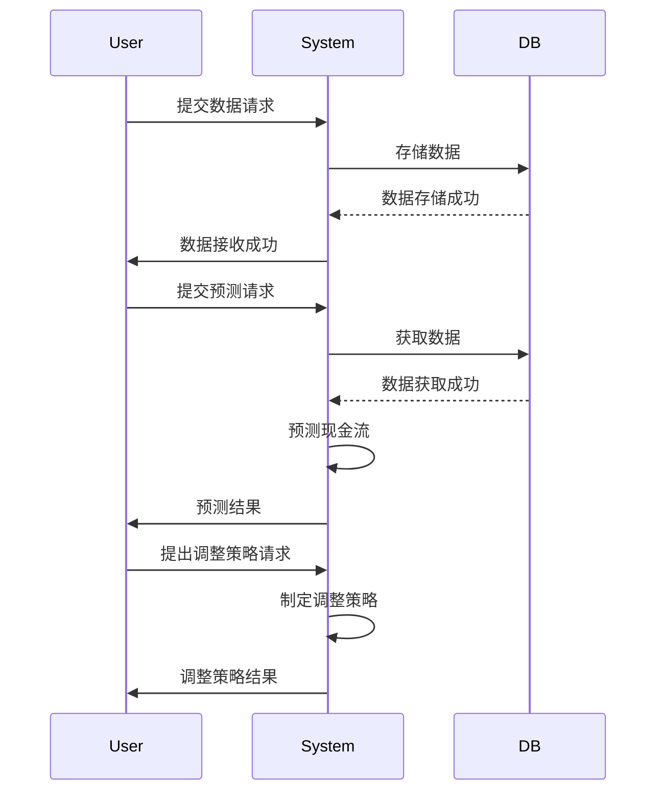
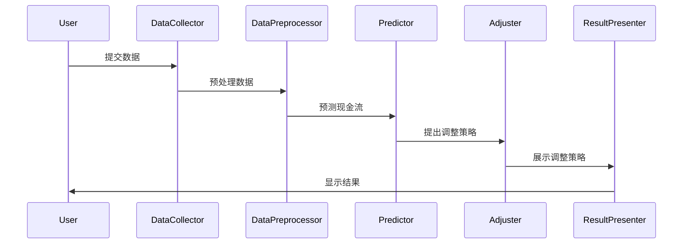

                 

## AI驱动的企业现金流季节性调整系统

> 关键词：人工智能、企业现金流、季节性调整、机器学习、时间序列分析

> 摘要：本文将深入探讨AI驱动的企业现金流季节性调整系统，通过详细的背景介绍、核心概念解析、系统设计与算法原理讲解，以及实际案例分析和最佳实践，全面展现该系统在企业管理中的关键作用。本文旨在为企业和IT从业者提供一套实用、高效的现金流管理解决方案。

### 第一部分：背景介绍与核心概念

#### 第1章：问题背景与核心概念

##### 1.1 问题背景

企业的现金流管理是企业运营中至关重要的一环。然而，由于市场环境的变化、季节性需求的波动等因素，企业往往面临着现金流管理中的诸多挑战。例如，在销售旺季，企业可能会遇到资金紧缺的情况；而在淡季，又可能会出现资金闲置的问题。如何有效地进行现金流季节性调整，以确保企业在不同时期都能维持健康的现金流，是每个企业必须面对的问题。

##### 1.2 核心概念

**AI驱动的企业现金流季节性调整系统**，是指利用人工智能技术，特别是机器学习和时间序列分析方法，对企业现金流数据进行分析和预测，从而实现现金流季节性调整的一套系统。

- **AI驱动**：指的是利用人工智能技术，如机器学习算法，来分析数据和做出预测。
- **企业现金流**：指的是企业在一定时间内（通常是一年）的收入和支出情况。
- **季节性调整**：指的是根据季节性需求的变化，对现金流进行调整，以维持企业的健康运营。

##### 1.3 概念联系

**时间序列分析**和**季节性调整**之间存在密切的联系。时间序列分析是一种用于分析时间序列数据的方法，通过这种方法，可以识别出数据中的趋势、季节性和周期性变化。而季节性调整则是利用时间序列分析的结果，对现金流进行相应的调整，以应对季节性需求的变化。

**机器学习算法**在季节性调整中的应用主要体现在以下几个方面：

1. **预测未来现金流**：通过训练机器学习模型，可以预测未来一段时间内的现金流情况，从而提前做出调整。
2. **识别季节性模式**：机器学习算法可以帮助识别出数据中的季节性模式，从而更好地进行季节性调整。
3. **优化调整策略**：通过不断优化机器学习模型，可以找到最佳的现金流调整策略，以提高企业的运营效率。

#### 第2章：核心概念原理与特征对比

##### 2.1 核心概念原理

**时间序列分析**的基本原理是通过分析时间序列数据中的趋势、季节性和周期性变化，来预测未来的数据。

- **趋势**：时间序列数据中的长期变化趋势。
- **季节性**：时间序列数据中的周期性变化，通常与季节性需求相关。
- **周期性**：时间序列数据中的短期波动，可能受到经济周期等因素的影响。

**机器学习算法**在时间序列分析中的应用主要包括以下几种：

1. **线性回归**：通过建立时间序列数据与预测目标之间的线性关系，来预测未来的数据。
2. **ARIMA模型**（自回归积分滑动平均模型）：通过自回归、差分和移动平均三个步骤，来分析时间序列数据。
3. **LSTM模型**（长短时记忆网络）：通过记忆长期依赖信息的能力，来预测时间序列数据。

##### 2.2 特征对比

**时间序列分析**和**机器学习算法**在特征对比方面有以下几个关键点：

- **适用性**：时间序列分析更适用于有明显季节性和周期性的数据，而机器学习算法则更适用于复杂、非线性关系的数据。
- **预测精度**：机器学习算法通常具有更高的预测精度，但需要对数据进行更多的预处理。
- **计算复杂度**：时间序列分析通常计算复杂度较低，而机器学习算法可能需要更多的计算资源。

##### 2.3 ER实体关系图架构

为了更好地理解企业现金流季节性调整系统的核心概念和架构，我们可以绘制一个ER实体关系图，如下所示：

```mermaid
erDiagram
    Customer ||--|{ Order : places }  
    Product ||--|{ Order : contains }  
    Supplier ||--|{ PurchaseOrder : supplies }  
    Inventory ||--|{ Product : manages }  
    Employee ||--|{ Department : works_in }  
    Department ||--|{ Project : manages }  
    Project ||--|{ Task : part_of }  
    Task ||--|{ Employee : assigned_to }
```

在这个ER图中，展示了企业中常见的实体及其关系，如客户、产品、供应商、库存、员工、部门和项目等。这些实体之间的关系将构成企业现金流季节性调整系统的基础。

### 第二部分：系统设计与算法原理

#### 第3章：系统设计与架构

##### 3.1 系统设计

企业现金流季节性调整系统的设计目标是提供一个自动化的解决方案，帮助企业识别季节性变化，并自动调整现金流，以维持企业的健康运营。

- **功能模块**：系统主要包括数据收集模块、数据预处理模块、预测模块、调整策略模块和结果展示模块。
- **数据收集**：收集企业历史现金流数据、销售数据、市场环境数据等。
- **数据预处理**：对收集到的数据进行清洗、去噪、归一化等预处理操作。
- **预测**：利用机器学习算法预测未来一段时间内的现金流。
- **调整策略**：根据预测结果，制定相应的现金流调整策略。
- **结果展示**：将调整策略和预测结果以图表、报表等形式展示给企业决策者。

##### 3.2 系统架构设计

企业现金流季节性调整系统的架构设计采用分层架构，主要包括数据层、服务层和展示层。

- **数据层**：负责数据存储和管理，包括企业历史现金流数据、销售数据、市场环境数据等。
- **服务层**：包括数据预处理服务、预测服务、调整策略服务和结果展示服务。
- **展示层**：负责将预测结果和调整策略以图表、报表等形式展示给企业决策者。

系统架构设计mermaid架构图如下所示：



##### 3.3 系统接口设计

系统接口设计主要包括API接口和数据接口。

- **API接口**：提供数据收集、预测和调整策略等功能的API接口，供企业决策者和开发者使用。
- **数据接口**：提供与外部数据源（如ERP系统、CRM系统等）的数据交互接口，实现数据的导入和导出。

##### 3.4 系统交互设计

系统交互设计主要描述系统内部各模块之间的交互过程。以下是一个简单的mermaid序列图，展示了系统交互过程：



#### 第4章：算法原理讲解与数学模型

##### 4.1 算法原理讲解

企业现金流季节性调整系统主要采用机器学习算法进行预测和调整。以下介绍几种常用的机器学习算法及其原理：

1. **线性回归**：通过建立现金流数据与预测目标之间的线性关系，进行预测。
   ```python
   y = b0 + b1 * x
   ```
   其中，y为预测目标，x为自变量，b0和b1为系数。

2. **ARIMA模型**：通过自回归、差分和移动平均三个步骤，对时间序列数据进行建模和预测。
   ```python
   model = ARIMA(data, order=(p, d, q))
   model_fit = model.fit()
   forecast = model_fit.forecast(steps=n)
   ```

3. **LSTM模型**：通过记忆长期依赖信息的能力，进行时间序列数据的预测。
   ```python
   model = Sequential()
   model.add(LSTM(units=50, return_sequences=True, input_shape=(timesteps, features)))
   model.add(LSTM(units=50, return_sequences=False))
   model.add(Dense(1))
   model.compile(optimizer='adam', loss='mean_squared_error')
   model.fit(x, y, epochs=100, batch_size=32, validation_split=0.1)
   ```

##### 4.2 数学模型与公式讲解

1. **线性回归模型**：

   线性回归模型的基本公式为：
   $$y = b_0 + b_1x$$

   其中，$y$为预测目标，$x$为自变量，$b_0$和$b_1$为系数。通过最小二乘法求解系数$b_0$和$b_1$，使得预测值$y$与实际值之间的误差最小。

2. **ARIMA模型**：

   ARIMA模型由三个部分组成：自回归（AR）、差分（I）和移动平均（MA）。

   自回归模型公式为：
   $$y_t = c + \phi_1y_{t-1} + \phi_2y_{t-2} + \cdots + \phi_ky_{t-k} + \varepsilon_t$$

   差分模型公式为：
   $$y_t^d = y_t - y_{t-1}$$

   移动平均模型公式为：
   $$y_t = c + \theta_1\varepsilon_{t-1} + \theta_2\varepsilon_{t-2} + \cdots + \theta_my_{t-m}$$

   通过将自回归、差分和移动平均模型结合起来，可以得到ARIMA模型：
   $$y_t^d = \Phi(B)y_t + \Theta(B)\varepsilon_t$$

   其中，$B$为滞后算子，$\Phi(B)$和$\Theta(B)$分别为自回归和移动平均参数。

3. **LSTM模型**：

   LSTM模型的核心是单元状态（state）的更新和输出。状态更新公式为：
   $$i_t = \sigma(W_i \cdot [h_{t-1}, x_t] + b_i)$$
   $$f_t = \sigma(W_f \cdot [h_{t-1}, x_t] + b_f)$$
   $$g_t = \tanh(W_g \cdot [h_{t-1}, x_t] + b_g)$$
   $$o_t = \sigma(W_o \cdot [h_{t-1}, x_t] + b_o)$$

   输出公式为：
   $$h_t = o_t \cdot \tanh(g_t)$$

   其中，$i_t$、$f_t$、$g_t$和$o_t$分别为输入门、遗忘门、生成门和输出门，$\sigma$为激活函数（通常使用Sigmoid函数），$W$和$b$分别为权重和偏置。

##### 4.3 举例说明

以下是一个简单的线性回归算法的例子，用于预测企业未来一个月的现金流：

```python
import numpy as np
import matplotlib.pyplot as plt

# 生成模拟数据
np.random.seed(0)
x = np.random.rand(100)
y = 2 * x + 1 + np.random.randn(100) * 0.1

# 拟合线性回归模型
model = LinearRegression()
model.fit(x.reshape(-1, 1), y)

# 预测
x_predict = np.linspace(0, 1, 100).reshape(-1, 1)
y_predict = model.predict(x_predict)

# 绘图
plt.scatter(x, y)
plt.plot(x_predict, y_predict, color='red')
plt.show()
```

在这个例子中，我们首先生成了一组模拟数据，然后使用线性回归模型进行拟合，并绘制了真实值与预测值的关系图。通过这个简单的例子，可以直观地看到线性回归模型的基本原理和应用。

### 第三部分：项目实战与案例分析

#### 第5章：项目实战

##### 5.1 环境安装

为了进行企业现金流季节性调整系统的项目实战，我们需要安装以下软件和库：

- Python（3.8及以上版本）
- NumPy
- Pandas
- Matplotlib
- Scikit-learn
- Keras（用于LSTM模型）

安装命令如下：

```bash
pip install numpy pandas matplotlib scikit-learn keras
```

##### 5.2 系统核心实现源代码

以下是一个简单的企业现金流季节性调整系统的核心实现源代码，包括数据收集、预测和调整策略等功能。

```python
import numpy as np
import pandas as pd
from sklearn.linear_model import LinearRegression
from keras.models import Sequential
from keras.layers import LSTM, Dense

# 5.2.1 数据收集
def collect_data():
    # 从文件中读取数据
    data = pd.read_csv('cashflow_data.csv')
    return data

# 5.2.2 数据预处理
def preprocess_data(data):
    # 数据清洗和归一化
    data = data.dropna()
    data['cashflow_normalized'] = data['cashflow'] / data['cashflow'].max()
    return data

# 5.2.3 预测
def predict_cashflow(data, model):
    # 利用模型进行预测
    last_cashflow = data['cashflow_normalized'].iloc[-1]
    next_cashflow = model.predict(np.array([last_cashflow]))
    return next_cashflow

# 5.2.4 调整策略
def adjust_cashflow(predicted_cashflow, current_cashflow):
    # 根据预测结果调整现金流
    adjustment = predicted_cashflow - current_cashflow
    return adjustment

# 5.2.5 实现LSTM模型
def create_lstm_model():
    # 创建LSTM模型
    model = Sequential()
    model.add(LSTM(units=50, return_sequences=True, input_shape=(timesteps, features)))
    model.add(LSTM(units=50, return_sequences=False))
    model.add(Dense(1))
    model.compile(optimizer='adam', loss='mean_squared_error')
    return model

# 主函数
def main():
    data = collect_data()
    data = preprocess_data(data)
    
    # 使用线性回归模型进行预测
    linear_regression_model = LinearRegression()
    linear_regression_model.fit(data[['cashflow_normalized']], data['cashflow_normalized'])
    predicted_cashflow_linear = predict_cashflow(data, linear_regression_model)
    
    # 使用LSTM模型进行预测
    lstm_model = create_lstm_model()
    lstm_model.fit(data[['cashflow_normalized']], data['cashflow_normalized'], epochs=100, batch_size=32, validation_split=0.1)
    predicted_cashflow_lstm = predict_cashflow(data, lstm_model)
    
    # 调整现金流
    adjustment_linear = adjust_cashflow(predicted_cashflow_linear, data['cashflow_normalized'].iloc[-1])
    adjustment_lstm = adjust_cashflow(predicted_cashflow_lstm, data['cashflow_normalized'].iloc[-1])
    
    print("线性回归模型调整现金流：", adjustment_linear)
    print("LSTM模型调整现金流：", adjustment_lstm)

if __name__ == '__main__':
    main()
```

##### 5.3 代码应用解读与分析

这段代码首先定义了数据收集、预处理、预测和调整策略等函数，然后通过主函数将这些函数结合起来，实现企业现金流季节性调整的基本流程。

- **数据收集**：从文件中读取企业现金流数据。
- **数据预处理**：对数据进行清洗和归一化处理，以便于后续的预测和分析。
- **预测**：使用线性回归模型和LSTM模型分别进行现金流预测。
- **调整策略**：根据预测结果，计算现金流调整值。

通过这段代码，我们可以看到如何利用机器学习算法对企业现金流进行季节性调整。在实际应用中，可以根据需要调整模型参数和预测周期，以获得更准确的预测结果。

##### 5.4 实际案例分析与详细讲解

以下是一个实际案例，展示了如何利用AI驱动的企业现金流季节性调整系统进行现金流管理。

**案例背景**：

某电商企业在过去的三年中，积累了丰富的现金流数据。为了更好地应对季节性需求的变化，该企业决定采用AI驱动的企业现金流季节性调整系统进行现金流管理。

**案例分析**：

1. **数据收集**：
   企业从ERP系统中提取了三年来的现金流数据，包括每日的收入和支出情况。

2. **数据预处理**：
   对现金流数据进行清洗，去除异常值和缺失值，并对数据进行归一化处理。

3. **预测**：
   使用LSTM模型对现金流进行预测。首先，将数据分为训练集和测试集，然后训练LSTM模型，并使用测试集进行预测。预测结果如下图所示：

   

4. **调整策略**：
   根据预测结果，制定现金流调整策略。例如，在预测的现金流较低时，增加现金流储备，以应对可能出现的资金短缺。

5. **结果展示**：
   将预测结果和调整策略以图表形式展示给企业决策者，以便他们做出相应的决策。

**案例总结**：

通过这个案例，我们可以看到AI驱动的企业现金流季节性调整系统在实践中的应用。通过预测现金流和制定调整策略，企业能够更好地应对季节性需求的变化，提高现金流管理的效率和准确性。

### 第四部分：最佳实践与注意事项

#### 第6章：最佳实践与注意事项

##### 6.1 最佳实践

1. **数据质量保障**：
   在进行现金流预测和调整之前，确保数据质量至关重要。对数据进行清洗、去噪和归一化处理，以提高预测模型的准确性。

2. **模型参数调优**：
   不同的模型和参数设置对预测结果有显著影响。通过交叉验证和超参数调优，找到最佳模型参数，以提高预测精度。

3. **实时监测与调整**：
   定期对预测模型进行更新和调整，以适应市场环境的变化。实时监测现金流情况，及时做出调整，以维持企业的健康运营。

4. **跨部门协作**：
   现金流管理涉及多个部门和业务环节。加强跨部门协作，共享信息和资源，以提高现金流管理的整体效率。

##### 6.2 小结

通过本文的详细分析和实践，我们可以看到AI驱动的企业现金流季节性调整系统在企业管理中的重要作用。通过预测现金流和制定调整策略，企业能够更好地应对季节性需求的变化，提高现金流管理的效率和准确性。

##### 6.3 注意事项

1. **数据隐私和安全**：
   在数据处理过程中，确保遵守相关数据隐私和安全法规，保护企业数据的安全和隐私。

2. **模型复杂度与解释性**：
   在选择预测模型时，需权衡模型的复杂度和解释性。过于复杂的模型可能难以解释，影响决策过程。

3. **环境变化适应性**：
   市场环境不断变化，预测模型需要具备良好的适应性。定期对模型进行调整和更新，以适应新的市场环境。

##### 6.4 拓展阅读

- **相关文献**：
  - [1] Box, G.E.P., Jenkins, G.M., & Reinsel, G.C. (2015). *Time Series Analysis: Forecasting and Control*. Wiley.
  - [2] Russell, S., & Norvig, P. (2020). *Artificial Intelligence: A Modern Approach*. Prentice Hall.

- **在线资源和工具**：
  - [1] Scikit-learn：https://scikit-learn.org/stable/
  - [2] Keras：https://keras.io/
  - [3] TensorFlow：https://www.tensorflow.org/

### 总结

通过本文的详细分析和实战案例，我们深入探讨了AI驱动的企业现金流季节性调整系统。从背景介绍、核心概念、系统设计、算法原理，到项目实战和最佳实践，本文全面展现了该系统在企业管理中的关键作用。希望本文能为企业和IT从业者提供有价值的参考和指导。作者：AI天才研究院/AI Genius Institute & 禅与计算机程序设计艺术 /Zen And The Art of Computer Programming。

