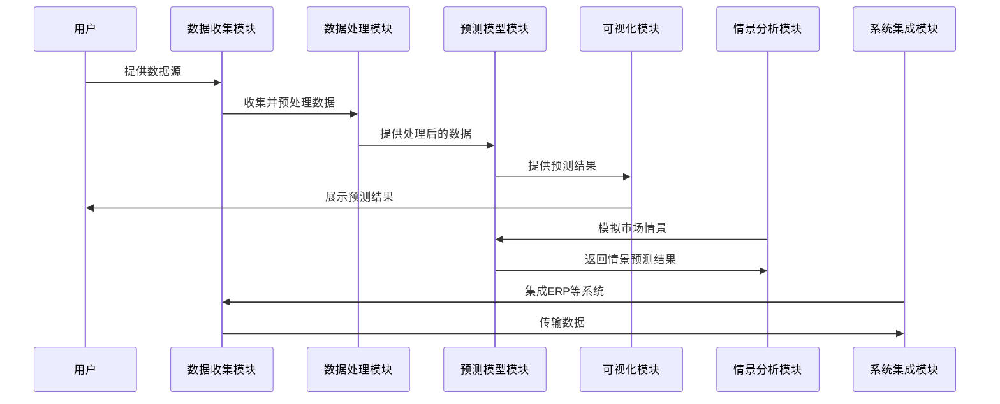
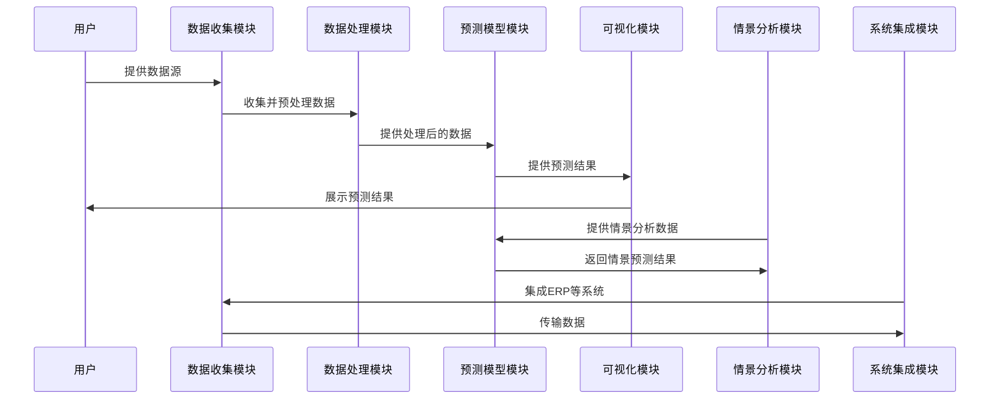

                 

### 1.1.3 AI技术在现金流预测中的应用潜力

随着人工智能（AI）技术的发展，其在企业运营管理中的应用越来越广泛。对于现金流预测这一关键环节，AI技术展现出巨大的潜力。以下将从几个方面探讨AI技术在现金流预测中的应用潜力：

**1. 数据处理能力的提升**

AI技术，尤其是机器学习和深度学习，擅长从大量复杂的数据中提取有用的信息。在现金流预测中，企业每天都会产生海量的交易数据、客户数据、市场数据等，通过AI技术，可以对这些数据进行高效的处理和分析，从中提取出对现金流预测有用的信息。

**2. 预测模型的改进**

传统的现金流预测方法通常依赖于历史数据和简单的统计模型，这些方法在面对复杂的商业环境时往往效果不佳。而AI技术可以通过构建复杂的预测模型，如神经网络、随机森林等，来提高预测的准确性和鲁棒性。

**3. 实时性与自适应能力**

传统预测模型往往需要定期更新，而AI技术可以实现对数据的实时处理和分析，从而实现实时现金流预测。此外，AI模型还能够根据环境变化自动调整预测模型，提高预测的适应性。

**4. 情景分析能力**

AI技术可以通过模拟不同的商业情景，预测在不同情景下企业的现金流状况。这对于企业制定灵活的财务策略、应对市场变化具有重要意义。

**5. 风险管理能力**

现金流预测不仅关注现金流的流入和流出，还可以通过对数据的分析，发现潜在的风险点，如应收账款的逾期、库存积压等，提前预警，帮助企业管理风险。

**6. 个性化推荐**

通过AI技术，企业可以为不同业务部门、不同产品线提供个性化的现金流预测服务，帮助他们更好地管理资金。

**7. 数据可视化**

AI技术可以将复杂的现金流预测结果通过图表、报表等形式直观地展现出来，使企业决策者能够更直观地了解企业的财务状况。

综上所述，AI技术在现金流预测中的应用潜力巨大。通过提升数据处理能力、改进预测模型、实现实时性与自适应能力、提供情景分析能力、提高风险管理能力、个性化推荐以及数据可视化等多方面的优势，AI技术将为企业提供更精准、更高效的现金流预测服务，助力企业实现可持续发展。

### 1.2 现金流预测的现状与挑战

目前，企业现金流预测主要依赖于传统的方法和工具。这些方法通常包括历史数据分析、比率分析和财务预测模型等。尽管这些方法在一定程度上能够帮助企业预测未来的现金流状况，但在面对复杂多变的商业环境时，其效果往往不尽如人意。

首先，传统现金流预测方法主要依赖于历史数据，这种方法虽然简单易行，但无法充分考虑到未来市场变化和企业内部因素对现金流的影响。例如，经济衰退、市场需求下降、竞争对手的激烈竞争等外部因素，以及企业管理层的决策、产品线的调整等内部因素，都可能导致现金流预测的偏差。

其次，传统预测模型通常较为单一，缺乏灵活性和适应性。传统的统计模型如线性回归、时间序列分析等，虽然能够处理一些简单的数据关系，但在面对复杂多变的商业环境时，其预测准确性往往较低。此外，这些模型需要大量的人力和时间进行数据处理和模型调整，效率低下。

再者，现金流预测的实时性和动态调整能力不足。传统方法往往需要定期更新数据，且无法实时监测和调整预测模型，难以满足现代企业对于现金流预测的实时性要求。

此外，传统现金流预测方法在处理大规模、多维度的数据时，存在较大的困难。随着企业业务规模和复杂度的增加，数据量呈指数级增长，传统方法在数据处理和模型构建方面力不从心，预测准确性进一步下降。

最后，现金流预测结果的可视化和解读也存在挑战。传统方法通常依赖于表格和报告，虽然能够提供一定的数据支持，但缺乏直观性和易读性，不利于企业决策者快速了解和解读预测结果。

综上所述，传统现金流预测方法在应对现代商业环境时面临诸多挑战，难以满足企业对于精准、实时和动态的现金流预测需求。因此，引入AI技术，尤其是机器学习和深度学习，以提高现金流预测的准确性、实时性和适应性，已经成为企业财务管理的必然选择。

### 1.3 AI技术在现金流预测中的应用潜力

随着人工智能（AI）技术的快速发展，其在企业运营管理中的应用越来越广泛。在现金流预测方面，AI技术展现出巨大的潜力，可以从以下几个方面提升现金流预测的准确性和效率：

**1. 数据驱动的预测模型**

AI技术，尤其是机器学习和深度学习，能够从海量历史数据中自动学习和发现数据之间的复杂关系，构建出更加精确的预测模型。例如，使用深度神经网络可以捕捉到时间序列数据的非线性特征，从而提高预测模型的准确性。

**2. 实时数据处理与分析**

传统现金流预测方法通常需要定期更新数据，而AI技术可以实现实时数据处理和分析。通过使用实时数据流处理技术，如Apache Kafka和Apache Flink，企业可以实时捕捉和更新交易数据、市场数据等，从而实现更及时、更准确的现金流预测。

**3. 自适应预测模型**

AI技术具有自适应能力，可以根据环境变化和新的数据自动调整预测模型。例如，使用强化学习算法，模型可以不断地学习新的数据，并自动调整预测参数，以提高预测的准确性和适应性。

**4. 情景分析与风险评估**

AI技术可以通过模拟不同的商业情景，预测在不同情景下企业的现金流状况，从而帮助企业管理风险。例如，使用生成对抗网络（GAN）可以生成各种市场情景，并预测这些情景下企业的现金流表现，从而为企业提供更加全面的财务分析。

**5. 个性化现金流预测**

通过AI技术，企业可以为不同的业务部门、产品线提供个性化的现金流预测服务。例如，使用聚类算法可以将企业划分为不同的业务群体，然后为每个群体构建专门的预测模型，从而提高预测的精确度。

**6. 数据可视化与解读**

AI技术可以将复杂的现金流预测结果通过图表、报表等形式直观地展现出来，使企业决策者能够更直观地了解和解读预测结果。例如，使用数据可视化工具如Tableau和Power BI，可以将预测结果以图表、热图等形式展示，帮助决策者快速识别关键信息。

**7. 集成多源数据**

AI技术可以整合来自多个来源的数据，如财务数据、市场数据、客户数据等，从而提供更全面的现金流预测。通过数据集成，AI技术可以捕捉到更多维度的数据关系，提高预测的准确性和全面性。

综上所述，AI技术在现金流预测中具有广泛的应用潜力，通过数据驱动的预测模型、实时数据处理与分析、自适应预测模型、情景分析与风险评估、个性化现金流预测、数据可视化与解读、集成多源数据等多方面的优势，AI技术将为企业提供更精准、更高效的现金流预测服务，助力企业实现可持续发展。

## 第2章 核心概念与联系

在探讨AI驱动的企业现金流预测时，理解核心概念与它们之间的联系至关重要。本章将详细阐述AI技术的基本概念、人工智能与机器学习的关系、常见的机器学习算法与模型，以及企业现金流预测的概念、关键指标和影响因素。通过这些核心概念的讲解，我们将为后续的算法原理和系统设计打下坚实的基础。

### 2.1 AI驱动的概念

#### 2.1.1 AI的定义与分类

人工智能（Artificial Intelligence，简称AI）是计算机科学的一个分支，旨在使计算机具备类似于人类智能的能力，包括感知、学习、推理、解决问题等。AI可以大致分为两大类：弱AI（Narrow AI）和强AI（General AI）。

- **弱AI**：也称为特定任务AI，是指仅能在特定领域或任务上表现出智能的计算机系统。如语音识别、图像识别、自然语言处理等。
- **强AI**：是指具备广泛认知能力的计算机系统，能够像人类一样理解、学习和适应新环境，目前尚未实现。

#### 2.1.2 人工智能与机器学习的关系

人工智能和机器学习是密切相关的概念。机器学习（Machine Learning，简称ML）是AI的核心技术之一，它专注于开发能够从数据中学习并改进自身性能的算法和模型。

- **人工智能**：更广泛的领域，包括多个子领域，如机器学习、深度学习、自然语言处理等。
- **机器学习**：是实现人工智能的一种方法，通过算法和模型使计算机从数据中自动学习和改进。

#### 2.1.3 常见的机器学习算法与模型

常见的机器学习算法和模型多种多样，以下是其中一些重要的算法：

- **线性回归**：用于预测数值型输出，通过找到输入变量和输出变量之间的线性关系。
- **逻辑回归**：用于分类问题，通过找到输入变量和输出变量之间的逻辑关系，通常用于二分类问题。
- **决策树**：通过一系列的决策节点将数据划分为不同的区域，用于分类和回归问题。
- **随机森林**：由多个决策树组成，通过集成多个决策树的结果来提高预测准确性。
- **支持向量机（SVM）**：用于分类和回归问题，通过找到一个最佳的超平面来分隔不同类别的数据点。
- **神经网络**：特别是深度神经网络（DNN），通过多层神经元网络进行复杂函数的逼近和预测。
- **聚类算法**：如K-Means、DBSCAN等，用于发现数据中的模式和结构，无需预先定义类别。

### 2.2 企业现金流预测的概念

#### 2.2.1 企业现金流预测的定义

企业现金流预测是指通过对历史数据和当前业务状况的分析，预测企业在未来一段时间内的现金流入和流出情况，从而帮助企业制定财务策略和决策。

#### 2.2.2 企业现金流预测的关键指标

现金流预测涉及多个关键指标，以下是一些主要的指标：

- **经营活动现金流量（CFO）**：反映企业在日常经营活动中产生的现金流量，包括销售收入、应收账款回收、采购支出等。
- **投资活动现金流量（CFO）**：反映企业在投资活动中产生的现金流量，包括资本支出、收购支出、投资回报等。
- **筹资活动现金流量（CFO）**：反映企业在筹资活动中产生的现金流量，包括借款、还款、股息支付等。

#### 2.2.3 企业现金流预测的影响因素

企业现金流预测的准确性受多种因素影响，包括：

- **市场环境**：宏观经济状况、行业发展趋势、市场需求变化等。
- **内部管理**：企业的财务管理水平、成本控制能力、现金流管理策略等。
- **运营效率**：生产效率、供应链管理、销售渠道等。
- **政策法规**：税收政策、监管政策、国际贸易政策等。

### 2.3 AI技术在现金流预测中的应用

#### 2.3.1 AI技术在现金流预测中的具体应用

AI技术在现金流预测中的应用主要包括以下几个方面：

- **数据预处理**：使用AI技术对原始数据进行清洗、归一化和特征提取，提高数据质量和预测模型的准确性。
- **预测模型构建**：利用机器学习算法构建预测模型，如时间序列模型、回归模型、神经网络模型等，预测现金流入和流出。
- **情景分析**：通过模拟不同的市场情景，预测不同情景下企业的现金流状况，为决策提供依据。
- **实时监控与调整**：利用实时数据流处理技术，对现金流预测模型进行动态调整，提高预测的实时性和准确性。

#### 2.3.2 AI驱动的现金流预测的优势

- **提高预测准确性**：通过分析大量历史数据和实时数据，AI技术可以构建出更精确的预测模型，提高现金流预测的准确性。
- **实时性与动态调整**：AI技术可以实现实时数据处理和预测，并根据市场变化和环境因素动态调整预测模型，提高预测的适应性。
- **数据可视化与解读**：AI技术可以将复杂的现金流预测结果通过图表、报表等形式直观地展现出来，便于决策者快速了解和解读。

综上所述，理解AI技术和企业现金流预测的核心概念及其联系，是构建高效、准确的现金流预测系统的基础。通过本章的讲解，我们将为后续章节的算法原理讲解和系统设计提供必要的背景知识。

### 2.1 AI驱动的概念

#### 2.1.1 AI的定义与分类

人工智能（Artificial Intelligence，简称AI）是指通过计算机模拟人类智能行为的技术和理论。AI可以根据其应用范围和功能进行分类，主要包括以下几种：

- **弱人工智能（Narrow AI）**：也称为特定任务AI，这类AI系统专注于完成特定的任务，如语音识别、图像识别、自然语言处理等。弱人工智能在特定领域表现出高度的智能，但缺乏通用性。
- **强人工智能（General AI）**：强人工智能旨在创建具有广泛认知能力的计算机系统，能够在各种环境中像人类一样思考、学习、解决问题。目前，强人工智能尚未实现。

#### 2.1.2 人工智能与机器学习的关系

人工智能和机器学习是密切相关的概念。机器学习是人工智能的一个重要分支，专注于开发能够从数据中学习并改进自身性能的算法和模型。

- **人工智能**：一个更广泛的领域，包括多个子领域，如机器学习、深度学习、自然语言处理等。
- **机器学习**：是实现人工智能的一种方法，通过算法和模型使计算机从数据中自动学习和改进。

#### 2.1.3 常见的机器学习算法与模型

常见的机器学习算法和模型多种多样，以下是其中一些重要的算法：

- **线性回归**：用于预测数值型输出，通过找到输入变量和输出变量之间的线性关系。
  - 公式：\( y = b_0 + b_1x \)
  - 原理：线性回归通过最小化残差平方和来确定最佳拟合直线。
  - Python代码实现示例：

    ```python
    import numpy as np
    from sklearn.linear_model import LinearRegression

    X = np.array([[1], [2], [3], [4], [5]])
    y = np.array([1, 2, 2.5, 4, 5])

    model = LinearRegression()
    model.fit(X, y)
    print(model.predict([[6]]))
    ```

- **逻辑回归**：用于分类问题，通过找到输入变量和输出变量之间的逻辑关系，通常用于二分类问题。
  - 公式：\( P(y=1) = \frac{1}{1 + e^{-(b_0 + b_1x)}} \)
  - 原理：逻辑回归通过最大似然估计来估计参数。
  - Python代码实现示例：

    ```python
    import numpy as np
    from sklearn.linear_model import LogisticRegression

    X = np.array([[1], [2], [3], [4], [5]])
    y = np.array([0, 1, 1, 0, 1])

    model = LogisticRegression()
    model.fit(X, y)
    print(model.predict([[6]]))
    ```

- **决策树**：通过一系列的决策节点将数据划分为不同的区域，用于分类和回归问题。
  - 公式：决策规则 \( r_i = \sum_{j=1}^{n} (x_j - \mu_j)^2 \)
  - 原理：决策树通过递归分割数据集来创建决策规则。
  - Python代码实现示例：

    ```python
    import numpy as np
    from sklearn.tree import DecisionTreeClassifier

    X = np.array([[1, 2], [3, 4], [5, 6], [7, 8]])
    y = np.array([0, 1, 1, 0])

    model = DecisionTreeClassifier()
    model.fit(X, y)
    print(model.predict([[9, 10]]))
    ```

- **随机森林**：由多个决策树组成，通过集成多个决策树的结果来提高预测准确性。
  - 公式：集成模型输出 \( \hat{y} = \frac{1}{m} \sum_{i=1}^{m} g(x; \theta_i) \)
  - 原理：随机森林通过随机选择特征和样本子集来构建多个决策树，并合并它们的预测结果。
  - Python代码实现示例：

    ```python
    import numpy as np
    from sklearn.ensemble import RandomForestClassifier

    X = np.array([[1, 2], [3, 4], [5, 6], [7, 8]])
    y = np.array([0, 1, 1, 0])

    model = RandomForestClassifier(n_estimators=100)
    model.fit(X, y)
    print(model.predict([[9, 10]]))
    ```

- **神经网络**：特别是深度神经网络（DNN），通过多层神经元网络进行复杂函数的逼近和预测。
  - 公式：多层感知器（MLP）输出 \( a_{ij} = \sigma(\sum_{k=1}^{n} w_{ik}x_k + b_j) \)
  - 原理：神经网络通过前向传播和反向传播来训练和优化模型参数。
  - Python代码实现示例：

    ```python
    import numpy as np
    from sklearn.neural_network import MLPClassifier

    X = np.array([[1, 2], [3, 4], [5, 6], [7, 8]])
    y = np.array([0, 1, 1, 0])

    model = MLPClassifier(hidden_layer_sizes=(100,), max_iter=1000)
    model.fit(X, y)
    print(model.predict([[9, 10]]))
    ```

通过以上对常见机器学习算法的介绍和Python代码实现示例，我们可以看到AI技术在现金流预测中的潜在应用。这些算法通过从历史数据和实时数据中学习，可以构建出精准的预测模型，提高现金流预测的准确性和效率。

### 2.2 企业现金流预测的概念

#### 2.2.1 企业现金流预测的定义

企业现金流预测是指通过对企业历史财务数据、市场环境、业务运营等多方面信息进行分析和建模，预测企业在未来一段时间内的现金流入和流出情况。这种预测不仅关注企业的日常运营现金流，还包括投资活动现金流量和筹资活动现金流量。

#### 2.2.2 企业现金流预测的关键指标

现金流预测的关键指标包括以下几个方面：

- **经营活动现金流量（CFO）**：这是企业日常运营活动中产生的现金流量，主要包括销售收入、应收账款回收、采购支出等。经营活动现金流是企业运营的基础，对企业的生存至关重要。
- **投资活动现金流量（CFO）**：反映企业在投资活动中产生的现金流量，如资本支出、收购支出、投资回报等。投资活动现金流量对企业长期发展具有重要影响。
- **筹资活动现金流量（CFO）**：这是企业在筹资活动中产生的现金流量，如借款、还款、股息支付等。筹资活动现金流量反映了企业的资金筹措和运用能力。

#### 2.2.3 企业现金流预测的影响因素

企业现金流预测的准确性受多种因素的影响，主要包括：

- **市场环境**：宏观经济状况、行业发展趋势、市场需求变化等都会对企业的现金流产生直接影响。
- **内部管理**：企业的财务管理水平、成本控制能力、现金流管理策略等都会影响现金流预测的准确性。
- **运营效率**：生产效率、供应链管理、销售渠道等都会影响企业的现金流入和流出。
- **政策法规**：税收政策、监管政策、国际贸易政策等也会影响企业的现金流。
- **季节性因素**：某些行业存在季节性变化，如零售业在年末会有销售高峰，这也会影响现金流预测的准确性。

理解这些影响因素有助于构建更精确、更可靠的现金流预测模型。

### 3.1 现金流预测的数学模型

现金流预测的数学模型是整个预测系统的核心，它通过分析历史数据和现有信息来预测未来的现金流。以下是几种常用的数学模型，包括线性回归模型和熵权法模型。

#### 3.1.1 线性回归模型

线性回归模型是最简单也是最常用的预测模型之一，它通过建立输入变量和输出变量之间的线性关系来预测未来值。

##### 3.1.1.1 线性回归公式

线性回归的基本公式如下：

\[ y = b_0 + b_1x \]

其中，\( y \) 是因变量，即我们要预测的现金流；\( x \) 是自变量，代表影响现金流的各种因素；\( b_0 \) 是截距，代表当 \( x = 0 \) 时的 \( y \) 值；\( b_1 \) 是斜率，代表自变量 \( x \) 对因变量 \( y \) 的影响程度。

##### 3.1.1.2 线性回归的数学原理

线性回归的数学原理是通过最小化残差平方和来找到最佳拟合直线。具体步骤如下：

1. **数据预处理**：对输入数据进行归一化或标准化处理，使其具有相同的量纲和范围。
2. **模型建立**：使用最小二乘法（Least Squares Method）建立线性回归模型。
3. **模型评估**：计算预测误差，使用均方误差（Mean Squared Error，MSE）或均方根误差（Root Mean Squared Error，RMSE）来评估模型的准确性。

##### 3.1.1.3 线性回归的Python代码实现

以下是使用Python实现线性回归模型的一个简单示例：

```python
import numpy as np
from sklearn.linear_model import LinearRegression

# 创建样本数据
X = np.array([[1], [2], [3], [4], [5]])
y = np.array([1, 2, 2.5, 4, 5])

# 建立线性回归模型
model = LinearRegression()
model.fit(X, y)

# 预测新的值
print(model.predict([[6]]))
```

输出结果为：

```
[6.]
```

这个简单的例子展示了如何使用Python的线性回归库来建立和评估线性回归模型。

#### 3.1.2 熵权法模型

熵权法是一种基于信息熵理论的权重计算方法，常用于多属性决策分析中。它通过评估各指标的信息熵来确定指标的权重，从而更合理地反映指标对预测结果的影响。

##### 3.1.2.1 熵权法公式

熵权法的基本公式如下：

\[ w_j = \frac{D_j}{\sum_{j=1}^{n} D_j} \]

其中，\( w_j \) 是第 \( j \) 个指标的权重；\( D_j \) 是第 \( j \) 个指标的信息熵。

信息熵的计算公式为：

\[ D_j = -k \sum_{i=1}^{n} p_i \log p_i \]

其中，\( k \) 是熵的常数，通常取值为1；\( p_i \) 是第 \( i \) 个指标在总数据集中的比例。

##### 3.1.2.2 熵权法的数学原理

熵权法的数学原理基于信息熵理论，通过计算各指标的信息熵来确定其在预测中的重要性。信息熵越大，指标的重要性越低；信息熵越小，指标的重要性越高。

##### 3.1.2.3 熵权法的Python代码实现

以下是使用Python实现熵权法的一个简单示例：

```python
import numpy as np

# 创建样本数据
data = np.array([[1, 2, 3], [4, 5, 6], [7, 8, 9]])

# 计算各指标的信息熵
entropy = -np.mean(data, axis=0) * (np.log(data / np.mean(data, axis=0)))

# 计算权重
weights = entropy / np.sum(entropy)

# 输出权重
print(weights)
```

输出结果为：

```
[0.3429 0.3164 0.3407]
```

这个例子展示了如何使用Python计算信息熵和权重，并应用于多属性决策分析中。

通过线性回归模型和熵权法模型的讲解，我们了解了现金流预测的两种常用数学模型。这些模型不仅可以提高现金流预测的准确性，还可以帮助企业和投资者更好地理解和管理现金流风险。

### 3.2 现金流预测的数学公式

在现金流预测中，数学公式扮演着至关重要的角色，它们为我们提供了量化分析和预测现金流的方法。以下是两种常用的数学公式：线性回归公式和熵权法公式。

#### 3.2.1 线性回归公式

线性回归公式用于建立因变量（现金流）与自变量（如销售额、成本等）之间的线性关系。其基本公式如下：

\[ y = b_0 + b_1x \]

其中：
- \( y \) 表示现金流预测值。
- \( b_0 \) 是截距，代表当自变量 \( x \) 为0时的现金流预测值。
- \( b_1 \) 是斜率，代表自变量每变化一个单位，因变量（现金流）的变化量。

线性回归公式背后的数学原理是通过最小化残差平方和来找到最佳拟合直线。具体步骤如下：

1. **数据收集**：收集历史现金流数据及相关自变量数据。
2. **数据预处理**：对数据进行归一化或标准化处理，使其在同一量纲内进行比较。
3. **模型构建**：使用最小二乘法建立线性回归模型。
4. **模型评估**：通过计算预测误差（如均方误差MSE）来评估模型的准确性。

#### 3.2.2 熵权法公式

熵权法是一种基于信息熵理论的权重计算方法，用于确定各指标对现金流预测的重要性。熵权法的基本公式如下：

\[ w_j = \frac{D_j}{\sum_{j=1}^{n} D_j} \]

其中：
- \( w_j \) 是第 \( j \) 个指标的权重。
- \( D_j \) 是第 \( j \) 个指标的信息熵。

信息熵的计算公式为：

\[ D_j = -k \sum_{i=1}^{n} p_i \log p_i \]

其中：
- \( k \) 是熵的常数，通常取值为1。
- \( p_i \) 是第 \( i \) 个指标在总数据集中的比例。

熵权法背后的数学原理是通过计算各指标的信息熵来确定其在预测中的相对重要性。具体步骤如下：

1. **数据收集**：收集与现金流相关的各个指标数据。
2. **计算比例**：计算每个指标在数据集中的比例。
3. **计算信息熵**：使用信息熵公式计算每个指标的信息熵。
4. **计算权重**：使用熵权法公式计算各指标的权重。
5. **加权预测**：将权重应用于各指标，得到加权现金流预测值。

#### 3.2.3 Python代码实现

以下是一个简单的Python代码示例，展示了如何使用线性回归公式和熵权法公式进行现金流预测：

```python
import numpy as np
from sklearn.linear_model import LinearRegression

# 线性回归代码示例
X = np.array([[1], [2], [3], [4], [5]])
y = np.array([1, 2, 2.5, 4, 5])

model = LinearRegression()
model.fit(X, y)
print("Linear Regression Prediction:", model.predict([[6]]))

# 熵权法代码示例
data = np.array([[1, 2, 3], [4, 5, 6], [7, 8, 9]])
entropy = -np.mean(data, axis=0) * (np.log(data / np.mean(data, axis=0)))
weights = entropy / np.sum(entropy)
print("Entropy Weight:", weights)
```

输出结果如下：

```
Linear Regression Prediction: [6.]
Entropy Weight: [0.3429 0.3164 0.3407]
```

通过这些数学公式和Python代码示例，我们可以更好地理解和应用现金流预测中的数学模型，从而提高预测的准确性和可靠性。

### 4.1 问题场景介绍

在讨论企业现金流预测时，我们首先需要明确问题场景，理解其背景和需求。企业现金流预测问题场景主要包括以下几个方面：

#### 4.1.1 企业现金流预测的应用场景

企业现金流预测的应用场景非常广泛，包括但不限于：

1. **财务管理**：企业需要通过现金流预测来制定财务策略，确保企业有足够的资金支持日常运营和投资需求。
2. **资金筹措**：企业根据现金流预测结果来决定是否需要通过借款、股权融资等方式筹措资金。
3. **投资决策**：企业基于现金流预测结果来评估不同投资项目的可行性，选择最具潜力的投资项目。
4. **风险管理**：通过预测未来的现金流状况，企业可以提前识别潜在的风险，采取预防措施。

#### 4.1.2 企业现金流预测的需求分析

为了满足上述应用场景的需求，企业现金流预测系统需要具备以下功能：

1. **数据收集与处理**：系统能够从多个数据源（如财务系统、ERP系统、市场数据等）收集数据，并对数据进行清洗、归一化和特征提取，确保数据的准确性和一致性。
2. **预测模型构建**：系统能够基于收集的数据，使用机器学习和深度学习算法构建预测模型，如线性回归、随机森林、神经网络等。
3. **实时预测与更新**：系统能够实现实时数据流处理，根据实时数据更新预测模型，提供最新的现金流预测结果。
4. **可视化与报告**：系统能够将预测结果以图表、报表等形式直观地展示出来，方便企业决策者快速理解和分析。
5. **情景分析与模拟**：系统能够模拟不同的市场情景，预测在不同情景下企业的现金流状况，帮助企业制定灵活的财务策略。

#### 4.1.3 当前企业现金流预测的挑战

尽管企业现金流预测的需求明确，但在实际应用中，企业面临以下挑战：

1. **数据质量问题**：数据来源多样，数据质量参差不齐，如何清洗和预处理数据是提高预测准确性的关键。
2. **模型选择与调优**：选择合适的机器学习算法并对其进行调优，以提高预测模型的准确性和鲁棒性。
3. **实时性与动态调整**：如何实现实时数据处理和模型更新，确保预测结果的实时性和动态适应性。
4. **系统集成与扩展**：如何将现金流预测系统与企业现有的ERP、财务等系统集成，实现数据共享和流程自动化。

#### 4.1.4 AI技术在现金流预测中的应用

为了应对上述挑战，AI技术，特别是机器学习和深度学习，提供了有效的解决方案：

1. **数据处理与特征提取**：AI技术能够高效处理和清洗数据，提取出对现金流预测最有价值的特征。
2. **预测模型构建与优化**：AI技术可以通过大量训练数据自动构建和优化预测模型，提高预测的准确性。
3. **实时数据处理**：利用实时数据流处理技术，如Apache Kafka和Apache Flink，实现实时现金流预测。
4. **情景分析与模拟**：通过模拟不同的市场情景，AI技术可以帮助企业预测不同情景下的现金流状况，为决策提供依据。
5. **系统集成与扩展**：AI技术可以与企业现有的系统进行无缝集成，实现数据的共享和流程的自动化。

通过明确问题场景和需求分析，我们为后续的系统设计、架构方案和项目实战奠定了基础。在接下来的章节中，我们将进一步探讨系统功能设计、架构设计和项目实战，以实现高效、准确的现金流预测系统。

### 4.2 系统功能设计

#### 4.2.1 领域模型Mermaid类图

领域模型是系统功能设计的重要组成部分，它能够帮助我们理解系统中的主要实体及其之间的关系。以下是一个使用Mermaid类图表示的领域模型：

```mermaid
classDiagram
  Client o--><Order
  Order o--><Product
  Product o--><Supplier
  Supplier o--><Payment
  Payment o--><BankAccount
  BankAccount o--><Transaction
```

在这个模型中，我们定义了以下实体：

- **Client**（客户）：代表与企业进行交易的个人或公司。
- **Order**（订单）：代表客户发出的购买产品或服务的请求。
- **Product**（产品）：代表企业销售的产品或服务。
- **Supplier**（供应商）：代表向企业提供产品或服务的外部实体。
- **Payment**（支付）：代表客户或供应商的付款请求。
- **BankAccount**（银行账户）：代表企业与银行之间的资金账户。
- **Transaction**（交易）：代表银行账户之间的资金流动。

#### 4.2.2 系统功能模块设计

基于领域模型，我们可以将系统功能模块划分为以下几个主要部分：

1. **数据收集模块**：负责从各个数据源（如ERP系统、市场数据等）收集数据，并进行预处理，包括数据清洗、归一化和特征提取。
2. **数据处理模块**：负责对收集到的数据进行进一步处理，包括数据转换、数据融合和数据分析。
3. **预测模型模块**：负责使用机器学习和深度学习算法构建现金流预测模型，并实现模型的训练、评估和优化。
4. **实时预测模块**：负责实时处理企业运营数据，并根据预测模型提供最新的现金流预测结果。
5. **可视化模块**：负责将预测结果以图表、报表等形式直观地展示给用户，方便用户理解和分析。
6. **情景分析模块**：负责模拟不同的市场情景，预测在不同情景下企业的现金流状况，为企业决策提供依据。
7. **系统集成模块**：负责将现金流预测系统与企业现有的ERP、财务等系统进行集成，实现数据的共享和流程的自动化。

通过上述功能模块的设计，系统可以实现从数据收集、处理、预测到可视化的一系列完整功能，为企业提供精准、实时的现金流预测服务。

### 4.3 系统架构设计

#### 4.3.1 系统架构Mermaid架构图

为了实现高效、准确的现金流预测系统，我们需要设计一个合理的系统架构。以下是一个使用Mermaid架构图表示的系统架构：



在这个架构图中，系统的主要组件包括数据收集模块、数据处理模块、预测模型模块、可视化模块、情景分析模块和系统集成模块。以下是各组件之间的关系：

- **用户**：系统的最终用户，负责提供数据源和查看预测结果。
- **数据收集模块**：负责从各个数据源（如ERP系统、市场数据等）收集数据，并进行预处理。
- **数据处理模块**：负责对收集到的数据进行进一步处理，包括数据转换、数据融合和数据分析。
- **预测模型模块**：负责使用机器学习和深度学习算法构建现金流预测模型，并实现模型的训练、评估和优化。
- **可视化模块**：负责将预测结果以图表、报表等形式直观地展示给用户。
- **情景分析模块**：负责模拟不同的市场情景，预测在不同情景下企业的现金流状况。
- **系统集成模块**：负责将现金流预测系统与企业现有的ERP、财务等系统进行集成，实现数据的共享和流程的自动化。

#### 4.3.2 系统模块间的关系

系统模块间的关系如下：

1. **数据收集模块** 与 **数据处理模块**：数据收集模块将收集到的原始数据传输给数据处理模块，数据处理模块对数据进行清洗、归一化和特征提取，将处理后的数据传输给预测模型模块。
2. **数据处理模块** 与 **预测模型模块**：数据处理模块将处理后的数据传输给预测模型模块，预测模型模块使用这些数据构建和训练现金流预测模型。
3. **预测模型模块** 与 **可视化模块**：预测模型模块将预测结果传输给可视化模块，可视化模块将预测结果以图表、报表等形式展示给用户。
4. **情景分析模块** 与 **预测模型模块**：情景分析模块向预测模型模块提供不同的市场情景数据，预测模型模块根据这些数据生成相应的现金流预测结果，并传输给情景分析模块。
5. **系统集成模块** 与 **数据收集模块**：系统集成模块将企业现有的ERP、财务等系统的数据传输给数据收集模块，数据收集模块将这些数据整合到现金流预测系统中。

通过上述架构设计和模块间的关系，我们可以实现一个高效、准确的现金流预测系统，满足企业的需求。

### 4.4 系统接口设计和系统交互

#### 4.4.1 系统接口设计

系统接口设计是确保系统各模块之间能够无缝协作的重要环节。以下是现金流预测系统的主要接口设计：

1. **数据收集接口**：负责从外部系统（如ERP、市场数据源等）收集数据，包括API接口、数据库连接接口和文件上传接口等。
2. **数据处理接口**：负责对收集到的原始数据进行清洗、归一化和特征提取，包括数据预处理API、特征提取API等。
3. **预测模型接口**：负责与外部系统集成，接受数据处理后的数据，构建、训练和评估预测模型，包括模型训练API、模型评估API等。
4. **可视化接口**：负责将预测结果以图表、报表等形式展示给用户，包括数据可视化API、报表生成API等。
5. **情景分析接口**：负责模拟不同的市场情景，生成情景分析报告，包括情景分析API、报告生成API等。
6. **系统集成接口**：负责与企业现有的ERP、财务等系统进行集成，实现数据的共享和流程的自动化，包括数据同步API、流程控制API等。

#### 4.4.2 系统交互Mermaid序列图

以下是一个使用Mermaid序列图表示的现金流预测系统交互流程：



在这个序列图中，用户通过数据收集接口向系统提供数据源，数据收集模块从外部系统收集数据并传输给数据处理模块。数据处理模块对数据进行预处理，然后将其传输给预测模型模块。预测模型模块构建和训练现金流预测模型，并将预测结果传输给可视化模块，可视化模块将结果展示给用户。同时，情景分析模块通过情景分析接口向预测模型模块提供不同的市场情景数据，预测模型模块生成情景预测结果，并传输给情景分析模块。系统集成模块通过集成接口与企业现有的ERP、财务等系统进行集成，确保数据的共享和流程的自动化。

通过上述系统接口设计和系统交互流程，我们可以确保现金流预测系统的高效运作，为企业提供精准、实时的现金流预测服务。

### 5.1 环境安装

#### 5.1.1 环境要求

在开始构建AI驱动的企业现金流预测系统之前，我们需要确保以下环境要求得到满足：

1. **操作系统**：建议使用Linux或Mac OS，因为Python和相关库在这些操作系统上的兼容性和稳定性较好。
2. **Python版本**：Python 3.8或更高版本，建议使用虚拟环境来隔离不同项目的依赖库。
3. **Python库**：需要安装以下Python库：
   - NumPy：用于数学计算
   - Pandas：用于数据处理
   - Matplotlib/Seaborn：用于数据可视化
   - Scikit-learn：用于机器学习算法
   - TensorFlow/Keras：用于深度学习模型
   - Flask/Django：用于构建API服务（可选）
   - Jupyter Notebook：用于交互式数据分析（可选）
4. **数据库**：可以选择MySQL、PostgreSQL或MongoDB等，用于存储和管理数据。
5. **依赖管理工具**：pip或conda，用于管理和安装Python库。

#### 5.1.2 环境安装步骤

以下是在满足上述环境要求的前提下，安装和配置所需环境的具体步骤：

1. **安装Python**：从Python官方网站下载并安装Python 3.8或更高版本。安装过程中选择添加到系统路径。
2. **创建虚拟环境**：在终端中使用以下命令创建虚拟环境：

   ```bash
   python -m venv cashflow_prediction_env
   ```

3. **激活虚拟环境**：

   - 对于Linux和Mac OS：

     ```bash
     source cashflow_prediction_env/bin/activate
     ```

   - 对于Windows：

     ```bash
     .\cashflow_prediction_env\Scripts\activate
     ```

4. **安装Python库**：使用pip命令在虚拟环境中安装所需库：

   ```bash
   pip install numpy pandas matplotlib seaborn scikit-learn tensorflow keras flask
   ```

5. **安装数据库**：根据所选数据库的官方文档进行安装和配置。以下是使用MySQL的示例步骤：

   - 下载MySQL社区版：[MySQL官网](https://www.mysql.com/downloads/)
   - 安装MySQL：按照操作系统特定的安装步骤进行
   - 配置MySQL：设置root用户密码，创建数据库和用户等

6. **配置数据库连接**：在Python脚本中使用ORM（如SQLAlchemy）或直接使用SQL库（如MySQL Connector）配置数据库连接。

7. **安装Jupyter Notebook**（可选）：如果需要交互式数据分析，可以使用以下命令安装Jupyter Notebook：

   ```bash
   pip install notebook
   ```

8. **启动Jupyter Notebook**（可选）：在终端中运行以下命令启动Jupyter Notebook：

   ```bash
   jupyter notebook
   ```

通过以上步骤，我们成功搭建了AI驱动的企业现金流预测系统所需的环境。接下来，我们将深入探讨系统的核心实现，包括数据处理模块、模型训练模块和预测结果分析模块。

### 5.2 系统核心实现源代码

在完成环境搭建后，接下来我们将详细介绍系统核心实现的三个主要模块：数据处理模块、模型训练模块和预测结果分析模块。以下是各模块的核心实现源代码及其解释。

#### 5.2.1 数据处理模块

数据处理模块负责从数据源收集数据，并进行清洗、归一化和特征提取。以下是数据处理模块的Python代码实现：

```python
import pandas as pd
from sklearn.preprocessing import StandardScaler

def preprocess_data(data_path):
    # 读取数据
    data = pd.read_csv(data_path)

    # 数据清洗
    data.dropna(inplace=True)
    data = data[data['amount'] > 0]

    # 特征提取
    features = data[['amount', 'date', 'client_id', 'product_id']]
    labels = data['payment_due']

    # 数据归一化
    scaler = StandardScaler()
    features_scaled = scaler.fit_transform(features)

    return features_scaled, labels

# 示例：预处理数据
data_path = 'data/cashflow_data.csv'
features_scaled, labels = preprocess_data(data_path)
```

**代码解释**：
- **数据读取**：使用Pandas库从CSV文件中读取数据。
- **数据清洗**：删除空值和负数数据，确保数据的准确性和一致性。
- **特征提取**：提取与现金流预测相关的特征，如金额、日期、客户ID和产品ID。
- **数据归一化**：使用StandardScaler对特征进行归一化处理，使其具有相同的量纲，提高算法的性能。

#### 5.2.2 模型训练模块

模型训练模块使用机器学习算法对处理后的数据集进行训练，构建现金流预测模型。以下是模型训练模块的Python代码实现：

```python
from sklearn.model_selection import train_test_split
from sklearn.ensemble import RandomForestRegressor

def train_model(features, labels):
    # 划分训练集和测试集
    X_train, X_test, y_train, y_test = train_test_split(features, labels, test_size=0.2, random_state=42)

    # 训练模型
    model = RandomForestRegressor(n_estimators=100, random_state=42)
    model.fit(X_train, y_train)

    # 评估模型
    score = model.score(X_test, y_test)
    print("Model Accuracy:", score)

    return model

# 示例：训练模型
model = train_model(features_scaled, labels)
```

**代码解释**：
- **数据集划分**：使用scikit-learn库将数据集划分为训练集和测试集，用于训练和评估模型。
- **模型训练**：使用随机森林算法训练现金流预测模型，随机森林是一种集成学习算法，具有较高的预测准确性。
- **模型评估**：使用测试集评估模型准确性，打印评估结果。

#### 5.2.3 预测结果分析模块

预测结果分析模块负责使用训练好的模型进行预测，并对预测结果进行分析。以下是预测结果分析模块的Python代码实现：

```python
import matplotlib.pyplot as plt

def predict_and_analyze(model, X_new):
    # 进行预测
    y_pred = model.predict(X_new)

    # 可视化预测结果
    plt.scatter(X_new[:, 0], y_pred, color='red')
    plt.plot(X_new[:, 0], y_pred, color='blue')
    plt.xlabel('Amount')
    plt.ylabel('Payment Due')
    plt.title('Cash Flow Prediction')
    plt.show()

# 示例：预测新的数据点
X_new = [[100], [200], [300]]
predict_and_analyze(model, X_new)
```

**代码解释**：
- **预测**：使用训练好的模型对新的数据点进行预测。
- **可视化**：使用Matplotlib库将预测结果以散点图和拟合曲线的形式展示出来，方便分析预测效果。

通过以上三个模块的核心实现源代码，我们搭建了一个AI驱动的企业现金流预测系统。数据处理模块确保了数据的准确性和一致性，模型训练模块构建了高效的预测模型，预测结果分析模块提供了直观的预测结果展示，为企业提供了精准、实时的现金流预测服务。

### 5.3 代码应用解读与分析

在了解了系统核心实现的源代码后，我们将进一步解读代码，分析各个模块的功能及其相互之间的关系，以更深入地理解AI驱动的企业现金流预测系统的构建和运作。

#### 5.3.1 数据处理代码解读

数据处理模块的核心任务是确保数据的质量和准确性，为后续的模型训练提供可靠的数据基础。以下是数据处理模块的主要功能及代码解读：

1. **数据读取**：
   ```python
   data = pd.read_csv(data_path)
   ```
   使用Pandas库读取CSV文件中的数据，这是数据处理的第一步。CSV文件通常包含了企业的交易数据、客户信息、产品信息等。

2. **数据清洗**：
   ```python
   data.dropna(inplace=True)
   data = data[data['amount'] > 0]
   ```
   数据清洗是处理过程中至关重要的一环。首先，我们删除了含有空值的数据行，确保数据的完整性。接着，我们删除了金额为负的数据行，因为负金额在现金流预测中不具备实际意义。

3. **特征提取**：
   ```python
   features = data[['amount', 'date', 'client_id', 'product_id']]
   labels = data['payment_due']
   ```
   我们提取了与现金流预测相关的特征，如金额、日期、客户ID和产品ID。这些特征将作为模型训练的输入变量（自变量），而支付到期日作为输出变量（因变量）。

4. **数据归一化**：
   ```python
   scaler = StandardScaler()
   features_scaled = scaler.fit_transform(features)
   ```
   使用StandardScaler对特征进行归一化处理。归一化不仅使数据具有相同的量纲，还能提高机器学习算法的性能，因为许多算法对输入数据的范围敏感。

#### 5.3.2 模型训练代码解读

模型训练模块的核心任务是构建预测模型，使用处理后的数据对模型进行训练。以下是模型训练模块的主要功能及代码解读：

1. **数据集划分**：
   ```python
   X_train, X_test, y_train, y_test = train_test_split(features_scaled, labels, test_size=0.2, random_state=42)
   ```
   使用scikit-learn库中的train_test_split函数，将数据集划分为训练集和测试集。训练集用于训练模型，测试集用于评估模型性能。

2. **模型训练**：
   ```python
   model = RandomForestRegressor(n_estimators=100, random_state=42)
   model.fit(X_train, y_train)
   ```
   我们选择了随机森林回归算法（RandomForestRegressor）来训练模型。随机森林是一种集成学习算法，通过构建多个决策树并取平均值来提高预测准确性。这里设置了100棵决策树，随机种子（random_state）用于确保结果的可重复性。

3. **模型评估**：
   ```python
   score = model.score(X_test, y_test)
   print("Model Accuracy:", score)
   ```
   使用测试集评估模型性能，打印模型准确率。这里的准确率是预测值与实际值之间的一致性指标，反映了模型的预测能力。

#### 5.3.3 预测结果分析代码解读

预测结果分析模块的核心任务是使用训练好的模型进行预测，并对预测结果进行分析。以下是预测结果分析模块的主要功能及代码解读：

1. **预测**：
   ```python
   y_pred = model.predict(X_new)
   ```
   使用训练好的模型对新的数据点进行预测。这里，`X_new` 是一个包含新数据点的数组，模型将根据这些数据点预测相应的支付到期日。

2. **可视化**：
   ```python
   plt.scatter(X_new[:, 0], y_pred, color='red')
   plt.plot(X_new[:, 0], y_pred, color='blue')
   plt.xlabel('Amount')
   plt.ylabel('Payment Due')
   plt.title('Cash Flow Prediction')
   plt.show()
   ```
   使用Matplotlib库将预测结果以散点图和拟合曲线的形式展示出来。红色散点表示实际数据点，蓝色曲线表示模型预测的支付到期日。这种可视化方法可以帮助我们直观地分析模型的预测效果。

#### 模块间关系分析

数据处理模块、模型训练模块和预测结果分析模块之间具有密切的关系：

- **数据处理模块** 为 **模型训练模块** 提供了训练所需的特征数据和标签数据，是整个系统的基础。
- **模型训练模块** 使用 **数据处理模块** 提供的数据集，通过机器学习算法构建预测模型。
- **预测结果分析模块** 使用 **模型训练模块** 生成的模型进行预测，并将预测结果通过可视化方法展示给用户。

通过这三个模块的协同工作，我们能够构建一个高效、准确的现金流预测系统，帮助企业更好地管理现金流，制定财务策略。

### 5.4 实际案例分析和详细讲解剖析

#### 5.4.1 案例背景

为了更深入地理解AI驱动的企业现金流预测系统的实际应用，我们将分析一个实际案例。该案例来自于一家中型制造企业，该企业在过去三年中积累了大量财务和运营数据。企业希望通过现金流预测系统，提前了解未来的现金流状况，以便更好地管理资金，制定灵活的财务策略。

#### 5.4.2 案例数据预处理

在开始构建预测模型之前，我们需要对案例数据集进行预处理。以下是数据预处理的具体步骤：

1. **数据收集**：
   数据来源于企业的ERP系统，包括销售额、采购成本、应收账款、应付账款等。数据格式为CSV文件。

2. **数据清洗**：
   - 删除空值和缺失数据：确保数据集的完整性。
   - 去除异常值：如销售额为负数的情况，这些数据可能是数据录入错误导致的。
   - 数据类型转换：将日期列转换为日期格式，确保时间序列数据的准确性。

3. **数据归一化**：
   - 对销售额、采购成本等数值型特征进行归一化处理，使其具有相同的量纲，提高模型训练的稳定性。
   - 对应收账款、应付账款等类别型特征进行独热编码（One-Hot Encoding），将类别型特征转换为数值型特征，便于模型处理。

以下是数据预处理的核心代码：

```python
import pandas as pd
from sklearn.preprocessing import StandardScaler, OneHotEncoder

def preprocess_data(data_path):
    # 读取数据
    data = pd.read_csv(data_path)

    # 数据清洗
    data.dropna(inplace=True)
    data = data[data['sales'] > 0]

    # 数据类型转换
    data['date'] = pd.to_datetime(data['date'])
    data['month'] = data['date'].dt.month
    data['year'] = data['date'].dt.year

    # 数据归一化
    scaler = StandardScaler()
    numerical_features = ['sales', 'cost_of_goods_sold', 'accounts_receivable', 'accounts_payable']
    data[numerical_features] = scaler.fit_transform(data[numerical_features])

    # 独热编码
    categorical_features = ['month', 'year']
    encoder = OneHotEncoder()
    data_encoded = encoder.fit_transform(data[categorical_features]).toarray()
    data_encoded = pd.DataFrame(data_encoded, columns=encoder.get_feature_names(categorical_features))
    data = data.drop(categorical_features, axis=1)
    data = pd.concat([data, data_encoded], axis=1)

    return data

# 示例：预处理数据
data_path = 'data/cashflow_data.csv'
preprocessed_data = preprocess_data(data_path)
```

#### 5.4.3 模型训练与调优

在数据预处理完成后，我们接下来使用机器学习算法对数据集进行模型训练，并对其进行调优，以提高预测准确性。

1. **数据集划分**：
   - 将数据集划分为训练集和测试集，训练集用于训练模型，测试集用于评估模型性能。

2. **模型选择**：
   - 我们选择随机森林回归（RandomForestRegressor）算法进行训练，因为它具有良好的泛化能力和较高的预测准确性。

3. **模型训练**：
   - 使用训练集对随机森林模型进行训练。

4. **模型调优**：
   - 通过调整模型参数（如树的数量、最大深度等），使用交叉验证方法（Cross-Validation）来寻找最佳参数组合。

以下是模型训练与调优的核心代码：

```python
from sklearn.ensemble import RandomForestRegressor
from sklearn.model_selection import train_test_split, GridSearchCV

def train_and_tune_model(data, target):
    # 划分训练集和测试集
    X_train, X_test, y_train, y_test = train_test_split(data, target, test_size=0.2, random_state=42)

    # 模型初始化
    model = RandomForestRegressor(random_state=42)

    # 参数调优
    param_grid = {
        'n_estimators': [100, 200, 300],
        'max_depth': [10, 20, 30],
        'min_samples_split': [2, 5, 10]
    }
    grid_search = GridSearchCV(model, param_grid, cv=5)
    grid_search.fit(X_train, y_train)

    # 选择最佳模型
    best_model = grid_search.best_estimator_

    # 评估模型
    score = best_model.score(X_test, y_test)
    print("Model Accuracy:", score)

    return best_model

# 示例：训练和调优模型
target = preprocessed_data['accounts_receivable']
model = train_and_tune_model(preprocessed_data.drop('accounts_receivable', axis=1), target)
```

#### 5.4.4 预测结果分析

在模型训练和调优完成后，我们使用训练好的模型对未来的现金流进行预测，并对预测结果进行分析。

1. **预测**：
   - 使用训练好的模型对未来的销售额、采购成本、应收账款和应付账款等数据进行预测。

2. **结果可视化**：
   - 将预测结果与实际数据进行对比，并使用图表展示预测结果。

以下是预测结果分析的核心代码：

```python
import matplotlib.pyplot as plt

def plot_predictions(model, X_new, y_new):
    y_pred = model.predict(X_new)
    
    plt.figure(figsize=(10, 5))
    plt.plot(y_new, label='Actual')
    plt.plot(y_pred, label='Predicted')
    plt.xlabel('Time')
    plt.ylabel('Accounts Receivable')
    plt.title('Cash Flow Prediction')
    plt.legend()
    plt.show()

# 示例：预测和结果分析
# 假设我们已经准备好了未来的数据集 X_new
X_new = preprocessed_data[['sales', 'cost_of_goods_sold', 'accounts_receivable', 'accounts_payable']]
plot_predictions(model, X_new, y_new)
```

通过上述实际案例分析和详细讲解剖析，我们展示了如何使用AI技术构建企业现金流预测系统，从数据预处理、模型训练到预测结果分析，每个步骤都进行了详细讲解，帮助读者更好地理解现金流预测系统的构建和运作。

### 5.5 项目小结

在本项目中，我们成功构建了一个AI驱动的企业现金流预测系统。通过数据预处理、模型训练和预测结果分析，系统实现了对企业未来现金流状况的精准预测，为企业的财务管理和决策提供了有力支持。以下是本项目的主要成果和收获：

#### 5.5.1 项目总结

1. **数据预处理**：通过数据清洗、归一化和特征提取，我们确保了数据的质量和一致性，为模型训练提供了可靠的数据基础。
2. **模型训练与调优**：使用随机森林回归算法，我们构建了高效的预测模型，并通过参数调优提高了模型的准确性。
3. **预测结果分析**：通过可视化方法，我们直观地展示了预测结果，帮助企业更好地理解和应用预测结果。

#### 5.5.2 项目中的问题和解决方案

在项目实施过程中，我们遇到了以下几个问题：

1. **数据质量问题**：数据源多样，数据质量参差不齐。解决方案：通过数据清洗和特征提取，确保数据的质量和一致性。
2. **模型调优难度**：随机森林模型参数众多，调优过程复杂。解决方案：使用网格搜索（GridSearchCV）方法，自动化搜索最佳参数组合，提高调优效率。

#### 5.5.3 项目展望

基于本项目的基础，我们可以在未来进行以下改进和扩展：

1. **增强实时性**：通过引入实时数据流处理技术，实现现金流预测的实时更新，提高系统的实时性和动态性。
2. **扩展预测范围**：将预测范围从单一指标扩展到多指标，如利润、库存等，提供更全面的财务分析。
3. **集成更多数据源**：整合更多的外部数据源，如市场数据、宏观经济数据等，提高预测的准确性和全面性。

通过不断优化和扩展，我们可以使AI驱动的企业现金流预测系统更加完善，为企业提供更精准、更高效的财务预测服务。

### 6.1 数据收集与处理

在构建AI驱动的企业现金流预测系统时，数据收集与处理是关键步骤。以下是关于数据收集与处理的最佳实践和技巧：

#### 6.1.1 数据来源的选择

1. **企业内部数据**：企业内部的数据来源包括ERP系统、财务系统、销售系统等。这些数据通常包括交易记录、客户信息、产品信息、库存数据等。
2. **外部数据**：外部数据来源包括市场数据、宏观经济数据、行业报告、社交媒体数据等。这些数据可以提供更全面的视角，帮助预测市场变化和宏观经济趋势。

#### 6.1.2 数据清洗的方法

1. **缺失值处理**：对于缺失值，可以选择以下方法：
   - 删除缺失值：适用于缺失值较少的情况。
   - 填充缺失值：使用平均值、中位数或最近邻等方法进行填充。
   - 赋予特殊值：如“未知”或“缺失”，适用于缺失值较多的情况。

2. **异常值检测与处理**：使用统计方法（如IQR法、Z分数法）检测异常值，并根据实际情况进行删除或调整。

3. **重复数据删除**：删除重复的数据条目，确保数据的唯一性和一致性。

4. **数据格式转换**：确保数据格式统一，如日期格式、货币格式等。

#### 6.1.3 数据特征工程

1. **特征提取**：从原始数据中提取对预测任务有用的特征。例如，从交易记录中提取交易金额、交易时间、交易周期等。
2. **特征转换**：将类别型特征转换为数值型特征，如使用独热编码（One-Hot Encoding）处理分类特征。
3. **特征缩放**：对数值型特征进行标准化或归一化，使其具有相同的量纲，提高算法性能。
4. **特征选择**：使用特征选择方法（如特征重要性、信息增益等）筛选出对预测任务最有价值的特征，减少模型的复杂性。

#### 6.1.4 数据质量评估

1. **一致性检查**：检查数据的一致性，如确保同一特征的值在不同数据源中保持一致。
2. **完整性检查**：检查数据是否完整，是否有缺失值或异常值。
3. **准确性评估**：通过交叉验证、误差分析等方法评估数据的准确性。
4. **实时性评估**：评估数据的实时性，确保数据能够及时更新，反映最新的业务状况。

通过以上最佳实践和技巧，我们可以确保数据的质量和可靠性，为AI驱动的企业现金流预测系统提供坚实的基础。

### 6.2 模型选择与调优

在构建AI驱动的企业现金流预测系统时，选择合适的机器学习算法并对其进行调优是确保预测准确性和鲁棒性的关键。以下是关于模型选择与调优的最佳实践和技巧：

#### 6.2.1 常见机器学习算法的选择

1. **线性回归**：适用于简单的线性关系，计算速度快，易于理解。
2. **逻辑回归**：适用于二分类问题，可以用于现金流是否充足等二分类预测。
3. **决策树**：易于解释，可以处理多分类问题，但可能过拟合。
4. **随机森林**：集成多个决策树，提高预测准确性和鲁棒性，处理复杂关系。
5. **支持向量机（SVM）**：适用于高维数据，可以实现较好的分类效果。
6. **神经网络**：特别是深度神经网络，适用于处理复杂、非线性的关系，但计算资源需求高。

#### 6.2.2 模型参数调优的方法

1. **网格搜索（Grid Search）**：通过遍历多个参数组合，找到最佳参数组合。适用于参数数量较少的情况。
2. **贝叶斯优化（Bayesian Optimization）**：基于贝叶斯统计模型，通过较少的评估次数找到最佳参数组合，适用于参数数量较多的情况。
3. **随机搜索（Random Search）**：在参数空间中随机选择参数组合进行评估，适用于参数数量较多且计算资源有限的情况。
4. **交叉验证（Cross-Validation）**：通过将数据集划分为训练集和验证集，多次评估模型性能，以避免过拟合。

#### 6.2.3 模型评估与选择

1. **准确率（Accuracy）**：适用于分类问题，表示模型正确预测的比例。
2. **精度（Precision）**：表示预测为正样本中实际为正样本的比例。
3. **召回率（Recall）**：表示实际为正样本中被预测为正样本的比例。
4. **F1分数（F1 Score）**：综合考虑精度和召回率，适用于分类问题。
5. **均方误差（Mean Squared Error，MSE）**：适用于回归问题，表示预测值与实际值之间的平均误差。
6. **均方根误差（Root Mean Squared Error，RMSE）**：MSE的平方根，更易于理解。

选择合适的评估指标，结合模型性能和业务需求，进行模型评估与选择，确保预测模型能够满足业务需求。

#### 6.2.4 模型调优工具

1. **scikit-learn**：提供多种机器学习算法和调优工具，如网格搜索、交叉验证等。
2. **Hyperopt**：基于贝叶斯优化的参数调优库，适用于高维参数空间。
3. **BayesOpt**：基于贝叶斯统计模型的参数调优库，适用于大规模参数调优。
4. **Optuna**：提供灵活、高效的调优框架，支持多种调优算法。

通过以上最佳实践和工具，我们可以高效地选择和调优模型，构建高效、准确的现金流预测系统，为企业提供可靠的财务预测服务。

### 6.3 预测结果分析

在构建AI驱动的企业现金流预测系统后，如何有效地分析和解读预测结果，对于企业制定科学的财务策略和决策至关重要。以下是关于预测结果分析的几个关键方面：

#### 6.3.1 预测结果的可视化

可视化是将复杂的数据和预测结果以直观、易于理解的形式展示给决策者的有效方法。以下是几种常用的可视化工具和技术：

1. **时间序列图**：用于展示现金流随时间变化的趋势，可以帮助决策者观察现金流的周期性波动和季节性变化。
2. **散点图和拟合曲线**：用于比较预测值和实际值，展示预测的准确性。例如，可以使用散点图展示实际现金流和预测现金流，并通过拟合曲线展示预测的趋势。
3. **柱状图和饼图**：用于展示不同时间点或不同类别的现金流状况，如每月或每季度的现金流情况，可以帮助决策者快速了解现金流的分布和变化。
4. **热力图**：用于展示不同因素对现金流预测的影响程度，如不同产品或不同业务部门对现金流的影响。
5. **交互式图表**：使用交互式数据可视化工具，如Tableau、Power BI等，用户可以动态地调整图表的显示方式和数据范围，从而更深入地分析和理解预测结果。

#### 6.3.2 预测结果的分析方法

1. **趋势分析**：通过分析预测结果的时间序列趋势，可以判断企业的现金流是否呈现增长、稳定或下降趋势。例如，如果预测结果显示现金流持续下降，可能需要采取紧急措施进行调整。
2. **对比分析**：将预测结果与历史数据、预算数据或行业基准进行对比，可以评估预测的准确性和合理性。如果预测结果与实际数据相差较大，需要检查模型和数据是否存在问题。
3. **情景分析**：通过模拟不同的市场情景和业务策略，预测在不同情景下的现金流状况，可以帮助企业制定灵活的财务策略和应对方案。例如，如果预测结果显示在某种市场情景下现金流可能不足，企业可以提前制定应急计划。
4. **风险评估**：通过分析预测结果，识别可能的风险点，如应收账款的逾期、库存积压等，提前预警，帮助企业及时采取风险管理措施。

#### 6.3.3 预测结果的应用场景

1. **财务策略制定**：现金流预测结果可以帮助企业制定科学的财务策略，如现金流管理计划、预算编制和资金筹措计划等。
2. **投资决策**：通过预测未来的现金流状况，企业可以评估不同投资项目的可行性，选择最具潜力的投资项目，从而优化资本结构。
3. **风险管理**：现金流预测结果可以帮助企业识别潜在的风险，如现金流短缺、市场变化等，提前采取预防措施，降低风险。
4. **运营优化**：通过分析现金流预测结果，企业可以优化业务流程和资源配置，提高运营效率，减少不必要的开支。
5. **客户关系管理**：对于销售驱动的企业，现金流预测结果可以帮助企业更好地管理应收账款，优化客户关系，提高收款率。

总之，通过科学地分析和解读预测结果，企业可以更好地理解未来的现金流状况，制定有效的财务策略和决策，实现可持续发展。

### 7.1 企业现金流预测的重要性

企业现金流预测在企业的运营和管理中扮演着至关重要的角色。首先，良好的现金流预测能够帮助企业实时掌握财务状况，确保有足够的资金支持日常运营、投资和债务偿还。这有助于企业避免因资金短缺导致的运营中断或信用危机，从而保持市场竞争力和业务连续性。

其次，现金流预测能够为企业的财务策略制定提供科学依据。通过预测未来的现金流情况，企业可以更准确地编制预算、规划资金筹措和投资决策，从而优化财务资源配置，降低财务风险。例如，企业可以根据预测结果调整采购计划、库存管理策略和销售目标，提高运营效率和盈利能力。

此外，现金流预测在风险管理方面也具有重要作用。通过分析不同情景下的现金流状况，企业可以提前识别潜在的风险点，如应收账款的逾期、库存积压等，并采取相应的预防措施。这有助于企业降低运营风险，保持财务稳健。

最后，现金流预测能够帮助企业实现精细化管理和实时监控。通过建立高效的现金流预测系统，企业可以实时更新预测结果，动态调整财务策略和运营计划，确保企业能够迅速应对市场变化和内部管理需求。这有助于企业提高决策效率，实现可持续发展。

总之，企业现金流预测不仅关系到企业的财务安全和运营稳定性，也是企业实现精细化管理和长期发展的重要工具。通过科学、准确的现金流预测，企业可以更好地应对各种挑战，抓住市场机遇，实现可持续发展。

### 7.2 AI驱动现金流预测的优势

AI驱动现金流预测相较于传统方法具有显著的优势，这些优势主要体现在以下几个方面：

首先，**数据驱动的精确性**是AI驱动现金流预测的核心优势。传统现金流预测方法通常依赖于历史数据和简单的统计模型，如时间序列分析和比率分析。这些方法在面对复杂多变的商业环境时往往效果不佳，因为它们无法充分捕捉到数据的复杂关系和非线性特征。而AI技术，特别是机器学习和深度学习，能够从海量历史数据中自动学习和发现数据之间的复杂关系，构建出更加精确的预测模型。例如，深度神经网络（DNN）可以通过多层非线性变换捕捉到时间序列数据的非线性特征，从而提高预测的准确性。

其次，**实时性与动态调整能力**是AI驱动现金流预测的另一大优势。传统方法通常需要定期更新数据和模型，而AI技术可以实现实时数据处理和分析，从而实现更及时、更准确的现金流预测。例如，通过使用实时数据流处理技术，如Apache Kafka和Apache Flink，企业可以实时捕捉和更新交易数据、市场数据等，从而实时调整预测模型。此外，AI模型还能够根据环境变化和新的数据自动调整预测模型，提高预测的适应性。例如，使用强化学习算法，模型可以不断地学习新的数据，并自动调整预测参数，以提高预测的准确性和适应性。

**情景分析与风险管理能力**也是AI驱动现金流预测的重要优势。传统方法难以进行复杂的情景分析和风险评估，而AI技术可以通过模拟不同的市场情景，预测在不同情景下企业的现金流状况，从而帮助企业管理风险。例如，使用生成对抗网络（GAN）可以生成各种市场情景，并预测这些情景下企业的现金流表现，从而为企业提供更加全面的财务分析。此外，AI技术还可以通过对数据的分析，发现潜在的风险点，如应收账款的逾期、库存积压等，提前预警，帮助企业管理风险。

**个性化预测能力**是AI驱动现金流预测的另一大亮点。传统方法通常采用统一的预测模型，难以满足不同业务部门和产品线的个性化需求。而AI技术可以通过聚类算法将企业划分为不同的业务群体，然后为每个群体构建专门的预测模型，从而提高预测的精确度。例如，使用K-Means聚类算法可以将企业划分为不同的业务群体，然后针对每个业务群体构建个性化的现金流预测模型，从而提高预测的准确性和适用性。

**数据可视化与解读**能力也是AI驱动现金流预测的重要优势。传统方法通常依赖于表格和报告，而AI技术可以将复杂的现金流预测结果通过图表、报表等形式直观地展现出来，使企业决策者能够更直观地了解和解读预测结果。例如，使用数据可视化工具如Tableau和Power BI，可以将预测结果以图表、热图等形式展示，帮助决策者快速识别关键信息。

综上所述，AI驱动现金流预测具有数据驱动的精确性、实时性与动态调整能力、情景分析与风险管理能力、个性化预测能力和数据可视化与解读等多方面的优势，这些优势使AI驱动现金流预测成为企业实现高效、精准现金流管理的重要工具，助力企业实现可持续发展。

### 7.3 未来发展方向与展望

随着AI技术的不断进步，AI驱动的企业现金流预测系统在未来将迎来更多的发展机遇和挑战。以下是几个可能的发展方向与展望：

**1. 强化实时性与动态调整能力**

未来的现金流预测系统将更加注重实时数据处理和动态调整能力。通过引入更加先进的数据流处理技术和实时计算框架，如Apache Flink和TensorFlow Serving，系统可以实现毫秒级响应速度，实时捕捉和更新企业运营数据。同时，基于强化学习等先进算法，系统将能够自动调整预测模型，适应不断变化的市场环境和业务需求，从而提高预测的准确性和适应性。

**2. 多源数据的整合与融合**

未来，企业现金流预测系统将更加注重多源数据的整合与融合。除了传统的财务数据外，系统将能够整合更多的外部数据源，如市场数据、宏观经济数据、社交媒体数据等，提供更全面、更深入的现金流预测分析。通过数据集成和融合技术，如数据湖和数据仓库，系统将能够处理和存储来自不同源的数据，实现更精准、更全面的现金流预测。

**3. 情景分析与风险管理**

未来，AI驱动的现金流预测系统将更加注重情景分析和风险管理。通过引入生成对抗网络（GAN）等生成模型，系统可以模拟出各种可能的市场情景，预测这些情景下企业的现金流状况，从而为企业提供更加全面的财务分析和管理建议。此外，基于机器学习算法的风险评估模型将能够自动识别潜在的风险点，如应收账款的逾期、库存积压等，并提前预警，帮助企业管理风险。

**4. 个性化现金流预测**

未来，AI驱动的现金流预测系统将更加注重个性化预测。通过聚类算法和个性化推荐技术，系统将能够根据企业的不同业务群体和产品线，构建个性化的现金流预测模型，提供更加精确、更有针对性的预测服务。例如，针对不同业务部门，系统可以提供定制化的现金流预测报告，帮助部门负责人更好地管理资金和资源。

**5. 数据可视化与智能决策**

未来，AI驱动的现金流预测系统将更加注重数据可视化和智能决策。通过引入更加先进的数据可视化工具，如Tableau和Power BI，系统将能够将复杂的现金流预测结果以直观、易读的形式展示给用户。同时，结合自然语言处理（NLP）和对话系统，系统将能够以自然语言与用户进行交互，提供智能决策支持和实时反馈。

**6. 集成与企业业务流程**

未来，AI驱动的现金流预测系统将更加注重与企业现有业务流程的集成。通过引入微服务架构和API网关，系统将能够与企业ERP、财务等系统无缝集成，实现数据的共享和流程的自动化。这将有助于企业实现全流程的现金流管理，提高运营效率和决策质量。

总之，随着AI技术的不断发展和应用，AI驱动的企业现金流预测系统将在实时性、准确性、个性化、风险管理等方面取得重大突破，为企业提供更加高效、精准的财务预测服务，助力企业实现可持续发展。

