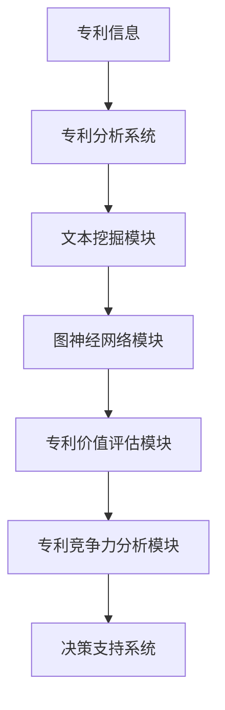

                 

### 《AI驱动的企业知识产权战略：专利组合优化与布局》

#### 关键词：知识产权、AI、专利组合、优化、布局

> 摘要：随着人工智能技术的快速发展，AI在企业知识产权战略中的应用越来越广泛。本文将探讨如何利用AI优化企业的专利组合和布局，从而提升企业的核心竞争力。我们将从背景介绍、核心概念联系、专利组合优化策略等方面逐步分析，并结合具体案例进行详细阐述。

---

### 《AI驱动的企业知识产权战略：专利组合优化与布局》目录大纲

----------------------------------------------------------------

## 第一部分：背景介绍与核心概念

### 第1章：知识产权与企业竞争战略

#### 1.1 问题背景

##### 1.1.1 知识产权的重要性

知识产权是指通过法律手段对智力成果进行保护的权利，包括专利权、商标权、著作权等。在现代经济中，知识产权已经成为企业竞争的重要手段。

##### 1.1.2 AI在知识产权领域的应用

人工智能技术可以高效地进行专利分析、挖掘潜在风险、优化专利组合等，帮助企业更好地管理和利用知识产权。

##### 1.1.3 企业知识产权战略的挑战

随着知识产权的日益重要，企业需要制定有效的知识产权战略，以应对市场竞争和技术变革的挑战。

#### 1.2 问题描述

##### 1.2.1 专利组合的定义

专利组合是指企业持有的所有专利的集合。有效的专利组合能够提高企业的市场竞争力和创新能力。

##### 1.2.2 专利组合优化与布局的必要性

专利组合优化和布局可以帮助企业更好地利用知识产权，提高专利组合的价值和稳定性。

##### 1.2.3 AI驱动的知识产权战略

AI技术可以为企业提供强大的知识产权分析工具，帮助企业制定和实施有效的知识产权战略。

#### 1.3 问题解决

##### 1.3.1 AI技术在专利分析中的应用

利用AI技术进行专利分析，可以帮助企业了解竞争对手的专利情况，发现潜在的知识产权风险。

##### 1.3.2 专利组合优化策略

通过AI技术对专利组合进行优化，可以提高专利组合的竞争力和稳定性。

##### 1.3.3 专利布局的关键要素

合理的专利布局可以增强专利组合的防护能力，提高专利组合的价值。

#### 1.4 边界与外延

##### 1.4.1 专利组合的范围

专利组合的范围包括企业持有的所有专利，以及可能涉及的商标和著作权等。

##### 1.4.2 专利组合的策略分类

专利组合的策略可以分为防御性策略、进攻性策略和混合策略等。

##### 1.4.3 AI驱动知识产权战略的实施步骤

实施AI驱动的知识产权战略需要遵循一定的步骤，包括专利分析、专利优化和专利布局等。

#### 1.5 概念结构与核心要素组成

##### 1.5.1 知识产权战略的组成部分

知识产权战略包括专利策略、商标策略、著作权策略等。

##### 1.5.2 专利组合优化的关键要素

专利组合优化的关键要素包括专利挖掘、专利聚类和专利协同效应等。

##### 1.5.3 专利布局的关键因素

专利布局的关键因素包括专利地域布局、技术领域布局和产业链布局等。

#### 1.6 本章小结

本章介绍了知识产权和企业竞争战略的背景、问题描述、问题解决方法以及边界与外延等内容，为后续章节的分析奠定了基础。

----------------------------------------------------------------

## 第二部分：核心概念与联系

### 第2章：AI驱动的专利分析

#### 2.1 AI技术在专利分析中的应用

##### 2.1.1 文本挖掘技术

文本挖掘技术可以从大量专利文本中提取有价值的信息，如关键词、发明人、专利分类等。

##### 2.1.2 图神经网络技术

图神经网络技术可以处理复杂的专利关系，如专利之间的引用关系、合作关系等。

##### 2.1.3 基于深度学习的专利分析

基于深度学习的专利分析可以利用神经网络模型对专利进行分析和评估。

#### 2.2 专利分析的核心概念

##### 2.2.1 专利情报

专利情报是指通过专利分析获得的信息，如专利趋势、竞争对手情况等。

##### 2.2.2 专利竞争力分析

专利竞争力分析是指评估专利组合在市场竞争中的地位和潜力。

##### 2.2.3 专利价值评估

专利价值评估是指对专利的经济价值进行评估。

#### 2.3 概念属性特征对比表格

| 概念           | 定义                                                         | 关键特征                             | 对比与联系                     |
| -------------- | ------------------------------------------------------------ | ---------------------------------- | ---------------------------- |
| 文本挖掘技术   | 从非结构化文本中提取有价值信息的技术                         | 高效、准确、自动                     | 与图神经网络技术相辅相成         |
| 图神经网络技术 | 基于图结构的深度学习模型，适用于处理复杂关系和交互          | 灵活、强鲁棒性、全局关联性           | 与文本挖掘技术相结合，提高分析深度 |
| 基于深度学习的专利分析 | 利用深度学习算法进行专利分析和评估                         | 自动化、智能化、高效                 | 是专利分析的核心技术           |

#### 2.4 ER实体关系图架构

#### 2.5 本章小结

本章介绍了AI驱动的专利分析的核心概念和技术，包括文本挖掘技术、图神经网络技术和基于深度学习的专利分析，并通过概念属性特征对比表格和ER实体关系图架构进行了详细阐述。

----------------------------------------------------------------

## 第三部分：专利组合优化

### 第3章：专利组合优化策略

#### 3.1 专利组合优化的目标

##### 3.1.1 提高专利组合的竞争力

通过优化专利组合，提高专利组合在市场竞争中的地位和潜力。

##### 3.1.2 降低专利组合的成本

通过优化专利组合，降低专利组合的管理成本和维护成本。

##### 3.1.3 增强专利组合的稳定性

通过优化专利组合，提高专利组合的稳定性，降低专利被无效的风险。

#### 3.2 专利组合优化的方法

##### 3.2.1 基于AI的专利挖掘

利用AI技术对海量专利数据进行挖掘，识别出潜在的优质专利。

##### 3.2.2 专利组合的聚类分析

利用聚类分析技术，对专利组合进行分类和分组，提高专利组合的协同效应。

##### 3.2.3 专利组合的协同效应分析

通过分析专利组合的协同效应，优化专利组合的配置，提高专利组合的整体价值。

#### 3.3 专利组合优化策略案例

##### 3.3.1 案例一：企业A的专利组合优化

企业A是一家从事智能家居设备研发的企业，其专利组合主要涉及智能音响、智能灯光和智能家电等领域。

1. **专利挖掘**：

利用AI技术对海量专利数据进行挖掘，识别出与企业智能家居设备相关的优质专利，如语音识别、智能家居控制系统等。

2. **聚类分析**：

利用聚类分析技术，将专利组合进行分类和分组，如按照技术领域、应用场景等分类，提高专利组合的协同效应。

3. **协同效应分析**：

通过分析专利组合的协同效应，优化专利组合的配置，如将语音识别技术应用于智能音响，将智能家居控制系统应用于智能灯光和智能家电，提高专利组合的整体价值。

#### 3.4 专利组合优化的实施步骤

1. **需求分析**：

明确企业专利组合优化的目标和需求，如提高专利竞争力、降低专利成本等。

2. **数据收集**：

收集企业现有的专利数据，包括专利文本、权利要求书、法律状态等。

3. **专利挖掘**：

利用AI技术对专利数据进行挖掘，识别出潜在的优质专利。

4. **聚类分析**：

利用聚类分析技术，对专利组合进行分类和分组，提高专利组合的协同效应。

5. **协同效应分析**：

通过分析专利组合的协同效应，优化专利组合的配置，提高专利组合的整体价值。

6. **实施与监控**：

根据优化结果，制定实施计划，并对专利组合的优化效果进行监控和评估。

#### 3.5 本章小结

本章介绍了专利组合优化的目标和策略，并通过具体案例阐述了专利组合优化的实施步骤，为企业提供了有效的专利组合优化方法。

----------------------------------------------------------------

## 第四部分：专利布局

### 第4章：专利布局的关键要素

#### 4.1 专利布局的定义

专利布局是指企业在全球范围内对专利进行战略性的规划和配置，以实现知识产权的最大化价值。

#### 4.2 专利布局的关键要素

##### 4.2.1 专利地域布局

专利地域布局是指根据企业的战略目标，选择在不同国家和地区申请专利，以保护企业的技术成果。

##### 4.2.2 技术领域布局

技术领域布局是指根据企业的技术优势，选择合适的技术领域进行专利布局，以提高专利组合的竞争力。

##### 4.2.3 产业链布局

产业链布局是指根据企业的业务模式，选择在产业链上下游进行专利布局，以保护企业的核心技术和竞争优势。

#### 4.3 专利布局的策略

##### 4.3.1 防御性布局

防御性布局是指企业在专利布局过程中，主要关注竞争对手的专利情况，通过申请相关专利来保护自身技术。

##### 4.3.2 进攻性布局

进攻性布局是指企业在专利布局过程中，主动申请专利，通过专利组合来压制竞争对手，扩大市场占有率。

##### 4.3.3 混合性布局

混合性布局是指企业在专利布局过程中，同时采取防御性布局和进攻性布局，以达到最优的专利布局效果。

#### 4.4 专利布局的实施步骤

1. **战略规划**：

根据企业的战略目标，制定专利布局的总体规划。

2. **市场调研**：

分析竞争对手的专利情况，了解市场发展趋势，为专利布局提供依据。

3. **技术领域选择**：

根据企业的技术优势，选择合适的技术领域进行专利布局。

4. **地域选择**：

根据企业的战略目标和市场布局，选择合适的国家和地区进行专利布局。

5. **专利申请**：

根据专利布局策略，进行专利申请，确保专利组合的有效性。

6. **专利维护**：

对已申请的专利进行维护，确保专利的有效性和稳定性。

#### 4.5 专利布局的案例分析

##### 4.5.1 案例一：企业B的全球专利布局

企业B是一家全球知名的手机制造商，其专利布局策略如下：

1. **战略规划**：

企业B制定了全球专利布局的战略，目标是保护自身技术，压制竞争对手，提高市场份额。

2. **市场调研**：

企业B分析了全球手机市场的发展趋势，尤其是竞争对手的专利情况。

3. **技术领域选择**：

企业B选择了手机的核心技术领域，如通信技术、操作系统、摄像头技术等。

4. **地域选择**：

企业B在主要市场国家和地区进行了专利布局，如中国、美国、欧洲等。

5. **专利申请**：

企业B在全球范围内进行了大量专利申请，确保其技术得到有效保护。

6. **专利维护**：

企业B对已申请的专利进行了持续维护，确保专利的有效性和稳定性。

#### 4.6 本章小结

本章介绍了专利布局的定义、关键要素、策略和实施步骤，并通过具体案例阐述了专利布局的策略和实施过程。通过有效的专利布局，企业可以更好地保护技术成果，提高市场竞争力和创新能力。

----------------------------------------------------------------

## 总结与展望

### 5.1 总结

本文从背景介绍、核心概念、专利组合优化、专利布局等方面，详细探讨了AI驱动的企业知识产权战略。通过分析AI技术在知识产权领域的应用，以及专利组合优化和布局的关键要素，为企业提供了有效的知识产权战略制定和实施的参考。

### 5.2 展望

随着人工智能技术的不断发展，AI在知识产权战略中的应用前景将更加广阔。未来，企业可以通过更加智能化、自动化的手段，进行专利分析、挖掘和优化，提高专利组合的价值和稳定性。同时，企业还可以通过全球专利布局，保护自身技术，压制竞争对手，提高市场竞争力。

### 5.3 未来研究方向

1. **AI在专利挖掘和优化中的应用**：进一步研究如何利用AI技术，提高专利挖掘和优化的效率和准确性。

2. **专利价值评估模型**：构建更加科学、准确的专利价值评估模型，为企业提供更加可靠的决策依据。

3. **专利布局策略优化**：探索更加有效的专利布局策略，提高专利布局的针对性和有效性。

4. **跨领域专利分析**：研究如何利用AI技术，进行跨领域的专利分析，挖掘潜在的交叉技术点和创新方向。

### 5.4 结论

AI驱动的企业知识产权战略，为企业提供了强大的知识产权管理和优化工具。通过合理利用AI技术，企业可以优化专利组合，提高专利布局的有效性，从而增强企业的核心竞争力。未来，企业应不断探索AI在知识产权领域的应用，以实现知识产权战略的持续创新和发展。

### 作者信息

**作者：AI天才研究院/AI Genius Institute & 禅与计算机程序设计艺术 /Zen And The Art of Computer Programming**

