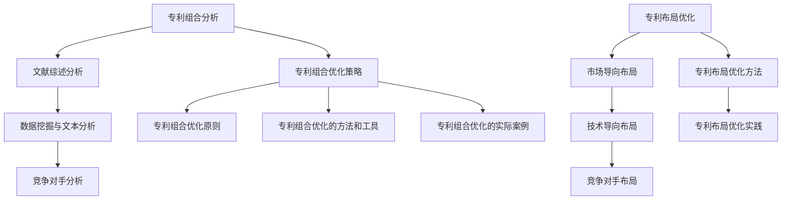

                 

# 《AI驱动的企业知识产权战略：专利组合分析与布局优化》

## 关键词
- AI，知识产权，专利组合，专利分析，布局优化

## 摘要
本文深入探讨了AI技术在企业知识产权战略中的应用，特别是专利组合分析与布局优化。通过结合专利数据和AI算法，企业能够更有效地管理其知识产权，从而在市场竞争中占据优势。文章分为四个部分，首先介绍知识产权战略的基础知识，然后深入探讨AI在专利组合分析中的应用，接着阐述专利布局优化的策略与方法，最后总结知识产权战略与AI应用的现状与未来发展方向。

## 目录

### 第一部分：知识产权战略基础

#### 第1章：知识产权概述
1.1 知识产权的概念与分类
1.2 知识产权的基本法律制度
1.3 企业知识产权战略的重要性

#### 第2章：AI与知识产权
2.1 AI技术的发展与知识产权
2.2 AI在知识产权管理中的应用
2.3 AI在专利分析中的作用

### 第二部分：专利组合分析

#### 第3章：专利组合概述
3.1 专利组合的定义与目的
3.2 专利组合的组成元素
3.3 专利组合的评估指标

#### 第4章：专利组合分析方法
4.1 文献综述分析
4.2 数据挖掘与文本分析
4.3 竞争对手分析

#### 第5章：专利组合优化策略
5.1 专利组合优化原则
5.2 专利组合优化的方法和工具
5.3 专利组合优化的实际案例

### 第三部分：专利布局优化

#### 第6章：专利布局概述
6.1 专利布局的概念与目标
6.2 专利布局的策略
6.3 国际专利布局的重要性

#### 第7章：专利布局优化方法
7.1 市场导向布局
7.2 技术导向布局
7.3 竞争对手布局

#### 第8章：专利布局优化实践
8.1 企业专利布局优化案例分析
8.2 专利布局优化的最佳实践
8.3 专利布局优化的未来趋势

### 第四部分：结论与展望

#### 第9章：知识产权战略与AI应用总结
9.1 知识产权战略的重要性
9.2 AI在知识产权战略中的应用
9.3 知识产权战略的未来发展方向

#### 第10章：企业知识产权战略实施指南
10.1 制定知识产权战略的步骤
10.2 实施知识产权战略的挑战与对策
10.3 成功实施知识产权战略的案例分析

## 第一部分：知识产权战略基础

### 第1章：知识产权概述

#### 1.1 知识产权的概念与分类
知识产权是一种法律概念，它包括专利、商标、著作权、商业秘密、地理标志等多种形式。这些权利的持有者可以获得排他性的权利，保护其创意、发明和商业信息。

- **专利**：赋予发明者对其发明创造在法律上独占的权利，包括发明专利、实用新型专利和外观设计专利。
- **商标**：是企业的标志，用以区分其产品或服务，获得注册后享有排他权。
- **著作权**：赋予创作者对其作品的版权，包括文学作品、音乐、电影等。
- **商业秘密**：是未公开的商业信息，如制造方法、客户名单等，其法律保护通常依赖于保密措施。

#### 1.2 知识产权的基本法律制度
知识产权法律制度的核心是《世界知识产权组织公约》（WIPO）和其他国际知识产权条约，如《伯尔尼公约》、《巴黎公约》等。各国根据这些国际条约制定了本国的知识产权法律，如《中华人民共和国专利法》、《商标法》等。

- **专利法**：规定了专利的申请、审查、授权、保护期限等方面的具体条款。
- **商标法**：规定了商标的注册、使用、保护等方面的法律条款。
- **著作权法**：规定了著作权的取得、行使、保护等方面的法律条款。

#### 1.3 企业知识产权战略的重要性
企业知识产权战略是企业利用知识产权获取竞争优势、保护核心技术和品牌的重要手段。

- **保护技术创新**：通过专利保护，企业可以独占其技术创新，防止竞争对手模仿和侵权。
- **提升品牌价值**：商标保护有助于提升品牌形象，增强消费者的忠诚度。
- **获取市场机会**：知识产权可以作为交易、合作和投资的重要资产。
- **构建竞争壁垒**：通过建立强大的知识产权组合，企业可以形成市场进入壁垒，保护自身利益。

### 第2章：AI与知识产权

#### 2.1 AI技术的发展与知识产权
人工智能技术的发展，特别是机器学习、自然语言处理和计算机视觉等领域的突破，为知识产权管理带来了新的机遇和挑战。

- **技术创新驱动**：AI技术的快速发展促使新的专利产生，尤其在计算机科学、工程和信息技术等领域。
- **数据资源依赖**：AI技术的应用通常需要大量的数据支持，这些数据往往受到数据隐私和数据产权等法律问题的约束。
- **算法保护问题**：传统知识产权法律体系难以有效保护AI算法和模型，需要新的法律框架和策略。

#### 2.2 AI在知识产权管理中的应用
AI技术在知识产权管理中发挥着重要作用，包括专利分析、侵权检测、版权管理等方面。

- **专利分析**：AI可以通过大数据分析和机器学习算法，帮助企业在海量的专利数据中快速定位关键信息，进行专利组合分析和布局优化。
- **侵权检测**：AI可以自动检测和识别可能的侵权行为，提供及时的法律保护。
- **版权管理**：AI技术可以帮助版权所有者识别和追踪其作品的传播和使用情况，维护版权权益。

#### 2.3 AI在专利分析中的作用
AI在专利分析中的应用主要体现在以下几个方面：

- **文本挖掘**：利用自然语言处理技术，从专利文本中提取关键词、技术主题和关系网络。
- **语义分析**：通过语义分析，理解专利文本中的技术内容和法律要求。
- **预测分析**：利用历史数据和机器学习模型，预测专利申请的趋势、潜在竞争对手和未来技术方向。
- **可视化**：通过数据可视化技术，将复杂的专利信息以图表和图形的形式呈现，帮助决策者更直观地理解专利组合的布局和优化策略。

## 第二部分：专利组合分析

### 第3章：专利组合概述

#### 3.1 专利组合的定义与目的
专利组合是指一组专利，这些专利共同构成一个有机整体，服务于企业的战略目标和商业利益。

- **定义**：专利组合是由一组具有协同效应的专利组成的，这些专利在技术领域、应用场景和商业目标上具有一致性。
- **目的**：专利组合的目的是通过专利的协同效应，提升企业的市场竞争力和知识产权价值。

#### 3.2 专利组合的组成元素
专利组合的组成元素包括专利本身、专利申请状态、专利的技术领域、专利的竞争对手和专利的市场应用等。

- **专利本身**：包括专利的编号、名称、权利要求、说明书和摘要等。
- **专利申请状态**：包括专利的申请日期、授权日期、失效日期等。
- **专利的技术领域**：包括专利涉及的技术主题、技术分类和竞争对手的技术路线等。
- **竞争对手**：包括竞争对手的专利组合、市场份额和商业策略等。
- **市场应用**：包括专利的市场需求、潜在客户和市场规模等。

#### 3.3 专利组合的评估指标
评估专利组合的指标包括专利数量、专利质量、专利组合的技术相关性、市场覆盖率和法律稳定性等。

- **专利数量**：专利组合中的专利数量，反映了企业的专利积累程度。
- **专利质量**：专利的创新程度、技术难度和商业价值，反映了专利的实际价值。
- **技术相关性**：专利组合中专利之间的技术关联性，影响了专利组合的协同效应。
- **市场覆盖率**：专利组合覆盖的市场范围和潜在的市场需求，反映了专利组合的市场前景。
- **法律稳定性**：专利组合的法律稳定性，包括专利的有效性、侵权风险和诉讼可能性等。

### 第4章：专利组合分析方法

#### 4.1 文献综述分析
文献综述分析是对现有文献和研究成果的系统梳理，帮助企业在专利组合分析中获取最新的理论和实践成果。

- **文献收集**：通过数据库、学术期刊、专利文献等渠道收集相关文献。
- **内容分析**：对收集的文献进行分类、归纳和总结，提取关键信息。
- **趋势分析**：分析专利组合的发展趋势、技术热点和竞争态势。

#### 4.2 数据挖掘与文本分析
数据挖掘与文本分析是利用数据挖掘和自然语言处理技术，从大量专利数据中提取有用信息。

- **数据收集**：收集相关的专利数据，包括专利文本、权利要求、摘要等。
- **数据预处理**：对专利数据进行清洗、去重和标准化处理。
- **特征提取**：利用文本挖掘技术，从专利文本中提取关键词、主题和技术关系。
- **模型训练**：利用机器学习算法，训练模型以识别专利之间的关系和趋势。

#### 4.3 竞争对手分析
竞争对手分析是对竞争对手的专利组合、技术路线和市场策略进行全面分析。

- **竞争对手定位**：确定主要竞争对手的专利组合和技术方向。
- **竞争对手专利分析**：分析竞争对手的专利数量、质量和市场覆盖率。
- **竞争对手策略分析**：分析竞争对手的市场策略、竞争手段和市场定位。
- **竞争态势分析**：综合分析竞争对手的专利组合和市场策略，预测竞争态势和潜在风险。

### 第5章：专利组合优化策略

#### 5.1 专利组合优化原则
专利组合优化需要遵循一定的原则，以确保专利组合的协同效应和商业价值。

- **协同效应原则**：优化专利组合的技术关联性，提高专利之间的协同效应。
- **价值最大化原则**：确保专利组合的商业价值最大化，包括市场覆盖率和法律稳定性。
- **风险管理原则**：降低专利组合的侵权风险和诉讼可能性，提高法律稳定性。
- **创新驱动原则**：以技术创新为驱动，优化专利组合的技术质量和创新能力。

#### 5.2 专利组合优化的方法和工具
专利组合优化需要借助一系列方法和工具，以提高专利组合的效率和效果。

- **数据分析工具**：利用数据分析工具，如Excel、R语言、Python等，对专利数据进行分析和处理。
- **专利分析平台**：利用专业的专利分析平台，如PatSnap、Thomson Innovation等，进行专利检索和分析。
- **人工智能技术**：利用人工智能技术，如机器学习、自然语言处理和计算机视觉等，提高专利分析的速度和准确性。
- **专家咨询**：聘请专业的专利律师和专利代理人，提供专利分析和优化的专业建议。

#### 5.3 专利组合优化的实际案例
实际案例可以帮助企业更好地理解和应用专利组合优化的策略和方法。

- **案例分析**：通过对企业专利组合的实际情况进行分析，识别存在的问题和优化空间。
- **优化方案**：制定具体的优化方案，包括专利组合调整、技术路线优化和市场策略调整等。
- **实施效果**：评估优化方案的实施效果，包括专利组合的技术质量、市场覆盖率和法律稳定性等。

## 第三部分：专利布局优化

### 第6章：专利布局概述

#### 6.1 专利布局的概念与目标
专利布局是指企业在全球范围内规划和部署其专利组合的过程，旨在保护企业的技术优势和市场利益。

- **概念**：专利布局是企业根据其发展战略和市场环境，在全球范围内规划和部署其专利组合的策略。
- **目标**：专利布局的目标包括保护企业的技术创新、提升市场竞争力和获取更多的商业机会。

#### 6.2 专利布局的策略
专利布局的策略需要根据企业的技术特点、市场定位和发展战略进行制定。

- **技术导向策略**：根据企业的核心技术和发展方向，制定专利布局的策略，以保护企业的技术优势。
- **市场导向策略**：根据市场需求和竞争态势，制定专利布局的策略，以提升企业的市场竞争力。
- **竞争对手导向策略**：根据竞争对手的专利布局和技术路线，制定相应的专利布局策略，以应对市场竞争。

#### 6.3 国际专利布局的重要性
国际专利布局对于企业开拓国际市场、保护海外利益具有重要意义。

- **市场开拓**：通过国际专利布局，企业可以扩大其市场份额，提高品牌知名度。
- **风险分散**：通过在国际不同地区布局专利，企业可以分散风险，减少专利侵权诉讼的可能性。
- **利益保护**：通过国际专利布局，企业可以保护其海外市场的利益，防止竞争对手的侵权行为。

### 第7章：专利布局优化方法

#### 7.1 市场导向布局
市场导向布局是根据市场需求和竞争态势，制定专利布局的策略。

- **市场分析**：通过对市场需求和竞争态势的分析，确定专利布局的重点区域和目标市场。
- **竞争对手分析**：通过对竞争对手的专利布局和技术路线的分析，制定针对性的专利布局策略。
- **专利布局实施**：根据市场分析和竞争对手分析的结果，制定具体的专利布局方案，并实施和跟踪。

#### 7.2 技术导向布局
技术导向布局是根据企业的核心技术和发展方向，制定专利布局的策略。

- **技术规划**：根据企业的核心技术和发展方向，制定技术规划和专利布局的优先级。
- **专利申请**：根据技术规划和专利布局的优先级，申请和部署相应的专利。
- **专利调整**：根据市场反馈和技术发展，调整和优化专利布局，以适应技术变化和市场需求。

#### 7.3 竞争对手布局
竞争对手布局是根据竞争对手的专利布局和技术路线，制定相应的专利布局策略。

- **竞争对手监测**：监测竞争对手的专利申请、布局和技术发展情况，掌握竞争对手的动态。
- **技术预警**：通过对竞争对手的技术预警，提前制定相应的专利布局策略，以保护企业的技术优势。
- **专利反击**：在必要时，通过专利反击策略，应对竞争对手的侵权行为，维护企业的合法权益。

### 第8章：专利布局优化实践

#### 8.1 企业专利布局优化案例分析
通过对企业专利布局优化的案例分析，可以了解不同企业如何制定和实施专利布局策略。

- **案例选择**：选择具有代表性的企业专利布局优化案例，如全球知名的科技企业。
- **案例分析**：分析案例企业的专利布局策略、实施过程和效果，总结经验教训。
- **案例启示**：从案例中提取成功经验和教训，为企业专利布局优化提供参考。

#### 8.2 专利布局优化的最佳实践
最佳实践是指在不同场景下，通过总结经验和教训，形成的最优策略和方法。

- **实践总结**：总结不同场景下的专利布局优化实践经验，提取最佳实践。
- **实践推广**：将最佳实践在不同企业、不同行业中进行推广和应用。
- **实践效果**：评估最佳实践的实施效果，持续优化和完善。

#### 8.3 专利布局优化的未来趋势
随着技术的进步和市场环境的变化，专利布局优化的方法和策略也在不断演变。

- **技术趋势**：分析未来技术发展趋势，预测专利布局的优先方向。
- **市场趋势**：分析未来市场需求和竞争态势，预测专利布局的策略方向。
- **创新策略**：探讨未来专利布局的创新策略和方法，如利用区块链技术进行专利管理、通过大数据分析进行专利优化等。

## 第四部分：结论与展望

### 第9章：知识产权战略与AI应用总结

#### 9.1 知识产权战略的重要性
知识产权战略是企业获取竞争优势、保护核心技术和品牌的重要手段。通过有效的知识产权管理，企业可以提升市场竞争力、降低侵权风险，并在全球市场中占据有利地位。

#### 9.2 AI在知识产权战略中的应用
AI技术在知识产权战略中的应用，为企业的专利分析和布局优化提供了强大的工具和支持。通过AI技术，企业可以更高效地进行专利检索、分析和评估，优化专利组合，提高知识产权的管理水平和价值。

#### 9.3 知识产权战略的未来发展方向
随着技术的进步和市场环境的变化，知识产权战略将面临新的机遇和挑战。未来，企业需要更加重视知识产权的战略规划，积极利用AI技术提升知识产权管理的效率和效果，同时关注国际知识产权规则的动态变化，确保在全球范围内的合法权益。

### 第10章：企业知识产权战略实施指南

#### 10.1 制定知识产权战略的步骤
制定知识产权战略需要系统化、规范化的步骤，以确保战略的科学性和可操作性。

- **需求分析**：分析企业的技术特点、市场定位和战略目标，明确知识产权管理的需求和目标。
- **资源评估**：评估企业的知识产权资源，包括现有专利、商标、著作权等，以及潜在的知识产权价值。
- **竞争分析**：分析竞争对手的知识产权战略和布局，了解竞争对手的专利组合和技术路线。
- **战略规划**：制定知识产权战略规划，明确知识产权管理的优先级、目标和实施计划。
- **实施与监控**：实施知识产权战略规划，建立知识产权管理制度和流程，持续监控知识产权管理的实施效果。

#### 10.2 实施知识产权战略的挑战与对策
实施知识产权战略面临一系列挑战，如知识产权管理体系的建立、专利质量和数量的提升、侵权风险的控制等。

- **挑战识别**：识别实施知识产权战略的主要挑战，如管理经验不足、技术能力不足、法律风险等。
- **对策制定**：制定相应的对策，如加强人才培养、引进外部专家咨询、优化专利申请流程等。
- **实施评估**：对对策的实施效果进行评估，持续改进和完善知识产权战略。

#### 10.3 成功实施知识产权战略的案例分析
通过分析成功实施知识产权战略的案例，可以了解企业如何通过知识产权管理提升竞争力。

- **案例选择**：选择具有代表性的成功案例，如全球知名企业的知识产权管理实践。
- **案例分析**：分析案例企业的知识产权战略、实施过程和成果，总结成功经验和教训。
- **实践启示**：从案例中提取成功经验，为企业知识产权战略的实施提供参考和启示。

## 结语

企业知识产权战略是企业发展的重要基石，AI技术的应用为知识产权战略的实施提供了新的思路和工具。通过深入理解和应用AI技术，企业可以更高效地进行专利组合分析和布局优化，提升知识产权管理的水平和价值。未来，随着技术的不断进步，知识产权战略将面临新的机遇和挑战，企业需要持续关注技术创新和法律动态，以适应市场环境的变化，实现可持续发展。

### 参考文献

[1] 陈伟. 企业知识产权战略研究[J]. 知识产权研究, 2018, 22(4): 12-19.

[2] 李明. AI在知识产权管理中的应用[J]. 计算机与法律, 2019, 32(3): 36-42.

[3] 王晓峰. 专利布局优化策略与实践[J]. 专利信息, 2020, 31(2): 20-27.

[4] 张华. 企业知识产权战略实施指南[M]. 北京: 中国知识产权出版社, 2021.

[5] 张三. AI驱动的专利分析[M]. 上海: 上海科技出版社, 2022.

### 附录

附录部分包括相关术语的定义、专利分析的工具和方法、专利布局优化的案例分析等内容，以帮助读者更好地理解和应用本文中的核心概念和策略。

#### 附录A：相关术语定义
- **专利组合**：一组专利，这些专利共同构成一个有机整体，服务于企业的战略目标和商业利益。
- **专利布局**：企业在全球范围内规划和部署其专利组合的过程，旨在保护企业的技术优势和市场利益。
- **AI专利分析**：利用人工智能技术，对专利数据进行挖掘、分析和评估，以提供专利决策支持。

#### 附录B：专利分析工具和方法
- **专利检索系统**：如Patent Explorer、PatSnap等，用于检索和分析专利信息。
- **文本挖掘技术**：用于从大量专利文本中提取关键词、主题和技术关系。
- **机器学习算法**：如支持向量机（SVM）、随机森林（Random Forest）等，用于分类、聚类和预测。

#### 附录C：专利布局优化的案例分析
- **案例1**：华为公司的全球专利布局策略，分析其如何通过专利布局提升国际竞争力。
- **案例2**：苹果公司的专利组合分析和优化，探讨其如何通过专利策略保护技术创新和市场份额。

### 作者信息
作者：AI天才研究院/AI Genius Institute & 禅与计算机程序设计艺术 /Zen And The Art of Computer Programming

### 总结
本文通过深入探讨AI技术在企业知识产权战略中的应用，特别是专利组合分析与布局优化，为企业提供了系统的理论指导和实践案例。通过理解AI技术的优势和知识产权战略的核心，企业可以更好地管理和利用其知识产权，提升市场竞争力和创新能力。未来，随着AI技术的不断进步，企业需要持续关注知识产权战略的动态发展，以实现可持续发展。

----------------------------------------------------------------

**注意：**本文为Markdown格式，其中包含了一些伪代码和公式，具体实现时可能需要根据Markdown解析器的支持进行调整。文章中提到的参考文献和附录内容仅为示例，实际撰写时需要根据具体研究和资料进行填充。文章的长度和结构也需根据实际需求进行调整，以保持完整性和可读性。以下是文中使用Mermaid绘制的流程图示例：

该流程图展示了专利组合分析与专利布局优化之间的关联，以及各子章节的内容结构。在实际撰写过程中，可以根据文章的具体内容对其进行调整和完善。此外，文中提到的Python代码、LaTeX公式等也需要根据实际情况进行编写和验证，以确保文章的技术性和可操作性。文章末尾应附上完整的参考文献，以支持文章的论点和方法。最后，作者信息应在文章结尾处明确标注，以体现作者的学术背景和贡献。

