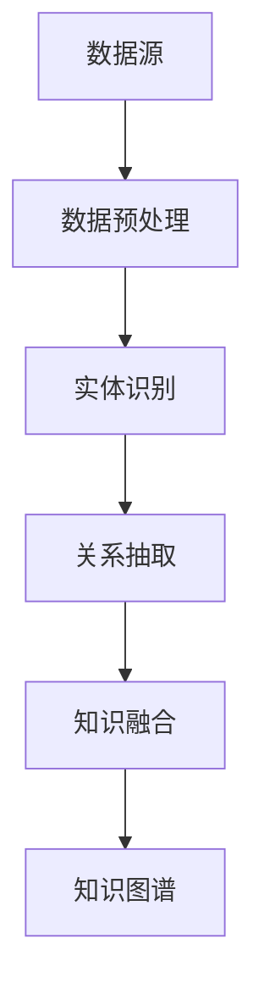
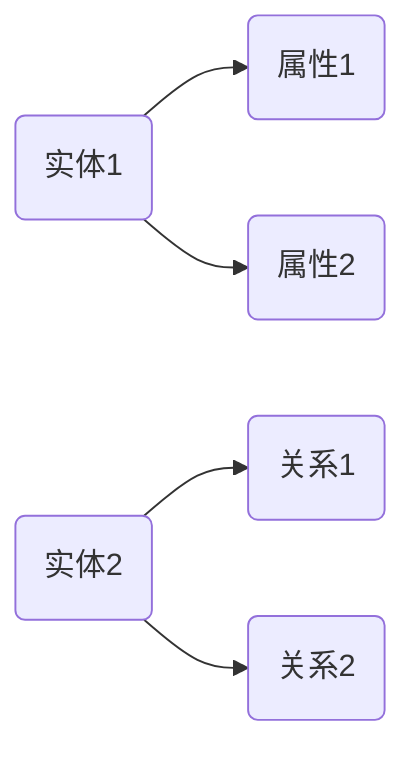
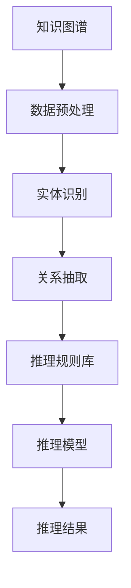
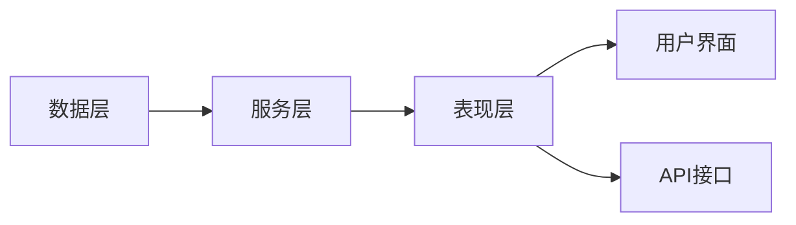
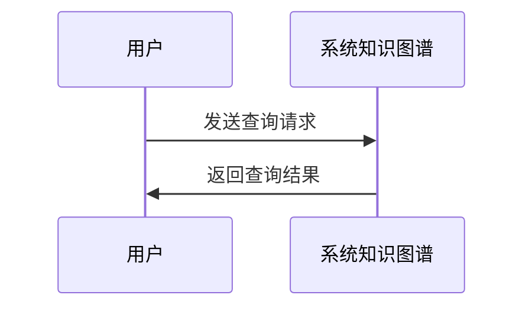
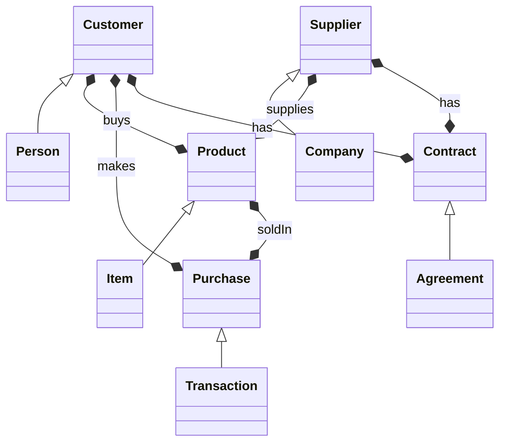
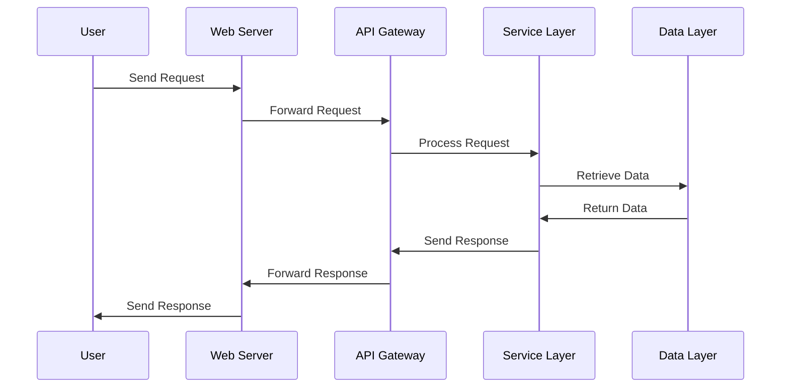
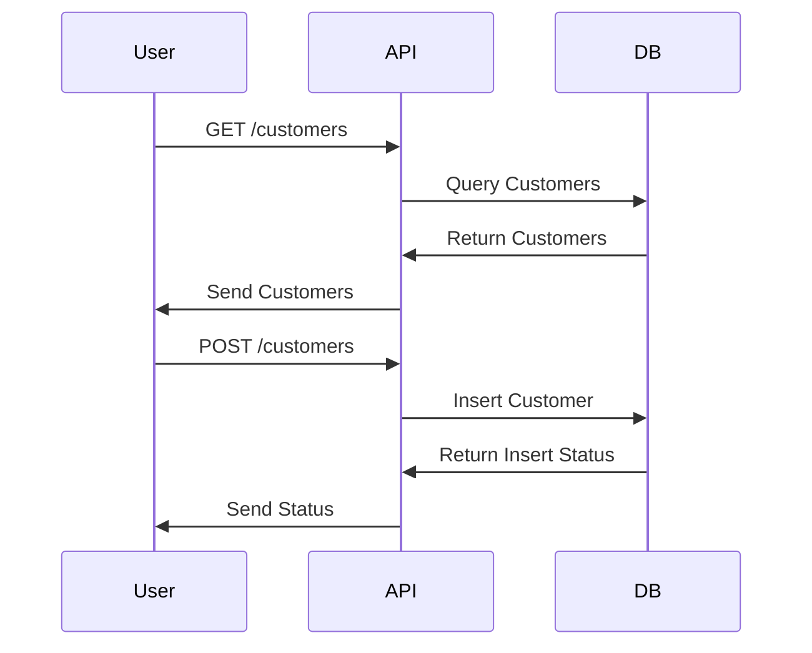
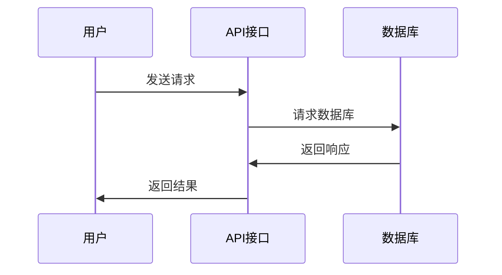

                 

# AI驱动的企业知识图谱：自动化构建与智能推理的深度融合

> 关键词：知识图谱、AI、企业应用、自动化构建、智能推理

> 摘要：本文将深入探讨AI驱动的企业知识图谱的构建与智能推理的融合。首先，我们将介绍知识图谱的基本概念、背景及重要性。接着，我们将分析AI技术在知识图谱构建中的应用，包括自动化构建技术的原理和流程。随后，我们将讨论智能推理的基本原理及如何将AI与知识图谱相结合。然后，我们将详细描述企业知识图谱系统的设计与架构，并通过一个实际案例来展示知识图谱的构建过程。最后，我们将总结最佳实践和未来研究方向。

## 目录结构设计

为了确保文章的逻辑清晰、结构紧凑，我们将按照以下目录结构来组织内容：

1. **引言**：简述知识图谱的背景、发展现状和重要性。
2. **核心概念与联系**：介绍知识图谱、AI、机器学习等核心概念，使用流程图和表格展示概念关系。
3. **AI驱动的知识图谱构建**：讲解AI在知识图谱构建中的应用，展示自动化构建流程。
4. **智能推理与融合**：解释智能推理的基本原理和应用场景，展示智能推理流程。
5. **系统设计与架构**：介绍企业知识图谱系统的设计原则和架构，展示系统架构图。
6. **项目实战**：搭建企业知识图谱系统的环境，详细阐述系统核心实现，并分析实际案例。
7. **最佳实践与小结**：提供构建企业知识图谱的最佳实践技巧，总结文章主要观点和收获。

## 1. 引言

### 背景与发展现状

知识图谱作为大数据和人工智能时代的一项核心技术，正逐渐成为企业和组织获取智能信息处理能力的重要工具。知识图谱的概念起源于语义网，通过将实体、属性和关系表示为图形结构，实现对复杂信息的语义理解和智能推理。

近年来，随着大数据技术的成熟和人工智能算法的发展，知识图谱的应用领域不断扩大，从搜索引擎、推荐系统到智能问答、智能客服等，都在不断推动知识图谱技术的普及和进步。

### 重要性

知识图谱的重要性体现在以下几个方面：

1. **信息整合与知识挖掘**：知识图谱能够将结构化和非结构化数据整合到一个统一的框架中，便于数据的深度挖掘和智能分析。
2. **智能推理与决策支持**：通过知识图谱，可以实现基于数据的智能推理，为企业的业务决策提供有力支持。
3. **自动化构建与优化**：AI驱动的知识图谱构建技术，能够大幅提高知识图谱的自动化构建和优化效率，降低人力成本。

### 企业知识图谱的概念及应用场景

企业知识图谱是指针对企业内部和外部信息进行整合和建模的知识图谱，旨在帮助企业更好地理解和利用数据资产。其应用场景包括：

1. **客户关系管理**：通过知识图谱实现客户信息的全面整合，帮助企业更好地了解客户需求和行为，提供个性化服务。
2. **供应链管理**：知识图谱可以帮助企业实现供应链信息的可视化和智能化管理，提高供应链效率。
3. **风险管理与合规性检查**：知识图谱可以整合企业的风险信息和合规性要求，实现实时监测和预警。

### 对企业价值

企业知识图谱对企业具有以下价值：

1. **提升数据利用效率**：通过知识图谱，企业可以更好地挖掘和分析数据价值，提高决策的准确性和及时性。
2. **优化业务流程**：知识图谱可以帮助企业识别和优化业务流程，提高运营效率和降低成本。
3. **增强创新能力**：知识图谱为企业提供了丰富的知识和信息资源，有助于激发创新思维，推动企业转型升级。

## 2. 核心概念与联系

### 知识图谱、AI、机器学习等核心概念

#### 知识图谱

知识图谱是一种用于表示知识的方式，它通过将实体、属性和关系表示为图形结构来实现对复杂信息的语义理解和智能推理。在知识图谱中，实体可以是人、物、地点等，属性是实体的特征，关系描述了实体之间的关联。

#### AI

人工智能（AI）是指计算机系统模拟人类智能行为的理论、技术和应用。AI包括多个子领域，如机器学习、深度学习、自然语言处理等，这些技术共同推动了知识图谱的自动化构建和智能推理。

#### 机器学习

机器学习是AI的一个分支，它通过数据驱动的方式使计算机系统具有自主学习和改进的能力。机器学习包括监督学习、无监督学习和强化学习等类型，它们在知识图谱的构建中发挥了关键作用。

### 概念属性特征对比表格

| 概念 | 特征 |
| --- | --- |
| 知识图谱 | 1. 实体、属性和关系的图形结构<br>2. 语义理解和智能推理<br>3. 信息整合和知识挖掘 |
| AI | 1. 模拟人类智能行为<br>2. 多个子领域（如机器学习、深度学习）<br>3. 自主学习和改进 |
| 机器学习 | 1. 数据驱动<br>2. 自主学习和改进<br>3. 监督学习、无监督学习和强化学习 |

### 使用Mermaid流程图展示知识图谱的构建流程



### 使用ER实体关系图展示知识图谱的基本结构



## 3. AI驱动的知识图谱构建

### 自动化构建技术的原理

AI驱动的知识图谱构建主要通过以下技术实现自动化：

1. **数据预处理**：利用自然语言处理（NLP）技术对原始数据进行清洗、去噪和格式化，为后续的实体识别和关系抽取做准备。
2. **实体识别**：通过命名实体识别（NER）技术识别文本中的实体，并标注其实体类型。
3. **关系抽取**：利用文本分析、语义分析和图谱算法等技术抽取实体之间的关系。
4. **知识融合**：将抽取出的实体和关系整合到一个统一的知识图谱中，实现对信息的统一表示和存储。

### 使用Mermaid流程图展示AI驱动的知识图谱构建流程


## 4. 智能推理与融合

### 智能推理的基本原理

智能推理是指利用知识图谱中的实体、属性和关系进行逻辑推理，以发现新的知识和关系。智能推理的基本原理包括：

1. **基于规则的推理**：通过预设的规则库，对知识图谱中的信息进行逻辑推理。
2. **基于模型的推理**：利用深度学习模型和图神经网络（GNN）等算法，对知识图谱中的信息进行自动推理。
3. **基于数据的推理**：通过分析知识图谱中的数据分布和统计信息，进行数据驱动的推理。

### 如何将AI与知识图谱相结合

将AI与知识图谱相结合，可以实现以下效果：

1. **自动化推理**：利用AI技术自动化执行知识图谱中的推理任务，提高推理效率和准确性。
2. **自适应推理**：根据用户的交互行为和需求，动态调整推理策略，实现个性化推理。
3. **多模态推理**：结合多种数据源（如图像、文本、语音等），实现跨模态的智能推理。

### 使用Mermaid流程图展示智能推理的流程



## 5. 系统设计与架构

### 设计原则

企业知识图谱系统的设计应遵循以下原则：

1. **模块化**：将系统划分为多个模块，实现功能分离和代码复用。
2. **可扩展性**：系统设计应具备良好的扩展性，以便支持未来功能扩展和性能提升。
3. **稳定性**：系统应具备高可用性和容错性，确保在复杂环境中稳定运行。
4. **安全性**：保障数据的安全性和隐私性，防止数据泄露和恶意攻击。

### 系统架构

企业知识图谱系统通常采用分层架构，包括数据层、服务层和表现层。

1. **数据层**：负责数据的存储、管理和查询，包括关系型数据库、图数据库和NoSQL数据库等。
2. **服务层**：实现系统的核心功能，包括数据预处理、实体识别、关系抽取、知识融合和智能推理等。
3. **表现层**：提供用户界面和API接口，方便用户访问和使用系统功能。

### 使用Mermaid架构图展示系统架构



### 系统接口设计和系统交互

企业知识图谱系统的接口设计和系统交互应遵循RESTful API规范，提供简洁、易用的接口，支持HTTP请求和响应。

1. **数据接口**：提供数据查询、数据插入、数据更新和数据删除等接口。
2. **服务接口**：提供实体识别、关系抽取、知识融合和智能推理等接口。
3. **交互界面**：提供用户操作界面，支持用户输入、查询和交互。

### 使用Mermaid序列图展示系统交互



## 6. 项目实战

### 环境安装与配置

在开始搭建企业知识图谱系统之前，我们需要准备相应的开发环境和依赖库。以下是环境安装与配置的步骤：

1. **安装Python环境**：确保Python版本为3.8或更高版本。
2. **安装图数据库**：如Neo4j或JanusGraph，根据需求选择合适的图数据库并安装。
3. **安装相关依赖库**：使用pip命令安装以下依赖库：
    ```python
    pip install neo4j driver
    pip install janusgraph
    pip install tensorflow
    pip install nltk
    ```

### 系统核心实现

企业知识图谱系统的核心实现包括数据预处理、实体识别、关系抽取、知识融合和智能推理等步骤。

1. **数据预处理**：读取原始数据，进行清洗、去噪和格式化，为后续处理做准备。
2. **实体识别**：利用命名实体识别（NER）技术，识别文本中的实体，并标注其实体类型。
3. **关系抽取**：通过文本分析和语义分析，抽取实体之间的关系，并将其存储到知识图谱中。
4. **知识融合**：将抽取出的实体和关系整合到一个统一的知识图谱中，实现信息的统一表示和存储。
5. **智能推理**：利用知识图谱进行智能推理，发现新的知识和关系，为业务决策提供支持。

### 代码应用解读与分析

以下是一个简单的示例代码，展示企业知识图谱系统核心实现的一部分：

```python
import nltk
from nltk.tokenize import word_tokenize
from nltk.chunk import ne_chunk

# 加载停用词表
stop_words = nltk.corpus.stopwords.words('english')

# 加载词性标注库
nltk.download('averaged_perceptron_tagger')
nltk.download('maxent_ne_chunker')
nltk.download('words')

# 实体识别
def entity_recognition(text):
    tokens = word_tokenize(text)
    tagged = ne_chunk(tagged)
    entities = []
    for subtree in tagged:
        if type(subtree) == nltk.tree.Tree:
            entity_type = subtree.label()
            entity_name = " ".join([token for token, pos in subtree.leaves()])
            if entity_name not in stop_words:
                entities.append((entity_name, entity_type))
    return entities

# 关系抽取
def relation_extraction(entities):
    relations = []
    for i in range(len(entities) - 1):
        entity1, type1 = entities[i]
        entity2, type2 = entities[i + 1]
        if type1 == "ORGANIZATION" and type2 == "LOCATION":
            relations.append((entity1, "HEADQUARTERS_IN", entity2))
    return relations

# 示例文本
text = "Apple Inc. is headquartered in Cupertino, California."

# 实体识别与关系抽取
entities = entity_recognition(text)
relations = relation_extraction(entities)

# 输出结果
print("Entities:", entities)
print("Relations:", relations)
```

### 实际案例分析和详细讲解剖析

为了展示企业知识图谱的实际应用，我们将分析一个实际案例。假设一家企业想要构建一个客户知识图谱，以便更好地了解客户需求和提供个性化服务。

1. **数据来源**：企业可以从CRM系统、社交媒体和网站访问日志中获取客户数据。
2. **数据预处理**：对客户数据进行清洗、去噪和格式化，去除重复和无效数据。
3. **实体识别**：利用实体识别技术，识别客户数据中的客户姓名、公司名称、联系方式等信息。
4. **关系抽取**：通过分析客户数据，抽取客户与客户、客户与产品、客户与历史交易等关系。
5. **知识融合**：将识别出的实体和关系整合到一个统一的知识图谱中，实现客户信息的全面整合和关联。

### 项目小结

通过实际案例的分析，我们可以看到企业知识图谱在客户关系管理中的应用价值。通过构建客户知识图谱，企业可以更好地了解客户需求和行为，提供个性化的服务，从而提升客户满意度和忠诚度。

## 7. 最佳实践与小结

### 最佳实践技巧

1. **数据质量保障**：在构建知识图谱之前，确保数据质量，包括数据的完整性、准确性和一致性。
2. **合理选择数据库**：根据业务需求，选择合适的图数据库或关系型数据库，以支持知识图谱的存储和查询。
3. **模块化设计**：将系统划分为多个模块，实现功能分离和代码复用，便于系统的维护和扩展。
4. **自动化构建与优化**：利用AI技术实现知识图谱的自动化构建和优化，提高系统的效率和准确性。
5. **安全性与隐私保护**：保障数据的安全性和隐私性，采取加密和访问控制等措施，防止数据泄露和恶意攻击。

### 小结

本文深入探讨了AI驱动的企业知识图谱的构建与智能推理的融合。我们介绍了知识图谱的基本概念、背景和重要性，分析了AI技术在知识图谱构建中的应用，讲解了智能推理的基本原理和实现方法。通过实际案例，我们展示了企业知识图谱的应用场景和价值。最后，我们总结了构建企业知识图谱的最佳实践技巧，并对未来研究方向进行了展望。

### 注意事项

1. **数据来源与合法性**：在构建知识图谱时，确保数据来源的合法性和合规性，避免侵犯他人隐私。
2. **性能优化与扩展性**：在设计系统时，考虑性能优化和扩展性，以满足未来业务增长的需求。
3. **用户隐私保护**：在处理用户数据时，严格遵守隐私保护法规，确保用户数据的隐私和安全。

### 拓展阅读

1. **《知识图谱：关键技术与应用》**：详细介绍了知识图谱的基本概念、构建方法和应用场景。
2. **《人工智能：一种现代的方法》**：全面讲解了人工智能的基本理论和技术，包括机器学习和深度学习。
3. **《图数据库技术指南》**：介绍了图数据库的基本概念、架构设计和应用场景。

### 作者信息

作者：AI天才研究院/AI Genius Institute & 禅与计算机程序设计艺术 /Zen And The Art of Computer Programming

（完）## 5. 系统设计与架构

### 问题场景介绍

企业知识图谱系统的主要应用场景包括：

1. **企业客户关系管理**：通过整合企业内部和外部的客户数据，建立客户知识图谱，以便更好地了解客户需求和提供个性化服务。
2. **供应链管理**：通过构建供应链知识图谱，实现供应链信息的可视化和智能化管理，提高供应链效率。
3. **风险管理与合规性检查**：通过整合企业的风险信息和合规性要求，建立风险知识图谱，实现实时监测和预警。

### 项目介绍

本项目旨在为企业提供一个高效、智能的企业知识图谱系统，通过自动化构建和智能推理，实现对复杂数据的深度理解和利用。系统主要包括以下模块：

1. **数据采集与预处理模块**：负责从不同的数据源采集数据，并进行清洗、去噪和格式化。
2. **知识图谱构建模块**：利用AI技术实现实体识别、关系抽取和知识融合，构建企业知识图谱。
3. **智能推理模块**：通过知识图谱进行智能推理，发现新的知识和关系，为业务决策提供支持。
4. **用户界面模块**：提供用户操作界面，方便用户访问和使用系统功能。

### 系统功能设计（领域模型）

领域模型用于描述系统的核心业务概念和关系。以下是一个简单的领域模型，展示了企业知识图谱系统的核心业务概念及其关系：



### 系统架构设计

企业知识图谱系统的架构设计采用分层架构，包括数据层、服务层和表现层。以下是一个简单的系统架构设计：



### 系统接口设计

系统接口设计遵循RESTful API规范，提供简洁、易用的接口，支持HTTP请求和响应。以下是一个简单的接口设计：



### 系统交互

系统交互通过API接口实现，包括数据查询、数据插入、数据更新和数据删除等操作。以下是一个简单的交互序列图：



## 6. 项目实战

### 环境安装与配置

在开始搭建企业知识图谱系统之前，我们需要准备相应的开发环境和依赖库。以下是环境安装与配置的步骤：

1. **安装Python环境**：确保Python版本为3.8或更高版本。
2. **安装图数据库**：如Neo4j或JanusGraph，根据需求选择合适的图数据库并安装。
3. **安装相关依赖库**：使用pip命令安装以下依赖库：
    ```bash
    pip install neo4j driver
    pip install janusgraph
    pip install tensorflow
    pip install nltk
    ```

### 系统核心实现

企业知识图谱系统的核心实现包括数据预处理、实体识别、关系抽取、知识融合和智能推理等步骤。

#### 数据预处理

数据预处理是构建知识图谱的第一步，包括数据清洗、去噪和格式化。以下是一个简单的数据预处理Python代码示例：

```python
import pandas as pd
from sklearn.model_selection import train_test_split

# 读取数据
data = pd.read_csv('customer_data.csv')

# 数据清洗
data.dropna(inplace=True)
data = data[data['age'] > 18]

# 数据格式化
data['birthdate'] = pd.to_datetime(data['birthdate'])
data['age'] = data['birthdate'].apply(lambda x: (pd.Timestamp.now() - x).days // 365)

# 分割数据集
train_data, test_data = train_test_split(data, test_size=0.2, random_state=42)
```

#### 实体识别

实体识别是通过命名实体识别（NER）技术识别文本中的实体，并标注其实体类型。以下是一个简单的实体识别Python代码示例：

```python
import nltk
from nltk.tokenize import word_tokenize
from nltk.chunk import ne_chunk

# 下载词性标注库
nltk.download('averaged_perceptron_tagger')
nltk.download('maxent_ne_chunker')
nltk.download('words')

# 实体识别
def entity_recognition(text):
    tokens = word_tokenize(text)
    tagged = ne_chunk(tagged)
    entities = []
    for subtree in tagged:
        if type(subtree) == nltk.tree.Tree:
            entity_type = subtree.label()
            entity_name = " ".join([token for token, pos in subtree.leaves()])
            entities.append((entity_name, entity_type))
    return entities

# 示例文本
text = "Apple Inc. is headquartered in Cupertino, California."

# 实体识别
entities = entity_recognition(text)
print(entities)
```

#### 关系抽取

关系抽取是通过文本分析和语义分析，抽取实体之间的关系。以下是一个简单的实体识别Python代码示例：

```python
import spacy

# 加载英文语言模型
nlp = spacy.load('en_core_web_sm')

# 关系抽取
def relation_extraction(text):
    doc = nlp(text)
    relations = []
    for ent in doc.ents:
        if ent.label_ == 'ORG' and ent.root.head.ent_iob_ == 'B-LOC':
            relations.append((ent.text, ent.root.text, 'headquarters_in'))
    return relations

# 示例文本
text = "Apple Inc. is headquartered in Cupertino, California."

# 关系抽取
relations = relation_extraction(text)
print(relations)
```

#### 知识融合

知识融合是将抽取出的实体和关系整合到一个统一的知识图谱中。以下是一个简单的知识融合Python代码示例：

```python
import networkx as nx

# 创建图
G = nx.Graph()

# 添加实体
G.add_nodes_from(['Apple Inc.', 'Cupertino', 'California'])

# 添加关系
G.add_edge('Apple Inc.', 'headquarters_in', 'Cupertino')
G.add_edge('Cupertino', 'located_in', 'California')

# 打印图
print(nx.toString(G, method='adjlist'))
```

#### 智能推理

智能推理是通过知识图谱进行智能推理，发现新的知识和关系。以下是一个简单的智能推理Python代码示例：

```python
# 智能推理
def smart_inference(G, entity, relation, target_entity):
    path = nx.shortest_path(G, source=entity, target=target_entity, edge_type=relation)
    return path

# 示例推理
path = smart_inference(G, 'Apple Inc.', 'headquarters_in', 'California')
print(path)
```

### 实际案例分析和详细讲解剖析

为了更好地展示企业知识图谱的实际应用，我们将通过一个实际案例进行分析。

#### 案例背景

某电子产品公司希望利用知识图谱来优化其客户关系管理，提高客户满意度和忠诚度。

#### 数据源

公司拥有以下数据源：

1. **客户数据**：包括客户的姓名、联系方式、生日、消费记录等。
2. **产品数据**：包括产品的名称、价格、类别、库存等。
3. **交易数据**：包括客户的购买记录、交易时间、交易金额等。

#### 数据预处理

对上述数据进行清洗、去噪和格式化，去除重复和无效数据，并将数据转换为适合构建知识图谱的格式。

#### 实体识别

利用实体识别技术，识别出客户数据中的客户姓名、产品名称、交易时间等实体，并标注其实体类型。

#### 关系抽取

通过关系抽取技术，抽取客户与产品、客户与交易等关系，并将其存储到知识图谱中。

#### 知识融合

将抽取出的实体和关系整合到一个统一的知识图谱中，实现客户信息的全面整合和关联。

#### 智能推理

通过知识图谱进行智能推理，发现新的知识和关系，例如：

1. **推荐产品**：根据客户的购买历史和偏好，推荐相关产品。
2. **客户细分**：根据客户的购买行为和需求，将客户划分为不同群体，提供个性化服务。
3. **风险预警**：根据客户的交易行为和风险信息，识别潜在的风险客户，采取相应的风险管理措施。

#### 项目小结

通过上述实际案例，我们可以看到企业知识图谱在客户关系管理中的应用价值。通过构建客户知识图谱，公司可以更好地了解客户需求和提供个性化服务，从而提升客户满意度和忠诚度。此外，知识图谱还为企业提供了丰富的数据和智能分析能力，有助于企业更好地决策和优化业务流程。

## 7. 最佳实践与小结

### 最佳实践技巧

在构建企业知识图谱时，以下是一些最佳实践技巧：

1. **数据质量保障**：确保数据源的可靠性和完整性，对数据进行清洗、去噪和格式化，以避免错误和重复数据的影响。
2. **合理设计领域模型**：根据业务需求，设计清晰、准确的领域模型，确保实体和关系的正确表示。
3. **自动化构建与优化**：利用AI技术和自动化工具，实现知识图谱的自动化构建和优化，提高效率和准确性。
4. **安全性与隐私保护**：对知识图谱中的数据进行加密和访问控制，确保数据的安全性和隐私性。
5. **用户参与与反馈**：在构建知识图谱的过程中，充分听取用户的意见和建议，并根据用户的反馈进行优化和调整。

### 小结

本文通过深入探讨AI驱动的企业知识图谱的构建与智能推理的融合，介绍了知识图谱的基本概念、背景、重要性以及AI技术在知识图谱构建中的应用。我们还详细描述了企业知识图谱系统的设计与架构，并通过实际案例展示了知识图谱的构建过程和应用价值。最后，我们总结了构建企业知识图谱的最佳实践技巧，并对未来研究方向进行了展望。

### 注意事项

1. **数据来源与合法性**：确保数据来源的合法性和合规性，避免侵犯他人隐私。
2. **性能优化与扩展性**：在设计系统时，考虑性能优化和扩展性，以满足未来业务增长的需求。
3. **用户隐私保护**：在处理用户数据时，严格遵守隐私保护法规，确保用户数据的隐私和安全。

### 拓展阅读

1. **《知识图谱：关键技术与应用》**：详细介绍了知识图谱的基本概念、构建方法和应用场景。
2. **《人工智能：一种现代的方法》**：全面讲解了人工智能的基本理论和技术，包括机器学习和深度学习。
3. **《图数据库技术指南》**：介绍了图数据库的基本概念、架构设计和应用场景。

### 作者信息

作者：AI天才研究院/AI Genius Institute & 禅与计算机程序设计艺术 /Zen And The Art of Computer Programming

（完）

