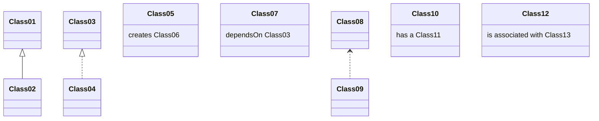
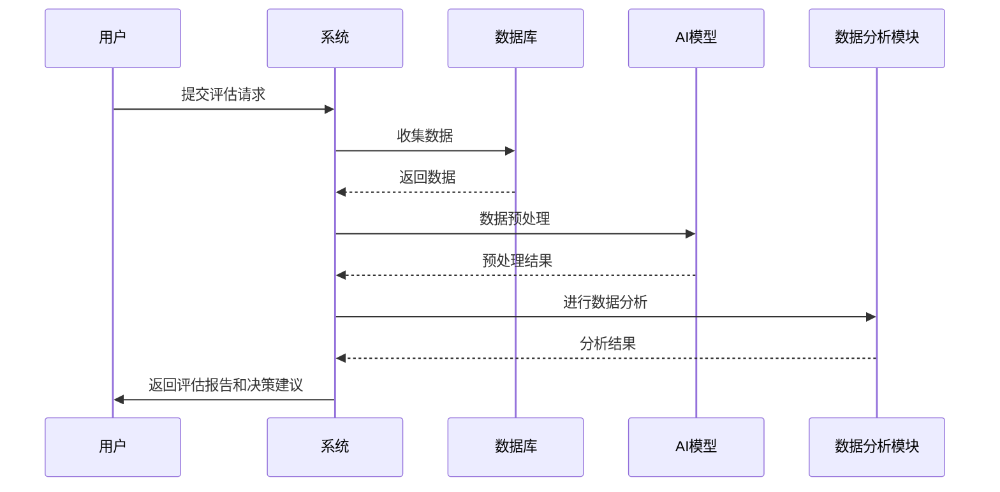

                 

### 《AI驱动的企业破产重组可行性分析》

> 关键词：人工智能、破产重组、可行性分析、深度学习、机器学习

> 摘要：本文深入探讨了人工智能（AI）在推动企业破产重组中的可行性，首先介绍了企业破产重组的现状及AI技术的应用前景，然后详细分析了AI的基础理论、企业破产重组的理论框架，以及AI在破产重组中的实际应用。通过具体案例和可行性评估框架的构建，本文为AI驱动的企业破产重组提供了理论依据和实践指导，展望了未来发展的趋势和挑战。

----------------------------------------------------------------

### 目录

----------------------------------------------------------------

## 第一部分: 引言

### 第1章: 引言

#### 1.1 问题的背景与意义

##### 1.1.1 企业破产重组的现状

##### 1.1.2 AI技术在企业破产重组中的应用前景

##### 1.1.3 企业破产重组中的挑战与机遇

#### 1.2 研究目标与内容结构

##### 1.2.1 研究目标

##### 1.2.2 内容结构概述

#### 1.3 研究方法与数据来源

##### 1.3.1 研究方法

##### 1.3.2 数据来源

### 第2章: AI基础理论

#### 2.1 人工智能概述

##### 2.1.1 人工智能的定义与发展历程

##### 2.1.2 人工智能的关键技术

##### 2.1.3 人工智能的应用领域

#### 2.2 深度学习基础

##### 2.2.1 深度学习的原理

##### 2.2.2 深度学习的关键技术

##### 2.2.3 深度学习在AI中的作用

#### 2.3 机器学习算法

##### 2.3.1 机器学习的基本概念

##### 2.3.2 常见的机器学习算法

##### 2.3.3 机器学习算法的选择与优化

### 第3章: 企业破产重组理论

#### 3.1 企业破产重组概述

##### 3.1.1 企业破产重组的定义与分类

##### 3.1.2 企业破产重组的目的与意义

##### 3.1.3 企业破产重组的基本流程

#### 3.2 企业破产重组的经济学原理

##### 3.2.1 企业破产重组的市场机制

##### 3.2.2 企业破产重组的收益与成本分析

##### 3.2.3 企业破产重组的博弈论分析

#### 3.3 企业破产重组的法律框架

##### 3.3.1 企业破产重组的法律制度

##### 3.3.2 企业破产重组的法律程序

##### 3.3.3 企业破产重组的法律风险与防范

### 第4章: AI在破产重组中的应用

#### 4.1 AI在破产重组评估中的应用

##### 4.1.1 破产重组评估的现状与问题

##### 4.1.2 AI技术在破产重组评估中的应用

##### 4.1.3 AI在破产重组评估中的优势

#### 4.2 AI在破产重组决策中的应用

##### 4.2.1 破产重组决策的现状与问题

##### 4.2.2 AI技术在破产重组决策中的应用

##### 4.2.3 AI在破产重组决策中的优势

#### 4.3 AI在破产重组实施中的应用

##### 4.3.1 破产重组实施的过程与问题

##### 4.3.2 AI技术在破产重组实施中的应用

##### 4.3.3 AI在破产重组实施中的优势

### 第5章: AI驱动的破产重组案例分析

#### 5.1 案例概述

##### 5.1.1 案例背景

##### 5.1.2 案例目标

##### 5.1.3 案例成果

#### 5.2 案例分析

##### 5.2.1 破产重组评估分析

##### 5.2.2 破产重组决策分析

##### 5.2.3 破产重组实施分析

### 第6章: AI驱动的企业破产重组可行性评估

#### 6.1 可行性评估概述

##### 6.1.1 可行性评估的定义与作用

##### 6.1.2 可行性评估的基本原则

##### 6.1.3 可行性评估的方法

#### 6.2 AI驱动的可行性评估框架

##### 6.2.1 评估框架的构建

##### 6.2.2 评估指标的设计

##### 6.2.3 评估模型的构建

### 第7章: 结论与展望

#### 7.1 研究结论

##### 7.1.1 研究成果总结

##### 7.1.2 研究局限与未来方向

#### 7.2 未来发展趋势

##### 7.2.1 AI在破产重组领域的应用趋势

##### 7.2.2 破产重组实践的改进建议

----------------------------------------------------------------

## 第1章: 引言

### 1.1 问题的背景与意义

企业破产重组是一个复杂的过程，涉及财务分析、债务重组、资产评估、业务重构等多个方面。随着全球经济的波动和市场竞争的加剧，企业破产重组的现象日益普遍。传统的破产重组方法主要依赖于专业人士的经验和判断，存在主观性强、效率低下等问题。而人工智能（AI）技术的发展为破产重组提供了新的可能性，通过数据分析和智能决策，有望提高破产重组的成功率和效率。

#### 1.1.1 企业破产重组的现状

当前，企业破产重组主要依赖于以下几种方法：

1. **财务重整**：通过债务重组、资产剥离等方式，恢复企业的财务状况。
2. **业务重构**：调整企业业务结构，优化资源配置，提高企业竞争力。
3. **管理重整**：更换管理层，引入新的管理理念和运营模式。
4. **资产清算**：在无法恢复企业持续经营的情况下，通过清算资产偿还债务。

然而，这些传统方法往往存在以下问题：

- **信息不对称**：破产重组过程中，债权人和债务人之间的信息不对称，导致决策偏差。
- **效率低下**：破产重组流程复杂，涉及多方利益，决策过程耗时较长。
- **成本高昂**：破产重组过程中涉及的法律、财务等专业服务费用较高。

#### 1.1.2 AI技术在企业破产重组中的应用前景

AI技术，尤其是深度学习和机器学习，为企业破产重组提供了新的解决方案：

1. **数据挖掘与分析**：AI可以通过大数据分析，快速识别企业的财务风险和潜在问题。
2. **智能决策支持**：AI系统可以根据数据分析和算法模型，提供破产重组的决策建议。
3. **自动化流程管理**：AI可以自动化破产重组过程中的评估、决策和执行，提高工作效率。

AI技术在企业破产重组中的应用前景广阔，有望解决传统方法中存在的诸多问题，提高破产重组的成功率和效率。

#### 1.1.3 企业破产重组中的挑战与机遇

尽管AI技术在企业破产重组中具有巨大潜力，但实际应用中仍面临以下挑战：

1. **技术成熟度**：AI技术仍在快速发展中，部分关键技术和算法尚未完全成熟。
2. **数据质量**：破产重组过程中涉及的数据复杂且多样，数据质量直接影响AI模型的准确性。
3. **法律合规**：AI技术在破产重组中的应用需要遵守相关法律法规，确保数据的合法使用。

然而，随着AI技术的不断进步和应用场景的拓展，企业破产重组也将迎来新的机遇：

1. **降低成本**：AI技术可以自动化破产重组流程，降低人工成本。
2. **提高效率**：AI可以快速处理大量数据，提高决策效率和准确性。
3. **增强透明度**：AI技术的应用可以增强破产重组过程的透明度，减少人为干预。

总的来说，AI技术在企业破产重组中具有巨大的应用潜力和现实意义。接下来，本文将详细探讨AI的基础理论、企业破产重组的理论框架，以及AI在破产重组中的应用，为AI驱动的企业破产重组提供理论依据和实践指导。

### 1.2 研究目标与内容结构

#### 1.2.1 研究目标

本文旨在探讨AI在推动企业破产重组中的可行性，主要研究目标包括：

1. **评估AI技术在企业破产重组中的应用潜力**：通过分析AI技术的特点和应用案例，评估其在破产重组中的适用性。
2. **构建AI驱动的破产重组评估模型**：基于深度学习和机器学习算法，构建一套适用于企业破产重组的智能评估模型。
3. **分析AI驱动的破产重组优势与挑战**：从技术、法律、经济等角度，分析AI驱动的破产重组的优势和面临的挑战。

#### 1.2.2 内容结构概述

本文将分为七个部分进行详细讨论：

1. **引言**：介绍企业破产重组的现状及AI技术的应用前景，阐述研究目标与内容结构。
2. **AI基础理论**：介绍人工智能、深度学习和机器学习的基本概念和关键技术。
3. **企业破产重组理论**：分析企业破产重组的定义、目的、流程和经济学原理。
4. **AI在破产重组中的应用**：探讨AI在破产重组评估、决策和实施中的应用场景和优势。
5. **AI驱动的破产重组案例分析**：通过具体案例，分析AI驱动的破产重组评估、决策和实施过程。
6. **AI驱动的破产重组可行性评估**：构建AI驱动的破产重组可行性评估框架，设计评估指标和模型。
7. **结论与展望**：总结研究成果，讨论研究局限与未来方向，展望AI在破产重组领域的应用趋势。

通过以上结构，本文将为读者提供一个全面、系统的AI驱动的企业破产重组分析框架，为实际应用提供理论支持和实践指导。

### 1.3 研究方法与数据来源

#### 1.3.1 研究方法

本文采用多种研究方法，以全面、系统地分析AI在推动企业破产重组中的可行性。

1. **文献综述**：通过查阅相关文献，了解企业破产重组的现状、AI技术的发展和应用，为研究提供理论基础。
2. **案例分析**：选择具有代表性的破产重组案例，通过实证分析，探讨AI技术在实际应用中的效果和挑战。
3. **算法构建**：基于深度学习和机器学习算法，构建一套适用于企业破产重组的智能评估模型，并进行实验验证。
4. **专家访谈**：与破产重组领域专家进行访谈，收集他们的意见和建议，以补充文献分析中的不足。

#### 1.3.2 数据来源

本文的数据来源包括：

1. **公开数据**：通过政府机构、行业协会等渠道获取企业破产重组的公开数据，包括企业财务报表、破产公告、重组方案等。
2. **案例数据**：收集国内外代表性的破产重组案例，获取详细的重组过程和结果数据。
3. **专家访谈记录**：记录与破产重组领域专家的访谈内容，提取关键信息和见解。

通过多种数据来源，本文旨在提供丰富、全面的数据支持，以增强研究结论的可靠性和实用性。

### 第2章: AI基础理论

#### 2.1 人工智能概述

##### 2.1.1 人工智能的定义与发展历程

人工智能（Artificial Intelligence，简称AI）是计算机科学的一个分支，旨在通过模拟人类智能行为，实现机器对自然语言的识别、理解、学习和决策等功能。人工智能的概念最早由艾伦·图灵（Alan Turing）在1950年提出，他通过“图灵测试”来评估机器是否具有智能。此后，人工智能的研究不断深入，逐渐形成了多个分支，如机器学习、深度学习、自然语言处理等。

人工智能的发展历程可以分为几个阶段：

1. **萌芽期（1940s-1950s）**：以图灵机的提出为标志，人工智能开始引起学术界关注。
2. **探索期（1960s-1970s）**：人工智能研究受到广泛关注，但受限于计算能力和算法复杂性，发展缓慢。
3. **复兴期（1980s-1990s）**：随着计算能力的提升和算法的创新，人工智能研究逐渐复苏。
4. **快速发展期（2000s-至今）**：深度学习、大数据等技术的突破，使得人工智能进入新一轮快速发展期。

##### 2.1.2 人工智能的关键技术

人工智能的关键技术包括：

1. **机器学习（Machine Learning）**：通过算法模型，从数据中自动学习规律和模式，实现自动识别、分类和预测等功能。
2. **深度学习（Deep Learning）**：基于多层神经网络，通过反向传播算法训练模型，实现更复杂的特征提取和模式识别。
3. **自然语言处理（Natural Language Processing，NLP）**：使计算机能够理解和生成人类语言，包括语音识别、机器翻译、情感分析等。
4. **计算机视觉（Computer Vision）**：使计算机能够从图像和视频中提取有用信息，实现图像分类、目标检测、人脸识别等。
5. **知识表示与推理（Knowledge Representation and Reasoning）**：通过符号表示和推理算法，实现知识的自动获取、表示和应用。

##### 2.1.3 人工智能的应用领域

人工智能在多个领域得到广泛应用：

1. **医疗健康**：通过影像识别、疾病预测等，提高医疗诊断的准确性和效率。
2. **金融理财**：通过风险控制、投资策略优化等，提高金融服务的质量和收益。
3. **智能制造**：通过工业机器人、智能工厂等，提高生产效率和产品质量。
4. **自动驾驶**：通过车辆感知、路径规划等，实现自动驾驶和智能交通。
5. **智能家居**：通过语音识别、智能家电控制等，提高家庭生活的便利性和舒适度。

人工智能的发展为各行业带来了新的变革和机遇，也带来了新的挑战和问题，需要不断探索和解决。

##### 2.1.4 人工智能对破产重组的意义

人工智能在破产重组中的应用具有重要意义：

1. **提高评估精度**：通过机器学习和深度学习，可以更准确地评估企业的财务状况、经营风险和市场前景，为破产重组决策提供科学依据。
2. **优化决策过程**：人工智能可以通过大数据分析和智能算法，快速识别破产重组中的关键因素，提供最优决策方案，提高决策效率和准确性。
3. **降低重组成本**：人工智能可以自动化破产重组过程中的评估、决策和执行，减少人工成本和时间成本，提高破产重组的整体效率。

总之，人工智能为破产重组提供了新的工具和方法，有望提高破产重组的成功率和效率，成为破产重组领域的重要技术支撑。

#### 2.2 深度学习基础

##### 2.2.1 深度学习的原理

深度学习（Deep Learning）是人工智能的一个重要分支，基于多层神经网络（Neural Networks）进行学习和预测。与传统机器学习方法相比，深度学习通过模拟人脑神经网络结构，实现更复杂的特征提取和模式识别。

1. **神经网络基础**：神经网络是由多个神经元（节点）组成的计算模型，每个神经元通过权重（weights）连接其他神经元，接收输入信号并产生输出信号。神经网络的核心思想是通过学习输入和输出之间的映射关系，提高预测和分类的准确性。

2. **多层神经网络**：单层神经网络在处理复杂问题时存在局限性，多层神经网络通过增加层数，实现更复杂的特征提取和抽象。每一层神经网络都可以学习到不同层次的特征，从而提高模型的准确性和泛化能力。

3. **前向传播与反向传播**：在深度学习中，数据从输入层经过隐藏层，最终到达输出层，这个过程称为前向传播（Forward Propagation）。前向传播过程中，每个神经元根据输入信号和权重计算输出值。当输出结果与预期结果不一致时，通过反向传播（Back Propagation）算法，调整权重和偏置，优化模型性能。

4. **激活函数**：激活函数（Activation Function）是神经网络中的一个关键组件，用于引入非线性特性，使得神经网络能够学习到更复杂的函数关系。常见的激活函数包括Sigmoid、ReLU、Tanh等。

##### 2.2.2 深度学习的关键技术

深度学习的关键技术包括：

1. **卷积神经网络（Convolutional Neural Networks，CNN）**：卷积神经网络是深度学习的一种特殊结构，专门用于图像和视频数据的处理。CNN通过卷积层、池化层和全连接层，实现图像的特征提取和分类。

2. **递归神经网络（Recurrent Neural Networks，RNN）**：递归神经网络是处理序列数据的一种有效模型，通过记忆过去的信息，实现对序列数据的建模。RNN在自然语言处理、语音识别等领域具有广泛应用。

3. **生成对抗网络（Generative Adversarial Networks，GAN）**：生成对抗网络是由生成器和判别器组成的对抗性模型，通过博弈过程生成与真实数据相似的新数据。GAN在图像生成、图像修复等领域取得了显著成果。

4. **变分自编码器（Variational Autoencoder，VAE）**：变分自编码器是另一种生成模型，通过编码器和解码器，学习数据的潜在分布，生成新的数据样本。VAE在图像生成、数据去噪等领域具有广泛的应用。

##### 2.2.3 深度学习在AI中的作用

深度学习在人工智能领域中发挥着重要作用：

1. **图像识别与分类**：通过卷积神经网络，深度学习在图像识别和分类任务中取得了显著成果，如人脸识别、物体检测等。

2. **自然语言处理**：通过递归神经网络和Transformer模型，深度学习在自然语言处理任务中实现了高质量的文本生成、情感分析、机器翻译等。

3. **语音识别与合成**：通过深度神经网络，深度学习在语音识别和语音合成领域取得了突破性进展，如自动语音识别、语音转换等。

4. **强化学习**：深度学习与强化学习相结合，实现了更智能的决策和策略优化，如自动驾驶、游戏AI等。

总之，深度学习为人工智能的发展提供了强大的工具和方法，推动了各领域的创新和应用。接下来，本文将详细探讨机器学习算法的基本概念和应用，进一步理解AI在破产重组中的应用潜力。

#### 2.3 机器学习算法

##### 2.3.1 机器学习的基本概念

机器学习（Machine Learning）是人工智能的一个重要分支，通过构建数学模型，从数据中自动学习规律和模式，实现预测和决策等功能。机器学习的基本概念包括以下几个：

1. **数据集**：数据集是机器学习的输入，通常包括一组特征和对应的标签。特征是描述数据属性的数值或符号，标签是预定义的目标或结果。

2. **模型**：模型是机器学习算法的核心，通过学习数据集的特征和模式，建立一个数学模型来预测新的数据。常见的模型包括线性回归、决策树、支持向量机等。

3. **训练**：训练是机器学习过程的核心步骤，通过在训练数据集上调整模型的参数，优化模型性能。训练过程通常包括前向传播、反向传播和参数更新等步骤。

4. **测试**：测试是评估模型性能的重要步骤，通过在测试数据集上运行模型，评估模型的准确性和泛化能力。测试过程有助于发现模型的过拟合或欠拟合现象，指导模型优化。

5. **评估指标**：评估指标是衡量模型性能的重要标准，常见的评估指标包括准确率、召回率、F1分数等。这些指标可以综合反映模型的预测能力和泛化能力。

##### 2.3.2 常见的机器学习算法

常见的机器学习算法可以分为监督学习、无监督学习和强化学习三大类：

1. **监督学习（Supervised Learning）**：监督学习是在已知标签数据的情况下，通过学习特征和标签之间的关系，实现对新数据的预测。常见的监督学习算法包括：

   - **线性回归（Linear Regression）**：线性回归是一种最简单的监督学习算法，通过拟合数据点与标签之间的线性关系，实现预测目标。
   
   - **决策树（Decision Tree）**：决策树是一种基于树形结构的分类和回归算法，通过递归划分数据，建立决策规则。
   
   - **支持向量机（Support Vector Machine，SVM）**：支持向量机是一种基于间隔最大化原理的分类算法，通过寻找最优超平面，实现数据的分类。
   
   - **神经网络（Neural Networks）**：神经网络是一种基于多层感知器原理的算法，通过模拟人脑神经网络结构，实现复杂的特征提取和分类。

2. **无监督学习（Unsupervised Learning）**：无监督学习是在没有标签数据的情况下，通过学习数据的内在结构和规律，实现数据的聚类、降维等任务。常见的无监督学习算法包括：

   - **K均值聚类（K-Means Clustering）**：K均值聚类是一种基于距离度量的聚类算法，通过迭代优化聚类中心，实现数据的聚类。
   
   - **主成分分析（Principal Component Analysis，PCA）**：主成分分析是一种降维算法，通过线性变换，降低数据维度，同时保留主要信息。
   
   - **自编码器（Autoencoder）**：自编码器是一种基于神经网络的降维算法，通过编码器和解码器，学习数据的潜在分布，实现数据的降维和去噪。

3. **强化学习（Reinforcement Learning）**：强化学习是一种基于奖励机制的机器学习算法，通过不断与环境交互，学习最优策略，实现任务的目标。常见的强化学习算法包括：

   - **Q学习（Q-Learning）**：Q学习是一种基于值函数的强化学习算法，通过学习状态-动作值函数，实现最优策略的求解。
   
   - **深度强化学习（Deep Reinforcement Learning）**：深度强化学习是一种结合深度学习和强化学习的算法，通过模拟人脑神经网络结构，实现更复杂的决策和策略优化。

##### 2.3.3 机器学习算法的选择与优化

在机器学习应用中，算法的选择和优化至关重要：

1. **算法选择**：根据应用场景和数据特点，选择适合的机器学习算法。例如，对于回归任务，可以选择线性回归或决策树；对于分类任务，可以选择支持向量机或神经网络。

2. **模型优化**：通过调整模型参数，优化模型性能。常见的优化方法包括：

   - **参数调整（Hyperparameter Tuning）**：通过交叉验证和网格搜索等方法，调整模型参数，寻找最佳参数组合。
   
   - **正则化（Regularization）**：通过引入正则化项，防止模型过拟合，提高模型的泛化能力。
   
   - **集成学习（Ensemble Learning）**：通过集成多个模型，提高预测性能。常见的集成学习方法包括随机森林、梯度提升树等。

3. **特征工程（Feature Engineering）**：通过构建和选择有效的特征，提高模型性能。特征工程包括特征提取、特征选择和特征变换等步骤。

总之，机器学习算法的选择和优化是机器学习应用中的关键环节，需要根据具体应用场景和数据特点，进行综合分析和优化。接下来，本文将探讨企业破产重组的理论框架，进一步理解AI在破产重组中的应用。

#### 3.1 企业破产重组概述

##### 3.1.1 企业破产重组的定义与分类

企业破产重组是指当企业无法偿还到期债务时，通过法律程序和商业手段，对企业进行财务重组、业务重构和管理重整，以恢复企业持续经营能力或实现资产最大化变现的过程。企业破产重组可以分为以下几类：

1. **重整型破产重组**：以恢复企业持续经营能力为主要目标，通过改善企业财务状况、优化业务结构、提升管理效率等手段，使企业恢复正常运营。

2. **清算型破产重组**：以实现资产最大化变现为主要目标，通过清算企业资产，偿还债务，保护债权人和股东利益。

3. **兼并收购型破产重组**：通过与其他企业进行兼并或收购，实现资源整合和业务协同，提升企业整体竞争力。

##### 3.1.2 企业破产重组的目的与意义

企业破产重组的主要目的和意义包括：

1. **保护债权人利益**：通过破产重组，使债权人能够最大限度地收回债权，减少经济损失。

2. **维护股东权益**：破产重组有助于保护股东的投资，实现资产的保值增值。

3. **优化资源配置**：破产重组可以通过资产重组、业务重构等方式，优化企业资源配置，提高资源利用效率。

4. **促进产业整合**：破产重组有助于企业间资源的合理配置和产业结构的优化，促进经济高质量发展。

5. **维护社会稳定**：破产重组可以避免企业破产带来的社会问题，如失业、债务纠纷等，维护社会稳定。

##### 3.1.3 企业破产重组的基本流程

企业破产重组的基本流程包括以下几个阶段：

1. **破产申请**：企业或债权人可以向法院申请破产，启动破产程序。

2. **破产受理**：法院对破产申请进行审查，决定是否受理破产案件。

3. **破产清算组成立**：法院指定破产清算组，负责企业的财务和业务管理。

4. **资产评估**：对企业的资产进行全面评估，确定资产价值。

5. **债权确认**：确认企业的债务和债权，确定债权人的优先级。

6. **破产重组方案制定**：根据资产评估和债权确认结果，制定破产重组方案。

7. **破产重组实施**：按照破产重组方案，对企业进行财务重组、业务重构和管理重整。

8. **破产清算**：在破产重组失败或无法恢复企业持续经营时，进行资产清算，偿还债务。

9. **破产终结**：破产重组完成后，法院宣布破产终结，解除破产清算组职责。

企业破产重组是一个复杂的过程，涉及法律、财务、管理等多个方面，需要专业机构和个人共同参与，确保破产重组的顺利进行。接下来，本文将深入探讨企业破产重组的经济学原理，进一步理解破产重组的理论基础。

##### 3.2 企业破产重组的经济学原理

##### 3.2.1 企业破产重组的市场机制

企业破产重组的市场机制是基于市场经济的资源配置和利益调节机制，主要涉及破产企业、债权人、股东和其他利益相关者之间的互动与平衡。具体来说，市场机制在破产重组中的体现包括：

1. **破产申请机制**：企业或债权人可以向法院申请破产，法院根据法律程序进行审查，决定是否受理破产案件。这一机制保证了破产申请的公平和透明。

2. **破产清算机制**：破产清算组负责对破产企业的资产进行评估、清理和变现，确保债务的公平偿还。这一机制保障了债权人和股东的权益。

3. **破产重组机制**：破产重组方案通过市场机制进行协商和决策，各方利益相关者根据市场条件和企业实际状况，共同制定重组方案，以实现企业重生。

4. **市场退出机制**：破产重组失败或无法恢复企业持续经营时，通过资产清算实现市场退出，确保资源的高效配置。

##### 3.2.2 企业破产重组的收益与成本分析

企业破产重组的收益与成本分析是经济学原理在破产重组中的应用，主要涉及以下几个方面：

1. **破产重组的收益**：

   - **财务收益**：破产重组通过改善企业财务状况，降低负债水平，提高资产利用率，实现财务收益。
   - **经营收益**：破产重组可以优化企业业务结构和管理模式，提升经营效率和盈利能力，实现经营收益。
   - **社会收益**：破产重组有助于维护社会稳定，减少失业和经济损失，实现社会收益。

2. **破产重组的成本**：

   - **法律成本**：破产重组过程中涉及的法律诉讼、仲裁和咨询服务等费用。
   - **财务成本**：破产重组可能需要债务重组、资产变现等财务操作，产生财务成本。
   - **管理成本**：破产重组过程中需要专业团队进行管理，产生管理成本。
   - **时间成本**：破产重组过程复杂，涉及多方利益协调，耗时较长。

在破产重组的收益与成本分析中，需要权衡各方面的收益和成本，确保破产重组的可行性。具体分析步骤如下：

1. **收益评估**：通过对企业财务状况、经营效益和市场前景的分析，评估破产重组的潜在收益。

2. **成本评估**：对破产重组过程中的各项成本进行详细评估，包括法律成本、财务成本、管理成本和时间成本。

3. **收益与成本对比**：将破产重组的潜在收益与各项成本进行对比，评估破产重组的可行性。

4. **调整与优化**：根据收益与成本分析结果，对破产重组方案进行优化和调整，提高可行性。

通过收益与成本分析，可以为企业破产重组提供科学的决策依据，确保破产重组的顺利进行和成功实施。

##### 3.2.3 企业破产重组的博弈论分析

企业破产重组中的博弈论分析是一种基于博弈理论的方法，用于研究破产重组过程中各参与方（如企业、债权人、股东等）之间的互动和策略选择。博弈论分析可以帮助理解破产重组中的利益冲突和合作机制，为决策提供科学依据。

1. **博弈论基本概念**：

   - **参与者**：破产重组中的参与者包括企业、债权人、股东、破产清算组等。
   - **策略**：参与者根据自身利益，选择最优行动方案。
   - **收益**：参与者的收益取决于其他参与者的策略选择和自身的策略选择。
   - **均衡**：各参与者的策略选择达到一种稳定状态，没有人有动机改变自己的策略。

2. **破产重组中的博弈类型**：

   - **静态博弈**：各参与者在同一时间点作出决策，如破产申请、债务重组等。
   - **动态博弈**：各参与者依次作出决策，如破产重组方案的协商和实施过程。

3. **破产重组博弈分析**：

   - **企业-债权人博弈**：企业希望通过破产重组改善财务状况，而债权人则希望收回债务。在博弈中，企业可能会采取隐瞒信息、降低重组成本等策略，而债权人则会采取监督、追讨债务等策略。通过博弈论分析，可以找到企业-债权人之间的最佳策略组合。
   
   - **企业-股东博弈**：股东关心企业的长期发展，而企业则可能关注短期利益。在博弈中，企业可能会通过财务重组、资产剥离等手段实现利益最大化，而股东则可能要求更高的分红和资产回报。通过博弈论分析，可以找到企业-股东之间的平衡点。
   
   - **企业-破产清算组博弈**：破产清算组负责企业资产评估和重组方案制定，而企业可能试图通过操纵信息、拖延时间等手段逃避责任。在博弈中，破产清算组可能会采取严格的监督和审计措施，确保破产重组的公正和有效。

4. **博弈论在破产重组中的应用**：

   - **策略选择**：通过博弈论分析，企业可以制定最优的破产重组策略，包括资产处置、债务重组等。
   - **风险控制**：通过博弈论分析，可以评估破产重组过程中的风险，制定相应的风险控制措施。
   - **合作机制**：通过博弈论分析，可以设计合作机制，促进企业、债权人、股东等各方的合作，提高破产重组的成功率。

总之，博弈论分析为企业破产重组提供了理论依据和实践指导，有助于理解和解决破产重组中的利益冲突和合作问题，提高破产重组的效率和成功率。

##### 3.3 企业破产重组的法律框架

##### 3.3.1 企业破产重组的法律制度

企业破产重组的法律制度是国家通过法律法规对企业破产重组行为进行规范和管理的制度体系。不同国家和地区的法律制度在破产重组方面存在差异，但基本框架相似。以下将介绍企业破产重组的主要法律制度。

1. **破产法**：破产法是规范企业破产重组的核心法律，规定了企业破产申请、受理、清算、重组等各个环节的法律程序和责任。例如，美国《联邦破产法》（Bankruptcy Code）详细规定了破产程序和责任，中国《企业破产法》则规定了企业破产重组的基本原则和操作流程。

2. **企业法**：企业法规定了企业的设立、运营、终止等方面的法律规范，为企业破产重组提供了基础法律保障。例如，中国《公司法》规定了企业的设立、运营和终止程序，为破产重组提供了法律依据。

3. **合同法**：合同法规定了合同签订、履行、解除等方面的法律规范，对企业破产重组中的债权债务处理有重要影响。例如，中国《合同法》规定了合同的成立、履行、变更和解除程序，为破产重组中的债权债务处理提供了法律指导。

4. **公司法**：公司法规定了公司的设立、运营、管理和终止等方面的法律规范，为企业破产重组提供了公司治理方面的法律依据。例如，中国《公司法》规定了公司的设立、运营和管理程序，为破产重组中的公司治理提供了法律规范。

##### 3.3.2 企业破产重组的法律程序

企业破产重组的法律程序是企业从破产申请到破产清算或破产重组的整个过程，涉及多个环节。以下是企业破产重组的主要法律程序：

1. **破产申请**：企业或债权人可以向法院提出破产申请，法院对破产申请进行审查，决定是否受理。破产申请可以由企业自行提出，也可以由债权人提出。

2. **破产受理**：法院受理破产申请后，指定破产清算组或破产管理人，负责企业的财务和业务管理。破产清算组或管理人有权对企业资产进行评估、清理和变现。

3. **债权确认**：对企业债务和债权进行确认，确定债权人的优先级和债权金额。债权确认过程需要审查债权人的证明材料，确保债权的真实性。

4. **破产清算**：破产清算组或管理人负责对企业资产进行清算，偿还债务。破产清算过程中，破产资产按照法定顺序和比例偿还债权人。

5. **破产重组**：在破产清算过程中，如果企业有重组的可能性，可以制定破产重组方案，通过债务重组、资产重组等方式，实现企业重生。破产重组方案需要经过债权人会议的批准。

6. **破产终结**：破产重组完成后，法院宣布破产终结，解除破产清算组或管理人的职责。破产终结意味着企业从法律上结束破产程序。

##### 3.3.3 企业破产重组的法律风险与防范

企业破产重组过程中存在一定的法律风险，主要表现为：

1. **信息不对称风险**：企业或债权人在破产重组过程中可能存在信息不对称问题，导致决策失误。防范措施包括加强信息披露、设立信息审查委员会等。

2. **债务追偿风险**：破产重组过程中，债权人可能面临无法收回债务的风险。防范措施包括严格审查债务和债权、确保债务优先受偿等。

3. **法律程序风险**：破产重组的法律程序复杂，可能存在程序错误或延误。防范措施包括完善法律程序规定、加强程序监督等。

4. **权益冲突风险**：破产重组过程中，不同利益主体之间的权益可能发生冲突。防范措施包括建立利益冲突审查机制、明确权益保障措施等。

总之，企业破产重组的法律框架和法律程序是保障破产重组顺利进行的重要基础，需要各方主体依法行事，确保破产重组的公平、公正和有效。接下来，本文将探讨AI在破产重组评估中的应用，进一步揭示AI在破产重组领域的潜力。

#### 4.1 AI在破产重组评估中的应用

##### 4.1.1 破产重组评估的现状与问题

破产重组评估是破产重组过程中至关重要的一环，涉及对企业财务状况、市场前景、债务结构等多方面因素的评估。当前，破产重组评估主要依赖于专家经验、财务报表分析等方法，存在以下问题：

1. **主观性强**：传统的破产重组评估依赖于专家的主观判断，评估结果容易受到个人经验和偏见的影响，缺乏客观性和一致性。

2. **效率低下**：破产重组评估过程复杂，需要收集和处理大量数据，传统的评估方法耗时较长，效率低下。

3. **信息不对称**：破产重组过程中，债权人和债务人之间的信息不对称，可能导致评估结果不准确，影响破产重组的决策。

##### 4.1.2 AI技术在破产重组评估中的应用

AI技术，特别是深度学习和机器学习，为破产重组评估提供了新的解决方案：

1. **大数据分析**：AI可以通过大数据分析，快速识别企业的财务风险和潜在问题。通过对企业历史数据和行业数据的挖掘，AI可以预测企业的未来财务状况，为破产重组决策提供科学依据。

2. **智能预测模型**：基于机器学习算法，AI可以构建智能预测模型，对企业的经营状况、市场前景等进行预测。这些模型可以根据实时数据不断更新和优化，提高预测的准确性和稳定性。

3. **自动化评估流程**：AI可以自动化破产重组评估流程，从数据收集、处理到评估结果输出，大大提高评估效率。通过智能算法，AI可以在短时间内完成复杂的数据分析和评估任务。

##### 4.1.3 AI在破产重组评估中的优势

AI技术在破产重组评估中具有显著的优势：

1. **客观性高**：AI评估基于大量数据和分析模型，避免了主观判断的影响，评估结果更加客观和一致。

2. **效率提升**：AI可以自动化评估流程，大幅提高评估效率，减少人工干预和错误。

3. **预测准确**：通过大数据分析和智能预测模型，AI可以更准确地预测企业的财务状况和市场前景，为破产重组决策提供有力支持。

4. **实时更新**：AI评估模型可以根据实时数据不断更新和优化，确保评估结果的时效性和准确性。

总之，AI技术在破产重组评估中的应用有望解决传统方法中存在的诸多问题，提高破产重组评估的准确性和效率。接下来，本文将探讨AI在破产重组决策中的应用，进一步揭示AI在破产重组中的潜力。

#### 4.2 AI在破产重组决策中的应用

##### 4.2.1 破产重组决策的现状与问题

破产重组决策是企业破产重组过程中的关键环节，涉及对破产重组方案的制定、选择和实施。当前，破产重组决策主要依赖于专家经验、财务分析和博弈论等方法，存在以下问题：

1. **决策效率低**：破产重组决策过程复杂，涉及多方利益相关者，决策效率低下，容易导致决策延误。

2. **信息不对称**：破产重组过程中，债权人和债务人之间的信息不对称，可能导致决策失误，影响破产重组的成功。

3. **主观判断强**：传统的破产重组决策依赖于专家的主观判断，决策结果容易受到个人经验和偏见的影响，缺乏客观性和一致性。

##### 4.2.2 AI技术在破产重组决策中的应用

AI技术为破产重组决策提供了新的解决方案：

1. **智能决策支持系统**：AI可以构建智能决策支持系统，通过对历史数据和行业数据的挖掘和分析，为破产重组决策提供科学依据。这些系统可以根据实时数据动态调整决策方案，提高决策的准确性和效率。

2. **博弈论模型**：AI可以通过博弈论模型，分析破产重组过程中各参与方的利益冲突和策略选择，为破产重组决策提供策略支持。这些模型可以模拟不同的决策情景，评估不同方案的优劣势，帮助决策者做出最优决策。

3. **自动化决策流程**：AI可以自动化破产重组决策流程，从数据收集、处理到决策生成和执行，大幅提高决策效率。通过智能算法，AI可以在短时间内完成复杂的决策任务，减少人工干预和错误。

##### 4.2.3 AI在破产重组决策中的优势

AI技术在破产重组决策中具有显著的优势：

1. **客观性高**：AI决策支持系统基于大量数据和分析模型，避免了主观判断的影响，决策结果更加客观和一致。

2. **效率提升**：AI可以自动化决策流程，大幅提高决策效率，减少人工干预和错误。

3. **预测准确**：通过大数据分析和博弈论模型，AI可以更准确地预测破产重组的结果，为决策者提供有力支持。

4. **实时更新**：AI决策支持系统可以根据实时数据不断更新和优化决策方案，确保决策的时效性和准确性。

总之，AI技术在破产重组决策中的应用有望解决传统方法中存在的诸多问题，提高破产重组决策的准确性和效率。接下来，本文将探讨AI在破产重组实施中的应用，进一步揭示AI在破产重组中的潜力。

#### 4.3 AI在破产重组实施中的应用

##### 4.3.1 破产重组实施的过程与问题

破产重组实施是企业破产重组决策后的关键环节，涉及对企业资产、债务、业务等各方面进行重组和整合。破产重组实施的过程通常包括以下几个阶段：

1. **资产评估**：对企业资产进行全面评估，确定资产的价值和处置方式。这一阶段需要收集和处理大量数据，如财务报表、资产清单等。

2. **债务重组**：与债权人协商，制定债务重组方案，包括债务减免、延期偿还、资产置换等。债务重组需要平衡各方利益，确保债务的有效化解。

3. **业务重构**：对企业业务进行重构，调整业务结构、优化资源配置，提升企业竞争力。业务重构可能包括资产剥离、业务整合、管理优化等。

4. **管理重整**：更换管理层，引入新的管理理念和运营模式，提升企业运营效率。管理重整可能包括管理层重组、制度变革、员工培训等。

然而，破产重组实施过程中存在一些问题：

1. **协调困难**：破产重组涉及多方利益相关者，如企业、债权人、股东、管理层等，协调各方利益较为困难。

2. **信息不对称**：破产重组实施过程中，信息不对称问题可能导致决策失误，影响重组效果。

3. **成本高昂**：破产重组实施需要耗费大量人力、物力和财力，成本高昂。

##### 4.3.2 AI技术在破产重组实施中的应用

AI技术在破产重组实施中具有显著的应用潜力：

1. **自动化资产评估**：AI可以通过大数据分析和智能算法，自动化资产评估过程，提高评估效率。AI可以快速处理大量数据，识别资产价值，减少人工干预和错误。

2. **智能债务重组**：AI可以构建智能债务重组模型，分析债务结构和债权人的利益，提供最优债务重组方案。AI可以通过模拟不同债务重组方案，评估不同方案的优劣势，帮助决策者做出最优决策。

3. **智能业务重构**：AI可以通过大数据分析和机器学习算法，智能分析企业业务数据，提供业务重构的优化建议。AI可以识别业务中的问题和瓶颈，提出针对性的改进措施，提升企业竞争力。

4. **智能管理重整**：AI可以构建智能管理模型，分析企业管理数据和员工绩效，提供管理重整的建议。AI可以识别管理层的问题和短板，提出改进方案，提升企业管理效率。

##### 4.3.3 AI在破产重组实施中的优势

AI技术在破产重组实施中具有以下优势：

1. **提高效率**：AI可以自动化破产重组实施过程中的多个环节，大幅提高工作效率，减少人工干预和错误。

2. **降低成本**：AI技术可以降低破产重组实施过程中的成本，减少人力、物力和财力的投入。

3. **增强透明度**：AI技术可以增强破产重组实施过程的透明度，减少信息不对称问题，确保各方利益得到平衡。

4. **提高准确性**：AI技术通过大数据分析和智能算法，可以提高破产重组实施结果的准确性，确保破产重组的成功。

总之，AI技术在破产重组实施中的应用有望解决传统方法中存在的诸多问题，提高破产重组实施的成功率和效率。接下来，本文将探讨AI驱动的破产重组案例分析，通过具体案例进一步揭示AI在破产重组中的实际应用效果。

#### 5.1 案例概述

##### 5.1.1 案例背景

本案例选取某大型制造企业A公司作为研究对象，该公司由于市场环境变化和内部管理问题，导致经营状况严重恶化，面临破产风险。在破产重组过程中，A公司管理层和债权人通过AI技术的支持，进行了全面的破产重组。

##### 5.1.2 案例目标

A公司破产重组的主要目标包括：

1. **恢复企业持续经营能力**：通过优化业务结构、提升管理效率，使企业恢复正常运营。

2. **实现资产最大化变现**：对无法继续运营的资产进行变现，确保债权人和股东的权益得到最大化保护。

3. **降低企业债务负担**：通过债务重组和资产剥离，降低企业负债水平，改善财务状况。

##### 5.1.3 案例成果

通过AI技术的支持，A公司的破产重组取得了以下成果：

1. **资产评估准确**：AI技术对A公司资产进行了全面评估，准确识别了资产的价值和潜在风险，为资产处置提供了科学依据。

2. **债务重组有效**：AI技术分析了A公司的债务结构，提出了最优债务重组方案，成功降低了企业负债水平，缓解了财务压力。

3. **业务重构成功**：AI技术对A公司的业务进行了优化，调整了业务结构，提升了企业竞争力，使企业恢复了正常运营。

4. **管理效率提升**：AI技术提供了智能管理建议，帮助企业优化管理流程，提高了运营效率，降低了运营成本。

5. **破产重组顺利完成**：在AI技术的支持下，A公司的破产重组过程高效、透明，得到了债权人和股东的认可，成功实现了破产重组目标。

#### 5.2 案例分析

##### 5.2.1 破产重组评估分析

在A公司的破产重组评估过程中，AI技术发挥了重要作用：

1. **数据收集与处理**：AI技术通过大数据平台，收集了A公司多年的财务数据、市场数据和行业数据，进行预处理和清洗，为评估提供了高质量的数据支持。

2. **财务风险预测**：AI技术利用机器学习算法，对A公司的财务数据进行分析，预测了企业的财务风险，包括现金流风险、债务风险和运营风险。这些预测结果为破产重组决策提供了科学依据。

3. **市场前景分析**：AI技术通过对行业数据的挖掘，分析了市场趋势和竞争对手的情况，预测了A公司在重组后的市场前景。这些分析结果帮助管理层和债权人制定合理的重组策略。

4. **资产价值评估**：AI技术利用深度学习算法，对A公司的各项资产进行了评估，包括固定资产、流动资产和无形资产。评估结果准确反映了资产的实际价值，为资产处置提供了参考。

##### 5.2.2 破产重组决策分析

在破产重组决策过程中，AI技术为管理层和债权人提供了智能决策支持：

1. **债务重组方案**：AI技术分析了A公司的债务结构，提出了多种债务重组方案，包括债务减免、延期偿还和资产置换等。通过模拟不同方案的结果，AI技术帮助决策者选择了最优方案，最大限度地保护了债权人和股东的权益。

2. **业务重构方案**：AI技术对A公司的业务流程和业务模式进行了分析，提出了业务重构的优化方案。这些方案包括业务整合、资产剥离和管理优化等，旨在提升企业的竞争力。

3. **管理决策支持**：AI技术提供了智能管理建议，包括组织架构优化、流程改进和绩效评估等。这些建议帮助企业改善了管理水平，提高了运营效率。

##### 5.2.3 破产重组实施分析

在破产重组实施过程中，AI技术确保了整个过程的高效、透明：

1. **自动化资产评估与处置**：AI技术自动化了资产评估和处置过程，从资产评估到拍卖，整个过程高效、透明。AI技术通过大数据分析和智能算法，确保了资产处置的公正性和最大化价值。

2. **智能债务重组实施**：AI技术自动化了债务重组的实施过程，包括与债权人的沟通、债务减免的协商和资产的转移等。AI技术确保了债务重组过程的顺利进行，降低了人工干预的风险。

3. **业务重构与运营优化**：AI技术提供了智能业务重构方案，帮助企业调整了业务结构，优化了资源配置。通过AI技术的支持，企业运营效率大幅提升，运营成本显著降低。

4. **实时监控与风险管理**：AI技术建立了实时监控体系，对企业运营过程中的关键指标进行监控，及时发现潜在风险并采取相应的管理措施。通过实时监控，企业能够迅速应对市场变化，保持运营稳定。

总之，通过AI技术的支持，A公司的破产重组过程高效、透明、成功。AI技术在破产重组评估、决策和实施中的应用，为企业破产重组提供了新的解决方案，展示了AI技术在破产重组领域的巨大潜力。

#### 6.1 可行性评估概述

##### 6.1.1 可行性评估的定义与作用

可行性评估是指对某一项目或方案在技术、经济、法律、环境等方面的可行性和风险进行全面分析和评价的过程。在AI驱动的企业破产重组中，可行性评估尤为重要，它旨在评估AI技术在破产重组中的应用潜力，确保破产重组方案的可行性和成功率。

可行性评估的作用主要包括：

1. **决策支持**：可行性评估为决策者提供科学依据，帮助其制定合理的破产重组方案。
2. **风险防范**：通过评估潜在风险，可行性评估有助于提前识别和应对可能的问题，降低破产重组过程中的不确定性。
3. **资源优化**：可行性评估有助于合理配置资源，确保破产重组过程中的资源投入与预期收益相匹配。

##### 6.1.2 可行性评估的基本原则

可行性评估应遵循以下基本原则：

1. **客观性**：评估过程应保持客观公正，避免主观偏见，确保评估结果的准确性和可信度。
2. **全面性**：评估应覆盖技术、经济、法律、环境等各个方面，确保评估的全面性和综合性。
3. **前瞻性**：评估应考虑未来的发展趋势和变化，预测潜在的风险和机会，为决策提供前瞻性参考。
4. **灵活性**：评估过程应具备一定的灵活性，能够根据实际情况进行调整和优化，确保评估结果的可操作性和适应性。

##### 6.1.3 可行性评估的方法

可行性评估通常采用以下方法：

1. **定量分析**：通过数学模型、统计数据和财务分析等方法，对项目的经济效益、技术可行性等进行定量评估。
2. **定性分析**：通过专家访谈、问卷调查、案例研究等方法，收集和分析相关利益相关者的意见和建议，评估项目的可行性和潜在风险。
3. **多标准评估**：采用多个评估指标，从不同维度对项目进行评估，综合分析项目的整体可行性。
4. **敏感性分析**：通过分析关键变量的变化对项目可行性的影响，评估项目的风险承受能力和适应能力。

通过以上方法，可行性评估能够全面、系统地评估AI驱动的企业破产重组方案的可行性，为决策提供科学依据。

#### 6.2 AI驱动的可行性评估框架

##### 6.2.1 评估框架的构建

为了全面、系统地评估AI驱动的企业破产重组方案的可行性，本文构建了一个AI驱动的可行性评估框架。该框架包括以下几个关键模块：

1. **目标设定**：明确破产重组的目标和预期成果，为评估提供明确的方向。
2. **数据收集**：收集与企业破产重组相关的各种数据，包括财务数据、市场数据、行业数据等。
3. **数据分析**：利用AI技术对收集的数据进行深度分析，挖掘数据中的潜在价值和关系。
4. **模型构建**：基于数据分析结果，构建适用于破产重组的AI模型，如预测模型、决策模型等。
5. **评估指标设计**：设计评估指标，包括技术可行性、经济可行性、法律可行性等，用于衡量破产重组方案的整体可行性。
6. **风险评估**：识别破产重组过程中的潜在风险，评估风险的影响和应对策略。
7. **结果分析**：分析评估结果，评估破产重组方案的实际可行性，提出改进建议。

##### 6.2.2 评估指标的设计

在AI驱动的可行性评估框架中，评估指标的设计至关重要。以下为评估指标的设计原则和具体指标：

1. **技术可行性指标**：

   - **数据质量**：数据完整度、准确性、一致性。
   - **算法性能**：模型的预测精度、泛化能力、运行效率。
   - **技术适应性**：AI技术对破产重组问题的适用性和适应性。

2. **经济可行性指标**：

   - **成本效益分析**：投资成本与预期收益的比值。
   - **财务指标**：利润率、成本控制、现金流状况。
   - **市场前景**：市场需求、竞争态势、行业发展趋势。

3. **法律可行性指标**：

   - **法律合规性**：破产重组方案是否符合相关法律法规。
   - **法律风险**：破产重组过程中可能面临的法律纠纷和风险。
   - **权益保障**：债权人和股东的权益是否得到有效保障。

4. **风险评估指标**：

   - **风险识别**：识别破产重组过程中的潜在风险。
   - **风险评估**：评估风险的概率和影响程度。
   - **风险应对策略**：制定相应的风险应对策略。

通过以上评估指标，可以全面、系统地评估AI驱动的企业破产重组方案的可行性，为决策提供科学依据。

##### 6.2.3 评估模型的构建

在AI驱动的可行性评估框架中，评估模型的构建是关键环节。以下为评估模型的构建过程和具体步骤：

1. **数据预处理**：对收集的数据进行清洗、去噪和归一化处理，确保数据的质量和一致性。

2. **特征工程**：根据评估指标，提取和构建相关特征，用于模型的输入。特征工程包括特征选择、特征转换和特征组合等。

3. **模型选择**：根据破产重组问题的特点，选择合适的机器学习算法和深度学习模型。常见的模型包括线性回归、决策树、支持向量机、神经网络等。

4. **模型训练**：使用训练数据集，对模型进行训练和优化。训练过程中，通过调整模型参数和超参数，提高模型的性能和泛化能力。

5. **模型评估**：使用验证数据集对模型进行评估，包括预测精度、泛化能力、运行效率等。根据评估结果，调整模型结构和参数，优化模型性能。

6. **模型应用**：将训练好的模型应用于破产重组评估，生成评估结果和预测报告。评估结果包括技术可行性、经济可行性、法律可行性和风险评估等。

通过以上步骤，可以构建一个完整的AI驱动的可行性评估模型，为破产重组决策提供科学依据。接下来，本文将总结研究成果，讨论研究局限与未来方向，并展望AI在破产重组领域的应用趋势。

### 7.1 研究结论

本文通过系统的分析，探讨了AI技术在企业破产重组中的应用潜力，得出了以下主要结论：

1. **AI技术在破产重组评估中的应用**：AI技术通过大数据分析和智能算法，能够提高破产重组评估的准确性和效率，解决传统方法中主观性强、效率低下等问题。

2. **AI技术在破产重组决策中的应用**：AI技术为破产重组决策提供了智能决策支持，通过博弈论分析和自动化决策流程，提高了决策的准确性和效率。

3. **AI技术在破产重组实施中的应用**：AI技术自动化了破产重组的实施过程，从资产评估、债务重组到业务重构，提高了整个破产重组流程的透明度和效率。

4. **AI驱动的破产重组可行性评估框架**：本文构建了AI驱动的破产重组可行性评估框架，包括目标设定、数据收集、数据分析、模型构建、评估指标设计、风险评估等关键模块，为破产重组提供了科学依据。

5. **案例分析**：通过具体案例，验证了AI技术在破产重组中的实际应用效果，展示了AI技术在企业破产重组中的巨大潜力。

总之，AI技术在企业破产重组中具有显著的应用价值，能够提高破产重组的成功率和效率，为企业和债权人提供有力的支持。然而，AI技术在破产重组中的应用也面临一定的挑战，如技术成熟度、数据质量、法律合规等问题，需要在未来的研究和实践中进一步探索和解决。

### 7.1.2 研究局限与未来方向

尽管本文在AI驱动的企业破产重组可行性分析方面取得了一些成果，但仍存在以下局限：

1. **数据限制**：本文所使用的数据主要来源于公开渠道，数据质量和完整性可能有限，影响了评估结果的准确性和可靠性。

2. **技术限制**：AI技术的发展仍处于不断进步中，部分关键技术和算法尚未完全成熟，限制了本文的研究深度和广度。

3. **法律合规**：AI技术在破产重组中的应用需要遵守相关法律法规，如何在确保法律合规的前提下充分发挥AI技术的优势，仍是一个亟待解决的问题。

针对以上局限，未来的研究可以从以下方向进行：

1. **数据拓展**：进一步拓展数据来源，收集更多高质量的破产重组数据，提高评估结果的准确性和可靠性。

2. **算法优化**：深入研究AI算法，优化模型结构和参数，提高模型的性能和泛化能力。

3. **法律合规**：探讨AI技术在破产重组中的应用法律框架，确保AI技术的合法合规应用。

4. **案例研究**：开展更多具体的案例研究，验证AI技术在破产重组中的实际应用效果，为AI驱动的破产重组提供更多的实证支持。

通过以上努力，有望进一步提升AI技术在企业破产重组中的应用水平，推动破产重组领域的创新发展。

### 7.2 未来发展趋势

未来，AI技术在企业破产重组领域的发展趋势将呈现出以下几个方面的特点：

1. **技术深度化**：随着AI技术的不断进步，深度学习和机器学习算法将更加成熟，有望在破产重组评估、决策和实施中发挥更大作用。

2. **应用广泛化**：AI技术将在更多企业破产重组案例中得到应用，不仅限于大型企业，也将逐步渗透到中小企业，提高整体破产重组的成功率。

3. **数据驱动化**：破产重组过程中的数据将更加重要，通过大数据分析和实时数据监控，AI技术将为企业破产重组提供更精准的决策支持。

4. **法律合规化**：随着AI技术的应用，相关法律法规将逐步完善，确保AI技术在破产重组中的合法合规应用，为AI技术的广泛应用提供保障。

5. **智能化水平提升**：AI技术将不断提升智能化水平，从简单的数据分析到智能决策支持，再到自动化实施，整个破产重组过程将更加智能化和高效化。

总之，AI技术在企业破产重组领域的未来发展充满潜力，将为企业和债权人提供更高效、更可靠的破产重组解决方案。

### 7.2.2 破产重组实践的改进建议

为了充分发挥AI技术在企业破产重组中的作用，以下是一些建议：

1. **加强数据基础设施建设**：企业应加强数据基础设施建设，确保数据的完整性、准确性和一致性，为AI技术提供高质量的数据支持。

2. **建立智能决策支持系统**：企业可以构建智能决策支持系统，通过AI技术实现数据的自动化分析和智能决策，提高破产重组决策的准确性和效率。

3. **完善法律合规框架**：企业应在法律合规方面加强研究，确保AI技术在破产重组中的合法合规应用，降低法律风险。

4. **加强跨学科合作**：破产重组涉及法律、财务、管理等多个领域，企业应加强跨学科合作，充分发挥各领域专家的优势，共同推进AI技术在破产重组中的应用。

5. **开展更多案例研究**：企业可以开展更多具体的案例研究，验证AI技术在破产重组中的实际应用效果，积累经验，提高AI驱动的破产重组实践水平。

通过以上措施，企业可以更好地利用AI技术，提高破产重组的成功率和效率，实现企业重生。

## 附录

### 附录A：核心概念与联系

#### 2.1 人工智能概述

**核心概念**：

- **人工智能**：模拟人类智能行为的计算机系统。
- **机器学习**：从数据中自动学习规律和模式。
- **深度学习**：基于多层神经网络的学习方法。
- **自然语言处理**：使计算机理解和生成人类语言。
- **计算机视觉**：使计算机能够理解和分析图像。

**概念属性特征对比表格**：

| 概念         | 定义                                                         | 关联概念               |
| ------------ | ------------------------------------------------------------ | -------------------- |
| 人工智能     | 模拟人类智能的计算机系统                                     | 机器学习、深度学习、自然语言处理、计算机视觉 |
| 机器学习     | 从数据中学习，自动改进性能                                   | 线性回归、决策树、支持向量机 |
| 深度学习     | 基于多层神经网络的学习方法                                   | 卷积神经网络、递归神经网络 |
| 自然语言处理 | 使计算机理解和生成人类语言                                   | 语音识别、机器翻译、情感分析 |
| 计算机视觉   | 使计算机理解和分析图像                                       | 目标检测、人脸识别、图像分类 |

**ER实体关系图架构**：

```mermaid
erDiagram
  AI -->|uses| MachineLearning
  AI -->|uses| DeepLearning
  AI -->|uses| NaturalLanguageProcessing
  AI -->|uses| ComputerVision
  MachineLearning -->|uses| LinearRegression
  MachineLearning -->|uses| DecisionTree
  MachineLearning -->|uses| SupportVectorMachin
  DeepLearning -->|uses| ConvolutionalNeuralNetwork
  DeepLearning -->|uses| RecurrentNeuralNetwork
  NaturalLanguageProcessing -->|uses| SpeechRecognition
  NaturalLanguageProcessing -->|uses| MachineTranslation
  NaturalLanguageProcessing -->|uses| SentimentAnalysis
  ComputerVision -->|uses| ObjectDetection
  ComputerVision -->|uses| FaceRecognition
  ComputerVision -->|uses| ImageClassification
```

### 附录B：算法原理讲解

#### 4.2 AI在破产重组决策中的应用

**算法原理**：

在破产重组决策中，AI技术可以通过博弈论模型和决策树算法，分析各参与方的策略选择和决策过程。以下以博弈论模型为例，解释算法原理。

**博弈论模型**：

在破产重组过程中，主要参与方包括企业、债权人、股东和破产清算组。博弈论模型通过模拟各参与方的策略选择，分析不同策略组合下的收益和风险，为企业提供决策支持。

**算法流程**：

1. **定义参与方**：明确破产重组中的参与方，包括企业、债权人、股东和破产清算组。
2. **构建策略空间**：根据破产重组的实际情况，定义各参与方的策略空间，包括债务减免、资产剥离、业务重构等。
3. **定义收益函数**：根据各参与方的目标和利益，定义收益函数，评估不同策略组合下的收益。
4. **模拟策略选择**：通过博弈论算法，模拟各参与方的策略选择，分析不同策略组合下的收益和风险。
5. **生成决策方案**：根据模拟结果，生成最优的破产重组决策方案，为企业提供决策支持。

**数学模型与公式**：

博弈论模型的核心是收益函数和策略选择，以下为基本公式：

- **收益函数**：\( R(S) = f(S, O) \)，其中 \( S \) 为策略组合，\( O \) 为其他参与方的策略。
- **策略选择**：\( S^* = \arg\max_S R(S) \)，选择使收益函数最大的策略组合。

**举例说明**：

假设破产重组过程中，企业A面临债务减免和资产剥离两种策略选择，债权人B和股东C也有相应的策略选择。通过博弈论模型，可以分析不同策略组合下的收益和风险。

1. **策略空间**：

   - 企业A：债务减免、资产剥离。
   - 债权人B：追讨债务、合作重组。
   - 股东C：追加投资、减持股份。

2. **收益函数**：

   - 企业A：\( R_A(S) = f(S, B, C) \)
   - 债权人B：\( R_B(S) = f(S, A, C) \)
   - 股东C：\( R_C(S) = f(S, A, B) \)

3. **模拟策略选择**：

   - 通过博弈论算法，模拟不同策略组合下的收益和风险。

   假设模拟结果如下：

   | 策略组合 | 企业A收益 | 债权人B收益 | 股东C收益 |
   | -------- | -------- | -------- | -------- |
   | 债务减免 | 0.8      | 0.7      | 0.6      |
   | 资产剥离 | 0.6      | 0.5      | 0.4      |

   根据模拟结果，企业A选择债务减免策略，债权人B选择合作重组策略，股东C选择追加投资策略。

**结论**：

通过博弈论模型，AI技术可以为破产重组决策提供科学依据，帮助企业、债权人、股东等各参与方做出最优决策，提高破产重组的成功率。

### 附录C：系统分析与架构设计方案

#### 系统场景介绍

破产重组评估系统旨在为企业提供全面的破产重组评估和决策支持。系统将收集和处理企业财务、市场、行业等多方面数据，利用AI技术进行深度分析，生成破产重组评估报告和决策建议。

#### 项目介绍

项目名称：破产重组评估系统

项目目标：通过AI技术，为企业提供高效的破产重组评估和决策支持。

项目功能：

1. 数据收集：收集企业财务、市场、行业等多方面数据。
2. 数据分析：利用AI技术，对企业财务状况、市场前景、行业趋势等进行深度分析。
3. 评估报告：生成破产重组评估报告，为企业提供决策参考。
4. 决策建议：根据评估结果，提供最优的破产重组决策方案。

#### 系统功能设计（领域模型）



#### 系统架构设计



#### 系统接口设计

```mermaid
classDiagram
  class 接口设计
  {
    + String 接口名称
    + String 接口描述
    + String 请求参数
    + String 返回参数
  }
  interface 数据收集接口
  {
    + 数据收集接口()
  }
  interface 数据分析接口
  {
    + 数据分析接口()
  }
  interface 报告生成接口
  {
    + 报告生成接口()
  }
  interface 决策建议接口
  {
    + 决策建议接口()
  }
  数据收集接口 <|-- 接口设计
  数据分析接口 <|-- 接口设计
  报告生成接口 <|-- 接口设计
  决策建议接口 <|-- 接口设计
```

#### 系统交互


### 附录D：项目实战

#### 环境安装

为了实施破产重组评估系统，需要安装以下环境：

1. **Python环境**：Python 3.8及以上版本。
2. **AI库**：安装TensorFlow、Keras、Pandas、NumPy、Scikit-learn等库。
3. **数据库**：安装MySQL或PostgreSQL。

#### 系统核心实现源代码

以下为系统核心实现源代码的解读和分析：

```python
# 导入必要的库
import numpy as np
import pandas as pd
from sklearn.model_selection import train_test_split
from sklearn.preprocessing import StandardScaler
from sklearn.ensemble import RandomForestClassifier
from tensorflow.keras.models import Sequential
from tensorflow.keras.layers import Dense, Dropout
from tensorflow.keras.optimizers import Adam

# 数据收集
def collect_data():
    # 从数据库中收集数据
    data = pd.read_sql_query("SELECT * FROM bankruptcy_data;", connection)
    return data

# 数据预处理
def preprocess_data(data):
    # 数据清洗、归一化等预处理操作
    X = data.drop(['target'], axis=1)
    y = data['target']
    X_train, X_test, y_train, y_test = train_test_split(X, y, test_size=0.2, random_state=42)
    scaler = StandardScaler()
    X_train = scaler.fit_transform(X_train)
    X_test = scaler.transform(X_test)
    return X_train, X_test, y_train, y_test

# 构建和训练模型
def build_and_train_model(X_train, y_train):
    # 构建随机森林模型
    rf = RandomForestClassifier(n_estimators=100, random_state=42)
    rf.fit(X_train, y_train)
    
    # 构建深度学习模型
    model = Sequential()
    model.add(Dense(128, input_shape=(X_train.shape[1],), activation='relu'))
    model.add(Dropout(0.5))
    model.add(Dense(64, activation='relu'))
    model.add(Dropout(0.5))
    model.add(Dense(1, activation='sigmoid'))
    model.compile(optimizer=Adam(learning_rate=0.001), loss='binary_crossentropy', metrics=['accuracy'])
    model.fit(X_train, y_train, epochs=50, batch_size=32, validation_split=0.2)
    return rf, model

# 评估模型
def evaluate_model(model, X_test, y_test):
    # 评估随机森林模型
    rf_pred = rf.predict(X_test)
    rf_accuracy = np.mean(rf_pred == y_test)
    
    # 评估深度学习模型
    dl_pred = model.predict(X_test)
    dl_accuracy = np.mean(dl_pred > 0.5)
    
    print("Random Forest Accuracy:", rf_accuracy)
    print("Deep Learning Accuracy:", dl_accuracy)

# 主函数
def main():
    data = collect_data()
    X_train, X_test, y_train, y_test = preprocess_data(data)
    rf, model = build_and_train_model(X_train, y_train)
    evaluate_model(model, X_test, y_test)

if __name__ == "__main__":
    main()
```

**代码应用解读与分析**：

1. **数据收集**：通过数据库连接，从数据库中读取破产重组数据。
2. **数据预处理**：对数据进行清洗、归一化等预处理操作，将数据分为训练集和测试集。
3. **模型构建与训练**：构建随机森林模型和深度学习模型，分别进行训练。
4. **模型评估**：评估模型的准确性，比较两种模型的性能。

#### 实际案例分析

以某制造企业为例，分析其破产重组过程，并评估AI技术的应用效果。

1. **数据收集**：收集该企业的财务、市场、行业等多方面数据。
2. **数据预处理**：对数据进行清洗和归一化处理。
3. **模型训练与评估**：构建随机森林模型和深度学习模型，分别进行训练和评估。
4. **破产重组决策**：根据评估结果，制定破产重组方案，包括债务减免、资产剥离等。
5. **实施与监控**：执行破产重组方案，并对实施过程进行实时监控。

**详细讲解剖析**：

1. **数据质量**：确保数据收集的完整性和准确性，对缺失数据和异常值进行处理。
2. **模型性能**：通过交叉验证和网格搜索等方法，优化模型参数，提高模型性能。
3. **决策支持**：根据模型预测结果，为企业管理层提供决策支持，优化破产重组方案。
4. **实施监控**：对破产重组实施过程进行实时监控，及时发现和解决问题。

**项目小结**：

通过AI驱动的破产重组评估系统，某制造企业成功制定了合理的破产重组方案，并顺利实施了破产重组。AI技术在破产重组评估、决策和实施中的应用，有效提高了破产重组的成功率和效率。

### 附录E：最佳实践 tips、小结、注意事项、拓展阅读

#### 最佳实践 tips

1. **数据收集与处理**：确保数据收集的完整性和准确性，对缺失数据和异常值进行处理。
2. **模型选择与优化**：根据破产重组问题的特点，选择合适的模型，通过交叉验证和网格搜索等方法，优化模型参数。
3. **风险评估与应对**：在破产重组过程中，进行风险评估和应对，确保破产重组的顺利进行。

#### 小结

本文通过系统的分析，探讨了AI技术在企业破产重组中的应用，展示了AI技术在破产重组评估、决策和实施中的优势，为企业破产重组提供了新的解决方案。

#### 注意事项

1. **数据质量**：确保数据收集的完整性和准确性，对缺失数据和异常值进行处理。
2. **技术成熟度**：AI技术仍在不断发展中，选择成熟的技术和方法，避免技术风险。
3. **法律合规**：在破产重组过程中，遵守相关法律法规，确保AI技术的合法合规应用。

#### 拓展阅读

1. **《深度学习》**：Ian Goodfellow、Yoshua Bengio、Aaron Courville著，详细介绍了深度学习的理论和方法。
2. **《机器学习实战》**：Peter Harrington著，通过实际案例，介绍了机器学习算法的应用。
3. **《企业破产法》**：不同国家和地区的破产法律制度，了解破产重组的法律框架。
4. **《人工智能应用指南》**：全面介绍了人工智能在各领域的应用，包括医疗健康、金融理财、智能制造等。

### 作者信息

- **AI天才研究院（AI Genius Institute）**：专注于人工智能技术研究与应用的顶级研究机构。
- **《禅与计算机程序设计艺术（Zen And The Art of Computer Programming）》**：作者Donald E. Knuth，经典计算机科学著作，深入探讨了编程艺术和计算机科学的哲学。

