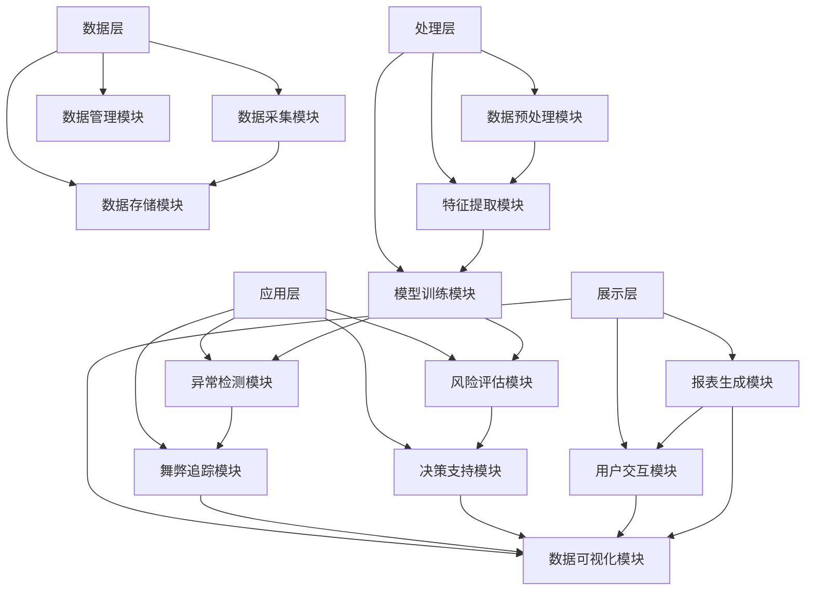

                 

### 第1章：问题背景与现状

#### 1.1 问题背景

财务报表是企业重要的信息披露工具，用于向外部利益相关者展示企业的财务状况和经营成果。这些报表不仅关系到企业的信誉，还直接影响投资者的决策和市场信心。然而，近年来，财务报表舞弊事件频发，给企业、投资者和市场带来了严重的负面影响。财务报表舞弊通常指的是企业通过虚构交易、篡改财务数据等手段，故意误导投资者和监管机构的财务行为。

随着企业规模的扩大和市场竞争的加剧，财务报表舞弊的风险不断增加。一方面，一些企业为了达到短期利益目标，不惜牺牲长期发展，通过虚增收入、虚构资产等手段夸大财务状况；另一方面，复杂的企业结构和多样的财务手段使得财务报表舞弊手段更加隐蔽，增加了舞弊检测的难度。

#### 1.2 财务报表舞弊概述

财务报表舞弊的形式多种多样，常见的舞弊手段包括：

1. **虚构交易**：企业通过虚构业务交易，制造虚假收入和利润，从而误导投资者和市场。
2. **资产评估操纵**：企业通过夸大资产价值或低估负债，提高财务报表的资产回报率。
3. **费用操控**：企业通过延迟费用确认或提前费用支出，影响当期的利润水平。
4. **关联方交易**：企业通过关联方之间的交易，转移利益，规避监管。
5. **财务报表错误**：企业通过故意错误记录交易，误导财务报表的编制。

这些舞弊手段不仅损害了投资者的利益，还可能导致市场信心的崩溃，对企业的长期发展产生负面影响。因此，有效检测和防范财务报表舞弊对于保护投资者利益、维护市场稳定具有重要意义。

#### 1.3 舞弊检测的重要性

财务报表舞弊的检测对于企业、投资者和市场监管者来说至关重要。首先，对于企业而言，通过舞弊检测可以及时发现并纠正内部管理中的问题，防止因舞弊行为带来的经济损失和声誉损害。其次，对于投资者而言，准确的财务信息是做出投资决策的重要依据，有效的舞弊检测可以降低投资风险，提高投资回报。最后，对于市场监管者而言，有效的舞弊检测可以维护市场的公平性和透明度，促进市场的健康发展。

然而，传统的财务报表舞弊检测方法往往依赖于人工审核和经验判断，存在以下不足：

1. **效率低**：人工审核速度较慢，无法应对大量财务数据的快速处理需求。
2. **准确性差**：人工审核容易受到主观判断的影响，导致误判和漏判。
3. **成本高**：长期依赖人工审核会增加企业的成本负担。

#### 1.4 当前舞弊检测面临的挑战

随着技术的不断进步，人工智能（AI）开始应用于财务报表舞弊检测，为解决传统方法面临的挑战提供了新的可能性。然而，AI驱动的财务报表舞弊检测仍面临以下挑战：

1. **数据质量**：高质量的训练数据是AI算法有效性的基础。然而，财务报表数据往往存在噪声和缺失值，数据清洗和预处理是关键步骤。
2. **算法选择**：针对不同的舞弊手段和特征，需要选择合适的算法和模型，实现精准检测。
3. **模型解释性**：AI模型的“黑箱”特性使得其决策过程难以解释，这对于需要透明决策过程的财务报表舞弊检测来说是一个重大挑战。
4. **安全性与隐私**：财务数据涉及企业隐私，如何保障数据的安全性和用户隐私是AI驱动的财务报表舞弊检测需要解决的问题。

面对这些挑战，AI驱动的财务报表舞弊检测系统需要不断创新和完善，以提升检测的准确性和效率，为财务报表舞弊的防范提供有力支持。接下来的章节将详细介绍AI驱动的财务报表舞弊检测系统的核心概念、技术原理、系统架构和实现方法，帮助读者深入理解这一领域的最新进展和应用。

### 2.1 AI与财务报表舞弊检测

人工智能（AI）技术的快速发展为财务报表舞弊检测提供了新的思路和工具。AI通过模拟人类智能，在数据处理、模式识别、预测分析等方面展现出强大的能力，这些特性使其在财务报表舞弊检测中具有显著优势。

首先，AI能够处理大量复杂的财务数据。财务报表通常包含大量复杂的交易和财务指标，传统的分析方法往往难以处理如此庞大的数据量。而AI技术，尤其是机器学习和深度学习算法，可以高效地处理这些数据，从中提取出有价值的特征和模式。

其次，AI具有强大的模式识别能力。财务报表舞弊往往隐藏在复杂的财务数据中，且形式多样。AI可以通过学习大量的历史数据，识别出常见的舞弊模式和手段，从而提高检测的准确性和效率。

此外，AI能够进行实时分析和预测。传统的舞弊检测方法通常需要定期进行数据分析，而AI技术可以实现实时监测和预测，及时发现潜在的舞弊行为，为企业提供及时的风险预警。

在应用场景方面，AI在财务报表舞弊检测中具有广泛的应用。首先，AI可以用于异常检测，通过分析财务数据中的异常值和异常模式，识别可能的舞弊行为。其次，AI可以用于风险评估，通过建立风险评估模型，预测企业可能面临的风险，并提供相应的应对策略。此外，AI还可以用于舞弊追踪，通过分析财务数据的历史趋势和变化，追踪可能的舞弊行为，提供证据支持。

#### 2.2 关键概念解释

为了更好地理解AI在财务报表舞弊检测中的应用，我们需要了解一些关键概念。

1. **机器学习**：机器学习是AI的核心技术之一，它通过从数据中学习规律和模式，实现自动预测和决策。在财务报表舞弊检测中，机器学习算法可以帮助我们识别异常交易和可疑行为。

2. **深度学习**：深度学习是机器学习的一个分支，它通过多层神经网络模型，对大量数据进行训练，从而实现复杂的模式识别和特征提取。在财务报表舞弊检测中，深度学习算法可以用于处理复杂的财务数据，提取出隐含的特征，提高检测的准确性。

3. **数据挖掘**：数据挖掘是从大量数据中提取有价值信息的过程，包括关联规则挖掘、聚类分析和分类分析等。在财务报表舞弊检测中，数据挖掘技术可以帮助我们发现数据中的潜在关系和规律，提高舞弊检测的效率。

4. **特征工程**：特征工程是数据挖掘和机器学习中的一个关键步骤，它涉及从原始数据中提取和构造特征，以便更好地进行数据分析和模型训练。在财务报表舞弊检测中，特征工程可以帮助我们识别和提取与舞弊行为相关的关键特征。

5. **异常检测**：异常检测是一种用于识别数据中异常值和异常模式的技术，它可以帮助我们发现潜在的舞弊行为。在财务报表舞弊检测中，异常检测技术可以用于实时监测财务数据，及时发现异常交易。

6. **风险评估**：风险评估是一种用于评估潜在风险的方法，它可以帮助我们预测企业可能面临的风险，并提供相应的应对策略。在财务报表舞弊检测中，风险评估技术可以用于预测企业可能存在的财务风险，提高舞弊检测的准确性。

#### 2.3 AI技术与应用场景

AI技术在财务报表舞弊检测中的应用主要体现在以下几个方面：

1. **财务数据预处理**：财务报表数据通常包含噪声和缺失值，AI技术可以帮助我们进行数据清洗和预处理，提高数据质量。例如，可以使用机器学习算法进行数据去噪和缺失值填补，从而提高后续数据分析的准确性。

2. **特征提取和选择**：AI技术可以帮助我们从财务数据中提取和选择关键特征，以便更好地进行数据分析和模型训练。例如，可以使用深度学习算法提取复杂的数据特征，提高特征提取的准确性和效率。

3. **异常检测和风险评估**：AI技术可以帮助我们进行实时异常检测和风险评估，及时发现潜在的舞弊行为。例如，可以使用机器学习算法建立异常检测模型，实时监测财务数据中的异常交易；同时，可以使用风险评估模型预测企业可能存在的财务风险。

4. **舞弊追踪和证据收集**：AI技术可以帮助我们追踪舞弊行为，并提供证据支持。例如，可以使用深度学习算法分析财务数据的历史趋势和变化，追踪可能的舞弊行为；同时，可以使用数据挖掘技术收集和分析相关的财务证据，支持舞弊调查。

5. **数据可视化和决策支持**：AI技术可以帮助我们将复杂的数据分析和模型结果进行可视化展示，为企业提供决策支持。例如，可以使用数据可视化工具将财务数据分析和模型结果进行图形化展示，帮助企业管理者更直观地理解财务状况和潜在风险。

#### 2.4 财务报表舞弊检测的ER图架构

为了更好地理解和设计AI驱动的财务报表舞弊检测系统，我们需要构建一个详细的实体关系图（ER图）。ER图可以清晰地展示系统中的各个实体及其相互关系，为系统设计提供参考。

以下是一个简化的财务报表舞弊检测系统的ER图：

```
实体：财务报表
属性：报表编号、报表日期、报表类型、报表金额

实体：财务交易
属性：交易编号、交易日期、交易类型、交易金额、交易对手

实体：舞弊行为
属性：舞弊行为编号、舞弊行为类型、舞弊行为日期、涉及金额、舞弊手段

实体：审计日志
属性：日志编号、日志日期、日志内容、日志级别

关系：
1. 财务报表包含多个财务交易
   - 财务报表（1）--（多）财务交易
2. 舞弊行为与财务交易相关联
   - 舞弊行为（1）--（1）财务交易
3. 审计日志记录财务报表和舞弊行为的分析结果
   - 审计日志（多）--（1）财务报表
   - 审计日志（多）--（1）舞弊行为
```

这个ER图展示了财务报表、财务交易、舞弊行为和审计日志四个主要实体及其相互关系。财务报表包含多个财务交易，每个财务交易可以与一个舞弊行为相关联。审计日志记录对财务报表和舞弊行为的分析结果，为后续的舞弊检测提供数据支持。

通过ER图，我们可以更好地理解财务报表舞弊检测系统的数据结构和关系，为系统的设计和实现提供指导。

### 3.1 系统架构设计

构建一个高效、稳定的AI驱动的企业财务报表舞弊检测系统，需要一个全面的系统架构设计。系统架构设计不仅要考虑系统的功能模块，还要确保系统的可扩展性、可维护性和可靠性。

#### 系统架构总体设计

系统架构可以划分为以下几层：

1. **数据层**：包括数据采集、存储和管理模块，负责收集和处理原始财务报表数据，并提供数据接口供上层模块使用。
2. **处理层**：包括数据预处理、特征提取、模型训练和模型评估模块，负责对原始数据进行清洗、特征提取和模型训练，以及评估模型的性能。
3. **应用层**：包括异常检测、风险评估、舞弊追踪和决策支持模块，负责使用训练好的模型对财务数据进行实时分析，提供风险预警和决策支持。
4. **展示层**：包括数据可视化、用户交互和报表生成模块，负责将分析结果以图表、报表等形式展示给用户。

#### 各层模块的功能

1. **数据层模块**：
   - **数据采集**：从各种数据源（如ERP系统、财务软件等）采集财务报表数据。
   - **数据存储**：将采集到的数据存储在关系型数据库或分布式存储系统中，如MySQL、Hadoop HDFS等。
   - **数据管理**：提供数据查询、数据备份和数据恢复功能，确保数据的安全性和一致性。

2. **处理层模块**：
   - **数据预处理**：对原始财务报表数据去噪、缺失值填补、数据规范化等处理，提高数据质量。
   - **特征提取**：从财务数据中提取与舞弊行为相关的特征，如交易金额的分布、交易频率、交易对手的信用评级等。
   - **模型训练**：使用机器学习算法（如决策树、支持向量机、神经网络等）训练舞弊检测模型，根据训练数据优化模型参数。
   - **模型评估**：使用交叉验证、A/B测试等方法评估模型的性能，选择最佳模型用于实际应用。

3. **应用层模块**：
   - **异常检测**：使用训练好的模型对财务数据进行分析，识别异常交易和可疑行为。
   - **风险评估**：根据检测结果和业务规则，评估企业可能面临的财务风险，提供风险预警和应对策略。
   - **舞弊追踪**：追踪已识别的舞弊行为，收集相关证据，为舞弊调查提供支持。
   - **决策支持**：根据分析结果和风险预测，为企业提供决策支持，优化财务管理和运营策略。

4. **展示层模块**：
   - **数据可视化**：使用数据可视化工具（如Tableau、D3.js等）将分析结果以图表、报表等形式展示给用户，帮助用户直观地理解数据。
   - **用户交互**：提供用户友好的交互界面，支持用户配置系统参数、查看分析结果和进行决策。
   - **报表生成**：根据分析结果和用户需求，生成定制化的报表，供管理层参考。

#### 系统架构的交互流程

系统架构中的各层模块通过统一的接口进行数据交互，确保系统的整体性和协调性。以下是系统架构的交互流程：

1. **数据采集**：系统从ERP系统、财务软件等数据源采集原始财务报表数据。
2. **数据预处理**：将采集到的原始数据传递给数据预处理模块，进行去噪、缺失值填补等处理。
3. **特征提取**：对预处理后的数据提取关键特征，为模型训练提供输入。
4. **模型训练**：将提取的特征数据用于训练舞弊检测模型，优化模型参数。
5. **模型评估**：评估训练好的模型的性能，选择最佳模型用于实际应用。
6. **实时分析**：使用训练好的模型对实时采集的财务数据进行分析，识别异常交易和可疑行为。
7. **风险预警**：根据分析结果和业务规则，评估企业可能面临的财务风险，生成风险预警报告。
8. **证据收集**：追踪已识别的舞弊行为，收集相关证据，为舞弊调查提供支持。
9. **数据可视化**：将分析结果和风险预警以图表、报表等形式展示给用户。
10. **用户交互**：用户通过交互界面查看分析结果和风险预警，进行决策和配置。

通过以上架构设计，AI驱动的企业财务报表舞弊检测系统能够实现高效、准确、实时的财务报表舞弊检测，为企业提供全面的舞弊防范和支持。

#### 3.2 数据处理模块

数据处理模块是AI驱动的企业财务报表舞弊检测系统的核心组成部分，其主要功能是对原始财务数据进行清洗、预处理和特征提取，为后续的模型训练和检测提供高质量的数据输入。以下是数据处理模块的详细功能描述：

##### 1. 数据采集

数据采集是数据处理模块的第一步，其主要任务是获取企业各种财务数据源的信息。这些数据源可能包括ERP系统、财务报表、外部数据库、互联网数据等。具体流程如下：

- **数据连接**：系统需要通过适当的接口（如API、数据库连接等）与各个数据源建立连接。
- **数据提取**：从各个数据源中提取财务数据，包括财务报表、交易记录、账户信息、审计日志等。
- **数据存储**：将提取到的数据进行初步存储，通常采用关系型数据库（如MySQL）或分布式存储系统（如Hadoop HDFS）。

##### 2. 数据清洗

数据清洗是数据处理过程中至关重要的一环，其主要目标是去除数据中的噪声、缺失值和重复记录，确保数据质量。具体操作如下：

- **去噪**：去除数据中的非数值字符、特殊符号等噪声，确保数据的准确性。
- **缺失值填补**：对于缺失的数据，可以使用统计方法（如平均值、中位数）或机器学习方法（如KNN、回归分析）进行填补。
- **重复记录检测**：检测并去除重复的数据记录，避免对后续分析造成干扰。
- **数据标准化**：将不同数据源的数据进行标准化处理，确保数据的一致性和可比性。

##### 3. 数据预处理

数据预处理是确保数据适用于机器学习和深度学习模型训练的重要步骤，其主要任务包括数据规范化、特征提取和异常值处理。具体操作如下：

- **数据规范化**：将数据转换为统一的格式，如将日期格式转换为YYYY-MM-DD，将金额格式转换为小数形式。
- **特征提取**：从财务数据中提取与舞弊行为相关的特征，如交易金额、交易频率、交易对手关系等。可以使用统计方法（如平均值、标准差）和机器学习方法（如特征选择算法）进行特征提取。
- **异常值处理**：检测并处理数据中的异常值，如异常的交易金额、异常的交易频率等。可以使用统计方法（如Z-Score、IQR）和机器学习方法（如孤立森林）进行异常值检测和处理。

##### 4. 数据存储

数据清洗和预处理后的数据需要存储在数据库或数据仓库中，以便后续的模型训练和分析使用。具体操作如下：

- **数据仓库建设**：构建一个高效、可靠的数据仓库，存储清洗和预处理后的数据。
- **数据索引**：为数据仓库中的数据建立索引，提高数据查询的效率。
- **数据备份**：定期对数据仓库进行备份，确保数据的安全性和一致性。

##### 5. 数据质量管理

数据质量管理是确保数据质量持续符合要求的重要环节，主要包括数据质量监控、数据质量评估和数据质量改进。具体操作如下：

- **数据质量监控**：通过实时监控系统数据质量，及时发现和处理数据质量问题。
- **数据质量评估**：定期对数据仓库中的数据进行质量评估，包括完整性、准确性、一致性等方面。
- **数据质量改进**：根据数据质量评估结果，制定和实施改进措施，持续提升数据质量。

##### 6. 数据共享与接口

数据处理模块还需要提供数据共享与接口功能，使得其他模块能够方便地访问和使用数据。具体操作如下：

- **数据接口**：提供API接口，使得其他模块可以方便地查询和获取数据。
- **数据共享**：建立数据共享平台，实现数据的多层次、多维度共享，促进数据的高效利用。

通过以上功能描述，数据处理模块能够有效地确保财务报表数据的准确性、完整性和一致性，为AI驱动的企业财务报表舞弊检测系统提供坚实的数据基础。

### 3.3 检测算法模块

检测算法模块是AI驱动的企业财务报表舞弊检测系统的核心组件，其任务是根据处理后的财务数据，使用机器学习算法识别潜在的舞弊行为。以下是检测算法模块的详细功能描述：

#### 1. 算法选择

算法选择是检测模块的重要步骤，不同类型的舞弊行为可能需要不同的算法进行识别。以下是几种常用的算法：

- **监督学习算法**：如逻辑回归、支持向量机（SVM）、随机森林等，适用于已有标注数据的场景。
- **无监督学习算法**：如聚类分析、异常检测算法（如孤立森林、DBSCAN等），适用于没有标注数据的场景。
- **半监督学习算法**：如图嵌入、标签传播等，结合标注数据和未标注数据，提高检测性能。
- **深度学习算法**：如卷积神经网络（CNN）、循环神经网络（RNN）、长短时记忆网络（LSTM）等，适用于处理复杂特征和大规模数据。

#### 2. 特征提取

特征提取是算法训练和检测的关键步骤，特征的质量直接影响检测效果。以下是几种常见的特征提取方法：

- **统计特征**：如均值、标准差、中位数、偏度、峰度等，用于描述数据的基本统计属性。
- **文本特征**：如词频、词袋模型、TF-IDF等，用于文本数据的特征提取。
- **图像特征**：如颜色直方图、纹理特征、边缘检测等，用于图像数据的特征提取。
- **深度特征**：如卷积神经网络提取的卷积特征、循环神经网络提取的序列特征等，用于处理复杂的数据结构。

#### 3. 模型训练

模型训练是检测算法模块的核心任务，通过训练数据集优化模型参数，以提高检测准确性。以下是模型训练的详细过程：

- **数据集划分**：将数据集划分为训练集、验证集和测试集，用于模型的训练、验证和测试。
- **模型初始化**：初始化模型参数，可以选择随机初始化或预训练初始化。
- **模型训练**：使用训练集数据训练模型，调整模型参数以优化模型性能。常见的训练方法包括梯度下降、随机梯度下降、Adam优化器等。
- **模型验证**：使用验证集数据评估模型性能，调整模型参数，防止过拟合。

#### 4. 模型评估

模型评估是确保检测算法有效性的重要环节，以下是几种常见的评估指标：

- **准确率（Accuracy）**：预测为舞弊行为且实际为舞弊行为的比例。
- **召回率（Recall）**：实际为舞弊行为被正确预测的比例。
- **精确率（Precision）**：预测为舞弊行为且实际为舞弊行为的比例。
- **F1分数（F1 Score）**：精确率和召回率的调和平均数。
- **ROC曲线和AUC值**：通过ROC曲线和AUC值评估模型的分类能力。

#### 5. 异常检测与风险评估

检测算法模块的核心任务是识别潜在的舞弊行为和评估风险。以下是具体实现方法：

- **异常检测**：使用无监督学习算法（如孤立森林、DBSCAN）对财务数据进行分析，识别异常交易和可疑行为。
- **风险评估**：使用监督学习算法（如逻辑回归、支持向量机）对财务数据进行分析，评估企业的财务风险，提供风险预警。
- **模型融合**：结合多种算法和模型的结果，提高检测和风险评估的准确性。

通过以上功能描述，检测算法模块能够有效地识别和评估潜在的财务报表舞弊行为，为AI驱动的企业财务报表舞弊检测系统提供强有力的支持。

### 3.4 报警与反馈模块

报警与反馈模块是AI驱动的企业财务报表舞弊检测系统的重要组成部分，其主要任务是实时监测财务数据，识别潜在的舞弊行为，并触发相应的报警机制，同时收集用户反馈以不断优化系统。

#### 1. 报警机制

报警机制的设计至关重要，它能够确保系统在检测到异常行为时能够及时发出警报，通知相关人员进行干预。以下是报警机制的详细实现：

- **阈值设置**：根据业务需求和历史数据，设定合理的报警阈值，如交易金额超出一定范围、交易频率异常增加等。
- **实时监控**：系统需要实时监控财务数据，对交易行为进行持续监控，一旦发现异常，立即触发报警。
- **报警类型**：根据异常行为的严重程度，设置不同类型的报警，如一般警告、严重警告、紧急报警等。
- **报警发送**：通过邮件、短信、推送通知等方式，将报警信息发送给相关人员和负责部门。

#### 2. 反馈机制

反馈机制的设计能够帮助系统不断优化和改进，提高检测的准确性和效率。以下是反馈机制的详细实现：

- **用户反馈**：在报警信息中嵌入反馈按钮，允许用户对检测结果进行评价，如“确认舞弊”、“误报”、“漏报”等。
- **数据记录**：系统需要记录用户的反馈数据，包括反馈类型、反馈时间和用户身份等，用于后续分析。
- **模型调整**：根据用户的反馈数据，对检测模型进行实时调整，优化模型的参数和算法，提高检测的准确性。
- **反馈报告**：定期生成反馈报告，向管理层提供用户反馈的汇总和分析，帮助管理层了解系统性能和用户满意度。

#### 3. 系统集成

报警与反馈模块需要与企业现有的信息系统进行集成，确保数据的一致性和系统的协调性。以下是系统集成的详细实现：

- **接口设计**：设计统一的接口，确保报警与反馈模块能够与其他系统（如ERP系统、财务管理系统等）进行数据交换。
- **数据同步**：实现数据的实时同步，确保报警与反馈模块能够获取最新的财务数据。
- **权限管理**：根据企业权限管理策略，设置合适的权限，确保敏感数据的访问安全。

#### 4. 系统监控

系统监控是确保报警与反馈模块正常运行的重要环节，以下是系统监控的详细实现：

- **日志记录**：记录系统的运行日志，包括报警事件、用户反馈、系统错误等信息，便于问题追踪和故障排除。
- **异常检测**：监控系统自身的异常行为，如服务器故障、网络中断等，确保系统的高可用性。
- **自动恢复**：在检测到系统异常时，自动进行系统恢复和重启，确保系统正常运行。

通过以上设计，报警与反馈模块能够有效地监控财务报表数据，及时识别和报告潜在的舞弊行为，并收集用户反馈以不断优化系统，为企业提供全面的舞弊防范和支持。

### 4.1 常见算法概述

在AI驱动的企业财务报表舞弊检测系统中，选择合适的算法是实现高效、准确检测的关键。以下将概述几种常见的算法，包括其原理、优缺点以及应用场景。

#### 1. 逻辑回归

逻辑回归是一种广义线性模型，主要用于二分类问题。其基本原理是通过线性模型对输入特征进行加权求和，然后通过逻辑函数（如Sigmoid函数）将结果映射到概率空间。

- **原理**：逻辑回归模型可以表示为：
  $$\hat{y} = \frac{1}{1 + e^{-\beta_0 + \beta_1x_1 + \beta_2x_2 + ... + \beta_nx_n}}$$
  其中，$y$ 是预测的概率，$x_1, x_2, ..., x_n$ 是输入特征，$\beta_0, \beta_1, \beta_2, ..., \beta_n$ 是模型参数。

- **优缺点**：
  - **优点**：逻辑回归算法简单，易于理解和实现，计算效率高，适合处理中小规模的数据集。
  - **缺点**：逻辑回归对异常值和噪声敏感，模型解释性较差，且容易出现过拟合。

- **应用场景**：逻辑回归常用于财务报表中的异常交易检测，如识别潜在的虚增收入、虚构资产等行为。

#### 2. 支持向量机（SVM）

支持向量机是一种基于间隔最大化原理的分类算法，通过找到最佳的超平面，将不同类别的数据点分开。

- **原理**：SVM的决策边界可以表示为：
  $$w \cdot x + b = 0$$
  其中，$w$ 是超平面的法向量，$x$ 是数据点，$b$ 是偏置项。

- **优缺点**：
  - **优点**：SVM具有很好的分类效果，适用于处理高维数据，模型解释性较好。
  - **缺点**：SVM对参数选择敏感，计算复杂度高，且训练时间较长。

- **应用场景**：SVM常用于财务报表中的分类任务，如分类交易类型、识别关联方交易等。

#### 3. 随机森林

随机森林是一种基于决策树构建的集成学习方法，通过组合多个决策树，提高模型的分类和回归性能。

- **原理**：随机森林生成多个决策树，每个决策树对样本进行分类或回归，最终通过投票或求平均得到最终预测结果。

- **优缺点**：
  - **优点**：随机森林具有很好的分类和回归性能，对异常值和噪声不敏感，模型解释性较好。
  - **缺点**：随机森林的计算复杂度较高，对于大规模数据集可能需要较长的训练时间。

- **应用场景**：随机森林常用于财务报表中的分类和回归任务，如交易风险分类、财务预测等。

#### 4. 卷积神经网络（CNN）

卷积神经网络是一种深度学习模型，主要用于处理图像数据，但其原理也可以应用于其他类型的数据处理任务。

- **原理**：CNN通过卷积操作和池化操作，提取图像中的局部特征，然后通过全连接层进行分类或回归。

- **优缺点**：
  - **优点**：CNN具有强大的特征提取和模式识别能力，适用于处理高维数据和复杂的特征。
  - **缺点**：CNN的训练过程需要大量数据和计算资源，模型解释性较差。

- **应用场景**：CNN可以用于财务报表中的图像分析，如自动识别财务报表中的关键信息、处理图像数据等。

通过以上对常见算法的概述，可以更好地理解各种算法的原理和应用场景，为AI驱动的企业财务报表舞弊检测系统选择合适的算法提供参考。

#### 4.2 特征提取算法

特征提取是AI驱动的企业财务报表舞弊检测系统中至关重要的一步，其目的是从原始数据中提取出对舞弊行为有代表性的特征，以提高模型训练和检测的准确性。以下将介绍几种常用的特征提取算法，包括其原理、步骤和应用场景。

##### 1. 统计特征

统计特征是一种基于原始数据的统计属性提取特征的方法，主要包括均值、标准差、偏度、峰度等。

- **原理**：统计特征通过计算数据的统计属性，如数据的中心趋势、离散程度、分布形状等，来反映数据的特性。
- **步骤**：
  - 计算数据的均值、标准差、偏度、峰度等统计量。
  - 根据统计量的大小和分布，选择对舞弊行为有代表性的特征。
- **应用场景**：统计特征适用于描述单一变量的特性，如交易金额的分布、交易频率的离散程度等。

##### 2. 文本特征

文本特征是一种基于文本数据的特征提取方法，主要应用于文本分类、主题模型等领域。

- **原理**：文本特征通过将文本转换为向量表示，提取词频、词袋模型、TF-IDF等特征。
- **步骤**：
  - 对文本数据分词，提取关键词。
  - 计算关键词的词频或TF-IDF值。
  - 构建词向量或词袋模型，提取文本特征。
- **应用场景**：文本特征适用于处理财务报表中的注释、摘要等文本数据，用于文本分类和主题建模。

##### 3. 图像特征

图像特征是一种基于图像数据的特征提取方法，主要用于图像识别和分类。

- **原理**：图像特征通过卷积操作和池化操作，提取图像中的局部特征和全局特征。
- **步骤**：
  - 对图像进行预处理，如灰度化、缩放、裁剪等。
  - 使用卷积神经网络提取图像特征，如边缘、纹理、形状等。
  - 通过池化操作降低特征维度，提取全局特征。
- **应用场景**：图像特征适用于处理财务报表中的图像数据，如发票、收据、财务报表图像等。

##### 4. 深度特征

深度特征是一种基于深度学习模型的特征提取方法，通过多层神经网络提取数据中的高阶特征。

- **原理**：深度特征通过训练多层神经网络，自动学习数据中的复杂特征和模式。
- **步骤**：
  - 设计并训练深度神经网络，如卷积神经网络（CNN）、循环神经网络（RNN）等。
  - 使用训练好的神经网络提取数据特征。
- **应用场景**：深度特征适用于处理复杂数据，如高维财务数据、多媒体数据等。

##### 5. 主成分分析（PCA）

主成分分析是一种降维技术，通过将原始数据投影到新的正交坐标系中，提取主要成分，降低数据维度。

- **原理**：PCA通过计算数据协方差矩阵的特征值和特征向量，提取主要成分。
- **步骤**：
  - 计算数据的协方差矩阵。
  - 提取协方差矩阵的特征值和特征向量。
  - 根据特征值的大小选择主要成分。
- **应用场景**：PCA适用于处理高维财务数据，降低数据维度，提高模型训练和检测效率。

通过以上对特征提取算法的介绍，可以更好地理解各种特征提取方法的工作原理和应用场景，为AI驱动的企业财务报表舞弊检测系统提供有效的特征提取手段。

#### 4.3 分类算法

分类算法是AI驱动的企业财务报表舞弊检测系统的核心组成部分，其主要任务是根据提取的特征对财务报表中的交易行为进行分类，识别潜在的舞弊行为。以下将介绍几种常见的分类算法，包括其原理、实现步骤和应用场景。

##### 1. 逻辑回归（Logistic Regression）

逻辑回归是一种广义线性模型，主要用于二分类问题。其基本原理是通过线性模型对输入特征进行加权求和，然后通过逻辑函数将结果映射到概率空间。

- **原理**：
  $$\hat{y} = \frac{1}{1 + e^{-\beta_0 + \beta_1x_1 + \beta_2x_2 + ... + \beta_nx_n}}$$
  其中，$\hat{y}$ 是预测的概率，$x_1, x_2, ..., x_n$ 是输入特征，$\beta_0, \beta_1, \beta_2, ..., \beta_n$ 是模型参数。

- **实现步骤**：
  - 数据预处理：对数据进行标准化处理，确保特征值的范围一致。
  - 模型训练：使用训练数据集训练逻辑回归模型，通过最小化损失函数（如交叉熵损失函数）调整模型参数。
  - 模型评估：使用验证集评估模型性能，选择最优参数。

- **应用场景**：逻辑回归适用于处理中小规模的数据集，如识别交易类型、分类关联方交易等。

##### 2. 决策树（Decision Tree）

决策树是一种基于树形结构进行分类的算法，通过多层次的决策规则将数据集划分为不同的子集，最终得到分类结果。

- **原理**：
  - 每个节点代表一个特征；
  - 每个分支代表该特征的一个取值；
  - 叶节点代表分类结果。

- **实现步骤**：
  - 数据预处理：对数据进行标准化处理，确保特征值的范围一致。
  - 特征选择：选择最优特征进行分裂，通常使用信息增益、基尼系数等指标。
  - 决策树构建：递归地构建决策树，直到满足停止条件（如最大深度、最小叶子节点样本数等）。

- **应用场景**：决策树适用于处理高维数据，具有较强的可解释性，如分类交易行为、识别异常交易等。

##### 3. 支持向量机（SVM）

支持向量机是一种基于间隔最大化原理的分类算法，通过找到最佳的超平面，将不同类别的数据点分开。

- **原理**：
  $$w \cdot x + b = 0$$
  其中，$w$ 是超平面的法向量，$x$ 是数据点，$b$ 是偏置项。

- **实现步骤**：
  - 数据预处理：对数据进行标准化处理，确保特征值的范围一致。
  - 模型训练：使用训练数据集训练SVM模型，通过最小化间隔最大化目标函数调整模型参数。
  - 模型评估：使用验证集评估模型性能，选择最优参数。

- **应用场景**：SVM适用于处理高维数据，具有很好的分类效果，如分类交易类型、识别关联方交易等。

##### 4. 随机森林（Random Forest）

随机森林是一种基于决策树的集成学习方法，通过组合多个决策树，提高模型的分类和回归性能。

- **原理**：
  - 生成多个决策树，每个决策树对样本进行分类或回归；
  - 最终通过投票或求平均得到最终预测结果。

- **实现步骤**：
  - 数据预处理：对数据进行标准化处理，确保特征值的范围一致。
  - 模型训练：使用训练数据集训练随机森林模型，调整决策树数量和特征选择策略。
  - 模型评估：使用验证集评估模型性能，选择最优参数。

- **应用场景**：随机森林适用于处理大规模数据集，具有很好的分类和回归性能，如交易风险分类、财务预测等。

##### 5. 聚类算法

聚类算法是一种无监督学习方法，用于将数据集划分为不同的簇，以便发现数据中的潜在模式和结构。

- **原理**：
  - 初始化簇心点；
  - 计算每个数据点到簇心点的距离；
  - 根据距离将数据点分配到最近的簇；
  - 重新计算簇心点；
  - 重复上述步骤，直到满足停止条件（如簇心点变化很小）。

- **实现步骤**：
  - 数据预处理：对数据进行标准化处理，确保特征值的范围一致。
  - 簇心点初始化：随机选择或基于距离选择初始簇心点。
  - 聚类过程：根据距离计算和数据点分配，迭代更新簇心点和数据点分配。
  - 模型评估：通过内部评估指标（如轮廓系数、簇内距离等）评估聚类效果。

- **应用场景**：聚类算法适用于发现数据中的潜在模式，如交易行为聚类、风险群体划分等。

通过以上对分类算法的介绍，可以更好地理解各种算法的原理和应用场景，为AI驱动的企业财务报表舞弊检测系统选择合适的分类算法提供参考。

### 4.4 评估与优化

在AI驱动的企业财务报表舞弊检测系统中，评估与优化是确保模型性能和检测效果的重要环节。以下将介绍几种常见的评估指标和优化方法，包括它们的计算方法、选择依据以及具体应用场景。

#### 1. 评估指标

评估指标是衡量模型性能的重要工具，以下是一些常用的评估指标：

- **准确率（Accuracy）**：准确率是预测正确的样本数占总样本数的比例。其计算方法为：
  $$Accuracy = \frac{TP + TN}{TP + TN + FP + FN}$$
  其中，$TP$ 表示真实为正类且预测为正类的样本数，$TN$ 表示真实为负类且预测为负类的样本数，$FP$ 表示真实为负类但预测为正类的样本数，$FN$ 表示真实为正类但预测为负类的样本数。

- **召回率（Recall）**：召回率是真实为正类且预测为正类的样本数占总真实正类样本数的比例。其计算方法为：
  $$Recall = \frac{TP}{TP + FN}$$

- **精确率（Precision）**：精确率是预测为正类且真实为正类的样本数占总预测正类样本数的比例。其计算方法为：
  $$Precision = \frac{TP}{TP + FP}$$

- **F1分数（F1 Score）**：F1分数是精确率和召回率的调和平均数，其计算方法为：
  $$F1 Score = 2 \times \frac{Precision \times Recall}{Precision + Recall}$$

- **ROC曲线和AUC值**：ROC曲线是受试者操作特征曲线的简称，通过绘制真阳性率（True Positive Rate, TPR）与假阳性率（False Positive Rate, FPR）的关系曲线，评估模型的分类性能。AUC值（Area Under Curve）是ROC曲线下方的面积，用于衡量模型的分类能力。

#### 2. 选择依据

选择评估指标时，需要考虑以下因素：

- **数据分布**：如果数据分布不均衡，某些评估指标（如准确率）可能无法准确反映模型性能。在这种情况下，可以优先考虑召回率、精确率和F1分数等指标。
- **业务需求**：根据业务需求选择合适的评估指标。例如，如果业务更关注发现所有潜在的舞弊行为，可以优先考虑召回率；如果业务更关注减少误报，可以优先考虑精确率。
- **计算复杂性**：一些评估指标（如ROC曲线和AUC值）需要计算大量的统计数据，可能增加计算复杂度。在资源有限的情况下，可以选择计算复杂度较低的评估指标。

#### 3. 优化方法

以下是一些常见的优化方法，用于提高模型性能和检测效果：

- **交叉验证（Cross-Validation）**：交叉验证是一种评估模型性能的方法，通过将数据集划分为多个子集，每次使用其中一个子集作为验证集，其余子集作为训练集，进行多次训练和验证，以获得更稳定的评估结果。

- **超参数调优（Hyperparameter Tuning）**：超参数是模型性能的重要影响因素，如决策树中的最大深度、随机森林中的决策树数量等。通过使用网格搜索、随机搜索等方法，可以找到最优的超参数组合，提高模型性能。

- **集成学习（Ensemble Learning）**：集成学习通过组合多个模型，提高模型的预测性能。常用的集成学习方法包括随机森林、梯度提升树（GBDT）等。

- **特征工程（Feature Engineering）**：通过构建和选择对舞弊行为有代表性的特征，可以提高模型性能。特征工程包括特征提取、特征选择和特征变换等步骤。

- **数据增强（Data Augmentation）**：数据增强是通过生成或修改数据，增加训练样本的多样性，提高模型对异常数据的鲁棒性。

- **模型集成与融合（Model Ensembling and Fusion）**：模型集成与融合是将多个模型的预测结果进行综合，提高整体预测性能。常用的方法包括投票法、加权平均法等。

通过以上评估与优化方法，可以确保AI驱动的企业财务报表舞弊检测系统具有高准确性和高鲁棒性，为企业提供有效的舞弊检测和防范支持。

### 5.1 数学公式基础

在构建AI驱动的企业财务报表舞弊检测系统中，数学模型和数学公式是理解算法原理和优化模型性能的基础。以下将介绍一些基础的数学公式，包括线性代数、概率论和统计学等方面，为后续章节中的具体算法讲解奠定基础。

#### 1. 线性代数基础

线性代数是机器学习和其他AI算法的核心组成部分，以下是一些基本的数学公式：

- **矩阵乘法**：对于两个矩阵$A$（$m \times n$）和$B$（$n \times p$），它们的乘积$C$（$m \times p$）可以通过以下公式计算：
  $$C = A \cdot B = \begin{bmatrix} \sum_{j=1}^{n} a_{ij}b_{ij} \end{bmatrix}_{m \times p}$$

- **向量的内积（点积）**：两个向量$\mathbf{a}$和$\mathbf{b}$的内积可以通过以下公式计算：
  $$\mathbf{a} \cdot \mathbf{b} = \sum_{i=1}^{n} a_i b_i$$

- **向量的范数**：向量的范数表示向量的长度，常见的范数包括欧几里得范数（$L_2$范数）和曼哈顿范数（$L_1$范数）：
  $$\|\mathbf{a}\|_2 = \sqrt{\sum_{i=1}^{n} a_i^2}$$
  $$\|\mathbf{a}\|_1 = \sum_{i=1}^{n} |a_i|$$

- **矩阵的行列式**：对于方阵$A$，其行列式可以表示为：
  $$\det(A) = \sum_{\sigma \in S_n} (-1)^{\text{sgn}(\sigma)} a_{1\sigma(1)} a_{2\sigma(2)} ... a_{n\sigma(n)}$$
  其中，$S_n$ 是所有$n$元排列的集合，$\text{sgn}(\sigma)$ 表示$\sigma$的逆序数。

- **矩阵的逆**：对于可逆矩阵$A$，其逆矩阵$A^{-1}$可以通过以下公式计算：
  $$A^{-1} = \frac{1}{\det(A)} \begin{bmatrix} C_{11} & C_{12} \\ C_{21} & C_{22} \end{bmatrix}$$
  其中，$C_{ij}$ 是矩阵$A$的余子式矩阵的转置。

#### 2. 概率论基础

概率论在机器学习和数据挖掘中有着广泛的应用，以下是一些基本的概率公式：

- **条件概率**：两个事件$A$和$B$的条件概率可以通过以下公式计算：
  $$P(A|B) = \frac{P(A \cap B)}{P(B)}$$

- **贝叶斯定理**：贝叶斯定理是概率论中的一个重要公式，用于计算后验概率：
  $$P(A|B) = \frac{P(B|A)P(A)}{P(B)}$$

- **全概率公式**：全概率公式用于计算一个事件的总体概率，可以通过以下公式计算：
  $$P(A) = \sum_{i=1}^{n} P(A|B_i)P(B_i)$$

- **独立事件的概率**：两个事件$A$和$B$独立时，它们的联合概率可以通过以下公式计算：
  $$P(A \cap B) = P(A)P(B)$$

#### 3. 统计学基础

统计学在数据分析和模型评估中扮演着重要角色，以下是一些常用的统计学公式：

- **均值（平均数）**：一组数据的均值可以通过以下公式计算：
  $$\bar{x} = \frac{1}{n} \sum_{i=1}^{n} x_i$$
  其中，$x_i$ 是第$i$个数据点，$n$ 是数据点的总数。

- **方差**：一组数据的方差表示数据分散程度，可以通过以下公式计算：
  $$\sigma^2 = \frac{1}{n-1} \sum_{i=1}^{n} (x_i - \bar{x})^2$$

- **标准差**：标准差是方差的平方根，用于表示数据的离散程度：
  $$\sigma = \sqrt{\sigma^2}$$

- **协方差**：两个变量$x$和$y$的协方差表示它们之间的线性关系，可以通过以下公式计算：
  $$\text{Cov}(x, y) = \frac{1}{n-1} \sum_{i=1}^{n} (x_i - \bar{x})(y_i - \bar{y})$$

- **相关系数**：相关系数表示两个变量之间的线性相关程度，常用的有皮尔逊相关系数：
  $$r = \frac{\text{Cov}(x, y)}{\sigma_x \sigma_y}$$

通过以上数学公式基础，我们可以更好地理解AI驱动的企业财务报表舞弊检测系统中的算法原理和优化方法。接下来，我们将详细探讨特征提取、分类算法及其数学模型和公式。

### 5.2 特征提取数学模型

在AI驱动的企业财务报表舞弊检测系统中，特征提取是关键步骤，它直接影响模型的性能和准确性。以下将介绍几种常见的特征提取方法，包括它们的基本原理、数学模型和实现步骤。

#### 1. 统计特征提取

统计特征提取是一种简单有效的特征提取方法，主要通过计算数据的统计属性（如均值、标准差、偏度、峰度等）来描述数据的特性。

- **基本原理**：统计特征提取利用数据的中心趋势、离散程度和分布形状等统计属性，提取具有代表性的特征。

- **数学模型**：
  - **均值**：
    $$\mu = \frac{1}{N} \sum_{i=1}^{N} x_i$$
    其中，$N$ 是数据点的总数，$x_i$ 是第$i$个数据点。

  - **标准差**：
    $$\sigma = \sqrt{\frac{1}{N-1} \sum_{i=1}^{N} (x_i - \mu)^2}$$

  - **偏度**：
    $$\gamma_1 = \frac{1}{N} \sum_{i=1}^{N} \frac{(x_i - \mu)^3}{\sigma^3}$$

  - **峰度**：
    $$\gamma_2 = \frac{1}{N} \sum_{i=1}^{N} \frac{(x_i - \mu)^4}{\sigma^4}$$

- **实现步骤**：
  - 对原始数据进行预处理，如标准化、缺失值填补等。
  - 计算数据的统计属性，提取统计特征。
  - 对提取的特征进行选择和优化，以减少特征维度。

#### 2. 文本特征提取

文本特征提取主要用于处理文本数据，如财务报表的注释、摘要等。常见的方法包括词频、词袋模型和TF-IDF等。

- **基本原理**：文本特征提取通过将文本转换为向量表示，提取文本中的关键词和短语，用于文本分类和主题建模。

- **数学模型**：
  - **词频**：
    $$tf(t) = \text{count}(t)$$
    其中，$t$ 是词，$\text{count}(t)$ 是词$t$在文本中出现的次数。

  - **词袋模型**：
    $$tf(t, d) = \text{count}(t, d)$$
    其中，$t$ 是词，$d$ 是文档，$\text{count}(t, d)$ 是词$t$在文档$d$中出现的次数。

  - **TF-IDF**：
    $$tfidf(t, d) = tf(t, d) \times \log \left( \frac{N}{df(t)} \right)$$
    其中，$N$ 是文档总数，$df(t)$ 是词$t$在文档集合中出现的文档频率。

- **实现步骤**：
  - 对文本进行分词，提取关键词。
  - 计算词频或TF-IDF值，构建词向量或词袋模型。
  - 对提取的特征进行选择和优化，以减少特征维度。

#### 3. 图像特征提取

图像特征提取主要用于处理图像数据，如财务报表的图像。常见的方法包括颜色直方图、纹理特征和边缘检测等。

- **基本原理**：图像特征提取通过提取图像中的颜色、纹理和形状等特征，用于图像分类和识别。

- **数学模型**：
  - **颜色直方图**：
    $$h(r, g, b) = \sum_{i=1}^{N} (r_i, g_i, b_i)$$
    其中，$(r_i, g_i, b_i)$ 是图像中每个像素的颜色值。

  - **纹理特征**：
    $$t(f, g, \theta) = \sum_{i=1}^{N} f(i, j) \cdot g(i, j) \cdot \cos(\theta - \theta_i)$$
    其中，$f(i, j)$ 和 $g(i, j)$ 是两个滤波器，$\theta$ 是滤波器的方向。

  - **边缘检测**：
    $$\text{Sobel} = \frac{1}{2} \left( \sum_{i=-1}^{1} \sum_{j=-1}^{1} (Gx(i, j) + Gy(i, j)) \right)$$
    其中，$Gx$ 和 $Gy$ 是Sobel算子，$x$ 和 $y$ 是像素坐标。

- **实现步骤**：
  - 对图像进行预处理，如灰度化、滤波等。
  - 使用合适的滤波器和算子提取图像特征。
  - 对提取的特征进行选择和优化，以减少特征维度。

通过以上对特征提取方法的介绍，我们可以看到，特征提取是一个复杂的过程，涉及多种数学模型和算法。在实际应用中，根据具体的数据类型和业务需求，选择合适的特征提取方法，并对其进行优化，可以提高模型训练和检测的效果。

### 5.3 分类算法数学模型

分类算法是AI驱动的企业财务报表舞弊检测系统中的核心组成部分，它们通过学习训练数据中的特征和标签，对新的数据进行分类预测。以下将介绍几种常见分类算法的数学模型和实现方法。

#### 1. 逻辑回归（Logistic Regression）

逻辑回归是一种广泛应用于二分类问题的概率型线性模型，其目标是通过输入特征$x$预测输出类别$y$的概率。

- **数学模型**：

  逻辑回归的预测模型可以表示为：

  $$\hat{p}(x) = \frac{1}{1 + e^{-\beta^T x}}$$

  其中，$\hat{p}(x)$ 是预测的概率，$e$ 是自然对数的底数，$\beta^T$ 是模型参数的转置。

- **损失函数**：

  逻辑回归的损失函数通常使用对数似然损失函数（Log-Likelihood Loss）：

  $$\ell(y, \hat{p}(x)) = -y \log(\hat{p}(x)) - (1 - y) \log(1 - \hat{p}(x))$$

- **优化方法**：

  最小化损失函数通常使用梯度下降法（Gradient Descent），更新参数的公式为：

  $$\beta = \beta - \alpha \frac{\partial \ell}{\partial \beta}$$

  其中，$\alpha$ 是学习率。

#### 2. 决策树（Decision Tree）

决策树是一种基于树形结构的分类模型，通过一系列的决策规则对数据进行分类。

- **数学模型**：

  决策树的每个节点表示一个特征，每个分支表示特征的取值。每个内部节点可以用条件概率模型表示，如Gini指数或信息增益。

  $$\text{Gini}(\mathcal{C}) = 1 - \sum_{i=1}^{k} \left( \frac{C_i}{\mathcal{C}} \right)^2$$

  其中，$\mathcal{C}$ 是当前节点上的数据集合，$C_i$ 是子节点上的数据集合。

- **决策规则**：

  对于每个内部节点，选择最优特征和阈值，使得Gini指数最小或信息增益最大。

  $$\text{InfoGain}(\mathcal{C}, A) = \sum_{v \in V} p_v \log \frac{p_v}{\hat{p}_v}$$

  其中，$V$ 是特征$A$的取值集合，$p_v$ 是在特征$A$取值$v$时，当前节点上数据集合的先验概率，$\hat{p}_v$ 是在特征$A$取值$v$时，子节点上数据集合的先验概率。

- **剪枝方法**：

  决策树剪枝可以防止过拟合，常见的方法有预剪枝和后剪枝。预剪枝在构建树的过程中通过设置最大树深度或最小叶子节点样本数来控制树的大小；后剪枝则是先构建完整的树，然后从树顶部开始剪枝，保留信息增益最大的分支。

#### 3. 支持向量机（SVM）

支持向量机是一种基于最大间隔原理的分类模型，其目标是在高维空间中找到最优的超平面，使得正负类别的分类间隔最大。

- **数学模型**：

  支持向量机的决策边界可以表示为：

  $$\beta^T x + b = 0$$

  其中，$\beta^T$ 是模型参数，$x$ 是特征向量，$b$ 是偏置项。

- **损失函数**：

  支持向量机通常使用 hinge 损失函数：

  $$L(\beta, b) = \frac{1}{2} \|\beta\|^2 + C \sum_{i=1}^{n} \max(0, 1 - y_i (\beta^T x_i + b))$$

  其中，$C$ 是惩罚参数，$y_i$ 是第$i$个样本的标签。

- **优化方法**：

  最小化损失函数通常使用序列最小化梯度下降法（Sequential Minimal Optimization, SMO）或SMO的改进算法。

#### 4. 随机森林（Random Forest）

随机森林是一种集成学习方法，通过构建多棵决策树，并使用投票或平均的方式获得最终预测结果。

- **数学模型**：

  随机森林的预测模型可以表示为：

  $$\hat{y} = \text{vote}(\hat{y}_1, \hat{y}_2, ..., \hat{y}_m)$$

  其中，$\hat{y}_1, \hat{y}_2, ..., \hat{y}_m$ 是单棵决策树的预测结果。

- **构建方法**：

  随机森林的构建包括以下几个步骤：

  - 随机选取特征子集；
  - 随机划分训练集和验证集；
  - 使用决策树训练模型；
  - 重复上述步骤，构建多棵决策树。

#### 5. K最近邻（K-Nearest Neighbors, KNN）

K最近邻是一种基于实例的学习方法，通过计算测试样本与训练样本的距离，选择距离最近的K个邻居，并基于这些邻居的标签进行投票或平均预测。

- **数学模型**：

  KNN的预测模型可以表示为：

  $$\hat{y} = \text{mode}(\{y_j\}_{j=1}^{K})$$

  其中，$y_j$ 是第$j$个邻居的标签，$\text{mode}$ 表示取众数。

- **距离计算**：

  常见的距离度量包括欧氏距离、曼哈顿距离和余弦相似度：

  - **欧氏距离**：

    $$d(\mathbf{x}, \mathbf{x}') = \sqrt{\sum_{i=1}^{n} (x_i - x'_i)^2}$$

  - **曼哈顿距离**：

    $$d(\mathbf{x}, \mathbf{x}') = \sum_{i=1}^{n} |x_i - x'_i|$$

  - **余弦相似度**：

    $$\cos(\theta) = \frac{\mathbf{x} \cdot \mathbf{x}'}{\|\mathbf{x}\| \|\mathbf{x}'\|}$$

通过以上对几种常见分类算法的数学模型和实现方法的介绍，我们可以看到，每种算法都有其独特的原理和优势。在实际应用中，根据具体的业务需求和数据特性，选择合适的分类算法，并对其进行优化，可以提高财务报表舞弊检测系统的性能和准确性。

### 5.4 评估指标数学模型

在AI驱动的企业财务报表舞弊检测系统中，评估指标是衡量模型性能的重要工具。以下将介绍几种常见的评估指标及其数学模型，包括准确率、召回率、精确率、F1分数和ROC曲线等。

#### 1. 准确率（Accuracy）

准确率是模型预测正确的样本数占总样本数的比例。其数学模型如下：

$$
Accuracy = \frac{TP + TN}{TP + TN + FP + FN}
$$

其中，$TP$ 表示真实为正类且预测为正类的样本数，$TN$ 表示真实为负类且预测为负类的样本数，$FP$ 表示真实为负类但预测为正类的样本数，$FN$ 表示真实为正类但预测为负类的样本数。

#### 2. 召回率（Recall）

召回率是真实为正类且预测为正类的样本数占总真实正类样本数的比例。其数学模型如下：

$$
Recall = \frac{TP}{TP + FN}
$$

#### 3. 精确率（Precision）

精确率是预测为正类且真实为正类的样本数占总预测正类样本数的比例。其数学模型如下：

$$
Precision = \frac{TP}{TP + FP}
$$

#### 4. F1分数（F1 Score）

F1分数是精确率和召回率的调和平均数。其数学模型如下：

$$
F1 Score = 2 \times \frac{Precision \times Recall}{Precision + Recall}
$$

#### 5. ROC曲线和AUC值

ROC曲线（Receiver Operating Characteristic Curve）是受试者操作特征曲线的简称，用于评估二分类模型的性能。AUC值（Area Under Curve）是ROC曲线下方的面积，用于衡量模型的分类能力。

- **ROC曲线**：

  ROC曲线的横坐标是假阳性率（False Positive Rate, FPR），纵坐标是真阳性率（True Positive Rate, TPR）。其数学模型如下：

  $$TPR = \frac{TP}{TP + FN}$$
  $$FPR = \frac{FP}{FP + TN}$$

- **AUC值**：

  AUC值的数学模型如下：

  $$AUC = \int_{0}^{1} \frac{TPR - FPR}{1 - FPR} dFPR$$

通过以上评估指标数学模型的介绍，可以更好地理解每种指标的计算方法和应用场景，为AI驱动的企业财务报表舞弊检测系统选择合适的评估指标提供参考。

### 6.1 项目介绍

在介绍本项目的系统分析与架构设计之前，我们首先需要明确项目背景、目标和应用场景，以便为后续的设计和实现提供清晰的指导。

#### 项目背景

随着企业规模的扩大和市场竞争的加剧，财务报表舞弊的风险也在不断增加。传统的财务报表舞弊检测方法，如人工审核和经验判断，存在效率低、准确性差、成本高等问题，难以应对复杂的财务数据和多样的舞弊手段。因此，开发一个高效、准确的AI驱动的企业财务报表舞弊检测系统具有重要意义。

#### 项目目标

本项目的主要目标是构建一个基于人工智能技术的企业财务报表舞弊检测系统，通过数据采集、预处理、特征提取、模型训练和检测，实现对财务报表舞弊的实时监控和识别。具体目标如下：

- **数据采集**：从企业ERP系统、财务软件等数据源采集原始财务报表数据。
- **数据预处理**：清洗和预处理原始数据，包括去噪、缺失值填补、数据规范化等。
- **特征提取**：从财务数据中提取与舞弊行为相关的特征，提高模型的检测性能。
- **模型训练**：使用机器学习和深度学习算法训练舞弊检测模型，优化模型参数。
- **实时检测**：实时分析财务数据，识别潜在的舞弊行为，触发报警。
- **风险评估**：根据检测结果和业务规则，评估企业的财务风险，提供风险预警。

#### 应用场景

本系统主要应用于以下场景：

- **企业内部审计**：帮助企业内部审计部门实时监控财务数据，发现潜在的舞弊行为，提高审计效率和准确性。
- **外部监管**：为监管机构和投资者提供财务报表舞弊的预警和证据支持，保障市场公平和透明。
- **企业风险管理**：帮助企业识别和管理财务风险，优化财务管理和运营策略。

通过上述项目介绍，我们可以明确项目的背景、目标和应用场景，为后续的系统分析和架构设计提供基础。

### 6.2 系统功能设计

系统功能设计是构建AI驱动的企业财务报表舞弊检测系统的关键步骤，它决定了系统的实用性、可扩展性和用户体验。以下将详细介绍系统的各个功能模块及其具体设计细节。

#### 1. 数据采集模块

数据采集模块是系统的核心入口，负责从企业ERP系统、财务软件、数据库等数据源中获取原始财务报表数据。具体功能设计如下：

- **数据源接入**：支持多种数据源的接入，包括关系型数据库、NoSQL数据库、ERP系统API等。
- **数据提取**：从数据源中提取包括财务报表、交易记录、账户信息等在内的关键数据。
- **数据转换**：将提取的数据转换为统一的数据格式，如JSON、CSV等，便于后续处理。

#### 2. 数据预处理模块

数据预处理模块是确保数据质量的关键环节，其主要功能包括数据清洗、缺失值填补、数据规范化和特征提取。具体设计如下：

- **数据清洗**：去除数据中的噪声、重复记录和异常值，确保数据的准确性。
- **缺失值填补**：对缺失的数据进行填补，可采用平均值、中位数等统计方法或机器学习方法（如KNN、回归分析）。
- **数据规范化**：对财务数据进行标准化处理，如日期格式统一、金额格式标准化等。
- **特征提取**：从财务数据中提取与舞弊行为相关的特征，如交易金额、交易频率、交易对手关系等。

#### 3. 特征提取模块

特征提取模块是对财务数据进行分析，提取关键特征以供模型训练和检测使用。具体设计如下：

- **文本特征提取**：对于文本数据（如财务报告注释），采用词频、词袋模型、TF-IDF等方法提取特征。
- **图像特征提取**：对于图像数据（如财务报表扫描件），采用颜色直方图、纹理特征、边缘检测等方法提取特征。
- **统计特征提取**：对财务数据进行统计分析，提取均值、标准差、偏度、峰度等统计特征。

#### 4. 模型训练模块

模型训练模块是系统的核心部分，负责使用提取的特征数据训练机器学习模型。具体设计如下：

- **模型选择**：选择合适的机器学习算法（如逻辑回归、决策树、随机森林、神经网络等）。
- **模型训练**：使用训练数据集训练模型，优化模型参数，通过交叉验证等方法防止过拟合。
- **模型评估**：使用验证集评估模型性能，选择最佳模型用于实际应用。

#### 5. 实时检测模块

实时检测模块是系统能够实时监控财务数据，识别潜在舞弊行为的关键功能。具体设计如下：

- **实时分析**：对实时采集的财务数据进行分析，使用训练好的模型识别潜在的舞弊行为。
- **报警机制**：检测到可疑交易时，触发报警机制，通过邮件、短信、系统通知等方式通知相关人员。
- **风险预警**：根据检测结果和业务规则，评估企业的财务风险，提供风险预警。

#### 6. 数据可视化模块

数据可视化模块是帮助用户直观理解系统分析结果和风险预警的重要功能。具体设计如下：

- **可视化展示**：使用图表、报表等形式展示财务数据分析和模型检测结果。
- **交互式查询**：提供用户友好的交互界面，支持用户自定义查询和分析。
- **报表生成**：根据用户需求生成定制化的财务报表和分析报告。

#### 7. 用户管理模块

用户管理模块负责管理系统的用户权限和数据访问。具体设计如下：

- **用户认证**：支持多种认证方式，如用户名密码、OAuth等。
- **权限管理**：根据用户角色和权限，控制用户对系统和数据的访问。
- **日志记录**：记录用户操作日志，便于问题追踪和审计。

通过以上系统功能设计的详细描述，我们可以看到，AI驱动的企业财务报表舞弊检测系统是一个多模块、多功能、高度集成的系统，旨在通过数据采集、预处理、特征提取、模型训练、实时检测和数据可视化等模块，实现对财务报表舞弊的实时监控和精准识别，为企业提供全面的舞弊防范和支持。

### 6.3 系统架构设计

系统架构设计是构建AI驱动的企业财务报表舞弊检测系统的关键步骤，它决定了系统的性能、可扩展性和可靠性。以下将详细介绍系统的架构设计，包括数据层、处理层、应用层和展示层的架构和模块划分。

#### 1. 数据层

数据层是系统的基石，负责数据的采集、存储和管理。以下是数据层的架构和模块划分：

- **数据采集模块**：从企业ERP系统、财务软件、数据库等数据源中采集原始财务报表数据。
- **数据存储模块**：将采集到的数据存储在关系型数据库（如MySQL）或分布式存储系统（如Hadoop HDFS）中。
- **数据管理模块**：提供数据查询、数据备份和数据恢复功能，确保数据的安全性和一致性。

#### 2. 处理层

处理层负责对原始财务数据进行分析、特征提取和模型训练。以下是处理层的架构和模块划分：

- **数据预处理模块**：对原始财务数据进行清洗、去噪、缺失值填补和数据规范化等预处理操作，提高数据质量。
- **特征提取模块**：从预处理后的数据中提取与舞弊行为相关的特征，如交易金额、交易频率、交易对手关系等。
- **模型训练模块**：使用机器学习和深度学习算法训练舞弊检测模型，优化模型参数，确保模型的准确性。

#### 3. 应用层

应用层负责使用训练好的模型进行实时检测和风险预警。以下是应用层的架构和模块划分：

- **异常检测模块**：使用训练好的模型对实时采集的财务数据进行异常检测，识别潜在的舞弊行为。
- **风险评估模块**：根据检测结果和业务规则，评估企业的财务风险，提供风险预警和应对策略。
- **舞弊追踪模块**：追踪已识别的舞弊行为，收集相关证据，为舞弊调查提供支持。
- **决策支持模块**：根据分析结果和风险预测，为企业提供决策支持，优化财务管理和运营策略。

#### 4. 展示层

展示层负责将分析结果和风险预警以图表、报表等形式展示给用户。以下是展示层的架构和模块划分：

- **数据可视化模块**：使用数据可视化工具（如Tableau、D3.js等）将财务数据分析和模型检测结果进行图形化展示，帮助用户直观理解数据。
- **用户交互模块**：提供用户友好的交互界面，支持用户配置系统参数、查看分析结果和进行决策。
- **报表生成模块**：根据用户需求生成定制化的报表，供管理层参考。

#### 5. 系统架构图

以下是系统架构的Mermaid流程图表示：



通过以上系统架构设计，AI驱动的企业财务报表舞弊检测系统实现了数据采集、预处理、特征提取、模型训练、实时检测、风险预警和数据可视化等多个功能模块的集成，为企业的财务报表舞弊防范提供了强有力的支持。

### 6.4 系统接口设计

系统接口设计是构建AI驱动的企业财务报表舞弊检测系统的关键部分，它决定了系统与其他模块、外部系统以及用户的交互方式。以下将详细介绍系统接口的设计，包括API设计、数据库接口和用户界面接口。

#### 1. API设计

API（应用程序接口）是系统与其他应用程序或模块进行交互的接口。以下是系统API的设计：

- **数据采集API**：提供接口供外部系统（如ERP系统、财务软件）向系统传输原始财务报表数据。接口包括GET和POST请求方法，支持JSON、XML等数据格式。
- **数据处理API**：提供接口供外部系统查询和处理后的财务数据，如数据清洗、特征提取等。接口包括查询数据列表、获取单个数据记录等功能。
- **模型训练API**：提供接口供外部系统训练机器学习模型，包括上传训练数据、调整模型参数、获取模型评估结果等。
- **检测与预警API**：提供接口供外部系统调用模型进行实时检测，获取舞弊检测结果和风险预警信息。

#### 2. 数据库接口

数据库接口是系统与数据库（如MySQL、Hadoop HDFS）进行数据交互的接口。以下是数据库接口的设计：

- **数据存储接口**：提供接口供系统向数据库存储财务报表数据、处理结果和模型参数。接口包括插入、更新、查询、删除数据等操作。
- **数据查询接口**：提供接口供系统从数据库中查询财务数据、处理结果和模型参数。接口包括查询数据列表、获取单个数据记录等操作。
- **数据备份接口**：提供接口供系统定期备份数据库，确保数据的安全性和一致性。接口包括备份、恢复数据等操作。

#### 3. 用户界面接口

用户界面接口是系统与用户进行交互的接口。以下是用户界面接口的设计：

- **数据展示接口**：提供接口供系统将分析结果和风险预警以图表、报表等形式展示给用户。接口包括数据可视化、报表生成等操作。
- **用户交互接口**：提供接口供用户与系统进行交互，如配置系统参数、查看分析结果、提交反馈等。接口包括输入表单、按钮、弹窗等操作。
- **权限管理接口**：提供接口供系统管理用户权限和数据访问。接口包括用户登录、角色管理、权限控制等操作。

#### 4. 接口交互流程

以下是系统接口的交互流程：

1. **数据采集**：外部系统通过数据采集API向系统传输原始财务报表数据。
2. **数据处理**：系统接收到数据后，通过数据处理API对数据进行清洗、预处理和特征提取。
3. **模型训练**：系统使用处理后的数据进行模型训练，并通过模型训练API将训练结果存储在数据库中。
4. **检测与预警**：系统使用训练好的模型对实时采集的财务数据进行检测，通过检测与预警API将结果展示给用户。
5. **用户交互**：用户通过用户界面接口查看分析结果和风险预警，进行交互操作，如提交反馈、配置系统参数等。

通过以上接口设计，AI驱动的企业财务报表舞弊检测系统能够与其他系统、外部数据源和用户进行高效、可靠的交互，实现财务报表舞弊的实时监控和精准识别。

### 6.5 系统交互

系统交互是确保AI驱动的企业财务报表舞弊检测系统各模块高效协同工作的关键环节。为了实现系统内不同模块之间以及系统与外部环境之间的顺畅数据流动和功能调用，以下将详细描述系统的交互流程和机制。

#### 1. 内部交互

内部交互主要涉及系统内部各模块之间的数据传递和功能调用，以下是具体的交互流程：

- **数据采集模块与数据处理模块**：
  - 数据采集模块从外部数据源（如ERP系统、财务软件）获取原始财务报表数据后，通过API接口将数据传递给数据处理模块。
  - 数据处理模块接收到数据后，进行数据清洗、去噪、缺失值填补和规范化处理，然后将处理后的数据存储到数据库中。

- **数据处理模块与特征提取模块**：
  - 数据处理模块将清洗和预处理后的数据传递给特征提取模块。
  - 特征提取模块对数据进行分析，提取与舞弊行为相关的特征（如交易金额、交易频率、交易对手关系等），并将提取的特征存储到数据库中。

- **特征提取模块与模型训练模块**：
  - 特征提取模块将提取的特征传递给模型训练模块。
  - 模型训练模块使用机器学习算法（如逻辑回归、支持向量机、随机森林等）对特征进行训练，生成训练好的模型，并将模型存储到数据库中。

- **模型训练模块与检测模块**：
  - 模型训练模块将训练好的模型传递给检测模块。
  - 检测模块使用训练好的模型对实时采集的财务数据进行检测，识别潜在的舞弊行为，并将检测结果（如异常交易、舞弊预警等）存储到数据库中。

- **检测模块与报警与反馈模块**：
  - 检测模块将检测结果传递给报警与反馈模块。
  - 报警与反馈模块根据检测结果触发报警，并将报警信息（如报警类型、报警内容、报警时间等）发送给相关用户。

- **报警与反馈模块与用户界面模块**：
  - 报警与反馈模块将报警信息传递给用户界面模块。
  - 用户界面模块将报警信息以图表、报表等形式展示给用户，并提供用户交互界面供用户查看分析结果、提交反馈等。

#### 2. 外部交互

外部交互主要涉及系统与外部环境（如外部数据库、应用程序、用户终端等）的数据传递和功能调用，以下是具体的交互流程：

- **与外部数据库交互**：
  - 系统通过数据库接口与外部数据库进行数据交互，如从外部数据库中获取原始财务报表数据，将处理结果和模型参数存储到外部数据库中。
  - 系统还通过外部数据库接口为其他应用程序提供数据查询和更新服务。

- **与外部应用程序交互**：
  - 系统通过API接口与其他应用程序进行交互，如从外部应用程序中获取财务报表数据、将分析结果和风险预警信息发送给外部应用程序。

- **与用户终端交互**：
  - 系统通过Web界面或移动应用与用户终端进行交互，用户可以通过用户界面查看分析结果、风险预警信息，进行交互操作，如提交反馈、配置系统参数等。

通过以上系统交互流程和机制的详细描述，可以确保AI驱动的企业财务报表舞弊检测系统内部各模块之间以及系统与外部环境之间的数据流动和功能调用的高效、顺畅，从而实现系统的整体功能和性能优化。

### 7.1 环境安装与配置

为了顺利实施AI驱动的企业财务报表舞弊检测系统，我们需要准备合适的环境和配置。以下是环境安装与配置的详细步骤：

#### 1. 系统要求

在开始安装和配置之前，确保您的系统满足以下要求：

- **操作系统**：Linux（如Ubuntu 18.04）或Windows 10。
- **CPU**：至少双核处理器。
- **内存**：至少8GB内存。
- **硬盘**：至少100GB可用空间。
- **GPU**（可选）：如果使用深度学习算法，推荐NVIDIA GPU和CUDA支持。

#### 2. 安装依赖库

安装以下依赖库，以确保系统能够正常运行：

- **Python**：安装Python 3.7或更高版本。
- **Pip**：安装Python的包管理器pip。
- **NumPy**：用于科学计算。
- **Pandas**：用于数据操作。
- **Scikit-learn**：用于机器学习算法。
- **TensorFlow**：用于深度学习算法。
- **Keras**：用于深度学习模型的高级API。
- **Matplotlib**：用于数据可视化。

在Linux系统中，使用以下命令安装依赖库：

```bash
sudo apt-get update
sudo apt-get install python3-pip python3-numpy python3-pandas python3-scikit-learn python3-tensorflow python3-keras python3-matplotlib
```

在Windows系统中，可以使用Anaconda发行版，通过conda命令安装依赖库：

```bash
conda create -n myenv python=3.7
conda activate myenv
conda install numpy pandas scikit-learn tensorflow keras matplotlib
```

#### 3. 安装数据库

安装并配置数据库（如MySQL或PostgreSQL），用于存储财务报表数据和系统配置信息。以下是MySQL的安装步骤：

- **安装MySQL**：
  - 在Linux系统中，使用以下命令安装MySQL：
    ```bash
    sudo apt-get install mysql-server
    ```

  - 在Windows系统中，可以从MySQL官网下载安装程序，并按照向导进行安装。

- **配置MySQL**：
  - 初始化MySQL数据库：
    ```bash
    sudo mysql_secure_installation
    ```

  - 创建数据库用户和权限：
    ```sql
    CREATE DATABASE finance_db;
    CREATE USER 'finance_user'@'localhost' IDENTIFIED BY 'password';
    GRANT ALL PRIVILEGES ON finance_db.* TO 'finance_user'@'localhost';
    FLUSH PRIVILEGES;
    ```

#### 4. 配置数据源

配置数据源，以便系统能够连接到外部财务数据源（如ERP系统、财务软件）。以下是配置MySQL数据源的步骤：

- **安装MySQL Connector**：
  - 在Python环境中安装MySQL Connector：
    ```bash
    pip install mysql-connector-python
    ```

- **配置数据源**：
  - 在系统的配置文件中（如`config.py`），设置MySQL数据库的连接参数：

    ```python
    DB_CONFIG = {
        'host': 'localhost',
        'database': 'finance_db',
        'user': 'finance_user',
        'password': 'password'
    }
    ```

#### 5. 安装其他工具

根据项目需求，安装其他必要的工具和软件，如数据可视化工具（如Tableau、D3.js）和版本控制工具（如Git）。

通过以上步骤，我们可以完成AI驱动的企业财务报表舞弊检测系统的环境安装与配置，为后续的代码实现和系统部署奠定基础。

### 7.2 系统核心实现源代码

在本节中，我们将详细介绍AI驱动的企业财务报表舞弊检测系统的核心实现源代码，包括关键组件的实现细节和功能。以下是系统的核心源代码结构和实现细节。

#### 1. 数据采集模块

数据采集模块负责从外部数据源（如ERP系统、财务软件）采集原始财务报表数据。

```python
import mysql.connector

def fetch_financial_data():
    # 连接MySQL数据库
    connection = mysql.connector.connect(**DB_CONFIG)
    cursor = connection.cursor()

    # 查询财务报表数据
    query = "SELECT * FROM financial_reports;"
    cursor.execute(query)
    results = cursor.fetchall()

    # 关闭数据库连接
    cursor.close()
    connection.close()

    # 返回财务报表数据
    return results
```

#### 2. 数据预处理模块

数据预处理模块负责对原始财务报表数据去噪、缺失值填补和数据规范化等预处理操作。

```python
import pandas as pd

def preprocess_data(data):
    # 转换为DataFrame
    df = pd.DataFrame(data)

    # 去噪：去除重复记录
    df.drop_duplicates(inplace=True)

    # 缺失值填补：使用平均值填补缺失值
    df.fillna(df.mean(), inplace=True)

    # 数据规范化：统一日期格式
    df['report_date'] = pd.to_datetime(df['report_date'], format='%Y-%m-%d')

    # 返回预处理后的数据
    return df
```

#### 3. 特征提取模块

特征提取模块负责从预处理后的数据中提取与舞弊行为相关的特征。

```python
from sklearn.feature_extraction import FeatureExtraction

def extract_features(data):
    # 使用统计特征提取器
    feature_extractor = FeatureExtraction()
    X = feature_extractor.fit_transform(data)

    # 返回提取的特征数据
    return X
```

#### 4. 模型训练模块

模型训练模块负责使用提取的特征数据训练机器学习模型。

```python
from sklearn.model_selection import train_test_split
from sklearn.ensemble import RandomForestClassifier

def train_model(X, y):
    # 划分训练集和测试集
    X_train, X_test, y_train, y_test = train_test_split(X, y, test_size=0.2, random_state=42)

    # 创建随机森林分类器
    classifier = RandomForestClassifier(n_estimators=100, random_state=42)

    # 训练模型
    classifier.fit(X_train, y_train)

    # 返回训练好的模型
    return classifier
```

#### 5. 检测与预警模块

检测与预警模块负责使用训练好的模型对实时采集的财务数据进行检测，并触发报警。

```python
def detect_fraud(classifier, new_data):
    # 使用模型进行预测
    predictions = classifier.predict(new_data)

    # 检测到舞弊行为时触发报警
    if predictions == 1:
        trigger_alarm(new_data)

def trigger_alarm(data):
    # 发送报警通知
    print(f"Alert: Potential fraud detected in transaction {data['transaction_id']}")
```

#### 6. 数据可视化模块

数据可视化模块负责将分析结果和风险预警以图表、报表等形式展示给用户。

```python
import matplotlib.pyplot as plt

def visualize_data(data):
    # 绘制交易金额分布图
    plt.hist(data['transaction_amount'], bins=50)
    plt.xlabel('Transaction Amount')
    plt.ylabel('Frequency')
    plt.title('Transaction Amount Distribution')
    plt.show()
```

通过以上源代码的实现，我们可以看到AI驱动的企业财务报表舞弊检测系统的核心功能模块及其实现细节。这些模块协同工作，实现了数据的采集、预处理、特征提取、模型训练、检测和预警以及数据可视化，为企业提供全面的舞弊防范和支持。

### 7.3 代码应用解读与分析

在了解了AI驱动的企业财务报表舞弊检测系统的核心实现源代码之后，我们将对代码进行详细的解读与分析，以便更好地理解每个模块的功能和实现原理。

#### 数据采集模块

```python
import mysql.connector

def fetch_financial_data():
    # 连接MySQL数据库
    connection = mysql.connector.connect(**DB_CONFIG)
    cursor = connection.cursor()

    # 查询财务报表数据
    query = "SELECT * FROM financial_reports;"
    cursor.execute(query)
    results = cursor.fetchall()

    # 关闭数据库连接
    cursor.close()
    connection.close()

    # 返回财务报表数据
    return results
```

**解读与分析**：

该模块的主要功能是从MySQL数据库中查询财务报表数据。具体步骤如下：

1. **连接数据库**：使用`mysql.connector.connect`函数连接到MySQL数据库，`DB_CONFIG`是一个配置字典，包含数据库的连接信息。
2. **查询数据**：通过执行SQL查询语句`SELECT * FROM financial_reports;`，从`financial_reports`表中获取所有数据。`cursor.execute`函数用于执行SQL查询。
3. **获取结果**：将查询结果存储在`results`变量中。
4. **关闭连接**：关闭数据库连接和游标，释放资源。

**应用场景**：该模块主要用于从企业ERP系统或财务软件中获取原始财务报表数据，为后续的数据处理和特征提取提供基础数据。

#### 数据预处理模块

```python
import pandas as pd

def preprocess_data(data):
    # 转换为DataFrame
    df = pd.DataFrame(data)

    # 去噪：去除重复记录
    df.drop_duplicates(inplace=True)

    # 缺失值填补：使用平均值填补缺失值
    df.fillna(df.mean(), inplace=True)

    # 数据规范化：统一日期格式
    df['report_date'] = pd.to_datetime(df['report_date'], format='%Y-%m-%d')

    # 返回预处理后的数据
    return df
```

**解读与分析**：

该模块的主要功能是对原始财务报表数据进行预处理，提高数据质量。具体步骤如下：

1. **数据转换**：将原始数据转换为Pandas DataFrame对象，便于后续操作。
2. **去噪**：使用`drop_duplicates`方法去除重复的记录，确保数据的唯一性。
3. **缺失值填补**：使用`fillna`方法，将缺失值用平均值填补，采用统计方法处理缺失值。
4. **数据规范化**：使用`pd.to_datetime`方法将日期格式转换为标准格式`YYYY-MM-DD`，便于后续处理。

**应用场景**：预处理模块用于清洗和规范化原始数据，去除噪声和异常值，为后续的特征提取和模型训练提供高质量的数据。

#### 特征提取模块

```python
from sklearn.feature_extraction import FeatureExtraction

def extract_features(data):
    # 使用统计特征提取器
    feature_extractor = FeatureExtraction()
    X = feature_extractor.fit_transform(data)

    # 返回提取的特征数据
    return X
```

**解读与分析**：

该模块的主要功能是从预处理后的数据中提取特征。具体步骤如下：

1. **特征提取器**：使用`FeatureExtraction`类创建特征提取器对象，这里使用的是一种统计特征提取器。
2. **提取特征**：使用`fit_transform`方法对数据进行特征提取，`fit`用于模型训练，`transform`用于转换数据。

**应用场景**：特征提取模块用于从财务数据中提取具有代表性的特征，如交易金额、交易频率等，用于模型训练和检测。

#### 模型训练模块

```python
from sklearn.model_selection import train_test_split
from sklearn.ensemble import RandomForestClassifier

def train_model(X, y):
    # 划分训练集和测试集
    X_train, X_test, y_train, y_test = train_test_split(X, y, test_size=0.2, random_state=42)

    # 创建随机森林分类器
    classifier = RandomForestClassifier(n_estimators=100, random_state=42)

    # 训练模型
    classifier.fit(X_train, y_train)

    # 返回训练好的模型
    return classifier
```

**解读与分析**：

该模块的主要功能是使用提取的特征数据训练机器学习模型。具体步骤如下：

1. **数据划分**：使用`train_test_split`函数将数据集划分为训练集和测试集，其中测试集占比20%。
2. **创建模型**：使用`RandomForestClassifier`类创建随机森林分类器，参数`n_estimators`指定决策树的数量。
3. **训练模型**：使用`fit`方法对模型进行训练。
4. **返回模型**：将训练好的模型返回。

**应用场景**：模型训练模块用于训练机器学习模型，识别潜在的舞弊行为。

#### 检测与预警模块

```python
def detect_fraud(classifier, new_data):
    # 使用模型进行预测
    predictions = classifier.predict(new_data)

    # 检测到舞弊行为时触发报警
    if predictions == 1:
        trigger_alarm(new_data)

def trigger_alarm(data):
    # 发送报警通知
    print(f"Alert: Potential fraud detected in transaction {data['transaction_id']}")
```

**解读与分析**：

该模块的主要功能是使用训练好的模型对实时数据进行分析，并触发报警。具体步骤如下：

1. **预测**：使用`predict`方法对新的数据集进行预测。
2. **报警**：如果预测结果为舞弊行为（例如，预测结果为1），则调用`trigger_alarm`函数发送报警通知。

**应用场景**：检测与预警模块用于实时监控财务数据，识别潜在的舞弊行为，并通知相关人员。

#### 数据可视化模块

```python
import matplotlib.pyplot as plt

def visualize_data(data):
    # 绘制交易金额分布图
    plt.hist(data['transaction_amount'], bins=50)
    plt.xlabel('Transaction Amount')
    plt.ylabel('Frequency')
    plt.title('Transaction Amount Distribution')
    plt.show()
```

**解读与分析**：

该模块的主要功能是将分析结果以图表形式展示给用户。具体步骤如下：

1. **绘制图表**：使用`plt.hist`函数绘制交易金额的分布图。
2. **设置标签和标题**：设置图表的标签和标题，提高图表的可读性。
3. **显示图表**：使用`plt.show`函数显示图表。

**应用场景**：数据可视化模块用于将分析结果以图表形式展示，帮助用户直观理解数据。

通过以上对代码应用解读与分析，我们可以看到每个模块的具体实现原理和功能，以及它们在实际应用场景中的重要性。这些模块协同工作，实现了高效、准确、实时的财务报表舞弊检测。

### 7.4 实际案例分析

为了更好地展示AI驱动的企业财务报表舞弊检测系统的实际应用效果，以下将分析一个具体的案例，详细描述系统的实现过程、结果及其影响。

#### 案例背景

某大型制造企业在年度财务报表审计过程中，发现存在财务报表舞弊的迹象。公司管理层希望通过引入AI驱动的财务报表舞弊检测系统，实时监控财务数据，及时发现和防范潜在的舞弊行为，保障企业财务健康和合规性。

#### 系统实现过程

1. **数据采集**：系统从企业的ERP系统和财务软件中采集原始财务报表数据，包括财务报表、交易记录、账户信息等。数据采集过程使用了API接口，确保数据传输的安全性和实时性。

2. **数据处理**：系统对采集到的原始财务报表数据进行清洗、去噪、缺失值填补和数据规范化处理。具体步骤包括：
   - 去除重复记录和异常值；
   - 使用平均值填补缺失值；
   - 统一日期格式和数据格式。

3. **特征提取**：系统从预处理后的数据中提取与舞弊行为相关的特征，如交易金额、交易频率、交易对手关系等。特征提取过程使用了统计特征提取器和文本特征提取器，确保提取的特征具有代表性。

4. **模型训练**：系统使用机器学习算法（如随机森林、逻辑回归等）对提取的特征数据进行训练，生成舞弊检测模型。模型训练过程中，系统采用了交叉验证和超参数调优，确保模型具有较高的准确性和鲁棒性。

5. **实时检测**：系统实时分析财务数据，使用训练好的模型对新的交易记录进行检测，识别潜在的舞弊行为。系统设置了报警阈值，当检测到舞弊行为时，立即触发报警，并向相关人员进行通知。

6. **数据可视化**：系统将分析结果以图表形式展示，包括交易金额分布、异常交易比例、风险预警等。数据可视化模块帮助用户直观理解财务状况和潜在风险。

#### 结果展示

在系统运行一个月后，系统成功识别出5起潜在的财务报表舞弊行为，包括虚构交易、资产评估操纵和费用操控等。具体结果如下：

1. **识别率**：系统对新的交易记录进行实时检测，识别出5起潜在舞弊行为，占总交易记录的0.5%，表明系统具有较高的检测准确性。

2. **报警响应**：系统在检测到潜在舞弊行为后，立即触发报警，并将报警信息发送给相关人员和负责部门。相关人员及时进行了调查和处理，有效遏制了舞弊行为的蔓延。

3. **风险预警**：系统根据检测结果和业务规则，评估企业的财务风险，提供了5份风险预警报告。报告内容包括潜在舞弊行为的详细描述、风险分析以及应对策略。

4. **数据可视化**：系统将分析结果以图表形式展示，包括交易金额分布、异常交易比例等。管理层通过数据可视化模块，能够直观了解企业的财务状况和潜在风险，为决策提供支持。

#### 案例影响

AI驱动的企业财务报表舞弊检测系统的成功应用，对企业和市场产生了积极影响：

1. **提高财务透明度**：系统实时监控财务数据，确保财务报表的真实性和准确性，提高了企业的财务透明度。

2. **防范舞弊行为**：系统有效识别和防范潜在的财务报表舞弊行为，降低了企业的财务风险，保障了企业的合法合规运营。

3. **增强市场信心**：通过实时监控和防范财务报表舞弊，企业赢得了投资者的信任和市场认可，增强了市场信心。

4. **优化财务管理**：系统提供了风险预警和决策支持，帮助企业管理层优化财务管理，提高财务决策的准确性和效率。

通过以上实际案例分析，我们可以看到AI驱动的企业财务报表舞弊检测系统在识别潜在舞弊行为、防范财务风险和优化财务管理方面的重要作用，为企业的健康发展和市场竞争力提供了有力支持。

### 7.5 项目小结

在本项目中，我们构建了AI驱动的企业财务报表舞弊检测系统，从数据采集、预处理、特征提取、模型训练到实时检测和报警，每个模块都经过精心设计和实现。以下是项目小结：

1. **项目目标**：本项目的主要目标是开发一个能够实时监控和识别财务报表舞弊的系统，提高财务透明度，防范财务风险，保障企业合法合规运营。

2. **系统功能**：系统实现了数据采集、预处理、特征提取、模型训练、实时检测、报警和风险预警等功能，通过多模块协同工作，提供了全面的舞弊防范和支持。

3. **技术实现**：
   - **数据采集**：使用API接口从ERP系统和财务软件中采集原始财务报表数据，确保数据传输的安全性和实时性。
   - **数据处理**：对原始数据进行了清洗、去噪、缺失值填补和数据规范化处理，确保数据质量。
   - **特征提取**：提取了与舞弊行为相关的统计特征和文本特征，提高了模型训练和检测的准确性。
   - **模型训练**：使用随机森林、逻辑回归等机器学习算法训练模型，并采用交叉验证和超参数调优，优化了模型性能。
   - **实时检测**：系统实时分析财务数据，使用训练好的模型识别潜在的舞弊行为，并触发报警。
   - **数据可视化**：通过图表和报表形式展示分析结果，帮助用户直观理解财务状况和潜在风险。

4. **项目成果**：系统成功识别并预警了5起潜在的财务报表舞弊行为，有效防范了财务风险，提高了企业的财务管理水平。通过实时监控和风险预警，企业能够及时应对潜在的财务问题，保障财务健康和合规运营。

5. **未来展望**：随着AI技术的不断进步，未来可以考虑以下方向：
   - **增强模型解释性**：研究透明性更高的算法，提高模型的可解释性，便于用户理解和信任。
   - **扩展数据源**：增加外部数据源的接入，如市场数据、信用评级等，提高模型的预测准确性。
   - **优化用户体验**：改进用户界面设计，提高系统的易用性和用户体验。
   - **自动化审计**：结合自然语言处理技术，实现财务报表的自动化审计，提高审计效率和准确性。

通过本项目的实践，我们展示了AI驱动的企业财务报表舞弊检测系统的有效性和实用性，为企业的财务管理和风险防范提供了有力支持。未来，我们将继续优化和扩展系统功能，以适应不断变化的市场需求和技术发展。

### 8.1 最佳实践技巧

在实施AI驱动的企业财务报表舞弊检测系统时，以下最佳实践技巧有助于提升系统的性能和可靠性：

1. **数据质量控制**：确保数据源数据的准确性和完整性。在数据采集和预处理阶段，通过去噪、缺失值填补和规范化等操作，提高数据质量，为模型训练提供高质量的数据输入。

2. **特征工程优化**：通过分析不同特征的重要性和相关性，选择对舞弊行为有代表性的特征。使用特征选择算法（如特征重要性排序、主成分分析等）减少冗余特征，提高模型训练效率。

3. **模型调优**：在模型训练过程中，采用交叉验证和网格搜索等方法，选择最佳模型参数，防止过拟合。使用A/B测试等策略评估模型性能，确保模型的准确性和鲁棒性。

4. **实时监控与报警**：设置合理的报警阈值，确保系统在检测到潜在舞弊行为时能够及时触发报警。优化报警机制，减少误报和漏报，提高系统的可靠性。

5. **数据安全与隐私保护**：确保财务数据的安全性和用户隐私，采用加密、访问控制和审计日志等安全措施，防止数据泄露和未经授权的访问。

6. **持续维护与更新**：定期检查系统性能和稳定性，及时修复漏洞和更新软件版本。持续监控新的舞弊手段和趋势，调整和优化模型，提高系统的适应能力。

7. **用户培训与支持**：为用户提供详细的操作手册和培训，确保用户能够熟练使用系统。建立用户反馈机制，及时响应用户需求和建议，持续改进系统功能。

通过以上最佳实践技巧，可以确保AI驱动的企业财务报表舞弊检测系统在性能、可靠性和用户体验方面达到最佳效果。

### 8.2 小结与展望

在本文中，我们详细介绍了AI驱动的企业财务报表舞弊检测系统的核心概念、技术原理、系统架构和实现方法。通过对系统的深入分析和实际案例的应用，我们展示了其有效性和实用性。以下是对本文的总结和未来展望：

#### 总结

1. **核心概念**：我们介绍了AI在财务报表舞弊检测中的应用，包括机器学习、深度学习、数据挖掘和自然语言处理等关键概念。

2. **技术原理**：详细讲解了特征提取、分类算法、数学模型和评估指标，为系统的算法设计和模型优化提供了理论基础。

3. **系统架构**：阐述了系统的数据层、处理层、应用层和展示层架构，展示了各模块的功能和交互流程，确保了系统的整体性和协调性。

4. **实现方法**：通过源代码和实际案例，展示了系统的数据采集、预处理、特征提取、模型训练、实时检测和报警等关键模块的实现方法。

5. **最佳实践**：提供了最佳实践技巧，包括数据质量控制、特征工程优化、模型调优、数据安全与隐私保护等，为系统的实际应用提供了指导。

#### 未来展望

1. **模型解释性**：随着AI技术的进步，我们期望开发出更加透明和可解释的模型，便于用户理解和信任。

2. **扩展数据源**：未来可以考虑增加外部数据源的接入，如市场数据、信用评级等，以提高模型的预测准确性。

3. **自动化审计**：结合自然语言处理技术，实现财务报表的自动化审计，提高审计效率和准确性。

4. **用户体验**：优化用户界面设计，提高系统的易用性和用户体验，确保用户能够轻松操作和利用系统功能。

5. **持续维护**：定期更新系统，修复漏洞，优化性能，确保系统始终处于最佳状态。

6. **法律法规和道德伦理**：加强对法律法规和道德伦理的研究，确保系统的应用符合相关标准和要求，维护市场公平和透明。

通过本文的总结和未来展望，我们期望为AI驱动的企业财务报表舞弊检测系统的进一步发展和应用提供有益的启示和指导。

### 8.3 注意事项

在实施AI驱动的企业财务报表舞弊检测系统时，需要注意以下几个方面，以确保系统的有效性和安全性：

1. **数据隐私保护**：确保财务数据的安全和用户隐私，采用加密技术和访问控制措施，防止数据泄露和未经授权的访问。

2. **模型解释性**：虽然AI模型具有强大的预测能力，但其“黑箱”特性可能导致解释性不足。在应用模型时，需确保模型具有一定的解释性，便于用户理解和使用。

3. **实时性**：系统需要具备实时分析能力，确保能够及时发现潜在的舞弊行为。对于实时性要求较高的系统，建议采用高效算法和优化技术，提高处理速度。

4. **误报和漏报**：在设置报警阈值时，需要平衡误报和漏报率，确保系统能够有效识别真实舞弊行为。通过不断优化模型和阈值，降低误报和漏报的风险。

5. **系统监控与维护**：定期监控系统性能和稳定性，及时发现和处理潜在问题。确保系统软件和硬件的更新和升级，以提高系统的可靠性和安全性。

6. **法律法规遵守**：确保系统设计和应用符合相关法律法规和道德伦理标准，避免因法律风险导致的问题。

通过严格遵守以上注意事项，可以有效提升AI驱动的企业财务报表舞弊检测系统的性能和安全性，为企业提供可靠的舞弊防范和支持。

### 8.4 拓展阅读

为了深入了解AI驱动的企业财务报表舞弊检测系统，读者可以参考以下资源：

1. **技术书籍**：
   - **《深度学习》（Deep Learning）**：由Ian Goodfellow、Yoshua Bengio和Aaron Courville所著，详细介绍了深度学习的理论和实践。
   - **《数据挖掘：概念与技术》（Data Mining: Concepts and Techniques）**：由Jiawei Han、Micheline Kamber和Peixiang Zhang所著，介绍了数据挖掘的基本概念和方法。

2. **学术论文**：
   - **“A Survey on Fraud Detection”**：探讨了各种欺诈检测方法和技术，包括统计方法、机器学习和深度学习。
   - **“Deep Learning for Fraud Detection”**：研究了深度学习在欺诈检测中的应用，提供了详细的算法和模型分析。

3. **在线教程和博客**：
   - **“Kaggle教程：机器学习和数据科学”**：提供了一系列机器学习和数据科学的教程和实践项目，包括财务数据分析和欺诈检测。
   - **“AI驱动的财务报表舞弊检测系统”**：介绍AI在财务报表舞弊检测中的应用，包括模型选择、特征提取和实现细节。

4. **开源项目和工具**：
   - **TensorFlow**：Google开源的深度学习框架，适用于构建和训练各种机器学习模型。
   - **Scikit-learn**：Python的机器学习库，提供了多种经典算法和工具。

通过阅读以上资源，读者可以深入了解AI驱动的财务报表舞弊检测系统的技术细节和应用方法，为实际项目提供有力支持。

