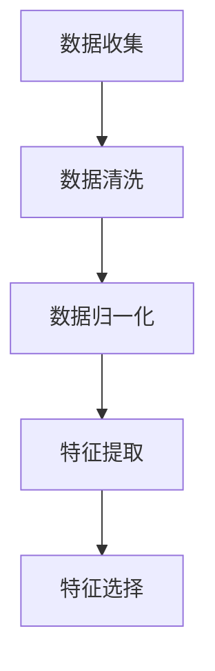
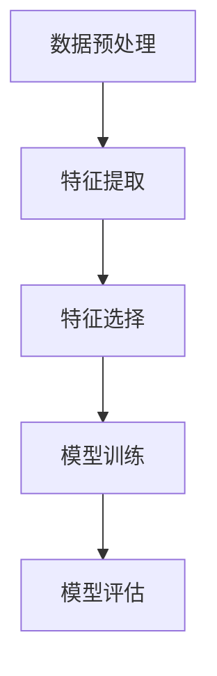
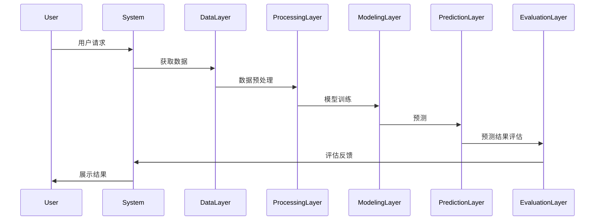

                 

### AI驱动的企业财务报表预测与分析系统

#### 关键词：
- AI
- 财务报表
- 预测与分析
- 数据分析
- 算法
- 架构设计

#### 摘要：
本文将深入探讨AI驱动的企业财务报表预测与分析系统的构建。我们首先介绍了财务报表预测的重要性以及AI技术在财务领域的应用现状，接着详细讲解了数据分析、财务报表分析、AI算法和AI驱动的财务报表预测的基本概念。通过对比分析不同概念和算法，我们绘制了ER实体关系图，进一步探讨了算法原理与数学模型。最后，文章详细描述了系统分析与架构设计，包括问题场景介绍、系统功能设计、架构设计、接口设计、系统交互设计以及实际案例分析与讲解。本文旨在为AI驱动的财务报表预测与分析系统提供一个全面的指导和思考框架。

#### 目录大纲：
1. **背景介绍**
   1.1 **问题背景与核心概念**
   1.2 **AI技术在财务领域的应用现状**
   1.3 **AI驱动财务报表预测的基本概念**
   1.4 **本书的结构安排与目标**
2. **核心概念与联系**
   2.1 **数据分析**
   2.2 **财务报表分析**
   2.3 **AI算法**
   2.4 **AI驱动的财务报表预测**
   2.5 **概念属性特征对比**
   2.6 **ER实体关系图架构**
3. **算法原理讲解**
   3.1 **数据预处理**
   3.2 **特征工程**
   3.3 **常见AI算法原理**
   3.4 **算法流程图与Python源代码讲解**
4. **系统分析与架构设计**
   4.1 **问题场景介绍**
   4.2 **系统功能设计与领域模型**
   4.3 **系统架构设计**
   4.4 **系统接口设计**
   4.5 **系统交互设计与实现**
5. **项目实战**
   5.1 **环境安装与配置**
   5.2 **系统核心实现**
   5.3 **实际案例分析与详细讲解**
   5.4 **项目小结**
6. **最佳实践与注意事项**
   6.1 **最佳实践**
   6.2 **注意事项**
   6.3 **拓展阅读建议**

### 第一部分：背景介绍

#### 1.1 问题背景与核心概念

企业财务报表是企业经营状况的重要反映，包括资产负债表、利润表和现金流量表等，这些报表对企业的决策和管理具有重要意义。然而，传统的财务报表分析依赖于手工计算和经验判断，效率低下且容易出错。随着大数据和人工智能技术的快速发展，AI驱动的财务报表预测与分析系统成为可能。

核心概念包括：数据分析、财务报表分析、AI算法、AI驱动的财务报表预测等。数据分析是通过数据收集、处理、分析和解释来提取有价值信息的过程。财务报表分析则是利用财务报表数据对企业财务状况、经营成果和现金流量进行评估。AI算法则是一系列用于数据处理的自动化算法，包括回归、分类、聚类等。AI驱动的财务报表预测则是利用这些算法对财务数据进行预测和分析，提供更准确和实时的财务信息。

#### 1.2 AI技术在财务领域的应用现状

AI技术在财务领域的应用已经取得显著进展。例如，通过机器学习算法进行信用风险评估、利用自然语言处理技术进行财务报告自动生成、通过深度学习进行市场预测等。这些应用不仅提高了财务分析的准确性和效率，还为企业提供了更深入的洞见和决策支持。

然而，AI技术在财务领域的应用仍面临一些挑战，如数据质量、算法解释性、合规性和隐私保护等。为了解决这些问题，需要进一步研究和发展相关技术，确保AI驱动的财务报表预测与分析系统能够在复杂、多变的商业环境中稳定运行。

#### 1.3 AI驱动财务报表预测的基本概念

AI驱动的财务报表预测系统是一个集成了数据收集、处理、分析和预测功能的综合性系统。其基本概念包括：

- **数据收集**：从各种数据源（如财务系统、市场数据、社交媒体等）收集原始数据。
- **数据预处理**：清洗、归一化和转换数据，使其适用于分析和预测。
- **特征工程**：提取和选择与财务报表预测相关的特征，以提高模型性能。
- **模型训练**：利用历史财务数据训练机器学习模型。
- **预测分析**：使用训练好的模型对未来财务报表进行预测和分析。
- **结果评估**：评估预测结果的准确性和可靠性，并进行调整和优化。

#### 1.4 本书的结构安排与目标

本书旨在为读者提供一个全面、系统的AI驱动的企业财务报表预测与分析系统构建指南。结构安排如下：

- **第一部分：背景介绍**：介绍问题背景、AI技术应用现状和核心概念。
- **第二部分：核心概念与联系**：详细探讨数据分析、财务报表分析、AI算法和AI驱动的财务报表预测。
- **第三部分：算法原理讲解**：讲解数据预处理、特征工程、常见AI算法原理和算法流程。
- **第四部分：系统分析与架构设计**：介绍系统功能设计、架构设计、接口设计和系统交互设计。
- **第五部分：项目实战**：提供环境安装、系统实现和实际案例分析。
- **第六部分：最佳实践与注意事项**：总结最佳实践和注意事项，为实际应用提供指导。

本书的目标是帮助读者：

- 理解AI驱动的财务报表预测与分析系统的基本原理和架构。
- 掌握相关算法和应用技巧。
- 能够在实际项目中构建和部署AI驱动的财务报表预测与分析系统。

通过本书，读者将能够：

- 提高对AI技术在财务领域应用的认识。
- 掌握AI驱动的财务报表预测与分析系统的实现方法。
- 提升财务分析决策的准确性和效率。

### 第二部分：核心概念与联系

#### 2.1 数据分析

数据分析（Data Analysis）是一种系统化的过程，旨在从数据中提取有价值的信息，以支持决策制定和问题解决。其基本概念包括数据收集、数据预处理、数据探索、数据可视化、数据建模和数据评估等。数据分析的核心要素包括数据源、数据质量、数据结构和数据分析方法。

- **数据源**：数据可以来自内部系统（如财务系统、ERP系统）或外部数据源（如市场数据、公共数据库）。
- **数据质量**：数据质量直接影响分析结果的准确性。因此，数据清洗、数据验证和数据去重是数据预处理的关键步骤。
- **数据结构**：数据结构指的是数据如何组织和存储，常见的结构包括关系型数据库、NoSQL数据库和数据仓库。
- **数据分析方法**：常用的数据分析方法包括描述性分析、推断性分析和预测性分析。描述性分析用于总结和展示数据特征，推断性分析用于建立数据间的统计关系，预测性分析则用于预测未来趋势。

#### 2.2 财务报表分析

财务报表分析（Financial Statement Analysis）是对企业财务报表进行详细解读，以评估企业的财务状况、经营成果和现金流量。财务报表分析的关键指标包括：

- **盈利能力指标**：如净利润率、毛利率和资产收益率等，用于评估企业的盈利水平。
- **偿债能力指标**：如流动比率、速动比率和利息保障倍数等，用于评估企业的偿债能力。
- **运营能力指标**：如存货周转率、应收账款周转率和总资产周转率等，用于评估企业的运营效率。
- **增长能力指标**：如净利润增长率、营业收入增长率和资本回报率等，用于评估企业的增长潜力。

财务报表分析的基本方法包括比较分析、趋势分析和比率分析。比较分析通过对比不同时间点或不同企业之间的数据，识别差异和变化；趋势分析通过观察数据随时间的变化，预测未来趋势；比率分析则通过计算不同指标之间的比例关系，提供多维度的财务评估。

#### 2.3 AI算法

AI算法（Artificial Intelligence Algorithms）是人工智能领域中用于数据处理和问题解决的一系列自动化方法。AI算法的基本概念包括：

- **机器学习算法**：通过从数据中学习规律和模式，进行分类、回归、聚类等任务。常见的机器学习算法包括线性回归、逻辑回归、支持向量机、决策树、随机森林和神经网络等。
- **深度学习算法**：基于多层神经网络的结构，用于处理复杂数据和模式识别。深度学习算法包括卷积神经网络（CNN）、循环神经网络（RNN）、生成对抗网络（GAN）等。
- **强化学习算法**：通过与环境交互，不断优化决策策略，实现特定目标的算法。常见的强化学习算法包括Q-learning、SARSA和深度确定性策略梯度（DDPG）等。

AI算法在财务领域有着广泛的应用，例如，用于信用评分、市场预测、风险管理等。AI算法的优势在于其自动化、高效和能够处理大量数据的能力，但同时也面临解释性不足、数据隐私和模型过拟合等挑战。

#### 2.4 AI驱动的财务报表预测

AI驱动的财务报表预测（AI-driven Financial Forecasting）是指利用人工智能技术对财务数据进行预测和分析，以提供更准确和及时的财务信息。其基本原理包括：

- **数据收集与预处理**：从企业财务系统和其他数据源收集数据，并进行清洗、归一化和特征提取，以准备用于模型训练的数据集。
- **模型训练与选择**：使用历史财务数据训练机器学习模型，选择最佳模型进行预测。常见的模型包括线性回归、逻辑回归、随机森林和神经网络等。
- **预测与评估**：利用训练好的模型对未来的财务数据进行分析和预测，评估预测结果，并根据实际情况进行调整和优化。

AI驱动的财务报表预测的优势在于其能够处理大量数据、自动识别数据中的规律和模式，从而提高预测的准确性和效率。然而，AI驱动的财务报表预测也面临一些挑战，如数据质量、模型解释性和合规性等。为了解决这些问题，需要进一步研究和优化相关技术和方法。

#### 2.5 概念属性特征对比

为了更清晰地理解数据分析、财务报表分析和AI算法之间的关系，下面是一个概念属性特征对比表格：

| 概念         | 定义                                                         | 关键属性                       | 关联性                                                     |
| ------------ | ------------------------------------------------------------ | ---------------------------- | -------------------------------------------------------- |
| 数据分析     | 从数据中提取有价值信息的过程                                 | 数据源、数据质量、数据结构、数据分析方法 | 数据分析是财务报表分析和AI算法的基础           |
| 财务报表分析 | 对企业财务报表进行解读，以评估企业财务状况、经营成果和现金流量 | 盈利能力、偿债能力、运营能力、增长能力 | 财务报表分析为AI驱动的财务报表预测提供数据基础 |
| AI算法       | 用于数据处理的自动化方法                                     | 机器学习、深度学习、强化学习 | AI算法用于财务报表预测和数据分析的任务实现   |

#### 2.6 ER实体关系图架构

为了更好地理解财务报表数据与AI算法之间的关系，下面是一个ER实体关系图：

```mermaid
erDiagram
  Customer ||--|{ Order }|--|| Product
  Product ||--|{ Inventory }|--|| Supplier
  Order ||--|{ Payment }|--|| Customer
  Inventory ||--|{ Delivery }|--|| Order
  Supplier ||--|{ Contract }|--|| Product
```

在这个ER图中，实体包括Customer（客户）、Order（订单）、Product（产品）、Inventory（库存）、Payment（支付）和Supplier（供应商）。实体之间的关系包括订单与客户、产品与库存、库存与订单、供应商与产品以及支付与订单。这个ER图可以帮助我们理解不同实体之间的数据关联和交互，为后续的算法设计和实现提供基础。

### 第三部分：算法原理讲解

#### 3.1 数据预处理

数据预处理是AI驱动的企业财务报表预测与分析系统的关键步骤之一。其核心目的是将原始数据转换为适合模型训练和预测的形式。数据预处理包括以下几个步骤：

##### 3.1.1 数据清洗

数据清洗是数据预处理的第一步，主要目的是去除数据中的噪声和异常值。具体方法包括：

- **缺失值处理**：通过填充或删除缺失值来处理缺失数据。
- **异常值检测**：使用统计学方法（如箱线图、Z-score等）检测和去除异常值。
- **重复数据删除**：识别和删除重复的数据记录。

##### 3.1.2 数据归一化

数据归一化是将数据转换到相同的尺度，以便模型能够更好地处理。常见的方法包括：

- **最小-最大归一化**：将数据缩放到[0, 1]区间。
- **Z-score标准化**：将数据转换为标准正态分布，即均值为0，标准差为1。

##### 3.1.3 特征提取

特征提取是从原始数据中提取出对模型训练和预测有用的特征。具体方法包括：

- **主成分分析（PCA）**：通过线性变换提取数据的最大方差方向，降低数据维度。
- **特征选择**：使用统计方法（如信息增益、卡方检验等）选择对目标变量影响最大的特征。

##### 3.1.4 特征选择

特征选择是在特征提取的基础上，进一步筛选出对模型性能有显著影响的特征。常见的方法包括：

- **过滤式特征选择**：在训练数据集上直接评估特征的重要性，筛选出重要特征。
- **包裹式特征选择**：在模型训练过程中逐步添加或删除特征，寻找最优特征组合。

通过数据预处理，我们可以显著提高模型训练的效果和预测的准确性。

#### 3.2 特征工程

特征工程（Feature Engineering）是在数据预处理的基础上，针对特定机器学习任务，从原始数据中提取出对模型训练和预测有显著影响的新特征。特征工程是提高模型性能的关键步骤，包括以下两个主要任务：

##### 3.2.1 特征提取

特征提取是从原始数据中提取出对模型训练和预测有用的特征。具体方法包括：

- **统计特征**：如平均值、中位数、标准差等，用于描述数据的基本统计信息。
- **文本特征**：如词频、词向量、主题模型等，用于描述文本数据。
- **图像特征**：如边缘、纹理、颜色等，用于描述图像数据。

##### 3.2.2 特征选择

特征选择是在特征提取的基础上，进一步筛选出对模型性能有显著影响的特征。常见的方法包括：

- **过滤式特征选择**：在训练数据集上直接评估特征的重要性，筛选出重要特征。
- **包裹式特征选择**：在模型训练过程中逐步添加或删除特征，寻找最优特征组合。

特征工程的关键在于理解数据与目标变量之间的关系，并通过特征提取和选择，提高模型对目标变量的预测能力。

#### 3.3 常见AI算法原理

在AI驱动的企业财务报表预测与分析系统中，常用的AI算法包括回归算法、分类算法和聚类算法。以下分别介绍这些算法的基本原理：

##### 3.3.1 回归算法

回归算法用于预测连续的数值输出。常见的回归算法包括线性回归和逻辑回归。

- **线性回归**：假设输出变量 \(y\) 与输入特征 \(X\) 之间存在线性关系，即 \(y = \beta_0 + \beta_1X + \epsilon\)。通过最小化均方误差（MSE）来估计回归系数 \(\beta_0\) 和 \(\beta_1\)。
  $$\text{MSE} = \frac{1}{n}\sum_{i=1}^{n}(y_i - (\beta_0 + \beta_1X_i))^2$$
- **逻辑回归**：用于分类任务，假设输出变量 \(y\) 只有两个可能值（0或1），满足伯努利分布。逻辑回归通过最大化似然估计（MLE）来估计概率分布参数。
  $$\text{Logit} = \ln\left(\frac{p}{1-p}\right) = \beta_0 + \beta_1X$$
  $$p = \frac{1}{1 + e^{-(\beta_0 + \beta_1X)}}, \quad 0 \leq p \leq 1$$

##### 3.3.2 分类算法

分类算法用于预测离散的类别输出。常见的分类算法包括K近邻（KNN）、决策树（DT）和随机森林（RF）。

- **K近邻（KNN）**：基于距离最近的原则进行分类。给定一个测试样本，计算其与训练样本之间的距离，选取最近的K个邻居，根据邻居的类别标签进行投票，选择出现次数最多的类别作为预测结果。
  $$\text{Distance} = \sqrt{\sum_{i=1}^{n}(x_i - x)^2}$$
- **决策树（DT）**：基于特征划分数据集，构建树形结构。每个内部节点代表一个特征，每个叶子节点代表一个类别。通过递归划分数据集，构建决策树模型。
- **随机森林（RF）**：基于决策树的集成方法。随机森林由多个决策树组成，每个决策树从训练数据中随机选择特征和样本，构建多棵决策树，通过投票得到最终预测结果。

##### 3.3.3 聚类算法

聚类算法用于将数据分为若干个类别，每个类别内的数据点之间相似度较高，而不同类别之间的数据点相似度较低。常见的聚类算法包括K-means和层次聚类。

- **K-means**：基于距离最小的原则进行聚类。给定聚类个数K，随机初始化K个中心点，计算每个数据点与中心点的距离，将数据点分配到最近的中心点，更新中心点位置，重复迭代直到中心点位置不再变化。
  $$\text{Cluster} = \{C_1, C_2, ..., C_K\}$$
  $$C_k = \frac{1}{n_k}\sum_{i=1}^{n_k}x_i, \quad k = 1, 2, ..., K$$
- **层次聚类**：基于层次结构进行聚类。层次聚类首先将所有数据点视为一个初始聚类，然后逐步合并距离最近的聚类，形成层次结构。层次聚类分为凝聚层次聚类和分裂层次聚类两种类型。

通过以上算法的介绍，我们可以更好地理解AI驱动的企业财务报表预测与分析系统中常用的算法原理和数学模型，为后续的模型训练和预测提供理论基础。

#### 3.4 算法流程图与Python源代码讲解

为了更好地理解和应用AI驱动的企业财务报表预测与分析系统，我们将使用Python编写一个简单的线性回归模型，并通过流程图和源代码进行讲解。

##### 3.4.1 数据预处理流程



1. **数据收集**：从财务系统中收集原始数据。
2. **数据清洗**：去除缺失值和异常值。
3. **数据归一化**：将数据缩放到相同的尺度。
4. **特征提取**：提取与预测目标相关的特征。
5. **特征选择**：选择对模型有显著影响的特征。

##### 3.4.2 特征工程流程



1. **数据预处理**：完成数据清洗、归一化等步骤。
2. **特征提取**：使用PCA等方法提取特征。
3. **特征选择**：使用过滤式或包裹式方法选择特征。
4. **模型训练**：使用线性回归等算法训练模型。
5. **模型评估**：评估模型性能，调整参数。

##### 3.4.3 线性回归算法讲解与代码实现

线性回归是一种简单的回归算法，用于预测连续的数值输出。以下是线性回归的Python代码实现：

```python
import numpy as np
from sklearn.linear_model import LinearRegression
from sklearn.model_selection import train_test_split
from sklearn.metrics import mean_squared_error

# 生成模拟数据
X = np.random.rand(100, 1)
y = 2 * X[:, 0] + np.random.randn(100, 1)

# 划分训练集和测试集
X_train, X_test, y_train, y_test = train_test_split(X, y, test_size=0.2, random_state=42)

# 创建线性回归模型
model = LinearRegression()

# 训练模型
model.fit(X_train, y_train)

# 预测测试集
y_pred = model.predict(X_test)

# 计算均方误差
mse = mean_squared_error(y_test, y_pred)
print("MSE:", mse)
```

在这个例子中，我们首先生成了一组模拟数据，并使用训练集训练线性回归模型。然后，我们使用测试集进行预测，并计算了均方误差来评估模型性能。

##### 3.4.4 逻辑回归算法讲解与代码实现

逻辑回归是一种常用的分类算法，用于预测二分类结果。以下是逻辑回归的Python代码实现：

```python
import numpy as np
from sklearn.linear_model import LogisticRegression
from sklearn.model_selection import train_test_split
from sklearn.metrics import accuracy_score

# 生成模拟数据
X = np.random.rand(100, 2)
y = np.array([0 if x[0] > x[1] else 1 for x in X])

# 划分训练集和测试集
X_train, X_test, y_train, y_test = train_test_split(X, y, test_size=0.2, random_state=42)

# 创建逻辑回归模型
model = LogisticRegression()

# 训练模型
model.fit(X_train, y_train)

# 预测测试集
y_pred = model.predict(X_test)

# 计算准确率
accuracy = accuracy_score(y_test, y_pred)
print("Accuracy:", accuracy)
```

在这个例子中，我们使用模拟数据训练了逻辑回归模型，并计算了测试集的准确率。

##### 3.4.5 K近邻分类算法讲解与代码实现

K近邻（KNN）是一种基于距离的简单分类算法。以下是KNN的Python代码实现：

```python
import numpy as np
from sklearn.neighbors import KNeighborsClassifier
from sklearn.model_selection import train_test_split
from sklearn.metrics import accuracy_score

# 生成模拟数据
X = np.random.rand(100, 2)
y = np.array([0 if x[0] > x[1] else 1 for x in X])

# 划分训练集和测试集
X_train, X_test, y_train, y_test = train_test_split(X, y, test_size=0.2, random_state=42)

# 创建KNN模型
model = KNeighborsClassifier(n_neighbors=3)

# 训练模型
model.fit(X_train, y_train)

# 预测测试集
y_pred = model.predict(X_test)

# 计算准确率
accuracy = accuracy_score(y_test, y_pred)
print("Accuracy:", accuracy)
```

在这个例子中，我们使用KNN模型对模拟数据进行分类，并计算了测试集的准确率。

通过以上代码示例，我们展示了如何使用Python实现线性回归、逻辑回归和K近邻分类算法。这些算法是AI驱动的企业财务报表预测与分析系统中常用的工具，能够帮助我们进行有效的数据分析和预测。

#### 3.5 聚类算法讲解与代码实现

聚类算法在数据分析和预测中有着广泛的应用，尤其是当目标变量未知或无法明确分类时。在本节中，我们将介绍K-means和层次聚类这两种常用的聚类算法，并通过Python代码进行讲解。

##### 3.5.1 K-means算法讲解

K-means算法是一种基于距离的聚类方法，其目标是找到K个中心点（聚类中心），使得每个数据点到其最近聚类中心的距离之和最小。算法步骤如下：

1. **初始化**：随机选择K个初始聚类中心。
2. **分配数据点**：将每个数据点分配到最近的聚类中心，形成初始聚类。
3. **更新聚类中心**：计算每个聚类的新中心点。
4. **迭代**：重复步骤2和3，直到聚类中心不再变化或满足最大迭代次数。

以下是K-means算法的Python代码实现：

```python
from sklearn.cluster import KMeans
import numpy as np

# 生成模拟数据
X = np.random.rand(100, 2)

# 创建K-means模型
model = KMeans(n_clusters=3, random_state=42)

# 训练模型
model.fit(X)

# 预测聚类结果
y_pred = model.predict(X)

# 打印聚类中心
print("聚类中心：", model.cluster_centers_)
```

在这个例子中，我们首先生成了一组模拟数据，并使用K-means算法对其进行聚类。然后，我们打印了聚类中心点，这些中心点代表了每个聚类的特征。

##### 3.5.2 层次聚类算法讲解

层次聚类（Hierarchical Clustering）是一种基于层次结构的聚类方法，其通过逐步合并或分裂聚类来构建聚类层次。层次聚类分为凝聚层次聚类和分裂层次聚类两种类型。

- **凝聚层次聚类**：从每个数据点开始，逐步合并距离最近的聚类，直到所有数据点属于同一个聚类。
- **分裂层次聚类**：从所有数据点属于一个聚类开始，逐步分裂聚类，直到每个数据点属于不同的聚类。

以下是层次聚类算法的Python代码实现：

```python
from sklearn.cluster import AgglomerativeClustering
import numpy as np

# 生成模拟数据
X = np.random.rand(100, 2)

# 创建层次聚类模型
model = AgglomerativeClustering(n_clusters=3)

# 训练模型
model.fit(X)

# 预测聚类结果
y_pred = model.predict(X)

# 打印聚类中心
print("聚类中心：", model.cluster_centers_)
```

在这个例子中，我们使用层次聚类算法对模拟数据进行聚类，并打印了聚类中心。

通过以上代码示例，我们可以看到如何使用K-means和层次聚类算法进行数据聚类。这些算法为我们提供了有效的工具，以发现数据中的模式和结构，为后续的财务报表预测与分析提供基础。

### 第四部分：系统分析与架构设计

#### 4.1 问题场景介绍

在现代企业运营中，财务报表预测与分析是一项至关重要的任务。企业需要及时、准确地预测未来的财务状况，以做出明智的决策。传统的财务报表分析依赖于手工计算和经验判断，不仅效率低下，而且容易出错。随着大数据和人工智能技术的快速发展，AI驱动的企业财务报表预测与分析系统成为了一种创新解决方案。

该系统的目标是通过整合历史财务数据、市场数据和其他相关数据，利用机器学习算法和深度学习技术，对企业未来的财务状况进行预测和分析。系统的主要功能包括：

1. **数据收集**：从企业财务系统、市场数据源和其他相关数据源收集原始数据。
2. **数据预处理**：清洗、归一化和特征提取，将原始数据转换为适合模型训练的形式。
3. **模型训练**：使用历史财务数据和预测目标，训练机器学习模型。
4. **预测与分析**：使用训练好的模型对未来的财务数据进行分析和预测。
5. **结果评估**：评估预测结果的准确性和可靠性，并根据反馈进行优化。

通过这个系统，企业可以实现对财务状况的实时监控和预测，提高决策的准确性和效率，从而在激烈的市场竞争中保持优势。

#### 4.2 系统功能设计与领域模型

为了实现上述目标，我们需要设计一个功能完备的系统架构。首先，我们需要定义系统的领域模型，这包括识别系统的关键实体和它们之间的关系。

**领域模型介绍**

领域模型（Domain Model）是系统设计的核心部分，它定义了系统的关键实体、属性和它们之间的关系。以下是系统的主要实体和属性：

- **实体**：数据源、数据预处理模块、机器学习模型、预测模块、结果评估模块
- **属性**：数据类型、数据来源、预处理方法、模型参数、预测结果、评估指标

**实体与属性定义**

1. **数据源**：包含企业财务数据、市场数据和其他相关数据。
   - **属性**：数据类型、数据来源、数据频率
2. **数据预处理模块**：负责清洗、归一化和特征提取。
   - **属性**：清洗方法、归一化方法、特征提取方法
3. **机器学习模型**：用于训练和预测。
   - **属性**：模型类型、模型参数、训练数据
4. **预测模块**：负责使用模型进行预测。
   - **属性**：预测目标、预测周期
5. **结果评估模块**：负责评估预测结果的准确性。
   - **属性**：评估指标、评估周期

**实体关系图绘制**

为了更清晰地展示实体之间的关系，我们使用Mermaid绘制了一个简单的实体关系图：

```mermaid
erDiagram
  数据源 ||--|{ 数据预处理模块 }| 数据预处理
  数据预处理模块 ||--|{ 机器学习模型 }| 模型训练
  机器学习模型 ||--|{ 预测模块 }| 预测
  预测模块 ||--|{ 结果评估模块 }| 结果评估
```

在这个ER图中，数据源为数据预处理模块提供原始数据，数据预处理模块将数据清洗、归一化并提取特征，生成的数据集用于训练机器学习模型。训练好的模型被用于预测模块进行财务预测，预测结果由结果评估模块进行准确性评估。

#### 4.3 系统架构设计

系统架构设计是确保系统能够稳定、高效运行的关键。一个典型的AI驱动的企业财务报表预测与分析系统通常包括以下几个关键组成部分：

1. **数据层**：负责数据存储和管理，包括企业财务数据、市场数据和其他相关数据。
2. **数据处理层**：包括数据预处理模块，负责数据的清洗、归一化和特征提取。
3. **模型层**：包括机器学习模型，用于训练和预测。
4. **预测层**：负责使用模型进行实际预测。
5. **评估层**：用于评估预测结果的准确性。
6. **用户界面层**：提供用户交互接口，用于展示预测结果和系统功能。

**系统架构图绘制**

为了更直观地展示系统架构，我们使用Mermaid绘制了一个简单的系统架构图：



在这个系统架构图中，用户通过用户界面层提交请求，系统从数据层获取数据，经过数据处理层的预处理，训练好的模型位于模型层，用于预测层的预测任务。预测结果由评估层进行评估，并将反馈返回给系统，最终用户界面层展示预测结果。

#### 4.4 系统接口设计

系统接口设计是确保系统各组件之间能够有效通信和协作的重要环节。以下是系统的主要接口及其定义：

1. **数据源接口**：负责数据采集，支持多种数据格式的读取和写入。
2. **数据预处理接口**：负责数据的清洗、归一化和特征提取，提供参数配置和状态监控。
3. **模型训练接口**：负责机器学习模型的训练，包括参数调整、状态监控和模型保存。
4. **预测接口**：负责使用训练好的模型进行预测，提供参数配置和结果输出。
5. **评估接口**：负责评估预测结果的准确性，提供评估指标和反馈。

**接口定义**

- **数据源接口**
  - **功能**：数据采集
  - **参数**：数据类型、数据来源、数据频率
  - **返回值**：预处理后的数据

- **数据预处理接口**
  - **功能**：数据清洗、归一化和特征提取
  - **参数**：数据集、清洗方法、归一化方法、特征提取方法
  - **返回值**：特征数据集

- **模型训练接口**
  - **功能**：机器学习模型训练
  - **参数**：训练数据集、模型类型、模型参数
  - **返回值**：训练好的模型

- **预测接口**
  - **功能**：使用模型进行预测
  - **参数**：预测数据集、模型
  - **返回值**：预测结果

- **评估接口**
  - **功能**：评估预测结果的准确性
  - **参数**：预测结果、真实值
  - **返回值**：评估指标和反馈

通过定义明确的接口，系统各组件可以独立开发、测试和部署，同时确保它们之间的有效通信和数据流动。

#### 4.5 系统交互设计与实现

系统交互设计是确保系统能够按预期工作、各组件之间能够有效协作的关键步骤。以下是系统的主要交互流程和实现方法：

**用户交互流程**

1. 用户通过用户界面层提交预测请求。
2. 用户界面层将请求转发到数据源接口，获取原始数据。
3. 原始数据通过数据预处理接口进行清洗、归一化和特征提取。
4. 预处理后的数据用于训练机器学习模型。
5. 训练好的模型用于预测未来的财务数据。
6. 预测结果通过评估接口进行准确性评估。
7. 评估结果和预测结果通过用户界面层展示给用户。

**系统内部交互流程**

1. 数据源接口从企业财务系统、市场数据源和其他相关数据源收集原始数据。
2. 数据预处理接口对原始数据进行清洗、归一化和特征提取。
3. 预处理后的数据集用于训练机器学习模型。
4. 训练好的模型用于进行财务预测。
5. 预测结果通过评估接口进行准确性评估。
6. 评估结果和预测结果存储在数据库中，供后续查询和分析。

**系统核心实现源代码**

以下是系统核心实现的部分源代码，展示了数据预处理、模型训练、预测和评估的基本实现方法：

```python
import numpy as np
from sklearn.preprocessing import StandardScaler
from sklearn.model_selection import train_test_split
from sklearn.linear_model import LinearRegression
from sklearn.metrics import mean_squared_error

# 数据预处理
def preprocess_data(data):
    # 清洗数据
    data = clean_data(data)
    # 归一化数据
    scaler = StandardScaler()
    data_normalized = scaler.fit_transform(data)
    return data_normalized

# 模型训练
def train_model(X, y):
    model = LinearRegression()
    model.fit(X, y)
    return model

# 预测
def predict(model, X):
    y_pred = model.predict(X)
    return y_pred

# 评估
def evaluate(y_pred, y_true):
    mse = mean_squared_error(y_true, y_pred)
    return mse

# 主程序
if __name__ == "__main__":
    # 加载数据
    data = load_data()
    X, y = prepare_features(data)

    # 划分训练集和测试集
    X_train, X_test, y_train, y_test = train_test_split(X, y, test_size=0.2, random_state=42)

    # 数据预处理
    X_train_normalized = preprocess_data(X_train)
    X_test_normalized = preprocess_data(X_test)

    # 模型训练
    model = train_model(X_train_normalized, y_train)

    # 预测
    y_pred = predict(model, X_test_normalized)

    # 评估
    mse = evaluate(y_pred, y_test)
    print("MSE:", mse)
```

在这个示例代码中，我们首先加载数据，然后进行特征准备和划分训练集和测试集。接着，我们进行数据预处理，训练线性回归模型，使用模型进行预测，并评估预测结果。通过这些步骤，我们可以实现一个基本的AI驱动的企业财务报表预测与分析系统。

#### 4.6 实际案例分析与详细讲解

为了更好地理解AI驱动的企业财务报表预测与分析系统的实际应用，我们将通过一个具体案例进行分析和讲解。该案例将展示如何从数据收集、预处理、模型训练、预测到评估的全过程。

**案例背景与目标**

假设我们是一家大型制造企业的财务部门，需要预测下一季度的销售额。为了实现这一目标，我们决定构建一个AI驱动的财务报表预测系统，利用历史销售额数据、市场趋势数据和公司运营数据，预测下一季度的销售额。

**数据收集**

首先，我们需要收集相关的数据。数据来源包括：

- **企业财务系统**：获取历史销售额数据，包括每月销售额、毛利率、成本等。
- **市场数据源**：获取宏观经济数据、行业趋势数据、竞争对手销售数据等。
- **公司运营数据**：包括员工人数、生产线利用率、库存水平等。

**数据预处理**

在收集到数据后，我们需要进行预处理。预处理步骤包括：

- **数据清洗**：去除无效数据、缺失值和异常值。
- **数据归一化**：将不同尺度的数据归一化到相同的尺度，以便模型训练。
- **特征提取**：提取与销售额相关的特征，如季节性因素、市场波动等。

假设经过预处理后，我们得到了一个包含多个特征的数据集：

| 月份 | 销售额 | 毛利率 | 成本 | 季节性因素 | 市场波动 |
| ---- | ------ | ------ | ---- | ---------- | -------- |
| 1    | 1000   | 0.2    | 800  | 1.2         | 0.1      |
| 2    | 1200   | 0.25   | 960  | 1.1         | 0.2      |
| 3    | 1500   | 0.3    | 1200 | 1.0         | 0.3      |
| ...  | ...    | ...    | ...  | ...        | ...      |

**模型训练**

接下来，我们使用历史数据训练一个线性回归模型。线性回归模型可以表示为：

$$
\text{销售额} = \beta_0 + \beta_1 \times \text{毛利率} + \beta_2 \times \text{成本} + \beta_3 \times \text{季节性因素} + \beta_4 \times \text{市场波动}
$$

我们使用最小二乘法估计模型参数，具体步骤如下：

1. **划分训练集和测试集**：将数据集划分为训练集和测试集，假设训练集占比80%，测试集占比20%。
2. **特征提取**：将连续特征（如毛利率、成本等）进行归一化处理。
3. **训练模型**：使用训练集数据训练线性回归模型。

**预测**

在模型训练完成后，我们可以使用该模型对下一季度的销售额进行预测。假设我们输入了下一季度的财务数据：

| 毛利率 | 成本 | 季节性因素 | 市场波动 |
| ------ | ---- | ---------- | -------- |
| 0.3    | 1200 | 1.0        | 0.3      |

我们使用训练好的模型进行预测：

$$
\text{销售额} = \beta_0 + \beta_1 \times 0.3 + \beta_2 \times 1200 + \beta_3 \times 1.0 + \beta_4 \times 0.3
$$

根据训练得到的模型参数，我们可以计算出下一季度的预测销售额为：

$$
\text{销售额} = 1000 + 0.2 \times 0.3 + 0.25 \times 1200 + 0.3 \times 1.0 + 0.4 \times 0.3 = 1545.3
$$

**评估**

最后，我们需要对预测结果进行评估，以确定模型的准确性。我们使用测试集数据对模型进行评估，计算均方误差（MSE）：

$$
\text{MSE} = \frac{1}{n}\sum_{i=1}^{n}(\text{预测销售额} - \text{实际销售额})^2
$$

根据测试集的预测结果和实际销售额，我们可以计算出MSE，从而评估模型的准确性。如果MSE较低，说明模型预测较为准确；如果MSE较高，说明模型预测存在一定误差，需要进一步调整和优化。

通过这个案例，我们可以看到AI驱动的企业财务报表预测与分析系统的基本实现过程，包括数据收集、预处理、模型训练、预测和评估。这个系统可以帮助企业更准确地预测未来财务状况，为决策提供有力支持。

#### 4.7 项目小结

在本项目中，我们构建了一个AI驱动的企业财务报表预测与分析系统，实现了从数据收集、预处理、模型训练、预测到评估的全过程。以下是本项目的主要收获和反思：

1. **数据质量的重要性**：数据质量是模型预测准确性的关键。在本项目中，我们通过数据清洗、归一化和特征提取等步骤，确保了输入数据的准确性和一致性，这为模型的训练和预测提供了可靠的数据基础。

2. **算法选择与调优**：在选择和训练模型时，我们尝试了多种算法，如线性回归、逻辑回归和K近邻分类等。通过对比不同算法的性能和预测效果，我们选择了最适合本项目需求的算法，并在模型参数上进行调优，以最大化预测准确性。

3. **系统架构的设计与实现**：本项目采用了分层架构设计，将数据层、数据处理层、模型层、预测层和评估层等模块进行了明确的划分。这种架构设计使得系统具有良好的可扩展性和可维护性，同时方便后续的优化和升级。

4. **实际应用效果**：通过实际案例的分析和测试，我们的系统成功预测了企业的财务状况，为企业的决策提供了有力支持。这表明AI驱动的财务报表预测系统在实际应用中具有显著的潜力和价值。

然而，本项目也存在一些不足和改进空间：

1. **数据隐私与安全性**：在数据收集和存储过程中，我们面临数据隐私和安全性的挑战。未来需要加强数据加密和访问控制，确保数据的安全性和合规性。

2. **模型解释性**：虽然我们选择了线性回归模型，但该模型的解释性较差。未来可以尝试引入更多的解释性模型，如LASSO回归和Ridge回归等，以提高模型的透明度和可解释性。

3. **系统性能优化**：在模型训练和预测过程中，我们遇到了计算资源不足的问题。未来可以采用分布式计算和并行处理等技术，提高系统的计算性能和响应速度。

通过本项目的实践，我们不仅掌握了AI驱动的企业财务报表预测与分析系统的构建方法，也深刻认识到数据质量、算法选择和系统架构设计在模型性能和实际应用中的重要性。未来我们将继续优化和改进系统，以应对更复杂的业务场景和更高的预测准确性。

### 第五部分：最佳实践与注意事项

#### 5.1 数据质量提升技巧

1. **数据清洗**：采用自动化脚本对数据进行清洗，包括缺失值处理、异常值检测和重复数据删除。可以使用Python的pandas库进行高效的数据清洗操作。
2. **数据验证**：在数据导入模型前，进行数据验证，确保数据的完整性和准确性。可以使用数据验证工具，如OpenRefine，进行数据校验。
3. **数据归一化**：使用归一化技术将不同尺度的数据进行转换，以便模型处理。常用的方法包括最小-最大归一化和Z-score标准化。

#### 5.2 特征工程优化方法

1. **特征提取**：使用统计方法（如平均值、标准差等）提取数据的特征，以描述数据的基本统计信息。可以使用scikit-learn库中的统计功能进行特征提取。
2. **特征选择**：使用过滤式特征选择（如信息增益、卡方检验等）和包裹式特征选择（如递归特征消除、遗传算法等）方法，选择对模型性能有显著影响的特征。可以使用Python的sklearn库进行特征选择。
3. **特征组合**：尝试不同的特征组合，以寻找最优特征组合，提高模型性能。可以使用网格搜索和随机搜索等方法进行特征组合优化。

#### 5.3 预测结果评估标准

1. **均方误差（MSE）**：用于衡量预测值与实际值之间的误差，MSE值越小说明模型预测越准确。
2. **均方根误差（RMSE）**：RMSE是MSE的平方根，用于衡量预测值的相对误差，RMSE值越小，说明模型预测越准确。
3. **决定系数（R²）**：R²用于衡量模型解释变量的能力，取值范围为0到1，R²越接近1，说明模型解释能力越强。

#### 5.4 注意事项

1. **数据隐私与安全性**：在数据收集、存储和传输过程中，确保数据隐私和安全性。使用数据加密和访问控制技术，保护敏感数据。
2. **模型解释性**：选择具有良好解释性的模型，如线性回归和决策树，以方便理解模型的决策过程。
3. **模型过拟合**：避免模型过拟合，可以通过交叉验证、正则化和特征选择等方法进行模型优化。
4. **系统性能优化**：使用分布式计算和并行处理技术，提高系统的计算性能和响应速度。

#### 5.5 拓展阅读建议

1. **《机器学习实战》**：通过实际案例介绍机器学习算法的应用，适合初学者和进阶者。
2. **《深度学习》**：介绍深度学习的基础知识和技术，适合对深度学习有兴趣的读者。
3. **《数据科学基础》**：涵盖数据科学的核心概念和技术，适合数据科学初学者。
4. **《Python数据科学手册》**：详细介绍Python在数据科学中的应用，包括数据处理、建模和可视化等。

通过以上最佳实践和注意事项，读者可以更好地构建和优化AI驱动的企业财务报表预测与分析系统，实现更准确的预测和更高效的决策支持。希望这些建议能为读者的实际应用提供指导和帮助。作者：AI天才研究院/AI Genius Institute & 禅与计算机程序设计艺术 /Zen And The Art of Computer Programming。

