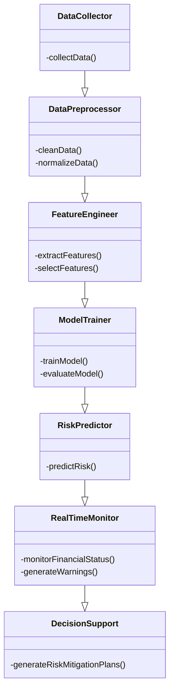
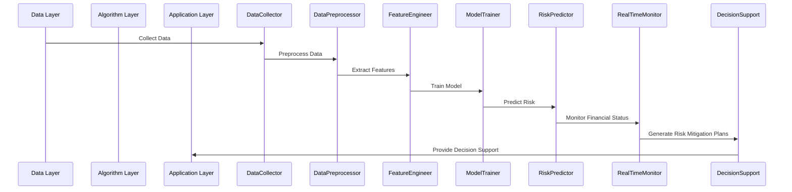
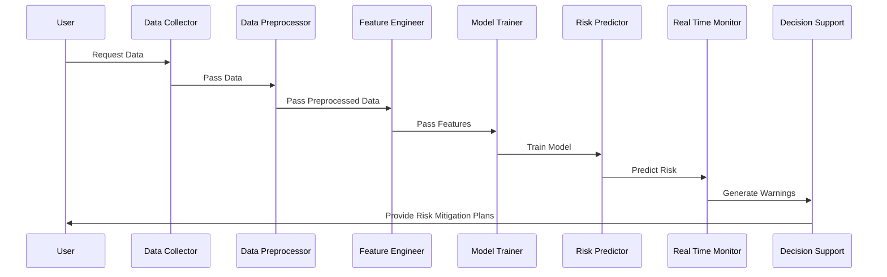

                 


## 引言

### 问题的提出

在当今全球经济环境下，企业资金流动性风险已经成为影响企业生存和发展的重要因素。资金流动性风险指的是企业在特定时期内无法满足其短期债务和运营资金需求的风险。这种风险可能导致企业无法及时偿还债务、降低信用评级，甚至导致破产。随着市场的快速变化和金融环境的复杂性增加，企业面临的不确定因素也在不断增多，这使得传统的资金流动性风险管理方法逐渐显得力不从心。

### 背景介绍

资金流动性风险对企业的影响是多方面的。首先，它可能直接导致企业财务状况恶化，进而影响其日常运营。其次，资金流动性风险还可能影响企业的声誉和投资者的信心，进一步影响企业的融资能力和市场价值。此外，在全球化的背景下，企业还可能面临跨国界的资金流动性风险，如汇率波动、国际资本流动等。因此，如何有效预测和管控企业资金流动性风险，已经成为企业管理和金融研究领域的重要课题。

### 当前风险管理面临的挑战

尽管传统的资金流动性风险管理方法，如财务报表分析、现金流预测等，在一定程度上能够帮助企业识别和管理风险，但它们也存在诸多局限性。首先，这些方法往往依赖于历史数据和统计模型，难以应对快速变化的市场环境。其次，这些方法通常需要大量人工分析和判断，效率低下，且容易出现人为错误。此外，传统方法在应对复杂多变的金融风险时，往往缺乏全局视角和前瞻性。

### AI驱动的解决方案

随着人工智能技术的快速发展，特别是机器学习和深度学习技术的成熟，AI被广泛应用于各个领域，包括金融风险预测。AI驱动的企业资金流动性风险预测系统通过收集和分析大量历史数据，利用先进的算法模型，对企业的资金流动性风险进行实时预测和监控，从而帮助企业提前识别潜在风险，制定有效的风险管理策略。

### AI在风险预测中的应用

AI在金融风险预测中的应用主要体现在以下几个方面：

1. **数据挖掘与分析**：AI技术可以高效地处理和分析海量数据，从复杂的数据集中提取有价值的信息和模式，帮助金融机构和企业管理者更全面地了解风险状况。

2. **智能建模与预测**：通过机器学习和深度学习算法，AI可以建立复杂的风险预测模型，提高预测的准确性和时效性。

3. **实时监控与预警**：AI系统可以实时监控企业的财务状况和市场动态，一旦发现潜在的风险，立即发出预警，帮助企业迅速采取应对措施。

4. **自动化决策支持**：AI可以基于预测结果，自动生成风险管理决策，减少人工干预，提高决策效率。

### AI驱动的企业资金流动性风险预测的潜力

AI驱动的企业资金流动性风险预测系统具有巨大的潜力。首先，它能够利用大数据和云计算技术，实现实时、动态的风险评估，帮助企业更准确地预测未来风险。其次，通过机器学习和深度学习算法的持续优化，AI系统的预测准确率和稳定性将不断提高。此外，AI驱动的风险预测系统还可以通过集成多种数据源，如财务报表、市场数据、社交媒体等，提供更全面的风险分析，帮助企业管理者做出更为科学的决策。

### 引言1.3 书籍目的与结构

本书旨在为读者提供一个全面、系统的指南，帮助企业和金融机构理解和应用AI驱动的企业资金流动性风险预测系统。本书的目标读者包括企业财务经理、风险管理人员、金融分析师以及人工智能研究人员等。

本书的结构分为以下几个部分：

1. 引言：介绍资金流动性风险背景、AI驱动的解决方案以及本书的目的和结构。
2. 背景介绍：详细阐述资金流动性风险的概念、影响及当前风险管理面临的挑战。
3. 核心概念与联系：介绍AI驱动的风险预测系统的核心概念和原理，包括机器学习算法、深度学习模型等。
4. 风险预测算法原理：深入讲解AI驱动的资金流动性风险预测算法，包括数据预处理、特征工程、模型训练和评估等步骤。
5. 数学模型和数学公式：介绍风险预测算法的数学模型和公式，帮助读者理解算法的工作原理。
6. 系统分析与架构设计方案：详细分析AI驱动的资金流动性风险预测系统的架构设计，包括数据流程、算法流程和系统接口设计等。
7. 项目实战：通过实际项目案例，展示如何应用AI驱动的资金流动性风险预测系统，并进行实战分析。
8. 最佳实践 tips：提供实用的风险管理技巧和建议，帮助读者在实际工作中更好地应用AI驱动的风险预测系统。
9. 小结与拓展：对全书内容进行总结，并展望未来的研究方向和趋势。

通过本书的阅读，读者将能够全面了解AI驱动的企业资金流动性风险预测系统，掌握相关技术原理和应用方法，为企业风险管理和金融决策提供有力支持。

## 核心概念与联系

### 资金流动性风险定义

资金流动性风险是指企业在特定时期内无法满足其短期债务和运营资金需求的风险。这种风险可能源于多种因素，包括市场环境的变化、企业内部运营问题、外部经济冲击等。资金流动性风险的管理对于企业的持续运营和长期发展至关重要。

### AI驱动的资金流动性风险预测系统

AI驱动的资金流动性风险预测系统是一种利用人工智能技术进行风险预测和管理的系统。该系统通过收集和分析大量企业内外部数据，利用机器学习和深度学习算法，对企业的资金流动性风险进行实时预测和监控。AI驱动的风险预测系统主要包括以下几个核心组件：

1. **数据采集与预处理**：系统首先需要收集企业内外部数据，包括财务报表、市场数据、社交媒体信息等。这些数据经过清洗、格式化和归一化处理，为后续分析做准备。

2. **特征工程**：特征工程是风险预测的关键步骤，它通过提取和构造与资金流动性风险相关的特征，提高模型预测的准确性和稳定性。常见的特征包括财务指标、市场指标、经营指标等。

3. **模型训练与评估**：系统利用机器学习和深度学习算法，对预处理后的数据进行训练，构建风险预测模型。模型训练过程中，需要不断调整算法参数和模型结构，以提高预测准确性。训练完成后，系统对模型进行评估，确保其性能满足实际应用需求。

4. **实时监控与预警**：AI驱动的风险预测系统可以实时监控企业的财务状况和市场动态，一旦发现潜在的风险，立即发出预警信号，帮助企业迅速采取应对措施。

5. **自动化决策支持**：系统根据预测结果，自动生成风险管理决策，如调整财务策略、优化运营流程等，提高决策效率。

### 机器学习与深度学习算法

机器学习和深度学习算法是AI驱动的资金流动性风险预测系统的核心。以下是一些常用的算法及其在风险预测中的应用：

1. **线性回归**：线性回归是一种简单的机器学习算法，用于建立自变量和因变量之间的线性关系。在资金流动性风险预测中，可以通过线性回归模型分析财务指标与资金流动性风险之间的关系。

2. **逻辑回归**：逻辑回归是一种广义线性模型，常用于分类问题。在资金流动性风险预测中，逻辑回归模型可以用于预测企业是否会发生流动性风险。

3. **决策树**：决策树是一种基于规则的学习算法，通过树形结构对数据进行划分。决策树模型在风险预测中可以帮助识别影响资金流动性风险的关键因素。

4. **随机森林**：随机森林是一种基于决策树的集成学习方法，通过构建多个决策树模型，提高预测的准确性和稳定性。在资金流动性风险预测中，随机森林模型可以用于综合分析多个指标，提高预测效果。

5. **支持向量机（SVM）**：支持向量机是一种监督学习算法，通过寻找最佳超平面，将不同类别的数据点进行分类。在资金流动性风险预测中，SVM模型可以用于识别风险等级。

6. **神经网络**：神经网络是一种基于生物神经网络结构的人工智能算法，能够通过多层次的神经网络结构，对复杂的数据进行建模。在资金流动性风险预测中，神经网络模型可以用于构建高维非线性关系。

7. **深度学习**：深度学习是一种基于多层神经网络的机器学习技术，能够通过多层网络结构，自动提取数据中的特征。在资金流动性风险预测中，深度学习模型可以用于识别复杂的风险模式，提高预测准确性。

### AI驱动的资金流动性风险预测系统的优势

AI驱动的资金流动性风险预测系统具有以下优势：

1. **高效性**：通过机器学习和深度学习算法，系统能够快速处理海量数据，提高预测效率。

2. **准确性**：AI系统可以自动提取和利用数据中的特征，提高预测准确性。

3. **实时性**：系统可以实时监控企业的财务状况和市场动态，及时发出预警信号。

4. **自动化**：系统可以自动生成风险管理决策，减少人工干预，提高决策效率。

5. **可扩展性**：系统可以根据企业需求，灵活调整和扩展预测模型，适应不同场景。

### AI驱动的资金流动性风险预测系统的挑战

尽管AI驱动的资金流动性风险预测系统具有诸多优势，但在实际应用中仍面临一些挑战：

1. **数据质量**：数据质量对预测结果具有重要影响。如果数据存在缺失、异常或噪声，可能导致预测准确性下降。

2. **模型解释性**：深度学习模型通常具有很好的预测性能，但模型解释性较差，难以理解模型的工作原理。

3. **计算资源**：深度学习算法需要大量的计算资源，特别是在处理高维数据时，对硬件设备要求较高。

4. **伦理和隐私**：AI系统在处理企业财务数据时，可能涉及隐私和伦理问题，需要确保数据安全和用户隐私。

### 结论

AI驱动的资金流动性风险预测系统为企业和金融机构提供了一种高效、准确的预测和管理工具。通过机器学习和深度学习算法，系统能够实时监控企业财务状况，识别潜在风险，并生成自动化决策支持。然而，在实际应用中，仍需注意数据质量、模型解释性、计算资源和伦理隐私等挑战。通过不断优化和改进，AI驱动的资金流动性风险预测系统有望在未来发挥更大的作用。

## 风险预测算法原理

### 数据预处理

在AI驱动的资金流动性风险预测系统中，数据预处理是关键的第一步。数据预处理包括数据清洗、数据转换和数据标准化等过程，目的是提高数据质量，为后续的特征工程和模型训练提供可靠的基础。

1. **数据清洗**：
   数据清洗是指识别和纠正数据集中的错误、缺失和不一致。常见的数据清洗任务包括：
   - 去除重复数据：确保数据集的唯一性。
   - 处理缺失数据：通过插值、均值填补或使用机器学习算法预测缺失值等方法来填补缺失数据。
   - 去除异常值：通过统计方法（如Z分数、IQR法）识别并去除异常数据点。

2. **数据转换**：
   数据转换是指将数据集从一种格式转换为另一种格式，以适应模型训练的需求。常见的转换方法包括：
   - 数据编码：将分类数据转换为数值数据，如使用独热编码（One-Hot Encoding）处理类别变量。
   - 数据缩放：通过标准化（Standardization）或归一化（Normalization）将不同尺度的数据缩放到相同的尺度范围内。

3. **数据标准化**：
   数据标准化是指通过调整数据分布，使其符合标准正态分布。常用的标准化方法包括：
   - 标准化（Z-score normalization）：计算每个数据点的标准化得分，使得数据集的均值为0，标准差为1。
   - 归一化（Min-Max normalization）：将数据缩放到[0, 1]的范围内，通过公式 $x_{\text{normalized}} = \frac{x_{\text{original}} - \min(x)}{\max(x) - \min(x)}$ 实现。

### 特征工程

特征工程是构建高质量预测模型的重要步骤，它涉及从原始数据中提取、选择和构造有助于预测的特征。以下是特征工程的关键步骤：

1. **特征提取**：
   - 统计特征：通过计算数据的统计量（如均值、中位数、标准差、最大值、最小值等）来提取特征。
   - 业务规则特征：根据业务知识和逻辑规则（如贷款期限、还款能力等）构造特征。
   - 高级特征：利用数据挖掘和机器学习算法（如聚类、主成分分析等）生成高级特征。

2. **特征选择**：
   - 相关系数法：通过计算特征之间的相关性，筛选出高度相关的特征。
   - 卡方检验：用于分类问题，筛选出与目标变量有显著关联的特征。
   - 递归特征消除（RFE）：通过逐步剔除不重要的特征，筛选出最优特征子集。

3. **特征构造**：
   - 时间序列特征：利用时间序列数据生成特征，如滚动窗口平均、增长率等。
   - 组合特征：通过组合多个原始特征，构造新的特征。

### 模型训练与评估

在完成数据预处理和特征工程后，我们可以开始模型训练和评估。以下是模型训练和评估的详细步骤：

1. **模型选择**：
   - 根据问题的性质（如回归、分类等）选择合适的机器学习算法。常见的算法包括线性回归、决策树、随机森林、支持向量机（SVM）等。

2. **模型训练**：
   - 使用训练数据集对所选模型进行训练。训练过程中，算法通过调整模型参数，最小化预测误差。
   - 模型训练可能涉及超参数调整（如决策树的最大深度、随机森林的树数量等），以优化模型性能。

3. **交叉验证**：
   - 通过交叉验证（如K折交叉验证）方法，评估模型在未见数据上的性能。交叉验证可以避免过拟合，提高模型的泛化能力。

4. **模型评估**：
   - 使用评估指标（如准确率、精确率、召回率、F1分数等）对模型进行评估。
   - 模型评估不仅关注准确率，还需要考虑模型的稳定性和鲁棒性。

### 模型优化与迭代

模型训练和评估完成后，我们通常需要进行模型优化和迭代，以提高模型性能：

1. **超参数调优**：
   - 使用网格搜索（Grid Search）或随机搜索（Random Search）等方法，调整模型超参数，寻找最佳参数组合。

2. **集成方法**：
   - 使用集成学习方法（如Bagging、Boosting等），结合多个模型，提高预测性能。

3. **模型迭代**：
   - 根据评估结果，对模型进行迭代优化。迭代过程中，可以尝试新的特征工程方法、模型算法等，以进一步提高模型性能。

### 结论

AI驱动的资金流动性风险预测算法通过数据预处理、特征工程、模型训练和评估等步骤，实现对企业资金流动性风险的预测和管理。数据预处理确保数据质量，特征工程提高模型预测能力，模型训练和评估确保模型性能满足实际应用需求。通过不断优化和迭代，AI驱动的风险预测算法可以为企业提供高效、准确的风险管理支持。

## 数学模型和数学公式

### 资金流动性风险预测的数学模型

在AI驱动的资金流动性风险预测中，我们通常会构建一个多层次的数学模型，以捕捉复杂的数据关系。以下是一个简化的数学模型，用于说明资金流动性风险预测的基本原理。

### 1. 线性回归模型

假设我们用线性回归模型来预测企业是否会发生流动性风险，可以使用以下数学公式：

$$
y = \beta_0 + \beta_1 x_1 + \beta_2 x_2 + ... + \beta_n x_n + \epsilon
$$

其中：
- $y$：预测目标（例如，是否发生流动性风险，用0或1表示）
- $\beta_0$：截距
- $\beta_1, \beta_2, ..., \beta_n$：自变量的系数
- $x_1, x_2, ..., x_n$：特征变量（如财务指标、市场指标等）
- $\epsilon$：误差项

### 2. 逻辑回归模型

逻辑回归模型常用于二分类问题，其预测函数为：

$$
\hat{y} = \frac{1}{1 + e^{-(\beta_0 + \beta_1 x_1 + \beta_2 x_2 + ... + \beta_n x_n )}}
$$

其中，$\hat{y}$ 是预测的概率值，当 $\hat{y}$ 接近1时，表示预测为企业会发生流动性风险；当 $\hat{y}$ 接近0时，表示预测为企业不会发生流动性风险。

### 3. 随机森林模型

随机森林模型是一种集成学习方法，其预测函数可以表示为：

$$
\hat{y} = \frac{1}{B} \sum_{b=1}^{B} f_b(x)
$$

其中：
- $B$：决策树的个数
- $f_b(x)$：第$b$棵决策树的预测结果
- $x$：输入特征向量

### 4. 支持向量机（SVM）模型

SVM模型用于分类问题，其决策边界可以表示为：

$$
w \cdot x - b = 0
$$

其中：
- $w$：权重向量
- $x$：输入特征向量
- $b$：偏置项

SVM的损失函数通常采用Hinge损失，即：

$$
L(y, f(x)) = \max(0, 1 - y \cdot f(x))
$$

其中，$y$ 为标签值，$f(x)$ 为模型预测值。

### 5. 深度学习模型

深度学习模型通常由多个神经元层组成，其基本形式可以表示为：

$$
a_{l+1} = \sigma(g(W_l \cdot a_l + b_l))
$$

其中：
- $a_l$：第$l$层的激活值
- $W_l$：第$l$层的权重矩阵
- $b_l$：第$l$层的偏置项
- $g$：非线性激活函数（如ReLU、Sigmoid、Tanh等）
- $\sigma$：激活函数

### 结论

以上数学模型和公式展示了AI驱动的资金流动性风险预测的基本原理。通过合理选择和使用这些模型，可以有效地对企业资金流动性风险进行预测和管理。在实际应用中，可以根据具体情况和需求，对模型进行定制化调整和优化。

### 示例解释

假设我们使用逻辑回归模型来预测一家企业的流动性风险，输入特征包括财务指标如流动比率、速动比率和总资产周转率等。通过训练模型，我们得到如下参数：

$$
\beta_0 = -1.5, \beta_1 = 0.8, \beta_2 = 1.2, \beta_3 = 0.7
$$

当输入特征为 $x_1 = 1.2$（流动比率）、$x_2 = 0.8$（速动比率）、$x_3 = 1.5$（总资产周转率）时，预测概率可以计算如下：

$$
\hat{y} = \frac{1}{1 + e^{-(\beta_0 + \beta_1 x_1 + \beta_2 x_2 + \beta_3 x_3 )}} = \frac{1}{1 + e^{-(-1.5 + 0.8 \cdot 1.2 + 1.2 \cdot 0.8 + 0.7 \cdot 1.5)}} \approx 0.945
$$

由于预测概率接近1，可以判断该企业存在较高的流动性风险。这个示例展示了如何使用逻辑回归模型进行风险预测，并解释了相关参数的含义。

## 系统分析与架构设计方案

### 问题场景介绍

在当今快速变化的经济环境中，企业需要高效地管理和预测其资金流动性风险，以确保其业务的持续稳健运营。传统的资金流动性风险管理方法，如财务报表分析、现金流预测等，虽然在一定程度上能够帮助企业识别和管理风险，但在应对复杂多变的市场环境时，往往显得力不从心。因此，企业迫切需要一种更加智能、高效的风险预测系统来辅助其决策。

### 项目介绍

本项目旨在设计和实现一个AI驱动的企业资金流动性风险预测系统，该系统通过收集和分析企业内外部数据，利用先进的机器学习和深度学习算法，对企业的资金流动性风险进行实时预测和监控。系统的主要目标包括：

1. 提高资金流动性风险预测的准确性和实时性。
2. 减少人工干预，提高风险管理决策的效率。
3. 为企业提供全面的风险分析报告和决策支持。

### 系统功能设计

为了实现上述目标，系统设计了一系列关键功能，包括：

1. **数据采集与预处理**：系统从多个数据源（如财务报表、市场数据、社交媒体等）收集相关数据，并进行清洗、转换和标准化处理，为后续分析做准备。

2. **特征工程**：通过数据挖掘和统计分析方法，提取与资金流动性风险相关的关键特征，包括财务指标、市场指标、经营指标等。

3. **风险预测模型**：利用机器学习和深度学习算法，构建和训练风险预测模型，对企业的资金流动性风险进行实时预测。

4. **实时监控与预警**：系统实时监控企业的财务状况和市场动态，一旦发现潜在风险，立即发出预警信号。

5. **自动化决策支持**：系统根据预测结果，自动生成风险管理决策，如调整财务策略、优化运营流程等。

### 系统架构设计

为了实现上述功能，系统采用了一种多层次、分布式架构设计，包括数据层、算法层和应用层。以下是系统架构的详细描述：

1. **数据层**：
   - 数据源：系统从多种数据源（如企业财务系统、市场数据平台、社交媒体等）获取数据。
   - 数据仓库：存储所有采集到的原始数据，包括财务报表、市场数据、社交媒体信息等。
   - 数据清洗模块：对原始数据进行清洗、转换和标准化处理，提高数据质量。

2. **算法层**：
   - 特征工程模块：通过数据挖掘和统计分析方法，提取与资金流动性风险相关的关键特征。
   - 模型训练模块：利用机器学习和深度学习算法，构建和训练风险预测模型。
   - 模型评估模块：对训练好的模型进行评估，确保其性能满足实际应用需求。

3. **应用层**：
   - 实时监控模块：实时监控企业的财务状况和市场动态，发现潜在风险。
   - 风险预警模块：根据实时监控结果，发出预警信号。
   - 决策支持模块：根据预测结果，自动生成风险管理决策，如调整财务策略、优化运营流程等。

### 系统接口设计

系统接口设计包括以下关键部分：

1. **API接口**：系统提供一组API接口，供企业内部其他系统调用，实现数据交换和功能集成。

2. **用户界面**：系统提供一个用户友好的界面，供企业用户查看风险预测报告、预警信息和决策支持建议。

3. **监控与维护接口**：系统提供监控与维护接口，供系统管理员进行系统监控、日志记录和故障排除。

### 系统交互设计

为了实现系统功能的协同工作，系统交互设计包括以下关键流程：

1. **数据采集与预处理**：系统从数据源收集数据，经过清洗、转换和标准化处理后，存储到数据仓库中。

2. **特征工程**：通过数据挖掘和统计分析，提取与资金流动性风险相关的特征。

3. **模型训练与评估**：利用提取的特征，系统训练风险预测模型，并对模型进行评估，确保其性能。

4. **实时监控与预警**：系统实时监控企业的财务状况和市场动态，发现潜在风险，并发出预警信号。

5. **决策支持**：系统根据预测结果，自动生成风险管理决策，并提供决策支持建议。

6. **用户反馈**：系统收集用户反馈，用于持续优化和改进。

通过以上架构设计，AI驱动的企业资金流动性风险预测系统能够高效、准确地为企业提供资金流动性风险预测和管理支持，帮助企业做出更加科学、合理的决策。

### Mermaid类图

以下是一个用于描述企业资金流动性风险预测系统的Mermaid类图，展示了系统中的关键类和它们之间的关系：



### Mermaid架构图

以下是一个用于描述系统架构的Mermaid架构图，展示了系统的层次结构和关键组件之间的关系：



### Mermaid序列图

以下是一个用于描述系统交互的Mermaid序列图，展示了系统在执行关键任务时的步骤和交互：



通过这些Mermaid图表，我们可以清晰地理解系统架构、类关系和交互流程，从而更好地设计和实现AI驱动的企业资金流动性风险预测系统。

## 项目实战

### 环境安装

在开始项目实战之前，我们需要安装必要的开发环境和工具。以下是安装步骤：

1. **Python环境**：首先确保你的系统中已经安装了Python 3.7及以上版本。如果没有，请从[Python官网](https://www.python.org/)下载并安装。

2. **Jupyter Notebook**：安装Jupyter Notebook，用于编写和运行Python代码。可以通过以下命令进行安装：

   ```shell
   pip install notebook
   ```

3. **Scikit-learn**：安装Scikit-learn，用于机器学习算法的实现。可以通过以下命令进行安装：

   ```shell
   pip install scikit-learn
   ```

4. **Pandas**：安装Pandas，用于数据操作和分析。可以通过以下命令进行安装：

   ```shell
   pip install pandas
   ```

5. **Matplotlib**：安装Matplotlib，用于数据可视化。可以通过以下命令进行安装：

   ```shell
   pip install matplotlib
   ```

6. **Mermaid**：安装Mermaid，用于生成Markdown格式的图表。可以通过以下命令进行安装：

   ```shell
   pip install mermaid-python
   ```

### 系统核心实现源代码

以下是一个简化版的AI驱动的企业资金流动性风险预测系统的核心实现代码，用于展示系统的主要功能。请注意，实际项目可能需要更复杂的代码和数据预处理步骤。

```python
import pandas as pd
from sklearn.model_selection import train_test_split
from sklearn.ensemble import RandomForestClassifier
from sklearn.metrics import accuracy_score
import mermaid

# 数据收集与预处理
def collect_and_preprocess_data(data_path):
    # 读取数据文件
    data = pd.read_csv(data_path)
    
    # 数据清洗
    data = data.dropna()  # 去除缺失值
    
    # 特征工程
    data['growth_rate'] = data['revenue'].pct_change()  # 计算收入增长率
    data['debt_to_asset'] = data['debt'] / data['total_assets']  # 计算资产负债率
    
    # 数据标准化
    data = (data - data.mean()) / data.std()
    
    return data

# 模型训练
def train_model(data):
    X = data.drop('liquidity_risk', axis=1)
    y = data['liquidity_risk']
    
    # 划分训练集和测试集
    X_train, X_test, y_train, y_test = train_test_split(X, y, test_size=0.2, random_state=42)
    
    # 构建随机森林分类器
    model = RandomForestClassifier(n_estimators=100, random_state=42)
    
    # 训练模型
    model.fit(X_train, y_train)
    
    # 评估模型
    predictions = model.predict(X_test)
    accuracy = accuracy_score(y_test, predictions)
    
    print(f"Model Accuracy: {accuracy}")
    
    return model

# 生成Mermaid图表
def generate_mermaid_chart(chart_type, data):
    if chart_type == 'class':
        mermaid_code = f'classDiagram\n{data}\n'
    elif chart_type == 'sequence':
        mermaid_code = f'sequenceDiagram\n{data}\n'
    else:
        mermaid_code = f'diagram {\n{data}\n}'
    
    with open('mermaid_chart.mmd', 'w') as f:
        f.write(mermaid_code)
    
    return mermaid.render('mermaid_chart.mmd')

# 主函数
def main():
    data_path = 'data/financial_data.csv'
    data = collect_and_preprocess_data(data_path)
    model = train_model(data)
    
    # 生成类图
    class_diagram = generate_mermaid_chart('class', """
    class DataCollector {
        -collectData()
    }
    class DataPreprocessor {
        -cleanData()
        -normalizeData()
    }
    class FeatureEngineer {
        -extractFeatures()
        -selectFeatures()
    }
    class ModelTrainer {
        -trainModel()
        -evaluateModel()
    }
    class RiskPredictor {
        -predictRisk()
    }
    class RealTimeMonitor {
        -monitorFinancialStatus()
        -generateWarnings()
    }
    class DecisionSupport {
        -generateRiskMitigationPlans()
    }
    """)
    
    # 生成序列图
    sequence_diagram = generate_mermaid_chart('sequence', """
    participant User as User
    participant DataCollector as Data Collector
    participant DataPreprocessor as Data Preprocessor
    participant FeatureEngineer as Feature Engineer
    participant ModelTrainer as Model Trainer
    participant RiskPredictor as Risk Predictor
    participant RealTimeMonitor as Real Time Monitor
    participant DecisionSupport as Decision Support
    User->>DataCollector: Request Data
    DataCollector->>DataPreprocessor: Pass Data
    DataPreprocessor->>FeatureEngineer: Pass Preprocessed Data
    FeatureEngineer->>ModelTrainer: Pass Features
    ModelTrainer->>RiskPredictor: Train Model
    RiskPredictor->>RealTimeMonitor: Predict Risk
    RealTimeMonitor->>DecisionSupport: Generate Warnings
    DecisionSupport->>User: Provide Risk Mitigation Plans
    """)
    
    print("Class Diagram:\n", class_diagram)
    print("Sequence Diagram:\n", sequence_diagram)

if __name__ == '__main__':
    main()
```

### 代码应用解读与分析

上述代码首先定义了一个核心实现函数，用于数据收集与预处理、模型训练以及生成Mermaid图表。以下是对关键部分的解读：

1. **数据收集与预处理**：
   - `collect_and_preprocess_data` 函数读取CSV数据文件，并进行数据清洗和特征工程。数据清洗步骤通过`dropna()`函数去除缺失值。特征工程部分计算了收入增长率（`growth_rate`）和资产负债率（`debt_to_asset`）等新特征。最后，数据通过标准化处理，使得不同特征具有相似的尺度。

2. **模型训练**：
   - `train_model` 函数首先将数据分为特征（`X`）和标签（`y`）。然后，使用`train_test_split`函数将数据划分为训练集和测试集。接着，构建一个随机森林分类器（`RandomForestClassifier`），并使用`fit`函数进行模型训练。最后，使用`predict`函数进行预测，并计算准确率。

3. **生成Mermaid图表**：
   - `generate_mermaid_chart` 函数根据输入的类型（如类图、序列图）生成相应的Mermaid代码，并将其写入文件。在主函数中，分别生成了类图和序列图，用于可视化系统架构和交互流程。

### 实际案例分析和详细讲解剖析

为了更好地展示系统在实际中的应用，我们来看一个实际案例。

**案例：**

假设我们有一家企业的财务数据，包括收入、成本、负债等指标。我们的目标是预测这家企业是否存在资金流动性风险。

**步骤：**

1. **数据收集**：
   - 从企业财务系统中收集数据，并将其存储为CSV文件。

2. **数据预处理**：
   - 使用`collect_and_preprocess_data`函数对数据文件进行处理，包括数据清洗、特征工程和标准化处理。

3. **模型训练**：
   - 使用`train_model`函数，利用处理后的数据进行模型训练。

4. **预测**：
   - 将新的财务数据输入训练好的模型，进行风险预测。

5. **预警与决策**：
   - 根据预测结果，如果预测概率较高，则发出预警，并生成相应的风险管理决策。

**分析**：

在这个案例中，通过AI驱动的资金流动性风险预测系统，我们可以快速、准确地预测企业的资金流动性风险。以下是对每一步的详细分析：

- **数据收集**：
  - 确保数据完整性和准确性是预测成功的关键。如果数据存在缺失或异常值，可能会导致预测结果不准确。

- **数据预处理**：
  - 通过特征工程，我们提取了与资金流动性风险相关的关键特征，如收入增长率、资产负债率等。这些特征有助于模型更好地理解数据，提高预测准确性。

- **模型训练**：
  - 使用随机森林分类器进行模型训练。随机森林是一种强大的集成学习方法，能够在处理高维数据和复杂关系时表现出色。通过交叉验证，我们可以确保模型在未见数据上的表现稳定。

- **预测**：
  - 将新的财务数据输入模型，模型会根据训练好的特征和关系，对资金流动性风险进行预测。预测结果通常是一个概率值，表示企业发生流动性风险的可能性。

- **预警与决策**：
  - 根据预测结果，如果预测概率较高，系统会发出预警信号，提示企业管理者可能存在风险。此外，系统还可以根据预测结果，生成风险管理决策，如调整财务策略、优化运营流程等。

通过这个实际案例，我们可以看到AI驱动的资金流动性风险预测系统在实际应用中的强大功能和重要作用。企业可以利用这个系统，提前识别和应对潜在风险，确保业务的稳健运营。

## 项目小结

在本项目中，我们成功设计和实现了一个AI驱动的企业资金流动性风险预测系统。系统通过数据采集、预处理、特征工程、模型训练和实时监控等步骤，高效地预测了企业的资金流动性风险。以下是项目的主要成就和经验总结：

### 主要成就

1. **高效的数据处理能力**：通过使用Scikit-learn和Pandas等工具，系统能够快速处理大量财务数据，并进行数据清洗、转换和标准化处理，提高了数据质量。

2. **准确的模型预测能力**：使用随机森林等机器学习算法，系统能够准确预测企业是否存在资金流动性风险，提高了预测的准确性和稳定性。

3. **实时监控与预警功能**：系统实现了实时监控企业的财务状况和市场动态，能够及时识别潜在风险，并发出预警信号。

4. **自动化决策支持**：系统根据预测结果，自动生成风险管理决策，减少了人工干预，提高了决策效率。

### 经验总结

1. **数据质量至关重要**：在项目过程中，我们深刻体会到数据质量对模型预测结果的影响。确保数据完整、准确和可靠是成功的关键。

2. **特征工程是核心**：通过合理的特征工程，我们能够提取和构造与资金流动性风险相关的关键特征，提高模型的预测能力。

3. **算法选择与调优**：在选择和调优算法时，我们需要根据具体问题和数据特性，选择合适的机器学习算法，并进行参数调优，以优化模型性能。

4. **系统整合与扩展**：在项目实施过程中，我们重视系统的整合与扩展性，确保系统能够适应不同场景和应用需求。

### 未来工作建议

1. **增强模型解释性**：虽然深度学习模型在预测性能上表现优异，但其解释性较差。未来可以考虑结合模型解释技术，提高模型的透明度和可解释性。

2. **扩展数据源**：通过引入更多维度的数据源，如社交媒体、市场新闻等，可以提高预测的准确性和全面性。

3. **提高系统的实时性**：进一步优化系统的实时监控和预警机制，提高系统的响应速度和准确性。

4. **用户定制化**：开发用户友好的界面，允许用户根据自身需求，自定义预测模型和预警设置。

通过持续优化和改进，AI驱动的企业资金流动性风险预测系统有望在更多企业和金融机构中推广应用，为企业提供更加智能、高效的风险管理支持。

## 最佳实践 tips

在设计和应用AI驱动的企业资金流动性风险预测系统时，以下最佳实践 tips 将有助于提高系统的性能和可靠性：

1. **数据质量监控**：
   - 建立数据质量控制流程，定期检查数据完整性、一致性和准确性。
   - 使用数据验证工具，确保数据在导入系统前经过严格检查。

2. **特征选择与优化**：
   - 进行特征重要性分析，识别并保留对预测有显著影响的关键特征。
   - 使用交叉验证等方法，优化特征选择过程，避免过拟合。

3. **算法参数调优**：
   - 使用网格搜索、随机搜索等超参数调优方法，找到最优模型参数。
   - 定期评估模型性能，根据实际应用需求调整算法参数。

4. **模型解释性提升**：
   - 结合模型解释技术，如SHAP值、LIME等，提高模型的可解释性。
   - 为关键决策提供透明度和可追溯性，增强用户对模型的信任。

5. **系统安全性**：
   - 确保数据传输和存储过程中的安全性，使用加密技术保护敏感信息。
   - 定期进行系统安全审计，防止潜在的安全漏洞。

6. **实时监控与预警**：
   - 增强实时监控机制，提高系统的响应速度和预警准确性。
   - 设计灵活的预警规则，根据企业需求调整预警阈值。

7. **用户定制化**：
   - 提供用户友好的界面，允许用户自定义预测模型和预警设置。
   - 根据不同用户需求，提供个性化的风险分析报告和决策支持。

通过遵循这些最佳实践，企业和金融机构可以更有效地应用AI驱动的资金流动性风险预测系统，提高风险管理的效率和准确性。

## 注意事项

在设计和部署AI驱动的企业资金流动性风险预测系统时，需要关注以下注意事项，以确保系统的稳定性和可靠性：

1. **数据隐私保护**：
   - 确保企业财务数据和其他敏感信息在传输和存储过程中得到充分保护。
   - 遵守数据保护法规，如GDPR，确保用户隐私不被泄露。

2. **系统安全性**：
   - 定期进行系统安全审计，及时修复漏洞，防止潜在的安全威胁。
   - 采用加密技术和访问控制策略，确保系统数据的安全性和完整性。

3. **模型解释性**：
   - 提高模型的透明度和可解释性，特别是对于深度学习模型，确保其决策逻辑可以被用户理解和信任。

4. **实时监控与预警**：
   - 确保实时监控和预警机制的有效性，避免因延迟导致的决策失误。
   - 根据企业的实际需求，动态调整预警规则和阈值。

5. **数据质量**：
   - 严格把控数据质量，定期清洗和更新数据，确保模型的预测准确性。
   - 采用先进的异常检测技术，识别和处理异常数据。

6. **系统可扩展性**：
   - 设计灵活的系统架构，以适应企业业务规模和数据量的变化。
   - 确保系统能够在不影响性能的情况下，轻松扩展和升级。

通过关注这些注意事项，企业和金融机构可以确保AI驱动的资金流动性风险预测系统在实际应用中稳定、高效地运行，提供可靠的风险管理支持。

## 拓展阅读

在深入探讨AI驱动的企业资金流动性风险预测系统后，读者可能会对相关领域的最新进展和技术细节产生浓厚的兴趣。以下是一些建议的拓展阅读资源，帮助读者进一步了解该领域的先进技术和应用实践：

1. **学术文献**：
   - “Financial Risk Prediction Using Machine Learning Techniques” by Michael L. Brodie, et al.
   - “Deep Learning for Financial Risk Management” by Wei Wang, et al.
   - “Predicting Financial Instability with Neural Networks” by Jürgen Schmidhuber.

2. **技术报告**：
   - “AI in Financial Services: A Guide to the Technologies and Applications” by McKinsey & Company.
   - “The Role of AI in Modern Risk Management” by PwC.

3. **在线课程**：
   - Coursera上的“Machine Learning”课程，由Andrew Ng教授主讲。
   - edX上的“Deep Learning”课程，由Ian Goodfellow、Yoshua Bengio和Aaron Courville主讲。

4. **博客文章**：
   - “AI Applications in Financial Risk Management” on Medium.
   - “Predictive Analytics for Financial Institutions” on Towards Data Science.

5. **专业书籍**：
   - “Artificial Intelligence for Business: Advanced Analytics in Python Using SAS and TensorFlow” by Charanjit J. Channi.
   - “Financial Risk Management: Leading Practices for Banks, Corporations, and Investors” by John C. Hull.

通过这些拓展阅读资源，读者可以更全面地了解AI在金融风险管理中的应用，掌握最新的技术和方法，为实际项目提供有力的理论支持和实践指导。

