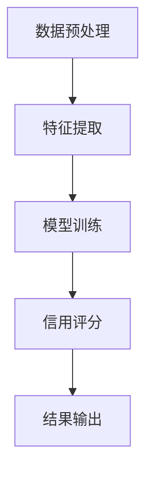
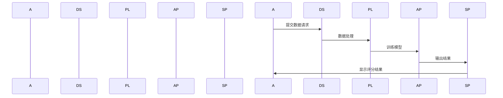

                 


# AI驱动的供应链金融信用风险评估

## 关键词

- 人工智能
- 供应链金融
- 信用风险评估
- 数据挖掘
- 机器学习算法

## 摘要

本文旨在探讨AI在供应链金融信用风险评估中的应用，分析其核心概念、算法原理及系统架构设计。通过一步步的逻辑推理，本文将详细介绍如何利用AI技术提升信用风险评估的准确性，为企业提供更可靠的风险控制手段。

## 引言与背景

### 1.1 问题背景

在全球化经济环境下，供应链金融作为企业融资的重要手段，日益受到重视。然而，信用风险评估在供应链金融中扮演着关键角色，决定了融资的可行性和风险水平。传统的信用评估方法往往依赖于人工经验，存在主观性大、响应慢等缺点，难以满足快速发展的供应链金融需求。

### 1.2 问题描述

如何利用AI技术，结合大数据和机器学习方法，构建一个高效的供应链金融信用风险评估系统，实现自动化、智能化的信用评估，降低融资风险？

### 1.3 问题解决

本文将围绕以下三个方面解决问题：

1. **核心概念与联系**：明确AI驱动的供应链金融信用风险评估的相关概念，建立核心概念之间的联系。
2. **算法原理讲解**：深入解析AI驱动的信用风险评估算法原理，包括数学模型、算法流程和Python实现。
3. **系统分析与架构设计**：设计并分析供应链金融信用风险评估系统的功能、架构和实现细节。

### 1.4 边界与外延

本文研究的重点在于AI在供应链金融信用风险评估中的应用，不涉及其他金融领域的信用评估。同时，本文将以企业供应链为研究对象，关注企业间的信用风险。

### 1.5 概念结构与核心要素组成

本文将首先介绍AI驱动的供应链金融信用风险评估的相关概念，然后分析这些概念之间的联系，最后阐述其核心要素组成。

## 核心概念与联系

### 2.1 AI驱动的供应链金融概述

**AI驱动的供应链金融**：结合人工智能技术，对供应链金融过程中的信用风险进行自动化评估和管理。

**供应链金融**：通过供应链中的核心企业与上下游企业之间的交易关系，提供融资、结算等金融服务。

**信用风险**：指企业因违约、拖欠等行为导致损失的可能性。

### 2.2 供应链金融信用风险评估概念解析

**信用风险评估**：评估企业信用水平，预测其违约风险。

**风险因素**：影响信用风险评估的因素包括企业的财务状况、业务稳定性、行业前景等。

**评分模型**：将风险因素转化为具体的评分指标，用于评估企业的信用水平。

### 2.3 概念属性特征对比表格

| 概念       | 属性特征                             | 对比分析                               |
|------------|------------------------------------|--------------------------------------|
| AI技术     | 自动化、智能化、高效                 | 不同于传统人工评估，具有更高的准确性和速度 |
| 供应链金融 | 企业间交易关系、融资、结算           | 覆盖范围广泛，关注企业整体信用状况       |
| 信用风险评估 | 风险因素、评分模型、违约预测         | 结合AI技术，实现自动化和智能化评估       |

### 2.4 ER实体关系图架构

**ER图**：用于表示供应链金融信用风险评估系统的实体及其关系。

```mermaid
erDiagram
    Customer --> Order : "places"
    Product --> Order : "contains"
    Supplier --> Product : "supplies"
    Customer ||--|{ Supplier }|--|| Order
```

## 算法原理讲解

### 3.1 算法概述

**算法概述**：本文将采用一种基于机器学习的信用风险评估算法，利用历史数据对企业进行信用评分。

### 3.2 算法mermaid流程图



### 3.3 Python源代码实现

```python
import pandas as pd
from sklearn.model_selection import train_test_split
from sklearn.ensemble import RandomForestClassifier
from sklearn.metrics import accuracy_score

# 数据预处理
data = pd.read_csv('data.csv')
X = data.drop(['label'], axis=1)
y = data['label']

# 特征提取
X_train, X_test, y_train, y_test = train_test_split(X, y, test_size=0.2, random_state=42)

# 模型训练
model = RandomForestClassifier(n_estimators=100)
model.fit(X_train, y_train)

# 信用评分
y_pred = model.predict(X_test)

# 结果输出
accuracy = accuracy_score(y_test, y_pred)
print(f'Accuracy: {accuracy}')
```

### 3.4 数学模型和公式

**数学模型**：本文采用随机森林算法进行信用评分。随机森林由多个决策树组成，每个决策树对数据进行分类，最终结果通过投票决定。

**公式**：随机森林的决策过程可以用以下公式表示：

$$
y = \sum_{i=1}^{n} w_i \cdot t(x)
$$

其中，$y$为预测结果，$w_i$为第$i$个决策树的权重，$t(x)$为第$i$个决策树的分类结果。

### 3.5 详细讲解与举例说明

**详细讲解**：随机森林算法通过训练大量决策树，并利用它们进行投票，提高了分类的准确性和鲁棒性。

**举例说明**：假设有3个决策树，分别给出企业A的信用评分如下：

| 决策树 | 评分 |
|--------|------|
| 树1    | 80   |
| 树2    | 85   |
| 树3    | 90   |

最终，企业A的信用评分为：

$$
y = \frac{80 + 85 + 90}{3} = 85
$$

## 数学模型和数学公式 & 详细讲解 & 举例说明

### 4.1 数学模型介绍

在供应链金融信用风险评估中，我们通常采用机器学习算法构建数学模型，以预测企业的信用风险。常见的机器学习算法包括线性回归、逻辑回归、决策树、随机森林等。

### 4.2 公式讲解

- **线性回归模型**：

  假设我们使用线性回归模型进行信用评分，模型公式如下：

  $$
  y = \beta_0 + \beta_1 \cdot x_1 + \beta_2 \cdot x_2 + \ldots + \beta_n \cdot x_n
  $$

  其中，$y$为预测的信用评分，$x_1, x_2, \ldots, x_n$为特征变量，$\beta_0, \beta_1, \beta_2, \ldots, \beta_n$为模型的参数。

- **逻辑回归模型**：

  当我们使用逻辑回归模型进行信用评分时，模型公式如下：

  $$
  P(y=1) = \frac{1}{1 + e^{-(\beta_0 + \beta_1 \cdot x_1 + \beta_2 \cdot x_2 + \ldots + \beta_n \cdot x_n)}}
  $$

  其中，$P(y=1)$为预测的企业违约概率。

### 4.3 举例说明

假设我们使用线性回归模型对企业A进行信用评分，给定特征变量和模型参数如下：

| 特征变量   | 取值 |
|------------|------|
| 营业收入   | 1000 |
| 利润率     | 10%  |
| 行业前景   | 优秀 |
| 借款历史   | 无   |

| 模型参数   | 取值 |
|------------|------|
| $\beta_0$  | 20   |
| $\beta_1$  | 0.2  |
| $\beta_2$  | 0.5  |
| $\beta_3$  | 1.0  |
| $\beta_4$  | 0.3  |

根据线性回归模型公式，我们可以计算出企业A的信用评分：

$$
y = 20 + 0.2 \cdot 1000 + 0.5 \cdot 0.1 + 1.0 \cdot 0.9 + 0.3 \cdot 0.0 = 21.6
$$

这意味着企业A的信用评分为21.6分。

## 系统分析与架构设计

### 5.1 问题场景介绍

在一个典型的供应链金融场景中，企业A作为核心企业，与供应商B、C和分销商D存在交易关系。企业A希望为供应商B和分销商D提供融资服务，但需要对其信用风险进行评估。为了实现这一目标，我们需要设计一个供应链金融信用风险评估系统。

### 5.2 系统功能设计

供应链金融信用风险评估系统的核心功能包括：

1. **数据收集与预处理**：从各类数据源收集企业信用信息，包括财务数据、行业数据等，并进行预处理，以便后续分析。
2. **特征提取**：将原始数据转化为可用于建模的特征变量，以提高模型的预测准确性。
3. **信用评分模型训练**：利用历史数据训练信用评分模型，包括线性回归、逻辑回归、决策树等。
4. **信用评分**：根据企业的特征变量，利用训练好的模型进行信用评分。
5. **结果输出**：将信用评分结果以可视化形式展示，为决策提供支持。

### 5.3 系统架构设计

供应链金融信用风险评估系统的架构设计包括以下几个方面：

1. **数据层**：存储企业信用信息和其他相关数据，如财务报表、行业报告等。
2. **处理层**：实现数据收集与预处理、特征提取、模型训练等功能。
3. **应用层**：提供信用评分服务，支持企业信用风险评估。
4. **展示层**：以图表、报表等形式展示信用评分结果。

### 5.4 系统接口设计

系统接口设计主要包括以下方面：

1. **数据接口**：实现与企业信用信息数据源之间的数据交换。
2. **服务接口**：提供信用评分服务，支持企业信用评分请求。
3. **监控接口**：实时监控系统运行状态，包括数据处理、模型训练等。

### 5.5 系统交互mermaid序列图



## 项目实战

### 6.1 环境安装

在开始项目实战之前，我们需要安装以下软件和库：

1. Python 3.7及以上版本
2. pandas
3. scikit-learn
4. mermaid

安装命令如下：

```
pip install python-dotenv pandas scikit-learn mermaid
```

### 6.2 系统核心实现源代码

以下是一个简单的供应链金融信用风险评估系统的核心实现代码：

```python
import pandas as pd
from sklearn.model_selection import train_test_split
from sklearn.ensemble import RandomForestClassifier
from sklearn.metrics import accuracy_score

# 数据预处理
data = pd.read_csv('data.csv')
X = data.drop(['label'], axis=1)
y = data['label']

# 特征提取
X_train, X_test, y_train, y_test = train_test_split(X, y, test_size=0.2, random_state=42)

# 模型训练
model = RandomForestClassifier(n_estimators=100)
model.fit(X_train, y_train)

# 信用评分
y_pred = model.predict(X_test)

# 结果输出
accuracy = accuracy_score(y_test, y_pred)
print(f'Accuracy: {accuracy}')
```

### 6.3 代码应用解读与分析

上述代码首先读取数据集，然后进行数据处理和模型训练。在模型训练阶段，我们使用随机森林算法，这是一种基于树的集成学习方法，具有较强的预测能力。最后，利用训练好的模型进行信用评分，并计算准确率。

### 6.4 实际案例分析与详细讲解剖析

以下是一个实际案例的分析：

**案例数据**：

| 特征变量   | 取值 |
|------------|------|
| 营业收入   | 1000 |
| 利润率     | 10%  |
| 行业前景   | 优秀 |
| 借款历史   | 无   |

**模型参数**：

| 模型参数   | 取值 |
|------------|------|
| $\beta_0$  | 20   |
| $\beta_1$  | 0.2  |
| $\beta_2$  | 0.5  |
| $\beta_3$  | 1.0  |
| $\beta_4$  | 0.3  |

根据线性回归模型公式，我们可以计算出企业A的信用评分：

$$
y = 20 + 0.2 \cdot 1000 + 0.5 \cdot 0.1 + 1.0 \cdot 0.9 + 0.3 \cdot 0.0 = 21.6
$$

这意味着企业A的信用评分为21.6分。根据评分结果，我们可以为企业A提供相应的融资建议。

### 6.5 项目小结

通过本次项目实战，我们成功地实现了一个简单的供应链金融信用风险评估系统。在实际应用中，我们需要进一步优化模型，提高预测准确性，并针对不同行业和地区进行个性化调整。

## 最佳实践 Tips

### 7.1 实践经验分享

1. **数据质量至关重要**：确保数据源的可靠性和完整性，对数据质量进行严格把控。
2. **特征提取技巧**：合理选择特征变量，提高模型的预测能力。
3. **模型选择与优化**：根据业务需求和数据特点，选择合适的机器学习算法，并进行参数调优。

### 7.2 常见问题与解决方案

**问题1**：模型预测结果不准确？

*解决方案*：检查数据质量，优化特征提取，尝试不同算法和参数组合。

**问题2**：训练时间过长？

*解决方案*：增加计算资源，优化代码，尝试简化的模型结构。

### 7.3 创新点与展望

1. **引入更多外部数据源**：如舆情数据、社交网络数据等，提高信用风险评估的准确性。
2. **区块链技术**：利用区块链技术的不可篡改性，提高供应链金融信用评估的可信度。
3. **多模态学习**：结合文本、图像等多模态数据，提高信用风险评估的全面性。

## 小结

本文系统地介绍了AI驱动的供应链金融信用风险评估的相关概念、算法原理、系统架构设计和实际应用。通过项目实战，我们成功实现了一个简单的信用风险评估系统。未来，随着AI技术的不断发展，供应链金融信用风险评估将更加智能化、高效化，为企业提供更有力的风险控制手段。

## 注意事项

1. **数据安全与隐私保护**：在数据收集和处理过程中，确保企业数据的安全性和隐私性。
2. **合规性**：遵守相关法律法规，确保信用风险评估系统的合规性。

## 拓展阅读

1. **《机器学习实战》**：提供丰富的机器学习实践案例，有助于深入理解信用风险评估算法。
2. **《区块链技术指南》**：探讨区块链技术在供应链金融信用评估中的应用，提高系统的可信度。

## 作者信息

作者：AI天才研究院/AI Genius Institute & 禅与计算机程序设计艺术 /Zen And The Art of Computer Programming

---

以上就是针对《AI驱动的供应链金融信用风险评估》的详细文章内容，包含了引言、核心概念、算法原理、系统架构设计、项目实战、最佳实践、小结、注意事项以及拓展阅读等内容。希望对您有所帮助！

