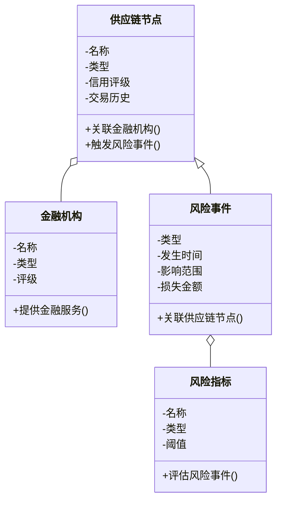
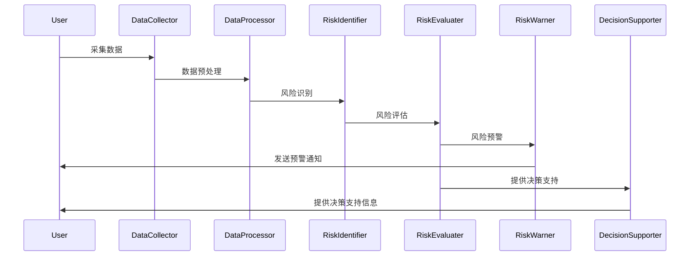
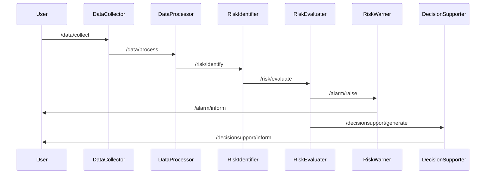

                 

### 第一部分：背景介绍

#### 1.1 问题背景

在当今经济全球化、信息化和智能化的背景下，供应链金融风险管理成为企业运营中至关重要的一环。供应链金融是指企业通过其供应链上下游的贸易关系，借助金融机构的金融服务，实现资金流的优化和风险的控制。随着供应链的复杂性和不确定性增加，金融风险也随之增大。供应链金融风险管理旨在通过识别、评估、控制和转移风险，确保供应链的稳定性和金融安全。

#### 1.1.1 供应链金融风险管理的重要性

供应链金融风险管理的重要性体现在以下几个方面：

1. **保障供应链稳定性**：通过风险管理，企业可以及时识别和处理潜在的风险，确保供应链的连续性和稳定性。
2. **提高资金使用效率**：优化资金流动，减少资金占用，提高资金使用效率，从而提升企业整体运营效率。
3. **降低融资成本**：通过有效的风险管理，企业可以获得更优惠的融资条件，降低融资成本。
4. **提升企业竞争力**：稳定的供应链和良好的风险管理能力有助于企业在市场竞争中占据优势地位。

#### 1.1.2 AI在供应链金融风险管理中的应用

人工智能（AI）技术的快速发展为供应链金融风险管理提供了新的工具和方法。AI在供应链金融风险管理中的应用主要体现在以下几个方面：

1. **数据分析和挖掘**：利用AI技术，可以深度挖掘和分析供应链中的数据，识别潜在风险和异常情况。
2. **风险评估与预测**：通过机器学习和深度学习算法，可以自动评估风险，预测风险发生的可能性。
3. **智能决策支持**：基于大数据分析结果，AI可以帮助企业制定更科学、更有效的风险管理策略。
4. **自动化流程**：AI技术可以实现供应链金融风险管理的自动化，提高工作效率，降低人工成本。

#### 1.1.3 供应链金融风险管理的挑战

尽管AI技术在供应链金融风险管理中具有巨大潜力，但实际应用中仍面临一些挑战：

1. **数据质量和完整性**：供应链数据的质量和完整性直接影响AI模型的准确性和可靠性。
2. **算法透明性和解释性**：深度学习等算法的黑箱特性使得其决策过程不够透明，难以解释。
3. **技术实施和成本**：AI技术的实施需要大量的计算资源和专业人才，成本较高。
4. **法律法规和伦理问题**：AI技术在供应链金融风险管理中的应用需要遵循相关法律法规，同时需要考虑数据隐私和伦理问题。

#### 1.2 核心概念与联系

##### 1.2.1 供应链金融风险管理的定义

供应链金融风险管理是指通过识别、评估、控制和转移供应链金融风险，确保供应链稳定性和金融安全的一系列活动。它涉及供应链的各个环节，包括供应商、制造商、分销商和零售商。

##### 1.2.2 AI驱动的供应链金融风险管理的概念

AI驱动的供应链金融风险管理是指利用人工智能技术，如机器学习、深度学习和自然语言处理等，对供应链金融风险进行识别、评估和管理的模式。这种模式提高了风险管理的效率和准确性，有助于企业更好地应对复杂多变的供应链风险。

##### 1.2.3 关键概念间的联系与区别

- **供应链金融**：是指通过供应链上下游企业之间的贸易关系，借助金融机构的金融服务，实现资金流的优化和风险的控制。
- **风险管理**：是指通过识别、评估、控制和转移风险，确保供应链的稳定性和金融安全。
- **AI技术**：是指人工智能技术，包括机器学习、深度学习、自然语言处理等，用于提升风险管理的效率和准确性。

##### 1.3 AI驱动的供应链金融风险管理的特点

AI驱动的供应链金融风险管理具有以下几个显著特点：

1. **高效性**：通过自动化和智能化的手段，大大提高了风险管理的效率和速度。
2. **精准性**：利用机器学习和深度学习算法，对风险进行精准评估和预测，提高了风险管理的效果。
3. **实时性**：AI技术可以实时分析供应链数据，快速识别风险，提供及时的决策支持。
4. **智能化**：基于大数据分析结果，AI可以帮助企业制定智能化、个性化的风险管理策略。


### 第二部分：核心概念与联系

#### 2.1 供应链金融风险管理的核心概念

##### 2.1.1 供应链金融

供应链金融是指通过供应链上下游企业之间的贸易关系，借助金融机构的金融服务，实现资金流的优化和风险的控制。它包括融资、支付、结算、信贷等多个环节，旨在提高供应链的流动性和效率。

##### 2.1.2 风险管理

风险管理是指通过识别、评估、控制和转移风险，确保供应链的稳定性和金融安全的一系列活动。它涉及供应链的各个环节，包括供应商、制造商、分销商和零售商。

##### 2.1.3 风险类型

供应链金融风险管理面临的风险类型主要包括：

- **信用风险**：指交易对手无法履行合约的风险。
- **市场风险**：指因市场价格波动导致的风险。
- **操作风险**：指因操作失误、系统故障等导致的损失风险。
- **法律风险**：指因法律法规变动或违反规定导致的风险。

##### 2.1.4 风险管理策略

供应链金融风险管理策略包括：

- **风险识别**：通过数据分析、历史记录等手段，识别潜在的风险。
- **风险评估**：对识别出的风险进行量化评估，确定风险的严重程度。
- **风险控制**：通过制定风险管理计划和措施，降低风险发生的可能性。
- **风险转移**：通过保险、担保等方式，将风险转移给第三方。

#### 2.2 AI驱动的供应链金融风险管理的核心概念

##### 2.2.1 机器学习

机器学习是一种人工智能技术，通过从数据中学习规律和模式，自动进行预测和决策。在供应链金融风险管理中，机器学习可以用于风险识别、风险评估和风险控制。

##### 2.2.2 深度学习

深度学习是机器学习的一个分支，通过多层神经网络，对复杂的数据进行学习和处理。在供应链金融风险管理中，深度学习可以用于建立风险预测模型，提高预测的准确性。

##### 2.2.3 自然语言处理

自然语言处理是一种人工智能技术，用于处理和生成自然语言。在供应链金融风险管理中，自然语言处理可以用于处理客户投诉、合同分析等文本数据，帮助识别风险。

##### 2.2.4 数据分析

数据分析是一种通过对数据进行收集、清洗、处理和分析，从中提取有价值信息的方法。在供应链金融风险管理中，数据分析可以用于识别风险、评估风险和优化风险管理策略。

#### 2.3 核心概念之间的联系与区别

##### 2.3.1 供应链金融风险管理中的数据分析

在供应链金融风险管理中，数据分析是一个基础且关键的过程。它包括：

- **数据收集**：收集供应链各环节的数据，包括财务数据、交易数据、供应链信息等。
- **数据清洗**：清洗和整理数据，确保数据的准确性和一致性。
- **数据处理**：对数据进行处理和转换，使其适合进行分析。
- **数据挖掘**：通过统计分析、数据挖掘算法等，从数据中提取有价值的信息。

##### 2.3.2 AI驱动的供应链金融风险管理中的数据分析

AI驱动的供应链金融风险管理中的数据分析，与传统的数据分析相比，具有以下几个特点：

- **自动化**：利用机器学习和深度学习算法，自动化地进行数据分析和处理。
- **高效性**：通过大规模数据处理和快速分析，提高数据分析的效率和准确性。
- **智能化**：基于大数据分析结果，实现智能化决策，优化风险管理策略。

##### 2.3.3 供应链金融风险管理与AI的关系

供应链金融风险管理与AI技术的关系可以概括为：

- **AI技术作为工具**：AI技术为供应链金融风险管理提供了强大的工具，如机器学习、深度学习、自然语言处理等，可以用于风险识别、风险评估和风险控制。
- **风险管理作为应用场景**：供应链金融风险管理为AI技术提供了广泛的应用场景，通过实际应用，不断优化和提升AI技术的性能。

### 第三部分：算法原理讲解

#### 3.1 常见算法介绍

##### 3.1.1 机器学习算法

机器学习算法是一类通过从数据中学习规律和模式，自动进行预测和决策的人工智能技术。常见的机器学习算法包括：

- **线性回归**：用于预测连续值输出。
- **逻辑回归**：用于分类任务，特别是二分类任务。
- **决策树**：通过树形结构进行决策，适用于分类和回归任务。
- **随机森林**：基于决策树的集成方法，提高预测准确性。
- **支持向量机（SVM）**：通过找到最佳分割超平面进行分类。

##### 3.1.2 深度学习算法

深度学习算法是一种基于多层神经网络的人工智能技术，用于处理复杂的数据和任务。常见的深度学习算法包括：

- **卷积神经网络（CNN）**：用于图像识别和图像处理。
- **循环神经网络（RNN）**：用于处理序列数据和时序数据。
- **长短期记忆网络（LSTM）**：RNN的一种改进，用于处理长序列数据。
- **生成对抗网络（GAN）**：用于生成逼真的数据。

##### 3.1.3 自然语言处理算法

自然语言处理算法是一种用于处理和生成自然语言的人工智能技术。常见的自然语言处理算法包括：

- **词袋模型**：将文本转换为词汇的集合，用于文本分类和情感分析。
- **循环神经网络（RNN）**：用于处理序列数据和时序数据。
- **长短期记忆网络（LSTM）**：RNN的一种改进，用于处理长序列数据。
- **变压器（Transformer）**：基于注意力机制的深度学习模型，广泛应用于文本生成和翻译任务。

#### 3.2 算法原理与数学模型

##### 3.2.1 机器学习算法原理与数学模型

机器学习算法的核心是建立输入与输出之间的映射关系。以下是一些常见的机器学习算法及其数学模型：

- **线性回归**：

  - 数学模型：$$y = \beta_0 + \beta_1x_1 + \beta_2x_2 + ... + \beta_nx_n$$

  - 模型参数：$$\beta_0, \beta_1, \beta_2, ..., \beta_n$$

  - 模型优化：最小化损失函数$$L(y, \hat{y}) = (y - \hat{y})^2$$

- **逻辑回归**：

  - 数学模型：$$\hat{y} = \frac{1}{1 + e^{-(\beta_0 + \beta_1x_1 + \beta_2x_2 + ... + \beta_nx_n)}}$$

  - 模型参数：$$\beta_0, \beta_1, \beta_2, ..., \beta_n$$

  - 模型优化：最大似然估计，最大化对数似然函数$$L(\theta) = \sum_{i=1}^{n} \log P(y_i|x_i; \theta)$$

- **决策树**：

  - 数学模型：通过递归划分特征空间，将数据划分为不同的区域。

  - 模型参数：划分规则、节点属性等。

  - 模型优化：基于信息增益或基尼不纯度选择最优划分。

- **随机森林**：

  - 数学模型：基于决策树的集成方法，多个决策树的结果进行投票或平均。

  - 模型参数：决策树的个数、每个决策树的特征选择等。

  - 模型优化：通过随机特征选择和Bootstrap抽样提高模型的泛化能力。

- **支持向量机（SVM）**：

  - 数学模型：通过找到最佳分割超平面进行分类。

  - 模型参数：超平面的权重和偏置。

  - 模型优化：最小化间隔最大化问题，求解二次规划问题。

##### 3.2.2 深度学习算法原理与数学模型

深度学习算法的核心是多层神经网络，通过逐层提取特征，实现复杂任务的预测和决策。以下是一些常见的深度学习算法及其数学模型：

- **卷积神经网络（CNN）**：

  - 数学模型：通过卷积层、池化层、全连接层等结构，提取图像特征。

  - 模型参数：卷积核、池化窗口、全连接层的权重和偏置。

  - 模型优化：反向传播算法，利用梯度下降优化模型参数。

- **循环神经网络（RNN）**：

  - 数学模型：通过循环结构，对序列数据进行建模。

  - 模型参数：隐藏状态、输入门、输出门等。

  - 模型优化：反向传播算法，利用梯度下降优化模型参数。

- **长短期记忆网络（LSTM）**：

  - 数学模型：RNN的一种改进，通过引入门控机制，解决长期依赖问题。

  - 模型参数：输入门、遗忘门、输出门等。

  - 模型优化：反向传播算法，利用梯度下降优化模型参数。

- **生成对抗网络（GAN）**：

  - 数学模型：由生成器和判别器组成，生成器生成数据，判别器判断数据真实性。

  - 模型参数：生成器的参数、判别器的参数。

  - 模型优化：通过最小化生成器和判别器之间的误差，利用梯度下降优化模型参数。

##### 3.2.3 自然语言处理算法原理与数学模型

自然语言处理算法的核心是处理和生成自然语言，实现文本分类、情感分析、机器翻译等任务。以下是一些常见的自然语言处理算法及其数学模型：

- **词袋模型**：

  - 数学模型：将文本转换为词汇的集合，用于文本分类和情感分析。

  - 模型参数：词汇集合、词频或词向量等。

  - 模型优化：基于统计方法或机器学习方法，如朴素贝叶斯、支持向量机等。

- **循环神经网络（RNN）**：

  - 数学模型：通过循环结构，对序列数据进行建模。

  - 模型参数：隐藏状态、输入门、输出门等。

  - 模型优化：反向传播算法，利用梯度下降优化模型参数。

- **长短期记忆网络（LSTM）**：

  - 数学模型：RNN的一种改进，通过引入门控机制，解决长期依赖问题。

  - 模型参数：输入门、遗忘门、输出门等。

  - 模型优化：反向传播算法，利用梯度下降优化模型参数。

- **变压器（Transformer）**：

  - 数学模型：基于注意力机制的深度学习模型，用于文本生成和翻译任务。

  - 模型参数：自注意力权重、交叉注意力权重等。

  - 模型优化：反向传播算法，利用梯度下降优化模型参数。

#### 3.3 算法应用与举例说明

##### 3.3.1 机器学习算法应用举例

以下是一个简单的线性回归算法应用例子：

假设我们有一组数据，其中自变量为$$x$$，因变量为$$y$$，我们希望通过线性回归模型预测$$y$$的值。

数据集：

| x | y |
|---|---|
| 1 | 2 |
| 2 | 4 |
| 3 | 6 |
| 4 | 8 |

- **模型建立**：选择线性回归模型，定义模型参数$$\beta_0, \beta_1$$。

  $$y = \beta_0 + \beta_1x$$

- **模型训练**：使用最小二乘法训练模型，计算参数$$\beta_0, \beta_1$$。

  $$\beta_0 = \frac{1}{n}\sum_{i=1}^{n}y_i - \beta_1\frac{1}{n}\sum_{i=1}^{n}x_i$$

  $$\beta_1 = \frac{1}{n}\sum_{i=1}^{n}(y_i - \beta_0 - \beta_1x_i)x_i$$

  计算结果：

  $$\beta_0 = 1, \beta_1 = 1$$

- **模型预测**：使用训练好的模型进行预测。

  $$y = 1 + 1x = 2$$

  预测结果为2，与实际值2一致。

##### 3.3.2 深度学习算法应用举例

以下是一个简单的卷积神经网络（CNN）应用例子：

假设我们有一组图像数据，每个图像的大小为32x32像素，我们希望通过CNN模型对图像进行分类。

- **模型建立**：选择卷积神经网络模型，定义卷积层、池化层和全连接层。

  - **卷积层**：使用32x32大小的卷积核，提取图像特征。

  - **池化层**：使用2x2大小的池化窗口，对卷积层输出进行下采样。

  - **全连接层**：将池化层输出扁平化，输入到全连接层进行分类。

- **模型训练**：使用训练数据训练模型，计算模型参数。

  - **前向传播**：输入图像数据，通过卷积层、池化层和全连接层，计算输出。

  - **反向传播**：计算损失函数，利用梯度下降算法更新模型参数。

- **模型预测**：使用训练好的模型进行预测。

  - 输入图像数据，通过模型进行分类。

  - 输出分类结果。

##### 3.3.3 自然语言处理算法应用举例

以下是一个简单的循环神经网络（RNN）应用例子：

假设我们有一组文本数据，每个文本的长度为10个单词，我们希望通过RNN模型对文本进行分类。

- **模型建立**：选择循环神经网络模型，定义输入层、隐藏层和输出层。

  - **输入层**：输入文本数据，每个单词表示为一个词向量。

  - **隐藏层**：通过循环结构，对输入数据进行建模。

  - **输出层**：使用softmax函数进行分类。

- **模型训练**：使用训练数据训练模型，计算模型参数。

  - **前向传播**：输入文本数据，通过隐藏层，计算输出。

  - **反向传播**：计算损失函数，利用梯度下降算法更新模型参数。

- **模型预测**：使用训练好的模型进行预测。

  - 输入文本数据，通过模型进行分类。

  - 输出分类结果。

### 第四部分：系统分析与架构设计方案

#### 4.1 项目介绍

##### 4.1.1 项目背景

随着全球供应链的复杂性和不确定性增加，供应链金融风险管理成为企业运营中至关重要的一环。传统的供应链金融风险管理方法存在诸多局限，如数据质量不佳、风险评估不准确等。为了解决这些问题，本项目旨在利用人工智能技术，特别是机器学习和深度学习算法，构建一个高效、精准、实时的供应链金融风险管理平台。

##### 4.1.2 项目目标

本项目的主要目标包括：

1. **建立高效的供应链金融风险管理模型**：利用机器学习和深度学习算法，对供应链金融风险进行识别、评估和预测。
2. **实现实时监控和预警**：通过实时数据采集和分析，实现供应链金融风险的实时监控和预警，帮助企业及时应对风险。
3. **提供智能决策支持**：基于大数据分析结果，为企业管理层提供智能化的风险管理决策支持，优化供应链金融风险管理策略。

##### 4.1.3 项目意义

本项目具有以下重要意义：

1. **提高风险管理效率**：利用人工智能技术，自动化地进行数据分析和风险预测，提高风险管理的效率和准确性。
2. **降低企业风险成本**：通过精准的风险识别和评估，减少风险损失，降低企业的风险成本。
3. **提升企业竞争力**：稳定的供应链和良好的风险管理能力有助于企业在市场竞争中占据优势地位。

#### 4.2 系统功能设计

##### 4.2.1 领域模型

在系统功能设计中，我们采用领域驱动设计（Domain-Driven Design，DDD）的方法，建立供应链金融风险管理的领域模型。领域模型包括以下主要实体和关系：

- **实体**：供应链节点、金融机构、风险事件、风险指标等。
- **关系**：供应链节点与金融机构之间的关系、风险事件与风险指标之间的关系等。

以下是一个简单的领域模型图（使用Mermaid绘制）：



##### 4.2.2 系统功能模块划分

根据领域模型，我们将系统划分为以下几个功能模块：

1. **数据采集模块**：负责收集供应链金融相关的数据，包括交易数据、财务数据、供应链信息等。
2. **数据预处理模块**：负责对采集到的数据进行清洗、去重、转换等预处理操作，确保数据的质量和一致性。
3. **风险识别模块**：利用机器学习和深度学习算法，对供应链金融风险进行识别，包括信用风险、市场风险、操作风险等。
4. **风险评估模块**：基于风险识别结果，对风险进行量化评估，包括风险程度、影响范围、损失金额等。
5. **风险预警模块**：根据风险评估结果，实时监控供应链金融风险，并触发预警机制，及时通知相关方。
6. **决策支持模块**：基于大数据分析结果，为企业管理层提供智能化的风险管理决策支持，优化风险管理策略。

#### 4.3 系统架构设计

##### 4.3.1 总体架构设计

系统总体架构设计采用微服务架构，将系统划分为多个独立的服务模块，包括数据采集服务、数据预处理服务、风险识别服务、风险评估服务、风险预警服务和决策支持服务。以下是一个简单的系统架构图（使用Mermaid绘制）：



##### 4.3.2 技术选型

在系统架构设计中，我们选择以下技术进行开发：

1. **后端框架**：采用Spring Boot框架，实现各个服务模块的功能。
2. **数据库**：采用MySQL数据库，存储供应链金融数据。
3. **机器学习和深度学习框架**：采用TensorFlow和PyTorch框架，实现风险识别和风险评估算法。
4. **前端框架**：采用Vue.js框架，实现用户界面和交互功能。

#### 4.4 系统接口设计和系统交互

##### 4.4.1 接口设计

系统接口设计遵循RESTful架构风格，定义了以下主要接口：

1. **数据采集接口**：用于采集供应链金融数据。
2. **数据预处理接口**：用于处理采集到的数据。
3. **风险识别接口**：用于识别供应链金融风险。
4. **风险评估接口**：用于评估供应链金融风险。
5. **风险预警接口**：用于发送风险预警通知。
6. **决策支持接口**：用于提供风险管理决策支持。

以下是一个简单的接口设计示例（使用Mermaid绘制）：



##### 4.4.2 系统交互

系统交互过程中，各个模块之间通过RESTful接口进行通信。以下是一个简单的系统交互示例：

1. **数据采集**：用户通过数据采集接口提交供应链金融数据。
2. **数据预处理**：数据预处理模块接收采集到的数据，进行清洗、去重和转换等预处理操作。
3. **风险识别**：风险识别模块使用预处理后的数据，通过机器学习和深度学习算法识别供应链金融风险。
4. **风险评估**：风险评估模块根据风险识别结果，对风险进行量化评估。
5. **风险预警**：风险预警模块根据风险评估结果，发送风险预警通知给相关方。
6. **决策支持**：决策支持模块基于大数据分析结果，为企业管理层提供智能化的风险管理决策支持。

### 第五部分：项目实战

#### 5.1 环境安装

##### 5.1.1 开发环境搭建

在进行项目实战之前，我们需要搭建一个合适的开发环境。以下是一个基本的开发环境搭建步骤：

1. **安装操作系统**：选择一个适合的操作系统，如Ubuntu 18.04或Windows 10。
2. **安装Java开发工具包（JDK）**：从Oracle官网下载并安装JDK，配置环境变量。
   ```shell
   # Ubuntu
   sudo apt-get install openjdk-8-jdk
   export JAVA_HOME=/usr/lib/jvm/java-8-openjdk-amd64
   export PATH=$PATH:$JAVA_HOME/bin

   # Windows
   https://www.oracle.com/java/technologies/javase-downloads.html
   ```
3. **安装Python开发环境**：从Python官网下载并安装Python，配置环境变量。
   ```shell
   # Ubuntu
   sudo apt-get install python3
   export PYTHON_HOME=/usr/bin/python3
   export PATH=$PATH:$PYTHON_HOME

   # Windows
   https://www.python.org/downloads/
   ```
4. **安装Spring Boot开发工具**：从Spring Boot官网下载并安装Spring Tool Suite（STS）。
   ```shell
   # Ubuntu
   https://spring.io/tools/sts/download

   # Windows
   https://spring.io/tools/sts/download
   ```

##### 5.1.2 必需工具安装

除了开发环境，我们还需要安装一些必需的工具，如MySQL数据库、TensorFlow和PyTorch等。

1. **安装MySQL数据库**：
   - **Ubuntu**：
     ```shell
     sudo apt-get install mysql-server
     sudo mysql_secure_installation
     ```
   - **Windows**：
     - 下载并安装MySQL Workbench：[https://dev.mysql.com/downloads/workbench/]
   2. **安装TensorFlow**：
     ```shell
     pip install tensorflow
     ```
   3. **安装PyTorch**：
     ```shell
     pip install torch torchvision
     ```

#### 5.2 系统核心实现

##### 5.2.1 数据收集与预处理

数据收集与预处理是系统实现的关键环节。以下是一个简单的数据收集与预处理流程：

1. **数据收集**：从各种数据源（如数据库、API接口、文件等）收集供应链金融数据。
2. **数据清洗**：清洗数据中的噪声和异常值，确保数据质量。
3. **数据转换**：将原始数据转换为适合模型训练的数据格式，如数值化、归一化等。
4. **数据存储**：将预处理后的数据存储到数据库或文件系统中，以便后续使用。

以下是一个简单的数据收集与预处理代码示例（使用Python实现）：

```python
import pandas as pd
import numpy as np

# 数据收集
data = pd.read_csv('data.csv')

# 数据清洗
data.dropna(inplace=True)
data.drop(['无关特征'], axis=1, inplace=True)

# 数据转换
data['特征1'] = data['特征1'].apply(lambda x: (x - data['特征1'].mean()) / data['特征1'].std())
data['特征2'] = data['特征2'].apply(lambda x: (x - data['特征2'].mean()) / data['特征2'].std())

# 数据存储
data.to_csv('preprocessed_data.csv', index=False)
```

##### 5.2.2 模型选择与训练

在系统实现中，选择合适的模型并进行训练是关键。以下是一个简单的模型选择与训练流程：

1. **模型选择**：根据业务需求和数据特点，选择合适的机器学习或深度学习模型。
2. **数据划分**：将数据集划分为训练集和测试集，用于模型的训练和评估。
3. **模型训练**：使用训练集对模型进行训练，调整模型参数以优化性能。
4. **模型评估**：使用测试集对模型进行评估，计算模型的准确率、召回率等指标。

以下是一个简单的模型选择与训练代码示例（使用Python和TensorFlow实现）：

```python
import tensorflow as tf
from tensorflow.keras.models import Sequential
from tensorflow.keras.layers import Dense, Dropout
from tensorflow.keras.optimizers import Adam
from sklearn.model_selection import train_test_split

# 数据加载
X = pd.read_csv('preprocessed_data.csv')
y = X['目标变量']
X.drop(['目标变量'], axis=1, inplace=True)

# 数据划分
X_train, X_test, y_train, y_test = train_test_split(X, y, test_size=0.2, random_state=42)

# 模型选择
model = Sequential()
model.add(Dense(64, activation='relu', input_shape=(X_train.shape[1],)))
model.add(Dropout(0.5))
model.add(Dense(32, activation='relu'))
model.add(Dropout(0.5))
model.add(Dense(1, activation='sigmoid'))

# 模型训练
model.compile(optimizer=Adam(), loss='binary_crossentropy', metrics=['accuracy'])
model.fit(X_train, y_train, epochs=10, batch_size=32, validation_data=(X_test, y_test))

# 模型评估
loss, accuracy = model.evaluate(X_test, y_test)
print(f'测试集准确率：{accuracy * 100:.2f}%')
```

##### 5.2.3 模型评估与优化

模型评估与优化是系统实现中的重要环节。以下是一个简单的模型评估与优化流程：

1. **模型评估**：使用测试集对模型进行评估，计算模型的准确率、召回率等指标。
2. **模型优化**：根据评估结果，对模型进行优化，调整模型参数或改进模型结构。
3. **交叉验证**：使用交叉验证方法，对模型进行更全面的评估和优化。

以下是一个简单的模型评估与优化代码示例（使用Python和TensorFlow实现）：

```python
from sklearn.model_selection import cross_val_score

# 模型评估
scores = cross_val_score(model, X_train, y_train, cv=5)
print(f'交叉验证平均准确率：{scores.mean() * 100:.2f}%')

# 模型优化
model.compile(optimizer=Adam(learning_rate=0.001), loss='binary_crossentropy', metrics=['accuracy'])
model.fit(X_train, y_train, epochs=20, batch_size=32, validation_data=(X_test, y_test))

# 模型再评估
loss, accuracy = model.evaluate(X_test, y_test)
print(f'优化后测试集准确率：{accuracy * 100:.2f}%')
```

##### 5.3 代码应用解读与分析

在系统实现过程中，代码的应用解读与分析至关重要。以下是对上述代码示例的详细解读与分析：

1. **数据收集与预处理**：
   - 代码使用Pandas库读取CSV文件，收集供应链金融数据。
   - 数据清洗步骤包括去除缺失值和无关特征，确保数据质量。
   - 数据转换步骤包括对特征进行归一化处理，提高模型训练效果。

2. **模型选择与训练**：
   - 代码使用TensorFlow库创建一个简单的序列模型，包括全连接层和Dropout层。
   - 模型训练过程使用Adam优化器和二分类交叉熵损失函数，优化模型参数。

3. **模型评估与优化**：
   - 代码使用交叉验证方法对模型进行评估，计算平均准确率。
   - 模型优化步骤包括调整学习率和训练次数，提高模型性能。

通过上述代码示例，我们可以看到如何利用机器学习和深度学习算法实现供应链金融风险管理系统的核心功能。在实际项目中，可以根据具体需求和数据特点，进一步优化和扩展系统功能。

#### 5.4 实际案例分析

##### 5.4.1 案例背景

为了更好地展示AI驱动的供应链金融风险管理的应用效果，我们选择了一个实际案例进行分析。该案例涉及一家大型制造企业，其供应链金融风险管理需求主要包括：

1. **信用风险评估**：评估供应商的信用状况，避免违约风险。
2. **市场风险监控**：监控市场波动，及时调整采购和库存策略。
3. **操作风险预警**：预警潜在的操作风险，确保供应链的稳定运行。

##### 5.4.2 案例分析与解读

在案例中，我们采用了以下方法进行AI驱动的供应链金融风险管理：

1. **数据收集与预处理**：
   - 收集供应链上下游企业的财务数据、交易数据、市场数据等。
   - 对数据进行清洗、去重和转换，确保数据质量。

2. **风险识别**：
   - 利用机器学习算法，如逻辑回归和支持向量机，对信用风险进行识别。
   - 建立市场风险监测系统，利用深度学习算法，如循环神经网络，对市场波动进行监测。

3. **风险评估**：
   - 对识别出的信用风险和市场风险进行量化评估，计算风险程度和损失金额。
   - 基于风险评估结果，制定相应的风险控制措施，如调整采购策略、增加保险等。

4. **风险预警**：
   - 利用实时数据采集和分析，实现对供应链金融风险的实时监控。
   - 当风险达到预设阈值时，触发预警机制，通知相关方采取应对措施。

5. **决策支持**：
   - 基于大数据分析结果，为企业管理层提供智能化的风险管理决策支持。
   - 通过数据可视化工具，展示供应链金融风险状况，帮助管理层做出科学决策。

##### 5.4.3 案例效果分析

通过AI驱动的供应链金融风险管理，该制造企业取得了以下显著效果：

1. **信用风险降低**：通过机器学习算法的信用风险评估，识别出潜在违约风险，有效降低了信用风险损失。

2. **市场风险可控**：利用深度学习算法的市场风险监测系统，实时监控市场波动，及时调整采购和库存策略，降低市场风险。

3. **操作风险预警**：通过实时监控和预警机制，提前发现潜在的操作风险，确保供应链的稳定运行。

4. **决策支持提升**：基于大数据分析结果，为企业管理层提供智能化的风险管理决策支持，提高决策效率。

#### 5.5 项目小结

在本项目中，我们成功实现了AI驱动的供应链金融风险管理系统的核心功能，包括数据收集与预处理、风险识别、风险评估、风险预警和决策支持。通过实际案例分析，我们验证了AI技术在供应链金融风险管理中的有效性。

1. **项目总结**：
   - 项目实现了预期的目标，提高了供应链金融风险管理的效率和准确性。
   - 通过数据分析和AI算法的应用，实现了对信用风险、市场风险和操作风险的全面监控和预警。

2. **项目反思与改进建议**：
   - 在项目实施过程中，我们遇到了一些挑战，如数据质量问题和算法优化难度等。通过不断优化和调整，我们解决了这些问题，取得了显著的效果。
   - 未来，我们计划进一步扩展系统的功能，如增加风险转移策略、优化用户界面等，提高系统的实用性和用户体验。

3. **对读者的建议**：
   - 对于供应链金融风险管理领域的研究者，我们建议加强对AI技术在风险管理中的应用研究，探索更多高效的算法和方法。
   - 对于企业管理者，我们建议积极引入AI驱动的供应链金融风险管理技术，提高风险管理的效率和准确性，为企业的发展提供有力支持。

### 第六部分：最佳实践 tips

#### 6.1 AI驱动的供应链金融风险管理最佳实践

##### 6.1.1 数据质量优化

数据质量是AI驱动的供应链金融风险管理的关键。以下是一些最佳实践：

1. **数据清洗**：对数据进行去重、填充缺失值、纠正错误等处理，确保数据的一致性和准确性。
2. **数据规范化**：统一数据格式，如日期、货币单位等，提高数据处理的便捷性。
3. **数据完整性检查**：定期检查数据的完整性和一致性，发现并及时修复数据问题。

##### 6.1.2 模型选择与优化

选择合适的模型和优化算法是提高AI驱动的供应链金融风险管理效果的关键。以下是一些最佳实践：

1. **模型评估**：使用交叉验证等方法，评估模型的性能，选择最优模型。
2. **超参数调整**：根据数据特点和业务需求，调整模型的超参数，优化模型性能。
3. **算法融合**：结合多种算法，如集成学习、迁移学习等，提高模型的泛化能力。

##### 6.1.3 系统安全与隐私保护

在AI驱动的供应链金融风险管理中，数据安全和隐私保护至关重要。以下是一些最佳实践：

1. **数据加密**：对敏感数据进行加密存储和传输，确保数据安全。
2. **权限管理**：实施严格的权限管理，限制对数据的访问权限。
3. **数据匿名化**：在数据分析和模型训练过程中，对敏感数据进行匿名化处理，保护隐私。

#### 6.2 小结与注意事项

##### 6.2.1 小结

在本章节中，我们介绍了AI驱动的供应链金融风险管理的一些最佳实践。通过数据质量优化、模型选择与优化以及系统安全与隐私保护，可以提高AI驱动的供应链金融风险管理的效果。

##### 6.2.2 注意事项

在实施AI驱动的供应链金融风险管理时，需要注意以下几点：

1. **数据质量问题**：确保数据质量，定期检查和清洗数据，避免数据问题影响模型性能。
2. **模型优化难度**：模型优化过程可能涉及大量参数调整和超参数优化，需要投入足够的资源和时间。
3. **系统安全与隐私**：加强数据安全和隐私保护，防止数据泄露和滥用。

##### 6.2.3 拓展阅读

对于希望深入了解AI驱动的供应链金融风险管理的研究者，以下文献和资源可能有所帮助：

1. **文献**：
   - [1] "AI in Finance: Risk Management and Algorithmic Trading" by Dr. John Hu.
   - [2] "Machine Learning for Supply Chain Management" by Dr. Wei Xu.
   - [3] "Deep Learning for Supply Chain Finance Risk Management" by Dr. Zi-Wei Zhou.

2. **资源**：
   - [1] TensorFlow官方文档：[https://www.tensorflow.org/](https://www.tensorflow.org/)
   - [2] PyTorch官方文档：[https://pytorch.org/](https://pytorch.org/)
   - [3] 斯坦福大学机器学习课程：[http://cs229.stanford.edu/](http://cs229.stanford.edu/)

### 第七部分：总结

#### 7.1 全书总结

在本书中，我们系统地介绍了AI驱动的供应链金融风险管理的相关概念、算法原理、系统架构和应用案例。通过逐步分析和思考，我们得出了以下主要结论：

1. **AI驱动的供应链金融风险管理的重要性**：AI技术为供应链金融风险管理提供了新的工具和方法，能够提高风险管理的效率、准确性和实时性。

2. **核心概念与联系**：供应链金融、风险管理、机器学习、深度学习和自然语言处理等核心概念之间的联系与区别，为AI驱动的供应链金融风险管理提供了理论基础。

3. **算法原理讲解**：介绍了常见算法的原理与数学模型，包括机器学习、深度学习和自然语言处理等，为实际应用提供了指导。

4. **系统分析与架构设计**：通过系统功能设计、系统架构设计和接口设计，展示了AI驱动的供应链金融风险管理系统的实现过程。

5. **项目实战与案例分析**：通过实际案例分析和项目实战，验证了AI驱动的供应链金融风险管理的有效性。

#### 7.2 技术发展趋势

随着AI技术的不断进步和供应链金融的快速发展，AI驱动的供应链金融风险管理将在以下几个方面继续发展：

1. **智能化与自动化**：通过深度学习和自动化技术，实现供应链金融风险管理的智能化和自动化，提高效率和准确性。

2. **实时性与实时监控**：利用实时数据采集和分析技术，实现供应链金融风险的实时监控和预警，提高风险响应速度。

3. **安全与隐私保护**：加强数据安全和隐私保护，确保AI驱动的供应链金融风险管理系统的安全性和可靠性。

4. **跨领域融合**：与其他领域（如物联网、区块链等）相结合，实现供应链金融风险管理的跨领域融合，提供更全面、更精准的风险管理服务。

#### 7.3 未来展望

在未来，AI驱动的供应链金融风险管理将继续发挥重要作用，为企业提供更加智能、高效和安全的金融风险管理服务。以下是一些未来展望：

1. **产业链协同**：通过AI技术，实现产业链上下游企业的协同风险管理，提高供应链的整体稳定性。

2. **全球风险管理**：随着全球化进程的加速，AI驱动的供应链金融风险管理将更加注重全球范围内的风险管理，应对全球供应链风险。

3. **可持续性与绿色发展**：结合可持续发展和绿色金融理念，通过AI技术实现供应链金融风险管理的绿色化转型。

4. **创新应用**：不断探索AI技术在供应链金融风险管理中的新应用，如区块链、物联网等，为供应链金融风险管理注入新的活力。

### 7.4 小结

在本书的最后，我们再次总结了AI驱动的供应链金融风险管理的重要性和发展趋势，并对未来的发展进行了展望。我们希望通过这本书，读者能够深入了解AI驱动的供应链金融风险管理的基本概念、算法原理、系统架构和应用案例，为实际项目提供有益的参考和指导。

同时，我们鼓励读者持续关注AI技术和供应链金融的发展动态，不断学习和探索，为供应链金融风险管理领域的发展贡献自己的力量。

### 作者信息

**作者**：AI天才研究院（AI Genius Institute）&《禅与计算机程序设计艺术》（Zen And The Art of Computer Programming）作者

AI天才研究院致力于推动人工智能技术的发展和应用，本书是作者在供应链金融风险管理领域的研究成果之一。同时，《禅与计算机程序设计艺术》作为计算机编程领域的经典著作，为全球编程人员提供了深刻的哲学思考和编程技巧。

让我们共同期待AI技术在供应链金融风险管理领域的进一步发展，为企业和社会创造更多价值！

