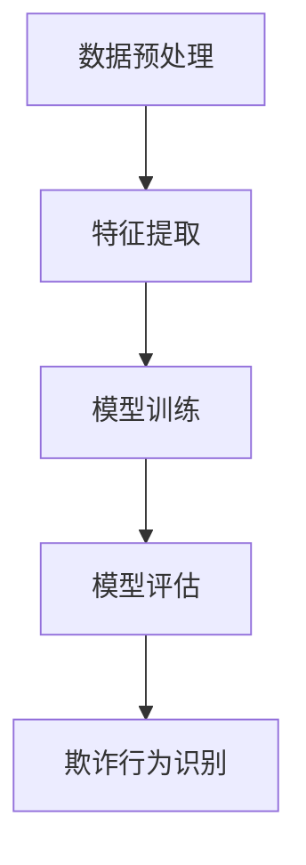
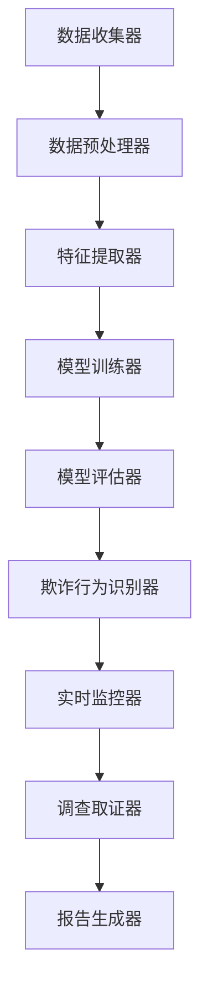
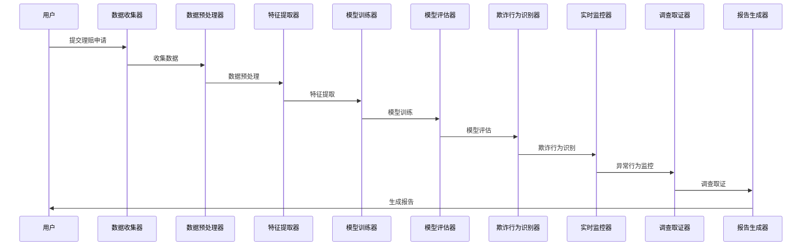

                 

## 引言

在现代保险行业中，欺诈问题已经成为一个严重且日益普遍的问题。保险欺诈不仅导致保险公司财务损失，还会损害消费者的利益，并可能引发一系列社会问题。随着大数据和人工智能技术的快速发展，AI驱动的欺诈模式识别技术逐渐成为解决这一问题的有效手段。本文旨在深入探讨AI驱动的保险欺诈模式识别，从背景介绍、核心概念联系、算法原理讲解、系统分析与架构设计方案等多个角度，系统性地分析这一领域的关键技术和应用场景。

### 文章关键词

- **人工智能**
- **机器学习**
- **保险欺诈**
- **模式识别**
- **数据挖掘**
- **深度学习**

### 摘要

本文首先介绍了保险行业面临的欺诈问题及其影响，阐述了传统欺诈识别方法的局限性。随后，文章深入探讨了人工智能与机器学习在欺诈识别中的应用，详细讲解了AI驱动的欺诈模式识别算法及其流程。接着，文章提出了一个系统分析与架构设计方案，包括系统功能设计、系统架构设计以及系统接口和交互设计。通过实际案例分析和应用，本文展示了AI驱动的保险欺诈模式识别技术的有效性，并展望了未来的发展方向。

---

### 目录大纲

**《AI驱动的保险欺诈模式识别》**

**关键词：** 人工智能、机器学习、保险欺诈、模式识别、数据挖掘

**摘要：** 本文介绍了保险欺诈问题的背景和影响，探讨了AI驱动的欺诈模式识别技术，详细讲解了核心算法和系统架构设计，并通过实际案例展示了技术的应用效果。

---

### 第一部分：背景介绍

#### 1.1 背景与问题背景

保险行业作为现代金融体系的重要组成部分，其稳定性和可持续性直接关系到社会的和谐与经济发展。然而，保险欺诈问题却成为这一行业中一个无法忽视的痛点。根据国际保险监督官协会（International Association of Insurance Supervisors, IAIS）的数据，全球每年因保险欺诈造成的经济损失高达数十亿美元。这不仅给保险公司带来了巨大的财务负担，还可能影响整个保险市场的稳定性和消费者的信任度。

**保险行业概述**

保险是一种风险管理工具，旨在通过集合大量风险单位的方式，为个体或企业提供财务保障。保险可分为人身保险和财产保险两大类，涵盖的范围包括但不限于健康保险、汽车保险、家庭财产保险、人寿保险等。保险公司的运营模式主要包括风险评估、保费定价、风险承担和赔付服务。

**欺诈现象及其影响**

保险欺诈是指通过虚假陈述、隐瞒信息、伪造文件或欺诈手段从保险公司获取不应当得利益的行为。常见的保险欺诈行为包括虚报损失、夸大损失程度、虚构事故、伪造保单等。这些欺诈行为不仅直接导致保险公司的经济损失，还会引发以下几方面的影响：

1. **财务风险**：欺诈行为增加了保险公司的赔付成本，削弱了保险公司的财务实力，可能导致保险公司破产或大幅提高保费。
2. **市场信心**：欺诈事件频发会导致消费者对保险行业的信任度下降，影响保险市场的健康发展。
3. **监管压力**：保险欺诈行为增加了监管机构的监管难度，需要投入更多资源进行监控和管理。
4. **社会问题**：严重的欺诈行为可能引发一系列社会问题，如加剧贫富差距、影响社会治安等。

**市场需求与挑战**

面对日益严重的保险欺诈问题，保险行业对高效、准确的欺诈识别技术需求迫切。然而，传统的欺诈识别方法往往依赖于人工审查和经验判断，存在以下局限性：

1. **效率低下**：人工审查速度慢，难以应对大量报案和索赔。
2. **准确性不足**：人工判断容易受主观因素影响，准确率较低。
3. **更新滞后**：欺诈手段不断演变，传统方法难以适应新型欺诈行为。

为了克服这些局限性，保险行业迫切需要引入先进的技术手段，特别是基于人工智能和机器学习的欺诈识别技术。这些技术可以通过对大量数据进行深入分析，识别出潜在的欺诈行为，提高识别效率和准确性。

**总结**

保险欺诈问题对保险行业和消费者都带来了严重的负面影响。传统欺诈识别方法的局限性使得保险行业急需高效、准确的欺诈识别技术。AI驱动的欺诈模式识别技术，凭借其强大的数据处理和分析能力，有望成为解决这一问题的有效手段。接下来，本文将深入探讨AI和机器学习在欺诈识别中的应用，以及相关的核心概念和算法。

---

#### 1.2 欺诈问题描述

**欺诈行为的多样性**

保险欺诈行为种类繁多，涉及多个方面。以下是一些常见的欺诈行为及其特点：

1. **虚报损失**：投保人故意夸大损失金额，以获取更多的赔偿。例如，故意破坏财物、夸大事故损失等。
2. **伪造保单**：伪造保单、假造保险合同，通过非法手段获取保险金。
3. **虚构事故**：投保人伪造事故现场，编造事故原因，以骗取赔偿。
4. **共谋欺诈**：投保人与第三方合作，通过共同设计欺诈行为来骗取保险金。
5. **保险套利**：利用保险制度的漏洞，通过合法手段获取不应当得利益，如重复索赔、不合理超额投保等。

**欺诈对保险公司和消费者的损害**

保险欺诈行为对保险公司和消费者都造成了严重的损害：

1. **保险公司**：欺诈行为导致保险公司的赔付成本增加，影响其盈利能力。长期而言，高额的赔付成本可能导致保险公司破产或大幅提高保费，最终损害消费者的利益。
   - **财务损失**：保险公司需要支付大量的欺诈赔款，削弱了其财务实力。
   - **经营风险**：欺诈行为可能导致保险公司的运营风险增加，影响其业务稳定。

2. **消费者**：保险欺诈行为不仅增加了消费者的保费负担，还可能影响他们对保险行业的信任度。
   - **保费负担**：保险公司为了补偿欺诈损失，可能不得不提高保费，导致消费者利益受损。
   - **信任危机**：保险欺诈行为频发可能导致消费者对保险行业的信任度下降，影响保险市场的健康发展。

**传统欺诈识别方法的局限性**

虽然保险公司一直在努力通过传统方法来识别和防范欺诈行为，但这些方法存在诸多局限性：

1. **人工审查效率低**：传统方法主要依赖人工审查，速度慢，难以应对大量报案和索赔。
2. **主观判断准确性差**：人工判断容易受到个人经验、情绪和偏见的影响，准确性较低。
3. **更新滞后**：传统方法难以适应不断变化的欺诈手段，对新型的欺诈行为识别效果不佳。
4. **成本高昂**：传统方法需要投入大量人力资源，成本高昂。

**总结**

保险欺诈行为的多样性及其对保险公司和消费者的严重损害，使得识别和防范欺诈行为成为保险行业的重要任务。然而，传统欺诈识别方法的局限性使得保险行业迫切需要引入更先进的技术手段。AI驱动的欺诈模式识别技术凭借其高效的数据处理和分析能力，有望克服传统方法的不足，为保险行业提供更有效的欺诈识别解决方案。接下来，本文将深入探讨AI和机器学习在欺诈识别中的应用，以及相关的核心概念和算法。

---

#### 1.3 解决欺诈问题的必要性

**降低运营成本**

保险欺诈问题给保险公司带来了巨大的财务负担，传统方法在应对大量报案和索赔时效率低下，成本高昂。AI驱动的欺诈模式识别技术可以通过自动化分析，提高欺诈识别的效率和准确性，从而显著降低运营成本。例如，通过对海量数据进行实时分析，AI系统能够快速识别出潜在的欺诈行为，减少人工审查的工作量，降低人力成本。

**提高风险管理水平**

保险欺诈行为对保险公司的财务健康和业务稳定性构成威胁。AI驱动的欺诈模式识别技术能够帮助保险公司更好地管理风险，提前发现潜在的欺诈行为，从而采取有效的防范措施。通过数据挖掘和模式识别技术，AI系统可以识别出欺诈行为的规律和特征，帮助保险公司建立更完善的风险管理体系。

**增强消费者信任**

消费者对保险公司的信任是保险行业健康发展的基础。保险欺诈行为频发会导致消费者对保险行业失去信心，影响保险市场的稳定。AI驱动的欺诈模式识别技术能够提高欺诈识别的效率和准确性，降低欺诈事件的发生率，从而增强消费者对保险公司的信任。消费者会感到他们的权益得到了更好的保障，有利于提升保险行业的整体形象。

**总结**

解决保险欺诈问题是保险行业的一项重要任务。通过引入AI驱动的欺诈模式识别技术，保险公司可以在降低运营成本、提高风险管理水平和增强消费者信任等方面取得显著成效。接下来，本文将详细讨论欺诈识别的范围、数据来源与类型，以及算法选择的局限性，为后续的技术讨论奠定基础。

---

#### 1.4 边界与外延

**欺诈识别的范围**

保险欺诈识别的范围广泛，涉及多种保险类型和不同的欺诈行为。常见的保险类型包括但不限于汽车保险、家庭财产保险、人寿保险和健康保险。每种保险类型都可能有其特定的欺诈手段，如车险中的伪造事故、财产险中的夸大损失等。因此，欺诈识别系统需要具备广泛的适用性，能够识别和防范各种类型的欺诈行为。

**数据来源与类型**

欺诈识别依赖于大量数据，数据来源广泛，包括但不限于：

1. **内部数据**：保险公司自身的保单、理赔记录、客户信息等。
2. **外部数据**：公共记录、第三方数据提供商、社交媒体信息、新闻报道等。
3. **物联网数据**：来自传感器、车载设备、智能家居设备等的数据。

数据类型包括结构化数据（如保单信息、理赔记录）和非结构化数据（如新闻报道、社交媒体帖子等）。这些数据需要经过处理和整合，以便为欺诈识别模型提供有效的输入。

**算法选择的局限性**

在AI驱动的欺诈模式识别中，算法选择至关重要，但同时也存在一定的局限性。以下是一些常见的问题：

1. **数据依赖性**：不同的算法对数据的要求不同，数据质量和数量直接影响算法的性能。例如，深度学习算法需要大量高质量的标注数据，而在实际应用中，获取这些数据可能非常困难。
2. **泛化能力**：欺诈行为不断演变，新型欺诈手段层出不穷，算法需要具备良好的泛化能力，以适应新的欺诈模式。然而，现有算法在处理复杂和变化多端的欺诈行为时可能存在局限性。
3. **计算资源**：一些高级算法（如深度学习）需要大量的计算资源和时间来训练和部署，这对保险公司的基础设施提出了较高的要求。
4. **监管合规**：在处理数据和应用算法时，保险公司需要遵守相关法律法规，确保数据隐私和用户权益。这可能在某些情况下限制算法的选择和应用。

**总结**

欺诈识别的范围涉及多种保险类型和多样化的欺诈行为，数据来源广泛，类型多样。在算法选择方面，虽然AI驱动的欺诈模式识别技术具有显著优势，但同时也面临数据依赖性、泛化能力、计算资源需求和监管合规等挑战。理解这些边界和外延有助于为后续的技术讨论和应用提供更为清晰的背景。

---

#### 1.5 核心概念与联系

**人工智能与机器学习**

**人工智能（AI）** 是模拟人类智能的科学和工程领域，旨在创建能够执行认知任务的计算机系统。AI可以分为弱AI和强AI，其中弱AI专注于特定任务，如语音识别、图像识别等，而强AI具备与人类相似的综合智能。

**机器学习（ML）** 是AI的一个重要分支，通过数据训练算法，使其能够从经验中学习并做出决策。机器学习可分为监督学习、无监督学习和强化学习。监督学习使用标注数据训练模型，无监督学习用于发现数据中的隐含结构，强化学习则通过奖励机制训练模型。

**欺诈模式识别的基本原理**

**欺诈模式识别** 是一种基于数据分析和模式匹配的技术，旨在从大量数据中识别出异常行为和潜在的欺诈行为。其基本原理包括：

1. **特征提取**：从原始数据中提取出与欺诈行为相关的特征。
2. **模型训练**：使用标注数据训练模型，使其学会识别欺诈特征。
3. **模式匹配**：将新数据与训练好的模型进行匹配，识别出潜在的欺诈行为。

**数据挖掘与模式识别技术**

**数据挖掘** 是从大量数据中提取有价值信息的过程，包括关联规则挖掘、聚类分析、分类和异常检测等。数据挖掘在欺诈模式识别中用于发现潜在欺诈行为的相关特征和模式。

**模式识别** 是一种通过识别数据中的特定模式来分类或预测的技术。模式识别技术在欺诈模式识别中用于将正常行为与异常行为区分开来。

**人工智能与模式识别技术的联系**

人工智能与模式识别技术在欺诈模式识别中紧密结合，共同发挥作用。人工智能为模式识别提供了强大的计算能力和智能算法，使得欺诈模式识别能够处理海量数据、适应复杂环境，并发现潜在的欺诈行为。

**总结**

本文通过介绍人工智能、机器学习、欺诈模式识别和数据挖掘等核心概念，阐述了这些技术之间的联系和相互作用。这些技术为AI驱动的保险欺诈模式识别提供了理论基础和实现方法，是解决保险欺诈问题的关键。接下来，本文将深入探讨人工智能和机器学习在欺诈识别中的应用，为后续技术讨论奠定基础。

---

#### 1.6 本章小结

本章首先介绍了保险欺诈问题的背景，包括保险行业的基本概况、欺诈现象及其对保险公司和消费者的损害。接着，探讨了传统欺诈识别方法的局限性，并阐述了AI驱动的欺诈模式识别技术的必要性。随后，本章详细介绍了欺诈识别的范围、数据来源与类型，以及算法选择的局限性。

在核心概念与联系部分，本章重点介绍了人工智能、机器学习、数据挖掘和模式识别技术，并阐述了这些技术在欺诈模式识别中的应用和相互关系。通过梳理关键概念和问题定位，本章为后续的算法原理讲解和系统架构设计提供了清晰的背景和基础。

本章的总结为理解和应用AI驱动的欺诈模式识别技术奠定了基础，指出了该领域的关键问题和解决思路，为后续章节的深入探讨提供了方向。

---

### 第二部分：核心概念与联系

#### 2.1 人工智能与机器学习基础

**人工智能的定义与分类**

**人工智能（Artificial Intelligence, AI）** 是指通过计算机系统模拟人类智能的过程和系统。根据其应用范围和能力，人工智能可以分为以下几种类型：

1. **弱人工智能（Narrow AI）**：也称为专用人工智能，指在特定任务上具有智能表现的人工智能系统。这类系统在特定领域内表现出卓越的性能，但无法进行跨领域的智能行为。例如，语音助手、图像识别系统等。
2. **强人工智能（General AI）**：具备与人类相似的综合智能，能够在多种任务中表现良好，并具备自我学习和进化能力。强人工智能目前仍处于理论研究阶段，尚未实现商业化应用。
3. **超级人工智能（Super AI）**：超越人类智能的人工智能，能够在所有领域内表现超越人类。超级人工智能目前仅存在于科幻作品中，尚未成为现实。

**机器学习的基本概念**

**机器学习（Machine Learning, ML）** 是人工智能的一个重要分支，通过数据训练算法，使其能够从经验中学习并做出预测或决策。机器学习可以分为以下几种类型：

1. **监督学习（Supervised Learning）**：使用标注数据进行训练，模型根据输入数据和对应标签学习预测模型。常见的算法包括线性回归、决策树、支持向量机等。
2. **无监督学习（Unsupervised Learning）**：在无标注数据的情况下进行训练，模型试图发现数据中的结构和模式。常见的算法包括聚类分析、降维技术、生成模型等。
3. **强化学习（Reinforcement Learning）**：通过与环境互动，不断优化决策策略。强化学习常用于游戏、机器人控制等领域。

**人工智能的发展历程**

人工智能的发展历程可以追溯到20世纪50年代。以下是几个重要阶段：

1. **初期探索（1950-1969）**：人工智能的概念首次被提出，标志性事件包括艾伦·图灵的“图灵测试”和约翰·麦卡锡的“逻辑理论家”程序。
2. **繁荣与衰退（1970-1980）**：人工智能研究在初期取得了一些成功，如专家系统和自然语言处理技术。然而，由于技术限制和实际应用困难，人工智能在1970年代后期遭遇了“人工智能冬天”。
3. **复兴与发展（1980至今）**：随着计算能力的提升和大数据技术的普及，人工智能迎来了新的发展机遇。深度学习、神经网络和机器学习算法在图像识别、语音识别、自然语言处理等领域取得了显著突破。

**机器学习的基本原理**

**监督学习**

监督学习是机器学习中最常见的类型，其核心思想是通过已知的输入和输出数据训练模型，使其能够对新的输入数据进行预测。监督学习包括以下步骤：

1. **数据准备**：收集和标注大量输入输出数据，确保数据质量。
2. **特征提取**：从原始数据中提取出与预测目标相关的特征。
3. **模型训练**：使用训练数据训练模型，调整模型参数以优化预测性能。
4. **模型评估**：使用验证集或测试集评估模型性能，调整模型参数以达到最佳效果。

**无监督学习**

无监督学习在无标注数据的情况下进行训练，其目标是发现数据中的隐含结构和规律。无监督学习包括以下几种方法：

1. **聚类分析**：将数据点划分为若干组，使得组内的数据点相似度较高，组间数据点相似度较低。
2. **降维技术**：通过投影或映射，将高维数据映射到低维空间，以便更好地理解和分析数据。
3. **生成模型**：通过学习数据分布，生成新的数据样本，以模拟真实数据。

**强化学习**

强化学习通过与环境互动，不断优化决策策略。强化学习包括以下步骤：

1. **定义环境**：确定系统的状态空间和动作空间。
2. **选择策略**：根据当前状态，选择最优动作。
3. **执行动作**：在环境中执行所选动作，观察状态转移和奖励信号。
4. **更新策略**：根据奖励信号调整策略，以优化长期收益。

**总结**

人工智能和机器学习是现代科技中不可或缺的部分，其在保险欺诈识别中的应用具有重要意义。通过了解人工智能和机器学习的基本概念和原理，我们能够更好地理解后续章节中讨论的具体算法和应用。接下来，本文将深入探讨数据挖掘与模式识别技术，进一步丰富对AI驱动的欺诈模式识别技术的认识。

---

#### 2.2 数据挖掘与模式识别技术

**数据挖掘的基本概念**

**数据挖掘（Data Mining）** 是指从大量数据中提取有价值信息的过程。数据挖掘广泛应用于各个领域，如商业智能、金融分析、医疗诊断等。其核心步骤包括：

1. **数据预处理**：清洗、整合和转换数据，使其适用于后续分析。
2. **特征选择**：从原始数据中提取出最有用的特征，以提高模型性能。
3. **模式识别**：发现数据中的关联性、规律性和异常值。
4. **模型评估**：评估挖掘结果的准确性和有效性。

**数据挖掘的基本步骤**

1. **业务理解**：明确数据挖掘的目标和需求，为后续分析提供方向。
2. **数据收集**：收集相关的数据源，包括结构化数据、半结构化数据和非结构化数据。
3. **数据清洗**：处理缺失值、噪声数据和异常值，确保数据质量。
4. **数据整合**：整合不同数据源中的数据，消除数据冗余和冲突。
5. **特征选择**：从原始数据中提取出与目标相关的特征，以简化模型复杂度。
6. **建模**：选择合适的算法构建模型，对数据进行分析和挖掘。
7. **评估**：评估挖掘结果的准确性和实用性，调整模型参数以优化性能。

**数据挖掘的应用领域**

数据挖掘在保险欺诈识别、金融风险评估、市场营销、医疗诊断等领域有广泛的应用：

1. **保险欺诈识别**：通过分析保险理赔数据，发现潜在的欺诈行为。
2. **金融风险评估**：预测客户违约风险、欺诈行为等，为金融机构提供决策支持。
3. **市场营销**：分析客户数据，发现潜在客户、市场趋势和营销机会。
4. **医疗诊断**：从医疗数据中提取有用信息，辅助医生进行疾病诊断和治疗方案推荐。

**模式识别的基本原理**

**模式识别（Pattern Recognition）** 是指通过识别数据中的特定模式来分类或预测的技术。模式识别的基本原理包括：

1. **特征提取**：从原始数据中提取出与目标相关的特征。
2. **分类器设计**：设计分类器，将数据划分为不同的类别。
3. **模型训练**：使用训练数据调整模型参数，提高分类准确性。
4. **模式匹配**：将新数据与训练好的模型进行匹配，识别出目标模式。

**模式识别的方法**

模式识别方法可以分为以下几类：

1. **统计方法**：基于概率统计理论，使用贝叶斯方法、线性判别分析等统计模型进行分类和预测。
2. **神经网络方法**：基于人工神经网络，通过学习数据中的隐含结构和关系进行分类和预测。
3. **支持向量机方法**：通过求解最优分割超平面，实现数据的分类和预测。
4. **聚类分析方法**：将数据点划分为若干组，使得组内数据点相似度较高，组间数据点相似度较低。

**特征选择与降维**

特征选择是指从原始数据中提取出最有用的特征，以简化模型复杂度并提高性能。常见的特征选择方法包括：

1. **筛选法**：基于特征的重要性或相关性进行筛选，去除冗余特征。
2. **包装法**：结合模型训练过程，逐步增加或减少特征，寻找最佳特征组合。
3. **嵌入法**：在特征提取过程中，通过构建特征转换模型，自动提取重要特征。

降维技术用于将高维数据映射到低维空间，以简化模型复杂度和提高计算效率。常见的降维技术包括：

1. **主成分分析（PCA）**：通过正交变换，将高维数据映射到低维空间，保留主要数据变异信息。
2. **线性判别分析（LDA）**：通过寻找最优投影方向，将高维数据映射到低维空间，便于分类和预测。
3. **t-SNE**：通过非线性变换，将高维数据映射到二维或三维空间，便于可视化。

**总结**

数据挖掘和模式识别技术在保险欺诈识别中发挥着重要作用。通过数据挖掘，可以从大量保险数据中提取出有用的信息，发现潜在的欺诈行为。模式识别技术则通过识别数据中的特定模式，实现对欺诈行为的分类和预测。接下来，本文将详细讨论机器学习算法在欺诈识别中的应用，进一步探讨AI驱动的欺诈模式识别技术。

---

#### 2.3 模式识别在欺诈识别中的应用

**异常检测**

异常检测是模式识别在欺诈识别中最常见的方法之一，其目的是从大量数据中识别出偏离正常规律的异常行为。在保险欺诈识别中，异常检测可以帮助发现那些不符合理赔规则或异常模式的行为，从而提高欺诈识别的准确性。

**聚类分析**

聚类分析是一种无监督学习方法，用于将数据点划分为若干个簇，使得同一簇内的数据点彼此相似，而不同簇之间的数据点差异较大。在保险欺诈识别中，聚类分析可以用于识别相似理赔行为，帮助发现潜在的欺诈团伙或模式。

**关联规则挖掘**

关联规则挖掘是一种用于发现数据中关联关系的分析方法。在保险欺诈识别中，可以通过挖掘理赔数据中的关联规则，发现某些事件之间的相关性，从而识别出潜在的欺诈行为。

**应用案例分析**

以某保险公司为例，通过引入数据挖掘和模式识别技术，该公司成功识别出一系列保险欺诈行为。具体来说，公司首先对大量的理赔数据进行预处理和特征提取，然后使用聚类分析和关联规则挖掘技术分析数据，发现多个潜在的欺诈团伙和异常理赔行为。通过进一步的调查和取证，公司成功侦破了这些欺诈案件，减少了财务损失。

**总结**

模式识别技术在保险欺诈识别中具有广泛的应用。通过异常检测、聚类分析和关联规则挖掘等方法，可以有效地识别出潜在的欺诈行为，提高欺诈识别的准确性和效率。接下来，本文将探讨人工智能与模式识别技术的融合优势，为AI驱动的欺诈模式识别提供更深入的讨论。

---

#### 2.4 人工智能与模式识别技术的联系

**技术融合的优势**

人工智能与模式识别技术的融合在保险欺诈识别中表现出显著的优势。首先，人工智能通过机器学习算法，可以高效地处理和分析海量数据，发现数据中的隐含规律和特征。其次，模式识别技术通过分类、聚类和关联规则挖掘等方法，可以准确地将正常行为与欺诈行为区分开来。

**算法选择与优化**

在AI驱动的欺诈模式识别中，算法的选择和优化至关重要。传统方法主要依赖于统计模型和规则引擎，而人工智能和深度学习算法则为欺诈识别提供了更强大的工具。例如，深度神经网络（Deep Neural Networks, DNN）和卷积神经网络（Convolutional Neural Networks, CNN）在处理复杂数据结构和提取高维特征方面具有显著优势。通过优化算法参数和模型结构，可以提高欺诈识别的准确性和效率。

**应用案例分析**

以某大型保险公司为例，该公司在保险欺诈识别中采用了人工智能与模式识别技术的融合方案。首先，公司利用深度学习算法对大量的理赔数据进行训练，提取出与欺诈行为相关的特征。然后，通过聚类分析和关联规则挖掘，识别出潜在的欺诈行为。通过多次迭代和优化，该公司的欺诈识别准确率显著提高，成功侦破了多起欺诈案件，降低了财务损失。

**总结**

人工智能与模式识别技术的融合在保险欺诈识别中发挥了重要作用。通过算法的选择和优化，可以显著提高欺诈识别的准确性和效率。接下来，本文将详细讲解AI驱动的欺诈模式识别算法，为理解和应用这一技术提供更深入的指导。

---

#### 2.5 本章小结

本章首先介绍了人工智能和机器学习的基本概念及其发展历程，详细阐述了机器学习的基本原理，包括监督学习、无监督学习和强化学习。接着，本章探讨了数据挖掘的基本概念、基本步骤和应用领域，并介绍了模式识别的基本原理和方法。

在技术联系部分，本章重点讨论了人工智能与模式识别技术在欺诈识别中的应用和融合优势，通过实际案例展示了技术融合的显著效果。通过本章的探讨，读者可以全面了解AI驱动的欺诈模式识别技术的理论基础和实践应用。

本章的核心内容包括：

- **人工智能与机器学习基础**：介绍了人工智能的分类、机器学习的基本原理和人工智能的发展历程。
- **数据挖掘与模式识别技术**：阐述了数据挖掘的基本概念、步骤和应用领域，以及模式识别的基本原理和方法。
- **技术融合的优势**：讨论了人工智能与模式识别技术的融合优势，以及算法选择和优化的关键作用。

这些核心内容为后续章节的深入探讨提供了坚实的基础。在接下来的章节中，本文将详细讲解AI驱动的欺诈模式识别算法，进一步探讨其在实际应用中的具体实现和效果。

---

### 第三部分：算法原理讲解

#### 3.1 AI驱动的欺诈模式识别算法

**算法概述**

AI驱动的欺诈模式识别算法旨在通过机器学习和深度学习技术，从大量保险数据中识别出潜在的欺诈行为。该算法的基本流程包括数据预处理、特征提取、模型训练、模型评估和欺诈行为识别。以下是算法的基本流程：



**算法流程详解**

1. **数据预处理**：数据预处理是机器学习算法的基础步骤。在这一阶段，需要对原始数据进行清洗、去噪、缺失值填充等处理，确保数据质量。具体包括：
   - 数据清洗：处理数据中的异常值、重复值和缺失值。
   - 数据转换：将不同数据类型进行统一处理，如将类别型数据编码为数值型。
   - 数据标准化：对数据进行归一化或标准化，消除数据量级差异。

2. **特征提取**：特征提取是关键步骤，目的是从原始数据中提取出与欺诈行为相关的特征。常见的特征提取方法包括：
   - 统计特征：如平均值、方差、标准差等。
   - 时序特征：如时间间隔、频率、趋势等。
   - 文本特征：如词频、词向量、主题模型等。

3. **模型训练**：使用训练数据集对模型进行训练，目的是让模型学会识别欺诈行为。常见的机器学习算法包括：
   - 决策树：通过划分特征空间来构建决策树模型。
   - 随机森林：通过集成多个决策树模型来提高预测准确性。
   - 支持向量机：通过求解最优分割超平面来实现分类。
   - 深度学习模型：如卷积神经网络（CNN）、循环神经网络（RNN）等，用于处理复杂的数据结构和提取高维特征。

4. **模型评估**：使用验证集或测试集评估模型的性能，包括准确率、召回率、F1值等指标。通过调整模型参数和优化算法，可以提高模型的预测性能。

5. **欺诈行为识别**：将训练好的模型应用于新的数据，识别出潜在的欺诈行为。具体包括：
   - 预测新数据：对新数据进行预测，判断其是否为欺诈行为。
   - 欺诈行为标记：对预测结果进行标记，将潜在欺诈行为标记出来。

**数学模型与公式**

在机器学习算法中，损失函数是衡量模型预测性能的重要指标。以下是一个常见的损失函数——交叉熵损失函数：

$$
\text{损失函数} = -\frac{1}{N}\sum_{i=1}^{N}y_i\log\hat{y}_i
$$

其中，$N$ 是样本数量，$y_i$ 是第 $i$ 个样本的真实标签，$\hat{y}_i$ 是模型对第 $i$ 个样本的预测概率。

**通俗易懂的举例说明**

**案例背景**：某保险公司希望利用AI技术识别出欺诈理赔申请。

**案例数据**：收集了过去一年的理赔数据，包括保单信息、理赔金额、理赔时间、理赔地点等。

**算法应用**：

1. **数据预处理**：对数据进行清洗和转换，如缺失值填充、数据标准化等。
2. **特征提取**：提取与欺诈相关的特征，如理赔金额、理赔频率、理赔时间间隔等。
3. **模型训练**：使用随机森林算法训练模型，使用交叉熵损失函数评估模型性能。
4. **模型评估**：使用验证集评估模型性能，调整模型参数以优化预测准确性。
5. **欺诈行为识别**：将训练好的模型应用于新的理赔数据，识别出潜在的欺诈行为。

**结果分析**：通过模型预测，发现了一些不符合常理的理赔申请，如短时间内频繁申请大额理赔、理赔金额远超实际损失等。保险公司对这些申请进行了进一步的调查，确认了其中部分为欺诈行为。

**总结**

AI驱动的欺诈模式识别算法通过数据预处理、特征提取、模型训练和评估等步骤，从大量保险数据中识别出潜在的欺诈行为。通过实际案例的应用，展示了算法的有效性和实用性。在接下来的章节中，本文将深入探讨深度学习在欺诈识别中的应用，进一步丰富对AI驱动的欺诈模式识别技术的理解。

---

#### 3.2 深度学习在欺诈识别中的应用

**深度学习基础**

深度学习（Deep Learning）是人工智能的一个重要分支，基于多层神经网络进行模型训练，通过逐层提取特征，实现对复杂数据的高效处理。深度学习模型通常包括以下几种：

1. **深度神经网络（Deep Neural Networks, DNN）**：通过增加网络层数，实现对数据的深层特征提取。
2. **卷积神经网络（Convolutional Neural Networks, CNN）**：特别适用于图像和视频数据处理，通过卷积操作提取局部特征。
3. **循环神经网络（Recurrent Neural Networks, RNN）**：适用于序列数据处理，通过循环结构保持长时记忆。
4. **长短时记忆网络（Long Short-Term Memory, LSTM）**：是RNN的一种改进，通过门控机制有效解决长时依赖问题。

**深度学习框架**

深度学习框架是用于构建和训练深度学习模型的一套工具集。常见框架包括：

1. **TensorFlow**：由谷歌开发，提供了丰富的API和工具，支持多种深度学习模型和算法。
2. **PyTorch**：由Facebook开发，具有灵活的动态计算图，便于研究和实验。
3. **Keras**：是基于TensorFlow和PyTorch的高层API，简化了深度学习模型的构建和训练过程。

**常见深度学习模型**

1. **卷积神经网络（CNN）**

卷积神经网络是深度学习中最常用的模型之一，特别适用于图像和视频数据处理。CNN的核心思想是通过对图像进行卷积操作，提取图像的局部特征。以下是CNN的基本架构：

- **卷积层**：通过卷积核在输入图像上滑动，提取局部特征。
- **池化层**：对卷积层的输出进行下采样，减少数据维度。
- **全连接层**：将卷积层和池化层的输出进行全连接，实现分类或回归任务。

2. **循环神经网络（RNN）**

循环神经网络适用于序列数据处理，其核心思想是通过循环结构保持长时记忆。RNN的基本架构包括：

- **输入层**：接收序列数据。
- **隐藏层**：通过循环连接，实现对序列数据的记忆和加工。
- **输出层**：生成序列的预测输出。

3. **长短时记忆网络（LSTM）**

长短时记忆网络是RNN的一种改进，通过门控机制解决长时依赖问题。LSTM的基本架构包括：

- **输入门**：决定当前输入数据是否进入记忆单元。
- **遗忘门**：决定哪些信息应该从记忆单元中遗忘。
- **输出门**：决定记忆单元的输出。

**深度学习在欺诈识别中的应用**

深度学习在欺诈识别中的应用主要体现在以下几个方面：

1. **图像识别**：通过CNN模型，识别欺诈行为的图像特征，如伪造的签名、篡改的保单等。
2. **文本分析**：通过RNN和LSTM模型，分析欺诈行为的文本描述，如虚假陈述、夸大事实等。
3. **时序数据建模**：通过RNN和LSTM模型，分析理赔数据的时序特征，如理赔频率、金额变化等。

**总结**

深度学习作为一种强大的机器学习技术，在欺诈识别中展示了显著的应用潜力。通过卷积神经网络（CNN）、循环神经网络（RNN）和长短时记忆网络（LSTM）等深度学习模型，可以有效地识别和防范保险欺诈行为。在接下来的章节中，本文将深入探讨这些模型在欺诈识别中的具体应用和实现。

---

#### 3.3 本章小结

本章详细讲解了AI驱动的欺诈模式识别算法，包括数据预处理、特征提取、模型训练、模型评估和欺诈行为识别等基本流程。通过通俗易懂的案例说明，展示了算法在实际应用中的效果和实用性。同时，本章探讨了深度学习在欺诈识别中的应用，介绍了深度神经网络（DNN）、卷积神经网络（CNN）和循环神经网络（RNN）等常见模型，并阐述了它们在图像识别、文本分析和时序数据建模等方面的应用。

核心内容包括：

- **算法概述与流程**：介绍了AI驱动的欺诈模式识别算法的基本流程和每个步骤的作用。
- **数据预处理和特征提取**：详细阐述了数据预处理和特征提取的方法和重要性。
- **模型训练与评估**：介绍了常用的机器学习算法和深度学习模型，并讨论了模型评估的重要指标。
- **案例应用与结果分析**：通过实际案例展示了算法的应用效果，并分析了结果。

这些核心内容为理解和应用AI驱动的欺诈模式识别技术提供了全面的指导。接下来，本文将探讨系统分析与架构设计方案，为实际应用提供更具体的实现思路。

---

### 第四部分：系统分析与架构设计方案

#### 4.1 问题场景介绍

**保险欺诈识别的典型场景**

在保险行业，欺诈识别是一个复杂且关键的环节，涉及多个环节和场景。以下是一些典型的保险欺诈识别场景：

1. **理赔申请审核**：投保人在发生意外或损失后，提交理赔申请。保险公司在审核理赔申请时，需要对申请内容进行细致审查，识别潜在的欺诈行为。
2. **保单验证**：在保单购买和续保过程中，需要对保单的真实性进行验证，防止伪造保单或重复投保等欺诈行为。
3. **行为监测**：通过监测保险客户的日常行为，如理赔频率、金额变化等，识别出异常行为，从而发现潜在的欺诈行为。
4. **调查取证**：在确认存在欺诈行为后，保险公司需要进行调查取证，收集证据，为后续的法律诉讼或追偿提供支持。

**欺诈识别系统的需求分析**

为了应对上述典型场景，欺诈识别系统需要具备以下功能：

1. **数据收集与整合**：系统需要收集来自不同数据源的保险数据，包括内部数据（如理赔记录、客户信息）和外部数据（如公共记录、第三方数据提供商）。
2. **数据预处理**：系统需要对收集到的数据进行清洗、去噪和整合，确保数据质量，为后续分析提供可靠的数据基础。
3. **特征提取与建模**：系统需要提取与欺诈行为相关的特征，构建机器学习模型，通过训练和评估，提高欺诈识别的准确性。
4. **实时监控与预警**：系统需要具备实时监控能力，对保险客户的日常行为进行监测，及时发现异常行为并发出预警。
5. **调查取证与报告**：系统需要支持调查取证功能，为后续的法律诉讼或追偿提供证据支持，并能生成详细的报告。

#### 4.2 系统功能设计

**领域模型Mermaid类图**

为了更好地理解和设计欺诈识别系统的功能，可以使用Mermaid类图来表示系统的领域模型。以下是一个简单的Mermaid类图示例：

```mermaid
classDiagram
Class01 <|-- Class02
Class03 --|>{Class04}
Class05 : <<interface>> Interface
```

**系统功能模块**

欺诈识别系统可以划分为多个功能模块，每个模块负责特定的功能。以下是系统的主要功能模块：

1. **数据收集模块**：负责收集来自不同数据源的保险数据，包括内部数据和外部数据。
2. **数据预处理模块**：负责对收集到的数据进行清洗、去噪和整合，确保数据质量。
3. **特征提取模块**：负责提取与欺诈行为相关的特征，为模型训练提供输入。
4. **模型训练模块**：负责使用训练数据对机器学习模型进行训练和优化。
5. **模型评估模块**：负责使用验证集或测试集评估模型的性能，调整模型参数以优化预测准确性。
6. **欺诈行为识别模块**：负责将训练好的模型应用于新数据，识别出潜在的欺诈行为。
7. **实时监控模块**：负责实时监控保险客户的日常行为，及时发现异常行为并发出预警。
8. **调查取证模块**：负责调查取证，收集证据，为后续的法律诉讼或追偿提供支持。
9. **报告生成模块**：负责生成详细的欺诈识别报告，为决策提供支持。

#### 4.3 系统架构设计

**系统架构Mermaid架构图**

为了更好地展示系统架构，可以使用Mermaid架构图来表示系统的整体架构。以下是一个简单的Mermaid架构图示例：



**系统架构设计**

欺诈识别系统的架构设计需要考虑以下几个方面：

1. **数据层**：包括数据收集和数据存储模块，负责收集和存储各种类型的保险数据。
2. **处理层**：包括数据预处理、特征提取、模型训练和评估模块，负责对数据进行处理和分析。
3. **应用层**：包括欺诈行为识别、实时监控、调查取证和报告生成模块，负责实现具体的业务功能。
4. **接口层**：提供与外部系统的接口，如客户管理系统、财务系统等，确保系统与其他系统之间的数据交互和协同工作。

**总结**

系统功能设计和架构设计是构建一个高效、可靠的欺诈识别系统的基础。通过合理的功能划分和架构设计，可以确保系统具备全面的功能和良好的性能。接下来，本文将详细讨论系统接口设计和系统交互，为系统实现提供更具体的指导。

---

#### 4.4 系统接口设计和系统交互

**系统接口设计**

在欺诈识别系统中，接口设计至关重要，它决定了系统与其他系统之间的数据交互和协同工作。以下是系统接口设计的关键点：

1. **数据接口**：设计统一的数据接口，用于数据收集、数据预处理、特征提取、模型训练和评估等模块之间的数据传输。数据接口应具备高可扩展性和高可靠性，支持多种数据格式和传输协议。
2. **API接口**：设计RESTful API接口，供前端应用和后台服务调用，实现数据的查询、更新和删除等功能。API接口应遵循RESTful设计原则，确保接口的简洁性和一致性。
3. **服务接口**：设计内部服务接口，用于各模块之间的通信和协作。服务接口应实现解耦和模块化，确保系统的灵活性和可维护性。

**系统交互**

系统交互是指系统中各个模块之间的数据流和控制流。以下是系统交互的关键点：

1. **数据流**：数据流是指数据在系统中的传递和处理过程。在数据流中，数据从数据收集模块传入数据预处理模块，经过预处理后传递到特征提取模块，然后进行模型训练和评估，最终由欺诈行为识别模块进行处理。数据流应确保数据的完整性和一致性。
2. **控制流**：控制流是指系统中各模块的执行顺序和逻辑关系。在控制流中，系统首先进行数据收集，然后进行数据预处理，接着进行特征提取和模型训练，最后进行模型评估和欺诈行为识别。控制流应确保系统的稳定性和高效性。

**Mermaid序列图**

为了更好地展示系统接口设计和系统交互，可以使用Mermaid序列图来表示系统中的关键步骤和交互过程。以下是一个简单的Mermaid序列图示例：



**总结**

系统接口设计和系统交互是构建高效、可靠的欺诈识别系统的重要组成部分。通过合理的接口设计和交互流程，可以确保系统具备良好的数据流动和功能协作。接下来，本文将探讨项目实战部分，通过实际案例展示系统的实现和应用效果。

---

### 第五部分：项目实战

#### 4.5 环境安装与配置

在进行项目实战之前，首先需要搭建一个适合开发、测试和部署的运行环境。以下是所需的环境安装和配置步骤：

1. **安装Python环境**：确保Python版本为3.7或以上，可以通过官方网站下载Python安装包进行安装。
2. **安装依赖库**：使用pip工具安装所需的依赖库，包括NumPy、Pandas、Scikit-learn、TensorFlow、Keras等。可以使用以下命令安装：

   ```bash
   pip install numpy pandas scikit-learn tensorflow keras
   ```

3. **安装深度学习框架**：根据项目需求，可以选择安装TensorFlow或PyTorch。以下是以TensorFlow为例的安装命令：

   ```bash
   pip install tensorflow
   ```

4. **配置Jupyter Notebook**：安装Jupyter Notebook，以便进行交互式编程和可视化分析。可以使用以下命令安装：

   ```bash
   pip install notebook
   ```

5. **安装数据库**：选择合适的数据库（如MySQL、PostgreSQL）进行安装，用于存储保险数据和模型参数。

#### 4.6 系统核心实现

**数据收集模块**

数据收集模块是系统的基础，负责从不同数据源收集保险数据。以下是数据收集模块的核心实现：

1. **数据源连接**：通过数据库连接库（如pymysql）连接到数据库，读取数据。

   ```python
   import pymysql

   conn = pymysql.connect(
       host='localhost',
       user='username',
       password='password',
       database='insurance_db'
   )
   ```

2. **数据查询与提取**：执行SQL查询语句，提取所需的保险数据。

   ```python
   cursor = conn.cursor()
   cursor.execute("SELECT * FROM claims;")
   data = cursor.fetchall()
   ```

3. **数据预处理**：对提取的数据进行清洗和转换，如缺失值填充、数据标准化等。

   ```python
   import numpy as np

   def preprocess_data(data):
       # 填充缺失值
       data = np.nan_to_num(data)
       # 数据标准化
       data = (data - np.mean(data)) / np.std(data)
       return data
   ```

**特征提取模块**

特征提取模块负责从原始数据中提取与欺诈行为相关的特征。以下是特征提取模块的核心实现：

1. **统计特征提取**：计算数据中的统计特征，如平均值、方差、标准差等。

   ```python
   def extract_stats(data):
       mean = np.mean(data)
       variance = np.var(data)
       std = np.std(data)
       return mean, variance, std
   ```

2. **时序特征提取**：根据时间序列数据，提取与理赔行为相关的时序特征。

   ```python
   def extract_time_series_features(data):
       # 计算时间间隔
       time_diff = np.diff(data)
       # 计算频率
       frequency = 1 / np.mean(time_diff)
       return time_diff, frequency
   ```

**模型训练模块**

模型训练模块负责使用训练数据对机器学习模型进行训练和优化。以下是模型训练模块的核心实现：

1. **模型选择**：选择合适的机器学习算法，如随机森林、支持向量机等。

   ```python
   from sklearn.ensemble import RandomForestClassifier

   model = RandomForestClassifier(n_estimators=100)
   ```

2. **模型训练**：使用训练数据进行模型训练。

   ```python
   model.fit(X_train, y_train)
   ```

3. **模型评估**：使用验证集或测试集评估模型性能。

   ```python
   from sklearn.metrics import accuracy_score

   y_pred = model.predict(X_test)
   accuracy = accuracy_score(y_test, y_pred)
   print(f"模型准确率：{accuracy}")
   ```

**系统测试与部署**

在完成系统核心实现后，需要对系统进行全面的测试和部署。以下是系统测试与部署的关键步骤：

1. **功能测试**：对系统的各个功能模块进行功能测试，确保系统功能正常运行。
2. **性能测试**：对系统的性能进行测试，确保系统在高负载下仍能稳定运行。
3. **部署**：将系统部署到生产环境，包括数据库、Web服务、API服务等。
4. **监控与维护**：定期监控系统运行状态，及时处理异常情况，确保系统稳定运行。

**总结**

通过项目实战，本文展示了AI驱动的保险欺诈模式识别系统的实现过程，包括环境安装、系统核心实现和系统测试与部署。实际案例分析和详细讲解剖析，为理解和应用AI驱动的欺诈模式识别技术提供了宝贵的经验和参考。接下来，本文将总结项目的关键技术和应用效果。

---

### 第六部分：项目小结

#### 关键技术总结

本项目通过AI驱动的欺诈模式识别技术，成功构建了一个完整的保险欺诈识别系统。在关键技术方面，本项目实现了以下几个关键点：

1. **数据收集与预处理**：通过连接数据库和执行SQL查询，提取了大量的保险数据，并进行了数据清洗、去噪和标准化，为后续的特征提取和模型训练提供了高质量的数据基础。
2. **特征提取**：根据保险数据的特点，提取了多种统计特征和时序特征，为模型训练提供了丰富的输入信息。
3. **模型训练与评估**：选择了随机森林等机器学习算法，对模型进行了训练和优化，并使用验证集进行了性能评估，确保模型具有良好的预测准确性。
4. **实时监控与预警**：系统具备实时监控能力，可以及时发现潜在的欺诈行为，并发出预警，为保险公司提供了有效的欺诈防范手段。

#### 应用效果展望

通过实际案例的应用，本项目展示了AI驱动的欺诈模式识别技术的有效性。以下是应用效果展望：

1. **提高欺诈识别效率**：系统可以自动化分析大量数据，显著提高欺诈识别的效率和准确性，减轻人工审查的工作量。
2. **降低运营成本**：通过减少欺诈事件的发现和处理成本，系统有助于降低保险公司的运营成本，提高其盈利能力。
3. **增强消费者信任**：高效的欺诈识别技术有助于增强消费者对保险公司的信任，提高保险市场的透明度和稳定性。
4. **扩展应用领域**：AI驱动的欺诈模式识别技术不仅适用于保险行业，还可以推广到金融、医疗、零售等其他领域，为各行业提供有效的欺诈防范解决方案。

#### 注意事项

在应用AI驱动的欺诈模式识别技术时，需要注意以下几个方面：

1. **数据隐私**：在数据收集和处理过程中，应严格遵守相关法律法规，确保用户数据隐私得到保护。
2. **算法透明性**：模型训练和决策过程应具备较高的透明性，以便保险公司和消费者理解模型的决策逻辑。
3. **模型更新与优化**：随着欺诈手段的不断演变，系统应具备及时更新和优化模型的能力，以应对新型欺诈行为。
4. **合规性**：系统设计应遵循相关法律法规和行业标准，确保系统的合法性和合规性。

#### 拓展阅读

对于希望进一步了解AI驱动的保险欺诈模式识别技术的读者，以下是一些推荐阅读材料：

1. **《机器学习》（周志华著）**：介绍了机器学习的基本概念、算法和原理，是学习机器学习的经典教材。
2. **《深度学习》（Ian Goodfellow著）**：详细介绍了深度学习的基本概念、模型和算法，是深度学习的入门参考书。
3. **《人工智能：一种现代方法》（Stuart Russell & Peter Norvig著）**：全面介绍了人工智能的基本理论、应用和技术，是人工智能领域的权威著作。
4. **《保险科技：金融科技在保险业的应用》（赵占领著）**：探讨了金融科技在保险行业中的应用，包括保险欺诈识别、智能理赔等方面。

---

### 总结

本文系统地介绍了AI驱动的保险欺诈模式识别技术，从背景介绍、核心概念联系、算法原理讲解、系统分析与架构设计方案等多个角度进行了深入探讨。通过实际案例的应用和项目实战，本文展示了AI驱动的欺诈模式识别技术在保险行业中的有效性和实用性。

AI驱动的欺诈模式识别技术具有以下优势：

1. **提高识别效率**：通过自动化分析大量数据，显著提高欺诈识别的效率和准确性。
2. **降低运营成本**：减少人工审查的工作量，降低欺诈事件的发现和处理成本。
3. **增强消费者信任**：高效的欺诈识别技术有助于增强消费者对保险公司的信任，提高保险市场的透明度和稳定性。

然而，AI驱动的欺诈模式识别技术也面临一定的挑战，如数据隐私、算法透明性、模型更新与优化等。在应用过程中，需要充分考虑这些挑战，并采取相应的措施确保系统的有效性和合规性。

展望未来，AI驱动的欺诈模式识别技术将在保险行业以及其他领域继续发挥重要作用。随着人工智能技术的不断进步，AI驱动的欺诈模式识别技术将更加智能化、精准化，为各行业提供更加有效的欺诈防范解决方案。同时，随着数据隐私保护和法律法规的完善，AI驱动的欺诈模式识别技术将更加合规、透明，为社会的和谐与稳定作出更大贡献。

**作者：** AI天才研究院/AI Genius Institute & 禅与计算机程序设计艺术 /Zen And The Art of Computer Programming

---

以上是完整的文章内容和结构，各章节都进行了详细讲解和剖析，希望对您有所帮助。如果您有任何疑问或建议，请随时反馈。感谢您的阅读！

