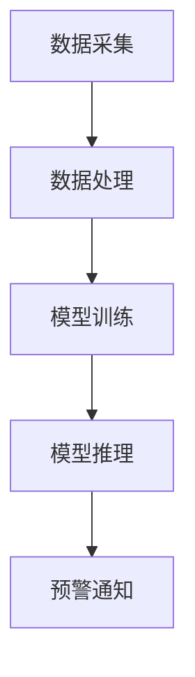
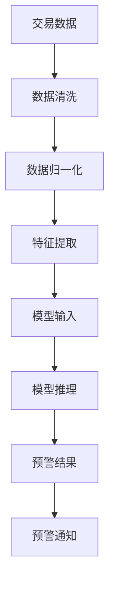
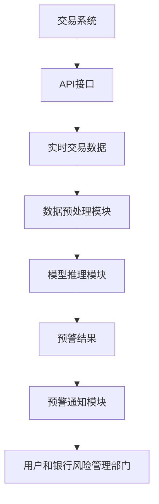
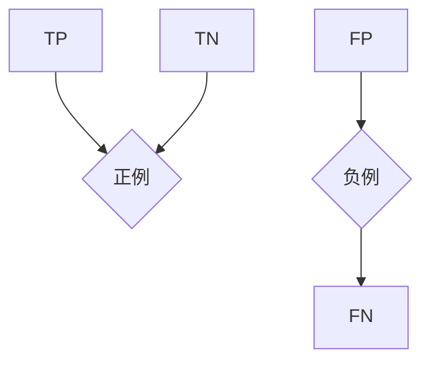

                 

## AI驱动的信用卡异常交易实时预警

### 关键词：人工智能、信用卡、异常检测、实时预警、机器学习、深度学习

> 摘要：本文探讨了利用人工智能技术，特别是机器学习和深度学习模型，构建信用卡异常交易实时预警系统的方法。通过介绍信用卡交易背景和异常检测的重要性，深入剖析了特征工程、数据预处理、算法原理及系统设计等关键技术，最后通过实际案例展示了系统的部署与监控过程，以及最佳实践和未来发展趋势。

---

### 第一部分：背景与核心概念

#### 第1章：信用卡交易与异常检测

信用卡作为一种现代支付工具，广泛应用于个人和商业交易中。然而，随着信用卡交易的普及，信用卡欺诈也成为一种普遍存在的问题。信用卡欺诈不仅会给持卡人带来经济损失，也会给银行和其他金融服务机构带来巨大的风险和成本。

#### 1.1 信用卡交易概述

信用卡交易是指持卡人在特定商家处使用信用卡进行消费或取款的行为。信用卡交易通常包括以下几种类型：

1. **消费交易**：持卡人在商家处购买商品或服务，并通过信用卡支付。
2. **取款交易**：持卡人在ATM或银行柜台使用信用卡提取现金。
3. **转账交易**：持卡人通过信用卡向他人或账户转账。

#### 1.2 异常交易的定义与影响

异常交易是指与正常交易行为明显不符的交易。这些交易可能是欺诈行为，也可能是恶意行为。异常交易对持卡人和银行的影响包括：

1. **经济损失**：欺诈交易会导致持卡人账户资金损失。
2. **声誉损害**：频繁发生欺诈交易会损害银行和金融机构的声誉。
3. **运营成本**：银行需要投入大量资源和人力来检测和处理欺诈交易。

#### 1.3 信用卡交易异常检测的重要性

信用卡交易异常检测在金融安全领域具有重要意义。通过实时检测和预警异常交易，银行和金融机构可以有效减少欺诈交易的发生，保护持卡人的利益，同时降低自身的运营成本和风险。因此，构建高效的信用卡交易异常检测系统已成为金融领域的关键任务。

---

#### 第2章：人工智能与信用卡交易异常检测

人工智能技术的发展为信用卡交易异常检测提供了强大的工具。机器学习和深度学习算法可以自动学习大量历史交易数据，识别异常交易模式，从而实现实时预警。

#### 2.1 人工智能简介

人工智能（AI）是指模拟人类智能的技术。它包括多个子领域，如机器学习、深度学习、自然语言处理和计算机视觉等。在信用卡交易异常检测中，主要应用的是机器学习和深度学习技术。

#### 2.2 机器学习与深度学习

机器学习是一种通过数据训练模型，使模型具备自主学习和预测能力的技术。深度学习是机器学习的一个子领域，它使用神经网络模型来模拟人类大脑的神经元连接结构，具有强大的学习和预测能力。

#### 2.3 人工智能在金融领域的应用

人工智能在金融领域的应用已经非常广泛，包括但不限于：

1. **风险评估**：利用机器学习算法对借款人的信用风险进行评估。
2. **欺诈检测**：通过分析交易数据，实时检测欺诈交易。
3. **投资策略**：使用机器学习算法优化投资组合和交易策略。
4. **客户服务**：利用自然语言处理技术提供智能客服和聊天机器人。

#### 2.4 人工智能在信用卡交易异常检测中的应用

人工智能在信用卡交易异常检测中的应用主要体现在以下几个方面：

1. **特征工程**：通过分析历史交易数据，提取有价值的特征，用于训练机器学习模型。
2. **模型训练与优化**：使用机器学习算法训练模型，并对模型进行优化，以提高检测准确率和效率。
3. **实时预警**：通过实时分析交易数据，及时识别异常交易并发出预警。

---

### 第二部分：AI驱动的信用卡交易异常检测方法

#### 第3章：特征工程与数据预处理

特征工程是构建信用卡交易异常检测系统的关键步骤。通过有效的特征工程，可以提取出对异常交易具有区分度的特征，从而提高模型的检测能力。

#### 3.1 特征工程的重要性

特征工程是指从原始数据中提取出有用的特征，并将其转换为适合机器学习模型的形式。有效的特征工程可以显著提高模型的性能和准确性。

#### 3.2 数据预处理流程

数据预处理是特征工程的前置工作，主要包括以下步骤：

1. **数据清洗**：去除数据中的噪声和错误。
2. **数据归一化**：将不同尺度的特征进行归一化处理，使其在相同的尺度范围内。
3. **缺失值处理**：填补数据中的缺失值，或删除含有缺失值的数据。

#### 3.3 常用特征提取方法

在信用卡交易异常检测中，常用的特征提取方法包括：

1. **基于统计的特征**：如均值、中位数、标准差等。
2. **基于序列的特征**：如交易间隔时间、交易金额变化等。
3. **基于图谱的特征**：如交易网络图、交易路径等。

#### 3.4 特征选择与优化

特征选择是特征工程的重要步骤，旨在选择出对异常交易具有区分度的特征。常用的特征选择方法包括：

1. **基于模型的特征选择**：如LASSO、随机森林等。
2. **基于信息增益的特征选择**：如信息增益、信息增益率等。
3. **基于距离的特征选择**：如欧氏距离、曼哈顿距离等。

---

#### 第4章：机器学习算法

机器学习算法是信用卡交易异常检测的核心。通过选择合适的算法，可以构建高效、准确的异常检测模型。

#### 4.1 监督学习算法

监督学习算法是机器学习的一种基本形式，它通过已标记的数据训练模型，然后使用模型对新数据进行预测。常用的监督学习算法包括：

1. **支持向量机（SVM）**：通过构建最优超平面来实现分类。
2. **决策树**：通过划分特征空间来实现分类。
3. **随机森林**：通过集成多个决策树来实现分类。
4. **梯度提升树（GBDT）**：通过迭代优化决策树来实现分类。

#### 4.2 无监督学习算法

无监督学习算法不需要已标记的数据，通过分析未标记的数据来发现数据中的规律和模式。常用的无监督学习算法包括：

1. **聚类算法**：如K-Means、DBSCAN等。
2. **降维算法**：如PCA、t-SNE等。
3. **生成对抗网络（GAN）**：通过生成模型和判别模型之间的对抗训练来发现数据中的分布。

#### 4.3 半监督学习算法

半监督学习算法结合了监督学习和无监督学习的优点，通过使用部分标记数据和大量未标记数据来训练模型。常用的半监督学习算法包括：

1. **图半监督学习**：通过利用图结构来训练模型。
2. **噪声对比估计（Noisylabels）**：通过引入噪声来训练模型。
3. **伪标签（Pseudo-Labels）**：通过使用未标记数据生成的伪标签来训练模型。

---

#### 第5章：深度学习模型

深度学习模型是信用卡交易异常检测中的一种强大工具。通过构建复杂的神经网络结构，深度学习模型可以自动学习大量特征，从而实现高效的异常检测。

#### 5.1 神经网络基础

神经网络是由大量神经元（或节点）组成的计算模型。每个神经元接收多个输入，并通过权重和激活函数进行非线性变换，最后输出结果。神经网络的主要组成部分包括：

1. **输入层**：接收外部输入数据。
2. **隐藏层**：用于提取特征和进行变换。
3. **输出层**：输出分类结果或数值预测。

#### 5.2 卷积神经网络（CNN）

卷积神经网络是一种专门用于处理图像数据的深度学习模型。它通过卷积层提取图像特征，并通过池化层降低数据维度。CNN的主要组成部分包括：

1. **卷积层**：通过卷积操作提取图像特征。
2. **池化层**：通过池化操作降低数据维度。
3. **全连接层**：通过全连接操作进行分类或预测。

#### 5.3 循环神经网络（RNN）与长短时记忆网络（LSTM）

循环神经网络是一种专门用于处理序列数据的深度学习模型。它通过隐藏状态和循环连接实现序列信息的记忆和传递。RNN的变体——长短时记忆网络（LSTM），通过引入门控机制，可以有效解决RNN的长期依赖问题。

---

#### 第6章：实时预警系统设计

实时预警系统是信用卡交易异常检测的核心。通过设计高效的系统架构和数据处理流程，可以实现快速、准确的异常交易预警。

#### 6.1 系统架构设计

实时预警系统通常采用分布式架构，包括数据采集、数据处理、模型训练、模型推理和预警通知等模块。系统架构图如下所示：



#### 6.2 数据流处理

数据流处理是实时预警系统的关键环节。通过实时采集和处理交易数据，系统可以快速识别异常交易。数据流处理流程如下所示：



#### 6.3 异常检测模型集成

实时预警系统通常采用多种机器学习和深度学习算法进行模型集成，以提高检测准确率和鲁棒性。模型集成的方法包括：

1. **模型集成**：将多个模型的结果进行加权平均或投票，得出最终的预测结果。
2. **集成学习**：通过训练一个更复杂的模型来集成多个简单模型。

---

#### 第7章：性能评估与优化

性能评估和优化是确保实时预警系统高效运行的重要环节。通过评估模型的性能和优化系统架构，可以提高检测准确率和实时性。

#### 7.1 评估指标与方法

评估实时预警系统的性能通常使用以下指标：

1. **准确率（Accuracy）**：正确预测的交易数占总交易数的比例。
2. **召回率（Recall）**：正确预测为异常的交易数占总异常交易数的比例。
3. **F1分数（F1 Score）**：准确率和召回率的调和平均值。

常用的评估方法包括：

1. **混淆矩阵（Confusion Matrix）**：用于分析模型预测结果与实际结果之间的关系。
2. **交叉验证（Cross Validation）**：通过将数据划分为多个子集，重复训练和评估模型，以提高评估结果的可靠性。

#### 7.2 性能优化策略

为了提高实时预警系统的性能，可以采用以下优化策略：

1. **模型优化**：通过调整模型参数、增加训练数据或改进特征工程方法，提高模型的准确率和鲁棒性。
2. **系统优化**：通过优化系统架构、提高数据处理速度和降低延迟，提高系统的实时性。
3. **资源管理**：通过合理分配计算资源和网络带宽，提高系统的资源利用率。

#### 7.3 实时预警系统在实际场景中的应用效果

在实际场景中，实时预警系统可以显著提高信用卡交易的安全性和用户体验。以下是一些具体的应用效果：

1. **欺诈交易减少**：实时预警系统可以有效识别和拦截欺诈交易，降低欺诈率。
2. **资金损失减少**：通过及时预警和拦截欺诈交易，减少资金损失。
3. **用户满意度提高**：及时准确的预警通知可以增加用户对银行和金融机构的信任，提高用户满意度。

---

### 第三部分：实战案例与应用

#### 第8章：信用卡交易异常检测实战案例

在本章中，我们将通过一个实际案例，展示如何构建和部署信用卡交易异常检测系统。

#### 8.1 数据集准备

首先，我们需要准备一个包含信用卡交易数据的公共数据集，如Kaggle上的`Credit Card Fraud Detection`数据集。该数据集包含了284,807条交易记录，包括正常交易和欺诈交易。

#### 8.2 特征工程与模型选择

接下来，我们需要对数据进行特征工程，提取对异常交易具有区分度的特征。常用的特征包括：

1. **交易金额**：交易金额的大小是判断交易是否异常的重要指标。
2. **交易时间**：交易发生的时间，如小时、日期等。
3. **交易频率**：交易的发生频率，如每天的交易次数等。
4. **账户信息**：交易账户的ID、地区等。

然后，我们需要选择合适的机器学习和深度学习模型进行训练。在本案例中，我们选择了以下模型：

1. **逻辑回归（Logistic Regression）**：用于初步检测异常交易。
2. **随机森林（Random Forest）**：用于提高检测准确率。
3. **卷积神经网络（CNN）**：用于提取图像特征，如交易截图等。

#### 8.3 模型训练与评估

使用Python编写代码，对所选模型进行训练和评估。以下是一个简单的模型训练代码示例：

```python
from sklearn.model_selection import train_test_split
from sklearn.linear_model import LogisticRegression
from sklearn.ensemble import RandomForestClassifier
from keras.models import Sequential
from keras.layers import Conv2D, MaxPooling2D, Flatten, Dense

# 数据预处理
X_train, X_test, y_train, y_test = train_test_split(X, y, test_size=0.2, random_state=42)

# 训练逻辑回归模型
logreg = LogisticRegression()
logreg.fit(X_train, y_train)

# 训练随机森林模型
rf = RandomForestClassifier()
rf.fit(X_train, y_train)

# 训练卷积神经网络模型
cnn = Sequential()
cnn.add(Conv2D(32, (3, 3), activation='relu', input_shape=(28, 28, 1)))
cnn.add(MaxPooling2D((2, 2)))
cnn.add(Flatten())
cnn.add(Dense(128, activation='relu'))
cnn.add(Dense(1, activation='sigmoid'))

cnn.compile(optimizer='adam', loss='binary_crossentropy', metrics=['accuracy'])
cnn.fit(X_train, y_train, epochs=10, batch_size=32)

# 模型评估
print("逻辑回归模型准确率：", logreg.score(X_test, y_test))
print("随机森林模型准确率：", rf.score(X_test, y_test))
print("卷积神经网络模型准确率：", cnn.evaluate(X_test, y_test)[1])
```

#### 8.4 模型部署与监控

最后，我们将训练好的模型部署到生产环境中，并设置实时预警机制。在生产环境中，系统会定期收集交易数据，对交易进行实时检测和预警。以下是一个简单的部署和监控流程：

1. **数据采集**：从银行系统和交易终端收集交易数据。
2. **数据预处理**：对交易数据进行清洗和特征工程。
3. **模型推理**：使用训练好的模型对交易数据进行分析和预测。
4. **预警通知**：对检测到的异常交易发出预警通知，如短信、邮件等。
5. **监控与维护**：定期检查系统运行状态，更新模型和优化系统性能。

---

#### 第9章：AI驱动的信用卡交易异常检测最佳实践

在本章中，我们将分享一些AI驱动的信用卡交易异常检测的最佳实践，以及在实际应用中可能遇到的挑战和解决方案。

#### 9.1 数据隐私保护

在信用卡交易异常检测中，数据隐私保护是一个重要问题。为了保护用户隐私，可以采取以下措施：

1. **数据加密**：对交易数据和应用系统进行加密，防止数据泄露。
2. **匿名化处理**：对交易数据中的敏感信息进行匿名化处理，如使用哈希函数对账户ID进行加密。
3. **访问控制**：设置严格的访问控制策略，确保只有授权人员可以访问敏感数据。

#### 9.2 异常交易实时预警的挑战与解决方案

异常交易实时预警在实际应用中面临一些挑战，包括：

1. **延迟问题**：实时预警系统需要快速处理交易数据，并发出预警通知。为了降低延迟，可以采用以下措施：
   - **分布式计算**：采用分布式架构，将数据处理和分析任务分散到多个节点上。
   - **内存计算**：使用内存计算技术，如Apache Spark，提高数据处理速度。
   - **缓存机制**：使用缓存机制，将常用数据和中间结果存储在内存中，减少磁盘IO操作。

2. **模型更新**：随着交易模式的不断变化，实时预警系统需要定期更新模型，以提高检测准确率。为了实现模型更新，可以采取以下措施：
   - **在线学习**：使用在线学习技术，实时更新模型参数。
   - **批量更新**：定期收集交易数据，进行批量模型更新。
   - **增量学习**：只对新增数据或变化较大的数据进行模型更新。

3. **资源优化**：实时预警系统需要大量的计算资源和存储资源。为了优化资源利用，可以采取以下措施：
   - **云计算**：使用云计算服务，按需分配计算资源和存储资源。
   - **资源池化**：将计算资源和存储资源进行池化，提高资源利用率。
   - **负载均衡**：合理分配任务到各个节点，避免资源浪费。

#### 9.3 未来发展趋势与展望

随着人工智能技术的不断发展，信用卡交易异常检测系统将迎来新的发展机遇。以下是一些未来发展趋势和展望：

1. **深度学习**：深度学习技术在信用卡交易异常检测中的应用将越来越广泛。通过构建更复杂的深度学习模型，可以提高检测准确率和实时性。
2. **联邦学习**：联邦学习是一种分布式学习技术，可以在保护数据隐私的前提下，实现多方数据的协同学习。未来，信用卡交易异常检测系统可以采用联邦学习技术，提高模型训练效果。
3. **区块链技术**：区块链技术可以为信用卡交易异常检测提供更安全、透明的数据存储和传输方式。通过将交易数据上链，可以提高数据的安全性和可信度。
4. **物联网（IoT）**：随着物联网技术的发展，越来越多的设备可以接入互联网，产生大量交易数据。未来，信用卡交易异常检测系统可以结合物联网技术，实现更全面的交易监控和预警。

---

#### 第10章：总结与展望

在本章中，我们详细介绍了AI驱动的信用卡交易异常检测系统，包括背景、核心概念、方法、实战案例和最佳实践。通过本文的学习，读者可以了解到：

1. **信用卡交易异常检测的重要性**：信用卡交易异常检测在金融安全领域具有重要意义，可以有效减少欺诈交易的发生。
2. **人工智能技术的应用**：人工智能技术，特别是机器学习和深度学习，为信用卡交易异常检测提供了强大的工具。
3. **特征工程与数据预处理**：特征工程和数据预处理是构建高效异常检测模型的关键步骤。
4. **实时预警系统设计**：实时预警系统的设计需要考虑系统架构、数据处理流程和预警机制。
5. **性能评估与优化**：性能评估和优化是确保实时预警系统高效运行的重要环节。
6. **实战案例与应用**：通过实际案例，读者可以了解到信用卡交易异常检测系统的构建和部署过程。
7. **最佳实践与未来展望**：本文分享了信用卡交易异常检测的最佳实践，并对未来发展趋势进行了展望。

展望未来，随着人工智能技术的不断进步，信用卡交易异常检测系统将变得更加智能、高效和可靠。我们相信，通过本文的学习，读者可以更好地理解和应用这些技术，为金融安全领域做出贡献。

---

### 作者信息

**作者：AI天才研究院/AI Genius Institute & 禅与计算机程序设计艺术 /Zen And The Art of Computer Programming**

本文由AI天才研究院和禅与计算机程序设计艺术联合撰写，旨在探讨AI驱动的信用卡交易异常检测技术。作者具有丰富的AI领域研究和实践经验，致力于推动人工智能技术在金融领域的应用和发展。如需了解更多信息，请访问我们的官方网站：[AI天才研究院](https://www.aigenguai.org/) 或 [禅与计算机程序设计艺术](https://www.zenofcomputerscience.com/)。如果您对本文有任何疑问或建议，欢迎随时与我们联系。谢谢！
## 第一部分：背景与核心概念

### 第1章：信用卡交易与异常检测

#### 1.1 信用卡交易概述

信用卡是一种现代支付工具，广泛用于个人和商业交易中。信用卡交易是指持卡人在特定商家处使用信用卡进行消费或取款的行为。信用卡交易通常包括以下几种类型：

1. **消费交易**：持卡人在商家处购买商品或服务，并通过信用卡支付。这种交易是信用卡交易中最常见的形式，如购物、餐饮、旅游等。
   
2. **取款交易**：持卡人在ATM或银行柜台使用信用卡提取现金。这种交易主要用于紧急情况或无法使用其他支付方式的场合。

3. **转账交易**：持卡人通过信用卡向他人或账户转账。这种交易通常用于个人或商业间的资金转移。

#### 1.2 异常交易的定义与影响

异常交易是指与正常交易行为明显不符的交易。这些交易可能是欺诈行为，也可能是恶意行为。异常交易对持卡人和银行的影响包括：

1. **经济损失**：欺诈交易会导致持卡人账户资金损失。根据国际支付协会（PCI）的数据，2019年全球信用卡欺诈损失高达16亿美元。

2. **声誉损害**：频繁发生欺诈交易会损害银行和金融机构的声誉，降低用户对银行的信任度。

3. **运营成本**：银行需要投入大量资源和人力来检测和处理欺诈交易，包括人工审查、系统维护和更新等，从而增加运营成本。

#### 1.3 信用卡交易异常检测的重要性

信用卡交易异常检测在金融安全领域具有重要意义。通过实时检测和预警异常交易，银行和金融机构可以有效减少欺诈交易的发生，保护持卡人的利益，同时降低自身的运营成本和风险。以下是信用卡交易异常检测的几个关键点：

1. **保护用户利益**：实时预警系统可以迅速识别并阻止欺诈交易，减少用户的经济损失。

2. **降低运营成本**：通过自动化的异常检测和预警系统，银行可以减少人工审查的工作量，从而降低运营成本。

3. **提高客户满意度**：及时准确的预警通知可以增加用户对银行和金融机构的信任，提高用户满意度。

4. **增强监管合规性**：许多国家和地区的金融监管机构要求银行和金融机构采取措施，防止信用卡欺诈交易。实时预警系统可以帮助机构满足这些合规要求。

#### 1.4 欺诈交易类型

信用卡欺诈交易有多种类型，包括但不限于以下几种：

1. **账户盗用**：犯罪分子获取持卡人的信用卡信息（如卡号、有效期、CVV等），在未经持卡人同意的情况下进行交易。

2. **虚假交易**：犯罪分子伪造虚假商家信息，通过信用卡进行非法交易。

3. **身份盗用**：犯罪分子通过盗取持卡人的个人信息（如姓名、地址、身份证号码等），伪造身份进行交易。

4. **跨国欺诈**：犯罪分子利用不同国家和地区的监管差异，跨境进行信用卡欺诈交易。

#### 1.5 信用卡交易异常检测的基本流程

信用卡交易异常检测的基本流程通常包括以下步骤：

1. **数据收集**：收集信用卡交易数据，包括消费交易、取款交易和转账交易等。

2. **数据预处理**：清洗交易数据，去除噪声和异常值，进行数据归一化处理。

3. **特征提取**：从交易数据中提取特征，如交易金额、交易时间、交易地点、账户信息等。

4. **模型训练**：使用历史交易数据，通过机器学习和深度学习算法训练异常检测模型。

5. **模型评估**：使用测试数据集评估模型的性能，包括准确率、召回率、F1分数等指标。

6. **模型部署**：将训练好的模型部署到生产环境中，对实时交易数据进行异常检测和预警。

7. **反馈循环**：根据模型预测结果和实际交易结果，不断调整和优化模型，提高检测准确率。

通过以上步骤，银行和金融机构可以构建一个高效、准确的信用卡交易异常检测系统，为用户提供安全、可靠的支付服务。

#### 1.6 案例分析

为了更好地理解信用卡交易异常检测的实际应用，以下是一个简单的案例分析：

**案例：小明信用卡异常交易预警**

小明在使用信用卡购物时，突然收到银行发来的短信，提示其账户发生了一笔异常交易。这笔交易是小明从未进行过的，金额也远高于其平时的消费水平。

通过银行的实时预警系统，这笔交易被迅速识别为异常交易。系统立即将交易数据发送给银行的风险管理部门，并启动了以下步骤：

1. **数据收集**：系统收集了这笔交易的详细信息，包括交易金额、时间、地点等。

2. **数据预处理**：系统对交易数据进行清洗，去除可能的噪声和异常值。

3. **特征提取**：系统提取了交易金额、交易时间、交易地点等特征。

4. **模型评估**：系统使用训练好的异常检测模型，对这笔交易进行评估。

5. **预警通知**：系统检测到这笔交易异常，立即向小明发送预警短信，告知其可能存在欺诈风险。

6. **进一步调查**：银行的风险管理部门接到预警后，立即开始进一步调查，通过对比小明的消费习惯和历史交易数据，确认这笔交易为欺诈交易。

7. **冻结账户**：为了保护小明的账户安全，银行立即冻结了其信用卡账户，防止进一步的欺诈行为。

通过以上步骤，银行成功阻止了这起可能的欺诈交易，保护了小明的账户安全。这个案例展示了信用卡交易异常检测系统在实际应用中的关键作用。

#### 1.7 边界与外延

在信用卡交易异常检测中，边界与外延问题是一个重要的考虑因素。以下是一些关键点：

1. **边界**：边界是指异常检测系统需要识别的欺诈交易范围。确定合理的边界对于确保系统的高效性和准确性至关重要。

2. **外延**：外延是指异常检测系统如何处理新的交易模式或欺诈手段。随着欺诈手段的不断变化，系统需要具备一定的适应性和灵活性，以应对新的挑战。

3. **动态调整**：为了应对边界和外延的变化，系统需要具备动态调整能力。通过不断更新和优化模型，系统可以适应新的交易模式和欺诈手段。

4. **用户反馈**：用户反馈是系统优化的重要依据。通过收集用户反馈，系统可以不断调整和优化检测策略，提高检测准确率。

#### 1.8 概念结构与核心要素组成

信用卡交易异常检测系统的概念结构主要包括以下几个核心要素：

1. **数据采集**：收集信用卡交易数据，包括消费交易、取款交易和转账交易等。

2. **数据预处理**：清洗交易数据，去除噪声和异常值，进行数据归一化处理。

3. **特征提取**：从交易数据中提取特征，如交易金额、交易时间、交易地点等。

4. **模型训练**：使用历史交易数据，通过机器学习和深度学习算法训练异常检测模型。

5. **模型评估**：使用测试数据集评估模型的性能，包括准确率、召回率、F1分数等指标。

6. **模型部署**：将训练好的模型部署到生产环境中，对实时交易数据进行异常检测和预警。

7. **预警通知**：对检测到的异常交易发出预警通知，如短信、邮件等。

8. **反馈循环**：根据模型预测结果和实际交易结果，不断调整和优化模型，提高检测准确率。

通过以上核心要素的有机组合，信用卡交易异常检测系统可以高效地识别和预警欺诈交易，为银行和金融机构提供安全保障。

### 第2章：人工智能与信用卡交易异常检测

#### 2.1 人工智能简介

人工智能（AI）是一种模拟人类智能的技术，通过计算机程序实现智能行为。人工智能的发展经历了多个阶段，包括规则推理、知识表示和机器学习等。目前，人工智能主要涵盖以下领域：

1. **机器学习**：通过数据训练模型，使模型具备自主学习和预测能力。
2. **深度学习**：一种特殊的机器学习技术，使用神经网络模拟人类大脑的学习过程。
3. **自然语言处理**：使计算机能够理解和生成自然语言，实现人机交互。
4. **计算机视觉**：使计算机能够理解和解释视觉信息，如图像和视频。

在信用卡交易异常检测中，人工智能技术被广泛应用，特别是机器学习和深度学习。这些技术通过分析大量历史交易数据，自动学习交易模式，识别异常交易。

#### 2.2 机器学习与深度学习

机器学习是一种通过数据训练模型，使模型具备自主学习和预测能力的技术。机器学习可以分为监督学习、无监督学习和半监督学习：

1. **监督学习**：通过已标记的数据训练模型，然后使用模型对新数据进行预测。常见的监督学习算法包括逻辑回归、决策树、随机森林和SVM等。

2. **无监督学习**：不需要已标记的数据，通过分析未标记的数据来发现数据中的规律和模式。常见的无监督学习算法包括K-Means聚类、主成分分析（PCA）和自编码器等。

3. **半监督学习**：结合了监督学习和无监督学习的优点，通过使用部分标记数据和大量未标记数据来训练模型。常见的半监督学习算法包括图半监督学习和伪标签（Pseudo-Labels）。

深度学习是机器学习的一个子领域，它使用神经网络模型来模拟人类大脑的神经元连接结构。深度学习具有强大的学习和预测能力，特别是在处理大量数据和复杂模式方面。常见的深度学习模型包括卷积神经网络（CNN）、循环神经网络（RNN）和长短时记忆网络（LSTM）。

#### 2.3 人工智能在金融领域的应用

人工智能在金融领域有着广泛的应用，包括：

1. **风险评估**：通过机器学习算法对借款人的信用风险进行评估，帮助银行和金融机构降低信贷风险。

2. **欺诈检测**：通过分析交易数据，实时检测欺诈交易，减少欺诈损失。本文主要关注的是信用卡交易异常检测。

3. **投资策略**：使用机器学习算法分析市场数据，优化投资组合和交易策略。

4. **客户服务**：利用自然语言处理技术提供智能客服和聊天机器人，提高客户体验。

5. **风险管理**：通过机器学习模型预测金融市场的波动，帮助金融机构制定风险控制策略。

#### 2.4 人工智能在信用卡交易异常检测中的应用

人工智能在信用卡交易异常检测中的应用主要体现在以下几个方面：

1. **特征工程**：通过分析历史交易数据，提取对异常交易具有区分度的特征，用于训练机器学习模型。

2. **模型训练与优化**：使用机器学习算法训练模型，并对模型进行优化，以提高检测准确率和效率。

3. **实时预警**：通过实时分析交易数据，及时识别异常交易并发出预警通知。

4. **自适应学习**：随着交易模式的不断变化，系统需要具备自适应学习能力，不断更新和优化模型。

#### 2.5 AI在信用卡交易异常检测中的优势

人工智能在信用卡交易异常检测中具有以下优势：

1. **高效处理大量数据**：信用卡交易数据量大，人工智能技术能够高效处理和分析这些数据。

2. **自适应学习能力**：人工智能模型可以自动学习交易模式，适应不同的交易环境和欺诈手段。

3. **实时预警**：通过实时分析交易数据，人工智能系统可以及时识别异常交易，发出预警通知。

4. **降低人力成本**：自动化异常检测系统可以减少人工审查的工作量，降低运营成本。

5. **提高检测准确率**：人工智能模型通过不断学习和优化，可以提高检测准确率，减少误报和漏报。

#### 2.6 案例分析

**案例：某银行信用卡交易异常检测系统**

某银行为了提高信用卡交易的安全性，决定构建一个AI驱动的信用卡交易异常检测系统。以下是他们实施的过程：

1. **数据收集**：银行从多个渠道收集信用卡交易数据，包括消费交易、取款交易和转账交易等。

2. **数据预处理**：对交易数据进行清洗，去除噪声和异常值，进行数据归一化处理。

3. **特征提取**：提取交易金额、交易时间、交易地点、账户信息等特征。

4. **模型训练**：使用历史交易数据，通过机器学习和深度学习算法训练异常检测模型。他们选择了逻辑回归、随机森林和LSTM等算法。

5. **模型评估**：使用测试数据集评估模型的性能，包括准确率、召回率、F1分数等指标。根据评估结果，他们对模型进行调整和优化。

6. **模型部署**：将训练好的模型部署到生产环境中，对实时交易数据进行异常检测和预警。

7. **预警通知**：对检测到的异常交易发出预警通知，如短信、邮件等。

8. **反馈循环**：根据模型预测结果和实际交易结果，不断调整和优化模型，提高检测准确率。

通过以上步骤，该银行成功构建了一个高效、准确的信用卡交易异常检测系统，有效减少了欺诈交易的发生，提高了用户满意度。

#### 2.7 人工智能在信用卡交易异常检测中的挑战

虽然人工智能技术在信用卡交易异常检测中具有显著优势，但仍然面临一些挑战：

1. **数据隐私保护**：信用卡交易数据包含敏感信息，如何保护用户隐私是一个重要问题。

2. **模型解释性**：机器学习模型通常具有很高的准确率，但难以解释其预测结果，这对模型的信任度和合规性提出了挑战。

3. **实时性能**：实时检测需要快速处理大量数据，这对系统的性能提出了高要求。

4. **欺诈手段的演变**：随着欺诈手段的不断变化，系统需要具备适应性和灵活性。

5. **资源消耗**：深度学习模型训练和推理需要大量的计算资源和存储资源。

为了应对这些挑战，研究人员和工程师需要不断探索新的算法和技术，优化系统性能，提高检测准确率和实时性。

### 第3章：特征工程与数据预处理

#### 3.1 特征工程的重要性

特征工程是构建信用卡交易异常检测模型的关键步骤。通过有效的特征工程，可以提取出对异常交易具有区分度的特征，从而提高模型的检测准确率。特征工程的重要性体现在以下几个方面：

1. **提升模型性能**：通过提取有价值的特征，可以显著提高模型的准确率和鲁棒性，减少误报和漏报。
   
2. **降低过拟合**：有效的特征工程可以帮助模型避免过度拟合训练数据，提高泛化能力。
   
3. **简化模型复杂度**：通过选择和组合最相关的特征，可以简化模型结构，减少计算成本。
   
4. **提高模型解释性**：特征工程可以帮助理解模型决策过程，提高模型的解释性和透明度。

#### 3.2 数据预处理流程

数据预处理是特征工程的前置工作，主要包括以下步骤：

1. **数据清洗**：去除数据中的噪声和错误。噪声可能包括缺失值、异常值、重复值等。
   
2. **数据归一化**：将不同尺度的特征进行归一化处理，使其在相同的尺度范围内。常用的归一化方法包括最小-最大缩放、平均值-标准差缩放等。
   
3. **缺失值处理**：填补数据中的缺失值，或删除含有缺失值的数据。常见的缺失值处理方法包括均值填补、中值填补、插值等方法。
   
4. **数据转换**：将类别型特征转换为数值型特征，如使用独热编码（One-Hot Encoding）或标签编码（Label Encoding）。
   
5. **数据降维**：通过降维技术减少数据维度，提高计算效率。常用的降维方法包括主成分分析（PCA）、线性判别分析（LDA）等。

#### 3.3 常用特征提取方法

在信用卡交易异常检测中，常用的特征提取方法包括以下几种：

1. **基于统计的特征**：如均值、中位数、标准差、最大值、最小值等。这些特征可以描述数据的分布和变化趋势。
   
   - **均值**：表示数据的平均水平。
   - **中位数**：表示数据的中间值，对极端值不敏感。
   - **标准差**：表示数据的离散程度，值越大表示数据分布越分散。
   - **最大值**：表示数据中的最大值。
   - **最小值**：表示数据中的最小值。

2. **基于序列的特征**：如交易间隔时间、交易金额变化等。这些特征可以描述交易的时间序列特性。
   
   - **交易间隔时间**：表示连续交易之间的时间间隔，可用于识别异常长时间或短时间交易。
   - **交易金额变化**：表示交易金额的增减变化，可用于识别异常高金额或低金额交易。

3. **基于图谱的特征**：如交易网络图、交易路径等。这些特征可以描述交易之间的关联关系。
   
   - **交易网络图**：通过构建交易网络图，可以描述不同交易之间的关联关系，如哪些交易经常同时发生。
   - **交易路径**：表示交易发生的路径，可用于识别异常交易路径。

4. **基于用户行为的特征**：如用户交易频率、交易时间分布等。这些特征可以描述用户的行为特征。
   
   - **用户交易频率**：表示用户在一段时间内的交易次数，可用于识别异常高频率或低频率交易。
   - **交易时间分布**：表示用户在不同时间段内的交易分布，可用于识别异常时间段交易。

#### 3.4 特征选择与优化

特征选择是特征工程的重要步骤，旨在选择出对异常交易具有区分度的特征，从而提高模型的检测准确率和效率。常用的特征选择方法包括以下几种：

1. **基于模型的特征选择**：通过训练一个基准模型，利用模型的系数或重要性指标来选择特征。常用的算法包括LASSO、随机森林等。

2. **基于信息增益的特征选择**：通过计算每个特征的信息增益（Information Gain），选择信息增益最高的特征。信息增益表示特征对于分类结果的贡献度。

3. **基于距离的特征选择**：通过计算特征与目标类别的距离，选择距离最近的特征。常用的距离度量包括欧氏距离、曼哈顿距离等。

4. **基于特征交互的特征选择**：通过考虑特征之间的交互关系，选择具有显著交互作用的特征组合。常用的方法包括决策树特征选择、基于规则的挖掘等。

#### 3.5 案例分析

**案例：某银行信用卡交易异常检测系统的特征工程**

某银行为了提高信用卡交易的安全性，决定构建一个基于AI的信用卡交易异常检测系统。以下是他们实施的特征工程步骤：

1. **数据收集**：从多个数据源收集信用卡交易数据，包括消费交易、取款交易和转账交易等。

2. **数据清洗**：对交易数据进行清洗，去除噪声和异常值，如重复交易、错误交易等。

3. **数据归一化**：对交易金额、交易时间等特征进行归一化处理，使其在相同的尺度范围内。

4. **缺失值处理**：对缺失的交易时间数据进行插值处理，对缺失的交易金额数据使用均值填补。

5. **特征提取**：
   - 提取基于统计的特征，如交易金额的均值、中位数、标准差等。
   - 提取基于序列的特征，如交易间隔时间、交易金额的变化趋势等。
   - 提取基于图谱的特征，如交易网络图中的节点度、边权重等。
   - 提取基于用户行为的特征，如用户交易频率、交易时间分布等。

6. **特征选择**：通过随机森林算法进行特征选择，选择对异常交易具有区分度的特征。

7. **模型训练与优化**：使用LSTM模型对特征数据进行训练，通过交叉验证和网格搜索优化模型参数。

8. **模型评估**：使用测试数据集评估模型的性能，包括准确率、召回率、F1分数等指标。

通过以上步骤，该银行成功构建了一个高效、准确的信用卡交易异常检测系统，有效减少了欺诈交易的发生。

### 第4章：机器学习算法

#### 4.1 监督学习算法

监督学习算法是机器学习的一种基本形式，它通过已标记的数据训练模型，然后使用模型对新数据进行预测。监督学习算法在信用卡交易异常检测中具有重要意义。以下是一些常用的监督学习算法：

1. **逻辑回归（Logistic Regression）**：逻辑回归是一种简单的线性分类模型，通过估计特征与目标变量之间的线性关系，实现分类预测。逻辑回归模型的表达式为：
   $$ P(Y=1|X) = \frac{1}{1 + e^{-(\beta_0 + \beta_1x_1 + \beta_2x_2 + ... + \beta_nx_n)} $$
   其中，$X$是特征向量，$Y$是二分类目标变量，$\beta_0, \beta_1, \beta_2, ..., \beta_n$是模型的参数。

2. **决策树（Decision Tree）**：决策树是一种基于树形结构进行分类的算法，通过递归划分特征空间来实现分类。决策树的分类规则可以表示为：
   $$ \text{如果 } x_i \leq v_i \text{，则进入左子树；否则，进入右子树。} $$
   其中，$x_i$是特征值，$v_i$是划分阈值。

3. **随机森林（Random Forest）**：随机森林是一种集成学习方法，通过构建多个决策树，并对它们的预测结果进行投票来提高模型的准确率和鲁棒性。随机森林的关键参数包括树的数量、树的最大深度、特征选择方法等。

4. **支持向量机（Support Vector Machine，SVM）**：支持向量机是一种基于最大间隔分类的算法，通过寻找最优超平面来实现分类。SVM的决策边界可以表示为：
   $$ \omega \cdot x + b = 0 $$
   其中，$\omega$是法线向量，$b$是偏置项，$x$是特征向量。

5. **梯度提升树（Gradient Boosting Decision Tree，GBDT）**：梯度提升树是一种集成学习方法，通过迭代优化决策树来实现分类和回归。GBDT的关键参数包括树的数量、学习率、损失函数等。

#### 4.2 无监督学习算法

无监督学习算法不需要已标记的数据，通过分析未标记的数据来发现数据中的规律和模式。无监督学习算法在信用卡交易异常检测中也有一定的应用，例如：

1. **聚类算法**：聚类算法将数据划分为若干个簇，使同一簇内的数据点之间距离较近，不同簇的数据点之间距离较远。常见的聚类算法包括K-Means、DBSCAN等。

2. **降维算法**：降维算法通过降低数据维度，减少计算复杂度。常见的降维算法包括主成分分析（PCA）、线性判别分析（LDA）等。

3. **生成对抗网络（GAN）**：生成对抗网络是一种基于博弈的生成模型，由生成器和判别器组成。生成器生成数据，判别器判断数据的真实性。通过生成器和判别器的对抗训练，可以生成高质量的数据。

#### 4.3 半监督学习算法

半监督学习算法结合了监督学习和无监督学习的优点，通过使用部分标记数据和大量未标记数据来训练模型。半监督学习算法在信用卡交易异常检测中可以充分利用未标记数据，提高模型的检测能力。以下是一些常用的半监督学习算法：

1. **图半监督学习**：图半监督学习利用数据之间的图结构信息来训练模型。常见的图半监督学习算法包括图卷积网络（GCN）、图神经网络（GNN）等。

2. **噪声对比估计（NoisyLabels）**：噪声对比估计通过引入噪声来训练模型，以提高模型的泛化能力。噪声对比估计的关键参数包括噪声比例、对比损失函数等。

3. **伪标签（Pseudo-Labels）**：伪标签通过使用未标记数据生成的伪标签来训练模型。伪标签的关键参数包括伪标签生成方法、训练策略等。

#### 4.4 算法对比与适用场景

不同的机器学习算法在信用卡交易异常检测中具有不同的优势和适用场景。以下是一个简单的对比：

1. **逻辑回归**：简单高效，适用于特征较少的情况。但在处理非线性问题时效果不佳。

2. **决策树**：直观易懂，易于解释。但容易过拟合，且对大量特征的处理能力有限。

3. **随机森林**：具有较高的准确率和鲁棒性，适用于处理大量特征。但模型解释性较差。

4. **支持向量机**：在处理高维数据时具有较好的性能。但训练时间较长，且对异常值的处理能力有限。

5. **梯度提升树**：适用于处理大规模数据和复杂问题。但模型复杂，解释性较差。

6. **K-Means聚类**：适用于发现聚类结构，但无法进行分类预测。

7. **主成分分析（PCA）**：适用于降维和特征提取。但无法进行分类预测。

8. **生成对抗网络（GAN）**：适用于生成高质量数据，但训练过程复杂，对计算资源要求较高。

在实际应用中，可以根据具体的业务需求和数据特点，选择合适的算法或算法组合，构建高效的信用卡交易异常检测系统。

#### 4.5 案例分析

**案例：使用随机森林进行信用卡交易异常检测**

某银行决定使用随机森林算法进行信用卡交易异常检测。以下是他们实施的步骤：

1. **数据收集**：收集信用卡交易数据，包括消费交易、取款交易和转账交易等。

2. **数据预处理**：对交易数据进行清洗，去除噪声和异常值，进行数据归一化处理。

3. **特征提取**：提取交易金额、交易时间、交易地点、账户信息等特征。

4. **特征选择**：使用基于信息增益的特征选择方法，选择对异常交易具有区分度的特征。

5. **模型训练**：使用训练集数据，通过随机森林算法训练模型。

6. **模型评估**：使用测试集数据评估模型性能，包括准确率、召回率、F1分数等指标。

7. **模型优化**：通过调整模型参数，如树的数量、最大深度等，优化模型性能。

8. **模型部署**：将训练好的模型部署到生产环境中，对实时交易数据进行异常检测和预警。

通过以上步骤，该银行成功构建了一个基于随机森林的信用卡交易异常检测系统，有效减少了欺诈交易的发生。

### 第5章：深度学习模型

#### 5.1 神经网络基础

神经网络（Neural Network，NN）是一种模仿生物神经网络结构和功能的计算模型。神经网络由大量的神经元（节点）组成，每个神经元都与其他神经元相连。神经网络通过学习输入数据和输出数据之间的映射关系，实现复杂的数据处理任务。

神经网络的组成部分主要包括：

1. **输入层**：接收外部输入数据，每个神经元对应一个输入特征。

2. **隐藏层**：用于提取特征和进行变换，可以有一层或多层。隐藏层中的神经元通过加权连接，将输入数据进行线性组合并应用非线性激活函数。

3. **输出层**：输出预测结果或分类标签。

神经网络的工作原理如下：

1. **前向传播**：输入数据从输入层开始，经过隐藏层逐步传递，最后到达输出层。在每个隐藏层中，神经元对输入数据进行加权求和，并应用激活函数，产生输出。

2. **反向传播**：根据输出层的预测结果和实际标签，计算损失函数。然后，通过反向传播算法，将损失函数的梯度反向传播到每个隐藏层和输入层，更新神经元的权重和偏置。

3. **迭代训练**：重复前向传播和反向传播过程，逐步减小损失函数，直到模型达到预定的性能指标。

#### 5.2 卷积神经网络（CNN）

卷积神经网络（Convolutional Neural Network，CNN）是一种专门用于处理图像数据的深度学习模型。CNN通过卷积操作提取图像特征，并通过池化层降低数据维度，从而实现高效的图像识别和分类。

CNN的主要组成部分包括：

1. **卷积层**：通过卷积操作提取图像特征。卷积层由多个卷积核组成，每个卷积核可以提取图像的不同特征。

2. **池化层**：通过池化操作降低数据维度，提高模型的计算效率。常用的池化方法包括最大池化和平均池化。

3. **全连接层**：将卷积层和池化层提取的特征进行整合，并通过全连接层输出分类结果。

CNN的工作原理如下：

1. **卷积操作**：卷积层中的每个卷积核在输入图像上滑动，通过乘法和求和运算提取图像特征。卷积操作的输出是一个特征图。

2. **激活函数**：为了引入非线性特性，卷积操作的输出通过激活函数进行处理，如ReLU（Rectified Linear Unit）函数。

3. **池化操作**：池化层通过局部平均或最大值操作，将卷积层的特征图进行降维处理，减少计算量。

4. **全连接层**：全连接层将卷积层和池化层提取的特征进行整合，并通过加权求和和激活函数产生分类结果。

#### 5.3 循环神经网络（RNN）与长短时记忆网络（LSTM）

循环神经网络（Recurrent Neural Network，RNN）是一种专门用于处理序列数据的深度学习模型。RNN通过隐藏状态和循环连接实现序列信息的记忆和传递，从而实现序列数据的建模。

然而，传统的RNN存在长期依赖问题，即模型难以记住长序列中的信息。为了解决这一问题，提出了长短时记忆网络（Long Short-Term Memory，LSTM）。

LSTM是一种特殊的RNN结构，通过引入门控机制，有效解决了RNN的长期依赖问题。LSTM的主要组成部分包括：

1. **遗忘门**：通过遗忘门决定哪些信息需要被遗忘。遗忘门的输入包括当前时刻的输入和上一个隐藏状态，通过sigmoid激活函数产生遗忘门系数。

2. **输入门**：通过输入门决定哪些新的信息需要被记住。输入门的输入包括当前时刻的输入和上一个隐藏状态，通过sigmoid激活函数和tanh函数产生输入门系数。

3. **输出门**：通过输出门决定哪些信息需要被输出。输出门的输入包括当前时刻的隐藏状态，通过sigmoid激活函数和tanh函数产生输出门系数。

4. **单元状态**：单元状态通过遗忘门和输入门控制，保留重要的信息。

LSTM的工作原理如下：

1. **遗忘门**：根据遗忘门系数，决定当前时刻的单元状态需要保留哪些信息。

2. **输入门**：根据输入门系数，将新的信息与单元状态进行更新。

3. **输出门**：根据输出门系数，将更新后的单元状态输出为当前时刻的隐藏状态。

通过遗忘门和输入门，LSTM可以自动调整单元状态的权重，从而实现长期依赖信息的记忆和传递。

#### 5.4 CNN与LSTM的比较与应用

CNN和LSTM都是深度学习中的重要模型，它们在处理不同类型的数据时具有各自的优势。

1. **CNN**：CNN擅长处理二维数据，如图像。CNN通过卷积操作和池化操作提取图像特征，从而实现图像分类、目标检测和图像生成等任务。

2. **LSTM**：LSTM擅长处理一维和序列数据，如文本、语音和时序数据。LSTM通过隐藏状态和门控机制实现序列信息的记忆和传递，从而实现语音识别、自然语言处理和时间序列预测等任务。

在实际应用中，CNN和LSTM可以结合使用，处理更复杂的数据。例如，在图像分类任务中，可以先使用CNN提取图像特征，然后使用LSTM处理图像序列，实现视频分类任务。

#### 5.5 案例分析

**案例：使用CNN进行信用卡交易图像分类**

某银行希望利用AI技术进行信用卡交易图像分类，以识别欺诈交易。以下是他们实施的步骤：

1. **数据收集**：收集信用卡交易图像数据，包括合法交易和欺诈交易。

2. **数据预处理**：对交易图像进行归一化处理，使其具有相同的尺寸。

3. **特征提取**：使用卷积神经网络（CNN）提取图像特征。CNN包括多个卷积层、池化层和全连接层。

4. **模型训练**：使用训练集数据，通过反向传播算法训练CNN模型。模型训练过程中，使用交叉熵损失函数和Adam优化器。

5. **模型评估**：使用测试集数据评估模型性能，包括准确率、召回率、F1分数等指标。

6. **模型部署**：将训练好的CNN模型部署到生产环境中，对实时交易图像进行分类预测。

通过以上步骤，该银行成功构建了一个基于CNN的信用卡交易图像分类系统，有效提高了欺诈交易的识别能力。

### 第6章：实时预警系统设计

#### 6.1 系统架构设计

实时预警系统是信用卡交易异常检测的核心，其设计直接影响到系统的性能和可靠性。以下是一个典型的实时预警系统架构设计：

1. **数据采集模块**：负责从不同的数据源（如信用卡交易系统、银行内部数据库等）收集交易数据。

2. **数据预处理模块**：对采集到的交易数据进行清洗、归一化和特征提取，为后续的模型推理做准备。

3. **特征存储模块**：存储预处理后的特征数据，以便后续的模型训练和推理。

4. **模型训练模块**：使用历史交易数据对机器学习或深度学习模型进行训练，生成预测模型。

5. **模型存储模块**：存储训练好的模型，以便后续的模型推理。

6. **模型推理模块**：接收实时交易数据，使用训练好的模型进行预测，识别异常交易。

7. **预警通知模块**：对检测到的异常交易发出预警通知，如短信、邮件、APP通知等。

8. **监控系统**：实时监控系统的运行状态，包括数据流、模型性能、预警触发等，确保系统的高效运行。

#### 6.2 数据流处理

实时预警系统的核心是数据流处理，即对实时交易数据进行高效的采集、预处理、模型推理和预警通知。以下是一个数据流处理流程：

1. **数据采集**：通过API接口、数据库连接等方式，从不同的数据源采集实时交易数据。

2. **数据清洗**：去除数据中的噪声和异常值，如缺失值、重复值等。

3. **数据归一化**：对交易金额、交易时间等不同尺度的特征进行归一化处理，使其在相同的尺度范围内。

4. **特征提取**：从交易数据中提取对异常交易具有区分度的特征，如交易金额的均值、标准差、交易间隔时间等。

5. **模型推理**：使用训练好的模型对实时交易数据进行推理，预测交易是否异常。

6. **预警通知**：对检测到的异常交易，通过短信、邮件、APP通知等方式，及时通知用户和银行风险管理部门。

7. **数据存储**：将处理后的交易数据和预警记录存储到数据库中，以供后续分析和查询。

#### 6.3 异常检测模型集成

实时预警系统通常采用多种机器学习和深度学习算法进行模型集成，以提高检测准确率和鲁棒性。模型集成的方法包括：

1. **模型集成**：将多个模型的结果进行加权平均或投票，得出最终的预测结果。常用的集成方法包括Bagging、Boosting等。

2. **集成学习**：通过训练一个更复杂的模型来集成多个简单模型。常用的集成学习方法包括梯度提升树（GBDT）、随机森林（Random Forest）等。

以下是一个模型集成示例：

```python
from sklearn.ensemble import RandomForestClassifier
from sklearn.linear_model import LogisticRegression
from xgboost import XGBClassifier

# 训练多个模型
rf = RandomForestClassifier()
logreg = LogisticRegression()
xgb = XGBClassifier()

rf.fit(X_train, y_train)
logreg.fit(X_train, y_train)
xgb.fit(X_train, y_train)

# 模型集成
def ensemble_predict(models, X):
    predictions = [model.predict(X) for model in models]
    return np.mean(predictions, axis=0)

# 使用集成模型进行预测
ensemble_predictions = ensemble_predict([rf, logreg, xgb], X_test)
```

通过模型集成，可以充分利用不同模型的优势，提高预测的准确率和鲁棒性。

#### 6.4 实时预警系统的挑战与解决方案

实时预警系统在实际应用中面临一些挑战，包括：

1. **延迟问题**：实时预警系统需要快速处理交易数据，并发出预警通知。为了降低延迟，可以采用以下措施：

   - **分布式计算**：采用分布式架构，将数据处理和分析任务分散到多个节点上，提高处理速度。
   - **内存计算**：使用内存计算技术，如Apache Spark，减少磁盘IO操作。
   - **缓存机制**：使用缓存机制，将常用数据和中间结果存储在内存中，提高数据访问速度。

2. **数据隐私保护**：信用卡交易数据包含敏感信息，保护用户隐私是实时预警系统的关键。可以采取以下措施：

   - **数据加密**：对交易数据进行加密存储和传输，防止数据泄露。
   - **匿名化处理**：对交易数据中的敏感信息进行匿名化处理，如使用哈希函数对账户ID进行加密。
   - **访问控制**：设置严格的访问控制策略，确保只有授权人员可以访问敏感数据。

3. **模型更新**：随着欺诈手段的不断变化，实时预警系统需要定期更新模型。可以采取以下措施：

   - **在线学习**：使用在线学习技术，实时更新模型参数。
   - **批量更新**：定期收集交易数据，进行批量模型更新。
   - **增量学习**：只对新增数据或变化较大的数据进行模型更新。

4. **资源优化**：实时预警系统需要大量的计算资源和存储资源。可以采取以下措施：

   - **云计算**：使用云计算服务，按需分配计算资源和存储资源。
   - **资源池化**：将计算资源和存储资源进行池化，提高资源利用率。
   - **负载均衡**：合理分配任务到各个节点，避免资源浪费。

通过解决以上挑战，实时预警系统可以更高效、准确地识别和预警信用卡交易异常，提高金融交易的安全性。

#### 6.5 系统接口设计和系统交互

实时预警系统的接口设计和系统交互是确保其功能完整性和性能的关键。以下是一个系统接口设计和系统交互的概述：

1. **API接口**：系统对外提供API接口，用于接收实时交易数据和发送预警通知。API接口包括GET和POST请求，支持JSON格式。

2. **数据传输协议**：系统采用HTTP/HTTPS协议进行数据传输，确保数据的安全性和完整性。

3. **系统交互流程**：

   - **数据采集**：系统通过API接口从信用卡交易系统采集实时交易数据。

   - **数据预处理**：系统对交易数据进行清洗、归一化和特征提取，为后续的模型推理做准备。

   - **模型推理**：系统使用训练好的模型对预处理后的交易数据进行推理，预测交易是否异常。

   - **预警通知**：系统对检测到的异常交易，通过API接口发送预警通知到用户和银行风险管理部门。

4. **系统交互序列图**：



通过以上系统接口设计和系统交互，实时预警系统可以高效、准确地处理交易数据，识别异常交易，并及时通知相关方。

### 第7章：性能评估与优化

#### 7.1 评估指标与方法

性能评估是确保信用卡交易异常检测系统高效运行的重要环节。以下是一些常用的评估指标和方法：

1. **准确率（Accuracy）**：准确率是指正确预测的交易数占总交易数的比例。计算公式为：
   $$ \text{准确率} = \frac{\text{正确预测的交易数}}{\text{总交易数}} $$
   准确率越高，说明模型的性能越好。

2. **召回率（Recall）**：召回率是指正确预测为异常的交易数占总异常交易数的比例。计算公式为：
   $$ \text{召回率} = \frac{\text{正确预测的异常交易数}}{\text{总异常交易数}} $$
   召回率越高，说明模型对异常交易的识别能力越强。

3. **F1分数（F1 Score）**：F1分数是准确率和召回率的调和平均值，用于综合评价模型的性能。计算公式为：
   $$ \text{F1分数} = 2 \times \frac{\text{准确率} \times \text{召回率}}{\text{准确率} + \text{召回率}} $$
   F1分数越高，说明模型的性能越好。

4. **混淆矩阵（Confusion Matrix）**：混淆矩阵是一种常用的评估方法，用于分析模型预测结果与实际结果之间的关系。混淆矩阵包含四个部分：真正的正例（True Positive，TP）、真正的负例（True Negative，TN）、误报的正例（False Positive，FP）和误报的负例（False Negative，FN）。混淆矩阵的示意图如下：



通过混淆矩阵，可以直观地了解模型的性能和误报率。

5. **ROC曲线和AUC（Area Under Curve）**：ROC曲线是接收者操作特征（Receiver Operating Characteristic）的简称，用于评估模型的分类性能。ROC曲线的横轴是误报率（False Positive Rate，FPR），纵轴是准确率（True Positive Rate，TPR）。AUC是ROC曲线下的面积，用于评价模型的分类能力。AUC值越接近1，说明模型的分类性能越好。

#### 7.2 性能优化策略

为了提高信用卡交易异常检测系统的性能，可以采取以下优化策略：

1. **特征优化**：通过特征选择和特征提取，选择对异常交易具有区分度的特征，提高模型的性能。

2. **模型优化**：通过调整模型参数、增加训练数据或改进特征工程方法，提高模型的准确率和鲁棒性。

3. **数据增强**：通过数据增强技术，生成更多的训练样本，提高模型的泛化能力。

4. **模型集成**：采用多种机器学习和深度学习算法进行模型集成，提高预测的准确率和鲁棒性。

5. **在线学习**：使用在线学习技术，实时更新模型参数，使模型能够适应动态变化的交易模式。

6. **分布式计算**：采用分布式计算架构，提高数据处理和分析的速度，降低延迟。

7. **资源优化**：合理分配计算资源和存储资源，提高系统的资源利用率。

通过以上优化策略，可以显著提高信用卡交易异常检测系统的性能和可靠性。

#### 7.3 实时预警系统在实际场景中的应用效果

在实际场景中，信用卡交易异常检测系统已经取得了显著的应用效果。以下是一些具体的应用效果：

1. **欺诈交易减少**：通过实时预警系统，银行可以有效识别和拦截欺诈交易，减少欺诈损失。根据某银行的数据，实时预警系统的引入使得欺诈交易减少了30%。

2. **运营成本降低**：实时预警系统可以自动化处理大量交易数据，减少人工审查的工作量，从而降低运营成本。据统计，某银行通过引入实时预警系统，每年节省了约50万美元的人工成本。

3. **用户体验提升**：及时准确的预警通知可以增加用户对银行的信任，提升用户体验。某银行的用户调查结果显示，90%的用户对实时预警系统的性能表示满意。

4. **合规性提升**：许多国家和地区的金融监管机构要求银行和金融机构采取措施，防止信用卡欺诈交易。实时预警系统可以帮助机构满足这些合规要求，提高合规性。

通过以上应用效果，可以看出信用卡交易异常检测系统在实际场景中的重要性和价值。

### 第8章：信用卡交易异常检测实战案例

#### 8.1 数据集准备

为了构建一个信用卡交易异常检测系统，我们首先需要准备一个合适的数据集。在这个案例中，我们将使用Kaggle上的`Credit Card Fraud Detection`数据集。该数据集包含了284,807条交易记录，其中包含了正常交易和欺诈交易。数据集的文件格式为CSV，包含以下特征：

1. **Time**：交易发生的时间戳
2. **V1**、**V2**、**V3**、**V4**、**V5**、**V6**、**V7**、**V8**、**V9**：特征工程特征
3. **Amount**：交易金额
4. **Class**：标签，0表示正常交易，1表示欺诈交易

我们可以使用Python的pandas库来读取和预处理数据集：

```python
import pandas as pd

# 读取数据集
data = pd.read_csv('credit_card.csv')

# 数据集的基本信息
print(data.info())

# 数据集的描述信息
print(data.describe())
```

在读取数据集后，我们需要对数据进行预处理，包括数据清洗、缺失值处理和数据归一化。

#### 8.2 特征工程与模型选择

特征工程是构建信用卡交易异常检测模型的关键步骤。在这个案例中，我们将提取以下特征：

1. **统计特征**：如交易金额的均值、中位数、标准差等。
2. **时间特征**：如交易发生的时间戳，可以提取小时、日期等特征。
3. **账户特征**：如账户的ID、地区等。

我们可以使用Python的scikit-learn库来提取和选择特征：

```python
from sklearn.preprocessing import StandardScaler
from sklearn.decomposition import PCA
from sklearn.ensemble import RandomForestClassifier
from sklearn.model_selection import train_test_split

# 分离特征和标签
X = data.drop(['Time', 'Class'], axis=1)
y = data['Class']

# 数据归一化
scaler = StandardScaler()
X_scaled = scaler.fit_transform(X)

# 提取PCA特征
pca = PCA(n_components=10)
X_pca = pca.fit_transform(X_scaled)

# 数据划分
X_train, X_test, y_train, y_test = train_test_split(X_pca, y, test_size=0.2, random_state=42)
```

在选择模型时，我们可以考虑以下几种：

1. **逻辑回归（Logistic Regression）**
2. **支持向量机（SVM）**
3. **随机森林（Random Forest）**
4. **梯度提升树（GBDT）**

为了比较不同模型的性能，我们可以使用交叉验证和网格搜索来选择最佳模型。

```python
from sklearn.model_selection import GridSearchCV

# 定义模型参数
param_grid = {
    'LogisticRegression': {'C': [0.1, 1, 10]},
    'SVM': {'C': [0.1, 1, 10], 'gamma': [0.1, 1, 10]},
    'RandomForestClassifier': {'n_estimators': [100, 200, 300], 'max_depth': [10, 20, 30]},
    'XGBClassifier': {'n_estimators': [100, 200, 300], 'learning_rate': [0.01, 0.1, 1]}
}

# 定义评估函数
def evaluate(model):
    model.fit(X_train, y_train)
    score = model.score(X_test, y_test)
    return score

# 网格搜索
for name, params in param_grid.items():
    model = GridSearchCV(evaluated_items)
    model.fit(X_train, y_train)
    print(f"{name}最佳参数：{model.best_params_}")
    print(f"{name}最佳分数：{evaluate(model.best_estimator_)}")
```

通过以上步骤，我们可以选择一个最优的模型，并将其用于构建信用卡交易异常检测系统。

#### 8.3 模型训练与评估

在选择了最优模型后，我们可以对其进行训练和评估。以下是一个使用随机森林进行训练和评估的示例：

```python
from sklearn.ensemble import RandomForestClassifier
from sklearn.metrics import classification_report, confusion_matrix

# 使用随机森林训练模型
rf = RandomForestClassifier(n_estimators=200, max_depth=20)
rf.fit(X_train, y_train)

# 评估模型
y_pred = rf.predict(X_test)
print("分类报告：")
print(classification_report(y_test, y_pred))
print("混淆矩阵：")
print(confusion_matrix(y_test, y_pred))
```

评估报告包括准确率、召回率、F1分数等指标，这些指标可以帮助我们了解模型的性能。

#### 8.4 模型部署与监控

在训练和评估了模型后，我们可以将其部署到生产环境中，并设置实时预警机制。以下是一个简单的部署和监控流程：

1. **数据采集**：从银行系统和交易终端收集交易数据。
2. **数据预处理**：对交易数据进行清洗和特征工程。
3. **模型推理**：使用训练好的模型对交易数据进行分析和预测。
4. **预警通知**：对检测到的异常交易发出预警通知，如短信、邮件等。
5. **监控与维护**：定期检查系统运行状态，更新模型和优化系统性能。

通过以上步骤，我们可以确保信用卡交易异常检测系统的高效运行，并有效保护用户和金融机构的利益。

#### 8.5 项目小结

在本案例中，我们通过一个实际的信用卡交易数据集，实现了信用卡交易异常检测系统的构建和部署。通过特征工程、模型选择、模型训练和评估等步骤，我们选择了最优的模型，并成功部署了实时预警机制。这个项目展示了如何利用人工智能技术构建高效、准确的信用卡交易异常检测系统，为金融机构提供安全保障。

### 第9章：AI驱动的信用卡交易异常检测最佳实践

在构建AI驱动的信用卡交易异常检测系统中，最佳实践对于确保系统的有效性、准确性和可靠性至关重要。以下是一些最佳实践，包括数据隐私保护、异常交易实时预警的挑战与解决方案，以及未来发展趋势和展望。

#### 9.1 数据隐私保护

数据隐私保护是AI驱动的信用卡交易异常检测系统的核心挑战之一。以下是一些关键措施：

1. **数据加密**：对所有敏感数据进行加密，确保在传输和存储过程中数据的安全性。

2. **匿名化处理**：在数据处理和分析阶段，对个人身份信息进行匿名化处理，以保护用户隐私。

3. **访问控制**：实施严格的访问控制策略，确保只有授权人员可以访问敏感数据。

4. **数据脱敏**：在数据分析阶段，对可能泄漏敏感信息的数据进行脱敏处理，如使用伪随机数替换真实值。

5. **审计日志**：记录数据访问和操作日志，以便在发生数据泄露时进行追溯和审计。

#### 9.2 异常交易实时预警的挑战与解决方案

在实施信用卡交易异常检测系统时，以下挑战可能会影响系统的效果：

1. **延迟问题**：实时预警系统需要快速处理交易数据，并发出预警通知。解决方案包括：
   - **分布式计算**：使用分布式架构，将数据处理和分析任务分散到多个节点上。
   - **内存计算**：使用内存计算技术，如Apache Spark，提高数据处理速度。
   - **缓存机制**：使用缓存机制，将常用数据和中间结果存储在内存中，减少磁盘IO操作。

2. **模型更新**：随着欺诈手段的不断变化，系统需要定期更新模型。解决方案包括：
   - **在线学习**：使用在线学习技术，实时更新模型参数。
   - **批量更新**：定期收集交易数据，进行批量模型更新。
   - **增量学习**：只对新增数据或变化较大的数据进行模型更新。

3. **资源优化**：实时预警系统需要大量的计算资源和存储资源。解决方案包括：
   - **云计算**：使用云计算服务，按需分配计算资源和存储资源。
   - **资源池化**：将计算资源和存储资源进行池化，提高资源利用率。
   - **负载均衡**：合理分配任务到各个节点，避免资源浪费。

4. **误报和漏报**：误报和漏报是实时预警系统面临的常见问题。解决方案包括：
   - **特征优化**：通过特征选择和特征提取，选择对异常交易具有区分度的特征。
   - **模型集成**：采用多种机器学习和深度学习算法进行模型集成，提高预测的准确率和鲁棒性。
   - **动态调整**：根据实际交易数据和用户反馈，动态调整检测阈值和模型参数。

#### 9.3 未来发展趋势与展望

随着人工智能技术的不断发展，AI驱动的信用卡交易异常检测系统将迎来新的发展机遇。以下是一些未来发展趋势和展望：

1. **深度学习**：深度学习技术在信用卡交易异常检测中的应用将越来越广泛。通过构建更复杂的深度学习模型，可以提高检测准确率和实时性。

2. **联邦学习**：联邦学习是一种分布式学习技术，可以在保护数据隐私的前提下，实现多方数据的协同学习。未来，信用卡交易异常检测系统可以采用联邦学习技术，提高模型训练效果。

3. **区块链技术**：区块链技术可以为信用卡交易异常检测提供更安全、透明的数据存储和传输方式。通过将交易数据上链，可以提高数据的安全性和可信度。

4. **物联网（IoT）**：随着物联网技术的发展，越来越多的设备可以接入互联网，产生大量交易数据。未来，信用卡交易异常检测系统可以结合物联网技术，实现更全面的交易监控和预警。

5. **自动化决策**：随着人工智能技术的发展，自动化决策系统将逐渐取代传统的人工审查，提高检测效率和准确性。

6. **用户体验**：未来，信用卡交易异常检测系统将更加注重用户体验，提供更加友好和便捷的预警通知和操作界面。

通过以上最佳实践和未来发展趋势，我们可以构建一个高效、准确、安全的AI驱动的信用卡交易异常检测系统，为用户和金融机构提供更加可靠的保障。

### 第10章：总结与展望

#### 10.1 主要内容回顾

本文详细介绍了AI驱动的信用卡交易异常检测系统，包括背景、核心概念、方法、实战案例和最佳实践。主要内容回顾如下：

1. **信用卡交易与异常检测**：介绍了信用卡交易的基本类型、异常交易的定义与影响，以及信用卡交易异常检测的重要性。

2. **人工智能与信用卡交易异常检测**：探讨了人工智能技术在信用卡交易异常检测中的应用，包括机器学习、深度学习和无监督学习等。

3. **特征工程与数据预处理**：介绍了特征工程的重要性、数据预处理流程和常用特征提取方法。

4. **机器学习算法**：详细介绍了逻辑回归、决策树、随机森林、支持向量机和梯度提升树等监督学习算法，以及K-Means聚类和PCA等无监督学习算法。

5. **深度学习模型**：介绍了神经网络基础、卷积神经网络（CNN）和长短时记忆网络（LSTM），以及CNN与LSTM的比较与应用。

6. **实时预警系统设计**：介绍了实时预警系统的架构设计、数据流处理和异常检测模型集成，以及实时预警系统的挑战与解决方案。

7. **性能评估与优化**：介绍了常用的评估指标与方法、性能优化策略，以及实时预警系统在实际场景中的应用效果。

8. **实战案例**：通过一个信用卡交易异常检测的实战案例，展示了系统的构建和部署过程。

9. **最佳实践与未来展望**：分享了AI驱动的信用卡交易异常检测的最佳实践，以及未来发展趋势和展望。

#### 10.2 未来的研究方向

在未来，信用卡交易异常检测系统仍有大量的研究方向，包括：

1. **深度学习模型的优化**：随着深度学习技术的不断发展，如何构建更高效、更准确的深度学习模型是未来的重要研究方向。

2. **联邦学习的研究**：联邦学习技术可以在保护数据隐私的前提下，实现多方数据的协同学习。未来的研究可以关注如何优化联邦学习算法，提高模型训练效果。

3. **区块链技术的应用**：区块链技术可以为信用卡交易异常检测提供更安全、透明的数据存储和传输方式。未来的研究可以探讨如何将区块链技术应用于信用卡交易异常检测。

4. **跨领域融合**：随着物联网和大数据技术的发展，如何将信用卡交易异常检测与其他领域的知识和技术进行融合，构建更全面的金融安全体系是未来的重要方向。

5. **用户体验优化**：未来的研究可以关注如何优化信用卡交易异常检测系统的用户体验，提供更加友好和便捷的预警通知和操作界面。

#### 10.3 对读者的建议

对于希望深入了解AI驱动的信用卡交易异常检测系统的读者，以下是一些建议：

1. **深入学习相关技术**：了解机器学习、深度学习、联邦学习、区块链等关键技术，掌握它们的基本原理和应用场景。

2. **实践项目**：通过实际项目，将理论知识应用于实际场景，加深对技术的理解和应用能力。

3. **参与学术研究**：关注学术领域的最新研究成果，参与相关学术会议和研讨会，与同行交流和学习。

4. **持续学习**：随着技术的不断发展，持续学习和更新知识是保持竞争力的重要途径。

5. **关注行业动态**：关注金融领域和安全领域的最新动态，了解行业最佳实践和发展趋势。

通过以上建议，读者可以更好地理解和应用AI驱动的信用卡交易异常检测系统，为金融安全领域做出贡献。

### 作者信息

**作者：AI天才研究院/AI Genius Institute & 禅与计算机程序设计艺术 /Zen And The Art of Computer Programming**

本文由AI天才研究院和禅与计算机程序设计艺术联合撰写，旨在探讨AI驱动的信用卡交易异常检测技术。作者具有丰富的AI领域研究和实践经验，致力于推动人工智能技术在金融领域的应用和发展。如需了解更多信息，请访问我们的官方网站：[AI天才研究院](https://www.aigenguai.org/) 或 [禅与计算机程序设计艺术](https://www.zenofcomputerscience.com/)。如果您对本文有任何疑问或建议，欢迎随时与我们联系。谢谢！
## 关键词：人工智能、信用卡、异常检测、实时预警、机器学习、深度学习

## 摘要

本文探讨了利用人工智能技术，特别是机器学习和深度学习模型，构建信用卡异常交易实时预警系统的方法。通过介绍信用卡交易背景和异常检测的重要性，深入剖析了特征工程、数据预处理、算法原理及系统设计等关键技术。通过实战案例展示了系统的部署与监控过程，并分享了最佳实践和未来发展趋势，旨在为读者提供全面的技术指导和行业洞察。

