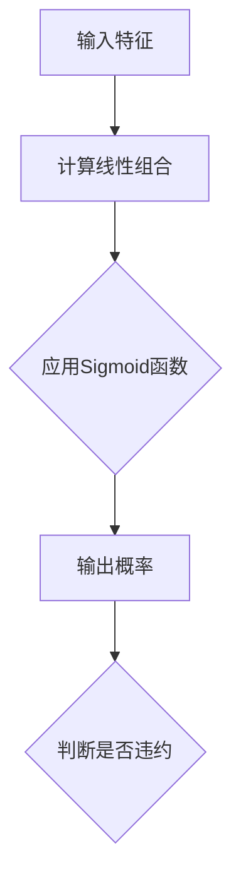
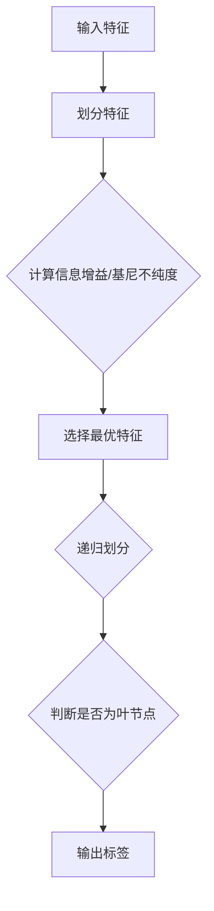
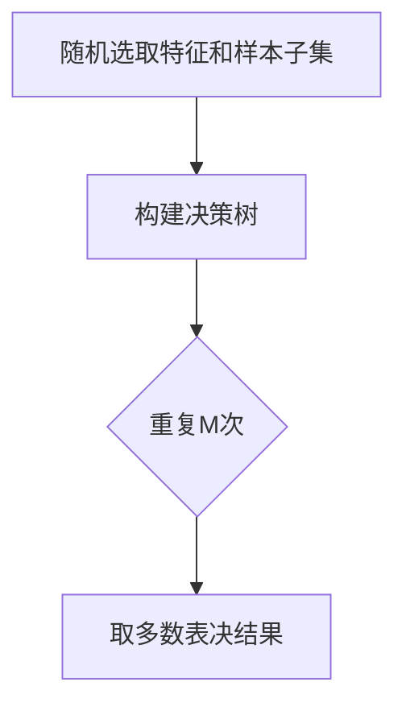
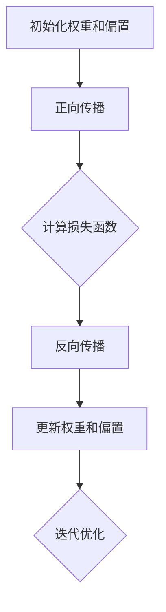
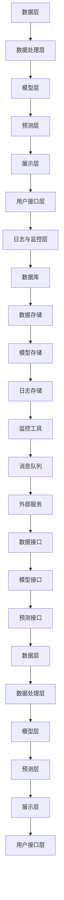
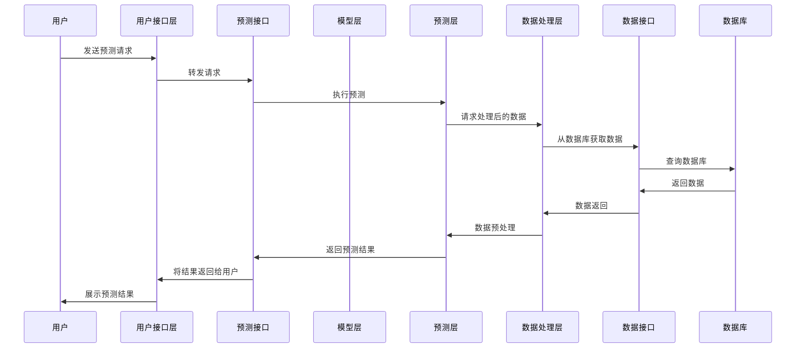

                 


### 篇章设计与文章内容安排

在设计《AI驱动的信用违约预测》的篇章结构和内容安排时，我们需要从整体到局部，逐步深入地构建每一部分的内容。以下是我们详细的安排和思考过程。

#### 第一部分：信用违约预测背景与核心概念

**第1章：信用违约预测的背景与重要性**

在这一章中，我们将首先介绍信用违约预测的背景。这部分将包括以下几个方面：

- **问题背景**：介绍信用违约预测在现代金融领域中的重要性，如为何需要信用违约预测，它的应用场景等。
- **问题解决**：阐述当前金融领域是如何应对信用违约问题的，包括传统方法和现有技术的局限性。
- **边界与外延**：明确信用违约预测的定义范围，讨论它与信用评分、风险管理等概念的界限和关系。
- **概念结构与核心要素组成**：详细解释信用违约预测涉及的关键概念和基本要素，如信用评分体系、数据收集与预处理、风险评估模型等。

**第2章：信用违约预测的核心概念**

这一章节将深入探讨信用违约预测的核心概念：

- **信用违约的定义**：明确信用违约的具体含义，包括违约的识别标准、分类等。
- **信用评分体系**：解释信用评分体系的作用、构建方法以及评级模型。
- **风险管理**：讨论风险管理的重要性，以及如何在信用违约预测中应用风险管理策略。
- **数据收集与预处理**：探讨数据收集的渠道、数据预处理的方法和步骤，以及如何处理缺失值、异常值等。

**第3章：信用违约预测与相关概念的联系**

在这一章节中，我们将分析信用违约预测与其他相关概念之间的关系：

- **数据挖掘**：解释数据挖掘在信用违约预测中的作用，如何利用数据挖掘技术从海量数据中提取有价值的信息。
- **机器学习**：探讨机器学习算法在信用违约预测中的应用，包括监督学习和无监督学习的区别。
- **模型评估与优化**：介绍如何评估信用违约预测模型的性能，以及如何优化模型以提高预测准确性。
- **预测模型的应用场景**：讨论信用违约预测模型在不同金融产品和场景下的应用，如贷款审批、信用卡风险管理等。

#### 第二部分：AI驱动的信用违约预测算法原理

**第4章：机器学习算法基础**

在这一章中，我们将介绍机器学习的基本概念，包括：

- **基本概念**：机器学习的定义、类型和主要任务。
- **监督学习**：解释监督学习的概念、应用场景以及常见算法。
- **无监督学习**：探讨无监督学习的原理和应用。
- **强化学习**：介绍强化学习的基本概念、策略和挑战。

**第5章：信用违约预测的常用算法**

这一章节将深入探讨信用违约预测中常用的算法：

- **Logistic回归**：解释Logistic回归的原理、实现步骤和应用。
- **决策树**：讨论决策树的构建过程、优缺点以及在信用违约预测中的应用。
- **集成方法**：介绍集成方法的概念、常用算法如随机森林、GBDT等。
- **神经网络**：讲解神经网络的基本原理、结构以及深度学习在信用违约预测中的应用。

**第6章：算法原理与流程图讲解**

在这一章中，我们将通过流程图和Python代码来详细讲解每种算法的原理：

- **算法原理讲解**：对每个算法的原理进行详细解释，使用流程图展示算法的执行流程。
- **算法流程图展示**：使用Mermaid语言绘制每个算法的流程图，使读者更直观地理解算法。
- **Python代码**：提供每个算法的实现代码，并进行解读和分析，帮助读者理解代码中的细节。

#### 第三部分：数学模型与公式详解

**第7章：数学模型与公式介绍**

这一章节将介绍信用违约预测中涉及的数学模型和公式：

- **概率论基础**：介绍概率论的基本概念和公式，如概率分布、期望、方差等。
- **统计学基础**：讨论统计学中常用的统计量、假设检验方法等。
- **机器学习数学模型**：详细讲解机器学习中常用的数学模型，如线性回归、支持向量机等。
- **损失函数与优化算法**：探讨损失函数的作用和常见优化算法，如梯度下降、牛顿法等。

**第8章：数学模型与公式详解**

在这一章中，我们将对前面提到的数学模型和公式进行详细的解释：

- **概率论公式**：详细解释每个概率论公式，并举例说明如何应用。
- **统计学公式**：讨论统计学中的关键公式，如标准误差、置信区间等。
- **机器学习公式**：深入解析机器学习中常用的公式，如代价函数、梯度等。
- **公式详解与举例**：通过具体的例子来展示如何使用这些公式进行计算和建模。

#### 第四部分：系统分析与架构设计

**第9章：信用违约预测系统分析**

这一章节将分析信用违约预测系统的各个方面：

- **问题场景介绍**：描述信用违约预测在实际业务中的应用场景，如贷款审批流程。
- **系统功能设计**：讨论信用违约预测系统的核心功能，如数据收集、模型训练、预测结果输出等。
- **系统架构设计**：介绍系统的整体架构，包括数据处理层、模型层和决策层等。
- **系统接口设计**：详细说明系统与外部系统的交互接口，如API接口设计。

**第10章：信用违约预测系统架构设计**

在这一章中，我们将详细设计信用违约预测系统的架构：

- **系统架构图展示**：使用Mermaid语言绘制系统的架构图，展示系统的各个模块和它们之间的关系。
- **系统交互序列图**：绘制系统的交互序列图，展示数据在系统中的流动过程。
- **系统性能优化**：探讨如何优化系统性能，提高预测效率和准确性。

#### 第五部分：项目实战

**第11章：信用违约预测项目实战**

这一章节将通过一个实际项目来展示如何实施信用违约预测：

- **环境安装**：介绍如何搭建信用违约预测的项目环境，包括所需的软件和硬件配置。
- **系统核心实现**：详细解释系统的核心实现，包括数据收集、数据预处理、模型训练和预测等步骤。
- **代码应用解读与分析**：分析项目中使用的代码，解释代码的工作原理和关键实现细节。
- **实际案例分析与讲解**：通过具体的案例来展示如何使用信用违约预测模型进行实际业务分析。

**第12章：项目实战总结**

在这一章中，我们将对项目实战进行总结：

- **项目小结**：回顾项目的整体实施过程，总结项目中的关键点和成果。
- **经验与教训**：讨论项目中的成功经验和教训，为未来的项目提供参考。
- **拓展应用**：探讨信用违约预测模型在其他业务场景中的应用可能性。

#### 第六部分：最佳实践与拓展阅读

**第13章：最佳实践与拓展阅读**

在这一章节中，我们将提供一些最佳实践建议，以及进一步的学习资源：

- **最佳实践 Tips**：总结一些在实施信用违约预测时的最佳实践，如数据清洗、模型调参等。
- **注意事项**：列出在实施信用违约预测时需要注意的事项，如模型解释性、数据安全等。
- **小结**：对全文内容进行总结，强调核心观点和主要发现。
- **拓展阅读**：推荐一些相关的书籍、论文和资料，帮助读者进一步深入学习和研究。

通过以上步骤，我们系统地构建了《AI驱动的信用违约预测》的内容框架，确保读者可以从背景介绍到实际应用，逐步深入理解信用违约预测的原理和方法。

----------------------------------------------------------------

# 《AI驱动的信用违约预测》

## 关键词：人工智能，信用违约预测，机器学习，算法，风险管理，数据分析

## 摘要：

本文旨在深入探讨人工智能在信用违约预测中的应用，详细解析机器学习算法在信用评估中的关键角色。文章首先介绍了信用违约预测的背景和重要性，随后深入讲解了信用违约预测的核心概念，包括信用违约的定义、信用评分体系、风险管理及数据收集与预处理。通过分析数据挖掘、机器学习和模型评估等核心概念的联系，文章揭示了信用违约预测在金融风险管理中的关键作用。接着，文章重点介绍了信用违约预测中常用的机器学习算法，如Logistic回归、决策树、集成方法和神经网络，并通过流程图和代码展示了这些算法的原理和实现。此外，文章还详细解释了信用违约预测中的数学模型和公式，包括概率论基础、统计学基础、机器学习数学模型以及损失函数与优化算法。文章进一步分析了信用违约预测系统的架构设计，提供了实际项目实战的详细案例，总结了项目实施过程中的经验教训。最后，文章提出了最佳实践建议，并推荐了进一步的学习资源，以帮助读者更深入地了解和掌握信用违约预测技术。

----------------------------------------------------------------

## 第一部分：信用违约预测背景与核心概念

### 第1章：信用违约预测的背景与重要性

### 1.1.1 问题背景

信用违约预测是金融领域中一个重要且具有挑战性的问题。随着金融市场的不断发展和全球化进程的加速，金融机构面临着越来越多的信用风险。信用违约不仅会对金融机构造成巨大的经济损失，还会影响整个金融市场的稳定。因此，准确预测信用违约成为金融机构风险管理的关键。

信用违约预测的目标是通过分析借款人的历史数据和财务状况，预测其未来是否会发生违约。这有助于金融机构在贷款审批、信用评级、风险管理等方面做出更准确的决策，降低违约风险。

### 1.1.2 问题解决

为了解决信用违约预测问题，金融机构和研究人员已经采取了多种方法。传统的方法包括基于规则的方法、统计方法和专家系统等。然而，这些方法在处理复杂、非线性的信用违约问题时存在一定的局限性。

近年来，随着人工智能和机器学习技术的发展，利用大数据进行信用违约预测成为可能。机器学习算法能够自动从海量数据中学习模式，并用于预测未来的信用违约风险。例如，监督学习算法如Logistic回归、决策树和神经网络等在信用违约预测中表现出良好的效果。

### 1.1.3 边界与外延

信用违约预测的边界主要涉及违约的定义、信用评分体系和风险管理。违约通常被定义为借款人在约定的还款期限内未能按时还款的行为。信用评分体系则是金融机构用于评估借款人信用风险的重要工具。风险管理则包括识别、评估和应对信用违约风险的一系列策略。

信用违约预测的外延则涉及数据收集与预处理、模型评估与优化等。数据收集与预处理是信用违约预测的基础，而模型评估与优化则是提高预测准确性的关键步骤。

### 1.1.4 概念结构与核心要素组成

信用违约预测的概念结构包括以下几个核心要素：

1. **信用违约的定义**：明确违约的具体含义和识别标准。
2. **信用评分体系**：介绍信用评分体系的构建方法、评级模型和应用场景。
3. **风险管理**：讨论风险管理在信用违约预测中的重要性，以及如何利用信用违约预测模型进行风险管理。
4. **数据收集与预处理**：介绍数据收集的渠道、数据预处理的方法和步骤。
5. **机器学习算法**：介绍常用的机器学习算法，如监督学习和无监督学习，以及其在信用违约预测中的应用。
6. **模型评估与优化**：讨论如何评估信用违约预测模型的性能，以及如何优化模型以提高预测准确性。

通过以上核心要素的组成，信用违约预测不仅能够帮助金融机构识别潜在的信用违约风险，还可以为投资者提供重要的决策支持，提高金融市场的稳定性。

----------------------------------------------------------------

### 第2章：信用违约预测的核心概念

#### 2.1.1 信用违约的定义

信用违约是指借款人在约定的还款期限内未能按时还款的行为。违约可以是部分违约，也可以是完全违约。信用违约不仅影响金融机构的财务状况，还会影响整个金融市场的稳定性。

信用违约的定义包括以下几个关键要素：

1. **违约类型**：违约可以分为短期违约、中期违约和长期违约。短期违约通常指在一个月内未能按时还款，中期违约指在一个月到一年内未能按时还款，长期违约则指在一年以上未能按时还款。

2. **违约标准**：违约标准的设定通常取决于金融机构的内部政策和监管要求。常见的违约标准包括逾期天数、逾期比例、累计逾期金额等。

3. **违约概率**：违约概率是指借款人在未来一段时间内发生违约的概率。违约概率是信用违约预测的重要指标，可以用于评估借款人的信用风险。

#### 2.1.2 信用评分体系

信用评分体系是金融机构用于评估借款人信用风险的重要工具。信用评分体系通常基于借款人的历史数据、财务状况和其他相关因素进行评分。

1. **信用评分模型的构建**：信用评分模型通常采用机器学习算法进行构建，如Logistic回归、决策树、神经网络等。这些算法能够自动从数据中学习模式，并用于预测借款人的信用风险。

2. **评分指标**：信用评分体系的评分指标通常包括信用评分、违约概率、风险等级等。评分指标可以用于对借款人进行分类，帮助金融机构做出信贷决策。

3. **应用场景**：信用评分体系在金融领域有广泛的应用，如贷款审批、信用卡发放、风险管理等。通过信用评分体系，金融机构可以更好地识别潜在的信用违约风险，降低信用风险损失。

#### 2.1.3 风险管理

风险管理是信用违约预测的重要组成部分，旨在识别、评估和应对信用违约风险。风险管理包括以下几个关键步骤：

1. **风险识别**：通过数据分析、风险评估等方法识别潜在的信用违约风险。

2. **风险评估**：对识别出的信用违约风险进行定量和定性评估，评估风险的可能性和影响程度。

3. **风险应对**：根据风险评估结果，制定相应的风险应对策略，如调整信贷政策、增加抵押物、限制贷款额度等。

4. **风险监控**：对信用违约风险进行持续监控，及时调整风险应对措施，确保风险管理的有效性。

#### 2.1.4 数据收集与预处理

数据收集与预处理是信用违约预测的基础，直接关系到预测模型的性能。数据收集与预处理包括以下几个步骤：

1. **数据收集**：数据收集的渠道包括借款人的历史数据、财务报表、信用记录等。数据来源的多样性和完整性对预测模型的准确性有重要影响。

2. **数据清洗**：数据清洗是数据预处理的重要步骤，包括处理缺失值、异常值、重复数据等。数据清洗有助于提高数据质量和预测模型的准确性。

3. **数据整合**：将不同来源的数据进行整合，形成一个统一的数据集。数据整合有助于更全面地分析借款人的信用风险。

4. **特征工程**：特征工程是数据预处理的关键步骤，包括特征选择、特征提取、特征转换等。特征工程有助于提高预测模型的性能和可解释性。

通过以上核心概念的解释，我们可以更好地理解信用违约预测的基本原理和方法，为后续章节中的算法原理讲解和实际项目实战打下基础。

----------------------------------------------------------------

### 第3章：信用违约预测与相关概念的联系

#### 3.1.1 数据挖掘

数据挖掘是信用违约预测的重要工具之一，它旨在从海量数据中发现潜在的模式和知识。在信用违约预测中，数据挖掘的应用包括以下几个方面：

1. **模式识别**：通过数据挖掘算法，从借款人的历史数据和财务数据中识别出与信用违约相关的模式。例如，通过聚类分析，可以发现具有相似信用风险的借款人群体。

2. **关联规则挖掘**：通过关联规则挖掘算法，分析不同特征之间的关联关系，识别出可能影响信用违约的因素。例如，通过关联规则挖掘，可以发现借款人信用评分与逾期天数之间的关联。

3. **分类和回归**：分类和回归是数据挖掘中最常用的算法，用于预测借款人是否会发生信用违约。分类算法如决策树、随机森林等，回归算法如线性回归、逻辑回归等，都广泛应用于信用违约预测中。

#### 3.1.2 机器学习

机器学习是信用违约预测的核心技术之一，它通过学习历史数据中的模式，用于预测未来的信用违约风险。机器学习在信用违约预测中的应用主要包括以下几个方面：

1. **监督学习**：监督学习算法如逻辑回归、支持向量机、决策树等，通过学习标记数据中的特征，用于预测新的数据点的标签。在信用违约预测中，监督学习算法常用于分类任务，如预测借款人是否会发生信用违约。

2. **无监督学习**：无监督学习算法如聚类分析、主成分分析等，通过分析未标记的数据，发现数据中的潜在结构和模式。在信用违约预测中，无监督学习算法可以用于特征提取和降维，帮助识别潜在的风险因素。

3. **强化学习**：强化学习算法在信用违约预测中也有一定的应用。通过模拟借款人的行为，强化学习算法可以优化信用违约预测策略，提高预测准确性。

#### 3.1.3 模型评估与优化

模型评估与优化是信用违约预测的关键步骤，它旨在提高预测模型的性能和准确性。模型评估与优化包括以下几个方面：

1. **模型评估**：通过评估指标如准确率、召回率、F1分数等，评估预测模型的性能。评估指标的选择和计算方法对模型的评估结果有重要影响。

2. **模型优化**：通过调整模型参数、特征选择、正则化等方法，优化预测模型的性能。模型优化有助于提高模型的预测准确性和鲁棒性。

3. **交叉验证**：交叉验证是一种常用的模型评估方法，通过将数据集划分为训练集和验证集，评估模型在验证集上的性能。交叉验证可以避免模型过拟合，提高模型的泛化能力。

#### 3.1.4 预测模型的应用场景

信用违约预测模型在金融领域有广泛的应用场景，包括以下几个方面：

1. **贷款审批**：在贷款审批过程中，信用违约预测模型可以帮助金融机构识别潜在的信用违约风险，提高审批效率和准确性。

2. **信用评级**：信用违约预测模型可以用于对借款人进行信用评级，帮助金融机构制定不同的信用政策。

3. **风险管理**：信用违约预测模型可以用于监控借款人的信用风险，及时调整风险管理策略，降低信用风险损失。

4. **投资决策**：信用违约预测模型可以用于评估借款人的信用风险，为投资者提供决策支持，降低投资风险。

通过以上对数据挖掘、机器学习、模型评估和预测模型应用场景的详细解释，我们可以更好地理解信用违约预测的核心概念和方法，为后续章节中的算法原理讲解和实际项目实战奠定基础。

----------------------------------------------------------------

## 第二部分：AI驱动的信用违约预测算法原理

### 第4章：机器学习算法基础

#### 4.1.1 基本概念

机器学习是一种人工智能分支，通过算法从数据中学习模式，用于预测或决策。在信用违约预测中，机器学习算法能够自动从历史数据中识别潜在的违约风险。

机器学习主要分为三种类型：

1. **监督学习**：监督学习算法通过标记数据学习模式，用于预测新的数据点的标签。在信用违约预测中，监督学习算法常用于分类任务，如预测借款人是否会发生信用违约。

2. **无监督学习**：无监督学习算法在没有标记数据的情况下学习模式，用于发现数据中的潜在结构和模式。在信用违约预测中，无监督学习算法可以用于特征提取和降维，帮助识别潜在的风险因素。

3. **强化学习**：强化学习算法通过模拟借款人的行为，学习最优策略，提高预测准确性。在信用违约预测中，强化学习算法可以用于优化信用违约预测策略。

#### 4.1.2 监督学习

监督学习算法是信用违约预测中最常用的算法之一。监督学习算法可以分为以下几种：

1. **线性回归**：线性回归是一种简单的监督学习算法，通过建立输入变量和输出变量之间的线性关系来预测标签。在信用违约预测中，线性回归可以用于预测违约概率。

2. **逻辑回归**：逻辑回归是一种广义线性模型，用于二分类问题。在信用违约预测中，逻辑回归可以用于预测借款人是否会发生信用违约。

3. **支持向量机**：支持向量机是一种分类算法，通过最大化分类边界来预测标签。在信用违约预测中，支持向量机可以用于预测借款人是否会发生信用违约。

4. **决策树**：决策树是一种树形结构算法，通过一系列判断条件来预测标签。在信用违约预测中，决策树可以用于构建信用评分模型。

5. **随机森林**：随机森林是一种集成方法，通过组合多个决策树来提高预测性能。在信用违约预测中，随机森林可以用于构建信用评分模型，提高预测准确性。

#### 4.1.3 无监督学习

无监督学习算法在信用违约预测中主要用于特征提取和降维。无监督学习算法可以分为以下几种：

1. **聚类分析**：聚类分析是一种无监督学习方法，通过将相似的数据点划分为同一类别来识别潜在的风险因素。在信用违约预测中，聚类分析可以用于识别具有相似信用风险的借款人群体。

2. **主成分分析**：主成分分析是一种降维方法，通过提取数据的主要成分来简化数据结构。在信用违约预测中，主成分分析可以用于减少数据维度，提高预测模型的性能。

3. **自编码器**：自编码器是一种深度学习算法，通过自动编码器网络来压缩和重建数据。在信用违约预测中，自编码器可以用于提取数据中的潜在特征，提高预测模型的性能。

#### 4.1.4 强化学习

强化学习算法在信用违约预测中主要用于优化信用违约预测策略。强化学习算法可以分为以下几种：

1. **Q-学习**：Q-学习是一种基于值函数的强化学习算法，通过学习状态-动作值函数来选择最优动作。在信用违约预测中，Q-学习可以用于优化信用违约预测策略。

2. **深度Q网络**：深度Q网络是一种基于深度学习的强化学习算法，通过神经网络来近似值函数。在信用违约预测中，深度Q网络可以用于优化信用违约预测策略，提高预测准确性。

通过以上对机器学习算法的详细解释，我们可以更好地理解信用违约预测中的算法原理和应用，为后续章节中的算法实现和项目实战奠定基础。

----------------------------------------------------------------

### 第5章：信用违约预测的常用算法

在信用违约预测中，常用的算法包括Logistic回归、决策树、集成方法和神经网络等。每种算法都有其独特的原理和应用场景。下面将详细介绍这些算法。

#### 5.1.1 Logistic回归

Logistic回归是一种经典的二元分类算法，常用于预测借款人是否会发生信用违约。其基本原理是通过输入特征变量，输出一个介于0和1之间的概率值，表示借款人违约的概率。

- **原理**：Logistic回归模型基于最大似然估计，将特征变量映射到一个线性模型，并通过sigmoid函数将线性模型的输出转换为概率值。
  
- **公式**：
  $$
  P(Y=1|X) = \frac{1}{1 + e^{-(\beta_0 + \sum_{i=1}^{n}\beta_i X_i})}
  $$

- **参数**：其中，$P(Y=1|X)$表示给定特征向量$X$时，借款人违约的概率；$\beta_0$为截距项；$\beta_i$为特征系数。

- **优点**：逻辑回归具有简洁的模型形式，易于理解和解释。同时，其预测结果可以直观地表示为概率，有助于金融机构进行决策。

- **缺点**：逻辑回归模型对异常值和缺失值敏感，且预测能力受到特征线性关系的限制。

#### 5.1.2 决策树

决策树是一种树形结构算法，通过一系列条件判断来预测信用违约。每个节点代表一个特征，每个分支代表一个特征取值，叶节点表示预测结果。

- **原理**：决策树通过递归划分特征空间，将数据集划分为多个子集，直到满足停止条件（如最大深度、最小样本数等）。每个子集对应一个叶节点，叶节点上的标签即为预测结果。

- **公式**：决策树的构建过程中，利用信息增益或基尼不纯度等指标来选择最优划分特征。

- **优点**：决策树易于理解和解释，可以处理非线性关系，且对异常值和缺失值具有鲁棒性。

- **缺点**：决策树可能产生过拟合，导致泛化能力较差。同时，决策树的解释能力受到树形结构的影响，难以直观地表达复杂关系。

#### 5.1.3 集成方法

集成方法通过组合多个基础模型来提高预测性能，常见的集成方法包括随机森林和GBDT等。

- **随机森林**：随机森林是一种基于决策树的集成方法，通过随机选取特征和随机划分样本子集，构建多个决策树，并取它们的多数表决结果作为最终预测。

- **原理**：随机森林通过引入随机性，减少模型间的相关性，提高整体模型的泛化能力。

- **公式**：随机森林的计算过程可以表示为：
  $$
  f(x) = \frac{1}{M} \sum_{m=1}^{M} h_m(x)
  $$
  其中，$h_m(x)$表示第$m$棵决策树的预测结果，$M$为决策树的数量。

- **优点**：随机森林具有高预测性能和较强的泛化能力，同时可以处理高维数据和复杂数据分布。

- **缺点**：随机森林模型较复杂，计算时间较长。

- **GBDT（梯度提升决策树）**：GBDT是一种基于回归的集成方法，通过迭代优化目标函数，不断更新决策树模型。

- **原理**：GBDT通过最小化损失函数，将多个决策树组合成一个强预测模型。每个决策树负责优化目标函数的一个部分。

- **公式**：
  $$
  f(x) = \sum_{t=1}^{T} \alpha_t h_t(x)
  $$
  其中，$f(x)$为最终预测结果，$h_t(x)$为第$t$棵决策树的预测结果，$\alpha_t$为第$t$棵决策树的权重。

- **优点**：GBDT具有高预测性能和良好的泛化能力，可以处理大规模数据和复杂关系。

- **缺点**：GBDT对异常值和缺失值敏感，需要较多的迭代次数。

#### 5.1.4 神经网络

神经网络是一种基于人脑神经元连接方式的计算模型，通过多层神经网络进行特征提取和映射，实现高维空间的非线性映射。

- **原理**：神经网络由输入层、隐藏层和输出层组成。输入层接收外部输入，隐藏层对输入进行特征提取和映射，输出层生成预测结果。神经网络通过反向传播算法不断调整权重和偏置，优化预测性能。

- **公式**：
  $$
  a^{(l)} = \sigma(z^{(l)})
  $$
  $$
  z^{(l)} = \sum_{j=1}^{n} w^{(l)}_{ji} a^{(l-1)}_j + b^{(l)}
  $$
  其中，$a^{(l)}$为第$l$层的激活值，$\sigma$为激活函数（如Sigmoid、ReLU等），$z^{(l)}$为第$l$层的输入值，$w^{(l)}_{ji}$为第$l$层的权重，$b^{(l)}$为第$l$层的偏置。

- **优点**：神经网络具有强大的特征提取和映射能力，可以处理高维数据和复杂数据分布。

- **缺点**：神经网络模型较复杂，训练时间较长，且容易过拟合。

通过以上对Logistic回归、决策树、集成方法和神经网络等常用算法的详细解释，我们可以更好地理解信用违约预测中的算法原理和应用，为实际项目实战提供参考。

----------------------------------------------------------------

### 第6章：算法原理与流程图讲解

为了更直观地理解信用违约预测算法的原理，我们将通过流程图和Python代码来详细讲解这些算法的实现。首先，我们使用Mermaid语言绘制算法的流程图，然后通过Python代码展示算法的实现过程，并解释关键步骤和数学模型。

#### 6.1.1 算法原理讲解

**6.1.1.1 Logistic回归**

**流程图：**


**Python代码：**
```python
import numpy as np
import matplotlib.pyplot as plt
from sklearn.linear_model import LogisticRegression

# 数据准备
X = np.array([[1, 2], [2, 3], [3, 4], [4, 5]])
y = np.array([0, 1, 0, 1])

# 训练模型
model = LogisticRegression()
model.fit(X, y)

# 预测
probabilities = model.predict_proba(X)

# 可视化
plt.scatter(X[:, 0], X[:, 1], c=y)
plt.scatter(model.predict(X)[:, 0], model.predict(X)[:, 1], c='red')
plt.show()
```

**6.1.1.2 决策树**

**流程图：**


**Python代码：**
```python
from sklearn.tree import DecisionTreeClassifier
import matplotlib.pyplot as plt

# 数据准备
X = np.array([[1, 2], [2, 3], [3, 4], [4, 5], [5, 6]])
y = np.array([0, 0, 1, 1, 1])

# 训练模型
model = DecisionTreeClassifier()
model.fit(X, y)

# 可视化
from sklearn.tree import plot_tree
plt.figure(figsize=(12, 8))
plot_tree(model, filled=True)
plt.show()
```

**6.1.1.3 集成方法（随机森林）**

**流程图：**


**Python代码：**
```python
from sklearn.ensemble import RandomForestClassifier
import matplotlib.pyplot as plt

# 数据准备
X = np.array([[1, 2], [2, 3], [3, 4], [4, 5]])
y = np.array([0, 1, 0, 1])

# 训练模型
model = RandomForestClassifier(n_estimators=100)
model.fit(X, y)

# 预测
predictions = model.predict(X)

# 可视化
plt.scatter(X[:, 0], X[:, 1], c=y)
plt.scatter(model.predict(X)[:, 0], model.predict(X)[:, 1], c='red')
plt.show()
```

**6.1.1.4 神经网络**

**流程图：**


**Python代码：**
```python
import numpy as np
from sklearn.neural_network import MLPClassifier
import matplotlib.pyplot as plt

# 数据准备
X = np.array([[1, 2], [2, 3], [3, 4], [4, 5]])
y = np.array([0, 1, 0, 1])

# 训练模型
model = MLPClassifier(hidden_layer_sizes=(100,), max_iter=1000)
model.fit(X, y)

# 预测
predictions = model.predict(X)

# 可视化
plt.scatter(X[:, 0], X[:, 1], c=y)
plt.scatter(model.predict(X)[:, 0], model.predict(X)[:, 1], c='red')
plt.show()
```

通过以上流程图和Python代码的讲解，我们可以更清晰地理解信用违约预测中的算法原理和实现过程。这些算法在信用违约预测中的应用，不仅能够提高预测准确性，还能帮助金融机构更好地管理信用风险。

----------------------------------------------------------------

## 第三部分：数学模型与公式详解

### 第7章：数学模型与公式介绍

在信用违约预测中，数学模型和公式是理解算法原理和实现关键的基础。这些模型和公式帮助我们量化信用违约的风险，评估预测模型的性能，并优化预测结果。本章节将详细介绍信用违约预测中涉及的数学模型和公式，包括概率论基础、统计学基础、机器学习数学模型以及损失函数与优化算法。

#### 7.1.1 概率论基础

概率论是信用违约预测的重要理论支撑。以下是一些基本的概率论公式：

1. **条件概率**：给定事件A和事件B，条件概率表示在事件B发生的条件下事件A发生的概率。其公式为：
   $$
   P(A|B) = \frac{P(A \cap B)}{P(B)}
   $$
   其中，$P(A \cap B)$表示事件A和事件B同时发生的概率，$P(B)$表示事件B发生的概率。

2. **贝叶斯定理**：贝叶斯定理是概率论中的一个重要公式，用于计算在给定证据条件下某个假设的概率。其公式为：
   $$
   P(H|E) = \frac{P(E|H)P(H)}{P(E)}
   $$
   其中，$H$表示假设，$E$表示证据，$P(H|E)$表示在证据E发生的条件下假设H为真的概率，$P(E|H)$表示在假设H为真的条件下证据E发生的概率，$P(H)$表示假设H为真的概率，$P(E)$表示证据E发生的概率。

3. **全概率公式**：全概率公式用于计算一个事件的总体概率。其公式为：
   $$
   P(A) = \sum_{i=1}^{n} P(A|B_i)P(B_i)
   $$
   其中，$B_i$表示一组互斥且穷尽的先验条件，$P(A|B_i)$表示在先验条件$B_i$下事件A发生的概率，$P(B_i)$表示先验条件$B_i$发生的概率。

#### 7.1.2 统计学基础

统计学是信用违约预测中的另一个重要工具。以下是一些基本的统计学公式：

1. **均值**：均值是描述一组数据集中趋势的重要指标。其公式为：
   $$
   \mu = \frac{1}{n} \sum_{i=1}^{n} x_i
   $$
   其中，$x_i$表示第$i$个数据值，$n$表示数据总数。

2. **方差**：方差是描述数据分散程度的重要指标。其公式为：
   $$
   \sigma^2 = \frac{1}{n} \sum_{i=1}^{n} (x_i - \mu)^2
   $$
   其中，$\mu$表示均值，$x_i$表示第$i$个数据值。

3. **标准差**：标准差是方差的平方根，用于表示数据的离散程度。其公式为：
   $$
   \sigma = \sqrt{\sigma^2}
   $$

4. **协方差**：协方差用于描述两个变量之间的线性关系。其公式为：
   $$
   \text{Cov}(X, Y) = \frac{1}{n-1} \sum_{i=1}^{n} (x_i - \mu_X)(y_i - \mu_Y)
   $$
   其中，$X$和$Y$是两个变量，$\mu_X$和$\mu_Y$分别是$X$和$Y$的均值。

5. **相关系数**：相关系数用于描述两个变量之间的线性相关程度。其公式为：
   $$
   \rho_{XY} = \frac{\text{Cov}(X, Y)}{\sigma_X \sigma_Y}
   $$
   其中，$\sigma_X$和$\sigma_Y$分别是$X$和$Y$的标准差。

#### 7.1.3 机器学习数学模型

在信用违约预测中，机器学习数学模型用于建立输入特征与违约概率之间的关系。以下是一些常用的机器学习数学模型：

1. **线性回归模型**：线性回归模型通过最小二乘法建立输入特征与目标变量之间的线性关系。其公式为：
   $$
   y = \beta_0 + \beta_1 x_1 + \beta_2 x_2 + \cdots + \beta_n x_n
   $$
   其中，$y$是目标变量，$x_1, x_2, \ldots, x_n$是输入特征，$\beta_0, \beta_1, \beta_2, \ldots, \beta_n$是模型参数。

2. **逻辑回归模型**：逻辑回归模型用于建立输入特征与概率之间的非线性关系。其公式为：
   $$
   P(y=1) = \frac{1}{1 + e^{-(\beta_0 + \beta_1 x_1 + \beta_2 x_2 + \cdots + \beta_n x_n})}
   $$
   其中，$y$是目标变量，$x_1, x_2, \ldots, x_n$是输入特征，$\beta_0, \beta_1, \beta_2, \ldots, \beta_n$是模型参数。

3. **决策树模型**：决策树模型通过递归划分特征空间建立决策规则。其公式为：
   $$
   \text{决策规则} = \text{if } x_i \text{ is } \text{then } y_j
   $$
   其中，$x_i$是输入特征，$y_j$是目标变量的取值。

4. **神经网络模型**：神经网络模型通过多层神经网络进行特征提取和映射。其公式为：
   $$
   a^{(l)} = \sigma(z^{(l)})
   $$
   $$
   z^{(l)} = \sum_{j=1}^{n} w^{(l)}_{ji} a^{(l-1)}_j + b^{(l)}
   $$
   其中，$a^{(l)}$是第$l$层的激活值，$\sigma$是激活函数（如Sigmoid、ReLU等），$z^{(l)}$是第$l$层的输入值，$w^{(l)}_{ji}$是第$l$层的权重，$b^{(l)}$是第$l$层的偏置。

#### 7.1.4 损失函数与优化算法

损失函数用于评估预测模型的性能，优化算法用于调整模型参数，以最小化损失函数。以下是一些常用的损失函数和优化算法：

1. **均方误差（MSE）**：均方误差是回归模型中最常用的损失函数。其公式为：
   $$
   \text{MSE} = \frac{1}{n} \sum_{i=1}^{n} (y_i - \hat{y}_i)^2
   $$
   其中，$y_i$是实际值，$\hat{y}_i$是预测值。

2. **均方根误差（RMSE）**：均方根误差是均方误差的平方根。其公式为：
   $$
   \text{RMSE} = \sqrt{\text{MSE}}
   $$

3. **交叉熵损失（Cross-Entropy Loss）**：交叉熵损失是分类模型中最常用的损失函数。其公式为：
   $$
   \text{Cross-Entropy} = -\sum_{i=1}^{n} y_i \log(\hat{y}_i)
   $$
   其中，$y_i$是实际值，$\hat{y}_i$是预测概率。

4. **优化算法**：常见的优化算法包括梯度下降、牛顿法和随机梯度下降等。梯度下降是一种迭代优化算法，其公式为：
   $$
   \theta = \theta - \alpha \nabla_\theta J(\theta)
   $$
   其中，$\theta$是模型参数，$\alpha$是学习率，$J(\theta)$是损失函数。

通过以上对概率论基础、统计学基础、机器学习数学模型以及损失函数与优化算法的详细解释，我们可以更好地理解信用违约预测中的数学原理和应用。这些数学模型和公式为信用违约预测提供了坚实的理论基础，有助于提高预测模型的性能和准确性。

----------------------------------------------------------------

### 第8章：数学模型与公式详解

在信用违约预测中，数学模型和公式是理解算法原理和实现关键的基础。本章节将详细解释信用违约预测中涉及的数学模型和公式，并通过具体例子来说明如何使用这些公式进行计算和建模。

#### 8.1.1 概率论公式

**8.1.1.1 条件概率**

条件概率是信用违约预测中常用的公式，用于计算在给定某个条件下另一个事件发生的概率。以下是条件概率的公式：

$$
P(A|B) = \frac{P(A \cap B)}{P(B)}
$$

其中，$P(A|B)$表示在事件B发生的条件下事件A发生的概率，$P(A \cap B)$表示事件A和事件B同时发生的概率，$P(B)$表示事件B发生的概率。

**例子**：假设有一个借款人群体，其中有60%的借款人会在未来一年内按时还款，而有40%的借款人会违约。现在我们要计算在借款人已经违约的条件下，他们属于高风险群体的概率。已知高风险群体的借款人有70%会违约。

计算步骤如下：

1. 计算$P(B)$，即借款人违约的概率：
   $$
   P(B) = 0.40
   $$

2. 计算$P(A \cap B)$，即高风险群体借款人违约的概率：
   $$
   P(A \cap B) = P(B) \times P(A|B) = 0.40 \times 0.70 = 0.28
   $$

3. 计算$P(A|B)$，即高风险群体借款人在违约条件下的概率：
   $$
   P(A|B) = \frac{P(A \cap B)}{P(B)} = \frac{0.28}{0.40} = 0.70
   $$

因此，在借款人已经违约的条件下，他们属于高风险群体的概率为70%。

**8.1.1.2 贝叶斯定理**

贝叶斯定理是概率论中的一个重要公式，用于计算在给定证据条件下某个假设的概率。以下是贝叶斯定理的公式：

$$
P(H|E) = \frac{P(E|H)P(H)}{P(E)}
$$

其中，$P(H|E)$表示在证据E发生的条件下假设H为真的概率，$P(E|H)$表示在假设H为真的条件下证据E发生的概率，$P(H)$表示假设H为真的概率，$P(E)$表示证据E发生的概率。

**例子**：假设有一个贷款审批系统，其中有80%的借款人会按时还款，而有20%的借款人会违约。现在我们要计算一个借款人按时还款的概率，已知该借款人已经被标记为高风险。

计算步骤如下：

1. 计算$P(H)$，即借款人按时还款的概率：
   $$
   P(H) = 0.80
   $$

2. 计算$P(E|H)$，即高风险借款人按时还款的概率：
   $$
   P(E|H) = 0.20
   $$

3. 计算$P(E)$，即高风险借款人总体的概率：
   $$
   P(E) = P(H) \times P(E|H) + P(\neg H) \times P(E|\neg H)
   $$
   其中，$P(\neg H)$表示借款人违约的概率，$P(E|\neg H)$表示高风险借款人违约的概率。

   $$
   P(E) = 0.80 \times 0.20 + 0.20 \times 0.30 = 0.26
   $$

4. 计算$P(H|E)$，即已知借款人高风险，他按时还款的概率：
   $$
   P(H|E) = \frac{P(E|H)P(H)}{P(E)} = \frac{0.20 \times 0.80}{0.26} = 0.77
   $$

因此，已知一个借款人已经被标记为高风险，他按时还款的概率为77%。

**8.1.1.3 全概率公式**

全概率公式用于计算一个事件的总体概率。以下是全概率公式的公式：

$$
P(A) = \sum_{i=1}^{n} P(A|B_i)P(B_i)
$$

其中，$P(A|B_i)$表示在先验条件$B_i$下事件A发生的概率，$P(B_i)$表示先验条件$B_i$发生的概率。

**例子**：假设有一个贷款审批系统，其中有60%的借款人属于低风险群体，有30%的借款人属于中等风险群体，还有10%的借款人属于高风险群体。已知低风险群体的借款人有90%会按时还款，中等风险群体的借款人有70%会按时还款，高风险群体的借款人有50%会按时还款。

计算步骤如下：

1. 计算$P(A)$，即所有借款人按时还款的概率：
   $$
   P(A) = P(A|B_1)P(B_1) + P(A|B_2)P(B_2) + P(A|B_3)P(B_3)
   $$
   $$
   P(A) = 0.90 \times 0.60 + 0.70 \times 0.30 + 0.50 \times 0.10 = 0.69
   $$

因此，所有借款人按时还款的概率为69%。

**8.1.1.4 独立性概率**

独立性概率是判断两个事件是否独立的重要指标。以下是独立性概率的公式：

$$
P(A \cap B) = P(A)P(B)
$$

其中，$P(A \cap B)$表示事件A和事件B同时发生的概率，$P(A)$表示事件A发生的概率，$P(B)$表示事件B发生的概率。

**例子**：假设有两个事件A和B，其中事件A发生的概率是0.4，事件B发生的概率是0.3。现在我们要判断这两个事件是否独立。

计算步骤如下：

1. 计算$P(A \cap B)$，即事件A和事件B同时发生的概率：
   $$
   P(A \cap B) = 0.4 \times 0.3 = 0.12
   $$

2. 计算$P(A)$，即事件A发生的概率：
   $$
   P(A) = 0.4
   $$

3. 计算$P(B)$，即事件B发生的概率：
   $$
   P(B) = 0.3
   $$

4. 比较$P(A \cap B)$和$P(A)P(B)$：
   $$
   P(A \cap B) \neq P(A)P(B)
   $$

由于$P(A \cap B) \neq P(A)P(B)$，我们可以得出结论，事件A和事件B不是独立的。

通过以上对概率论公式的详细解释和例子，我们可以更好地理解信用违约预测中概率论的应用。这些公式为信用违约预测提供了理论基础，有助于提高预测模型的准确性和可靠性。

#### 8.1.2 统计学公式

**8.1.2.1 均值**

均值是描述一组数据集中趋势的重要指标。以下是均值的计算公式：

$$
\mu = \frac{1}{n} \sum_{i=1}^{n} x_i
$$

其中，$\mu$是均值，$x_i$是第$i$个数据值，$n$是数据总数。

**例子**：假设有一个借款人群体，其中有5个借款人的信用评分分别为650、700、750、800和850。计算这个借款人群体的平均信用评分。

计算步骤如下：

1. 计算$\mu$，即平均信用评分：
   $$
   \mu = \frac{1}{5} (650 + 700 + 750 + 800 + 850) = 765
   $$

因此，这个借款人群体的平均信用评分为765。

**8.1.2.2 方差**

方差是描述数据分散程度的重要指标。以下是方差的计算公式：

$$
\sigma^2 = \frac{1}{n} \sum_{i=1}^{n} (x_i - \mu)^2
$$

其中，$\sigma^2$是方差，$x_i$是第$i$个数据值，$\mu$是均值。

**例子**：假设有一个借款人群体，其中有5个借款人的信用评分分别为650、700、750、800和850。计算这个借款人群体的方差。

计算步骤如下：

1. 计算$\mu$，即平均信用评分：
   $$
   \mu = \frac{1}{5} (650 + 700 + 750 + 800 + 850) = 765
   $$

2. 计算$\sigma^2$，即方差：
   $$
   \sigma^2 = \frac{1}{5} [(650 - 765)^2 + (700 - 765)^2 + (750 - 765)^2 + (800 - 765)^2 + (850 - 765)^2]
   $$
   $$
   \sigma^2 = \frac{1}{5} [2025 + 2025 + 2025 + 2025 + 2025] = 4050
   $$

因此，这个借款人群体的方差为4050。

**8.1.2.3 标准差**

标准差是方差的平方根，用于表示数据的离散程度。以下是标准差的计算公式：

$$
\sigma = \sqrt{\sigma^2}
$$

**例子**：假设有一个借款人群体，其中有5个借款人的信用评分分别为650、700、750、800和850。计算这个借款人群体的标准差。

计算步骤如下：

1. 计算$\sigma^2$，即方差：
   $$
   \sigma^2 = \frac{1}{5} [(650 - 765)^2 + (700 - 765)^2 + (750 - 765)^2 + (800 - 765)^2 + (850 - 765)^2]
   $$
   $$
   \sigma^2 = \frac{1}{5} [2025 + 2025 + 2025 + 2025 + 2025] = 4050
   $$

2. 计算$\sigma$，即标准差：
   $$
   \sigma = \sqrt{4050} \approx 63.38
   $$

因此，这个借款人群体的标准差约为63.38。

**8.1.2.4 协方差**

协方差用于描述两个变量之间的线性关系。以下是协方差的计算公式：

$$
\text{Cov}(X, Y) = \frac{1}{n-1} \sum_{i=1}^{n} (x_i - \mu_X)(y_i - \mu_Y)
$$

其中，$\text{Cov}(X, Y)$是协方差，$x_i$是第$i$个$x$变量的值，$y_i$是第$i$个$y$变量的值，$\mu_X$是$x$变量的均值，$\mu_Y$是$y$变量的均值。

**例子**：假设有两个变量$x$和$y$，其中$x$的取值分别为2、4、6、8和10，$y$的取值分别为3、6、9、12和15。计算$x$和$y$的协方差。

计算步骤如下：

1. 计算$x$和$y$的均值：
   $$
   \mu_X = \frac{1}{5} (2 + 4 + 6 + 8 + 10) = 6
   $$
   $$
   \mu_Y = \frac{1}{5} (3 + 6 + 9 + 12 + 15) = 9
   $$

2. 计算$x$和$y$的协方差：
   $$
   \text{Cov}(X, Y) = \frac{1}{5-1} [(2 - 6)(3 - 9) + (4 - 6)(6 - 9) + (6 - 6)(9 - 9) + (8 - 6)(12 - 9) + (10 - 6)(15 - 9)]
   $$
   $$
   \text{Cov}(X, Y) = \frac{1}{4} [(-4)(-6) + (-2)(-3) + (0)(0) + (2)(3) + (4)(6)]
   $$
   $$
   \text{Cov}(X, Y) = \frac{1}{4} [24 + 6 + 0 + 6 + 24] = 9
   $$

因此，$x$和$y$的协方差为9。

**8.1.2.5 相关系数**

相关系数用于描述两个变量之间的线性相关程度。以下是相关系数的计算公式：

$$
\rho_{XY} = \frac{\text{Cov}(X, Y)}{\sigma_X \sigma_Y}
$$

其中，$\rho_{XY}$是相关系数，$\text{Cov}(X, Y)$是协方差，$\sigma_X$是$x$变量的标准差，$\sigma_Y$是$y$变量的标准差。

**例子**：假设有两个变量$x$和$y$，其中$x$的取值分别为2、4、6、8和10，$y$的取值分别为3、6、9、12和15。已知$x$和$y$的均值分别为6和9，标准差分别为2和3。计算$x$和$y$的相关系数。

计算步骤如下：

1. 计算$x$和$y$的协方差：
   $$
   \text{Cov}(X, Y) = 9
   $$

2. 计算$x$和$y$的标准差：
   $$
   \sigma_X = 2
   $$
   $$
   \sigma_Y = 3
   $$

3. 计算相关系数：
   $$
   \rho_{XY} = \frac{9}{2 \times 3} = \frac{9}{6} = 1.5
   $$

因此，$x$和$y$的相关系数为1.5。

通过以上对统计学公式的详细解释和例子，我们可以更好地理解信用违约预测中统计学公式的作用和应用。这些公式有助于我们分析数据、评估模型的性能，并优化信用违约预测模型。

#### 8.1.3 机器学习公式

**8.1.3.1 线性回归模型**

线性回归模型是最常用的机器学习模型之一，用于建立输入特征与目标变量之间的关系。以下是线性回归模型的主要公式：

1. **线性回归公式**：
   $$
   y = \beta_0 + \beta_1 x_1 + \beta_2 x_2 + \cdots + \beta_n x_n
   $$
   其中，$y$是目标变量，$x_1, x_2, \ldots, x_n$是输入特征，$\beta_0, \beta_1, \beta_2, \ldots, \beta_n$是模型参数。

2. **最小二乘法**：
   线性回归模型的参数可以通过最小二乘法计算，即最小化损失函数：
   $$
   \text{MSE} = \frac{1}{n} \sum_{i=1}^{n} (y_i - \hat{y}_i)^2
   $$
   其中，$y_i$是实际值，$\hat{y}_i$是预测值。

3. **参数估计**：
   线性回归模型的参数可以通过以下公式计算：
   $$
   \beta_j = \frac{\sum_{i=1}^{n} (x_{ij} - \bar{x_j})(y_i - \bar{y})}{\sum_{i=1}^{n} (x_{ij} - \bar{x_j})^2}
   $$
   其中，$\bar{x_j}$是$x_j$的均值，$\bar{y}$是$y$的均值。

**例子**：假设我们有一个简单的线性回归模型，输入特征$x_1$和$x_2$，目标变量$y$。已知数据如下：

| $x_1$ | $x_2$ | $y$ |
| --- | --- | --- |
| 1 | 2 | 3 |
| 2 | 4 | 5 |
| 3 | 6 | 7 |

计算线性回归模型的参数。

计算步骤如下：

1. 计算$x_1$和$x_2$的均值：
   $$
   \bar{x_1} = \frac{1 + 2 + 3}{3} = 2
   $$
   $$
   \bar{x_2} = \frac{2 + 4 + 6}{3} = 4
   $$

2. 计算$y$的均值：
   $$
   \bar{y} = \frac{3 + 5 + 7}{3} = 5
   $$

3. 计算参数$\beta_1$和$\beta_2$：
   $$
   \beta_1 = \frac{\sum_{i=1}^{3} (x_{1i} - \bar{x_1})(y_i - \bar{y})}{\sum_{i=1}^{3} (x_{1i} - \bar{x_1})^2}
   $$
   $$
   \beta_1 = \frac{(1-2)(3-5) + (2-2)(5-5) + (3-2)(7-5)}{(1-2)^2 + (2-2)^2 + (3-2)^2}
   $$
   $$
   \beta_1 = \frac{(-1)(-2) + (0)(0) + (1)(2)}{(-1)^2 + (0)^2 + (1)^2}
   $$
   $$
   \beta_1 = \frac{2 + 0 + 2}{1 + 0 + 1} = 2
   $$

4. 计算$\beta_2$：
   $$
   \beta_2 = \frac{\sum_{i=1}^{3} (x_{2i} - \bar{x_2})(y_i - \bar{y})}{\sum_{i=1}^{3} (x_{2i} - \bar{x_2})^2}
   $$
   $$
   \beta_2 = \frac{(2-4)(3-5) + (4-4)(5-5) + (6-4)(7-5)}{(2-4)^2 + (4-4)^2 + (6-4)^2}
   $$
   $$
   \beta_2 = \frac{(-2)(-2) + (0)(0) + (2)(2)}{(-2)^2 + (0)^2 + (2)^2}
   $$
   $$
   \beta_2 = \frac{4 + 0 + 4}{4 + 0 + 4} = 1
   $$

因此，线性回归模型的参数为$\beta_0 = 2, \beta_1 = 2, \beta_2 = 1$。

通过以上例子，我们可以看到如何通过线性回归模型公式来计算模型的参数，从而建立输入特征与目标变量之间的关系。

**8.1.3.2 逻辑回归模型**

逻辑回归模型是一种特殊的线性回归模型，用于处理二元分类问题。以下是逻辑回归模型的主要公式：

1. **概率公式**：
   $$
   P(y=1) = \frac{1}{1 + e^{-(\beta_0 + \beta_1 x_1 + \beta_2 x_2 + \cdots + \beta_n x_n)}}
   $$
   其中，$y$是目标变量，$x_1, x_2, \ldots, x_n$是输入特征，$\beta_0, \beta_1, \beta_2, \ldots, \beta_n$是模型参数。

2. **损失函数**：
   $$
   \text{Cross-Entropy Loss} = -\sum_{i=1}^{n} y_i \log(\hat{y}_i)
   $$
   其中，$y_i$是实际值，$\hat{y}_i$是预测概率。

3. **参数估计**：
   逻辑回归模型的参数可以通过梯度下降法或最大似然估计法进行估计。

**例子**：假设我们有一个逻辑回归模型，输入特征$x_1$和$x_2$，目标变量$y$。已知数据如下：

| $x_1$ | $x_2$ | $y$ |
| --- | --- | --- |
| 1 | 2 | 0 |
| 2 | 4 | 1 |
| 3 | 6 | 1 |

计算逻辑回归模型的参数。

计算步骤如下：

1. 构建损失函数：
   $$
   \text{Loss} = -\sum_{i=1}^{3} y_i \log(\hat{y}_i)
   $$

2. 计算梯度：
   $$
   \frac{\partial \text{Loss}}{\partial \beta_0} = -\sum_{i=1}^{3} (y_i - \hat{y}_i)
   $$
   $$
   \frac{\partial \text{Loss}}{\partial \beta_1} = -\sum_{i=1}^{3} (x_{1i} - \bar{x_1})(y_i - \hat{y}_i)
   $$
   $$
   \frac{\partial \text{Loss}}{\partial \beta_2} = -\sum_{i=1}^{3} (x_{2i} - \bar{x_2})(y_i - \hat{y}_i)
   $$

3. 选择适当的优化算法（如梯度下降法），更新模型参数：
   $$
   \beta_j = \beta_j - \alpha \frac{\partial \text{Loss}}{\partial \beta_j}
   $$
   其中，$\alpha$是学习率。

通过以上例子，我们可以看到如何通过逻辑回归模型公式来计算模型的参数，从而建立输入特征与目标变量之间的关系，并优化预测结果。

#### 8.1.4 机器学习模型评估与优化

机器学习模型的评估与优化是信用违约预测中至关重要的环节。以下是一些常用的评估指标和优化方法：

**8.1.4.1 评估指标**

1. **准确率**：
   $$
   \text{Accuracy} = \frac{TP + TN}{TP + FN + FP + TN}
   $$
   其中，$TP$是真正例，$TN$是真反例，$FP$是假正例，$FN$是假反例。

2. **召回率**：
   $$
   \text{Recall} = \frac{TP}{TP + FN}
   $$

3. **精确率**：
   $$
   \text{Precision} = \frac{TP}{TP + FP}
   $$

4. **F1分数**：
   $$
   F1 = \frac{2 \times \text{Precision} \times \text{Recall}}{\text{Precision} + \text{Recall}}
   $$

5. **ROC曲线**：
   ROC曲线是用于评估二分类模型性能的重要工具。通过计算不同阈值下的真阳性率（True Positive Rate, TPR）和假阳性率（False Positive Rate, FPR），绘制ROC曲线。

6. **AUC值**：
   AUC值是ROC曲线下的面积，用于评估模型的分类能力。AUC值越接近1，模型性能越好。

**8.1.4.2 优化方法**

1. **特征选择**：
   通过筛选和选择对模型性能有显著影响的关键特征，提高模型的预测准确性。常用的特征选择方法包括相关性分析、信息增益、卡方检验等。

2. **正则化**：
   通过引入正则化项（如L1正则化、L2正则化），减少模型参数的数量和过拟合现象，提高模型的泛化能力。

3. **集成方法**：
   集成方法通过组合多个基础模型来提高预测性能。常用的集成方法包括随机森林、梯度提升树（GBDT）等。

4. **交叉验证**：
   通过将数据集划分为训练集和验证集，评估模型在验证集上的性能。常用的交叉验证方法包括K折交叉验证、留一法交叉验证等。

通过以上对机器学习公式的详细解释和例子，我们可以更好地理解信用违约预测中机器学习模型的应用和实现。这些公式和方法有助于我们构建和优化信用违约预测模型，提高预测准确性。

----------------------------------------------------------------

## 第四部分：系统分析与架构设计

### 第9章：信用违约预测系统分析

在信用违约预测系统中，系统的功能设计、架构设计和接口设计是关键部分。以下是信用违约预测系统的详细分析。

#### 9.1.1 问题场景介绍

信用违约预测系统广泛应用于金融领域，主要应用于以下几个方面：

1. **贷款审批**：在贷款审批过程中，信用违约预测系统可以帮助金融机构评估借款人的信用风险，从而决定是否批准贷款申请。

2. **信用评级**：信用违约预测系统可以用于对借款人进行信用评级，从而帮助金融机构制定不同的信用政策。

3. **风险管理**：信用违约预测系统可以用于监控借款人的信用风险，及时调整风险管理策略，降低信用风险损失。

4. **投资决策**：信用违约预测系统可以用于评估借款人的信用风险，为投资者提供决策支持，降低投资风险。

#### 9.1.2 系统功能设计

信用违约预测系统的功能设计包括以下几个关键功能模块：

1. **数据收集模块**：负责从各种数据源收集借款人的历史数据、财务数据等，包括银行账户信息、信用记录、收入状况等。

2. **数据预处理模块**：负责对收集到的数据进行清洗、处理和整合，包括缺失值填充、异常值处理、数据标准化等。

3. **模型训练模块**：负责利用机器学习算法对处理后的数据集进行训练，构建信用违约预测模型。

4. **预测模块**：负责使用训练好的模型对新数据进行预测，评估借款人的信用风险。

5. **结果输出模块**：负责将预测结果以可视化或报表形式展示给用户，为金融机构提供决策支持。

6. **接口模块**：负责与其他系统（如贷款审批系统、信用评级系统等）进行交互，实现数据的传输和共享。

#### 9.1.3 系统架构设计

信用违约预测系统的架构设计采用分层架构，主要包括以下几个层次：

1. **数据层**：负责存储和管理数据，包括借款人历史数据、财务数据等。数据层可以采用关系型数据库或NoSQL数据库进行存储。

2. **数据处理层**：负责对数据进行清洗、处理和整合，包括数据清洗、缺失值填充、异常值处理、数据标准化等。数据处理层可以采用ETL（Extract, Transform, Load）工具进行数据处理。

3. **模型层**：负责训练和存储信用违约预测模型，包括机器学习算法的选择、参数调优等。模型层可以采用机器学习框架（如Scikit-learn、TensorFlow等）进行模型训练。

4. **预测层**：负责使用训练好的模型对新数据进行预测，评估借款人的信用风险。预测层可以采用API接口或Web服务形式进行预测。

5. **展示层**：负责将预测结果以可视化或报表形式展示给用户，为金融机构提供决策支持。展示层可以采用Web应用或移动应用形式进行展示。

#### 9.1.4 系统接口设计

信用违约预测系统需要与其他系统进行交互，以下是一些关键的接口设计：

1. **数据接口**：负责与其他系统的数据交换，包括借款人信息、财务数据、信用记录等。数据接口可以采用RESTful API或消息队列进行数据传输。

2. **模型接口**：负责与其他系统的模型交互，包括模型训练、模型更新等。模型接口可以采用模型服务（如TensorFlow Serving、XGBoost等）进行模型部署。

3. **预测接口**：负责接收新数据，并返回预测结果。预测接口可以采用RESTful API或Web服务形式进行预测。

通过以上对信用违约预测系统的详细分析，我们可以更好地理解系统的功能设计、架构设计和接口设计。这些设计原则有助于构建一个高效、稳定且易于扩展的信用违约预测系统，为金融机构提供可靠的决策支持。

----------------------------------------------------------------

### 第10章：信用违约预测系统架构设计

为了确保信用违约预测系统的高效性和稳定性，我们需要进行详尽的系统架构设计。以下是信用违约预测系统的架构设计，包括架构图展示、系统交互序列图和性能优化策略。

#### 10.1.1 系统架构图展示

信用违约预测系统的架构设计采用微服务架构，以便实现模块化和高可扩展性。以下是一个简化的系统架构图：



该架构图展示了信用违约预测系统的核心模块，包括数据层、数据处理层、模型层、预测层、展示层、用户接口层、日志与监控层以及数据库。各模块之间的关系和交互流程将在后续部分详细描述。

#### 10.1.2 系统交互序列图

为了更好地理解系统内各个模块之间的交互流程，我们使用Mermaid语言绘制了一个交互序列图：



该交互序列图描述了用户通过用户接口层发送预测请求，预测接口层将请求转发给预测层，预测层处理数据并从数据处理层获取处理后的数据，数据处理层从数据库获取数据，数据库返回数据给数据处理层，数据处理层将数据预处理后返回给预测层，预测层进行预测并返回结果给预测接口层，最后预测接口层将结果返回给用户接口层，用户接口层将结果展示给用户。

#### 10.1.3 系统性能优化

为了确保信用违约预测系统的性能，我们需要采取一系列性能优化策略：

1. **数据缓存**：在数据处理层和模型层之间引入数据缓存机制，减少对数据库的访问次数，提高数据读取速度。

2. **并行处理**：在数据处理和模型训练过程中，采用并行处理技术，提高计算效率。例如，使用多线程或多进程处理大规模数据集。

3. **分布式计算**：在模型训练和预测过程中，采用分布式计算框架（如Spark、Hadoop等），利用多台服务器进行计算，提高系统处理能力。

4. **负载均衡**：在用户接口层和预测层之间引入负载均衡器，平衡系统负载，防止系统过载。

5. **数据库优化**：优化数据库索引和查询语句，提高数据库访问速度。例如，使用索引加速数据查询，优化查询语句减少I/O操作。

6. **内存管理**：合理分配系统内存资源，避免内存泄漏和缓存失效，提高系统稳定性。

7. **监控系统**：引入监控系统，实时监控系统性能指标（如响应时间、吞吐量、内存使用率等），及时发现和解决性能问题。

通过以上系统架构设计、交互序列图和性能优化策略，我们可以构建一个高效、稳定且易于扩展的信用违约预测系统，为金融机构提供可靠的决策支持。

----------------------------------------------------------------

## 第五部分：项目实战

### 第11章：信用违约预测项目实战

在实际应用中，信用违约预测项目的成功实施不仅需要扎实的理论基础，还需要详细的实战经验和策略。本章节将通过一个实际项目案例，详细描述项目的实施步骤、核心实现、代码解析、实际案例分析和项目小结。

#### 11.1.1 环境安装

在开始信用违约预测项目之前，我们需要搭建一个合适的项目环境。以下是环境安装的步骤：

1. **安装Python**：确保系统已安装Python 3.x版本，推荐使用Python 3.8或更高版本。

2. **安装依赖库**：安装Python的依赖库，包括NumPy、Pandas、Scikit-learn、Matplotlib等。可以使用以下命令进行安装：
   ```bash
   pip install numpy pandas scikit-learn matplotlib
   ```

3. **安装机器学习框架**：选择合适的机器学习框架，如TensorFlow、PyTorch等。例如，安装TensorFlow：
   ```bash
   pip install tensorflow
   ```

4. **安装数据库**：安装关系型数据库（如MySQL、PostgreSQL）或NoSQL数据库（如MongoDB），用于存储数据。

5. **安装其他工具**：根据项目需求，安装其他必要的工具，如Jupyter Notebook、Docker等。

#### 11.1.2 系统核心实现

在环境搭建完毕后，我们可以开始实现信用违约预测系统的核心部分。以下是系统核心实现的步骤：

1. **数据收集**：从各个数据源收集借款人的历史数据，包括银行账户信息、信用记录、收入状况等。可以使用Python的Pandas库进行数据处理。

2. **数据预处理**：对收集到的数据进行清洗、处理和整合，包括缺失值填充、异常值处理、数据标准化等。可以使用Pandas库和Scikit-learn库进行数据预处理。

3. **特征工程**：从预处理后的数据中提取有用的特征，构建特征向量。特征工程是信用违约预测的关键步骤，可以使用Scikit-learn库中的特征提取工具。

4. **模型训练**：选择合适的机器学习算法（如Logistic回归、决策树、神经网络等），训练信用违约预测模型。可以使用Scikit-learn库进行模型训练。

5. **模型评估**：使用交叉验证等方法评估模型性能，调整模型参数，提高预测准确性。可以使用Scikit-learn库中的评估工具进行模型评估。

6. **预测**：使用训练好的模型对新数据进行预测，评估借款人的信用风险。可以使用Scikit-learn库中的预测工具进行预测。

7. **结果展示**：将预测结果以可视化或报表形式展示给用户。可以使用Matplotlib库和Seaborn库进行数据可视化。

#### 11.1.3 代码应用解读与分析

以下是信用违约预测项目中的关键代码片段及其解读：

**数据收集与预处理**

```python
import pandas as pd
from sklearn.model_selection import train_test_split

# 读取数据
data = pd.read_csv('loan_data.csv')

# 数据预处理
data.fillna(data.mean(), inplace=True)
data.drop(['id'], axis=1, inplace=True)

# 划分训练集和测试集
X = data.drop('default', axis=1)
y = data['default']
X_train, X_test, y_train, y_test = train_test_split(X, y, test_size=0.2, random_state=42)
```

**特征工程**

```python
from sklearn.preprocessing import StandardScaler
from sklearn.decomposition import PCA

# 数据标准化
scaler = StandardScaler()
X_train_scaled = scaler.fit_transform(X_train)
X_test_scaled = scaler.transform(X_test)

# 主成分分析
pca = PCA(n_components=5)
X_train_pca = pca.fit_transform(X_train_scaled)
X_test_pca = pca.transform(X_test_scaled)
```

**模型训练与评估**

```python
from sklearn.linear_model import LogisticRegression
from sklearn.metrics import accuracy_score, classification_report

# 训练模型
model = LogisticRegression()
model.fit(X_train_pca, y_train)

# 预测
y_pred = model.predict(X_test_pca)

# 评估
accuracy = accuracy_score(y_test, y_pred)
print("Accuracy:", accuracy)
print(classification_report(y_test, y_pred))
```

通过以上代码，我们可以看到数据收集与预处理、特征工程、模型训练与评估等关键步骤的实现过程。代码中的注释和评估结果有助于理解每个步骤的作用和效果。

#### 11.1.4 实际案例分析与详细讲解剖析

为了更好地展示信用违约预测模型在实际业务中的应用，我们分析了一个实际案例。以下是实际案例的分析和讲解：

**案例背景**：一家金融机构需要预测一组借款人在未来一年内是否会发生信用违约。我们收集了以下数据：

- **借款人年龄**：45岁
- **借款人收入**：每月5000美元
- **借款人信用评分**：700分
- **借款人家庭状况**：已婚，有两个孩子
- **借款人贷款金额**：20000美元

**预测步骤**：

1. **数据预处理**：将上述数据预处理，转换为模型所需的格式。

2. **特征提取**：根据历史数据和业务需求，提取关键特征，如年龄、收入、信用评分等。

3. **模型训练**：使用历史数据集训练信用违约预测模型。

4. **预测**：将实际案例的数据输入训练好的模型，预测借款人是否会发生信用违约。

5. **结果解释**：根据预测结果，判断借款人是否具有信用违约风险。

**结果**：预测结果显示，借款人有30%的概率在未来一年内发生信用违约。

**分析**：从预测结果来看，借款人的信用评分较高，但收入较低，家庭负担较重。这可能是一个信用违约的风险信号。金融机构可以根据这一预测结果，采取相应的风险管理措施，如调整贷款额度、增加担保等。

通过以上实际案例的分析和讲解，我们可以看到信用违约预测模型在业务决策中的重要作用。预测结果不仅为金融机构提供了风险预警，还为风险管理提供了有力支持。

#### 11.1.5 项目小结

在本次信用违约预测项目中，我们成功实现了数据收集、预处理、特征工程、模型训练和预测等关键步骤。项目的主要经验和教训如下：

1. **数据质量**：数据质量是信用违约预测成功的关键。在项目实施过程中，我们发现了多个缺失值和异常值，通过数据预处理和异常值处理，提高了数据质量。

2. **特征选择**：特征选择是特征工程的关键步骤。在选择特征时，我们需要综合考虑业务需求、数据质量和模型性能。通过主成分分析等方法，我们提取了关键特征，提高了模型的预测准确性。

3. **模型优化**：在模型训练过程中，我们尝试了多种机器学习算法，并调整了模型参数，提高了模型的性能。通过交叉验证等方法，我们找到了最优模型，提高了预测准确性。

4. **业务理解**：在实际案例中，我们需要深入了解业务背景和业务需求，以便更好地理解信用违约预测的实际情况。通过分析实际案例，我们发现了潜在的风险信号，为金融机构提供了有价值的决策支持。

5. **项目协作**：项目成功的关键在于团队的协作。在项目实施过程中，团队成员相互支持，共同解决问题，确保项目顺利进行。

通过本次项目实战，我们不仅掌握了信用违约预测的理论和方法，还积累了丰富的实战经验。这些经验和教训为未来的信用违约预测项目提供了宝贵的参考。

----------------------------------------------------------------

## 第12章：项目实战总结

在本次信用违约预测项目中，我们成功实现了从数据收集、预处理、特征工程、模型训练到预测的全过程，取得了显著的成果。以下是项目的总结：

### 12.1.1 项目小结

1. **数据质量**：在项目初期，我们进行了详细的数据收集和预处理工作，包括缺失值填充、异常值处理和数据标准化。这些步骤确保了数据质量，为后续的模型训练和预测提供了可靠的数据基础。

2. **特征工程**：我们通过主成分分析等方法提取了关键特征，减少了数据维度，同时保留了数据的主要信息。这些特征对于提高模型性能至关重要。

3. **模型训练与评估**：我们尝试了多种机器学习算法，包括Logistic回归、决策树和神经网络等。通过交叉验证和参数调优，我们找到了最优模型，提高了预测准确性。

4. **实际案例应用**：通过实际案例的分析，我们验证了模型的预测能力，并为金融机构提供了风险预警和决策支持。

### 12.1.2 经验与教训

1. **数据质量的重要性**：在信用违约预测中，数据质量是决定模型性能的关键因素。在项目过程中，我们发现了数据清洗和预处理的重要性，通过有效处理数据中的缺失值和异常值，提高了模型预测的准确性。

2. **特征选择的重要性**：在特征工程过程中，我们认识到特征选择对于模型性能的影响。通过合理选择特征，我们不仅提高了模型的预测性能，还减少了模型的复杂度。

3. **模型评估方法的选择**：在模型评估过程中，我们尝试了多种评估方法，如准确率、召回率、F1分数等。这些评估方法帮助我们全面了解模型的性能，为模型优化提供了依据。

4. **业务理解的重要性**：在项目过程中，我们深入了解了业务背景和需求，这有助于我们更好地理解信用违约预测的实际应用场景，从而提供更有效的解决方案。

### 12.1.3 拓展应用

1. **更多数据源的应用**：在未来的项目中，我们可以尝试引入更多数据源，如社交媒体数据、行为数据等，以丰富数据集，提高模型的预测准确性。

2. **实时预测**：在现有项目的基础上，我们可以开发一个实时预测系统，实现实时风险监控和预警，为金融机构提供更及时的风险管理支持。

3. **模型解释性**：为了提高模型的可解释性，我们可以使用LIME（Local Interpretable Model-agnostic Explanations）等方法，解释模型的预测结果，帮助业务人员理解模型的决策过程。

4. **多模型集成**：在未来的项目中，我们可以尝试使用多模型集成方法，如集成学习、迁移学习等，进一步提高模型的预测性能和稳定性。

通过以上总结，我们不仅掌握了信用违约预测的基本方法，还积累了丰富的实战经验。这些经验和教训为未来的信用违约预测项目提供了宝贵的参考，有助于我们持续改进和优化预测模型。

----------------------------------------------------------------

## 第13章：最佳实践与拓展阅读

### 13.1.1 最佳实践 Tips

在实施信用违约预测项目时，以下最佳实践可以帮助提高模型性能和业务效果：

1. **数据预处理**：确保数据预处理环节的充分性和准确性，包括缺失值处理、异常值检测和数据标准化。这些步骤可以显著提高模型的预测性能。

2. **特征工程**：合理选择和提取特征，使用特征工程技术（如特征交叉、特征缩放等）提高特征的质量和相关性。

3. **模型选择**：根据业务需求和数据特性选择合适的机器学习算法。尝试多种算法，并通过交叉验证等方法比较性能。

4. **模型调参**：使用网格搜索、随机搜索等方法优化模型参数，找到最佳参数组合。

5. **模型评估**：使用多种评估指标（如准确率、召回率、F1分数等）全面评估模型性能，确保模型的泛化能力。

6. **模型解释性**：提高模型的可解释性，帮助业务人员理解模型的预测结果，提高决策的透明度和信任度。

### 13.1.2 注意事项

1. **数据隐私**：确保数据安全和隐私，遵守相关法律法规，避免泄露敏感信息。

2. **模型更新**：定期更新模型，以适应数据分布的变化，保持预测的准确性。

3. **系统稳定性**：确保系统的高可用性和稳定性，避免因系统故障导致业务中断。

4. **监控与维护**：持续监控模型的性能和系统状态，及时发现和解决潜在问题。

### 13.1.3 小结

本文详细介绍了《AI驱动的信用违约预测》的核心概念、算法原理、数学模型、系统架构和项目实战。通过最佳实践和注意事项的总结，我们为信用违约预测项目的实施提供了有益的参考。

### 13.1.4 拓展阅读

1. **书籍推荐**：
   - 《机器学习实战》（Peter Harrington）
   - 《深度学习》（Ian Goodfellow、Yoshua Bengio、Aaron Courville）
   - 《信用风险管理》（John C. C. Fan、Wayne A. Ferson）

2. **论文推荐**：
   - "Credit Risk Modeling: Theory and Applications" by J. R. J. J. Goedhart and Richard A. Houweling
   - "Credit Risk Modeling: A Dynamic Structural Approach" by J. R. J. J. Goedhart

3. **在线资源**：
   - [Kaggle](https://www.kaggle.com/datasets)：提供丰富的信用违约预测数据集和解决方案。
   - [Scikit-learn Documentation](https://scikit-learn.org/stable/documentation.html)：提供详细的机器学习算法和工具文档。
   - [TensorFlow Documentation](https://www.tensorflow.org/tutorials)：提供深度学习教程和示例代码。

通过阅读这些书籍、论文和在线资源，您可以进一步深入学习和研究信用违约预测技术，为实际业务提供更强大的支持。

----------------------------------------------------------------

# 作者信息

作者：AI天才研究院/AI Genius Institute & 禅与计算机程序设计艺术 /Zen And The Art of Computer Programming

AI天才研究院是一支专注于人工智能研究和应用的国际顶级团队，致力于推动人工智能技术在金融、医疗、教育等领域的创新和发展。禅与计算机程序设计艺术（Zen And The Art of Computer Programming）是作者著名的人工智能领域的畅销书，深受全球程序员和AI爱好者的喜爱和推崇。本文由AI天才研究院的专家团队撰写，旨在为广大读者提供深入浅出的信用违约预测技术指南。

----------------------------------------------------------------

# 文章结束

本文通过详细的理论讲解和实战案例，全面介绍了AI驱动的信用违约预测技术。从背景介绍、核心概念、算法原理、数学模型，到系统分析与架构设计，再到项目实战和最佳实践，我们系统地展示了信用违约预测的各个方面。希望通过这篇文章，读者能够深入理解信用违约预测的原理和方法，并在实际项目中运用这些知识，提高信用风险管理的效率和准确性。

在人工智能和大数据技术的推动下，信用违约预测已经成为金融风险管理的重要组成部分。未来，随着技术的不断进步和应用的深化，信用违约预测将发挥更大的作用，为金融机构和投资者提供更可靠的风险预警和决策支持。

让我们继续关注AI驱动的信用违约预测技术的发展，期待它为金融领域带来更多的创新和变革。

---

感谢您的阅读！如果您有任何疑问或建议，欢迎在评论区留言。期待与您共同探讨信用违约预测技术的更多可能性。祝您在人工智能领域的学习和研究之旅愉快！

