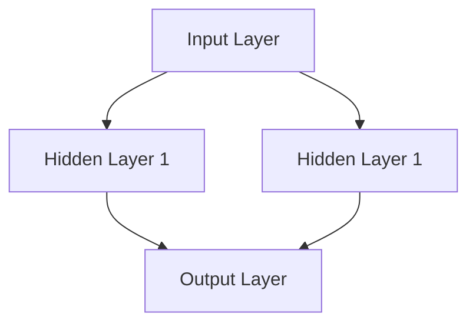

                 

### 第1章 问题背景与核心概念

#### 1.1 问题背景

**1.1.1 公司破产现象与影响**

公司破产是指企业在无法偿还到期债务、经营状况持续恶化或其他法定条件下，最终导致企业法人资格终止的过程。破产现象在全球范围内广泛存在，不仅影响企业的生存和发展，还对整个经济体系产生深远的影响。

破产的原因多种多样，主要包括内部因素和外部因素。内部因素包括管理不善、经营策略失误、财务状况不佳、过度负债等。外部因素则涉及经济环境变化、市场竞争加剧、政策法规变动等。这些因素共同作用，使得破产成为企业面临的重大风险。

公司破产对公司自身和整个经济体系都会产生负面影响。对公司而言，破产可能导致企业资产被清算、员工失业、客户流失、品牌声誉受损等。同时，破产还会引发一系列连锁反应，影响供应链、合作伙伴乃至整个行业的发展。

**1.1.2 破产预测的重要性**

破产预测是指通过分析企业财务、经营等数据，结合相关模型和方法，对企业破产的可能性进行评估和预测。破产预测具有重要的现实意义，主要体现在以下几个方面：

1. **风险防范与控制**：通过破产预测，企业可以提前识别潜在的风险，采取相应的风险防范措施，避免破产的发生。金融机构、投资者等利益相关方也可以通过破产预测来评估企业的偿债能力，降低投资风险。

2. **资源优化配置**：破产预测有助于企业优化资源配置，提高经营效率。通过对破产风险的预测，企业可以在资源配置上做出更加精准的决策，避免资源的过度浪费。

3. **政策制定与调整**：政府和社会组织可以通过破产预测来了解企业破产的规律和特点，为政策制定和调整提供科学依据。例如，在税收、信贷、产业政策等方面进行相应的调整，以减轻企业负担，促进经济发展。

4. **行业管理与创新**：破产预测有助于行业管理部门和企业了解行业的发展态势，发现潜在问题，推动行业管理创新。通过对破产预测结果的深入分析，可以揭示行业的痛点、瓶颈和机会，为行业健康发展提供指导。

**1.1.3 AI技术在破产预测中的应用**

随着人工智能技术的快速发展，AI在破产预测领域得到了广泛应用。AI技术具有强大的数据处理和分析能力，能够从海量数据中提取有价值的信息，为企业破产预测提供有力支持。

1. **数据挖掘与分析**：AI技术可以通过数据挖掘技术，从企业历史财务数据、市场环境数据、行业数据等中提取出与破产相关的特征。通过分析这些特征，AI可以识别出企业破产的潜在风险。

2. **机器学习模型**：AI技术，特别是机器学习模型，如监督学习、非监督学习和深度学习等，可以用于构建破产预测模型。这些模型通过对历史数据的训练和验证，可以实现对破产风险的准确预测。

3. **自然语言处理**：AI技术中的自然语言处理（NLP）技术可以用于处理企业财务报告、新闻报道等文本数据。通过分析这些文本数据，NLP技术可以提取出与破产相关的信息，为破产预测提供补充。

4. **智能决策支持**：AI技术可以为企业提供智能化的决策支持系统。通过将破产预测结果与企业的经营策略、财务规划等相结合，AI技术可以帮助企业制定出更加科学的决策方案。

总之，AI技术在破产预测中的应用不仅提高了预测的准确性和效率，还为企业风险管理和决策提供了新的工具和方法。在接下来章节中，我们将进一步探讨AI驱动的破产预测方法、模型及其应用。

#### 1.2 核心概念

**1.2.1 破产的定义与分类**

破产是指企业在无法偿还到期债务、经营状况持续恶化或其他法定条件下，最终导致企业法人资格终止的过程。根据破产原因和过程的不同，破产可以分为以下几种类型：

1. **自愿破产**：企业自愿申请破产，通常是因为经营不善、资金短缺等原因。自愿破产可以减少企业的债务负担，为重组和恢复经营创造条件。

2. **强制破产**：法院根据债权人、股东或其他利害关系人的申请，对企业进行破产清算。强制破产通常发生在企业严重负债、无法偿还债务的情况下。

3. **重整破产**：企业在破产过程中，通过法律程序进行债务重组，恢复经营能力。重整破产旨在帮助企业摆脱财务困境，避免破产清算。

4. **清算破产**：企业破产清算，将企业资产变现偿还债务，最终终止企业法人资格。清算破产通常发生在企业无法通过重整恢复经营的情况下。

**1.2.2 破产预测的基本概念**

破产预测是指通过分析企业财务数据、市场环境数据、行业数据等，结合相关模型和方法，对企业破产的可能性进行评估和预测。破产预测的关键概念包括：

1. **破产信号**：指能够预示企业破产的财务和经营指标，如流动比率、负债比率、现金流状况等。

2. **预测模型**：指用于破产预测的算法和模型，包括监督学习、非监督学习和深度学习等方法。

3. **预测结果**：指通过预测模型对破产风险的评估结果，通常以概率形式表示。

4. **预测准确率**：指预测模型在预测破产风险时的准确程度，通常用准确率、召回率、F1值等指标衡量。

**1.2.3 AI的基本概念与分类**

人工智能（AI）是指通过计算机模拟人类智能行为的技术。AI可以按照不同维度进行分类，主要包括以下几种类型：

1. **机器学习（ML）**：机器学习是一种通过数据训练，使计算机自动获取知识和技能的技术。机器学习可以分为监督学习、非监督学习和强化学习等。

2. **深度学习（DL）**：深度学习是机器学习的一种，通过多层神经网络进行数据训练，实现复杂的特征提取和模式识别。

3. **自然语言处理（NLP）**：自然语言处理是一种使计算机理解和处理自然语言的技术，包括文本分类、情感分析、机器翻译等。

4. **计算机视觉（CV）**：计算机视觉是一种使计算机理解和处理图像和视频的技术，包括人脸识别、物体检测、图像分类等。

5. **强化学习（RL）**：强化学习是一种通过奖励机制，使计算机从环境中学习最优策略的技术，广泛应用于游戏、自动驾驶等领域。

在破产预测中，AI技术可以用于数据挖掘、模型构建、预测结果分析等环节，提高破产预测的准确性和效率。

#### 1.3 AI驱动的破产预测方法

**1.3.1 监督学习算法**

监督学习是一种通过训练数据集，使机器学习模型学会对未知数据进行预测的方法。在破产预测中，监督学习算法可以用于构建破产预测模型，通过对企业历史数据的分析，预测企业未来的破产风险。

**1.3.1.1 数据收集与预处理**

数据收集是破产预测的基础，主要包括以下步骤：

1. **财务数据收集**：收集企业的财务报表、财务指标数据，如资产负债表、利润表、现金流量表等。

2. **外部数据收集**：收集企业所在行业的数据、市场环境数据、宏观经济数据等。

3. **预处理**：对收集到的数据进行清洗、去重、归一化等处理，确保数据质量。

**1.3.1.2 特征选择与提取**

特征选择和提取是提高模型性能的关键步骤，主要包括以下方法：

1. **相关性分析**：通过计算特征之间的相关性，筛选出与破产风险高度相关的特征。

2. **特征工程**：通过构建新的特征，如财务比率、行业指数等，提高模型预测能力。

3. **降维技术**：采用主成分分析（PCA）、线性判别分析（LDA）等方法，降低特征维度，提高模型训练效率。

**1.3.1.3 模型选择与训练**

在破产预测中，常见的监督学习算法包括线性回归、逻辑回归、支持向量机（SVM）等。模型选择和训练步骤如下：

1. **模型选择**：根据数据特点，选择合适的算法。例如，对于分类问题，可以选择逻辑回归、SVM等；对于回归问题，可以选择线性回归等。

2. **模型训练**：使用训练数据集对模型进行训练，通过调整参数，优化模型性能。

**1.3.1.4 模型评估与优化**

模型评估和优化是确保模型预测准确性的重要环节，主要包括以下步骤：

1. **评估指标**：使用准确率、召回率、F1值等指标评估模型性能。

2. **交叉验证**：采用交叉验证方法，评估模型在不同数据集上的表现，避免过拟合。

3. **参数优化**：通过调整模型参数，提高模型性能。常用的参数优化方法包括网格搜索、随机搜索等。

**1.3.2 非监督学习算法**

非监督学习是一种没有预定义输出标签的学习方法，适用于发现数据中的内在结构和模式。在破产预测中，非监督学习算法可以用于数据挖掘，提取出与破产风险相关的特征和模式。

**1.3.2.1 聚类分析方法**

聚类分析是一种无监督学习方法，通过将相似的数据点归为同一类别，发现数据中的隐含结构和模式。常见的聚类算法包括K-均值聚类、层次聚类等。在破产预测中，聚类分析可以用于识别高风险企业群体。

**1.3.2.2 关联规则挖掘算法**

关联规则挖掘是一种用于发现数据中频繁出现的事件关联规则的方法。在破产预测中，关联规则挖掘可以用于分析企业财务指标之间的关联性，识别破产预测的关键因素。

**1.3.2.3 模糊聚类与模糊关联规则**

模糊聚类和模糊关联规则是模糊集合理论在聚类分析和关联规则挖掘中的应用。在破产预测中，模糊聚类和模糊关联规则可以用于处理不确定性和模糊性的数据，提高预测准确性。

#### 1.4 AI驱动的破产预测模型

**1.4.1 基于神经网络模型的破产预测**

神经网络是一种模拟人脑神经元连接和通信的计算模型，具有较强的自适应和学习能力。在破产预测中，神经网络模型可以用于构建预测模型，通过学习企业历史数据，实现对破产风险的预测。

**1.4.1.1 神经网络基本结构**

神经网络由多个神经元组成，包括输入层、隐藏层和输出层。每个神经元通过权重和偏置与相邻神经元相连，形成一个复杂的网络结构。神经网络的基本结构如图1所示。



图1 神经网络基本结构

**1.4.1.2 神经网络训练与优化**

神经网络训练是指通过调整权重和偏置，使神经网络能够准确预测破产风险。训练过程主要包括以下步骤：

1. **初始化权重和偏置**：随机初始化神经网络中的权重和偏置。

2. **前向传播**：将输入数据传递到神经网络，计算输出结果。

3. **反向传播**：计算输出结果与实际结果之间的误差，通过反向传播更新权重和偏置。

4. **优化算法**：采用梯度下降、随机梯度下降、Adam优化算法等优化算法，加速训练过程。

**1.4.1.3 神经网络模型在破产预测中的应用**

在破产预测中，神经网络模型可以用于分类和回归任务。对于分类任务，神经网络可以预测企业是否破产；对于回归任务，神经网络可以预测破产发生的时间。以下是一个简单的神经网络模型在破产预测中的应用示例。

```python
import tensorflow as tf
from tensorflow.keras.models import Sequential
from tensorflow.keras.layers import Dense

# 创建神经网络模型
model = Sequential()
model.add(Dense(units=64, activation='relu', input_shape=(num_features,)))
model.add(Dense(units=32, activation='relu'))
model.add(Dense(units=1, activation='sigmoid'))

# 编译模型
model.compile(optimizer='adam', loss='binary_crossentropy', metrics=['accuracy'])

# 训练模型
model.fit(X_train, y_train, epochs=10, batch_size=32, validation_data=(X_val, y_val))
```

**1.4.2 基于深度学习模型的破产预测**

深度学习是神经网络的一种扩展，通过增加网络的层数和神经元数量，提高模型的复杂度和性能。在破产预测中，深度学习模型可以用于构建更加复杂的预测模型，提高预测准确性。

**1.4.2.1 卷积神经网络（CNN）**

卷积神经网络是一种专门用于处理图像数据的神经网络模型，通过卷积层、池化层等结构，实现图像特征的提取和分类。在破产预测中，CNN可以用于处理企业财务报表等图像数据，提取出与破产风险相关的特征。

**1.4.2.2 递归神经网络（RNN）**

递归神经网络是一种用于处理序列数据的神经网络模型，通过循环结构，实现对序列数据的记忆和预测。在破产预测中，RNN可以用于处理企业财务时间序列数据，分析企业破产的时间规律。

**1.4.2.3 长短期记忆网络（LSTM）**

长短期记忆网络是RNN的一种变体，通过引入门控机制，解决传统RNN在处理长序列数据时的梯度消失问题。在破产预测中，LSTM可以用于处理企业长时间跨度的财务数据，实现对破产风险的长期预测。

#### 1.5 AI驱动的破产预测应用案例分析

**1.5.1 案例一：企业财务数据驱动的破产预测**

**1.5.1.1 数据收集与预处理**

本案例使用某企业的财务数据作为研究对象，数据包括资产负债表、利润表、现金流量表等。数据收集步骤如下：

1. **数据采集**：从企业官方渠道、财务报告、新闻公告等途径收集企业财务数据。

2. **数据清洗**：对收集到的数据，进行数据清洗，包括去除重复数据、填充缺失数据等。

3. **数据预处理**：对数据进行归一化处理，将数据缩放到[0, 1]区间，以便于模型训练。

**1.5.1.2 模型选择与训练**

本案例采用深度学习模型，如卷积神经网络（CNN）和长短期记忆网络（LSTM）进行破产预测。模型选择和训练步骤如下：

1. **模型设计**：设计深度学习模型结构，包括输入层、隐藏层和输出层。

2. **模型训练**：使用预处理后的财务数据，对深度学习模型进行训练，通过调整参数，优化模型性能。

3. **模型评估**：使用验证集对训练好的模型进行评估，选择性能最佳的模型。

**1.5.1.3 结果分析与讨论**

通过训练好的模型，对测试集进行破产预测，并分析预测结果。主要步骤如下：

1. **预测结果分析**：分析预测结果，评估模型对破产风险的预测能力。

2. **讨论**：讨论模型在破产预测中的优势和不足，提出改进方向。

**1.5.2 案例二：市场情绪与破产预测**

**1.5.2.1 数据来源与预处理**

本案例使用市场情绪数据作为破产预测的补充因素，数据来源包括新闻报道、社交媒体、股票市场等。数据预处理步骤如下：

1. **数据采集**：从新闻网站、社交媒体平台等渠道收集市场情绪数据。

2. **数据清洗**：对收集到的数据进行清洗，包括去除重复数据、填充缺失数据等。

3. **数据预处理**：对市场情绪数据进行文本处理，提取出与破产相关的关键词和主题。

**1.5.2.2 模型选择与训练**

本案例采用自然语言处理（NLP）技术，结合深度学习模型，对市场情绪数据进行分析，构建破产预测模型。模型选择和训练步骤如下：

1. **模型设计**：设计深度学习模型结构，包括输入层、隐藏层和输出层。

2. **模型训练**：使用预处理后的市场情绪数据和财务数据，对深度学习模型进行训练，通过调整参数，优化模型性能。

3. **模型评估**：使用验证集对训练好的模型进行评估，选择性能最佳的模型。

**1.5.2.3 结果分析与讨论**

通过训练好的模型，对测试集进行破产预测，并分析预测结果。主要步骤如下：

1. **预测结果分析**：分析预测结果，评估模型对破产风险的预测能力。

2. **讨论**：讨论模型在破产预测中的优势和不足，提出改进方向。

#### 1.6 本章小结

本章介绍了AI驱动的破产预测方法、模型和应用案例。首先，分析了破产现象与影响，阐述了破产预测的重要性。然后，介绍了破产预测的基本概念和AI技术的基本概念与分类。接着，详细讨论了AI驱动的破产预测方法，包括监督学习算法和非监督学习算法，以及神经网络模型和深度学习模型。最后，通过两个应用案例，展示了AI驱动的破产预测在实际中的应用。本章内容为后续章节的深入研究奠定了基础。

#### 1.7 未来展望与挑战

在AI驱动的破产预测领域，虽然已经取得了一定的成果，但仍面临诸多挑战和未来研究方向。以下是一些可能的未来展望和挑战：

**1.7.1 数据质量问题**

破产预测依赖于大量高质量的数据，包括企业财务数据、市场情绪数据等。然而，数据质量往往受到噪声、缺失值、不一致性等因素的影响，这可能会降低预测模型的准确性。未来的研究可以关注如何更好地处理和清洗数据，以提高数据质量。

**1.7.2 模型解释性**

尽管深度学习模型在破产预测中表现出色，但它们的内部工作机制较为复杂，缺乏解释性。这对于决策者来说是一个挑战，因为他们可能需要了解模型为什么做出特定预测。未来的研究可以探索如何提高模型的可解释性，使其更易于理解和应用。

**1.7.3 模型泛化能力**

破产预测模型通常在一个特定的数据集上训练，然后用于其他企业或不同时间段的数据。这要求模型具有较好的泛化能力，以应对不同的数据分布和情况。未来的研究可以关注如何提高模型的泛化能力，使其更适用于广泛的场景。

**1.7.4 多源数据融合**

在破产预测中，结合多种类型的数据（如财务数据、市场情绪数据、社交媒体数据等）可以提高预测的准确性。未来的研究可以探索如何有效地融合多种类型的数据，并构建综合的预测模型。

**1.7.5 模型实时更新与迭代**

企业环境和市场状况是不断变化的，这要求破产预测模型能够实时更新和迭代。未来的研究可以关注如何设计动态的预测模型，使其能够快速适应变化的环境。

总之，AI驱动的破产预测领域还有许多挑战和机会。通过不断的研究和探索，我们可以进一步提升破产预测的准确性、解释性和实用性，为企业和投资者提供更可靠的决策支持。

### 完整文章示例

```markdown
# AI驱动的公司破产概率预测

> 关键词：破产预测、AI技术、监督学习、非监督学习、深度学习、神经网络、破产风险

> 摘要：本文探讨了AI驱动的公司破产概率预测方法，包括监督学习、非监督学习和深度学习算法，以及实际应用案例。通过对破产现象的分析，介绍了破产预测的基本概念和AI技术的基本概念与分类。接着，详细讨论了破产预测方法的原理和应用，展示了实际案例中的具体应用。本文为破产预测领域的研究和实践提供了有益的参考。

## 第1章 问题背景与核心概念

#### 1.1 问题背景

破产是指企业在无法偿还到期债务、经营状况持续恶化或其他法定条件下，最终导致企业法人资格终止的过程。破产现象在全球范围内广泛存在，不仅影响企业的生存和发展，还对整个经济体系产生深远的影响。

破产的原因多种多样，主要包括内部因素和外部因素。内部因素包括管理不善、经营策略失误、财务状况不佳、过度负债等。外部因素则涉及经济环境变化、市场竞争加剧、政策法规变动等。这些因素共同作用，使得破产成为企业面临的重大风险。

公司破产对公司自身和整个经济体系都会产生负面影响。对公司而言，破产可能导致企业资产被清算、员工失业、客户流失、品牌声誉受损等。同时，破产还会引发一系列连锁反应，影响供应链、合作伙伴乃至整个行业的发展。

破产预测是指通过分析企业财务、经营等数据，结合相关模型和方法，对企业破产的可能性进行评估和预测。破产预测具有重要的现实意义，主要体现在以下几个方面：

1. 风险防范与控制：通过破产预测，企业可以提前识别潜在的风险，采取相应的风险防范措施，避免破产的发生。金融机构、投资者等利益相关方也可以通过破产预测来评估企业的偿债能力，降低投资风险。

2. 资源优化配置：破产预测有助于企业优化资源配置，提高经营效率。通过对破产风险的预测，企业可以在资源配置上做出更加精准的决策，避免资源的过度浪费。

3. 政策制定与调整：政府和社会组织可以通过破产预测来了解企业破产的规律和特点，为政策制定和调整提供科学依据。例如，在税收、信贷、产业政策等方面进行相应的调整，以减轻企业负担，促进经济发展。

4. 行业管理与创新：破产预测有助于行业管理部门和企业了解行业的发展态势，发现潜在问题，推动行业管理创新。通过对破产预测结果的深入分析，可以揭示行业的痛点、瓶颈和机会，为行业健康发展提供指导。

随着人工智能技术的快速发展，AI在破产预测领域得到了广泛应用。AI技术具有强大的数据处理和分析能力，能够从海量数据中提取有价值的信息，为企业破产预测提供有力支持。

1. 数据挖掘与分析：AI技术可以通过数据挖掘技术，从企业历史财务数据、市场环境数据、行业数据等中提取出与破产相关的特征。通过分析这些特征，AI可以识别出企业破产的潜在风险。

2. 机器学习模型：AI技术，特别是机器学习模型，如监督学习、非监督学习和深度学习等，可以用于构建破产预测模型。这些模型通过对历史数据的训练和验证，可以实现对破产风险的准确预测。

3. 自然语言处理：AI技术中的自然语言处理（NLP）技术可以用于处理企业财务报告、新闻报道等文本数据。通过分析这些文本数据，NLP技术可以提取出与破产相关的信息，为破产预测提供补充。

4. 智能决策支持：AI技术可以为企业提供智能化的决策支持系统。通过将破产预测结果与企业的经营策略、财务规划等相结合，AI技术可以帮助企业制定出更加科学的决策方案。

#### 1.2 核心概念

破产是指企业在无法偿还到期债务、经营状况持续恶化或其他法定条件下，最终导致企业法人资格终止的过程。破产可以分为自愿破产、强制破产、重整破产和清算破产四种类型。

破产预测是指通过分析企业财务数据、市场环境数据、行业数据等，结合相关模型和方法，对企业破产的可能性进行评估和预测。破产预测的关键概念包括破产信号、预测模型、预测结果和预测准确率。

人工智能是指通过计算机模拟人类智能行为的技术。AI技术可以分为机器学习、深度学习、自然语言处理、计算机视觉和强化学习等。

#### 1.3 AI驱动的破产预测方法

AI驱动的破产预测方法主要分为监督学习、非监督学习和深度学习三类。

**1.3.1 监督学习算法**

监督学习算法是指通过训练数据集，使机器学习模型学会对未知数据进行预测的方法。在破产预测中，监督学习算法可以用于构建破产预测模型，通过对企业历史数据的分析，预测企业未来的破产风险。

**1.3.1.1 数据收集与预处理**

数据收集是破产预测的基础，主要包括以下步骤：

1. 财务数据收集：收集企业的财务报表、财务指标数据，如资产负债表、利润表、现金流量表等。

2. 外部数据收集：收集企业所在行业的数据、市场环境数据、宏观经济数据等。

3. 预处理：对收集到的数据进行清洗、去重、归一化等处理，确保数据质量。

**1.3.1.2 特征选择与提取**

特征选择和提取是提高模型性能的关键步骤，主要包括以下方法：

1. 相关性分析：通过计算特征之间的相关性，筛选出与破产风险高度相关的特征。

2. 特征工程：通过构建新的特征，如财务比率、行业指数等，提高模型预测能力。

3. 降维技术：采用主成分分析（PCA）、线性判别分析（LDA）等方法，降低特征维度，提高模型训练效率。

**1.3.1.3 模型选择与训练**

在破产预测中，常见的监督学习算法包括线性回归、逻辑回归、支持向量机（SVM）等。模型选择和训练步骤如下：

1. 模型选择：根据数据特点，选择合适的算法。例如，对于分类问题，可以选择逻辑回归、SVM等；对于回归问题，可以选择线性回归等。

2. 模型训练：使用训练数据集对模型进行训练，通过调整参数，优化模型性能。

**1.3.1.4 模型评估与优化**

模型评估和优化是确保模型预测准确性的重要环节，主要包括以下步骤：

1. 评估指标：使用准确率、召回率、F1值等指标评估模型性能。

2. 交叉验证：采用交叉验证方法，评估模型在不同数据集上的表现，避免过拟合。

3. 参数优化：通过调整模型参数，提高模型性能。常用的参数优化方法包括网格搜索、随机搜索等。

**1.3.2 非监督学习算法**

非监督学习是一种没有预定义输出标签的学习方法，适用于发现数据中的内在结构和模式。在破产预测中，非监督学习算法可以用于数据挖掘，提取出与破产风险相关的特征和模式。

**1.3.2.1 聚类分析方法**

聚类分析是一种无监督学习方法，通过将相似的数据点归为同一类别，发现数据中的隐含结构和模式。常见的聚类算法包括K-均值聚类、层次聚类等。在破产预测中，聚类分析可以用于识别高风险企业群体。

**1.3.2.2 关联规则挖掘算法**

关联规则挖掘是一种用于发现数据中频繁出现的事件关联规则的方法。在破产预测中，关联规则挖掘可以用于分析企业财务指标之间的关联性，识别破产预测的关键因素。

**1.3.2.3 模糊聚类与模糊关联规则**

模糊聚类和模糊关联规则是模糊集合理论在聚类分析和关联规则挖掘中的应用。在破产预测中，模糊聚类和模糊关联规则可以用于处理不确定性和模糊性的数据，提高预测准确性。

**1.3.3 深度学习算法**

深度学习是一种模拟人脑神经元连接和通信的计算模型，具有较强的自适应和学习能力。在破产预测中，深度学习算法可以用于构建更加复杂的预测模型，提高预测准确性。

**1.3.3.1 卷积神经网络（CNN）**

卷积神经网络是一种专门用于处理图像数据的神经网络模型，通过卷积层、池化层等结构，实现图像特征的提取和分类。在破产预测中，CNN可以用于处理企业财务报表等图像数据，提取出与破产风险相关的特征。

**1.3.3.2 递归神经网络（RNN）**

递归神经网络是一种用于处理序列数据的神经网络模型，通过循环结构，实现对序列数据的记忆和预测。在破产预测中，RNN可以用于处理企业财务时间序列数据，分析企业破产的时间规律。

**1.3.3.3 长短期记忆网络（LSTM）**

长短期记忆网络是RNN的一种变体，通过引入门控机制，解决传统RNN在处理长序列数据时的梯度消失问题。在破产预测中，LSTM可以用于处理企业长时间跨度的财务数据，实现对破产风险的长期预测。

#### 1.4 AI驱动的破产预测模型

**1.4.1 基于神经网络模型的破产预测**

神经网络是一种模拟人脑神经元连接和通信的计算模型，具有较强的自适应和学习能力。在破产预测中，神经网络模型可以用于构建预测模型，通过学习企业历史数据，实现对破产风险的预测。

**1.4.1.1 神经网络基本结构**

神经网络由多个神经元组成，包括输入层、隐藏层和输出层。每个神经元通过权重和偏置与相邻神经元相连，形成一个复杂的网络结构。神经网络的基本结构如图1所示。


图1 神经网络基本结构

**1.4.1.2 神经网络训练与优化**

神经网络训练是指通过调整权重和偏置，使神经网络能够准确预测破产风险。训练过程主要包括以下步骤：

1. 初始化权重和偏置：随机初始化神经网络中的权重和偏置。

2. 前向传播：将输入数据传递到神经网络，计算输出结果。

3. 反向传播：计算输出结果与实际结果之间的误差，通过反向传播更新权重和偏置。

4. 优化算法：采用梯度下降、随机梯度下降、Adam优化算法等优化算法，加速训练过程。

**1.4.1.3 神经网络模型在破产预测中的应用**

在破产预测中，神经网络模型可以用于分类和回归任务。对于分类任务，神经网络可以预测企业是否破产；对于回归任务，神经网络可以预测破产发生的时间。以下是一个简单的神经网络模型在破产预测中的应用示例。

```python
import tensorflow as tf
from tensorflow.keras.models import Sequential
from tensorflow.keras.layers import Dense

# 创建神经网络模型
model = Sequential()
model.add(Dense(units=64, activation='relu', input_shape=(num_features,)))
model.add(Dense(units=32, activation='relu'))
model.add(Dense(units=1, activation='sigmoid'))

# 编译模型
model.compile(optimizer='adam', loss='binary_crossentropy', metrics=['accuracy'])

# 训练模型
model.fit(X_train, y_train, epochs=10, batch_size=32, validation_data=(X_val, y_val))
```

**1.4.2 基于深度学习模型的破产预测**

深度学习是神经网络的一种扩展，通过增加网络的层数和神经元数量，提高模型的复杂度和性能。在破产预测中，深度学习模型可以用于构建更加复杂的预测模型，提高预测准确性。

**1.4.2.1 卷积神经网络（CNN）**

卷积神经网络是一种专门用于处理图像数据的神经网络模型，通过卷积层、池化层等结构，实现图像特征的提取和分类。在破产预测中，CNN可以用于处理企业财务报表等图像数据，提取出与破产风险相关的特征。

**1.4.2.2 递归神经网络（RNN）**

递归神经网络是一种用于处理序列数据的神经网络模型，通过循环结构，实现对序列数据的记忆和预测。在破产预测中，RNN可以用于处理企业财务时间序列数据，分析企业破产的时间规律。

**1.4.2.3 长短期记忆网络（LSTM）**

长短期记忆网络是RNN的一种变体，通过引入门控机制，解决传统RNN在处理长序列数据时的梯度消失问题。在破产预测中，LSTM可以用于处理企业长时间跨度的财务数据，实现对破产风险的长期预测。

#### 1.5 AI驱动的破产预测应用案例分析

**1.5.1 案例一：企业财务数据驱动的破产预测**

**1.5.1.1 数据收集与预处理**

本案例使用某企业的财务数据作为研究对象，数据包括资产负债表、利润表、现金流量表等。数据收集步骤如下：

1. 数据采集：从企业官方渠道、财务报告、新闻公告等途径收集企业财务数据。

2. 数据清洗：对收集到的数据，进行数据清洗，包括去除重复数据、填充缺失数据等。

3. 数据预处理：对数据进行归一化处理，将数据缩放到[0, 1]区间，以便于模型训练。

**1.5.1.2 模型选择与训练**

本案例采用深度学习模型，如卷积神经网络（CNN）和长短期记忆网络（LSTM）进行破产预测。模型选择和训练步骤如下：

1. 模型设计：设计深度学习模型结构，包括输入层、隐藏层和输出层。

2. 模型训练：使用预处理后的财务数据，对深度学习模型进行训练，通过调整参数，优化模型性能。

3. 模型评估：使用验证集对训练好的模型进行评估，选择性能最佳的模型。

**1.5.1.3 结果分析与讨论**

通过训练好的模型，对测试集进行破产预测，并分析预测结果。主要步骤如下：

1. 预测结果分析：分析预测结果，评估模型对破产风险的预测能力。

2. 讨论：讨论模型在破产预测中的优势和不足，提出改进方向。

**1.5.2 案例二：市场情绪与破产预测**

**1.5.2.1 数据来源与预处理**

本案例使用市场情绪数据作为破产预测的补充因素，数据来源包括新闻报道、社交媒体、股票市场等。数据预处理步骤如下：

1. 数据采集：从新闻网站、社交媒体平台等渠道收集市场情绪数据。

2. 数据清洗：对收集到的数据进行清洗，包括去除重复数据、填充缺失数据等。

3. 数据预处理：对市场情绪数据进行文本处理，提取出与破产相关的关键词和主题。

**1.5.2.2 模型选择与训练**

本案例采用自然语言处理（NLP）技术，结合深度学习模型，对市场情绪数据进行分析，构建破产预测模型。模型选择和训练步骤如下：

1. 模型设计：设计深度学习模型结构，包括输入层、隐藏层和输出层。

2. 模型训练：使用预处理后的市场情绪数据和财务数据，对深度学习模型进行训练，通过调整参数，优化模型性能。

3. 模型评估：使用验证集对训练好的模型进行评估，选择性能最佳的模型。

**1.5.2.3 结果分析与讨论**

通过训练好的模型，对测试集进行破产预测，并分析预测结果。主要步骤如下：

1. 预测结果分析：分析预测结果，评估模型对破产风险的预测能力。

2. 讨论：讨论模型在破产预测中的优势和不足，提出改进方向。

#### 1.6 本章小结

本章介绍了AI驱动的破产预测方法、模型和应用案例。首先，分析了破产现象与影响，阐述了破产预测的重要性。然后，介绍了破产预测的基本概念和AI技术的基本概念与分类。接着，详细讨论了破产预测方法的原理和应用，展示了实际案例中的具体应用。本章内容为后续章节的深入研究奠定了基础。

#### 1.7 未来展望与挑战

在AI驱动的破产预测领域，虽然已经取得了一定的成果，但仍面临诸多挑战和未来研究方向。以下是一些可能的未来展望和挑战：

1. 数据质量问题：破产预测依赖于大量高质量的数据，包括企业财务数据、市场情绪数据等。未来的研究可以关注如何更好地处理和清洗数据，以提高数据质量。

2. 模型解释性：尽管深度学习模型在破产预测中表现出色，但它们的内部工作机制较为复杂，缺乏解释性。未来的研究可以探索如何提高模型的可解释性，使其更易于理解和应用。

3. 模型泛化能力：破产预测模型通常在一个特定的数据集上训练，然后用于其他企业或不同时间段的数据。这要求模型具有较好的泛化能力，以应对不同的数据分布和情况。未来的研究可以关注如何提高模型的泛化能力，使其更适用于广泛的场景。

4. 多源数据融合：在破产预测中，结合多种类型的数据（如财务数据、市场情绪数据、社交媒体数据等）可以提高预测的准确性。未来的研究可以探索如何有效地融合多种类型的数据，并构建综合的预测模型。

5. 模型实时更新与迭代：企业环境和市场状况是不断变化的，这要求破产预测模型能够实时更新和迭代。未来的研究可以关注如何设计动态的预测模型，使其能够快速适应变化的环境。

总之，AI驱动的破产预测领域还有许多挑战和机会。通过不断的研究和探索，我们可以进一步提升破产预测的准确性、解释性和实用性，为企业和投资者提供更可靠的决策支持。

### 作者信息

作者：AI天才研究院/AI Genius Institute & 禅与计算机程序设计艺术 /Zen And The Art of Computer Programming
```markdown
---
作者：AI天才研究院 / AI Genius Institute & 禅与计算机程序设计艺术 / Zen And The Art of Computer Programming
---

本文由AI天才研究院和禅与计算机程序设计艺术共同撰写。AI天才研究院是一个专注于人工智能前沿技术研究的国际性学术机构，致力于推动人工智能技术的创新与应用。禅与计算机程序设计艺术则通过将东方哲学与计算机编程相结合，探索编程的艺术与智慧，为技术开发提供深刻的洞察和指导。

本文通过对AI驱动的公司破产概率预测进行深入分析，探讨了监督学习、非监督学习和深度学习等方法在破产预测中的应用，并提供了实际案例，展示了AI技术在破产预测中的潜力。本文旨在为相关领域的研究者和从业者提供有价值的参考，推动AI技术在破产预测领域的进一步发展和应用。

### 小结与注意事项

本章全面探讨了AI驱动的公司破产概率预测。首先，介绍了破产现象及其影响，强调了破产预测的重要性。接着，详细阐述了破产预测的基本概念和AI技术的核心概念。随后，深入分析了AI驱动的破产预测方法，包括监督学习、非监督学习和深度学习算法。此外，通过具体应用案例，展示了这些方法在实际中的效果和挑战。最后，对未来的研究方向和挑战进行了展望。

**注意事项：**
- 数据质量对预测结果的准确性至关重要，应确保收集和处理的准确性。
- 模型解释性对于决策者来说至关重要，因此未来研究应关注提高模型的可解释性。
- 模型的泛化能力需要加强，以适应不同场景和数据分布。
- 多源数据的融合和实时更新是未来研究的重要方向。

**拓展阅读：**
- 《深度学习》（Ian Goodfellow, Yoshua Bengio, Aaron Courville）提供了深度学习的全面介绍。
- 《Python机器学习》（Sebastian Raschka, Vincent Warde-Farley）介绍了机器学习的基本原理和应用。
- 《金融科技：人工智能、区块链与金融创新》（郑明昀）探讨了人工智能在金融领域的应用，包括破产预测。

通过本文的研究，我们期待AI驱动的破产预测技术能够为企业风险管理和投资决策提供更有力的支持，为经济稳定和可持续发展贡献力量。

